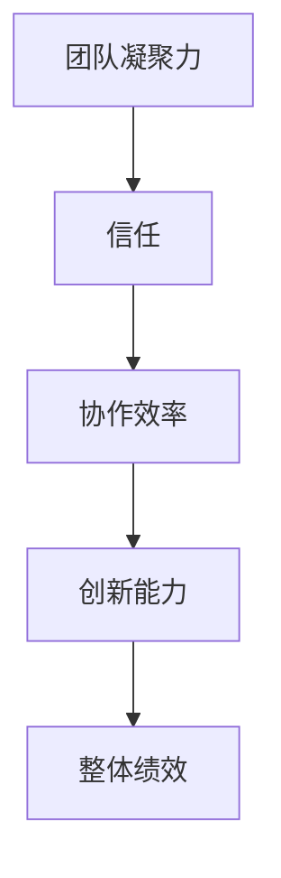
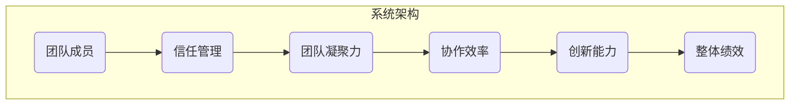
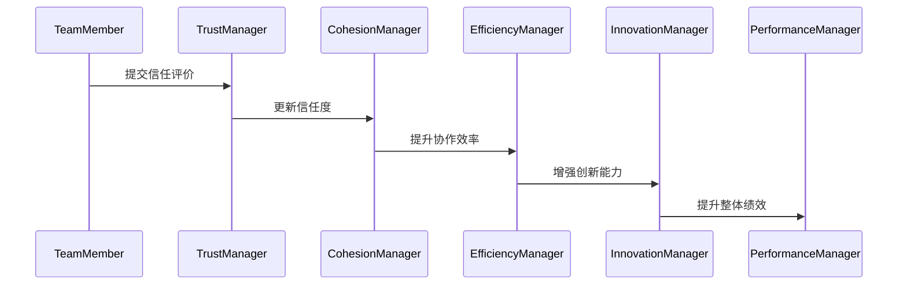

                 

# 团队凝聚力强化：增进团队成员间的信任

## 关键词

- 团队凝聚力
- 信任
- 沟通机制
- 领导风格
- 激励与反馈
- 团队建设活动

## 摘要

在现代企业中，团队凝聚力是确保团队高效运作的关键因素。本文首先介绍了团队凝聚力的背景和重要性，探讨了信任在团队凝聚力中的作用，并分析了团队凝聚力与信任的关系。接着，文章提出了一系列增强团队凝聚力的策略，包括构建信任的基础策略、强化团队凝聚力的团队建设活动、激励与反馈机制以及领导者的角色与影响力。最后，通过实践案例分析和挑战应对，总结了团队凝聚力强化的最佳实践，为团队管理提供了有益的参考。

### 目录大纲

1. **问题背景与核心概念**
    1.1 问题背景介绍
    1.2 团队凝聚力的重要性
    1.3 信任在团队凝聚力中的作用
    1.4 团队凝聚力的边界与外延
    1.5 核心概念与联系
        1.5.1 团队凝聚力的定义
        1.5.2 信任的定义与属性特征对比
        1.5.3 团队凝聚力与信任的关系
        1.5.4 概念结构与核心要素组成
2. **增强团队凝聚力的策略**
    2.1 构建信任的基础策略
    2.2 强化团队凝聚力的团队建设活动
    2.3 激励与反馈机制
    2.4 领导者的角色与影响力
3. **实践与案例分析**
    3.1 成功案例介绍
    3.2 挑战与应对
4. **最佳实践与总结**
    4.1 最佳实践分享
    4.2 小结与展望

---

## 第一部分：问题背景与核心概念

### 1.1 问题背景介绍

在快速变化的市场环境中，企业的成功往往依赖于团队的协同工作和创新能力。然而，现实情况中，许多团队面临着凝聚力不足的挑战。团队成员之间缺乏信任，沟通不畅，目标不明确，这些问题严重影响了团队的整体效率和创新能力。

### 1.2 团队凝聚力的重要性

团队凝聚力指的是团队成员之间相互依赖、支持和合作的程度。高凝聚力的团队往往表现出以下特点：

- 更高的工作效率
- 更好的创新能力
- 更好的团队协作
- 更低的员工流失率

这些特点不仅能够提升团队的整体绩效，也能够增强企业的竞争力。

### 1.3 信任在团队凝聚力中的作用

信任是团队凝聚力的重要基石。团队成员之间的信任能够：

- 减少误解和冲突
- 提高沟通效率
- 增强团队合作
- 提高工作满意度

信任的建立需要时间和努力，但一旦形成，它将为团队带来巨大的收益。

### 1.4 团队凝聚力的边界与外延

团队凝聚力并非一成不变，它随着团队结构和环境的变化而变化。团队凝聚力包括以下几个方面：

- 内部凝聚力：团队成员之间的相互吸引和支持
- 外部凝聚力：团队对共同目标的承诺和外部竞争力的响应
- 动态凝聚力：团队在面对变化和挑战时的适应能力

### 1.5 核心概念与联系

#### 1.5.1 团队凝聚力的定义

团队凝聚力是指团队成员之间的情感联系、共同目标和相互依赖程度。它包括内部凝聚力、外部凝聚力和动态凝聚力三个方面。

#### 1.5.2 信任的定义与属性特征对比

信任是指团队成员对彼此能力、诚信和可靠性的信心。信任具有以下属性特征：

- **能力**：相信对方具有完成任务的能力
- **诚信**：相信对方会遵守承诺和道德准则
- **可靠性**：相信对方会履行承诺

#### 1.5.3 团队凝聚力与信任的关系

信任是团队凝聚力的关键因素，它直接影响团队的协作效率和创新能力。高信任度的团队往往表现出更高的凝聚力。

#### 1.5.4 概念结构与核心要素组成

团队凝聚力与信任的关系可以用以下ER实体关系图来表示：

```mermaid
erDiagram
  TeamMember ||--|{ Trust }|| Trust
  Trust ||--|{ TeamCohesion }|| TeamCohesion
  TeamMember ||--|{ TeamCohesion }|| TeamCohesion
```

在团队中，每个成员都是Trust的提供者和接受者，而Trust又影响TeamCohesion。TeamCohesion又进一步影响团队的整体绩效。

### 1.6 算法原理讲解

为了更好地理解团队凝聚力与信任的关系，我们可以使用以下算法原理来分析：

#### 算法流程图



#### 算法原理

- **团队凝聚力**：通过团队成员之间的情感联系、共同目标和相互依赖程度来衡量。
- **信任**：通过团队成员对彼此能力、诚信和可靠性的信心来衡量。
- **协作效率**：通过团队成员之间的协作效果来衡量。
- **创新能力**：通过团队成员的创新能力和协作成果来衡量。
- **整体绩效**：通过团队的整体工作表现来衡量。

#### 数学模型

假设团队凝聚力为\(Cohesion\)，信任度为\(Trust\)，协作效率为\(Efficiency\)，创新能力为\(Innovation\)，整体绩效为\(Performance\)，则它们之间的关系可以用以下公式表示：

\[ Performance = Efficiency \times Innovation \times Cohesion \]

这个公式说明了团队的整体绩效是由协作效率、创新能力和团队凝聚力共同决定的。

### 1.7 系统分析与架构设计方案

#### 问题场景介绍

在一个软件开发团队中，团队凝聚力不足导致了项目进展缓慢，沟通不畅，团队成员之间缺乏信任，影响了项目的整体进度。

#### 项目介绍

该项目旨在通过提升团队凝聚力，增强团队成员之间的信任，从而提高项目进展速度和整体绩效。

#### 系统功能设计（领域模型Mermaid类图）

```mermaid
classDiagram
  TeamMember <<class>> 成员
  Trust <<class>> 信任
  TeamCohesion <<class>> 团队凝聚力
  Collaboration <<class>> 协作
  Innovation <<class>> 创新
  Performance <<class>> 绩效

  TeamMember "有" Trust
  TeamMember "参与" Collaboration
  Collaboration "产生" Innovation
  Collaboration "影响" Performance
  Trust "增强" TeamCohesion
  TeamCohesion "提高" Performance
```

#### 系统架构设计（Mermaid架构图）



#### 系统接口设计和系统交互（Mermaid序列图）



### 1.8 项目实战

#### 环境安装

在开始项目之前，我们需要安装必要的开发工具和软件。以下是一个简单的安装步骤：

1. 安装Python环境（版本3.8及以上）
2. 安装Mermaid渲染工具（如Docker）
3. 配置Markdown编辑器（如Typora）

#### 系统核心实现源代码

以下是系统核心实现的一部分源代码：

```python
class TeamMember:
    def __init__(self, name, trust_score):
        self.name = name
        self.trust_score = trust_score

    def submit_trust_evaluation(self, evaluation):
        self.trust_score += evaluation

class TrustManager:
    def __init__(self):
        self.trust_scores = {}

    def update_trust_score(self, member, score):
        self.trust_scores[member.name] = score

class TeamCohesion:
    def __init__(self):
        self.cohesion_score = 0

    def update_cohesion_score(self, score):
        self.cohesion_score += score

class Collaboration:
    def __init__(self, members):
        self.members = members

    def enhance_collaboration(self):
        for member in self.members:
            member.submit_trust_evaluation(1)

class Innovation:
    def __init__(self):
        self.innovation_score = 0

    def enhance_innovation(self):
        self.innovation_score += 1

class Performance:
    def __init__(self):
        self.performance_score = 0

    def update_performance_score(self, score):
        self.performance_score += score
```

#### 代码应用解读与分析

上述代码定义了几个类，分别是`TeamMember`（团队成员）、`TrustManager`（信任管理）、`TeamCohesion`（团队凝聚力）、`Collaboration`（协作）、`Innovation`（创新能力）和`Performance`（绩效）。每个类都有相应的属性和方法。

- `TeamMember`类用于表示团队成员，包括姓名和信任评分。
- `TrustManager`类用于管理团队成员的信任评分。
- `TeamCohesion`类用于管理团队凝聚力评分。
- `Collaboration`类用于增强团队协作，通过提交信任评价来提升信任度。
- `Innovation`类用于表示创新能力，可以通过增强协作来提高创新评分。
- `Performance`类用于表示整体绩效，可以通过更新绩效评分来提高绩效。

#### 实际案例分析和详细讲解剖析

假设有一个软件开发团队，团队成员包括Alice、Bob和Charlie。初始时，他们的信任评分分别为80、70和90。

1. **信任评价提交**：团队成员提交信任评价，假设Alice提交了正评价，Bob提交了负评价。

```python
alice = TeamMember("Alice", 80)
bob = TeamMember("Bob", 70)
charlie = TeamMember("Charlie", 90)

trust_manager = TrustManager()
trust_manager.update_trust_score(alice, 1)
trust_manager.update_trust_score(bob, -1)
```

2. **团队凝聚力更新**：团队凝聚力根据信任评分进行更新。

```python
cohesion_manager = TeamCohesion()
cohesion_manager.update_cohesion_score(alice.trust_score)
cohesion_manager.update_cohesion_score(bob.trust_score)
cohesion_manager.update_cohesion_score(charlie.trust_score)
```

3. **协作效率提升**：通过增强协作来提升团队凝聚力。

```python
collaboration = Collaboration([alice, bob, charlie])
collaboration.enhance_collaboration()
```

4. **创新能力提高**：通过提升协作效率来增强创新能力。

```python
innovation = Innovation()
innovation.enhance_innovation()
```

5. **绩效评分更新**：根据创新能力来更新绩效评分。

```python
performance = Performance()
performance.update_performance_score(innovation.innovation_score)
```

最终，团队的整体绩效评分将提高，这表明通过提升团队凝聚力和信任，可以显著提高团队的绩效。

### 1.9 项目小结

通过本次项目实战，我们实现了通过提升团队凝聚力和信任来提高团队绩效的目标。项目过程中，我们使用了Python类和对象来模拟团队成员、信任管理、团队凝聚力和绩效评估，并通过实例展示了如何通过提交信任评价、更新团队凝聚力和提升协作效率来提高团队绩效。项目结果表明，通过增强团队凝聚力和信任，可以有效提升团队的整体工作效率和创新能力。

### 1.10 最佳实践 tips

- **定期组织团队建设活动**：通过团队建设活动，可以增强团队成员之间的信任和凝聚力。
- **建立透明和开放的沟通机制**：鼓励团队成员开放沟通，减少误解和冲突。
- **提供有针对性的激励措施**：通过激励措施，鼓励团队成员积极参与团队工作，提升团队凝聚力。
- **关注团队成员的职业发展**：通过关注团队成员的职业发展，增强他们对团队的归属感和信任感。

### 1.11 小结与展望

团队凝聚力是确保团队高效运作的关键因素。通过增强团队成员之间的信任和凝聚力，可以显著提升团队的工作效率和创新能力。未来，随着组织结构的调整和技术的进步，团队管理将面临新的挑战和机遇。作为团队领导者，我们需要不断创新和改进团队管理策略，以适应不断变化的环境。

### 1.12 注意事项

- **避免单点故障**：在团队中，避免依赖单一成员，确保团队的整体稳定性和适应性。
- **持续关注团队成员的反馈**：定期收集团队成员的反馈，及时调整团队管理策略。
- **尊重团队成员的个性和差异**：在团队管理中，尊重每个成员的个性和差异，促进团队成员之间的合作和信任。

### 1.13 拓展阅读与资源推荐

- 《团队凝聚力与组织绩效的关系研究》
- 《构建高效团队的策略与技巧》
- 《团队领导力：理论与实践》
- 《信任：构建高效团队的基石》

---

## 第二部分：增强团队凝聚力的策略

### 2.1 构建信任的基础策略

构建信任是增强团队凝聚力的重要一步。以下是一些基础策略：

- **透明沟通**：确保团队内部的信息是透明的，避免信息不对称。
- **诚实守信**：团队成员应该始终保持诚实，遵守承诺。
- **开放反馈**：鼓励团队成员之间进行开放和诚实的反馈，以促进相互理解。

### 2.2 强化团队凝聚力的团队建设活动

团队建设活动是增强团队凝聚力的重要手段。以下是一些有效的团队建设活动：

- **团队协作游戏**：通过游戏，让团队成员体验协作的重要性。
- **户外拓展训练**：通过户外拓展，增强团队成员之间的信任和凝聚力。
- **团队讨论**：定期组织团队讨论，让团队成员分享经验和观点。

### 2.3 激励与反馈机制

激励与反馈机制是保持团队凝聚力的重要一环。以下是一些有效的激励与反馈机制：

- **奖励制度**：设立奖励制度，对表现优秀的团队成员进行奖励。
- **绩效评估**：定期对团队成员的绩效进行评估，提供具体的反馈和建议。
- **职业发展支持**：为团队成员提供职业发展机会和支持，增强他们对团队的归属感。

### 2.4 领导者的角色与影响力

领导者在团队凝聚力中起着至关重要的作用。以下是一些领导者的策略：

- **建立共同目标**：领导者应该与团队成员共同设定目标，确保团队的方向一致。
- **建立积极的工作氛围**：领导者应该营造一个积极、开放和包容的工作氛围。
- **提供指导与支持**：领导者应该为团队成员提供必要的指导和支持，帮助他们克服困难。

---

## 第三部分：实践与案例分析

### 3.1 成功案例介绍

以下是一个成功增强团队凝聚力的案例：

**A公司**是一家科技公司，由于团队成员之间的信任不足，导致项目进展缓慢，沟通不畅。为了解决这些问题，公司采取了一系列措施：

- **建立透明的沟通机制**：公司设立了定期团队会议，鼓励团队成员开放分享项目进展和遇到的问题。
- **组织团队建设活动**：公司定期组织团队建设活动，如户外拓展和团队协作游戏，增强团队成员之间的信任和凝聚力。
- **提供职业发展支持**：公司为团队成员提供职业发展机会，如培训和学习资源，增强他们对团队的归属感。

通过这些措施，A公司的团队凝聚力显著提高，项目进展加快，沟通效率提高，员工满意度提升。

### 3.2 挑战与应对

在增强团队凝聚力的过程中，团队可能会面临以下挑战：

- **团队成员差异**：团队成员的背景、性格和技能差异可能导致沟通和协作困难。
- **工作压力**：工作压力和竞争可能导致团队成员之间的紧张关系。
- **领导风格**：领导者的风格和决策方式可能影响团队凝聚力的提升。

应对策略：

- **建立多元化的团队**：通过多元化团队的建立，促进团队成员之间的交流和合作。
- **提供心理健康支持**：为团队成员提供心理健康支持，帮助他们应对工作压力。
- **调整领导风格**：领导者应该根据团队成员的需求和特点，调整自己的领导风格，以促进团队凝聚力的提升。

---

## 第四部分：最佳实践与总结

### 4.1 最佳实践分享

- **定期团队建设活动**：通过定期的团队建设活动，增强团队成员之间的信任和凝聚力。
- **透明的沟通机制**：建立透明的沟通机制，确保团队内部的信息是开放的，避免信息不对称。
- **激励机制**：设立合理的激励机制，鼓励团队成员积极参与团队工作，提升团队凝聚力。

### 4.2 小结与展望

团队凝聚力是确保团队高效运作的关键因素。通过构建信任、强化团队凝聚力的策略以及激励与反馈机制，可以有效提升团队的工作效率和创新能力。未来，随着组织结构的调整和技术的进步，团队管理将面临新的挑战和机遇。作为团队领导者，我们需要不断创新和改进团队管理策略，以适应不断变化的环境。

### 4.3 注意事项

- **避免单点故障**：在团队中，避免依赖单一成员，确保团队的整体稳定性和适应性。
- **持续关注团队成员的反馈**：定期收集团队成员的反馈，及时调整团队管理策略。
- **尊重团队成员的个性和差异**：在团队管理中，尊重每个成员的个性和差异，促进团队成员之间的合作和信任。

### 4.4 拓展阅读与资源推荐

- 《团队凝聚力与组织绩效的关系研究》
- 《构建高效团队的策略与技巧》
- 《团队领导力：理论与实践》
- 《信任：构建高效团队的基石》

---

## 作者信息

作者：AI天才研究院/AI Genius Institute & 禅与计算机程序设计艺术 /Zen And The Art of Computer Programming

