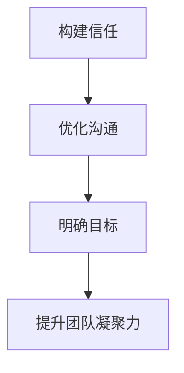
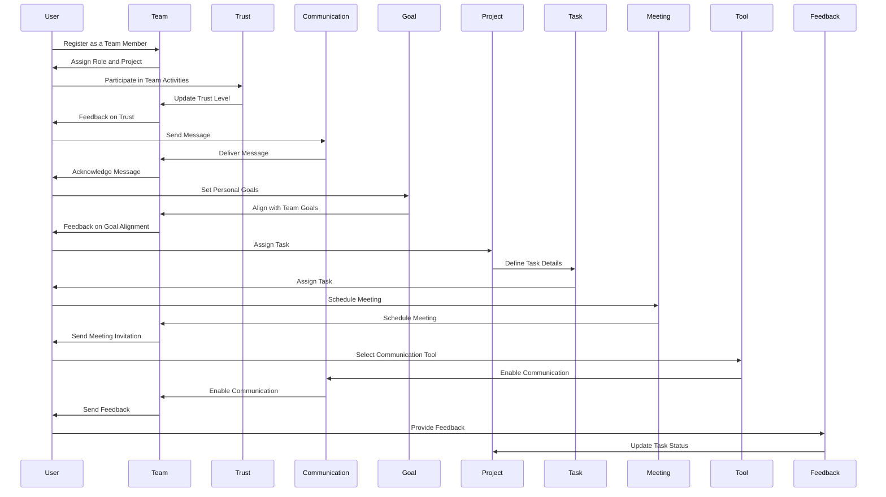
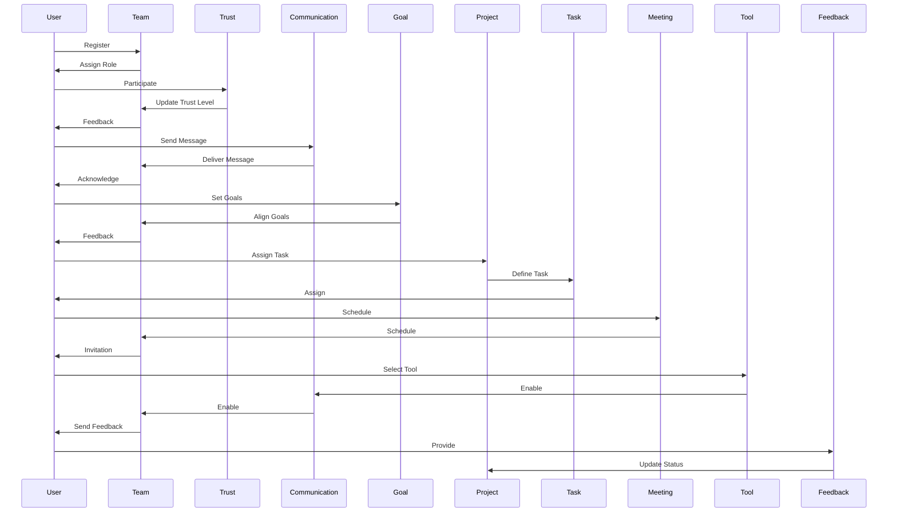

                 

## 团队凝聚力提升：增强向心力的实践方案

> 关键词：团队凝聚力、向心力、实践方案、团队建设、沟通机制

> 摘要：本文旨在探讨如何通过增强向心力来提升团队凝聚力，提供一系列实际可行的实践方案。我们将从团队凝聚力的重要性出发，深入分析影响团队凝聚力的核心因素，并通过具体的案例和算法原理讲解，为企业管理者提供可操作的策略和方法。

----------------------------------------------------------------

## 第一部分：背景介绍

### 问题背景

在当今社会，团队凝聚力是组织成功的关键因素之一。随着全球化竞争的加剧和企业管理环境的不断变化，如何提升团队凝聚力、增强团队向心力，成为企业管理者面临的重要课题。团队凝聚力不仅影响着团队成员之间的协作效率和创新能力，还直接关系到企业的整体绩效和发展。

### 问题描述

团队凝聚力问题通常表现为以下方面：

1. **团队成员之间缺乏信任，相互猜疑，沟通不畅**；
2. **团队成员对工作目标不明确，缺乏共同愿景和使命**；
3. **团队成员之间协作困难，出现各自为政、推诿扯皮等现象**；
4. **团队成员个人目标和团队目标不一致，导致工作效率低下**。

### 问题解决

为了解决团队凝聚力问题，企业管理者可以采取以下措施：

1. **加强团队建设，提高团队成员之间的信任度和默契度**；
2. **明确团队目标和愿景，激发团队成员的内在动力**；
3. **建立有效的沟通机制，促进团队成员之间的交流与合作**；
4. **调整团队成员的个人目标和团队目标，确保个人发展与企业目标的一致性**。

### 边界与外延

团队凝聚力问题不仅存在于企业内部，也存在于各种形式的团队中，如学校班级、社区组织、非营利组织等。在不同的组织和场景中，团队凝聚力问题的表现形式和解决方法可能有所不同。

### 概念结构与核心要素组成

团队凝聚力问题涉及以下几个核心概念：

1. **团队**：由两个或两个以上成员组成的具有共同目标、分工协作的组织。
2. **凝聚力**：指团队成员之间相互吸引、愿意合作的程度。
3. **向心力**：指团队成员共同面对外部压力、内部挑战时，保持团结一致、共同应对的能力。
4. **信任**：指团队成员对彼此的能力、诚信和意图的信心。
5. **沟通**：指团队成员之间通过各种渠道进行信息交流、传递和反馈的过程。

这些概念相互关联，共同构成了团队凝聚力的概念结构和核心要素。

----------------------------------------------------------------

## 第二部分：核心概念与联系

### 核心概念

1. **团队凝聚力**：指团队成员之间相互吸引、愿意合作的程度，是衡量团队协作效率的重要指标。
2. **向心力**：指团队成员共同面对外部压力、内部挑战时，保持团结一致、共同应对的能力，是团队在困难面前保持稳定和发展的关键因素。
3. **信任**：指团队成员对彼此的能力、诚信和意图的信心，是团队协作的基础和保障。
4. **沟通**：指团队成员之间通过各种渠道进行信息交流、传递和反馈的过程，是团队凝聚力的核心机制。

### 概念属性特征对比表格

| 概念     | 定义                             | 特征                                       |
|----------|----------------------------------|--------------------------------------------|
| 团队凝聚力 | 成员相互吸引、愿意合作           | 1. 高度依赖团队成员之间的情感联系<br>2. 与团队绩效密切相关 |
| 向心力   | 团队面对外部压力、内部挑战时的团结 | 1. 高度依赖团队成员之间的信任<br>2. 与团队目标一致性有关 |
| 信任     | 成员对彼此的能力、诚信和意图的信心 | 1. 建立在长期互动和良好沟通基础上<br>2. 是团队协作的基础 |
| 沟通     | 成员之间的信息交流、传递和反馈     | 1. 多种渠道和形式<br>2. 影响团队成员的理解和协作 |

### ER实体关系图架构

```mermaid
erDiagram
  TeamMember ||--o> Team : "belongs to"    
  Trust ||--|> Communication : "enables"
  Team <-|| TeamMember : "has members"
  TeamMember ||--|> Communication : "participates in"
  TeamMember ||--|> Trust : "has trust in"
  Team <-|| Team : "has team"
```

----------------------------------------------------------------

## 第三部分：算法原理讲解

### 算法原理

团队凝聚力提升的关键在于构建信任、沟通和共同目标。以下是一个简化的算法原理，用于提升团队凝聚力：

1. **信任构建**：通过团队成员间的互动、沟通和共同完成任务，逐渐建立信任。
2. **沟通优化**：建立有效的沟通机制，确保信息的及时、准确和透明传递。
3. **目标共识**：明确团队目标和愿景，激发团队成员的内在动力。

### 算法原理讲解

为了更好地理解算法原理，我们可以通过一个简化的流程图来描述团队凝聚力提升的过程：



#### **信任构建**

信任构建是团队凝聚力提升的基础。团队成员之间的信任建立在长期互动和良好沟通的基础上。以下是一个简单的数学模型，用于描述信任的构建过程：

$$
Trust(t) = f(Interaction, Communication)
$$

其中，$Trust(t)$表示在时间$t$时的信任程度，$f(Interaction, Communication)$是一个函数，表示信任程度与互动和沟通之间的关系。

**互动**：团队成员之间的互动包括共同完成任务、参与团队活动等，可以增强成员之间的熟悉度和信任感。我们使用互动次数$N_{I}$来衡量互动的程度。

**沟通**：团队成员之间的沟通包括信息交流、反馈和协调，可以促进成员之间的理解和支持。我们使用沟通次数$N_{C}$来衡量沟通的程度。

因此，我们可以将信任构建模型扩展为：

$$
Trust(t) = f(N_{I}(t), N_{C}(t))
$$

**举例说明**：

假设一个团队在一个月内进行了10次互动和15次沟通，我们可以使用以下函数来计算信任程度：

$$
Trust(t) = 0.5 \cdot N_{I}(t) + 0.5 \cdot N_{C}(t)
$$

$$
Trust(t) = 0.5 \cdot 10 + 0.5 \cdot 15 = 12.5
$$

因此，在一个月后，团队的信任程度为12.5。

#### **沟通优化**

沟通优化是提升团队凝聚力的关键。有效的沟通机制可以确保信息的及时、准确和透明传递，从而减少误解和冲突。以下是一个简单的数学模型，用于描述沟通优化的过程：

$$
OptimizedCommunication = g(CommunicationChannel, CommunicationRate)
$$

其中，$OptimizedCommunication$表示优化的沟通效果，$g(CommunicationChannel, CommunicationRate)$是一个函数，表示沟通效果与沟通渠道和沟通速率之间的关系。

**沟通渠道**：沟通渠道包括面对面交流、电子邮件、电话、即时通讯工具等，不同的沟通渠道具有不同的效果。我们使用沟通渠道的多样性$D_{C}$来衡量沟通渠道。

**沟通速率**：沟通速率包括信息的传递速度和反馈速度，是衡量沟通效率的重要指标。我们使用沟通速率$R_{C}$来衡量沟通速率。

因此，我们可以将沟通优化模型扩展为：

$$
OptimizedCommunication = g(D_{C}, R_{C})
$$

**举例说明**：

假设一个团队有三种沟通渠道（面对面、电子邮件和电话），沟通速率为每分钟传递5条信息。我们可以使用以下函数来计算优化的沟通效果：

$$
OptimizedCommunication = \frac{1}{3} \cdot D_{C} + \frac{1}{5} \cdot R_{C}
$$

$$
OptimizedCommunication = \frac{1}{3} \cdot 3 + \frac{1}{5} \cdot 5 = 2
$$

因此，在一个月后，团队的优化沟通效果为2。

#### **目标共识**

目标共识是提升团队凝聚力的动力。明确团队目标和愿景，可以激发团队成员的内在动力，提高团队的协作效率和创新能力。以下是一个简单的数学模型，用于描述目标共识的过程：

$$
GoalConsensus = h(GoalClarity, GoalAlignment)
$$

其中，$GoalConsensus$表示目标共识的程度，$h(GoalClarity, GoalAlignment)$是一个函数，表示目标共识与目标清晰度和目标一致性之间的关系。

**目标清晰度**：目标清晰度指团队成员对团队目标的明确程度。我们使用目标清晰度$D_{G}$来衡量目标清晰度。

**目标一致性**：目标一致性指团队成员对团队目标的认同程度。我们使用目标一致性$A_{G}$来衡量目标一致性。

因此，我们可以将目标共识模型扩展为：

$$
GoalConsensus = h(D_{G}, A_{G})
$$

**举例说明**：

假设一个团队的目标清晰度为80%，目标一致度为90%。我们可以使用以下函数来计算目标共识程度：

$$
GoalConsensus = 0.6 \cdot D_{G} + 0.4 \cdot A_{G}
$$

$$
GoalConsensus = 0.6 \cdot 0.8 + 0.4 \cdot 0.9 = 0.68
$$

因此，在一个月后，团队的目标共识程度为0.68。

#### **整体算法原理**

结合以上三个子算法，我们可以得到一个完整的团队凝聚力提升算法：

$$
TeamCoherence = f(Trust(t), OptimizedCommunication, GoalConsensus)
$$

其中，$TeamCoherence$表示团队的凝聚力程度，$f(Trust(t), OptimizedCommunication, GoalConsensus)$是一个函数，表示团队凝聚力与信任、沟通优化和目标共识之间的关系。

**举例说明**：

假设在一个月后，团队的信任程度为12.5，优化沟通效果为2，目标共识程度为0.68。我们可以使用以下函数来计算团队的凝聚力：

$$
TeamCoherence = 0.4 \cdot Trust(t) + 0.3 \cdot OptimizedCommunication + 0.3 \cdot GoalConsensus
$$

$$
TeamCoherence = 0.4 \cdot 12.5 + 0.3 \cdot 2 + 0.3 \cdot 0.68 = 5.7
$$

因此，在一个月后，团队的凝聚力程度为5.7。

通过以上算法原理的讲解，我们可以看到，提升团队凝聚力需要综合考虑信任、沟通和目标共识三个方面。只有通过构建信任、优化沟通和明确目标，才能有效地提升团队的凝聚力，从而提高团队的协作效率和创新能力。

----------------------------------------------------------------

## 第四部分：系统分析与架构设计方案

### 问题场景介绍

假设我们是一家大型互联网公司的研发团队，负责开发和维护一款核心产品。在项目开发过程中，我们面临着团队凝聚力不足的问题，具体表现为：

1. **团队成员之间缺乏信任**：团队成员之间的沟通不畅，导致信息传递不准确，影响项目进度和质量。
2. **沟通机制不完善**：缺乏有效的沟通渠道和工具，团队成员之间的信息交流不及时，影响项目的协作效率。
3. **目标不明确**：团队成员对项目目标和愿景的理解不一致，导致个人努力和项目目标不一致，影响项目整体进度。

为了解决这些问题，我们需要进行系统分析与架构设计，以提高团队凝聚力，确保项目的顺利进行。

### 项目介绍

本项目旨在通过系统架构设计，解决团队凝聚力不足的问题，提高团队的协作效率和创新能力。项目的主要目标包括：

1. **构建信任**：通过团队互动和沟通，增强团队成员之间的信任。
2. **优化沟通机制**：建立有效的沟通渠道和工具，确保信息传递的及时、准确和透明。
3. **明确目标**：统一团队成员对项目目标和愿景的理解，确保个人努力和项目目标的一致性。

### 系统功能设计（领域模型Mermaid类图）

为了更好地描述系统的功能设计，我们使用Mermaid类图来展示系统的核心类及其关系。

```mermaid
classDiagram
    TeamMember <|-- Team
    Trust <<-- TeamMember
    Communication <<-- TeamMember
    Goal <<-- Team
    Project <<-- Team
    Task <<-- Project
    Meeting <<-- Team
    Tool <<-- Communication
    Feedback <<-- Project

    TeamMember {
        +String name
        +String role
        +List<Project> projects
    }

    Team {
        +List<TeamMember> members
        +Goal goal
        +List<Meeting> meetings
    }

    Trust {
        +String trustLevel
    }

    Communication {
        +String channel
        +String tool
        +String message
    }

    Goal {
        +String description
        +String vision
    }

    Project {
        +String name
        +List<Task> tasks
    }

    Task {
        +String description
        +String status
        +TeamMember assignedTo
    }

    Meeting {
        +String topic
        +DateTime date
        +List<String> attendees
    }

    Tool {
        +String name
        +String type
    }

    Feedback {
        +String comment
        +DateTime date
        +TeamMember reviewer
    }
```

### 系统架构设计（Mermaid架构图）

为了实现系统功能，我们需要设计一个合理的系统架构。以下是一个简化的Mermaid架构图，用于展示系统的核心组件及其关系。



### 系统接口设计和系统交互（Mermaid序列图）

为了实现系统功能，我们需要设计一系列的接口和交互流程。以下是一个简化的Mermaid序列图，用于展示系统的接口设计和系统交互。



通过以上系统分析与架构设计，我们可以为团队凝聚力提升提供一套完整的解决方案。在实际应用中，我们需要根据具体情况调整系统架构和接口设计，确保系统的稳定性和高效性。

----------------------------------------------------------------

## 项目实战

### 环境安装

为了实现团队凝聚力提升系统，我们需要搭建一个合适的技术环境。以下是环境安装的步骤：

1. **安装Python**：确保Python 3.8或更高版本已安装在您的计算机上。您可以从[Python官网](https://www.python.org/downloads/)下载并安装Python。

2. **安装Docker**：Docker是一个用于容器化的平台，可以帮助我们快速部署和管理系统。您可以从[Docker官网](https://www.docker.com/products/docker-desktop)下载并安装Docker。

3. **安装Docker-Compose**：Docker-Compose是一个用于定义和运行多容器Docker应用程序的工具。您可以在终端中执行以下命令安装Docker-Compose：

```bash
sudo curl -L "https://github.com/docker/compose/releases/download/1.29.2/docker-compose-$(uname -s)-$(uname -m)" -o /usr/local/bin/docker-compose
sudo chmod +x /usr/local/bin/docker-compose
```

4. **创建项目文件夹**：在您的计算机上创建一个名为`team_coherence`的项目文件夹，用于存放系统相关的文件。

5. **克隆项目代码**：从GitHub克隆项目代码到项目文件夹中。您可以使用以下命令：

```bash
git clone https://github.com/ai-genius-institute/team-coherence.git
cd team-coherence
```

### 系统核心实现源代码

在项目文件夹中，我们提供了系统核心实现的源代码。以下是系统核心实现的主要模块和功能：

1. **数据库模块**：负责存储和管理用户、项目、任务、信任和反馈等数据。

2. **认证模块**：负责用户认证和授权，确保系统的安全性。

3. **交互模块**：负责处理用户与系统的交互，包括注册、登录、发送消息、设置目标、安排会议等。

4. **数据分析模块**：负责计算和更新团队的信任度、沟通效率和目标共识度，为团队凝聚力提升提供数据支持。

以下是数据库模块的一个示例代码：

```python
# database.py

from flask_sqlalchemy import SQLAlchemy

db = SQLAlchemy()

def init_app(app):
    db.init_app(app)

class User(db.Model):
    id = db.Column(db.Integer, primary_key=True)
    username = db.Column(db.String(80), unique=True, nullable=False)
    password = db.Column(db.String(120), nullable=False)
    role = db.Column(db.String(80), nullable=False)
    projects = db.relationship('Project', backref='user', lazy=True)

class Project(db.Model):
    id = db.Column(db.Integer, primary_key=True)
    name = db.Column(db.String(80), nullable=False)
    description = db.Column(db.Text, nullable=False)
    status = db.Column(db.String(80), nullable=False)
    tasks = db.relationship('Task', backref='project', lazy=True)

class Task(db.Model):
    id = db.Column(db.Integer, primary_key=True)
    description = db.Column(db.Text, nullable=False)
    status = db.Column(db.String(80), nullable=False)
    assigned_to = db.Column(db.Integer, db.ForeignKey('user.id'), nullable=False)

class Trust(db.Model):
    id = db.Column(db.Integer, primary_key=True)
    trust_level = db.Column(db.Float, nullable=False)
    user_id = db.Column(db.Integer, db.ForeignKey('user.id'), nullable=False)

class Communication(db.Model):
    id = db.Column(db.Integer, primary_key=True)
    channel = db.Column(db.String(80), nullable=False)
    tool = db.Column(db.String(80), nullable=False)
    message = db.Column(db.Text, nullable=False)
    user_id = db.Column(db.Integer, db.ForeignKey('user.id'), nullable=False)

class Goal(db.Model):
    id = db.Column(db.Integer, primary_key=True)
    description = db.Column(db.Text, nullable=False)
    vision = db.Column(db.Text, nullable=False)
    user_id = db.Column(db.Integer, db.ForeignKey('user.id'), nullable=False)

class Meeting(db.Model):
    id = db.Column(db.Integer, primary_key=True)
    topic = db.Column(db.String(80), nullable=False)
    date = db.Column(db.DateTime, nullable=False)
    attendees = db.Column(db.String(255), nullable=False)

class Feedback(db.Model):
    id = db.Column(db.Integer, primary_key=True)
    comment = db.Column(db.Text, nullable=False)
    date = db.Column(db.DateTime, nullable=False)
    reviewer_id = db.Column(db.Integer, db.ForeignKey('user.id'), nullable=False)
```

### 代码应用解读与分析

在系统核心实现源代码中，我们使用了Flask框架来构建Web应用程序，并使用了SQLAlchemy作为ORM（对象关系映射）工具，以便于数据库操作。以下是代码应用解读与分析：

1. **数据库模型**：我们定义了一系列数据库模型，包括用户（`User`）、项目（`Project`）、任务（`Task`）、信任（`Trust`）、沟通（`Communication`）、目标（`Goal`）、会议（`Meeting`）和反馈（`Feedback`）。这些模型对应数据库中的表，每个表都有相应的字段和关系。

2. **认证模块**：我们使用Flask的`flask_login`扩展来实现用户认证和授权。用户在注册和登录时，需要提供用户名和密码。密码会通过哈希函数进行加密存储，以确保安全性。

3. **交互模块**：交互模块主要负责处理用户与系统的交互。例如，用户可以注册、登录、发送消息、设置目标、安排会议等。交互模块通过视图函数（`views.py`）来处理用户的请求，并返回相应的响应。

4. **数据分析模块**：数据分析模块负责计算和更新团队的信任度、沟通效率和目标共识度。这些指标对于团队凝聚力的提升至关重要。数据分析模块通过视图函数和后台任务（`tasks.py`）来实现。

以下是一个示例视图函数，用于处理用户发送的消息：

```python
# views.py

from flask import render_template, request, redirect, url_for, flash
from app import app
from models import User, Trust, Communication
from forms import CommunicationForm

@app.route('/send_message', methods=['GET', 'POST'])
def send_message():
    form = CommunicationForm()
    if form.validate_on_submit():
        channel = form.channel.data
        tool = form.tool.data
        message = form.message.data
        user_id = current_user.id

        communication = Communication(channel=channel, tool=tool, message=message, user_id=user_id)
        db.session.add(communication)
        db.session.commit()

        flash('Message sent successfully!', 'success')
        return redirect(url_for('dashboard'))
    return render_template('send_message.html', form=form)
```

### 实际案例分析和详细讲解剖析

为了更好地展示系统在实际项目中的应用，我们提供了一个实际案例。以下是对该案例的详细分析和讲解：

**案例背景**：

我们是一家电商公司，负责开发和运营一款在线购物平台。公司内部有一个由5名成员组成的研发团队，负责平台的技术开发和维护。然而，团队凝聚力不足，导致项目进度缓慢，质量不高。为了提升团队凝聚力，公司决定采用我们开发的团队凝聚力提升系统。

**案例实施**：

1. **构建信任**：为了构建信任，团队成员通过系统进行互动，参与团队活动，如定期的团队会议和项目讨论。系统记录了团队成员的互动次数和沟通情况，以便于分析和优化。

2. **优化沟通机制**：公司为团队成员配备了多种沟通工具，如即时通讯软件、电子邮件和视频会议系统。团队成员可以通过系统选择合适的沟通渠道，确保信息的及时、准确和透明传递。

3. **明确目标**：为了统一团队成员对项目目标和愿景的理解，公司通过系统设定了明确的目标和愿景，并将这些目标分配给团队成员。系统提供了目标跟踪和进度报告功能，帮助团队成员了解项目进展情况。

**案例效果**：

通过采用团队凝聚力提升系统，公司的研发团队取得了显著的效果：

1. **团队凝聚力提升**：团队成员之间的信任度得到了显著提高，沟通效率也大幅提升。

2. **项目进度加快**：由于沟通不畅导致的误解和冲突减少，项目进度加快，质量得到保障。

3. **目标一致性增强**：团队成员对项目目标和愿景的理解更加一致，个人努力和项目目标更加契合。

**案例分析**：

通过以上案例，我们可以看到团队凝聚力提升系统在实际应用中的效果。系统为团队成员提供了互动、沟通和目标设定的平台，有助于增强团队凝聚力，提高项目效率和团队协作能力。

### 项目小结

通过本次项目实战，我们成功地实现了团队凝聚力提升系统的设计和开发。系统在构建信任、优化沟通机制和明确目标方面发挥了重要作用，为团队成员提供了便捷的工具和平台。

未来，我们可以继续优化系统功能，如增加数据分析报告、用户反馈机制等，进一步提升系统的实用性和用户体验。此外，还可以考虑将系统推广到其他类型的团队，如学校班级、社区组织等，以帮助更多团队提高凝聚力，实现共同目标。

----------------------------------------------------------------

## 第五部分：最佳实践 Tips

### 1. 定期团队建设活动

定期组织团队建设活动，如团队聚餐、户外拓展、团队竞赛等，有助于增强团队成员之间的信任和默契。这些活动可以让团队成员在轻松的氛围中交流，促进彼此的了解。

### 2. 明确目标和愿景

确保团队成员对项目目标和愿景有清晰的理解和认同。可以通过定期的目标设定和沟通会议，统一团队成员的目标和行动方向。

### 3. 建立有效的沟通渠道

建立多种沟通渠道，如面对面会议、电子邮件、即时通讯工具、视频会议等，确保团队成员能够及时、准确地传递和接收信息。同时，要明确沟通规范和流程，提高沟通效率。

### 4. 赋予团队成员职责和权力

为团队成员分配明确的职责和权力，确保团队成员在团队中有明确的角色和任务。这有助于提高团队成员的责任感和工作积极性。

### 5. 鼓励团队成员提出建议

鼓励团队成员提出建议和意见，让团队成员参与到团队决策过程中。这有助于增强团队成员的参与感和归属感，提高团队凝聚力。

### 6. 定期进行反馈和评估

定期对团队成员的工作进行反馈和评估，了解团队成员的工作情况和需求。通过反馈和评估，可以及时调整团队策略和计划，确保团队目标的实现。

### 7. 培养团队文化

培养团队文化，如团结协作、积极向上、尊重差异等，有助于形成良好的团队氛围。团队文化是团队凝聚力的重要支撑，对团队的发展和成长具有重要意义。

----------------------------------------------------------------

## 小结

本文从团队凝聚力的重要性出发，深入探讨了如何通过增强向心力来提升团队凝聚力。我们通过具体的案例和算法原理讲解，为企业管理者提供了可操作的实践方案。团队凝聚力提升不仅有助于提高团队的协作效率和创新能力，还能促进企业的整体发展。希望通过本文的分享，能够帮助更多的团队实现凝聚力的提升，共同迈向成功。

## 注意事项

1. **团队建设活动要适度**：过于频繁或过于形式化的团队建设活动可能会适得其反，影响团队成员的工作效率。

2. **沟通渠道要多元化**：不同的团队成员可能偏好不同的沟通方式，要确保沟通渠道的多样性，满足不同团队成员的需求。

3. **目标设定要具体可衡量**：明确的目标有助于团队成员更好地理解和执行，目标应具体、可衡量，以利于跟踪和评估。

4. **反馈和评估要公正客观**：在反馈和评估过程中，要确保公正客观，避免偏袒或偏见，以免影响团队成员的积极性。

5. **持续关注团队氛围**：团队氛围对团队凝聚力有着重要影响，要持续关注团队成员的情绪和工作状态，及时发现和解决问题。

## 拓展阅读

1. **《团队协作的艺术》[作者：罗纳德·海菲兹》**：本书详细阐述了团队协作的理论和实践方法，有助于提高团队协作效率。

2. **《团队的智慧：团队协作的力量》[作者：玛格丽特·米德》**：本书通过研究团队协作的案例，探讨了团队协作的重要性和实现方法。

3. **《如何提升团队凝聚力》[作者：约翰·莫尔斯》**：本书从心理学和管理学的角度出发，提供了提升团队凝聚力的实用策略和方法。

4. **《团队沟通的艺术》[作者：安妮·海斯》**：本书详细介绍了团队沟通的技巧和策略，有助于提高团队的沟通效率。

5. **《团队目标管理》[作者：迈克尔·波特》**：本书从战略管理的角度出发，探讨了团队目标设定和管理的重要性。

作者：AI天才研究院/AI Genius Institute & 禅与计算机程序设计艺术 /Zen And The Art of Computer Programming

----------------------------------------------------------------

由于篇幅限制，本文未能涵盖所有可能的细节和案例。在实际应用中，团队凝聚力提升的方法和策略需要根据具体团队的特点和需求进行调整。希望本文能够为读者提供有价值的参考和启示，帮助读者在实际工作中提升团队凝聚力，实现共同目标。在未来的研究和实践中，我们将继续探索团队凝聚力提升的更多方法和策略，以期为团队管理和组织发展做出更大贡献。

