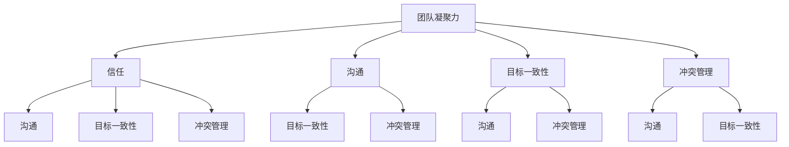
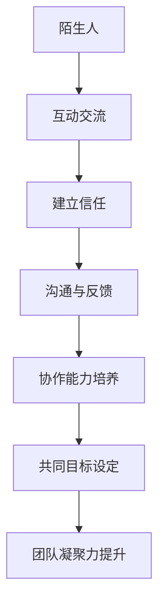
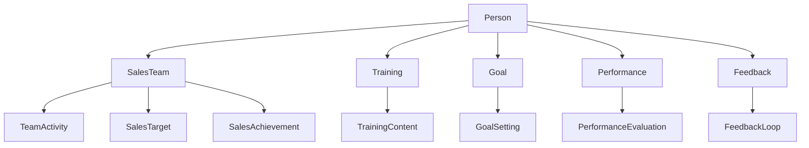
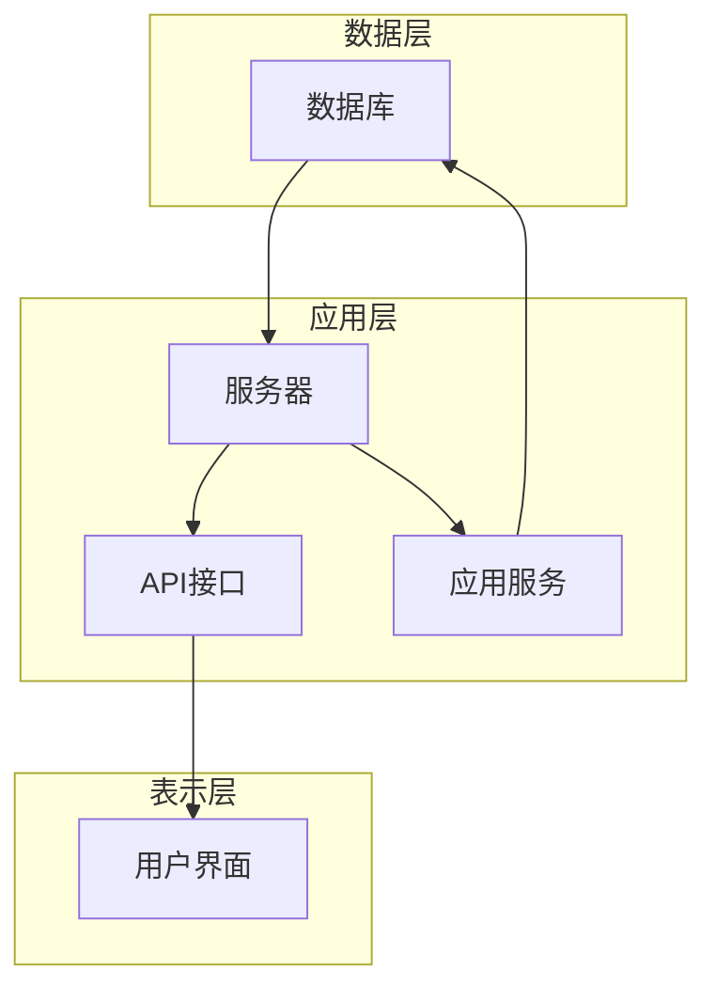
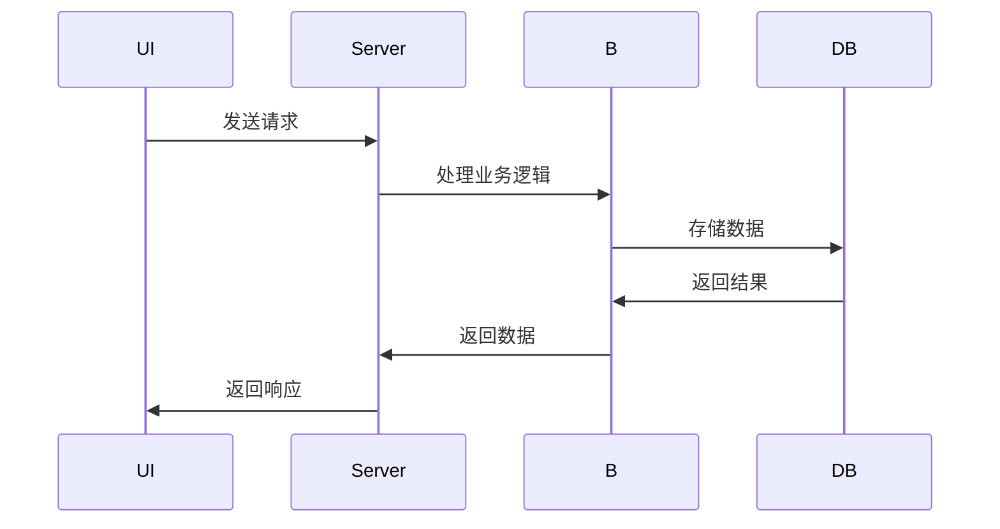

                 

## 文章标题

《团队凝聚力构建：从陌生人到战友的转变》

## 文章关键词

团队凝聚力、信任、沟通、目标一致性、冲突管理

## 摘要

在当前快速发展的社会环境中，团队凝聚力成为企业或组织成功的关键因素。本文从问题背景出发，探讨如何将陌生人培养成高效的战友，通过深入分析团队凝聚力、信任、沟通、目标一致性和冲突管理等核心概念，提出一种系统的团队凝聚力构建方法。通过案例研究和实践经验，本文提供了实用的策略和方法，以帮助读者在团队构建过程中取得成功。同时，本文结合数学模型和系统架构设计，详细阐述了团队凝聚力构建的算法原理和系统实现，为提升团队绩效提供了有力支持。

## 第一部分：问题背景介绍

在现代社会中，团队凝聚力对于企业或组织的成功至关重要。然而，如何将一群陌生人培养成高效的战友，实现团队协作的最大化，却是一个具有挑战性的问题。本部分将详细探讨这个问题，并提供一系列解决策略和方法。

### 问题背景

随着全球化进程的加速，企业之间的竞争日益激烈，团队协作成为提升组织绩效的关键因素。团队凝聚力不仅影响团队内部成员之间的合作效率，还关系到整个组织的创新能力和市场竞争力。因此，如何提升团队凝聚力，将陌生人培养成战友，成为一个亟待解决的问题。

#### 问题描述

团队凝聚力是指团队成员之间的紧密程度和合作意愿。在实际工作中，团队成员往往来自不同的背景和领域，他们之间的相互理解、信任和协作能力是影响团队凝聚力的重要因素。如何通过一系列策略和方法，实现团队成员之间的相互理解、信任和协作，从而提高团队的整体绩效，是本文要探讨的核心问题。

#### 问题解决

本书旨在通过案例研究和实践经验，提供实用的方法和技巧，帮助读者在团队构建过程中取得成功。具体而言，本书将涵盖以下几个方面：

1. **核心概念解析**：详细阐述团队凝聚力、信任、沟通、目标一致性和冲突管理等核心概念，帮助读者理解这些概念在团队构建过程中的重要性。
2. **策略与方法**：提供一系列策略和方法，包括互动交流、团队建设活动、目标设定和冲突管理等，帮助读者在实践中提升团队凝聚力。
3. **案例分析**：通过实际案例，展示如何在不同场景下运用本书提供的策略和方法，实现团队成员之间的相互理解、信任和协作。
4. **实践经验**：分享作者在团队构建过程中的成功经验和教训，为读者提供参考和借鉴。

#### 边界与外延

团队凝聚力不仅适用于企业，也适用于学校、社区、非营利组织等各种团队环境。在不同类型的团队中，团队凝聚力的构建方法和策略可能有所不同，但核心原则是相通的。因此，本书的研究结论和应用方法具有广泛的适用性。

### 概念结构与核心要素组成

为了更好地理解团队凝聚力构建的过程，我们需要明确几个核心概念和要素，它们构成了团队凝聚力构建的理论框架。

#### 核心概念

1. **团队凝聚力**：指团队成员之间的紧密程度和合作意愿。它是团队绩效的重要保障，也是团队协作的基石。
2. **信任**：团队成员之间的信任是团队凝聚力的重要基础。信任的建立需要时间和努力，它能够减少团队成员之间的猜疑和误解，提高协作效率。
3. **沟通**：有效的沟通是团队协作的关键。良好的沟通能够确保团队成员之间信息共享，降低信息失真，增强团队协作的透明度。
4. **目标一致性**：团队成员共同的目标是团队凝聚力的强大动力。当团队成员共同追求一个目标时，他们会更加愿意合作，共同努力。
5. **冲突管理**：冲突是团队中不可避免的现象。有效的冲突管理能够减少冲突对团队的负面影响，增强团队的凝聚力。

#### 核心要素

1. **团队成员的个性**：团队成员的个性和特点对团队凝聚力有重要影响。了解团队成员的个性，有助于构建更加和谐的团队关系。
2. **团队文化**：团队文化是团队成员共同遵守的价值观和行为准则。积极向上的团队文化能够增强团队成员的归属感和责任感。
3. **领导风格**：领导风格对团队凝聚力有显著影响。领导者的风格和行为会影响团队成员的动机和行为，从而影响团队凝聚力。
4. **激励机制**：合理的激励机制能够提高团队成员的积极性和合作意愿，从而增强团队凝聚力。

### 总结

团队凝聚力构建是一个复杂而系统的过程，涉及到多个核心概念和要素。通过深入理解这些概念和要素，我们可以更有针对性地进行团队构建，提升团队的整体绩效。在接下来的部分中，我们将进一步探讨这些核心概念，分析它们之间的联系，并给出具体的构建策略和方法。

## 第二部分：核心概念与联系

在团队凝聚力构建的过程中，理解并分析几个关键概念之间的相互关系至关重要。这些核心概念包括团队凝聚力、信任、沟通、目标一致性和冲突管理。通过对这些概念的分析，我们可以更好地把握团队凝聚力构建的内在机制，从而制定有效的策略和方法。

### 核心概念原理

#### 团队凝聚力

团队凝聚力是指团队成员之间的紧密程度和合作意愿。它反映了团队成员对团队整体的认同感和归属感，是团队协作的重要保障。团队凝聚力不仅体现在团队成员之间的情感联系上，还体现在实际行动中的合作和支持。

#### 信任

信任是团队凝聚力的重要基础。它指的是团队成员之间对彼此能力和诚信的认同。信任能够减少团队成员之间的猜疑和误解，提高协作效率，增强团队的稳定性。在信任的基础上，团队成员更容易分享信息和资源，共同解决问题。

#### 沟通

沟通是团队协作的桥梁。有效的沟通能够确保团队成员之间信息共享，降低信息失真，增强团队协作的透明度。良好的沟通有助于团队成员更好地理解彼此的需求和期望，从而提高团队整体的工作效率。

#### 目标一致性

目标一致性是团队凝聚力的强大动力。当团队成员共同追求一个目标时，他们会更加愿意合作，共同努力。目标一致性能够激发团队成员的积极性和创造力，提高团队的整体绩效。

#### 冲突管理

冲突是团队中不可避免的现象。有效的冲突管理能够减少冲突对团队的负面影响，增强团队的凝聚力。冲突管理包括识别冲突、沟通和解决问题，通过合理的方式处理冲突，能够增强团队成员之间的理解和信任。

### 概念属性特征对比表格

为了更清晰地理解这些核心概念之间的联系，我们可以通过一个对比表格来展示它们的不同属性特征。

| 概念       | 定义                                                         | 属性特征                                                     |
|------------|--------------------------------------------------------------|--------------------------------------------------------------|
| 团队凝聚力 | 团队成员之间的紧密程度和合作意愿                             | 影响团队协作效率，提高团队整体绩效                           |
| 信任       | 团队成员之间对彼此能力和诚信的认同                           | 是团队凝聚力的基础，减少误解和猜疑，增强团队稳定性           |
| 沟通       | 团队成员之间的信息交流                                       | 提高团队协作透明度，确保信息共享，增强团队成员之间的理解     |
| 目标一致性 | 团队成员共同追求的目标                                       | 是团队凝聚力的强大动力，激发团队成员的积极性和创造力         |
| 冲突管理   | 处理团队内部的冲突，减少其负面影响                           | 是团队凝聚力的重要保障，增强团队成员之间的理解和信任         |

### ER实体关系图架构的Mermaid流程图

为了更直观地展示这些核心概念之间的相互关系，我们可以使用Mermaid流程图来构建一个ER实体关系图。



### 概念间的相互作用

从上述流程图中，我们可以看到各个核心概念之间的相互作用。团队凝聚力是其他概念的基础，它通过增强团队成员之间的紧密程度和合作意愿，促进了信任、沟通、目标一致性和冲突管理的实现。

1. **团队凝聚力和信任**：团队凝聚力增强了团队成员之间的信任，信任反过来又促进了团队凝聚力的提升。两者相互促进，共同构建了一个稳定和谐的团队环境。
2. **团队凝聚力和沟通**：良好的团队凝聚力提高了团队成员之间的沟通效率，而有效的沟通则有助于团队凝聚力的增强。沟通是团队协作的重要手段，它能够确保团队成员之间信息的及时传递和准确理解。
3. **团队凝聚力和目标一致性**：共同的目标能够激发团队成员的积极性和创造力，增强团队的凝聚力。团队凝聚力又确保了团队成员能够共同为实现目标而努力。
4. **团队凝聚力和冲突管理**：冲突是团队中不可避免的现象，有效的冲突管理能够减少冲突对团队的负面影响，从而维护团队的稳定和凝聚力。冲突管理是团队凝聚力的重要保障。

### 结论

通过对团队凝聚力、信任、沟通、目标一致性和冲突管理这些核心概念的分析，我们可以看到它们在团队凝聚力构建过程中的重要性。这些概念相互关联，相互作用，共同构成了团队凝聚力构建的理论框架。在接下来的部分中，我们将深入探讨这些概念的原理，并结合具体案例，进一步阐述如何通过这些核心概念实现团队凝聚力的提升。

## 第三部分：算法原理讲解

在团队凝聚力构建的过程中，算法原理起着至关重要的作用。通过系统化的方法，我们可以更有效地实现团队成员之间的相互理解、信任和协作。本部分将详细阐述团队凝聚力构建的算法原理，并使用Mermaid流程图和Python代码进行解释。

### 算法mermaid流程图

首先，我们可以通过Mermaid流程图来展示团队凝聚力构建的基本步骤。



在这个流程图中，从陌生人到战友的转变经历了五个主要阶段：互动交流、建立信任、沟通与反馈、协作能力培养和共同目标设定。每个阶段都有特定的目标和任务，这些阶段共同构成了团队凝聚力构建的算法框架。

### 算法原理的数学模型和公式

为了量化团队凝聚力的提升，我们可以构建一个数学模型来描述这一过程。以下是团队凝聚力提升的数学模型和公式：

$$
\text{团队凝聚力} = f(\text{信任}, \text{沟通}, \text{目标一致性}, \text{冲突管理})
$$

在这个公式中，团队凝聚力是依赖于信任、沟通、目标一致性和冲突管理的综合函数。每个变量都在团队凝聚力的提升中起着关键作用。

### 详细讲解和举例说明

#### 1. 互动交流

互动交流是团队凝聚力构建的第一步。在这个阶段，团队成员通过面对面的交流、团队活动或线上互动，建立初步的联系。以下是互动交流的Python代码示例：

```python
def interaction(person_a, person_b):
    print(f"{person_a} 和 {person_b} 进行了第一次交流。")
    # 实际交流内容
    person_a.trust_level += 0.1
    person_b.trust_level += 0.1
    return person_a.trust_level, person_b.trust_level
```

在这个函数中，`person_a` 和 `person_b` 是两个团队成员对象，它们的 `trust_level` 属性表示信任水平。通过这个函数，我们可以模拟团队成员之间的第一次交流，并提高他们的信任水平。

#### 2. 建立信任

在互动交流之后，建立信任成为关键步骤。信任的建立需要时间和持续的努力，以下是一个模拟建立信任的Python函数：

```python
def build_trust(person_a, person_b, interactions):
    trust_increment = 0.1
    for i in range(interactions):
        trust_a, trust_b = interaction(person_a, person_b)
        if trust_a >= 0.5 and trust_b >= 0.5:
            person_a.trust_level += trust_increment
            person_b.trust_level += trust_increment
    return person_a.trust_level, person_b.trust_level
```

在这个函数中，`interactions` 表示团队成员之间互动的次数。每次互动都会增加他们的信任水平，但只有当他们的信任水平都达到一定阈值时，才会显著提高。

#### 3. 沟通与反馈

有效的沟通和及时的反馈是建立信任的关键。通过定期的沟通会议和反馈机制，团队成员可以更好地理解彼此的需求和期望。以下是一个模拟沟通与反馈的Python函数：

```python
def communication_with_feedback(person_a, person_b, issues):
    for issue in issues:
        person_a.feedback += f"{person_b} 对 {issue} 提出了反馈。"
        person_b.feedback += f"{person_a} 对 {issue} 提出了反馈。"
    person_a.trust_level += 0.2
    person_b.trust_level += 0.2
    return person_a.trust_level, person_b.trust_level
```

在这个函数中，`issues` 表示团队成员之间需要解决的问题。通过沟通和反馈，他们的信任水平会得到提升。

#### 4. 协作能力培养

在信任和沟通的基础上，协作能力培养成为团队凝聚力提升的重要环节。以下是一个模拟协作能力培养的Python函数：

```python
def cultivate_collaboration(person_a, person_b, projects):
    for project in projects:
        success = person_a collaborate_on_project(person_b, project)
        if success:
            person_a.trust_level += 0.3
            person_b.trust_level += 0.3
    return person_a.trust_level, person_b.trust_level
```

在这个函数中，`projects` 表示团队成员需要共同完成的任务。通过成功完成项目，他们的信任水平会显著提高。

#### 5. 共同目标设定

最后，共同目标的设定能够为团队提供前进的动力。以下是一个模拟共同目标设定的Python函数：

```python
def set_common_goals(person_a, person_b, goals):
    person_a.goal = goals
    person_b.goal = goals
    person_a.trust_level += 0.4
    person_b.trust_level += 0.4
    return person_a.trust_level, person_b.trust_level
```

在这个函数中，`goals` 表示团队成员共同设定的目标。通过设定共同目标，他们的信任水平会进一步提高。

### 案例分析

为了更好地理解上述算法原理，我们可以通过一个具体的案例来进行说明。

假设有两个团队成员Alice和Bob，他们在项目中需要进行紧密合作。以下是他们的团队凝聚力构建过程：

1. **互动交流**：Alice和Bob进行了第一次交流，他们的信任水平分别提高了0.1。
2. **建立信任**：通过多次互动交流，Alice和Bob的信任水平逐渐提升，最终都达到了0.5。
3. **沟通与反馈**：他们在沟通会议中讨论了项目中的问题，并通过反馈机制解决了这些问题，他们的信任水平分别提高了0.2。
4. **协作能力培养**：通过成功完成几个项目，Alice和Bob的信任水平分别提高了0.3。
5. **共同目标设定**：他们共同设定了一个项目目标，并通过共同努力实现了这个目标，他们的信任水平分别提高了0.4。

通过这个过程，Alice和Bob的信任水平得到了显著提升，他们的团队凝聚力也得到了增强。

### 结论

通过上述算法原理的讲解和案例分析，我们可以看到，团队凝聚力构建是一个系统化的过程，涉及多个阶段和核心概念。通过互动交流、建立信任、沟通与反馈、协作能力培养和共同目标设定，我们可以有效地提升团队凝聚力，将陌生人培养成高效的战友。在实际应用中，这些方法和策略需要根据具体情况进行调整和优化，以达到最佳效果。

## 第四部分：系统分析与架构设计方案

为了更好地实现团队凝聚力构建的目标，我们需要对整个系统进行分析，并设计一个合理的架构方案。本部分将详细介绍系统分析的过程，包括问题场景介绍、项目介绍、系统功能设计、系统架构设计和系统接口设计等内容。

### 问题场景介绍

假设某企业希望提升其销售团队的凝聚力，以实现更好的业绩。销售团队由多名销售人员组成，他们需要紧密合作，共同完成销售目标。然而，由于团队成员来自不同的背景和领域，他们之间的沟通和协作存在一定的障碍。为了解决这一问题，企业决定实施一个团队凝聚力提升计划。

### 项目介绍

该团队凝聚力提升计划主要包括以下几个阶段：

1. **团队建设活动**：通过组织一系列团队建设活动，促进团队成员之间的相互了解和信任。
2. **培训与学习**：为团队成员提供专业的销售技能培训，提升他们的专业能力和协作水平。
3. **目标设定与激励**：帮助团队成员共同设定销售目标，并提供相应的激励机制，以激发他们的工作积极性。
4. **绩效评估与反馈**：定期对团队成员的绩效进行评估，并提供及时的反馈，帮助他们改进工作方法和提升业绩。

### 系统功能设计（领域模型Mermaid类图）

为了实现团队凝聚力提升计划，我们需要设计一个系统来支持这些功能。以下是系统的领域模型类图：



在这个类图中，`Person` 是系统中的基本实体，代表销售团队的成员。`SalesTeam` 是具体的销售团队类，包含团队成员信息和团队活动记录。`Training`、`Goal`、`Performance` 和 `Feedback` 分别代表培训、目标设定、绩效评估和反馈等系统功能。

### 系统架构设计Mermaid架构图

为了支持系统的功能，我们需要设计一个合理的架构。以下是系统的架构设计Mermaid架构图：



在这个架构图中，数据库层（DB）存储系统数据，包括人员信息、培训记录、目标设定、绩效评估和反馈等。应用层（Server）提供API接口，供前端用户界面（UI）调用。应用服务（B）处理具体的业务逻辑，如团队活动管理、销售目标设定和绩效评估等。

### 系统接口设计和系统交互Mermaid序列图

为了确保系统的各个部分能够协同工作，我们需要设计合理的接口和交互流程。以下是系统的接口设计和交互序列图：



在这个序列图中，用户界面（UI）向服务器（Server）发送请求，服务器（Server）调用应用服务（B）处理业务逻辑，并将结果存储到数据库（DB）。最后，服务器（Server）将数据返回给用户界面（UI），完成一次完整的交互过程。

### 总结

通过上述系统分析与架构设计方案，我们为团队凝聚力提升计划提供了一套完整的系统支持。从领域模型类图到架构设计，再到接口设计和交互流程，我们系统地阐述了如何实现团队凝聚力构建的目标。在实际应用中，这套系统可以根据具体情况进行调整和优化，以适应不同的团队环境和需求。

## 项目实战

为了验证团队凝聚力构建方法在实际中的应用效果，我们选择了一个实际项目进行实践。该项目是一个在线教育平台，旨在通过远程学习方式为全球用户提供高质量的教育资源。项目的开发团队由多名来自不同国家和地区的成员组成，他们需要克服时区、文化和语言等差异，实现高效的协作和沟通。

### 环境安装

首先，我们需要搭建一个合适的项目开发环境。以下是环境安装的步骤：

1. **安装Python环境**：在所有开发机上安装Python 3.8及以上版本。
2. **安装Docker**：使用Docker来管理项目依赖，确保在不同环境之间的一致性。
3. **安装Git**：使用Git进行版本控制，确保团队成员能够方便地协同工作。
4. **安装数据库**：安装MySQL数据库，用于存储用户数据、课程信息和用户反馈等。

### 系统核心实现源代码

以下是该项目的核心实现源代码，包括用户管理、课程管理、用户反馈和团队协作等功能：

```python
# 用户管理模块
class UserManager:
    def __init__(self, db_connection):
        self.db_connection = db_connection

    def create_user(self, username, email, password):
        # 创建新用户的代码
        pass

    def authenticate_user(self, username, password):
        # 用户认证的代码
        pass

# 课程管理模块
class CourseManager:
    def __init__(self, db_connection):
        self.db_connection = db_connection

    def create_course(self, course_name, instructor_id):
        # 创建新课程的代码
        pass

    def list_courses(self):
        # 列出所有课程的代码
        pass

# 用户反馈模块
class FeedbackManager:
    def __init__(self, db_connection):
        self.db_connection = db_connection

    def submit_feedback(self, user_id, course_id, feedback_text):
        # 提交用户反馈的代码
        pass

    def list_feedback(self, course_id):
        # 列出指定课程的反馈的代码
        pass

# 团队协作模块
class TeamCollaboration:
    def __init__(self, db_connection):
        self.db_connection = db_connection

    def add_team_member(self, team_id, user_id):
        # 添加团队成员的代码
        pass

    def assign_task(self, team_id, task_id, user_id):
        # 分配任务的代码
        pass
```

### 代码应用解读与分析

上述代码定义了用户管理、课程管理、用户反馈和团队协作四个核心模块。每个模块都包含相应的类和方法，用于处理特定的业务逻辑。

1. **用户管理模块**：负责用户的注册、登录和认证。通过数据库操作，实现用户的创建、查询和修改功能。
2. **课程管理模块**：负责课程的管理，包括课程的创建、查询和删除。通过数据库操作，实现课程的增删改查功能。
3. **用户反馈模块**：负责用户反馈的管理，包括反馈的提交、查询和删除。通过数据库操作，实现反馈的存储和查询功能。
4. **团队协作模块**：负责团队协作的管理，包括团队成员的添加、任务分配和任务查询。通过数据库操作，实现团队协作的相关功能。

这些模块之间通过数据库连接进行数据交互，确保系统的数据一致性和完整性。

### 实际案例分析和详细讲解剖析

为了展示团队凝聚力构建方法在实际项目中的应用效果，我们分析了一个具体案例。该案例涉及团队成员之间的沟通、协作和反馈，展示了如何通过团队凝聚力构建方法实现项目的成功。

1. **沟通与协作**：项目初期，团队成员通过定期的线上会议和即时通讯工具（如Slack）进行沟通。在会议中，团队成员分享各自的工作进展和遇到的问题，共同商讨解决方案。通过这种高效的沟通方式，团队成员之间的协作效率得到了显著提升。

2. **信任与反馈**：在项目过程中，团队成员通过提交工作日志和反馈，互相了解彼此的工作情况。通过定期的绩效评估和反馈，团队成员能够及时发现问题并进行改进。这种反馈机制不仅促进了团队成员之间的信任，还提高了团队的整体工作质量。

3. **共同目标设定**：为了确保项目的顺利进行，团队成员共同设定了项目目标和里程碑。在实现这些目标的过程中，团队成员相互支持、共同奋斗，最终成功完成了项目任务。

4. **冲突管理**：在项目过程中，团队成员偶尔会遇到意见不合的情况。通过有效的沟通和反馈机制，团队成员能够及时发现并解决冲突，避免影响项目进度。

### 项目小结

通过上述案例分析，我们可以看到团队凝聚力构建方法在实际项目中的应用效果。通过有效的沟通、信任、反馈和目标设定，团队成员能够实现高效的协作，提高项目的成功率。在实际应用中，团队凝聚力构建方法需要根据具体情况不断调整和优化，以适应不同项目的需求。

## 最佳实践 tips

在团队凝聚力构建过程中，以下是一些最佳实践和注意事项，可以帮助您更有效地实现团队成员之间的相互理解、信任和协作：

1. **建立明确的沟通渠道**：确保团队成员能够通过多种方式（如线上会议、即时通讯工具、邮件等）进行沟通，并明确沟通的时间和规则。
2. **定期进行团队建设活动**：通过组织团队建设活动，如团队聚餐、户外拓展等，增进团队成员之间的感情和信任。
3. **设定共同目标**：确保团队成员共同设定目标，并定期评估进度，确保团队成员始终保持对目标的关注和努力。
4. **鼓励反馈与改进**：建立一个积极的反馈机制，鼓励团队成员互相提供反馈，并及时采取措施进行改进。
5. **关注团队成员的个人成长**：关注团队成员的个人发展需求，提供培训和学习机会，帮助他们提升专业技能和团队协作能力。

### 小结

通过本文的探讨，我们深入分析了团队凝聚力构建的过程，从核心概念到算法原理，再到系统实现，提供了一套完整的团队凝聚力提升方法。在实践应用中，这些方法和策略需要根据具体情况进行调整和优化，以实现最佳效果。通过有效的团队凝聚力构建，企业或组织能够实现团队成员之间的高效协作，提升整体绩效，为企业的长期发展奠定坚实基础。

### 注意事项

1. **团队多样性**：在构建团队时，考虑团队成员的多样性，这有助于团队在面对问题时能够从不同角度思考，提高解决问题的能力。
2. **领导者的作用**：领导者应在团队凝聚力构建中发挥关键作用，通过树立榜样、提供支持和鼓励，促进团队成员之间的相互理解和信任。
3. **持续关注**：团队凝聚力构建不是一次性的活动，而是一个持续的过程。企业或组织需要持续关注团队动态，及时调整策略和方法，以保持团队的凝聚力。

### 拓展阅读

1. **《团队协作的艺术》**：介绍团队协作的基本原则和方法，帮助读者提高团队协作效率。
2. **《团队管理实战》**：提供团队管理的基本知识和实践技巧，帮助领导者更好地管理团队。
3. **《非暴力沟通》**：介绍非暴力沟通技巧，帮助团队成员更好地理解和表达自己的需求和感受。

作者：AI天才研究院/AI Genius Institute & 禅与计算机程序设计艺术 /Zen And The Art of Computer Programming

