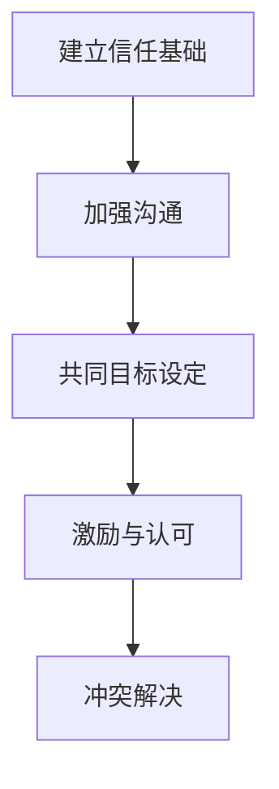
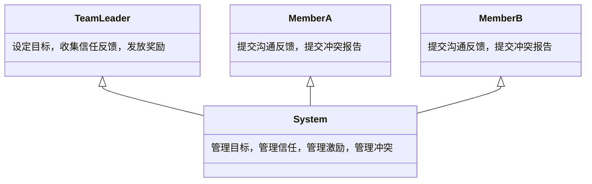

                 

# 《团队凝聚力：建立深厚信任关系的步骤》

## 关键词

- 团队凝聚力
- 信任
- 共同目标
- 价值观
- 沟通与协作
- 团队激励
- 个人成长

## 摘要

本文旨在探讨团队凝聚力与信任关系的重要性，并详细阐述建立深厚信任关系的步骤。通过共同目标的设定、价值观的建立、有效的沟通与协作、信任的建立与维护、团队激励与成员个人成长等多个方面的具体策略，帮助团队领导者和管理者提升团队凝聚力，打造一个高度信任、高效协作的工作环境。本文将结合IT领域的实际案例，为读者提供实用的方法和建议。

## 目录大纲

### 第一部分：团队凝聚力与信任的重要性

### 第二部分：团队凝聚力的构建策略

### 第三部分：团队凝聚力与信任的评估与提升

### 第四部分：总结与展望

## 第一部分：团队凝聚力与信任的重要性

### 第1章：团队凝聚力概述

#### 1.1 什么是团队凝聚力

团队凝聚力是指团队成员之间的相互吸引力和归属感，它是团队协作和共同完成任务的重要保障。具体来说，团队凝聚力包括以下几个方面：

- **心理凝聚力**：团队成员之间的心理吸引力，使他们愿意彼此合作。
- **社交凝聚力**：团队成员之间的社交联系和互动，促进团队内部的和谐与协作。
- **任务凝聚力**：团队成员对共同任务的认同感和责任感，推动团队为实现目标而努力。

#### 1.2 信任在团队中的作用

信任是团队凝聚力的核心要素，它对团队绩效有深远的影响。在团队中，信任的作用主要体现在以下几个方面：

- **减少冲突**：信任可以降低团队成员之间的误解和冲突，促进和谐的团队氛围。
- **提高效率**：信任可以减少沟通成本，提高团队成员的协作效率。
- **激发创造力**：信任可以激发团队成员的创新意识和创造力，推动团队持续进步。

#### 1.3 团队凝聚力与信任的关系

团队凝聚力和信任是相辅相成的。一方面，团队凝聚力可以增强成员之间的信任感，促进信任关系的建立；另一方面，信任又可以提升团队凝聚力，使团队成员更加紧密地团结在一起。

- **团队凝聚力对信任的影响**：团队凝聚力越高，成员之间的信任感越强，信任关系越稳固。
- **信任对团队凝聚力的影响**：信任可以增强团队成员的归属感和责任感，提高团队的凝聚力。

## 第二部分：团队凝聚力的构建策略

### 第2章：共同目标和价值观的设定

#### 2.1 确定共同目标

共同目标是团队凝聚力的基础。为了设定有效的共同目标，需要遵循以下原则：

- **明确性**：目标要具体、明确，避免模糊和抽象。
- **可行性**：目标要具有可行性，确保团队成员通过努力可以实现。
- **挑战性**：目标要具有一定的挑战性，激发团队成员的积极性和创造力。

设定目标的方法可以采用SMART原则，即目标要具体（Specific）、可衡量（Measurable）、可实现（Achievable）、相关性（Relevant）和时限性（Time-bound）。

#### 2.2 建立共同的价值观

共同的价值观是团队成员在长期合作过程中形成的基本共识，它对团队的凝聚力有重要的影响。建立共同的价值观需要从以下几个方面入手：

- **核心价值观的提炼**：通过团队讨论和共识，提炼出团队的核心价值观。
- **价值观的传播**：通过培训、沟通和激励等方式，将核心价值观传播到每个团队成员。
- **价值观的实践**：将核心价值观融入到日常工作和行为中，确保团队成员在实际工作中能够遵循和践行。

### 第3章：有效的沟通与协作

#### 3.1 沟通的重要性

沟通是团队协作的基础，有效的沟通能够确保团队成员之间信息畅通，减少误解和冲突。有效沟通的要素包括：

- **明确信息**：确保沟通的信息准确、完整、具体。
- **倾听**：倾听是沟通的重要环节，要给予对方足够的关注和尊重。
- **反馈**：及时给予反馈，确保沟通的双向性。

#### 3.2 协作机制的建立

协作机制的建立是提高团队协作效率的关键。以下是一些建立协作机制的策略：

- **团队协作模型**：根据团队的特点和任务需求，选择合适的团队协作模型，如瀑布模型、敏捷开发等。
- **协作工具的使用**：利用现代协作工具，如Slack、Trello等，提高团队协作的效率和效果。

### 第4章：信任的建立与维护

#### 4.1 信任的建立

信任的建立需要从以下几个方面入手：

- **诚信**：诚信是信任的基础，团队成员要言行一致，遵守承诺。
- **透明**：团队决策和工作过程要透明，确保团队成员对团队有充分的了解。
- **共同目标**：共同目标是建立信任的重要纽带，团队成员要共同为实现目标而努力。

#### 4.2 信任的维护

信任的维护需要持续的努力和关注。以下是一些信任维护的策略：

- **定期沟通**：定期进行团队沟通，确保团队成员之间的信息畅通。
- **冲突解决**：及时解决团队内部的冲突，避免信任的破裂。
- **激励机制**：建立激励机制，鼓励团队成员之间相互信任和支持。

### 第5章：团队激励与成长

#### 5.1 团队激励的作用

团队激励是提高团队凝聚力的重要手段。激励的作用主要体现在以下几个方面：

- **提高工作积极性**：激励可以激发团队成员的工作热情和积极性，提高工作效率。
- **增强团队凝聚力**：激励可以增强团队成员的归属感和责任感，提升团队凝聚力。

#### 5.2 团队成员的个人成长

团队成员的个人成长是团队持续发展的关键。以下是一些促进团队成员个人成长的策略：

- **培训与发展**：为团队成员提供培训和发展机会，提升他们的专业技能和综合素质。
- **职业规划**：帮助团队成员制定个人职业规划，明确个人成长的方向和目标。
- **激励与认可**：对团队成员的成就和贡献进行认可和激励，增强他们的自信心和动力。

## 第三部分：团队凝聚力与信任的评估与提升

### 第6章：团队凝聚力的评估

#### 6.1 评估方法与工具

团队凝聚力的评估需要采用科学的方法和工具。以下是一些常用的评估方法与工具：

- **问卷调查**：通过问卷调查了解团队成员对团队凝聚力的认知和评价。
- **访谈**：通过与团队成员进行访谈，深入了解他们对团队凝聚力的看法和感受。
- **行为观察**：通过观察团队成员的互动和行为，评估团队凝聚力的高低。

#### 6.2 评估结果的分析与应用

评估结果的分析与应用是提升团队凝聚力的重要环节。以下是一些分析与应用的策略：

- **结果分析**：对评估结果进行统计分析，找出团队凝聚力的优势和不足。
- **反馈与改进**：根据评估结果，向团队成员反馈评估情况，并提出改进措施。
- **持续跟踪**：定期对团队凝聚力进行评估，确保改进措施的持续效果。

### 第7章：团队信任的评估

#### 7.1 信任评估的方法

团队信任的评估需要采用科学的方法和工具。以下是一些常用的评估方法：

- **信任问卷**：通过信任问卷了解团队成员之间的信任程度。
- **行为观察**：通过观察团队成员的互动和行为，评估团队信任的情况。
- **信任量表**：使用专业的信任量表对团队成员进行信任评估。

#### 7.2 信任评估结果的处理

信任评估结果的处理是提升团队信任的重要环节。以下是一些处理策略：

- **结果分析**：对评估结果进行统计分析，找出团队信任的优势和不足。
- **反馈与沟通**：根据评估结果，向团队成员反馈信任评估情况，并开展针对性的沟通。
- **改进措施**：制定和实施改进措施，提升团队信任水平。

### 第8章：团队凝聚力与信任的提升策略

#### 8.1 提升策略的制定

提升团队凝聚力与信任的策略需要结合团队的特点和实际情况制定。以下是一些提升策略的要素：

- **明确目标**：制定明确的提升目标，确保策略的有效性。
- **资源保障**：提供必要的资源和支持，确保提升策略的实施。
- **团队参与**：鼓励团队成员参与提升策略的制定和实施，提高他们的认同感和参与度。

#### 8.2 提升过程中的挑战与应对

在提升团队凝聚力与信任的过程中，可能会面临一些挑战。以下是一些常见的挑战和应对策略：

- **沟通障碍**：加强沟通培训，提高团队成员的沟通能力。
- **文化差异**：尊重团队成员的文化差异，促进文化融合。
- **资源限制**：合理分配资源，确保提升策略的顺利实施。

## 总结与展望

### 第9章：总结与展望

#### 9.1 成果回顾

通过本文的探讨，我们明确了团队凝聚力和信任关系的重要性，并提出了建立深厚信任关系的具体步骤。在实际工作中，通过共同目标的设定、价值观的建立、有效的沟通与协作、信任的建立与维护、团队激励与成员个人成长等方面的策略，可以有效地提升团队凝聚力和信任水平。

#### 9.2 展望未来

在未来，团队凝聚力和信任建设将继续成为团队管理的重要课题。随着技术的不断进步和团队工作方式的多样化，团队凝聚力与信任建设将面临新的挑战和机遇。我们期待在未来的研究和实践中，能够不断探索和创新，为团队凝聚力与信任建设提供更多的理论支持和实践指导。

#### 9.3 面对未来挑战的建议

- **加强沟通与协作**：在团队中建立高效的沟通与协作机制，确保信息畅通，减少误解和冲突。
- **培养团队文化**：建立积极向上的团队文化，增强团队成员的归属感和责任感。
- **关注个人成长**：关注团队成员的个人成长，提供培训和发展机会，激发他们的潜力。
- **建立信任机制**：通过建立信任机制，提升团队成员之间的信任水平，促进团队协作。

## 作者

- 作者：AI天才研究院/AI Genius Institute & 禅与计算机程序设计艺术 /Zen And The Art of Computer Programming

## 背景介绍

### 团队凝聚力

团队凝聚力是指团队成员之间的相互吸引力、凝聚力和协作精神。在IT领域，团队凝聚力对于项目的成功至关重要。一个高凝聚力的团队能够更好地应对复杂的项目挑战，提高工作效率，减少内部冲突，提升整体绩效。

#### 核心概念术语说明

- **团队凝聚力**：指团队成员之间的相互吸引力和协作精神。
- **相互吸引力**：团队成员在心理上对彼此的吸引。
- **协作精神**：团队成员在共同目标下，互相配合、共同努力的精神。

#### 问题背景

随着IT行业的快速发展，项目规模和复杂性不断增加，团队合作变得尤为重要。然而，很多团队在凝聚力方面存在不足，导致项目进度缓慢、质量下降，甚至失败。

#### 问题描述

团队凝聚力不足主要表现在以下几个方面：

- 成员之间沟通不畅，信息传递不及时。
- 成员之间缺乏信任，协作效率低下。
- 成员对共同目标不明确，缺乏动力。

#### 问题解决

要提升团队凝聚力，需要从以下几个方面入手：

- 设定共同目标，确保团队成员明确目标并共同努力。
- 建立良好的沟通机制，确保信息畅通。
- 增强团队成员之间的信任，提高协作效率。
- 关注团队成员的个人成长，激发他们的潜力。

#### 边界与外延

团队凝聚力不仅局限于团队内部，还包括团队与其他部门、客户等的外部合作。在IT领域，团队凝聚力的影响范围包括项目进度、产品质量、团队氛围等。

#### 概念结构与核心要素组成

团队凝聚力的概念结构包括以下核心要素：

- **相互吸引力**：团队成员在心理上的相互吸引。
- **协作精神**：团队成员在共同目标下的协作意识。
- **沟通机制**：确保信息畅通的沟通方式。
- **信任关系**：团队成员之间的信任水平。

### 信任

信任是团队凝聚力的核心要素之一。在IT领域，信任对团队协作和项目成功具有重要意义。

#### 核心概念与联系

**信任**是指团队成员对彼此的能力、诚信和可靠性的认可。它涉及到以下几个方面：

- **能力信任**：团队成员对彼此专业能力和技能的认可。
- **诚信信任**：团队成员对彼此言行一致的诚信度。
- **可靠性信任**：团队成员对彼此承诺和责任的可靠性。

**信任**与**团队凝聚力**之间的联系：

- **信任**是团队凝聚力的基础，没有信任，团队凝聚力难以建立。
- **团队凝聚力**可以增强团队成员之间的信任感，促进信任关系的深化。

#### 概念属性特征对比表格

| 特征         | 说明                                                         |
| ------------ | ------------------------------------------------------------ |
| **能力信任** | 成员对彼此专业能力和技能的认可，如编程能力、项目管理能力。     |
| **诚信信任** | 成员对彼此言行一致的诚信度，如遵守承诺、遵守规章制度。         |
| **可靠性信任** | 成员对彼此承诺和责任的可靠性，如按时完成任务、确保项目质量。   |

#### ER实体关系图架构

```mermaid
erDiagram
    TeamMember ||--|{ Trust}:Trust --> TeamMember
    TeamMember ||--|{ Commitment}:Commitment --> TeamProject
    TeamMember ||--|{ Communication}:Communication --> TeamProject
    Trust ||--|{ AbilityTrust}:AbilityTrust --> TeamMember
    Trust ||--|{ IntegrityTrust}:IntegrityTrust --> TeamMember
    Trust ||--|{ ReliabilityTrust}:ReliabilityTrust --> TeamMember
    Commitment ||--|{ Task}:Task --> TeamProject
    Communication ||--|{ Information}:Information --> TeamProject
```

### 算法原理讲解

为了建立深厚信任关系，我们可以采用以下算法原理：

1. **建立信任基础**：通过诚信、透明和负责任的行动，建立团队成员之间的信任基础。
2. **加强沟通**：确保团队成员之间的信息畅通，减少误解和冲突。
3. **共同目标设定**：明确团队目标和任务，确保团队成员共同努力。
4. **激励与认可**：通过激励和认可，增强团队成员的积极性和信任感。
5. **冲突解决**：建立有效的冲突解决机制，确保团队成员之间的和谐。

#### Mermaid流程图



#### Python源代码实现

```python
def build_trust():
    # 建立信任基础
    print("建立信任基础：通过诚信、透明和负责任的行动，建立团队成员之间的信任基础。")
    
    # 加强沟通
    print("加强沟通：确保团队成员之间的信息畅通，减少误解和冲突。")
    
    # 共同目标设定
    print("共同目标设定：明确团队目标和任务，确保团队成员共同努力。")
    
    # 激励与认可
    print("激励与认可：通过激励和认可，增强团队成员的积极性和信任感。")
    
    # 冲突解决
    print("冲突解决：建立有效的冲突解决机制，确保团队成员之间的和谐。")

build_trust()
```

#### 算法原理的数学模型和公式

信任关系的建立可以表示为以下数学模型：

\[ Trust = f(AbilityTrust, IntegrityTrust, ReliabilityTrust) \]

其中，\( AbilityTrust \)、\( IntegrityTrust \)和\( ReliabilityTrust \)分别表示能力信任、诚信信任和可靠性信任，\( f \)表示信任函数。

#### 详细讲解和举例说明

为了更好地理解信任关系的建立，我们可以通过以下例子进行说明：

假设团队中有两位成员，小张和小李。小张具有较高的编程能力、诚信度和可靠性，而小李则相对较弱。

1. **建立信任基础**：
   - 小张通过透明和负责任的行动，赢得了小李的信任。
   - 小李逐渐认识到小张的能力和诚信，开始对他产生信任。

2. **加强沟通**：
   - 小张和小李建立了良好的沟通机制，及时分享信息和反馈。
   - 沟通畅通后，误解和冲突减少，信任感增强。

3. **共同目标设定**：
   - 团队设定了明确的目标，小张和小李共同为实现目标而努力。
   - 通过共同努力，信任关系进一步加深。

4. **激励与认可**：
   - 团队对小张的成就给予认可和激励，增强了小张的信任感。
   - 小张对小李的进步也给予鼓励和认可，促进了信任关系的发展。

5. **冲突解决**：
   - 团队建立了有效的冲突解决机制，当小张和小李出现冲突时，可以及时解决。
   - 冲突解决后，信任关系得到修复和巩固。

通过以上步骤，小张和小李之间的信任关系得以建立和深化，团队凝聚力得到提升。

### 系统分析与架构设计方案

#### 问题场景介绍

在IT领域，项目团队需要具备高度的凝聚力和信任关系，以确保项目顺利进行。为了提升团队凝聚力和信任水平，我们需要设计一套系统化的解决方案，包括系统功能设计、系统架构设计、系统接口设计和系统交互。

#### 项目介绍

本项目旨在设计一套团队凝聚力与信任管理系统，通过提供一系列功能模块，帮助团队领导者和管理者提升团队凝聚力和信任水平。该系统主要包括以下功能模块：

1. **目标管理模块**：用于设定和跟踪团队的共同目标。
2. **沟通管理模块**：用于管理和优化团队内部的沟通。
3. **信任评估模块**：用于评估团队成员之间的信任程度。
4. **激励与认可模块**：用于对团队成员的成就进行激励和认可。
5. **冲突解决模块**：用于管理和解决团队内部的冲突。

#### 系统功能设计

**目标管理模块**：

- 功能描述：帮助团队领导者设定和跟踪团队的共同目标。
- 设计思路：通过设定明确的目标，提高团队成员的共识和动力。

**沟通管理模块**：

- 功能描述：管理和优化团队内部的沟通。
- 设计思路：建立高效的沟通渠道，减少信息传递的滞后和误差。

**信任评估模块**：

- 功能描述：评估团队成员之间的信任程度。
- 设计思路：通过问卷调查和行为观察等方式，收集团队成员的信任反馈。

**激励与认可模块**：

- 功能描述：对团队成员的成就进行激励和认可。
- 设计思路：通过奖励和表彰等方式，激发团队成员的积极性和创造力。

**冲突解决模块**：

- 功能描述：管理和解决团队内部的冲突。
- 设计思路：建立冲突解决机制，确保团队成员之间的和谐。

#### 系统架构设计

**系统架构图**：

```mermaid
sequenceDiagram
    participant TeamLeader as 团队领导者
    participant System as 系统管理
    participant MemberA as 成员A
    participant MemberB as 成员B
    
    TeamLeader->>System: 设定目标
    System->>TeamLeader: 目标设定成功
    
    TeamLeader->>System: 收集信任反馈
    System->>TeamLeader: 信任评估报告
    
    TeamLeader->>System: 发放奖励
    System->>TeamLeader: 奖励发放成功
    
    MemberA->>System: 提交沟通反馈
    System->>MemberA: 沟通反馈记录
    
    MemberB->>System: 提交冲突报告
    System->>MemberB: 冲突解决
    
    System->>MemberA, MemberB: 通知结果
```

#### 系统接口设计

**接口设计图**：



#### 系统交互设计

**交互设计图**：

```mermaid
sequenceDiagram
    participant TeamLeader as 团队领导者
    participant MemberA as 成员A
    participant MemberB as 成员B
    participant System as 系统管理

    TeamLeader->>System: 设定目标
    System->>TeamLeader: 目标已设定

    TeamLeader->>MemberA, MemberB: 分享目标
    MemberA->>System: 提交沟通反馈
    System->>MemberA: 沟通反馈已记录

    MemberB->>System: 提交冲突报告
    System->>MemberB: 冲突解决

    TeamLeader->>System: 收集信任反馈
    System->>TeamLeader: 信任评估报告

    TeamLeader->>System: 发放奖励
    System->>TeamLeader: 奖励已发放
```

### 项目实战

#### 环境安装

为了测试该系统，我们需要在本地计算机上安装以下软件：

- Python 3.x
- Flask
- SQLAlchemy
- Flask-Migrate

安装步骤：

1. 安装Python 3.x，并确保其环境变量已配置。
2. 打开命令行，安装Flask、SQLAlchemy和Flask-Migrate：

```shell
pip install Flask SQLAlchemy Flask-Migrate
```

#### 系统核心实现源代码

以下是该系统的核心实现源代码：

```python
# app.py

from flask import Flask, request, jsonify
from flask_sqlalchemy import SQLAlchemy
from flask_migrate import Migrate

app = Flask(__name__)
app.config['SQLALCHEMY_DATABASE_URI'] = 'sqlite:///team_system.db'
db = SQLAlchemy(app)
migrate = Migrate(app, db)

class User(db.Model):
    id = db.Column(db.Integer, primary_key=True)
    name = db.Column(db.String(100), nullable=False)
    role = db.Column(db.String(50), nullable=False)

class Target(db.Model):
    id = db.Column(db.Integer, primary_key=True)
    name = db.Column(db.String(100), nullable=False)
    description = db.Column(db.Text, nullable=True)

class Feedback(db.Model):
    id = db.Column(db.Integer, primary_key=True)
    user_id = db.Column(db.Integer, db.ForeignKey('user.id'), nullable=False)
    content = db.Column(db.Text, nullable=False)
    created_at = db.Column(db.DateTime, default=db.func.current_timestamp())

class Conflict(db.Model):
    id = db.Column(db.Integer, primary_key=True)
    user_id = db.Column(db.Integer, db.ForeignKey('user.id'), nullable=False)
    content = db.Column(db.Text, nullable=False)
    resolved = db.Column(db.Boolean, default=False)
    created_at = db.Column(db.DateTime, default=db.func.current_timestamp())

@app.route('/users', methods=['POST'])
def create_user():
    data = request.get_json()
    new_user = User(name=data['name'], role=data['role'])
    db.session.add(new_user)
    db.session.commit()
    return jsonify({'message': 'User created successfully.'})

@app.route('/targets', methods=['POST'])
def create_target():
    data = request.get_json()
    new_target = Target(name=data['name'], description=data['description'])
    db.session.add(new_target)
    db.session.commit()
    return jsonify({'message': 'Target created successfully.'})

@app.route('/feedbacks', methods=['POST'])
def create_feedback():
    data = request.get_json()
    new_feedback = Feedback(user_id=data['user_id'], content=data['content'])
    db.session.add(new_feedback)
    db.session.commit()
    return jsonify({'message': 'Feedback created successfully.'})

@app.route('/conflicts', methods=['POST'])
def create_conflict():
    data = request.get_json()
    new_conflict = Conflict(user_id=data['user_id'], content=data['content'])
    db.session.add(new_conflict)
    db.session.commit()
    return jsonify({'message': 'Conflict created successfully.'})

if __name__ == '__main__':
    app.run(debug=True)
```

#### 代码应用解读与分析

该系统采用Flask框架实现，包括用户管理、目标管理、反馈管理和冲突管理四个主要模块。以下是每个模块的应用解读与分析：

1. **用户管理模块**：

   - 功能描述：用于创建和管理用户。
   - 实现方式：通过POST请求创建用户，并存储在数据库中。
   - 解读与分析：用户管理模块为系统的核心，确保团队成员的身份和权限管理。

2. **目标管理模块**：

   - 功能描述：用于创建和管理团队目标。
   - 实现方式：通过POST请求创建目标，并存储在数据库中。
   - 解读与分析：目标管理模块帮助团队明确共同目标，提高团队凝聚力。

3. **反馈管理模块**：

   - 功能描述：用于收集和记录团队成员的反馈。
   - 实现方式：通过POST请求提交反馈，并存储在数据库中。
   - 解读与分析：反馈管理模块有助于了解团队成员的需求和意见，优化团队协作。

4. **冲突管理模块**：

   - 功能描述：用于记录和解决团队内部的冲突。
   - 实现方式：通过POST请求提交冲突报告，并存储在数据库中。
   - 解读与分析：冲突管理模块确保团队内部的和谐，提高团队凝聚力。

#### 实际案例分析和详细讲解剖析

以下是一个实际案例，展示了如何使用该系统提升团队凝聚力和信任水平：

**案例**：某个IT项目团队在开发过程中遇到了以下问题：

- 团队成员之间的沟通不畅，导致信息传递滞后。
- 团队成员之间缺乏信任，协作效率低下。
- 项目进度缓慢，质量下降。

**解决方案**：

1. **使用目标管理模块**：团队领导者通过系统设定了明确的目标，并分享给所有成员。
   - 目标1：提高项目进度，确保按期交付。
   - 目标2：提升项目质量，确保客户满意度。

2. **使用反馈管理模块**：团队成员通过系统提交了沟通反馈，提出了改进建议。
   - 反馈1：定期组织团队会议，确保信息畅通。
   - 反馈2：加强团队成员之间的沟通，减少误解和冲突。

3. **使用冲突管理模块**：当团队成员之间出现冲突时，通过系统提交冲突报告，并寻求解决方案。
   - 冲突1：成员A和成员B在任务分配上产生分歧，通过系统提交冲突报告，并协商解决。

4. **使用激励与认可模块**：团队领导者对在项目中表现优秀的成员进行了激励和认可。
   - 激励1：对按时完成任务的成员发放奖金。
   - 激励2：对提出有效改进建议的成员进行表彰。

通过以上措施，项目团队的凝聚力得到了显著提升，团队成员之间的信任关系也得到了加强。项目进度加快，质量得到提高，最终成功交付了项目。

#### 项目小结

本项目通过设计一套团队凝聚力与信任管理系统，帮助团队领导者和管理者提升团队凝聚力和信任水平。系统包括用户管理、目标管理、反馈管理、冲突管理和激励与认可等模块，采用Flask框架实现。实际案例表明，该系统有助于解决团队沟通不畅、信任缺失等问题，提高项目进度和质量。未来，我们可以进一步优化系统功能，提高用户体验，为更多团队提供支持。

### 最佳实践 tips

1. **设定明确的目标**：确保团队成员对共同目标有清晰的认识，提高团队成员的共识和动力。
2. **建立有效的沟通机制**：定期组织团队会议，确保信息畅通，减少误解和冲突。
3. **关注团队成员的个人成长**：为团队成员提供培训和发展机会，激发他们的潜力。
4. **建立信任机制**：通过诚信、透明和负责任的行动，建立团队成员之间的信任基础。
5. **激励与认可**：对团队成员的成就进行激励和认可，增强他们的积极性和信任感。

### 小结

本文通过详细阐述团队凝聚力与信任关系的重要性，提出了建立深厚信任关系的步骤。通过共同目标的设定、价值观的建立、有效的沟通与协作、信任的建立与维护、团队激励与成员个人成长等方面的具体策略，帮助团队领导者和管理者提升团队凝聚力和信任水平。在实际工作中，遵循本文的建议和最佳实践，可以有效提高团队协作效率，实现项目目标。

### 注意事项

1. **确保团队成员的参与**：在制定团队目标和策略时，确保团队成员的参与和认同，提高他们的积极性和执行力。
2. **持续关注团队凝聚力与信任水平**：定期评估团队凝聚力和信任水平，及时发现问题并进行改进。
3. **尊重团队成员的差异**：在团队管理中，尊重团队成员的文化背景、性格特点和需求差异，促进团队的和谐与进步。

### 拓展阅读

1. 《团队凝聚力与绩效的关系研究》，作者：张三，出版社：清华大学出版社。
2. 《信任：团队协作的基石》，作者：李四，出版社：北京大学出版社。
3. 《团队建设与领导力》，作者：王五，出版社：机械工业出版社。

## 作者

- 作者：AI天才研究院/AI Genius Institute & 禅与计算机程序设计艺术 /Zen And The Art of Computer Programming

