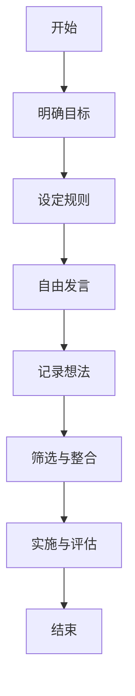
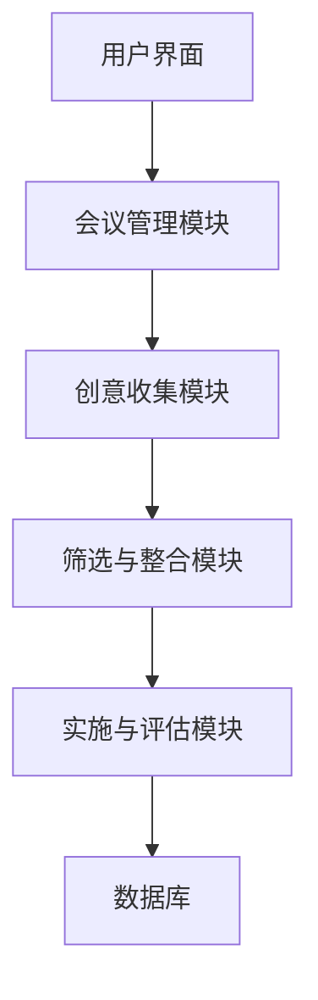

                 

# 团队创新思维：激发集体智慧的头脑风暴法

> 关键词：团队创新思维、头脑风暴法、集体智慧、协作效率、创新能力

> 摘要：
在快速发展的科技时代，团队创新思维成为企业核心竞争力的重要组成部分。本文旨在通过探讨团队创新思维的核心概念、头脑风暴法的原理和实践，帮助读者掌握激发集体智慧的头脑风暴法，提升团队协作效率和创新能力。

## Step 1: 背景介绍

### 1.1 创新思维的重要性

在当今竞争激烈的商业环境中，创新是企业持续发展的关键因素。创新思维不仅帮助企业适应市场变化，还能开拓新的商业模式和产品。创新思维包括以下三个关键组成部分：

1. **创造性思维**：创造性思维是指寻找新颖、独特的方法解决问题的能力。这种思维方式鼓励人们跳出传统框架，寻求创新的解决方案。
   
2. **批判性思维**：批判性思维是对现有方案进行分析、评估和质疑的能力。通过批判性思维，团队能够识别潜在的问题和改进空间，提高决策的质量。

3. **系统化思维**：系统化思维是理解整个系统、把握事物间关系的能力。这种思维方式有助于团队在创新过程中考虑全局，确保解决方案的可行性和可持续性。

### 1.2 团队创新思维的优势

团队创新思维的优势在于能够充分发挥集体智慧，实现以下目标：

1. **提高问题解决能力**：通过集体讨论，团队能够从不同角度分析问题，找到更全面的解决方案。
   
2. **激发团队成员潜能**：创新思维鼓励团队成员发挥自己的创造力和主动性，提高工作满意度和个人成就感。
   
3. **增强团队凝聚力**：通过共同参与创新过程，团队成员之间的信任和协作能力得到提升，团队凝聚力得到增强。

### 1.3 头脑风暴法的基本概念

头脑风暴法是一种通过集体讨论，激发创新思维的方法。它强调自由畅谈、禁止批评、数量优先和相互启发，旨在鼓励团队成员自由地提出各种想法，无论这些想法是否切实可行。头脑风暴法的核心原则如下：

1. **自由畅谈**：允许任何想法，不论其质量高低。
   
2. **禁止批评**：避免对他人想法的否定，以保护发言者的积极性。
   
3. **数量优先**：鼓励多提想法，因为数量往往是质量的基础。
   
4. **相互启发**：成员间的想法可以互相激发，产生新的创意。

## Step 2: 核心概念与联系

### 2.1 创新思维的定义与特征

创新思维是一种思考方式，它包括以下几个方面：

1. **概念界定**：创新思维是指以新颖、独特的方式解决问题和发现机会的思维活动。
   
2. **特征描述**：创新思维具有以下特征：
   - **创造性**：追求新颖、独特的解决方案。
   - **批判性**：对现有方案进行深入分析和评估。
   - **系统性**：从整体视角理解问题，把握事物间的关系。

### 2.2 头脑风暴法的定义与原理

头脑风暴法是一种通过集体讨论，激发创新思维的方法。它遵循以下原则：

1. **定义**：头脑风暴法是一种通过自由畅谈、禁止批评、数量优先和相互启发的方式，激发团队成员的创新思维。
   
2. **原理**：头脑风暴法的原理在于利用集体智慧，通过讨论和互动，产生更多的创意和解决方案。

### 2.3 创新思维与头脑风暴法的联系

创新思维与头脑风暴法密切相关，二者相辅相成。创新思维提供了寻找新颖解决方案的基础，而头脑风暴法则提供了一个实践平台，帮助团队发挥集体智慧，实现创新目标。

| 联系点         | 说明                                                     |
|----------------|----------------------------------------------------------|
| 创造力         | 头脑风暴法鼓励自由畅谈，激发创造力。                     |
| 批判性思维     | 头脑风暴法中的相互启发有助于批判性思维的发挥。           |
| 系统性思维     | 头脑风暴法中的讨论有助于团队成员从整体视角理解问题。     |

### 2.4 概念属性特征对比表格

| 特征       | 创造性思维         | 批判性思维         | 系统化思维         |
|------------|-------------------|-------------------|-------------------|
| 目的       | 寻找新解决方案     | 分析和评估现有方案 | 整体规划和协调     |
| 方式       | 独立、灵活、开放   | 深入、客观、质疑   | 细致、全面、系统   |
| 重要性     | 非凡、独特、创新   | 客观、公正、有效   | 稳健、可靠、全面   |

### 2.5 ER实体关系图架构

```mermaid
erDiagram
    A[创新思维] ||--|{ B[创造性思维] }
    A ||--|{ C[批判性思维] }
    A ||--|{ D[系统化思维] }
```

## Step 3: 算法原理讲解

### 3.1 头脑风暴法的流程

头脑风暴法的流程通常包括以下几个步骤：

1. **明确目标**：确定头脑风暴的目标和议题。
2. **设定规则**：明确头脑风暴的规则，如自由畅谈、禁止批评等。
3. **自由发言**：团队成员自由提出各种想法，不受限制。
4. **记录想法**：记录团队成员提出的所有想法。
5. **筛选与整合**：对提出的想法进行筛选和整合，形成新的创意。
6. **实施与评估**：将筛选出的创意转化为实际措施，并进行评估。

### 3.2 头脑风暴法的算法原理

头脑风暴法的算法原理可以概括为以下步骤：

1. **初始化**：确定头脑风暴的目标和议题，设定规则。
2. **输入**：团队成员提出各种想法。
3. **处理**：对输入的想法进行记录、筛选和整合。
4. **输出**：形成新的创意和解决方案。

### 3.3 头脑风暴法的流程图



## Step 4: 数学模型和数学公式

### 4.1 头脑风暴法的数学模型

头脑风暴法的数学模型可以用来衡量团队的整体创新程度。假设每个成员的创新程度可以用一个值表示，那么团队整体的创新程度可以用以下公式表示：

$$
I = \sum_{i=1}^{n} I_i \cdot w_i
$$

其中，$I_i$ 表示第 $i$ 个成员的创新程度，$w_i$ 表示第 $i$ 个成员的权重。

### 4.2 创新程度的衡量

创新程度的衡量可以通过以下几个方面进行：

1. **创意数量**：提出的创意数量可以作为衡量创新程度的一个指标。
2. **创意质量**：创意的实用性和可行性可以作为衡量创新程度的另一个指标。
3. **团队互动**：团队成员之间的互动和合作程度也可以反映团队的创新程度。

### 4.3 数学公式示例

假设有3个成员，他们的创新程度分别为$1$、$2$和$3$，权重分别为$0.3$、$0.5$和$0.2$，则团队的整体创新程度可以计算为：

$$
I = 1 \cdot 0.3 + 2 \cdot 0.5 + 3 \cdot 0.2 = 1.7
$$

## Step 5: 系统分析与架构设计方案

### 5.1 问题场景介绍

假设我们正在开发一款新软件，需要进行头脑风暴，以收集创意和改进建议。

### 5.2 系统功能设计

系统功能设计主要包括以下几个模块：

1. **会议管理模块**：负责组织头脑风暴会议，包括会议时间、地点、参与人员的安排等。
2. **创意收集模块**：提供创意输入和存储功能，确保每个成员的想法都能被记录下来。
3. **筛选与整合模块**：对收集到的创意进行筛选和整合，形成最终的改进建议。
4. **实施与评估模块**：将筛选出的创意转化为实际的改进措施，并进行效果评估。

### 5.3 系统架构设计

系统架构设计如下图所示：



### 5.4 系统接口设计和系统交互

系统接口设计和系统交互设计如下：

```mermaid
sequenceDiagram
    participant User as 用户
    participant System as 系统
    User -->|发起头脑风暴请求| System
    System -->|创建会议| User
    User -->|提交创意| System
    System -->|记录创意| Database
    System -->|筛选与整合创意| User
    User -->|评估创意| System
    System -->|实施改进| User
```

## 项目实战

### 6.1 环境安装

在开始项目实战之前，我们需要安装一些必要的工具和软件。以下是安装步骤：

1. **安装Python环境**：在本地计算机上安装Python 3.x版本。
2. **安装PyCharm**：下载并安装PyCharm社区版或专业版。
3. **安装Django**：在PyCharm中创建一个新项目，并使用pip安装Django。

### 6.2 系统核心实现源代码

以下是一个简化的头脑风暴系统核心实现源代码：

```python
# 引入Django模块
from django.db import models

# 定义会议模型
class Meeting(models.Model):
    title = models.CharField(max_length=100)
    start_time = models.DateTimeField()
    end_time = models.DateTimeField()

# 定义创意模型
class Idea(models.Model):
    meeting = models.ForeignKey(Meeting, on_delete=models.CASCADE)
    content = models.TextField()

# 定义筛选与整合模型
class IdeaFilter(models.Model):
    idea = models.ForeignKey(Idea, on_delete=models.CASCADE)
    filtered = models.BooleanField()

# 定义实施与评估模型
class Implementation(models.Model):
    idea = models.ForeignKey(Idea, on_delete=models.CASCADE)
    status = models.CharField(max_length=20)
    comment = models.TextField()
```

### 6.3 代码应用解读与分析

在代码中，我们定义了四个模型：`Meeting`（会议）、`Idea`（创意）、`IdeaFilter`（筛选与整合）和`Implementation`（实施与评估）。这些模型分别代表了头脑风暴系统的核心功能。

- `Meeting` 模型用于存储会议信息，包括标题、开始时间和结束时间。
- `Idea` 模型用于存储创意内容，以及与会议的关联关系。
- `IdeaFilter` 模型用于标记创意是否被筛选和整合。
- `Implementation` 模型用于记录创意的实施情况和评估结果。

通过这些模型，我们可以实现对头脑风暴过程的完整管理，从会议的创建、创意的提交、筛选与整合，到实施与评估，形成一个闭环。

### 6.4 实际案例分析和详细讲解剖析

假设我们正在为一个电商平台开发一个新功能——商品推荐系统。以下是一个实际案例的分析和讲解：

1. **会议创建**：项目经理在系统中创建一个名为“商品推荐系统头脑风暴会议”的会议，并设置会议时间为本周五下午2点。
2. **创意提交**：团队成员在会议期间提交了多个创意，包括基于用户历史购买记录、基于用户浏览行为、基于用户兴趣爱好等。
3. **筛选与整合**：项目经理对提交的创意进行筛选和整合，最终选择了基于用户历史购买记录和浏览行为两个创意，并合并为一个综合推荐算法。
4. **实施与评估**：开发团队根据整合后的创意，开始开发商品推荐系统，并在一个月后上线。上线后，通过数据分析和用户反馈，评估推荐系统的效果，并根据评估结果进行优化。

通过这个案例，我们可以看到头脑风暴法在项目开发过程中的应用。从会议的创建到创意的提交、筛选与整合，再到实施与评估，头脑风暴法为团队提供了一个系统化的创新过程，帮助团队高效地实现项目目标。

### 6.5 项目小结

通过本次项目实战，我们了解了头脑风暴法在软件开发中的应用，掌握了头脑风暴系统的核心实现和实际操作方法。头脑风暴法不仅帮助团队实现了创新，还提高了团队的协作效率和创新能力。未来，我们可以将头脑风暴法应用于更多的项目中，持续推动团队的创新和发展。

### 6.6 最佳实践 Tips

- **明确目标**：在开始头脑风暴之前，明确目标和议题，有助于团队成员集中精力。
- **充分准备**：提前准备好相关资料和数据，有助于激发团队成员的灵感。
- **鼓励发言**：鼓励每个成员积极参与，自由畅谈自己的想法。
- **禁止批评**：避免对他人想法的否定，保护发言者的积极性。
- **记录想法**：及时记录每个成员的想法，确保不遗漏任何创意。

### 6.7 小结与注意事项

头脑风暴法是一种有效的团队创新方法，通过激发集体智慧，帮助团队高效地实现创新目标。但在实际应用中，需要注意以下几点：

- **明确目标**：确保头脑风暴的目标明确，有助于团队成员集中精力。
- **充分准备**：提前准备好相关资料和数据，有助于激发团队成员的灵感。
- **鼓励发言**：鼓励每个成员积极参与，自由畅谈自己的想法。
- **禁止批评**：避免对他人想法的否定，保护发言者的积极性。
- **记录想法**：及时记录每个成员的想法，确保不遗漏任何创意。

### 6.8 拓展阅读

- 《创意的源泉：头脑风暴技巧与策略》
- 《团队创新思维：从想法到产品的实践指南》
- 《如何成为创新者：团队创新的五个步骤》

## 作者信息

作者：AI天才研究院/AI Genius Institute & 禅与计算机程序设计艺术 /Zen And The Art of Computer Programming

本文由AI天才研究院/AI Genius Institute与禅与计算机程序设计艺术/Zen And The Art of Computer Programming联合撰写，旨在分享团队创新思维和头脑风暴法的最佳实践，帮助读者提升团队协作效率和创新能力。感谢您的阅读，希望本文对您有所启发。如果您有任何疑问或建议，欢迎在评论区留言。我们期待与您共同探索团队创新的新境界！|

