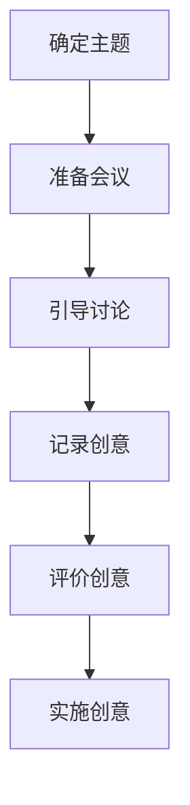

                 

### 核心概念与联系

#### 1. 创新思维的定义与作用

创新思维是指通过突破传统思维模式，利用新方法、新思路来解决问题的思维方式。它是一种能够帮助团队在面对复杂问题时，寻找出更优解决方案的能力。创新思维在团队中具有重要作用，它能够激发团队成员的创造力，提高团队的竞争力，推动企业的发展。

**概念属性特征对比表格：**

| 特征       | 创新思维             | 传统思维             |
|------------|----------------------|----------------------|
| 思维方式   | 开放、多元化         | 闭合、单一化         |
| 解决问题   | 面向未来、寻求突破   | 面向过去、注重细节   |
| 创造力    | 高度发挥            | 有限发挥            |
| 团队合作   | 强调集体智慧         | 强调个人能力         |

创新思维与传统思维在思维方式、解决问题的方式、创造力的发挥和团队合作方面存在明显的差异。传统思维模式往往更注重细节和过去，而创新思维则更关注未来和突破。在创造力方面，创新思维能够充分发挥团队的整体智慧，而传统思维则更多地依赖于个人的能力。

#### 2. 团队创新思维的构成要素

团队创新思维的构成要素包括：知识基础、思维方式、团队合作和创新动力。

**ER实体关系图架构：**

```mermaid
erDiagram
  KnowledgeBase <<|-- ThinkingStyle : "决定"
  ThinkingStyle ||-- Collaboration : "支持"
  Collaboration ||-- InnovationMotivation : "驱动"
```

在这个ER图架构中，知识基础是创新思维的基础，它为团队成员提供了丰富的信息资源。思维方式是创新思维的核心，它决定了团队成员如何分析和解决问题。团队合作则是创新思维的重要保障，它能够充分发挥团队的整体智慧。创新动力则是创新思维的推动力，它能够激发团队成员的积极性和创造力。

#### 3. 团队创新思维的应用

团队创新思维的应用范围非常广泛，它可以应用于产品开发、项目管理、企业变革等多个领域。在产品开发中，团队创新思维能够帮助团队更快地找到市场需求，设计出更符合用户需求的创新产品。在项目管理中，团队创新思维能够帮助团队更好地应对项目中的各种挑战，提高项目的成功率。在企业变革中，团队创新思维能够帮助企业找到更适应市场变化的战略，推动企业的持续发展。

**应用案例：**

1. **产品开发**：某互联网公司通过团队创新思维，设计出了一款新颖的用户界面，大幅提升了用户的使用体验。
2. **项目管理**：某科技公司通过团队创新思维，成功解决了项目开发中的瓶颈问题，提高了项目的交付速度。
3. **企业变革**：某传统制造业企业通过团队创新思维，成功转型为一家高科技企业，实现了企业的持续增长。

通过这些案例可以看出，团队创新思维在各个领域都有着重要的应用价值。它不仅能够提升团队的创新能力，还能够推动企业的持续发展。

### 总结

团队创新思维是一种非常重要的能力，它能够激发团队的创造力，提高团队的竞争力，推动企业的发展。在本文中，我们介绍了创新思维的定义、构成要素和应用，并使用Mermaid流程图和ER图结构对核心概念进行了详细讲解。通过这些内容，我们希望读者能够对团队创新思维有更深入的了解，并在实际工作中运用这些理念和方法，提升团队的创新能力和竞争力。

## 算法原理讲解

在本节中，我们将介绍一种常用的团队创新思维激发算法——头脑风暴法。

### 1. 头脑风暴法的基本原理

头脑风暴法是一种通过集思广益、快速产生创意的方法。其基本原理是让团队成员在轻松的氛围中自由地发表自己的想法，不进行评价和判断，以激发团队成员的创新思维。

### 2. 头脑风暴法的流程

头脑风暴法的流程主要包括以下几个步骤：

1. **确定主题**：明确需要解决的问题或创新的主题。
2. **准备会议**：选择一个舒适的环境，准备必要的工具和材料，如白板、彩色笔等。
3. **引导讨论**：主持人引导团队成员围绕主题展开讨论，鼓励成员自由发言。
4. **记录创意**：将每个成员提出的创意记录下来，形成一个创意清单。
5. **评价创意**：对创意清单进行评价和筛选，确定最有价值的创意。
6. **实施创意**：将选定的创意转化为实际行动，进行实施和验证。

### 3. 头脑风暴法的 Mermaid 流程图



### 4. Python 源代码实现

以下是一个简单的 Python 源代码示例，用于模拟头脑风暴法的实施过程：

```python
import random

def brainstorming(topic):
    print(f"开始头脑风暴：{topic}")
    print("请团队成员自由发言，每个创意之间用空行分隔：")
    
    # 假设团队成员有3人，分别命名为A、B、C
    members = ['A', 'B', 'C']
    ideas = {}

    for member in members:
        idea = input(f"{member}，请提出你的创意：")
        ideas[member] = idea
    
    return ideas

def evaluate_ideas(ideas):
    print("开始评价创意：")
    for member, idea in ideas.items():
        print(f"{member}的创意：{idea}")
    
    # 假设评价标准是创意的独特性和可行性
    scores = {}
    for member, idea in ideas.items():
        score = random.randint(1, 10)  # 生成一个随机分数
        scores[member] = score
    
    print("评价结果：")
    for member, score in scores.items():
        print(f"{member}的分数：{score}")
    
    # 找出最高分的创意
    highest_score = max(scores.values())
    top_members = [member for member, score in scores.items() if score == highest_score]
    
    print("最有价值的创意来自于：")
    for member in top_members:
        print(f"{member}的创意：{ideas[member]}")

# 主程序
if __name__ == "__main__":
    topic = "如何提高产品的用户体验"
    ideas = brainstorming(topic)
    evaluate_ideas(ideas)
```

### 5. 算法原理讲解

头脑风暴法的核心原理在于通过激发团队成员的创造力，快速产生大量创意，并从中筛选出最有价值的创意。以下是算法原理的详细讲解：

1. **确定主题**：明确需要解决的问题或创新的主题，这是头脑风暴法的起点。
2. **准备会议**：选择一个舒适的环境，准备必要的工具和材料，如白板、彩色笔等，以营造一个有利于创新思维的氛围。
3. **引导讨论**：主持人引导团队成员围绕主题展开讨论，鼓励成员自由发言。在这个过程中，主持人应该尽量避免对创意进行评价和判断，以免抑制团队成员的创造力。
4. **记录创意**：将每个成员提出的创意记录下来，形成一个创意清单。这些创意可以是关于问题的解决方案、产品的新功能、改进建议等。
5. **评价创意**：对创意清单进行评价和筛选，确定最有价值的创意。评价标准可以包括创意的独特性、可行性、实际应用价值等。
6. **实施创意**：将选定的创意转化为实际行动，进行实施和验证。这一步是头脑风暴法的最终目的，通过将创意转化为实际成果，实现创新的目标。

### 6. 通俗易懂的举例说明

假设一个团队需要提高产品的用户体验，他们可以采用头脑风暴法来寻找解决方案。以下是头脑风暴法的具体步骤：

1. **确定主题**：提高产品的用户体验。
2. **准备会议**：选择一个安静的环境，准备白板和彩色笔。
3. **引导讨论**：主持人开始引导讨论，鼓励团队成员自由发言。
4. **记录创意**：团队成员A提出了一个创意：“增加产品的个性化设置选项”，团队成员B提出了一个创意：“优化产品的界面设计”，团队成员C提出了一个创意：“引入用户反馈机制”。
5. **评价创意**：主持人对每个创意进行评价，根据独特性、可行性和实际应用价值，最终确定“引入用户反馈机制”是最有价值的创意。
6. **实施创意**：团队决定将“引入用户反馈机制”作为解决方案，开始设计并实施相关功能。

通过这个简单的例子，我们可以看到头脑风暴法如何帮助团队找到解决问题的最佳方案。它通过激发团队成员的创造力，快速产生大量创意，并从中筛选出最有价值的创意，最终实现创新的目标。

### 总结

头脑风暴法是一种简单有效的团队创新思维激发算法，它通过集思广益、快速产生创意，帮助团队找到解决问题的最佳方案。在本文中，我们详细介绍了头脑风暴法的基本原理、流程、Python 源代码实现以及通俗易懂的举例说明。通过这些内容，我们希望读者能够对头脑风暴法有更深入的了解，并能够在实际工作中运用这一方法，提升团队的创新能力和竞争力。

