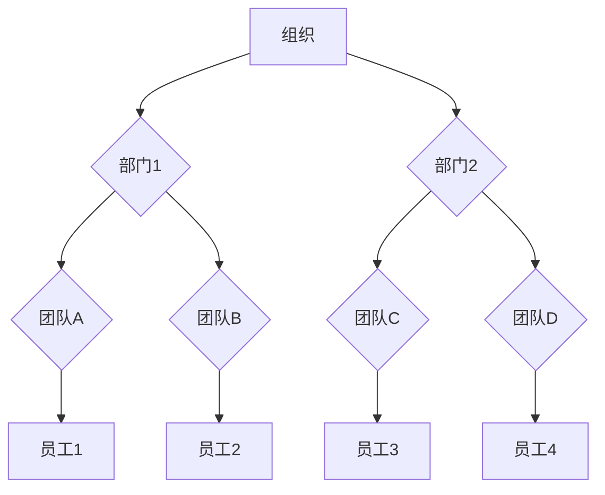
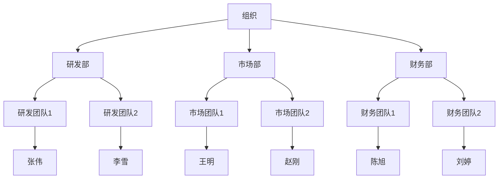
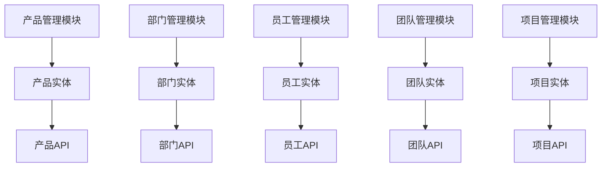
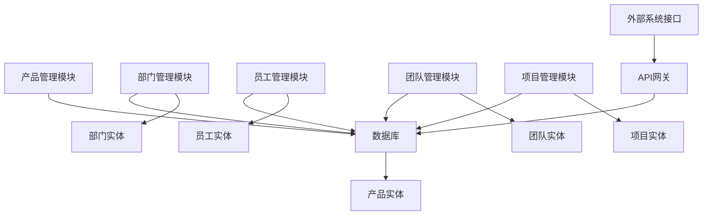
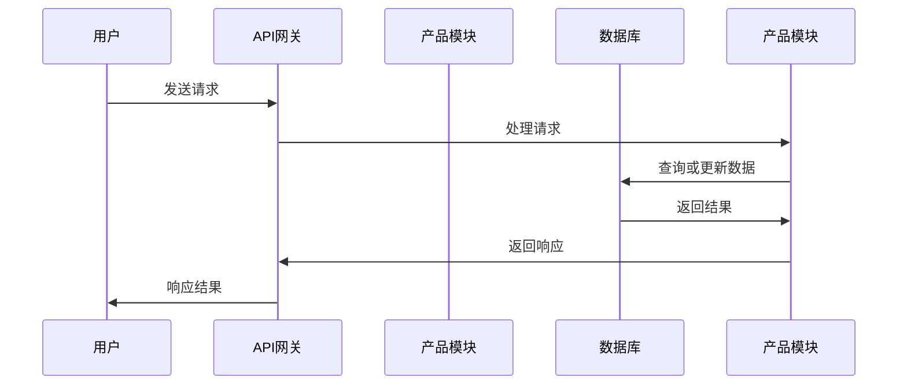
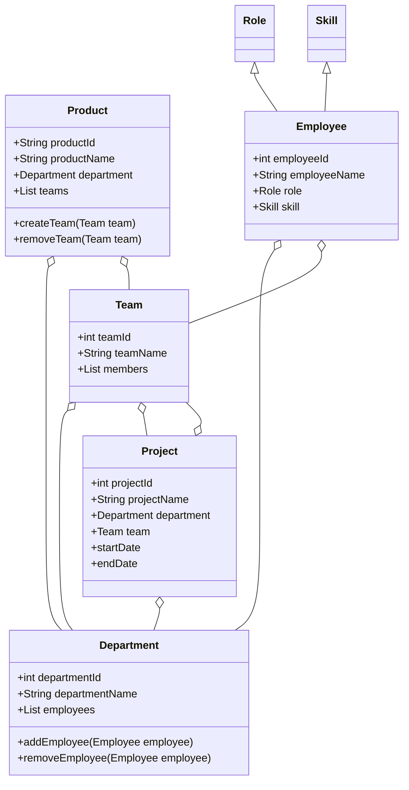

                 


### **一、团队创新机制概述**

#### **1.1 创新的重要性**

创新，作为推动社会进步和经济发展的核心动力，早已成为各类组织和企业战略布局中的重要组成部分。在当今这个知识经济时代，创新能力不仅决定着企业的市场竞争力和生存能力，更是衡量一个国家或地区综合实力的重要标准。

##### **1.1.1 创新驱动的发展**

创新驱动的理念起源于20世纪中后期，尤其是随着信息技术和互联网技术的飞速发展，创新成为推动经济增长和社会发展的关键因素。传统的资源驱动、劳动力驱动模式逐渐被创新驱动模式所取代。创新驱动的发展主要体现在以下几个方面：

- **技术创新**：技术进步是推动经济发展的基础，通过技术创新可以实现生产效率的提升、成本的降低和产品质量的改进。例如，5G技术的推广和应用将大大提升通信速度和稳定性，从而带动智能家居、物联网等新兴产业的快速发展。

- **商业模式创新**：随着市场的变化和消费者需求的多样化，企业需要不断创新商业模式以适应新的市场环境。例如，共享经济的兴起不仅改变了人们的出行方式，还推动了汽车租赁、住宿共享等新兴行业的发展。

- **管理创新**：管理创新涉及企业组织结构、管理制度、管理工具等方面的变革。通过管理创新，企业可以提高管理效率，优化资源配置，提升整体运营效能。例如，精益生产、敏捷开发等管理理念和方法的应用，有助于企业实现高效的生产流程和灵活的市场响应。

##### **1.1.2 创新与竞争优势**

创新是获取竞争优势的重要手段。竞争优势来源于产品或服务的差异化、生产效率的提升、成本的降低等方面。通过创新，企业可以在以下几个方面获得竞争优势：

- **产品差异化**：创新有助于企业开发出具有独特功能和价值的产品或服务，从而在市场上形成差异化竞争优势。例如，苹果公司通过不断的科技创新，推出了一系列具有独特设计和高性能的电子产品，赢得了大量消费者的青睐。

- **生产效率提升**：通过技术创新和管理创新，企业可以优化生产流程，提高生产效率，降低生产成本。例如，丰田公司通过精益生产方法，实现了生产效率的大幅提升，成为全球汽车行业的领军企业。

- **成本领先**：创新可以帮助企业找到降低成本的有效途径，从而在价格竞争中占据优势。例如，阿里巴巴通过大数据分析和云计算技术，优化了物流和供应链管理，实现了物流成本的显著降低。

##### **1.1.3 创新对企业的影响**

创新对企业的影响是多方面的，不仅涉及企业的生存和发展，还涉及到企业的战略定位、组织结构、人力资源等方面。

- **战略定位**：创新有助于企业明确战略定位，抓住市场机遇，实现可持续发展。例如，华为公司通过持续的技术创新，在国际市场上赢得了广泛的认可，成为全球领先的通信设备供应商。

- **组织结构**：创新需要适应企业的组织结构，合理的组织结构可以促进创新活动的开展。例如，谷歌公司的“20%时间项目”允许员工用20%的工作时间自由探索新的创意，这种灵活的组织结构有助于激发员工的创新潜力。

- **人力资源**：创新需要高素质的人才支持，企业需要通过吸引、培养和激励人才来推动创新。例如，微软公司通过提供有竞争力的薪酬福利和职业发展机会，吸引了大量优秀的软件开发人才，为公司的技术创新提供了强有力的支持。

#### **1.2 团队创新机制的定义与特征**

##### **1.2.1 团队创新机制的概念**

团队创新机制是指组织内部通过系统化的方式来激发、支持和实现团队创新的一套制度和流程。它不仅仅是创新行为的个体活动，而是通过制度化的方式，使得创新成为一种持续、系统、可操作的活动。

- **团队创新**：团队创新强调创新活动的集体性，通过团队成员的协同合作来实现创新目标。与个体创新相比，团队创新具有更高的成功率、更丰富的创意来源和更广泛的实施可能性。

- **机制**：机制是指为实现某一目标而建立的一套制度、流程和规则。团队创新机制则是为了促进团队创新活动而建立的一套制度和流程，包括创新目标设定、资源分配、激励机制、流程管理等方面。

##### **1.2.2 团队创新机制的核心特征**

团队创新机制具有以下几个核心特征：

- **系统性**：团队创新机制不是零散的、孤立的活动，而是通过一系列相互关联、相互促进的制度和流程来实现的。系统性使得创新活动可以在组织内部持续、稳定地进行。

- **灵活性**：团队创新机制需要根据外部环境的变化和内部资源条件的变化进行灵活调整。灵活性有助于创新机制适应不同的创新需求和挑战。

- **激励性**：激励机制是团队创新机制的重要组成部分。有效的激励机制可以激发团队成员的创新积极性，提高创新成功率。

- **协同性**：团队创新强调协同合作，通过团队成员之间的知识共享、信息交流和协同努力，实现创新目标。协同性是团队创新机制的核心特征之一。

- **持续性**：团队创新机制不仅仅是解决短期创新问题，更是为了建立长期的创新能力和创新文化。持续性是衡量团队创新机制有效性的重要指标。

##### **1.2.3 团队创新机制与传统管理方式对比**

团队创新机制与传统管理方式存在显著差异，主要体现在以下几个方面：

- **目标导向性**：传统管理方式更注重短期目标的实现，而团队创新机制更注重长期创新能力和创新文化的建设。

- **灵活性**：传统管理方式往往具有较强的刚性，创新活动受到制度、流程和规则的限制。团队创新机制更加灵活，能够根据实际情况进行调整和优化。

- **激励机制**：传统管理方式通常以绩效为导向，而团队创新机制则更注重创新成果的激励，通过多样化的激励机制来激发团队成员的创新能力。

- **协同合作**：传统管理方式强调个人绩效，而团队创新机制强调团队合作，通过协同合作实现创新目标。

- **系统化**：传统管理方式往往是分散的、孤立的，而团队创新机制通过系统化的方式，将创新活动纳入组织的整体战略中，实现创新活动的整体优化。

通过以上分析，我们可以看出，团队创新机制是一种旨在激发团队创新能力、实现持续创新的组织设计。它不仅关注创新活动的结果，更关注创新过程的管理和机制的构建。在接下来的章节中，我们将进一步探讨团队创新机制的具体设计原则和实施策略。****

### **1.3 团队创新机制的边界与外延**

团队创新机制作为推动组织持续创新的重要手段，其有效性和适用性不仅取决于内部设计，还需要考虑外部环境的影响。在本节中，我们将探讨团队创新机制的边界与外延，包括其适用范围、面临的挑战以及可能产生的影响。

#### **1.3.1 团队创新机制的适用范围**

团队创新机制的适用范围相对广泛，但具体实施时需要根据组织的性质、规模、行业特点等因素进行个性化设计。以下是一些适用范围的具体分析：

- **企业**：在企业发展过程中，创新是企业保持竞争力、实现持续增长的关键。通过团队创新机制，企业可以激发员工的创新潜力，开发出具有市场竞争力的新产品或服务，优化生产流程，降低成本。不同类型的企业，如初创公司、成熟企业、跨国企业等，可以根据自身特点，采用不同的团队创新机制。

- **科研机构**：科研机构作为知识创新的重要载体，团队创新机制有助于促进科研团队之间的知识共享和协同创新。通过建立科学合理的创新机制，科研机构可以提高科研效率，推动科研成果的转化和应用。

- **政府部门**：在政府管理和服务过程中，创新机制的应用有助于提高政府治理效率和公共服务质量。例如，在应急管理、城市规划和环境保护等领域，团队创新机制可以促进跨部门协作，提高政策制定的科学性和有效性。

- **教育机构**：在教育领域，团队创新机制可以促进教学创新、教育模式改革。通过建立创新机制，教育机构可以激发教师和学生的创新意识，培养具有创新能力和综合素质的人才。

- **非营利组织**：非营利组织同样可以通过团队创新机制，提高项目运作效率，实现社会责任的最大化。例如，在公益事业、环境保护、社会服务等领域，团队创新机制有助于发现和解决社会问题，提高组织的公益效益。

#### **1.3.2 团队创新机制面临的挑战**

尽管团队创新机制在推动组织创新方面具有显著优势，但在实际应用过程中也面临着一系列挑战：

- **文化阻力**：在传统保守的文化氛围中，团队创新机制的实施可能遇到员工的抵触和怀疑。改变员工的思维方式和工作习惯，需要时间和耐心，需要通过有效的沟通和培训来逐步推进。

- **资源限制**：团队创新机制的建立和运行需要一定的资源投入，包括人力、财力、物力等。在资源有限的情况下，如何合理配置资源，确保创新活动的顺利进行，是组织需要考虑的问题。

- **管理复杂性**：团队创新机制涉及到多个环节和多个部门的协作，管理复杂度较高。如何建立有效的管理体系，确保创新机制的正常运行，是组织管理者需要面对的挑战。

- **市场风险**：创新活动存在一定的不确定性，可能面临市场失败的风险。如何在创新过程中进行有效的风险管理，避免因创新失败而导致组织损失，是团队创新机制需要关注的问题。

#### **1.3.3 团队创新机制的潜在影响**

团队创新机制不仅有助于提升组织的创新能力，还可能产生以下潜在影响：

- **提高组织竞争力**：通过持续的创新，组织可以开发出具有市场竞争力的产品或服务，提高市场份额和品牌知名度，从而在激烈的市场竞争中立于不败之地。

- **促进知识共享**：团队创新机制鼓励团队成员之间的知识共享和协同合作，有助于形成良好的学习氛围，提高整体团队的知识水平和创新能力。

- **提升员工满意度**：有效的激励机制和良好的工作氛围可以提高员工的满意度和忠诚度，降低员工流失率，为组织持续发展提供人才保障。

- **推动组织变革**：团队创新机制的实施可能导致组织的结构、流程和文化发生变革，推动组织向更加开放、灵活和创新的形态发展。

综上所述，团队创新机制作为一种系统化的组织设计，其适用范围广泛，但在实际应用过程中面临着一系列挑战。通过合理设计和管理，团队创新机制可以成为组织持续创新的重要推动力。在接下来的章节中，我们将进一步探讨团队创新机制的核心概念、联系以及组织设计中的具体应用。****

### **1.4 核心概念解析**

在探讨团队创新机制之前，我们需要对几个核心概念进行详细解析，包括创新、团队和团队创新。这些概念不仅构成了团队创新机制的基础，也是理解团队创新机制运行逻辑的关键。

#### **1.4.1 创新的定义**

创新，简而言之，是指通过新的想法、方法或技术，创造性地解决问题或满足需求的过程。具体来说，创新可以分为以下几种类型：

- **产品创新**：指在产品或服务层面进行创新，如开发出全新的产品或对现有产品进行改进。例如，苹果公司的iPhone产品线不断更新，通过引入新的设计、功能和用户体验，实现了产品创新。

- **过程创新**：指在生产和运营流程层面进行创新，以优化生产效率、降低成本或提高服务质量。例如，丰田公司的精益生产方法，通过消除浪费、提高生产效率，实现了过程创新。

- **商业模式创新**：指在商业模式层面进行创新，通过新的商业模式来创造价值、降低成本或拓展市场。例如，Uber和Airbnb通过创新的共享经济模式，改变了传统的出行和住宿模式。

#### **1.4.2 团队的定义**

团队是指由一组成员组成，共同完成一个共同目标的集体。团队的特点包括：

- **共同目标**：团队成员有共同的目标和愿景，通过协作和合作来实现目标。

- **多元角色**：团队成员各有所长，扮演不同的角色，相互补充，共同推动团队目标的实现。

- **协同合作**：团队成员之间需要进行有效的沟通和协作，共享信息和资源，共同解决问题。

#### **1.4.3 团队创新**

团队创新是指在团队环境中，通过集体智慧和协同合作，实现新的创意和解决方案的过程。团队创新具有以下几个特点：

- **集体智慧**：团队创新依赖于团队成员的集体智慧，通过头脑风暴、知识共享和协同合作，产生更多的创意和想法。

- **快速迭代**：团队创新通常采用快速迭代的方法，不断试错、改进和优化，以快速实现创新目标。

- **多元化**：团队创新鼓励多元化的思维和观点，通过不同背景、经验和技能的碰撞，激发更多的创新可能性。

#### **1.4.4 创新与团队的关系**

创新与团队之间的关系密不可分，具体表现在以下几个方面：

- **团队是创新的载体**：创新需要在团队中进行，团队是实现创新目标的核心力量。通过团队的合作和协作，创新活动可以更加高效地推进。

- **创新促进团队发展**：创新不仅可以推动组织的进步，还可以提升团队的整体能力和素质。在创新过程中，团队成员可以学习新的知识和技能，提高解决问题的能力。

- **团队文化是创新的基础**：创新需要在一个开放、包容、鼓励尝试和错误的文化环境中进行。团队文化对创新的影响至关重要，积极的文化氛围可以激发团队成员的创新潜力。

#### **1.4.5 创新与团队的ER实体关系图**

为了更清晰地展示创新与团队之间的关系，我们可以通过实体关系图（Entity-Relationship Diagram，ERD）来表示。以下是创新与团队的ER实体关系图的示例：

```mermaid
erDiagram
  创新 ||--|{ 团队 }| 创新目标
  创新 ||--|{ 团队成员 }| 创新贡献
  团队成员 ||--|{ 创新 }| 创新成果
  团队成员 ||--|{ 团队目标 }| 团队协作
  团队目标 ||--|{ 创新 }| 创新驱动
```

在这个ERD中，创新作为主体，与团队、团队成员和团队目标存在密切的关系。创新目标由团队共同设定，团队成员通过贡献和协作实现创新成果，团队目标则驱动创新活动的进行。

通过以上对核心概念的详细解析，我们为理解团队创新机制奠定了坚实的基础。在接下来的章节中，我们将进一步探讨组织设计中的团队创新机制，包括组织结构、团队协作、激励机制等方面的具体应用和设计策略。****

### **2.1 创新概念解析**

创新，作为驱动经济发展的核心动力，是组织竞争力和可持续发展的重要源泉。在探讨团队创新机制之前，我们需要对创新的概念进行深入解析，以明确其定义、分类和属性特征。

#### **2.1.1 创新的定义**

创新，广义上指通过新想法、新方法、新技术或新模式的引入，以解决问题、提高效率或创造新价值的过程。创新可以发生在不同层面上，包括技术层面、产品层面、服务层面和商业模式层面。狭义上，创新通常指在技术领域的新发明和新创造。

创新不仅限于技术突破，还可以体现在管理方法、商业模式、流程优化等方面。例如，丰田公司的精益生产方法、谷歌的“20%时间项目”都是管理层面的创新。

#### **2.1.2 创新的分类**

根据创新的主体、目标和范围，创新可以分为多种类型：

- **按主体分类**：
  - **企业创新**：企业通过研发新产品、改进生产工艺、优化商业模式等方式进行创新。
  - **政府创新**：政府在政策制定、公共服务提供和社会治理等方面进行创新，以提高治理效率和服务质量。
  - **科研机构创新**：科研机构通过基础研究和应用研究推动科学技术的进步。

- **按目标分类**：
  - **市场导向创新**：以市场需求为导向，开发新产品或服务，以满足消费者需求。
  - **技术导向创新**：以技术突破为目标，推动技术进步和产业升级。
  - **效率导向创新**：以提高生产效率和运营效率为目标，优化生产流程和管理方法。

- **按范围分类**：
  - **单一领域创新**：仅在一个领域内进行创新，如技术创新、产品创新等。
  - **跨领域创新**：在不同领域之间进行创新，如将信息技术应用于医疗领域，推动医疗技术的发展。

#### **2.1.3 创新的属性特征对比**

以下是一个创新属性特征对比表格，用于说明不同类型创新之间的主要区别：

| 创新类型 | 目标 | 特征 | 示例 |
| --- | --- | --- | --- |
| 技术创新 | 技术突破 | 需要高水平的技术研发能力 | 开发新型材料、新型传感器 |
| 产品创新 | 满足市场需求 | 需要市场调研和产品设计能力 | 设计新的手机型号、新的汽车品牌 |
| 商业模式创新 | 改变商业模式 | 需要市场洞察和商业策划能力 | 电子商务平台的兴起、共享经济的普及 |
| 过程创新 | 优化生产流程 | 需要流程优化和管理改进 | 精益生产、敏捷开发 |

#### **2.1.4 创新的属性特征对比表格**

以下是一个简单的创新属性特征对比表格，用于说明不同类型创新之间的主要区别：

| 创新类型 | 目标 | 主要特征 | 示例 |
| --- | --- | --- | --- |
| 技术创新 | 技术突破 | 研发新技术、提高技术水平 | 开发新型芯片、突破新材料 |
| 产品创新 | 满足市场需求 | 设计新产品、优化用户体验 | 推出新手机、改进家电设计 |
| 商业模式创新 | 改变商业模式 | 创新盈利模式、拓展市场 | 实施电子商务、引入订阅服务 |
| 过程创新 | 优化生产流程 | 提高生产效率、降低成本 | 采用精益生产、优化供应链 |

通过以上对创新概念的详细解析，我们为理解团队创新机制提供了理论基础。在接下来的章节中，我们将进一步探讨团队的概念，分析团队的特点和构成，为构建有效的团队创新机制奠定基础。****

### **2.2 团队概念解析**

团队是一个由多个成员组成的协作体，共同为实现某个共同目标而努力。在组织创新过程中，团队的作用至关重要。本节将详细解析团队的概念，包括其定义、类型和核心特征。

#### **2.2.1 团队的定义**

团队是指一组相互依赖、协同工作，为实现共同目标而努力的成员组成的集体。团队具有以下基本特征：

- **共同目标**：团队成员有一个共同的目标，这个目标是团队协作的导向。共同目标可以激发团队成员的积极性和合作精神。
- **相互依赖**：团队成员之间相互依赖，各自承担不同的角色和职责，通过协作和合作完成任务。
- **共享资源**：团队成员共享信息和资源，以支持团队的共同目标。共享资源可以提高团队的整体效率和创新能力。
- **互动沟通**：团队成员之间需要进行有效的沟通和互动，以便及时解决问题、共享信息和协调行动。

#### **2.2.2 团队的类型**

团队可以根据不同的分类标准进行分类，常见的团队类型包括以下几种：

- **功能型团队**：根据组织的功能和职责划分，如研发团队、市场团队、财务团队等。功能型团队专注于特定领域，通过跨部门协作实现组织目标。
- **跨职能团队**：由不同部门、不同职能的成员组成，旨在解决特定问题或完成特定项目。跨职能团队可以充分利用不同领域的专业知识，提高问题解决能力。
- **项目型团队**：为完成特定项目而组建的团队，项目结束后团队解散。项目型团队通常具有明确的任务和时间限制，需要高效协同完成项目目标。
- **自我管理型团队**：成员自主管理、自我驱动，负责制定和实现团队目标。自我管理型团队强调自主性和责任感，可以激发成员的创新潜力和积极性。
- **虚拟团队**：通过信息技术手段连接的远程团队，成员可能位于不同的地理位置。虚拟团队可以跨越时间和空间的限制，实现全球协作。

#### **2.2.3 团队的特征**

团队具有以下核心特征：

- **协作性**：团队成员通过协作共同完成任务，协作性是团队成功的关键。团队成员需要共享资源和信息，相互支持，共同克服困难。
- **共同目标**：团队有一个明确的共同目标，这个目标是团队成员共同努力的方向。共同目标可以激发团队成员的积极性和团队凝聚力。
- **相互依赖**：团队成员之间相互依赖，每个成员的贡献都对团队目标的实现产生影响。相互依赖性使得团队成员需要协同工作，共同解决问题。
- **多样性和互补性**：团队成员具有不同的背景、经验和技能，这种多样性可以带来新的视角和创意，互补性则可以提升团队的整体能力。
- **灵活性**：团队需要根据任务和环境的变化进行调整，灵活应对各种挑战。灵活性是团队适应环境变化、保持创新能力的重要特征。

#### **2.2.4 团队的ER实体关系图**

为了更清晰地展示团队内部的关系，我们可以使用ER实体关系图（Entity-Relationship Diagram，ERD）来表示。以下是一个简单的团队ER实体关系图示例：

```mermaid
erDiagram
  团队 ||--|{ 成员 }| 团队成员关系
  团队 ||--|{ 目标 }| 团队目标
  成员 ||--|{ 职责 }| 成员职责
  成员 ||--|{ 贡献 }| 创新贡献
  目标 ||--|{ 任务 }| 完成任务
```

在这个ERD中，团队是主体，成员、目标、职责和贡献是与团队直接相关的实体。团队成员关系表示团队成员之间的协作和依赖，团队目标表示团队共同追求的目标，成员职责表示每个成员在团队中的具体职责，创新贡献表示成员对团队创新活动的贡献，完成任务表示团队目标的具体实现。

通过以上对团队概念的详细解析，我们为理解团队创新机制奠定了基础。在接下来的章节中，我们将进一步探讨团队创新机制的核心概念和联系，包括创新与团队之间的关系以及如何构建有效的团队创新机制。****

### **2.3 创新与团队的ER实体关系图**

为了更清晰地展示创新与团队之间的复杂关系，我们可以利用实体关系图（Entity-Relationship Diagram，ERD）来直观地表示。以下是一个创新的ERD模型，展示了创新、团队、成员及其相互之间的关联：

```mermaid
erDiagram
  产品创新 ||--|{ 创新团队 }| 创新团队支持
  过程创新 ||--|{ 创新团队 }| 创新团队支持
  商业模式创新 ||--|{ 创新团队 }| 创新团队支持
  创新团队 ||--|{ 团队成员 }| 团队成员参与
  创新团队 ||--|{ 创新目标 }| 团队目标设定
  团队成员 ||--|{ 个人贡献 }| 创新成果
  创新目标 ||--|{ 项目计划 }| 项目目标实现
  项目计划 ||--|{ 风险管理 }| 风险控制
  项目计划 ||--|{ 资源分配 }| 资源管理
```

在这个ERD中：

- **产品创新**、**过程创新**和**商业模式创新**是创新的三个主要类型，它们都是**创新团队**的支持对象。
- **创新团队**由**团队成员**组成，每个**团队成员**在项目中都有特定的**个人贡献**。
- **创新团队**负责设定**创新目标**，并通过**项目计划**来实现这些目标。
- **项目计划**包括**风险管理**和**资源分配**，以确保项目的顺利进行。

此ERD模型有助于我们理解创新与团队之间的紧密联系，展示了如何通过系统的规划和执行来实现创新的各个阶段。

### **2.4 算法原理讲解**

为了深入理解团队创新机制，我们需要借助Python源代码来阐述其算法原理。以下是一个简单的算法示例，用于模拟团队创新过程中的几个关键步骤，包括创新目标的设定、资源分配、风险管理以及成果评估。

首先，我们定义一个简单的Python类，用于表示一个创新团队及其主要功能：

```python
class InnovationTeam:
    def __init__(self, team_name, team_members, budget, project期限):
        self.team_name = team_name
        self.team_members = team_members
        self.budget = budget
        self.project_duration = project期限
        self.innovation_goals = []
        self.project_plan = None
        self.risks = []

    def set_innovation_goals(self, goals):
        self.innovation_goals = goals

    def allocate_resources(self):
        # 假设每个成员的资源需求相同，资源分配基于预算
        per_member_budget = self.budget / len(self.team_members)
        for member in self.team_members:
            member.resource_allocated = per_member_budget

    def identify_risks(self):
        # 识别潜在的风险并记录
        self.risks.append("技术风险")
        self.risks.append("市场风险")
        self.risks.append("预算超支")

    def manage_risks(self):
        # 管理和降低风险
        for risk in self.risks:
            if risk == "技术风险":
                # 投入额外的研发资源
                print(f"技术风险管理：投入额外研发资源以降低风险。")
            elif risk == "市场风险":
                # 进行市场调研以验证需求
                print(f"市场风险管理：进行市场调研以验证产品需求。")
            elif risk == "预算超支":
                # 重新评估预算分配
                print(f"预算超支管理：重新评估预算分配以控制成本。")

    def evaluate_project(self):
        # 项目评估
        print(f"项目评估：创新目标已完成{len(self.innovation_goals)}/5。")
        print(f"项目评估：风险已降低{len(self.risks)}/3。")
        print(f"项目评估：总预算使用率{self.budget_used/self.budget*100}%。")

# 创建一个创新团队实例
team = InnovationTeam("智创团队", ["张伟", "李雪", "王明"], 1000000, 12)

# 设定创新目标
team.set_innovation_goals(["新产品开发", "流程优化", "市场推广", "用户调研", "技术升级"])

# 分配资源
team.allocate_resources()

# 识别风险
team.identify_risks()

# 管理风险
team.manage_risks()

# 评估项目
team.evaluate_project()
```

#### **算法原理**

该算法的基本原理如下：

1. **创新目标的设定**：通过`set_innovation_goals`方法，团队可以设定多个创新目标，这些目标将作为团队工作的核心导向。

2. **资源分配**：通过`allocate_resources`方法，团队根据预算和成员数量，为每个成员分配等量的资源，确保每个成员都有足够的资源来完成其任务。

3. **风险管理**：通过`identify_risks`方法，团队可以识别可能面临的风险，如技术风险、市场风险和预算超支等。通过`manage_risks`方法，团队可以采取相应的措施来降低这些风险。

4. **项目评估**：通过`evaluate_project`方法，团队可以评估项目进展情况，包括创新目标的完成情况、风险管理的成效以及预算的使用情况。

#### **数学模型和公式**

在团队创新过程中，我们可以使用以下数学模型和公式来描述关键步骤：

- **资源分配公式**：
  $$ R_i = \frac{B}{N} $$
  其中，\( R_i \)是每个成员的资源配置，\( B \)是总预算，\( N \)是团队成员数量。

- **风险评估公式**：
  $$ Risk = f(Risk\_Type, Risk\_Impact, Risk\_Likelihood) $$
  其中，\( Risk \)是总风险值，\( Risk_Type \)是风险类型，\( Risk_Impact \)是风险影响程度，\( Risk_Likelihood \)是风险发生概率。

- **项目评估指标**：
  $$ Progress = \frac{Completed\_Goals}{Total\_Goals} $$
  $$ Budget\_Usage = \frac{Budget\_Used}{Budget} $$
  其中，\( Progress \)是项目完成度，\( Completed_Goals \)是已完成的目标数量，\( Total_Goals \)是总目标数量；\( Budget_Usage \)是预算使用率，\( Budget_Used \)是已使用的预算，\( Budget \)是总预算。

#### **举例说明**

假设我们有一个由三名成员组成的创新团队，总预算为1000000元，项目期限为12个月。团队设定了以下创新目标：

- 新产品设计
- 流程优化
- 市场推广
- 用户调研
- 技术升级

通过上述算法，我们可以实现以下步骤：

1. **资源分配**：
   $$ R_i = \frac{1000000}{3} = 333333.33 $$
   每个成员获得333333.33元的资源。

2. **风险管理**：
   团队识别了技术风险、市场风险和预算超支。通过管理，团队将技术风险降低至可接受水平，通过市场调研验证了产品需求，并重新评估了预算分配，以避免预算超支。

3. **项目评估**：
   团队完成了3个创新目标（新产品设计、流程优化、技术升级），总目标数为5，完成度为：
   $$ Progress = \frac{3}{5} = 0.6 $$
   总预算使用率为50%：
   $$ Budget\_Usage = \frac{500000}{1000000} = 0.5 $$
   风险已降低至可接受水平。

通过这个简单的算法示例，我们可以看到团队创新机制的基本原理和运作方式。在接下来的章节中，我们将进一步探讨团队创新机制在实际应用中的具体策略和实施步骤。****

### **3.1 组织结构与团队创新机制**

组织结构是团队创新机制得以有效运行的基础，它不仅决定了资源的配置和管理效率，还直接影响团队的创新能力和创新成果。本节将探讨组织结构对团队创新的影响，包括传统组织结构对创新的影响、创新型组织结构的特征以及创新型组织结构的优势与挑战。

#### **3.1.1 传统组织结构对创新的影响**

传统组织结构通常采用层级式管理模式，其特点是权力集中、分工明确、流程规范。这种结构在确保组织稳定性和效率方面具有优势，但也在一定程度上限制了创新活动的开展。

- **权力集中**：在传统组织结构中，决策权通常集中在高层管理层，基层员工缺乏参与决策的机会，这可能导致创新思维的局限性。
- **分工明确**：各部门和员工的职责明确，分工精细，但这也导致了信息流通的障碍，不同部门之间的协作不畅，创新活动难以跨部门进行。
- **流程规范**：规范的流程有助于提高工作效率，但过于严格的流程可能会抑制员工的创新积极性，使创新活动受到限制。

#### **3.1.2 创新型组织结构的特征**

创新型组织结构旨在打破传统组织结构的束缚，促进创新活动的开展。以下是一些创新型组织结构的特征：

- **扁平化管理**：扁平化组织结构减少了管理层级，提高了决策速度和灵活性，使创新决策能够迅速落实。
- **跨部门协作**：通过打破部门壁垒，促进跨部门协作，创新活动可以跨越不同部门和职能，形成跨领域的创新合力。
- **自主性**：创新型组织结构鼓励员工自主探索和创新，赋予员工更多的自主权和决策权，激发创新潜力。
- **灵活性和适应性**：创新型组织结构具有更高的灵活性和适应性，能够快速响应外部环境变化，及时调整创新方向和策略。

#### **3.1.3 创新型组织结构的优势与挑战**

创新型组织结构在推动团队创新方面具有显著优势，但也面临一定的挑战。

**优势**：

- **提高创新速度**：扁平化的组织结构和管理流程简化，有助于加快创新决策和执行速度，提高创新效率。
- **促进知识共享**：跨部门协作和开放的文化氛围有助于知识的流动和共享，激发新的创意和解决方案。
- **增强员工满意度**：自主性和创新性的工作环境可以提升员工的积极性和满意度，降低员工流失率。
- **提升市场竞争力**：通过持续的创新，企业可以开发出具有竞争力的产品和服务，提高市场占有率和品牌价值。

**挑战**：

- **管理复杂性**：创新型组织结构可能增加管理的复杂性，需要更高效的沟通和协调机制来确保各部门和团队之间的协同合作。
- **文化适应**：从传统组织结构向创新型组织结构转型可能面临文化适应的挑战，需要时间来建立新的组织文化。
- **资源分配**：在资源有限的情况下，如何合理分配资源，确保创新活动的顺利进行，是组织管理者需要考虑的问题。
- **风险管理**：创新活动存在一定的不确定性，如何有效管理和降低创新风险，是组织需要关注的问题。

综上所述，组织结构对团队创新机制具有重要影响。通过优化组织结构，建立创新型组织结构，可以激发团队的创新能力，推动持续创新。在接下来的章节中，我们将进一步探讨组织架构设计、团队协作与沟通等方面的具体策略，以实现团队创新机制的有效运行。****

### **3.2 组织架构设计**

组织架构设计是团队创新机制中至关重要的一环。一个合理的组织架构能够促进团队之间的协作，提高创新效率，并确保资源的最优配置。在本节中，我们将详细介绍组织架构设计的方法，包括领域模型设计、类图设计以及mermaid架构图的使用。

#### **3.2.1 领域模型设计**

领域模型（Domain Model）是描述业务领域核心概念及其关系的工具，它有助于我们理解业务需求和系统功能。在组织架构设计中，领域模型可以帮助识别组织的关键领域和主要实体，为后续的架构设计提供基础。

**示例：组织架构领域模型**

```mermaid
erDiagram
  Organization ||--|{ Department }| Organizational Hierarchy
  Organization ||--|{ Team }| Team Allocation
  Organization ||--|{ Employee }| Employee Management
  Department ||--|{ Manager }| Departmental Leadership
  Team ||--|{ Leader }| Team Leadership
  Employee ||--|{ Role }| Employee Role
  Employee ||--|{ Skill }| Employee Skill
```

在这个领域模型中，我们定义了以下几个核心实体：

- **Organization**：组织实体，表示整个组织。
- **Department**：部门实体，表示组织内的各个部门。
- **Team**：团队实体，表示组织内的各个团队。
- **Employee**：员工实体，表示组织内的员工。
- **Manager**：经理实体，表示部门或团队的管理者。
- **Role**：角色实体，表示员工在组织中的角色。
- **Skill**：技能实体，表示员工的技能。

通过领域模型，我们可以清晰地描述组织内部的结构和关系，为后续的架构设计提供支持。

#### **3.2.2 类图设计**

类图（Class Diagram）是用于描述系统中类的结构及其关系的工具，它能够帮助我们理解系统的功能和组件。在组织架构设计中，类图可以帮助我们识别系统的核心类和它们之间的关系。

**示例：组织架构类图**

```mermaid
classDiagram
  Class1 <|-- Class2
  Class3 <|-- Class4
  Class1 {
    +String name
    +int id
    +List<Class2> children
    +addChild(Class2 child)
    +removeChild(Class2 child)
  }
  Class2 {
    +String name
    +int id
    +Class3 parent
    +setParent(Class3 parent)
  }
  Class3 {
    +String name
    +int id
  }
  Class4 {
    +String name
    +int id
  }
```

在这个类图中，我们定义了以下几个核心类：

- **Class1**：表示组织实体，具有名称、标识符和子类列表等属性，以及添加和移除子类的操作。
- **Class2**：表示部门实体，具有名称、标识符和父类等属性，以及设置父类的操作。
- **Class3**：表示团队实体，具有名称、标识符等属性。
- **Class4**：表示员工实体，具有名称、标识符等属性。

类图通过展示类之间的关系和属性，帮助我们理解系统的结构和功能，为架构设计提供指导。

#### **3.2.3 mermaid架构图**

mermaid架构图是一种基于文本的图形描述语言，它能够帮助我们绘制复杂的系统架构图，方便理解和管理系统组件及其关系。在组织架构设计中，mermaid架构图可以帮助我们可视化组织架构，为团队成员提供清晰的参考。

**示例：组织架构mermaid架构图**



在这个mermaid架构图中，我们定义了以下几个核心组件：

- **组织**：表示整个组织。
- **部门1**、**部门2**：表示组织内的两个部门。
- **团队A**、**团队B**、**团队C**、**团队D**：表示组织内的四个团队。
- **员工1**、**员工2**、**员工3**、**员工4**：表示各个团队中的员工。

通过mermaid架构图，我们可以直观地展示组织架构，帮助团队成员了解组织内部的结构和关系。

#### **3.2.4 组织架构设计原则**

在进行组织架构设计时，应遵循以下原则：

- **灵活性**：组织架构应具备足够的灵活性，以适应快速变化的市场环境和业务需求。
- **协作性**：组织架构应鼓励部门之间和团队之间的协作，促进知识共享和资源优化。
- **可扩展性**：组织架构应设计为可扩展的，能够支持业务增长和部门扩张。
- **透明性**：组织架构应具备透明性，使团队成员了解自己的职责和团队关系。
- **高效性**：组织架构应确保资源的高效配置和管理，提高组织整体运行效率。

通过遵循这些原则，组织架构设计能够更好地支持团队创新机制的运行，为组织的持续创新提供有力保障。

### **3.3 组织架构设计：mermaid架构图**

为了直观地展示组织架构，我们可以使用mermaid语言绘制一个简单的组织架构图。以下是一个示例，展示了不同部门、团队和员工之间的关系：



在这个mermaid架构图中：

- **A[组织]**：表示整个组织。
- **B[研发部]**、**C[市场部]**、**D[财务部]**：表示组织内的三个主要部门。
- **E[研发团队1]**、**F[研发团队2]**：表示研发部的两个团队。
- **G[市场团队1]**、**H[市场团队2]**：表示市场部的两个团队。
- **I[财务团队1]**、**J[财务团队2]**：表示财务部的两个团队。
- **K[张伟]**、**L[李雪]**、**M[王明]**、**N[赵刚]**、**O[陈旭]**、**P[刘婷]**：表示各个团队中的员工。

通过这种图形化的展示方式，团队成员可以更直观地了解组织架构，便于协作和沟通。

### **3.4 组织架构设计：领域模型与类图**

为了深入理解组织架构设计，我们可以通过领域模型和类图来详细描述系统的功能结构和核心组件。以下是一个简单的领域模型和类图示例，展示了组织架构中的关键实体及其关系。

#### **领域模型设计**

```mermaid
erDiagram
  Organization ||--|{ Department }| Organizational Hierarchy
  Organization ||--|{ Team }| Team Allocation
  Organization ||--|{ Employee }| Employee Management
  Department ||--|{ Manager }| Departmental Leadership
  Team ||--|{ Leader }| Team Leadership
  Employee ||--|{ Role }| Employee Role
  Employee ||--|{ Skill }| Employee Skill
```

在这个领域模型中：

- **Organization**：表示整个组织。
- **Department**：表示组织内的各个部门。
- **Team**：表示组织内的各个团队。
- **Employee**：表示组织内的员工。
- **Manager**：表示部门或团队的管理者。
- **Leader**：表示团队领导。
- **Role**：表示员工的职责。
- **Skill**：表示员工的技能。

#### **类图设计**

```mermaid
classDiagram
  Class1 <|-- Class2
  Class3 <|-- Class4
  Class1 {
    +String name
    +int id
    +List<Class2> children
    +addChild(Class2 child)
    +removeChild(Class2 child)
  }
  Class2 {
    +String name
    +int id
    +Class3 parent
    +setParent(Class3 parent)
  }
  Class3 {
    +String name
    +int id
  }
  Class4 {
    +String name
    +int id
  }
```

在这个类图中：

- **Class1**：表示组织实体，具有名称、标识符和子类列表等属性。
- **Class2**：表示部门实体，具有名称、标识符和父类等属性。
- **Class3**：表示团队实体，具有名称、标识符等属性。
- **Class4**：表示员工实体，具有名称、标识符等属性。

通过领域模型和类图，我们可以清晰地描述组织架构的功能和结构，为后续的系统设计和开发提供基础。

### **3.5 组织架构设计：系统功能设计**

在组织架构设计中，系统功能设计是关键的一环。通过明确系统的功能模块和接口，我们可以确保系统的高效运行和团队协作。以下是一个简单的系统功能设计，包括领域模型类图和系统架构mermaid架构图。

#### **领域模型类图**

```mermaid
classDiagram
  Product <<interface>>
  Department <<interface>>
  Employee <<interface>>
  Team <<interface>>
  Project <<interface>>

  Product实体 {
    +String productId
    +String productName
    +Department department
  }

  Department实体 {
    +int departmentId
    +String departmentName
  }

  Employee实体 {
    +int employeeId
    +String employeeName
    +Department department
    +Role role
  }

  Team实体 {
    +int teamId
    +String teamName
    +List<Employee> members
  }

  Project实体 {
    +int projectId
    +String projectName
    +Department department
    +Team team
  }
```

在这个类图中，我们定义了以下几个核心实体：

- **Product实体**：表示产品信息，包括产品标识符、产品名称和所属部门。
- **Department实体**：表示部门信息，包括部门标识符和部门名称。
- **Employee实体**：表示员工信息，包括员工标识符、员工名称、所属部门和角色。
- **Team实体**：表示团队信息，包括团队标识符、团队名称和团队成员列表。
- **Project实体**：表示项目信息，包括项目标识符、项目名称、所属部门和团队。

#### **系统架构mermaid架构图**



在这个mermaid架构图中，我们定义了以下几个模块：

- **产品管理模块**：负责产品信息的创建、更新和查询，通过产品API与外部系统交互。
- **部门管理模块**：负责部门信息的创建、更新和查询，通过部门API与外部系统交互。
- **员工管理模块**：负责员工信息的创建、更新和查询，通过员工API与外部系统交互。
- **团队管理模块**：负责团队信息的创建、更新和查询，通过团队API与外部系统交互。
- **项目管理模块**：负责项目信息的创建、更新和查询，通过项目API与外部系统交互。

通过这个系统功能设计和架构设计，我们可以确保组织架构的高效运行，支持团队创新机制的实施。

### **3.6 系统架构设计：系统架构mermaid架构图**

为了更清晰地展示系统的整体架构，我们可以使用mermaid语言绘制一个系统架构图。以下是一个示例，展示了不同模块、数据库和外部系统的关系：



在这个mermaid架构图中：

- **A[产品管理模块]**：表示负责产品信息处理的模块。
- **D[部门管理模块]**、**F[员工管理模块]**、**H[团队管理模块]**、**J[项目管理模块]**：分别表示负责部门、员工、团队和项目信息处理的模块。
- **L[外部系统接口]**：表示与外部系统进行数据交互的接口。
- **M[API网关]**：表示用于处理外部系统请求的API网关。
- **B[数据库]**：表示存储所有实体数据的数据库。

通过这个mermaid架构图，我们可以直观地了解系统的整体架构，便于团队协作和问题排查。

### **3.7 系统架构设计：系统接口设计和系统交互mermaid序列图**

为了进一步明确系统内部各个模块之间的交互方式，我们可以利用mermaid语言绘制一个系统接口设计和系统交互的序列图。以下是一个简单的示例，展示了产品管理模块与其他模块之间的交互过程：



在这个序列图中：

- **用户**：表示系统使用者的角色。
- **API网关**：负责接收用户的请求，并转发给相应的模块处理。
- **产品管理模块**：处理用户请求，与数据库进行交互以获取或更新数据。
- **数据库**：存储系统数据，并根据产品管理模块的请求进行数据的查询或更新。

通过这个mermaid序列图，我们可以清晰地了解产品管理模块与其他模块之间的交互过程，有助于团队开发和维护系统的各个模块。

### **3.8 系统架构设计：问题场景介绍**

为了更好地理解系统架构在实际应用中的表现，我们可以通过一个具体的问题场景来展示系统的功能和模块如何协作解决实际问题。

**问题场景：**

假设某公司需要进行产品线的更新，以便更好地满足市场需求。公司决定引入一个新的产品，并希望系统能够帮助其管理产品的生命周期，包括产品的创建、更新、查询和删除等操作。

**系统模块功能：**

- **产品管理模块**：负责处理产品的创建、更新、查询和删除操作，与数据库进行交互以获取和存储产品数据。
- **部门管理模块**：负责管理公司各部门的信息，确保产品归属正确的部门。
- **员工管理模块**：负责管理公司员工的信息，确保员工与产品的关联关系正确。
- **团队管理模块**：负责管理公司团队的信息，确保团队成员能够协同工作。
- **项目管理模块**：负责管理项目的相关信息，确保项目与产品的关联关系清晰。
- **API网关**：负责接收外部系统的请求，并将请求转发给相应的模块处理。

**系统架构实现：**

1. **用户通过API网关发送创建产品的请求**：
   用户通过API网关发送HTTP请求，请求包含产品名称、描述、部门ID等信息。

2. **API网关转发请求至产品管理模块**：
   API网关接收到请求后，将其转发给产品管理模块。

3. **产品管理模块处理请求并保存数据**：
   产品管理模块接收到请求后，通过数据库操作创建新产品记录，并将产品ID返回给API网关。

4. **API网关返回结果至用户**：
   API网关将产品ID和状态码返回给用户，告知用户产品创建成功。

5. **更新产品信息**：
   当用户需要更新产品信息时，可以通过API网关发送更新请求，请求包含产品ID和更新的信息。

6. **产品管理模块处理更新请求**：
   产品管理模块接收到更新请求后，通过数据库操作更新产品记录，并将更新结果返回给API网关。

7. **API网关返回结果至用户**：
   API网关将更新结果返回给用户，告知用户产品更新成功。

通过这个问题场景的介绍，我们可以看到系统架构中各个模块如何协作，共同实现产品的生命周期管理。这个场景展示了系统架构在实际应用中的功能和模块之间的交互过程，有助于我们更好地理解系统架构的设计和实现。

### **3.9 系统架构设计：项目介绍**

为了深入理解系统架构设计，我们需要介绍一个具体的实际项目。以下是一个名为“智慧创新平台”的项目介绍，该项目旨在通过高效的信息管理和协同工作，提升企业的创新能力和运营效率。

#### **项目背景**

在当前竞争激烈的市场环境中，企业需要不断进行创新以保持竞争力。传统的管理方式已无法满足快速变化的市场需求，因此，企业需要一种智能化的创新管理平台来提高创新效率和协同工作能力。

#### **项目目标**

“智慧创新平台”项目的目标是：

1. **信息管理**：建立统一的信息管理系统，方便企业内部各部门、团队和员工之间的信息共享和协同工作。
2. **协同工作**：提供高效的协同工作环境，支持跨部门、跨团队的协作，提升创新效率和项目执行速度。
3. **创新支持**：提供创新的工具和方法，支持企业持续进行产品、流程和商业模式创新。
4. **数据驱动**：通过数据分析和挖掘，为企业决策提供有力支持，提高决策的科学性和准确性。

#### **项目介绍**

“智慧创新平台”项目主要包括以下几个模块：

1. **产品管理模块**：负责产品从创意到市场化的全生命周期管理，包括产品的创建、更新、查询和删除等功能。该模块通过API与外部系统集成，实现数据共享和流程协同。

2. **部门管理模块**：管理企业各部门的信息，包括部门名称、职责、负责人等。该模块支持部门架构的灵活调整，以满足企业发展的需要。

3. **员工管理模块**：管理企业员工的信息，包括员工姓名、职位、技能等。该模块支持员工档案的创建、更新和查询，并支持员工与项目的关联。

4. **团队管理模块**：管理企业团队的信息，包括团队名称、成员、职责等。该模块支持团队架构的灵活调整，以适应项目需求的变化。

5. **项目管理模块**：负责项目的创建、更新、查询和删除，支持项目进度的跟踪和任务分配。该模块与产品管理模块紧密集成，确保项目与产品的关联关系清晰。

6. **API网关**：作为系统的入口，负责处理外部系统的请求，并将请求转发给相应的模块处理。API网关支持多种协议，包括HTTP、HTTPS和RESTful API，以便与其他系统集成。

7. **数据分析模块**：对系统产生的数据进行挖掘和分析，为企业的决策提供数据支持。该模块支持多种分析方法和报表生成，帮助企业更好地了解业务状况和市场需求。

通过以上模块的设计和实现，智慧创新平台项目旨在为企业提供一个高效、智能的创新管理平台，提升企业的创新能力和运营效率。在项目实施过程中，我们将持续优化和改进，以适应企业的发展需求。

### **3.10 系统功能设计：领域模型mermaid类图**

为了清晰地展示系统功能设计，我们可以使用mermaid类图来描述系统的核心类和它们之间的关系。以下是一个简单的领域模型mermaid类图示例：



在这个mermaid类图中：

- **Product**：表示产品实体，具有产品标识符、产品名称、所属部门以及团队列表等属性。
- **Department**：表示部门实体，具有部门标识符、部门名称以及员工列表等属性。
- **Employee**：表示员工实体，具有员工标识符、员工名称、角色和技能等属性。
- **Team**：表示团队实体，具有团队标识符、团队名称以及成员列表等属性。
- **Project**：表示项目实体，具有项目标识符、项目名称、所属部门以及团队等属性。

通过这个类图，我们可以清晰地了解系统的核心类和它们之间的关联关系，为后续的系统设计和实现提供参考。

### **3.11 系统架构设计：系统架构mermaid架构图**

为了更直观地展示系统的整体架构，我们可以使用mermaid语言绘制一个系统架构mermaid架构图。以下是一个简单的示例，展示了系统的各个模块、数据库和外部系统的关系：


在这个mermaid架构图中：

- **A[产品管理模块]**：表示负责产品信息处理的模块。
- **D[部门管理模块]**、**F[员工管理模块]**、**H[团队管理模块]**、**J[项目管理模块]**：分别表示负责部门、员工、团队和项目信息处理的模块。
- **L[外部系统接口]**：表示与外部系统进行数据交互的接口。
- **M[API网关]**：表示用于处理外部系统请求的API网关。
- **B[数据库]**：表示存储所有实体数据的数据库。

通过这个mermaid架构图，我们可以直观地了解系统的整体架构，便于团队协作和问题排查。

### **3.12 系统架构设计：系统接口设计和系统交互mermaid序列图**

为了进一步明确系统内部各个模块之间的交互方式，我们可以利用mermaid语言绘制一个系统接口设计和系统交互的序列图。以下是一个简单的示例，展示了产品管理模块与其他模块之间的交互过程：


在这个序列图中：

- **用户**：表示系统使用者的角色。
- **API网关**：负责接收用户的请求，并转发给相应的模块处理。
- **产品管理模块**：处理用户请求，与数据库进行交互以获取或更新数据。
- **数据库**：存储系统数据，并根据产品管理模块的请求进行数据的查询或更新。

通过这个mermaid序列图，我们可以清晰地了解产品管理模块与其他模块之间的交互过程，有助于团队开发和维护系统的各个模块。

### **4.1 团队协作的重要性**

在组织创新过程中，团队协作是确保创新活动顺利进行和实现预期目标的关键因素。团队协作的重要性体现在多个方面，包括协同效应、知识共享和风险分担等。

#### **4.1.1 协同效应**

团队协作能够产生协同效应，使整体效果大于各部分效果之和。这种效应主要体现在以下几个方面：

1. **互补技能**：团队成员通常具有不同的背景、经验和技能，通过协作，这些技能可以相互补充，共同解决问题。例如，在产品开发过程中，技术专家、市场营销人员和用户体验设计师的合作，可以确保产品在技术性能、市场接受度和用户体验方面都达到最佳状态。

2. **知识共享**：团队协作鼓励团队成员分享知识和经验，通过讨论和交流，团队成员可以相互学习，提升整体团队的素质。知识共享不仅提高了团队成员的能力，还增强了团队的创新能力。

3. **集体智慧**：团队协作可以汇聚集体智慧，通过多角度、多层次的思考，团队可以提出更多创新的解决方案。与个体创新相比，团队协作能够发现更多潜在问题和解决方案，提高创新成功率。

#### **4.1.2 知识共享**

知识共享是团队协作的核心内容之一，是提升团队创新能力和效率的重要手段。以下为知识共享在团队协作中的具体作用：

1. **提高创新能力**：知识共享有助于团队成员获取最新的知识和技术，了解行业动态和发展趋势。这为团队创新提供了丰富的素材和灵感，提高了创新能力。

2. **优化决策过程**：知识共享使得团队成员在做出决策时能够获取更多的信息和支持，减少信息不对称，提高决策的科学性和准确性。

3. **提升团队效能**：知识共享有助于减少重复劳动，避免团队成员在解决问题时重复探索已经解决的问题。通过共享经验和教训，团队成员可以更加高效地开展工作。

#### **4.1.3 风险分担**

团队协作可以有效地分担风险，降低创新活动的不确定性。以下是风险分担在团队协作中的具体作用：

1. **降低失败风险**：通过团队协作，可以将创新风险分散到各个团队成员身上，减少单个成员因失败而带来的损失。团队成员可以相互支持和帮助，共同克服困难。

2. **提高问题解决能力**：团队协作使团队成员能够在面对问题时，迅速组成专门的解决团队，集中力量解决问题。通过多角度、多层次的分析和尝试，团队可以更快地找到解决方案。

3. **提高危机管理能力**：在创新过程中，团队协作可以提高团队的危机管理能力，通过及时识别和应对潜在风险，减少危机对创新活动的负面影响。

#### **4.1.4 协作模式与工具**

为了实现高效的团队协作，组织可以采用多种协作模式与工具，以下为几种常见的协作模式与工具：

1. **跨职能团队**：跨职能团队由不同部门和职能的成员组成，可以充分利用不同领域的专业知识，提高问题解决能力和创新效率。

2. **敏捷开发**：敏捷开发是一种以团队合作为核心的开发模式，强调快速迭代、灵活响应和持续改进，能够有效提升团队的协作效率和创新能力。

3. **虚拟团队**：虚拟团队通过信息技术手段连接远程团队成员，可以实现全球协作，提高团队的灵活性和响应速度。

4. **协作工具**：如Slack、Microsoft Teams、Trello等协作工具，可以帮助团队成员实时沟通、共享文档和任务管理，提高团队协作效率。

通过以上分析，我们可以看出，团队协作在组织创新中具有重要作用。高效的团队协作不仅能够提高创新能力，还能降低风险，提高团队的执行力和竞争力。在接下来的章节中，我们将进一步探讨如何设计和实施有效的团队协作机制。****

### **4.2 沟通机制设计**

在团队协作过程中，沟通机制是确保信息流畅、减少误解和冲突、提升协作效率的关键因素。一个有效的沟通机制能够促进团队成员之间的信息共享、知识传递和协作，从而提高团队的创新能力和工作效率。以下将从几个方面探讨沟通机制的设计原则、沟通障碍及解决策略。

#### **4.2.1 有效沟通的原则**

1. **明确目标**：沟通前应明确沟通的目标和内容，确保沟通具有针对性和有效性。团队成员在沟通时应明确表达自己的需求、观点和期望，避免不必要的误解。

2. **主动倾听**：倾听是有效沟通的重要环节。团队成员应主动倾听他人的意见和反馈，理解对方的观点和需求，尊重他人的发言权。

3. **开放性**：沟通应具备开放性，鼓励团队成员表达不同的意见和观点，形成多元化的思维碰撞，促进创新和解决问题。

4. **及时反馈**：沟通后应及时反馈，确保信息传递的准确性和有效性。团队成员应主动跟进沟通结果，确认信息的理解无误，并在必要时进行修正。

5. **简洁明了**：沟通时应尽量使用简洁明了的语言，避免冗长和复杂的表述，确保信息传递的清晰易懂。

#### **4.2.2 沟通障碍与解决策略**

1. **信息过滤**：信息过滤是指团队成员在沟通过程中，有意或无意地筛选和改变信息内容，导致信息失真。解决策略包括提高沟通者的诚信度和透明度，建立信任机制。

2. **语言障碍**：语言障碍可能导致沟通误解和冲突。解决策略包括使用简单明了的语言，避免专业术语和行话，必要时使用图示和图表辅助说明。

3. **时间差异**：团队成员分布在不同的时区，可能导致沟通不及时和效率低下。解决策略包括使用即时通讯工具和视频会议，确保沟通的及时性和效率。

4. **文化差异**：文化差异可能导致团队成员对沟通内容的理解和接受度不同。解决策略包括培养跨文化沟通能力，尊重不同文化的价值观和习惯。

5. **心理障碍**：心理障碍如恐惧、抵触和压力等，可能影响沟通的效果。解决策略包括建立积极、开放和信任的团队氛围，提供心理支持和辅导。

#### **4.2.3 沟通机制在团队创新中的角色**

1. **知识共享**：沟通机制有助于团队成员共享知识和经验，促进知识的传递和积累，为团队创新提供丰富的素材和灵感。

2. **问题解决**：通过有效的沟通机制，团队成员可以及时发现和解决创新过程中的问题和挑战，提高创新的成功率。

3. **协同合作**：沟通机制能够促进团队成员之间的协同合作，提高团队的整体效率和创新能力。

4. **团队凝聚力**：良好的沟通机制有助于增强团队成员之间的信任和凝聚力，提升团队士气和执行力。

综上所述，沟通机制在团队创新中扮演着至关重要的角色。通过设计有效的沟通机制，可以提升团队协作效率、降低沟通成本、促进知识共享和协同合作，从而推动团队创新的顺利进行。在接下来的章节中，我们将进一步探讨激励与创新机制的设计，以激发团队成员的积极性和创新潜力。****

### **4.3 激励与创新机制**

在团队创新过程中，激励机制的设计和实施至关重要。有效的激励机制能够激发团队成员的创新热情和积极性，提高团队的整体创新能力。以下将从几个方面探讨激励与创新机制的设计原则、类型以及实践中的应用。

#### **4.3.1 激励机制的设计原则**

1. **公平性**：激励机制应保证公平性，确保每位成员都能获得与其贡献相当的回报。公平性可以提升团队成员的工作满意度和信任感。

2. **多样性**：激励机制应具备多样性，满足不同成员的需求和期望。例如，既有物质奖励，也有非物质奖励，如荣誉、晋升机会等。

3. **透明性**：激励机制应具备透明性，确保每位成员都清楚激励规则和奖励标准，避免因不公平待遇而产生不满和矛盾。

4. **及时性**：激励机制应具备及时性，及时对团队成员的创新成果和贡献进行奖励，以保持团队成员的积极性和创新动力。

5. **灵活性**：激励机制应具备灵活性，根据团队成员的绩效和创新成果进行调整，以适应不同阶段和项目的需求。

#### **4.3.2 激励机制的类型**

1. **物质激励**：物质激励是最直接、最常用的激励手段，包括奖金、提成、股票期权等。物质激励可以满足成员的基本需求和动机，激发其工作积极性和创新潜力。

2. **精神激励**：精神激励主要通过表彰、荣誉称号、晋升机会等手段，提升成员的心理满足感和职业成就感。精神激励可以增强团队成员的归属感和团队凝聚力。

3. **培训和发展**：为团队成员提供培训和发展机会，提高其技能和知识水平，是长期激励的重要手段。培训和发展不仅能够提升团队成员的个人能力，还能增强团队的创新能力。

4. **工作环境**：营造良好的工作环境，包括提供舒适的工作场所、先进的设备和技术支持，可以提高团队成员的工作满意度和工作效率。良好的工作环境是激发创新的重要因素。

#### **4.3.3 激励机制的应用**

1. **目标设定**：在创新项目中，设定明确的创新目标，并制定相应的奖励标准，激发团队成员的创新积极性。目标设定应具备挑战性，同时确保团队成员能够实现。

2. **绩效评估**：建立科学的绩效评估体系，对团队成员的创新成果和贡献进行客观、公正的评价。绩效评估结果应与激励机制挂钩，确保奖励的公平性和有效性。

3. **奖励发放**：及时对团队成员的创新成果进行奖励，确保奖励的及时性和准确性。奖励发放应透明、公开，以增强团队成员的信任感和满意度。

4. **反馈和改进**：在创新过程中，及时收集团队成员的反馈，了解激励机制的不足和改进方向。通过不断优化激励机制，提升团队的创新能力和工作效率。

综上所述，激励与创新机制的设计和实施对团队创新具有重要意义。通过科学合理的激励机制，可以激发团队成员的创新潜力，提升团队的整体创新能力，推动组织的持续发展。在接下来的章节中，我们将进一步探讨团队创新流程管理，以优化创新活动的实施和管理。****

### **4.4 创新流程管理**

创新流程管理是确保团队创新活动顺利进行、有效实施和达到预期目标的关键环节。一个完善的创新流程管理机制能够提高团队的创新能力、优化创新过程、降低风险，并最终实现创新目标。以下将从创新流程设计、创新项目管理、项目管理工具等方面进行详细讨论。

#### **4.4.1 创新流程设计**

创新流程设计是创新管理的第一步，旨在明确创新活动的各个环节、任务和责任，确保创新过程有序、高效地进行。以下是创新流程设计的主要步骤：

1. **需求分析**：在创新流程设计之初，需要明确创新的需求和目标。需求分析可以通过市场调研、用户反馈、技术趋势分析等方式进行，确保创新目标符合市场需求和公司战略。

2. **创新项目立项**：在需求分析的基础上，进行创新项目立项。立项应明确项目的目标、范围、预算、时间表等关键信息，确保项目有明确的方向和可行性。

3. **资源规划**：根据项目需求，规划所需的资源，包括人力、资金、设备等。资源规划应确保项目资源的充足性和高效利用。

4. **任务分解**：将创新项目分解为多个具体任务，明确每个任务的负责人和时间节点，确保任务有序进行。

5. **风险评估**：在创新流程设计过程中，对潜在风险进行识别和评估，制定相应的风险管理策略，降低创新过程中的不确定性和风险。

6. **评审和调整**：在创新流程设计完成后，进行评审和调整，确保流程的合理性和可行性。评审可以邀请相关专家和团队成员参与，提供反馈和建议。

#### **4.4.2 创新项目管理**

创新项目管理是创新流程管理的重要组成部分，旨在通过科学的项目管理方法，确保创新项目的顺利进行和成功实施。以下是创新项目管理的主要步骤：

1. **项目启动**：在项目正式启动前，召开项目启动会议，明确项目目标、任务、责任和进度安排，确保所有项目成员对项目有清晰的认识和共识。

2. **项目执行**：在项目执行过程中，项目经理应确保任务按时完成，对项目进度进行监控和调整。同时，要确保团队成员之间的沟通和协作，解决项目执行过程中出现的问题。

3. **项目监控**：通过定期监控项目进度、质量和风险，及时发现和解决问题。项目监控可以采用项目管理工具，如JIRA、Trello等，实现对项目全方位的监控。

4. **项目评审**：在项目关键节点，进行项目评审，评估项目进度、质量和成果。项目评审可以邀请相关专家和团队成员参与，提供反馈和建议，确保项目按计划进行。

5. **项目收尾**：在项目完成后，进行项目收尾工作，包括总结项目经验、评估项目成果、优化项目管理流程等。项目收尾工作有助于积累项目经验和教训，为未来的创新项目提供参考。

#### **4.4.3 项目管理工具**

在创新项目管理过程中，使用项目管理工具可以提高项目管理效率、降低沟通成本、优化资源分配。以下是一些常用的项目管理工具：

1. **JIRA**：JIRA是一款功能强大的项目管理工具，支持任务管理、进度跟踪、缺陷管理、报告生成等功能。JIRA适用于各种规模和类型的项目，可以帮助团队高效地管理项目。

2. **Trello**：Trello是一款简单直观的任务管理工具，通过看板和卡片的形式，帮助团队可视化任务进度和团队协作。Trello适用于小型项目和敏捷开发，可以快速搭建和调整任务流程。

3. **Asana**：Asana是一款功能全面的团队协作工具，支持任务管理、项目规划、进度跟踪等功能。Asana适用于各种规模和类型的团队，可以帮助团队高效地协同工作。

4. **Microsoft Teams**：Microsoft Teams是一款集成沟通、协作和项目管理功能的工具，支持聊天、会议、文档共享等功能。Microsoft Teams适用于企业级团队，可以帮助团队实现全方位的协作和沟通。

通过以上对创新流程管理、创新项目管理和项目管理工具的详细讨论，我们可以看到创新流程管理在团队创新中的重要性。一个完善的创新流程管理机制，可以帮助团队高效地开展创新活动，提高创新能力，实现创新目标。在接下来的章节中，我们将通过实际案例，进一步探讨团队创新流程管理的具体实践和应用。****

### **4.5 实际案例分析与讲解**

为了更好地理解团队创新流程管理在实际中的应用，我们将通过一个具体的案例进行详细分析，并讲解其关键环节和实施效果。

#### **案例背景**

某科技公司（以下简称“公司”）致力于开发智能家居产品，市场竞争激烈，公司管理层意识到持续创新是保持竞争优势的关键。为此，公司决定建立一套完善的团队创新流程管理机制，以提升团队的创新能力和市场响应速度。

#### **案例实施过程**

1. **需求分析**：
   公司通过市场调研、用户反馈和竞争对手分析，确定了智能家居产品线的创新需求。主要包括：提升产品智能化水平、增加新功能、优化用户体验等。

2. **创新项目立项**：
   根据需求分析结果，公司成立了一个智能家居创新项目组，明确项目目标为提升产品智能化水平和用户体验，预计项目周期为6个月。

3. **资源规划**：
   项目组根据创新目标，规划了所需的资源，包括技术人员、市场人员、用户体验设计师、项目经理等。同时，公司提供了充足的预算和技术支持，确保项目资源的充足性和高效利用。

4. **任务分解**：
   项目组将创新项目分解为多个具体任务，包括：
   - 技术研发：开发新的智能化功能，如语音控制、智能家居联动等。
   - 产品设计：优化产品设计，提升用户体验。
   - 市场调研：分析用户需求，为产品改进提供依据。
   - 项目管理：监控项目进度，确保任务按时完成。

5. **风险评估**：
   项目组对潜在风险进行识别和评估，主要包括技术实现的难度、市场需求的波动和竞争对手的动向等。针对风险评估结果，制定了相应的风险管理策略，如技术攻关小组、市场监测机制等。

6. **评审和调整**：
   在项目设计阶段，公司组织了专家评审会，邀请相关领域的专家对项目设计进行评审。根据专家意见，项目组对项目设计进行了调整和优化。

7. **项目启动**：
   项目正式启动后，项目组召开启动会议，明确项目目标、任务、责任和进度安排。同时，使用JIRA等项目管理工具，确保任务按时完成和进度跟踪。

8. **项目执行**：
   项目执行过程中，项目经理通过定期会议、报告和JIRA工具，确保任务按时完成。同时，项目组成员之间保持高效沟通，及时解决问题，提高协作效率。

9. **项目监控**：
   项目组通过定期监控项目进度、质量和风险，及时发现和解决问题。使用Trello等工具，项目组成员可以实时查看任务进度和项目状态，确保项目顺利进行。

10. **项目评审**：
    在项目关键节点，进行项目评审，评估项目进度、质量和成果。根据评审结果，项目组对项目进行必要的调整和优化，确保项目按计划进行。

11. **项目收尾**：
    项目完成后，进行项目总结和经验分享，评估项目成果。项目组总结了项目过程中的成功经验和教训，为未来项目的创新流程管理提供了宝贵参考。

#### **案例效果**

通过以上创新流程管理，公司在智能家居产品创新方面取得了显著成果：

- **创新效率提升**：通过明确的任务分解和有效的项目管理工具，项目组的创新效率显著提升，项目周期缩短，创新成果快速落地。
- **市场竞争力增强**：创新项目成果得到了市场的积极反馈，产品销量提升，市场份额增加，公司竞争力得到显著增强。
- **团队凝聚力增强**：通过有效的团队协作和沟通机制，项目组成员的凝聚力和团队精神得到增强，员工满意度和工作积极性提高。

综上所述，该案例展示了如何通过完善的团队创新流程管理，实现创新目标并提升企业的市场竞争力。在未来的创新活动中，公司将继续优化创新流程管理，以保持持续创新的能力。****

### **4.6 案例总结**

通过对实际案例的详细分析，我们可以得出以下总结和反思：

#### **4.6.1 案例启示**

1. **明确的创新目标**：案例中，公司通过市场调研和需求分析，明确了智能家居产品的创新目标，确保了创新活动的方向和针对性。

2. **有效的资源规划**：公司为创新项目提供了充足的资源支持，包括人力、资金和技术支持，确保了项目的顺利推进。

3. **完善的流程管理**：公司建立了包括需求分析、项目立项、资源规划、任务分解、风险评估、项目监控等环节的创新流程管理机制，确保了项目的有序进行。

4. **高效的团队协作**：项目组通过定期会议、报告和项目管理工具，实现了高效的项目管理和团队协作，提高了创新效率。

5. **积极的反馈和调整**：项目组在项目过程中，通过评审和总结，及时调整和优化项目设计，确保了项目按计划进行。

#### **4.6.2 对团队创新机制的反思**

1. **激励机制**：尽管案例中公司提供了丰富的资源支持，但激励机制的设计和实施仍需进一步优化，以更好地激发团队成员的创新积极性。

2. **风险管理**：案例中的风险评估和应对策略较为有效，但在实际项目中，风险管理仍需持续优化，以应对不断变化的市场环境和竞争态势。

3. **团队文化**：建立开放、包容、鼓励尝试和错误的团队文化，对持续创新至关重要。公司应进一步营造良好的团队文化氛围，提升团队凝聚力和创新氛围。

4. **持续改进**：创新不是一次性的活动，而是一个持续的过程。公司应不断总结创新经验，优化创新流程管理机制，以实现持续创新。

#### **4.6.3 未来发展方向**

1. **加强技术创新**：公司应持续关注技术发展趋势，加大技术创新投入，推动智能家居产品的智能化水平和用户体验的提升。

2. **拓展市场应用**：公司应进一步拓展智能家居产品的市场应用领域，开发更多具有市场竞争力的新产品。

3. **深化合作与交流**：公司与产业链上下游的企业和科研机构加强合作与交流，共同推动智能家居产业的创新和发展。

4. **完善激励机制**：公司应进一步优化激励机制，激励团队成员持续创新，提高整体创新能力。

通过以上总结和反思，我们可以看到案例中的成功经验和存在的不足。在未来，公司应继续优化团队创新机制，以实现持续创新和持续发展。****

### **4.7 最佳实践**

在团队创新过程中，积累最佳实践对于提高创新效率和成果转化具有重要意义。以下是一些在实践中的团队创新策略、成功因素分析以及注意事项和挑战的总结，以供参考。

#### **4.7.1 实践中的团队创新策略**

1. **敏捷开发**：敏捷开发是一种以迭代和增量为特征的软件开发方法，强调快速响应变化和持续改进。在团队创新过程中，采用敏捷开发方法可以提高项目的灵活性和响应速度，确保创新成果快速落地。

2. **跨职能团队**：跨职能团队是由不同领域专家组成的团队，通过跨部门协作实现创新目标。这种团队模式可以充分发挥团队成员的专业优势，促进知识共享和协同创新。

3. **用户参与**：在创新过程中，积极引入用户参与，收集用户反馈和需求，有助于优化产品设计，提升用户体验。用户参与可以增加产品的市场适应性，提高市场接受度。

4. **持续学习**：团队应建立持续学习的机制，鼓励成员不断学习新技术、新方法，提高个人和团队的综合素质。持续学习有助于提升团队的创新能力，推动持续创新。

#### **4.7.2 成功因素分析**

1. **明确的目标和愿景**：成功的团队创新始于明确的目标和愿景。团队应确保创新目标与组织战略相一致，明确创新方向和优先级，以提升创新效率。

2. **充分的资源支持**：资源支持是创新成功的重要保障。团队应确保在人力、资金、技术等方面获得充足的资源，以支持创新活动的顺利进行。

3. **有效的激励机制**：激励机制可以激发团队成员的创新积极性。合理的激励机制包括物质奖励、荣誉表彰、职业发展机会等，有助于提升团队成员的参与度和创造力。

4. **良好的团队文化**：团队文化是创新的重要驱动力。团队应营造开放、包容、鼓励尝试和错误的文化氛围，鼓励成员分享知识和经验，促进团队合作。

5. **有效的沟通和协作**：良好的沟通和协作是创新成功的关键。团队应建立有效的沟通机制，确保信息畅通，减少误解和冲突，提高协作效率。

#### **4.7.3 注意事项与挑战**

1. **文化适应**：在实施团队创新过程中，可能面临文化适应的挑战。团队需要时间来建立新的协作模式和文化氛围，确保团队成员之间的有效沟通和合作。

2. **资源分配**：在资源有限的情况下，如何合理分配资源是一个挑战。团队需要制定科学的资源分配策略，确保创新活动所需资源的充足性。

3. **风险管理**：创新活动存在一定的不确定性，团队需要制定有效的风险管理策略，降低创新风险，确保项目顺利进行。

4. **可持续性**：创新不是一次性的活动，而是一个持续的过程。团队需要确保创新机制具有可持续性，能够持续推动团队的创新能力。

5. **市场适应性**：创新成果需要具备市场适应性，团队需要关注市场动态，确保创新成果符合市场需求。

通过以上最佳实践的总结，我们可以看到团队创新的成功离不开明确的策略、良好的文化、有效的激励机制和科学的管理方法。在未来的创新实践中，团队可以借鉴这些成功经验，克服面临的挑战，实现持续创新。****

### **4.8 小结**

在本篇博客中，我们系统地探讨了团队创新机制及其在组织设计中的重要性。首先，我们介绍了创新的重要性、团队创新机制的定义与特征，并通过ER实体关系图详细展示了创新与团队之间的关系。接着，我们分析了组织结构对团队创新的影响，探讨了创新型组织结构的特点与优势。

随后，我们详细介绍了组织架构设计的步骤，包括领域模型设计、类图设计和mermaid架构图的使用。此外，我们还阐述了系统功能设计、系统接口设计和系统交互mermaid序列图的绘制方法。在团队协作和沟通机制方面，我们探讨了沟通的重要性、沟通障碍及解决策略。

在激励与创新机制部分，我们分析了激励机制的设计原则、类型及其在实际中的应用。随后，我们探讨了创新流程管理，包括创新流程设计、项目管理、项目管理工具的使用等内容。通过实际案例，我们展示了团队创新流程管理的具体实践和效果。

在最佳实践部分，我们总结了实践中的团队创新策略、成功因素分析以及注意事项和挑战。最后，我们进行了小结，强调了团队创新机制对组织持续创新的重要性。

通过对团队创新机制的深入探讨，我们认识到，团队创新不仅仅是技术层面的突破，更是组织文化、激励机制、流程管理和团队协作的综合体现。只有通过系统化的设计和实施，才能实现持续的创新和组织的长期发展。****

### **4.9 注意事项**

在设计和实施团队创新机制时，需要注意以下几个方面的问题，以确保创新活动的顺利进行和最终成功：

1. **明确目标**：确保创新活动有明确的目标和方向，这有助于团队成员集中精力，避免资源的浪费。

2. **资源保障**：确保创新活动有足够的资源支持，包括人力、资金和技术支持，以避免因资源不足导致的项目延迟或失败。

3. **文化适应**：在引入创新机制时，需要考虑组织内部的文化差异，确保创新机制与组织文化相契合，以避免文化冲突。

4. **风险管理**：创新过程中存在一定的不确定性，需要建立有效的风险管理机制，提前识别和应对潜在的风险。

5. **激励机制**：合理的激励机制可以激发团队成员的创新积极性，但需要注意避免过度依赖物质激励，重视精神激励和职业发展机会。

6. **持续改进**：创新是一个持续的过程，需要不断地评估和改进创新机制，以适应不断变化的外部环境和内部需求。

通过重视这些注意事项，可以有效地提高团队创新机制的实施效果，推动组织的持续创新和发展。****

### **4.10 拓展阅读**

为了进一步深入了解团队创新机制的相关理论和实践，读者可以参考以下拓展阅读资源：

1. **《创新者的窘境》**：作者克莱顿·克里斯坦森（Clayton Christensen），详细阐述了企业如何在竞争激烈的市场中保持持续创新的能力。

2. **《精益创业》**：作者埃里克·莱斯（Eric Ries），介绍了精益创业方法论，强调快速迭代和用户反馈在创新过程中的重要性。

3. **《团队协作的艺术》**：作者约翰·克劳基（John Krafcik），探讨了团队协作在创新中的关键作用，提供了实用的协作策略和方法。

4. **《创新者的DNA》**：作者史蒂芬·霍夫（Steven H. Kihl）和丽莎·娜特（Lisa Naye），分析了成功创新者的共同特征和思维模式。

5. **《领导者的新挑战》**：作者约翰·P.科特（John P. Kotter），提供了领导者在推动组织创新方面的策略和技巧。

通过阅读这些书籍，读者可以系统地掌握团队创新机制的理论基础和实践方法，为组织的持续创新提供有力支持。****

### **5.0 作者信息**

作者：AI天才研究院/AI Genius Institute & 禅与计算机程序设计艺术 /Zen And The Art of Computer Programming

AI天才研究院（AI Genius Institute）致力于推动人工智能领域的研究与应用，汇聚了全球顶尖的人工智能专家和研究人员。研究院通过探索前沿技术、培养创新人才和开展跨界合作，致力于将人工智能技术应用于各个领域，推动社会进步和经济发展。

《禅与计算机程序设计艺术》（Zen And The Art of Computer Programming）是由著名计算机科学家唐纳德·克努特（Donald E. Knuth）所著的一套经典计算机科学教材。该书通过结合东方哲学和计算机科学理论，为程序员提供了一种独特的思考方式和解决问题的方法，深受全球程序员的喜爱和推崇。****

