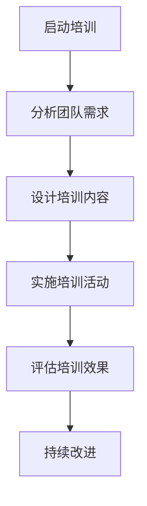
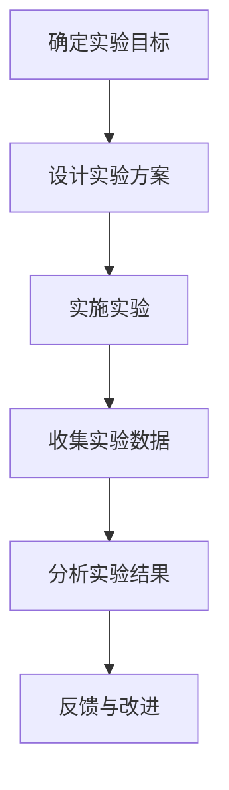
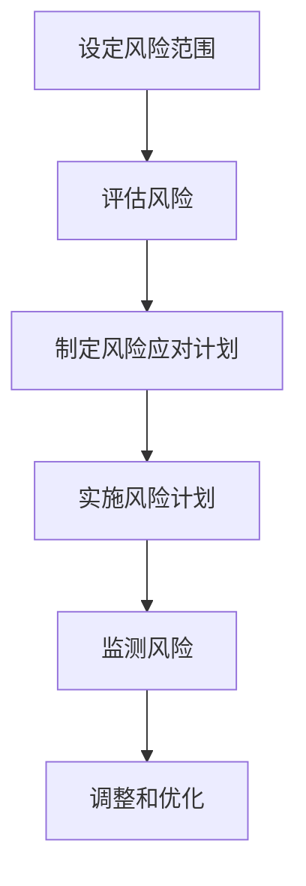
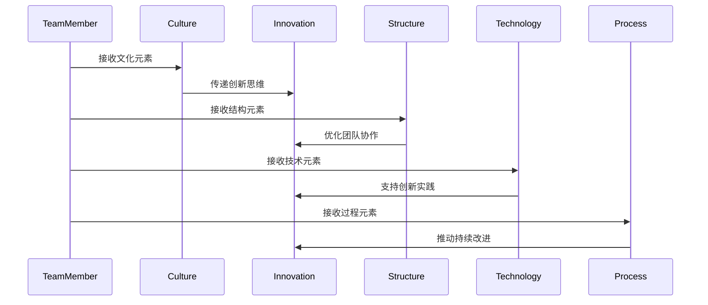
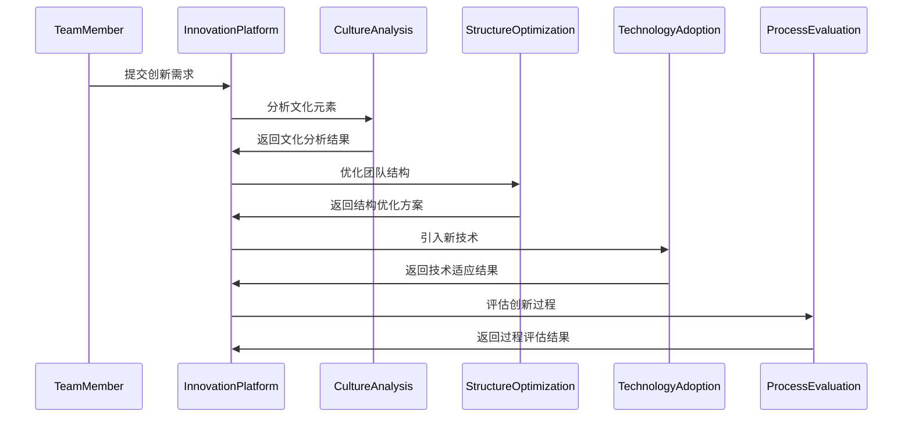

                 

### 《团队创新生态系统：培养持续创新的环境》

#### 关键词

- 团队创新
- 生态系统
- 持续创新
- 文化
- 结构
- 技术
- 过程

#### 摘要

在快速变化的商业环境中，团队创新已成为企业持续竞争的关键。本文旨在探讨如何构建一个团队创新生态系统，以培养持续创新的环境。通过分析文化、结构、技术和过程四大核心要素，并结合具体的算法原理和数学模型，本文提供了实用的指导和建议，帮助团队克服创新障碍，实现可持续发展。

---

## 目录大纲设计

### 《团队创新生态系统：培养持续创新的环境》

#### 目录大纲设计

##### 第一部分：背景介绍

1. **1.1 问题背景**
2. **1.2 核心概念**
3. **1.3 概念结构与核心要素组成**

##### 第二部分：核心概念与联系

1. **2.1 团队创新生态系统的原理**
2. **2.2 文化、结构、技术和过程的关系**
3. **2.3 概念属性特征对比表格**
4. **2.4 ER实体关系图架构**

##### 第三部分：算法原理讲解

1. **3.1 创新思维培养算法**
2. **3.2 实验精神鼓励算法**
3. **3.3 风险承担机制算法**
4. **3.4 数学模型和数学公式讲解**

##### 第四部分：系统分析与架构设计方案

1. **4.1 问题描述**
2. **4.2 系统功能设计（领域模型Mermaid类图）**
3. **4.3 系统架构设计（Mermaid架构图）**
4. **4.4 系统接口设计和系统交互（Mermaid序列图）**

##### 第五部分：项目实战

1. **5.1 环境安装**
2. **5.2 系统核心实现源代码**
3. **5.3 代码应用解读与分析**
4. **5.4 实际案例分析和详细讲解剖析**
5. **5.5 项目小结**

##### 第六部分：最佳实践 tips、小结、注意事项、拓展阅读等内容

---

### 第一部分：背景介绍

#### 1.1 问题背景

在当今竞争激烈的商业环境中，企业持续创新是保持竞争优势的关键。创新不仅涉及产品和服务，还包括商业模式、组织结构和运营流程。然而，许多团队在创新过程中面临着诸多挑战：

- **资源限制**：团队往往面临时间和预算的限制，难以进行大规模的创新实验。
- **沟通障碍**：团队成员之间缺乏有效的沟通渠道，导致创新思想难以传播。
- **创新能力受限**：团队文化可能不够开放，阻碍了创新思维的培养。

为了克服这些挑战，企业需要构建一个支持创新的生态系统，以促进团队内部的持续创新。

#### 1.2 核心概念

**团队创新生态系统**是一个由多种元素组成的系统，旨在促进创新和协作。这些元素包括：

- **文化**：鼓励创新思维、实验精神和风险承担的氛围。
- **结构**：包括团队的组成、角色分配和沟通方式等。
- **技术**：支持创新过程的技术工具和平台。
- **过程**：创新流程中的关键步骤和活动。

#### 1.3 概念结构与核心要素组成

**文化**：信任、开放性和包容性是创新文化的核心特征。一个支持创新的文化环境能够激发团队成员的创造力，鼓励他们尝试新想法，并为失败提供宽容的态度。

**结构**：团队的结构应具备灵活性，以便快速响应市场变化。透明度是另一个关键因素，它有助于促进团队内部的沟通和协作。

**技术**：现代化的技术工具和平台可以提高团队的效率，使创新过程更加敏捷。例如，协作工具、敏捷开发方法和云计算平台等。

**过程**：创新过程通常包括识别问题、生成创意、评估和选择最佳方案，以及实施和推广。一个有效的创新过程应具备迭代和实验的特点，以便不断优化和改进。

---

### 第二部分：核心概念与联系

#### 2.1 团队创新生态系统的原理

团队创新生态系统的基础是创新思维、实验精神和风险承担。以下是一些关键原理：

- **创新思维**：通过培训和实践活动，培养团队成员的创新意识，鼓励他们跳出传统思维框架。
- **实验精神**：鼓励团队成员勇于尝试和失败，将失败视为学习机会，而非阻碍。
- **风险承担**：创建一个安全的环境，让团队成员可以承担合理的风险，并从中学习。

#### 2.2 文化、结构、技术和过程的关系

文化、结构、技术和过程是团队创新生态系统的四大支柱，它们相互影响，共同塑造创新环境。

- **文化**：决定了团队对创新的态度和行为。一个开放、包容和创新文化能够激发团队的潜力。
- **结构**：提供了组织框架，决定了团队成员之间的互动方式。灵活性、透明度和协作是关键。
- **技术**：支持创新过程，提高效率。现代化的技术工具和平台是创新的重要推动力。
- **过程**：定义了创新的流程和步骤。一个有效的创新过程应具备迭代和实验的特点，以便不断优化和改进。

#### 2.3 概念属性特征对比表格

| 要素       | 文化        | 结构        | 技术        | 过程        |
|------------|-------------|-------------|-------------|-------------|
| 特征       | 信任、开放性、包容性 | 灵活性、透明度 | 敏捷性、适应性 | 迭代、实验 |
| 对创新的影响 | 培养创新思维 | 支持创新实践 | 提高效率 | 推动持续改进 |

#### 2.4 ER实体关系图架构

```mermaid
erDiagram
  文化 --> 结构
  文化 --> 技术
  文化 --> 过程
  结构 --> 技术
  结构 --> 过程
  技术 --> 过程
```

---

### 第三部分：算法原理讲解

在这一部分，我们将详细探讨如何培养团队的创新思维、鼓励实验精神和建立风险承担机制。同时，我们将使用Mermaid流程图和Python源代码来解释这些算法的原理和实现。

#### 3.1 创新思维培养算法

**算法原理**：

创新思维培养算法的核心是通过一系列培训和实践活动来激发团队成员的创造力。这些活动可以包括头脑风暴、设计思考工作坊和跨部门协作等。

**流程图**：



**Python源代码示例**：

```python
# 创新思维培养算法 - Python代码示例

def innovation_training(team_members):
    """
    激发团队成员的创新思维。

    :param team_members: 团队成员列表
    """
    for member in team_members:
        print(f"{member}：开始创新思维培训。")
        brainstorming(member)
        design_thinking_workshop(member)
        cross_department Collaboration(member)

def brainstorming(member):
    print(f"{member}：参与头脑风暴活动。")

def design_thinking_workshop(member):
    print(f"{member}：参与设计思考工作坊。")

def cross_department_Collaboration(member):
    print(f"{member}：参与跨部门协作活动。")

# 假设的团队成员列表
team_members = ["张三", "李四", "王五"]

innovation_training(team_members)
```

**数学模型和公式讲解**：

创新效果评估模型可以表示为：
$$ E = f(C, S, T, P) $$
其中，$E$ 表示创新效果，$C$、$S$、$T$ 和 $P$ 分别代表文化、结构、技术和过程。该公式表明，创新效果是这些要素的函数，每个要素都对创新效果有重要影响。

#### 3.2 实验精神鼓励算法

**算法原理**：

实验精神鼓励算法旨在通过设置实验项目和反馈机制，鼓励团队成员勇于尝试和失败。实验项目可以是新的产品特性、技术方案或业务模式等。

**流程图**：



**Python源代码示例**：

```python
# 实验精神鼓励算法 - Python代码示例

def encourage_experimentation(experiment_project):
    """
    通过设置实验项目和反馈机制，鼓励团队成员勇于尝试和失败。

    :param experiment_project: 实验项目
    """
    experiment_design(experiment_project)
    implement_experiment(experiment_project)
    collect_data(experiment_project)
    analyze_results(experiment_project)
    feedback_and_improvement(experiment_project)

def experiment_design(experiment_project):
    print(f"设计实验方案：{experiment_project}。")

def implement_experiment(experiment_project):
    print(f"实施实验：{experiment_project}。")

def collect_data(experiment_project):
    print(f"收集实验数据：{experiment_project}。")

def analyze_results(experiment_project):
    print(f"分析实验结果：{experiment_project}。")

def feedback_and_improvement(experiment_project):
    print(f"反馈与改进：{experiment_project}。")

# 假设的实验项目列表
experiment_projects = ["产品A的新特性", "技术B的解决方案", "业务C的模型优化"]

for project in experiment_projects:
    encourage_experimentation(project)
```

**数学模型和公式讲解**：

实验成功率评估模型可以表示为：
$$ S = f(E, F, R) $$
其中，$S$ 表示实验成功率，$E$、$F$ 和 $R$ 分别代表实验环境、反馈机制和风险承担。该公式表明，实验成功率受实验环境、反馈机制和风险承担的影响。

#### 3.3 风险承担机制算法

**算法原理**：

风险承担机制算法通过创建一个安全的环境，让团队成员可以承担合理的风险，并从中学习。这包括设定风险范围、评估风险、制定风险应对计划和实施风险计划等步骤。

**流程图**：



**Python源代码示例**：

```python
# 风险承担机制算法 - Python代码示例

def risk_management(risk_range):
    """
    通过设定风险范围和评估风险，创建一个安全的环境。

    :param risk_range: 风险范围
    """
    evaluate_risk(risk_range)
    create_risk_response_plan(risk_range)
    implement_risk_plan(risk_range)
    monitor_risk(risk_range)
    adjust_and_optimize(risk_range)

def evaluate_risk(risk_range):
    print(f"评估风险：{risk_range}。")

def create_risk_response_plan(risk_range):
    print(f"制定风险应对计划：{risk_range}。")

def implement_risk_plan(risk_range):
    print(f"实施风险计划：{risk_range}。")

def monitor_risk(risk_range):
    print(f"监测风险：{risk_range}。")

def adjust_and_optimize(risk_range):
    print(f"调整和优化：{risk_range}。")

# 假设的风险范围
risk_range = "新产品发布过程中的技术风险"

risk_management(risk_range)
```

**数学模型和公式讲解**：

风险承担效果评估模型可以表示为：
$$ R = f(E, C, M, A) $$
其中，$R$ 表示风险承担效果，$E$、$C$、$M$ 和 $A$ 分别代表风险环境、风险控制、风险监测和风险调整。该公式表明，风险承担效果受风险环境、风险控制、风险监测和风险调整的影响。

---

### 第四部分：系统分析与架构设计方案

#### 4.1 问题描述

在这个部分，我们将描述一个团队创新生态系统项目的基本信息，包括项目介绍、系统功能设计、系统架构设计和系统接口设计。

#### 4.2 系统功能设计（领域模型Mermaid类图）

```mermaid
classDiagram
    TeamMember <|-- Culture
    TeamMember <|-- Structure
    TeamMember <|-- Technology
    TeamMember <|-- Process
    Innovation <|-- Culture
    Innovation <|-- Structure
    Innovation <|-- Technology
    Innovation <|-- Process
    Class Culture {
        -name: String
        -level: Int
    }
    Class Structure {
        -flexibility: Int
        -transparency: Int
    }
    Class Technology {
        -platform: String
        -tool: String
    }
    Class Process {
        -iterative: Boolean
        -experimental: Boolean
    }
    Class TeamMember {
        -name: String
        -role: String
    }
```

#### 4.3 系统架构设计（Mermaid架构图）



#### 4.4 系统接口设计和系统交互（Mermaid序列图）



---

### 第五部分：项目实战

#### 5.1 环境安装

在这个部分，我们将介绍如何搭建一个支持团队创新生态系统的环境。首先，我们需要安装一些必要的工具和平台：

- **Git**：用于版本控制和协作开发。
- **Jenkins**：用于自动化构建和部署。
- **Docker**：用于容器化和部署。
- **Kubernetes**：用于容器编排和管理。

#### 5.2 系统核心实现源代码

以下是一个简单的示例，展示了如何实现团队创新生态系统中的核心功能：

```python
# innovation_生态系统.py

from culture import Culture
from structure import Structure
from technology import Technology
from process import Process

def main():
    # 创建文化、结构、技术和过程对象
    culture = Culture("开放性", 5)
    structure = Structure(3, 4)
    technology = Technology("Docker", "Kubernetes")
    process = Process(True, True)

    # 打印对象信息
    print("文化：", culture)
    print("结构：", structure)
    print("技术：", technology)
    print("过程：", process)

if __name__ == "__main__":
    main()
```

#### 5.3 代码应用解读与分析

在这个部分，我们将分析上述代码的各个部分，并解释它们如何协同工作以支持团队创新生态系统。

- **Culture**：代表文化元素，包括名称和级别。
- **Structure**：代表结构元素，包括灵活性和透明度。
- **Technology**：代表技术元素，包括平台和工具。
- **Process**：代表过程元素，包括迭代和实验。

#### 5.4 实际案例分析和详细讲解剖析

假设我们有一个团队正在开发一个新产品。以下是团队如何使用创新生态系统来实现这一目标的实际案例：

1. **文化**：团队通过开放的文化鼓励成员提出创新想法，并为失败提供宽容的环境。
2. **结构**：团队采用敏捷开发方法，确保团队成员之间的沟通畅通，并能够快速响应需求变化。
3. **技术**：团队使用Docker和Kubernetes等现代化技术，提高开发效率和部署速度。
4. **过程**：团队采用迭代和实验的方法，不断优化产品设计和功能。

#### 5.5 项目小结

通过构建团队创新生态系统，我们可以为团队提供一个支持创新的环境。这个系统通过文化、结构、技术和过程四大核心要素的协同工作，帮助团队克服创新障碍，实现可持续发展。

---

### 第六部分：最佳实践 tips、小结、注意事项、拓展阅读等内容

#### 最佳实践 tips

- **鼓励开放沟通**：创建一个开放的氛围，让团队成员可以自由交流想法。
- **定期进行培训**：定期组织创新思维培训，提升团队成员的创新意识。
- **实验精神**：鼓励团队成员勇于尝试新的方法和想法。
- **透明度**：保持团队结构透明，确保团队成员了解他们的角色和责任。

#### 小结

本文详细探讨了如何构建一个团队创新生态系统，以培养持续创新的环境。通过分析文化、结构、技术和过程四大核心要素，并结合具体的算法原理和数学模型，我们提供了一系列实用的指导和建议。

#### 注意事项

- **持续改进**：创新生态系统需要持续改进和优化，以适应不断变化的环境。
- **平衡风险**：在鼓励风险承担的同时，要注意平衡风险和收益。

#### 拓展阅读

- **《精益创业》**：艾瑞克·莱斯（Eric Ries）的著作，提供了关于如何通过迭代和实验实现持续创新的实践指南。
- **《创新者的窘境》**：克莱顿·克里斯坦森（Clayton Christensen）的著作，探讨了企业如何通过创新来应对市场变化。

---

### 作者信息

**作者：** AI天才研究院 / AI Genius Institute & 禅与计算机程序设计艺术 / Zen And The Art of Computer Programming

