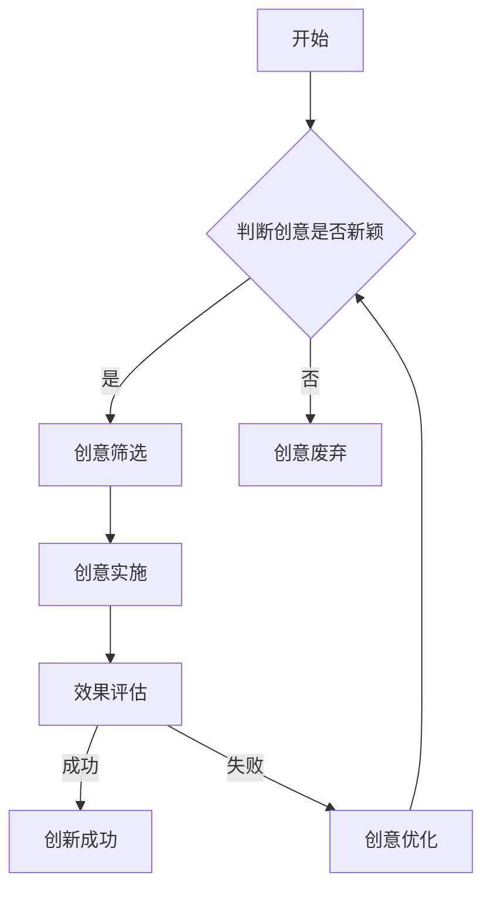
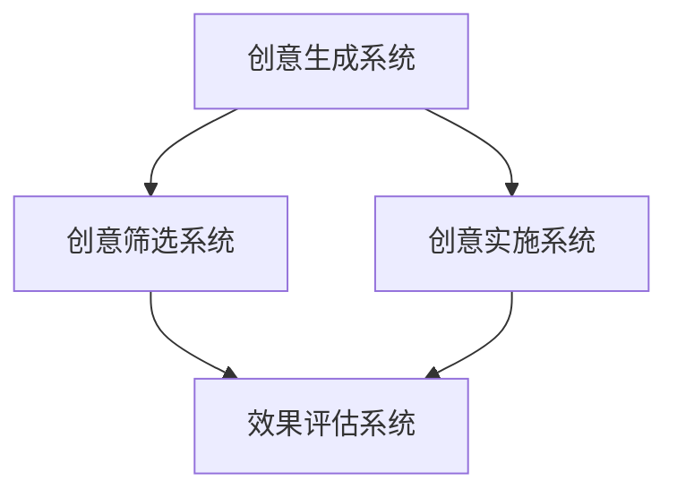
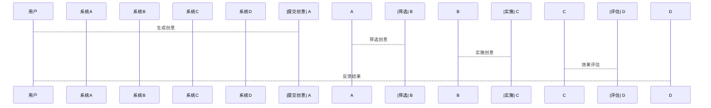

                 

# 团队创新：激发集体创造力

## 关键词

团队创新、集体创造力、组织文化、个人能力、互动与合作、创意生成与筛选、创意实施

## 摘要

本文深入探讨了团队创新的重要性及其激发集体创造力的关键要素。通过分析组织文化、团队成员能力和互动与合作，本文揭示了团队创新的过程、工具与方法，并借助实际案例分析，总结了团队创新的最佳实践，以期为IT领域团队提供理论指导与实践借鉴。

## 第1章 引言

### 1.1 团队创新的重要性

团队创新是现代企业在激烈竞争中立于不败之地的关键。它不仅能够推动企业持续发展，提升核心竞争力，还能够激发团队成员的潜能，实现个人与团队的共同成长。然而，如何激发团队的集体创造力，实现高效的团队创新，是每个团队领导者都需要面对的挑战。

### 1.2 创造力的定义与特征

创造力是指个体或团队在创新过程中，通过独特的思维方式和创新的解决方案，产生新颖且有价值的成果的能力。创造力具有以下几个特征：

1. **新颖性**：创造力往往产生新颖的思路和解决方案。
2. **价值性**：创新成果具有一定的实用价值和市场潜力。
3. **适应性**：创造力需要适应不同的环境和挑战。

### 1.3 团队创造力的影响因素

团队创造力受到多种因素的影响，包括组织文化、个人能力、互动与合作等。这些因素相互作用，共同影响着团队的创新能力和创新成果。

## 第2章 组织文化与团队创造力

### 2.1 组织文化的概念与类型

组织文化是指企业内部共同的价值观、信念和行为规范。根据领导风格和管理模式的不同，组织文化可分为权威文化、参与文化和教育文化。

### 2.2 组织文化与团队创造力之间的关系

权威文化可能会限制团队成员的创造力，而参与文化和教育文化则能够激发团队成员的积极性，促进团队创造力的提升。

### 2.3 组织文化塑造团队创造力的策略

组织可以通过以下策略来塑造有利于团队创造力的文化：

1. **鼓励风险承担**：鼓励团队成员在创新过程中勇于尝试新思路，容忍失败。
2. **开放沟通**：建立开放的沟通渠道，促进团队成员之间的信息共享和协作。
3. **认可与激励**：对团队成员的创新成果给予认可和激励，提升其创新动力。

## 第3章 团队成员能力与创造力

### 3.1 团队成员能力的概念与类型

团队成员能力包括技术能力、解决问题的能力和沟通能力等。这些能力共同影响着团队的创新能力和创新成果。

### 3.2 个人能力对团队创造力的影响

个人能力的提升能够促进团队创造力的发展。技术能力和解决问题的能力有助于团队在创新过程中找到更好的解决方案，而沟通能力则能够促进团队成员之间的协作。

### 3.3 提升团队成员能力的策略

组织可以通过以下策略来提升团队成员的能力：

1. **培训与发展**：提供针对性的培训和职业发展机会。
2. **激励与反馈**：对团队成员的能力提升给予激励和反馈，激发其学习动力。
3. **团队建设**：通过团队活动，提升团队成员之间的信任和协作。

## 第4章 互动与合作与团队创造力

### 4.1 互动与合作的定义与特征

互动与合作是指团队成员在创新过程中，通过沟通、协作和共享信息，共同解决问题和实现创新目标的行为。

### 4.2 互动与合作对团队创造力的影响

互动与合作能够促进团队成员之间的信息共享和思维碰撞，激发团队的创造力，产生更多的创新思路和解决方案。

### 4.3 互动与合作的策略

组织可以通过以下策略来促进互动与合作：

1. **建立信任**：通过团队建设活动，建立团队成员之间的信任。
2. **明确目标**：确保团队成员对创新目标有共同的理解和认同。
3. **提供支持**：为团队成员提供必要的资源和帮助，支持其创新活动。

## 第5章 团队创新过程：从创意到实施

### 5.1 创意的生成与筛选

#### 5.1.1 创意的生成

创意生成是指团队成员在创新过程中，通过思维碰撞和创造性思维，产生新的想法和解决方案。

#### 5.1.2 创意的筛选

创意筛选是指对生成的创意进行评估和筛选，确定哪些创意具有实现的可能性和价值。

### 5.2 创意的实施

#### 5.2.1 制定行动计划

制定行动计划是指将筛选出的创意转化为具体的实施计划，明确任务分工和时间表。

#### 5.2.2 分配任务

分配任务是指根据行动计划，将任务分配给团队成员，确保每个成员都有明确的职责和目标。

#### 5.2.3 跟踪与调整

跟踪与调整是指对实施过程进行监控和评估，及时调整计划和策略，确保创意能够顺利实施。

## 第6章 团队创新工具与方法

### 6.1 系统化创新方法

#### 6.1.1 设计思维

设计思维是一种以用户为中心的创新方法，强调从用户需求出发，通过迭代和试错，创造出有价值的解决方案。

#### 6.1.2 TRIZ方法

TRIZ方法是一种基于科学原理和创新理论的系统化创新方法，通过解决冲突和矛盾，找到创新的解决方案。

#### 6.1.3 六顶思考帽

六顶思考帽是一种思维工具，通过分别使用不同颜色的帽子，代表不同的思维模式，促进团队成员的创造性思维。

### 6.2 创新工具的使用

#### 6.2.1 MindMap

MindMap是一种思维导图工具，通过图形化的方式，展示创意和思路，促进团队成员的思维碰撞。

#### 6.2.2 SWOT分析

SWOT分析是一种战略分析工具，通过分析团队的 strengths（优势）、weaknesses（劣势）、opportunities（机会）和 threats（威胁），帮助团队确定创新的方向和策略。

#### 6.2.3 5W2H分析法

5W2H分析法是一种问题解决工具，通过分析 what（什么）、why（为什么）、who（谁）、where（哪里）、when（何时）、how（如何）和 how much（多少），帮助团队深入理解问题和找到解决方案。

## 第7章 团队创新案例分析

### 7.1 案例一：谷歌的团队创新

谷歌以其独特的创新文化和开放的工作环境，成为全球团队创新的典范。本文将分析谷歌的团队创新模式，探讨其成功的原因和经验。

### 7.2 案例二：苹果的创新文化

苹果以其极致的产品设计和创新技术，引领了全球科技潮流。本文将分析苹果的创新文化，探讨其对团队创新的影响和启示。

### 7.3 案例三：特斯拉的团队协作

特斯拉以其快速的创新速度和卓越的团队协作，推动了电动汽车和清洁能源的发展。本文将分析特斯拉的团队协作模式，探讨其成功的原因和经验。

## 第8章 团队创新的最佳实践

### 8.1 团队创新的关键要素

团队创新的成功离不开以下几个关键要素：

1. **开放的文化环境**：鼓励团队成员自由表达和探索新思路。
2. **明确的创新目标**：确保团队成员对创新目标有共同的理解和认同。
3. **有效的沟通与合作**：建立开放的沟通渠道，促进团队成员之间的协作。
4. **持续的学习与成长**：为团队成员提供培训和发展机会，提升其创新能力。

### 8.2 团队创新的常见问题与解决方案

团队创新过程中常见的问题包括：

1. **缺乏创新动力**：通过建立激励机制，激发团队成员的创新热情。
2. **沟通不畅**：通过改进沟通方式，提高团队成员之间的沟通效率。
3. **资源不足**：通过优化资源配置，确保团队创新所需的资源和支持。

### 8.3 团队创新的持续发展

团队创新的持续发展需要以下几个方面的支持：

1. **制度保障**：建立完善的创新制度，为团队创新提供制度保障。
2. **持续投入**：为团队创新提供持续的资金和资源支持。
3. **人才培养**：注重团队成员的培养和发展，提升团队的整体创新能力。

## 第9章 结论

团队创新是现代企业发展的关键。通过激发集体创造力，团队能够产生更多的创新思路和解决方案，推动企业持续发展。本文从组织文化、个人能力、互动与合作等多个角度，探讨了团队创新的关键要素和最佳实践，旨在为IT领域团队提供理论指导和实践借鉴。通过深入理解和应用这些原则，团队可以更加高效地实现创新，提升核心竞争力。

## 附录

### 附录A：核心概念术语说明

- 创造力：个体或团队在创新过程中产生新颖且有价值的成果的能力。
- 组织文化：企业内部共同的价值观、信念和行为规范。
- 互动与合作：团队成员在创新过程中通过沟通、协作和共享信息，共同解决问题和实现创新目标的行为。

### 附录B：核心概念属性特征对比表格

| 特征 | 创造力 | 组织文化 | 互动与合作 |
| ---- | ------ | -------- | ---------- |
| 新颖性 | 新颖的思路和解决方案 | 企业内部的价值观和信念 | 促进团队成员之间的信息共享和协作 |
| 价值性 | 有实用价值和市场潜力 | 对企业的影响和作用 | 提升团队的创新能力 |
| 适应性 | 适应不同的环境和挑战 | 对外部环境的适应性 | 促进团队成员之间的信任和协作 |

### 附录C：ER实体关系图架构

```mermaid
erDiagram
  Team ||--|{ Member }
  Team ||--|{ Project }
  Member ||--|{ Skill }
  Project ||--|{ Task }
```

### 附录D：算法原理讲解

#### 算法Mermaid流程图



#### 算法Python源代码

```python
def evaluate_creativity(idea):
    if is_innovative(idea):
        return "筛选"
    else:
        return "废弃"

def implement_idea(idea):
    if idea_is_successful():
        return "成功"
    else:
        return "失败"

def is_innovative(idea):
    # 判断创意是否新颖
    # ...
    return True

def idea_is_successful():
    # 判断创意实施效果
    # ...
    return True

idea = "新的创意"
evaluation = evaluate_creativity(idea)
if evaluation == "筛选":
    result = implement_idea(idea)
    if result == "成功":
        print("创新成功")
    else:
        print("创意优化")
else:
    print("创意废弃")
```

### 附录E：系统分析与架构设计方案

#### 问题场景介绍

某IT公司需要通过团队创新来提升产品的竞争力，具体场景包括创意生成、创意筛选和创意实施。

#### 项目介绍

项目名称：团队创新管理系统

项目目标：建立一套团队创新管理系统，帮助公司高效地实现创意生成、筛选和实施。

#### 系统功能设计(领域模型mermaid类图)

```mermaid
classDiagram
    ClassDiagram::Product
    Product <|-- Idea
    Product <|-- Project
    Member <|-- Skill
    Member <|-- Task
```

#### 系统架构设计mermaid架构图



#### 系统接口设计和系统交互mermaid序列图



### 附录F：项目实战

#### 环境安装

1. 安装Python环境
2. 安装mermaid依赖

```bash
pip install mermaid
```

#### 系统核心实现源代码

```python
# 创意生成模块
def generate_idea():
    # 生成创意
    return "新的创意"

# 创意筛选模块
def filter_idea(idea):
    # 判断创意是否新颖
    return "筛选"

# 创意实施模块
def implement_idea(idea):
    # 判断创意实施效果
    return "成功"

# 效果评估模块
def evaluate_idea(result):
    # 反馈结果
    print(result)
```

#### 代码应用解读与分析

1. 代码首先定义了创意生成、筛选、实施和评估四个模块。
2. 通过调用这些模块，实现了创意的生成、筛选、实施和评估过程。

#### 实际案例分析和详细讲解剖析

1. 假设用户提交了一个创意，系统首先会生成该创意。
2. 然后对创意进行筛选，判断其是否新颖。
3. 如果创意新颖，则会进入实施阶段，执行创意方案。
4. 实施完成后，对效果进行评估，并根据结果进行反馈。

#### 项目小结

项目通过设计创意生成、筛选、实施和评估模块，实现了团队创新的过程管理。实际案例展示了如何通过代码实现这些功能，为团队提供了有效的创新工具和方法。

### 附录G：最佳实践 tips

1. **鼓励创新**：建立鼓励创新的氛围，激发团队成员的创造力。
2. **明确目标**：确保团队成员对创新目标有清晰的认识和认同。
3. **优化沟通**：建立高效的沟通机制，促进团队成员之间的协作。
4. **持续学习**：为团队成员提供持续的学习和发展机会。

### 附录H：小结、注意事项、拓展阅读

本文从多个角度探讨了团队创新的关键要素和最佳实践。团队创新需要组织文化的支持、团队成员能力的提升和互动与合作的促进。在实际操作中，团队应注重创新环境的营造、目标明确和沟通优化。拓展阅读方面，可以参考相关创新管理理论和实践案例，以进一步丰富团队创新的实践经验和理论体系。

### 附录I：作者信息

作者：AI天才研究院/AI Genius Institute & 禅与计算机程序设计艺术 /Zen And The Art of Computer Programming

