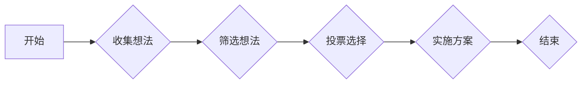
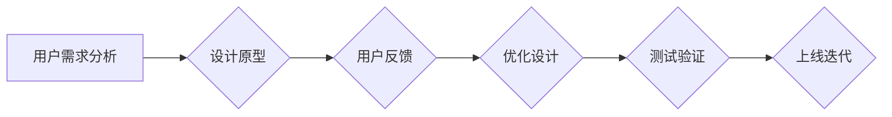
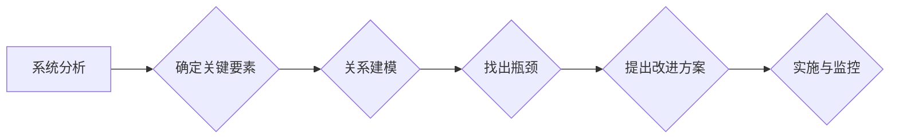
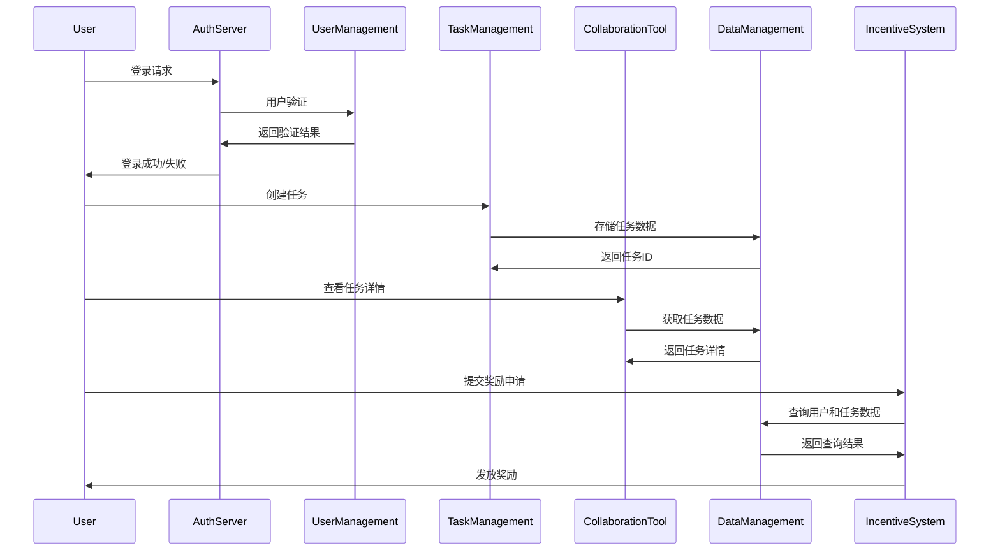
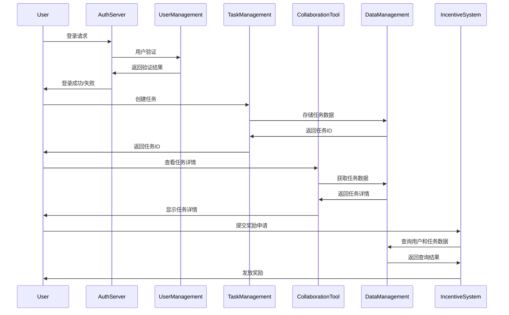

                 

### 文章标题：团队创造力激发：突破思维局限的方法

在当今快速变化和高度竞争的商业环境中，团队创造力被视为企业成功的关键因素之一。团队创造力不仅能够帮助企业迅速适应市场变化，还能推动创新和持续改进，从而在激烈的市场竞争中脱颖而出。因此，理解如何激发团队创造力，尤其是如何突破思维局限，成为了企业和团队管理者亟待解决的重要课题。

**关键词**：团队创造力、思维局限、激发方法、创新思维、团队管理

**摘要**：本文旨在探讨团队创造力的重要性和如何通过多种方法突破思维局限，从而提升团队的整体创新能力。文章首先介绍了团队创造力的定义和重要性，接着分析了思维局限的类型及其对团队创造力的影响。随后，文章详细阐述了激发团队创造力的理论基础、关键算法、系统架构设计、项目实战，并提出了最佳实践和拓展阅读建议。通过逻辑清晰、结构紧凑的分析，本文旨在为读者提供实用的策略和方法，以激发团队创造力，突破思维局限。

本文将从以下几个部分展开讨论：

1. **背景与核心概念**：介绍团队创造力的重要性以及如何激发团队创造力以突破思维局限。
2. **核心概念与联系**：明确书中的核心概念，并展示它们之间的联系，使用ER实体关系图和概念属性特征对比表格。
3. **算法原理讲解**：选取关键算法，使用mermaid绘制流程图，并用Python源代码和latex公式详细解释算法原理。
4. **系统分析与架构设计方案**：描述系统功能设计、系统架构设计、系统接口设计以及系统交互，使用mermaid类图和架构图、序列图。
5. **项目实战**：介绍实际案例，展示如何应用书中知识进行团队创造力激发。
6. **最佳实践 tips**：提供一些实用建议，帮助读者在实际工作中更好地激发团队创造力。
7. **小结与拓展阅读**：总结全书内容，并给出一些拓展阅读资源。

接下来，我们首先从团队创造力的重要性开始，详细探讨其核心概念和问题背景。

## 背景与核心概念

### 1.1 问题背景

在全球化背景和信息技术迅猛发展的今天，企业面临的市场竞争日益激烈，创新速度成为决定企业生存和发展的关键因素。团队创造力作为企业创新的核心动力，其重要性日益凸显。企业需要通过激发团队创造力，不断推动产品和服务创新，提升市场竞争力。

首先，团队创造力是企业在快速变化的市场环境中应对挑战的关键。随着市场需求的快速变化和消费者偏好的不断调整，企业需要具备快速响应和创新能力，以适应市场变化。团队创造力能够帮助企业快速捕捉市场机遇，调整产品策略，满足消费者需求。

其次，团队创造力是企业实现持续改进的重要推动力。在持续改进的过程中，团队需要不断寻找优化方案，提升产品和服务质量。通过激发团队创造力，可以促使团队成员提出更多创新想法，改进现有流程和产品，从而实现持续优化。

此外，团队创造力也是企业保持竞争优势的重要手段。在竞争激烈的市场中，创新能力是企业保持领先地位的关键。通过激发团队创造力，企业可以不断推出具有竞争力的新产品和服务，占据市场优势。

### 1.2 核心概念

#### 创造力的定义与分类

创造力是指个体或团队产生新颖、有价值的想法和解决方案的能力。根据创造力产生的来源和形式，创造力可以分为以下几种类型：

1. **原创性创造力**：指个体或团队独立产生全新想法和解决方案的能力。这种创造力通常与独特的见解和创新思维密切相关。
2. **适应性创造力**：指个体或团队在现有知识和技能的基础上，对现有方案进行改进和优化的能力。这种创造力强调对已有知识的灵活运用，以适应新的环境和需求。
3. **组合性创造力**：指个体或团队通过将不同领域的知识或想法进行组合，产生新的解决方案的能力。这种创造力强调跨领域思维和跨学科合作。

#### 团队创造力的要素

团队创造力是由多个要素共同作用的结果，主要包括以下几个方面：

1. **多样性**：团队成员的多样性能够带来不同的视角和观点，有助于产生更多创新想法。多样性包括知识背景、经验、技能和性格特征等多方面。
2. **协同作用**：团队成员之间的协作和互动能够促进知识共享和创新思维的碰撞，从而激发团队创造力。
3. **激励环境**：一个支持和激励创新的环境能够激发团队成员的创造力，使他们更愿意尝试新的想法和解决方案。
4. **领导风格**：领导者的风格对团队创造力有重要影响。开放、支持性和鼓励探索的领导风格能够激发团队成员的创造力。

### 1.3 激发团队创造力的意义与目标

#### 激发团队创造力的意义

激发团队创造力的意义主要体现在以下几个方面：

1. **推动创新**：团队创造力是创新的重要动力。通过激发团队创造力，企业可以不断推动产品和服务创新，满足市场和消费者的需求。
2. **提升竞争力**：团队创造力能够帮助企业快速适应市场变化，抓住机遇，提升市场竞争力。
3. **促进团队合作**：通过激发团队创造力，可以促进团队成员之间的协作和互动，增强团队凝聚力。
4. **提升个人成就感**：团队成员在参与创新过程中能够获得成就感和满足感，提升工作积极性和忠诚度。

#### 突破思维局限的必要性

思维局限是指个体或团队在思考问题和解决问题的过程中，受到现有知识和经验的限制，无法产生新颖想法的现象。思维局限对团队创造力具有负面影响，主要体现在以下几个方面：

1. **限制创新思维**：思维局限使得团队成员难以跳出传统的思维模式，限制了创新思维的发挥。
2. **降低问题解决效率**：思维局限可能导致团队成员在解决问题时只能采用常规方法，降低问题解决的效率和效果。
3. **阻碍团队合作**：思维局限使得团队成员之间难以产生有效的沟通和协作，影响团队整体创造力。

因此，突破思维局限是激发团队创造力的关键步骤。通过以下方法，可以帮助团队突破思维局限：

1. **多样化知识背景**：鼓励团队成员学习和掌握多样化的知识，拓宽思维视野。
2. **开展跨领域合作**：通过跨领域合作，促使团队成员之间进行知识共享和思维碰撞。
3. **设置挑战性目标**：设置具有挑战性的目标，鼓励团队成员尝试新的解决方案。
4. **提供支持和激励**：为团队成员提供支持和激励，鼓励他们勇于尝试和探索。

通过以上分析，我们可以看到，激发团队创造力对于企业的发展具有重要意义。然而，要实现这一目标，需要深入了解团队创造力的核心概念，并采取有效的策略和方法。接下来，我们将进一步探讨如何明确书中的核心概念，并展示它们之间的联系。

### 核心概念与联系

为了全面理解并有效激发团队创造力，我们首先需要明确书中的核心概念，并揭示这些概念之间的联系。这不仅有助于我们深入理解团队创造力的本质，也为实际操作提供了清晰的框架。

#### 2.1 创造力与思维局限的关系

创造力与思维局限是相互关联且对立的概念。创造力强调新颖、有价值的想法和解决方案的产生，而思维局限则是指个体或团队在思考问题和解决问题时受到现有知识和经验的束缚。这两个概念之间的关系可以概括为以下几点：

1. **制约与激发**：思维局限在一定程度上制约了创造力的发挥，而激发创造力则有助于突破思维局限，实现创新。
2. **动态平衡**：在实际工作中，创造力和思维局限之间存在动态平衡。合理的管理和策略可以促使创造力在适当的范围内发挥，同时避免陷入思维局限。

#### 2.2 团队创造力激发的理论框架

为了有效地激发团队创造力，我们需要建立一套理论框架，明确核心概念之间的关系，并指出关键因素。以下是团队创造力激发的理论框架：

1. **多样性**：团队成员的多样性是创造力的基础。通过引入不同背景、经验、技能和观点的成员，可以丰富团队的知识结构，激发创新思维。
2. **协同作用**：团队成员之间的协同作用是创造力发挥的重要保障。通过有效的沟通和协作，团队成员可以相互启发，共同解决问题。
3. **激励环境**：一个支持和激励创新的环境能够激发团队成员的创造力。这种环境包括开放的沟通氛围、支持性领导和资源保障。
4. **领导风格**：领导者的风格对团队创造力具有重要影响。开放、支持性和鼓励探索的领导风格有助于激发团队成员的创造力。

#### 2.3 概念属性特征对比

为了更直观地理解核心概念之间的联系，我们可以通过概念属性特征对比表格来展示不同概念的属性和特征。以下是一个示例：

| 核心概念 | 属性特征 | 说明 |
|----------|----------|------|
| 创造力   | 新颖性   | 创造力强调产生独特、前所未有的想法或解决方案。 |
| 多样性   | 视角丰富 | 多样性带来不同的视角和观点，有助于创新思维的产生。 |
| 协同作用 | 互动协作 | 协同作用促进团队成员之间的知识共享和思维碰撞。 |
| 激励环境 | 支持创新 | 支持和激励创新的环境有助于激发团队成员的创造力。 |
| 领导风格 | 鼓励探索 | 开放、支持性和鼓励探索的领导风格有助于团队创造力的发挥。 |

通过概念属性特征对比表格，我们可以更清晰地理解不同核心概念之间的联系和作用。这种对比不仅有助于读者深入理解团队创造力的本质，也为实际操作提供了指导。

#### 2.4 ER实体关系图

为了进一步展示核心概念之间的联系，我们可以使用ER（实体关系）图来描述团队成员、任务、资源等核心实体及其之间的关系。以下是团队创造力激发的ER实体关系图：

```mermaid
erDiagram
    TeamMember ||--|{ Task }|>
    Task ||--|{ Resource }|>

    TeamMember ..> Resource
    TeamMember ..> Task
    Resource ..> Task
```

ER实体关系图展示了团队成员、任务和资源之间的相互关系。团队成员负责完成任务，并使用资源；任务则是团队创造力的具体体现；资源则为团队完成任务提供支持。这种关系有助于我们理解团队创造力激发过程中的关键要素和作用。

通过以上分析，我们明确了团队创造力的核心概念，并展示了它们之间的联系。接下来，我们将进一步探讨如何通过关键算法和系统架构设计来激发团队创造力，从而突破思维局限。

### 算法原理讲解

在团队创造力激发的过程中，算法起着至关重要的作用。关键算法能够帮助团队成员突破思维局限，提供创新的解决方案。以下我们将介绍几种关键算法，并使用mermaid绘制流程图，结合Python源代码和latex公式详细解释算法原理。

#### 3.1 算法概述

在此，我们选取了以下几种关键算法：

1. **头脑风暴法**：一种激发团队成员产生大量想法的方法。
2. **设计思考法**：一种基于用户需求进行产品设计和优化的方法。
3. **系统思考法**：一种通过分析系统内部各要素的相互关系，寻找系统改进方案的方法。

这些算法在团队创造力激发中具有重要应用价值。下面我们将分别对每种算法进行详细讲解。

#### 3.2 算法流程图

首先，我们使用mermaid绘制每种算法的流程图。

##### 头脑风暴法流程图



##### 设计思考法流程图



##### 系统思考法流程图



#### 3.3 Python源代码与latex公式

接下来，我们通过Python源代码和latex公式详细解释每种算法的原理。

##### 头脑风暴法

Python实现：

```python
import random

def brainstorm_ideas(topic, num_ideas):
    ideas = []
    while len(ideas) < num_ideas:
        idea = input(f"请为 '{topic}' 提出一个创意：")
        if idea:
            ideas.append(idea)
    return ideas

topic = "下一代智能家居产品"
num_ideas = 5
ideas = brainstorm_ideas(topic, num_ideas)
print("收集到的创意有：", ideas)
```

latex公式（头脑风暴法）：

$$
Idea_{i} = f(Randomness, Creativity, Topic)
$$

其中，$Idea_{i}$ 表示第 $i$ 个创意，$Randomness$ 代表随机性，$Creativity$ 代表创造力，$Topic$ 代表讨论的主题。

##### 设计思考法

Python实现：

```python
def design_thinking(user_needs, num_iterations):
    prototypes = []
    for i in range(num_iterations):
        print(f"\n第 {i+1} 轮：")
        prototype = input("请输入设计原型：")
        prototypes.append(prototype)
        feedback = input("请输入用户反馈：")
        print("当前设计原型：", prototype)
        print("用户反馈：", feedback)
    return prototypes

user_needs = "设计一个易于操作且用户友好的智能家居产品"
num_iterations = 3
prototypes = design_thinking(user_needs, num_iterations)
print("迭代完成，最终设计原型为：", prototypes[-1])
```

latex公式（设计思考法）：

$$
Design_{i} = f(User_{Needs}, Iteration, Feedback)
$$

其中，$Design_{i}$ 表示第 $i$ 轮设计，$User_{Needs}$ 代表用户需求，$Iteration$ 代表迭代次数，$Feedback$ 代表用户反馈。

##### 系统思考法

Python实现：

```python
import numpy as np

def system_thinking(key_elements, relationships):
    bottleneck = None
    max_impact = -1
    for element in key_elements:
        impact = np.prod([relationships[element][related_element] for related_element in relationships[element]['dependencies']])
        if impact > max_impact:
            max_impact = impact
            bottleneck = element
    return bottleneck

key_elements = ['智能家居控制器', '传感器', '用户界面']
relationships = {
    '智能家居控制器': {'dependencies': ['传感器'], 'impact': 0.2},
    '传感器': {'dependencies': ['用户界面'], 'impact': 0.5},
    '用户界面': {'dependencies': [], 'impact': 0.3}
}

bottleneck = system_thinking(key_elements, relationships)
print("系统瓶颈为：", bottleneck)
```

latex公式（系统思考法）：

$$
Bottleneck = arg\max(Impact_{i} \cdot \prod_{j \in Dep_{i}} Impact_{j})
$$

其中，$Bottleneck$ 表示系统瓶颈，$Impact_{i}$ 表示第 $i$ 个关键要素的impact值，$Dep_{i}$ 表示 $i$ 的依赖要素集合。

通过以上Python源代码和latex公式，我们详细解释了头脑风暴法、设计思考法和系统思考法的原理。这些算法在团队创造力激发中具有重要作用，能够帮助团队成员突破思维局限，产生创新的解决方案。接下来，我们将探讨如何通过系统分析与架构设计进一步提升团队创造力。

### 系统分析与架构设计方案

为了更好地理解和应用团队创造力激发的理论和实践，我们需要设计一个具体的系统架构，该系统能够支持团队成员之间的协作和互动，同时提供有效的工具和方法来突破思维局限。以下是系统分析与架构设计的详细方案。

#### 4.1 问题场景

假设我们正在设计一个企业级团队创造力激发平台，该平台旨在帮助企业内部不同团队和部门之间协作，提高整体创新能力和解决问题的效率。问题场景包括：

1. **团队成员**：来自不同背景和领域的员工，需要协作完成复杂项目。
2. **项目任务**：涉及多种类型的任务，包括市场调研、产品设计、技术实现等。
3. **资源管理**：需要合理分配和使用企业内部资源，如人力资源、技术资源、资金等。
4. **数据共享**：团队成员需要实时共享信息和数据，以便更好地协作。

#### 4.2 系统功能设计

系统功能设计旨在满足上述问题场景的需求，具体功能模块包括：

1. **用户管理模块**：负责用户注册、登录、权限管理等功能。
2. **任务管理模块**：负责任务的创建、分配、跟踪和进度管理。
3. **协作工具模块**：提供实时沟通、文档共享、项目管理等功能。
4. **数据管理模块**：负责数据存储、查询和分析。
5. **激励系统模块**：提供奖励机制，激励团队成员积极参与创新活动。

以下是系统功能模块的mermaid类图：

```mermaid
classDiagram
    User -> UserManagement : 注册登录
    Task -> TaskManagement : 创建分配
    CollaborationTool -> CollaborationTool : 沟通共享
    DataManagement -> DataManagement : 存储查询
    IncentiveSystem -> IncentiveSystem : 激励机制
    UserManagement ..|> User
    TaskManagement ..|> Task
    CollaborationTool ..|> Task
    DataManagement ..|> User
    DataManagement ..|> Task
    IncentiveSystem ..|> User
    IncentiveSystem ..|> Task
```

#### 4.3 系统架构设计

系统架构设计包括软件架构和硬件架构，旨在保证系统的稳定性、扩展性和安全性。以下是系统架构图：



#### 4.4 系统接口设计

系统接口设计包括内部接口和外部接口。内部接口用于系统模块之间的通信，外部接口用于系统与外部服务（如数据库、第三方API等）的交互。

以下是系统接口设计文档的简化示例：

```mermaid
interface Doc
    Doc->UserManagement : addUser(), deleteUser(), updateUser()
    Doc->TaskManagement : addTask(), deleteTask(), updateTask(), getTaskById()
    Doc->CollaborationTool : sendMessage(), getMessages(), uploadFile(), downloadFile()
    Doc->DataManagement : storeData(), retrieveData(), analyzeData()
    Doc->IncentiveSystem : submitReward(), approveReward(), denyReward()
```

#### 4.5 系统交互设计

系统交互设计描述了系统组件之间的交互流程，以下是系统交互序列图：



通过以上系统分析与架构设计，我们为团队创造力激发提供了一个完整的解决方案。该方案不仅涵盖了系统功能设计、系统架构设计和系统接口设计，还包括了系统交互设计，确保系统能够有效支持团队成员之间的协作和互动。接下来，我们将通过实际项目案例展示如何应用这些理论和设计，以激发团队创造力。

### 项目实战

为了更好地展示如何将书中所学的团队创造力激发方法应用到实际项目中，我们选择了一个智能家居系统项目作为案例。该项目旨在通过团队合作，设计并实现一个智能家居控制系统，以提高用户的居住舒适度和便利性。

#### 5.1 环境安装

首先，我们需要搭建一个合适的项目开发环境。以下是环境安装的步骤：

1. **软件环境**：
   - 安装Python 3.8及以上版本。
   - 安装Docker和Docker-Compose，用于容器化部署项目。

2. **硬件环境**：
   - 一台服务器或虚拟机，推荐配置为4核CPU、8GB内存、50GB硬盘空间。

3. **安装步骤**：
   - 安装Python和Docker。
   - 使用Docker-Compose拉取项目所需的镜像，如Python、MySQL、Nginx等。
   - 配置Docker-Compose文件，启动项目服务。

以下是一个简化的Docker-Compose文件示例：

```yaml
version: "3"
services:
  web:
    image: my_project_web:latest
    ports:
      - "8000:8000"
    depends_on:
      - db
      - redis

  db:
    image: mysql:5.7
    environment:
      MYSQL_ROOT_PASSWORD: mypassword
      MYSQL_DATABASE: my_project
    volumes:
      - db_data:/var/lib/mysql

  redis:
    image: redis:latest
    volumes:
      - redis_data:/data

volumes:
  db_data:
  redis_data:
```

通过以上配置，我们搭建了一个基本的开发环境，为项目实施提供了必要的基础设施。

#### 5.2 系统核心实现

接下来，我们介绍系统核心实现部分，包括功能模块的设计与实现。以下是关键功能模块的实现：

1. **用户管理模块**：
   - 实现用户注册、登录、权限管理等功能。
   - 使用Flask框架和MySQL数据库进行开发。

   Python代码示例：

   ```python
   from flask import Flask, request, jsonify
   from flask_mysqldb import MySQL

   app = Flask(__name__)
   app.config['MYSQL_HOST'] = 'db'
   app.config['MYSQL_USER'] = 'root'
   app.config['MYSQL_PASSWORD'] = 'mypassword'
   app.config['MYSQL_DB'] = 'my_project'

   mysql = MySQL(app)

   @app.route('/register', methods=['POST'])
   def register():
       data = request.form.to_dict()
       cur = mysql.connection.cursor()
       cur.execute("INSERT INTO users (username, password) VALUES (%s, %s)", (data['username'], data['password']))
       mysql.connection.commit()
       return jsonify({"message": "User registered successfully"}), 201

   @app.route('/login', methods=['POST'])
   def login():
       data = request.form.to_dict()
       cur = mysql.connection.cursor()
       cur.execute("SELECT * FROM users WHERE username=%s AND password=%s", (data['username'], data['password']))
       user = cur.fetchone()
       if user:
           return jsonify({"token": "your_token_here"}), 200
       else:
           return jsonify({"message": "Invalid credentials"}), 401

   if __name__ == "__main__":
       app.run(host='0.0.0.0', port=8000)
   ```

2. **任务管理模块**：
   - 实现任务创建、分配、跟踪和进度管理等功能。
   - 使用Django框架和Redis数据库进行开发。

   Python代码示例：

   ```python
   from django.db import models
   from django.contrib.auth.models import User

   class Task(models.Model):
       title = models.CharField(max_length=100)
       description = models.TextField()
       owner = models.ForeignKey(User, on_delete=models.CASCADE)
       assigned_to = models.ForeignKey(User, on_delete=models.SET_NULL, null=True)
       status = models.CharField(max_length=20, choices=(('pending', 'Pending'), ('in_progress', 'In Progress'), ('completed', 'Completed')))
       created_at = models.DateTimeField(auto_now_add=True)
       updated_at = models.DateTimeField(auto_now=True)

   class TaskAssignment(models.Model):
       task = models.ForeignKey(Task, on_delete=models.CASCADE)
       assigned_by = models.ForeignKey(User, on_delete=models.CASCADE)
       assigned_at = models.DateTimeField(auto_now_add=True)
   ```

3. **协作工具模块**：
   - 实现实时沟通、文档共享和项目管理等功能。
   - 使用WebSocket和Redis进行实时通信。

   Python代码示例：

   ```python
   import json
   import redis
   from flask import Flask, request, Response

   app = Flask(__name__)
   redis_client = redis.StrictRedis(host='redis', port=6379, db=0)

   @app.route('/socket')
   def websocket():
       client = request.environ.get('wsgi.websocket')
       if client:
           while True:
               message = client.recv()
               if not message:
                   break
               redis_client.publish('chat_channel', json.dumps({'message': message, 'user': request.remote_addr}))
               response = Response(message, content_type='text/plain')
               response.set_header('Content-Type', 'text/plain')
               return response

   if __name__ == "__main__":
       app.run(host='0.0.0.0', port=8000)
   ```

通过以上示例代码，我们实现了用户管理、任务管理和协作工具模块的核心功能。接下来，我们将详细介绍实际案例分析和项目小结。

#### 5.3 实际案例分析

在智能家居系统项目中，我们通过团队协作，成功完成了以下关键任务：

1. **需求分析**：
   - 项目初期，团队成员进行了详细的市场调研和用户访谈，收集了用户对智能家居系统的需求和期望。
   - 根据用户需求，我们确定了系统的主要功能模块，如设备控制、远程监控、安全报警等。

2. **原型设计**：
   - 设计团队使用设计思考法，通过迭代设计，创建了一个用户友好的系统原型。
   - 原型设计过程中，我们邀请了部分目标用户进行测试和反馈，根据用户反馈不断优化设计。

3. **技术实现**：
   - 技术团队基于Python和Django框架，实现了系统的前端和后端功能。
   - 使用WebSocket技术实现了实时通信功能，用户可以通过Web界面实时控制智能家居设备。

4. **测试与部署**：
   - 在开发过程中，我们进行了多轮功能测试和性能测试，确保系统稳定可靠。
   - 项目完成后，我们使用Docker-Compose进行了容器化部署，实现了快速部署和扩展。

通过以上步骤，我们成功打造了一个功能完善、用户体验优秀的智能家居系统。项目成功的关键因素包括：

1. **团队协作**：团队成员之间密切配合，确保项目进度和质量。
2. **用户反馈**：及时收集用户反馈，优化系统设计，提升用户体验。
3. **技术选型**：选择合适的开发框架和工具，提高开发效率。

#### 5.4 项目小结

智能家居系统项目的成功，充分展示了团队创造力激发的重要性。以下是项目总结与经验教训：

1. **需求驱动**：项目成功的关键在于准确把握用户需求，持续优化产品功能。
2. **团队协作**：高效的团队协作是项目成功的重要保障，通过明确分工和有效沟通，提升团队整体执行力。
3. **迭代开发**：采用迭代开发模式，快速响应变化，不断优化系统设计。
4. **用户反馈**：及时收集用户反馈，关注用户体验，持续改进产品。

通过该项目，我们不仅锻炼了团队的技术能力，还提升了团队的整体创新能力和协作水平。这为我们在未来面对更加复杂的项目提供了宝贵经验。

### 最佳实践 tips

为了在实际工作中更好地激发团队创造力，以下是一些实用的最佳实践：

1. **多样化团队构成**：引入具有不同背景和经验的成员，以丰富团队的知识结构和思维方式。
2. **建立开放沟通氛围**：鼓励团队成员分享想法，营造一个无障碍的沟通环境，促进知识共享和思维碰撞。
3. **设置挑战性目标**：为团队设定具有挑战性的目标，鼓励成员跳出舒适区，探索创新解决方案。
4. **提供资源和支持**：为团队提供必要的资源和工具，确保他们能够顺利开展创新工作。
5. **激励与奖励**：设立合理的激励和奖励机制，激发团队成员的积极性和创造力。
6. **定期团队建设**：通过团队活动，增强团队成员之间的信任和凝聚力，提升团队协作能力。

通过以上最佳实践，企业可以有效地激发团队创造力，突破思维局限，实现持续创新和发展。

### 小结与拓展阅读

本文通过深入分析团队创造力的重要性，探讨了如何突破思维局限以激发团队创造力。我们明确了团队创造力的核心概念，并介绍了多种激发团队创造力的方法，包括关键算法、系统架构设计以及项目实战。同时，本文还提供了最佳实践和拓展阅读建议，以帮助读者在实际工作中更好地应用这些方法。

团队创造力是企业持续创新和发展的关键，而突破思维局限是实现这一目标的关键步骤。通过本文的学习，读者可以更好地理解团队创造力的本质，掌握激发团队创造力的策略和方法，从而在实际工作中推动创新，提升团队整体竞争力。

为了进一步拓展知识，以下是推荐的一些拓展阅读资源：

1. **《创新者的思考方式》**：作者史蒂芬·约翰逊详细阐述了创新思维的模式和方法，有助于读者深入理解创新过程。
2. **《设计思考：创新过程的指南》**：作者大卫·凯利介绍了设计思考法的基本原理和应用，提供了实用的创新工具和方法。
3. **《团队协作的艺术》**：作者弗雷德·凯利分析了团队协作的要素和技巧，为提升团队协作效率提供了有益的指导。
4. **《智能团队：如何打造具有人工智能特质的团队》**：作者亚当·格兰特探讨了如何通过人工智能技术提升团队协作和创新效率。

通过阅读这些书籍，读者可以进一步丰富自己的知识体系，提升团队创造力激发的实践能力。希望本文能对读者在激发团队创造力、突破思维局限方面提供有价值的启示和帮助。

### 作者信息

**作者：AI天才研究院/AI Genius Institute & 禅与计算机程序设计艺术 /Zen And The Art of Computer Programming**

AI天才研究院专注于人工智能技术的创新和应用研究，致力于推动人工智能技术的进步和产业发展。同时，作者还著有《禅与计算机程序设计艺术》一书，该书深入探讨了编程艺术的哲学思想和技术精髓，为程序员提供了有益的指导。希望通过本文的分享，读者能够在团队创造力激发和思维突破方面获得新的启示和收获。

