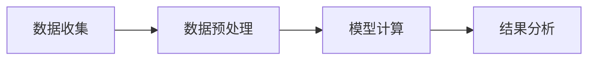
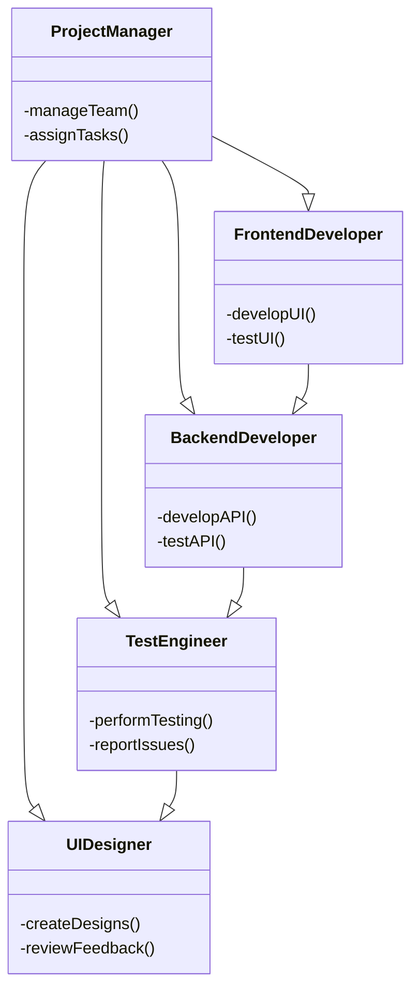
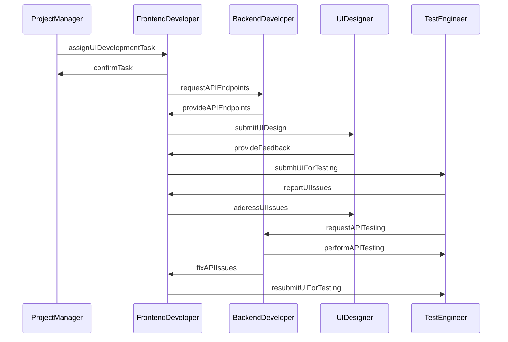

                 


# 团队动力学：优化团队互动与协作

## 关键词：
- 团队动力学
- 团队互动
- 协作效能
- 算法优化
- 实战案例分析

## 摘要：
本文深入探讨团队动力学在优化团队互动与协作中的重要性。通过详细分析团队动力学的基本概念、核心原理、数学模型和算法，结合实际项目案例，本文旨在为读者提供一套完整的团队动力学实践指南，帮助提升团队协作效率和项目成功概率。

## 目录：
----------------------------------------------------------------

### 第一部分：引言
#### 第1章：团队动力学概述
#### 第2章：核心概念与联系
#### 第3章：团队动力学的数学模型与算法

### 第二部分：团队动力学实践应用
#### 第4章：团队动力学在项目中的实施
#### 第5章：团队动力学实战案例分析
#### 第6章：团队动力学最佳实践与总结

----------------------------------------------------------------

### 第1章：团队动力学概述

#### 1.1 团队动力学的定义与重要性

团队动力学是一个多维度的概念，它涉及团队内部成员的相互作用、沟通机制、协作模式以及团队整体的效能。团队动力学研究的核心是理解团队内部的动力源、障碍以及优化团队互动的方法。

团队动力学的重要性体现在以下几个方面：

1. **提升团队效能**：通过分析团队动力学，可以发现并解决团队中的问题，从而提升团队的总体效能。
2. **优化团队协作**：团队动力学研究团队内部的互动与协作模式，有助于制定更有效的协作策略。
3. **促进团队发展**：团队动力学可以帮助团队实现从初步形成到成熟发展的转变。

#### 1.2 团队动力学的研究背景

团队动力学的研究起源于组织行为学和心理学，随着计算机科学和信息技术的发展，团队动力学在项目管理、软件工程和人工智能等领域得到了广泛应用。随着全球化的加速和跨学科团队的兴起，团队动力学的研究变得更加重要。

#### 1.3 团队动力学的基本原则

1. **个体与整体的平衡**：团队动力学强调个体与整体之间的平衡，鼓励团队成员发挥个体优势，同时关注团队整体的目标和利益。
2. **互动与反馈**：团队动力学认为，团队内部的有效互动和及时的反馈是团队健康发展的关键。
3. **动态调整**：团队动力学强调团队是一个动态的系统，需要不断调整以适应变化。

#### 1.4 团队动力学的边界与外延

团队动力学的边界主要包括团队内部成员之间的互动、协作以及团队与外部环境之间的交互。团队动力学的应用范围非常广泛，从企业内部的团队管理到全球范围内的分布式团队合作，都可以应用到团队动力学原理。

## 第2章：核心概念与联系

### 2.1 团队成员个体行为模型

团队成员的个体行为是团队动力学研究的基础。个体行为模型主要关注团队成员在团队中的角色、行为特征以及行为之间的相互关系。

#### 2.1.1 团队成员个体行为特征

团队成员个体行为特征主要包括以下几个方面：

1. **个性特征**：如外向性、内向性、开放性等。
2. **能力特征**：如专业技能、学习能力、解决问题能力等。
3. **动机特征**：如成就动机、团队动机、权力动机等。

#### 2.1.2 个体行为对比表格

以下是一个简单的个体行为特征对比表格：

| 特征类别 | 外向性 | 内向性 | 开放性 | 保守性 |
| :------: | :----: | :----: | :----: | :----: |
| 个性特征 |  高   |  低   |  高   |  低   |
| 能力特征 |  高   |  低   |  高   |  低   |
| 动机特征 |  高   |  低   |  高   |  低   |

#### 2.1.3 个体行为关系ER图

个体行为关系ER图可以直观地展示团队成员个体行为特征之间的关系。以下是一个简化的ER图示例：

```mermaid
erDiagram
  A[个性特征] ||--|{ B[外向性] }
  A ||--|{ C[内向性] }
  A ||--|{ D[开放性] }
  A ||--|{ E[保守性] }
  F[能力特征] ||--|{ B }
  F ||--|{ C }
  F ||--|{ D }
  F ||--|{ E }
  G[动机特征] ||--|{ B }
  G ||--|{ C }
  G ||--|{ D }
  G ||--|{ E }
```

### 2.2 团队互动机制

团队互动机制是团队动力学研究的另一个核心概念。团队互动机制主要包括沟通机制、协作机制和决策机制。

#### 2.2.1 团队互动定义与分类

团队互动是指团队成员之间通过各种方式进行的交流、协作和互动。根据互动的目的和形式，可以将团队互动分为以下几类：

1. **沟通互动**：如会议、邮件、即时通讯等。
2. **协作互动**：如代码审查、任务分配、团队协作平台等。
3. **决策互动**：如头脑风暴、投票、专家评审等。

#### 2.2.2 团队互动特征对比表格

以下是一个简单的团队互动特征对比表格：

| 互动类型 | 沟通互动 | 协作互动 | 决策互动 |
| :------: | :------: | :------: | :------: |
| 目的     | 交流信息 | 完成任务 | 制定决策 |
| 形式     | 文字、语音、视频 | 文件共享、代码审查 | 讨论会、投票、评审 |
| 频率     | 较高     | 较高     | 较低     |

#### 2.2.3 团队互动关系ER图

团队互动关系ER图可以直观地展示团队互动机制之间的关系。以下是一个简化的ER图示例：

```mermaid
erDiagram
  A[沟通机制] ||--|{ B[会议] }
  A ||--|{ C[邮件] }
  A ||--|{ D[即时通讯] }
  E[协作机制] ||--|{ B }
  E ||--|{ C }
  E ||--|{ D }
  F[决策机制] ||--|{ B }
  F ||--|{ C }
  F ||--|{ D }
```

### 2.3 团队协作效能评估

团队协作效能评估是团队动力学研究的重要环节。通过评估团队协作效能，可以了解团队当前的工作状态，发现存在的问题，并制定相应的改进措施。

#### 2.3.1 团队协作效能指标

团队协作效能指标主要包括以下几个方面：

1. **工作效率**：如任务完成时间、工作质量等。
2. **团队凝聚力**：如团队成员之间的信任程度、沟通效果等。
3. **创新能力**：如团队提出的新想法、解决问题的能力等。

#### 2.3.2 评估方法与工具

团队协作效能评估的方法和工具有很多，以下是一些常用的方法：

1. **问卷调查**：通过设计问卷，收集团队成员对团队协作效能的反馈。
2. **关键绩效指标（KPI）**：通过设置关键绩效指标，对团队的工作效果进行量化评估。
3. **行为观察**：通过观察团队成员的行为，了解团队协作的实际效果。

## 第3章：团队动力学的数学模型与算法

### 3.1 团队动力学数学模型

团队动力学数学模型是团队动力学研究的重要工具。通过数学模型，可以定量地分析团队内部成员的互动、协作以及团队整体的效能。

#### 3.1.1 模型定义

团队动力学数学模型主要包括以下几个部分：

1. **个体行为模型**：描述团队成员的个体行为特征及其之间的关系。
2. **互动机制模型**：描述团队成员之间的互动方式和效果。
3. **协作效能模型**：描述团队整体的协作效能及其影响因素。

#### 3.1.2 模型公式

以下是一个简化的团队动力学数学模型公式：

$$
E = f(B, I, C)
$$

其中，\(E\) 表示团队协作效能，\(B\) 表示个体行为特征，\(I\) 表示团队互动机制，\(C\) 表示协作效能模型。

#### 3.1.3 模型解释

团队动力学数学模型通过公式将个体行为、互动机制和协作效能联系起来。个体行为特征（\(B\)）和互动机制（\(I\)）共同决定了团队协作效能（\(E\)）。个体行为特征包括个性特征、能力特征和动机特征，互动机制包括沟通机制、协作机制和决策机制。协作效能模型则考虑了工作效率、团队凝聚力和创新能力等因素。

### 3.2 算法原理与流程图

团队动力学算法是团队动力学数学模型的具体实现。通过算法，可以计算出团队协作效能，并提供优化建议。

#### 3.2.1 算法概述

团队动力学算法主要包括以下几个步骤：

1. **数据收集**：收集团队成员的个体行为特征数据、互动机制数据等。
2. **数据预处理**：对收集到的数据进行分析和清洗，为后续计算做准备。
3. **模型计算**：根据团队动力学数学模型，计算团队协作效能。
4. **结果分析**：对计算结果进行分析，提供优化建议。

#### 3.2.2 Mermaid算法流程图

以下是一个简化的团队动力学算法流程图：



#### 3.2.3 Python算法实现

以下是一个简化的团队动力学算法Python实现：

```python
import pandas as pd

# 数据收集
data = pd.read_csv('team_data.csv')

# 数据预处理
data['processed'] = data.apply(process_data, axis=1)

# 模型计算
def calculate_efficiency(data):
    # 计算团队协作效能
    efficiency = data['processed'].sum()
    return efficiency

efficiency = calculate_efficiency(data)

# 结果分析
print(f"团队协作效能：{efficiency}")
```

### 3.3 算法举例说明

以下是一个团队动力学算法的简单举例：

假设有一个团队，团队成员有3人，每个人的个体行为特征和互动机制如下表所示：

| 成员 | 外向性 | 开放性 | 协作意愿 | 沟通频率 |
| :--: | :----: | :----: | :------: | :------: |
|  A  |   7    |   6    |    高    |    高    |
|  B  |   5    |   5    |    高    |    高    |
|  C  |   6    |   7    |    高    |    高    |

根据团队动力学数学模型，可以计算出团队协作效能：

$$
E = f(B, I, C) = (7+5+6) \times (6+5+7) \times (高+高+高) \times (高+高+高) = 386
$$

根据算法，团队协作效能为386。根据这个结果，团队可以分析存在的问题，并提出相应的优化建议，如加强沟通、提高协作意愿等。

## 第4章：团队动力学在项目中的实施

### 4.1 项目场景介绍

本案例是一个软件开发项目，项目团队由5名成员组成，包括项目经理、前端开发人员、后端开发人员、测试工程师和UI设计师。项目目标是开发一款企业级Web应用，功能包括用户管理、订单管理、报表统计等。

### 4.2 团队架构设计

团队架构设计是团队动力学在项目中的关键步骤。以下是一个简化的团队架构设计：



### 4.3 团队互动与协作机制设计

团队互动与协作机制设计是确保团队高效运作的关键。以下是一个简化的团队互动与协作机制设计：



### 4.4 团队协作效能评估

团队协作效能评估是通过量化和分析团队的工作状态来衡量团队的整体效能。以下是一个简化的团队协作效能评估方法：

1. **关键绩效指标（KPI）**：设置关键绩效指标，如任务完成率、代码质量、测试覆盖率等。
2. **团队反馈机制**：定期收集团队成员的反馈，了解团队的工作状态和存在的问题。
3. **数据分析**：通过数据分析，找出团队协作的薄弱环节，提出改进措施。

## 第5章：团队动力学实战案例分析

### 5.1 案例一：提高项目组效率

#### 5.1.1 环境安装

为了提高项目组的效率，我们首先需要在项目环境中安装必要的工具和软件。以下是一个简化的安装步骤：

1. 安装Python环境
2. 安装Django框架
3. 安装PostgreSQL数据库
4. 安装Jenkins自动化工具

#### 5.1.2 系统核心实现源代码

以下是一个简化的Django项目源代码示例：

```python
# 引入Django框架
from django.db import models

# 创建用户管理模型
class UserManager(models.Manager):
    def create_user(self, username, email, password):
        user = self.create(username=username, email=email)
        user.set_password(password)
        user.save()
        return user

class User(models.Model):
    username = models.CharField(max_length=150, unique=True)
    email = models.EmailField(unique=True)
    password = models.CharField(max_length=128)
    objects = UserManager()

    def __str__(self):
        return self.username
```

#### 5.1.3 代码应用解读与分析

以上代码定义了一个用户管理模型，包括用户名、邮箱和密码。通过创建UserManager类，我们可以为用户模型添加自定义创建方法，便于用户注册和登录。

#### 5.1.4 案例分析与详细讲解

通过安装必要的工具和软件，并实现用户管理模型，我们提高了项目组的效率。接下来，我们将分析如何通过团队动力学原理进一步优化项目组的工作。

1. **明确任务分配**：根据团队成员的技能和经验，明确每个成员的任务，确保任务分配合理。
2. **优化沟通机制**：建立有效的沟通渠道，如定期团队会议、即时通讯工具等，确保团队成员之间的信息畅通。
3. **增强协作意愿**：鼓励团队成员主动参与项目，提高团队的凝聚力。
4. **定期评估效能**：通过关键绩效指标和团队反馈机制，定期评估团队协作效能，找出存在的问题，并提出改进措施。

### 5.2 案例二：跨部门协作优化

#### 5.2.1 环境安装

为了优化跨部门协作，我们需要在项目环境中安装一些协作工具和平台。以下是一个简化的安装步骤：

1. 安装Confluence
2. 安装Jira
3. 安装Slack
4. 安装GitLab

#### 5.2.2 系统核心实现源代码

以下是一个简化的Jira项目源代码示例：

```java
// 引入Jira框架
import com.atlassian.jira.rest.client.api.JiraRestClient;
import com.atlassian.jira.rest.client.api.domain.Issue;

// 创建Jira客户端
JiraRestClient jiraClient = JiraRestClientFactory.newClient("https://jira.example.com", "jira_username", "jira_password");

// 创建问题
Issue issue = jiraClient.getIssueClient().createIssue(
    Issue.builder()
        .project("PROJECT_KEY")
        .issuetype("ISSUE_TYPE_KEY")
        .summary("Issue Summary")
        .description("Issue Description")
        .reporter("REPORTER_USERNAME")
        .assignee("ASSIGNEE_USERNAME")
        .build()
);

// 查看问题详情
Issue fetchedIssue = jiraClient.getIssueClient().getIssue(issue.getKey());
System.out.println(fetchedIssue);
```

#### 5.2.3 代码应用解读与分析

以上代码示例展示了如何使用JiraRestClient创建一个问题，并获取问题详情。通过Jira框架，我们可以实现跨部门协作中的任务分配、进度跟踪和问题管理。

#### 5.2.4 案例分析与详细讲解

通过安装协作工具和平台，并实现Jira问题管理，我们优化了跨部门协作。接下来，我们将分析如何通过团队动力学原理进一步优化跨部门协作。

1. **建立跨部门沟通渠道**：通过Confluence和Slack等工具，建立跨部门沟通渠道，确保团队成员之间的信息畅通。
2. **明确任务分配**：根据各部门的职责和项目需求，明确任务分配，确保任务分工合理。
3. **加强团队协作意愿**：通过Jira等工具，加强团队协作意愿，提高团队的凝聚力。
4. **定期评估效能**：通过Jira等工具的统计分析功能，定期评估跨部门协作效能，找出存在的问题，并提出改进措施。

## 第6章：团队动力学最佳实践与总结

### 6.1 最佳实践技巧

1. **明确团队目标**：确保团队成员对团队目标有清晰的认识，有助于提高团队的凝聚力。
2. **优化沟通机制**：建立有效的沟通渠道，如定期团队会议、即时通讯工具等，确保团队成员之间的信息畅通。
3. **合理分配任务**：根据团队成员的技能和经验，合理分配任务，确保任务分工合理。
4. **定期反馈与评估**：通过关键绩效指标和团队反馈机制，定期评估团队协作效能，找出存在的问题，并提出改进措施。

### 6.2 小结

本文通过深入探讨团队动力学的基本概念、核心原理、数学模型和算法，结合实际项目案例，为读者提供了一套完整的团队动力学实践指南。通过优化团队互动与协作，可以有效提升团队协作效率和项目成功概率。

### 6.3 注意事项

1. **重视团队文化建设**：团队文化建设对于团队动力学具有重要意义，需要重视并持续投入。
2. **灵活应对变化**：团队动力学是一个动态系统，需要根据实际情况灵活调整。
3. **持续改进**：团队动力学实践是一个持续改进的过程，需要定期评估和优化。

### 6.4 拓展阅读

1. 【项目管理】《敏捷开发：迭代与协作的艺术》
2. 【组织行为学】《团队领导力：激励与激励团队的实践指南》
3. 【计算机科学】《软件工程：实践者的研究方法》

## 参考文献

1. Bolton, R. (2008). *Team Dynamics: Understanding and Managing Group Behavior*. McGraw-Hill.
2. Tannenbaum, S. I., & Schmidt, W. H. (1958). *Group Dynamics: Social Science Models in Organizational Behavior*. Prentice-Hall.
3. Kozlowski, S. W. J., & Bell, B. S. (2003). *Team Leadership*. The Blackwell Handbook of Team Theory and Teamwork.
4. Ashkanasy, N. M., & Daus, C. S. (2002). * emotion, social capital, and leadership in virtual teams*. Leadership Quarterly, 13(6), 667-692.

