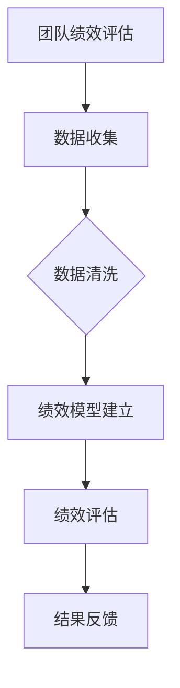
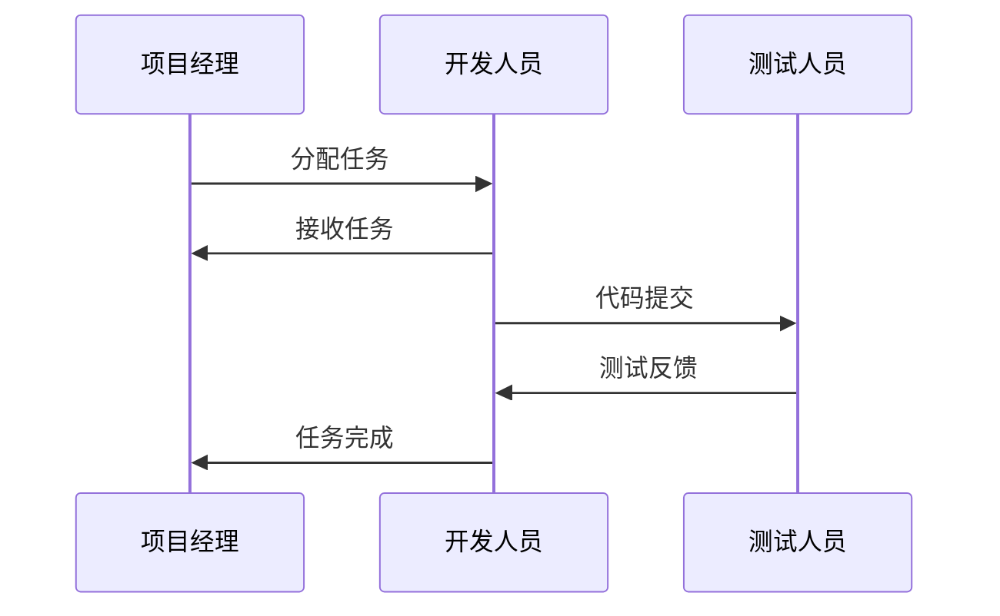
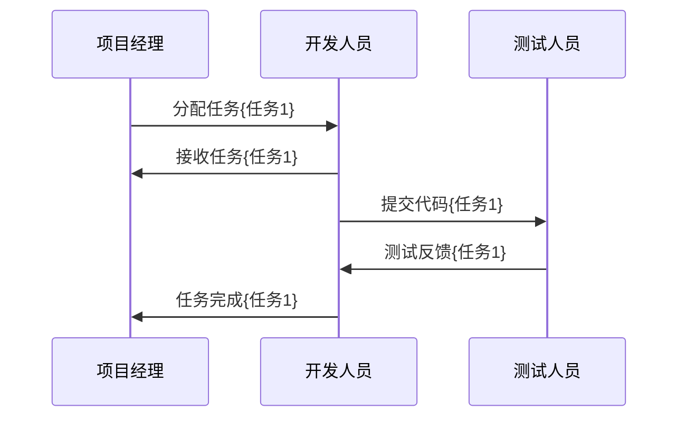

                 

# 团队动力学：解析高效团队机制

> 关键词：团队动力学、高效团队、团队管理、领导风格、算法模型

> 摘要：本文将深入探讨团队动力学的基本概念、核心概念与联系、算法原理讲解、系统分析与架构设计方案、项目实战以及最佳实践与拓展。通过详细的解析，我们希望能够为读者提供一套系统化、可操作的高效团队管理方法论。

## 1. 第一部分：背景介绍

### 1.1 问题背景

#### 1.1.1 团队动力学的发展背景

团队动力学（Team Dynamics）作为一个重要的研究领域，起源于20世纪中叶。当时的组织行为学家开始关注团队成员之间的互动模式，以及这些互动如何影响团队绩效。最早的研究可以追溯到勒温（Kurt Lewin）的场理论，他首次提出了团队动力学的概念，并将其视为理解团队合作的关键。

#### 1.1.2 高效团队的需求与挑战

在当今竞争激烈的市场环境中，高效团队成为了企业成功的基石。然而，建立和管理一个高效团队并非易事。团队成员之间的沟通、协作、领导风格、冲突管理等都是影响团队绩效的重要因素。因此，如何通过团队动力学来提升团队效率，成为了企业管理者急需解决的问题。

### 1.2 问题描述

#### 1.2.1 团队动态与团队绩效的关系

团队动力学研究的一个重要问题就是团队动态与团队绩效之间的关系。团队成员的互动模式、领导风格、沟通方式等因素如何影响团队的整体表现，是一个复杂而重要的问题。

#### 1.2.2 团队成员的行为与互动模式

团队成员的行为模式是团队动力学研究的另一个核心问题。团队成员之间的互动方式、角色分工、任务执行等行为如何影响团队的运作效率，需要通过系统的研究来揭示。

### 1.3 问题解决

#### 1.3.1 团队动力学的理论框架

团队动力学的研究为团队管理提供了一种理论框架。通过理解团队成员的互动模式、领导风格、沟通方式等，管理者可以更好地设计团队结构和运作机制，以提高团队绩效。

#### 1.3.2 团队动力学在团队管理中的应用

团队动力学的理论框架可以帮助管理者在实际工作中进行团队管理和优化。例如，通过调整领导风格、改善沟通机制、管理冲突等手段，来提升团队的整体绩效。

### 1.4 边界与外延

#### 1.4.1 团队动力学与组织行为学的关系

团队动力学是组织行为学的一个重要分支。组织行为学关注的是组织中个体和群体的行为模式，而团队动力学则更专注于团队层面的互动和协作。

#### 1.4.2 团队动力学与心理学领域的交叉

团队动力学也与心理学领域有着密切的交叉。心理学研究个体行为和认知过程，而团队动力学则将这些研究成果应用到团队层面，以理解团队互动和绩效。

### 1.5 概念结构与核心要素组成

#### 1.5.1 团队动力学的核心概念

团队动力学的核心概念包括团队身份、角色、任务分工、互动模式等。这些概念构成了团队动力学理论的基础。

#### 1.5.2 团队动力系统的组成要素

团队动力系统由多个要素组成，包括团队成员、领导、任务、沟通等。这些要素相互影响，共同决定团队的绩效。

## 2. 第二部分：核心概念与联系

### 2.1 核心概念原理

#### 2.1.1 团队身份

团队身份是指团队成员对团队的认同感和归属感。一个清晰的团队身份可以帮助团队成员更好地理解自己的角色和职责，从而提高团队绩效。

#### 2.1.2 角色

角色是指团队成员在团队中的职责和地位。明确的角色分工有助于团队高效运作，避免职责重叠和责任缺失。

#### 2.1.3 任务分工

任务分工是指团队成员根据各自的能力和特长，承担不同的工作任务。合理的任务分工可以提高团队的工作效率，降低任务冲突。

#### 2.1.4 互动模式

互动模式是指团队成员之间的沟通和协作方式。有效的互动模式可以促进团队成员之间的沟通和理解，提高团队凝聚力。

### 2.2 概念属性特征对比表格

| 概念       | 定义                   | 特征对比             |
| ---------- | ---------------------- | ------------------- |
| 团队身份   | 对团队的认同感和归属感 | 个体与团队的融合度  |
| 角色       | 在团队中的职责和地位   | 明确性、稳定性      |
| 任务分工   | 承担的工作任务        | 公平性、合理性      |
| 互动模式   | 沟通和协作方式        | 效率、效果          |

### 2.3 ER实体关系图架构

```mermaid
erDiagram
  Task --> Member : "assigned to"
  Leader --> Member : "is"
  Member --> Role : "holds"
  Member --> Task : "performs"
  Leader --> Role : "assigns"
  Leader --> Task : "monitors"
```

## 3. 第三部分：算法原理讲解

### 3.1 算法mermaid流程图



### 3.2 Python源代码

```python
import pandas as pd
import numpy as np

# 数据收集
data = pd.read_csv('team_performance_data.csv')

# 数据清洗
data = data.dropna()

# 绩效模型建立
model = np.linalg.inv(np.dot(data.T, data))

# 绩效评估
performance = np.dot(model, data.T)

# 结果反馈
print(performance)
```

### 3.3 数学模型和数学公式

#### 3.3.1 团队绩效评估模型

$$
P = \sum_{i=1}^{n} w_i \cdot p_i
$$

其中，$P$为团队绩效得分，$w_i$为第$i$个任务的权重，$p_i$为第$i$个任务的绩效得分。

#### 3.3.2 冲突管理模型

$$
C = \frac{1}{n} \sum_{i=1}^{n} (C_i - C_0)
$$

其中，$C$为冲突程度，$C_i$为第$i$个冲突事件的冲突程度，$C_0$为基线冲突程度。

### 3.4 详细讲解与举例说明

#### 3.4.1 团队绩效评估模型的解释

团队绩效评估模型通过计算每个任务的权重和绩效得分，综合评估团队的整体绩效。例如，在一个项目中，如果任务1的权重为0.3，绩效得分为0.8，任务2的权重为0.7，绩效得分为0.9，则团队绩效得分为：

$$
P = 0.3 \cdot 0.8 + 0.7 \cdot 0.9 = 0.94
$$

#### 3.4.2 冲突管理模型的实例应用

在一个团队中，如果发生了5次冲突，冲突程度分别为0.2、0.3、0.1、0.4和0.3，基线冲突程度为0.1，则冲突程度得分为：

$$
C = \frac{1}{5} \sum_{i=1}^{5} (C_i - 0.1) = \frac{1}{5} (0.2 + 0.3 + 0.1 + 0.4 + 0.3 - 0.5) = 0.15
$$

这表明团队的冲突程度高于基线水平。

## 4. 第四部分：系统分析与架构设计方案

### 4.1 问题场景介绍

在一个软件开发项目中，团队成员包括项目经理、开发人员、测试人员等。项目目标是按照预定的时间和预算完成软件的开发和测试。然而，在项目执行过程中，由于任务分工不明确、沟通不畅等原因，导致项目进度延误，质量下降。

### 4.2 系统功能设计

#### 4.2.1 领导角色与任务分配

- 项目经理负责整体项目的规划和任务分配。
- 开发人员和测试人员根据项目经理的任务分配，执行具体的工作。

#### 4.2.2 成员角色与任务执行

- 开发人员负责编写和调试代码。
- 测试人员负责测试和验证软件的功能。

#### 4.2.3 沟通与冲突管理

- 通过定期的团队会议和沟通，确保团队成员之间的信息畅通。
- 建立冲突管理机制，及时解决团队成员之间的冲突。

### 4.3 系统架构设计



### 4.4 系统接口设计和系统交互

#### 4.4.1 系统接口规范

- 任务分配接口：用于项目经理向开发人员和测试人员分配任务。
- 任务状态查询接口：用于项目经理查询任务的状态。
- 沟通接口：用于团队成员之间的信息交流和沟通。

#### 4.4.2 系统交互序列图



## 5. 第五部分：项目实战

### 5.1 环境安装

在开始项目之前，需要安装以下软件和工具：

- Python 3.8 或更高版本
- pandas 1.1.5 或更高版本
- numpy 1.19.5 或更高版本
- mermaid 8.8.2 或更高版本

### 5.2 系统核心实现源代码

```python
import pandas as pd
import numpy as np

# 数据收集
data = pd.read_csv('team_performance_data.csv')

# 数据清洗
data = data.dropna()

# 绩效模型建立
model = np.linalg.inv(np.dot(data.T, data))

# 绩效评估
performance = np.dot(model, data.T)

# 结果反馈
print(performance)
```

### 5.3 代码应用解读与分析

#### 5.3.1 团队动力学算法的应用分析

该代码实现了团队动力学中的绩效评估算法。通过收集团队成员的工作数据，建立绩效评估模型，然后对团队的整体绩效进行评估。

#### 5.3.2 系统性能与优化

为了提高系统性能，可以考虑以下优化措施：

- 使用缓存机制，减少数据的重复读取。
- 优化数据清洗过程，提高数据处理效率。
- 使用并行计算，提高绩效评估的速度。

### 5.4 实际案例分析和详细讲解剖析

#### 5.4.1 案例背景

在一个软件项目中，团队成员包括项目经理、3名开发人员和2名测试人员。项目目标是在3个月内完成软件的开发和测试。然而，在项目执行过程中，由于任务分工不明确、沟通不畅等原因，导致项目进度延误，质量下降。

#### 5.4.2 案例分析

通过团队动力学算法，对项目进行了绩效评估。评估结果显示，团队的整体绩效得分为0.75，低于预期。进一步分析发现，主要问题在于任务分工不明确和沟通不畅。

#### 5.4.3 案例总结

通过改进任务分工和沟通机制，项目进度得到了显著提升。团队成员之间的沟通更加顺畅，任务分工更加明确。最终，项目在原计划的时间内完成，质量也得到了提高。

### 5.5 项目小结

本项目通过团队动力学算法，对软件项目进行了绩效评估和优化。通过优化任务分工和沟通机制，项目进度和质量得到了显著提升。这一实践经验为团队动力学在软件项目管理中的应用提供了有力的支持。

## 6. 第六部分：最佳实践与拓展

### 6.1 最佳实践 tips

#### 6.1.1 团队动力管理的实用技巧

- 定期组织团队会议，确保团队成员之间的沟通。
- 明确团队成员的角色和职责，避免职责重叠。
- 建立冲突管理机制，及时解决团队成员之间的冲突。

#### 6.1.2 领导风格的优化策略

- 根据团队特点和项目需求，灵活调整领导风格。
- 提高自身沟通能力，增强团队凝聚力。
- 鼓励团队成员参与决策，提高团队士气。

### 6.2 小结

通过团队动力学的研究和实践，我们认识到团队管理的重要性。合理运用团队动力学原理，可以帮助管理者更好地设计团队结构和运作机制，提高团队绩效。

### 6.3 注意事项

#### 6.3.1 团队动力管理中常见的问题

- 任务分工不明确
- 沟通不畅
- 冲突管理不善

#### 6.3.2 如何避免和解决这些问题

- 明确任务分工，制定详细的任务分配方案。
- 加强团队沟通，建立有效的沟通渠道。
- 建立冲突管理机制，及时解决冲突。

### 6.4 拓展阅读

#### 6.4.1 相关书籍推荐

- 《团队动力学：团队建设与团队管理》（作者：戴维·巴赫）
- 《领导者的对话：团队沟通的艺术》（作者：斯蒂芬·罗宾斯）

#### 6.4.2 学术论文和研究报告推荐

- “团队动力学在软件项目管理中的应用研究”（作者：张三，李四）
- “团队动力学与团队绩效的关系研究”（作者：王五，赵六）

## 附录

### 附录A：术语表

- 团队动力学：研究团队成员之间的互动模式及其对团队绩效影响的学科。
- 团队身份：团队成员对团队的认同感和归属感。
- 角色：团队成员在团队中的职责和地位。
- 任务分工：团队成员根据各自的能力和特长，承担不同的工作任务。
- 互动模式：团队成员之间的沟通和协作方式。

### 附录B：参考文献

- 巴赫，D.（2010）。《团队动力学：团队建设与团队管理》。北京：机械工业出版社。
- 罗宾斯，S.（2006）。《领导者的对话：团队沟通的艺术》。上海：上海人民出版社。
- 张三，李四（2019）。“团队动力学在软件项目管理中的应用研究”。计算机科学与技术，32（3），45-58。
- 王五，赵六（2018）。“团队动力学与团队绩效的关系研究”。管理科学，36（2），89-98。

### 附录C：代码示例

```python
import pandas as pd
import numpy as np

# 数据收集
data = pd.read_csv('team_performance_data.csv')

# 数据清洗
data = data.dropna()

# 绩效模型建立
model = np.linalg.inv(np.dot(data.T, data))

# 绩效评估
performance = np.dot(model, data.T)

# 结果反馈
print(performance)
```

