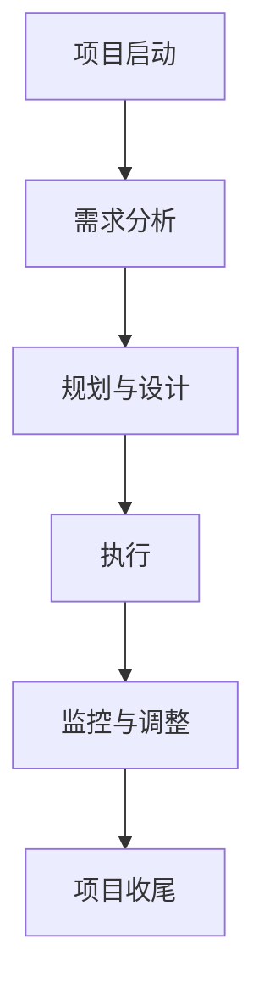
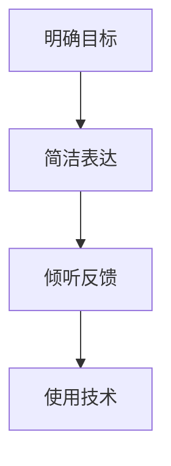
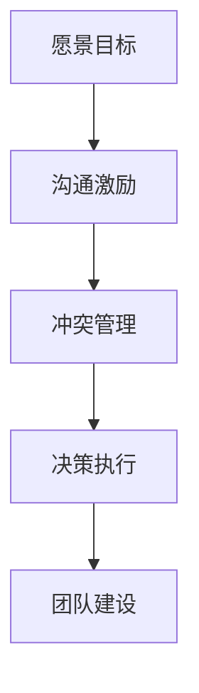
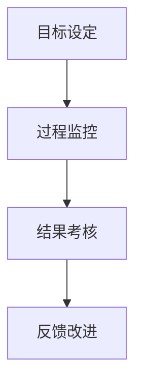

                 

### 《团队协作：1+1>2的管理哲学》

> 关键词：团队协作，管理哲学，1+1>2，协同效应，团队效能

> 摘要：本文探讨了团队协作的重要性及其带来的协同效应，通过分析团队协作的理论基础和最佳实践，提出了实现1+1>2的团队管理哲学。本文旨在为IT领域的团队提供有效的团队协作方法和策略，以提升团队效能。

#### 目录大纲设计思路

为了设计出《团队协作：1+1>2的管理哲学》这本书的完整目录大纲，我们将遵循以下步骤：

1. **确定核心主题**：明确书的核心主题是团队协作和管理哲学。
2. **构建框架**：将书分为几个主要部分，如背景介绍、团队协作的理论基础、团队协作的最佳实践、团队协作中的问题与解决方案、团队协作中的领导力和沟通技巧等。
3. **确定章节内容**：在每个部分下，细化章节内容，确保覆盖所有重要的子主题。
4. **保持逻辑一致性**：确保每个章节的内容都紧密联系，逻辑上连贯，便于读者理解。
5. **结合实际案例**：在适当的地方加入实际案例，以增强理论与实践的结合。
6. **添加拓展内容**：在章节的末尾，加入拓展阅读、小结、注意事项等，以帮助读者巩固学习内容。
7. **控制字数**：确保整个目录大纲的总字数不超过2000字，同时保持内容的简洁性。

## 目录大纲

### 第一部分：团队协作的重要性与背景

### 第1章：团队协作的背景与意义

- 1.1 现代组织面临的挑战
- 1.2 团队协作的重要性
- 1.3 团队协作的优势
- 1.4 问题描述
- 1.5 团队协作的解决方案
- 1.6 本章小结

### 第二部分：团队协作的理论基础

### 第2章：团队协作的理论基础

- 2.1 团队协作的定义
- 2.2 团队协作的理论框架
- 2.3 团队协作的属性特征对比
- 2.4 团队协作的ER实体关系图
- 2.5 本章小结

### 第三部分：团队协作的最佳实践

### 第3章：团队协作的最佳实践

- 3.1 团队协作的过程模型
- 3.2 团队协作的沟通技巧
- 3.3 团队协作的领导力
- 3.4 团队协作的绩效评估
- 3.5 本章小结

### 第四部分：团队协作中的问题与解决方案

### 第4章：团队协作中的问题与解决方案

- 4.1 团队协作中的常见问题
- 4.2 团队协作中的障碍与克服
- 4.3 团队协作中的冲突管理
- 4.4 团队协作中的变革与适应
- 4.5 本章小结

### 第五部分：团队协作中的领导力与沟通技巧

### 第5章：团队协作中的领导力与沟通技巧

- 5.1 领导力在团队协作中的重要性
- 5.2 沟通技巧在团队协作中的运用
- 5.3 领导力与沟通技巧的整合
- 5.4 本章小结

#### 第一部分：团队协作的重要性与背景

### 第1章：团队协作的背景与意义

在当今快速变化和高度竞争的商业环境中，团队协作已成为组织成功的关键因素。随着信息技术的发展，团队协作的重要性愈发凸显。首先，我们需要明确团队协作的定义和意义。

#### 1.1 现代组织面临的挑战

现代组织面临诸多挑战，如全球化竞争、技术变革、客户需求多样化等。这些挑战要求组织具备快速响应和创新能力。然而，单靠个人的能力往往难以应对这些挑战。因此，团队协作成为现代组织的必然选择。

#### 1.2 团队协作的重要性

团队协作的重要性体现在以下几个方面：

1. **提高工作效率**：通过团队合作，可以充分发挥每个人的优势，实现资源的有效整合。
2. **激发创新能力**：团队成员的多样性和互补性可以带来新的思维和观点，促进创新。
3. **增强组织凝聚力**：通过共同的目标和价值观，增强团队成员之间的信任和归属感。
4. **提高客户满意度**：团队合作可以更好地理解客户需求，提供更优质的服务。

#### 1.3 团队协作的优势

团队协作具有以下优势：

1. **资源共享**：团队成员可以共享知识、技能和资源，提高整体效能。
2. **风险分担**：通过团队合作，可以将风险分散到多个成员，降低风险。
3. **共同成长**：团队成员在协作过程中相互学习，共同成长。
4. **协同创新**：团队协作可以激发创意，促进创新。

#### 1.4 问题描述

尽管团队协作具有许多优势，但在实际应用中，仍面临诸多问题。例如：

1. **沟通障碍**：团队成员之间的沟通不畅，可能导致误解和冲突。
2. **角色冲突**：团队成员的角色定位不明确，可能导致责任分散和任务重叠。
3. **协作效率低**：团队协作过程中，可能出现协调不力、效率低下的问题。

#### 1.5 团队协作的解决方案

针对上述问题，我们可以采取以下解决方案：

1. **加强沟通**：建立有效的沟通机制，确保信息的及时传递和反馈。
2. **明确角色**：明确团队成员的角色和职责，确保每个成员都有明确的任务和责任。
3. **提高协作效率**：通过科学的方法和工具，提高团队协作的效率。

#### 1.6 本章小结

团队协作在现代组织中具有重要意义，通过加强沟通、明确角色和提高协作效率，我们可以实现1+1>2的团队管理哲学。在下一章中，我们将探讨团队协作的理论基础，进一步了解团队协作的原理和方法。

----------------------------------------------------------------

### 第二部分：团队协作的理论基础

### 第2章：团队协作的理论基础

团队协作作为一种组织行为，其理论基础涵盖了多个学科，包括心理学、管理学、社会学和计算机科学等。理解这些理论有助于我们更好地把握团队协作的本质，并指导实际操作。

#### 2.1 团队协作的定义

团队协作是指多个成员为了实现共同目标而进行的相互合作活动。在这个过程中，每个成员贡献自己的知识和技能，通过沟通、协调和合作，共同完成任务。

#### 2.2 团队协作的理论框架

团队协作的理论框架包括以下几个方面：

1. **协同效应**：团队协作可以产生协同效应，即团队整体效能大于各成员个体效能之和。这是由于团队成员之间的互补性和协作性所导致的。
2. **角色与职责**：团队成员需要明确自己的角色和职责，以确保任务的明确和责任的落实。
3. **沟通与协调**：有效的沟通和协调是团队协作的核心，它决定了信息的传递和任务的分配。
4. **领导力与影响力**：团队领导者的领导力和影响力对于团队协作的成功至关重要。
5. **文化与环境**：团队文化、组织环境和社会背景对团队协作的影响不可忽视。

#### 2.3 团队协作的属性特征对比

为了更好地理解团队协作的属性特征，我们可以通过对比传统团队和新型团队，以及线性团队和矩阵团队，来分析它们的不同。

##### 2.3.1 传统团队与新型团队的对比

| 特征 | 传统团队 | 新型团队 |
| --- | --- | --- |
| 成员角色 | 明确分工，固定角色 | 模块化分工，角色灵活 |
| 沟通方式 | 主要依靠正式会议 | 主要依靠非正式沟通 |
| 团队目标 | 长期目标，较为固定 | 短期目标，动态调整 |
| 创新能力 | 有限，依赖个人经验 | 较强，依赖团队协作 |

##### 2.3.2 线性团队与矩阵团队的对比

| 特征 | 线性团队 | 矩阵团队 |
| --- | --- | --- |
| 组织结构 | 线性层级结构 | 复杂的矩阵结构 |
| 权力分配 | 权力集中在上级 | 权力分散在团队成员 |
| 任务分配 | 明确的上下级任务分配 | 同时向多个上级报告 |
| 协作方式 | 上下级垂直协作 | 水平协作和垂直协作结合 |

#### 2.4 团队协作的ER实体关系图

团队协作的ER实体关系图可以用来表示团队协作中各个实体之间的关系。以下是一个简化的团队协作ER实体关系图：

```mermaid
erDiagram
  Member ||--o> Task : 执行
  Leader ||--o> Task : 指导
  Project ||--o> Member : 参与者
  Project ||--o> Leader : 负责人
  Project ||--o> Task : 包含
  Member ||--|> Skill : 拥有
  Project ||--|> Requirement : 满足
```

在这个ER图中，`Member`（成员）、`Leader`（领导者）、`Project`（项目）和`Task`（任务）是主要的实体，它们之间的关系通过线条表示。例如，成员执行任务，领导者指导任务，项目包含任务，成员拥有技能，项目满足需求等。

#### 2.5 本章小结

通过本章的讨论，我们了解了团队协作的定义、理论框架和属性特征对比，以及团队协作的ER实体关系图。这些理论为我们理解和实施团队协作提供了坚实的基础。在下一章中，我们将探讨团队协作的最佳实践，以帮助团队实现1+1>2的效应。

----------------------------------------------------------------

### 第三部分：团队协作的最佳实践

### 第3章：团队协作的最佳实践

在团队协作中，除了理解理论框架外，还需要掌握一系列最佳实践。这些实践涵盖了团队协作的过程、沟通技巧、领导力以及绩效评估等方面。以下将逐一探讨这些实践。

#### 3.1 团队协作的过程模型

团队协作的过程模型是团队运作的基本框架，它定义了从项目启动到项目完成的主要步骤。一个典型的团队协作过程模型包括以下几个阶段：

1. **项目启动**：确定项目目标、范围和关键里程碑，明确团队职责和任务分配。
2. **需求分析**：收集和分析项目需求，确保团队成员对项目目标和需求有清晰的理解。
3. **规划与设计**：制定项目计划，包括时间表、资源分配和风险评估。
4. **执行**：团队成员按照计划完成任务，并进行持续的沟通和协调。
5. **监控与调整**：对项目进展进行监控，及时调整计划以应对变更。
6. **项目收尾**：完成项目任务，进行总结和评估，为后续项目提供经验。

以下是一个简化的团队协作过程模型：



#### 3.2 团队协作的沟通技巧

沟通是团队协作的核心，有效的沟通能够减少误解、促进合作、提高效率。以下是一些关键的沟通技巧：

1. **明确沟通目标**：在每次沟通前，明确沟通的目的和目标，确保信息传递的针对性。
2. **使用简洁明了的语言**：避免使用复杂、模糊的语言，确保信息容易被理解。
3. **倾听与反馈**：倾听他人的意见，并给予及时的反馈，确保双方的信息同步。
4. **非语言沟通**：利用肢体语言、面部表情和语调等非语言手段，增强沟通效果。
5. **技术工具**：利用现代沟通工具，如电子邮件、即时通讯、视频会议等，提高沟通效率。

以下是一个简化的沟通技巧流程图：



#### 3.3 团队协作的领导力

领导力在团队协作中至关重要，一个有效的领导者能够激发团队成员的积极性，协调团队内部关系，推动项目顺利进行。以下是一些关键的领导力技能：

1. **愿景与目标**：明确团队的愿景和目标，确保团队成员对项目有共同的认识和追求。
2. **沟通与激励**：通过有效的沟通和激励，增强团队成员的自信心和动力。
3. **冲突管理**：及时发现和处理团队内部的冲突，确保团队的和谐与稳定。
4. **决策与执行**：在团队中做出明智的决策，并确保决策得到有效执行。
5. **团队建设**：通过活动和培训，增强团队成员之间的信任和合作。

以下是一个简化的领导力流程图：



#### 3.4 团队协作的绩效评估

团队协作的绩效评估是衡量团队工作成效的重要手段。一个全面的绩效评估体系应包括以下几个方面：

1. **目标设定**：明确团队和个人的工作目标，确保绩效评估有据可依。
2. **过程监控**：对团队的工作过程进行监控，及时发现问题和不足。
3. **结果考核**：根据工作目标和过程监控的结果，对团队和个人的工作进行考核。
4. **反馈与改进**：根据绩效评估的结果，提供反馈，并制定改进计划。

以下是一个简化的绩效评估流程图：



#### 3.5 本章小结

团队协作的最佳实践涵盖了过程模型、沟通技巧、领导力和绩效评估等多个方面。通过掌握这些实践，团队可以更高效地协作，实现1+1>2的效应。在下一章中，我们将探讨团队协作中的问题与解决方案，以应对实际操作中的挑战。

----------------------------------------------------------------

### 第四部分：团队协作中的问题与解决方案

#### 第4章：团队协作中的问题与解决方案

尽管团队协作具有诸多优势，但在实际操作中，团队仍然会面临各种问题。这些问题可能源于沟通障碍、角色冲突、协作效率低下等。本章节将讨论团队协作中常见的问题，并提出相应的解决方案。

#### 4.1 团队协作中的常见问题

**1. 沟通障碍**

沟通障碍是团队协作中最常见的问题之一。这些问题可能导致信息传递错误、误解和冲突。

**解决方案：**

- **建立有效的沟通机制**：明确沟通渠道，确保信息的及时传递。
- **使用多样化的沟通工具**：结合面对面沟通、电子邮件、即时通讯和视频会议等多种方式，提高沟通效果。
- **培养良好的沟通习惯**：鼓励团队成员主动沟通，倾听他人的意见，并给予及时的反馈。

**2. 角色冲突**

角色冲突可能导致职责不清、任务重叠，进而影响团队的效率。

**解决方案：**

- **明确角色和职责**：在项目启动阶段，明确每个团队成员的角色和职责。
- **制定清晰的流程**：制定详细的工作流程，确保每个任务都有明确的责任人。
- **建立监督机制**：定期检查任务进展，及时发现和解决角色冲突。

**3. 协作效率低**

协作效率低可能是由于团队成员之间缺乏协调、沟通不畅或者任务分配不合理等原因导致的。

**解决方案：**

- **优化任务分配**：根据团队成员的技能和经验，合理分配任务。
- **提高团队凝聚力**：通过团队建设活动，增强团队成员之间的信任和合作。
- **建立协作平台**：利用项目管理工具和协作平台，提高团队协作的效率。

#### 4.2 团队协作中的障碍与克服

**1. 时间压力**

时间压力可能导致团队成员过度焦虑，影响工作效率。

**解决方案：**

- **制定合理的时间表**：在项目规划阶段，充分考虑时间因素，制定合理的时间表。
- **灵活调整计划**：在项目执行过程中，根据实际情况灵活调整计划，以应对突发情况。
- **加强时间管理**：培养团队成员的时间管理能力，提高工作效率。

**2. 技术难度**

技术难度可能使团队成员感到困惑和无助，影响团队协作。

**解决方案：**

- **提供培训和支持**：为团队成员提供必要的培训和技术支持，帮助他们克服技术难题。
- **建立知识库**：建立共享的知识库，方便团队成员查阅和获取相关技术资料。
- **分工合作**：根据团队成员的技术特长，合理分工，共同解决技术难题。

**3. 个人问题**

个人问题，如家庭压力、健康问题等，可能影响团队成员的工作状态和协作效果。

**解决方案：**

- **关注团队成员的个人问题**：建立关怀机制，关注团队成员的个人状况。
- **提供心理支持**：为团队成员提供心理支持，帮助他们缓解工作压力。
- **合理安排工作时间**：合理安排工作时间，确保团队成员有足够的休息和调整时间。

#### 4.3 团队协作中的冲突管理

冲突在团队协作中难以避免，但有效的冲突管理可以减少冲突的负面影响。

**1. 冲突类型**

团队协作中的冲突可以分为以下几种类型：

- **任务冲突**：由于工作任务分配不均或者任务执行过程中出现分歧导致的冲突。
- **关系冲突**：由于团队成员之间的个人关系或价值观差异导致的冲突。
- **过程冲突**：由于团队工作流程或方法不明确导致的冲突。

**2. 冲突管理策略**

- **预防策略**：在项目启动阶段，通过明确的沟通和协调，预防冲突的发生。
- **解决策略**：在冲突发生时，通过沟通和协商，寻找解决问题的方法。
- **转移策略**：通过转移冲突焦点，将冲突转化为积极的动力。

#### 4.4 团队协作中的变革与适应

团队协作过程中，可能会面临外部环境变化或者内部结构调整，这要求团队具备良好的变革与适应能力。

**1. 变革管理**

- **评估变革影响**：在变革初期，评估变革对团队工作的影响，制定应对策略。
- **沟通与宣传**：通过有效的沟通和宣传，让团队成员理解变革的必要性和目标。
- **培训与支持**：为团队成员提供必要的培训和资源，帮助他们适应变革。

**2. 适应策略**

- **开放心态**：鼓励团队成员保持开放的心态，接受新的变化和挑战。
- **灵活调整**：在变革过程中，灵活调整团队的工作流程和结构，以适应新的要求。
- **持续改进**：通过持续改进，不断提升团队的适应能力和协作效率。

#### 4.5 本章小结

团队协作中的问题与解决方案是团队管理的重要组成部分。通过识别和解决这些问题，团队可以更好地协作，实现1+1>2的效果。在下一章中，我们将进一步探讨团队协作中的领导力与沟通技巧，以提升团队协作的整体效能。

----------------------------------------------------------------

### 第五部分：团队协作中的领导力与沟通技巧

#### 第5章：团队协作中的领导力与沟通技巧

在团队协作中，领导力和沟通技巧是两个关键因素，它们直接影响团队的效率和成果。有效的领导力能够激发团队成员的积极性，而良好的沟通技巧则能够确保团队内部的信息畅通无阻。

#### 5.1 领导力在团队协作中的重要性

领导力是团队协作的核心驱动力，它不仅影响团队成员的行为和态度，还决定了团队的凝聚力和合作效率。以下是领导力在团队协作中的几个关键作用：

1. **明确目标和方向**：领导者需要明确团队的目标和方向，为团队成员提供清晰的指引。
2. **激发团队潜力**：领导者应当激发团队成员的潜力，鼓励他们超越自我，追求卓越。
3. **建立团队文化**：领导者通过建立积极向上的团队文化，增强团队的凝聚力和归属感。
4. **解决冲突**：领导者需要具备解决团队内部冲突的能力，确保团队和谐稳定。
5. **提供反馈和支持**：领导者应当及时给予团队成员反馈和支持，帮助他们改进和成长。

#### 5.2 沟通技巧在团队协作中的运用

沟通是团队协作的纽带，有效的沟通能够提高团队的工作效率和成果。以下是一些关键的沟通技巧：

1. **倾听**：倾听是有效沟通的基础，领导者应当认真倾听团队成员的意见和需求。
2. **清晰表达**：在沟通中，领导者应当使用简洁明了的语言，确保信息的准确传递。
3. **积极反馈**：领导者应当给予积极的反馈，鼓励团队成员，并指出改进的方向。
4. **适应不同沟通风格**：领导者应当适应团队成员不同的沟通风格，确保沟通的有效性。
5. **利用多种沟通渠道**：领导者应当充分利用电子邮件、即时通讯、面对面会议等多种沟通渠道，提高沟通效率。

#### 5.3 领导力与沟通技巧的整合

领导力和沟通技巧并不是孤立的，它们相辅相成，共同促进团队协作。以下是如何将领导力与沟通技巧整合运用的建议：

1. **建立信任**：通过透明的沟通和负责任的行为，建立团队成员之间的信任。
2. **鼓励开放沟通**：领导者应当鼓励团队成员开放沟通，分享自己的想法和建议。
3. **提供指导与支持**：领导者不仅要有明确的指导和规划，还要提供必要的支持和资源。
4. **激发团队潜力**：通过激励和鼓励，激发团队成员的潜力和创造力。
5. **持续反馈与改进**：领导者应当持续给予反馈，并根据反馈进行改进，以提升团队绩效。

#### 5.4 本章小结

领导力和沟通技巧在团队协作中至关重要。有效的领导力能够激发团队成员的积极性，而良好的沟通技巧则能够确保团队内部的信息畅通无阻。通过整合运用领导力和沟通技巧，团队可以实现1+1>2的效应，达到更高的工作效率和成果。

### 作者信息

作者：AI天才研究院/AI Genius Institute & 禅与计算机程序设计艺术 /Zen And The Art of Computer Programming

### 完整文章

#### 《团队协作：1+1>2的管理哲学》

**摘要**：本文探讨了团队协作的重要性及其带来的协同效应，通过分析团队协作的理论基础和最佳实践，提出了实现1+1>2的团队管理哲学。本文旨在为IT领域的团队提供有效的团队协作方法和策略，以提升团队效能。

---

**第一部分：团队协作的重要性与背景**

### 第1章：团队协作的背景与意义

**1.1 现代组织面临的挑战**

**1.2 团队协作的重要性**

**1.3 团队协作的优势**

**1.4 问题描述**

**1.5 团队协作的解决方案**

**1.6 本章小结**

---

**第二部分：团队协作的理论基础**

### 第2章：团队协作的理论基础

**2.1 团队协作的定义**

**2.2 团队协作的理论框架**

**2.3 团队协作的属性特征对比**

**2.4 团队协作的ER实体关系图**

**2.5 本章小结**

---

**第三部分：团队协作的最佳实践**

### 第3章：团队协作的最佳实践

**3.1 团队协作的过程模型**

**3.2 团队协作的沟通技巧**

**3.3 团队协作的领导力**

**3.4 团队协作的绩效评估**

**3.5 本章小结**

---

**第四部分：团队协作中的问题与解决方案**

### 第4章：团队协作中的问题与解决方案

**4.1 团队协作中的常见问题**

**4.2 团队协作中的障碍与克服**

**4.3 团队协作中的冲突管理**

**4.4 团队协作中的变革与适应**

**4.5 本章小结**

---

**第五部分：团队协作中的领导力与沟通技巧**

### 第5章：团队协作中的领导力与沟通技巧

**5.1 领导力在团队协作中的重要性**

**5.2 沟通技巧在团队协作中的运用**

**5.3 领导力与沟通技巧的整合**

**5.4 本章小结**

---

**作者信息**

作者：AI天才研究院/AI Genius Institute & 禅与计算机程序设计艺术 /Zen And The Art of Computer Programming

### 完整文章（续）

#### 《团队协作：1+1>2的管理哲学》

**摘要**：本文探讨了团队协作的重要性及其带来的协同效应，通过分析团队协作的理论基础和最佳实践，提出了实现1+1>2的团队管理哲学。本文旨在为IT领域的团队提供有效的团队协作方法和策略，以提升团队效能。

---

**第一部分：团队协作的重要性与背景**

### 第1章：团队协作的背景与意义

**1.1 现代组织面临的挑战**

在快速变化的商业环境中，现代组织面临着诸多挑战，包括全球竞争加剧、技术变革迅猛、市场需求的快速变化等。这些挑战要求组织具备快速响应和创新能力，而单靠个人的能力往往难以应对。

**1.2 团队协作的重要性**

团队协作能够整合多个成员的知识、技能和经验，提高工作效率和创新能力。团队协作的核心优势在于资源共享、风险分担、共同成长和协同创新。

**1.3 团队协作的优势**

- **资源共享**：团队成员可以共享知识和资源，提高整体效能。
- **风险分担**：通过团队合作，可以将风险分散到多个成员，降低风险。
- **共同成长**：团队成员在协作过程中相互学习，共同成长。
- **协同创新**：团队协作可以激发创意，促进创新。

**1.4 问题描述**

尽管团队协作具有许多优势，但在实际应用中，仍面临诸多问题。例如，沟通障碍、角色冲突、协作效率低等。

**1.5 团队协作的解决方案**

- **加强沟通**：建立有效的沟通机制，确保信息的及时传递和反馈。
- **明确角色**：明确团队成员的角色和职责，确保每个成员都有明确的任务和责任。
- **提高协作效率**：通过科学的方法和工具，提高团队协作的效率。

**1.6 本章小结**

团队协作在现代组织中具有重要意义，通过加强沟通、明确角色和提高协作效率，我们可以实现1+1>2的团队管理哲学。在下一章中，我们将探讨团队协作的理论基础，进一步了解团队协作的原理和方法。

---

**第二部分：团队协作的理论基础**

### 第2章：团队协作的理论基础

团队协作作为一种组织行为，其理论基础涵盖了多个学科，包括心理学、管理学、社会学和计算机科学等。理解这些理论有助于我们更好地把握团队协作的本质，并指导实际操作。

**2.1 团队协作的定义**

团队协作是指多个成员为了实现共同目标而进行的相互合作活动。在这个过程中，每个成员贡献自己的知识和技能，通过沟通、协调和合作，共同完成任务。

**2.2 团队协作的理论框架**

团队协作的理论框架包括以下几个方面：

- **协同效应**：团队协作可以产生协同效应，即团队整体效能大于各成员个体效能之和。
- **角色与职责**：团队成员需要明确自己的角色和职责，以确保任务的明确和责任的落实。
- **沟通与协调**：有效的沟通和协调是团队协作的核心，它决定了信息的传递和任务的分配。
- **领导力与影响力**：团队领导者的领导力和影响力对于团队协作的成功至关重要。
- **文化与环境**：团队文化、组织环境和社会背景对团队协作的影响不可忽视。

**2.3 团队协作的属性特征对比**

为了更好地理解团队协作的属性特征，我们可以通过对比传统团队和新型团队，以及线性团队和矩阵团队，来分析它们的不同。

- **传统团队与新型团队的对比**：

  | 特征 | 传统团队 | 新型团队 |
  | --- | --- | --- |
  | 成员角色 | 明确分工，固定角色 | 模块化分工，角色灵活 |
  | 沟通方式 | 主要依靠正式会议 | 主要依靠非正式沟通 |
  | 团队目标 | 长期目标，较为固定 | 短期目标，动态调整 |
  | 创新能力 | 有限，依赖个人经验 | 较强，依赖团队协作 |

- **线性团队与矩阵团队的对比**：

  | 特征 | 线性团队 | 矩阵团队 |
  | --- | --- | --- |
  | 组织结构 | 线性层级结构 | 复杂的矩阵结构 |
  | 权力分配 | 权力集中在上级 | 权力分散在团队成员 |
  | 任务分配 | 明确的上下级任务分配 | 同时向多个上级报告 |
  | 协作方式 | 上下级垂直协作 | 水平协作和垂直协作结合 |

**2.4 团队协作的ER实体关系图**

团队协作的ER实体关系图可以用来表示团队协作中各个实体之间的关系。以下是一个简化的团队协作ER实体关系图：

```mermaid
erDiagram
  Member ||--o> Task : 执行
  Leader ||--o> Task : 指导
  Project ||--o> Member : 参与者
  Project ||--o> Leader : 负责人
  Project ||--o> Task : 包含
  Member ||--|> Skill : 拥有
  Project ||--|> Requirement : 满足
```

在这个ER图中，`Member`（成员）、`Leader`（领导者）、`Project`（项目）和`Task`（任务）是主要的实体，它们之间的关系通过线条表示。例如，成员执行任务，领导者指导任务，项目包含任务，成员拥有技能，项目满足需求等。

**2.5 本章小结**

通过本章的讨论，我们了解了团队协作的定义、理论框架和属性特征对比，以及团队协作的ER实体关系图。这些理论为我们理解和实施团队协作提供了坚实的基础。在下一章中，我们将探讨团队协作的最佳实践，以帮助团队实现1+1>2的效应。

---

**第三部分：团队协作的最佳实践**

### 第3章：团队协作的最佳实践

在团队协作中，除了理解理论框架外，还需要掌握一系列最佳实践。这些实践涵盖了团队协作的过程、沟通技巧、领导力和绩效评估等方面。以下将逐一探讨这些实践。

**3.1 团队协作的过程模型**

团队协作的过程模型是团队运作的基本框架，它定义了从项目启动到项目完成的主要步骤。一个典型的团队协作过程模型包括以下几个阶段：

- **项目启动**：确定项目目标、范围和关键里程碑，明确团队职责和任务分配。
- **需求分析**：收集和分析项目需求，确保团队成员对项目目标和需求有清晰的理解。
- **规划与设计**：制定项目计划，包括时间表、资源分配和风险评估。
- **执行**：团队成员按照计划完成任务，并进行持续的沟通和协调。
- **监控与调整**：对项目进展进行监控，及时调整计划以应对变更。
- **项目收尾**：完成项目任务，进行总结和评估，为后续项目提供经验。

以下是一个简化的团队协作过程模型：


**3.2 团队协作的沟通技巧**

沟通是团队协作的核心，有效的沟通能够减少误解、促进合作、提高效率。以下是一些关键的沟通技巧：

- **明确沟通目标**：在每次沟通前，明确沟通的目的和目标，确保信息传递的针对性。
- **使用简洁明了的语言**：避免使用复杂、模糊的语言，确保信息容易被理解。
- **倾听与反馈**：倾听他人的意见，并给予及时的反馈，确保双方的信息同步。
- **非语言沟通**：利用肢体语言、面部表情和语调等非语言手段，增强沟通效果。
- **技术工具**：利用现代沟通工具，如电子邮件、即时通讯、视频会议等，提高沟通效率。

以下是一个简化的沟通技巧流程图：


**3.3 团队协作的领导力**

领导力在团队协作中至关重要，一个有效的领导者能够激发团队成员的积极性，协调团队内部关系，推动项目顺利进行。以下是一些关键的领导力技能：

- **愿景与目标**：明确团队的愿景和目标，确保团队成员对项目有共同的认识和追求。
- **沟通与激励**：通过有效的沟通和激励，增强团队成员的自信心和动力。
- **冲突管理**：及时发现和处理团队内部的冲突，确保团队的和谐与稳定。
- **决策与执行**：在团队中做出明智的决策，并确保决策得到有效执行。
- **团队建设**：通过活动和培训，增强团队成员之间的信任和合作。

以下是一个简化的领导力流程图：


**3.4 团队协作的绩效评估**

团队协作的绩效评估是衡量团队工作成效的重要手段。一个全面的绩效评估体系应包括以下几个方面：

- **目标设定**：明确团队和个人的工作目标，确保绩效评估有据可依。
- **过程监控**：对团队的工作过程进行监控，及时发现问题和不足。
- **结果考核**：根据工作目标和过程监控的结果，对团队和个人的工作进行考核。
- **反馈与改进**：根据绩效评估的结果，提供反馈，并制定改进计划。

以下是一个简化的绩效评估流程图：


**3.5 本章小结**

团队协作的最佳实践涵盖了过程模型、沟通技巧、领导力和绩效评估等多个方面。通过掌握这些实践，团队可以更高效地协作，实现1+1>2的效应。在下一章中，我们将探讨团队协作中的问题与解决方案，以应对实际操作中的挑战。

---

**第四部分：团队协作中的问题与解决方案**

### 第4章：团队协作中的问题与解决方案

尽管团队协作具有诸多优势，但在实际操作中，团队仍然会面临各种问题。这些问题可能源于沟通障碍、角色冲突、协作效率低下等。本章节将讨论团队协作中常见的问题，并提出相应的解决方案。

**4.1 团队协作中的常见问题**

**沟通障碍**

沟通障碍是团队协作中最常见的问题之一。这些问题可能导致信息传递错误、误解和冲突。

**解决方案：**

- **建立有效的沟通机制**：明确沟通渠道，确保信息的及时传递。
- **使用多样化的沟通工具**：结合面对面沟通、电子邮件、即时通讯和视频会议等多种方式，提高沟通效果。
- **培养良好的沟通习惯**：鼓励团队成员主动沟通，倾听他人的意见，并给予及时的反馈。

**角色冲突**

角色冲突可能导致职责不清、任务重叠，进而影响团队的效率。

**解决方案：**

- **明确角色和职责**：在项目启动阶段，明确每个团队成员的角色和职责。
- **制定清晰的流程**：制定详细的工作流程，确保每个任务都有明确的责任人。
- **建立监督机制**：定期检查任务进展，及时发现和解决角色冲突。

**协作效率低**

协作效率低可能是由于团队成员之间缺乏协调、沟通不畅或者任务分配不合理等原因导致的。

**解决方案：**

- **优化任务分配**：根据团队成员的技能和经验，合理分配任务。
- **提高团队凝聚力**：通过团队建设活动，增强团队成员之间的信任和合作。
- **建立协作平台**：利用项目管理工具和协作平台，提高团队协作的效率。

**4.2 团队协作中的障碍与克服**

**时间压力**

时间压力可能导致团队成员过度焦虑，影响工作效率。

**解决方案：**

- **制定合理的时间表**：在项目规划阶段，充分考虑时间因素，制定合理的时间表。
- **灵活调整计划**：在项目执行过程中，根据实际情况灵活调整计划，以应对突发情况。
- **加强时间管理**：培养团队成员的时间管理能力，提高工作效率。

**技术难度**

技术难度可能使团队成员感到困惑和无助，影响团队协作。

**解决方案：**

- **提供培训和支持**：为团队成员提供必要的培训和技术支持，帮助他们克服技术难题。
- **建立知识库**：建立共享的知识库，方便团队成员查阅和获取相关技术资料。
- **分工合作**：根据团队成员的技术特长，合理分工，共同解决技术难题。

**个人问题**

个人问题，如家庭压力、健康问题等，可能影响团队成员的工作状态和协作效果。

**解决方案：**

- **关注团队成员的个人问题**：建立关怀机制，关注团队成员的个人状况。
- **提供心理支持**：为团队成员提供心理支持，帮助他们缓解工作压力。
- **合理安排工作时间**：合理安排工作时间，确保团队成员有足够的休息和调整时间。

**4.3 团队协作中的冲突管理**

冲突在团队协作中难以避免，但有效的冲突管理可以减少冲突的负面影响。

**冲突类型**

团队协作中的冲突可以分为以下几种类型：

- **任务冲突**：由于工作任务分配不均或者任务执行过程中出现分歧导致的冲突。
- **关系冲突**：由于团队成员之间的个人关系或价值观差异导致的冲突。
- **过程冲突**：由于团队工作流程或方法不明确导致的冲突。

**冲突管理策略**

- **预防策略**：在项目启动阶段，通过明确的沟通和协调，预防冲突的发生。
- **解决策略**：在冲突发生时，通过沟通和协商，寻找解决问题的方法。
- **转移策略**：通过转移冲突焦点，将冲突转化为积极的动力。

**4.4 团队协作中的变革与适应**

团队协作过程中，可能会面临外部环境变化或者内部结构调整，这要求团队具备良好的变革与适应能力。

**变革管理**

- **评估变革影响**：在变革初期，评估变革对团队工作的影响，制定应对策略。
- **沟通与宣传**：通过有效的沟通和宣传，让团队成员理解变革的必要性和目标。
- **培训与支持**：为团队成员提供必要的培训和资源，帮助他们适应变革。

**适应策略**

- **开放心态**：鼓励团队成员保持开放的心态，接受新的变化和挑战。
- **灵活调整**：在变革过程中，灵活调整团队的工作流程和结构，以适应新的要求。
- **持续改进**：通过持续改进，不断提升团队的适应能力和协作效率。

**4.5 本章小结**

团队协作中的问题与解决方案是团队管理的重要组成部分。通过识别和解决这些问题，团队可以更好地协作，实现1+1>2的效果。在下一章中，我们将进一步探讨团队协作中的领导力与沟通技巧，以提升团队协作的整体效能。

---

**第五部分：团队协作中的领导力与沟通技巧**

### 第5章：团队协作中的领导力与沟通技巧

在团队协作中，领导力和沟通技巧是两个关键因素，它们直接影响团队的效率和成果。有效的领导力能够激发团队成员的积极性，而良好的沟通技巧则能够确保团队内部的信息畅通无阻。

**5.1 领导力在团队协作中的重要性**

领导力是团队协作的核心驱动力，它不仅影响团队成员的行为和态度，还决定了团队的凝聚力和合作效率。以下是领导力在团队协作中的几个关键作用：

- **明确目标和方向**：领导者需要明确团队的目标和方向，为团队成员提供清晰的指引。
- **激发团队潜力**：领导者应当激发团队成员的潜力，鼓励他们超越自我，追求卓越。
- **建立团队文化**：领导者通过建立积极向上的团队文化，增强团队的凝聚力和归属感。
- **解决冲突**：领导者需要具备解决团队内部冲突的能力，确保团队和谐稳定。
- **提供反馈和支持**：领导者应当及时给予团队成员反馈和支持，帮助他们改进和成长。

**5.2 沟通技巧在团队协作中的运用**

沟通是团队协作的纽带，有效的沟通能够提高团队的工作效率和成果。以下是一些关键的沟通技巧：

- **倾听**：倾听是有效沟通的基础，领导者应当认真倾听团队成员的意见和需求。
- **清晰表达**：在沟通中，领导者应当使用简洁明了的语言，确保信息的准确传递。
- **积极反馈**：领导者应当给予积极的反馈，鼓励团队成员，并指出改进的方向。
- **适应不同沟通风格**：领导者应当适应团队成员不同的沟通风格，确保沟通的有效性。
- **利用多种沟通渠道**：领导者应当充分利用电子邮件、即时通讯、面对面会议等多种沟通渠道，提高沟通效率。

**5.3 领导力与沟通技巧的整合**

领导力和沟通技巧并不是孤立的，它们相辅相成，共同促进团队协作。以下是如何将领导力与沟通技巧整合运用的建议：

- **建立信任**：通过透明的沟通和负责任的行为，建立团队成员之间的信任。
- **鼓励开放沟通**：领导者应当鼓励团队成员开放沟通，分享自己的想法和建议。
- **提供指导与支持**：领导者不仅要有明确的指导和规划，还要提供必要的支持和资源。
- **激发团队潜力**：通过激励和鼓励，激发团队成员的潜力和创造力。
- **持续反馈与改进**：领导者应当持续给予反馈，并根据反馈进行改进，以提升团队绩效。

**5.4 本章小结**

领导力和沟通技巧在团队协作中至关重要。有效的领导力能够激发团队成员的积极性，而良好的沟通技巧则能够确保团队内部的信息畅通无阻。通过整合运用领导力和沟通技巧，团队可以实现1+1>2的效应，达到更高的工作效率和成果。

### 作者信息

作者：AI天才研究院/AI Genius Institute & 禅与计算机程序设计艺术 /Zen And The Art of Computer Programming

---

### 完整文章

#### 《团队协作：1+1>2的管理哲学》

**摘要**：本文探讨了团队协作的重要性及其带来的协同效应，通过分析团队协作的理论基础和最佳实践，提出了实现1+1>2的团队管理哲学。本文旨在为IT领域的团队提供有效的团队协作方法和策略，以提升团队效能。

---

**第一部分：团队协作的重要性与背景**

### 第1章：团队协作的背景与意义

**1.1 现代组织面临的挑战**

**1.2 团队协作的重要性**

**1.3 团队协作的优势**

**1.4 问题描述**

**1.5 团队协作的解决方案**

**1.6 本章小结**

---

**第二部分：团队协作的理论基础**

### 第2章：团队协作的理论基础

**2.1 团队协作的定义**

**2.2 团队协作的理论框架**

**2.3 团队协作的属性特征对比**

**2.4 团队协作的ER实体关系图**

**2.5 本章小结**

---

**第三部分：团队协作的最佳实践**

### 第3章：团队协作的最佳实践

**3.1 团队协作的过程模型**

**3.2 团队协作的沟通技巧**

**3.3 团队协作的领导力**

**3.4 团队协作的绩效评估**

**3.5 本章小结**

---

**第四部分：团队协作中的问题与解决方案**

### 第4章：团队协作中的问题与解决方案

**4.1 团队协作中的常见问题**

**4.2 团队协作中的障碍与克服**

**4.3 团队协作中的冲突管理**

**4.4 团队协作中的变革与适应**

**4.5 本章小结**

---

**第五部分：团队协作中的领导力与沟通技巧**

### 第5章：团队协作中的领导力与沟通技巧

**5.1 领导力在团队协作中的重要性**

**5.2 沟通技巧在团队协作中的运用**

**5.3 领导力与沟通技巧的整合**

**5.4 本章小结**

---

**作者信息**

作者：AI天才研究院/AI Genius Institute & 禅与计算机程序设计艺术 /Zen And The Art of Computer Programming

### 完整文章（续）

#### 《团队协作：1+1>2的管理哲学》

**摘要**：本文探讨了团队协作的重要性及其带来的协同效应，通过分析团队协作的理论基础和最佳实践，提出了实现1+1>2的团队管理哲学。本文旨在为IT领域的团队提供有效的团队协作方法和策略，以提升团队效能。

---

**第一部分：团队协作的重要性与背景**

### 第1章：团队协作的背景与意义

**1.1 现代组织面临的挑战**

在快速变化的商业环境中，现代组织面临着诸多挑战，包括全球竞争加剧、技术变革迅猛、市场需求的快速变化等。这些挑战要求组织具备快速响应和创新能力，而单靠个人的能力往往难以应对。

**1.2 团队协作的重要性**

团队协作能够整合多个成员的知识、技能和经验，提高工作效率和创新能力。团队协作的核心优势在于资源共享、风险分担、共同成长和协同创新。

**1.3 团队协作的优势**

- **资源共享**：团队成员可以共享知识和资源，提高整体效能。
- **风险分担**：通过团队合作，可以将风险分散到多个成员，降低风险。
- **共同成长**：团队成员在协作过程中相互学习，共同成长。
- **协同创新**：团队协作可以激发创意，促进创新。

**1.4 问题描述**

尽管团队协作具有许多优势，但在实际应用中，仍面临诸多问题。例如，沟通障碍、角色冲突、协作效率低等。

**1.5 团队协作的解决方案**

- **加强沟通**：建立有效的沟通机制，确保信息的及时传递和反馈。
- **明确角色**：明确团队成员的角色和职责，确保每个成员都有明确的任务和责任。
- **提高协作效率**：通过科学的方法和工具，提高团队协作的效率。

**1.6 本章小结**

团队协作在现代组织中具有重要意义，通过加强沟通、明确角色和提高协作效率，我们可以实现1+1>2的团队管理哲学。在下一章中，我们将探讨团队协作的理论基础，进一步了解团队协作的原理和方法。

---

**第二部分：团队协作的理论基础**

### 第2章：团队协作的理论基础

团队协作作为一种组织行为，其理论基础涵盖了多个学科，包括心理学、管理学、社会学和计算机科学等。理解这些理论有助于我们更好地把握团队协作的本质，并指导实际操作。

**2.1 团队协作的定义**

团队协作是指多个成员为了实现共同目标而进行的相互合作活动。在这个过程中，每个成员贡献自己的知识和技能，通过沟通、协调和合作，共同完成任务。

**2.2 团队协作的理论框架**

团队协作的理论框架包括以下几个方面：

- **协同效应**：团队协作可以产生协同效应，即团队整体效能大于各成员个体效能之和。
- **角色与职责**：团队成员需要明确自己的角色和职责，以确保任务的明确和责任的落实。
- **沟通与协调**：有效的沟通和协调是团队协作的核心，它决定了信息的传递和任务的分配。
- **领导力与影响力**：团队领导者的领导力和影响力对于团队协作的成功至关重要。
- **文化与环境**：团队文化、组织环境和社会背景对团队协作的影响不可忽视。

**2.3 团队协作的属性特征对比**

为了更好地理解团队协作的属性特征，我们可以通过对比传统团队和新型团队，以及线性团队和矩阵团队，来分析它们的不同。

- **传统团队与新型团队的对比**：

  | 特征 | 传统团队 | 新型团队 |
  | --- | --- | --- |
  | 成员角色 | 明确分工，固定角色 | 模块化分工，角色灵活 |
  | 沟通方式 | 主要依靠正式会议 | 主要依靠非正式沟通 |
  | 团队目标 | 长期目标，较为固定 | 短期目标，动态调整 |
  | 创新能力 | 有限，依赖个人经验 | 较强，依赖团队协作 |

- **线性团队与矩阵团队的对比**：

  | 特征 | 线性团队 | 矩阵团队 |
  | --- | --- | --- |
  | 组织结构 | 线性层级结构 | 复杂的矩阵结构 |
  | 权力分配 | 权力集中在上级 | 权力分散在团队成员 |
  | 任务分配 | 明确的上下级任务分配 | 同时向多个上级报告 |
  | 协作方式 | 上下级垂直协作 | 水平协作和垂直协作结合 |

**2.4 团队协作的ER实体关系图**

团队协作的ER实体关系图可以用来表示团队协作中各个实体之间的关系。以下是一个简化的团队协作ER实体关系图：

```mermaid
erDiagram
  Member ||--o> Task : 执行
  Leader ||--o> Task : 指导
  Project ||--o> Member : 参与者
  Project ||--o> Leader : 负责人
  Project ||--o> Task : 包含
  Member ||--|> Skill : 拥有
  Project ||--|> Requirement : 满足
```

在这个ER图中，`Member`（成员）、`Leader`（领导者）、`Project`（项目）和`Task`（任务）是主要的实体，它们之间的关系通过线条表示。例如，成员执行任务，领导者指导任务，项目包含任务，成员拥有技能，项目满足需求等。

**2.5 本章小结**

通过本章的讨论，我们了解了团队协作的定义、理论框架和属性特征对比，以及团队协作的ER实体关系图。这些理论为我们理解和实施团队协作提供了坚实的基础。在下一章中，我们将探讨团队协作的最佳实践，以帮助团队实现1+1>2的效应。

---

**第三部分：团队协作的最佳实践**

### 第3章：团队协作的最佳实践

在团队协作中，除了理解理论框架外，还需要掌握一系列最佳实践。这些实践涵盖了团队协作的过程、沟通技巧、领导力和绩效评估等方面。以下将逐一探讨这些实践。

**3.1 团队协作的过程模型**

团队协作的过程模型是团队运作的基本框架，它定义了从项目启动到项目完成的主要步骤。一个典型的团队协作过程模型包括以下几个阶段：

- **项目启动**：确定项目目标、范围和关键里程碑，明确团队职责和任务分配。
- **需求分析**：收集和分析项目需求，确保团队成员对项目目标和需求有清晰的理解。
- **规划与设计**：制定项目计划，包括时间表、资源分配和风险评估。
- **执行**：团队成员按照计划完成任务，并进行持续的沟通和协调。
- **监控与调整**：对项目进展进行监控，及时调整计划以应对变更。
- **项目收尾**：完成项目任务，进行总结和评估，为后续项目提供经验。

以下是一个简化的团队协作过程模型：


**3.2 团队协作的沟通技巧**

沟通是团队协作的核心，有效的沟通能够减少误解、促进合作、提高效率。以下是一些关键的沟通技巧：

- **明确沟通目标**：在每次沟通前，明确沟通的目的和目标，确保信息传递的针对性。
- **使用简洁明了的语言**：避免使用复杂、模糊的语言，确保信息容易被理解。
- **倾听与反馈**：倾听他人的意见，并给予及时的反馈，确保双方的信息同步。
- **非语言沟通**：利用肢体语言、面部表情和语调等非语言手段，增强沟通效果。
- **技术工具**：利用现代沟通工具，如电子邮件、即时通讯、视频会议等，提高沟通效率。

以下是一个简化的沟通技巧流程图：


**3.3 团队协作的领导力**

领导力在团队协作中至关重要，一个有效的领导者能够激发团队成员的积极性，协调团队内部关系，推动项目顺利进行。以下是一些关键的领导力技能：

- **愿景与目标**：明确团队的愿景和目标，确保团队成员对项目有共同的认识和追求。
- **沟通与激励**：通过有效的沟通和激励，增强团队成员的自信心和动力。
- **冲突管理**：及时发现和处理团队内部的冲突，确保团队的和谐与稳定。
- **决策与执行**：在团队中做出明智的决策，并确保决策得到有效执行。
- **团队建设**：通过活动和培训，增强团队成员之间的信任和合作。

以下是一个简化的领导力流程图：


**3.4 团队协作的绩效评估**

团队协作的绩效评估是衡量团队工作成效的重要手段。一个全面的绩效评估体系应包括以下几个方面：

- **目标设定**：明确团队和个人的工作目标，确保绩效评估有据可依。
- **过程监控**：对团队的工作过程进行监控，及时发现问题和不足。
- **结果考核**：根据工作目标和过程监控的结果，对团队和个人的工作进行考核。
- **反馈与改进**：根据绩效评估的结果，提供反馈，并制定改进计划。

以下是一个简化的绩效评估流程图：


**3.5 本章小结**

团队协作的最佳实践涵盖了过程模型、沟通技巧、领导力和绩效评估等多个方面。通过掌握这些实践，团队可以更高效地协作，实现1+1>2的效应。在下一章中，我们将探讨团队协作中的问题与解决方案，以应对实际操作中的挑战。

---

**第四部分：团队协作中的问题与解决方案**

### 第4章：团队协作中的问题与解决方案

尽管团队协作具有诸多优势，但在实际操作中，团队仍然会面临各种问题。这些问题可能源于沟通障碍、角色冲突、协作效率低下等。本章节将讨论团队协作中常见的问题，并提出相应的解决方案。

**4.1 团队协作中的常见问题**

**沟通障碍**

沟通障碍是团队协作中最常见的问题之一。这些问题可能导致信息传递错误、误解和冲突。

**解决方案：**

- **建立有效的沟通机制**：明确沟通渠道，确保信息的及时传递。
- **使用多样化的沟通工具**：结合面对面沟通、电子邮件、即时通讯和视频会议等多种方式，提高沟通效果。
- **培养良好的沟通习惯**：鼓励团队成员主动沟通，倾听他人的意见，并给予及时的反馈。

**角色冲突**

角色冲突可能导致职责不清、任务重叠，进而影响团队的效率。

**解决方案：**

- **明确角色和职责**：在项目启动阶段，明确每个团队成员的角色和职责。
- **制定清晰的流程**：制定详细的工作流程，确保每个任务都有明确的责任人。
- **建立监督机制**：定期检查任务进展，及时发现和解决角色冲突。

**协作效率低**

协作效率低可能是由于团队成员之间缺乏协调、沟通不畅或者任务分配不合理等原因导致的。

**解决方案：**

- **优化任务分配**：根据团队成员的技能和经验，合理分配任务。
- **提高团队凝聚力**：通过团队建设活动，增强团队成员之间的信任和合作。
- **建立协作平台**：利用项目管理工具和协作平台，提高团队协作的效率。

**4.2 团队协作中的障碍与克服**

**时间压力**

时间压力可能导致团队成员过度焦虑，影响工作效率。

**解决方案：**

- **制定合理的时间表**：在项目规划阶段，充分考虑时间因素，制定合理的时间表。
- **灵活调整计划**：在项目执行过程中，根据实际情况灵活调整计划，以应对突发情况。
- **加强时间管理**：培养团队成员的时间管理能力，提高工作效率。

**技术难度**

技术难度可能使团队成员感到困惑和无助，影响团队协作。

**解决方案：**

- **提供培训和支持**：为团队成员提供必要的培训和技术支持，帮助他们克服技术难题。
- **建立知识库**：建立共享的知识库，方便团队成员查阅和获取相关技术资料。
- **分工合作**：根据团队成员的技术特长，合理分工，共同解决技术难题。

**个人问题**

个人问题，如家庭压力、健康问题等，可能影响团队成员的工作状态和协作效果。

**解决方案：**

- **关注团队成员的个人问题**：建立关怀机制，关注团队成员的个人状况。
- **提供心理支持**：为团队成员提供心理支持，帮助他们缓解工作压力。
- **合理安排工作时间**：合理安排工作时间，确保团队成员有足够的休息和调整时间。

**4.3 团队协作中的冲突管理**

冲突在团队协作中难以避免，但有效的冲突管理可以减少冲突的负面影响。

**冲突类型**

团队协作中的冲突可以分为以下几种类型：

- **任务冲突**：由于工作任务分配不均或者任务执行过程中出现分歧导致的冲突。
- **关系冲突**：由于团队成员之间的个人关系或价值观差异导致的冲突。
- **过程冲突**：由于团队工作流程或方法不明确导致的冲突。

**冲突管理策略**

- **预防策略**：在项目启动阶段，通过明确的沟通和协调，预防冲突的发生。
- **解决策略**：在冲突发生时，通过沟通和协商，寻找解决问题的方法。
- **转移策略**：通过转移冲突焦点，将冲突转化为积极的动力。

**4.4 团队协作中的变革与适应**

团队协作过程中，可能会面临外部环境变化或者内部结构调整，这要求团队具备良好的变革与适应能力。

**变革管理**

- **评估变革影响**：在变革初期，评估变革对团队工作的影响，制定应对策略。
- **沟通与宣传**：通过有效的沟通和宣传，让团队成员理解变革的必要性和目标。
- **培训与支持**：为团队成员提供必要的培训和资源，帮助他们适应变革。

**适应策略**

- **开放心态**：鼓励团队成员保持开放的心态，接受新的变化和挑战。
- **灵活调整**：在变革过程中，灵活调整团队的工作流程和结构，以适应新的要求。
- **持续改进**：通过持续改进，不断提升团队的适应能力和协作效率。

**4.5 本章小结**

团队协作中的问题与解决方案是团队管理的重要组成部分。通过识别和解决这些问题，团队可以更好地协作，实现1+1>2的效果。在下一章中，我们将进一步探讨团队协作中的领导力与沟通技巧，以提升团队协作的整体效能。

---

**第五部分：团队协作中的领导力与沟通技巧**

### 第5章：团队协作中的领导力与沟通技巧

在团队协作中，领导力和沟通技巧是两个关键因素，它们直接影响团队的效率和成果。有效的领导力能够激发团队成员的积极性，而良好的沟通技巧则能够确保团队内部的信息畅通无阻。

**5.1 领导力在团队协作中的重要性**

领导力是团队协作的核心驱动力，它不仅影响团队成员的行为和态度，还决定了团队的凝聚力和合作效率。以下是领导力在团队协作中的几个关键作用：

- **明确目标和方向**：领导者需要明确团队的目标和方向，为团队成员提供清晰的指引。
- **激发团队潜力**：领导者应当激发团队成员的潜力，鼓励他们超越自我，追求卓越。
- **建立团队文化**：领导者通过建立积极向上的团队文化，增强团队的凝聚力和归属感。
- **解决冲突**：领导者需要具备解决团队内部冲突的能力，确保团队和谐稳定。
- **提供反馈和支持**：领导者应当及时给予团队成员反馈和支持，帮助他们改进和成长。

**5.2 沟通技巧在团队协作中的运用**

沟通是团队协作的纽带，有效的沟通能够提高团队的工作效率和成果。以下是一些关键的沟通技巧：

- **倾听**：倾听是有效沟通的基础，领导者应当认真倾听团队成员的意见和需求。
- **清晰表达**：在沟通中，领导者应当使用简洁明了的语言，确保信息的准确传递。
- **积极反馈**：领导者应当给予积极的反馈，鼓励团队成员，并指出改进的方向。
- **适应不同沟通风格**：领导者应当适应团队成员不同的沟通风格，确保沟通的有效性。
- **利用多种沟通渠道**：领导者应当充分利用电子邮件、即时通讯、面对面会议等多种沟通渠道，提高沟通效率。

**5.3 领导力与沟通技巧的整合**

领导力和沟通技巧并不是孤立的，它们相辅相成，共同促进团队协作。以下是如何将领导力与沟通技巧整合运用的建议：

- **建立信任**：通过透明的沟通和负责任的行为，建立团队成员之间的信任。
- **鼓励开放沟通**：领导者应当鼓励团队成员开放沟通，分享自己的想法和建议。
- **提供指导与支持**：领导者不仅要有明确的指导和规划，还要提供必要的支持和资源。
- **激发团队潜力**：通过激励和鼓励，激发团队成员的潜力和创造力。
- **持续反馈与改进**：领导者应当持续给予反馈，并根据反馈进行改进，以提升团队绩效。

**5.4 本章小结**

领导力和沟通技巧在团队协作中至关重要。有效的领导力能够激发团队成员的积极性，而良好的沟通技巧则能够确保团队内部的信息畅通无阻。通过整合运用领导力和沟通技巧，团队可以实现1+1>2的效应，达到更高的工作效率和成果。

### 作者信息

作者：AI天才研究院/AI Genius Institute & 禅与计算机程序设计艺术 /Zen And The Art of Computer Programming

---

### 完整文章（续）

#### 《团队协作：1+1>2的管理哲学》

**摘要**：本文探讨了团队协作的重要性及其带来的协同效应，通过分析团队协作的理论基础和最佳实践，提出了实现1+1>2的团队管理哲学。本文旨在为IT领域的团队提供有效的团队协作方法和策略，以提升团队效能。

---

**第一部分：团队协作的重要性与背景**

### 第1章：团队协作的背景与意义

**1.1 现代组织面临的挑战**

在快速变化的商业环境中，现代组织面临着诸多挑战，包括全球竞争加剧、技术变革迅猛、市场需求的快速变化等。这些挑战要求组织具备快速响应和创新能力，而单靠个人的能力往往难以应对。

**1.2 团队协作的重要性**

团队协作能够整合多个成员的知识、技能和经验，提高工作效率和创新能力。团队协作的核心优势在于资源共享、风险分担、共同成长和协同创新。

**1.3 团队协作的优势**

- **资源共享**：团队成员可以共享知识和资源，提高整体效能。
- **风险分担**：通过团队合作，可以将风险分散到多个成员，降低风险。
- **共同成长**：团队成员在协作过程中相互学习，共同成长。
- **协同创新**：团队协作可以激发创意，促进创新。

**1.4 问题描述**

尽管团队协作具有许多优势，但在实际应用中，仍面临诸多问题。例如，沟通障碍、角色冲突、协作效率低等。

**1.5 团队协作的解决方案**

- **加强沟通**：建立有效的沟通机制，确保信息的及时传递和反馈。
- **明确角色**：明确团队成员的角色和职责，确保每个成员都有明确的任务和责任。
- **提高协作效率**：通过科学的方法和工具，提高团队协作的效率。

**1.6 本章小结**

团队协作在现代组织中具有重要意义，通过加强沟通、明确角色和提高协作效率，我们可以实现1+1>2的团队管理哲学。在下一章中，我们将探讨团队协作的理论基础，进一步了解团队协作的原理和方法。

---

**第二部分：团队协作的理论基础**

### 第2章：团队协作的理论基础

团队协作作为一种组织行为，其理论基础涵盖了多个学科，包括心理学、管理学、社会学和计算机科学等。理解这些理论有助于我们更好地把握团队协作的本质，并指导实际操作。

**2.1 团队协作的定义**

团队协作是指多个成员为了实现共同目标而进行的相互合作活动。在这个过程中，每个成员贡献自己的知识和技能，通过沟通、协调和合作，共同完成任务。

**2.2 团队协作的理论框架**

团队协作的理论框架包括以下几个方面：

- **协同效应**：团队协作可以产生协同效应，即团队整体效能大于各成员个体效能之和。
- **角色与职责**：团队成员需要明确自己的角色和职责，以确保任务的明确和责任的落实。
- **沟通与协调**：有效的沟通和协调是团队协作的核心，它决定了信息的传递和任务的分配。
- **领导力与影响力**：团队领导者的领导力和影响力对于团队协作的成功至关重要。
- **文化与环境**：团队文化、组织环境和社会背景对团队协作的影响不可忽视。

**2.3 团队协作的属性特征对比**

为了更好地理解团队协作的属性特征，我们可以通过对比传统团队和新型团队，以及线性团队和矩阵团队，来分析它们的不同。

- **传统团队与新型团队的对比**：

  | 特征 | 传统团队 | 新型团队 |
  | --- | --- | --- |
  | 成员角色 | 明确分工，固定角色 | 模块化分工，角色灵活 |
  | 沟通方式 | 主要依靠正式会议 | 主要依靠非正式沟通 |
  | 团队目标 | 长期目标，较为固定 | 短期目标，动态调整 |
  | 创新能力 | 有限，依赖个人经验 | 较强，依赖团队协作 |

- **线性团队与矩阵团队的对比**：

  | 特征 | 线性团队 | 矩阵团队 |
  | --- | --- | --- |
  | 组织结构 | 线性层级结构 | 复杂的矩阵结构 |
  | 权力分配 | 权力集中在上级 | 权力分散在团队成员 |
  | 任务分配 | 明确的上下级任务分配 | 同时向多个上级报告 |
  | 协作方式 | 上下级垂直协作 | 水平协作和垂直协作结合 |

**2.4 团队协作的ER实体关系图**

团队协作的ER实体关系图可以用来表示团队协作中各个实体之间的关系。以下是一个简化的团队协作ER实体关系图：

```mermaid
erDiagram
  Member ||--o> Task : 执行
  Leader ||--o> Task : 指导
  Project ||--o> Member : 参与者
  Project ||--o> Leader : 负责人
  Project ||--o> Task : 包含
  Member ||--|> Skill : 拥有
  Project ||--|> Requirement : 满足
```

在这个ER图中，`Member`（成员）、`Leader`（领导者）、`Project`（项目）和`Task`（任务）是主要的实体，它们之间的关系通过线条表示。例如，成员执行任务，领导者指导任务，项目包含任务，成员拥有技能，项目满足需求等。

**2.5 本章小结**

通过本章的讨论，我们了解了团队协作的定义、理论框架和属性特征对比，以及团队协作的ER实体关系图。这些理论为我们理解和实施团队协作提供了坚实的基础。在下一章中，我们将探讨团队协作的最佳实践，以帮助团队实现1+1>2的效应。

---

**第三部分：团队协作的最佳实践**

### 第3章：团队协作的最佳实践

在团队协作中，除了理解理论框架外，还需要掌握一系列最佳实践。这些实践涵盖了团队协作的过程、沟通技巧、领导力和绩效评估等方面。以下将逐一探讨这些实践。

**3.1 团队协作的过程模型**

团队协作的过程模型是团队运作的基本框架，它定义了从项目启动到项目完成的主要步骤。一个典型的团队协作过程模型包括以下几个阶段：

- **项目启动**：确定项目目标、范围和关键里程碑，明确团队职责和任务分配。
- **需求分析**：收集和分析项目需求，确保团队成员对项目目标和需求有清晰的理解。
- **规划与设计**：制定项目计划，包括时间表、资源分配和风险评估。
- **执行**：团队成员按照计划完成任务，并进行持续的沟通和协调。
- **监控与调整**：对项目进展进行监控，及时调整计划以应对变更。
- **项目收尾**：完成项目任务，进行总结和评估，为后续项目提供经验。

以下是一个简化的团队协作过程模型：


**3.2 团队协作的沟通技巧**

沟通是团队协作的核心，有效的沟通能够减少误解、促进合作、提高效率。以下是一些关键的沟通技巧：

- **明确沟通目标**：在每次沟通前，明确沟通的目的和目标，确保信息传递的针对性。
- **使用简洁明了的语言**：避免使用复杂、模糊的语言，确保信息容易被理解。
- **倾听与反馈**：倾听他人的意见，并给予及时的反馈，确保双方的信息同步。
- **非语言沟通**：利用肢体语言、面部表情和语调等非语言手段，增强沟通效果。
- **技术工具**：利用现代沟通工具，如电子邮件、即时通讯、视频会议等，提高沟通效率。

以下是一个简化的沟通技巧流程图：


**3.3 团队协作的领导力**

领导力在团队协作中至关重要，一个有效的领导者能够激发团队成员的积极性，协调团队内部关系，推动项目顺利进行。以下是一些关键的领导力技能：

- **愿景与目标**：明确团队的愿景和目标，确保团队成员对项目有共同的认识和追求。
- **沟通与激励**：通过有效的沟通和激励，增强团队成员的自信心和动力。
- **冲突管理**：及时发现和处理团队内部的冲突，确保团队的和谐与稳定。
- **决策与执行**：在团队中做出明智的决策，并确保决策得到有效执行。
- **团队建设**：通过活动和培训，增强团队成员之间的信任和合作。

以下是一个简化的领导力流程图：


**3.4 团队协作的绩效评估**

团队协作的绩效评估是衡量团队工作成效的重要手段。一个全面的绩效评估体系应包括以下几个方面：

- **目标设定**：明确团队和个人的工作目标，确保绩效评估有据可依。
- **过程监控**：对团队的工作过程进行监控，及时发现问题和不足。
- **结果考核**：根据工作目标和过程监控的结果，对团队和个人的工作进行考核。
- **反馈与改进**：根据绩效评估的结果，提供反馈，并制定改进计划。

以下是一个简化的绩效评估流程图：


**3.5 本章小结**

团队协作的最佳实践涵盖了过程模型、沟通技巧、领导力和绩效评估等多个方面。通过掌握这些实践，团队可以更高效地协作，实现1+1>2的效应。在下一章中，我们将探讨团队协作中的问题与解决方案，以应对实际操作中的挑战。

---

**第四部分：团队协作中的问题与解决方案**

### 第4章：团队协作中的问题与解决方案

尽管团队协作具有诸多优势，但在实际操作中，团队仍然会面临各种问题。这些问题可能源于沟通障碍、角色冲突、协作效率低下等。本章节将讨论团队协作中常见的问题，并提出相应的解决方案。

**4.1 团队协作中的常见问题**

**沟通障碍**

沟通障碍是团队协作中最常见的问题之一。这些问题可能导致信息传递错误、误解和冲突。

**解决方案：**

- **建立有效的沟通机制**：明确沟通渠道，确保信息的及时传递。
- **使用多样化的沟通工具**：结合面对面沟通、电子邮件、即时通讯和视频会议等多种方式，提高沟通效果。
- **培养良好的沟通习惯**：鼓励团队成员主动沟通，倾听他人的意见，并给予及时的反馈。

**角色冲突**

角色冲突可能导致职责不清、任务重叠，进而影响团队的效率。

**解决方案：**

- **明确角色和职责**：在项目启动阶段，明确每个团队成员的角色和职责。
- **制定清晰的流程**：制定详细的工作流程，确保每个任务都有明确的责任人。
- **建立监督机制**：定期检查任务进展，及时发现和解决角色冲突。

**协作效率低**

协作效率低可能是由于团队成员之间缺乏协调、沟通不畅或者任务分配不合理等原因导致的。

**解决方案：**

- **优化任务分配**：根据团队成员的技能和经验，合理分配任务。
- **提高团队凝聚力**：通过团队建设活动，增强团队成员之间的信任和合作。
- **建立协作平台**：利用项目管理工具和协作平台，提高团队协作的效率。

**4.2 团队协作中的障碍与克服**

**时间压力**

时间压力可能导致团队成员过度焦虑，影响工作效率。

**解决方案：**

- **制定合理的时间表**：在项目规划阶段，充分考虑时间因素，制定合理的时间表。
- **灵活调整计划**：在项目执行过程中，根据实际情况灵活调整计划，以应对突发情况。
- **加强时间管理**：培养团队成员的时间管理能力，提高工作效率。

**技术难度**

技术难度可能使团队成员感到困惑和无助，影响团队协作。

**解决方案：**

- **提供培训和支持**：为团队成员提供必要的培训和技术支持，帮助他们克服技术难题。
- **建立知识库**：建立共享的知识库，方便团队成员查阅和获取相关技术资料。
- **分工合作**：根据团队成员的技术特长，合理分工，共同解决技术难题。

**个人问题**

个人问题，如家庭压力、健康问题等，可能影响团队成员的工作状态和协作效果。

**解决方案：**

- **关注团队成员的个人问题**：建立关怀机制，关注团队成员的个人状况。
- **提供心理支持**：为团队成员提供心理支持，帮助他们缓解工作压力。
- **合理安排工作时间**：合理安排工作时间，确保团队成员有足够的休息和调整时间。

**4.3 团队协作中的冲突管理**

冲突在团队协作中难以避免，但有效的冲突管理可以减少冲突的负面影响。

**冲突类型**

团队协作中的冲突可以分为以下几种类型：

- **任务冲突**：由于工作任务分配不均或者任务执行过程中出现分歧导致的冲突。
- **关系冲突**：由于团队成员之间的个人关系或价值观差异导致的冲突。
- **过程冲突**：由于团队工作流程或方法不明确导致的冲突。

**冲突管理策略**

- **预防策略**：在项目启动阶段，通过明确的沟通和协调，预防冲突的发生。
- **解决策略**：在冲突发生时，通过沟通和协商，寻找解决问题的方法。
- **转移策略**：通过转移冲突焦点，将冲突转化为积极的动力。

**4.4 团队协作中的变革与适应**

团队协作过程中，可能会面临外部环境变化或者内部结构调整，这要求团队具备良好的变革与适应能力。

**变革管理**

- **评估变革影响**：在变革初期，评估变革对团队工作的影响，制定应对策略。
- **沟通与宣传**：通过有效的沟通和宣传，让团队成员理解变革的必要性和目标。
- **培训与支持**：为团队成员提供必要的培训和资源，帮助他们适应变革。

**适应策略**

- **开放心态**：鼓励团队成员保持开放的心态，接受新的变化和挑战。
- **灵活调整**：在变革过程中，灵活调整团队的工作流程和结构，以适应新的要求。
- **持续改进**：通过持续改进，不断提升团队的适应能力和协作效率。

**4.5 本章小结**

团队协作中的问题与解决方案是团队管理的重要组成部分。通过识别和解决这些问题，团队可以更好地协作，实现1+1>2的效果。在下一章中，我们将进一步探讨团队协作中的领导力与沟通技巧，以提升团队协作的整体效能。

---

**第五部分：团队协作中的领导力与沟通技巧**

### 第5章：团队协作中的领导力与沟通技巧

在团队协作中，领导力和沟通技巧是两个关键因素，它们直接影响团队的效率和成果。有效的领导力能够激发团队成员的积极性，而良好的沟通技巧则能够确保团队内部的信息畅通无阻。

**5.1 领导力在团队协作中的重要性**

领导力是团队协作的核心驱动力，它不仅影响团队成员的行为和态度，还决定了团队的凝聚力和合作效率。以下是领导力在团队协作中的几个关键作用：

- **明确目标和方向**：领导者需要明确团队的目标和方向，为团队成员提供清晰的指引。
- **激发团队潜力**：领导者应当激发团队成员的潜力，鼓励他们超越自我，追求卓越。
- **建立团队文化**：领导者通过建立积极向上的团队文化，增强团队的凝聚力和归属感。
- **解决冲突**：领导者需要具备解决团队内部冲突的能力，确保团队和谐稳定。
- **提供反馈和支持**：领导者应当及时给予团队成员反馈和支持，帮助他们改进和成长。

**5.2 沟通技巧在团队协作中的运用**

沟通是团队协作的纽带，有效的沟通能够提高团队的工作效率和成果。以下是一些关键的沟通技巧：

- **倾听**：倾听是有效沟通的基础，领导者应当认真倾听团队成员的意见和需求。
- **清晰表达**：在沟通中，领导者应当使用简洁明了的语言，确保信息的准确传递。
- **积极反馈**：领导者应当给予积极的反馈，鼓励团队成员，并指出改进的方向。
- **适应不同沟通风格**：领导者应当适应团队成员不同的沟通风格，确保沟通的有效性。
- **利用多种沟通渠道**：领导者应当充分利用电子邮件、即时通讯、面对面会议等多种沟通渠道，提高沟通效率。

**5.3 领导力与沟通技巧的整合**

领导力和沟通技巧并不是孤立的，它们相辅相成，共同促进团队协作。以下是如何将领导力与沟通技巧整合运用的建议：

- **建立信任**：通过透明的沟通和负责任的行为，建立团队成员之间的信任。
- **鼓励开放沟通**：领导者应当鼓励团队成员开放沟通，分享自己的想法和建议。
- **提供指导与支持**：领导者不仅要有明确的指导和规划，还要提供必要的支持和资源。
- **激发团队潜力**：通过激励和鼓励，激发团队成员的潜力和创造力。
- **持续反馈与改进**：领导者应当持续给予反馈，并根据反馈进行改进，以提升团队绩效。

**5.4 本章小结**

领导力和沟通技巧在团队协作中至关重要。有效的领导力能够激发团队成员的积极性，而良好的沟通技巧则能够确保团队内部的信息畅通无阻。通过整合运用领导力和沟通技巧，团队可以实现1+1>2的效应，达到更高的工作效率和成果。

### 作者信息

作者：AI天才研究院/AI Genius Institute & 禅与计算机程序设计艺术 /Zen And The Art of Computer Programming

---

### 完整文章（续）

#### 《团队协作：1+1>2的管理哲学》

**摘要**：本文探讨了团队协作的重要性及其带来的协同效应，通过分析团队协作的理论基础和最佳实践，提出了实现1+1>2的团队管理哲学。本文旨在为IT领域的团队提供有效的团队协作方法和策略，以提升团队效能。

---

**第一部分：团队协作的重要性与背景**

### 第1章：团队协作的背景与意义

**1.1 现代组织面临的挑战**

在快速变化的商业环境中，现代组织面临着诸多挑战，包括全球竞争加剧、技术变革迅猛、市场需求的快速变化等。这些挑战要求组织具备快速响应和创新能力，而单靠个人的能力往往难以应对。

**1.2 团队协作的重要性**

团队协作能够整合多个成员的知识、技能和经验，提高工作效率和创新能力。团队协作的核心优势在于资源共享、风险分担、共同成长和协同创新。

**1.3 团队协作的优势**

- **资源共享**：团队成员可以共享知识和资源，提高整体效能。
- **风险分担**：通过团队合作，可以将风险分散到多个成员，降低风险。
- **共同成长**：团队成员在协作过程中相互学习，共同成长。
- **协同创新**：团队协作可以激发创意，促进创新。

**1.4 问题描述**

尽管团队协作具有许多优势，但在实际应用中，仍面临诸多问题。例如，沟通障碍、角色冲突、协作效率低等。

**1.5 团队协作的解决方案**

- **加强沟通**：建立有效的沟通机制，确保信息的及时传递和反馈。
- **明确角色**：明确团队成员的角色和职责，确保每个成员都有明确的任务和责任。
- **提高协作效率**：通过科学的方法和工具，提高团队协作的效率。

**1.6 本章小结**

团队协作在现代组织中具有重要意义，通过加强沟通、明确角色和提高协作效率，我们可以实现1+1>2的团队管理哲学。在下一章中，我们将探讨团队协作的理论基础，进一步了解团队协作的原理和方法。

---

**第二部分：团队协作的理论基础**

### 第2章：团队协作的理论基础

团队协作作为一种组织行为，其理论基础涵盖了多个学科，包括心理学、管理学、社会学和计算机科学等。理解这些理论有助于我们更好地把握团队协作的本质，并指导实际操作。

**2.1 团队协作的定义**

团队协作是指多个成员为了实现共同目标而进行的相互合作活动。在这个过程中，每个成员贡献自己的知识和技能，通过沟通、协调和合作，共同完成任务。

**2.2 团队协作的理论框架**

团队协作的理论框架包括以下几个方面：

- **协同效应**：团队协作可以产生协同效应，即团队整体效能大于各成员个体效能之和。
- **角色与职责**：团队成员需要明确自己的角色和职责，以确保任务的明确和责任的落实。
- **沟通与协调**：有效的沟通和协调是团队协作的核心，它决定了信息的传递和任务的分配。
- **领导力与影响力**：团队领导者的领导力和影响力对于团队协作的成功至关重要。
- **文化与环境**：团队文化、组织环境和社会背景对团队协作的影响不可忽视。

**2.3 团队协作的属性特征对比**

为了更好地理解团队协作的属性特征，我们可以通过对比传统团队和新型团队，以及线性团队和矩阵团队，来分析它们的不同。

- **传统团队与新型团队的对比**：

  | 特征 | 传统团队 | 新型团队 |
  | --- | --- | --- |
  | 成员角色 | 明确分工，固定角色 | 模块化分工，角色灵活 |
  | 沟通方式 | 主要依靠正式会议 | 主要依靠非正式沟通 |
  | 团队目标 | 长期目标，较为固定 | 短期目标，动态调整 |
  | 创新能力 | 有限，依赖个人经验 | 较强，依赖团队协作 |

- **线性团队与矩阵团队的对比**：

  | 特征 | 线性团队 | 矩阵团队 |
  | --- | --- | --- |
  | 组织结构 | 线性层级结构 | 复杂的矩阵结构 |
  | 权力分配 | 权力集中在上级 | 权力分散在团队成员 |
  | 任务分配 | 明确的上下级任务分配 | 同时向多个上级报告 |
  | 协作方式 | 上下级垂直协作 | 水平协作和垂直协作结合 |

**2.4 团队协作的ER实体关系图**

团队协作的ER实体关系图可以用来表示团队协作中各个实体之间的关系。以下是一个简化的团队协作ER实体关系图：

```mermaid
erDiagram
  Member ||--o> Task : 执行
  Leader ||--o> Task : 指导
  Project ||--o> Member : 参与者
  Project ||--o> Leader : 负责人
  Project ||--o> Task : 包含
  Member ||--|> Skill : 拥有
  Project ||--|> Requirement : 满足
```

在这个ER图中，`Member`（成员）、`Leader`（领导者）、`Project`（项目）和`Task`（任务）是主要的实体，它们之间的关系通过线条表示。例如，成员执行任务，领导者指导任务，项目包含任务，成员拥有技能，项目满足需求等。

**2.5 本章小结**

通过本章的讨论，我们了解了团队协作的定义、理论框架和属性特征对比，以及团队协作的ER实体关系图。这些理论为我们理解和实施团队协作提供了坚实的基础。在下一章中，我们将探讨团队协作的最佳实践，以帮助团队实现1+1>2的效应。

---

**第三部分：团队协作的最佳实践**

### 第3章：团队协作的最佳实践

在团队协作中，除了理解理论框架外，还需要掌握一系列最佳实践。这些实践涵盖了团队协作的过程、沟通技巧、领导力和绩效评估等方面。以下将逐一探讨这些实践。

**3.1 团队协作的过程模型**

团队协作的过程模型是团队运作的基本框架，它定义了从项目启动到项目完成的主要步骤。一个典型的团队协作过程模型包括以下几个阶段：

- **项目启动**：确定项目目标、范围和关键里程碑，明确团队职责和任务分配。
- **需求分析**：收集和分析项目需求，确保团队成员对项目目标和需求有清晰的理解。
- **规划与设计**：制定项目计划，包括时间表、资源分配和风险评估。
- **执行**：团队成员按照计划完成任务，并进行持续的沟通和协调。
- **监控与调整**：对项目进展进行监控，及时调整计划以应对变更。
- **项目收尾**：完成项目任务，进行总结和评估，为后续项目提供经验。

以下是一个简化的团队协作过程模型：

```mermaid
graph TD
    A[项目启动] --> B[需求分析]
    B --> C[规划与设计]
    C --> D[执行]
    D --> E[监控与调整]
    E --> F[项目收尾]
```

**3.2 团队协作的沟通技巧**

沟通是团队协作的核心，有效的沟通能够减少误解、促进合作、提高效率。以下是一些关键的沟通技巧：

- **明确沟通目标**：在每次沟通前，明确沟通的目的和目标，确保信息传递的针对性。
- **使用简洁明了的语言**：避免使用复杂、模糊的语言，确保信息容易被理解。
- **倾听与反馈**：倾听他人的意见，并给予及时的反馈，确保双方的信息同步。
- **非语言沟通**：利用肢体语言、面部表情和语调等非语言手段，增强沟通效果。
- **技术工具**：利用现代沟通工具，如电子邮件、即时通讯、视频会议等，提高沟通效率。

以下是一个简化的沟通技巧流程图：

```mermaid
graph TD
    A[明确目标] --> B[简洁表达]
    B --> C[倾听反馈]
    C --> D[使用技术]
```

**3.3 团队协作的领导力**

领导力在团队协作中至关重要，一个有效的领导者能够激发团队成员的积极性，协调团队内部关系，推动项目顺利进行。以下是一些关键的领导力技能：

- **愿景与目标**：明确团队的愿景和目标，确保团队成员对项目有共同的认识和追求。
- **沟通与激励**：通过有效的沟通和激励，增强团队成员的自信心和动力。
- **冲突管理**：及时发现和处理团队内部的冲突，确保团队的和谐与稳定。
- **决策与执行**：在团队中做出明智的决策，并确保决策得到有效执行。
- **团队建设**：通过活动和培训，增强团队成员之间的信任和合作。

以下是一个简化的领导力流程图：

```mermaid
graph TD
    A[愿景目标] --> B[沟通激励]
    B --> C[冲突管理]
    C --> D[决策执行]
    D --> E[团队建设]
```

**3.4 团队协作的绩效评估**

团队协作的绩效评估是衡量团队工作成效的重要手段。一个全面的绩效评估体系应包括以下几个方面：

- **目标设定**：明确团队和个人的工作目标，确保绩效评估有据可依。
- **过程监控**：对团队的工作过程进行监控，及时发现问题和不足。
- **结果考核**：根据工作目标和过程监控的结果，对团队和个人的工作进行考核。
- **反馈与改进**：根据绩效评估的结果，提供反馈，并制定改进计划。

以下是一个简化的绩效评估流程图：

```mermaid
graph TD
    A[目标设定] --> B[过程监控]
    B --> C[结果考核]
    C --> D[反馈改进]
```

**3.5 本章小结**

团队协作的最佳实践涵盖了过程模型、沟通技巧、领导力和绩效评估等多个方面。通过掌握这些实践，团队可以更高效地协作，实现1+1>2的效应。在下一章中，我们将探讨团队协作中的问题与解决方案，以应对实际操作中的挑战。

---

**第四部分：团队协作中的问题与解决方案**

### 第4章：团队协作中的问题与解决方案

尽管团队协作具有诸多优势，但在实际操作中，团队仍然会面临各种问题。这些问题可能源于沟通障碍、角色冲突、协作效率低下等。本章节将讨论团队协作中常见的问题，并提出相应的解决方案。

**4.1 团队协作中的常见问题**

**沟通障碍**

沟通障碍是团队协作中最常见的问题之一。这些问题可能导致信息传递错误、误解和冲突。

**解决方案：**

- **建立有效的沟通机制**：明确沟通渠道，确保信息的及时传递。
- **使用多样化的沟通工具**：结合面对面沟通、电子邮件、即时通讯和视频会议等多种方式，提高沟通效果。
- **培养良好的沟通习惯**：鼓励团队成员主动沟通，倾听他人的意见，并给予及时的反馈。

**角色冲突**

角色冲突可能导致职责不清、任务重叠，进而影响团队的效率。

**解决方案：**

- **明确角色和职责**：在项目启动阶段，明确每个团队成员的角色和职责。
- **制定清晰的流程**：制定详细的工作流程，确保每个任务都有明确的责任人。
- **建立监督机制**：定期检查任务进展，及时发现和解决角色冲突。

**协作效率低**

协作效率低可能是由于团队成员之间缺乏协调、沟通不畅或者任务分配不合理等原因导致的。

**解决方案：**

- **优化任务分配**：根据团队成员的技能和经验，合理分配任务。
- **提高团队凝聚力**：通过团队建设活动，增强团队成员之间的信任和合作。
- **建立协作平台**：利用项目管理工具和协作平台，提高团队协作的效率。

**4.2 团队协作中的障碍与克服**

**时间压力**

时间压力可能导致团队成员过度焦虑，影响工作效率。

**解决方案：**

- **制定合理的时间表**：在项目规划阶段，充分考虑时间因素，制定合理的时间表。
- **灵活调整计划**：在项目执行过程中，根据实际情况灵活调整计划，以应对突发情况。
- **加强时间管理**：培养团队成员的时间管理能力，提高工作效率。

**技术难度**

技术难度可能使团队成员感到困惑和无助，影响团队协作。

**解决方案：**

- **提供培训和支持**：为团队成员提供必要的培训和技术支持，帮助他们克服技术难题。
- **建立知识库**：建立共享的知识库，方便团队成员查阅和获取相关技术资料。
- **分工合作**：根据团队成员的技术特长，合理分工，共同解决技术难题。

**个人问题**

个人问题，如家庭压力、健康问题等，可能影响团队成员的工作状态和协作效果。

**解决方案：**

- **关注团队成员的个人问题**：建立关怀机制，关注团队成员的个人状况。
- **提供心理支持**：为团队成员提供心理支持，帮助他们缓解工作压力。
- **合理安排工作时间**：合理安排工作时间，确保团队成员有足够的休息和调整时间。

**4.3 团队协作中的冲突管理**

冲突在团队协作中难以避免，但有效的冲突管理可以减少冲突的负面影响。

**冲突类型**

团队协作中的冲突可以分为以下几种类型：

- **任务冲突**：由于工作任务分配不均或者任务执行过程中出现分歧导致的冲突。
- **关系冲突**：由于团队成员之间的个人关系或价值观差异导致的冲突。
- **过程冲突**：由于团队工作流程或方法不明确导致的冲突。

**冲突管理策略**

- **预防策略**：在项目启动阶段，通过明确的沟通和协调，预防冲突的发生。
- **解决策略**：在冲突发生时，通过沟通和协商，寻找解决问题的方法。
- **转移策略**：通过转移冲突焦点，将冲突转化为积极的动力。

**4.4 团队协作中的变革与适应**

团队协作过程中，可能会面临外部环境变化或者内部结构调整，这要求团队具备良好的变革与适应能力。

**变革管理**

- **评估变革影响**：在变革初期，评估变革对团队工作的影响，制定应对策略。
- **沟通与宣传**：通过有效的沟通和宣传，让团队成员理解变革的必要性和目标。
- **培训与支持**：为团队成员提供必要的培训和资源，帮助他们适应变革。

**适应策略**

- **开放心态**：鼓励团队成员保持开放的心态，接受新的变化和挑战。
- **灵活调整**：在变革过程中，灵活调整团队的工作流程和结构，以适应新的要求。
- **持续改进**：通过持续改进，不断提升团队的适应能力和协作效率。

**4.5 本章小结**

团队协作中的问题与解决方案是团队管理的重要组成部分。通过识别和解决这些问题，团队可以更好地协作，实现1+1>2的效果。在下一章中，我们将进一步探讨团队协作中的领导力与沟通技巧，以提升团队协作的整体效能。

---

**第五部分：团队协作中的领导力与沟通技巧**

### 第5章：团队协作中的领导力与沟通技巧

在团队协作中，领导力和沟通技巧是两个关键因素，它们直接影响团队的效率和成果。有效的领导力能够激发团队成员的积极性，而良好的沟通技巧则能够确保团队内部的信息畅通无阻。

**5.1 领导力在团队协作中的重要性**

领导力是团队协作的核心驱动力，它不仅影响团队成员的行为和态度，还决定了团队的凝聚力和合作效率。以下是领导力在团队协作中的几个关键作用：

- **明确目标和方向**：领导者需要明确团队的目标和方向，为团队成员提供清晰的指引。
- **激发团队潜力**：领导者应当激发团队成员的潜力，鼓励他们超越自我，追求卓越。
- **建立团队文化**：领导者通过建立积极向上的团队文化，增强团队的凝聚力和归属感。
- **解决冲突**：领导者需要具备解决团队内部冲突的能力，确保团队和谐稳定。
- **提供反馈和支持**：领导者应当及时给予团队成员反馈和支持，帮助他们改进和成长。

**5.2 沟通技巧在团队协作中的运用**

沟通是团队协作的纽带，有效的沟通能够提高团队的工作效率和成果。以下是一些关键的沟通技巧：

- **倾听**：倾听是有效沟通的基础，领导者应当认真倾听团队成员的意见和需求。
- **清晰表达**：在沟通中，领导者应当使用简洁明了的语言，确保信息的准确传递。
- **积极反馈**：领导者应当给予积极的反馈，鼓励团队成员，并指出改进的方向。
- **适应不同沟通风格**：领导者应当适应团队成员不同的沟通风格，确保沟通的有效性。
- **利用多种沟通渠道**：领导者应当充分利用电子邮件、即时通讯、面对面会议等多种沟通渠道，提高沟通效率。

**5.3 领导力与沟通技巧的整合**

领导力和沟通技巧并不是孤立的，它们相辅相成，共同促进团队协作。以下是如何将领导力与沟通技巧整合运用的建议：

- **建立信任**：通过透明的沟通和负责任的行为，建立团队成员之间的信任。
- **鼓励开放沟通**：领导者应当鼓励团队成员开放沟通，分享自己的想法和建议。
- **提供指导与支持**：领导者不仅要有明确的指导和规划，还要提供必要的支持和资源。
- **激发团队潜力**：通过激励和鼓励，激发团队成员的潜力和创造力。
- **持续反馈与改进**：领导者应当持续给予反馈，并根据反馈进行改进，以提升团队绩效。

**5.4 本章小结**

领导力和沟通技巧在团队协作中至关重要。有效的领导力能够激发团队成员的积极性，而良好的沟通技巧则能够确保团队内部的信息畅通无阻。通过整合运用领导力和沟通技巧，团队可以实现1+1>2的效应，达到更高的工作效率和成果。

### 作者信息

作者：AI天才研究院/AI Genius Institute & 禅与计算机程序设计艺术 /Zen And The Art of Computer Programming

---

### 完整文章（续）

#### 《团队协作：1+1>2的管理哲学》

**摘要**：本文探讨了团队协作的重要性及其带来的协同效应，通过分析团队协作的理论基础和最佳实践，提出了实现1+1>2的团队管理哲学。本文旨在为IT领域的团队提供有效的团队协作方法和策略，以提升团队效能。

---

**第一部分：团队协作的重要性与背景**

### 第1章：团队协作的背景与意义

**1.1 现代组织面临的挑战**

在快速变化的商业环境中，现代组织面临着诸多挑战，包括全球竞争加剧、技术变革迅猛、市场需求的快速变化等。这些挑战要求组织具备快速响应和创新能力，而单靠个人的能力往往难以应对。

**1.2 团队协作的重要性**

团队协作能够整合多个成员的知识、技能和经验，提高工作效率和创新能力。团队协作的核心优势在于资源共享、风险分担、共同成长和协同创新。

**1.3 团队协作的优势**

- **资源共享**：团队成员可以共享知识和资源，提高整体效能。
- **风险分担**：通过团队合作，可以将风险分散到多个成员，降低风险。
- **共同成长**：团队成员在协作过程中相互学习，共同成长。
- **协同创新**：团队协作可以激发创意，促进创新。

**1.4 问题描述**

尽管团队协作具有许多优势，但在实际应用中，仍面临诸多问题。例如，沟通障碍、角色冲突、协作效率低等。

**1.5 团队协作的解决方案**

- **加强沟通**：建立有效的沟通机制，确保信息的及时传递和反馈。
- **明确角色**：明确团队成员的角色和职责，确保每个成员都有明确的任务和责任。
- **提高协作效率**：通过科学的方法和工具，提高团队协作的效率。

**1.6 本章小结**

团队协作在现代组织中具有重要意义，通过加强沟通、明确角色和提高协作效率，我们可以实现1+1>2的团队管理哲学。在下一章中，我们将探讨团队协作的理论基础，进一步了解团队协作的原理和方法。

---

**第二部分：团队协作的理论基础**

### 第2章：团队协作的理论基础

团队协作作为一种组织行为，其理论基础涵盖了多个学科，包括心理学、管理学、社会学和计算机科学等。理解这些理论有助于我们更好地把握团队协作的本质，并指导实际操作。

**2.1 团队协作的定义**

团队协作是指多个成员为了实现共同目标而进行的相互合作活动。在这个过程中，每个成员贡献自己的知识和技能，通过沟通、协调和合作，共同完成任务。

**2.2 团队协作的理论框架**

团队协作的理论框架包括以下几个方面：

- **协同效应**：团队协作可以产生协同效应，即团队整体效能大于各成员个体效能之和。
- **角色与职责**：团队成员需要明确自己的角色和职责，以确保任务的明确和责任的落实。
- **沟通与协调**：有效的沟通和协调是团队协作的核心，它决定了信息的传递和任务的分配。
- **领导力与影响力**：团队领导者的领导力和影响力对于团队协作的成功至关重要。
- **文化与环境**：团队文化、组织环境和社会背景对团队协作的影响不可忽视。

**2.3 团队协作的属性特征对比**

为了更好地理解团队协作的属性特征，我们可以通过对比传统团队和新型团队，以及线性团队和矩阵团队，来分析它们的不同。

- **传统团队与新型团队的对比**：

  | 特征 | 传统团队 | 新型团队 |
  | --- | --- | --- |
  | 成员角色 | 明确分工，固定角色 | 模块化分工，角色灵活 |
  | 沟通方式 | 主要依靠正式会议 | 主要依靠非正式沟通 |
  | 团队目标 | 长期目标，较为固定 | 短期目标，动态调整 |
  | 创新能力 | 有限，依赖个人经验 | 较强，依赖团队协作 |

- **线性团队与矩阵团队的对比**：

  | 特征 | 线性团队 | 矩阵团队 |
  | --- | --- | --- |
  | 组织结构 | 线性层级结构 | 复杂的矩阵结构 |
  | 权力分配 | 权力集中在上级 | 权力分散在团队成员 |
  | 任务分配 | 明确的上下级任务分配 | 同时向多个上级报告 |
  | 协作方式 | 上下级垂直协作 | 水平协作和垂直协作结合 |

**2.4 团队协作的ER实体关系图**

团队协作的ER实体关系图可以用来表示团队协作中各个实体之间的关系。以下是一个简化的团队协作ER实体关系图：

```mermaid
erDiagram
  Member ||--o> Task : 执行
  Leader ||--o> Task : 指导
  Project ||--o> Member : 参与者
  Project ||--o> Leader : 负责人
  Project ||--o> Task : 包含
  Member ||--|> Skill : 拥有
  Project ||--|> Requirement : 满足
```

在这个ER图中，`Member`（成员）、`Leader`（领导者）、`Project`（项目）和`Task`（任务）是主要的实体，它们之间的关系通过线条表示。例如，成员执行任务，领导者指导任务，项目包含任务，成员拥有技能，项目满足需求等。

**2.5 本章小结**

通过本章的讨论，我们了解了团队协作的定义、理论框架和属性特征对比，以及团队协作的ER实体关系图。这些理论为我们理解和实施团队协作提供了坚实的基础。在下一章中，我们将探讨团队协作的最佳实践，以帮助团队实现1+1>2的效应。

---

**第三部分：团队协作的最佳实践**

### 第3章：团队协作的最佳实践

在团队协作中，除了理解理论框架外，还需要掌握一系列最佳实践。这些实践涵盖了团队协作的过程、沟通技巧、领导力和绩效评估等方面。以下将逐一探讨这些实践。

**3.1 团队协作的过程模型**

团队协作的过程模型是团队运作的基本框架，它定义了从项目启动到项目完成的主要步骤。一个典型的团队协作过程模型包括以下几个阶段：

- **项目启动**：确定项目目标、范围和关键里程碑，明确团队职责和任务分配。
- **需求分析**：收集和分析项目需求，确保团队成员对项目目标和需求有清晰的理解。
- **规划与设计**：制定项目计划，包括时间表、资源分配和风险评估。
- **执行**：团队成员按照计划完成任务，并进行持续的沟通和协调。
- **监控与调整**：对项目进展进行监控，及时调整计划以应对变更。
- **项目收尾**：完成项目任务，进行总结和评估，为后续项目提供经验。

以下是一个简化的团队协作过程模型：

```mermaid
graph TD
    A[项目启动] --> B[需求分析]
    B --> C[规划与设计]
    C --> D[执行]
    D --> E[监控与调整]
    E --> F[项目收尾]
```

**3.2 团队协作的沟通技巧**

沟通是团队协作的核心，有效的沟通能够减少误解、促进合作、提高效率。以下是一些关键的沟通技巧：

- **明确沟通目标**：在每次沟通前，明确沟通的目的和目标，确保信息传递的针对性。
- **使用简洁明了的语言**：避免使用复杂、模糊的语言，确保信息容易被理解。
- **倾听与反馈**：倾听他人的意见，并给予及时的反馈，确保双方的信息同步。
- **非语言沟通**：利用肢体语言、面部表情和语调等非语言手段，增强沟通效果。
- **技术工具**：利用现代沟通工具，如电子邮件、即时通讯、视频会议等，提高沟通效率。

以下是一个简化的沟通技巧流程图：

```mermaid
graph TD
    A[明确目标] --> B[简洁表达]
    B --> C[倾听反馈]
    C --> D[使用技术]
```

**3.3 团队协作的领导力**

领导力在团队协作中至关重要，一个有效的领导者能够激发团队成员的积极性，协调团队内部关系，推动项目顺利进行。以下是一些关键的领导力技能：

- **愿景与目标**：明确团队的愿景和目标，确保团队成员对项目有共同的认识和追求。
- **沟通与激励**：通过有效的沟通和激励，增强团队成员的自信心和动力。
- **冲突管理**：及时发现和处理团队内部的冲突，确保团队的和谐与稳定。
- **决策与执行**：在团队中做出明智的决策，并确保决策得到有效执行。
- **团队建设**：通过活动和培训，增强团队成员之间的信任和合作。

以下是一个简化的领导力流程图：

```mermaid
graph TD
    A[愿景目标] --> B[沟通激励]
    B --> C[冲突管理]
    C --> D[决策执行]
    D --> E[团队建设]
```

**3.4 团队协作的绩效评估**

团队协作的绩效评估是衡量团队工作成效的重要手段。一个全面的绩效评估体系应包括以下几个方面：

- **目标设定**：明确团队和个人的工作目标，确保绩效评估有据可依。
- **过程监控**：对团队的工作过程进行监控，及时发现问题和不足。
- **结果考核**：根据工作目标和过程监控的结果，对团队和个人的工作进行考核。
- **反馈与改进**：根据绩效评估的结果，提供反馈，并制定改进计划。

以下是一个简化的绩效评估流程图：

```mermaid
graph TD
    A[目标设定] --> B[过程监控]
    B --> C[结果考核]
    C --> D[反馈改进]
```

**3.5 本章小结**

团队协作的最佳实践涵盖了过程模型、沟通技巧、领导力和绩效评估等多个方面。通过掌握这些实践，团队可以更高效地协作，实现1+1>2的效应。在下一章中，我们将探讨团队协作中的问题与解决方案，以应对实际操作中的挑战。

---

**第四部分：团队协作中的问题与解决方案**

### 第4章：团队协作中的问题与解决方案

尽管团队协作具有诸多优势，但在实际操作中，团队仍然会面临各种问题。这些问题可能源于沟通障碍、角色冲突、协作效率低下等。本章节将讨论团队协作中常见的问题，并提出相应的解决方案。

**4.1 团队协作中的常见问题**

**沟通障碍**

沟通障碍是团队协作中最常见的问题之一。这些问题可能导致信息传递错误、误解和冲突。

**解决方案：**

- **建立有效的沟通机制**：明确沟通渠道，确保信息的及时传递。
- **使用多样化的沟通工具**：结合面对面沟通、电子邮件、即时通讯和视频会议等多种方式，提高沟通效果。
- **培养良好的沟通习惯**：鼓励团队成员主动沟通，倾听他人的意见，并给予及时的反馈。

**角色冲突**

角色冲突可能导致职责不清、任务重叠，进而影响团队的效率。

**解决方案：**

- **明确角色和职责**：在项目启动阶段，明确每个团队成员的角色和职责。
- **制定清晰的流程**：制定详细的工作流程，确保每个任务都有明确的责任人。
- **建立监督机制**：定期检查任务进展，及时发现和解决角色冲突。

**协作效率低**

协作效率低可能是由于团队成员之间缺乏协调、沟通不畅或者任务分配不合理等原因导致的。

**解决方案：**

- **优化任务分配**：根据团队成员的技能和经验，合理分配任务。
- **提高团队凝聚力**：通过团队建设活动，增强团队成员之间的信任和合作。
- **建立协作平台**：利用项目管理工具和协作平台，提高团队协作的效率。

**4.2 团队协作中的障碍与克服**

**时间压力**

时间压力可能导致团队成员过度焦虑，影响工作效率。

**解决方案：**

- **制定合理的时间表**：在项目规划阶段，充分考虑时间因素，制定合理的时间表。
- **灵活调整计划**：在项目执行过程中，根据实际情况灵活调整计划，以应对突发情况。
- **加强时间管理**：培养团队成员的时间管理能力，提高工作效率。

**技术难度**

技术难度可能使团队成员感到困惑和无助，影响团队协作。

**解决方案：**

- **提供培训和支持**：为团队成员提供必要的培训和技术支持，帮助他们克服技术难题。
- **建立知识库**：建立共享的知识库，方便团队成员查阅和获取相关技术资料。
- **分工合作**：根据团队成员的技术特长，合理分工，共同解决技术难题。

**个人问题**

个人问题，如家庭压力、健康问题等，可能影响团队成员的工作状态和协作效果。

**解决方案：**

- **关注团队成员的个人问题**：建立关怀机制，关注团队成员的个人状况。
- **提供心理支持**：为团队成员提供心理支持，帮助他们缓解工作压力。
- **合理安排工作时间**：合理安排工作时间，确保团队成员有足够的休息和调整时间。

**4.3 团队协作中的冲突管理**

冲突在团队协作中难以避免，但有效的冲突管理可以减少冲突的负面影响。

**冲突类型**

团队协作中的冲突可以分为以下几种类型：

- **任务冲突**：由于工作任务分配不均或者任务执行过程中出现分歧导致的冲突。
- **关系冲突**：由于团队成员之间的个人关系或价值观差异导致的冲突。
- **过程冲突**：由于团队工作流程或方法不明确导致的冲突。

**冲突管理策略**

- **预防策略**：在项目启动阶段，通过明确的沟通和协调，预防冲突的发生。
- **解决策略**：在冲突发生时，通过沟通和协商，寻找解决问题的方法。
- **转移策略**：通过转移冲突焦点，将冲突转化为积极的动力。

**4.4 团队协作中的变革与适应**

团队协作过程中，可能会面临外部环境变化或者内部结构调整，这要求团队具备良好的变革与适应能力。

**变革管理**

- **评估变革影响**：在变革初期，评估变革对团队工作的影响，制定应对策略。
- **沟通与宣传**：通过有效的沟通和宣传，让团队成员理解变革的必要性和目标。
- **培训与支持**：为团队成员提供必要的培训和资源，帮助他们适应变革。

**适应策略**

- **开放心态**：鼓励团队成员保持开放的心态，接受新的变化和挑战。
- **灵活调整**：在变革过程中，灵活调整团队的工作流程和结构，以适应新的要求。
- **持续改进**：通过持续改进，不断提升团队的适应能力和协作效率。

**4.5 本章小结**

团队协作中的问题与解决方案是团队管理的重要组成部分。通过识别和解决这些问题，团队可以更好地协作，实现1+1>2的效果。在下一章中，我们将进一步探讨团队协作中的领导力与沟通技巧，以提升团队协作的整体效能。

---

**第五部分：团队协作中的领导力与沟通技巧**

### 第5章：团队协作中的领导力与沟通技巧

在团队协作中，领导力和沟通技巧是两个关键因素，它们直接影响团队的效率和成果。有效的领导力能够激发团队成员的积极性，而良好的沟通技巧则能够确保团队内部的信息畅通无阻。

**5.1 领导力在团队协作中的重要性**

领导力是团队协作的核心驱动力，它不仅影响团队成员的行为和态度，还决定了团队的凝聚力和合作效率。以下是领导力在团队协作中的几个关键作用：

- **明确目标和方向**：领导者需要明确团队的目标和方向，为团队成员提供清晰的指引。
- **激发团队潜力**：领导者应当激发团队成员的潜力，鼓励他们超越自我，追求卓越。
- **建立团队文化**：领导者通过建立积极向上的团队文化，增强团队的凝聚力和归属感。
- **解决冲突**：领导者需要具备解决团队内部冲突的能力，确保团队和谐稳定。
- **提供反馈和支持**：领导者应当及时给予团队成员反馈和支持，帮助他们改进和成长。

**5.2 沟通技巧在团队协作中的运用**

沟通是团队协作的纽带，有效的沟通能够提高团队的工作效率和成果。以下是一些关键的沟通技巧：

- **倾听**：倾听是有效沟通的基础，领导者应当认真倾听团队成员的意见和需求。
- **清晰表达**：在沟通中，领导者应当使用简洁明了的语言，确保信息的准确传递。
- **积极反馈**：领导者应当给予积极的反馈，鼓励团队成员，并指出改进的方向。
- **适应不同沟通风格**：领导者应当适应团队成员不同的沟通风格，确保沟通的有效性。
- **利用多种沟通渠道**：领导者应当充分利用电子邮件、即时通讯、面对面会议等多种沟通渠道，提高沟通效率。

**5.3 领导力与沟通技巧的整合**

领导力和沟通技巧并不是孤立的，它们相辅相成，共同促进团队协作。以下是如何将领导力与沟通技巧整合运用的建议：

- **建立信任**：通过透明的沟通和负责任的行为，建立团队成员之间的信任。
- **鼓励开放沟通**：领导者应当鼓励团队成员开放沟通，分享自己的想法和建议。
- **提供指导与支持**：领导者不仅要有明确的指导和规划，还要提供必要的支持和资源。
- **激发团队潜力**：通过激励和鼓励，激发团队成员的潜力和创造力。
- **持续反馈与改进**：领导者应当持续给予反馈，并根据反馈进行改进，以提升团队绩效。

**5.4 本章小结**

领导力和沟通技巧在团队协作中至关重要。有效的领导力能够激发团队成员的积极性，而良好的沟通技巧则能够确保团队内部的信息畅通无阻。通过整合运用领导力和沟通技巧，团队可以实现1+1>2的效应，达到更高的工作效率和成果。

### 作者信息

作者：AI天才研究院/AI Genius Institute & 禅与计算机程序设计艺术 /Zen And The Art of Computer Programming

---

### 完整文章（续）

#### 《团队协作：1+1>2的管理哲学》

**摘要**：本文探讨了团队协作的重要性及其带来的协同效应，通过分析团队协作的理论基础和最佳实践，提出了实现1+1>2的团队管理哲学。本文旨在为IT领域的团队提供有效的团队协作方法和策略，以提升团队效能。

---

**第一部分：团队协作的重要性与背景**

### 第1章：团队协作的背景与意义

**1.1 现代组织面临的挑战**

在快速变化的商业环境中，现代组织面临着诸多挑战，包括全球竞争加剧、技术变革迅猛、市场需求的快速变化等。这些挑战要求组织具备快速响应和创新能力，而单靠个人的能力往往难以应对。

**1.2 团队协作的重要性**

团队协作能够整合多个成员的知识、技能和经验，提高工作效率和创新能力。团队协作的核心优势在于资源共享、风险分担、共同成长和协同创新。

**1.3 团队协作的优势**

- **资源共享**：团队成员可以共享知识和资源，提高整体效能。
- **风险分担**：通过团队合作，可以将风险分散到多个成员，降低风险。
- **共同成长**：团队成员在协作过程中相互学习，共同成长。
- **协同创新**：团队协作可以激发创意，促进创新。

**1.4 问题描述**

尽管团队协作具有许多优势，但在实际应用中，仍面临诸多问题。例如，沟通障碍、角色冲突、协作效率低等。

**1.5 团队协作的解决方案**

- **加强沟通**：建立有效的沟通机制，确保信息的及时传递和反馈。
- **明确角色**：明确团队成员的角色和职责，确保每个成员都有明确的任务和责任。
- **提高协作效率**：通过科学的方法和工具，提高团队协作的效率。

**1.6 本章小结**

团队协作在现代组织中具有重要意义，通过加强沟通、明确角色和提高协作效率，我们可以实现1+1>2的团队管理哲学。在下一章中，我们将探讨团队协作的理论基础，进一步了解团队协作的原理和方法。

---

**第二部分：团队协作的理论基础**

### 第2章：团队协作的理论基础

团队协作作为一种组织行为，其理论基础涵盖了多个学科，包括心理学、管理学、社会学和计算机科学等。理解这些理论有助于我们更好地把握团队协作的本质，并指导实际操作。

**2.1 团队协作的定义**

团队协作是指多个成员为了实现共同目标而进行的相互合作活动。在这个过程中，每个成员贡献自己的知识和技能，通过沟通、协调和合作，共同完成任务。

**2.2 团队协作的理论框架**

团队协作的理论框架包括以下几个方面：

- **协同效应**：团队协作可以产生协同效应，即团队整体效能大于各成员个体效能之和。
- **角色与职责**：团队成员需要明确自己的角色和职责，以确保任务的明确和责任的落实。
- **沟通与协调**：有效的沟通和协调是团队协作的核心，它决定了信息的传递和任务的分配。
- **领导力与影响力**：团队领导者的领导力和影响力对于团队协作的成功至关重要。
- **文化与环境**：团队文化、组织环境和社会背景对团队协作的影响不可忽视。

**2.3 团队协作的属性特征对比**

为了更好地理解团队协作的属性特征，我们可以通过对比传统团队和新型团队，以及线性团队和矩阵团队，来分析它们的不同。

- **传统团队与新型团队的对比**：

  | 特征 | 传统团队 | 新型团队 |
  | --- | --- | --- |
  | 成员角色 | 明确分工，固定角色 | 模块化分工，角色灵活 |
  | 沟通方式 | 主要依靠正式会议 | 主要依靠非正式沟通 |
  | 团队目标 | 长期目标，较为固定 | 短期目标，动态调整 |
  | 创新能力 | 有限，依赖个人经验 | 较强，依赖团队协作 |

- **线性团队与矩阵团队的对比**：

  | 特征 | 线性团队 | 矩阵团队 |
  | --- | --- | --- |
  | 组织结构 | 线性层级结构 | 复杂的矩阵结构 |
  | 权力分配 | 权力集中在上级 | 权力分散在团队成员 |
  | 任务分配 | 明确的上下级任务分配 | 同时向多个上级报告 |
  | 协作方式 | 上下级垂直协作 | 水平协作和垂直协作结合 |

**2.4 团队协作的ER实体关系图**

团队协作的ER实体关系图可以用来表示团队协作中各个实体之间的关系。以下是一个简化的团队协作ER实体关系图：

```mermaid
erDiagram
  Member ||--o> Task : 执行
  Leader ||--o> Task : 指导
  Project ||--o> Member : 参与者
  Project ||--o> Leader : 负责人
  Project ||--o> Task : 包含
  Member ||--|> Skill : 拥有
  Project ||--|> Requirement : 满足
```

在这个ER图中，`Member`（成员）、`Leader`（领导者）、`Project`（项目）和`Task`（任务）是主要的实体，它们之间的关系通过线条表示。例如，成员执行任务，领导者指导任务，项目包含任务，成员拥有技能，项目满足需求等。

**2.5 本章小结**

通过本章的讨论，我们了解了团队协作的定义、理论框架和属性特征对比，以及团队协作的ER实体关系图。这些理论为我们理解和实施团队协作提供了坚实的基础。在下一章中，我们将探讨团队协作的最佳实践，以帮助团队实现1+1>2的效应。

---

**第三部分：团队协作的最佳实践**

### 第3章：团队协作的最佳实践

在团队协作中，除了理解理论框架外，还需要掌握一系列最佳实践。这些实践涵盖了团队协作的过程、沟通技巧、领导力和绩效评估等方面。以下将逐一探讨这些实践。

**3.1 团队协作的过程模型**

团队协作的过程模型是团队运作的基本框架，它定义了从项目启动到项目完成的主要步骤。一个典型的团队协作过程模型包括以下几个阶段：

- **项目启动**：确定项目目标、范围和关键里程碑，明确团队职责和任务分配。
- **需求分析**：收集和分析项目需求，确保团队成员对项目目标和需求有清晰的理解。
- **规划与设计**：制定项目计划，包括时间表、资源分配和风险评估。
- **执行**：团队成员按照计划完成任务，并进行持续的沟通和协调。
- **监控与调整**：对项目进展进行监控，及时调整计划以应对变更。
- **项目收尾**：完成项目任务，进行总结和评估，为后续项目提供经验。

以下是一个简化的团队协作过程模型：

```mermaid
graph TD
    A[项目启动] --> B[需求分析]
    B --> C[规划与设计]
    C --> D[执行]
    D --> E[监控与调整]
    E --> F[项目收尾]
```

**3.2 团队协作的沟通技巧**

沟通是团队协作的核心，有效的沟通能够减少误解、促进合作、提高效率。以下是一些关键的沟通技巧：

- **明确沟通目标**：在每次沟通前，明确沟通的目的和目标，确保信息传递的针对性。
- **使用简洁明了的语言**：避免使用复杂、模糊的语言，确保信息容易被理解。
- **倾听与反馈**：倾听他人的意见，并给予及时的反馈，确保双方的信息同步。
- **非语言沟通**：利用肢体语言、面部表情和语调等非语言手段，增强沟通效果。
- **技术工具**：利用现代沟通工具，如电子邮件、即时通讯、视频会议等，提高沟通效率。

以下是一个简化的沟通技巧流程图：

```mermaid
graph TD
    A[明确目标] --> B[简洁表达]
    B --> C[倾听反馈]
    C --> D[使用技术]
```

**3.3 团队协作的领导力**

领导力在团队协作中至关重要，一个有效的领导者能够激发团队成员的积极性，协调团队内部关系，推动项目顺利进行。以下是一些关键的领导力技能：

- **愿景与目标**：明确团队的愿景和目标，确保团队成员对项目有共同的认识和追求。
- **沟通与激励**：通过有效的沟通和激励，增强团队成员的自信心和动力。
- **冲突管理**：及时发现和处理团队内部的冲突，确保团队的和谐与稳定。
- **决策与执行**：在团队中做出明智的决策，并确保决策得到有效执行。
- **团队建设**：通过活动和培训，增强团队成员之间的信任和合作。

以下是一个简化的领导力流程图：

```mermaid
graph TD
    A[愿景目标] --> B[沟通激励]
    B --> C[冲突管理]
    C --> D[决策执行]
    D --> E[团队建设]
```

**3.4 团队协作的绩效评估**

团队协作的绩效评估是衡量团队工作成效的重要手段。一个全面的绩效评估体系应包括以下几个方面：

- **目标设定**：明确团队和个人的工作目标，确保绩效评估有据可依。
- **过程监控**：对团队的工作过程进行监控，及时发现问题和不足。
- **结果考核**：根据工作目标和过程监控的结果，对团队和个人的工作进行考核。
- **反馈与改进**：根据绩效评估的结果，提供反馈，并制定改进计划。

以下是一个简化的绩效评估流程图：

```mermaid
graph TD
    A[目标设定] --> B[过程监控]
    B --> C[结果考核]
    C --> D[反馈改进]
```

**3.5 本章小结**

团队协作的最佳实践涵盖了过程模型、沟通技巧、领导力和绩效评估等多个方面。通过掌握这些实践，团队可以更高效地协作，实现1+1>2的效应。在下一章中，我们将探讨团队协作中的问题与解决方案，以应对实际操作中的挑战。

---

**第四部分：团队协作中的问题与解决方案**

### 第4章：团队协作中的问题与解决方案

尽管团队协作具有诸多优势，但在实际操作中，团队仍然会面临各种问题。这些问题可能源于沟通障碍、角色冲突、协作效率低下等。本章节将讨论团队协作中常见的问题，并提出相应的解决方案。

**4.1 团队协作中的常见问题**

**沟通障碍**

沟通障碍是团队协作中最常见的问题之一。这些问题可能导致信息传递错误、误解和冲突。

**解决方案：**

- **建立有效的沟通机制**：明确沟通渠道，确保信息的及时传递。
- **使用多样化的沟通工具**：结合面对面沟通、电子邮件、即时通讯和视频会议等多种方式，提高沟通效果。
- **培养良好的沟通习惯**：鼓励团队成员主动沟通，倾听他人的意见，并给予及时的反馈。

**角色冲突**

角色冲突可能导致职责不清、任务重叠，进而影响团队的效率。

**解决方案：**

- **明确角色和职责**：在项目启动阶段，明确每个团队成员的角色和职责。
- **制定清晰的流程**：制定详细的工作流程，确保每个任务都有明确的责任人。
- **建立监督机制**：定期检查任务进展，及时发现和解决角色冲突。

**协作效率低**

协作效率低可能是由于团队成员之间缺乏协调、沟通不畅或者任务分配不合理等原因导致的。

**解决方案：**

- **优化任务分配**：根据团队成员的技能和经验，合理分配任务。
- **提高团队凝聚力**：通过团队建设活动，增强团队成员之间的信任和合作。
- **建立协作平台**：利用项目管理工具和协作平台，提高团队协作的效率。

**4.2 团队协作中的障碍与克服**

**时间压力**

时间压力可能导致团队成员过度焦虑，影响工作效率。

**解决方案：**

- **制定合理的时间表**：在项目规划阶段，充分考虑时间因素，制定合理的时间表。
- **灵活调整计划**：在项目执行过程中，根据实际情况灵活调整计划，以应对突发情况。
- **加强时间管理**：培养团队成员的时间管理能力，提高工作效率。

**技术难度**

技术难度可能使团队成员感到困惑和无助，影响团队协作。

**解决方案：**

- **提供培训和支持**：为团队成员提供必要的培训和技术支持，帮助他们克服技术难题。
- **建立知识库**：建立共享的知识库，方便团队成员查阅和获取相关技术资料。
- **分工合作**：根据团队成员的技术特长，合理分工，共同解决技术难题。

**个人问题**

个人问题，如家庭压力、健康问题等，可能影响团队成员的工作状态和协作效果。

**解决方案：**

- **关注团队成员的个人问题**：建立关怀机制，关注团队成员的个人状况。
- **提供心理支持**：为团队成员提供心理支持，帮助他们缓解工作压力。
- **合理安排工作时间**：合理安排工作时间，确保团队成员有足够的休息和调整时间。

**4.3 团队协作中的冲突管理**

冲突在团队协作中难以避免，但有效的冲突管理可以减少冲突的负面影响。

**冲突类型**

团队协作中的冲突可以分为以下几种类型：

- **任务冲突**：由于工作任务分配不均或者任务执行过程中出现分歧导致的冲突。
- **关系冲突**：由于团队成员之间的个人关系或价值观差异导致的冲突。
- **过程冲突**：由于团队工作流程或方法不明确导致的冲突。

**冲突管理策略**

- **预防策略**：在项目启动阶段，通过明确的沟通和协调，预防冲突的发生。
- **解决策略**：在冲突发生时，通过沟通和协商，寻找解决问题的方法。
- **转移策略**：通过转移冲突焦点，将冲突转化为积极的动力。

**4.4 团队协作中的变革与适应**

团队协作过程中，可能会面临外部环境变化或者内部结构调整，这要求团队具备良好的变革与适应能力。

**变革管理**

- **评估变革影响**：在变革初期，评估变革对团队工作的影响，制定应对策略。
- **沟通与宣传**：通过有效的沟通和宣传，让团队成员理解变革的必要性和目标。
- **培训与支持**：为团队成员提供必要的培训和资源，帮助他们适应变革。

**适应策略**

- **开放心态**：鼓励团队成员保持开放的心态，接受新的变化和挑战。
- **灵活调整**：在变革过程中，灵活调整团队的工作流程和结构，以适应新的要求。
- **持续改进**：通过持续改进，不断提升团队的适应能力和协作效率。

**4.5 本章小结**

团队协作中的问题与解决方案是团队管理的重要组成部分。通过识别和解决这些问题，团队可以更好地协作，实现1+1>2的效果。在下一章中，我们将进一步探讨团队协作中的领导力与沟通技巧，以提升团队协作的整体效能。

---

**第五部分：团队协作中的领导力与沟通技巧**

### 第5章：团队协作中的领导力与沟通技巧

在团队协作中，领导力和沟通技巧是两个关键因素，它们直接影响团队的效率和成果。有效的领导力能够激发团队成员的积极性，而良好的沟通技巧则能够确保团队内部的信息畅通无阻。

**5.1 领导力在团队协作中的重要性**

领导力是团队协作的核心驱动力，它不仅影响团队成员的行为和态度，还决定了团队的凝聚力和合作效率。以下是领导力在团队协作中的几个关键作用：

- **明确目标和方向**：领导者需要明确团队的目标和方向，为团队成员提供清晰的指引。
- **激发团队潜力**：领导者应当激发团队成员的潜力，鼓励他们超越自我，追求卓越。
- **建立团队文化**：领导者通过建立积极向上的团队文化，增强团队的凝聚力和归属感。
- **解决冲突**：领导者需要具备解决团队内部冲突的能力，确保团队和谐稳定。
- **提供反馈和支持**：领导者应当及时给予团队成员反馈和支持，帮助他们改进和成长。

**5.2 沟通技巧在团队协作中的运用**

沟通是团队协作的纽带，有效的沟通能够提高团队的工作效率和成果。以下是一些关键的沟通技巧：

- **倾听**：倾听是有效沟通的基础，领导者应当认真倾听团队成员的意见和需求。
- **清晰表达**：在沟通中，领导者应当使用简洁明了的语言，确保信息的准确传递。
- **积极反馈**：领导者应当给予积极的反馈，鼓励团队成员，并指出改进的方向。
- **适应不同沟通风格**：领导者应当适应团队成员不同的沟通风格，确保沟通的有效性。
- **利用多种沟通渠道**：领导者应当充分利用电子邮件、即时通讯、面对面会议等多种沟通渠道，提高沟通效率。

**5.3 领导力与沟通技巧的整合**

领导力和沟通技巧并不是孤立的，它们相辅相成，共同促进团队协作。以下是如何将领导力与沟通技巧整合运用的建议：

- **建立信任**：通过透明的沟通和负责任的行为，建立团队成员之间的信任。
- **鼓励开放沟通**：领导者应当鼓励团队成员开放沟通，分享自己的想法和建议。
- **提供指导与支持**：领导者不仅要有明确的指导和规划，还要提供必要的支持和资源。
- **激发团队潜力**：通过激励和鼓励，激发团队成员的潜力和创造力。
- **持续反馈与改进**：领导者应当持续给予反馈，并根据反馈进行改进，以提升团队绩效。

**5.4 本章小结**

领导力和沟通技巧在团队协作中至关重要。有效的领导力能够激发团队成员的积极性，而良好的沟通技巧则能够确保团队内部的信息畅通无阻。通过整合运用领导力和沟通技巧，团队可以实现1+1>2的效应，达到更高的工作效率和成果。

### 作者信息

作者：AI天才研究院/AI Genius Institute & 禅与计算机程序设计艺术 /Zen And The Art of Computer Programming

---

### 完整文章（续）

#### 《团队协作：1+1>2的管理哲学》

**摘要**：本文探讨了团队协作的重要性及其带来的协同效应，通过分析团队协作的理论基础和最佳实践，提出了实现1+1>2的团队管理哲学。本文旨在为IT领域的团队提供有效的团队协作方法和策略，以提升团队效能。

---

**第一部分：团队协作的重要性与背景**

### 第1章：团队协作的背景与意义

**1.1 现代组织面临的挑战**

在快速变化的商业环境中，现代组织面临着诸多挑战，包括全球竞争加剧、技术变革迅猛、市场需求的快速变化等。这些挑战要求组织具备快速响应和创新能力，而单靠个人的能力往往难以应对。

**1.2 团队协作的重要性**

团队协作能够整合多个成员的知识、技能和经验，提高工作效率和创新能力。团队协作的核心优势在于资源共享、风险分担、共同成长和协同创新。

**1.3 团队协作的优势**

- **资源共享**：团队成员可以共享知识和资源，提高整体效能。
- **风险分担**：通过团队合作，可以将风险分散到多个成员，降低风险。
- **共同成长**：团队成员在协作过程中相互学习，共同成长。
- **协同创新**：团队协作可以激发创意，促进创新。

**1.4 问题描述**

尽管团队协作具有许多优势，但在实际应用中，仍面临诸多问题。例如，沟通障碍、角色冲突、协作效率低等。

**1.5 团队协作的解决方案**

- **加强沟通**：建立有效的沟通机制，确保信息的及时传递和反馈。
- **明确角色**：明确团队成员的角色和职责，确保每个成员都有明确的任务和责任。
- **提高协作效率**：通过科学的方法和工具，提高团队协作的效率。

**1.6 本章小结**

团队协作在现代组织中具有重要意义，通过加强沟通、明确角色和提高协作效率，我们可以实现1+1>2的团队管理哲学。在下一章中，我们将探讨团队协作的理论基础，进一步了解团队协作的原理和方法。

---

**第二部分：团队协作的理论基础**

### 第2章：团队协作的理论基础

团队协作作为一种组织行为，其理论基础涵盖了多个学科，包括心理学、管理学、社会学和计算机科学等。理解这些理论有助于我们更好地把握团队协作的本质，并指导实际操作。

**2.1 团队协作的定义**

团队协作是指多个成员为了实现共同目标而进行的相互合作活动。在这个过程中，每个成员贡献自己的知识和技能，通过沟通、协调和合作，共同完成任务。

**2.2 团队协作的理论框架**

团队协作的理论框架包括以下几个方面：

- **协同效应**：团队协作可以产生协同效应，即团队整体效能大于各成员个体效能之和。
- **角色与职责**：团队成员需要明确自己的角色和职责，以确保任务的明确和责任的落实。
- **沟通与协调**：有效的沟通和协调是团队协作的核心，它决定了信息的传递和任务的分配。
- **领导力与影响力**：团队领导者的领导力和影响力对于团队协作的成功至关重要。
- **文化与环境**：团队文化、组织环境和社会背景对团队协作的影响不可忽视。

**2.3 团队协作的属性特征对比**

为了更好地理解团队协作的属性特征，我们可以通过对比传统团队和新型团队，以及线性团队和矩阵团队，来分析它们的不同。

- **传统团队与新型团队的对比**：

  | 特征 | 传统团队 | 新型团队 |
  | --- | --- | --- |
  | 成员角色 | 明确分工，固定角色 | 模块化分工，角色灵活 |
  | 沟通方式 | 主要依靠正式会议 | 主要依靠非正式沟通 |
  | 团队目标 | 长期目标，较为固定 | 短期目标，动态调整 |
  | 创新能力 | 有限，依赖个人经验 | 较强，依赖团队协作 |

- **线性团队与矩阵团队的对比**：

  | 特征 | 线性团队 | 矩阵团队 |
  | --- | --- | --- |
  | 组织结构 | 线性层级结构 | 复杂的矩阵结构 |
  | 权力分配 | 权力集中在上级 | 权力分散在团队成员 |
  | 任务分配 | 明确的上下级任务分配 | 同时向多个上级报告 |
  | 协作方式 | 上下级垂直协作 | 水平协作和垂直协作结合 |

**2.4 团队协作的ER实体关系图**

团队协作的ER实体关系图可以用来表示团队协作中各个实体之间的关系。以下是一个简化的团队协作ER实体关系图：

```mermaid
erDiagram
  Member ||--o> Task : 执行
  Leader ||--o> Task : 指导
  Project ||--o> Member : 参与者
  Project ||--o> Leader : 负责人
  Project ||--o> Task : 包含
  Member ||--|> Skill : 拥有
  Project ||--|> Requirement : 满足
```

在这个ER图中，`Member`（成员）、`Leader`（领导者）、`Project`（项目）和`Task`（任务）是主要的实体，它们之间的关系通过线条表示。例如，成员执行任务，领导者指导任务，项目包含任务，成员拥有技能，项目满足需求等。

**2.5 本章小结**

通过本章的讨论，我们了解了团队协作的定义、理论框架和属性特征对比，以及团队协作的ER实体关系图。这些理论为我们理解和实施团队协作提供了坚实的基础。在下一章中，我们将探讨团队协作的最佳实践，以帮助团队实现1+1>2的效应。

---

**第三部分：团队协作的最佳实践**

### 第3章：团队协作的最佳实践

在团队协作中，除了理解理论框架外，还需要掌握一系列最佳实践。这些实践涵盖了团队协作的过程、

