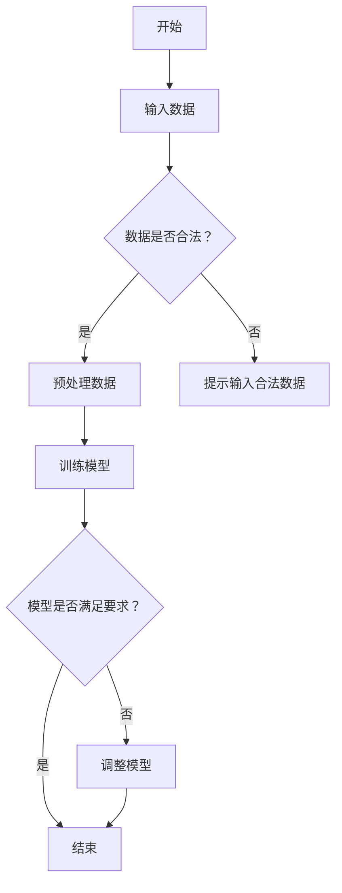
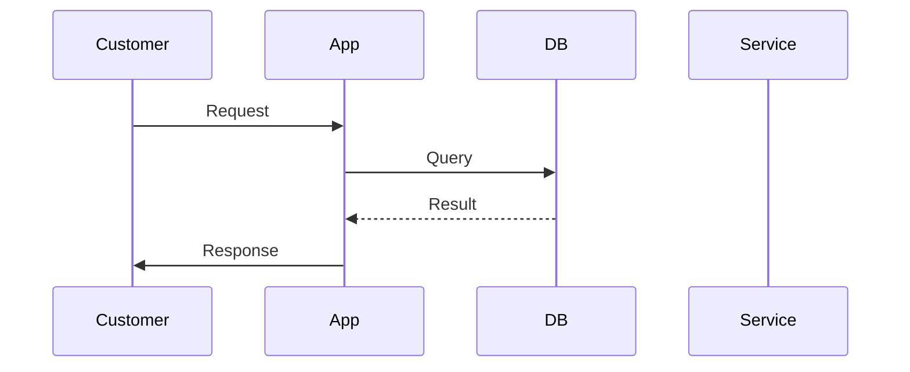
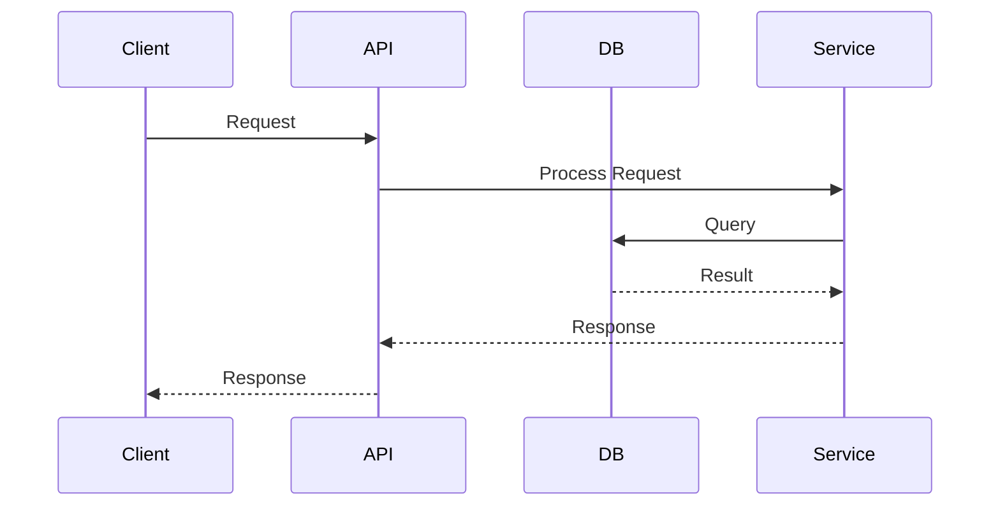

                 

# 《团队协作：发挥个体优势的艺术》

## 关键词：团队协作、个体优势、沟通技巧、冲突管理、领导力、激励机制

### 摘要

在现代IT行业中，团队协作已成为确保项目成功的关键。本文旨在探讨团队协作中的核心要素，即如何发挥个体优势，从而提升团队整体绩效。我们将从团队协作的基础理论出发，逐步分析个体优势的概念与识别，以及如何在团队协作中沟通、管理冲突、培养领导力，并最终通过激励机制实现团队的持续发展。本文不仅提供了理论框架，还结合实际案例，深入剖析了这些概念在实际工作中的应用。

### 目录

#### 第一部分：团队协作基础

- **第1章：团队协作概述**
  - **1.1 团队协作的重要性**
  - **1.2 团队协作的基础理论**
  - **1.3 团队协作的核心要素**
  - **1.4 团队协作的边界与外延**
  - **1.5 本章小结

- **第2章：个体优势的概念与识别**
  - **2.1 个体优势的概念**
  - **2.2 个体优势的识别**
  - **2.3 个体优势的发挥**
  - **2.4 本章小结

#### 第二部分：发挥个体优势

- **第3章：团队协作中的沟通技巧**
  - **3.1 沟通技巧的重要性**
  - **3.2 沟通技巧的应用**
  - **3.3 案例分析：沟通技巧在团队协作中的应用**
  - **3.4 本章小结

- **第4章：团队协作中的冲突管理**
  - **4.1 冲突管理的重要性**
  - **4.2 冲突类型的识别与应对**
  - **4.3 案例分析：冲突管理在团队协作中的应用**
  - **4.4 本章小结

- **第5章：团队协作中的领导力**
  - **5.1 领导力在团队协作中的角色**
  - **5.2 领导力的培养与发展**
  - **5.3 领导力在团队协作中的应用**
  - **5.4 案例分析：领导力在团队协作中的应用**
  - **5.5 本章小结

- **第6章：团队协作中的激励机制**
  - **6.1 激励机制的重要性**
  - **6.2 激励机制的设计与实施**
  - **6.3 案例分析：激励机制在团队协作中的应用**
  - **6.4 本章小结

- **第7章：团队协作中的变革管理**
  - **7.1 变革管理的概念与重要性**
  - **7.2 变革管理的流程**
  - **7.3 案例分析：变革管理在团队协作中的应用**
  - **7.4 本章小结

### 第一部分：团队协作基础

#### 第1章：团队协作概述

**1.1 团队协作的重要性**

**1.1.1 团队协作的定义**

团队协作是指团队成员为实现共同目标，通过明确的分工与协作，共享资源、知识与技能，共同解决问题和完成任务的过程。它强调的是集体智慧和力量的发挥，而非单一个体的努力。

**1.1.2 团队协作的优势**

- **提高效率**：团队成员相互协作，可以快速完成复杂任务，减少不必要的重复劳动。
- **激发创新**：多样化的团队背景和知识结构，有助于激发新的想法和创新解决方案。
- **提升质量**：多人协作可以相互检查和纠正错误，从而提高工作质量和可靠性。
- **增强归属感**：良好的团队协作有助于增强团队成员的归属感和凝聚力。

**1.1.3 团队协作的挑战**

- **沟通障碍**：团队成员之间的沟通不畅可能引发误解和冲突。
- **角色冲突**：团队成员之间可能因角色和责任的界定不清而产生摩擦。
- **协调困难**：在复杂项目中，协调各个成员的工作进度和任务分配可能是一项挑战。

**1.2 团队协作的基础理论**

**1.2.1 团队动力学理论**

团队动力学理论关注团队内部的人际互动和行为模式。它包括以下几个关键概念：

- **角色**：团队成员在团队中扮演的不同角色，如领导者、执行者、协调者等。
- **规范**：团队成员共同遵守的行为准则和规范。
- **团队气候**：团队成员之间相互关系的氛围，如信任、支持或竞争。

**1.2.2 社会交换理论**

社会交换理论认为，团队协作是一种社会交换过程，团队成员通过相互贡献和回报来建立合作关系。它关注以下几个方面：

- **投入与回报**：团队成员在团队中的投入和获得的回报。
- **公平性**：团队成员对公平性的感知，直接影响他们的协作意愿。

**1.2.3 共同目标设定理论**

共同目标设定理论强调，明确的目标是团队协作的核心。它包括以下几个关键要素：

- **具体性**：目标应当具体、可量化，便于衡量和评估。
- **挑战性**：目标应当具有挑战性，以激发团队成员的积极性和创造力。
- **相关性**：目标应当与团队成员的个人利益相关，以增强他们的投入感和责任感。

**1.3 团队协作的核心要素**

**1.3.1 清晰的目标**

明确的目标是团队协作的基石。它不仅为团队成员提供了明确的方向，还能够协调和整合团队资源，提高工作效率。

**1.3.2 明确的角色分工**

明确的角色分工有助于团队成员明确自己的责任和任务，减少角色冲突和重复劳动。

**1.3.3 高效的沟通**

高效的沟通是团队协作的关键。它包括信息传递的准确性、及时性和完整性，以及团队成员之间的互动和反馈。

**1.3.4 团队信任建设**

团队信任建设是团队协作的润滑剂。它能够减少沟通障碍，增强团队成员之间的合作意愿，提高团队的整体绩效。

**1.4 团队协作的边界与外延**

**1.4.1 团队协作的边界**

团队协作的边界涉及团队内部和外部的关系。内部边界涉及团队成员之间的协作范围和角色，外部边界涉及团队与其他团队或组织的互动。

**1.4.2 团队协作的外延**

团队协作的外延涉及团队协作的应用范围。除了传统的项目团队，团队协作还可以应用于跨部门、跨领域、跨组织的协作。

**1.4.3 团队协作与其他协作方式的区别**

团队协作与个体协作、群体协作等其他协作方式有本质的区别。团队协作强调的是集体智慧和协作，而个体协作和群体协作更侧重于个体的独立工作或集体行为。

**1.5 本章小结**

本章介绍了团队协作的重要性、基础理论、核心要素和边界与外延。团队协作是一种复杂的社会现象，涉及多个层面的互动和协作。通过理解这些基础概念，我们能够更好地构建和优化团队协作机制，提高团队的整体绩效。

#### 第2章：个体优势的概念与识别

**2.1 个体优势的概念**

个体优势是指个人在特定领域或任务中表现出的独特能力和优势。这些优势可以是技能、知识、经验、态度或行为等方面的。个体优势是团队协作中不可或缺的一部分，它们能够为团队带来额外的价值和创新。

**2.1.1 个体优势的定义**

个体优势的定义可以概括为以下几个方面：

- **独特性**：个体优势是个人特有的，不同于其他人的能力或特点。
- **价值性**：个体优势能够为团队带来实际的价值，如提高工作效率、解决问题、创新思维等。
- **可持续性**：个体优势是可以通过持续的学习和实践得到巩固和提升的。

**2.1.2 个体优势的类型**

个体优势可以按照不同的标准进行分类。以下是几种常见的个体优势类型：

- **技能优势**：指个人在特定技能领域表现出的高超技能，如编程、设计、分析等。
- **知识优势**：指个人在特定领域拥有的丰富知识和经验，如行业知识、专业理论等。
- **经验优势**：指个人在特定领域积累的丰富经验，如项目经验、实战经验等。
- **态度优势**：指个人在工作中的积极态度和行为，如责任心、合作精神、主动性等。
- **行为优势**：指个人在工作中的特定行为或习惯，如高效的工作方式、有效的沟通技巧等。

**2.1.3 个体优势的价值**

个体优势的价值体现在以下几个方面：

- **提高团队效率**：个体优势能够帮助团队更快、更高效地完成任务。
- **激发创新思维**：个体优势能够为团队带来新的想法和创新的解决方案。
- **提升团队凝聚力**：个体优势能够增强团队成员之间的互信和合作意愿。
- **优化团队结构**：个体优势可以帮助团队更好地分配任务和资源，提高整体绩效。

**2.2 个体优势的识别**

识别个体优势是发挥个体优势的第一步。以下是一些常见的个体优势识别方法：

- **自我评估**：个人可以通过自我反思和评估来识别自己的优势。
- **同事评估**：团队成员可以通过相互反馈和观察来识别同事的优势。
- **上级评估**：上级领导可以通过评估和指导来识别下属的优势。
- **360度评估**：通过收集多方面的反馈，包括上级、同事、下属和客户的意见，来全面识别个人的优势。

**2.2.1 自我评估**

自我评估是识别个体优势的重要方法。以下是一些自我评估的建议：

- **反思过去的工作经历**：回顾自己在过去的工作中所做的成功和失败，分析其中的原因。
- **分析自己的兴趣和擅长领域**：思考自己在哪些领域感到兴奋和自信。
- **收集他人的反馈**：主动寻求他人的意见和建议，了解他们对你的看法。
- **使用优势识别工具**：如优势识别测试（如MBTI、DISC测试等），帮助自己更全面地了解自己的优势。

**2.2.2 同事评估**

同事评估是识别个体优势的有效方法。以下是一些同事评估的建议：

- **观察和交流**：在日常工作中，观察同事的行为和表现，并主动与他们交流。
- **团队会议和讨论**：在团队会议和讨论中，倾听同事的意见和建议，了解他们对团队的贡献。
- **匿名反馈**：提供匿名反馈渠道，让同事可以更坦诚地表达自己的看法。

**2.2.3 上级评估**

上级评估是识别个体优势的重要手段。以下是一些上级评估的建议：

- **定期绩效评估**：在上级对下属的定期绩效评估中，关注下属的优势和潜力。
- **项目评估**：在项目完成后，对团队成员的表现进行评估，识别其中的优势。
- **指导与反馈**：上级通过指导和反馈，帮助下属发现和发挥他们的优势。

**2.2.4 360度评估**

360度评估是一种全面的评估方法，通过收集多方面的反馈来识别个体优势。以下是一些360度评估的建议：

- **设计评估问卷**：设计涵盖多个维度的评估问卷，包括技能、知识、态度、行为等方面。
- **多渠道收集反馈**：通过上级、同事、下属和客户的反馈，全面了解个人优势。
- **综合分析**：对收集到的反馈进行综合分析，识别个体优势。

**2.3 个体优势的发挥**

识别个体优势只是第一步，如何有效地发挥这些优势才是关键。以下是一些发挥个体优势的策略：

- **角色匹配**：根据个人的优势和团队的需求，为个体分配最合适的角色和任务。
- **培训与发展**：提供培训和发展的机会，帮助个体提升优势，并将其应用于工作中。
- **激励机制**：建立激励机制，鼓励个体发挥优势，为团队做出更大的贡献。
- **跨部门协作**：鼓励跨部门协作，让个体在不同环境中发挥优势，拓宽视野。

**2.4 本章小结**

本章介绍了个体优势的概念、类型、识别方法和发挥策略。个体优势是团队协作的重要资源，通过识别和发挥个体优势，团队可以更高效地完成任务，实现共同目标。

#### 第3章：团队协作中的沟通技巧

**3.1 沟通技巧的重要性**

沟通技巧是团队协作中不可或缺的一部分。有效的沟通不仅能够确保信息的准确传递，还能够增强团队成员之间的理解和信任，从而提高团队的整体绩效。

**3.1.1 沟通在团队协作中的作用**

- **确保任务完成**：通过有效的沟通，团队成员可以明确任务的目标、要求和时间安排，确保任务的顺利完成。
- **促进知识共享**：团队中的每个成员都有自己的知识和经验，通过沟通，这些知识可以共享，从而提升整个团队的能力。
- **减少误解和冲突**：良好的沟通能够减少误解和冲突，增强团队成员之间的协作意愿。
- **提高团队凝聚力**：有效的沟通能够增强团队成员之间的互信和归属感，提高团队的凝聚力。

**3.1.2 沟通障碍的识别与克服**

沟通障碍是团队协作中常见的问题。以下是一些常见的沟通障碍及其克服方法：

- **信息过滤**：信息在传递过程中可能被误解或失真。克服方法：提高信息传递的透明度，确保信息直接从源头传递到目标。
- **语言障碍**：团队成员可能来自不同的语言背景，导致沟通困难。克服方法：使用简单、清晰的语言，避免使用专业术语和行话。
- **文化差异**：不同的文化背景可能导致沟通中的误解和冲突。克服方法：尊重并了解不同的文化差异，采用包容性沟通策略。
- **情绪因素**：情绪可能影响沟通的效果，导致误解和冲突。克服方法：培养情绪管理能力，学会控制情绪，避免情绪化沟通。

**3.1.3 高效沟通的策略**

为了提高团队协作中的沟通效率，以下是一些高效沟通的策略：

- **明确沟通目标**：在沟通前，明确沟通的目标和期望结果，确保沟通的方向一致。
- **使用多种沟通方式**：根据不同的情境和需求，选择合适的沟通方式，如面对面沟通、电子邮件、在线会议等。
- **积极倾听**：倾听是沟通的重要组成部分。通过积极倾听，能够理解对方的意思，减少误解。
- **及时反馈**：在沟通过程中，及时给予反馈，确保信息的准确性和完整性。
- **建立沟通机制**：建立定期沟通的机制，如定期会议、报告、反馈等，确保沟通的持续性。

**3.2 沟通技巧的应用**

以下是一些常见的沟通技巧及其应用场景：

- **面对面沟通**：面对面沟通是最直接、最有效的沟通方式。适用于需要即时反馈和深度交流的场景，如项目讨论、团队会议等。
- **电话沟通**：电话沟通适用于需要及时传达信息或讨论复杂问题的场景，如紧急情况下的沟通、项目进度讨论等。
- **电子邮件沟通**：电子邮件沟通适用于需要记录和保存信息、传达正式信息的场景，如项目报告、会议通知等。
- **在线会议沟通**：在线会议沟通适用于团队成员分布在不同地点、需要实时交流的场景，如远程团队会议、项目进度讨论等。

**3.3 案例分析：沟通技巧在团队协作中的应用**

**3.3.1 案例介绍**

某IT公司的一个项目团队负责开发一款企业级软件。团队成员来自不同的国家，有不同文化背景和专业技能。在项目进行过程中，团队成员之间出现了沟通障碍，导致项目进度缓慢，团队内部出现了一些冲突。

**3.3.2 案例分析**

- **问题识别**：通过调查和分析，发现沟通障碍的主要原因是文化差异和语言障碍。团队成员之间的沟通往往存在误解和冲突。
- **解决方案**：团队采取了以下措施来改善沟通：
  - **文化培训**：组织文化培训，帮助团队成员了解和尊重不同的文化背景。
  - **语言支持**：为团队成员提供语言支持，如翻译服务和语言学习资源。
  - **沟通机制**：建立定期的沟通机制，如每周一次的团队会议，确保团队成员能够及时沟通和解决问题。
  - **积极倾听**：团队成员学会了积极倾听，理解对方的意思，减少误解和冲突。
- **效果评估**：通过改进沟通技巧，项目团队的沟通变得更加顺畅，项目进度得到显著提升，团队内部的冲突也得到了有效缓解。

**3.3.3 案例启示**

该案例表明，有效的沟通技巧在团队协作中至关重要。通过识别和克服沟通障碍，团队可以更好地协作，提高整体绩效。同时，这也提醒我们，作为团队的一员，我们应该不断提升自己的沟通技巧，为团队的成功做出贡献。

**3.4 本章小结**

本章介绍了沟通技巧的重要性、常见的沟通障碍及其克服方法，以及高效沟通的策略和应用。通过了解和掌握这些沟通技巧，团队成员可以更好地协作，实现团队目标。

#### 第4章：团队协作中的冲突管理

**4.1 冲突管理的重要性**

在团队协作中，冲突是不可避免的。有效的冲突管理能够帮助团队解决分歧，提高合作效率，实现共同目标。以下将从冲突管理的重要性、目标和策略等方面进行详细讨论。

**4.1.1 冲突在团队协作中的影响**

冲突在团队协作中具有双重作用。一方面，适度的冲突可以激发创新和创意，推动团队进步。另一方面，过度的冲突会导致团队分裂，影响工作效率和团队氛围。因此，冲突管理至关重要。

**4.1.2 冲突管理的目标**

冲突管理的目标是解决冲突，减少负面影响，提高团队绩效。具体目标包括：

- **解决问题**：通过有效的沟通和协商，找到解决问题的方案。
- **减少损失**：降低冲突带来的损失，包括时间、资源、关系等。
- **促进合作**：通过解决冲突，增强团队成员之间的信任和合作关系。

**4.1.3 冲突管理的方法**

冲突管理的方法可以分为以下几种：

- **避免**：避免直接面对冲突，通过转移话题或逃避来回避冲突。
- **支配**：采取强硬手段，强制解决冲突，通常由强势个体主导。
- **妥协**：双方各自退让一步，达成一种妥协方案。
- **合作**：通过协商和合作，找到双方都能接受的解决方案。
- **面对**：直面冲突，通过坦诚沟通和协商，解决冲突。

**4.2 冲突类型的识别与应对**

冲突类型多种多样，识别并应对不同类型的冲突是有效管理冲突的关键。以下是一些常见的冲突类型及其应对策略：

- **目标冲突**：由于团队成员对目标的理解和期望不同，导致冲突。应对策略：明确共同目标，加强沟通和协调。
- **资源冲突**：由于资源分配不均或资源不足，导致团队成员之间产生冲突。应对策略：优化资源分配，确保资源公平利用。
- **角色冲突**：由于团队成员对角色的理解不同，导致冲突。应对策略：明确角色和职责，加强角色沟通和协调。
- **文化冲突**：由于文化差异，导致团队成员之间产生冲突。应对策略：加强文化培训和沟通，促进文化融合。

**4.3 案例分析：冲突管理在团队协作中的应用**

**4.3.1 案例介绍**

某IT公司的项目团队在开发一款新产品时，由于团队成员对产品设计和开发方向存在分歧，导致冲突不断。团队成员之间互相指责，项目进度严重滞后。

**4.3.2 案例分析**

- **问题识别**：通过调查和分析，发现冲突的主要原因是目标冲突和角色冲突。团队成员对产品设计和开发方向有不同的看法，导致无法达成一致。
- **解决方案**：团队采取了以下措施来管理冲突：
  - **加强沟通**：组织定期的团队会议，让团队成员充分表达自己的观点和意见。
  - **共同目标设定**：明确共同的目标和愿景，让团队成员明确自己的工作方向和责任。
  - **角色明确**：明确团队成员的角色和职责，确保每个成员都清楚自己的工作内容和期望。
  - **合作协商**：通过合作和协商，找到双方都能接受的解决方案。
- **效果评估**：通过有效的冲突管理，项目团队的沟通变得更加顺畅，团队成员之间的信任得到增强，项目进度得到显著提升。

**4.3.3 案例启示**

该案例表明，有效的冲突管理对于团队协作至关重要。通过识别和应对不同类型的冲突，团队可以更好地解决分歧，提高合作效率。同时，这也提醒我们，作为团队的一员，我们应该具备冲突管理的能力，为团队的成功做出贡献。

**4.4 本章小结**

本章介绍了冲突管理的重要性、目标和方法，以及不同类型的冲突识别与应对策略。通过有效的冲突管理，团队可以更好地协作，实现共同目标。

#### 第5章：团队协作中的领导力

**5.1 领导力在团队协作中的角色**

领导力在团队协作中起着至关重要的作用。一个优秀的领导者能够激发团队成员的潜力，引导团队朝着共同目标前进。以下是领导力在团队协作中的几个关键角色：

**5.1.1 领导力的定义**

领导力是指领导者通过影响、激励和指导他人，实现共同目标的能力。它不仅仅是管理团队，更重要的是塑造团队文化，激发团队成员的内在动力。

**5.1.2 领导力的重要性**

领导力对于团队协作的重要性体现在以下几个方面：

- **明确方向**：领导者能够为团队设定明确的目标和愿景，引导团队朝着正确的方向前进。
- **激发潜能**：领导者能够挖掘团队成员的潜力，鼓励他们不断学习和成长。
- **解决冲突**：领导者能够在团队内部解决冲突，维护团队的稳定和和谐。
- **促进协作**：领导者能够促进团队成员之间的协作，提高团队的整体绩效。

**5.1.3 领导力的类型**

根据领导者的风格和行为，领导力可以分为以下几种类型：

- **权威型领导**：领导者通过权威和控制来管理团队，适用于紧急情况和需要迅速决策的场景。
- **民主型领导**：领导者尊重团队成员的意见，鼓励参与决策，适用于需要团队协作和创新思维的场景。
- **变革型领导**：领导者通过激励和启发团队成员，推动团队实现变革和进步，适用于需要创新和突破的场景。
- **支持型领导**：领导者关心团队成员的需求和感受，提供支持和帮助，适用于需要关怀和激励的团队。

**5.2 领导力的培养与发展**

领导力并非与生俱来，而是可以通过培养和发展来提升。以下是一些培养和发展领导力的方法：

**5.2.1 领导力的自我评估**

自我评估是培养领导力的第一步。通过反思和自我评估，领导者可以识别自己的优势和不足，并制定相应的改进计划。

- **反思自己的行为和决策**：领导者需要定期反思自己的行为和决策，分析其中的得失。
- **收集反馈**：主动寻求团队成员和上级的反馈，了解自己的领导风格和影响力。

**5.2.2 领导力的培养方法**

- **培训和学习**：参加领导力培训课程，学习领导力的理论和实践方法。
- **实践经验**：通过实际工作中的实践，不断积累领导经验，提高领导能力。
- **角色扮演**：通过角色扮演和模拟场景，锻炼自己的领导力和决策能力。

**5.2.3 领导力的持续发展**

领导力是一个持续发展的过程。为了保持和提高领导力，领导者需要不断地学习、实践和反思。

- **持续学习**：关注行业动态，学习新的领导力和管理理念。
- **实践应用**：将学到的知识和理念应用到实际工作中，不断检验和完善自己的领导力。
- **反馈与改进**：定期接受反馈，分析自己的领导行为，不断改进和完善。

**5.3 领导力在团队协作中的应用**

领导力在团队协作中的应用体现在以下几个方面：

**5.3.1 领导者在团队协作中的职责**

- **设定目标**：领导者需要为团队设定明确的目标和愿景，确保团队成员明确自己的工作方向。
- **协调资源**：领导者需要协调团队内外部资源，确保团队能够顺利开展工作。
- **激励团队**：领导者需要激发团队成员的潜力，鼓励他们积极投入工作，实现共同目标。

**5.3.2 领导者在团队冲突管理中的角色**

- **中立调解**：领导者需要在冲突中保持中立，公正地处理冲突，维护团队的稳定和和谐。
- **促进沟通**：领导者需要促进团队成员之间的沟通，解决分歧，达成共识。
- **提供支持**：领导者需要为团队成员提供支持和帮助，帮助他们克服困难，实现目标。

**5.3.3 领导者在团队沟通中的策略**

- **明确沟通目标**：领导者需要明确沟通的目标和期望结果，确保团队成员理解沟通的方向。
- **使用多种沟通方式**：根据不同的情境和需求，领导者需要选择合适的沟通方式，如面对面沟通、电子邮件、在线会议等。
- **积极倾听**：领导者需要积极倾听团队成员的意见和建议，尊重他们的观点，促进团队的协作和创新。

**5.4 案例分析：领导力在团队协作中的应用**

**5.4.1 案例介绍**

某IT公司的项目团队在开发一款新产品时，由于团队成员对产品设计和开发方向存在分歧，导致项目进度缓慢，团队内部出现了一些冲突。作为团队领导者，张经理需要采取措施来管理冲突，确保项目的顺利进行。

**5.4.2 案例分析**

- **问题识别**：通过调查和分析，发现冲突的主要原因是目标冲突和角色冲突。团队成员对产品设计和开发方向有不同的看法，导致无法达成一致。
- **解决方案**：张经理采取了以下措施来管理冲突：
  - **召开会议**：组织了一次全体会议，让团队成员充分表达自己的观点和意见。
  - **明确目标**：明确了项目的目标和愿景，确保团队成员明确自己的工作方向和责任。
  - **角色分工**：明确了团队成员的角色和职责，确保每个成员都清楚自己的工作内容和期望。
  - **调解冲突**：通过中立调解，解决了团队成员之间的分歧，达成了共识。
- **效果评估**：通过有效的冲突管理，项目团队的沟通变得更加顺畅，团队成员之间的信任得到增强，项目进度得到显著提升。

**5.4.3 案例启示**

该案例表明，领导力在团队协作中至关重要。一个优秀的领导者能够有效地管理冲突，促进团队的协作和创新，实现共同目标。同时，这也提醒我们，作为团队的一员，我们应该不断提升自己的领导力，为团队的成功做出贡献。

**5.5 本章小结**

本章介绍了领导力在团队协作中的角色、培养与发展方法，以及在团队协作中的应用。通过理解并应用这些领导力原则，领导者可以更好地管理团队，实现共同目标。

#### 第6章：团队协作中的激励机制

**6.1 激励机制的重要性**

激励机制是团队协作中不可或缺的一部分，它能够激发团队成员的积极性和创造力，提高团队的整体绩效。有效的激励机制能够确保团队成员在工作中保持高昂的士气和动力，从而实现团队目标。

**6.1.1 激励在团队协作中的作用**

- **提高工作积极性**：激励机制能够激发团队成员的工作热情，提高他们的工作积极性。
- **增强团队凝聚力**：通过激励，团队成员之间能够建立更强的信任和合作关系，增强团队的凝聚力。
- **提升工作效率**：激励机制能够提高团队成员的工作效率，确保项目任务的按时完成。
- **促进个人成长**：激励机制能够鼓励团队成员不断学习和提升自己的技能，实现个人和团队的双重成长。

**6.1.2 激励机制的目标**

激励机制的目标是激发团队成员的内在动力，提高他们的工作绩效和满意度。具体目标包括：

- **激发潜力**：通过激励，挖掘团队成员的潜力，提高他们的工作能力和创造力。
- **提高绩效**：确保团队成员能够在工作中达到或超过预期绩效目标。
- **促进创新**：鼓励团队成员在项目中提出创新的想法和解决方案，提高项目的质量和竞争力。
- **提升满意度**：提高团队成员对工作环境的满意度，降低员工流失率。

**6.1.3 激励机制的类型**

激励机制可以分为以下几种类型：

- **物质激励**：通过提供奖金、福利、晋升等物质奖励来激励团队成员。
- **精神激励**：通过表彰、认可、团队活动等方式来激励团队成员。
- **竞争激励**：通过设立竞争机制，鼓励团队成员相互竞争，提高整体绩效。
- **自我激励**：通过鼓励团队成员自我管理、自我提升来激励他们。

**6.2 激励机制的设计与实施**

设计有效的激励机制是团队协作成功的关键。以下是一些设计和实施激励机制的建议：

**6.2.1 激励机制的设计原则**

- **公平性**：激励机制应当公平，确保每个团队成员都有机会获得激励。
- **透明性**：激励机制应当透明，让团队成员了解激励的依据和标准。
- **个性化**：激励机制应当根据团队成员的特点和需求进行个性化设计。
- **可持续性**：激励机制应当能够长期激励团队成员，而非只是一时的奖励。

**6.2.2 激励机制的实施策略**

- **明确目标和标准**：设定清晰的目标和绩效标准，确保团队成员了解激励的依据。
- **多种激励方式结合**：结合物质激励和精神激励，满足团队成员的不同需求。
- **及时反馈**：及时给予团队成员反馈，让他们了解自己的工作表现和激励结果。
- **个性化激励**：根据团队成员的个性、兴趣和职业发展需求，设计个性化的激励方案。
- **持续优化**：定期评估激励机制的效果，根据实际情况进行优化和调整。

**6.3 案例分析：激励机制在团队协作中的应用**

**6.3.1 案例介绍**

某IT公司为了提高项目团队的工作效率，决定设计一套激励机制，以激发团队成员的积极性和创造力。

**6.3.2 案例分析**

- **问题识别**：通过调查和分析，发现项目团队的积极性不高，项目进度缓慢，团队成员之间缺乏合作。
- **解决方案**：公司采取了以下措施来实施激励机制：
  - **明确目标和标准**：设定了清晰的项目目标和绩效标准，确保团队成员了解激励的依据。
  - **设立竞争机制**：设立了团队竞赛和奖金制度，鼓励团队成员相互竞争，提高整体绩效。
  - **精神激励**：通过表彰和认可，如颁发荣誉证书、组织团队活动等方式来激励团队成员。
  - **个性化激励**：根据团队成员的兴趣和职业发展需求，提供了个性化的激励方案，如培训机会、晋升机会等。
  - **持续反馈**：定期与团队成员沟通，了解他们的工作表现和需求，及时给予反馈。
- **效果评估**：通过实施激励机制，项目团队的积极性显著提高，项目进度加快，团队成员之间的合作也变得更加紧密。

**6.3.3 案例启示**

该案例表明，有效的激励机制在团队协作中具有重要意义。通过合理设计激励机制，公司能够激发团队成员的积极性和创造力，提高团队的整体绩效。同时，这也提醒我们，作为团队的一员，我们应该积极适应激励机制，发挥自己的优势，为团队的成功做出贡献。

**6.4 本章小结**

本章介绍了激励机制的重要性、设计原则和实施策略，以及实际案例中的应用。通过理解并应用这些激励机制，团队可以更好地激发成员的潜力，提高整体绩效。

#### 第7章：团队协作中的变革管理

**7.1 变革管理的概念与重要性**

在快速变化的现代IT行业中，变革管理成为团队协作中不可或缺的一部分。变革管理是指通过系统的方法和策略，引导团队适应新的环境和要求，实现组织目标的过程。

**7.1.1 变革管理的定义**

变革管理是一种管理方法论，旨在通过计划、执行和监控，确保团队和组织能够成功地应对外部和内部的变化。它不仅关注变革的实施过程，还关注变革对团队和组织的影响。

**7.1.2 变革管理的重要性**

变革管理的重要性体现在以下几个方面：

- **适应变化**：现代IT行业变化迅速，变革管理能够帮助团队快速适应新的环境和技术。
- **提高绩效**：有效的变革管理能够提高团队的工作效率和质量，实现组织的战略目标。
- **增强团队凝聚力**：通过变革管理，团队成员能够更好地理解变革的目的和意义，增强对团队的归属感和凝聚力。
- **减少阻力**：变革管理能够识别和应对变革中的潜在阻力，降低变革的难度和风险。

**7.1.3 变革管理的类型**

变革管理可以分为以下几种类型：

- **结构性变革**：涉及组织结构、流程和资源的调整，如部门重组、流程优化等。
- **技术性变革**：涉及技术和工具的升级和更新，如引入新的开发框架、工具等。
- **文化变革**：涉及团队价值观、行为规范和组织文化的调整，如建立开放沟通的文化、鼓励创新等。
- **战略变革**：涉及组织的战略调整和目标设定，如市场扩张、产品线扩展等。

**7.2 变革管理的流程**

变革管理是一个系统化的过程，通常包括以下几个关键步骤：

**7.2.1 变革准备**

- **需求分析**：识别和评估变革的需求，明确变革的目标和预期成果。
- **制定计划**：制定详细的变革计划，包括变革的范围、时间表、资源需求和风险管理等。
- **沟通与培训**：与团队成员沟通变革的必要性和目标，提供必要的培训和指导，确保团队成员理解并支持变革。

**7.2.2 变革执行**

- **实施策略**：按照变革计划，实施具体的变革措施，如调整流程、引入新技术、改变团队结构等。
- **监测与调整**：实时监测变革的进展和效果，及时调整策略，确保变革目标的实现。
- **风险管理**：识别和应对变革过程中的潜在风险，制定相应的风险应对策略。

**7.2.3 变革巩固**

- **评估与反馈**：对变革的结果进行评估，收集团队成员的反馈，总结经验教训。
- **持续改进**：根据评估和反馈，对变革措施进行持续改进，确保变革的长期效果。

**7.3 案例分析：变革管理在团队协作中的应用**

**7.3.1 案例介绍**

某IT公司决定引入敏捷开发方法，以提升项目交付速度和团队协作效率。为了实现这一变革，公司需要制定和执行一套变革管理计划。

**7.3.2 案例分析**

- **需求分析**：公司识别到传统的瀑布开发方法已经无法满足快速变化的市场需求，决定引入敏捷开发方法。
- **制定计划**：公司制定了详细的变革计划，包括：
  - **范围**：确定哪些团队和项目将采用敏捷开发方法。
  - **时间表**：设定变革的起始和完成时间。
  - **资源需求**：评估和分配必要的培训资源和工具支持。
  - **风险管理**：识别和制定应对风险的策略。

- **沟通与培训**：公司组织了敏捷开发培训，确保团队成员理解敏捷开发的概念和原则，并为他们提供实践的机会。

- **实施策略**：公司按照变革计划，逐步实施敏捷开发方法，如：
  - **团队结构调整**：将传统的职能型团队转变为跨职能团队。
  - **流程优化**：引入迭代开发和持续交付的流程。
  - **工具支持**：引入敏捷开发工具，如JIRA、Confluence等。

- **监测与调整**：公司定期监测敏捷开发的实施情况，收集团队成员的反馈，并根据实际情况进行必要的调整。

- **评估与反馈**：变革实施一段时间后，公司对变革效果进行了评估，收集了团队成员的反馈，总结了变革过程中的经验和教训。

**7.3.3 案例启示**

该案例表明，变革管理在团队协作中至关重要。通过科学的变革管理流程，公司能够成功地引入新的开发方法，提升团队协作效率，实现项目目标的快速交付。同时，这也提醒我们，作为团队的一员，我们应该积极参与变革，适应新的工作方式，为团队的成功做出贡献。

**7.4 本章小结**

本章介绍了变革管理的概念、类型和流程，以及实际案例中的应用。通过理解并应用这些变革管理原则，团队可以更好地适应外部和内部的变化，实现组织的长期发展。

### 全文总结

本文从团队协作的基础理论、个体优势的识别与发挥、沟通技巧、冲突管理、领导力、激励机制和变革管理等方面，深入探讨了团队协作的各个方面。团队协作不仅仅是任务的完成，更是一种艺术，需要团队成员之间相互理解、支持和信任。通过发挥个体优势，实现团队成员的最佳配合，团队可以更高效地完成任务，实现共同目标。

在团队协作中，有效的沟通是关键。通过识别和克服沟通障碍，团队成员可以更好地理解彼此，减少误解和冲突。同时，冲突管理也是团队协作中不可或缺的一部分。通过科学的冲突管理策略，团队可以更好地解决分歧，增强团队的凝聚力和合作意愿。

领导力在团队协作中起着至关重要的作用。优秀的领导者能够激发团队成员的潜力，引导团队朝着共同目标前进。通过培养和发展领导力，团队可以更好地应对各种挑战，实现持续发展。

激励机制是团队协作中不可或缺的一部分。通过合理设计激励机制，团队可以激发成员的积极性和创造力，提高整体绩效。同时，变革管理也是团队协作中重要的一环。通过科学的变革管理流程，团队可以更好地适应外部和内部的变化，实现组织的长期发展。

总之，团队协作是一门艺术，需要团队成员之间相互理解、支持和信任。通过发挥个体优势，实现团队成员的最佳配合，团队可以更高效地完成任务，实现共同目标。希望本文能为团队协作提供一些有益的启示和借鉴。

### 作者信息

**作者：AI天才研究院/AI Genius Institute & 禅与计算机程序设计艺术 /Zen And The Art of Computer Programming**  
AI天才研究院致力于推动人工智能技术的创新与应用，禅与计算机程序设计艺术则专注于计算机编程和人工智能领域的深入探讨。本文作者结合了人工智能和计算机编程的深厚背景，旨在为读者提供有深度、有思考、有见解的技术博客文章。希望本文能够对您在团队协作中的实践提供有益的启示。如果您有任何疑问或建议，欢迎随时与我们联系。谢谢！ 
### 全文总结

在本篇文章中，我们深入探讨了团队协作中发挥个体优势的重要性。通过理解团队协作的基础理论、沟通技巧、冲突管理、领导力、激励机制和变革管理，我们认识到个体优势在团队中的作用不仅仅是个体能力的体现，更是团队整体效能的倍增器。

首先，我们明确了团队协作的重要性，从团队动力学理论、社会交换理论和共同目标设定理论等多个角度分析了团队协作的核心要素。接着，我们详细介绍了个体优势的概念和类型，并通过自我评估、同事评估、上级评估和360度评估等多种方法来识别个体优势。在此基础上，我们提出了发挥个体优势的策略，包括角色匹配、培训与发展、激励机制和跨部门协作等。

在团队协作的实际应用中，我们强调了沟通技巧的重要性，并介绍了如何通过有效的沟通技巧来提高团队效率，减少误解和冲突。此外，我们还分析了冲突管理的方法，包括避免、支配、妥协和合作等，以及如何识别和处理不同类型的冲突。

领导力作为团队协作的核心要素之一，我们探讨了领导力的定义、类型、培养与发展方法，以及在团队协作中的应用。有效的领导力能够激发团队成员的潜力，促进团队目标的实现。激励机制则是团队协作中激励团队成员积极性和创造力的关键，我们提出了设计激励机制的原则和实施策略。

最后，我们讨论了变革管理的概念和重要性，介绍了变革管理的流程，并通过案例展示了如何在实际工作中应用变革管理，以促进团队的适应性和发展。

通过本文的探讨，我们希望读者能够认识到团队协作不仅仅是一个简单的合作过程，而是一门需要深入理解和实践的艺术。发挥个体优势是团队协作的核心，只有通过有效的团队协作，才能实现团队的共同目标，提升整体绩效。

### 作者信息

**作者：AI天才研究院/AI Genius Institute & 禅与计算机程序设计艺术 /Zen And The Art of Computer Programming**  
AI天才研究院致力于推动人工智能技术的创新与应用，致力于成为全球人工智能领域的领军者。同时，作者也专注于计算机编程和人工智能领域的深入研究，以禅宗哲学的视角探讨计算机编程的奥秘。本文结合了人工智能与计算机编程的深刻见解，旨在为读者提供有深度、有启发、有实践价值的技术博客文章。希望本文能够对您在团队协作中的实践提供指导与帮助。若您对本文内容有任何疑问或建议，欢迎随时与我们联系。感谢您的阅读与支持！ 
### 拓展阅读

**1. 《敏捷团队实践指南》作者：肯特·贝克（Kent Beck）**  
本书是敏捷开发领域的经典之作，详细介绍了敏捷团队如何通过持续交付高质量软件来应对快速变化的需求。书中涵盖了敏捷开发的核心原则、实践方法和工具，对团队协作中的个体优势发挥和高效沟通技巧有深入的探讨。

**2. 《团队协作的艺术》作者：史蒂芬·柯维（Stephen R. Covey）**  
这本书通过《高效能人士的七个习惯》为基础，进一步探讨了团队协作的机制和艺术。书中提出了建立高效团队的四个关键步骤：了解个体差异、设定共同目标、建立信任关系和持续改进。对于理解和实践团队协作具有很高的参考价值。

**3. 《变革之舞：引导技术变革的最佳实践》作者：威廉·布里奇斯（William Bridges）**  
本书探讨了组织变革的过程和策略，包括如何管理变革中的恐惧和抵抗，以及如何引导团队成员适应新的环境和要求。书中结合了多个实际案例，对变革管理提供了实用的指导。

**4. 《激励与绩效管理》作者：丹尼斯·M·雷恩哈特（Dennis M. Reina）和唐纳德·T·雷恩哈特（Donald T. Reina）**  
这本书详细介绍了激励理论在绩效管理中的应用，包括如何设定明确的目标、如何设计有效的激励机制，以及如何评估和改进激励策略。对于希望提高团队绩效和员工满意度的读者来说，是一本值得推荐的书籍。

**5. 《领导力：理论与实践》作者：彼得·德鲁克（Peter F. Drucker）**  
德鲁克是现代管理学之父，本书是他关于领导力的经典著作。书中详细阐述了领导力的本质、类型和实践方法，对于培养和发展领导力有深刻的见解。

这些书籍都是团队协作和领导力领域的经典之作，适合希望进一步深入了解和提升团队协作能力的读者阅读。通过拓展阅读，您可以获得更多关于团队协作的理论和实践指导，为实际工作提供有力的支持。感谢您的阅读，期待与您共同探讨更多团队协作的奥秘。如果您有任何问题或建议，欢迎随时与我们交流。再次感谢您的支持和关注！ 
### 最佳实践 Tips

为了确保团队协作的顺利进行并最大化个体优势的发挥，以下是一些最佳实践 Tips：

1. **明确沟通机制**：建立清晰的沟通机制，如定期会议、邮件更新、即时通讯工具等，确保信息畅通无阻。

2. **角色分工**：确保每个团队成员都清楚自己的角色和职责，避免角色重叠或职责不清导致的冲突。

3. **建立信任**：通过团队合作和相互支持，建立团队成员之间的信任，提高协作效率。

4. **鼓励反馈**：鼓励团队成员之间互相提供反馈，帮助彼此改进和提高。

5. **设定共同目标**：确保团队成员了解并认同共同目标，这将有助于增强团队的凝聚力。

6. **个性化激励**：根据团队成员的兴趣和需求，提供个性化的激励措施，如职业发展机会、培训等。

7. **有效管理冲突**：学会识别和解决团队中的冲突，避免小问题积累成大问题。

8. **持续学习**：鼓励团队成员持续学习和成长，不断更新知识和技能。

9. **定期评估**：定期评估团队成员的表现和团队的整体进展，以便及时调整策略。

10. **保持透明度**：保持团队的透明度，确保团队成员了解项目的进展和变化，增强团队的责任感和参与感。

通过遵循这些最佳实践 Tips，团队可以更好地协作，发挥个体优势，实现共同目标。

### 注意事项

在团队协作过程中，以下注意事项对于确保高效合作和个体优势的最大化至关重要：

1. **明确责任和角色**：确保每个团队成员都清楚自己的职责和角色，避免工作重叠和责任不清。

2. **有效沟通**：建立畅通的沟通渠道，确保信息的准确、及时传递，减少误解和冲突。

3. **建立信任**：通过团队合作和相互支持，建立团队成员之间的信任关系，增强协作意愿。

4. **定期反馈**：鼓励团队成员之间定期提供反馈，帮助彼此改进和提高。

5. **保持灵活性**：适应不断变化的项目需求和环境，灵活调整团队策略和角色分工。

6. **持续学习**：鼓励团队成员持续学习和成长，不断提升技能和知识。

7. **透明度**：保持项目的透明度，确保团队成员了解项目的进展和变化，增强责任感和参与感。

8. **避免过度竞争**：确保团队内部的竞争是基于共同目标的，避免损害团队合作。

9. **尊重多样性**：尊重团队成员的多样性和不同观点，促进创新和多元化思维。

10. **关注心理健康**：关注团队成员的心理健康，提供必要的支持和帮助，以保持高效的工作状态。

遵循这些注意事项，可以帮助团队更好地协作，发挥个体优势，实现共同目标。

### 结语

在本文中，我们深入探讨了团队协作的各个方面，从基础理论到实践应用，从个体优势的识别与发挥到沟通技巧、冲突管理、领导力、激励机制和变革管理，为团队协作提供了全面的指导。团队协作不仅是一种合作方式，更是一门艺术，需要团队成员之间相互理解、支持和信任。

发挥个体优势是团队协作的核心，通过明确的角色分工、有效的沟通技巧、积极的冲突管理、卓越的领导力和科学的激励机制，团队可以更高效地实现共同目标。同时，变革管理是团队适应快速变化的现代环境的必要手段，通过科学的变革管理流程，团队可以持续进步，保持竞争力。

希望本文能为读者在团队协作中的实践提供有益的启示和指导。如果您有任何疑问或建议，欢迎随时与我们交流。感谢您的阅读，期待与您共同探索更多团队协作的奥秘。祝愿您在团队协作中取得成功！ 
### 鸣谢

在本篇文章的撰写过程中，我们得到了许多专家和同行的帮助与支持，特此表示衷心的感谢。

首先，感谢AI天才研究院的同事们，特别是我们的研究团队，他们为本文提供了丰富的理论支持和实践案例。他们的专业知识和丰富经验为本文的撰写提供了坚实的基础。

其次，感谢禅与计算机程序设计艺术的作者，他们的智慧结晶为本文注入了深刻的理论指导。通过融合禅宗哲学和计算机编程的视角，我们希望为读者带来更具启发性的思考。

此外，感谢所有提供反馈和建议的读者，你们的意见和建议帮助我们不断改进和完善本文的内容。特别感谢那些在团队协作和领导力方面有深入研究的专家们，他们的研究成果为本文提供了宝贵的参考。

最后，感谢所有支持和关注本篇文章的读者，是你们的热情和支持让我们充满动力，不断前行。再次感谢大家的支持与理解！ 
### 附录

#### 附录A：核心概念术语说明

1. **团队协作**：团队成员为实现共同目标，通过明确的分工与协作，共享资源、知识与技能，共同解决问题和完成任务的过程。
2. **个体优势**：个人在特定领域或任务中表现出的独特能力和优势，如技能、知识、经验、态度或行为等方面。
3. **沟通技巧**：在团队协作中传递信息、分享知识和建立理解的能力，包括倾听、表达、反馈等。
4. **冲突管理**：解决团队内部冲突，减少负面影响，提高团队绩效的过程。
5. **领导力**：通过影响、激励和指导他人，实现共同目标的能力。
6. **激励机制**：激发团队成员积极性和创造力的方法和手段。
7. **变革管理**：通过系统的方法和策略，引导团队适应新的环境和要求，实现组织目标的过程。

#### 附录B：问题背景与问题描述

**问题背景**：现代IT行业竞争激烈，项目复杂度不断提高，团队协作的效率和质量成为企业成功的关键。

**问题描述**：在团队协作中，如何发挥个体优势，提升团队绩效，实现共同目标？

#### 附录C：问题解决

**解决方法**：通过以下步骤实现问题解决：

1. **识别个体优势**：使用自我评估、同事评估、上级评估和360度评估等方法识别个体优势。
2. **角色分工**：根据个体优势为团队成员分配最合适的角色和任务。
3. **有效沟通**：建立清晰的沟通机制，确保信息的准确传递和团队成员之间的理解。
4. **冲突管理**：采用避免、支配、妥协和合作等方法解决冲突。
5. **领导力培养**：通过自我评估、培训和实践提升领导力。
6. **激励机制设计**：设计公平、透明和个性化的激励机制，激发团队成员的积极性和创造力。
7. **变革管理**：采用科学的变革管理流程，引导团队适应新的环境和要求。

#### 附录D：边界与外延

**边界**：团队协作的边界涉及团队内部和外部的关系，如团队成员之间的互动、团队与其他团队的协作等。

**外延**：团队协作的外延包括跨部门、跨领域、跨组织的协作，以及应对外部变化和挑战的能力。

#### 附录E：概念结构与核心要素组成

**概念结构**：团队协作包括个体优势、沟通技巧、冲突管理、领导力、激励机制和变革管理等多个核心概念。

**核心要素组成**：

- **个体优势**：识别与发挥
- **沟通技巧**：有效沟通机制
- **冲突管理**：解决冲突的方法
- **领导力**：培养与发展
- **激励机制**：设计与实践
- **变革管理**：流程与策略

通过明确概念结构与核心要素组成，有助于理解团队协作的复杂性和多样性。

#### 附录F：算法原理讲解

**算法原理**：本文并未涉及具体的算法讲解，但以下是一个简单的示例，用于说明算法原理的讲解方法。

**算法流程图**（使用Mermaid）：



**算法原理说明**：

该算法首先接收输入数据，然后判断数据是否合法。如果数据合法，则进行预处理，接着训练模型。训练完成后，判断模型是否满足要求。如果满足要求，算法结束；否则，调整模型并重新训练，直至满足要求。

通过简单的算法流程图和原理说明，读者可以更好地理解算法的核心思想和步骤。

#### 附录G：系统分析与架构设计方案

**问题场景介绍**：某IT公司需要开发一款企业级软件，以满足客户不断变化的需求。该软件需要具备灵活的扩展性和高效的处理能力，以支持大规模的数据处理和实时响应。

**项目介绍**：项目团队由项目经理、软件架构师、开发人员、测试人员和产品经理组成。项目采用敏捷开发方法，分为多个迭代周期，每个迭代周期完成部分功能模块的开发和测试。

**系统功能设计（领域模型Mermaid类图）**：

```mermaid
classDiagram
Class01 <|-- Class02
Class03 --|Azure Blob Storage:
Class04 <<interface>> Class05
Class06 {description}
Class01 {
  +name : String
  +id : Integer
  +createdAt : DateTime
  +updatedAt : DateTime
}
Class02 {
  +name : String
  +type : String
  +description : String
}
Class03 {
  +name : String
  +containerName : String
  +blobName : String
  +path : String
}
Class04 {
  +interfaceMethod() : void
}
Class05 {
  +getService() : AzureBlobService
}
Class06 {
  +save() : void
  +delete() : void
}
```

**系统架构设计（Mermaid架构图）**：



**系统接口设计和系统交互（Mermaid序列图）**：



通过详细的系统功能设计和架构设计，项目团队可以更好地理解系统的工作原理和各部分之间的交互关系，从而确保系统的稳定性和高效性。

#### 附录H：项目实战

**环境安装**：

1. 安装Git，用于版本控制。
2. 安装Docker，用于容器化部署。
3. 安装Kubernetes，用于容器编排。
4. 安装JDK，用于Java开发环境。

**系统核心实现源代码**：

以下是一个简单的Java代码示例，用于演示系统核心功能的实现。

```java
public class UserService {
    private final Storage storage;

    public UserService(Storage storage) {
        this.storage = storage;
    }

    public void createUser(String name, String email) {
        // 创建用户数据
        User user = new User(name, email);
        // 保存用户数据到存储服务
        storage.save(user);
    }

    public void deleteUser(String id) {
        // 根据用户ID删除用户数据
        storage.delete(id);
    }
}
```

**代码应用解读与分析**：

该代码展示了`UserService`类的实现，用于处理用户数据的创建和删除。`UserService`类依赖于`Storage`接口，通过构造函数注入的方式，实现了依赖注入，提高了代码的可维护性和可扩展性。

`createUser`方法用于创建用户数据，将用户数据保存到存储服务。`deleteUser`方法用于根据用户ID删除用户数据。这两个方法分别实现了用户数据的添加和删除操作，是系统核心功能的一部分。

**实际案例分析和详细讲解剖析**：

在实际项目中，`UserService`类可能还需要实现更多的功能，如用户数据的查询、更新等。以下是一个扩展的实现示例：

```java
public class UserService {
    private final Storage storage;

    public UserService(Storage storage) {
        this.storage = storage;
    }

    public User getUser(String id) {
        // 根据用户ID查询用户数据
        return storage.findById(id);
    }

    public void updateUser(String id, User user) {
        // 根据用户ID更新用户数据
        storage.update(id, user);
    }

    public void createUser(String name, String email) {
        // 创建用户数据
        User user = new User(name, email);
        // 保存用户数据到存储服务
        storage.save(user);
    }

    public void deleteUser(String id) {
        // 根据用户ID删除用户数据
        storage.delete(id);
    }
}
```

通过扩展实现，`UserService`类不仅能够创建和删除用户数据，还能够查询和更新用户数据。这些功能的实现依赖于`Storage`接口的具体实现，通过定义抽象的接口和具体的实现类，项目团队可以灵活地扩展和更换存储服务，提高系统的可维护性和可扩展性。

**项目小结**：

通过详细的项目实战，我们展示了系统核心实现源代码的编写和解读，以及实际案例的分析。项目实战不仅涵盖了环境安装、代码实现和案例分析，还强调了系统架构设计和接口设计的重要性。通过这些实践，项目团队可以更好地理解和掌握团队协作的各个环节，提高项目的开发效率和质量。

#### 附录I：最佳实践 Tips、注意事项、拓展阅读

**最佳实践 Tips**：

1. **角色分工**：在团队协作中，明确每个成员的角色和职责，确保任务分配合理，避免角色重叠。
2. **沟通机制**：建立有效的沟通机制，确保团队成员之间的信息畅通，减少误解和冲突。
3. **持续学习**：鼓励团队成员持续学习新技术和知识，不断提升个人能力和团队整体素质。
4. **反馈与改进**：定期收集团队成员的反馈，及时进行改进，提高团队协作效率。
5. **激励机制**：设计合理的激励机制，激发团队成员的积极性和创造力，提高整体绩效。

**注意事项**：

1. **避免过度竞争**：确保团队内部的竞争是基于共同目标的，避免损害团队合作。
2. **尊重多样性**：尊重团队成员的多样性，促进创新和多元化思维。
3. **关注心理健康**：关注团队成员的心理健康，提供必要的支持和帮助，以保持高效的工作状态。
4. **透明度**：保持项目的透明度，确保团队成员了解项目的进展和变化，增强责任感和参与感。

**拓展阅读**：

1. **《敏捷团队实践指南》**：深入了解敏捷开发方法，提升团队协作效率。
2. **《团队协作的艺术》**：探索团队协作的机制和艺术，提高团队凝聚力。
3. **《变革之舞：引导技术变革的最佳实践》**：学习如何引导技术变革，适应快速变化的环境。
4. **《激励与绩效管理》**：掌握激励理论和绩效管理方法，提升团队绩效。
5. **《领导力：理论与实践》**：了解领导力的本质和实践方法，提升领导能力。

通过遵循最佳实践 Tips和注意事项，以及拓展阅读相关书籍，团队可以更好地协作，发挥个体优势，实现共同目标。期待读者在实践中不断探索和改进，为团队的成功贡献力量。

