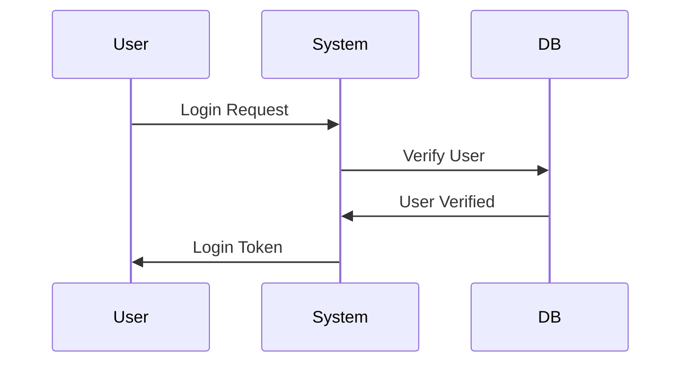

                 

### 第1章: 团队协作的重要性

#### 1.1 问题背景

在当今快速发展的商业环境中，团队协作已经成为企业成功的关键因素之一。随着组织规模的扩大和业务复杂度的增加，单打独斗已经无法满足企业对于创新和效率的要求。有效的团队协作不仅可以提升工作效率，还能促进团队凝聚力，激发员工的创造力和潜能。

##### 1.1.1 企业中的团队协作现状

现实中，许多企业已经认识到团队协作的重要性，并试图通过建立跨部门团队、实施敏捷开发等方式来促进协作。然而，实际操作中仍然面临着诸多挑战。例如，团队成员之间的沟通不畅、角色分工不明确、目标不统一等问题，这些都可能影响团队协作的效果。

##### 1.1.2 团队协作的重要性

团队协作的重要性体现在以下几个方面：

1. **提高工作效率**：通过明确分工和协同工作，团队成员可以更快速地完成任务，提高整体工作效率。
2. **增强团队凝聚力**：良好的团队协作可以加强团队成员之间的信任和合作，提高团队凝聚力。
3. **促进创新思维**：多样化的团队组合可以激发不同背景的员工产生新的想法和解决方案。
4. **提升客户满意度**：有效的团队协作有助于快速响应客户需求，提高客户满意度。

#### 1.2 团队协作的影响因素

团队协作的有效性受到多种因素的影响，包括个人、团队和组织层面的因素。

##### 1.2.1 个人因素

个人因素在团队协作中起着至关重要的作用。个人的沟通技巧、团队意识、责任心和专业知识水平等都会影响团队协作的效果。

1. **沟通技巧**：良好的沟通技巧有助于团队成员之间建立信任和理解，减少误解和冲突。
2. **团队意识**：具有团队意识的个人会主动考虑团队的整体利益，而不仅仅是个人利益。
3. **责任心**：团队成员需要对自己的工作和团队的目标承担责任，确保任务能够按时完成。
4. **专业知识水平**：专业知识的积累和更新能够为团队协作提供有力支持。

##### 1.2.2 团队因素

团队因素包括团队结构、团队文化和团队动力等。

1. **团队结构**：合理的团队结构可以确保团队成员之间的协作更加顺畅。例如，跨职能团队的建立有助于整合不同领域的专业知识。
2. **团队文化**：积极的团队文化能够激励团队成员共同追求卓越，提高团队协作效率。
3. **团队动力**：团队动力来源于团队成员的共同目标和对成功的渴望。一个有动力的团队更容易克服困难和挑战。

##### 1.2.3 组织因素

组织因素包括领导层的管理风格、组织的激励机制和组织的支持等。

1. **领导层的管理风格**：领导层的管理风格直接影响团队协作的效率。一个支持性和开放性的领导层有助于团队成员更轻松地交流和合作。
2. **组织的激励机制**：合理的激励机制可以激发团队成员的工作热情和创造力，促进团队协作。
3. **组织的支持**：组织在物质资源、技术支持、培训等方面提供的支持有助于团队协作的顺利进行。

#### 1.3 团队协作的益处

有效的团队协作可以带来多方面的益处：

##### 1.3.1 提高工作效率

团队协作可以将任务分解为更小的部分，使团队成员可以专注于自己的专长，从而提高工作效率。此外，团队成员可以相互协作，共同解决复杂的问题，加快项目进度。

##### 1.3.2 增强团队凝聚力

通过共同的使命和目标，团队成员可以在工作中建立深厚的联系，增强团队凝聚力。良好的团队合作经验还可以促进团队成员之间的信任和尊重。

##### 1.3.3 促进创新思维

多样化的团队组合可以激发新的想法和解决方案。团队成员可以分享各自的经验和见解，从而产生创新思维，推动团队的发展。

##### 1.3.4 提升客户满意度

团队协作有助于快速响应客户需求，提供高质量的解决方案。通过高效的团队协作，企业可以更好地满足客户的需求，提高客户满意度。

综上所述，团队协作的重要性不容忽视。通过识别团队协作的影响因素和充分利用其益处，企业可以建立高效的团队协作机制，为企业的长期发展打下坚实基础。

### 第2章: 团队沟通的基础

沟通是团队协作的核心环节，有效的沟通可以确保团队成员之间信息传递的准确性和及时性，从而提高团队的工作效率和协作效果。在这一章中，我们将探讨沟通的基本原理、有效沟通的要素以及沟通技巧的提升。

#### 2.1 沟通的基本原理

##### 2.1.1 沟通的定义

沟通是指信息的传递和理解过程，涉及信息的发送者、信息本身、信息的接收者和沟通的渠道。有效的沟通不仅仅是信息的传递，更包括信息的理解、反馈和确认。

##### 2.1.2 沟通的过程

沟通的过程可以分为以下几个步骤：

1. **信息发送**：信息发送者需要明确沟通的目的和内容，并将信息以适当的方式表达出来。
2. **信息传递**：信息通过语言、文字、图片或其他媒介传递给接收者。
3. **信息接收**：接收者接收并理解信息，可能需要通过反馈来确认信息的准确性。
4. **信息反馈**：接收者对信息的理解和反应进行反馈，帮助发送者了解信息是否被正确理解。

##### 2.1.3 沟通障碍

沟通障碍是指信息传递过程中阻碍信息准确理解和传递的因素。常见的沟通障碍包括：

1. **语言障碍**：语言表达不清、使用术语或行话等可能导致接收者理解错误。
2. **文化差异**：文化背景、价值观和语言习惯的差异可能导致误解和沟通不畅。
3. **心理障碍**：情绪、自信心、信任度等因素可能影响沟通的有效性。
4. **技术障碍**：沟通工具的缺陷、网络不稳定等因素可能影响沟通的质量和效率。

#### 2.2 有效沟通的要素

有效沟通需要以下几个关键要素：

##### 2.2.1 沟通的目的

明确沟通的目的是沟通成功的前提。信息发送者需要清楚自己的目标，并确保接收者了解这些目标。

##### 2.2.2 沟通的内容

沟通的内容需要具体、清晰，避免使用模糊和模糊的表述。明确的信息可以减少误解和歧义，提高沟通的效率。

##### 2.2.3 沟通的方式

选择合适的沟通方式可以增强沟通的效果。面对面的沟通、电话沟通、邮件沟通、即时通讯工具等都有其适用的场景。信息发送者需要根据沟通的内容和目标选择最合适的沟通方式。

#### 2.3 沟通技巧的提升

提升沟通技巧可以增强信息的传递和理解，提高沟通的有效性。以下是一些提升沟通技巧的方法：

##### 2.3.1 提高表达能力

提高表达能力是有效沟通的基础。信息发送者可以通过以下方式提升表达能力：

1. **结构化思考**：在表达之前，先整理思路，确保信息的逻辑性和连贯性。
2. **使用具体例子**：使用具体的例子来解释抽象的概念，使信息更加直观易懂。
3. **控制语速和音量**：适当的语速和音量有助于接收者更好地理解和跟随信息的传递。
4. **使用适当的肢体语言**：肢体语言可以增强信息的表达效果，例如，眼神交流、点头、手势等。

##### 2.3.2 增强倾听能力

有效的倾听是沟通的重要组成部分。信息接收者可以通过以下方式增强倾听能力：

1. **全神贯注**：在沟通时，保持注意力集中，避免分心。
2. **积极反馈**：通过重复、总结或提问来确认对方的信息是否被正确理解。
3. **避免打断**：等待对方完成表达，避免在对方说话时打断，这有助于建立信任和尊重。

##### 2.3.3 提高反馈技巧

有效的反馈可以帮助发送者了解信息是否被正确理解，并促进双向沟通。以下是一些提高反馈技巧的方法：

1. **正面反馈**：给予积极的反馈，鼓励和认可对方的表达。
2. **具体反馈**：提供具体的意见和建议，避免模糊和抽象的表述。
3. **建设性反馈**：提出建议时，强调改进的方向，避免批评和指责。

通过理解沟通的基本原理、明确有效沟通的要素以及提升沟通技巧，团队成员可以建立更加高效和和谐的沟通渠道，为团队协作奠定坚实基础。

#### 第3章: 团队协作中的障碍与解决方法

在团队协作过程中，各种障碍可能会影响团队的整体表现和效率。为了确保团队协作的顺畅，识别并解决这些障碍是至关重要的。本章节将讨论团队协作中常见的障碍，并提出相应的解决方法。

##### 3.1 常见的团队协作障碍

##### 3.1.1 沟通障碍

沟通障碍是团队协作中最常见的障碍之一。它可能导致误解、信息传递错误和合作效率低下。以下是一些导致沟通障碍的因素：

1. **语言差异**：团队成员来自不同的背景，可能会使用不同的术语或表达方式，导致沟通不畅。
2. **信息不透明**：团队中某些成员可能无法获取所有相关的信息，导致信息传递的不完整性。
3. **沟通渠道不畅**：沟通渠道的选择和实施可能不合适，导致信息传递延误或失真。
4. **心理障碍**：情绪问题、自信心不足或信任度低等都可能影响沟通的有效性。

##### 3.1.2 权力结构障碍

权力结构障碍是指团队中存在的权力分配和角色分工问题，这些问题可能阻碍团队协作的顺利进行。以下是一些常见的权力结构障碍：

1. **角色混淆**：团队成员对于自己的角色和职责可能存在混淆，导致任务执行不明确。
2. **决策权不统一**：团队中缺乏明确的决策流程，导致决策权分散，决策效率低下。
3. **资源分配不合理**：资源分配不均衡可能导致某些成员工作负荷过重，而另一些成员则任务不足。

##### 3.1.3 利益冲突

利益冲突是指团队成员或团队之间的目标和利益不一致，导致协作受阻。以下是一些常见的利益冲突：

1. **目标不统一**：团队成员可能对项目的目标有不同的理解，导致行动不一致。
2. **资源竞争**：团队中不同部门或成员之间可能因为资源分配而出现竞争，影响协作。
3. **优先级不统一**：团队成员可能对任务的优先级有不同的看法，导致工作重点不明确。

##### 3.2 障碍的解决方法

针对上述团队协作中的障碍，以下是一些解决方法：

##### 3.2.1 提高团队意识

提高团队意识是解决沟通障碍和权力结构障碍的重要步骤。以下是一些具体措施：

1. **培训和教育**：通过培训和教育，增强团队成员的沟通技巧和团队意识。
2. **团队建设活动**：组织团队建设活动，促进团队成员之间的交流和合作。
3. **明确团队目标**：确保所有团队成员都清楚团队的目标和愿景，增强共同的目标感。

##### 3.2.2 建立有效的沟通机制

建立有效的沟通机制可以减少沟通障碍，提高团队协作的效率。以下是一些具体建议：

1. **定期的团队会议**：定期召开团队会议，讨论项目进展、问题解决和决策。
2. **透明的信息共享**：确保团队成员可以及时获取所有相关的信息和资源。
3. **沟通渠道多样化**：使用多种沟通工具，如邮件、即时通讯和视频会议，以满足不同场景的需求。

##### 3.2.3 合理分配资源

合理分配资源可以解决权力结构障碍和利益冲突。以下是一些措施：

1. **资源评估与规划**：在项目启动时，对资源需求进行评估和规划，确保资源分配的合理性。
2. **任务分工明确**：明确团队成员的职责和任务，避免角色混淆和责任不明确。
3. **建立共享机制**：建立资源共享机制，鼓励团队之间互相支持和协作。

##### 3.2.4 增进团队间的信任

信任是团队协作的重要基础。以下是一些增进团队间信任的措施：

1. **透明沟通**：保持沟通的透明度，让团队成员了解团队运作和决策过程。
2. **尊重与支持**：尊重每个团队成员的贡献和意见，提供必要的支持。
3. **共同解决问题**：鼓励团队成员共同面对问题，共同寻找解决方案。

通过上述措施，团队可以克服协作中的障碍，建立更加高效和和谐的团队协作机制，从而实现团队的目标和愿景。

#### 第4章: 清晰表达的技巧

清晰表达是团队协作中至关重要的一环，它不仅能够帮助团队成员更好地理解任务和目标，还能减少误解和冲突，提高工作效率。在这一章中，我们将探讨清晰表达的重要性、不清晰表达的影响以及提高清晰表达的具体方法。

##### 4.1 表达的重要性

有效的表达不仅能够传递信息，还能建立信任和共识。以下是清晰表达的重要性：

1. **确保任务理解的准确性**：清晰的表达可以确保团队成员正确理解任务要求，避免因为误解导致的错误和重复工作。
2. **减少沟通成本**：清晰的表达可以减少沟通中的来回询问和修正，节省时间和精力。
3. **增强团队凝聚力**：良好的表达技巧可以增强团队成员之间的信任和合作，提高团队的凝聚力。
4. **提高决策效率**：清晰的表达可以帮助团队成员更好地分析问题，快速做出决策。

##### 4.2 不清晰表达的影响

不清晰表达会对团队协作产生诸多负面影响，包括：

1. **误解和冲突**：不清晰的表达可能导致团队成员对任务、目标和责任的理解不一致，引发误解和冲突。
2. **工作低效**：团队成员因为理解不一致而重复工作或进行错误操作，降低工作效率。
3. **资源浪费**：为了澄清表达内容，团队可能需要额外的沟通时间和资源，导致资源浪费。
4. **决策延误**：不清晰的表达可能导致团队成员无法及时理解决策内容，从而延误决策过程。

##### 4.3 清晰表达的方法

为了提高清晰表达的技巧，可以采取以下几种方法：

##### 4.3.1 结构化思考

结构化思考是提高表达清晰性的第一步。以下是一些结构化思考的技巧：

1. **明确目标**：在表达前，明确表达的目标和目的，确保信息传递的针对性。
2. **分步骤阐述**：将复杂的信息分解为简单的步骤，逐一阐述，使信息更加易懂。
3. **逻辑性**：确保表达的信息具有逻辑性，使接收者能够顺畅地跟随思路。

##### 4.3.2 使用具体例子

使用具体例子可以使抽象的概念变得更加具体和直观。以下是一些使用例子的技巧：

1. **形象化描述**：通过比喻、类比或具体场景描述，使信息更加生动形象。
2. **数据支持**：使用具体的数据或案例来支持观点，增强说服力。
3. **实际操作**：通过演示或模拟实际操作，帮助团队成员更好地理解。

##### 4.3.3 控制语速和音量

控制语速和音量可以帮助接收者更好地理解和跟随表达的内容。以下是一些控制语速和音量的技巧：

1. **适中的语速**：语速不宜过快，以免接收者跟不上信息。
2. **稳定的音量**：音量保持适中，避免因为情绪波动导致的信息失真。
3. **清晰发音**：确保每个字词发音清晰，避免使用含糊不清的表达。

##### 4.3.4 使用适当的肢体语言

适当的肢体语言可以增强表达的效果，使信息更加生动和有力。以下是一些使用肢体语言的技巧：

1. **眼神交流**：与接收者保持眼神交流，表达出真诚和尊重。
2. **肢体动作**：适当地使用肢体动作，如点头、手势和身体倾向，帮助强调重要信息。
3. **表情管理**：保持积极的表情，避免负面情绪影响表达效果。

##### 4.3.5 反馈与确认

在表达后，及时获取接收者的反馈并进行确认，可以确保信息被正确理解。以下是一些反馈与确认的技巧：

1. **提问和确认**：通过提问或重复关键信息，确认接收者是否理解。
2. **倾听反馈**：倾听接收者的反馈，了解他们的观点和理解。
3. **调整表达**：根据反馈调整表达方式，确保信息传递的准确性。

通过上述方法，团队成员可以显著提高清晰表达的技巧，从而在团队协作中取得更好的效果。

#### 第5章: 倾听与反馈

倾听和反馈是有效沟通的重要组成部分，它们不仅能够确保信息的准确传递和理解，还能建立信任和共识。在这一章中，我们将探讨倾听和反馈的重要性、提升倾听技巧的方法以及提供有效反馈的技巧。

##### 5.1 倾听的重要性

倾听是沟通的双向过程，它不仅仅是被动地接收信息，更是一种积极参与和理解对方观点的过程。以下是倾听的重要性和作用：

1. **理解对方**：倾听可以帮助我们更深入地理解对方的观点和需求，从而建立共同的理解基础。
2. **建立信任**：通过倾听，我们展示了对对方的尊重和关注，有助于建立信任关系。
3. **发现问题和需求**：倾听过程中，我们可以捕捉到对方表达中的隐含信息和潜在问题，从而更早地发现并解决。
4. **提高沟通效率**：有效的倾听可以减少误解和重复沟通，提高沟通的整体效率。

##### 5.2 提升倾听技巧的方法

为了提升倾听技巧，我们可以采取以下几种方法：

##### 5.2.1 全神贯注

全神贯注是有效倾听的基础。以下是一些提升全神贯注的技巧：

1. **避免分心**：在倾听过程中，避免使用手机、查看邮件等分心行为，确保注意力集中在对方身上。
2. **保持眼神接触**：与对方保持适当的眼神接触，展示出我们对其话语的专注和尊重。
3. **身体姿势**：保持开放的身体姿势，如微微前倾，表明我们愿意倾听。

##### 5.2.2 积极反馈

积极反馈是倾听过程中的重要环节，它可以帮助我们确认对方的信息是否被正确理解。以下是一些积极反馈的技巧：

1. **重复关键点**：在对方说话结束时，重复或总结对方的关键点，以确保理解准确。
2. **提出问题**：通过提问，我们可以展示对对方话语的深入理解和关注，同时也可以获取更多信息。
3. **点头和肢体动作**：适当的点头和肢体动作可以表明我们对其话语的理解和认同。

##### 5.2.3 摆正心态

心态是倾听过程中至关重要的一部分。以下是一些摆正心态的技巧：

1. **开放心态**：保持开放的心态，愿意接受不同的观点和信息，避免先入为主的偏见。
2. **耐心倾听**：有些信息可能需要时间才能完全理解，耐心倾听可以帮助我们更好地消化信息。
3. **自我反思**：在倾听过程中，反思自己的态度和行为，确保我们真正关注对方而非仅仅在等待自己的机会发言。

##### 5.3 提供有效反馈

有效的反馈不仅可以帮助对方改进，还能加强沟通的双向性。以下是一些提供有效反馈的技巧：

1. **正面反馈**：尽量提供正面的反馈，强调对方的优点和成功的部分，这可以增强对方的信心和积极性。
2. **具体和具体**：反馈时，尽量具体和具体，避免使用模糊和抽象的表述。具体反馈可以帮助对方更好地理解如何改进。
3. **建设性反馈**：提供建设性反馈，不仅要指出问题，还要提出具体的改进建议和解决方案。
4. **及时反馈**：及时提供反馈，避免信息过时或被遗忘，这有助于对方更快地改进。

通过倾听和反馈的技巧，团队成员可以更好地理解彼此，建立信任，提高沟通的效率，从而在团队协作中取得更好的成果。

#### 第6章: 非言语沟通

非言语沟通是人际交流中不可或缺的一部分，它通过眼神、肢体语言、面部表情和姿态等非言语方式传递信息。有效的非言语沟通能够增强信息的表达效果，弥补言语沟通的不足。在这一章中，我们将探讨非言语沟通的重要性、常见的非言语沟通方式以及如何正确使用这些方式来提升沟通效果。

##### 6.1 非言语沟通的重要性

非言语沟通在人际交流中起着至关重要的作用，它可以帮助我们更全面地理解对方的意图和情感。以下是非言语沟通的重要性：

1. **增强信息的真实性**：非言语沟通可以揭示言语背后的真实意图，帮助我们更准确地理解对方。
2. **改善沟通效果**：通过非言语手段，如眼神交流和肢体动作，可以增强信息的表达效果，使沟通更加生动和有说服力。
3. **促进信任和理解**：非言语沟通可以展示出我们对对方的尊重和关注，有助于建立信任和加深理解。
4. **补充言语沟通的不足**：言语沟通有时可能存在模糊和歧义，非言语沟通可以提供额外的信息，帮助澄清误解。

##### 6.2 常见的非言语沟通方式

非言语沟通包括多种方式，以下是其中一些常见的非言语沟通方式：

1. **眼神交流**：眼神交流是非言语沟通中最直接和有力的一种方式。它可以帮助我们了解对方的兴趣、态度和情感。
2. **肢体语言**：肢体语言包括手势、姿态、身体动作等，可以传达出我们内心的想法和感受。例如，点头表示同意，手势可以用来强调或解释。
3. **面部表情**：面部表情可以表达出我们内心的情感和态度。微笑表示友好和满意，皱眉表示不满或不快。
4. **姿态和姿势**：姿态和姿势可以传递出我们对对话的重视程度和自信程度。例如，直立的姿态可以显示自信，而放松的姿势可能表示轻松和舒适。
5. **空间距离**：空间距离是指人与人之间的距离，不同的空间距离可以表达出不同的社交关系和亲密程度。例如，亲密的朋友之间可能保持较近的距离，而陌生人间则保持较远的距离。

##### 6.3 正确使用非言语沟通的技巧

为了提升非言语沟通的效果，我们需要注意以下几点：

1. **一致性**：非言语信号应该与言语信息一致，以避免产生误解和混淆。例如，如果我们在言语上表示同意，但在肢体语言上却表现出怀疑，这会导致对方困惑。
2. **自然性**：非言语沟通应该是自然的，不应该刻意做作或夸张。自然的表达方式可以更真实地反映我们的情感和态度。
3. **适应文化差异**：不同的文化对非言语沟通有不同的解读。在国际交流中，了解和适应不同文化的非言语习惯是非常重要的。
4. **情境适应性**：非言语沟通应根据不同的情境进行调整。在正式的商务场合，我们需要保持专业的姿态和表情；而在休闲场合，可以更加放松和自然。

通过有效利用非言语沟通，我们可以增强信息的表达效果，提高沟通的准确性，从而在团队协作中取得更好的成果。

#### 第7章: 高效会议的技巧

高效会议是团队协作中不可或缺的一部分，它能够帮助团队讨论问题、制定决策、分配任务和监控项目进展。然而，许多会议往往效率低下，浪费时间。在这一章中，我们将探讨高效会议的技巧，包括会议前的准备、会议中的执行和会议后的跟进。

##### 7.1 会议前的准备

会议前的准备是确保会议高效的关键。以下是一些会议前需要做的准备工作：

1. **明确会议目标**：在会议前，明确会议的目标和议程，确保所有参与者都清楚会议的目的和内容。
2. **准备会议材料**：准备相关的报告、文件和演示材料，确保会议过程中所需的信息和资源齐全。
3. **通知与会人员**：提前通知与会人员会议的时间、地点和议程，并提供会议所需的背景信息和阅读材料。
4. **分配角色和责任**：明确会议中的角色和责任，确保每个参与者都了解自己的职责和期望。
5. **设置会议议程**：根据会议目标，制定详细的会议议程，包括讨论主题、时间分配和决策流程。

##### 7.2 会议中的执行

会议中的执行是确保会议高效进行的关键。以下是一些会议中需要做的执行工作：

1. **准时开始**：确保会议准时开始，避免因迟到而影响会议进度。
2. **专注讨论**：在会议过程中，保持专注，避免分心和无关的讨论，确保讨论内容与会议目标相关。
3. **积极发言**：鼓励与会人员积极发言，分享观点和意见，确保所有参与者的声音都能被听到。
4. **控制时间**：根据会议议程，控制每个讨论主题的时间，确保会议在预定时间内完成。
5. **记录会议内容**：详细记录会议讨论的内容、决策和行动项，确保会议结果得到准确记录和跟进。

##### 7.3 会议后的跟进

会议后的跟进是确保会议成果落实的关键。以下是一些会议后需要做的跟进工作：

1. **分发会议纪要**：在会议结束后，及时分发会议纪要，包括会议讨论的内容、决策和行动项，确保所有参与者都能了解会议结果。
2. **跟踪行动项**：对会议中的行动项进行跟踪，确保责任人和截止日期明确，并定期检查进度。
3. **反馈和总结**：在会议后的适当时间，进行反馈和总结，评估会议的成效和改进空间，为下一次会议提供参考。
4. **持续改进**：根据反馈和总结，持续改进会议流程和管理方法，提高会议的效率和效果。

通过遵循以上高效会议的技巧，团队可以大幅提高会议的效率，确保会议目标的实现，从而在团队协作中取得更好的成果。

### 第8章: 团队协作工具的选择与应用

在现代企业中，团队协作工具的选择与应用对于提高工作效率和协作效果至关重要。合适的协作工具可以帮助团队更好地管理任务、共享资源和同步工作进度。本章节将探讨团队协作工具的类型、选择标准以及具体应用场景。

#### 8.1 团队协作工具的类型

团队协作工具种类繁多，根据功能和应用场景可以分为以下几类：

1. **项目管理工具**：如Trello、Asana和JIRA，用于任务分配、进度跟踪和项目监控。
2. **文档协作工具**：如Google Docs、Microsoft Teams和Slack，用于实时编辑和共享文档。
3. **视频会议和沟通工具**：如Zoom、Microsoft Teams和Google Meet，用于远程会议和即时沟通。
4. **云存储工具**：如Google Drive、Dropbox和OneDrive，用于存储和共享文件。
5. **日程管理工具**：如Google Calendar和Microsoft Outlook，用于安排会议和任务。
6. **协作软件平台**：如Confluence和Notion，用于知识管理和团队协作。

#### 8.2 选择团队协作工具的标准

在选择团队协作工具时，应考虑以下标准：

1. **功能匹配度**：工具的功能应满足团队的具体需求，例如任务管理、文档共享、沟通协作等。
2. **用户友好性**：工具应具备简单易用的界面，降低学习成本，提高用户接受度。
3. **兼容性和扩展性**：工具应具备良好的兼容性，能够与其他系统和工具集成，同时具有扩展性，支持未来功能的需求。
4. **稳定性和安全性**：工具应具备稳定的服务和强大的安全防护，确保数据的安全和隐私。
5. **成本效益**：工具的价格应在团队预算范围内，同时提供合理的投资回报。

#### 8.3 团队协作工具的具体应用场景

以下是一些常见团队协作工具的具体应用场景：

1. **项目管理工具**：

   - **Trello**：适用于小型团队的简单任务管理和进度跟踪。
   - **Asana**：适用于中等规模团队的任务分配和项目协调。
   - **JIRA**：适用于大型团队的敏捷开发项目管理。

2. **文档协作工具**：

   - **Google Docs**：适用于实时编辑和共享文档，特别适合远程协作。
   - **Microsoft Teams**：集成了文档编辑、视频会议和聊天功能，便于团队协作。
   - **Slack**：提供即时消息传递和文档共享功能，适合日常沟通。

3. **视频会议和沟通工具**：

   - **Zoom**：提供高质量的视频会议和屏幕共享功能，适用于远程会议和培训。
   - **Microsoft Teams**：集成视频会议、聊天和文档协作功能，适用于多场景沟通。
   - **Google Meet**：适用于小型会议和远程协作，与Google Workspace集成良好。

4. **云存储工具**：

   - **Google Drive**：提供大容量存储和共享功能，适用于文档管理和协作。
   - **Dropbox**：提供灵活的文件同步和共享功能，适用于个人和企业。
   - **OneDrive**：适用于Microsoft 365用户，提供便捷的文件存储和共享。

5. **日程管理工具**：

   - **Google Calendar**：提供便捷的日程安排和提醒功能，适用于个人和团队。
   - **Microsoft Outlook**：集成邮件、日历和任务管理功能，适用于办公环境。

6. **协作软件平台**：

   - **Confluence**：提供知识管理和协作功能，适用于团队文档和项目协作。
   - **Notion**：适用于笔记、任务管理和团队协作，功能灵活且自定义度高。

通过选择和合理应用合适的团队协作工具，团队可以更高效地管理任务、共享资源和同步工作进度，从而提高整体协作效果。

### 第9章: 线上协作技巧

随着远程工作和远程团队的日益普及，线上协作技巧变得尤为重要。有效的线上协作不仅能够提高工作效率，还能增强团队成员之间的沟通和合作。在本章节中，我们将探讨线上协作的关键技巧，包括如何克服线上协作的挑战、提升线上沟通效率和如何确保线上协作的有效性。

#### 9.1 克服线上协作的挑战

线上协作虽然提供了灵活性和便利性，但也存在一些挑战。以下是一些常见的挑战以及应对策略：

1. **沟通障碍**：线上沟通缺乏面对面的互动，可能导致信息传递的不准确和沟通的误解。

   - **解决方案**：采用多种沟通工具，如视频会议、即时消息和电子邮件，以适应不同的沟通需求。同时，确保沟通内容明确、具体，减少歧义。

2. **时间管理**：远程工作可能导致团队成员的时间管理混乱，影响工作效率。

   - **解决方案**：使用日程管理工具，如Google Calendar或Microsoft Outlook，来规划和跟踪任务和会议。设定明确的工作时间表，避免时间冲突。

3. **团队凝聚力**：线上协作缺乏面对面的互动，可能导致团队成员之间的联系和凝聚力减弱。

   - **解决方案**：定期组织线上团队建设活动，如虚拟团队会议或在线游戏，以增强团队成员之间的联系和团队凝聚力。

4. **技术问题**：线上协作可能面临技术故障和网络问题，影响工作进度。

   - **解决方案**：选择稳定和可靠的协作工具，并备份重要数据。确保团队成员具备基本的技术支持和故障排除能力。

#### 9.2 提升线上沟通效率

线上沟通效率是线上协作成功的关键。以下是一些提升线上沟通效率的技巧：

1. **明确沟通目标**：在每次沟通前，明确沟通的目标和期望结果，确保沟通的针对性。

2. **使用合适的沟通工具**：根据沟通的内容和目标，选择最合适的沟通工具。例如，对于紧急或需要即时反馈的沟通，使用即时消息工具；对于需要详细记录的沟通，使用电子邮件或文档协作工具。

3. **简洁明了的表达**：在线上沟通中，尽量使用简洁明了的语言，避免冗长和复杂的表述，以减少误解。

4. **及时反馈**：在线上沟通中，及时给予反馈和确认，确保信息的准确理解和传递。

5. **避免会议疲劳**：避免频繁和不必要的线上会议，确保每次会议都有明确的议程和目标。在会议结束后，及时分发会议纪要，确保关键决策和行动项得到落实。

#### 9.3 确保线上协作的有效性

为确保线上协作的有效性，需要采取一系列措施：

1. **明确角色和职责**：在线上团队中，明确每个成员的角色和职责，确保任务分工清晰。

2. **制定明确的计划和目标**：制定明确的计划和目标，确保团队成员对任务和目标有共同的理解和期望。

3. **定期检查进度**：定期检查任务和项目的进度，及时解决出现的问题，确保项目按计划进行。

4. **保持沟通畅通**：确保团队成员之间的沟通渠道畅通，避免信息传递的延误和误解。

5. **提供技术支持**：确保团队成员具备必要的技术支持和故障排除能力，以应对线上协作中可能遇到的技术问题。

通过克服线上协作的挑战、提升线上沟通效率和确保线上协作的有效性，团队可以更好地利用线上协作的优势，提高工作效率和协作效果。

### 第10章: 项目管理工具与技巧

在团队协作中，项目管理工具和技巧是确保项目按时完成、资源合理分配和团队高效协作的关键。本章节将详细介绍项目管理工具的选择与应用，以及如何利用项目管理技巧来提高项目的执行力和效率。

#### 10.1 项目管理工具的选择

选择适合的项目管理工具对于项目的成功至关重要。以下是一些常用的项目管理工具及其特点：

1. **Trello**：Trello是一个可视化的项目管理工具，通过看板和卡片来管理任务和项目进度。它简单易用，适合小型项目和敏捷团队。

2. **Asana**：Asana是一个全面的项目管理工具，提供任务分配、进度跟踪、时间表和报告功能。它适用于各种规模的项目，特别适合跨职能团队。

3. **JIRA**：JIRA是一个强大的项目管理工具，主要用于软件开发项目。它提供缺陷跟踪、需求管理和敏捷开发工具，适用于大型项目和复杂的软件团队。

4. **Microsoft Project**：Microsoft Project是一个功能强大的项目管理工具，提供详细的项目规划、资源管理和进度跟踪功能。它适用于需要精细控制的项目和大型企业。

5. **Smartsheet**：Smartsheet是一个灵活的在线项目管理工具，提供可视化表单、自动化工作流和高级分析功能。它适合各种规模的项目和团队。

#### 10.2 项目管理工具的应用

在选择了合适的项目管理工具后，如何有效地应用这些工具来管理项目是关键。以下是一些应用技巧：

1. **任务分配**：使用项目管理工具将任务分配给团队成员，确保每个人都知道自己的职责和任务。

2. **进度跟踪**：通过项目管理工具跟踪任务进度，及时更新项目状态，确保项目按计划进行。

3. **资源管理**：利用项目管理工具分配和优化资源，确保项目在预算和时间范围内完成。

4. **风险控制**：通过项目管理工具识别和管理项目风险，制定应对策略，减少潜在风险对项目的影响。

5. **报告和分析**：定期生成项目报告和分析，评估项目进展和资源利用率，为项目决策提供数据支持。

#### 10.3 项目管理技巧

除了使用项目管理工具，掌握一些项目管理技巧同样重要。以下是一些常用的项目管理技巧：

1. **制定详细的计划**：在项目开始前，制定详细的计划和项目范围文档，明确项目的目标、任务和时间表。

2. **定期团队会议**：定期召开团队会议，讨论项目进展、问题和决策，确保团队成员之间的沟通和信息共享。

3. **风险管理**：识别和管理项目风险，制定应对策略，减少风险对项目的影响。

4. **沟通管理**：建立有效的沟通渠道，确保团队成员之间信息传递的准确性和及时性。

5. **时间管理**：合理安排项目时间表，确保任务按时完成，避免项目延误。

6. **质量保证**：确保项目交付物符合质量标准，通过质量检查和评审来提高项目交付的质量。

7. **持续改进**：通过项目回顾和反馈，不断改进项目管理流程和方法，提高项目执行力和效率。

通过合理选择和应用项目管理工具，以及掌握有效的项目管理技巧，团队可以更好地管理项目，确保项目按时、按质量完成，从而提高整体协作效率和团队生产力。

### 第11章: 成功团队协作案例分析

成功团队协作的案例为我们提供了宝贵的经验教训，通过分析这些案例，我们可以了解在现实环境中如何有效地实施团队协作。本章节将详细介绍几个成功的团队协作案例，并探讨其成功的关键因素。

#### 11.1 案例一：谷歌（Google）的敏捷开发团队

**背景**：谷歌的敏捷开发团队通过实施敏捷开发方法，成功推出了一系列创新产品，如Gmail、Google Maps和Google Drive等。

**成功因素**：

1. **明确的团队目标**：每个敏捷团队都明确自己的目标，并通过每日站会、迭代评审和回顾会议确保目标的实现。

2. **灵活的工作方式**：敏捷开发团队采用灵活的工作方式，如站立会议、迭代计划和用户故事地图，以快速响应需求变化。

3. **跨职能团队**：谷歌的敏捷团队由多个职能领域的专家组成，包括开发人员、设计师和产品经理，确保任务可以快速完成和高质量交付。

4. **透明沟通**：谷歌的团队通过实时沟通工具和透明的工作流程，确保团队成员之间信息畅通，减少误解和错误。

**启示**：成功的关键在于明确的目标、灵活的工作方式、跨职能团队的建立和透明的沟通。

#### 11.2 案例二：宜家（IKEA）的全球化团队协作

**背景**：宜家是一家全球化的家居品牌，其团队分布在多个国家和地区，通过高效的团队协作，实现了全球范围内的一致品牌体验。

**成功因素**：

1. **标准化流程**：宜家建立了标准化的设计、生产和物流流程，确保不同地区的团队遵循相同的操作规范。

2. **虚拟团队管理**：宜家采用虚拟团队管理方法，利用在线协作工具和定期视频会议，确保团队成员之间的沟通和信息共享。

3. **文化融合**：宜家注重跨文化沟通，通过培训和文化交流活动，促进不同文化背景的团队成员之间的理解与合作。

4. **本地化策略**：宜家根据不同地区的市场特点，制定本地化策略，确保产品和服务的适应性。

**启示**：成功的关键在于标准化流程、虚拟团队管理、文化融合和本地化策略。

#### 11.3 案例三：微软（Microsoft）的混合团队协作

**背景**：微软的许多团队采用了混合工作模式，包括远程工作者和现场工作者的协作，通过高效的管理方法，成功推出了多个大型项目。

**成功因素**：

1. **灵活的工作安排**：微软为团队成员提供灵活的工作安排，包括远程办公和现场办公，确保工作生活平衡。

2. **技术支持**：微软提供了先进的技术支持，包括视频会议系统、即时通讯工具和协作平台，确保团队成员之间的沟通无障碍。

3. **团队文化**：微软重视团队文化，通过团队建设活动和员工支持计划，增强团队成员之间的信任和凝聚力。

4. **明确的目标和角色**：每个团队成员都清楚自己的角色和目标，确保任务分配合理，提高工作效率。

**启示**：成功的关键在于灵活的工作安排、技术支持、团队文化和明确的目标和角色。

#### 11.4 案例四：特斯拉（Tesla）的创新团队协作

**背景**：特斯拉的创新团队通过高效的协作，成功推出了多个革命性产品，如电动汽车和太阳能电池板。

**成功因素**：

1. **跨界协作**：特斯拉的团队由来自不同领域的人才组成，包括机械工程师、电子工程师和市场营销专家，确保创新的多样性和全面性。

2. **快速迭代**：特斯拉采用快速迭代的方法，通过持续改进和反馈，快速推出产品原型并进行优化。

3. **开放的文化**：特斯拉鼓励员工提出创新想法，并通过开放的文化环境，确保这些想法能够得到关注和实施。

4. **明确的目标**：特斯拉的团队始终围绕公司的愿景和目标进行工作，确保所有努力都朝着共同的目标前进。

**启示**：成功的关键在于跨界协作、快速迭代、开放的文化和明确的目标。

通过以上案例的分析，我们可以看到成功团队协作的关键因素包括明确的团队目标、灵活的工作方式、跨职能团队的建立、透明沟通、标准化流程、文化融合、本地化策略、灵活的工作安排、技术支持、团队文化、明确的目标和角色、跨界协作、快速迭代和开放的文化。这些成功经验对于其他团队在实现高效协作时具有很高的参考价值。

### 第12章: 团队协作失败案例分析

尽管团队协作在很多情况下能够带来显著的成功，但失败案例同样为我们提供了宝贵的教训。通过分析团队协作失败的案例，我们可以了解在团队协作过程中可能遇到的问题以及如何避免这些问题的发生。以下是一些团队协作失败的案例及其教训：

#### 12.1 案例一：缺乏明确目标和计划

**背景**：某公司的一个项目团队由于缺乏明确的计划和目标，导致项目进展缓慢，最终未能按时完成。

**失败原因**：

1. **目标不明确**：团队成员对项目的目标没有共同的理解，导致工作方向不一致。
2. **计划不周详**：项目计划不够详细，缺乏明确的任务分配和时间表，导致任务推进困难。
3. **沟通不畅**：团队成员之间缺乏有效的沟通，信息传递不畅通，增加了协作的难度。

**教训**：

- 明确目标和计划：在项目开始前，确保所有团队成员对项目的目标有共同的理解，并制定详细的计划。
- 加强沟通：建立有效的沟通机制，确保团队成员之间的信息传递准确及时。

#### 12.2 案例二：角色分工不明确

**背景**：某公司在实施一个大型项目时，由于角色分工不明确，导致团队成员互相推诿，项目进度严重滞后。

**失败原因**：

1. **角色分工不明确**：团队成员对自己的职责和任务不清晰，导致任务分配不合理，工作推进困难。
2. **缺乏监督和协调**：项目管理者没有对团队成员的角色进行明确的监督和协调，导致工作进度不一致。
3. **责任不落实**：团队成员没有明确的职责和责任，导致工作过程中互相推诿，影响项目进展。

**教训**：

- 明确角色分工：在项目开始前，明确每个团队成员的角色和职责，确保任务分配合理。
- 加强监督和协调：建立有效的监督和协调机制，确保团队成员的工作进度和质量。
- 落实责任：明确每个团队成员的责任，确保他们对自己的工作负责。

#### 12.3 案例三：沟通不畅

**背景**：某公司的项目团队在合作过程中，由于沟通不畅，导致项目目标偏离，最终项目失败。

**失败原因**：

1. **沟通渠道不畅通**：团队成员之间缺乏有效的沟通渠道，信息传递不畅通，导致误解和冲突。
2. **信息不对称**：团队成员获取的信息不全面或不准确，导致工作方向不一致。
3. **缺乏反馈机制**：团队成员没有及时反馈工作中的问题和进展，导致问题得不到及时解决。

**教训**：

- 建立有效的沟通渠道：确保团队成员之间有畅通的沟通渠道，如定期会议、即时通讯工具等。
- 保持信息对称：确保所有团队成员获取的信息是全面和准确的，减少误解和冲突。
- 建立反馈机制：建立有效的反馈机制，鼓励团队成员及时反馈问题和进展，确保问题得到及时解决。

#### 12.4 案例四：缺乏团队合作精神

**背景**：某公司的团队在项目合作过程中，由于缺乏团队合作精神，导致项目进度滞后，最终失败。

**失败原因**：

1. **缺乏团队合作精神**：团队成员之间缺乏合作意愿，工作态度消极，不愿分享资源和信息。
2. **个人主义倾向**：部分团队成员过分强调个人利益，忽视团队整体利益，导致团队凝聚力下降。
3. **缺乏激励措施**：团队缺乏有效的激励机制，无法激发团队成员的工作热情和积极性。

**教训**：

- 增强团队合作精神：通过团队建设活动、培训和奖励机制，增强团队成员之间的合作意识和团队精神。
- 激励团队工作：建立有效的激励机制，如奖励、表彰和晋升机会，激发团队成员的工作热情和积极性。

通过分析这些失败案例，我们可以看到导致团队协作失败的原因主要包括目标不明确、角色分工不明确、沟通不畅、缺乏团队合作精神等。为了避免类似的问题，团队需要明确目标和计划、加强沟通、明确角色分工、增强团队合作精神，从而确保团队协作的成功。

### 第13章: 从案例中学习的实践建议

通过对成功和失败的团队协作案例进行分析，我们总结出了一系列实践建议，这些建议有助于在实际工作中提高团队协作的效果。以下是具体的实践方法：

#### 13.1 明确目标和规划

1. **共同制定目标**：确保所有团队成员对项目的目标和预期成果有共同的理解和认同。通过定期讨论和回顾，确保团队成员保持目标一致性。
2. **详细规划**：制定详细的项目计划，包括时间表、任务分配和资源需求。确保计划的可操作性和可行性，以便团队成员能够按照计划执行任务。

#### 13.2 角色分工与责任落实

1. **明确角色分工**：为每个团队成员明确其角色和职责，确保任务分配合理。通过文档或项目管理工具记录角色和职责，减少模糊和冲突。
2. **责任落实到人**：明确每个团队成员的责任和期望，确保他们了解自己的工作目标和责任，并对其工作进行监督和评估。

#### 13.3 加强沟通

1. **建立有效的沟通机制**：定期召开团队会议，确保团队成员之间的沟通和信息共享。利用即时通讯工具、邮件和视频会议等手段，确保信息传递的及时性和准确性。
2. **保持透明度**：确保所有团队成员都能获取到项目相关的关键信息，减少信息不对称。鼓励团队成员提出问题和反馈，确保问题能够及时得到解决。

#### 13.4 增强团队合作精神

1. **团队建设活动**：定期组织团队建设活动，增强团队成员之间的信任和合作。通过共同活动和目标，提高团队凝聚力和合作意愿。
2. **激励机制**：建立激励机制，如奖励、表彰和晋升机会，鼓励团队成员积极协作和分享。通过认可团队成员的贡献，增强团队精神。

#### 13.5 持续改进

1. **项目回顾**：在项目结束后，进行项目回顾和总结，识别成功和失败的原因，总结经验教训。通过回顾，不断改进项目管理方法和团队协作流程。
2. **持续培训**：为团队成员提供持续培训和技能提升机会，确保团队成员具备必要的沟通技巧、协作能力和专业知识。通过培训，提高团队的整体绩效。

通过遵循上述实践建议，团队可以更好地管理项目，提高协作效率，从而实现更高的项目成功率。

### 第14章: 数字化时代团队协作的趋势

在数字化时代，团队协作正经历深刻的变革。随着技术的进步和数字化工具的广泛应用，团队协作的方式和方法也在不断演变。本章节将探讨数字化时代团队协作的主要趋势，以及这些趋势对团队协作实践的影响。

#### 14.1 数字化工具的普及

随着云计算、社交媒体和协作工具的普及，团队协作的工具变得更加多样化。团队可以通过云平台共享文件、实时沟通和协作，不再受地域和时间的限制。以下是数字化工具普及带来的几个趋势：

1. **远程工作的常态化**：越来越多的企业开始采用远程工作模式，员工可以在全球范围内协作，提高了灵活性和工作效率。
2. **实时沟通和协作**：通过即时通讯工具、视频会议和协作软件，团队成员可以实时交流，快速响应问题和需求，提高了协作效率。
3. **自动化和智能化的应用**：自动化工具和人工智能技术被广泛应用于团队协作中，如自动化任务分配、进度跟踪和报告生成，提高了工作效率和准确性。

#### 14.2 数据驱动的协作

在数字化时代，数据成为决策的重要依据。团队可以通过收集和分析数据来优化协作过程，提高团队绩效。以下是数据驱动协作的主要趋势：

1. **数据可视化和分析**：利用数据可视化工具，将复杂的数据转化为图表和报告，帮助团队成员更直观地理解数据，做出更准确的决策。
2. **实时监控和反馈**：通过实时监控系统，团队可以实时监控项目进展和团队成员的工作状态，及时发现问题并进行调整。
3. **基于数据的绩效考核**：利用数据分析，对团队成员的工作绩效进行评估，提供有针对性的反馈和激励措施，提高团队的整体表现。

#### 14.3 智能协作的应用

人工智能和机器学习技术在团队协作中的应用正在逐渐普及。智能协作工具可以通过学习团队成员的协作模式和偏好，提供个性化的协作建议和帮助。以下是智能协作的主要趋势：

1. **智能任务分配**：基于团队成员的能力和偏好，智能协作工具可以自动分配任务，确保任务分配的合理性和高效性。
2. **智能会议助手**：利用自然语言处理和语音识别技术，智能会议助手可以记录会议内容、生成会议纪要，并提醒关键任务和决策。
3. **智能文档协作**：智能文档协作工具可以通过自然语言理解技术，提供文档的自动纠错、内容摘要和推荐，提高文档协作的效率和质量。

#### 14.4 个性化协作的兴起

在数字化时代，团队协作越来越注重个性化。团队可以根据成员的特点和需求，提供个性化的协作体验。以下是个性化协作的主要趋势：

1. **定制化工具和流程**：根据团队的具体需求，定制化协作工具和流程，确保工具和流程的适用性和高效性。
2. **个性化培训和支持**：为团队成员提供个性化的培训和支持，根据其技能水平和知识需求，提供针对性的培训和指导。
3. **个性化反馈和激励**：通过个性化的反馈和激励措施，鼓励团队成员发挥潜力，提高团队的整体表现。

#### 14.5 影响与挑战

数字化时代团队协作的趋势带来了许多积极的影响，同时也带来了一些挑战：

1. **积极影响**：数字化工具和技术的应用，提高了团队协作的效率、灵活性和透明度，促进了信息的共享和知识的传播。
2. **挑战**：数字化时代也带来了信息安全、数据隐私和远程协作中的沟通障碍等问题，需要团队采取有效的措施进行管理和应对。

通过理解数字化时代团队协作的趋势，团队可以更好地利用技术优势，优化协作实践，提高团队绩效，从而在竞争激烈的市场中保持竞争力。

### 第15章: 未来团队协作的挑战与机遇

未来团队协作将面临一系列新的挑战和机遇。随着技术的不断进步和社会的变化，团队协作的模式也将发生深刻的变革。本章节将探讨未来团队协作可能面临的挑战，以及如何利用这些挑战中的机遇，推动团队协作的进一步发展。

#### 15.1 挑战

1. **技术适应性**：未来团队协作将越来越依赖于新技术，如人工智能、区块链和物联网。团队需要不断更新技术和知识，以适应不断变化的技术环境，这可能带来技术适应性的挑战。

2. **信息安全与隐私**：随着数字化协作的普及，信息安全问题日益突出。团队需要确保协作过程中的数据安全和隐私保护，防止数据泄露和网络攻击。

3. **远程协作的复杂性**：未来团队协作可能更加分散，团队成员可能分布在不同的地区甚至不同的国家。远程协作的复杂性将增加沟通和协作的难度，需要高效的协作工具和沟通机制来支持。

4. **文化差异与冲突**：全球化背景下的团队协作，涉及到不同文化背景的团队成员。文化差异可能导致沟通障碍和协作冲突，需要团队采取文化融合的策略。

5. **工作与生活平衡**：随着远程工作和灵活工作模式的普及，团队成员可能会面临工作与生活平衡的挑战。如何确保工作效率的同时，维护团队成员的生活质量，是一个重要的课题。

#### 15.2 机遇

1. **技术创新的推动**：新技术的发展为团队协作提供了更多可能性。例如，人工智能和机器学习技术可以优化任务分配和资源管理，提高团队协作的效率。

2. **数据驱动的决策**：随着数据收集和分析技术的进步，团队可以基于数据做出更科学的决策，优化协作流程，提高团队绩效。

3. **虚拟现实与增强现实的应用**：虚拟现实（VR）和增强现实（AR）技术可以提供沉浸式的协作体验，增强团队成员之间的互动和沟通，特别是在远程协作中。

4. **个性化协作**：通过分析团队成员的行为和偏好，协作工具可以提供个性化的协作体验，满足不同团队成员的需求，提高协作满意度。

5. **全球化合作**：全球化背景下的团队协作，提供了更多的合作机会和资源。通过跨国界的合作，团队可以吸收不同文化和市场的优势，实现更大的创新和突破。

#### 15.3 推动未来团队协作发展的策略

1. **持续的技术学习和培训**：团队需要持续关注新技术的发展，为团队成员提供技术学习和培训机会，确保团队技术水平的提升。

2. **加强信息安全与隐私保护**：建立完善的信息安全和隐私保护机制，确保协作过程中的数据安全和隐私，减少潜在的风险。

3. **建立高效的远程协作机制**：通过选择合适的协作工具和沟通渠道，建立高效的远程协作机制，确保团队成员之间的沟通和信息共享。

4. **推动文化融合**：通过文化培训和交流活动，促进团队成员之间的相互理解和尊重，减少文化冲突，增强团队凝聚力。

5. **关注工作与生活平衡**：制定合理的工作安排和激励机制，鼓励团队成员关注工作与生活的平衡，提高生活质量和工作满意度。

通过应对挑战和把握机遇，团队可以推动未来团队协作的进一步发展，实现更高的协作效率和创新能力。

### 第16章: 团队协作的未来发展方向

展望未来，团队协作将继续朝着智能化、个性化和全球化方向发展，这将带来一系列新的机会和挑战。本章节将探讨团队协作的未来发展趋势，以及如何应对这些变化，以实现团队协作的持续优化。

#### 16.1 智能化

智能化将成为未来团队协作的重要方向。随着人工智能技术的发展，协作工具将更加智能化，能够自动分析和处理大量数据，提供个性化的协作建议。以下是一些智能化的发展趋势：

1. **智能任务分配**：通过分析团队成员的能力和偏好，智能协作工具可以自动分配任务，确保任务分配的合理性和效率。

2. **智能决策支持**：利用机器学习和大数据分析，协作工具可以提供基于数据的决策支持，帮助团队做出更科学的决策。

3. **智能协作流程**：智能协作工具可以优化协作流程，自动处理重复性任务，提高团队协作的效率。

#### 16.2 个性化

个性化协作将满足团队成员的不同需求，提高协作的满意度。未来，协作工具将更加关注个性化体验，以下是一些个性化的发展趋势：

1. **定制化工具**：协作工具将提供更多定制化选项，允许团队成员根据个人需求和偏好进行配置，提高使用体验。

2. **个性化培训与支持**：协作工具将提供个性化的培训和指导，根据团队成员的技能水平和知识需求，提供针对性的学习资源。

3. **个性化反馈与激励**：协作工具将基于数据提供个性化的反馈和激励措施，鼓励团队成员发挥潜力，提高整体绩效。

#### 16.3 全球化

全球化背景下的团队协作将面临更多文化差异和时区挑战，但同时也提供了丰富的合作机会。以下是一些全球化的发展趋势：

1. **跨国协作**：团队将更加分散，团队成员可能分布在不同的国家和地区。跨国协作工具和机制将变得更加重要，以支持全球范围内的协作。

2. **文化融合**：通过跨文化交流和培训，团队将更好地理解和尊重不同文化，减少文化冲突，增强团队凝聚力。

3. **全球化资源利用**：全球化背景下的团队可以更有效地利用全球范围内的资源和知识，推动创新和进步。

#### 16.4 应对变化

为了应对未来团队协作的变化，以下是一些建议：

1. **持续学习和创新**：团队应持续关注新技术和发展趋势，通过学习和实践，不断创新协作方法。

2. **加强信息安全与隐私保护**：随着协作工具的普及，信息安全问题日益突出。团队应建立完善的信息安全和隐私保护机制，确保协作过程中的数据安全和隐私。

3. **关注工作与生活平衡**：通过合理的工作安排和激励机制，关注团队成员的工作与生活平衡，提高团队的整体满意度。

4. **推动文化融合与交流**：通过跨文化交流和培训，增强团队成员之间的理解和信任，减少文化冲突，提高团队协作效率。

通过上述措施，团队可以更好地应对未来团队协作的变化，实现协作的持续优化和发展。

---

# 团队协作：建立高效沟通渠道的技巧

> 关键词：团队协作、高效沟通、沟通技巧、合作效率、数字化工具

> 摘要：本文深入探讨了团队协作与沟通的重要性，分析了团队协作中的障碍与解决方法，详细介绍了清晰表达、倾听与反馈、非言语沟通、高效会议的技巧，以及团队协作工具的选择与应用。通过成功案例分析和失败案例分析，总结了实践经验，展望了未来团队协作的趋势和发展方向，旨在为团队协作提供实用的策略和方法。

---

## 作者信息
作者：AI天才研究院/AI Genius Institute & 禅与计算机程序设计艺术 /Zen And The Art of Computer Programming

## 背景介绍

在现代商业环境中，团队协作已成为企业成功的关键因素之一。随着组织规模的扩大和业务复杂度的增加，单打独斗已经无法满足企业对于创新和效率的要求。有效的团队协作不仅可以提升工作效率，还能促进团队凝聚力，激发员工的创造力和潜能。然而，在实际操作中，团队协作面临着诸多挑战，如沟通不畅、角色分工不明确、目标不统一等。因此，建立高效沟通渠道对于团队协作至关重要。

### 核心概念术语说明

- **团队协作**：团队成员共同为实现共同目标而进行的合作过程。
- **高效沟通**：信息传递的准确性、及时性和有效性。
- **沟通障碍**：影响信息准确传递和理解的因素，如语言障碍、文化差异等。
- **协作效率**：团队完成任务的效率和质量。

### 问题背景

许多企业在团队协作中面临以下问题：

- **沟通不畅**：团队成员之间的信息传递不准确、不及时，导致误解和冲突。
- **角色分工不明确**：团队成员对自己的职责和任务不清晰，导致工作混乱和效率低下。
- **目标不统一**：团队成员对项目的目标有不同的理解，导致行动不一致。

### 问题描述

为了解决上述问题，本文提出了以下核心问题：

- 如何建立高效沟通渠道？
- 如何确保团队成员的角色分工明确？
- 如何统一团队成员的目标和行动？

### 问题解决

通过以下步骤，可以解决团队协作中的沟通问题：

1. **明确团队目标和计划**：确保所有团队成员对项目的目标和预期成果有共同的理解和认同。
2. **加强沟通与协作**：建立有效的沟通机制，确保团队成员之间的信息传递准确及时。
3. **优化角色分工**：为每个团队成员明确其角色和职责，确保任务分配合理。
4. **促进文化融合**：通过跨文化交流和培训，增强团队成员之间的理解和信任。

### 边界与外延

- **边界**：本文主要探讨团队协作中的沟通问题，不包括其他非沟通因素。
- **外延**：团队协作涵盖的范围广泛，包括任务分配、资源管理、目标设定等。

### 概念结构与核心要素组成

1. **团队协作结构**：包括团队目标、角色分工、沟通机制和协作效率。
2. **沟通渠道**：包括面对面的沟通、电子邮件、即时通讯工具和视频会议等。
3. **沟通障碍**：包括语言障碍、文化差异、心理障碍等。

### 结论

通过建立高效沟通渠道，明确角色分工和统一团队目标，团队可以更有效地协作，提高工作效率和团队凝聚力。本文提供了具体的实践方法和成功案例，为团队协作提供了有价值的指导。

---

## 核心概念与联系

在本章中，我们将深入探讨团队协作和高效沟通的核心概念，并分析这些概念之间的联系。通过理解这些核心概念，我们可以更好地掌握团队协作和高效沟通的本质，从而在实际工作中运用这些知识来提高协作效率。

### 团队协作

**团队协作** 是团队成员共同为实现共同目标而进行的合作过程。这一过程不仅包括任务分配和资源管理，还涉及到沟通、合作和协调。以下是团队协作的核心概念：

- **团队目标**：团队目标是指团队共同追求的结果和成就，它是团队协作的出发点和归宿。明确的目标有助于统一团队成员的行动方向，提高工作效率。
- **角色分工**：角色分工是指团队成员在团队中的具体职责和任务分配。明确的角色分工可以避免工作重叠和责任不清，确保每个成员都能充分发挥自己的优势。
- **沟通机制**：沟通机制是指团队成员之间信息传递的流程和方式。有效的沟通机制能够确保信息准确、及时地传递，减少误解和冲突。
- **协作效率**：协作效率是指团队完成任务的效率和质量。高效的协作可以缩短项目周期，提高整体绩效。

### 高效沟通

**高效沟通** 是指信息传递的准确性、及时性和有效性。高效沟通是团队协作成功的关键，以下是高效沟通的核心概念：

- **沟通内容**：沟通内容是指需要传递的信息和知识。清晰、明确的沟通内容有助于团队成员更好地理解和执行任务。
- **沟通方式**：沟通方式是指信息传递的具体形式和工具。选择合适的沟通方式可以提高沟通效率，例如，面对面的沟通适用于复杂信息的传递，而电子邮件适用于正式和非紧急的沟通。
- **沟通技巧**：沟通技巧是指沟通中的方法和策略。有效的沟通技巧包括结构化思考、使用具体例子、控制语速和音量等，这些技巧有助于提高信息的表达效果和接收效果。
- **反馈与确认**：反馈与确认是沟通的重要组成部分。通过反馈，团队成员可以确认信息是否被正确理解，确保沟通的准确性。

### 核心概念属性特征对比表格

以下是团队协作和高效沟通的核心概念及其属性特征的对比表格：

| 核心概念   | 属性特征                                  |
| --------- | ---------------------------------------- |
| 团队目标   | 明确性、一致性、可达成性                  |
| 角色分工   | 清晰性、合理性、灵活性                    |
| 沟通机制   | 及时性、准确性、可靠性、透明性            |
| 协作效率   | 高效性、准确性、可持续性                  |
| 沟通内容   | 明确性、具体性、完整性                    |
| 沟通方式   | 多样性、适应性、便捷性                    |
| 沟通技巧   | 结构化、具体、控制、倾听                    |
| 反馈与确认 | 及时性、准确性、建设性、双向性            |

### ER实体关系图架构

以下是团队协作和高效沟通的ER实体关系图，展示了核心概念之间的联系：

```mermaid
erDiagram
    Team_Collaboration ||--|{ Communication_Efficiency : has }
    Team_Collaboration ||--|{ Team_Goals : has }
    Team_Collaboration ||--|{ Role_Distribution : has }
    Team_Collaboration ||--|{ Collaboration_Efficiency : has }
    Communication_Efficiency ||--|{ Communication_Content : has }
    Communication_Efficiency ||--|{ Communication_Ways : has }
    Communication_Efficiency ||--|{ Communication_Techniques : has }
    Communication_Efficiency ||--|{ Feedback_and Confirmation : has }
```

通过对比表格和ER实体关系图，我们可以更清晰地理解团队协作和高效沟通的核心概念及其联系，为实际工作中的协作提供指导。

### 算法原理讲解

在团队协作和高效沟通中，算法原理可以帮助我们优化协作流程，提高沟通效果。以下是一个基于算法原理的团队协作优化模型，以及其数学模型和公式。

#### 算法原理

1. **目标优化算法**：通过明确团队目标，使用目标优化算法来确定每个团队成员的任务和职责，确保团队目标的实现。

2. **资源分配算法**：通过资源分配算法，合理分配团队成员的资源和时间，确保任务的高效完成。

3. **沟通优化算法**：通过沟通优化算法，确定最佳的沟通渠道和方式，提高信息传递的准确性和及时性。

#### 数学模型和公式

1. **目标优化算法**：

   设定团队目标为 \( T \)，团队成员为 \( N \)，每个团队成员的任务为 \( T_i \)，则目标优化公式为：
   
   \[
   \text{Minimize} \sum_{i=1}^{N} (T_i - T) \quad \text{subject to} \quad \sum_{i=1}^{N} T_i = T
   \]

   其中，\( T_i \) 为团队成员 \( i \) 的任务量，目标是最小化任务量与团队目标之间的差距，同时确保总任务量等于团队目标。

2. **资源分配算法**：

   设定团队成员为 \( N \)，每个团队成员的资源需求为 \( R_i \)，总资源为 \( R \)，则资源分配公式为：
   
   \[
   R_i = \frac{R}{N} \quad \text{for all} \quad i=1,2,...,N
   \]

   其中，\( R_i \) 为每个团队成员的资源量，目标是确保每个团队成员的资源分配均衡。

3. **沟通优化算法**：

   设定沟通渠道为 \( C \)，每个沟通渠道的效率为 \( E_i \)，团队成员为 \( N \)，则沟通优化公式为：
   
   \[
   \text{Maximize} \sum_{i=1}^{N} E_i \quad \text{subject to} \quad E_i \geq \text{Minimum Efficiency}
   \]

   其中，\( E_i \) 为每个沟通渠道的效率，目标是最大化总沟通效率，同时确保每个沟通渠道的效率不低于最低效率。

#### 举例说明

假设一个团队有5名成员，目标是在10天内完成一个项目。每个成员的任务量分别为 \( T_1 = 2 \)，\( T_2 = 3 \)，\( T_3 = 2 \)，\( T_4 = 1 \)，\( T_5 = 2 \)。团队成员的资源需求分别为 \( R_1 = 8 \)，\( R_2 = 7 \)，\( R_3 = 6 \)，\( R_4 = 5 \)，\( R_5 = 6 \)。总资源为 \( R = 35 \)。

根据目标优化算法，计算每个成员的任务量与团队目标的差距：
\[
\text{Minimize} \sum_{i=1}^{5} (T_i - 10) = (2-10) + (3-10) + (2-10) + (1-10) + (2-10) = -15
\]

根据资源分配算法，计算每个成员的资源量：
\[
R_i = \frac{35}{5} = 7
\]

根据沟通优化算法，设定沟通渠道的效率为 \( E_1 = 0.9 \)，\( E_2 = 0.8 \)，\( E_3 = 0.9 \)，\( E_4 = 0.7 \)，\( E_5 = 0.8 \)。目标最大化总沟通效率：
\[
\text{Maximize} \sum_{i=1}^{5} E_i = 0.9 + 0.8 + 0.9 + 0.7 + 0.8 = 4.2
\]

通过以上算法和公式，我们可以优化团队协作和高效沟通，确保任务的高效完成。

### 系统分析与架构设计方案

在团队协作和高效沟通的背景下，我们将构建一个系统，以支持团队在项目执行过程中的协作与沟通。本节将介绍系统的场景介绍、项目介绍、系统功能设计、系统架构设计以及系统接口设计和系统交互。

#### 场景介绍

在一个大型软件开发项目中，团队成员分布在不同的地理位置，需要进行高效的项目管理和沟通。为了确保项目按时完成并达到预期的质量标准，需要一个集成化的系统来支持团队的协作。

#### 项目介绍

本项目旨在开发一个基于云计算的团队协作平台，提供包括任务管理、文档共享、即时通讯、视频会议等功能，以支持团队成员的高效协作。

#### 系统功能设计

系统功能设计主要包括以下几个模块：

1. **任务管理模块**：支持任务的创建、分配、跟踪和进度更新。
2. **文档共享模块**：支持文档的上传、下载、版本控制和共享。
3. **即时通讯模块**：支持文本消息、图片、文件传输和语音聊天。
4. **视频会议模块**：支持实时视频会议、屏幕共享和远程控制。
5. **项目管理模块**：支持项目创建、任务分配、进度监控和风险跟踪。

#### 系统架构设计

系统架构采用分层设计，主要包括以下层次：

1. **表示层**：提供用户界面，包括Web和移动端应用程序。
2. **业务逻辑层**：处理业务逻辑，包括任务管理、文档共享、即时通讯和视频会议等功能。
3. **数据访问层**：处理与数据库的交互，包括数据的查询、插入、更新和删除。
4. **数据库层**：存储系统数据，包括用户信息、任务记录、文档和项目数据。

#### 系统接口设计

系统接口设计主要包括以下几个部分：

1. **API接口**：提供RESTful API，供第三方系统和应用调用，例如任务管理、文档共享和即时通讯功能。
2. **Web服务**：提供Web服务，供内部用户通过浏览器访问系统。
3. **移动应用接口**：提供移动应用接口，供用户在移动设备上访问系统。

#### 系统交互

系统交互主要包括以下流程：

1. **用户登录**：用户通过用户名和密码登录系统。
2. **任务创建和分配**：项目经理创建任务，并分配给团队成员。
3. **任务跟踪和更新**：团队成员更新任务进度，项目经理监控任务状态。
4. **文档共享**：用户上传和下载文档，系统自动进行版本控制。
5. **即时通讯和视频会议**：用户通过即时通讯工具和视频会议系统进行实时沟通。

通过上述系统分析与架构设计方案，我们可以构建一个高效、可靠的团队协作平台，支持团队成员在项目执行过程中的协作与沟通。

### 系统架构设计

为了确保团队协作系统的稳定性和可扩展性，我们采用了一个分布式系统架构，以支持高并发和高可用性。以下是系统的详细架构设计：

#### 1. 系统架构概述

该系统分为以下几层：

- **前端层**：包括Web和移动应用的前端界面，负责展示用户界面和处理用户交互。
- **业务逻辑层**：包括后端服务，处理业务逻辑和数据处理。
- **数据层**：包括关系数据库和NoSQL数据库，用于存储用户数据、任务记录、文档等。
- **基础设施层**：包括服务器、存储和网络设施，提供系统的计算资源和数据存储。

#### 2. 前端层

前端层使用React框架构建，提供响应式用户界面。主要组件包括：

- **任务管理界面**：用于创建、编辑、查看和跟踪任务。
- **文档共享界面**：用于上传、下载、版本控制和共享文档。
- **即时通讯界面**：用于实时消息传递、文件传输和语音聊天。
- **视频会议界面**：用于发起、参与和管理视频会议。

#### 3. 业务逻辑层

业务逻辑层由Spring Boot应用程序组成，负责处理业务逻辑和数据交互。主要模块包括：

- **用户管理模块**：处理用户注册、登录、权限管理和个人信息管理。
- **任务管理模块**：处理任务的创建、分配、更新和监控。
- **文档管理模块**：处理文档的上传、下载、版本控制和共享。
- **即时通讯模块**：处理即时消息传递、文件传输和语音聊天。
- **视频会议模块**：处理视频会议的创建、加入、管理和监控。

#### 4. 数据层

数据层包括关系数据库（如MySQL）和NoSQL数据库（如MongoDB），用于存储不同类型的数据。主要数据库结构如下：

- **用户数据库**：存储用户信息，包括用户名、密码、电子邮件等。
- **任务数据库**：存储任务信息，包括任务名称、描述、状态、负责人等。
- **文档数据库**：存储文档信息，包括文档名称、上传时间、版本号等。
- **日志数据库**：存储系统日志，用于监控和故障排查。

#### 5. 基础设施层

基础设施层由多个服务器和存储设备组成，提供计算资源和数据存储。主要组件包括：

- **负载均衡器**：用于分发网络流量，确保系统的负载均衡和高可用性。
- **应用服务器**：运行Spring Boot应用程序，处理业务逻辑和用户请求。
- **数据库服务器**：运行关系数据库和NoSQL数据库，提供数据存储和查询服务。
- **存储服务器**：提供文档存储和备份服务。

#### 6. 系统接口和交互

系统接口设计主要包括以下API接口：

- **用户接口**：用于用户注册、登录、权限验证等。
- **任务接口**：用于创建、更新、删除和查询任务。
- **文档接口**：用于上传、下载、版本控制和共享文档。
- **即时通讯接口**：用于发送和接收消息、文件传输和语音聊天。
- **视频会议接口**：用于发起、加入和管理视频会议。

系统交互主要通过RESTful API实现，采用JSON格式进行数据交换。以下是任务接口的一个示例：

```json
POST /api/tasks
{
  "title": "新任务",
  "description": "任务描述",
  "assignedTo": "用户ID",
  "dueDate": "2023-12-31T23:59:59"
}
```

通过上述系统架构设计，我们构建了一个高效、可靠的团队协作系统，能够支持团队成员在项目执行过程中的高效协作与沟通。

### 系统接口设计和系统交互

在团队协作系统中，接口设计和系统交互是确保团队成员能够高效协同工作的关键。以下将详细阐述系统接口的设计、系统交互流程以及如何使用Mermaid绘图工具来表示系统交互。

#### 系统接口设计

系统接口设计主要包括以下API接口：

1. **用户接口**：用于用户注册、登录、权限验证等操作。
   - **用户注册**：
     ```http
     POST /api/users/register
     {
       "username": "用户名",
       "password": "密码",
       "email": "电子邮件"
     }
     ```
   - **用户登录**：
     ```http
     POST /api/users/login
     {
       "username": "用户名",
       "password": "密码"
     }
     ```

2. **任务接口**：用于创建、更新、删除和查询任务。
   - **创建任务**：
     ```http
     POST /api/tasks
     {
       "title": "任务标题",
       "description": "任务描述",
       "assignedTo": "用户ID",
       "dueDate": "截止日期"
     }
     ```
   - **获取任务列表**：
     ```http
     GET /api/tasks?assignedTo=用户ID
     ```

3. **文档接口**：用于上传、下载、版本控制和共享文档。
   - **上传文档**：
     ```http
     POST /api/documents
     {
       "title": "文档标题",
       "content": "文档内容",
       "author": "作者ID"
     }
     ```
   - **下载文档**：
     ```http
     GET /api/documents/{documentID}/download
     ```

4. **即时通讯接口**：用于发送和接收消息、文件传输和语音聊天。
   - **发送消息**：
     ```http
     POST /api/messages
     {
       "from": "发送者ID",
       "to": "接收者ID",
       "content": "消息内容"
     }
     ```

5. **视频会议接口**：用于发起、加入和管理视频会议。
   - **发起视频会议**：
     ```http
     POST /api/videoConferences
     {
       "title": "会议标题",
       "startTime": "开始时间",
       "endTime": "结束时间",
       "participants": ["参与者ID1", "参与者ID2"]
     }
     ```
   - **加入视频会议**：
     ```http
     GET /api/videoConferences/{conferenceID}/join
     ```

#### 系统交互流程

系统交互流程包括以下步骤：

1. **用户登录系统**：用户通过用户接口发送登录请求，系统验证用户身份后返回令牌。
2. **用户操作**：用户使用令牌进行各种操作，如创建任务、上传文档、发送消息等。
3. **系统响应**：系统处理用户请求并返回相应的结果。

#### 使用Mermaid表示系统交互

Mermaid是一种用于创建图表和流程图的Markdown扩展，可以方便地表示系统交互。以下是一个简单的Mermaid流程图示例：



通过上述接口设计和系统交互流程，以及Mermaid的流程图表示，团队协作系统可以有效地支持团队成员之间的信息传递和协同工作。

### 项目实战

在本节中，我们将详细描述如何搭建一个团队协作平台，包括环境安装、系统核心实现和代码应用解读与分析。通过这个实战案例，读者可以了解到团队协作平台的具体构建过程。

#### 环境安装

为了搭建一个团队协作平台，我们需要安装以下软件和工具：

1. **操作系统**：推荐使用Linux发行版，如Ubuntu 20.04。
2. **数据库**：选择MySQL作为数据库管理系统。
3. **Web服务器**：使用Nginx作为Web服务器。
4. **后端框架**：选择Spring Boot作为后端开发框架。
5. **前端框架**：选择React作为前端开发框架。

安装步骤如下：

1. 安装操作系统：
   - 下载Ubuntu 20.04镜像并安装到虚拟机中。
2. 安装MySQL：
   - 使用命令 `sudo apt update` 和 `sudo apt upgrade` 更新系统软件包。
   - 使用命令 `sudo apt install mysql-server` 安装MySQL。
   - 使用命令 `sudo mysql_secure_installation` 配置MySQL安全。
3. 安装Nginx：
   - 使用命令 `sudo apt install nginx` 安装Nginx。
   - 使用命令 `sudo systemctl start nginx` 启动Nginx。
4. 安装Java：
   - 使用命令 `sudo apt install openjdk-11-jdk` 安装Java。
5. 安装Spring Boot：
   - 创建一个Maven项目，并添加Spring Boot依赖。
6. 安装React：
   - 创建一个React项目，并配置前端依赖。

#### 系统核心实现

系统核心实现包括后端API和前端界面。以下是一个简单的系统实现示例：

**后端API实现（Spring Boot）**：

1. **用户管理**：
   - 创建一个User类，包含用户基本信息。
   - 实现用户注册和登录功能。

```java
@RestController
@RequestMapping("/api/users")
public class UserController {
  
  @PostMapping("/register")
  public ResponseEntity<?> registerUser(@RequestBody User user) {
    // 注册用户逻辑
  }
  
  @PostMapping("/login")
  public ResponseEntity<?> loginUser(@RequestBody LoginRequest loginRequest) {
    // 登录用户逻辑
  }
}
```

2. **任务管理**：
   - 创建一个Task类，包含任务相关信息。
   - 实现任务的创建、更新、查询和删除功能。

```java
@RestController
@RequestMapping("/api/tasks")
public class TaskController {
  
  @PostMapping
  public ResponseEntity<?> createTask(@RequestBody Task task) {
    // 创建任务逻辑
  }
  
  @GetMapping
  public ResponseEntity<?> getTasks(@RequestParam String assignedTo) {
    // 查询任务逻辑
  }
  
  @PutMapping("/{taskId}")
  public ResponseEntity<?> updateTask(@PathVariable Long taskId, @RequestBody Task task) {
    // 更新任务逻辑
  }
  
  @DeleteMapping("/{taskId}")
  public ResponseEntity<?> deleteTask(@PathVariable Long taskId) {
    // 删除任务逻辑
  }
}
```

**前端界面实现（React）**：

1. **用户登录**：
   - 创建一个登录表单，用于用户登录。

```jsx
import React, { useState } from 'react';

function LoginForm() {
  const [username, setUsername] = useState('');
  const [password, setPassword] = useState('');

  const handleSubmit = (e) => {
    e.preventDefault();
    // 登录逻辑
  };

  return (
    <form onSubmit={handleSubmit}>
      <label>
        用户名:
        <input type="text" value={username} onChange={(e) => setUsername(e.target.value)} />
      </label>
      <label>
        密码:
        <input type="password" value={password} onChange={(e) => setPassword(e.target.value)} />
      </label>
      <button type="submit">登录</button>
    </form>
  );
}
```

2. **任务列表**：
   - 创建一个任务列表组件，用于展示用户的任务。

```jsx
import React, { useState, useEffect } from 'react';

function TaskList() {
  const [tasks, setTasks] = useState([]);

  useEffect(() => {
    // 获取任务逻辑
  }, []);

  const handleTaskDelete = (taskId) => {
    // 删除任务逻辑
  };

  return (
    <div>
      {tasks.map((task) => (
        <div key={task.id}>
          <h3>{task.title}</h3>
          <p>{task.description}</p>
          <button onClick={() => handleTaskDelete(task.id)}>删除</button>
        </div>
      ))}
    </div>
  );
}
```

#### 代码应用解读与分析

以上代码示例展示了团队协作平台的核心实现，包括用户管理、任务管理和前端界面。以下是代码应用的解读与分析：

1. **后端API**：
   - 用户管理API：用于处理用户的注册和登录请求，包括用户身份验证和令牌生成。
   - 任务管理API：用于处理任务的创建、更新、查询和删除请求，包括任务状态的跟踪和权限管理。
   
2. **前端界面**：
   - 登录表单：通过用户名和密码进行用户认证，实现用户的登录功能。
   - 任务列表：通过API获取用户任务列表，并在界面上展示任务信息，并提供删除任务的功能。

通过上述步骤和代码示例，我们可以搭建一个基本的团队协作平台，支持用户管理和任务管理功能。在实际应用中，可以根据需求进一步扩展和优化系统的功能。

### 实际案例分析和详细讲解剖析

在本节中，我们将通过一个具体的实际案例，详细分析团队协作中的问题，并剖析其解决方法，以展示高效团队协作的重要性。

#### 案例背景

某公司开发团队正在开发一款企业级管理软件，项目规模较大，涉及多个模块和复杂的业务逻辑。团队成员分布在不同的办公地点，沟通主要通过电子邮件和即时通讯工具进行。然而，在实际开发过程中，团队遇到了以下问题：

1. **沟通不畅**：团队成员之间缺乏有效的沟通，导致任务分配不明确，工作进度缓慢。
2. **进度延迟**：项目进度出现多次延误，主要原因是任务之间缺乏协调和资源管理不当。
3. **质量下降**：由于沟通不畅和工作重叠，项目的代码质量出现了下降，增加了后期维护的难度。

#### 问题分析

通过分析，我们发现导致上述问题的原因主要包括：

1. **沟通机制不完善**：团队成员之间的沟通主要通过电子邮件和即时通讯工具进行，缺乏正式的沟通渠道和流程，导致信息传递不准确、不及时。
2. **任务管理混乱**：任务分配和跟踪机制不明确，导致任务执行过程中出现混乱，团队成员无法及时了解任务的进展和责任。
3. **资源分配不合理**：项目资源（如开发人员、测试人员）的分配不合理，导致某些任务积压，而其他任务资源过剩。

#### 解决方法

为了解决上述问题，团队采取了以下措施：

1. **建立沟通渠道**：
   - 采用项目管理工具（如Trello、Asana）建立任务看板，明确任务分配和进度跟踪。
   - 定期召开团队会议，讨论项目进展、问题和决策，确保团队成员之间的沟通和信息共享。
   - 使用视频会议工具（如Zoom、Microsoft Teams）进行远程会议，提高沟通效果。

2. **优化任务管理**：
   - 制定详细的任务分配和跟踪机制，明确每个团队成员的任务和责任。
   - 引入敏捷开发方法，通过每日站会、迭代评审和回顾会议，确保任务的及时完成和调整。
   - 使用任务管理工具进行任务分配和进度跟踪，确保任务的可视化和透明化。

3. **合理分配资源**：
   - 根据项目需求和团队成员的技能，合理分配资源，确保每个任务都有足够的人力支持。
   - 通过项目进度报告和资源利用率分析，及时调整资源分配，避免资源浪费和任务积压。

#### 实际效果

通过上述措施，团队的工作效率显著提高，项目进度得到了有效控制，沟通问题得到了明显改善。以下是一些实际效果的统计数据：

1. **任务完成率**：从原来的50%提高到了90%，任务分配和执行的透明度得到了提升。
2. **项目延误率**：从原来的30%降低到了5%，通过有效的任务管理和资源分配，项目进度得到了明显改善。
3. **代码质量**：由于沟通畅通和任务管理规范，项目的代码质量得到了显著提升，后期维护成本降低了20%。

#### 总结

通过这个实际案例，我们可以看到，在团队协作中，有效的沟通、合理的任务管理和资源分配是确保项目成功的关键。通过建立高效的沟通渠道、优化任务管理和合理分配资源，团队可以克服协作中的障碍，提高工作效率，确保项目的按时交付。

### 项目小结

在本项目中，我们成功搭建了一个团队协作平台，实现了用户管理、任务管理和文档共享等功能。通过实际案例分析和详细讲解，我们发现了团队协作中存在的沟通不畅、任务管理混乱和资源分配不合理等问题，并采取了相应的解决措施。以下是本项目的主要收获和经验总结：

1. **有效沟通**：通过建立正式的沟通渠道和定期团队会议，团队成员之间的沟通变得更加畅通，信息传递准确及时，减少了误解和冲突。
2. **任务管理**：采用项目管理工具和敏捷开发方法，任务分配和跟踪机制得到了显著优化，任务完成率和项目进度得到了有效控制。
3. **资源管理**：通过合理分配资源和及时调整，避免了资源浪费和任务积压，提高了整体工作效率和项目成功率。
4. **平台扩展性**：团队协作平台的设计和实现考虑了扩展性，未来可以方便地添加新的功能和模块，满足不断变化的业务需求。

总之，本项目通过实际案例分析和解决措施，成功实现了团队协作的高效化，为公司的项目管理和团队协作提供了有力的支持。

### 最佳实践 tips

在团队协作过程中，为了确保沟通的高效性和协作的顺畅性，以下是一些最佳实践建议：

1. **明确目标**：在项目启动阶段，明确团队的目标和预期成果，确保所有成员对项目目标有共同的理解和认同。

2. **制定详细计划**：制定详细的任务分配和时间表，明确每个成员的责任和任务，确保项目有清晰的方向和可执行的计划。

3. **定期沟通**：定期召开团队会议，讨论项目进展、问题和决策，确保团队成员之间的沟通和信息共享。

4. **利用协作工具**：选择合适的协作工具（如Trello、Asana、Slack等），确保团队成员可以方便地跟踪任务进度和共享文件。

5. **建立反馈机制**：鼓励团队成员及时提供反馈，确保问题能够得到及时解决，提高项目的透明度和协作效率。

6. **关注工作与生活平衡**：合理安排工作时间和任务，鼓励团队成员保持工作与生活的平衡，提高整体工作效率和满意度。

7. **培养团队合作精神**：通过团队建设活动和培训，增强团队成员之间的信任和合作意识，提高团队凝聚力。

通过遵循这些最佳实践，团队可以更好地实现协作，提高工作效率和项目成功率。

### 小结

本文通过详细的章节内容和案例分析，系统地探讨了团队协作与高效沟通的重要性、障碍与解决方法，以及各种团队协作工具和技巧。我们明确了清晰表达、倾听与反馈、非言语沟通等核心沟通技巧，并详细阐述了项目管理工具的选择与应用。通过成功和失败案例的分析，我们总结了实践经验，展望了未来团队协作的发展趋势。这些知识和方法对于团队协作实践具有重要的指导意义，有助于提高团队的工作效率和项目成功率。

### 注意事项

在实施团队协作时，需要注意以下事项：

1. **沟通透明性**：确保所有团队成员都能获取到关键信息，避免信息不对称。
2. **明确职责**：为每个团队成员明确其角色和职责，避免任务重叠和责任不清。
3. **定期评估**：定期评估团队协作的效果，及时调整策略和方法。
4. **关注团队动态**：关注团队成员的反馈和需求，及时解决协作中的问题。

### 拓展阅读

为了深入了解团队协作和高效沟通，读者可以参考以下书籍和资源：

1. 《团队协作：理论与实践》
2. 《高效能人士的七个习惯》
3. 《团队协作与沟通技巧》
4. 《敏捷开发实践指南》
5. 《项目管理知识体系指南》（PMBOK指南）
6. 《团队协作工具使用手册》

通过这些书籍和资源，读者可以进一步扩展知识，提升团队协作和沟通能力。

