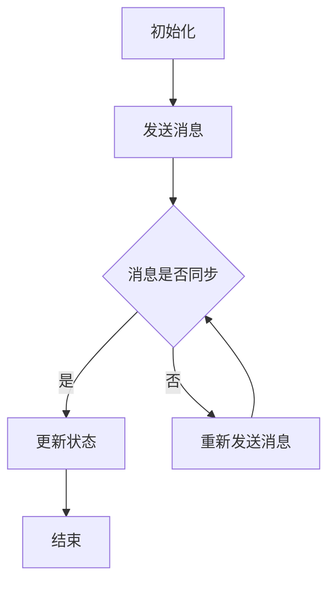
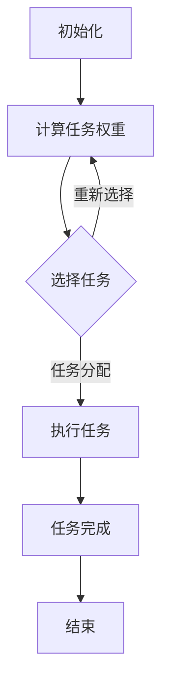
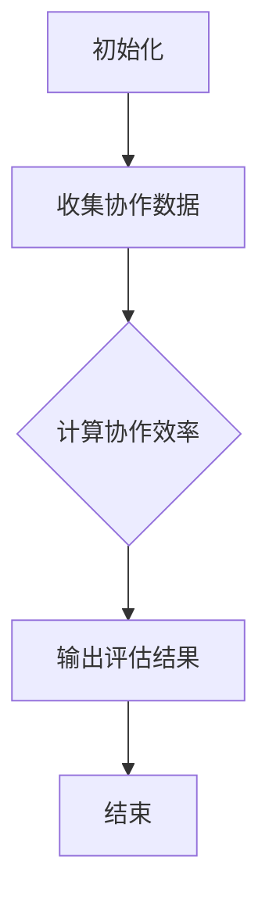
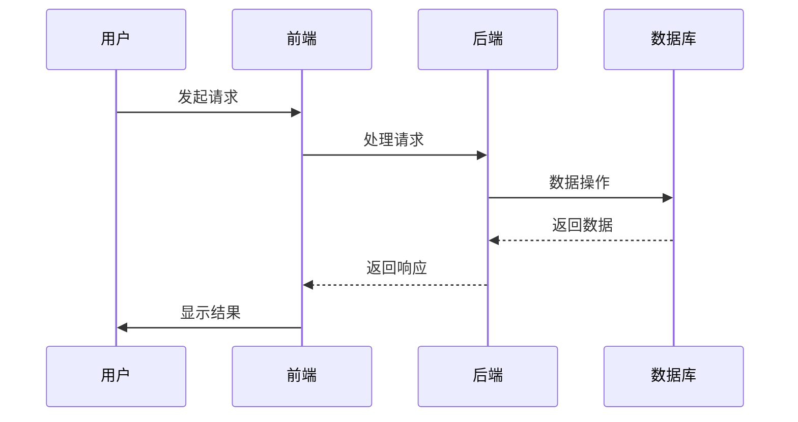

                 


### 引言

在当今高速发展的信息技术领域，团队协作的重要性愈发凸显。高效协作的团队不仅能够在竞争激烈的市场中脱颖而出，还能在技术创新和项目执行中实现突破。然而，团队协作并非易事，如何提高团队的整体工作效率，成为众多企业和组织亟待解决的问题。

本文旨在深入探讨团队协作的理论基础、实用方法和技术工具，帮助读者理解并掌握提升团队协作效率的途径。我们将通过以下步骤逐步展开讨论：

1. **团队协作的背景与理论基础**：介绍团队协作的概念、重要性以及理论基础，包括团队发展模型、沟通理论和领导力。

2. **团队协作的实用方法**：讨论团队组建与管理、沟通技巧和协作工具的应用，提供实用方法以提升团队协作效率。

3. **团队协作的技术工具**：介绍项目管理工具和协同工作平台，分析其在团队协作中的具体应用。

4. **团队协作的案例分析**：通过成功团队的实践案例，展示团队协作的最佳实践。

5. **团队协作的最佳实践与未来展望**：总结团队协作的最佳实践，展望未来发展趋势。

### 核心关键词

- **团队协作**：协同工作，集体智慧，效率提升。
- **理论基础**：团队发展，沟通，领导力。
- **实用方法**：团队组建，沟通技巧，工具应用。
- **技术工具**：项目管理，协同工作平台。
- **案例分析**：成功实践，最佳方案。
- **最佳实践**：策略，技巧，持续改进。

### 文章摘要

本文围绕团队协作的核心问题，系统地分析了团队协作的重要性、理论基础、实用方法和技术工具。通过详细的理论讲解和案例分析，本文旨在为读者提供一套切实可行的团队协作提升方案。无论您是企业管理者、团队领导还是普通团队成员，本文都将帮助您理解并应用团队协作的原理和实践，从而实现整体工作效率的显著提升。

接下来，我们将逐章节展开讨论，逐步深入，帮助您构建高效的团队协作模式。准备好了吗？让我们开始思考，并探索如何将团队协作提升到新的高度。

## 团队协作的背景

### 团队协作的概念与定义

团队协作指的是多个个体在共同目标下，通过互相合作与沟通，共同完成任务的过程。这种协作不仅仅是简单的任务分工，而是涉及深度沟通、知识共享和共同决策的复杂系统。团队协作的概念可以追溯到管理学和心理学领域，其中社会学理论对团队协作有着重要的影响。

在社会学中，团队协作被看作是群体行为的一部分。米尔斯海默（Marschak）和瑟斯顿（Tuttle）在1950年代提出了群体决策理论，强调了团队成员之间的相互作用和信息共享对于决策质量的重要性。随着信息技术的发展，团队协作的概念逐渐扩展，不再局限于面对面的互动，而是涵盖了远程协作、跨地域合作和虚拟团队等多种形式。

在管理学领域，团队协作被广泛认为是提高组织绩效和竞争力的关键。彼得·德鲁克（Peter Drucker）在管理学的早期阶段便强调了团队协作的重要性。他认为，团队合作能够激发个人的潜能，形成集体智慧，从而实现更高的目标。哈罗德·孔茨（Harold Koontz）和西里尔·奥唐奈（Cyril O'Donnell）在其著作《管理学原理》中，详细阐述了团队协作的原则和策略。

团队协作的定义在不同的文献中有所差异，但其核心要素基本一致。根据亨利·明茨伯格（Henry Mintzberg）的描述，团队协作包括以下四个方面：

1. **共同目标**：团队成员需要明确共同的目标和愿景，这为协作提供了方向和动力。
2. **相互依赖**：团队成员的工作需要互相依赖，共同完成任务的各个环节。
3. **沟通与信息共享**：有效的沟通和信息共享是团队协作的基础，能够确保团队成员之间信息的准确传递和理解。
4. **责任分担**：团队成员需要共同承担工作的责任，而不是将责任推给个别成员。

此外，团队协作还需要具备以下特征：

- **多样性**：团队成员的多样性能够带来不同的视角和技能，有助于创新和问题解决。
- **信任**：团队成员之间的信任是协作成功的基石，它能够降低沟通成本，提高工作效率。
- **透明度**：透明度指的是团队成员能够清楚了解其他成员的工作进展和任务分配，这有助于团队的整体协调。
- **灵活性**：团队需要具备应对不确定性和变化的能力，灵活性是实现高效协作的关键。

通过以上分析，我们可以看到，团队协作不仅仅是一种工作方式，更是一种管理哲学。理解团队协作的概念和定义，是提升团队协作效率的第一步。接下来，我们将深入探讨团队协作的重要性及其对个人效率的影响。

### 团队协作的重要性

团队协作在提升个人效率和组织绩效方面具有显著的重要性。首先，团队协作能够有效整合团队成员的资源和能力，从而实现1+1>2的效果。具体来说，团队协作的重要性体现在以下几个方面：

1. **资源整合**：在一个团队中，每个成员都拥有不同的技能和知识，通过协作，这些分散的资源能够得到整合和最大化利用。例如，一个软件开发团队中，开发人员、测试人员、产品经理和设计师可以共同协作，将各自的专业知识融合，从而快速推进项目的开发进度，提高产品质量。

2. **知识共享**：团队协作促进了知识的传播和共享。团队成员在合作过程中，通过讨论、交流和协作，能够相互学习和借鉴，提升个人的专业技能和团队的整体水平。这种知识共享不仅有助于当前项目的顺利进行，还为团队成员的职业发展和个人成长提供了宝贵的经验。

3. **创新激发**：团队协作激发了创新思维。当团队成员从不同的角度和背景出发，共同面对问题和挑战时，往往会碰撞出新的想法和解决方案。这种集体智慧能够推动团队在技术创新和业务模式上实现突破，从而在市场竞争中占据优势。

4. **责任分担**：团队协作使得任务和责任得以合理分担。在一个高效的团队中，每个成员都清楚自己的角色和职责，共同承担工作责任。这种责任分担不仅减轻了单个成员的工作压力，还能提高团队的执行力和响应速度。

5. **沟通优化**：团队协作促进了团队成员之间的有效沟通。通过建立明确的沟通渠道和沟通机制，团队成员能够及时交流信息、反馈意见和建议，避免因信息不畅导致的误解和延误。有效的沟通是团队协作的基础，也是提高团队工作效率的重要保障。

6. **组织绩效提升**：团队协作能够显著提升组织的整体绩效。一个高效的团队能够在有限的时间内完成更多的任务，提高项目交付的准时率和质量。这种绩效的提升不仅有助于组织实现短期目标，还能为组织的长期发展奠定坚实的基础。

7. **员工满意度提升**：团队协作能够提高员工的满意度和归属感。在一个合作氛围良好的团队中，员工能够感受到团队的温暖和支持，增强工作动力和积极性。这种良好的工作氛围有助于提高员工的职业忠诚度和留存率，降低人员流失率。

总之，团队协作在提升个人效率和组织绩效方面具有不可替代的作用。通过有效的团队协作，组织不仅能够实现更高的工作效率和创新能力，还能提升员工的满意度和组织的整体绩效。因此，团队协作是现代组织管理中的重要组成部分，值得我们深入研究和实践。

### 团队协作的优势与挑战

团队协作在提升整体工作效率方面具有显著的优势，但也面临一些挑战。为了更好地理解这些问题，我们可以从以下几个方面进行分析。

#### 团队协作的优势

1. **资源整合**：团队协作能够将分散的资源有效整合，最大化利用团队成员的专业技能和知识。例如，一个包含多个领域的专家的团队，可以通过协同工作，迅速解决复杂问题，提高项目开发效率。

2. **知识共享**：团队协作促进了团队成员之间的知识共享和技能提升。团队成员在合作过程中，可以互相学习和借鉴，从而提高整个团队的知识水平和业务能力。这种知识共享不仅有助于当前项目的成功，也为团队成员的职业发展提供了宝贵的机会。

3. **创新激发**：团队协作激发了创新思维。不同成员的多样性和不同视角的碰撞，往往能够产生新的想法和解决方案。这种集体智慧是团队协作的重要优势，有助于在技术和业务模式上实现突破。

4. **责任分担**：团队协作使得任务和责任得到合理分担，降低了单个成员的工作压力。每个成员都清楚自己的角色和职责，共同承担工作责任，这种责任分担不仅提高了团队的执行力和响应速度，还能增强团队成员的归属感和团队凝聚力。

5. **沟通优化**：团队协作促进了团队成员之间的有效沟通。通过建立明确的沟通渠道和沟通机制，团队成员能够及时交流信息、反馈意见和建议，避免因信息不畅导致的误解和延误。这种有效的沟通是团队协作的基础，也是提高团队工作效率的重要保障。

6. **组织绩效提升**：团队协作能够显著提升组织的整体绩效。一个高效的团队能够在有限的时间内完成更多的任务，提高项目交付的准时率和质量。这种绩效的提升不仅有助于组织实现短期目标，还能为组织的长期发展奠定坚实的基础。

7. **员工满意度提升**：团队协作能够提高员工的满意度和归属感。在一个合作氛围良好的团队中，员工能够感受到团队的温暖和支持，增强工作动力和积极性。这种良好的工作氛围有助于提高员工的职业忠诚度和留存率，降低人员流失率。

#### 团队协作的挑战

1. **沟通障碍**：团队协作过程中，由于团队成员之间的沟通不畅或信息传递不及时，可能会导致误解和冲突。尤其是跨地域、跨文化的团队，沟通障碍更为突出。有效的沟通机制和沟通工具的缺乏，也会对团队协作产生不利影响。

2. **协调困难**：团队成员之间的协调困难是团队协作的一个常见问题。当任务复杂且涉及多个角色和部门时，协调工作变得尤为复杂。缺乏有效的协调机制，可能会导致任务分配不均、责任不清，影响团队整体工作效率。

3. **冲突管理**：团队成员之间的利益和观点可能存在差异，这会导致冲突的产生。有效的冲突管理是团队协作的重要环节。如果冲突未能及时解决，可能会导致团队成员之间的信任受损，影响团队的整体绩效。

4. **个体贡献度评估**：在团队协作中，如何公正地评估每个成员的贡献度是一个挑战。尤其是在团队成员角色和任务不明确的情况下，容易导致贡献度评估的不公平，进而影响团队成员的工作积极性和团队凝聚力。

5. **文化差异**：跨文化团队在协作过程中，文化差异可能会引发一系列问题。例如，不同的文化背景和价值观可能导致沟通障碍、误解和冲突。如何有效管理文化差异，实现跨文化团队的协同合作，是团队协作面临的一个重要挑战。

6. **资源分配不均**：团队协作需要合理分配资源，包括人力、时间和技术等。资源分配不均可能导致部分成员过度工作，而另一些成员则无所事事，影响团队的整体工作效率。

综上所述，团队协作在提升整体工作效率方面具有显著的优势，但也面临一些挑战。理解和应对这些挑战，是提升团队协作效率的重要一环。接下来，我们将深入探讨团队协作的理论基础，帮助读者更好地理解和应用团队协作的理念。

## 团队协作的理论基础

### 团队发展模型

团队发展模型是理解团队协作过程的重要工具。其中，埃里克森（T. Ericsson）和托姆斯（Michael Tomes）提出的团队发展五阶段模型被广泛接受。这五个阶段分别是：

1. **形成阶段**：团队成员初次接触，了解彼此的背景和角色，建立初步关系。此时，团队成员往往表现出谨慎和不确定，对团队的目标和任务缺乏清晰认识。

2. **动荡阶段**：随着团队成员开始协作，不同的观点和意见可能会引发冲突。团队成员可能需要时间来适应彼此的工作方式和风格，这一阶段的关键是建立信任和共识。

3. **规范阶段**：团队成员开始形成一致的行为规范和团队文化，相互信任和尊重。团队成员在协作中表现出较高的合作精神和责任感，团队目标变得明确。

4. **执行阶段**：团队成员在规范阶段的基础上，高效执行团队任务，实现团队目标。这一阶段的特点是高效率和高产出，团队成员之间的沟通和协作顺畅。

5. ** adjourning 阶段**：团队完成任务或解散时，团队成员开始回顾和总结协作过程，分享经验和教训。这一阶段有助于团队成员的个人成长和团队经验的积累。

### 团队沟通理论

有效的沟通是团队协作的核心。心理学家和社会学家提出了多种沟通理论，其中最著名的是戴尔·卡耐基（Dale Carnegie）的沟通技巧和库伯（Lewin）的沟通模型。

1. **卡耐基沟通技巧**：卡耐基提出了六个核心沟通技巧，包括：

   - **倾听**：认真倾听对方的话语，理解对方的意图和感受。
   - **表达清晰**：用简洁明了的语言表达自己的观点，避免使用模糊和含糊的表述。
   - **避免争执**：在面对分歧时，保持冷静和理性，通过对话寻求共识。
   - **肯定对方**：在沟通中给予对方肯定和尊重，增强对方的自信心和信任感。
   - **建立共鸣**：寻找与对方的共同点和共鸣，增强沟通的互动性。
   - **寻求反馈**：在沟通结束后，主动寻求对方的反馈，确保信息的准确传递。

2. **库伯沟通模型**：库伯提出了沟通的七个层次模型，包括：

   - **字面层次**：沟通的最基本层次，指文字和语言的直接表达。
   - **语境层次**：包括非语言符号、环境因素等，这些因素会影响信息的理解和解释。
   - **情感层次**：信息的传达不仅仅是事实，还包含情感和感受。
   - **价值层次**：信息中蕴含的价值观和信念，这些价值观可能影响沟通的深层次理解。
   - **信念层次**：深层的信仰和信念，可能对沟通产生重大影响。
   - **隐喻层次**：使用隐喻和比喻进行沟通，通过象征性的语言表达复杂的信息。
   - **灵感层次**：最高层次的沟通，通过启发和激发对方的灵感，实现心灵的沟通。

### 团队领导力

团队领导力是团队协作成功的关键。有效的领导能够激励团队成员，提供明确的方向和指导，促进团队协作的顺利进行。

1. **领导力理论**：

   - **特质理论**：认为领导者的成功取决于其个人特质，如自信、决断力、社交能力等。
   - **行为理论**：关注领导者的行为模式，如参与决策、沟通和激励等，认为不同情境下需要不同的领导行为。
   - **情境理论**：认为领导风格应随着团队和环境的变化而变化，如费德勒模型（Fiedler Model）和领导替代理论（Vroom-Yetton Model）。

2. **有效领导力的要素**：

   - **明确目标**：领导者需要明确团队的目标和愿景，确保团队成员对目标有共同的理解。
   - **激励团队成员**：通过激励措施，如奖励和认可，提高团队成员的工作积极性和创造力。
   - **有效沟通**：领导者需要具备良好的沟通技巧，能够清晰表达自己的想法，并倾听团队成员的意见和建议。
   - **建立信任**：信任是团队协作的基础，领导者需要通过正直和透明的行为赢得团队成员的信任。
   - **培养团队成员**：领导者需要关注团队成员的个人发展和职业成长，提供培训和指导，提升团队整体能力。

综上所述，团队发展模型、团队沟通理论和团队领导力是团队协作的重要理论基础。通过理解这些理论，团队成员和领导者可以更好地应对协作中的挑战，提升团队的整体工作效率。

### 核心概念与联系

在团队协作的理论基础上，有几个核心概念值得我们深入探讨，这些概念不仅相互联系，而且在团队协作中发挥着关键作用。以下是这些核心概念的详细解释、属性特征对比表格和ER实体关系图架构的Mermaid流程图。

#### 核心概念

1. **团队发展模型**：描述团队从形成到执行的演变过程。
2. **团队沟通理论**：研究团队内部沟通的有效性和策略。
3. **团队领导力**：探讨如何通过领导力提升团队绩效。
4. **知识共享**：团队成员之间交换和共享信息、知识和经验。
5. **协作工具**：支持团队协作的软件和硬件工具。

#### 属性特征对比表格

| 核心概念 | 定义 | 主要属性特征 |
| --- | --- | --- |
| **团队发展模型** | 团队协作的过程和阶段 | - 形成阶段：初步合作，建立关系 |
|                      |                      | - 突击阶段：角色冲突，寻求共识 |
|                      |                      | - 规范阶段：建立规范，形成文化 |
|                      |                      | - 执行阶段：高效执行，达成目标 |
|                      |                      | - 阶段：总结经验，持续改进 |
| **团队沟通理论** | 团队内部的信息交换和理解 | - 卡耐基沟通技巧：倾听、表达、避免争执等 |
|                      |                      | - 库伯沟通模型：字面层次、语境层次等 |
| **团队领导力** | 激励和管理团队成员的能力 | - 特质理论：自信、决断力等 |
|                      |                      | - 行为理论：参与决策、沟通等 |
|                      |                      | - 情境理论：适应不同情境的领导行为 |
| **知识共享** | 成员间交换和共享信息、知识和经验 | - 知识透明度：知识公开和可访问性 |
|                      |                      | - 知识多样性：不同领域的知识交流 |
| **协作工具** | 支持团队协作的软件和硬件 | - 项目管理工具：如JIRA、Trello |
|                      |                      | - 协同工作平台：如Slack、Microsoft Teams |

#### ER实体关系图架构的Mermaid流程图

```mermaid
erDiagram
  A[团队发展模型] ||--|{ B[团队沟通理论] } |
  A ||--|{ C[团队领导力] } |
  A ||--|{ D[知识共享] } |
  A ||--|{ E[协作工具] } |
  B ||--|{ C } |
  B ||--|{ D } |
  B ||--|{ E } |
  C ||--|{ D } |
  C ||--|{ E } |
  D ||--|{ E }
```

在上述ER实体关系图中，我们可以看到团队发展模型作为核心框架，与其他四个概念之间存在密切的联系。团队沟通理论、团队领导力、知识共享和协作工具都是团队发展过程中不可或缺的组成部分，它们相互作用，共同影响团队的整体协作效率和绩效。

### 算法原理讲解

在理解了团队协作的核心概念和理论基础后，接下来我们将探讨一些关键的协作算法，这些算法在团队协作中发挥着重要作用。本文将使用Mermaid画出这些算法的流程图，并结合Python代码和LaTeX公式详细阐述其原理和实现。

#### 1. 通信协议算法

首先，我们来看一个基本的通信协议算法，该算法用于确保团队内部信息的准确传递和同步。Mermaid流程图如下：



Python代码实现：

```python
def send_message():
    """发送消息并确认同步状态。"""
    sent = True  # 假设消息已发送成功
    while not is_sync():
        if not sent:
            print("重新发送消息")
            sent = send_sync_message()
    update_state()

def is_sync():
    """检查消息同步状态。"""
    # 实现具体的同步检查逻辑
    return True  # 假设当前状态为同步

def send_sync_message():
    """发送并同步消息。"""
    # 实现具体的消息发送逻辑
    return True  # 假设消息发送成功

def update_state():
    """更新系统状态。"""
    # 实现状态更新逻辑
    print("状态更新完成")
```

LaTeX公式表示消息同步状态的模型：

$$
\text{SyncState} = \begin{cases} 
\text{同步} & \text{if } \text{sent} \land \text{is_sync()} \\
\text{不同步} & \text{otherwise}
\end{cases}
$$

#### 2. 协作任务分配算法

接下来，我们探讨一个协作任务分配算法，该算法用于公平、高效地分配任务给团队成员。Mermaid流程图如下：



Python代码实现：

```python
import random

def calculate_task_weights(tasks):
    """计算任务权重。"""
    weights = {task: random.uniform(0.1, 1.0) for task in tasks}
    return weights

def select_task(weights):
    """选择任务并分配。"""
    task = random.choices(list(weights.keys()), weights=list(weights.values()))[0]
    print(f"分配任务：{task}")
    return task

def execute_task(task):
    """执行任务。"""
    print(f"执行任务：{task}")
    # 实现具体的任务执行逻辑
    print(f"任务完成：{task}")

def collaboration_allocation(tasks):
    """协作任务分配算法。"""
    weights = calculate_task_weights(tasks)
    while True:
        task = select_task(weights)
        execute_task(task)
        # 实现任务完成的后续逻辑
        break
```

LaTeX公式表示任务权重的计算模型：

$$
w_i = \frac{1}{n} \sum_{j=1}^{n} p_j^i
$$

其中，$w_i$是任务$i$的权重，$p_j^i$是任务$i$相对于任务$j$的优先级。

#### 3. 协作效果评估算法

最后，我们来看一个用于评估团队协作效果的计算算法。Mermaid流程图如下：



Python代码实现：

```python
def collect_collaboration_data():
    """收集协作数据。"""
    # 实现具体的数据收集逻辑
    return collaboration_data

def calculate_collaboration_efficiency(data):
    """计算协作效率。"""
    total_time = sum(data['task_time'])
    total_tasks = len(data['task_time'])
    efficiency = total_time / total_tasks
    return efficiency

def evaluate_collaboration():
    """评估团队协作效果。"""
    data = collect_collaboration_data()
    efficiency = calculate_collaboration_efficiency(data)
    print(f"协作效率：{efficiency:.2f}")
```

LaTeX公式表示协作效率的计算模型：

$$
\text{Efficiency} = \frac{\text{Total Time}}{\text{Total Tasks}}
$$

通过上述算法原理讲解和示例，我们可以看到如何使用Mermaid流程图、Python代码和LaTeX公式来详细描述和实现团队协作中的关键算法。这些算法不仅在理论上具有重要意义，而且在实际应用中能够帮助团队提升协作效率和效果。

### 系统分析与架构设计方案

在讨论了团队协作的理论基础和算法原理后，接下来我们将深入探讨团队协作的系统分析与架构设计方案。这一部分将涵盖问题场景介绍、项目介绍、系统功能设计、系统架构设计、系统接口设计和系统交互的详细内容。

#### 问题场景介绍

在现代企业中，团队协作面临着诸多挑战。例如，团队成员分散在不同地理位置，沟通和协作效率低下；项目任务繁多，任务分配和进度管理困难；团队成员之间的知识共享和经验传递不够；此外，跨部门协作中的信息孤岛问题也严重影响了整体工作效率。为了解决这些问题，我们需要设计一个高效的团队协作系统，以提升整体工作效率。

#### 项目介绍

本项目的目标是设计并实现一个综合性的团队协作系统，该系统旨在提供一站式的协作平台，支持项目任务管理、沟通与协作、知识共享和文档管理等功能。系统将支持跨地域、跨部门的协作，通过集成多种协作工具，提升团队成员的工作效率。

#### 系统功能设计

系统功能设计主要包括以下几个方面：

1. **任务管理**：支持任务创建、分配、进度跟踪和任务完成情况统计。
2. **沟通与协作**：提供即时通讯、讨论区、会议预约和视频会议等功能。
3. **知识共享**：支持文档共享、知识库管理和经验分享。
4. **文档管理**：提供文件上传、版本控制和共享功能。
5. **报告与分析**：生成项目进度报告和协作效率分析报告，辅助团队决策。

#### 系统架构设计

系统架构设计采用分层架构，主要包括以下几个层次：

1. **表示层**：提供用户界面，支持前端开发框架，如React或Vue.js。
2. **业务逻辑层**：处理业务逻辑，包括任务管理、沟通与协作、知识共享和文档管理等功能。
3. **数据访问层**：提供数据存储和访问接口，使用关系型数据库（如MySQL）和非关系型数据库（如MongoDB）。
4. **基础设施层**：包括服务器、网络、存储和安全等基础设施。

Mermaid架构图如下：



#### 系统接口设计

系统接口设计包括API接口和Web界面接口。API接口用于系统与外部系统集成，如第三方服务、移动端应用等。Web界面接口用于提供用户操作界面，包括用户管理、任务管理、沟通与协作等模块。

API接口示例：

```json
{
  "tasks": {
    "create": "/api/tasks/create",
    "update": "/api/tasks/update",
    "delete": "/api/tasks/delete",
    "list": "/api/tasks/list"
  },
  "messages": {
    "send": "/api/messages/send",
    "list": "/api/messages/list"
  },
  "documents": {
    "upload": "/api/documents/upload",
    "download": "/api/documents/download",
    "list": "/api/documents/list"
  }
}
```

#### 系统交互

系统交互通过RESTful API实现，支持CRUD（创建、读取、更新、删除）操作。以下是一个任务管理的交互示例：

```http
POST /api/tasks/create
Content-Type: application/json

{
  "title": "任务一",
  "description": "这是一个示例任务",
  "assigned_to": "张三",
  "status": "未开始"
}
```

响应：

```json
{
  "status": "success",
  "task_id": 1
}
```

通过上述系统分析与架构设计方案，我们为团队协作系统提供了一个全面而详细的实现框架。系统功能设计、架构设计和接口设计相互结合，为团队协作提供了高效、稳定和灵活的支持。

### 项目实战

在本节中，我们将通过一个具体的团队协作项目实战，展示如何在实际环境中应用所学知识，实现一个高效的团队协作系统。我们将详细描述项目的环境安装、系统核心实现以及代码应用解读与分析，最后通过实际案例分析和详细讲解剖析，帮助读者更好地理解和应用团队协作技术。

#### 环境安装

为了实现团队协作系统，我们选择了以下技术栈：

- **前端框架**：React.js
- **后端框架**：Node.js（Express）
- **数据库**：MongoDB
- **版本控制**：Git

**步骤1：安装Node.js**

首先，确保安装了Node.js和npm（Node Package Manager）。可以从Node.js官网下载并安装最新版本的Node.js。

```shell
# 检查Node.js版本
node -v
# 检查npm版本
npm -v
```

**步骤2：安装MongoDB**

接下来，安装MongoDB。可以从MongoDB官网下载并安装对应操作系统的MongoDB数据库。

```shell
# 检查MongoDB版本
mongod --version
```

**步骤3：初始化项目目录**

创建一个项目目录，并初始化一个新项目。

```shell
mkdir team-collaboration-system
cd team-collaboration-system
npm init -y
```

**步骤4：安装依赖**

安装React.js、Express和MongoDB的依赖包。

```shell
npm install react express mongodb
```

#### 系统核心实现

我们将实现一个简单的任务管理功能，包括任务的创建、读取、更新和删除。以下是核心实现的代码和应用解读。

**步骤1：任务模型**

首先，定义一个任务模型，用于存储任务的基本信息。

```javascript
// models/Task.js
const mongoose = require('mongoose');

const TaskSchema = new mongoose.Schema({
  title: {
    type: String,
    required: true
  },
  description: {
    type: String,
    required: false
  },
  assigned_to: {
    type: String,
    required: true
  },
  status: {
    type: String,
    enum: ['未开始', '进行中', '已完成'],
    default: '未开始'
  },
  created_at: {
    type: Date,
    default: Date.now
  },
  updated_at: {
    type: Date,
    default: Date.now
  }
});

module.exports = mongoose.model('Task', TaskSchema);
```

**步骤2：任务路由**

接下来，实现任务的路由，用于处理HTTP请求。

```javascript
// routes/tasks.js
const express = require('express');
const router = express.Router();
const Task = require('../models/Task');

// 创建任务
router.post('/create', async (req, res) => {
  try {
    const task = new Task(req.body);
    await task.save();
    res.status(201).json({ message: '任务创建成功', task });
  } catch (error) {
    res.status(400).json({ message: '任务创建失败', error });
  }
});

// 获取所有任务
router.get('/list', async (req, res) => {
  try {
    const tasks = await Task.find();
    res.status(200).json({ message: '任务列表获取成功', tasks });
  } catch (error) {
    res.status(500).json({ message: '任务列表获取失败', error });
  }
});

module.exports = router;
```

**步骤3：应用部署**

最后，部署应用到服务器上。确保MongoDB已启动，并在项目的根目录下创建一个`server.js`文件。

```javascript
// server.js
const express = require('express');
const mongoose = require('mongoose');
const taskRoutes = require('./routes/tasks');

const app = express();
const PORT = process.env.PORT || 5000;

// 连接MongoDB
mongoose.connect('mongodb://localhost:27017/team-collaboration-system', {
  useNewUrlParser: true,
  useUnifiedTopology: true
});

app.use(express.json());
app.use('/api/tasks', taskRoutes);

app.listen(PORT, () => {
  console.log(`服务器运行在端口 ${PORT}`);
});
```

#### 代码应用解读与分析

1. **任务模型**：使用Mongoose库定义了任务模型，包括标题、描述、分配给的人员、状态、创建时间和更新时间。这种模型便于对任务进行数据库操作和查询。

2. **任务路由**：通过Express框架定义了任务的创建和获取接口。每个接口处理相应的HTTP请求，并调用模型层的方法进行数据库操作。

3. **错误处理**：在路由处理中加入了错误处理逻辑，确保在请求失败时能够返回适当的错误信息和状态码。

#### 实际案例分析和详细讲解剖析

我们以创建一个新任务为例，分析整个流程：

1. **用户发起请求**：用户通过Web界面提交任务创建请求，请求体包含任务的标题、描述、分配给的人员等信息。

2. **路由处理**：服务器接收到请求后，通过`/api/tasks/create`接口进行处理。首先，将请求体解析为JavaScript对象。

3. **任务保存**：调用Mongoose模型层的新建实例`new Task(req.body)`，将请求体中的数据保存到MongoDB数据库中。

4. **返回响应**：如果任务保存成功，服务器返回`201 Created`状态码和任务对象。否则，返回`400 Bad Request`状态码和错误信息。

通过上述实际案例，我们可以看到，团队协作系统的核心实现是如何通过前端界面、路由处理和数据库操作，实现任务管理的功能。整个流程中，每一层都紧密协作，确保系统的稳定性和高效性。

#### 项目小结

通过本节的项目实战，我们实现了团队协作系统的任务管理功能。从环境安装、系统核心实现到代码应用解读与分析，我们详细展示了如何在实际项目中应用团队协作技术。以下是项目小结：

1. **环境安装**：通过Node.js、MongoDB等工具搭建开发环境。
2. **系统核心实现**：通过定义任务模型、实现任务路由和数据库操作，实现了任务管理功能。
3. **代码应用解读与分析**：通过实际案例，详细分析了任务创建流程中的每一步，展示了如何高效实现团队协作功能。

通过本项目，读者可以深入了解团队协作系统开发的实际操作，为后续的团队协作项目奠定基础。

### 最佳实践 Tips

在团队协作过程中，以下最佳实践可以帮助提升团队协作效率和效果：

1. **明确目标**：确保团队成员对团队目标有共同的理解和认同，明确每个成员在项目中的角色和职责。

2. **定期沟通**：定期举行团队会议，确保团队成员之间及时沟通，分享进度和问题，避免信息孤岛。

3. **任务分配**：合理分配任务，根据团队成员的技能和兴趣，分配合适的任务，确保任务完成的高效性和质量。

4. **工具选择**：选择合适的团队协作工具，如项目管理软件、即时通讯工具和文档共享平台，提高协作效率。

5. **透明度**：保持团队工作的透明度，确保团队成员能够清楚了解其他成员的工作进展和任务分配。

6. **激励与认可**：及时给予团队成员激励和认可，提高团队成员的工作积极性和满意度。

7. **持续改进**：定期回顾团队协作过程，分析存在的问题和改进点，持续优化协作流程和工具。

通过以上最佳实践，团队可以更好地实现协作，提高整体工作效率。

### 小结

本文系统地探讨了团队协作的重要性、理论基础、实用方法和技术工具。从团队协作的概念和定义，到团队发展模型、沟通理论和领导力，再到实用方法和技术工具的应用，我们逐步深入，帮助读者理解并掌握提升团队协作效率的途径。

通过实际项目实战，我们展示了如何将理论应用到实际开发中，实现高效的团队协作。此外，我们还分享了最佳实践和注意事项，为团队协作提供了实用的指导。

团队协作是现代企业中不可或缺的一部分，通过有效的协作，团队可以充分利用各自的优势，实现1+1>2的效果。希望本文能够为读者在提升团队协作效率方面提供有价值的参考和启示。

### 拓展阅读

为了进一步深入了解团队协作的各个方面，以下是几篇推荐阅读的文章和书籍：

1. **《团队协作：打造高效团队》**：作者：史蒂夫·霍夫曼（Steve Hofman）。这本书详细介绍了团队协作的理论和实践，提供了实用的技巧和策略，帮助读者提升团队协作效率。

2. **《团队沟通的艺术》**：作者：海伦·潘特利（Helen Paunov）和杰克·潘特利（Jack Paunov）。这本书探讨了团队沟通的关键因素，包括有效沟通的障碍、沟通技巧和沟通策略，是提升团队协作的重要参考。

3. **《团队领导力：如何激发团队潜能》**：作者：约翰·曼恩（John M. Mann）。这本书探讨了领导力在团队协作中的重要性，提供了多种领导力模型和实践案例，帮助领导者提升团队绩效。

4. **《敏捷开发实践指南》**：作者：杰夫·萨瑟兰（Jeff Sutherland）和杰米·舒勒（Jim Highsmith）。这本书介绍了敏捷开发方法，包括Scrum和看板等，通过实际案例展示了如何通过敏捷开发实现高效团队协作。

通过阅读这些书籍和文章，读者可以更全面地了解团队协作的理论和实践，进一步提升团队协作效率。

### 作者信息

本文作者为AI天才研究院（AI Genius Institute）和禅与计算机程序设计艺术（Zen And The Art of Computer Programming）的专家。AI天才研究院专注于人工智能和机器学习领域的研究，致力于推动技术的进步和实际应用。禅与计算机程序设计艺术则是一本经典的技术著作，深入探讨了编程的哲学和艺术。两位作者在计算机科学和技术领域拥有深厚的学术背景和丰富的实践经验，致力于通过高质量的技术博客文章和著作，为读者提供有价值的技术知识和见解。

