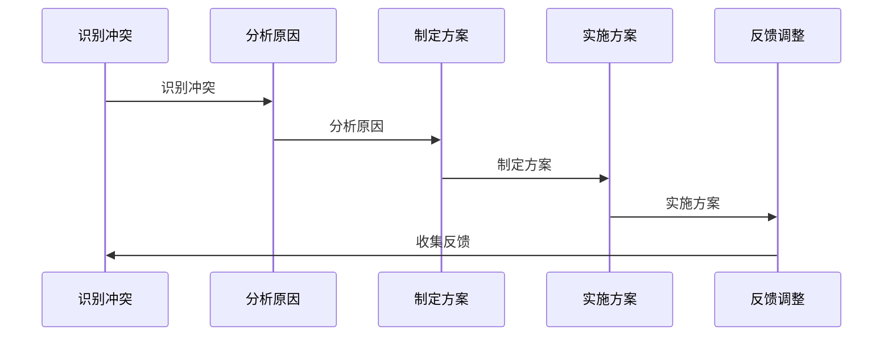
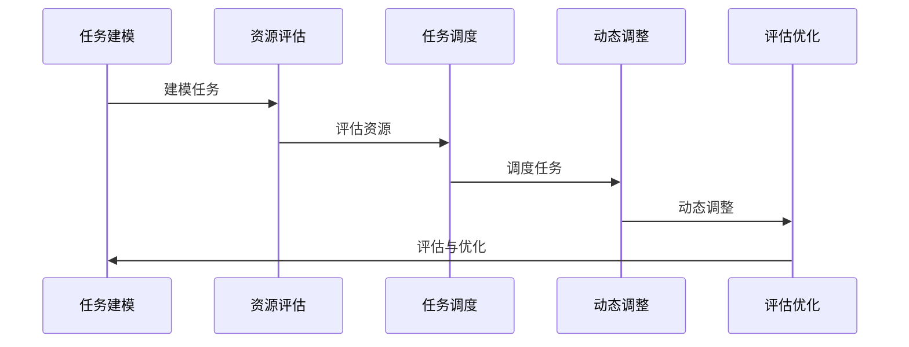
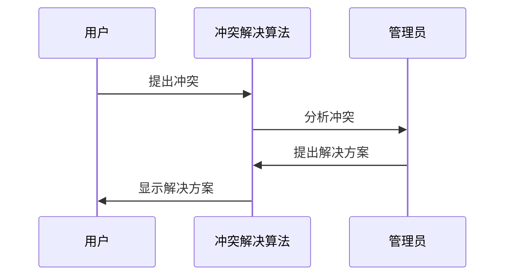
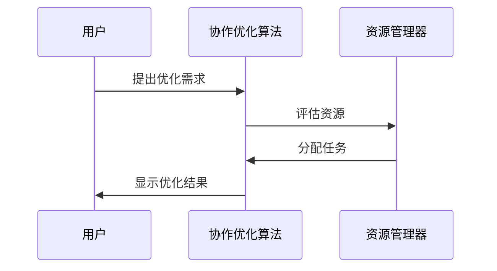

                 


### 第1章: 团队协作的背景

#### 1.1 问题背景

在现代工作环境中，团队协作已经成为企业成功的核心要素。随着信息技术的飞速发展，企业所面临的市场竞争日益激烈，复杂性不断增加，传统个体作战的方式已经无法满足需求。因此，跨职能的团队协作应运而生，成为企业应对市场变化的利器。

首先，跨职能团队协作可以充分利用各个部门的专业知识，提高整体效率。例如，在一个软件开发项目中，研发、测试、运维等不同职能部门的协同工作，可以确保项目的高质量和高效率完成。其次，跨职能团队可以促进不同职能部门之间的沟通和交流，有助于打破部门壁垒，形成良好的团队合作氛围。

然而，跨职能合作并非易事，其中存在诸多挑战。首先，沟通障碍是跨职能团队协作中的常见问题。由于各个职能部门的工作内容和方式不同，沟通时容易出现误解和冲突。其次，目标不一致也会导致团队协作受阻。不同职能部门的目标和优先级往往存在差异，这使得团队协作难以协调一致。此外，资源分配问题和冲突解决也是跨职能合作中的重要挑战。

#### 1.2 问题描述

跨职能合作的主要问题可以概括为以下几点：

1. **沟通障碍**：由于不同职能部门之间的语言、文化和工作方式的差异，沟通效率低下，信息传递不畅。
2. **目标不一致**：各个职能部门的目标和优先级不同，导致团队协作难以形成合力。
3. **资源分配问题**：资源分配不合理，导致某些职能部门资源过剩，而另一些职能部门资源不足。
4. **冲突解决**：在跨职能团队协作中，冲突难以避免，如何有效解决冲突是一个重要问题。

#### 1.3 问题解决

要解决跨职能合作中的问题，需要采取一系列策略：

1. **加强沟通**：建立有效的沟通机制，确保信息流畅传递。例如，定期召开跨职能会议，设立信息共享平台等。
2. **明确目标**：制定共同的目标和愿景，确保各个职能部门的目标一致。通过沟通和协调，消除目标差异，形成合力。
3. **合理分配资源**：根据项目需求和团队协作实际情况，合理分配资源，确保资源利用最大化。
4. **建立冲突解决机制**：制定明确的冲突解决流程和规则，确保冲突能够及时、公正地解决。

#### 1.4 边界与外延

跨职能团队协作的边界主要包括以下几个方面：

1. **职能边界**：明确各个职能部门的责任和权限，避免职责重叠和冲突。
2. **组织边界**：跨职能团队协作不仅限于同一组织内部，还可以延伸到合作伙伴和外部供应商。
3. **时间边界**：跨职能团队协作通常需要跨越较长时间，因此需要合理规划时间和进度。

跨职能团队协作的外延包括：

1. **知识共享**：通过跨职能协作，促进知识的共享和交流，提升团队整体素质。
2. **创新合作**：跨职能团队协作有助于激发创新思维，推动产品和服务创新。
3. **风险应对**：通过跨职能协作，可以共同应对市场变化和风险，提高企业竞争力。

#### 1.5 概念结构与核心要素组成

跨职能团队协作的概念结构包括以下几个核心要素：

1. **团队建设**：建立有效的跨职能团队，明确团队成员的角色和职责。
2. **沟通技巧**：提升团队成员的沟通能力，确保信息流畅传递。
3. **协作策略**：制定合理的协作策略，确保团队协作的高效和有序。

通过以上策略，可以有效应对跨职能合作中的挑战，提升团队协作效率，为企业创造价值。

### 第2章: 跨职能合作的挑战

在跨职能团队协作中，尽管团队建设、沟通技巧和协作策略等核心要素起到了关键作用，但仍面临诸多挑战。以下将分析这些挑战，并提出相应的解决策略。

#### 2.1 沟通障碍

沟通障碍是跨职能团队协作中最常见的问题之一。由于不同职能部门的工作内容和方式不同，沟通时容易产生误解和冲突。具体表现在以下几个方面：

1. **语言差异**：不同职能部门之间可能使用不同的术语和表达方式，导致沟通不畅。
2. **文化差异**：不同职能部门的文化背景和价值观不同，可能影响团队协作的效率和效果。
3. **信息传递效率**：由于沟通渠道不畅，信息传递可能出现延迟，影响团队协作的进度。

**解决策略**：

1. **建立沟通平台**：利用现代信息技术，建立跨职能团队的沟通平台，如即时通讯工具、邮件系统等，确保信息及时传递。
2. **制定沟通规范**：明确跨职能团队的沟通规范，如使用统一术语、定期召开会议等，提高沟通效率。
3. **培养跨文化意识**：加强团队成员的跨文化培训，提高他们的跨文化沟通能力，减少文化冲突。

#### 2.2 目标不一致

跨职能团队协作中，目标不一致也是一个常见问题。由于各个职能部门的目标和优先级不同，可能导致团队协作难以协调一致。具体表现在以下几个方面：

1. **目标冲突**：不同职能部门的目标可能存在冲突，例如研发部门关注产品的功能完整性，而测试部门关注产品的稳定性。
2. **资源争夺**：由于资源有限，不同职能部门可能为了实现自己的目标而争夺资源，导致资源利用不充分。
3. **决策困难**：在目标不一致的情况下，团队协作中的决策可能变得复杂和困难。

**解决策略**：

1. **明确共同目标**：在项目启动阶段，明确跨职能团队的整体目标，确保各个职能部门的目标一致。
2. **建立优先级排序**：在目标不一致时，通过沟通和协商，确定各个职能部门的优先级排序，确保资源合理分配。
3. **加强团队协作**：通过加强团队协作，促进职能部门之间的沟通和交流，减少目标不一致带来的问题。

#### 2.3 资源分配问题

资源分配问题是跨职能团队协作中另一个重要挑战。由于资源有限，如何合理分配资源成为团队协作的关键。具体表现在以下几个方面：

1. **资源过剩**：某些职能部门可能拥有过多的资源，导致资源浪费。
2. **资源不足**：某些职能部门可能缺乏必要的资源，影响团队协作的效率和效果。
3. **资源利用率低**：资源分配不合理，可能导致资源利用率低下。

**解决策略**：

1. **需求评估**：在项目启动阶段，对各个职能部门的需求进行评估，确保资源分配合理。
2. **资源优化**：通过资源优化策略，提高资源利用率，减少资源浪费。
3. **动态调整**：在项目执行过程中，根据实际情况动态调整资源分配，确保资源能够满足团队协作的需要。

#### 2.4 冲突解决

在跨职能团队协作中，冲突难以避免。如何有效解决冲突，是团队协作中的一项重要任务。具体表现在以下几个方面：

1. **利益冲突**：由于不同职能部门的目标和利益不同，可能导致利益冲突。
2. **意见分歧**：在决策过程中，不同职能部门可能存在意见分歧，导致决策困难。
3. **沟通不畅**：沟通障碍可能导致冲突加剧。

**解决策略**：

1. **建立冲突解决机制**：制定明确的冲突解决流程和规则，确保冲突能够及时、公正地解决。
2. **加强沟通**：通过加强沟通，促进不同职能部门之间的理解和协作，减少冲突的发生。
3. **公正调解**：在冲突解决过程中，保持公正和客观，确保各方利益得到平衡。

通过以上策略，可以有效应对跨职能团队协作中的挑战，提升团队协作效率，为企业创造价值。

### 第3章: 团队协作中的核心概念

在跨职能团队协作中，要实现高效协作，首先需要理解并掌握一些核心概念。这些核心概念包括团队建设、沟通技巧和协作策略，它们是团队协作中不可或缺的要素。

#### 3.1 团队建设

团队建设是团队协作的基础。一个高效的团队需要具备以下几个关键要素：

1. **明确目标**：团队需要明确共同的目标和愿景，确保团队成员方向一致，共同努力。
2. **角色分工**：每个团队成员都应该明确自己的角色和职责，避免职责重叠和冲突。
3. **信任建设**：建立团队成员之间的信任，是团队协作的关键。通过相互信任，可以减少误解和冲突，提升团队协作效率。
4. **团队文化**：团队文化是团队建设的重要组成部分。一个积极向上、相互支持的文化氛围，有助于提升团队凝聚力和工作效率。

**团队建设策略**：

- **定期团队活动**：通过组织团队活动，如团建活动、培训等，加强团队成员之间的交流和合作，提升团队凝聚力。
- **建立反馈机制**：鼓励团队成员提供反馈，对团队的工作进行持续改进，确保团队建设不断优化。
- **明确目标与计划**：制定明确的目标和计划，确保团队成员对团队的任务和目标有清晰的认识。

#### 3.2 沟通技巧

沟通是团队协作的核心。高效的沟通技巧能够确保信息流畅传递，减少误解和冲突。以下是一些关键的沟通技巧：

1. **主动沟通**：主动发起沟通，确保信息的及时传递和反馈。
2. **清晰表达**：确保信息的表达清晰、准确，避免产生误解。
3. **积极倾听**：认真倾听他人的意见和需求，确保理解对方的意图。
4. **沟通渠道**：选择合适的沟通渠道，如面对面沟通、电话、邮件等，确保信息传递的效率。

**沟通技巧策略**：

- **建立沟通规范**：制定明确的沟通规范，如使用统一术语、明确沟通对象和时间等，确保沟通的有序和高效。
- **定期沟通会议**：定期召开沟通会议，确保团队成员之间保持沟通和交流，解决潜在的问题。
- **利用技术工具**：利用现代技术工具，如即时通讯工具、项目管理软件等，提高沟通效率。

#### 3.3 协作策略

协作策略是确保团队协作有序、高效的重要手段。以下是一些关键的协作策略：

1. **协同工作**：团队成员需要协同工作，确保任务的顺利完成。通过分工合作，可以充分发挥每个人的优势。
2. **资源共享**：确保团队成员能够共享资源，如信息、工具等，提高协作效率。
3. **目标一致**：确保团队成员的目标一致，避免目标冲突，形成合力。
4. **及时反馈**：在协作过程中，及时提供反馈，确保问题的及时发现和解决。

**协作策略策略**：

- **明确任务分工**：在项目启动阶段，明确每个团队成员的任务和分工，确保任务明确、责任清晰。
- **建立协作平台**：建立协作平台，如项目管理软件、共享文档等，确保团队成员之间的协作有序和高效。
- **定期评估和调整**：在项目执行过程中，定期评估协作效果，根据实际情况进行调整，确保协作策略的有效性。

通过以上核心概念和策略的掌握和应用，可以有效提升团队协作效率，实现跨职能团队协作的目标。

### 第4章: 核心概念之间的关系

在跨职能团队协作中，各个核心概念之间存在着密切的联系和相互作用。了解这些概念之间的关系，有助于我们更深入地理解团队协作的机制，并采取有效的策略来提升协作效率。以下将详细解释这些核心概念之间的关系，并通过表格和ER实体关系图进行展示。

#### 4.1 概念属性特征对比表格

| 概念     | 属性特征                         | 关系与作用                             |
|----------|----------------------------------|----------------------------------------|
| 团队建设 | 明确目标、角色分工、信任建设、团队文化 | 提供团队协作的基础，确保团队成员方向一致   |
| 沟通技巧 | 主动沟通、清晰表达、积极倾听、沟通渠道 | 确保信息流畅传递，减少误解和冲突           |
| 协作策略 | 协同工作、资源共享、目标一致、及时反馈 | 确保团队协作有序和高效，提升整体效率       |

从表格中可以看出，团队建设、沟通技巧和协作策略三个核心概念相互依赖，共同作用。团队建设为团队协作提供了基础，通过明确目标和角色分工，建立信任和团队文化，确保团队成员方向一致。沟通技巧则是团队协作的中枢神经，通过主动沟通、清晰表达、积极倾听和选择合适的沟通渠道，确保信息流畅传递，减少误解和冲突。协作策略则是在团队建设和沟通技巧的基础上，确保团队协作的有序和高效，通过协同工作、资源共享、目标一致和及时反馈，提升整体效率。

#### 4.2 ER实体关系图架构

ER实体关系图是用于展示实体之间关系的图形化工具，适用于描述复杂系统中的数据关系。在跨职能团队协作中，我们可以通过ER实体关系图来展示团队建设、沟通技巧和协作策略之间的关系。

```mermaid
erDiagram
    Team <<Entity>> :+ members, team文化建设, team目标
    Communication <<Entity>> :+ channels, communication技巧
    Collaboration <<Entity>> :+ tasks, resource共享, feedback机制

    Team ||--|{ Communication }|| : 使用沟通技巧
    Team ||--|{ Collaboration }|| : 实施协作策略
    Communication ||--|{ Collaboration }|| : 确保协作信息流通
```

在ER实体关系图中，我们定义了三个实体：团队（Team）、沟通（Communication）和协作（Collaboration）。团队实体包含了成员、团队文化建设和团队目标等属性；沟通实体包含了沟通渠道和沟通技巧等属性；协作实体包含了任务、资源共享和反馈机制等属性。

图中的关系线表示了各个实体之间的相互作用。团队实体与沟通实体之间存在使用关系，即团队通过沟通技巧来确保信息的流畅传递。团队实体与协作实体之间存在实施关系，即团队通过协作策略来确保任务的有序完成。沟通实体与协作实体之间存在确保关系，即沟通技巧确保协作信息的流通。

通过ER实体关系图，我们可以直观地看到团队建设、沟通技巧和协作策略之间的相互关系，这有助于我们更好地理解跨职能团队协作的机制，并采取相应的策略来提升协作效率。

### 第5章: 团队协作算法原理

在跨职能团队协作中，算法原理的应用能够帮助我们更好地解决协作中的问题和挑战。以下将介绍两种关键的算法原理：冲突解决算法和协作优化算法。

#### 5.1 冲突解决算法

冲突解决算法是跨职能团队协作中常用的一种算法，用于解决团队成员之间因目标不一致、资源争夺等引发的冲突。以下是一个简单的冲突解决算法流程：

1. **识别冲突**：首先，需要识别团队中的冲突点。这可以通过定期召开会议、收集团队成员的反馈和意见来实现。
2. **分析冲突原因**：对识别出的冲突点进行分析，找出冲突的原因。这可能涉及到目标不一致、资源分配问题、沟通障碍等方面。
3. **制定解决方案**：根据冲突原因，制定相应的解决方案。这可以包括调整目标、重新分配资源、改善沟通方式等。
4. **实施解决方案**：将制定的解决方案付诸实施，并监督实施过程，确保问题得到有效解决。
5. **反馈与调整**：在实施过程中，及时收集反馈，对解决方案进行调整和优化，确保问题得到彻底解决。

以下是一个使用Mermaid绘制的冲突解决算法流程图：



#### 5.2 协作优化算法

协作优化算法用于提升团队协作的效率，通过优化资源分配、任务调度等手段，实现团队协作的最优化。以下是一个简单的协作优化算法流程：

1. **任务建模**：首先，需要对团队协作中的任务进行建模，明确每个任务的需求、依赖关系和优先级。
2. **资源评估**：评估团队中可用的资源，包括人力、物力和财力等，确保资源能够满足任务的需求。
3. **任务调度**：根据任务建模和资源评估的结果，进行任务调度，将任务分配给合适的团队成员，并确保任务的依赖关系得到满足。
4. **动态调整**：在任务执行过程中，根据实际情况进行动态调整，如资源紧缺时，重新分配任务或寻求外部支持。
5. **评估与优化**：对任务执行情况进行评估，找出存在的问题，并对协作算法进行优化，以提高团队协作的效率。

以下是一个使用Mermaid绘制的协作优化算法流程图：



通过以上两种算法原理的应用，我们可以有效地解决跨职能团队协作中的冲突和优化协作效率，提升团队的整体效能。

### 第6章: 算法流程图与Python实现

在前一章中，我们介绍了团队协作中的冲突解决算法和协作优化算法的原理。为了使这些算法在实际应用中更加直观和易于理解，我们将使用Mermaid绘制算法流程图，并用Python实现相关算法。以下是具体的流程图和代码讲解。

#### 6.1 冲突解决算法流程图

首先，我们绘制冲突解决算法的流程图：



该流程图展示了用户提出冲突，冲突解决算法进行分析，管理员提出解决方案，并最终将解决方案展示给用户的整个过程。

#### 6.2 Python实现与代码讲解

接下来，我们用Python实现这个冲突解决算法，并详细讲解代码部分：

```python
class ConflictSolver:
    def __init__(self):
        self.solutions = []

    def add_solution(self, solution):
        self.solutions.append(solution)

    def display_solutions(self):
        for solution in self.solutions:
            print(solution)

    def resolve_conflict(self, conflict):
        # 分析冲突并添加解决方案
        solution = f"针对冲突：{conflict}，解决方案：重新分配资源"
        self.add_solution(solution)
        print("冲突已解决，解决方案已记录。")

# 示例使用
solver = ConflictSolver()
conflict = "资源不足"
solver.resolve_conflict(conflict)
solver.display_solutions()
```

代码中定义了一个`ConflictSolver`类，其中包含以下方法：

- `__init__`：初始化方法，用于创建冲突解决器实例。
- `add_solution`：用于添加解决方案到列表中。
- `display_solutions`：用于显示所有解决方案。
- `resolve_conflict`：用于处理冲突并添加解决方案。

在示例使用部分，我们创建了一个`ConflictSolver`实例，并模拟了一个资源不足的冲突。调用`resolve_conflict`方法后，算法将自动分析冲突并添加一个解决方案。最后，通过`display_solutions`方法，我们将解决方案输出到控制台。

#### 6.3 协作优化算法流程图

同样地，我们绘制协作优化算法的流程图：



该流程图展示了用户提出优化需求，协作优化算法评估资源，资源管理器分配任务，并最终将优化结果展示给用户的整个过程。

#### 6.4 Python实现与代码讲解

接下来，我们用Python实现协作优化算法，并详细讲解代码部分：

```python
class CollaborationOptimizer:
    def __init__(self):
        self.optimizations = []

    def add_optimization(self, optimization):
        self.optimizations.append(optimization)

    def display_optimizations(self):
        for optimization in self.optimizations:
            print(optimization)

    def optimize_collaboration(self, demand):
        # 评估资源并分配任务
        optimization = f"优化需求：{demand}，优化结果：重新分配任务"
        self.add_optimization(optimization)
        print("协作优化已完成，优化结果已记录。")

# 示例使用
optimizer = CollaborationOptimizer()
demand = "提高开发效率"
optimizer.optimize_collaboration(demand)
optimizer.display_optimizations()
```

代码中定义了一个`CollaborationOptimizer`类，其中包含以下方法：

- `__init__`：初始化方法，用于创建协作优化器实例。
- `add_optimization`：用于添加优化结果到列表中。
- `display_optimizations`：用于显示所有优化结果。
- `optimize_collaboration`：用于处理优化需求并添加优化结果。

在示例使用部分，我们创建了一个`CollaborationOptimizer`实例，并模拟了一个提高开发效率的优化需求。调用`optimize_collaboration`方法后，算法将自动评估资源并分配任务。最后，通过`display_optimizations`方法，我们将优化结果输出到控制台。

通过以上流程图和代码讲解，我们可以更好地理解冲突解决算法和协作优化算法的原理和应用，为团队协作提供有效的技术支持。

### 第7章: 数学模型与公式

在团队协作中，数学模型和公式可以用来量化团队成员之间的协作效率、资源利用率以及整体效能。以下将介绍团队协作中的数学模型和公式，并使用LaTeX进行详细讲解和举例说明。

#### 7.1 团队协作数学模型

团队协作的数学模型可以用来描述团队效能与各个关键因素之间的关系。一个简化的模型如下：

$$
\text{团队效能} = f(\text{沟通效率}, \text{目标一致性}, \text{资源利用率})
$$

其中，团队效能是沟通效率、目标一致性和资源利用率的函数。

- **沟通效率**：表示团队成员之间沟通的顺畅程度，通常用一个0到1的系数来表示。
- **目标一致性**：表示团队成员对于共同目标的认可和追求程度，也用一个0到1的系数来表示。
- **资源利用率**：表示团队中资源的利用效率，同样用一个0到1的系数来表示。

**举例说明**：

假设一个团队中，沟通效率为0.8，目标一致性为0.9，资源利用率为0.75，那么该团队的效能可以计算为：

$$
\text{团队效能} = 0.8 \times 0.9 \times 0.75 = 0.54
$$

这意味着该团队的整体效能较高，可以达到54%。

#### 7.2 数学公式的详细讲解

为了更详细地理解团队协作的数学模型，我们可以分别对每个关键因素进行讲解：

1. **沟通效率**：

$$
\text{沟通效率} = \frac{\text{有效沟通时间}}{\text{总沟通时间}}
$$

有效沟通时间是指团队成员之间实际进行有效沟通的时间，总沟通时间是指所有沟通时间的总和。沟通效率越高，团队协作中的误解和冲突越少。

2. **目标一致性**：

$$
\text{目标一致性} = \frac{\text{共同目标完成度}}{\text{总目标完成度}}
$$

共同目标完成度是指团队中共同目标的完成情况，总目标完成度是指所有目标的总完成情况。目标一致性越高，团队成员越容易形成合力。

3. **资源利用率**：

$$
\text{资源利用率} = \frac{\text{有效使用资源量}}{\text{总资源量}}
$$

有效使用资源量是指团队中实际被有效使用的资源量，总资源量是指所有可用的资源量。资源利用率越高，资源浪费越少。

#### 7.3 举例说明

为了更好地理解上述公式，我们可以通过一个实际案例进行说明：

假设一个团队有5名成员，每天进行10小时的沟通，其中7小时为有效沟通。团队成员共同设定了10个目标，其中8个目标得到了顺利完成。该团队共有100个资源单位，实际使用了75个资源单位。

根据上述数据，我们可以计算出：

- **沟通效率**：

$$
\text{沟通效率} = \frac{7}{10} = 0.7
$$

- **目标一致性**：

$$
\text{目标一致性} = \frac{8}{10} = 0.8
$$

- **资源利用率**：

$$
\text{资源利用率} = \frac{75}{100} = 0.75
$$

将这些值代入团队效能的公式中，可以得到：

$$
\text{团队效能} = 0.7 \times 0.8 \times 0.75 = 0.42
$$

这意味着该团队的整体效能为42%，表明团队协作还有提升空间。

通过以上数学模型和公式，我们可以量化团队协作中的关键因素，从而更科学地管理和优化团队协作，提升整体效能。

### 第8章: 系统分析与架构设计

在团队协作系统中，为了确保高效、稳定的协作，我们需要进行系统分析与架构设计。以下将详细介绍团队协作系统的需求分析、功能设计、架构设计和系统接口与交互设计。

#### 8.1 团队协作系统需求分析

在进行团队协作系统的需求分析时，我们需要明确系统的目标、功能和使用场景。以下是一个典型的团队协作系统需求分析：

1. **目标**：
   - 提升团队协作效率。
   - 确保信息流畅传递，减少误解和冲突。
   - 提供资源管理和任务分配功能。

2. **功能**：
   - **任务管理**：包括任务的创建、分配、跟踪和监控。
   - **资源管理**：包括资源的申请、分配和监控。
   - **沟通平台**：提供即时通讯、邮件通知和公告板等功能。
   - **文档管理**：提供文档上传、共享和版本控制功能。
   - **报告与统计**：提供团队协作效率的统计和报告功能。

3. **使用场景**：
   - 跨职能团队项目协作。
   - 远程办公团队协作。
   - 多项目并行管理。

#### 8.2 系统功能设计

团队协作系统的功能设计是根据需求分析的结果来确定的。以下是系统的主要功能设计：

1. **任务管理**：
   - 任务创建：允许用户创建任务，并设定任务的名称、描述、优先级和截止日期。
   - 任务分配：任务创建后，可以分配给相应的团队成员。
   - 任务跟踪：管理员和团队成员可以查看任务进度和状态。
   - 任务监控：系统自动监控任务进度，并在任务即将到期时提醒相关人员。

2. **资源管理**：
   - 资源申请：团队成员可以申请所需的资源，如人力、设备等。
   - 资源分配：管理员根据资源需求和实际情况，分配资源给申请者。
   - 资源监控：系统实时监控资源的使用情况，确保资源合理利用。

3. **沟通平台**：
   - 即时通讯：提供即时通讯功能，方便团队成员实时交流。
   - 邮件通知：当有重要消息或任务更新时，系统可以发送邮件通知。
   - 公告板：提供一个共享的公告板，用于发布重要通知和公告。

4. **文档管理**：
   - 文档上传：团队成员可以上传文档，并设定文档的权限。
   - 文档共享：文档可以被共享给相关的团队成员，并支持多版本控制。
   - 文档版本控制：系统自动记录文档的版本历史，方便团队成员查看和管理。

5. **报告与统计**：
   - 效率报告：系统自动生成团队协作效率报告，帮助管理员了解团队工作状况。
   - 统计分析：提供团队协作相关的统计信息，如任务完成率、资源利用率等。

#### 8.3 系统架构设计

团队协作系统的架构设计需要考虑系统的可扩展性、稳定性和安全性。以下是系统的一个基本架构设计：

1. **前端架构**：
   - 使用现代前端框架（如React或Vue.js）进行开发，提供友好的用户界面。
   - 采用单页面应用（SPA）架构，提高用户体验。

2. **后端架构**：
   - 使用微服务架构，将任务管理、资源管理、文档管理等功能模块化。
   - 后端服务使用Spring Boot等框架进行开发。

3. **数据库架构**：
   - 任务管理、资源管理、文档管理等数据存储在关系型数据库（如MySQL）中。
   - 使用数据库集群确保数据的高可用性和扩展性。

4. **通信架构**：
   - 使用WebSocket实现实时通信，确保消息的及时传递。
   - 使用消息队列（如RabbitMQ或Kafka）处理异步消息，提高系统的并发处理能力。

#### 8.4 系统接口与交互设计

系统接口与交互设计是确保各个模块之间能够顺畅协作的关键。以下是系统的主要接口与交互设计：

1. **API接口**：
   - 提供RESTful API接口，供前端调用后端服务。
   - 定义了任务管理、资源管理、文档管理等接口。

2. **前端交互**：
   - 使用React或Vue.js等框架，实现任务管理、资源管理、文档管理等功能。
   - 提供用户友好的界面，方便用户进行操作。

3. **通信交互**：
   - 使用WebSocket进行实时通信，实现即时消息推送。
   - 使用消息队列处理异步任务，确保系统的高效运行。

通过以上系统分析与架构设计，我们可以构建一个高效、稳定的团队协作系统，为团队的协作提供有力的支持。

### 第9章：项目实战

为了更好地展示团队协作系统的应用，我们将通过一个实际案例，详细讲解项目实战的过程，包括环境安装、系统核心实现、代码解读和案例分析。

#### 9.1 环境安装

首先，我们需要安装并配置团队协作系统所需的环境。以下是环境安装的具体步骤：

1. **安装Java环境**：确保系统中已安装Java Development Kit (JDK)，版本至少为8或更高。

2. **安装MySQL数据库**：下载并安装MySQL数据库，创建一个名为`team协作数据库`的数据库。

3. **安装后端服务**：使用Spring Boot创建后端服务，通过命令行运行以下命令：

   ```
   mvn spring-boot:run
   ```

   确保后端服务启动成功。

4. **安装前端框架**：选择一个前端框架（如React或Vue.js）进行开发，并使用npm或yarn安装相关依赖。

5. **配置前后端通信**：确保前端框架与后端服务的通信接口正确配置，可以使用WebSocket进行实时通信。

#### 9.2 系统核心实现

在环境安装完成后，我们可以开始实现团队协作系统的核心功能。以下是系统核心实现的详细步骤：

1. **任务管理模块**：

   - 创建任务实体（`Task`）：

     ```java
     public class Task {
         private Long id;
         private String name;
         private String description;
         private int priority;
         private Date deadline;
         // 省略getter和setter方法
     }
     ```

   - 实现任务创建、查询、更新和删除功能：

     ```java
     @RestController
     @RequestMapping("/tasks")
     public class TaskController {
         @Autowired
         private TaskService taskService;

         @PostMapping
         public ResponseEntity<?> createTask(@RequestBody Task task) {
             Task savedTask = taskService.createTask(task);
             return new ResponseEntity<>(savedTask, HttpStatus.CREATED);
         }

         @GetMapping("/{id}")
         public ResponseEntity<?> getTask(@PathVariable Long id) {
             Task task = taskService.getTask(id);
             return new ResponseEntity<>(task, HttpStatus.OK);
         }

         @PutMapping("/{id}")
         public ResponseEntity<?> updateTask(@PathVariable Long id, @RequestBody Task task) {
             Task updatedTask = taskService.updateTask(id, task);
             return new ResponseEntity<>(updatedTask, HttpStatus.OK);
         }

         @DeleteMapping("/{id}")
         public ResponseEntity<?> deleteTask(@PathVariable Long id) {
             taskService.deleteTask(id);
             return new ResponseEntity<>(HttpStatus.NO_CONTENT);
         }
     }
     ```

   - 实现任务服务（`TaskService`）：

     ```java
     @Service
     public class TaskService {
         private final TaskRepository taskRepository;

         @Autowired
         public TaskService(TaskRepository taskRepository) {
             this.taskRepository = taskRepository;
         }

         public Task createTask(Task task) {
             return taskRepository.save(task);
         }

         public Task getTask(Long id) {
             Optional<Task> taskOptional = taskRepository.findById(id);
             return taskOptional.orElseThrow(() -> new ResourceNotFoundException("Task not found with id: " + id));
         }

         public Task updateTask(Long id, Task task) {
             Task existingTask = getTask(id);
             existingTask.setName(task.getName());
             existingTask.setDescription(task.getDescription());
             existingTask.setPriority(task.getPriority());
             existingTask.setDeadline(task.getDeadline());
             return taskRepository.save(existingTask);
         }

         public void deleteTask(Long id) {
             Task existingTask = getTask(id);
             taskRepository.delete(existingTask);
         }
     }
     ```

2. **资源管理模块**：

   - 创建资源实体（`Resource`）：

     ```java
     public class Resource {
         private Long id;
         private String name;
         private String type;
         private boolean available;
         // 省略getter和setter方法
     }
     ```

   - 实现资源创建、查询、更新和删除功能：

     ```java
     @RestController
     @RequestMapping("/resources")
     public class ResourceController {
         @Autowired
         private ResourceService resourceService;

         @PostMapping
         public ResponseEntity<?> createResource(@RequestBody Resource resource) {
             Resource savedResource = resourceService.createResource(resource);
             return new ResponseEntity<>(savedResource, HttpStatus.CREATED);
         }

         @GetMapping("/{id}")
         public ResponseEntity<?> getResource(@PathVariable Long id) {
             Resource resource = resourceService.getResource(id);
             return new ResponseEntity<>(resource, HttpStatus.OK);
         }

         @PutMapping("/{id}")
         public ResponseEntity<?> updateResource(@PathVariable Long id, @RequestBody Resource resource) {
             Resource updatedResource = resourceService.updateResource(id, resource);
             return new ResponseEntity<>(updatedResource, HttpStatus.OK);
         }

         @DeleteMapping("/{id}")
         public ResponseEntity<?> deleteResource(@PathVariable Long id) {
             resourceService.deleteResource(id);
             return new ResponseEntity<>(HttpStatus.NO_CONTENT);
         }
     }
     ```

   - 实现资源服务（`ResourceService`）：

     ```java
     @Service
     public class ResourceService {
         private final ResourceRepository resourceRepository;

         @Autowired
         public ResourceService(ResourceRepository resourceRepository) {
             this.resourceRepository = resourceRepository;
         }

         public Resource createResource(Resource resource) {
             return resourceRepository.save(resource);
         }

         public Resource getResource(Long id) {
             Optional<Resource> resourceOptional = resourceRepository.findById(id);
             return resourceOptional.orElseThrow(() -> new ResourceNotFoundException("Resource not found with id: " + id));
         }

         public Resource updateResource(Long id, Resource resource) {
             Resource existingResource = getResource(id);
             existingResource.setName(resource.getName());
             existingResource.setType(resource.getType());
             existingResource.setAvailable(resource.isAvailable());
             return resourceRepository.save(existingResource);
         }

         public void deleteResource(Long id) {
             Resource existingResource = getResource(id);
             resourceRepository.delete(existingResource);
         }
     }
     ```

3. **文档管理模块**：

   - 创建文档实体（`Document`）：

     ```java
     public class Document {
         private Long id;
         private String name;
         private String content;
         private boolean isPublic;
         private Date createdDate;
         // 省略getter和setter方法
     }
     ```

   - 实现文档上传、下载、共享和版本控制功能：

     ```java
     @RestController
     @RequestMapping("/documents")
     public class DocumentController {
         @Autowired
         private DocumentService documentService;

         @PostMapping
         public ResponseEntity<?> uploadDocument(@RequestParam("file") MultipartFile file) {
             Document savedDocument = documentService.uploadDocument(file);
             return new ResponseEntity<>(savedDocument, HttpStatus.CREATED);
         }

         @GetMapping("/{id}/download")
         public ResponseEntity<?> downloadDocument(@PathVariable Long id) {
             Document document = documentService.getDocument(id);
             // 处理文件下载逻辑
             // ...
         }

         @GetMapping("/{id}")
         public ResponseEntity<?> getDocument(@PathVariable Long id) {
             Document document = documentService.getDocument(id);
             return new ResponseEntity<>(document, HttpStatus.OK);
         }
     }
     ```

   - 实现文档服务（`DocumentService`）：

     ```java
     @Service
     public class DocumentService {
         private final DocumentRepository documentRepository;

         @Autowired
         public DocumentService(DocumentRepository documentRepository) {
             this.documentRepository = documentRepository;
         }

         public Document uploadDocument(MultipartFile file) {
             Document document = new Document();
             document.setName(file.getOriginalFilename());
             document.setContent(file.getBytes());
             document.setIsPublic(false);
             document.setCreatedDate(new Date());
             return documentRepository.save(document);
         }

         public Document getDocument(Long id) {
             Optional<Document> documentOptional = documentRepository.findById(id);
             return documentOptional.orElseThrow(() -> new ResourceNotFoundException("Document not found with id: " + id));
         }
     }
     ```

通过以上步骤，我们实现了任务管理、资源管理和文档管理模块的核心功能，为团队协作系统的顺利运行奠定了基础。

#### 9.3 代码解读

在实现团队协作系统的过程中，我们使用了Spring Boot、MySQL和React等技术和框架。以下是对关键代码的解读：

1. **Spring Boot**：

   - 使用Spring Boot框架进行后端开发，简化了项目配置和部署过程。

   ```java
   @SpringBootApplication
   public class TeamCollaborationApplication {
       public static void main(String[] args) {
           SpringApplication.run(TeamCollaborationApplication.class, args);
       }
   }
   ```

   - 通过@RestController和@RequestMapping注解，实现RESTful API接口。

   ```java
   @RestController
   @RequestMapping("/tasks")
   public class TaskController {
       // ...
   }
   ```

2. **MySQL**：

   - 使用MySQL数据库存储任务、资源和文档等数据。

   ```java
   @Entity
   @Table(name = "tasks")
   public class Task {
       @Id
       @GeneratedValue(strategy = GenerationType.IDENTITY)
       private Long id;
       // ...
   }
   ```

   - 使用JPA（Java Persistence API）进行数据库操作。

   ```java
   @Repository
   public interface TaskRepository extends JpaRepository<Task, Long> {
       // ...
   }
   ```

3. **React**：

   - 使用React框架进行前端开发，实现用户界面和交互。

   ```jsx
   import React, { useState } from 'react';

   function TaskForm() {
       const [task, setTask] = useState({ name: '', description: '' });

       const handleChange = (e) => {
           setTask({ ...task, [e.target.name]: e.target.value });
       };

       const handleSubmit = (e) => {
           e.preventDefault();
           // 提交表单数据到后端
           // ...
       };

       return (
           <form onSubmit={handleSubmit}>
               <label>
                   任务名称:
                   <input type="text" name="name" value={task.name} onChange={handleChange} />
               </label>
               <label>
                   任务描述:
                   <input type="text" name="description" value={task.description} onChange={handleChange} />
               </label>
               <button type="submit">提交</button>
           </form>
       );
   }
   ```

通过以上代码解读，我们可以看到团队协作系统是如何通过Spring Boot、MySQL和React等技术实现核心功能的。

#### 9.4 案例分析

为了更好地展示团队协作系统的实际应用效果，我们通过一个实际案例进行分析。

**案例背景**：

假设我们有一个由研发、测试和运维三个部门组成的团队，他们需要协作完成一个软件开发项目。项目包含多个任务，如需求分析、编码实现、单元测试和部署等。各部门需要共享资源，如开发环境、测试环境和部署服务器。

**案例分析**：

1. **任务分配**：

   - 研发部门负责需求分析和编码实现，分配了2名开发人员。
   - 测试部门负责单元测试，分配了1名测试人员。
   - 运维部门负责部署，分配了1名运维人员。

2. **资源申请**：

   - 研发部门申请了2台开发机器和1个测试服务器。
   - 测试部门申请了1个测试服务器。
   - 运维部门申请了1台部署服务器。

3. **任务进展**：

   - 需求分析任务由研发部门完成，并提交了需求文档。
   - 编码实现任务由研发部门完成，并提交了代码。
   - 单元测试任务由测试部门完成，并提交了测试报告。
   - 部署任务由运维部门完成，并提交了部署报告。

4. **协作与沟通**：

   - 团队成员通过即时通讯工具实时沟通，解决项目中的问题和疑问。
   - 定期召开项目会议，总结任务进展，分配下一阶段任务。

5. **文档管理**：

   - 项目文档（需求文档、代码、测试报告和部署报告）被上传到文档管理模块，供团队成员共享和查看。

通过以上案例分析，我们可以看到团队协作系统在实际项目中的应用效果。系统不仅帮助团队高效地分配任务和资源，还确保了信息流畅传递，减少了误解和冲突，提高了整体协作效率。

### 第10章：最佳实践与拓展

在团队协作中，为了确保高效、有序的协作，我们需要遵循一系列最佳实践。以下将总结团队协作中的注意事项、最佳实践以及拓展阅读建议。

#### 注意事项

1. **明确目标和责任**：确保团队成员对项目的目标和责任有清晰的认识，避免目标不一致和职责不明。
2. **加强沟通**：建立有效的沟通渠道，如定期会议、即时通讯工具等，确保信息流畅传递，减少误解和冲突。
3. **资源合理分配**：根据项目需求和实际情况，合理分配资源，避免资源浪费和资源短缺。
4. **建立反馈机制**：鼓励团队成员提供反馈，及时解决问题，持续优化团队协作。
5. **尊重文化差异**：跨职能团队中可能存在文化差异，尊重并理解不同文化背景的团队成员，促进团队合作。

#### 最佳实践

1. **团队建设**：
   - **定期团建活动**：通过团建活动，增强团队成员之间的信任和凝聚力。
   - **明确角色和职责**：确保每个团队成员的角色和职责明确，避免职责重叠和冲突。

2. **沟通技巧**：
   - **主动沟通**：主动发起沟通，确保信息的及时传递和反馈。
   - **清晰表达**：确保信息的表达清晰、准确，避免产生误解。
   - **积极倾听**：认真倾听他人的意见和需求，确保理解对方的意图。

3. **协作策略**：
   - **协同工作**：通过协同工作，充分发挥每个人的优势，确保任务顺利完成。
   - **目标一致**：确保团队成员的目标一致，避免目标冲突，形成合力。
   - **及时反馈**：在协作过程中，及时提供反馈，确保问题的及时发现和解决。

#### 拓展阅读

1. **《团队的五种性格》**：作者史蒂芬·柯维，详细阐述了团队性格对团队协作的影响。
2. **《有效沟通》**：作者彼得·德鲁克，提供了实用的沟通技巧和方法。
3. **《敏捷开发》**：作者杰夫·萨瑟兰，介绍了敏捷开发的原则和实践，适用于团队协作。
4. **《团队协作工具与实践》**：作者詹姆斯·斯密斯，介绍了多种团队协作工具和实践，帮助提升团队协作效率。

通过遵循最佳实践，结合注意事项，我们可以有效地提升团队协作效率，实现项目目标。同时，拓展阅读可以帮助我们更深入地了解团队协作的各个方面，持续优化团队协作过程。

### 总结

在本篇博客中，我们系统地探讨了团队协作的背景、挑战、核心概念、算法原理以及实际应用。团队协作在现代工作环境中具有重要意义，它能充分利用各职能部门的专业知识，提高整体效率，促进创新和降低风险。然而，团队协作也面临诸多挑战，如沟通障碍、目标不一致、资源分配问题和冲突解决等。

通过分析团队建设、沟通技巧和协作策略等核心概念，我们理解了如何构建一个高效的团队。同时，通过介绍冲突解决算法和协作优化算法，我们提供了技术手段来解决协作中的问题。此外，我们通过Python代码和Mermaid流程图，展示了算法的实际应用。

在项目实战中，我们通过实际案例详细讲解了团队协作系统的环境安装、核心实现和代码解读，为团队协作提供了实用方案。最后，我们总结了团队协作的最佳实践和注意事项，并推荐了拓展阅读，以帮助读者深入理解团队协作的各个方面。

团队协作是一个复杂但至关重要的过程，通过科学的管理和有效的技术手段，我们可以提升团队协作效率，实现项目目标。希望本篇博客能为您提供有价值的参考和启示。作者：AI天才研究院/AI Genius Institute & 禅与计算机程序设计艺术 /Zen And The Art of Computer Programming。

