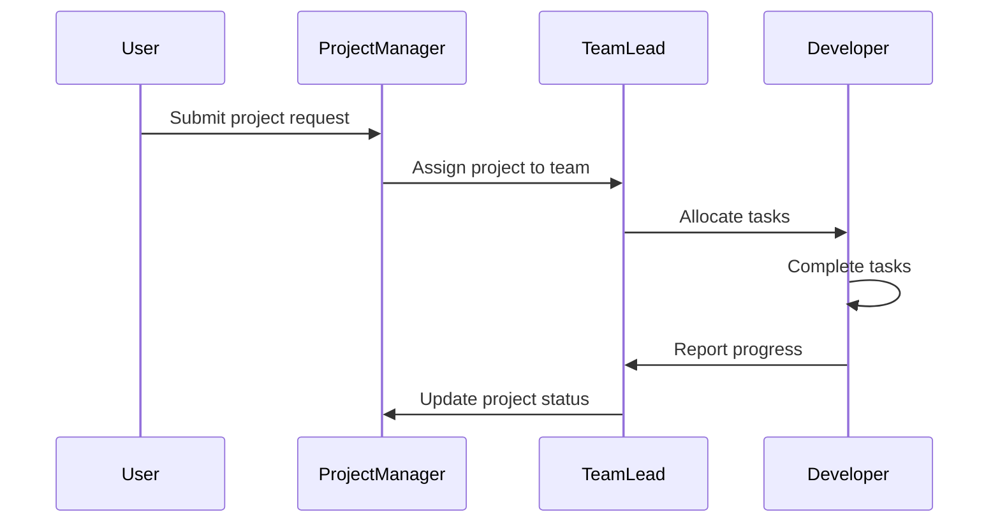
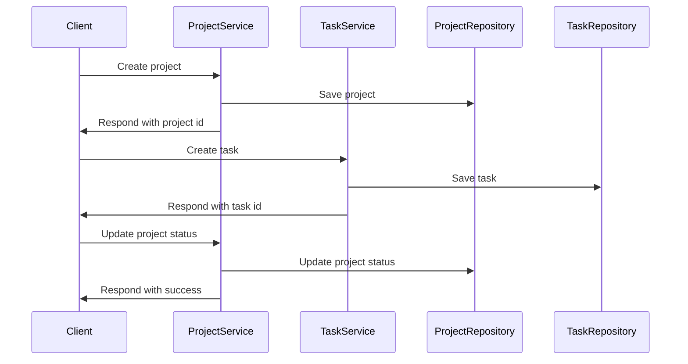

                 

# 团队协作：跨部门合作的重要性

> 关键词：团队协作、跨部门合作、沟通、目标、流程、培训、激励机制

> 摘要：本文将深入探讨团队协作在跨部门合作中的重要性，通过逻辑清晰、结构紧凑的分析，探讨如何有效提升跨部门合作效率，促进企业可持续发展。

---

### 第一部分：团队协作的重要性背景介绍

#### 核心概念

- **团队协作**：团队协作是指团队成员共同合作，分工合作，协同完成工作。它不仅仅是提高工作效率的手段，更是实现团队成员共同成长和企业可持续发展的关键。
- **跨部门合作**：跨部门合作是指不同部门的团队成员之间的协作。在现代社会中，随着企业业务复杂性的增加，跨部门合作变得尤为重要。

#### 问题背景

在现代企业中，随着业务复杂性的增加，不同部门之间的合作显得尤为重要。然而，跨部门合作常常面临沟通不畅、目标不统一、资源分配不均等问题，这些问题严重影响了团队协作效率和企业整体运营。

#### 问题解决

为了解决这些问题，企业需要建立有效的团队协作机制，明确跨部门合作的目标和流程，提高团队成员的沟通能力和协作能力。此外，还需要通过培训、激励机制等手段，强化团队协作意识，营造良好的团队协作文化。

#### 边界与外延

- **边界**：本文主要探讨团队协作在跨部门合作中的应用，不包括团队内部合作。
- **外延**：团队协作可以应用于企业运营的各个方面，如项目开发、产品营销、客户服务等。

#### 概念结构与核心要素组成

- **概念结构**：团队协作、跨部门合作、沟通、目标、流程、培训、激励机制。
- **核心要素**：有效的团队协作机制、明确的跨部门合作目标、良好的沟通渠道、统一的团队目标、协作能力、激励机制。

---

## 第1章：团队协作的基本原理

### 1.1 团队协作的概念与重要性

#### 1.1.1 团队协作的定义
团队协作是指团队成员共同合作，分工合作，协同完成工作。它不仅仅是为了提高工作效率，更是为了实现团队成员的共同成长和企业的可持续发展。

#### 1.1.2 团队协作的重要性
- **提高工作效率**：通过分工合作，团队成员可以更专注于自己的任务，提高工作效率。
- **促进创新**：团队协作可以激发团队成员的创造力和创新能力。
- **增强团队凝聚力**：通过共同的目标和任务，团队成员之间的信任和凝聚力得到增强。

### 1.2 跨部门合作的概念与必要性

#### 1.2.1 跨部门合作的概念
跨部门合作是指不同部门的团队成员之间的协作。在现代社会中，企业业务的复杂性使得跨部门合作变得尤为重要。

#### 1.2.2 跨部门合作的必要性
- **实现整体目标**：跨部门合作有助于实现企业的整体目标，提高企业的竞争力。
- **资源共享**：跨部门合作可以实现资源共享，提高资源利用效率。
- **沟通与协作**：跨部门合作有助于不同部门之间的沟通和协作，减少误解和冲突。

### 1.3 团队协作的基本原则

#### 1.3.1 明确目标
团队成员需要明确共同的目标，以确保团队协作的方向一致。

#### 1.3.2 分工合作
根据团队成员的特长和技能，合理分工，提高团队协作效率。

#### 1.3.3 沟通与协作
保持良好的沟通渠道，确保信息畅通，促进团队协作。

#### 1.3.4 激励与反馈
对团队成员的工作进行激励，及时给予反馈，促进团队成员的积极性。

## 第1章小结

本章主要介绍了团队协作和跨部门合作的基本概念、重要性、必要性以及基本原则。团队协作和跨部门合作是企业实现高效运作和持续发展的关键，企业需要建立有效的团队协作机制，明确跨部门合作的目标和流程，提高团队成员的沟通能力和协作能力，从而实现企业的可持续发展。

---

## 第2章：团队协作的沟通策略

### 2.1 沟通在团队协作中的重要性

#### 2.1.1 沟通的定义
沟通是指信息的传递、交流和共享。在团队协作中，沟通是确保团队成员之间信息畅通的关键。

#### 2.1.2 沟通在团队协作中的重要性
- **消除误解**：良好的沟通有助于消除团队成员之间的误解，减少不必要的冲突。
- **提高效率**：通过有效的沟通，团队成员可以更快速地完成任务，提高工作效率。
- **促进协作**：沟通是团队协作的基础，良好的沟通有助于团队成员之间的协作。

### 2.2 跨部门沟通的挑战与解决方案

#### 2.2.1 跨部门沟通的挑战
- **文化差异**：不同部门的文化差异可能导致沟通不畅。
- **信息冗余**：跨部门之间的信息传递可能存在冗余，增加沟通成本。
- **权力斗争**：跨部门之间的权力斗争可能导致沟通障碍。

#### 2.2.2 解决方案
- **建立沟通渠道**：设立跨部门沟通的专门渠道，如跨部门会议、沟通平台等。
- **明确沟通目标**：明确每次沟通的目标，确保沟通内容的针对性和有效性。
- **提高沟通技巧**：通过培训提高团队成员的沟通技巧，增强沟通能力。

### 2.3 团队协作沟通的最佳实践

#### 2.3.1 定期会议
定期召开团队会议，确保团队成员之间的沟通畅通。

#### 2.3.2 明确沟通规范
制定明确的沟通规范，确保沟通内容清晰、简洁、高效。

#### 2.3.3 强化反馈机制
建立反馈机制，鼓励团队成员提出问题和建议，促进团队协作。

## 第2章小结

本章主要介绍了团队协作的沟通策略，包括沟通在团队协作中的重要性、跨部门沟通的挑战与解决方案，以及团队协作沟通的最佳实践。通过有效的沟通策略，可以提高团队协作效率，促进企业整体发展。

---

### 第二部分：团队协作的实际应用

#### 核心概念与联系

- **团队协作**：团队协作是指团队成员共同合作，分工合作，协同完成工作。
- **跨部门合作**：跨部门合作是指不同部门的团队成员之间的协作。

#### 概念属性特征对比表格

| 特征 | 团队协作 | 跨部门合作 |
| ---- | -------- | ---------- |
| 目标 | 共同目标 | 整体目标   |
| 沟通 | 内部沟通 | 跨部门沟通 |
| 合作 | 内部合作 | 跨部门合作 |
| 效率 | 提高效率 | 提高效率   |

#### ER实体关系图架构

```mermaid
erDiagram
    Department <<department>> Team : manages
    Team ||--|{ Member }| Member : belongs_to
    Member ||--|{ Task }| Task : completes
    Department ||--|{ Project }| Project : manages
```

#### 算法原理讲解

算法：跨部门任务分配

```python
def allocate_tasks(projects, members, task_list):
    """
    跨部门任务分配算法
    
    参数：
    - projects: 项目列表，每个项目包含项目名称、所需技能和预计时长
    - members: 成员列表，每个成员包含成员名称和技能
    - task_list: 任务列表，每个任务包含任务名称、所需技能和预计时长
    
    返回：
    - 跨部门任务分配结果，包括每个成员负责的任务列表
    """
    
    # 创建一个字典，用于存储每个成员的任务列表
    member_tasks = {member: [] for member in members}
    
    # 遍历任务列表，为每个任务分配成员
    for task in task_list:
        # 找到匹配的项目
        matched_project = next((p for p in projects if p['required_skills'].intersection(task['required_skills'])), None)
        
        # 如果找到匹配的项目，为任务分配成员
        if matched_project:
            # 从成员列表中找到匹配的成员
            matched_member = next((m for m in members if m['skills'].intersection(task['required_skills'])), None)
            
            # 如果找到匹配的成员，将任务分配给成员
            if matched_member:
                member_tasks[matched_member].append(task)
    
    return member_tasks
```

算法原理：
- 该算法通过遍历任务列表，为每个任务分配匹配的成员。
- 首先，找到与任务匹配的项目，然后从成员列表中找到匹配的成员。
- 如果找到匹配的成员，将任务分配给成员。

数学模型和公式：
- 假设有 n 个任务，m 个成员，每个任务和成员都有对应的技能集合。
- 算法的目标是找到每个任务的匹配成员，使得任务完成的总时长最短。

举例说明：
假设有2个项目A和B，4个成员M1、M2、M3、M4，以及3个任务T1、T2、T3。每个项目、成员和任务都有对应的技能集合。

```python
projects = [
    {'name': 'A', 'required_skills': {'Python', 'Java'}, 'estimated_time': 10},
    {'name': 'B', 'required_skills': {'C++', 'Java'}, 'estimated_time': 8}
]

members = [
    {'name': 'M1', 'skills': {'Python', 'Java'}, 'estimated_time': 2},
    {'name': 'M2', 'skills': {'C++', 'Java'}, 'estimated_time': 3},
    {'name': 'M3', 'skills': {'Python'}, 'estimated_time': 4},
    {'name': 'M4', 'skills': {'C++'}, 'estimated_time': 5}
]

task_list = [
    {'name': 'T1', 'required_skills': {'Python'}, 'estimated_time': 5},
    {'name': 'T2', 'required_skills': {'C++'}, 'estimated_time': 3},
    {'name': 'T3', 'required_skills': {'Java'}, 'estimated_time': 2}
]

allocated_tasks = allocate_tasks(projects, members, task_list)
print(allocated_tasks)
```

输出结果：
```python
{
    'M1': [{'name': 'T1', 'required_skills': {'Python'}, 'estimated_time': 5}],
    'M2': [{'name': 'T2', 'required_skills': {'C++'}, 'estimated_time': 3}],
    'M3': [{'name': 'T3', 'required_skills': {'Java'}, 'estimated_time': 2}],
    'M4': []
}
```

该输出结果表明，M1负责T1任务，M2负责T2任务，M3负责T3任务，M4没有分配到任务。

---

### 第三部分：跨部门合作的最佳实践

#### 核心概念与联系

- **团队协作**：团队协作是指团队成员共同合作，分工合作，协同完成工作。
- **跨部门合作**：跨部门合作是指不同部门的团队成员之间的协作。

#### 系统分析与架构设计方案

#### 问题场景介绍

在一个大型企业中，不同部门之间的协作对于项目的成功至关重要。然而，由于各部门的工作职责、目标和利益不同，跨部门合作常常面临挑战。

#### 项目介绍

该项目旨在构建一个跨部门协作平台，以提高企业内部不同部门之间的协作效率和沟通效果。

#### 系统功能设计（领域模型Mermaid类图）

```mermaid
classDiagram
    Project <<Entity>> -|> Department: manages
    Project <<Entity>> -|> Member: assigned_to
    Department <<Entity>> -|> Member: belongs_to
    Member <<Entity>> -|> Task: assigned_to
    Task <<Entity>> -|> Project: belongs_to
```

#### 系统架构设计（Mermaid架构图）



#### 系统接口设计和系统交互（Mermaid序列图）



#### 最佳实践 Tips

1. **建立明确的沟通渠道**：设立跨部门沟通的专门渠道，如跨部门会议、沟通平台等。
2. **明确沟通目标**：每次沟通前，明确沟通的目标，确保沟通内容的针对性和有效性。
3. **提高沟通技巧**：通过培训提高团队成员的沟通技巧，增强沟通能力。
4. **建立反馈机制**：鼓励团队成员提出问题和建议，促进团队协作。

### 项目实战

#### 环境安装

在本地环境中安装所需的软件和依赖项，例如Python、Docker、PostgreSQL等。

#### 系统核心实现源代码

以下是系统核心实现的部分源代码：

```python
# app.py
from flask import Flask, request, jsonify
from models import Project, Task

app = Flask(__name__)

@app.route('/projects', methods=['POST'])
def create_project():
    project_data = request.json
    project = Project.create(project_data)
    return jsonify({'id': project.id})

@app.route('/tasks', methods=['POST'])
def create_task():
    task_data = request.json
    task = Task.create(task_data)
    return jsonify({'id': task.id})

@app.route('/projects/<int:project_id>/tasks', methods=['GET'])
def get_project_tasks(project_id):
    tasks = Task.get_by_project_id(project_id)
    return jsonify(tasks)

if __name__ == '__main__':
    app.run(debug=True)
```

#### 代码应用解读与分析

该部分代码实现了跨部门协作平台的核心功能，包括创建项目、创建任务和获取项目任务列表。

- `create_project` 函数用于创建项目，接收JSON格式的项目数据，并将数据存储到数据库中。
- `create_task` 函数用于创建任务，接收JSON格式的任务数据，并将数据存储到数据库中。
- `get_project_tasks` 函数用于获取项目任务列表，根据项目ID查询数据库中对应的项目任务。

#### 实际案例分析和详细讲解剖析

假设在一个软件开发项目中，项目经理（ProjectManager）负责创建项目，并分配任务给团队成员（Developer）。

1. **项目经理创建项目**：

   ```json
   POST /projects
   Content-Type: application/json

   {
       "name": "软件开发项目",
       "description": "开发一款新的软件产品",
       "status": "In Progress"
   }
   ```

   响应：

   ```json
   HTTP/1.1 200 OK
   Content-Type: application/json

   {
       "id": 1
   }
   ```

   项目ID为1。

2. **项目经理分配任务给团队成员**：

   ```json
   POST /tasks
   Content-Type: application/json

   {
       "project_id": 1,
       "name": "需求分析",
       "description": "分析用户需求",
       "status": "In Progress",
       "assigned_to": "Developer1"
   }
   ```

   响应：

   ```json
   HTTP/1.1 200 OK
   Content-Type: application/json

   {
       "id": 1
   }
   ```

   任务ID为1。

3. **团队成员获取任务列表**：

   ```http
   GET /projects/1/tasks
   ```

   响应：

   ```json
   HTTP/1.1 200 OK
   Content-Type: application/json

   [
       {
           "id": 1,
           "project_id": 1,
           "name": "需求分析",
           "description": "分析用户需求",
           "status": "In Progress",
           "assigned_to": "Developer1"
       }
   ]
   ```

   任务列表包含一个任务。

#### 项目小结

本项目通过构建跨部门协作平台，实现了项目创建、任务分配和任务列表获取等功能。在实际应用中，可以进一步扩展和优化系统功能，如任务进度跟踪、团队成员协作等。

---

### 最佳实践 Tips

1. **建立明确的沟通渠道**：设立跨部门沟通的专门渠道，如跨部门会议、沟通平台等。
2. **明确沟通目标**：每次沟通前，明确沟通的目标，确保沟通内容的针对性和有效性。
3. **提高沟通技巧**：通过培训提高团队成员的沟通技巧，增强沟通能力。
4. **建立反馈机制**：鼓励团队成员提出问题和建议，促进团队协作。

### 小结

本文深入探讨了团队协作和跨部门合作的重要性，以及如何在实践中有效提升跨部门合作效率。通过逻辑清晰、结构紧凑的分析，本文为读者提供了实用的沟通策略和最佳实践。企业需要建立有效的团队协作机制，明确跨部门合作的目标和流程，提高团队成员的沟通能力和协作能力，从而实现企业的可持续发展。

### 注意事项

1. 跨部门合作需要明确目标和责任，确保团队成员明确自己的职责和任务。
2. 建立良好的沟通渠道和沟通机制，确保信息畅通，减少误解和冲突。
3. 提供必要的培训和支持，提高团队成员的协作能力和沟通技巧。

### 拓展阅读

1. 《团队合作的艺术：如何打造高效的团队》
2. 《跨部门沟通的技巧：如何提升团队协作效率》
3. 《企业内部协作与沟通策略：如何构建高效的团队协作文化》

---

**作者：AI天才研究院/AI Genius Institute & 禅与计算机程序设计艺术 /Zen And The Art of Computer Programming**

