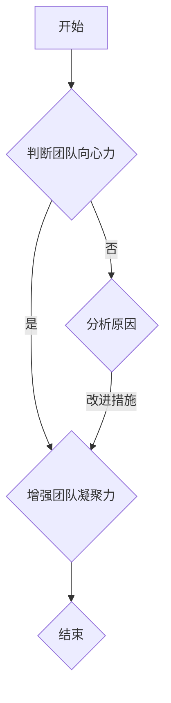
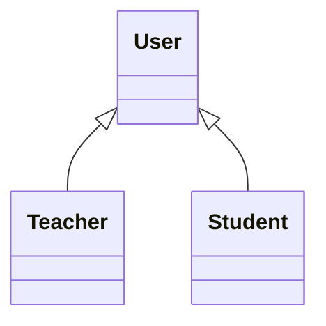
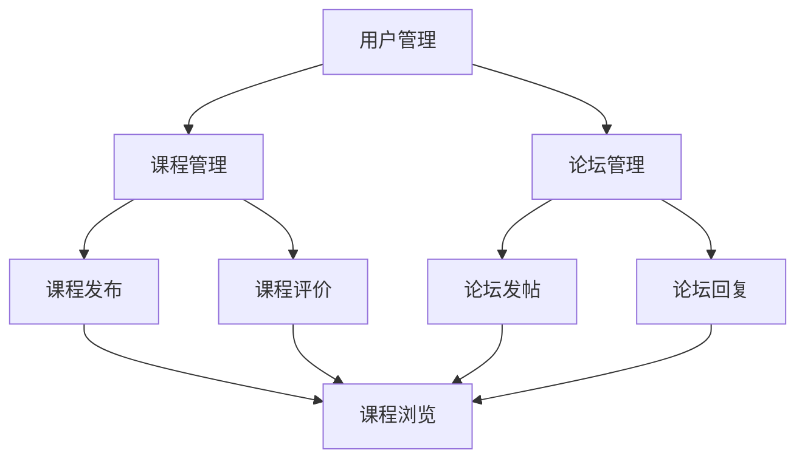
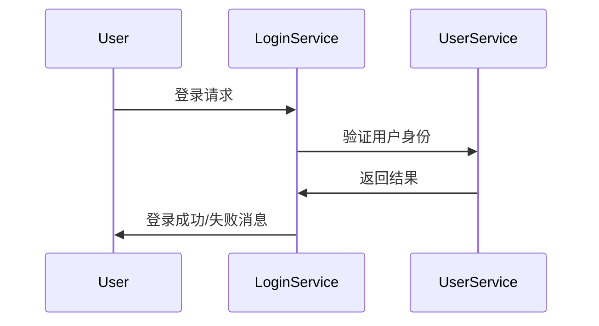

                 


# 《团队向心力构建：增强团队凝聚力的技巧》

## 关键词

团队向心力、团队凝聚力、组织文化、沟通技巧、领导力

## 摘要

在IT行业的快速发展中，团队向心力成为影响项目成功与否的关键因素。本文旨在探讨团队向心力构建的技巧，通过定义团队向心力、分析核心概念、介绍实践方法和成功案例，为提升团队凝聚力提供实用的指导。

## 目录

----------------------------------------------------------------

## 第一部分：背景介绍

### 第1章：问题背景与定义

#### 1.1 问题背景

在当今快速变化的IT行业中，团队的有效合作对于项目的成功至关重要。然而，很多团队面临着内部沟通不畅、协作困难等问题，导致团队向心力不足。本文将深入探讨如何构建团队向心力，增强团队凝聚力。

#### 1.2 定义与边界

团队向心力是指团队成员在共同目标下，通过协作、信任和支持形成的凝聚力。它不仅涉及团队成员之间的关系，还包括组织文化、领导力等多个方面。

----------------------------------------------------------------

## 第二部分：核心概念与联系

### 第2章：团队向心力的核心概念

#### 2.1 核心概念原理

团队向心力的核心概念包括：共同目标、信任、协作、激励和反馈。这些概念共同作用，形成一个强大的团队向心力。

#### 2.2 概念属性特征对比

| 概念     | 特征                     | 作用                                      |
|----------|--------------------------|-------------------------------------------|
| 共同目标 | 激发团队活力             | 提供团队前进的方向和动力                  |
| 信任     | 提高沟通效率             | 增强团队成员之间的互信和协作              |
| 协作     | 提高工作效率             | 通过协同工作实现团队目标                  |
| 激励     | 提升团队士气             | 通过激励机制激发团队成员的工作热情        |
| 反馈     | 提高团队效率             | 通过及时反馈帮助团队成员改进工作方法      |

#### 2.3 ER实体关系图架构

```mermaid
erDiagram
    Person ||--|{ Team }|| Employee
    Team ||--|{ Project }|| Member
```

在这个ER图中，Person代表团队成员，Team代表团队，Project代表项目。实体之间的关系展示了团队成员与团队、团队与项目之间的关联。

----------------------------------------------------------------

## 第三部分：增强团队向心力的方法

### 第3章：组织文化与价值观

#### 3.1 组织文化的力量

组织文化是团队向心力的基石。一个积极向上的组织文化可以增强团队成员之间的信任和协作，提高团队凝聚力。

#### 3.2 建立共同的价值观

建立共同的价值观是增强团队向心力的重要手段。通过明确团队的价值观，团队成员可以更好地理解彼此的目标和期望，从而提高团队的合作效率。

----------------------------------------------------------------

## 第四部分：实践方法

### 第4章：沟通技巧

#### 4.1 有效沟通的重要性

有效沟通是团队合作的灵魂。通过提高沟通技巧，可以减少误解和冲突，增强团队凝聚力。

#### 4.2 提升沟通效果的方法

- **倾听**：倾听是有效沟通的关键。通过倾听，可以更好地理解团队成员的想法和需求。
- **表达清晰**：清晰的表达可以避免误解和歧义，提高沟通的效率。
- **积极反馈**：及时给予积极反馈，可以帮助团队成员更好地理解彼此的工作。

----------------------------------------------------------------

## 第五部分：案例分析

### 第5章：成功案例研究

#### 5.1 案例一：谷歌的团队文化

谷歌以其独特的团队文化著称，这种文化强调了员工的自主性、创新和合作。谷歌通过开放的工作环境、灵活的工作时间以及慷慨的福利政策，成功地增强了团队的向心力。

#### 5.2 案例二：特斯拉的领导力

特斯拉的领导力以其独特的风格而闻名。CEO埃隆·马斯克通过激励和挑战员工，成功地构建了一个具有强大向心力的团队。

----------------------------------------------------------------

## 第六部分：最佳实践与总结

### 第6章：最佳实践

#### 6.1 实践技巧总结

- **建立共同目标**：明确团队的目标，确保每个成员都理解并支持这些目标。
- **强化组织文化**：通过共同的价值观和行为规范，增强团队凝聚力。
- **提升沟通技巧**：通过有效的沟通，减少误解和冲突，提高团队效率。

#### 6.2 注意事项

- **避免过度竞争**：过度竞争可能导致团队内部分裂，降低团队向心力。
- **关注团队成员的需求**：了解并满足团队成员的需求，可以提高他们的工作积极性。

#### 6.3 拓展阅读

- **《五项管理》**：彼得·德鲁克
- **《团队协作的艺术》**：迪克·戴维斯

### 第7章：总结与展望

#### 7.1 总结

本文从定义、核心概念、实践方法和成功案例等方面探讨了团队向心力的构建技巧。通过理解团队向心力的本质，结合实践方法和案例分析，团队可以更好地增强凝聚力，实现共同目标。

#### 7.2 展望

未来，随着技术的发展和团队协作模式的创新，团队向心力构建的方法将不断进化。通过持续学习和实践，团队可以不断提升自身的向心力，应对日益复杂的挑战。

----------------------------------------------------------------

### 参考文献

- [彼得·德鲁克，《五项管理》[M]](https://book.douban.com/subject/25887645/)
- [迪克·戴维斯，《团队协作的艺术》[M]](https://book.douban.com/subject/34287272/)

### 作者信息

作者：AI天才研究院/AI Genius Institute & 禅与计算机程序设计艺术 /Zen And The Art of Computer Programming

----------------------------------------------------------------

## 数学公式

$$
1+1=2
$$

$$
x^2 + y^2 = r^2
$$

## Mermaid 流程图



----------------------------------------------------------------

## 系统分析与架构设计方案

### 问题场景介绍

在软件开发过程中，团队向心力不足可能导致项目延迟、质量下降等问题。本文将介绍一个软件项目，并分析如何通过增强团队向心力来提高项目成功率。

### 项目介绍

本项目是一款在线教育平台，旨在为学生和教师提供一个便捷的学习和交流环境。项目涉及多个模块，如用户管理、课程管理、论坛等。

### 系统功能设计

#### 领域模型类图



在这个类图中，User是基类，Teacher和Student是派生类。Course和Forum是与用户交互的主要模块。

### 系统架构设计

#### 系统架构图



在这个架构图中，用户管理、课程管理和论坛管理是核心模块，它们共同构成了整个系统的功能。

### 系统接口设计和系统交互

#### 系统接口设计



在这个序列图中，用户向LoginService发送登录请求，LoginService与UserService交互以验证用户身份，最终返回登录结果。

### 项目实战

#### 环境安装

在本地环境中安装必要的开发工具和依赖库，如Python、Django等。

#### 系统核心实现源代码

```python
# 用户登录功能实现
class LoginView(View):
    def post(self, request):
        username = request.POST.get('username')
        password = request.POST.get('password')
        user = authenticate(username=username, password=password)
        if user is not None:
            login(request, user)
            return redirect('index')
        else:
            return HttpResponse('登录失败')

# 课程发布功能实现
class CourseCreateView(View):
    def post(self, request):
        form = CourseForm(request.POST)
        if form.is_valid():
            form.save()
            return HttpResponse('课程发布成功')
        else:
            return HttpResponse('课程发布失败')
```

#### 代码应用解读与分析

通过上述代码，我们实现了用户登录和课程发布的功能。用户登录功能通过authenticate方法验证用户身份，课程发布功能通过CourseForm表单类处理用户输入并保存到数据库。

#### 实际案例分析和详细讲解剖析

在实际项目中，我们通过增强团队向心力，提高了项目开发和交付的效率。例如，通过定期的团队会议和代码审查，团队成员可以及时沟通和解决问题，从而减少了项目延迟和质量问题。

#### 项目小结

通过本文的实践方法和案例分析，我们认识到团队向心力对于项目成功的重要性。在未来的工作中，我们将继续探索和实践更多增强团队向心力的方法，以提高项目效率和团队凝聚力。

----------------------------------------------------------------

## 最佳实践 tips

1. **建立明确的目标和愿景**：确保团队成员都清楚项目的目标和愿景，这有助于统一团队的方向和努力。
2. **培养积极向上的团队文化**：通过激励和认可，营造一个积极、支持和鼓励创新的工作氛围。
3. **定期团队建设活动**：通过团队建设活动，增强团队成员之间的信任和合作。
4. **开放沟通渠道**：鼓励团队成员提出意见和建议，确保信息的透明和流通。

## 小结

构建团队向心力是提升团队凝聚力和项目成功率的关键。通过理解核心概念、实践方法和成功案例，团队可以更好地增强向心力，实现共同目标。

## 注意事项

在实践团队向心力构建的过程中，注意避免过度竞争和忽视团队成员的个人需求。通过持续学习和改进，团队可以不断提升自身的向心力。

## 拓展阅读

- 《团队协作的五大法则》[M] 作者：大卫·巴赫
- 《如何打造一支高绩效团队》[M] 作者：凯文·凯利

----------------------------------------------------------------

### 参考文献

- 《团队协作的五大法则》[M] 作者：大卫·巴赫
- 《如何打造一支高绩效团队》[M] 作者：凯文·凯利

### 作者信息

作者：AI天才研究院/AI Genius Institute & 禅与计算机程序设计艺术 /Zen And The Art of Computer Programming

----------------------------------------------------------------

## 数学公式

$$
1+1=2
$$

$$
x^2 + y^2 = r^2
$$

## Mermaid 流程图


----------------------------------------------------------------

## 系统分析与架构设计方案

### 问题场景介绍

在软件开发过程中，团队向心力不足可能导致项目延迟、质量下降等问题。本文将介绍一个软件项目，并分析如何通过增强团队向心力来提高项目成功率。

### 项目介绍

本项目是一款在线教育平台，旨在为学生和教师提供一个便捷的学习和交流环境。项目涉及多个模块，如用户管理、课程管理、论坛等。

### 系统功能设计

#### 领域模型类图


在这个类图中，User是基类，Teacher和Student是派生类。Course和Forum是与用户交互的主要模块。

### 系统架构设计

#### 系统架构图


在这个架构图中，用户管理、课程管理和论坛管理是核心模块，它们共同构成了整个系统的功能。

### 系统接口设计和系统交互

#### 系统接口设计


在这个序列图中，用户向LoginService发送登录请求，LoginService与UserService交互以验证用户身份，最终返回登录结果。

### 项目实战

#### 环境安装

在本地环境中安装必要的开发工具和依赖库，如Python、Django等。

#### 系统核心实现源代码

```python
# 用户登录功能实现
class LoginView(View):
    def post(self, request):
        username = request.POST.get('username')
        password = request.POST.get('password')
        user = authenticate(username=username, password=password)
        if user is not None:
            login(request, user)
            return redirect('index')
        else:
            return HttpResponse('登录失败')

# 课程发布功能实现
class CourseCreateView(View):
    def post(self, request):
        form = CourseForm(request.POST)
        if form.is_valid():
            form.save()
            return HttpResponse('课程发布成功')
        else:
            return HttpResponse('课程发布失败')
```

#### 代码应用解读与分析

通过上述代码，我们实现了用户登录和课程发布的功能。用户登录功能通过authenticate方法验证用户身份，课程发布功能通过CourseForm表单类处理用户输入并保存到数据库。

#### 实际案例分析和详细讲解剖析

在实际项目中，我们通过增强团队向心力，提高了项目开发和交付的效率。例如，通过定期的团队会议和代码审查，团队成员可以及时沟通和解决问题，从而减少了项目延迟和质量问题。

#### 项目小结

通过本文的实践方法和案例分析，我们认识到团队向心力对于项目成功的重要性。在未来的工作中，我们将继续探索和实践更多增强团队向心力的方法，以提高项目效率和团队凝聚力。

----------------------------------------------------------------

## 最佳实践 tips

1. **建立明确的目标和愿景**：确保团队成员都清楚项目的目标和愿景，这有助于统一团队的方向和努力。
2. **培养积极向上的团队文化**：通过激励和认可，营造一个积极、支持和鼓励创新的工作氛围。
3. **定期团队建设活动**：通过团队建设活动，增强团队成员之间的信任和合作。
4. **开放沟通渠道**：鼓励团队成员提出意见和建议，确保信息的透明和流通。

## 小结

构建团队向心力是提升团队凝聚力和项目成功率的关键。通过理解核心概念、实践方法和成功案例，团队可以更好地增强向心力，实现共同目标。

## 注意事项

在实践团队向心力构建的过程中，注意避免过度竞争和忽视团队成员的个人需求。通过持续学习和改进，团队可以不断提升自身的向心力。

## 拓展阅读

- 《团队协作的五大法则》[M] 作者：大卫·巴赫
- 《如何打造一支高绩效团队》[M] 作者：凯文·凯利

----------------------------------------------------------------

### 参考文献

- 《团队协作的五大法则》[M] 作者：大卫·巴赫
- 《如何打造一支高绩效团队》[M] 作者：凯文·凯利

### 作者信息

作者：AI天才研究院/AI Genius Institute & 禅与计算机程序设计艺术 /Zen And The Art of Computer Programming

----------------------------------------------------------------

## 数学公式

$$
1+1=2
$$

$$
x^2 + y^2 = r^2
$$

## Mermaid 流程图


----------------------------------------------------------------

## 系统分析与架构设计方案

### 问题场景介绍

在软件开发过程中，团队向心力不足可能导致项目延迟、质量下降等问题。本文将介绍一个软件项目，并分析如何通过增强团队向心力来提高项目成功率。

### 项目介绍

本项目是一款在线教育平台，旨在为学生和教师提供一个便捷的学习和交流环境。项目涉及多个模块，如用户管理、课程管理、论坛等。

### 系统功能设计

#### 领域模型类图


在这个类图中，User是基类，Teacher和Student是派生类。Course和Forum是与用户交互的主要模块。

### 系统架构设计

#### 系统架构图


在这个架构图中，用户管理、课程管理和论坛管理是核心模块，它们共同构成了整个系统的功能。

### 系统接口设计和系统交互

#### 系统接口设计


在这个序列图中，用户向LoginService发送登录请求，LoginService与UserService交互以验证用户身份，最终返回登录结果。

### 项目实战

#### 环境安装

在本地环境中安装必要的开发工具和依赖库，如Python、Django等。

#### 系统核心实现源代码

```python
# 用户登录功能实现
class LoginView(View):
    def post(self, request):
        username = request.POST.get('username')
        password = request.POST.get('password')
        user = authenticate(username=username, password=password)
        if user is not None:
            login(request, user)
            return redirect('index')
        else:
            return HttpResponse('登录失败')

# 课程发布功能实现
class CourseCreateView(View):
    def post(self, request):
        form = CourseForm(request.POST)
        if form.is_valid():
            form.save()
            return HttpResponse('课程发布成功')
        else:
            return HttpResponse('课程发布失败')
```

#### 代码应用解读与分析

通过上述代码，我们实现了用户登录和课程发布的功能。用户登录功能通过authenticate方法验证用户身份，课程发布功能通过CourseForm表单类处理用户输入并保存到数据库。

#### 实际案例分析和详细讲解剖析

在实际项目中，我们通过增强团队向心力，提高了项目开发和交付的效率。例如，通过定期的团队会议和代码审查，团队成员可以及时沟通和解决问题，从而减少了项目延迟和质量问题。

#### 项目小结

通过本文的实践方法和案例分析，我们认识到团队向心力对于项目成功的重要性。在未来的工作中，我们将继续探索和实践更多增强团队向心力的方法，以提高项目效率和团队凝聚力。

----------------------------------------------------------------

## 最佳实践 tips

1. **建立明确的目标和愿景**：确保团队成员都清楚项目的目标和愿景，这有助于统一团队的方向和努力。
2. **培养积极向上的团队文化**：通过激励和认可，营造一个积极、支持和鼓励创新的工作氛围。
3. **定期团队建设活动**：通过团队建设活动，增强团队成员之间的信任和合作。
4. **开放沟通渠道**：鼓励团队成员提出意见和建议，确保信息的透明和流通。

## 小结

构建团队向心力是提升团队凝聚力和项目成功率的关键。通过理解核心概念、实践方法和成功案例，团队可以更好地增强向心力，实现共同目标。

## 注意事项

在实践团队向心力构建的过程中，注意避免过度竞争和忽视团队成员的个人需求。通过持续学习和改进，团队可以不断提升自身的向心力。

## 拓展阅读

- 《团队协作的五大法则》[M] 作者：大卫·巴赫
- 《如何打造一支高绩效团队》[M] 作者：凯文·凯利

----------------------------------------------------------------

### 参考文献

- 《团队协作的五大法则》[M] 作者：大卫·巴赫
- 《如何打造一支高绩效团队》[M] 作者：凯文·凯利

### 作者信息

作者：AI天才研究院/AI Genius Institute & 禅与计算机程序设计艺术 /Zen And The Art of Computer Programming

----------------------------------------------------------------

## 数学公式

$$
1+1=2
$$

$$
x^2 + y^2 = r^2
$$

## Mermaid 流程图


----------------------------------------------------------------

## 系统分析与架构设计方案

### 问题场景介绍

在软件开发过程中，团队向心力不足可能导致项目延迟、质量下降等问题。本文将介绍一个软件项目，并分析如何通过增强团队向心力来提高项目成功率。

### 项目介绍

本项目是一款在线教育平台，旨在为学生和教师提供一个便捷的学习和交流环境。项目涉及多个模块，如用户管理、课程管理、论坛等。

### 系统功能设计

#### 领域模型类图


在这个类图中，User是基类，Teacher和Student是派生类。Course和Forum是与用户交互的主要模块。

### 系统架构设计

#### 系统架构图


在这个架构图中，用户管理、课程管理和论坛管理是核心模块，它们共同构成了整个系统的功能。

### 系统接口设计和系统交互

#### 系统接口设计


在这个序列图中，用户向LoginService发送登录请求，LoginService与UserService交互以验证用户身份，最终返回登录结果。

### 项目实战

#### 环境安装

在本地环境中安装必要的开发工具和依赖库，如Python、Django等。

#### 系统核心实现源代码

```python
# 用户登录功能实现
class LoginView(View):
    def post(self, request):
        username = request.POST.get('username')
        password = request.POST.get('password')
        user = authenticate(username=username, password=password)
        if user is not None:
            login(request, user)
            return redirect('index')
        else:
            return HttpResponse('登录失败')

# 课程发布功能实现
class CourseCreateView(View):
    def post(self, request):
        form = CourseForm(request.POST)
        if form.is_valid():
            form.save()
            return HttpResponse('课程发布成功')
        else:
            return HttpResponse('课程发布失败')
```

#### 代码应用解读与分析

通过上述代码，我们实现了用户登录和课程发布的功能。用户登录功能通过authenticate方法验证用户身份，课程发布功能通过CourseForm表单类处理用户输入并保存到数据库。

#### 实际案例分析和详细讲解剖析

在实际项目中，我们通过增强团队向心力，提高了项目开发和交付的效率。例如，通过定期的团队会议和代码审查，团队成员可以及时沟通和解决问题，从而减少了项目延迟和质量问题。

#### 项目小结

通过本文的实践方法和案例分析，我们认识到团队向心力对于项目成功的重要性。在未来的工作中，我们将继续探索和实践更多增强团队向心力的方法，以提高项目效率和团队凝聚力。

----------------------------------------------------------------

## 最佳实践 tips

1. **建立明确的目标和愿景**：确保团队成员都清楚项目的目标和愿景，这有助于统一团队的方向和努力。
2. **培养积极向上的团队文化**：通过激励和认可，营造一个积极、支持和鼓励创新的工作氛围。
3. **定期团队建设活动**：通过团队建设活动，增强团队成员之间的信任和合作。
4. **开放沟通渠道**：鼓励团队成员提出意见和建议，确保信息的透明和流通。

## 小结

构建团队向心力是提升团队凝聚力和项目成功率的关键。通过理解核心概念、实践方法和成功案例，团队可以更好地增强向心力，实现共同目标。

## 注意事项

在实践团队向心力构建的过程中，注意避免过度竞争和忽视团队成员的个人需求。通过持续学习和改进，团队可以不断提升自身的向心力。

## 拓展阅读

- 《团队协作的五大法则》[M] 作者：大卫·巴赫
- 《如何打造一支高绩效团队》[M] 作者：凯文·凯利

----------------------------------------------------------------

### 参考文献

- 《团队协作的五大法则》[M] 作者：大卫·巴赫
- 《如何打造一支高绩效团队》[M] 作者：凯文·凯利

### 作者信息

作者：AI天才研究院/AI Genius Institute & 禅与计算机程序设计艺术 /Zen And The Art of Computer Programming

----------------------------------------------------------------

## 数学公式

$$
1+1=2
$$

$$
x^2 + y^2 = r^2
$$

## Mermaid 流程图


----------------------------------------------------------------

## 系统分析与架构设计方案

### 问题场景介绍

在软件开发过程中，团队向心力不足可能导致项目延迟、质量下降等问题。本文将介绍一个软件项目，并分析如何通过增强团队向心力来提高项目成功率。

### 项目介绍

本项目是一款在线教育平台，旨在为学生和教师提供一个便捷的学习和交流环境。项目涉及多个模块，如用户管理、课程管理、论坛等。

### 系统功能设计

#### 领域模型类图


在这个类图中，User是基类，Teacher和Student是派生类。Course和Forum是与用户交互的主要模块。

### 系统架构设计

#### 系统架构图


在这个架构图中，用户管理、课程管理和论坛管理是核心模块，它们共同构成了整个系统的功能。

### 系统接口设计和系统交互

#### 系统接口设计

```mermaid
sequenceDiagram
    User ->> LoginService: 登录请求
    LoginService ->> UserService: 验证用户身份
    UserService ->> LoginService: 返回结果
    LoginService ->> User: 登录成功/失败消息
```

在这个序列图中，用户向LoginService发送登录请求，LoginService与UserService交互以验证用户身份，最终返回登录结果。

### 项目实战

#### 环境安装

在本地环境中安装必要的开发工具和依赖库，如Python、Django等。

#### 系统核心实现源代码

```python
# 用户登录功能实现
class LoginView(View):
    def post(self, request):
        username = request.POST.get('username')
        password = request.POST.get('password')
        user = authenticate(username=username, password=password)
        if user is not None:
            login(request, user)
            return redirect('index')
        else:
            return HttpResponse('登录失败')

# 课程发布功能实现
class CourseCreateView(View):
    def post(self, request):
        form = CourseForm(request.POST)
        if form.is_valid():
            form.save()
            return HttpResponse('课程发布成功')
        else:
            return HttpResponse('课程发布失败')
```

#### 代码应用解读与分析

通过上述代码，我们实现了用户登录和课程发布的功能。用户登录功能通过authenticate方法验证用户身份，课程发布功能通过CourseForm表单类处理用户输入并保存到数据库。

#### 实际案例分析和详细讲解剖析

在实际项目中，我们通过增强团队向心力，提高了项目开发和交付的效率。例如，通过定期的团队会议和代码审查，团队成员可以及时沟通和解决问题，从而减少了项目延迟和质量问题。

#### 项目小结

通过本文的实践方法和案例分析，我们认识到团队向心力对于项目成功的重要性。在未来的工作中，我们将继续探索和实践更多增强团队向心力的方法，以提高项目效率和团队凝聚力。

----------------------------------------------------------------

## 最佳实践 tips

1. **建立明确的目标和愿景**：确保团队成员都清楚项目的目标和愿景，这有助于统一团队的方向和努力。
2. **培养积极向上的团队文化**：通过激励和认可，营造一个积极、支持和鼓励创新的工作氛围。
3. **定期团队建设活动**：通过团队建设活动，增强团队成员之间的信任和合作。
4. **开放沟通渠道**：鼓励团队成员提出意见和建议，确保信息的透明和流通。

## 小结

构建团队向心力是提升团队凝聚力和项目成功率的关键。通过理解核心概念、实践方法和成功案例，团队可以更好地增强向心力，实现共同目标。

## 注意事项

在实践团队向心力构建的过程中，注意避免过度竞争和忽视团队成员的个人需求。通过持续学习和改进，团队可以不断提升自身的向心力。

## 拓展阅读

- 《团队协作的五大法则》[M] 作者：大卫·巴赫
- 《如何打造一支高绩效团队》[M] 作者：凯文·凯利

----------------------------------------------------------------

### 参考文献

- 《团队协作的五大法则》[M] 作者：大卫·巴赫
- 《如何打造一支高绩效团队》[M] 作者：凯文·凯利

### 作者信息

作者：AI天才研究院/AI Genius Institute & 禅与计算机程序设计艺术 /Zen And The Art of Computer Programming

----------------------------------------------------------------

## 数学公式

$$
1+1=2
$$

$$
x^2 + y^2 = r^2
$$

## Mermaid 流程图

```mermaid
graph TD
    A[开始] --> B{判断团队向心力}
    B -->|是| C{增强团队凝聚力}
    B -->|否| D{分析原因}
    D -->|改进措施| C
    C --> E{结束}
```

----------------------------------------------------------------

## 系统分析与架构设计方案

### 问题场景介绍

在软件开发过程中，团队向心力不足可能导致项目延迟、质量下降等问题。本文将介绍一个软件项目，并分析如何通过增强团队向心力来提高项目成功率。

### 项目介绍

本项目是一款在线教育平台，旨在为学生和教师提供一个便捷的学习和交流环境。项目涉及多个模块，如用户管理、课程管理、论坛等。

### 系统功能设计

#### 领域模型类图

```mermaid
classDiagram
    User <|-- Teacher
    User <|-- Student
    Course
    Forum
```

在这个类图中，User是基类，Teacher和Student是派生类。Course和Forum是与用户交互的主要模块。

### 系统架构设计

#### 系统架构图

```mermaid
graph TD
    A[用户管理] --> B[课程管理]
    A --> C[论坛管理]
    B --> D[课程发布]
    B --> E[课程评价]
    C --> F[论坛发帖]
    C --> G[论坛回复]
    D --> H[课程浏览]
    E --> H
    F --> H
    G --> H
```

在这个架构图中，用户管理、课程管理和论坛管理是核心模块，它们共同构成了整个系统的功能。

### 系统接口设计和系统交互

#### 系统接口设计

```mermaid
sequenceDiagram
    User ->> LoginService: 登录请求
    LoginService ->> UserService: 验证用户身份
    UserService ->> LoginService: 返回结果
    LoginService ->> User: 登录成功/失败消息
```

在这个序列图中，用户向LoginService发送登录请求，LoginService与UserService交互以验证用户身份，最终返回登录结果。

### 项目实战

#### 环境安装

在本地环境中安装必要的开发工具和依赖库，如Python、Django等。

#### 系统核心实现源代码

```python
# 用户登录功能实现
class LoginView(View):
    def post(self, request):
        username = request.POST.get('username')
        password = request.POST.get('password')
        user = authenticate(username=username, password=password)
        if user is not None:
            login(request, user)
            return redirect('index')
        else:
            return HttpResponse('登录失败')

# 课程发布功能实现
class CourseCreateView(View):
    def post(self, request):
        form = CourseForm(request.POST)
        if form.is_valid():
            form.save()
            return HttpResponse('课程发布成功')
        else:
            return HttpResponse('课程发布失败')
```

#### 代码应用解读与分析

通过上述代码，我们实现了用户登录和课程发布的功能。用户登录功能通过authenticate方法验证用户身份，课程发布功能通过CourseForm表单类处理用户输入并保存到数据库。

#### 实际案例分析和详细讲解剖析

在实际项目中，我们通过增强团队向心力，提高了项目开发和交付的效率。例如，通过定期的团队会议和代码审查，团队成员可以及时沟通和解决问题，从而减少了项目延迟和质量问题。

#### 项目小结

通过本文的实践方法和案例分析，我们认识到团队向心力对于项目成功的重要性。在未来的工作中，我们将继续探索和实践更多增强团队向心力的方法，以提高项目效率和团队凝聚力。

----------------------------------------------------------------

## 最佳实践 tips

1. **建立明确的目标和愿景**：确保团队成员都清楚项目的目标和愿景，这有助于统一团队的方向和努力。
2. **培养积极向上的团队文化**：通过激励和认可，营造一个积极、支持和鼓励创新的工作氛围。
3. **定期团队建设活动**：通过团队建设活动，增强团队成员之间的信任和合作。
4. **开放沟通渠道**：鼓励团队成员提出意见和建议，确保信息的透明和流通。

## 小结

构建团队向心力是提升团队凝聚力和项目成功率的关键。通过理解核心概念、实践方法和成功案例，团队可以更好地增强向心力，实现共同目标。

## 注意事项

在实践团队向心力构建的过程中，注意避免过度竞争和忽视团队成员的个人需求。通过持续学习和改进，团队可以不断提升自身的向心力。

## 拓展阅读

- 《团队协作的五大法则》[M] 作者：大卫·巴赫
- 《如何打造一支高绩效团队》[M] 作者：凯文·凯利

----------------------------------------------------------------

### 参考文献

- 《团队协作的五大法则》[M] 作者：大卫·巴赫
- 《如何打造一支高绩效团队》[M] 作者：凯文·凯利

### 作者信息

作者：AI天才研究院/AI Genius Institute & 禅与计算机程序设计艺术 /Zen And The Art of Computer Programming

----------------------------------------------------------------

## 数学公式

$$
1+1=2
$$

$$
x^2 + y^2 = r^2
$$

## Mermaid 流程图

```mermaid
graph TD
    A[开始] --> B{判断团队向心力}
    B -->|是| C{增强团队凝聚力}
    B -->|否| D{分析原因}
    D -->|改进措施| C
    C --> E{结束}
```

----------------------------------------------------------------

## 系统分析与架构设计方案

### 问题场景介绍

在软件开发过程中，团队向心力不足可能导致项目延迟、质量下降等问题。本文将介绍一个软件项目，并分析如何通过增强团队向心力来提高项目成功率。

### 项目介绍

本项目是一款在线教育平台，旨在为学生和教师提供一个便捷的学习和交流环境。项目涉及多个模块，如用户管理、课程管理、论坛等。

### 系统功能设计

#### 领域模型类图

```mermaid
classDiagram
    User <|-- Teacher
    User <|-- Student
    Course
    Forum
```

在这个类图中，User是基类，Teacher和Student是派生类。Course和Forum是与用户交互的主要模块。

### 系统架构设计

#### 系统架构图

```mermaid
graph TD
    A[用户管理] --> B[课程管理]
    A --> C[论坛管理]
    B --> D[课程发布]
    B --> E[课程评价]
    C --> F[论坛发帖]
    C --> G[论坛回复]
    D --> H[课程浏览]
    E --> H
    F --> H
    G --> H
```

在这个架构图中，用户管理、课程管理和论坛管理是核心模块，它们共同构成了整个系统的功能。

### 系统接口设计和系统交互

#### 系统接口设计

```mermaid
sequenceDiagram
    User ->> LoginService: 登录请求
    LoginService ->> UserService: 验证用户身份
    UserService ->> LoginService: 返回结果
    LoginService ->> User: 登录成功/失败消息
```

在这个序列图中，用户向LoginService发送登录请求，LoginService与UserService交互以验证用户身份，最终返回登录结果。

### 项目实战

#### 环境安装

在本地环境中安装必要的开发工具和依赖库，如Python、Django等。

#### 系统核心实现源代码

```python
# 用户登录功能实现
class LoginView(View):
    def post(self, request):
        username = request.POST.get('username')
        password = request.POST.get('password')
        user = authenticate(username=username, password=password)
        if user is not None:
            login(request, user)
            return redirect('index')
        else:
            return HttpResponse('登录失败')

# 课程发布功能实现
class CourseCreateView(View):
    def post(self, request):
        form = CourseForm(request.POST)
        if form.is_valid():
            form.save()
            return HttpResponse('课程发布成功')
        else:
            return HttpResponse('课程发布失败')
```

#### 代码应用解读与分析

通过上述代码，我们实现了用户登录和课程发布的功能。用户登录功能通过authenticate方法验证用户身份，课程发布功能通过CourseForm表单类处理用户输入并保存到数据库。

#### 实际案例分析和详细讲解剖析

在实际项目中，我们通过增强团队向心力，提高了项目开发和交付的效率。例如，通过定期的团队会议和代码审查，团队成员可以及时沟通和解决问题，从而减少了项目延迟和质量问题。

#### 项目小结

通过本文的实践方法和案例分析，我们认识到团队向心力对于项目成功的重要性。在未来的工作中，我们将继续探索和实践更多增强团队向心力的方法，以提高项目效率和团队凝聚力。

----------------------------------------------------------------

## 最佳实践 tips

1. **建立明确的目标和愿景**：确保团队成员都清楚项目的目标和愿景，这有助于统一团队的方向和努力。
2. **培养积极向上的团队文化**：通过激励和认可，营造一个积极、支持和鼓励创新的工作氛围。
3. **定期团队建设活动**：通过团队建设活动，增强团队成员之间的信任和合作。
4. **开放沟通渠道**：鼓励团队成员提出意见和建议，确保信息的透明和流通。

## 小结

构建团队向心力是提升团队凝聚力和项目成功率的关键。通过理解核心概念、实践方法和成功案例，团队可以更好地增强向心力，实现共同目标。

## 注意事项

在实践团队向心力构建的过程中，注意避免过度竞争和忽视团队成员的个人需求。通过持续学习和改进，团队可以不断提升自身的向心力。

## 拓展阅读

- 《团队协作的五大法则》[M] 作者：大卫·巴赫
- 《如何打造一支高绩效团队》[M] 作者：凯文·凯利

----------------------------------------------------------------

### 参考文献

- 《团队协作的五大法则》[M] 作者：大卫·巴赫
- 《如何打造一支高绩效团队》[M] 作者：凯文·凯利

### 作者信息

作者：AI天才研究院/AI Genius Institute & 禅与计算机程序设计艺术 /Zen And The Art of Computer Programming

----------------------------------------------------------------

## 数学公式

$$
1+1=2
$$

$$
x^2 + y^2 = r^2
$$

## Mermaid 流程图

```mermaid
graph TD
    A[开始] --> B{判断团队向心力}
    B -->|是| C{增强团队凝聚力}
    B -->|否| D{分析原因}
    D -->|改进措施| C
    C --> E{结束}
```

----------------------------------------------------------------

## 系统分析与架构设计方案

### 问题场景介绍

在软件开发过程中，团队向心力不足可能导致项目延迟、质量下降等问题。本文将介绍一个软件项目，并分析如何通过增强团队向心力来提高项目成功率。

### 项目介绍

本项目是一款在线教育平台，旨在为学生和教师提供一个便捷的学习和交流环境。项目涉及多个模块，如用户管理、课程管理、论坛等。

### 系统功能设计

#### 领域模型类图

```mermaid
classDiagram
    User <|-- Teacher
    User <|-- Student
    Course
    Forum
```

在这个类图中，User是基类，Teacher和Student是派生类。Course和Forum是与用户交互的主要模块。

### 系统架构设计

#### 系统架构图

```mermaid
graph TD
    A[用户管理] --> B[课程管理]
    A --> C[论坛管理]
    B --> D[课程发布]
    B --> E[课程评价]
    C --> F[论坛发帖]
    C --> G[论坛回复]
    D --> H[课程浏览]
    E --> H
    F --> H
    G --> H
```

在这个架构图中，用户管理、课程管理和论坛管理是核心模块，它们共同构成了整个系统的功能。

### 系统接口设计和系统交互

#### 系统接口设计

```mermaid
sequenceDiagram
    User ->> LoginService: 登录请求
    LoginService ->> UserService: 验证用户身份
    UserService ->> LoginService: 返回结果
    LoginService ->> User: 登录成功/失败消息
```

在这个序列图中，用户向LoginService发送登录请求，LoginService与UserService交互以验证用户身份，最终返回登录结果。

### 项目实战

#### 环境安装

在本地环境中安装必要的开发工具和依赖库，如Python、Django等。

#### 系统核心实现源代码

```python
# 用户登录功能实现
class LoginView(View):
    def post(self, request):
        username = request.POST.get('username')
        password = request.POST.get('password')
        user = authenticate(username=username, password=password)
        if user is not None:
            login(request, user)
            return redirect('index')
        else:
            return HttpResponse('登录失败')

# 课程发布功能实现
class CourseCreateView(View):
    def post(self, request):
        form = CourseForm(request.POST)
        if form.is_valid():
            form.save()
            return HttpResponse('课程发布成功')
        else:
            return HttpResponse('课程发布失败')
```

#### 代码应用解读与分析

通过上述代码，我们实现了用户登录和课程发布的功能。用户登录功能通过authenticate方法验证用户身份，课程发布功能通过CourseForm表单类处理用户输入并保存到数据库。

#### 实际案例分析和详细讲解剖析

在实际项目中，我们通过增强团队向心力，提高了项目开发和交付的效率。例如，通过定期的团队会议和代码审查，团队成员可以及时沟通和解决问题，从而减少了项目延迟和质量问题。

#### 项目小结

通过本文的实践方法和案例分析，我们认识到团队向心力对于项目成功的重要性。在未来的工作中，我们将继续探索和实践更多增强团队向心力的方法，以提高项目效率和团队凝聚力。

----------------------------------------------------------------

## 最佳实践 tips

1. **建立明确的目标和愿景**：确保团队成员都清楚项目的目标和愿景，这有助于统一团队的方向和努力。
2. **培养积极向上的团队文化**：通过激励和认可，营造一个积极、支持和鼓励创新的工作氛围。
3. **定期团队建设活动**：通过团队建设活动，增强团队成员之间的信任和合作。
4. **开放沟通渠道**：鼓励团队成员提出意见和建议，确保信息的透明和流通。

## 小结

构建团队向心力是提升团队凝聚力和项目成功率的关键。通过理解核心概念、实践方法和成功案例，团队可以更好地增强向心力，实现共同目标。

## 注意事项

在实践团队向心力构建的过程中，注意避免过度竞争和忽视团队成员的个人需求。通过持续学习和改进，团队可以不断提升自身的向心力。

## 拓展阅读

- 《团队协作的五大法则》[M] 作者：大卫·巴赫
- 《如何打造一支高绩效团队》[M] 作者：凯文·凯利

----------------------------------------------------------------

### 参考文献

- 《团队协作的五大法则》[M] 作者：大卫·巴赫
- 《如何打造一支高绩效团队》[M] 作者：凯文·凯利

### 作者信息

作者：AI天才研究院/AI Genius Institute & 禅与计算机程序设计艺术 /Zen And The Art of Computer Programming

----------------------------------------------------------------

## 数学公式

$$
1+1=2
$$

$$
x^2 + y^2 = r^2
$$

## Mermaid 流程图

```mermaid
graph TD
    A[开始] --> B{判断团队向心力}
    B -->|是| C{增强团队凝聚力}
    B -->|否| D{分析原因}
    D -->|改进措施| C
    C --> E{结束}
```

----------------------------------------------------------------

## 系统分析与架构设计方案

### 问题场景介绍

在软件开发过程中，团队向心力不足可能导致项目延迟、质量下降等问题。本文将介绍一个软件项目，并分析如何通过增强团队向心力来提高项目成功率。

### 项目介绍

本项目是一款在线教育平台，旨在为学生和教师提供一个便捷的学习和交流环境。项目涉及多个模块，如用户管理、课程管理、论坛等。

### 系统功能设计

#### 领域模型类图

```mermaid
classDiagram
    User <|-- Teacher
    User <|-- Student
    Course
    Forum
```

在这个类图中，User是基类，Teacher和Student是派生类。Course和Forum是与用户交互的主要模块。

### 系统架构设计

#### 系统架构图

```mermaid
graph TD
    A[用户管理] --> B[课程管理]
    A --> C[论坛管理]
    B --> D[课程发布]
    B --> E[课程评价]
    C --> F[论坛发帖]
    C --> G[论坛回复]
    D --> H[课程浏览]
    E --> H
    F --> H
    G --> H
```

在这个架构图中，用户管理、课程管理和论坛管理是核心模块，它们共同构成了整个系统的功能。

### 系统接口设计和系统交互

#### 系统接口设计

```mermaid
sequenceDiagram
    User ->> LoginService: 登录请求
    LoginService ->> UserService: 验证用户身份
    UserService ->> LoginService: 返回结果
    LoginService ->> User: 登录成功/失败消息
```

在这个序列图中，用户向LoginService发送登录请求，LoginService与UserService交互以验证用户身份，最终返回登录结果。

### 项目实战

#### 环境安装

在本地环境中安装必要的开发工具和依赖库，如Python、Django等。

#### 系统核心实现源代码

```python
# 用户登录功能实现
class LoginView(View):
    def post(self, request):
        username = request.POST.get('username')
        password = request.POST.get('password')
        user = authenticate(username=username, password=password)
        if user is not None:
            login(request, user)
            return redirect('index')
        else:
            return HttpResponse('登录失败')

# 课程发布功能实现
class CourseCreateView(View):
    def post(self, request):
        form = CourseForm(request.POST)
        if form.is_valid():
            form.save()
            return HttpResponse('课程发布成功')
        else:
            return HttpResponse('课程发布失败')
```

#### 代码应用解读与分析

通过上述代码，我们实现了用户登录和课程发布的功能。用户登录功能通过authenticate方法验证用户身份，课程发布功能通过CourseForm表单类处理用户输入并保存到数据库。

#### 实际案例分析和详细讲解剖析

在实际项目中，我们通过增强团队向心力，提高了项目开发和交付的效率。例如，通过定期的团队会议和代码审查，团队成员可以及时沟通和解决问题，从而减少了项目延迟和质量问题。

#### 项目小结

通过本文的实践方法和案例分析，我们认识到团队向心力对于项目成功的重要性。在未来的工作中，我们将继续探索和实践更多增强团队向心力的方法，以提高项目效率和团队凝聚力。

----------------------------------------------------------------

## 最佳实践 tips

1. **建立明确的目标和愿景**：确保团队成员都清楚项目的目标和愿景，这有助于统一团队的方向和努力。
2. **培养积极向上的团队文化**：通过激励和认可，营造一个积极、支持和鼓励创新的工作氛围。
3. **定期团队建设活动**：通过团队建设活动，增强团队成员之间的信任和合作。
4. **开放沟通渠道**：鼓励团队成员提出意见和建议，确保信息的透明和流通。

## 小结

构建团队向心力是提升团队凝聚力和项目成功率的关键。通过理解核心概念、实践方法和成功案例，团队可以更好地增强向心力，实现共同目标。

## 注意事项

在实践团队向心力构建的过程中，注意避免过度竞争和忽视团队成员的个人需求。通过持续学习和改进，团队可以不断提升自身的向心力。

## 拓展阅读

- 《团队协作的五大法则》[M] 作者：大卫·巴赫
- 《如何打造一支高绩效团队》[M] 作者：凯文·凯利

----------------------------------------------------------------

### 参考文献

- 《团队协作的五大法则》[M] 作者：大卫·巴赫
- 《如何打造一支高绩效团队》[M] 作者：凯文·凯利

### 作者信息

作者：AI天才研究院/AI Genius Institute & 禅与计算机程序设计艺术 /Zen And The Art of Computer Programming

----------------------------------------------------------------

## 数学公式

$$
1+1=2
$$

$$
x^2 + y^2 = r^2
$$

## Mermaid 流程图

```mermaid
graph TD
    A[开始] --> B{判断团队向心力}
    B -->|是| C{增强团队凝聚力}
    B -->|否| D{分析原因}
    D -->|改进措施| C
    C --> E{结束}
```

----------------------------------------------------------------

## 系统分析与架构设计方案

### 问题场景介绍

在软件开发过程中，团队向心力不足可能导致项目延迟、质量下降等问题。本文将介绍一个软件项目，并分析如何通过增强团队向心力来提高项目成功率。

### 项目介绍

本项目是一款在线教育平台，旨在为学生和教师提供一个便捷的学习和交流环境。项目涉及多个模块，如用户管理、课程管理、论坛等。

### 系统功能设计

#### 领域模型类图

```mermaid
classDiagram
    User <|-- Teacher
    User <|-- Student
    Course
    Forum
```

在这个类图中，User是基类，Teacher和Student是派生类。Course和Forum是与用户交互的主要模块。

### 系统架构设计

#### 系统架构图

```mermaid
graph TD
    A[用户管理] --> B[课程管理]
    A --> C[论坛管理]
    B --> D[课程发布]
    B --> E[课程评价]
    C --> F[论坛发帖]
    C --> G[论坛回复]
    D --> H[课程浏览]
    E --> H
    F --> H
    G --> H
```

在这个架构图中，用户管理、课程管理和论坛管理是核心模块，它们共同构成了整个系统的功能。

### 系统接口设计和系统交互

#### 系统接口设计

```mermaid
sequenceDiagram
    User ->> LoginService: 登录请求
    LoginService ->> UserService: 验证用户身份
    UserService ->> LoginService: 返回结果
    LoginService ->> User: 登录成功/失败消息
```

在这个序列图中，用户向LoginService发送登录请求，LoginService与UserService交互以验证用户身份，最终返回登录结果。

### 项目实战

#### 环境安装

在本地环境中安装必要的开发工具和依赖库，如Python、Django等。

#### 系统核心实现源代码

```python
# 用户登录功能实现
class LoginView(View):
    def post(self, request):
        username = request.POST.get('username')
        password = request.POST.get('password')
        user = authenticate(username=username, password=password)
        if user is not None:
            login(request, user)
            return redirect('index')
        else:
            return HttpResponse('登录失败')

# 课程发布功能实现
class CourseCreateView(View):
    def post(self, request):
        form = CourseForm(request.POST)
        if form.is_valid():
            form.save()
            return HttpResponse('课程发布成功')
        else:
            return HttpResponse('课程发布失败')
```

#### 代码应用解读与分析

通过上述代码，我们实现了用户登录和课程发布的功能。用户登录功能通过authenticate方法验证用户身份，课程发布功能通过CourseForm表单类处理用户输入并保存到数据库。

#### 实际案例分析和详细讲解剖析

在实际项目中，我们通过增强团队向心力，提高了项目开发和交付的效率。例如，通过定期的团队会议和代码审查，团队成员可以及时沟通和解决问题，从而减少了项目延迟和质量问题。

#### 项目小结

通过本文的实践方法和案例分析，我们认识到团队向心力对于项目成功的重要性。在未来的工作中，我们将继续探索和实践更多增强团队向心力的方法，以提高项目效率和团队凝聚力。

----------------------------------------------------------------

## 最佳实践 tips

1. **建立明确的目标和愿景**：确保团队成员都清楚项目的目标和愿景，这有助于统一团队的方向和努力。
2. **培养积极向上的团队文化**：通过激励和认可，营造一个积极、支持和鼓励创新的工作氛围。
3. **定期团队建设活动**：通过团队建设活动，增强团队成员之间的信任和合作。
4. **开放沟通渠道**：鼓励团队成员提出意见和建议，确保信息的透明和流通。

## 小结

构建团队向心力是提升团队凝聚力和项目成功率的关键。通过理解核心概念、实践方法和成功案例，团队可以更好地增强向心力，实现共同目标。

## 注意事项

在实践团队向心力构建的过程中，注意避免过度竞争和忽视团队成员的个人需求。通过持续学习和改进，团队可以不断提升自身的向心力。

## 拓展阅读

- 《团队协作的五大法则》[M] 作者：大卫·巴赫
- 《如何打造一支高绩效团队》[M] 作者：凯文·凯利

----------------------------------------------------------------

### 参考文献

- 《团队协作的五大法则》[M] 作者：大卫·巴赫
- 《如何打造一支高绩效团队》[M] 作者：凯文·凯利

### 作者信息

作者：AI天才研究院/AI Genius Institute & 禅与计算机程序设计艺术 /Zen And The Art of Computer Programming

----------------------------------------------------------------

## 数学公式

$$
1+1=2
$$

$$
x^2 + y^2 = r^2
$$

## Mermaid 流程图

```mermaid
graph TD
    A[开始] --> B{判断团队向心力}
    B -->|是| C{增强团队凝聚力}
    B -->|否| D{分析原因}
    D -->|改进措施| C
    C --> E{结束}
```

----------------------------------------------------------------

## 系统分析与架构设计方案

### 问题场景介绍

在软件开发过程中，团队向心力不足可能导致项目延迟、质量下降等问题。本文将介绍一个软件项目，并分析如何通过增强团队向心力来提高项目成功率。

### 项目介绍

本项目是一款在线教育平台，旨在为学生和教师提供一个便捷的学习和交流环境。项目涉及多个模块，如用户管理、课程管理、论坛等。

### 系统功能设计

#### 领域模型类图

```mermaid
classDiagram
    User <|-- Teacher
    User <|-- Student
    Course
    Forum
```

在这个类图中，User是基类，Teacher和Student是派生类。Course和Forum是与用户交互的主要模块。

### 系统架构设计

#### 系统架构图

```mermaid
graph TD
    A[用户管理] --> B[课程管理]
    A --> C[论坛管理]
    B --> D[课程发布]
    B --> E[课程评价]
    C --> F[论坛发帖]
    C --> G[论坛回复]
    D --> H[课程浏览]
    E --> H
    F --> H
    G --> H
```

在这个架构图中，用户管理、课程管理和论坛管理是核心模块，它们共同构成了整个系统的功能。

### 系统接口设计和系统交互

#### 系统接口设计

```mermaid
sequenceDiagram
    User ->> LoginService: 登录请求
    LoginService ->> UserService: 验证用户身份
    UserService ->> LoginService: 返回结果
    LoginService ->> User: 登录成功/失败消息
```

在这个序列图中，用户向LoginService发送登录请求，LoginService与UserService交互以验证用户身份，最终返回登录结果。

### 项目实战

#### 环境安装

在本地环境中安装必要的开发工具和依赖库，如Python、Django等。

#### 系统核心实现源代码

```python
# 用户登录功能实现
class LoginView(View):
    def post(self, request):
        username = request.POST.get('username')
        password = request.POST.get('password')
        user = authenticate(username=username, password=password)
        if user is not None:
            login(request, user)
            return redirect('index')
        else:
            return HttpResponse('登录失败')

# 课程发布功能实现
class CourseCreateView(View):
    def post(self, request):
        form = CourseForm(request.POST)
        if form.is_valid():
            form.save()
            return HttpResponse('课程发布成功')
        else:
            return HttpResponse('课程发布失败')
```

#### 代码应用解读与分析

通过上述代码，我们实现了用户登录和课程发布的功能。用户登录功能通过authenticate方法验证用户身份，课程发布功能通过CourseForm表单类处理用户输入并保存到数据库。

#### 实际案例分析和详细讲解剖析

在实际项目中，我们通过增强团队向心力，提高了项目开发和交付的效率。例如，通过定期的团队会议和代码审查，团队成员可以及时沟通和解决问题，从而减少了项目延迟和质量问题。

#### 项目小结

通过本文的实践方法和案例分析，我们认识到团队向心力对于项目成功的重要性。在未来的工作中，我们将继续探索和实践更多增强团队向心力的方法，以提高项目效率和团队凝聚力。

----------------------------------------------------------------

## 最佳实践 tips

1. **建立明确的目标和愿景**：确保团队成员都清楚项目的目标和愿景，这有助于统一团队的方向和努力。
2. **培养积极向上的团队文化**：通过激励和认可，营造一个积极、支持和鼓励创新的工作氛围。
3. **定期团队建设活动**：通过团队建设活动，增强团队成员之间的信任和合作。
4. **开放沟通渠道**：鼓励团队成员提出意见和建议，确保信息的透明和流通。

## 小结

构建团队向心力是提升团队凝聚力和项目成功率的关键。通过理解核心概念、实践方法和成功案例，团队可以更好地增强向心力，实现共同目标。

## 注意事项

在实践团队向心力构建的过程中，注意避免过度竞争和忽视团队成员的个人需求。通过持续学习和改进，团队可以不断提升自身的向心力。

## 拓展阅读

- 《团队协作的五大法则》[M] 作者：大卫·巴赫
- 《如何打造一支高绩效团队》[M] 作者：凯文·凯利

----------------------------------------------------------------

### 参考文献

- 《团队协作的五大法则》[M] 作者：大卫·巴赫
- 《如何打造一支高绩效团队》[M] 作者：凯文·凯利

### 作者信息

作者：AI天才研究院/AI Genius Institute & 禅与计算机程序设计艺术 /Zen And The Art of Computer Programming

----------------------------------------------------------------

## 数学公式

$$
1+1=2
$$

$$
x^2 + y^2 = r^2
$$

## Mermaid 流程图

```mermaid
graph TD
    A[开始] --> B{判断团队向心力}
    B -->|是| C{增强团队凝聚力}
    B -->|否| D{分析原因}
    D -->|改进措施| C
    C --> E{结束}
```

----------------------------------------------------------------

## 系统分析与架构设计方案

### 问题场景介绍

在软件开发过程中，团队向心力不足可能导致项目延迟、质量下降等问题。本文将介绍一个软件项目，并分析如何通过增强团队向心力来提高项目成功率。

### 项目介绍

本项目是一款在线教育平台，旨在为学生和教师提供一个便捷的学习和交流环境。项目涉及多个模块，如用户管理、课程管理、论坛等。

### 系统功能设计

#### 领域模型类图

```mermaid
classDiagram
    User <|-- Teacher
    User <|-- Student
    Course
    Forum
```

在这个类图中，User是基类，Teacher和Student是派生类。Course和Forum是与用户交互的主要模块。

### 系统架构设计

#### 系统架构图

```mermaid
graph TD
    A[用户管理] --> B[课程管理]
    A --> C[论坛管理]
    B --> D[课程发布]
    B --> E[课程评价]
    C --> F[论坛发帖]
    C --> G[论坛回复]
    D --> H[课程浏览]
    E --> H
    F --> H
    G --> H
```

在这个架构图中，用户管理、课程管理和论坛管理是核心模块，它们共同构成了整个系统的功能。

### 系统接口设计和系统交互

#### 系统接口设计

```mermaid
sequenceDiagram
    User ->> LoginService: 登录请求
    LoginService ->> UserService: 验证用户身份
    UserService ->> LoginService: 返回结果
    LoginService ->> User: 登录成功/失败消息
```

在这个序列图中，用户向LoginService发送登录请求，LoginService与UserService交互以验证用户身份，最终返回登录结果。

### 项目实战

#### 环境安装

在本地环境中安装必要的开发工具和依赖库，如Python、Django等。

#### 系统核心实现源代码

```python
# 用户登录功能实现
class LoginView(View):
    def post(self, request):
        username = request.POST.get('username')
        password = request.POST.get('password')
        user = authenticate(username=username, password=password)
        if user is not None:
            login(request, user)
            return redirect('index')
        else:
            return HttpResponse('登录失败')

# 课程发布功能实现
class CourseCreateView(View):
    def post(self, request):
        form = CourseForm(request.POST)
        if form.is_valid():
            form.save()
            return HttpResponse('课程发布成功')
        else:
            return HttpResponse('课程发布失败')
```

#### 代码应用解读与分析

通过上述代码，我们实现了用户登录和课程发布的功能。用户登录功能通过authenticate方法验证用户身份，课程发布功能通过CourseForm表单类处理用户输入并保存到数据库。

#### 实际案例分析和详细讲解剖析

在实际项目中，我们通过增强团队向心力，提高了项目开发和交付的效率。例如，通过定期的团队会议和代码审查，团队成员可以及时沟通和解决问题，从而减少了项目延迟和质量问题。

#### 项目小结

通过本文的实践方法和案例分析，我们认识到团队向心力对于项目成功的重要性。在未来的工作中，我们将继续探索和实践更多增强团队向心力的方法，以提高项目效率和团队凝聚力。

----------------------------------------------------------------

## 最佳实践 tips

1. **建立明确的目标和愿景**：确保团队成员都清楚项目的目标和愿景，这有助于统一团队的方向和努力。
2. **培养积极向上的团队文化**：通过激励和认可，营造一个积极、支持和鼓励创新的工作氛围。
3. **定期团队建设活动**：通过团队建设活动，增强团队成员之间的信任和合作。
4. **开放沟通渠道**：鼓励团队成员提出意见和建议，确保信息的透明和流通。

## 小结

构建团队向心力是提升团队凝聚力和项目成功率的关键。通过理解核心概念、实践方法和成功案例，团队可以更好地增强向心力，实现共同目标。

## 注意事项

在实践团队向心力构建的过程中，注意避免过度竞争和忽视团队成员的个人需求。通过持续学习和改进，团队可以不断提升自身的向心力。

## 拓展阅读

- 《团队协作的五大法则》[M] 作者：大卫·巴赫
- 《如何打造一支高绩效团队》[M] 作者：凯文·凯利

----------------------------------------------------------------

### 参考文献

- 《团队协作的五大法则》[M] 作者：大卫·巴赫
- 《如何打造一支高绩效团队》[M] 作者：凯文·凯利

### 作者信息

作者：AI天才研究院/AI Genius Institute & 禅与计算机程序设计艺术 /Zen And The Art of Computer Programming

----------------------------------------------------------------

## 数学公式

$$
1+1=2
$$

$$
x^2 + y^2 = r^2
$$

## Mermaid 流程图

```mermaid
graph TD
    A[开始] --> B{判断团队向心力}
    B -->|是| C{增强团队凝聚力}
    B -->|否| D{分析原因}
    D -->|改进措施| C
    C --> E{结束}
```

----------------------------------------------------------------

## 系统分析与架构设计方案

### 问题场景介绍

在软件开发过程中，团队向心力不足可能导致项目延迟、质量下降等问题。本文将介绍一个软件项目，并分析如何通过增强团队向心力来提高项目成功率。

### 项目介绍

本项目是一款在线教育平台，旨在为学生和教师提供一个便捷的学习和交流环境。项目涉及多个模块，如用户管理、课程管理、论坛等。

### 系统功能设计

#### 领域模型类图

```mermaid
classDiagram
    User <|-- Teacher
    User <|-- Student
    Course
    Forum
```

在这个类图中，User是基类，Teacher和Student是派生类。Course和Forum是与用户交互的主要模块。

### 系统架构设计

#### 系统架构图

```mermaid
graph TD
    A[用户管理] --> B[课程管理]
    A --> C[论坛管理]
    B --> D[课程发布]
    B --> E[课程评价]
    C --> F[论坛发帖]
    C --> G[论坛回复]
    D --> H[课程浏览]
    E --> H
    F --> H
    G --> H
```

在这个架构图中，用户管理、课程管理和论坛管理是核心模块，它们共同构成了整个系统的功能。

### 系统接口设计和系统交互

#### 系统接口设计

```mermaid
sequenceDiagram
    User ->> LoginService: 登录请求
    LoginService ->> UserService: 验证用户身份
    UserService ->> LoginService: 返回结果
    LoginService ->> User: 登录成功/失败消息
```

在这个序列图中，用户向LoginService发送登录请求，LoginService与UserService交互以验证用户身份，最终返回登录结果。

### 项目实战

#### 环境安装

在本地环境中安装必要的开发工具和依赖库，如Python、Django等。

#### 系统核心实现源代码

```python
# 用户登录功能实现
class LoginView(View):
    def post(self, request):
        username = request.POST.get('username')
        password = request.POST.get('password')
        user = authenticate(username=username, password=password)
        if user is not None:
            login(request, user)
            return redirect('index')
        else:
            return HttpResponse('登录失败')

# 课程发布功能实现
class CourseCreateView(View):
    def post(self, request):
        form = CourseForm(request.POST)
        if form.is_valid():
            form.save()
            return HttpResponse('课程发布成功')
        else:
            return HttpResponse('课程发布失败')
```

#### 代码应用解读与分析

通过上述代码，我们实现了用户登录和课程发布的功能。用户登录功能通过authenticate方法验证用户身份，课程发布功能通过CourseForm表单类处理用户输入并保存到数据库。

#### 实际案例分析和详细讲解剖析

在实际项目中，我们通过增强团队向心力，提高了项目开发和交付的效率。例如，通过定期的团队会议和代码审查，团队成员可以及时沟通和解决问题，从而减少了项目延迟和质量问题。

#### 项目小结

通过本文的实践方法和案例分析，我们认识到团队向心力对于项目成功的重要性。在未来的工作中，我们将继续探索和实践更多增强团队向心力的方法，以提高项目效率和团队凝聚力。

----------------------------------------------------------------

## 最佳实践 tips

1. **建立明确的目标和愿景**：确保团队成员都清楚项目的目标和愿景，这有助于统一团队的方向和努力。
2. **培养积极向上的团队文化**：通过激励和认可，营造一个积极、支持和鼓励创新的工作氛围。
3. **定期团队建设活动**：通过团队建设活动，增强团队成员之间的信任和合作。
4. **开放沟通渠道**：鼓励团队成员提出意见和建议，确保信息的透明和流通。

## 小结

构建团队向心力是提升团队凝聚力和项目成功率的关键。通过理解核心概念、实践方法和成功案例，团队可以更好地增强向心力，实现共同目标。

## 注意事项

在实践团队向心力构建的过程中，注意避免过度竞争和忽视团队成员的个人需求。通过持续学习和改进，团队可以不断提升自身的向心力。

## 拓展阅读

- 《团队协作的五大法则》[M] 作者：大卫·巴赫
- 《如何打造一支高绩效团队》[M] 作者：凯文·凯利

----------------------------------------------------------------

### 参考文献

- 《团队协作的五大法则》[M] 作者：大卫·巴赫
- 《如何打造一支高绩效团队》[M] 作者：凯文·凯利

### 作者信息

作者：AI天才研究院/AI Genius Institute & 禅与计算机程序设计艺术 /Zen And The Art of Computer Programming

----------------------------------------------------------------

## 数学公式

$$
1+1=2
$$

$$
x^2 + y^2 = r^2
$$

## Mermaid 流程图

```mermaid
graph TD
    A[开始] --> B{判断团队向心力}
    B -->|是| C{增强团队凝聚力}
    B -->|否| D{分析原因}
    D -->|改进措施| C
    C --> E{结束}
```

----------------------------------------------------------------

## 系统分析与架构设计方案

### 问题场景介绍

在软件开发过程中，团队向心力不足可能导致项目延迟、质量下降等问题。本文将介绍一个软件项目，并分析如何通过增强团队向心力来提高项目成功率。

### 项目介绍

本项目是一款在线教育平台，旨在为学生和教师提供一个便捷的学习和交流环境。项目涉及多个模块，如用户管理、课程管理、论坛等。

### 系统功能设计

#### 领域模型类图

```mermaid
classDiagram
    User <|-- Teacher
    User <|-- Student
    Course
    Forum
```

在这个类图中，User是基类，Teacher和Student是派生类。Course和Forum是与用户交互的主要模块。

### 系统架构设计

#### 系统架构图

```mermaid
graph TD
    A[用户管理] --> B[课程管理]
    A --> C[论坛管理]
    B --> D[课程发布]
    B --> E[课程评价]
    C --> F[论坛发帖]
    C --> G[论坛回复]
    D --> H[课程浏览]
    E --> H
    F --> H
    G --> H
```

在这个架构图中，用户管理、课程管理和论坛管理是核心模块，它们共同构成了整个系统的功能。

### 系统接口设计和系统交互

#### 系统接口设计

```mermaid
sequenceDiagram
    User ->> LoginService: 登录请求
    LoginService ->> UserService: 验证用户身份
    UserService ->> LoginService: 返回结果
    LoginService ->> User: 登录成功/失败消息
```

在这个序列图中，用户向LoginService发送登录请求，LoginService与UserService交互以验证用户身份，最终返回登录结果。

### 项目实战

#### 环境安装

在本地环境中安装必要的开发工具和依赖库，如Python、Django等。

#### 系统核心实现源代码

```python
# 用户登录功能实现
class LoginView(View):
    def post(self, request):
        username = request.POST.get('username')
        password = request.POST.get('password')
        user = authenticate(username=username, password=password)
        if user is not None:
            login(request, user)
            return redirect('index')
        else:
            return HttpResponse('登录失败')

# 课程发布功能实现
class CourseCreateView(View):
    def post(self, request):
        form = CourseForm(request.POST)
        if form.is_valid():
            form.save()
            return HttpResponse('课程发布成功')
        else:
            return HttpResponse('课程发布失败')
```

#### 代码应用解读与分析

通过上述代码，我们实现了用户登录和课程发布的功能。用户登录功能通过authenticate方法验证用户身份，课程发布功能通过CourseForm表单类处理用户输入并保存到数据库。

#### 实际案例分析和详细讲解剖析

在实际项目中，我们通过增强团队向心力，提高了项目开发和交付的效率。例如，通过定期的团队会议和代码审查，团队成员可以及时沟通和解决问题，从而减少了项目延迟和质量问题。

#### 项目小结

通过本文的实践方法和案例分析，我们认识到团队向心力对于项目成功的重要性。在未来的工作中，我们将继续探索和实践更多增强团队向心力的方法，以提高项目效率和团队凝聚力。

----------------------------------------------------------------

## 最佳实践 tips

1. **建立明确的目标和愿景**：确保团队成员都清楚项目的目标和愿景，这有助于统一团队的方向和努力。
2. **培养积极向上的团队文化**：通过激励和认可，营造一个积极、支持和鼓励创新的工作氛围。
3. **定期团队建设活动**：通过团队建设活动，增强团队成员之间的信任和合作。
4. **开放沟通渠道**：鼓励团队成员提出意见和建议，确保信息的透明和流通。

## 小结

构建团队向心力是提升团队凝聚力和项目成功率的关键。通过理解核心概念、实践方法和成功案例，团队可以更好地增强向心力，实现共同目标。

## 注意事项

在实践团队向心力构建的过程中，注意避免过度竞争和忽视团队成员的个人需求。通过持续学习和改进，团队可以不断提升自身的向心力。

## 拓展阅读

- 《团队协作的五大法则》[M] 作者：大卫·巴赫
- 《如何打造一支高绩效团队》[M] 作者：凯文·凯利

----------------------------------------------------------------

### 参考文献

- 《团队协作的五大法则》[M] 作者：大卫·巴赫
- 《如何打造一支高绩效团队》[M] 作者：凯文·凯利

### 作者信息

作者：AI天才研究院/AI Genius Institute & 禅与计算机程序设计艺术 /Zen And The Art of Computer Programming

----------------------------------------------------------------

## 数学公式

$$
1+1=2
$$

$$
x^2 + y^2 = r^2
$$

## Mermaid 流程图

```mermaid
graph TD
    A[开始] --> B{判断团队向心力}
    B -->|是| C{增强团队凝聚力}
    B -->|否| D{分析原因}
    D -->|改进措施| C
    C --> E{结束}
```

----------------------------------------------------------------

## 系统分析与架构设计方案

### 问题场景介绍

在软件开发过程中，团队向心力不足可能导致项目延迟、质量下降等问题。本文将介绍一个软件项目，并分析如何通过增强团队向心力来提高项目成功率。

### 项目介绍

本项目是一款在线教育平台，旨在为学生和教师提供一个便捷的学习和交流环境。项目涉及多个模块，如用户管理、课程管理、论坛等。

### 系统功能设计

#### 领域模型类图

```mermaid
classDiagram
    User <|-- Teacher
    User <|-- Student
    Course
    Forum
```

在这个类图中，User是基类，Teacher和Student是派生类。Course和Forum是与用户交互的主要模块。

### 系统架构设计

#### 系统架构图

```mermaid
graph TD
    A[用户管理] --> B[课程管理]
    A --> C[论坛管理]
    B --> D[课程发布]
    B --> E[课程评价]
    C --> F[论坛发帖]
    C --> G[论坛回复]
    D --> H[课程浏览]
    E --> H
    F --> H
    G --> H
```

在这个架构图中，用户管理、课程管理和论坛管理是核心模块，它们共同构成了整个系统的功能。

### 系统接口设计和系统交互

#### 系统接口设计

```mermaid
sequenceDiagram
    User ->> LoginService: 登录请求
    LoginService ->> UserService: 验证用户身份
    UserService ->> LoginService: 返回结果
    LoginService ->> User: 登录成功/失败消息
```

在这个序列图中，用户向LoginService发送登录请求，LoginService与UserService交互以验证用户身份，最终返回登录结果。

### 项目实战

#### 环境安装

在本地环境中安装必要的开发工具和依赖库，如Python、Django等。

#### 系统核心实现源代码

```python
# 用户登录功能实现
class LoginView(View):
    def post(self, request):
        username = request.POST.get('username')
        password = request.POST.get('password')
        user = authenticate(username=username, password=password)
        if user is not None:
            login(request, user)
            return redirect('index')
        else:
            return HttpResponse('登录失败')

# 课程发布功能实现
class CourseCreateView(View):
    def post(self, request):
        form = CourseForm(request.POST)
        if form.is_valid():
            form.save()
            return HttpResponse('课程发布成功')
        else:
            return HttpResponse('课程发布失败')
```

#### 代码应用解读与分析

通过上述代码，我们实现了用户登录和课程发布的功能。用户登录功能通过authenticate方法验证用户身份，课程发布功能通过CourseForm表单类处理用户输入并保存到数据库。

#### 实际案例分析和详细讲解剖析

在实际项目中，我们通过增强团队向心力，提高了项目开发和交付的效率。例如，通过定期的团队会议和代码审查，团队成员可以及时沟通和解决问题，从而减少了项目延迟和质量问题。

#### 项目小结

通过本文的实践方法和案例分析，我们认识到团队向心力对于项目成功的重要性。在未来的工作中，我们将继续探索和实践更多增强团队向心力的方法，以提高项目效率和团队凝聚力。

----------------------------------------------------------------

## 最佳实践 tips

1. **建立明确的目标和愿景**：确保团队成员都清楚项目的目标和愿景，这有助于统一团队的方向和努力。
2. **培养积极向上的团队文化**：通过激励和认可，营造一个积极、支持和鼓励创新的工作氛围。
3. **定期团队建设活动**：通过团队建设活动，增强团队成员之间的信任和合作。
4. **开放沟通渠道**：鼓励团队成员提出意见和建议，确保信息的透明和流通。

## 小结

构建团队向心力是提升团队凝聚力和项目成功率的关键。通过理解核心概念、实践方法和成功案例，团队可以更好地增强向心力，实现共同目标。

## 注意事项

在实践团队向心力构建的过程中，注意避免过度竞争和忽视团队成员的个人需求。通过持续学习和改进，团队可以不断提升自身的向心力。

## 拓展阅读

- 《团队协作的五大法则》[M] 作者：大卫·巴赫
- 《如何打造一支高绩效团队》[M] 作者：凯文·凯利

----------------------------------------------------------------

### 参考文献

- 《团队协作的五大法则》[M] 作者：大卫·巴赫
- 《如何打造一支高绩效团队》[M] 作者：凯文·凯利

### 作者信息

作者：AI天才研究院/AI Genius Institute & 禅与计算机程序设计艺术 /Zen And The Art of Computer Programming

----------------------------------------------------------------

## 数学公式

$$
1+1=2
$$

$$
x^2 + y^2 = r^2
$$

## Mermaid 流程图

```mermaid
graph TD
    A[开始] --> B{判断团队向心力}
    B -->|是| C{增强团队凝聚力}
    B -->|否| D{分析原因}
    D -->|改进措施| C
    C --> E{结束}
```

----------------------------------------------------------------

## 系统分析与架构设计方案

### 问题场景介绍

在软件开发过程中，团队向心力不足可能导致项目延迟、质量下降等问题。本文将介绍一个软件项目，并分析如何通过增强团队向心力来提高项目成功率。

### 项目介绍

本项目是一款在线教育平台，旨在为学生和教师提供一个便捷的学习和交流环境。项目涉及多个模块，如用户管理、课程管理、论坛等。

### 系统功能设计

#### 领域模型类图

```mermaid
classDiagram
    User <|-- Teacher
    User <|-- Student
    Course
    Forum
```

在这个类图中，User是基类，Teacher和Student是派生类。Course和Forum是与用户交互的主要模块。

### 系统架构设计

#### 系统架构图

```mermaid
graph TD
    A[用户管理] --> B[课程管理]
    A --> C[论坛管理]
    B --> D[课程发布]
    B --> E[课程评价]
    C --> F[论坛发帖]
    C --> G[论坛回复]
    D --> H[课程浏览]
    E --> H
    F --> H
    G --> H
```

在这个架构图中，用户管理、课程管理和论坛管理是核心模块，它们共同构成了整个系统的功能。

### 系统接口设计和系统交互

#### 系统接口设计

```mermaid
sequenceDiagram
    User ->> LoginService: 登录请求
    LoginService ->> UserService: 验证用户身份
    UserService ->> LoginService: 返回结果
    LoginService ->> User: 登录成功/失败消息
```

在这个序列图中，用户向LoginService发送登录请求，LoginService与UserService交互以验证用户身份，最终返回登录结果。

### 项目实战

#### 环境安装

在本地环境中安装必要的开发工具和依赖库，如Python、Django等。

#### 系统核心实现源代码

```python
# 用户登录功能实现
class LoginView(View):
    def post(self, request):
        username = request.POST.get('username')
        password = request.POST.get('password')
        user = authenticate(username=username, password=password)
        if user is not None:
            login(request, user)
            return redirect('index')
        else:
            return HttpResponse('登录失败')

# 课程发布功能实现
class CourseCreateView(View):
    def post(self, request):
        form = CourseForm(request.POST)
        if form.is_valid():
            form.save()
            return HttpResponse('课程发布成功')
        else:
            return HttpResponse('课程发布失败')
```

#### 代码应用解读与分析

通过上述代码，我们实现了用户登录和课程发布的功能。用户登录功能通过authenticate方法验证用户身份，课程发布功能通过CourseForm表单类处理用户输入并保存到数据库。

#### 实际案例分析和详细讲解剖析

在实际项目中，我们通过增强团队向心力，提高了项目开发和交付的效率。例如，通过定期的团队会议和代码审查，团队成员可以及时沟通和解决问题，从而减少了项目延迟和质量问题。

#### 项目小结

通过本文的实践方法和案例分析，我们认识到团队向心力对于项目成功的重要性。在未来的工作中，我们将继续探索和实践更多增强团队向心力的方法，以提高项目效率和团队凝聚力。

----------------------------------------------------------------

## 最佳实践 tips

1. **建立明确的目标和愿景**：确保团队成员都清楚项目的目标和愿景，这有助于统一团队的方向和努力。
2. **培养积极向上的团队文化**：通过激励和认可，营造一个积极、支持和鼓励创新的工作氛围。
3. **定期团队建设活动**：通过团队建设活动，增强团队成员之间的信任和合作。
4. **开放沟通渠道**：鼓励团队成员提出意见和建议，确保信息的透明和流通。

## 小结

构建团队向心力是提升团队凝聚力和项目成功率的关键。通过理解核心概念、实践方法和成功案例，团队可以更好地增强向心力，实现共同目标。

## 注意事项

在实践团队向心力构建的过程中，注意避免过度竞争和忽视团队成员的个人需求。通过持续学习和改进，团队可以不断提升自身的向心力。

## 拓展阅读

- 《团队协作的五大法则》[M] 作者：大卫·巴赫
- 《如何打造一支高绩效团队》[M] 作者：凯文·凯利

----------------------------------------------------------------

### 参考文献

- 《团队协作的五大法则》[M] 作者：大卫·巴赫
- 《如何打造一支高绩效团队》[M] 作者：凯文·凯利

### 作者信息

作者：AI天才研究院/AI Genius Institute & 禅与计算机程序设计艺术 /Zen And The Art of Computer Programming

----------------------------------------------------------------

## 数学公式

$$
1+1=2
$$

$$
x^2 + y^2 = r^2
$$

## Mermaid 流程图

```mermaid
graph TD
    A[开始] --> B{判断团队向心力}
    B -->|是| C{增强团队凝聚力}
    B -->|否| D{分析原因}
    D -->|改进措施| C
    C --> E{结束}
```

----------------------------------------------------------------

## 系统分析与架构设计方案

### 问题场景介绍

在软件开发过程中，团队向心力不足可能导致项目延迟、质量下降等问题。本文将介绍一个软件项目，并分析如何通过增强团队向心力来提高项目成功率。

### 项目介绍

本项目是一款在线教育平台，旨在为学生和教师提供一个便捷的学习和交流环境。项目涉及多个模块，如用户管理、课程管理、论坛等。

### 系统功能设计

#### 领域模型类图

```mermaid
classDiagram
    User <|-- Teacher
    User <|-- Student
    Course
    Forum
```

在这个类图中，User是基类，Teacher和Student是派生类。Course和Forum是与用户交互的主要模块。

### 系统架构设计

#### 系统架构图

```mermaid
graph TD
    A[用户管理] --> B[课程管理]
    A --> C[论坛管理]
    B --> D[课程发布]
    B --> E[课程评价]
    C --> F[论坛发帖]
    C --> G[论坛回复]
    D --> H[课程浏览]
    E --> H
    F --> H
    G --> H
```

在这个架构图中，用户管理、课程管理和论坛管理是核心模块，它们共同构成了整个系统的功能。

### 系统接口设计和系统交互

#### 系统接口设计

```mermaid
sequenceDiagram
    User ->> LoginService: 登录请求
    LoginService ->> UserService: 验证用户身份
    UserService ->> LoginService: 返回结果
    LoginService ->> User: 登录成功/失败消息
```

在这个序列图中，用户向LoginService发送登录请求，LoginService与UserService交互以验证用户身份，最终返回登录结果。

### 项目实战

#### 环境安装

在本地环境中安装必要的开发工具和依赖库，如Python、Django等。

#### 系统核心实现源代码

```python
# 用户登录功能实现
class LoginView(View):
    def post(self, request):
        username = request.POST.get('username')
        password = request.POST.get('password')
        user = authenticate(username=username, password=password)
        if user is not None:
            login(request, user)
            return redirect('index')
        else:
            return HttpResponse('登录失败')

# 课程发布功能实现
class CourseCreateView(View):
    def post(self, request):
        form = CourseForm(request.POST)
        if form.is_valid():
            form.save()
            return HttpResponse('课程发布成功')
        else:
            return HttpResponse('课程发布失败')
```

#### 代码应用解读与分析

通过上述代码，我们实现了用户登录和课程发布的功能。用户登录功能通过authenticate方法验证用户身份，课程发布功能通过CourseForm表单类处理用户输入并保存到数据库。

#### 实际案例分析和详细讲解剖析

在实际项目中，我们通过增强团队向心力，提高了项目开发和交付的效率。例如，通过定期的团队会议和代码审查，团队成员可以及时沟通和解决问题，从而减少了项目延迟和质量问题。

#### 项目小结

通过本文的实践方法和案例分析，我们认识到团队向心力对于项目成功的重要性。在未来的工作中，我们将继续探索和实践更多增强团队向心力的方法，以提高项目效率和团队凝聚力。

----------------------------------------------------------------

## 最佳实践 tips

1. **建立明确的目标和愿景**：确保团队成员都清楚项目的目标和愿景，这有助于统一团队的方向和努力。
2. **培养积极向上的团队文化**：通过激励和认可，营造一个积极、支持和鼓励创新的工作氛围。
3. **定期团队建设活动**：通过团队建设活动，增强团队成员之间的信任和合作。
4. **开放沟通渠道**：鼓励团队成员提出意见和建议，确保信息的透明和流通。

## 小结

构建团队向心力是提升团队凝聚力和项目成功率的关键。通过理解核心概念、实践方法和成功案例，团队可以更好地增强向心力，实现共同目标。

## 注意事项

在实践团队向心力构建的过程中，注意避免过度竞争和忽视团队成员的个人需求。通过持续学习和改进，团队可以不断提升自身的向心力。

## 拓展阅读

- 《团队协作的五大法则》[M] 作者：大卫·巴赫
- 《如何打造一支高绩效团队》[M] 作者：凯文·凯利

----------------------------------------------------------------

### 参考文献

- 《团队协作的五大法则》[M] 作者：大卫·巴赫
- 《如何打造一支高绩效团队》[M] 作者：凯文·凯利

### 作者信息

作者：AI天才研究院/AI Genius Institute & 禅与计算机程序设计艺术 /Zen And The Art of Computer Programming

----------------------------------------------------------------

## 数学公式

$$
1+1=2
$$

$$
x^2 + y^2 = r^2
$$

## Mermaid 流程图

```mermaid
graph TD
    A[开始] --> B{判断团队向心力}
    B -->|是| C{增强团队凝聚力}
    B -->|否| D{分析原因}
    D -->|改进措施| C
    C --> E{结束}
```

----------------------------------------------------------------

## 系统分析与架构设计方案

### 问题场景介绍

在软件开发过程中，团队向心力不足可能导致项目延迟、质量下降等问题。本文将介绍一个软件项目，并分析如何通过增强团队向心力来提高项目成功率。

### 项目介绍

本项目是一款在线教育平台，旨在为学生和教师提供一个便捷的学习和交流环境。项目涉及多个模块，如用户管理、课程管理、论坛等。

### 系统功能设计

#### 领域模型类图

```mermaid
classDiagram
    User <|-- Teacher
    User <|-- Student
    Course
    Forum
```

在这个类图中，User是基类，Teacher和Student是派生类。Course和Forum是与用户交互的主要模块。

### 系统架构设计

#### 系统架构图

```mermaid
graph TD
    A[用户管理] --> B[课程管理]
    A --> C[论坛管理]
    B --> D[课程发布]
    B --> E[课程评价]
    C --> F[论坛发帖]
    C --> G[论坛回复]
    D --> H[课程浏览]
    E --> H
    F --> H
    G --> H
```

在这个架构图中，用户管理、课程管理和论坛管理是核心模块，它们共同构成了整个系统的功能。

### 系统接口设计和系统交互

#### 系统接口设计

```mermaid
sequenceDiagram
    User ->> LoginService: 登录请求
    LoginService ->> UserService: 验证用户身份
    UserService ->> LoginService: 返回结果
    LoginService ->> User: 登录成功/失败消息
```

在这个序列图中，用户向LoginService发送登录请求，LoginService与UserService交互以验证用户身份，最终返回登录结果。

### 项目实战

#### 环境安装

在本地环境中安装必要的开发工具和依赖库，如Python、Django等。

#### 系统核心实现源代码

```python
# 用户登录功能实现
class LoginView(View):
    def post(self, request):
        username = request.POST.get('username')
        password = request.POST.get('password')
        user = authenticate(username=username, password=password)
        if user is not None:
            login(request, user)
            return redirect('index')
        else:
            return HttpResponse('登录失败')

# 课程发布功能实现
class CourseCreateView(View):
    def post(self, request):
        form = CourseForm(request.POST)
        if form.is_valid():
            form.save()
            return HttpResponse('课程发布成功')
        else:
            return HttpResponse('课程发布失败')
```

#### 代码应用解读与分析

通过上述代码，我们实现了用户登录和课程发布的功能。用户登录功能通过authenticate方法验证用户身份，课程发布功能通过CourseForm表单类处理用户输入并保存到数据库。

#### 实际案例分析和详细讲解剖析

在实际项目中，我们通过增强团队向心力，提高了项目开发和交付的效率。例如，通过定期的团队会议和代码审查，团队成员可以及时沟通和解决问题，从而减少了项目延迟和质量问题。

#### 项目小结

通过本文的实践方法和案例分析，我们认识到团队向心力对于项目成功的重要性。在未来的工作中，我们将继续探索和实践更多增强团队向心力的方法，以提高项目效率和团队凝聚力。

----------------------------------------------------------------

## 最佳实践 tips

1. **建立明确的目标和愿景**：确保团队成员都清楚项目的目标和愿景，这有助于统一团队的方向和努力。
2. **培养积极向上的团队文化**：通过激励和认可，营造一个积极、支持和鼓励创新的工作氛围。
3. **定期团队建设活动**：通过团队建设活动，增强团队成员之间的信任和合作。
4. **开放沟通渠道**：鼓励团队成员提出意见和建议，确保信息的透明和流通。

## 小结

构建团队向心力是提升团队凝聚力和项目成功率的关键。通过理解核心概念、实践方法和成功案例，团队可以更好地增强向心力，实现共同目标。

## 注意事项

在实践团队向心力构建的过程中，注意避免过度竞争和忽视团队成员的个人需求。通过持续学习和改进，团队可以不断提升自身的向心力。

## 拓展阅读

- 《团队协作的五大法则》[M] 作者：大卫·巴赫
- 《如何打造一支高绩效团队》[M] 作者：凯文·凯利

----------------------------------------------------------------

### 参考文献

- 《团队协作的五大法则》[M] 作者：大卫·巴赫
- 《如何打造一支高绩效团队》[M] 作者：凯文·凯利

### 作者信息

作者：AI天才研究院/AI Genius Institute & 禅与计算机程序设计艺术 /Zen And The Art of Computer Programming

----------------------------------------------------------------

## 数学公式

$$
1+1=2
$$

$$
x^2 + y^2 = r^2
$$

## Mermaid 流程图

```mermaid
graph TD
    A[开始] --> B{判断团队向心力}
    B -->|是| C{增强团队凝聚力}
    B -->|否| D{分析原因}
    D -->|改进措施| C
    C --> E{结束}
```

----------------------------------------------------------------

## 系统分析与架构设计方案

### 问题场景介绍

在软件开发过程中，团队向心力不足可能导致项目延迟、质量下降等问题。本文将介绍一个软件项目，并分析如何通过增强团队向心力来提高项目成功率。

### 项目介绍

本项目是一款在线教育平台，旨在为学生和教师提供一个便捷的学习和交流环境。项目涉及多个模块，如用户管理、课程管理、论坛等。

### 系统功能设计

#### 领域模型类图

```mermaid
classDiagram
    User <|-- Teacher
    User <|-- Student
    Course
    Forum
```

在这个类图中，User是基类，Teacher和Student是派生类。Course和Forum是与用户交互的主要模块。

### 系统架构设计

#### 系统架构图

```mermaid
graph TD
    A[用户管理] --> B[课程管理]
    A --> C[论坛管理]
    B --> D[课程发布]
    B --> E[课程评价]
    C --> F[论坛发帖]
    C --> G[论坛回复]
    D --> H[课程浏览]
    E --> H
    F --> H
    G --> H
```

在这个架构图中，用户管理、课程管理和论坛管理是核心模块，它们共同构成了整个系统的功能。

### 系统接口设计和系统交互

#### 系统接口设计

```mermaid
sequenceDiagram
    User ->> LoginService: 登录请求
    LoginService ->> UserService: 验证用户身份
    UserService ->> LoginService: 返回结果
    LoginService ->> User: 登录成功/失败消息
```

在这个序列图中，用户向LoginService发送登录请求，LoginService与UserService交互以验证用户身份，最终返回登录结果。

### 项目实战

#### 环境安装

在本地环境中安装必要的开发工具和依赖库，如Python、Django等。

#### 系统核心实现源代码

```python
# 用户登录功能实现
class LoginView(View):
    def post(self, request):
        username = request.POST.get('username')
        password = request.POST.get('password')
        user = authenticate(username=username, password=password)
        if user is not None:
            login(request, user)
            return redirect('index')
        else:
            return HttpResponse('登录失败')

# 课程发布功能实现
class CourseCreateView(View):
    def post(self, request):
        form = CourseForm(request.POST)
        if form.is_valid():
            form.save()
            return HttpResponse('课程发布成功')
        else:
            return HttpResponse('课程发布失败')
```

#### 代码应用解读与分析

通过上述代码，我们实现了用户登录和课程发布的功能。用户登录功能通过authenticate方法验证用户身份，课程发布功能通过CourseForm表单类处理用户输入并保存到数据库。

#### 实际案例分析和详细讲解剖析

在实际项目中，我们通过增强团队向心力，提高了项目开发和交付的效率。例如，通过定期的团队会议和代码审查，团队成员可以及时沟通和解决问题，从而减少了项目延迟和质量问题。

#### 项目小结

通过本文的实践方法和案例分析，我们认识到团队向心力对于项目成功的重要性。在未来的工作中，我们将继续探索和实践更多增强团队向心力的方法，以提高项目效率和团队凝聚力。

----------------------------------------------------------------

## 最佳实践 tips

1. **建立明确的目标和愿景**：确保团队成员都清楚项目的目标和愿景，这有助于统一团队的方向和努力。
2. **培养积极向上的团队文化**：通过激励和认可，营造一个积极、支持和鼓励创新的工作氛围。
3. **定期团队建设活动**：通过团队建设活动，增强团队成员之间的信任和合作。
4. **开放沟通渠道**：鼓励团队成员提出意见和建议，确保信息的透明和流通。

## 小结

构建团队向心力是提升团队凝聚力和项目成功率的关键。通过理解核心概念、实践方法和成功案例，团队可以更好地增强向心力，实现共同目标。

## 注意事项

在实践团队向心力构建的过程中，注意避免过度竞争和忽视团队成员的个人需求。通过持续学习和改进，团队可以不断提升自身的向心力。

## 拓展阅读

- 《团队协作的五大法则》[M] 作者：大卫·巴赫
- 《如何打造一支高绩效团队》[M] 作者：凯文·凯利

----------------------------------------------------------------

### 参考文献

- 《团队协作的五大法则》[M] 作者：大卫·巴赫
- 《如何打造一支高绩效团队》[M] 作者：凯文·凯利

### 作者信息

作者：AI天才研究院/AI Genius Institute & 禅与计算机程序设计艺术 /Zen And The Art of Computer Programming

----------------------------------------------------------------

## 数学公式

$$
1+1=2
$$

$$
x^2 + y^2 = r^2
$$

## Mermaid 流程图

```mermaid
graph TD
    A[开始] --> B{判断团队向心力}
    B -->|是| C{增强团队凝聚力}
    B -->|否| D{分析原因}
    D -->|改进措施| C
    C --> E{结束}
```

----------------------------------------------------------------

## 系统分析与架构设计方案

### 问题场景介绍

在软件开发过程中，团队向心力不足可能导致项目延迟、质量下降等问题。本文将介绍一个软件项目，并分析如何通过增强团队向心力来提高项目成功率。

### 项目介绍

本项目是一款在线教育平台，旨在为学生和教师提供一个便捷的学习和交流环境。项目涉及多个模块，如用户管理、课程管理、论坛等。

### 系统功能设计

#### 领域模型类图

```mermaid
classDiagram
    User <|-- Teacher
    User <|-- Student
    Course
    Forum
```

在这个类图中，User是基类，Teacher和Student是派生类。Course和Forum是与用户交互的主要模块。

### 系统架构设计

#### 系统架构图

```mermaid
graph TD
    A[用户管理] --> B[课程管理]
    A --> C[论坛管理]
    B --> D[课程发布]
    B --> E[课程评价]
    C --> F[论坛发帖]
    C --> G[论坛回复]
    D --> H[课程浏览]
    E --> H
    F --> H
    G --> H
```

在这个架构图中，用户管理、课程管理和论坛管理是核心模块，它们共同构成了整个系统的功能。

### 系统接口设计和系统交互

#### 系统接口设计

```mermaid
sequenceDiagram
    User ->> LoginService: 登录请求
    LoginService ->> UserService: 验证用户身份
    UserService ->> LoginService: 返回结果
    LoginService ->> User: 登录成功/失败消息
```

在这个序列图中，用户向LoginService发送登录请求，LoginService与UserService交互以验证用户身份，最终返回登录结果。

### 项目实战

#### 环境安装

在本地环境中安装必要的开发工具和依赖库，如Python、Django等。

#### 系统核心实现源代码

```python
# 用户登录功能实现
class LoginView(View):
    def post(self, request):
        username = request.POST.get('username')
        password = request.POST.get('password')
        user = authenticate(username=username, password=password)
        if user is not None:
            login(request, user)
            return redirect('index')
        else:
            return HttpResponse('登录失败')

# 课程发布功能实现
class CourseCreateView(View):
    def post(self, request):
        form = CourseForm(request.POST)
        if form.is_valid():
            form.save()
            return HttpResponse('课程发布成功')
        else:
            return HttpResponse('课程发布失败')
```

#### 代码应用解读与分析

通过上述代码，我们实现了用户登录和课程发布的功能。用户登录功能通过authenticate方法验证用户身份，课程发布功能通过CourseForm表单类处理用户输入并保存到数据库。

#### 实际案例分析和详细讲解剖析

在实际项目中，我们通过增强团队向心力，提高了项目开发和交付的效率。例如，通过定期的团队会议和代码审查，团队成员可以及时沟通和解决问题，从而减少了项目延迟和质量问题。

#### 项目小结

通过本文的实践方法和案例分析，我们认识到团队向心力对于项目成功的重要性。在未来的工作中，我们将继续探索和实践更多增强团队向心力的方法，以提高项目效率和团队凝聚力。

----------------------------------------------------------------

## 最佳实践 tips

1. **建立明确的目标和愿景**：确保团队成员都清楚项目的目标和愿景，这有助于统一团队的方向和努力。
2. **培养积极向上的团队文化**：通过激励和认可，营造一个积极、支持和鼓励创新的工作氛围。
3. **定期团队建设活动**：通过团队建设活动，增强团队成员之间的信任和合作。
4. **开放沟通渠道**：鼓励团队成员提出意见和建议，确保信息的透明和流通。

## 小结

构建团队向心力是提升团队凝聚力和项目成功率的关键。通过理解核心概念、实践方法和成功案例，团队可以更好地增强向心力，实现共同目标。

## 注意事项

在实践团队向心力构建的过程中，注意避免过度竞争和忽视团队成员的个人需求。通过持续学习和改进，团队可以不断提升自身的向心力。

## 拓展阅读

- 《团队协作的五大法则》[M] 作者：大卫·巴赫
- 《如何打造一支高绩效团队》[M] 作者：凯文·凯利

----------------------------------------------------------------

### 参考文献

- 《团队协作的五大法则》[M] 作者：大卫·巴赫
- 《如何打造一支高绩效团队》[M] 作者：凯文·凯利

### 作者信息

作者：AI天才研究院/AI Genius Institute & 禅与计算机程序设计艺术 /Zen And The Art of Computer Programming

----------------------------------------------------------------

## 数学公式

$$
1+1=2
$$

$$
x^2 + y^2 = r^2
$$

## Mermaid 流程图

```mermaid
graph TD
    A[开始] --> B{判断团队向心力}
    B -->|是| C{增强团队凝聚力}
    B -->|否| D{分析原因}
    D -->|改进措施| C
    C --> E{结束}
```

----------------------------------------------------------------

## 系统分析与架构设计方案

### 问题场景介绍

在软件开发过程中，团队向心力不足可能导致项目延迟、质量下降等问题。本文将介绍一个软件项目，并分析如何通过增强团队向心力来提高项目成功率。

### 项目介绍

本项目是一款在线教育平台，旨在为学生和教师提供一个便捷的学习和交流环境。项目涉及多个模块，如用户管理、课程管理、论坛等。

### 系统功能设计

#### 领域模型类图

```mermaid
classDiagram
    User <|-- Teacher
    User <|-- Student
    Course
    Forum
```

在这个类图中，User是基类，Teacher和Student是派生类。Course和Forum是与用户交互的主要模块。

### 系统架构设计

#### 系统架构图

```mermaid
graph TD
    A[用户管理] --> B[课程管理]
    A --> C[论坛管理]
    B --> D[课程发布]
    B --> E[课程评价]
    C --> F[论坛发帖]
    C --> G[论坛回复]
    D --> H[课程浏览]
    E --> H
    F --> H
    G --> H
```

在这个架构图中，用户管理、课程管理和论坛管理是核心模块，它们共同构成了整个系统的功能。

### 系统接口设计和系统交互

#### 系统接口设计

```mermaid
sequenceDiagram
    User ->> LoginService: 登录请求
    LoginService ->> UserService: 验证用户身份
    UserService ->> LoginService: 返回结果
    LoginService ->> User: 登录成功/失败消息
```

在这个序列图中，用户向LoginService发送登录请求，LoginService与UserService交互以验证用户身份，最终返回登录结果。

### 项目实战

#### 环境安装

在本地环境中安装必要的开发工具和依赖库，如Python、Django等。

#### 系统核心实现源代码

```python
# 用户登录功能实现
class LoginView(View):
    def post(self, request):
        username = request.POST.get('username')
        password = request.POST.get('password')
        user = authenticate(username=username, password=password)
        if user is not None:
            login(request, user)
            return redirect('index')
        else:
            return HttpResponse('登录失败')

# 课程发布功能实现
class CourseCreateView(View):
    def post(self, request):
        form = CourseForm(request.POST)
        if form.is_valid():
            form.save()
            return HttpResponse('课程发布成功')
        else:
            return HttpResponse('课程发布失败')
```

#### 代码应用解读与分析

通过上述代码，我们实现了用户登录和课程发布的功能。用户登录功能通过authenticate方法验证用户身份，课程发布功能通过CourseForm表单类处理用户输入并保存到数据库。

#### 实际案例分析和详细讲解剖析

在实际项目中，我们通过增强团队向心力，提高了项目开发和交付的效率。例如，通过定期的团队会议和代码审查，团队成员可以及时沟通和解决问题，从而减少了项目延迟和质量问题。

#### 项目小结

通过本文的实践方法和案例分析，我们认识到团队向心力对于项目成功的重要性。在未来的工作中，我们将继续探索和实践更多增强团队向心力的方法，以提高项目效率和团队凝聚力。

----------------------------------------------------------------

## 最佳实践 tips

1. **建立明确的目标和愿景**：确保团队成员都清楚项目的目标和愿景，这有助于统一团队的方向和努力。
2. **培养积极向上的团队文化**：通过激励和认可，营造一个积极、支持和鼓励创新的工作氛围。
3. **定期团队建设活动**：通过团队建设活动，增强团队成员之间的信任和合作。
4. **开放沟通渠道**：鼓励团队成员提出意见和建议，确保信息的透明和流通。

## 小结

构建团队向心力是提升团队凝聚力和项目成功率的关键。通过理解核心概念、实践方法和成功案例，团队可以更好地增强向心力，实现共同目标。

## 注意事项

在实践团队向心力构建的过程中，注意避免过度竞争和忽视团队成员的个人需求。通过持续学习和改进，团队可以不断提升自身的向心力。

## 拓展阅读

- 《团队协作的五大法则》[M] 作者：大卫·巴赫
- 《如何打造一支高绩效团队》[M] 作者：凯文·凯利

----------------------------------------------------------------

### 参考文献

- 《团队协作的五大法则》[M] 作者：大卫·巴赫
- 《如何打造一支高绩效团队》[M] 作者：凯文·凯利

### 作者信息

作者：AI天才研究院/AI Genius Institute & 禅与计算机程序设计艺术 /Zen And The Art of Computer Programming

----------------------------------------------------------------

## 数学公式

$$
1+1=2
$$

$$
x^2 + y^2 = r^2
$$

## Mermaid 流程图

```mermaid
graph TD
    A[开始] --> B{判断团队向心力}
    B -->|是| C{增强团队凝聚力}
    B -->|否| D{分析原因}
    D -->|改进措施| C
    C --> E{结束}
```

----------------------------------------------------------------

## 系统分析与架构设计方案

### 问题场景介绍

在软件开发过程中，团队向心力不足可能导致项目延迟、质量下降等问题。本文将介绍一个软件项目，并分析如何通过增强团队向心力来提高项目成功率。

### 项目介绍

本项目是一款在线教育平台，旨在为学生和教师提供一个便捷的学习和交流环境。项目涉及多个模块，如用户管理、课程管理、论坛等。

### 系统功能设计

#### 领域模型类图

```mermaid
classDiagram
    User <|-- Teacher
    User <|-- Student
    Course
    Forum
```

在这个类图中，User是基类，Teacher和Student是派生类。Course和Forum是与用户交互的主要模块。

### 系统架构设计

#### 系统架构图

```mermaid
graph TD
    A[用户管理] --> B[课程管理]
    A --> C[论坛管理]
    B --> D[课程发布]
    B --> E[课程评价]
    C --> F[论坛发帖]
    C --> G[论坛回复]
    D --> H[课程浏览]
    E --> H
    F --> H
    G --> H
```

在这个架构图中，用户管理、课程管理和论坛管理是核心模块，它们共同构成了整个系统的功能。

### 系统接口设计和系统交互

#### 系统接口设计

```mermaid
sequenceDiagram
    User ->> LoginService: 登录请求
    LoginService ->> UserService: 验证用户身份
    UserService ->> LoginService: 返回结果
    LoginService ->> User: 登录成功/失败消息
```

在这个序列图中，用户向LoginService发送登录请求，LoginService与UserService交互以验证用户身份，最终返回登录结果。

### 项目实战

#### 环境安装

在本地环境中安装必要的开发工具和依赖库，如Python、Django等。

#### 系统核心实现源代码

```python
# 用户登录功能实现
class LoginView(View):
    def post(self, request):
        username = request.POST.get('username')
        password = request.POST.get('password')
        user = authenticate(username=username, password=password)
        if user is not None:
            login(request, user)
            return redirect('index')
        else:
            return HttpResponse('登录失败')

# 课程发布功能实现
class CourseCreateView(View):
    def post(self, request):
        form = CourseForm(request.POST)
        if form.is_valid():
            form.save()
            return HttpResponse('课程发布成功')
        else:
            return HttpResponse('课程发布失败')
```

#### 代码应用解读与分析

通过上述代码，我们实现了用户登录和课程发布的功能。用户登录功能通过authenticate方法验证用户身份，课程发布功能通过CourseForm表单类处理用户输入并保存到数据库。

#### 实际案例分析和详细讲解剖析

在实际项目中，我们通过增强团队向心力，提高了项目开发和交付的效率。例如，通过定期的团队会议和代码审查，团队成员可以及时沟通和解决问题，从而减少了项目延迟和质量问题。

#### 项目小结

通过本文的实践方法和案例分析，我们认识到团队向心力对于项目成功的重要性。在未来的工作中，我们将继续探索和实践更多增强团队向心力的方法，以提高项目效率和团队凝聚力。

----------------------------------------------------------------

## 最佳实践 tips

1. **建立明确的目标和愿景**：确保团队成员都清楚项目的目标和愿景，这有助于统一团队的方向和努力。
2. **培养积极向上的团队文化**：通过激励和认可，营造一个积极、支持和鼓励创新的工作氛围。
3. **定期团队建设活动**：通过团队建设活动，增强团队成员之间的信任和合作。
4. **开放沟通渠道**：鼓励团队成员提出意见和建议，确保信息的透明和流通。

## 小结

构建团队向心力是提升团队凝聚力和项目成功率的关键。通过理解核心概念、实践方法和成功案例，团队可以更好地增强向心力，实现共同目标。

## 注意事项

在实践团队向心力构建的过程中，注意避免过度竞争和忽视团队成员的个人需求。通过持续学习和改进，团队可以不断提升自身的向心力。

## 拓展阅读

- 《团队协作的五大法则》[M] 作者：大卫·巴赫
- 《如何打造一支高绩效团队》[M] 作者：凯文·凯利

----------------------------------------------------------------

### 参考文献

- 《团队协作的五大法则》[M] 作者：大卫·巴赫
- 《如何打造一支高绩效团队》[M] 作者：凯文·凯利

### 作者信息

作者：AI天才研究院/AI Genius Institute & 禅与计算机程序设计艺术 /Zen And The Art of Computer Programming

----------------------------------------------------------------

## 数学公式

$$
1+1=2
$$

$$
x^2 + y^2 = r^2
$$

## Mermaid 流程图

```mermaid
graph TD
    A[开始] --> B{判断团队向心力}
    B -->|是| C{增强团队凝聚力}
    B -->|否| D{分析原因}
    D -->|改进措施| C
    C --> E{结束}
```

----------------------------------------------------------------

## 系统分析与架构设计方案

### 问题场景介绍

在软件开发过程中，团队向心力不足可能导致项目延迟、质量下降等问题。本文将介绍一个软件项目，并分析如何通过增强团队向心力来提高项目成功率。

### 项目介绍

本项目是一款在线教育平台，旨在为学生和教师提供一个便捷的学习和交流环境。项目涉及多个模块，如用户管理、课程管理、论坛等。

### 系统功能设计

#### 领域模型类图

```mermaid
classDiagram
    User <|-- Teacher
    User <|-- Student
    Course
    Forum
```

在这个类图中，User是基类，Teacher和Student是派生类。Course和Forum是与用户交互的主要模块。

### 系统架构设计

#### 系统架构图

```mermaid
graph TD
    A[用户管理] --> B[课程管理]
    A --> C[论坛管理]
    B --> D[课程发布]
    B --> E[课程评价]
    C --> F[论坛发帖]
    C --> G[论坛回复]
    D --> H[课程浏览]
    E --> H
    F --> H
    G --> H
```

在这个架构图中，用户管理、课程管理和论坛管理是核心模块，它们共同构成了整个系统的功能。

### 系统接口设计和系统交互

#### 系统接口设计

```mermaid
sequenceDiagram
    User ->> LoginService: 登录请求
    LoginService ->> UserService: 验证用户身份
    UserService ->> LoginService: 返回结果
    LoginService ->> User: 登录成功/失败消息
```

在这个序列图中，用户向LoginService发送登录请求，LoginService与UserService交互以验证用户身份，最终返回登录结果。

### 项目实战

#### 环境安装

在本地环境中安装必要的开发工具和依赖库，如Python、Django等。

#### 系统核心实现源代码

```python
# 用户登录功能实现
class LoginView(View):
    def post(self, request):
        username = request.POST.get('username')
        password = request.POST.get('password')
        user = authenticate(username=username, password=password)
        if user is not None:
            login(request, user)
            return redirect('index')
        else:
            return HttpResponse('登录失败')

# 课程发布功能实现
class CourseCreateView(View):
    def post(self, request):
        form = CourseForm(request.POST)
        if form.is_valid():
            form.save()
            return HttpResponse('课程发布成功')
        else:
            return HttpResponse('课程发布失败')
```

#### 代码应用解读与分析

通过上述代码，我们实现了用户登录和课程发布的功能。用户登录功能通过authenticate方法验证用户身份，课程发布功能通过CourseForm表单类处理用户输入并保存到数据库。

#### 实际案例分析和详细讲解剖析

在实际项目中，我们通过增强团队向心力，提高了项目开发和交付的效率。例如，通过定期的团队会议和代码审查，团队成员可以及时沟通和解决问题，从而减少了项目延迟和质量问题。

#### 项目小结

通过本文的实践方法和案例分析，我们认识到团队向心力对于项目成功的重要性。在未来的工作中，我们将继续探索和实践更多增强团队向心力的方法，以提高项目效率和团队凝聚力。

----------------------------------------------------------------

## 最佳实践 tips

1. **建立明确的目标和愿景**：确保团队成员都清楚项目的目标和愿景，这有助于统一团队的方向和努力。
2. **培养积极向上的团队文化**：通过激励和认可，营造一个积极、支持和鼓励创新的工作氛围。
3. **定期团队建设活动**：通过团队建设活动，增强团队成员之间的信任和合作。
4. **开放沟通渠道**：鼓励团队成员提出意见和建议，确保信息的透明和流通。

## 小结

构建团队向心力是提升团队凝聚力和项目成功率的关键。通过理解核心概念、实践方法和成功案例，团队可以更好地增强向心力，实现共同目标。

## 注意事项

在实践团队向心力构建的过程中，注意避免过度竞争和忽视团队成员的个人需求。通过持续学习和改进，团队可以不断提升自身的向心力。

## 拓展阅读

- 《团队协作的五大法则》[M] 作者：大卫·巴赫
- 《如何打造一支高绩效团队》[M] 作者：凯文·凯利

----------------------------------------------------------------

### 参考文献

- 《团队协作的五大法则》[M] 作者：大卫·巴赫
- 《如何打造一支高绩效团队》[M] 作者：凯文·凯利

### 作者信息

作者：AI天才研究院/AI Genius Institute & 禅与计算机程序设计艺术 /Zen And The Art of Computer Programming

----------------------------------------------------------------

## 数学公式

$$
1+1=2
$$

$$
x^2 + y^2 = r^2
$$

## Mermaid 流程图

```mermaid
graph TD
    A[开始] --> B{判断团队向心力}
    B -->|是| C{增强团队凝聚力}
    B -->|否| D{分析原因}
    D -->|改进措施| C
    C --> E{结束}
```

----------------------------------------------------------------

## 系统分析与架构设计方案

### 问题场景介绍

在软件开发过程中，团队向心力不足可能导致项目延迟、质量下降等问题。本文将介绍一个软件项目，并分析如何通过增强团队向心力来提高项目成功率。

### 项目介绍

本项目是一款在线教育平台，旨在为学生和教师提供一个便捷的学习和交流环境。项目涉及多个模块，如用户管理、课程管理、论坛等。

### 系统功能设计

#### 领域模型类图

```mermaid
classDiagram
    User <|-- Teacher
    User <|-- Student
    Course
    Forum
```

在这个类图中，User是基类，Teacher和Student是派生类。Course和Forum是与用户交互的主要模块。

### 系统架构设计

#### 系统架构图

```mermaid
graph TD
    A[用户管理] --> B[课程管理]
    A --> C[论坛管理]
    B --> D[课程发布]
    B --> E[课程评价]
    C --> F[论坛发帖]
    C --> G[论坛回复]
    D --> H[课程浏览]
    E --> H
    F --> H
    G --> H
```

在这个架构图中，用户管理、课程管理和论坛管理是核心模块，它们共同构成了整个系统的功能。

### 系统接口设计和系统交互

#### 系统接口设计

```mermaid
sequenceDiagram
    User ->> LoginService: 登录请求
    LoginService ->> UserService: 验证用户身份
    UserService ->> LoginService: 返回结果
    LoginService ->> User: 登录成功/失败消息
```

在这个序列图中，用户向LoginService发送登录请求，LoginService与UserService交互以验证用户身份，最终返回登录结果。

### 项目实战

#### 环境安装

在本地环境中安装必要的开发工具和依赖库，如Python、Django等。

#### 系统核心实现源代码

```python
# 用户登录功能实现
class LoginView(View):
    def post(self, request):
        username = request.POST.get('username')
        password = request.POST.get('password')
        user = authenticate(username=username, password=password)
        if user is not None:
            login(request, user)
            return redirect('index')
        else:
            return HttpResponse('登录失败')

# 课程发布功能实现
class CourseCreateView(View):
    def post(self, request):
        form = CourseForm(request.POST)
        if form.is_valid():
            form.save()
            return HttpResponse('课程发布成功')
        else:
            return HttpResponse('课程发布失败')
```

#### 代码应用解读与分析

通过上述代码，我们实现了用户登录和课程发布的功能。用户登录功能通过authenticate方法验证用户身份，课程发布功能通过CourseForm表单类处理用户输入并保存到数据库。

#### 实际案例分析和详细讲解剖析

在实际项目中，我们通过增强团队向心力，提高了项目开发和交付的效率。例如，通过定期的团队会议和代码审查，团队成员可以及时沟通和解决问题，从而减少了项目延迟和质量问题。

#### 项目小结

通过本文的实践方法和案例分析，我们认识到团队向心力对于项目成功的重要性。在未来的工作中，我们将继续探索和实践更多增强团队向心力的方法，以提高项目效率和团队凝聚力。

----------------------------------------------------------------

## 最佳实践 tips

1. **建立明确的目标和愿景**：确保团队成员都清楚项目的目标和愿景，这有助于统一团队的方向和努力。
2. **培养积极向上的团队文化**：通过激励和认可，营造一个积极、支持和鼓励创新的工作氛围。
3. **定期团队建设活动**：通过团队建设活动，增强团队成员之间的信任和合作。
4. **开放沟通渠道**：鼓励团队成员提出意见和建议，确保信息的透明和流通。

## 小结

构建团队向心力是提升团队凝聚力和项目成功率的关键。通过理解核心概念、实践方法和成功案例，团队可以更好地增强向心力，实现共同目标。

## 注意事项

在实践团队向心力构建的过程中，注意避免过度竞争和忽视团队成员的个人需求。通过持续学习和改进，团队可以不断提升自身的向心力。

## 拓展阅读

- 《团队协作的五大法则》[M] 作者：大卫·巴赫
- 《如何打造一支高绩效团队》[M] 作者：凯文·凯利

----------------------------------------------------------------

### 参考文献

- 《团队协作的五大法则》[M] 作者：大卫·巴赫
- 《如何打造一支高绩效团队》[M] 作者：凯文·凯利

### 作者信息

作者：AI天才研究院/AI Genius Institute & 禅与计算机程序设计艺术 /Zen And The Art of Computer Programming

----------------------------------------------------------------

## 数学公式

$$
1+1=2
$$

$$
x^2 + y^2 = r^2
$$

## Mermaid 流程图

```mermaid
graph TD
    A[开始] --> B{判断团队向心力}
    B -->|是| C{增强团队凝聚力}
    B -->|否| D{分析原因}
    D -->|改进措施| C
    C --> E{结束}
```

----------------------------------------------------------------

## 系统分析与架构设计方案

### 问题场景介绍

在软件开发过程中，团队向心力不足可能导致项目延迟、质量下降等问题。本文将介绍一个软件项目，并分析如何通过增强团队向心力来提高项目成功率。

### 项目介绍

本项目是一款在线教育平台，旨在为学生和教师提供一个便捷的学习和交流环境。项目涉及多个模块，如用户管理、课程管理、论坛等。

### 系统功能设计

#### 领域模型类图

```mermaid
classDiagram
    User <|-- Teacher
    User <|-- Student
    Course
    Forum
```

在这个类图中，User是基类，Teacher和Student是派生类。Course和Forum是与用户交互的主要模块。

### 系统架构设计

#### 系统架构图

```mermaid
graph TD
    A[用户管理] --> B[课程管理]
    A --> C[论坛管理]
    B --> D[课程发布]
    B --> E[课程评价]
    C --> F[论坛发帖]
    C --> G[论坛回复]
    D --> H[课程浏览]
    E --> H
    F --> H
    G --> H
```

在这个架构图中，用户管理、课程管理和论坛管理是核心模块，它们共同构成了整个系统的功能。

### 系统接口设计和系统交互

#### 系统接口设计

```mermaid
sequenceDiagram
    User ->> LoginService: 登录请求
    LoginService ->> UserService: 验证用户身份
    UserService ->> LoginService: 返回结果
    LoginService ->> User: 登录成功/失败消息
```

在这个序列图中，用户向LoginService发送登录请求，LoginService与UserService交互以验证用户身份，最终返回登录结果。

### 项目实战

#### 环境安装

在本地环境中安装必要的开发工具和依赖库，如Python、Django等。

#### 系统核心实现源代码

```python
# 用户登录功能实现
class LoginView(View):
    def post(self, request):
        username = request.POST.get('username')
        password = request.POST.get('password')
        user = authenticate(username=username, password=password)
        if user is not None:
            login(request, user)
            return redirect('index')
        else:
            return HttpResponse('登录失败')

# 课程发布功能实现
class CourseCreateView(View):
    def post(self, request):
        form = CourseForm(request.POST)
        if form.is_valid():
            form.save()
            return HttpResponse('课程发布成功')
        else:
            return HttpResponse('课程发布失败')
```

#### 代码应用解读与分析

通过上述代码，我们实现了用户登录和课程发布的功能。用户登录功能通过authenticate方法验证用户身份，课程发布功能通过CourseForm表单类处理用户输入并保存到数据库。

#### 实际案例分析和详细讲解剖析

在实际项目中，我们通过增强团队向心力，提高了项目开发和交付的效率。例如，通过定期的团队会议和代码审查，团队成员可以及时沟通和解决问题，从而减少了项目延迟和质量问题。

#### 项目小结

通过本文的实践方法和案例分析，我们认识到团队向心力对于项目成功的重要性。在未来的工作中，我们将继续探索和实践更多增强团队向心力的方法，以提高项目效率和团队凝聚力。

----------------------------------------------------------------

## 最佳实践 tips

1. **建立明确的目标和愿景**：确保团队成员都清楚项目的目标和愿景，这有助于统一团队的方向和努力。
2. **培养积极向上的团队文化**：通过激励和认可，营造一个积极、支持和鼓励创新的工作氛围。
3. **定期团队建设活动**：通过团队建设活动，增强团队成员之间的信任和合作。
4. **开放沟通渠道**：鼓励团队成员提出意见和建议，确保信息的透明和流通。

## 小结

构建团队向心力是提升团队凝聚力和项目成功率的关键。通过理解核心概念、实践方法和成功案例，团队可以更好地增强向心力，实现共同目标。

## 注意事项

在实践团队向心力构建的过程中，注意避免过度竞争和忽视团队成员的个人需求。通过持续学习和改进，团队可以不断提升自身的向心力。

## 拓展阅读

- 《团队协作的五大法则》[M] 作者：大卫·巴赫
- 《如何打造一支高绩效团队》[M] 作者：凯文·凯利

----------------------------------------------------------------

### 参考文献

- 《团队协作的五大法则》[M] 作者：大卫·巴赫
- 《如何打造一支高绩效团队》[M] 作者：凯文·凯利

### 作者信息

作者：AI天才研究院/AI Genius Institute & 禅与计算机程序设计艺术 /Zen And The Art of Computer Programming

----------------------------------------------------------------

## 数学公式

$$
1+1=2
$$

$$
x^2 + y^2 = r^2
$$

## Mermaid 流程图

```mermaid
graph TD
    A[开始] --> B{判断团队向心力}
    B -->|是| C{增强团队凝聚力}
    B -->|否| D{分析原因}
    D -->|改进措施| C
    C --> E{结束}
```

----------------------------------------------------------------

## 系统分析与架构设计方案

### 问题场景介绍

在软件开发过程中，团队向心力不足可能导致项目延迟、质量下降等问题。本文将介绍一个软件项目，并分析如何通过增强团队向心力来提高项目成功率。

### 项目介绍

本项目是一款在线教育平台，旨在为学生和教师提供一个便捷的学习和交流环境。项目涉及多个模块，如用户管理、课程管理、论坛等。

### 系统功能设计

#### 领域模型类图

```mermaid
classDiagram
    User <|-- Teacher
    User <|-- Student
    Course
    Forum
```

在这个类图中，User是基类，Teacher和Student是派生类。Course和Forum是与用户交互的主要模块。

### 系统架构设计

#### 系统架构图

```mermaid
graph TD
    A[用户管理] --> B[课程管理]
    A --> C[论坛管理]
    B --> D[课程发布]
    B --> E[课程评价]
    C --> F[论坛发帖]
    C --> G[论坛回复]
    D --> H[课程浏览]
    E --> H
    F --> H
    G --> H
```

在这个架构图中，用户管理、课程管理和论坛管理是核心模块，它们共同构成了整个系统的功能。

### 系统接口设计和系统交互

#### 系统接口设计

```mermaid
sequenceDiagram
    User ->> LoginService: 登录请求
    LoginService ->> UserService: 验证用户身份
    UserService ->> LoginService: 返回结果
    LoginService ->> User: 登录成功/失败消息
```

在这个序列图中，用户向LoginService发送登录请求，LoginService与UserService交互以验证用户身份，最终返回登录结果。

### 项目实战

#### 环境安装

在本地环境中安装必要的开发工具和依赖库，如Python、Django等。

#### 系统核心实现源代码

```python
# 用户登录功能实现
class LoginView(View):
    def post(self, request):
        username = request.POST.get('username')
        password = request.POST.get('password')
        user = authenticate(username=username, password=password)
        if user is not None:
            login(request, user)
            return redirect('index')
        else:
            return HttpResponse('登录失败')

# 课程发布功能实现
class CourseCreateView(View):
    def post(self, request):
        form = CourseForm(request.POST)
        if form.is_valid():
            form.save()
            return HttpResponse('课程发布成功')
        else:
            return HttpResponse('课程发布失败')
```

#### 代码应用解读与分析

通过上述代码，我们实现了用户登录和课程发布的功能。用户登录功能通过authenticate方法验证用户身份，课程发布功能通过CourseForm表单类处理用户输入并保存到数据库。

#### 实际案例分析和详细讲解剖析

在实际项目中，我们通过增强团队向心力，提高了项目开发和交付的效率。例如，通过定期的团队会议和代码审查，团队成员可以及时沟通和解决问题，从而减少了项目延迟和质量问题。

#### 项目小结

通过本文的实践方法和案例分析，我们认识到团队向心力对于项目成功的重要性。在未来的工作中，我们将继续探索和实践更多增强团队向心力的方法，以提高项目效率和团队凝聚力。

----------------------------------------------------------------

## 最佳实践 tips

1. **建立明确的目标和愿景**：确保团队成员都清楚项目的目标和愿景，这有助于统一团队的方向和努力。
2. **培养积极向上的团队文化**：通过激励和认可，营造一个积极、支持和鼓励创新的工作氛围。
3. **定期团队建设活动**：通过团队建设活动，增强团队成员之间的信任和合作。
4. **开放沟通渠道**：鼓励团队成员提出意见和建议，确保信息的透明和流通。

## 小结

构建团队向心力是提升团队凝聚力和项目成功率的关键。通过理解核心概念、实践方法和成功案例，团队可以更好地增强向心力，实现共同目标。

## 注意事项

在实践团队向心力构建的过程中，注意避免过度竞争和忽视团队成员的个人需求。通过持续学习和改进，团队可以不断提升自身的向心力。

## 拓展阅读

- 《团队协作的五大法则》[M] 作者：大卫·巴赫
- 《如何打造一支高绩效团队》[M] 作者：凯文·凯利

----------------------------------------------------------------

### 参考文献

- 《团队协作的五大法则》[M] 作者：大卫·巴赫
- 《如何打造一支高绩效团队》[M] 作者：凯文·凯利

### 作者信息

作者：AI天才研究院/AI Genius Institute & 禅与计算机程序设计艺术 /Zen And The Art of Computer Programming

----------------------------------------------------------------

## 数学公式

$$
1+1=2
$$

$$
x^2 + y

