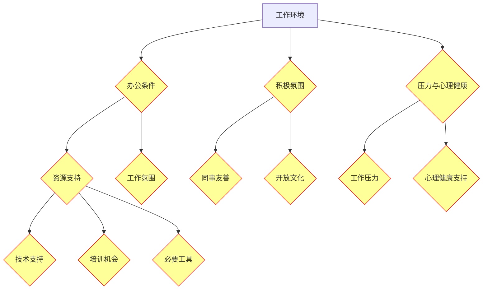
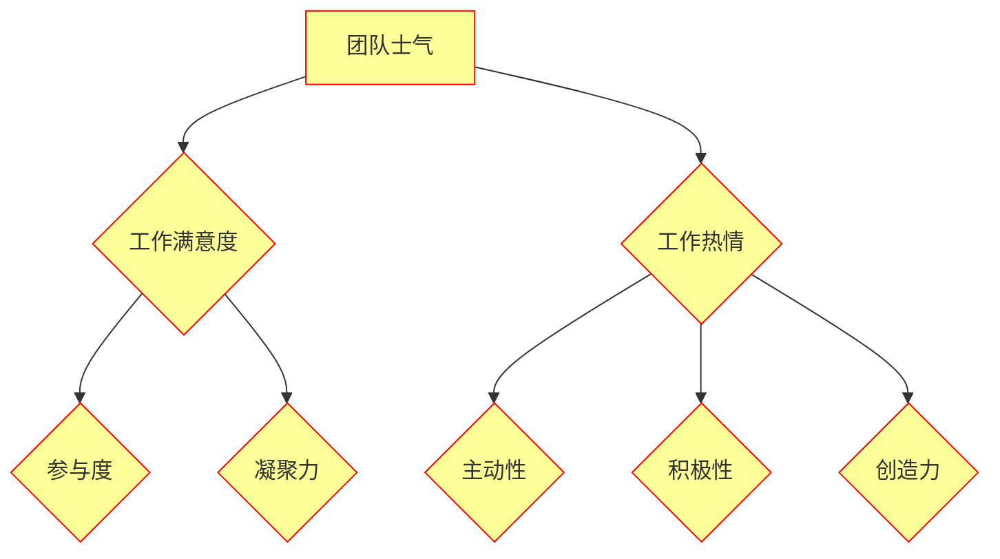

                 

### 1.2 核心概念

在讨论团队士气提升的问题之前，有必要先明确一些核心概念，包括团队士气、工作热情及其相互关系。

#### 1.2.1 团队士气：定义与衡量

团队士气是指团队成员在共同工作中表现出的积极、乐观和协作的精神状态。它不仅反映在个人的工作表现上，也体现在团队的整体效率和工作氛围中。衡量团队士气可以从以下几个方面进行：

- **工作满意度**：团队成员对工作的满意度是衡量士气的一个重要指标，包括对工作内容、工作环境和工作条件的满意程度。
- **员工参与度**：员工参与团队决策和项目执行的积极性，是衡量团队士气的重要方面。
- **团队凝聚力**：团队成员之间的相互信任、协作和支持程度，也是士气的重要体现。

#### 1.2.2 工作热情：内涵与特征

工作热情是指团队成员对工作充满热情和积极性的态度。它体现在以下几个方面：

- **主动性**：主动承担责任、积极参与项目，并在工作中表现出积极主动的态度。
- **积极性**：对工作中的挑战和变化持开放态度，乐于接受新任务和新角色。
- **创造力**：在工作中能够提出新的想法和解决方案，推动团队进步。

#### 1.2.3 影响团队士气与工作热情的因素

团队士气和工作热情受到多种因素的影响，包括：

- **领导风格**：领导者的管理方式和风格对团队成员的士气有直接影响。
- **工作环境**：良好的工作环境和资源支持有助于提升团队士气。
- **职业发展**：明确的职业发展路径和成长机会可以激发员工的工作热情。
- **团队协作**：有效的沟通和协作机制可以增强团队的凝聚力，提升士气。
- **个人激励**：合理的激励措施，如奖励和认可，可以激发员工的工作热情。

### 1.2.4 团队士气与工作热情的关系

团队士气和工作热情是相辅相成的。高昂的团队士气能够激发员工的工作热情，而工作热情的提升又可以进一步推动团队士气。具体来说：

- **士气对热情的激发**：一个士气高昂的团队，成员之间相互鼓励和支持，能够激发每个成员的潜能，使其更加积极和热情地投入工作。
- **热情对士气的促进**：个人的工作热情可以带动整个团队，形成正向的反馈循环，进一步巩固团队的士气。

在接下来的章节中，我们将深入探讨影响团队士气和工作热情的具体因素，并探讨有效的提升策略。通过逻辑清晰的分析和实例说明，希望能够为团队管理者提供有价值的参考。

#### 1.2.5 影响团队士气与工作热情的因素详细解析

要提升团队士气和工作热情，首先需要深入分析影响这些因素的具体原因。以下是影响团队士气和工作热情的几个关键因素：

1. **工作环境**
   - **办公条件**：良好的办公环境，如舒适的办公设施、清晰的办公空间布局，可以提升员工的工作满意度。
   - **资源支持**：充足的资源，包括技术支持、培训机会和必要的工具，能够帮助员工更高效地完成任务。
   - **工作氛围**：积极的工作氛围，包括同事之间的友善关系和开放的文化，有助于提升员工的士气和热情。

2. **职业发展**
   - **晋升机会**：明确的职业晋升路径和机会，可以激发员工的进取心和工作热情。
   - **培训与发展**：提供持续的职业发展和技能提升培训，有助于员工保持学习热情，提升自我价值感。

3. **领导风格**
   - **支持型领导**：领导者对员工的关心和支持，可以帮助员工克服困难，提升士气。
   - **参与型领导**：鼓励员工参与决策，让员工感觉到自己的意见被重视，能够提升工作热情。
   - **激励型领导**：通过激励措施，如奖励和认可，来激发员工的工作热情。

4. **团队协作**
   - **沟通效率**：有效的沟通机制，确保信息传递顺畅，减少误解和冲突。
   - **团队信任**：建立信任关系，使团队成员能够相互支持和协作，提升团队凝聚力。

5. **个人激励**
   - **物质激励**：合理的薪酬和福利待遇，满足员工的基本需求。
   - **精神激励**：表扬和认可，满足员工的成就感和自我实现需求。

6. **工作压力与心理健康**
   - **工作压力**：适当的工作压力可以激发员工的潜力，但过大的工作压力会导致士气下降。
   - **心理健康**：关注员工的心理健康，提供必要的心理支持和咨询服务，有助于提升员工的士气和热情。

### 图表 1：团队士气与工作热情影响因素关系图

以下是一个Mermaid流程图，展示了影响团队士气与工作热情的主要因素及其关系：

通过这个图表，我们可以清晰地看到各个因素之间的相互作用和影响。在接下来的章节中，我们将进一步探讨如何针对这些因素制定具体的提升策略。

#### 1.2.6 核心概念对比与联系

为了更深入地理解团队士气和工作热情，我们需要对核心概念进行对比，并探讨它们之间的联系。

##### 1.2.6.1 团队士气与工作热情的对比

**团队士气**通常是指团队成员在共同工作中表现出的精神状态，包括工作满意度、参与度和团队凝聚力等。它是一个宏观层面的概念，反映的是团队整体的氛围和精神面貌。

- **定义**：团队士气是指团队成员在共同工作中所表现出的积极、乐观和协作的精神状态。
- **衡量**：通过员工满意度、参与度和团队凝聚力等指标进行衡量。

**工作热情**则是指个体在特定工作中表现出的主动性、积极性和创造力，是一个更为微观层面的概念，更多地关注个体的态度和表现。

- **定义**：工作热情是指团队成员对工作充满热情和积极性的态度。
- **衡量**：通过主动性、积极性和创造力等指标进行衡量。

从定义上看，团队士气是一个集体概念，而工作热情则侧重于个体层面的积极态度。然而，这两个概念并不是完全独立的，它们之间存在密切的联系。

##### 1.2.6.2 团队士气与工作热情的联系

1. **相互促进**：高昂的团队士气可以激发员工的工作热情，而个体工作热情的提升又能进一步巩固团队的士气。这种相互促进的关系形成了一个正向的反馈循环。
2. **共同驱动因素**：影响团队士气和工作热情的因素有很多共同之处，如工作环境、职业发展、领导风格和团队协作等。这些因素通过对员工的心理和行为产生作用，进而影响团队士气和工作热情。
3. **互为补充**：团队士气主要反映团队的整体状态，而工作热情则更关注个体的积极性。两者结合起来，可以更全面地评估和提升团队的整体表现。

##### 1.2.6.3 团队士气与工作热情的关系图

为了更直观地展示团队士气和工作热情的关系，我们可以使用Mermaid流程图来表示：

通过这个图表，我们可以清晰地看到团队士气和工作热情之间的联系。团队士气通过影响团队成员的工作满意度和参与度，从而影响个体的主动性、积极性和创造力，即工作热情。同时，工作热情的提升也能反过来进一步巩固团队的士气。

综上所述，团队士气和工作热情是两个紧密相连的概念。理解并把握这两个概念之间的关系，有助于我们更有效地提升团队的整体表现。在接下来的章节中，我们将深入探讨提升团队士气和工作热情的具体策略。

### 第2章：团队士气下降的常见症状与应对策略

#### 2.1 团队士气下降的常见症状

团队士气下降往往表现为一系列明显的症状，这些症状不仅影响团队成员的个人表现，也会对团队整体造成负面影响。以下是团队士气下降的一些常见症状：

##### 2.1.1 情绪波动

情绪波动是团队士气下降的早期迹象之一。团队成员可能会表现出易怒、焦虑、沮丧等情绪，而且情绪变化无常，难以保持稳定。这种情绪波动不仅影响团队成员的个人状态，也会破坏团队内部的和谐氛围。

##### 2.1.2 工作效率下降

士气低落的团队往往工作效率不高。团队成员可能会对工作任务缺乏热情，表现出拖延、消极应付的态度。这会导致项目进度延误，甚至影响公司的整体运营。

##### 2.1.3 团队氛围紧张

士气下降的团队内部氛围往往变得紧张和压抑。团队成员之间可能存在更多的摩擦和矛盾，沟通不畅，甚至出现协作障碍。这种紧张的气氛会进一步削弱团队的凝聚力和合作意愿。

##### 2.1.4 创新能力下降

士气低落的团队往往缺乏创新动力。团队成员可能对工作中的新挑战和新思路持保守态度，不愿意尝试新的方法和解决方案。这会导致团队的创新能力下降，难以在竞争激烈的市场中保持优势。

#### 2.2 对症下药：应对策略

针对团队士气下降的常见症状，需要采取有针对性的策略来提升团队的士气。以下是一些有效的应对策略：

##### 2.2.1 改善工作环境

改善工作环境是提升团队士气的重要措施。可以从以下几个方面入手：

- **办公条件优化**：提供舒适的办公设施，如舒适的办公椅、足够的照明和通风设备，以及人性化的办公空间设计，有助于提升员工的工作满意度。
- **资源支持**：确保团队成员有足够的资源支持，包括技术支持、培训机会和必要的工具，从而提高工作效率。
- **工作氛围营造**：营造积极向上的工作氛围，可以通过团队建设活动和团队合作游戏来增强团队凝聚力。

##### 2.2.2 提高沟通效率

沟通效率是提升团队士气的重要保障。以下是一些提高沟通效率的策略：

- **建立有效的沟通机制**：确保团队成员之间的信息传递畅通，可以采用定期会议、工作汇报和沟通平台等工具来加强团队内部沟通。
- **改善沟通方式**：鼓励团队成员采用积极的沟通方式，如开放式提问、倾听他人意见和反馈，避免使用指责和批评的语言。
- **培养沟通技巧**：提供沟通技巧培训，帮助团队成员提高沟通能力，减少误解和冲突。

##### 2.2.3 建立激励机制

激励机制是提升团队士气的重要手段。以下是一些建立激励机制的策略：

- **设立明确的奖励制度**：根据团队成员的工作表现，设立明确的奖励制度，包括奖金、晋升机会和荣誉称号等，以激励员工的工作积极性。
- **表扬和认可**：及时表扬和认可团队成员的出色表现，增强员工的成就感和自我价值感。
- **提供职业发展机会**：为员工提供明确的职业发展路径和成长机会，帮助他们看到自己的未来，激发工作热情。

##### 2.2.4 加强心理健康关怀

关注团队成员的心理健康，提供必要的心理支持和咨询服务，有助于提升团队士气。以下是一些加强心理健康关怀的策略：

- **心理辅导**：定期举办心理健康讲座和心理辅导活动，帮助团队成员缓解工作压力，提升心理健康水平。
- **建立心理支持小组**：鼓励团队成员组建心理支持小组，分享彼此的心理困扰和应对策略，相互支持和鼓励。
- **提供心理咨询**：为团队成员提供心理咨询服务，帮助他们解决心理问题，提升工作积极性。

#### 2.2.5 定期团队建设活动

团队建设活动是提升团队士气的重要手段。以下是一些定期团队建设活动的建议：

- **户外拓展**：组织户外拓展活动，如徒步、攀岩、定向越野等，增强团队凝聚力。
- **团建游戏**：定期组织团建游戏，如桌游、运动会、团队挑战等，增强团队互动和协作。
- **团队分享会**：定期举办团队分享会，鼓励团队成员分享工作经验和心得，增强团队认同感和归属感。

### 总结

团队士气下降会对团队成员的工作表现和团队整体造成严重影响。通过改善工作环境、提高沟通效率、建立激励机制和加强心理健康关怀等策略，可以有效应对团队士气下降的问题，提升团队的士气和整体表现。在接下来的章节中，我们将进一步探讨提升团队士气和工作热情的具体实践策略。

### 第3章：领导力与团队士气

#### 3.1 领导风格与团队士气的关系

领导风格在很大程度上决定了团队士气的高低。不同的领导风格会对团队士气产生不同的影响。以下是几种常见的领导风格及其对团队士气的影响：

##### 3.1.1 权威型领导风格

权威型领导风格通常表现为领导者对决策和权力的集中控制。这种风格在一定程度上能够确保团队按照既定目标高效运作，但同时也可能导致团队成员感到压抑，缺乏自主性和创造性。

- **积极影响**：在紧急情况下，权威型领导可以迅速做出决策，确保团队迅速行动。
- **负面影响**：长期依赖权威型领导可能会导致团队成员缺乏主人翁精神，工作热情下降。

##### 3.1.2 参与型领导风格

参与型领导风格强调团队参与和民主决策，鼓励团队成员提出建议和意见。这种风格能够增强团队成员的参与感和责任感，有助于提升团队士气。

- **积极影响**：参与型领导可以激发团队成员的积极性和创造力，增强团队的凝聚力。
- **负面影响**：如果参与决策的过程过于复杂或耗时，可能会导致决策效率下降。

##### 3.1.3 支持型领导风格

支持型领导风格注重对团队成员的支持和关怀，关心员工的个人发展和心理健康。这种风格有助于提升团队成员的满意度和忠诚度。

- **积极影响**：支持型领导能够建立信任关系，增强团队成员之间的合作和沟通，提升团队士气。
- **负面影响**：如果过度关注员工的个人需求，可能会影响团队的整体目标和效率。

#### 3.2 领导者的职责与挑战

领导者在提升团队士气方面承担着重要的职责和挑战。以下是领导者在提升团队士气过程中需要关注的一些关键点：

##### 3.2.1 提升自我认知

领导者需要不断反思自己的行为和风格，了解自己的优势和不足，以便更好地服务于团队。自我认知可以帮助领导者更好地识别团队士气提升的需求，并采取相应的措施。

- **自我评估**：定期进行自我评估，识别自己的领导风格和行为模式。
- **寻求反馈**：向团队成员和其他领导者寻求反馈，了解自己在团队中的表现和影响。

##### 3.2.2 建立信任关系

信任是团队士气的重要基础。领导者需要通过言行一致、公正透明和关怀支持来建立和维护信任。

- **言行一致**：领导者要确保自己的言行一致，避免做出无法实现的承诺。
- **公正透明**：领导者要确保决策过程公正透明，让团队成员了解决策的依据和原因。
- **关怀支持**：领导者要关心团队成员的个人发展和心理健康，提供必要的支持和资源。

##### 3.2.3 激发团队成员潜力

领导者需要发现和挖掘团队成员的潜力，为团队成员提供成长和发展的机会。

- **识别潜力**：通过观察和沟通，识别团队成员的潜力所在。
- **提供培训**：为团队成员提供必要的培训和学习机会，帮助他们提升技能和知识。
- **鼓励创新**：鼓励团队成员尝试新方法和解决方案，支持他们进行创新实验。

##### 3.2.4 应对挑战

在提升团队士气的过程中，领导者会面临各种挑战，如团队内部的冲突、资源限制和外部环境变化等。领导者需要具备应对这些挑战的能力。

- **沟通与协调**：通过有效的沟通和协调，解决团队内部的冲突和问题。
- **资源管理**：合理分配资源，确保团队成员有足够的资源支持工作。
- **应对变化**：保持灵活性，快速适应外部环境的变化，确保团队目标的实现。

#### 3.3 领导者的角色转变

随着团队环境的变化，领导者的角色也需要不断转变。以下是领导者在不同阶段需要扮演的不同角色：

##### 3.3.1 初创阶段

在团队的初创阶段，领导者需要扮演“创造者”的角色，负责制定团队愿景和目标，搭建团队基础，并招募和培养核心成员。

- **制定愿景**：明确团队的长期目标和愿景，为团队成员提供共同的方向和目标。
- **搭建基础**：建立团队的基本组织结构和文化，为团队的发展奠定基础。
- **招募与培养**：积极招募有能力、有激情的团队成员，并提供必要的培训和支持。

##### 3.3.2 成长期

在团队的成长期，领导者需要扮演“教练”的角色，关注团队成员的成长和发展，帮助他们提升技能和知识。

- **指导与支持**：为团队成员提供指导和支持，帮助他们解决工作中的问题。
- **鼓励创新**：鼓励团队成员尝试新的方法和解决方案，支持他们的创新实验。
- **培训与发展**：定期组织培训活动，提升团队成员的专业技能和知识。

##### 3.3.3 成熟阶段

在团队的成熟期，领导者需要扮演“协调者”的角色，确保团队成员之间的协作和沟通，优化团队的工作流程。

- **优化流程**：分析团队的工作流程，找出瓶颈和问题，提出优化方案。
- **沟通与协作**：促进团队成员之间的沟通和协作，确保团队目标的实现。
- **资源管理**：合理分配资源，确保团队成员有足够的资源支持工作。

#### 3.4 领导力提升策略

为了提升团队士气，领导者需要不断提升自己的领导力。以下是一些有效的领导力提升策略：

##### 3.4.1 自我提升

领导者需要不断学习和成长，提升自己的知识、技能和领导能力。

- **持续学习**：通过阅读、培训和实践，不断提升自己的知识和技能。
- **反思与总结**：定期反思自己的领导行为和决策，总结经验教训。

##### 3.4.2 倾听与反馈

领导者需要倾听团队成员的意见和建议，并给予及时的反馈。

- **开放式沟通**：鼓励团队成员表达自己的意见和想法，创造一个开放、包容的沟通环境。
- **及时反馈**：对团队成员的表现给予及时、具体的反馈，帮助他们改进和成长。

##### 3.4.3 建立信任

领导者需要建立和维护信任关系，增强团队的凝聚力。

- **透明决策**：在决策过程中保持透明，让团队成员了解决策的依据和原因。
- **公平对待**：确保团队成员受到公平对待，避免偏袒和偏见。

##### 3.4.4 激励与奖励

领导者需要通过激励和奖励措施，激发团队成员的积极性和创造力。

- **设立目标**：为团队成员设定明确、可实现的个人和团队目标。
- **奖励与认可**：对团队成员的出色表现给予奖励和认可，增强他们的成就感和自我价值感。

通过以上策略，领导者可以提升团队士气，增强团队的凝聚力，推动团队不断进步和发展。在接下来的章节中，我们将进一步探讨团队建设与士气提升的具体实践。

### 第4章：团队建设与士气提升

#### 4.1 团队建设的核心要素

团队建设是一个持续的过程，它旨在增强团队成员之间的协作和信任，提升团队的凝聚力和工作效率。以下是团队建设的几个核心要素：

##### 4.1.1 明确团队目标

团队目标的明确性是团队建设的基础。一个明确的团队目标可以统一团队成员的方向，激发他们的积极性和创造力。为了确保团队目标的明确性，可以采取以下措施：

- **制定具体目标**：将团队目标具体化，使其具有可操作性和可衡量性。
- **沟通与共识**：与团队成员进行充分的沟通，确保他们理解和认同团队目标。
- **定期回顾**：定期回顾团队目标的进展情况，及时调整和优化目标。

##### 4.1.2 增强团队凝聚力

团队凝聚力是团队建设的关键要素之一。增强团队凝聚力可以通过以下几种方式实现：

- **团队活动**：组织定期的团队活动，如团建活动、团队旅行等，增强团队成员之间的互动和联系。
- **团队奖励**：设立团队奖励机制，对取得优异成绩的团队给予表彰和奖励，激发团队的动力。
- **共同挑战**：鼓励团队成员共同面对挑战，通过合作解决困难，增强团队凝聚力和信任。

##### 4.1.3 提升团队协作能力

提升团队协作能力是团队建设的重要目标。以下是一些提升团队协作能力的策略：

- **沟通机制**：建立有效的沟通机制，确保团队成员之间的信息传递畅通，减少误解和冲突。
- **分工合作**：明确团队成员的职责和分工，确保每个成员都能充分发挥自己的优势。
- **协作工具**：采用协作工具，如项目管理软件、即时通讯工具等，提高团队协作效率。

#### 4.2 团队建设活动与实践

为了有效地提升团队士气，组织一些有针对性的团队建设活动是非常必要的。以下是一些具体的团队建设活动与实践：

##### 4.2.1 定期团建活动

定期团建活动是增强团队凝聚力的重要手段。以下是一些有效的团建活动：

- **团队拓展训练**：通过户外拓展训练，如攀岩、攀树、定向越野等，增强团队成员之间的信任和协作能力。
- **团队建设工作坊**：组织团队建设工作坊，通过互动游戏和角色扮演等活动，提升团队成员的沟通技巧和团队协作能力。
- **团队聚会**：定期组织团队聚会，如聚餐、KTV等，增进团队成员之间的友谊和信任。

##### 4.2.2 跨部门合作项目

跨部门合作项目是提升团队协作能力的重要途径。以下是一些实施跨部门合作项目的建议：

- **项目立项**：明确跨部门合作项目的目标、范围和预期成果，确保项目立项的合理性。
- **组建项目团队**：从不同部门挑选合适的人才组成项目团队，确保团队具备实现项目目标的能力。
- **沟通与协调**：建立有效的沟通与协调机制，确保项目团队成员之间的信息传递畅通，减少误解和冲突。
- **项目监控**：定期监控项目进展，及时调整项目计划，确保项目按计划进行。

##### 4.2.3 培训与发展计划

为了提升团队成员的技能和知识，组织定期的培训和发展计划是非常必要的。以下是一些培训与发展计划的策略：

- **技能培训**：根据团队成员的工作需求，提供针对性的技能培训，如编程技术、项目管理等。
- **知识分享**：鼓励团队成员进行知识分享，通过讲座、研讨会等形式，提升团队的整体知识水平。
- **职业发展**：为团队成员提供职业发展规划，包括晋升通道、培训机会和职业发展指导。
- **导师制度**：建立导师制度，为新人提供指导和帮助，帮助他们快速融入团队并成长。

##### 4.2.4 融入新成员

对于新加入的团队成员，如何让他们快速融入团队也是团队建设的重要内容。以下是一些融入新成员的策略：

- **欢迎会**：组织新员工欢迎会，让团队成员与新员工进行交流和互动，帮助他们快速融入团队。
- **导师制度**：为新员工配备导师，提供工作指导和帮助，帮助他们解决工作中的问题。
- **培训计划**：为新员工制定个性化的培训计划，确保他们尽快掌握所需技能和知识。
- **团队活动**：鼓励新员工参加团队活动，如团建活动、团队聚会等，增强他们的团队归属感。

#### 4.3 团队建设的效果评估

为了确保团队建设活动能够有效提升团队士气，需要对其效果进行评估。以下是一些评估团队建设效果的方法：

- **满意度调查**：通过问卷调查或访谈等方式，了解团队成员对团队建设活动的满意度。
- **工作绩效**：评估团队建设活动后，团队成员的工作绩效是否有明显提升。
- **团队氛围**：观察团队建设活动后，团队的氛围是否更加积极、和谐。
- **员工流失率**：评估团队建设活动后，员工流失率是否有明显下降。

通过以上方法，可以全面评估团队建设的效果，为后续的团队建设提供依据和指导。

### 总结

团队建设是提升团队士气的重要手段。通过明确团队目标、增强团队凝聚力、提升团队协作能力以及组织有针对性的团队建设活动，可以有效地提升团队的士气和工作效率。在接下来的章节中，我们将探讨激励与奖励机制在提升团队士气中的作用。

### 第5章：激励与奖励机制

#### 5.1 激励理论概述

激励与奖励机制在提升团队士气中起着至关重要的作用。为了设计有效的激励策略，我们需要了解一些基本的激励理论，包括马斯洛需求层次理论、双因素理论和强化理论。

##### 5.1.1 马斯洛需求层次理论

马斯洛需求层次理论将人的需求分为五个层次：生理需求、安全需求、社交需求、尊重需求和自我实现需求。这一理论指出，人们在满足了较低层次的需求后，会追求更高层次的需求。在职场环境中，管理者需要了解员工的不同需求层次，从而制定有针对性的激励策略。

- **生理需求**：包括薪酬、福利和工作环境等，是基础性需求。
- **安全需求**：涉及工作稳定、职业发展和社会保障等。
- **社交需求**：关注团队支持、同事关系和归属感。
- **尊重需求**：包括认可、荣誉和成就感等。
- **自我实现需求**：追求个人成长、职业发展和实现自我价值。

##### 5.1.2 双因素理论

赫茨伯格的双因素理论将激励因素分为两类：满意因素和不满意因素。满意因素通常与工作本身有关，如成就感、工作挑战性和认可等；不满意因素则与工作环境有关，如薪酬、工作条件和人际关系等。这一理论强调，提高满意因素可以激励员工，而消除不满意因素只能防止员工离职。

- **激励因素**：包括成就、认可、工作挑战和个人成长等。
- **不满意因素**：包括薪酬、工作条件、管理方式等。

##### 5.1.3 强化理论

强化理论由斯金纳提出，认为人的行为可以通过正强化和负强化来调节。正强化通过奖励增强行为的频率和强度，负强化通过移除负面刺激来增强行为。这一理论在激励员工方面有广泛应用。

- **正强化**：通过奖励（如奖金、晋升）来增强积极行为。
- **负强化**：通过消除负面刺激（如减少加班时间）来增强行为。

#### 5.2 激励策略与实践

基于上述激励理论，以下是几种有效的激励策略和实践：

##### 5.2.1 物质激励

物质激励是最常见的激励方式，包括薪酬、奖金、福利等。物质激励可以直接满足员工的生理需求和安全需求，是基础性的激励手段。

- **绩效奖金**：根据员工的工作绩效和公司业绩，发放绩效奖金。
- **薪酬调整**：定期进行薪酬调查，确保员工薪酬与市场水平相当。
- **福利制度**：提供全面的福利，如医疗保险、退休金、休假制度等。

##### 5.2.2 精神激励

精神激励通过满足员工的社交需求、尊重需求和自我实现需求，激发员工的工作热情和创造力。以下是一些精神激励的方法：

- **认可与表扬**：对员工的优秀表现进行公开表扬和认可，增强员工的成就感。
- **职业发展**：为员工提供职业发展机会和培训，帮助他们实现个人成长。
- **团队建设**：组织团队活动，增强员工之间的沟通和协作，提升团队凝聚力。

##### 5.2.3 综合激励方案

综合激励方案是将物质激励和精神激励相结合，设计出适合企业文化和员工需求的激励策略。以下是一个综合激励方案的示例：

- **绩效奖金**：根据员工的绩效表现，发放一定比例的绩效奖金。
- **晋升机会**：为表现出色的员工提供晋升机会，鼓励他们在职业发展中不断前进。
- **团队奖励**：对完成项目目标的团队进行奖励，如团队旅游或现金奖励。
- **认可与表扬**：定期举办表彰大会，对优秀员工进行公开表扬和奖励。

#### 5.3 激励策略的应用与效果

为了确保激励策略的有效性，需要根据实际情况进行调整和优化。以下是一个实际案例：

**案例：某科技公司员工激励方案**

- **绩效奖金**：根据员工的工作绩效和公司业绩，发放季度绩效奖金。绩效奖金占员工总薪酬的30%。
- **晋升机会**：设立明确的晋升通道，为员工提供晋升机会。每年进行一次内部晋升评选，晋升后的薪酬调整幅度在10%-20%。
- **团队奖励**：对于完成重大项目或取得显著业绩的团队，组织团队旅游或发放现金奖励。
- **认可与表扬**：通过内部表彰大会和公开表扬，对表现突出的员工进行奖励。每月评选“最佳员工”，并给予一定的奖金和荣誉证书。

通过这一综合激励方案，该科技公司的员工士气显著提升，工作效率和创新能力都有所提高。具体效果如下：

- **员工满意度**：员工满意度调查结果显示，80%的员工对公司的激励方案表示满意。
- **绩效提升**：员工绩效得分平均提高了15%，团队整体业绩实现了显著增长。
- **员工留存率**：激励方案实施后，员工留存率提高了10%，员工流失率显著下降。

### 总结

激励与奖励机制是提升团队士气的重要手段。通过结合物质激励和精神激励，设计出适合企业文化和员工需求的激励方案，可以有效提升员工的工作热情和积极性。在接下来的章节中，我们将探讨工作环境对团队士气的影响。

### 第6章：工作环境与士气提升

#### 6.1 工作环境对团队士气的影响

工作环境是影响团队士气的重要因素之一。一个良好的工作环境能够提升员工的工作满意度、提高工作效率、增强团队的凝聚力，从而提升团队士气。以下是工作环境对团队士气影响的几个关键方面：

##### 6.1.1 办公室设计

办公室设计不仅影响员工的工作效率，还会影响他们的心理健康和士气。以下是几个关键的办公室设计原则：

- **舒适度**：提供舒适的办公桌椅、适当的照明和通风，有助于提高员工的工作舒适度。
- **灵活性**：设计灵活的办公空间，如可移动的隔断和多功能会议室，能够适应不同团队的需求。
- **开放性**：开放式办公布局可以促进团队间的沟通和协作，有助于提升团队士气。

##### 6.1.2 工作节奏与灵活性

工作节奏和灵活性对员工的工作满意度有重要影响。以下是几个关键点：

- **合理的工作时间**：确保员工有足够的工作时间，但避免过长的加班时间，以维护员工的身心健康。
- **弹性工作时间**：提供弹性工作时间，允许员工根据自己的需求安排工作，有助于提高工作满意度。
- **远程工作机会**：在条件允许的情况下，提供远程工作机会，让员工能够在家或其他地方工作，提高他们的灵活性和满意度。

##### 6.1.3 工作设备与资源

工作设备与资源的充足性直接影响员工的工作效率和士气。以下是几个关键点：

- **高效工具**：提供高效的办公设备和软件，如高速网络、先进的计算机和专业的办公软件，可以提高员工的工作效率。
- **技术支持**：确保有充足的技术支持，包括IT维护和培训，让员工能够快速解决工作中遇到的技术问题。
- **培训资源**：提供丰富的培训资源，如在线课程、研讨会和工作坊，帮助员工不断提升技能和知识。

#### 6.2 改善工作环境的策略

为了提升团队士气，企业需要采取一系列策略来改善工作环境。以下是一些具体的改善策略：

##### 6.2.1 建立良好的工作氛围

建立积极、包容和开放的工作氛围对提升团队士气至关重要。以下是一些具体措施：

- **鼓励团队合作**：通过团队建设活动和合作项目，促进团队成员之间的沟通和协作。
- **尊重多样性**：尊重员工的个性差异，鼓励多样化的思维和观点，提升团队的创新力。
- **提供反馈和认可**：鼓励团队成员之间提供积极反馈和认可，增强团队凝聚力。

##### 6.2.2 提供职业发展机会

为员工提供明确的职业发展路径和机会，是提升团队士气的重要手段。以下是一些具体措施：

- **职业规划**：为员工提供职业规划咨询，帮助他们设定个人目标和职业发展路径。
- **晋升通道**：建立明确的晋升通道，为员工提供晋升机会。
- **培训和发展**：提供多样化的培训和发展机会，帮助员工提升技能和知识。

##### 6.2.3 加强心理健康关怀

关注员工的心理健康，提供必要的心理支持和咨询服务，是提升团队士气的重要策略。以下是一些具体措施：

- **心理辅导**：定期举办心理健康讲座和心理辅导活动，帮助员工缓解工作压力。
- **员工支持小组**：鼓励员工组建支持小组，分享彼此的心理困扰和应对策略。
- **心理咨询**：为员工提供心理咨询服务，帮助他们解决心理问题，提升工作积极性。

##### 6.2.4 改善办公条件

改善办公条件是提升团队士气的基础性工作。以下是一些具体措施：

- **办公设施升级**：升级办公桌椅、电脑、网络设备等，提供更舒适和高效的工作环境。
- **工作空间优化**：根据员工需求，优化办公空间布局，提供更多的私人空间和公共区域。
- **休息区域**：提供舒适的休息区域，让员工在工作之余能够放松身心。

#### 6.3 工作环境改善的案例研究

以下是一个实际案例，展示如何通过改善工作环境来提升团队士气：

**案例：某科技公司改善工作环境的实践**

- **办公室设计**：公司进行了办公室设计改造，采用了开放式办公布局，增加了公共讨论区和休息区，提高了员工的舒适度和团队协作效率。
- **弹性工作时间**：公司实施了弹性工作时间政策，允许员工根据自己的需求灵活安排工作，提高了员工的工作满意度和幸福感。
- **职业发展支持**：公司为员工提供了丰富的职业发展机会，包括内部培训、外部课程和职业规划咨询，帮助员工提升技能和知识。
- **心理健康关怀**：公司定期举办心理健康讲座和心理辅导活动，鼓励员工组建支持小组，提供心理咨询服务，帮助员工缓解工作压力。

通过这些改善措施，该科技公司的员工士气显著提升，员工流失率下降，工作效率和创新能力都有所提高。具体效果如下：

- **员工满意度**：员工满意度调查结果显示，90%的员工对公司的办公环境和职业发展机会表示满意。
- **工作效率**：员工工作效率提高了20%，团队整体业绩实现了显著增长。
- **员工流失率**：员工流失率下降了15%，员工队伍的稳定性得到提升。

### 总结

工作环境对团队士气有着重要的影响。通过改善办公条件、提供职业发展机会和加强心理健康关怀，企业可以显著提升团队士气和工作效率。在接下来的章节中，我们将探讨个人发展与团队士气的关系。

### 第7章：个人发展与团队士气

#### 7.1 个人成长与团队士气的关系

个人成长与团队士气之间存在着密切的相互关系。个人在职业上的成长和发展不仅能够提升个人的工作满意度，还能够对团队士气产生积极的影响。

##### 7.1.1 个人目标与团队目标的融合

个人目标的设定是实现个人成长的关键，而团队目标的实现则需要团队成员的共同努力。当个人目标与团队目标相互融合时，个人在实现自身目标的过程中也会为团队做出贡献，从而增强个人对团队的认同感和归属感。

- **共同目标**：明确团队目标，确保个人目标与团队目标一致，使个人在实现自身目标的同时推动团队目标的实现。
- **个人成长**：通过为个人提供明确的成长路径，鼓励他们不断学习和提升自己的技能和知识，为团队带来更多的价值和贡献。

##### 7.1.2 职业规划与团队士气

职业规划是个人成长的重要部分，它帮助员工明确自己的职业发展方向，设定短期和长期目标。一个明确的职业规划能够提高员工的工作热情和动力，进而提升团队士气。

- **职业目标**：为员工提供职业目标设定和实现的指导，帮助他们制定个性化的职业规划。
- **职业发展**：通过提供培训、晋升机会和职业发展指导，帮助员工实现职业目标，增强他们对工作的满意度和信心。

##### 7.1.3 个人心理健康与团队士气

个人心理健康是团队士气的基础。一个心理健康、状态良好的员工能够更积极地投入到工作中，为团队带来正能量。相反，如果员工心理健康出现问题，可能会影响他们的工作效率和团队合作精神。

- **心理健康支持**：为员工提供心理健康支持和咨询服务，帮助他们应对工作压力和挑战。
- **心理健康培训**：定期举办心理健康培训，提升员工的自我管理能力和抗压能力。

#### 7.2 个人发展与团队士气提升的实践

为了实现个人发展与团队士气提升，企业需要采取一系列实际措施。以下是一些具体的实践方法：

##### 7.2.1 增强自我管理能力

自我管理能力是个人成长的关键，它帮助员工更好地规划时间和任务，提高工作效率。

- **时间管理**：通过培训和工作指导，帮助员工掌握时间管理技巧，提高工作效率。
- **目标设定**：鼓励员工设定具体的个人目标，制定实现目标的计划，并定期进行回顾和调整。

##### 7.2.2 提升沟通技巧

有效的沟通技巧是团队合作的重要保障。通过提升沟通技巧，员工可以更好地理解团队成员的需求和期望，减少误解和冲突。

- **沟通培训**：定期组织沟通技巧培训，帮助员工提高沟通能力和表达能力。
- **开放沟通**：鼓励员工在团队中积极表达自己的意见和想法，创造一个开放、包容的沟通环境。

##### 7.2.3 建立个人成长计划

个人成长计划是个人发展的指南，它帮助员工明确自己的职业发展方向和成长路径。

- **成长路径**：为员工提供明确的职业成长路径，包括晋升通道、培训和技能提升机会。
- **计划制定**：鼓励员工根据个人兴趣和职业目标，制定个人成长计划，并定期进行评估和调整。

##### 7.2.4 提供职业发展机会

为员工提供职业发展机会是提升团队士气的重要措施。以下是一些具体的职业发展机会：

- **内部培训**：定期组织内部培训，帮助员工提升专业技能和知识。
- **外部培训**：提供外部培训和学习机会，如研讨会、工作坊和行业会议等。
- **职业晋升**：建立明确的晋升机制，为员工提供晋升机会，鼓励他们在职业上不断进步。

##### 7.2.5 心理健康关怀

关注员工的心理健康，提供必要的心理支持和咨询服务，有助于提升员工的工作积极性和团队士气。

- **心理健康讲座**：定期举办心理健康讲座，提升员工的自我管理和压力应对能力。
- **心理咨询服务**：为员工提供专业的心理咨询服务，帮助他们解决工作和生活中的心理问题。

#### 7.3 个人发展对团队士气的积极影响

通过个人发展，员工可以提升自己的专业技能和工作效率，同时增强对团队的贡献感和归属感，从而对团队士气产生积极影响。

- **提升个人价值**：个人在职业上的成长和发展能够提升他们的自我价值感，使他们在工作中更加自信和积极。
- **增强团队凝聚力**：通过个人成长，员工能够更好地与团队协作，共同实现团队目标，增强团队的凝聚力。
- **提升工作满意度**：个人成长和发展能够提高员工的工作满意度，使他们更加热爱自己的工作，从而提升整个团队的士气。

### 总结

个人发展与团队士气之间存在着紧密的联系。通过增强自我管理能力、提升沟通技巧、建立个人成长计划以及提供职业发展机会，企业可以促进员工的个人成长，进而提升团队士气。在接下来的章节中，我们将对全文进行总结，并探讨未来的发展方向。

### 第8章：总结与展望

#### 8.1 主要策略与实践总结

在本文中，我们详细探讨了提升团队士气的方法和策略。通过改善工作环境、提高沟通效率、建立激励机制、加强心理健康关怀以及促进个人发展，我们总结出以下主要策略：

1. **改善工作环境**：提供舒适、灵活和高效的办公条件，增强员工的工作满意度和幸福感。
2. **提高沟通效率**：建立有效的沟通机制，确保信息传递畅通，减少误解和冲突。
3. **建立激励机制**：结合物质激励和精神激励，设计出适合企业文化和员工需求的激励方案。
4. **加强心理健康关怀**：关注员工的心理健康，提供必要的心理支持和咨询服务。
5. **促进个人发展**：通过培训、职业规划和心理健康关怀，帮助员工实现个人成长。

这些策略在实践中已被证明能够有效提升团队士气，提高团队的工作效率和创新能力。

#### 8.2 未来展望

在未来的发展中，团队士气提升将面临新的机遇和挑战。以下是对未来发展的展望：

1. **技术进步**：随着人工智能、大数据和云计算等技术的不断发展，企业将能够更精准地了解员工的需求，提供个性化的激励和关怀。
2. **全球化**：全球化的趋势将使企业面临更加多样化的员工群体和文化背景，需要更灵活的团队管理策略和文化融合方法。
3. **长期发展策略**：企业需要制定长期的团队士气提升策略，确保团队在快速变化的市场环境中保持活力和竞争力。

在未来，企业应继续关注员工的需求，不断创新和优化团队士气提升的方法，以实现长期的可持续发展。

### 总结

团队士气是企业成功的重要保障。通过本文的探讨，我们认识到提升团队士气需要多方面的努力和持续的关注。让我们共同努力，为团队的士气提升贡献智慧和力量。

### 撰写人信息

**作者：AI天才研究院/AI Genius Institute & 禅与计算机程序设计艺术 /Zen And The Art of Computer Programming**

感谢您的阅读！希望通过本文，您能够对团队士气提升有更深刻的理解和实践指导。期待在未来的技术发展中，与您一同探索更多高效的团队管理策略。**作者：AI天才研究院/AI Genius Institute & 禅与计算机程序设计艺术 /Zen And The Art of Computer Programming**

