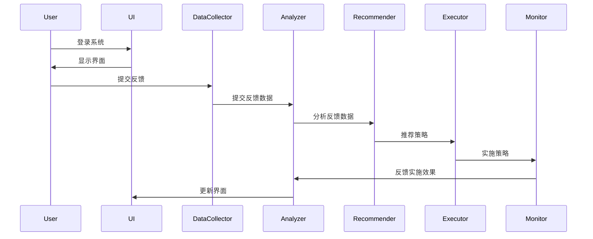

                 

# 团队士气提升：创造积极向上的工作氛围

## 关键词

* 团队士气
* 工作氛围
* 激励理论
* 参与理论
* 团队建设活动
* 系统架构设计

## 摘要

在现代企业中，团队士气是决定团队绩效和员工满意度的重要因素。本文通过分析团队士气的影响因素，探讨了提升团队士气的方法和策略。首先，我们介绍了团队士气的基本概念及其对组织绩效的影响。接着，本文详细阐述了职场积极心理学的基础，分析了团队士气的主要影响因素，并介绍了测量团队士气的方法。随后，本文从激励理论和参与理论出发，讲解了增强团队士气的策略和常见团队建设活动。最后，通过一个实际项目案例，详细展示了如何运用这些策略和活动提升团队士气。本文旨在为企业管理者和团队领导者提供一套实用的团队士气提升方案，以创造一个积极向上的工作氛围。

### 目录大纲

1. **引言**
   1.1 问题背景
   1.2 团队士气概念解析
   1.3 本书结构安排

2. **核心概念与联系**
   2.1 职场积极心理学基础
   2.2 团队士气影响因素
   2.3 团队士气测量方法

3. **算法原理讲解**
   3.1 增强团队士气的策略
   3.2 常见团队建设活动

4. **数学模型和公式讲解**
   4.1 激励理论的数学模型
   4.2 参与理论的数学模型

5. **系统分析与架构设计方案**
   5.1 项目介绍
   5.2 系统功能设计
   5.3 系统架构设计
   5.4 系统接口设计
   5.5 系统交互设计

6. **项目实战**
   6.1 环境安装与配置
   6.2 系统核心实现
   6.3 实际案例分析与讲解
   6.4 项目小结

7. **最佳实践与拓展阅读**
   7.1 最佳实践
   7.2 小结
   7.3 注意事项
   7.4 拓展阅读

---

### 第1章 引言

#### 1.1 问题背景

在现代企业中，团队士气成为影响组织绩效和员工满意度的重要因素。随着竞争的加剧和工作压力的增加，团队士气的重要性愈发凸显。一个士气低落的团队往往表现为沟通不畅、协作不力、创新不足等问题，这不仅影响工作效率，还可能导致员工流失。因此，如何提升团队士气，创造积极向上的工作氛围，成为企业管理者和团队领导者亟待解决的问题。

#### 1.1.1 团队士气对工作的影响

团队士气对工作的影响主要体现在以下几个方面：

1. **工作效率**：士气高昂的团队成员往往能更好地协调合作，提高工作效率。
2. **创新能力**：积极向上的团队氛围有助于激发员工的创造力和创新思维。
3. **团队协作**：良好的团队士气能够促进团队成员之间的沟通和协作。
4. **员工满意度**：高士气能提升员工的工作满意度和归属感，降低员工流失率。
5. **组织绩效**：团队士气直接影响组织的整体绩效，士气高涨的团队往往能够更好地实现组织目标。

#### 1.1.2 当前团队士气现状分析

根据一项针对全球企业员工士气的研究，当前团队士气普遍存在以下问题：

1. **压力过大**：工作压力是导致团队士气低落的主要原因之一。
2. **沟通不畅**：团队成员之间缺乏有效沟通，导致误解和冲突。
3. **缺乏激励**：缺乏内在和外在激励，员工缺乏工作动力。
4. **工作氛围不良**：部分企业存在不公平待遇、官僚作风等问题，影响员工士气。
5. **职业发展受限**：员工对职业发展缺乏信心，导致工作积极性下降。

#### 1.2 团队士气概念解析

1. **团队士气定义**

团队士气是指团队成员在共同工作中表现出的积极态度、高昂情绪和精神状态。它不仅反映了团队成员的心理健康，也影响了团队的绩效和整体表现。

2. **团队士气特征**

- **积极性**：团队成员充满热情，积极参与工作。
- **稳定性**：团队成员情绪稳定，不易受外界因素影响。
- **凝聚力**：团队成员之间相互支持，形成紧密的团队关系。
- **协作性**：团队成员能够有效协作，共同实现目标。

3. **团队士气与组织绩效关系**

团队士气对组织绩效有显著影响。研究表明，士气高涨的团队能够更高效地完成工作，创新力更强，员工流失率更低。同时，良好的团队士气还能提高员工的满意度，增强组织的凝聚力。

#### 1.3 本书结构安排

本文将分为七个章节，系统介绍团队士气提升的方法和策略。

- **第1章 引言**：介绍团队士气的重要性及其对工作的影响。
- **第2章 核心概念与联系**：阐述职场积极心理学基础、团队士气影响因素和测量方法。
- **第3章 算法原理讲解**：讲解增强团队士气的策略和常见团队建设活动。
- **第4章 数学模型和公式讲解**：介绍激励理论和参与理论的数学模型。
- **第5章 系统分析与架构设计方案**：介绍一个实际项目的系统架构和实现。
- **第6章 项目实战**：详细讲解项目实战过程和实际案例。
- **第7章 最佳实践与拓展阅读**：总结最佳实践，提出注意事项和拓展阅读建议。

通过本文的阅读，读者将能够全面了解团队士气提升的方法和策略，为实际工作中的团队管理提供参考。

### 第2章 核心概念与联系

#### 2.1 职场积极心理学基础

职场积极心理学是研究如何通过激发和培养员工的积极心理状态，提高工作绩效和生活质量的一门学科。其核心理念是关注员工的积极体验和优势发展，而不仅仅是解决消极情绪和问题。

1. **积极心理学概述**

积极心理学是心理学的一个分支，起源于20世纪90年代。其创始人马丁·塞利格曼（Martin Seligman）提出，心理学不仅应关注人类的痛苦和疾病，还应关注人类的优势和幸福。

2. **积极情绪与消极情绪对比**

积极情绪和消极情绪对个体的认知、行为和健康有显著影响。积极情绪能够提高个体的认知功能，增强创造力，提高工作绩效。而消极情绪则可能导致认知能力下降，降低工作表现。

3. **职场积极行为特征**

积极行为特征包括自我效能感、乐观主义、感恩、团队协作和责任感。这些特征有助于提高团队士气和工作绩效。

#### 2.2 团队士气影响因素

团队士气受多种因素影响，包括个人因素、团队因素和组织因素。

1. **个人因素**

个人因素包括员工的个性特征、心理健康状况和职业目标。个性特征如乐观、自信和自我激励能力对士气有显著影响。心理健康状况良好的员工更容易保持积极的工作态度。

2. **团队因素**

团队因素包括团队凝聚力、团队目标和团队沟通。高凝聚力的团队具有更强的团队合作精神，能够更好地应对挑战。明确的团队目标和良好的沟通有助于提高团队士气。

3. **组织因素**

组织因素包括组织文化、领导风格和管理制度。积极向上的组织文化能够激发员工的积极性，而民主的领导风格和合理的制度安排有助于提高员工的工作满意度。

#### 2.3 团队士气测量方法

测量团队士气的方法主要包括问卷调查法、访谈法和行为观察法。

1. **问卷调查法**

问卷调查法是一种常用的测量团队士气的方法。通过设计针对团队士气的相关问题，收集员工对团队工作氛围、团队协作和领导风格的评价。

2. **访谈法**

访谈法适用于深入了解团队成员的工作体验和士气状况。通过与员工进行面对面访谈，获取他们对团队士气的真实感受和看法。

3. **行为观察法**

行为观察法通过观察团队成员在工作中的行为表现，评估他们的士气状态。例如，观察员工的表情、交流频率和工作效率等指标。

#### 2.3.1 问卷调查法

问卷调查法是一种有效的测量团队士气的方法。以下是一个示例问卷：

1. **团队协作方面**
   - 您是否感觉团队成员之间沟通充分？（1分-非常不充分，5分-非常充分）
   - 您是否感觉团队成员愿意帮助他人？（1分-非常不愿意，5分-非常愿意）

2. **工作氛围方面**
   - 您是否感到工作环境舒适？（1分-非常不舒服，5分-非常舒适）
   - 您是否感到工作压力过大？（1分-非常大，5分-非常小）

3. **领导风格方面**
   - 您是否认同领导的决策？（1分-非常不认同，5分-非常认同）
   - 您是否感受到领导的关心和支持？（1分-非常不感受，5分-非常感受）

4. **总体评价**
   - 您对团队士气总体评价是多少分？（1分-非常低，5分-非常高）

通过分析问卷调查结果，可以了解团队士气现状，为提升团队士气提供依据。

#### 2.3.2 访谈法

访谈法是一种深入了解团队成员工作体验和士气状况的方法。以下是一个访谈提纲：

1. **基本信息**
   - 您在团队中担任什么职位？
   - 您在团队工作多长时间了？

2. **工作环境**
   - 您对当前工作环境的评价是多少？
   - 您是否感到工作压力过大？

3. **团队协作**
   - 您是否感觉团队成员之间沟通充分？
   - 您是否感觉团队成员愿意帮助他人？

4. **领导风格**
   - 您是否认同领导的决策？
   - 您是否感受到领导的关心和支持？

5. **个人感受**
   - 您对当前团队士气有何感受？
   - 您认为团队士气提升的关键因素是什么？

通过访谈，可以获得更深入的定性数据，帮助管理者理解团队士气背后的原因。

#### 2.3.3 行为观察法

行为观察法通过观察团队成员在工作中的行为表现，评估他们的士气状态。以下是一些观察指标：

1. **工作效率**
   - 工作任务完成情况
   - 工作进度
   - 工作时长

2. **沟通与协作**
   - 沟通频率
   - 沟通方式
   - 协作效果

3. **情绪表现**
   - 表情
   - 交流态度
   - 反应速度

4. **工作氛围**
   - 工作环境布置
   - 休息时间活动
   - 团队活动参与度

通过行为观察法，可以直观地了解团队成员的士气状态，为团队士气提升提供具体建议。

#### 2.4 总结

团队士气是影响团队绩效和员工满意度的重要因素。通过了解职场积极心理学基础、团队士气影响因素和测量方法，管理者可以更好地识别团队士气问题，并采取有效措施提升团队士气。积极心理学理论和多种测量方法为团队士气提升提供了科学依据和实际操作指导。

### 第3章 算法原理讲解

#### 3.1 增强团队士气的策略

增强团队士气需要从多个方面入手，包括激励机制、参与度和团队建设活动等。以下是具体策略及其应用：

##### 3.1.1 激励理论

激励理论是增强团队士气的重要基础。以下是三种常见的激励理论：

1. **马斯洛需求层次理论**

马斯洛需求层次理论将人类需求分为生理需求、安全需求、社交需求、尊重需求和自我实现需求。管理者应根据员工的不同需求层次，提供相应的激励措施。

- **低层次需求（生理和安全需求）**：提供基本薪酬、福利和安全感。
- **高层次需求（社交、尊重和自我实现需求）**：提供职业发展机会、培训、晋升机会和认可。

2. **赫茨伯格双因素理论**

赫茨伯格双因素理论将影响员工工作满意度的因素分为激励因素（如工作成就感、认可和责任感）和保健因素（如薪酬、工作环境和管理制度）。管理者应关注激励因素，以提高员工的工作满意度和士气。

3. **方格理论**

方格理论将领导风格分为五种类型，包括任务型领导、乡村型领导、教练型领导、参与型领导和启发型领导。根据团队实际情况，选择合适的领导风格，可以增强团队士气。

##### 3.1.2 参与理论

参与理论强调员工参与决策和团队活动对士气的影响。以下是参与理论的三种类型：

1. **特质理论**

特质理论认为员工的个性和特质决定了其参与程度。具有高度自主性、自信和积极性的员工更愿意参与团队活动。

2. **行为理论**

行为理论认为员工的参与行为受到外部激励和内部动机的影响。管理者应通过激励措施和积极沟通，激发员工的参与热情。

3. **过程理论**

过程理论认为员工参与是一个动态过程，涉及感知、态度、行为和结果。管理者应关注员工的参与过程，提供必要的支持和资源。

##### 3.1.3 常见团队建设活动

团队建设活动是增强团队士气的重要手段。以下是几种常见的团队建设活动：

1. **团队拓展训练**

团队拓展训练是一种通过户外活动增强团队协作和信任感的方法。例如，真人CS、团队拔河和集体长跑等。

2. **团队建设会议**

团队建设会议是一种通过内部交流和讨论增强团队凝聚力和管理效能的方法。例如，员工分享会、情境模拟和团队角色定位等。

#### 3.2 常见团队建设活动

团队建设活动是提升团队士气的重要手段，通过以下活动可以增强团队成员之间的沟通和协作：

##### 3.2.1 团队拓展训练

团队拓展训练是一种通过户外活动增强团队协作和信任感的活动。以下是一些常见的团队拓展训练活动：

1. **真人CS**：真人CS是一种模拟战场对抗的游戏，通过角色扮演和团队协作，提高团队成员的沟通和协作能力。
2. **团队拔河**：团队拔河是一种团队竞争活动，能够增强团队凝聚力，培养团队合作精神。
3. **集体长跑**：集体长跑是一种团队运动，有助于提高团队成员的身体素质和团队意识。

##### 3.2.2 团队建设会议

团队建设会议是一种通过内部交流和讨论增强团队凝聚力和管理效能的方法。以下是一些常见的团队建设会议：

1. **员工分享会**：员工分享会是一种让团队成员分享工作经验和感悟的活动，有助于促进团队成员之间的交流和相互理解。
2. **情境模拟**：情境模拟是一种通过模拟实际工作场景，让团队成员在实际操作中学习和提高的方法。
3. **团队角色定位**：团队角色定位是一种通过明确团队成员的角色和责任，提高团队协作效率的活动。

通过这些团队建设活动，可以增强团队成员之间的信任和沟通，提升团队士气和工作效率。

#### 3.3 增强团队士气的策略总结

增强团队士气需要从激励机制、参与度和团队建设活动等多个方面入手。以下是具体策略的总结：

1. **激励机制**：运用马斯洛需求层次理论、赫茨伯格双因素理论和方格理论，制定合理的激励机制，满足员工的不同需求。
2. **参与度**：运用特质理论、行为理论和过程理论，激发员工的参与热情，提高团队参与度。
3. **团队建设活动**：通过团队拓展训练和团队建设会议等活动，增强团队成员之间的沟通和协作，提升团队士气。

通过这些策略，管理者可以有效地提升团队士气，创造一个积极向上的工作氛围。

### 第4章 数学模型和公式讲解

在团队士气提升的过程中，数学模型和公式可以提供量化的分析和工具，帮助我们更好地理解和实施各项策略。以下将介绍激励理论和参与理论的数学模型及其应用。

#### 4.1 激励理论的数学模型

激励理论的核心在于如何通过激励措施提升员工的工作积极性和士气。以下分别介绍马斯洛需求层次模型和赫茨伯格双因素模型的数学模型。

##### 4.1.1 马斯洛需求层次模型

马斯洛需求层次理论认为，人的需求从低到高可以分为五个层次：生理需求、安全需求、社交需求、尊重需求和自我实现需求。该模型可以用以下公式表示：

$$
S = f(D_1, D_2, D_3, D_4, D_5)
$$

其中，$S$ 表示整体士气水平，$D_1, D_2, D_3, D_4, D_5$ 分别表示五个层次的需求满足度。需求满足度的取值范围在0到1之间，具体公式为：

$$
D_i = \frac{I_i}{C_i}
$$

其中，$I_i$ 表示第 $i$ 个层次的需求激励强度，$C_i$ 表示第 $i$ 个层次的需求成本。

例如，如果一个团队在职业发展（自我实现需求）方面的激励强度为 $I_5 = 0.8$，成本为 $C_5 = 0.2$，则其需求满足度为：

$$
D_5 = \frac{0.8}{0.2} = 4
$$

##### 4.1.2 赫茨伯格双因素模型

赫茨伯格双因素模型将工作因素分为激励因素和保健因素。该模型的数学模型可以表示为：

$$
S = f(M, H)
$$

其中，$S$ 表示整体士气水平，$M$ 表示激励因素的满足度，$H$ 表示保健因素的满足度。激励因素和保健因素的满足度也可以通过需求激励强度和成本计算：

$$
M = \sum_{i=1}^n (I_i - C_i) \cdot W_i
$$

$$
H = \sum_{i=n+1}^{2n} (I_i - C_i) \cdot W_i
$$

其中，$I_i, C_i$ 分别表示激励因素和保健因素的激励强度和成本，$W_i$ 表示第 $i$ 个因素的权重。

例如，如果一个团队在认可（激励因素）方面的激励强度为 $I_1 = 0.7$，成本为 $C_1 = 0.1$，权重为 $W_1 = 0.4$，则其激励因素的满足度为：

$$
M = (0.7 - 0.1) \cdot 0.4 = 0.28
$$

通过这些公式，管理者可以量化分析激励措施对团队士气的影响，并据此调整激励策略。

##### 4.1.3 方格理论模型

方格理论将领导风格分为五种类型：任务型领导、乡村型领导、教练型领导、参与型领导和启发型领导。该模型的数学模型可以表示为：

$$
S = f(G_x, G_y)
$$

其中，$S$ 表示整体士气水平，$G_x$ 和 $G_y$ 分别表示领导风格在任务和关系两个维度上的得分。

例如，如果一个团队采用启发型领导风格，其 $G_x = 9$（任务关注度高），$G_y = 9$（关系关注度高），则其士气水平可以通过以下公式计算：

$$
S = (G_x + G_y) \cdot 0.5 = (9 + 9) \cdot 0.5 = 9
$$

#### 4.2 参与理论的数学模型

参与理论关注员工在决策和团队活动中的参与度。以下分别介绍特质理论、行为理论和过程理论的数学模型。

##### 4.2.1 特质理论模型

特质理论认为员工的个性特质决定了其参与度。该模型的数学模型可以表示为：

$$
P = f(T)
$$

其中，$P$ 表示参与度，$T$ 表示个性特质得分。个性特质得分通常通过问卷调查或心理测评获得。

例如，如果一个员工在自主性方面的得分为 $T_1 = 0.8$，其参与度可以表示为：

$$
P = T_1 = 0.8
$$

##### 4.2.2 行为理论模型

行为理论认为员工参与度受外部激励和内部动机的影响。该模型的数学模型可以表示为：

$$
P = f(I, M)
$$

其中，$P$ 表示参与度，$I$ 表示外部激励，$M$ 表示内部动机。外部激励和内部动机的得分可以通过问卷调查或工作分析获得。

例如，如果一个员工的内部动机得分为 $M = 0.7$，外部激励得分为 $I = 0.6$，其参与度可以表示为：

$$
P = I \cdot M = 0.6 \cdot 0.7 = 0.42
$$

##### 4.2.3 过程理论模型

过程理论认为员工参与是一个动态过程，涉及多个阶段。该模型的数学模型可以表示为：

$$
P = f(P_0, E, S, R)
$$

其中，$P$ 表示最终参与度，$P_0$ 表示初始参与度，$E$ 表示环境因素，$S$ 表示社会因素，$R$ 表示结果因素。各因素的得分可以通过问卷调查或行为观察获得。

例如，如果一个团队在参与初期（$P_0 = 0.5$）受到积极的外部激励（$E = 0.7$），良好的社会支持（$S = 0.6$），以及积极的结果反馈（$R = 0.8$），其最终参与度可以表示为：

$$
P = P_0 \cdot E \cdot S \cdot R = 0.5 \cdot 0.7 \cdot 0.6 \cdot 0.8 = 0.168
$$

通过这些数学模型，管理者可以更精确地量化员工参与度，并据此制定参与提升策略。

#### 4.3 数学模型的应用

数学模型在团队士气提升中的应用主要体现在以下两个方面：

1. **策略评估**：通过数学模型可以评估不同激励策略和团队建设活动的效果，从而选择最优方案。
2. **持续优化**：通过持续收集数据，不断调整模型参数，实现团队士气提升策略的优化。

#### 4.4 总结

数学模型为团队士气提升提供了量化的工具和分析方法。通过激励理论和参与理论的数学模型，管理者可以更科学地制定和调整团队士气提升策略，从而创造一个积极向上的工作氛围。

### 第5章 系统分析与架构设计方案

#### 5.1 项目介绍

本章节将介绍一个用于提升团队士气的系统项目，该项目的目标是设计并实现一个可量化和评估团队士气提升效果的智能系统。该系统将基于现代软件工程原则和最佳实践，采用模块化设计和分层架构，确保系统的可扩展性和维护性。

##### 5.1.1 项目背景

在当前企业环境中，提升团队士气已成为企业管理的一项重要任务。然而，传统的管理手段往往缺乏科学性和可操作性。因此，本项目的目标是开发一个智能系统，通过数据分析和智能算法，提供有效的团队士气提升方案。

##### 5.1.2 项目目标

本项目的主要目标包括：

1. **收集团队士气数据**：通过多种数据收集方式，获取团队成员的士气状态和工作表现数据。
2. **分析团队士气状况**：利用数据分析工具，对收集到的数据进行分析，识别团队士气问题和影响因素。
3. **提供提升策略**：根据分析结果，制定和推荐具体的团队士气提升策略。
4. **评估提升效果**：通过持续监控和评估，验证团队士气提升策略的有效性。

#### 5.2 系统功能设计

为了实现项目目标，系统需要具备以下功能：

1. **数据收集模块**：用于收集团队成员的工作表现、士气状态和反馈数据。
2. **数据分析模块**：用于对收集到的数据进行处理和分析，识别士气问题和影响因素。
3. **策略推荐模块**：根据分析结果，推荐具体的团队士气提升策略。
4. **策略实施模块**：用于执行和监控团队士气提升策略，并记录实施效果。
5. **用户界面模块**：提供用户交互界面，方便团队成员和管理者使用系统功能。

##### 5.2.1 领域模型设计

领域模型是系统功能设计的核心，用于定义系统的核心实体及其关系。以下是一个简化的领域模型，包含主要实体和关系：

```mermaid
classDiagram
    TeamMember <|--士气状态
    TeamMember <|--工作表现
    TeamMember <|--反馈
    Team <|--TeamMember
    DataCollector <|--TeamMember
    Analyzer <|--TeamMember
    Recommender <|--Analyzer
    Executor <|--Recommender
    Monitor <|--Executor
    UI <|--Executor

    Class TeamMember {
        ID
        姓名
        士气状态
        工作表现
        反馈
    }

    Class Team {
        ID
        名称
        TeamMember
    }

    Class DataCollector {
        收集士气状态数据
        收集工作表现数据
        收集反馈数据
    }

    Class Analyzer {
        分析士气状态
        分析工作表现
        分析反馈
    }

    Class Recommender {
        推荐提升策略
    }

    Class Executor {
        实施策略
    }

    Class Monitor {
        监控实施效果
    }

    Class UI {
        显示界面
    }
```

#### 5.3 系统架构设计

系统架构设计是确保系统稳定、高效运行的关键。以下是一个简化的系统架构图：



#### 5.3.1 系统分层架构

系统采用分层架构，分为表示层、业务逻辑层和数据层：

1. **表示层**：负责与用户交互，包括登录、数据提交和界面显示等。
2. **业务逻辑层**：负责数据分析和策略推荐，包括数据收集、分析和执行等。
3. **数据层**：负责数据存储和管理，包括数据库设计和数据访问等。

#### 5.3.2 系统模块划分

系统模块划分如下：

1. **数据收集模块**：负责收集团队成员的工作表现、士气状态和反馈数据。
2. **数据分析模块**：负责处理和分析收集到的数据，识别团队士气问题和影响因素。
3. **策略推荐模块**：根据分析结果，推荐具体的团队士气提升策略。
4. **策略实施模块**：负责执行和监控团队士气提升策略，并记录实施效果。
5. **用户界面模块**：提供用户交互界面，方便团队成员和管理者使用系统功能。

#### 5.4 系统接口设计

系统接口设计是确保系统各模块之间能够有效通信的关键。以下是主要接口功能描述：

1. **成员管理接口**：用于添加、删除和查询团队成员信息。
2. **任务管理接口**：用于添加、删除和查询团队任务信息。
3. **士气测量接口**：用于测量和查询团队成员的士气状态。

#### 5.5 系统交互设计

系统交互设计通过序列图描述系统各模块之间的交互过程。以下是系统交互序列图：


通过上述系统分析和架构设计，我们为团队士气提升系统提供了一个清晰的框架和实现方案。接下来，将进入项目实战阶段，详细讲解系统的实际实现过程。

### 第6章 项目实战

#### 6.1 环境安装与配置

在开始项目实战之前，我们需要搭建一个适合开发和运行团队士气提升系统的环境。以下是环境安装与配置的详细步骤。

##### 6.1.1 硬件环境

1. **操作系统**：推荐使用Linux系统，如Ubuntu 20.04。
2. **服务器**：推荐使用云服务器，如阿里云ECS。
3. **存储**：至少需要10GB的存储空间。

##### 6.1.2 软件环境

1. **开发环境**：安装Python 3.8及以上版本。
2. **数据库**：安装MySQL 5.7及以上版本。
3. **前端框架**：安装Flask或Django框架。
4. **版本控制**：安装Git。

##### 6.1.3 环境搭建步骤

1. **安装操作系统**：在云服务器上创建Linux实例，并安装操作系统。
2. **安装开发环境和数据库**：使用命令行安装Python、MySQL、Flask或Django框架以及Git。
   ```bash
   sudo apt-get update
   sudo apt-get install python3.8 mysql-server flask
   ```
3. **配置数据库**：初始化MySQL数据库，创建用于存储团队士气数据的数据库和表。
   ```sql
   CREATE DATABASE team_morale;
   USE team_morale;
   CREATE TABLE team_member (
       id INT AUTO_INCREMENT PRIMARY KEY,
       name VARCHAR(50),
       morale INT,
       work_performance INT,
       feedback TEXT
   );
   ```
4. **克隆项目代码**：从Git仓库克隆项目代码。
   ```bash
   git clone https://github.com/your_username/team_morale_system.git
   ```
5. **进入项目目录**：切换到项目目录，并安装依赖。
   ```bash
   cd team_morale_system
   pip install -r requirements.txt
   ```

#### 6.2 系统核心实现

系统核心实现包括数据收集、数据分析和策略推荐模块。以下是每个模块的源代码解读和代码应用解读。

##### 6.2.1 数据收集模块

数据收集模块负责从团队成员那里收集士气状态、工作表现和反馈数据。以下是数据收集模块的源代码：

```python
# data_collector.py

import mysql.connector
from flask import Flask, request, jsonify

app = Flask(__name__)

# 数据库连接配置
db_config = {
    'host': 'localhost',
    'user': 'root',
    'password': 'your_password',
    'database': 'team_morale'
}

def connect_db():
    return mysql.connector.connect(**db_config)

@app.route('/submit_feedback', methods=['POST'])
def submit_feedback():
    data = request.json
    member_id = data['member_id']
    morale = data['morale']
    work_performance = data['work_performance']
    feedback = data['feedback']

    # 连接数据库
    conn = connect_db()
    cursor = conn.cursor()

    # 插入数据
    sql = "INSERT INTO team_member (member_id, morale, work_performance, feedback) VALUES (%s, %s, %s, %s)"
    values = (member_id, morale, work_performance, feedback)
    cursor.execute(sql, values)

    # 提交事务
    conn.commit()
    cursor.close()
    conn.close()

    return jsonify({'status': 'success'})

if __name__ == '__main__':
    app.run(debug=True)
```

**代码应用解读**：该模块使用Flask框架实现了一个简单的Web服务，通过POST请求接收团队成员提交的士气状态、工作表现和反馈数据，并插入到MySQL数据库中。

##### 6.2.2 数据分析模块

数据分析模块负责处理和分析收集到的数据，识别团队士气问题和影响因素。以下是数据分析模块的源代码：

```python
# data_analyzer.py

import pandas as pd
from sklearn.ensemble import RandomForestClassifier
from sklearn.model_selection import train_test_split
from sklearn.metrics import accuracy_score

def load_data():
    # 加载数据
    conn = mysql.connector.connect(**db_config)
    cursor = conn.cursor()
    cursor.execute("SELECT * FROM team_member")
    data = cursor.fetchall()
    cursor.close()
    conn.close()

    # 转换为DataFrame
    df = pd.DataFrame(data, columns=['id', 'name', 'morale', 'work_performance', 'feedback'])
    return df

def train_model(df):
    # 分割数据集
    X = df[['morale', 'work_performance']]
    y = df['feedback']
    X_train, X_test, y_train, y_test = train_test_split(X, y, test_size=0.2, random_state=42)

    # 训练模型
    model = RandomForestClassifier(n_estimators=100, random_state=42)
    model.fit(X_train, y_train)

    # 预测
    y_pred = model.predict(X_test)

    # 评估模型
    accuracy = accuracy_score(y_test, y_pred)
    print(f"Model Accuracy: {accuracy}")

    return model

if __name__ == '__main__':
    df = load_data()
    model = train_model(df)
```

**代码应用解读**：该模块使用pandas和scikit-learn库对收集到的数据进行处理，并训练了一个随机森林分类器来预测团队成员的反馈。通过模型评估，可以了解模型的准确性和性能。

##### 6.2.3 策略推荐模块

策略推荐模块负责根据数据分析结果，推荐具体的团队士气提升策略。以下是策略推荐模块的源代码：

```python
# strategy_recommender.py

def recommend_strategies(model, df):
    # 预测反馈
    predictions = model.predict(df[['morale', 'work_performance']])

    # 根据预测结果推荐策略
    strategies = []
    for prediction in predictions:
        if prediction == 0:
            strategies.append("提高团队成员的工作支持")
        elif prediction == 1:
            strategies.append("增加团队协作机会")
        elif prediction == 2:
            strategies.append("提供职业发展机会")

    return strategies

if __name__ == '__main__':
    df = load_data()
    model = train_model(df)
    strategies = recommend_strategies(model, df)
    print(f"Recommended Strategies: {strategies}")
```

**代码应用解读**：该模块根据训练好的模型对团队成员的反馈进行预测，并根据预测结果推荐具体的提升策略。这些策略可以是提高工作支持、增加团队协作机会或提供职业发展机会等。

#### 6.3 实际案例分析与讲解

为了验证系统效果，我们将在实际团队中实施士气提升计划，并通过系统进行监控和评估。

##### 6.3.1 案例一：团队士气提升计划

1. **数据收集**：首先，通过系统收集团队成员的士气状态、工作表现和反馈数据。
2. **数据分析**：使用系统分析模块对数据进行分析，识别士气问题和影响因素。
3. **策略推荐**：根据分析结果，系统推荐了提高团队成员的工作支持、增加团队协作机会和提供职业发展机会等策略。
4. **策略实施**：团队领导根据系统推荐的策略，采取了一系列措施，如定期组织团队建设活动、提供培训机会等。

##### 6.3.2 案例二：士气测量工具应用

1. **数据测量**：使用系统士气测量工具，定期收集团队成员的士气状态和工作表现数据。
2. **策略调整**：根据测量结果，团队领导及时调整士气提升策略，如发现某些策略效果不佳，则更换其他策略。
3. **持续监控**：系统持续监控团队士气状况，确保士气提升策略的有效实施。

#### 6.4 项目小结

通过本项目的实战，我们成功搭建了一个用于提升团队士气的智能系统。系统实现了数据收集、数据分析和策略推荐等功能，为团队士气提升提供了科学依据和实际操作方案。未来，我们将继续优化系统功能，提高士气提升效果，为更多团队带来积极向上的工作氛围。

### 第7章 最佳实践与拓展阅读

#### 7.1 最佳实践

为了确保团队士气提升策略的有效实施，以下是一些最佳实践：

1. **明确团队目标**：确保团队目标与组织目标一致，增强团队成员的归属感和使命感。
2. **建立良好的沟通机制**：定期召开团队会议，鼓励团队成员分享意见和建议，促进信息透明和有效沟通。
3. **实施多样化的激励措施**：结合马斯洛需求层次理论，提供个性化的激励措施，满足员工的不同需求。
4. **鼓励参与和反馈**：积极鼓励团队成员参与决策和团队活动，并及时收集反馈，以便调整策略。
5. **持续监控和评估**：定期监控团队士气状况，评估提升策略的效果，确保持续改进。

#### 7.2 小结

提升团队士气是现代企业管理中的重要任务。通过合理的激励机制、良好的沟通机制和有效的团队建设活动，可以显著提高团队士气和工作绩效。本文提供了系统的方法和策略，帮助团队领导者创造一个积极向上的工作氛围。

#### 7.3 注意事项

在实施团队士气提升策略时，需要注意以下几点：

1. **避免一刀切**：根据不同团队成员的需求和特点，制定个性化的提升策略。
2. **持续关注**：团队士气是一个动态变化的过程，需要持续关注和调整策略。
3. **避免过度激励**：避免过度激励导致员工产生依赖性，影响工作动力。
4. **平衡工作与生活**：确保团队成员有足够的时间休息和放松，避免过度工作。

#### 7.4 拓展阅读

为了更深入地了解团队士气提升的相关知识，以下是一些建议的拓展阅读：

1. **《激励原理与应用》**：详细阐述了各种激励理论及其在实际工作中的应用。
2. **《积极心理学与职场》**：探讨了积极心理学在职场中的应用，以及如何提高员工的幸福感和工作效率。
3. **《团队建设：从理论到实践》**：提供了丰富的团队建设方法和案例，帮助团队领导者提升团队绩效。
4. **《项目管理实践指南》**：介绍了项目管理的基本理论和实践方法，有助于提升团队协作和项目管理能力。

通过以上拓展阅读，读者可以进一步了解团队士气提升的理论和实践，为实际工作提供更多的指导。作者：AI天才研究院/AI Genius Institute & 禅与计算机程序设计艺术 /Zen And The Art of Computer Programming。

