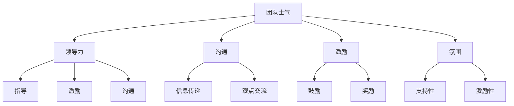

                 

### 团队士气提升：营造积极向上的氛围

#### 关键词：团队士气、领导力、沟通、激励机制、积极氛围

> 摘要：本文将探讨团队士气提升的重要性，分析其核心概念，并详细阐述提升团队士气的方法与策略。通过案例分析、实践反思和最佳实践，帮助读者了解如何营造积极向上的氛围，提升团队士气。

----------------------------------------------------------------

## 第一部分：团队士气提升的背景与基础

### 第1章：团队士气提升的重要性

#### 1.1 问题背景

在现代企业中，团队士气对于组织的成功至关重要。团队士气指的是团队成员在心理上和情感上的积极状态，这种状态能够直接影响团队的整体表现、创造力和凝聚力。随着企业竞争的加剧和工作压力的增大，如何提升团队士气成为企业管理者面临的一个重要挑战。

#### 1.2 问题描述

团队士气低落会导致一系列问题，包括：

- **工作效率下降**：团队成员缺乏动力和热情，导致工作进度缓慢。
- **团队成员士气低落**：负面情绪传播，影响整体团队氛围。
- **团队内部矛盾加剧**：沟通不畅，导致误解和冲突。
- **项目延误或失败**：士气低落影响项目执行和团队协作。

#### 1.3 问题解决

提升团队士气需要从以下几个方面入手：

- **领导力的提升**：领导者需要具备激励和引导团队的能力。
- **团队沟通的有效性**：建立良好的沟通机制，减少误解和冲突。
- **激励机制的设计**：合理设计激励机制，激发团队成员的积极性。
- **积极氛围的营造**：创造一个支持性、激励性的工作环境。

#### 1.4 边界与外延

团队士气提升不仅限于团队内部，还包括与外部合作伙伴和客户的关系。因此，提升团队士气需要综合考虑团队内外部因素。

#### 1.5 核心概念与联系

团队士气提升涉及多个核心概念，如领导力、沟通、激励和氛围等。这些概念相互关联，共同作用于团队士气。

- **领导力**：指导、激励、沟通等能力，直接影响团队士气。
- **沟通**：信息传递、观点交流等，是解决团队内部问题的关键。
- **激励**：鼓励、奖励等手段，激发团队成员的积极性。
- **氛围**：团队的整体感觉，对团队成员的士气和行为产生影响。

## 第二部分：提升团队士气的方法与策略

### 第2章：团队士气提升的核心概念

#### 2.1 核心概念原理

团队士气提升涉及的核心概念包括领导力、沟通、激励和氛围。这些概念是提升团队士气的基础，它们相互作用，共同影响团队的表现。

#### 2.2 概念属性特征对比表格

| 概念     | 特征                                      | 对团队士气的影响                         |
|----------|-------------------------------------------|------------------------------------------|
| 领导力   | 指导、激励、沟通等能力                    | 提升团队士气，引导团队方向               |
| 沟通     | 信息传递、观点交流等                      | 解决沟通障碍，提升团队士气               |
| 激励     | 鼓励、奖励等手段                          | 激发团队成员积极性，提高工作热情         |
| 氛围     | 团队成员的总体感觉，支持性、激励性环境    | 营造积极向上的氛围，影响团队成员的情绪和行为 |

#### 2.3 ER实体关系图架构

### 第3章：领导力的提升

#### 3.1 领导力的重要性

领导力是团队士气提升的关键因素。优秀的领导者能够激励团队成员，提供明确的目标和方向，增强团队的凝聚力。

#### 3.2 领导力提升的方法

提升领导力的方法包括：

- **角色模型**：领导者需要明确自己的角色和责任，成为团队成员的榜样。
- **沟通能力**：有效的沟通能够增强团队的信任和协作。
- **激励与反馈**：领导者需要了解团队成员的需求，提供适当的激励和反馈。
- **冲突管理**：领导者需要具备解决团队内部冲突的能力，维护团队的和谐。

#### 3.3 领导者角色模型

| 角色模型 | 描述                                       |
|----------|--------------------------------------------|
| 榜样领导者 | 通过自身的言行影响团队成员的行为和态度       |
| 参与式领导者 | 与团队成员共同参与决策，增强团队凝聚力     |
| 指导性领导者 | 提供明确的目标和指导，帮助团队成员成长     |
| 支持性领导者 | 提供心理支持和资源，帮助团队成员克服困难   |

### 第4章：团队沟通的有效性

#### 4.1 团队沟通的重要性

团队沟通是团队运作的核心，有效的沟通能够确保团队成员理解彼此的需求和期望，减少误解和冲突。

#### 4.2 提升沟通效果的策略

提升沟通效果的策略包括：

- **建立有效的沟通渠道**：确保信息能够快速、准确地在团队成员之间传递。
- **积极倾听**：倾听是有效沟通的关键，领导者需要鼓励团队成员表达观点。
- **反馈与确认**：确保信息的准确性和理解的一致性。
- **情感管理**：在沟通中处理情感问题，避免情绪对沟通的影响。

#### 4.3 沟通障碍与解决方法

沟通障碍包括：

- **信息传递不畅**：解决方法：简化信息、明确目标。
- **误解和冲突**：解决方法：增强沟通技巧、建立共识。
- **文化差异**：解决方法：了解文化差异、尊重多样性。

### 第5章：激励机制的设计

#### 5.1 激励机制的基本原理

激励机制是通过提供奖励、认可和晋升等手段，激发团队成员的积极性。

#### 5.2 设计有效激励机制的方法

设计有效激励机制的方法包括：

- **目标明确**：确保激励机制与团队目标和个人目标一致。
- **多样化激励**：结合物质奖励和精神奖励，满足不同团队成员的需求。
- **公正透明**：确保激励机制的公正性和透明度，增强团队成员的信任感。
- **持续激励**：定期评估激励机制的有效性，根据实际情况进行调整。

#### 5.3 激励机制的负面效应及应对

激励机制的负面效应包括：

- **过度竞争**：解决方法：建立合作文化、强调团队目标。
- **依赖性**：解决方法：平衡激励与培养内在动机。

### 第6章：积极氛围的营造

#### 6.1 积极氛围的特点

积极氛围是指团队成员在一种支持性、激励性、乐观向上的环境中工作。其特点包括：

- **信任与支持**：团队成员之间相互信任，提供帮助和支持。
- **开放沟通**：团队成员愿意分享想法和反馈，建立良好的沟通机制。
- **认可与鼓励**：团队成员得到认可和鼓励，增强自信心和动力。

#### 6.2 营造积极氛围的策略

营造积极氛围的策略包括：

- **领导者树立榜样**：领导者通过自身的行为树立积极向上的榜样。
- **鼓励多样性**：尊重团队成员的个性和差异，鼓励创新和多样性。
- **提供成长机会**：为团队成员提供学习和发展机会，提高团队成员的技能和能力。

#### 6.3 积极氛围对团队士气的影响

积极氛围能够提高团队成员的士气，具体影响包括：

- **提高工作满意度**：团队成员在积极氛围中更容易感到满足和快乐。
- **增强团队合作**：积极氛围能够促进团队成员之间的合作和协作。
- **提升工作效率**：积极氛围能够激发团队成员的工作热情和创造力，提高工作效率。

### 第7章：案例分析

#### 7.1 案例介绍

某知名互联网公司在过去一年中，通过一系列措施成功提升了团队士气，取得了显著的业务增长。以下是该公司的具体案例。

#### 7.2 案例分析

该公司的成功经验包括：

- **领导力提升**：领导者通过角色模型和参与式领导，提高了团队的凝聚力。
- **沟通有效性**：建立了多渠道的沟通机制，确保信息快速、准确地传递。
- **激励机制**：设计了多样化的激励机制，满足不同团队成员的需求。
- **积极氛围营造**：鼓励多样性，提供成长机会，营造了一个支持性和激励性的工作环境。

#### 7.3 案例总结与启示

该案例总结出以下几点启示：

- **领导力是关键**：领导者需要具备激励和引导团队的能力。
- **沟通是基础**：有效的沟通能够减少误解和冲突。
- **激励机制需多样化**：满足不同团队成员的需求。
- **积极氛围能提升团队士气**：营造一个支持性和激励性的工作环境。

## 第三部分：团队士气提升的实践与反思

### 第8章：团队士气提升的实践

#### 8.1 实践步骤与方法

提升团队士气需要采取以下步骤：

1. **评估当前团队士气**：通过调查问卷、员工访谈等方式了解团队士气现状。
2. **确定提升目标**：根据评估结果，设定具体的提升目标和计划。
3. **实施提升措施**：针对领导力、沟通、激励和氛围等方面，实施具体的提升措施。
4. **监督与反馈**：定期监督实施效果，收集反馈信息，调整措施。

#### 8.2 实践中的挑战与解决

实践过程中可能遇到的挑战包括：

- **员工抵触**：解决方法：通过沟通和解释，让员工理解提升团队士气的重要性。
- **资源不足**：解决方法：优化资源配置，寻求外部支持。
- **时间紧迫**：解决方法：合理安排时间，确保措施的有效实施。

#### 8.3 实践成果评估

通过以下指标评估实践成果：

- **工作效率**：通过工作进度、项目完成情况等指标衡量。
- **团队满意度**：通过员工满意度调查、员工反馈等指标衡量。
- **团队凝聚力**：通过团队活动、团队协作效果等指标衡量。

### 第9章：反思与改进

#### 9.1 反思过程与方法

反思过程包括：

- **评估实施效果**：对实施的措施进行评估，了解其有效性和不足之处。
- **收集反馈信息**：通过员工反馈、调查问卷等方式收集改进意见。
- **分析原因**：分析存在的问题和不足，找出根本原因。

#### 9.2 改进措施与建议

根据反思结果，提出以下改进措施：

- **加强领导力培训**：为领导者提供领导力培训，提高其领导能力。
- **优化沟通机制**：建立更加有效的沟通机制，确保信息畅通。
- **完善激励机制**：设计更加多样化的激励机制，激发员工积极性。
- **持续氛围营造**：通过持续的努力，营造一个积极向上的团队氛围。

#### 9.3 长期影响与可持续性

提升团队士气是一项长期工作，需要持续的努力和关注。通过有效的团队士气提升措施，可以带来以下长期影响：

- **提高工作效率**：稳定的团队士气有助于提高工作效率和项目完成质量。
- **增强团队凝聚力**：积极向上的团队氛围有助于增强团队凝聚力和协作能力。
- **吸引和留住人才**：良好的团队氛围有助于吸引优秀人才，并提高员工留存率。

### 第10章：最佳实践与启示

#### 10.1 最佳实践案例

以下是几个最佳实践案例：

- **案例一**：通过领导力培训和激励机制，提升团队士气，实现业务快速增长。
- **案例二**：通过建立多渠道沟通机制，增强团队协作，提高项目成功率。
- **案例三**：通过营造积极氛围，提高员工满意度，实现长期稳定发展。

#### 10.2 启示与思考

从最佳实践中可以得出以下启示：

- **领导力是关键**：领导者需要具备激励和引导团队的能力。
- **沟通是基础**：有效的沟通能够减少误解和冲突。
- **激励机制需多样化**：满足不同团队成员的需求。
- **积极氛围能提升团队士气**：营造一个支持性和激励性的工作环境。

#### 10.3 未来展望

在未来，团队士气提升将继续成为企业管理的重要方向。随着企业竞争的加剧，如何更好地提升团队士气，提高团队整体表现，将成为企业管理者持续探索和关注的课题。

作者：AI天才研究院/AI Genius Institute & 禅与计算机程序设计艺术 /Zen And The Art of Computer Programming

----------------------------------------------------------------

## 第一部分：团队士气提升的背景与基础

### 第1章：团队士气提升的重要性

#### 1.1 问题背景

在现代企业中，团队士气是决定团队效率和凝聚力的关键因素。团队士气指的是团队成员在心理上和情感上的积极状态，这种状态能够直接影响团队的整体表现、创造力和凝聚力。然而，随着企业竞争的加剧和工作压力的增大，团队士气低落成为一个普遍存在的问题。

#### 1.2 问题描述

团队士气低落会导致以下问题：

1. **工作效率下降**：团队成员缺乏动力和热情，导致工作进度缓慢，甚至出现拖延和失误。
2. **团队成员士气低落**：负面情绪传播，影响整体团队氛围，导致团队成员产生倦怠感。
3. **团队内部矛盾加剧**：沟通不畅，导致误解和冲突，进一步削弱团队士气。
4. **项目延误或失败**：士气低落影响项目执行和团队协作，导致项目进度延误或失败。

#### 1.3 问题解决

提升团队士气需要从以下几个方面入手：

1. **领导力的提升**：领导者需要具备激励和引导团队的能力，通过树立榜样、提供指导和支持，提升团队士气。
2. **团队沟通的有效性**：建立良好的沟通机制，确保信息快速、准确地在团队成员之间传递，减少误解和冲突。
3. **激励机制的设计**：合理设计激励机制，提供奖励、认可和晋升等手段，激发团队成员的积极性。
4. **积极氛围的营造**：创造一个支持性、激励性的工作环境，通过鼓励多样性、提供成长机会，营造一个积极向上的团队氛围。

#### 1.4 边界与外延

团队士气提升不仅限于团队内部，还包括与外部合作伙伴和客户的关系。因此，提升团队士气需要综合考虑团队内外部因素。同时，团队士气提升也是一个持续的过程，需要管理者持续关注和改进。

#### 1.5 核心概念与联系

团队士气提升涉及多个核心概念，如领导力、沟通、激励和氛围等。这些概念相互关联，共同作用于团队士气。

- **领导力**：领导者需要具备指导、激励、沟通等能力，直接影响团队士气。
- **沟通**：有效的沟通能够确保团队成员理解彼此的需求和期望，减少误解和冲突。
- **激励**：合理的激励机制能够激发团队成员的积极性，提高工作热情。
- **氛围**：积极向上的氛围能够提升团队成员的士气，增强团队的凝聚力。

### 第2章：团队士气提升的核心概念

#### 2.1 核心概念原理

团队士气提升的核心概念包括领导力、沟通、激励和氛围。这些概念是提升团队士气的基础，它们相互作用，共同影响团队的表现。

- **领导力**：领导力是指领导者通过指导、激励、沟通等手段，引导团队方向，提高团队士气的综合能力。领导力的提升有助于增强团队的凝聚力和执行力。
- **沟通**：沟通是团队士气提升的重要手段。有效的沟通能够确保团队成员理解彼此的需求和期望，减少误解和冲突，提高团队的合作效率。
- **激励**：激励是通过提供奖励、认可和晋升等手段，激发团队成员的积极性。合理的激励机制能够激发团队成员的内在动力，提高工作效率。
- **氛围**：氛围是指团队的整体感觉，包括支持性、激励性、乐观向上等方面。积极向上的氛围能够提升团队成员的士气，增强团队的凝聚力。

#### 2.2 概念属性特征对比表格

| 概念     | 特征                                      | 对团队士气的影响                         |
|----------|-------------------------------------------|------------------------------------------|
| 领导力   | 指导、激励、沟通等能力                    | 提升团队士气，引导团队方向               |
| 沟通     | 信息传递、观点交流等                      | 解决沟通障碍，提升团队士气               |
| 激励     | 鼓励、奖励等手段                          | 激发团队成员积极性，提高工作热情         |
| 氛围     | 团队成员的总体感觉，支持性、激励性环境    | 营造积极向上的氛围，影响团队成员的情绪和行为 |

#### 2.3 ER实体关系图架构

### 第3章：领导力的提升

#### 3.1 领导力的重要性

领导力是团队士气提升的关键因素。一个优秀的领导者能够激励团队成员，提供明确的目标和方向，增强团队的凝聚力。领导力的提升不仅能够提高团队士气，还能够提升团队的整体绩效。

#### 3.2 领导力提升的方法

提升领导力的方法包括以下几个方面：

1. **角色模型**：领导者需要明确自己的角色和责任，成为团队成员的榜样。通过展示正确的领导行为，领导者能够引导团队成员朝着共同的目标努力。
2. **沟通能力**：有效的沟通是领导力的重要组成部分。领导者需要具备倾听、表达和反馈的能力，确保团队成员之间的信息传递畅通无阻。
3. **激励与反馈**：领导者需要了解团队成员的需求，提供适当的激励和反馈。通过鼓励和认可，领导者能够激发团队成员的积极性和创造力。
4. **冲突管理**：领导者需要具备解决团队内部冲突的能力，维护团队的和谐。通过建立共识和制定公平的解决方案，领导者能够减少冲突，增强团队的凝聚力。
5. **持续学习**：领导者需要不断学习和成长，以适应不断变化的环境。通过参加培训、阅读书籍和与其他领导者交流，领导者能够不断提升自己的领导能力。

#### 3.3 领导者角色模型

领导者的角色模型可以分为以下几个方面：

1. **榜样领导者**：通过自身的言行影响团队成员的行为和态度，成为团队的榜样。
2. **参与式领导者**：与团队成员共同参与决策，增强团队的凝聚力和归属感。
3. **指导性领导者**：提供明确的目标和指导，帮助团队成员成长和实现目标。
4. **支持性领导者**：提供心理支持和资源，帮助团队成员克服困难，增强自信心。

### 第4章：团队沟通的有效性

#### 4.1 团队沟通的重要性

团队沟通是团队运作的核心，有效的沟通能够确保团队成员理解彼此的需求和期望，减少误解和冲突，提高团队的工作效率。良好的沟通能够促进团队成员之间的协作，增强团队的凝聚力和创造力。

#### 4.2 提升沟通效果的策略

为了提升团队沟通效果，可以采取以下策略：

1. **建立有效的沟通渠道**：确保信息能够快速、准确地在团队成员之间传递。可以通过定期会议、即时通讯工具、邮件等方式，建立多渠道的沟通机制。
2. **积极倾听**：倾听是有效沟通的关键。领导者需要鼓励团队成员表达观点，并给予充分的关注和反馈。通过积极倾听，领导者能够更好地理解团队成员的需求和问题。
3. **反馈与确认**：在沟通中，领导者需要及时给予反馈，确保信息的准确性和理解的一致性。通过反馈，团队成员能够了解自己的工作表现，并作出相应的调整。
4. **情感管理**：在沟通中处理情感问题，避免情绪对沟通的影响。领导者需要培养团队成员的情感管理能力，帮助他们在面对压力和冲突时保持冷静和理性。

#### 4.3 沟通障碍与解决方法

在团队沟通中，可能会遇到以下障碍：

1. **信息传递不畅**：解决方法：简化信息，确保信息的清晰和简洁。同时，建立多渠道的沟通机制，提高信息的传递效率。
2. **误解和冲突**：解决方法：增强沟通技巧，建立共识。通过积极的沟通和对话，团队成员能够更好地理解彼此的观点和立场，减少误解和冲突。
3. **文化差异**：解决方法：了解文化差异，尊重多样性。领导者需要培养团队成员的文化敏感性，促进团队成员之间的相互理解和尊重。

### 第5章：激励机制的设计

#### 5.1 激励机制的基本原理

激励机制是通过提供奖励、认可和晋升等手段，激发团队成员的积极性。激励机制的设计需要遵循以下几个原则：

1. **公平性**：确保激励机制对每个人都公平，避免引起不公平感和嫉妒。
2. **相关性**：激励机制与团队成员的工作目标和成果相关联，确保激励的针对性和有效性。
3. **可持续性**：激励机制需要能够持续激发团队成员的积极性，避免短期行为和绩效的波动。
4. **灵活性**：激励机制需要具备灵活性，能够根据团队和个人的需求进行调整。

#### 5.2 设计有效激励机制的方法

为了设计有效的激励机制，可以采取以下方法：

1. **目标明确**：明确激励机制的的目标和期望结果，确保激励机制与团队目标和个人目标一致。
2. **多样化激励**：结合物质奖励和精神奖励，满足不同团队成员的需求。例如，除了奖金和晋升机会，还可以提供培训、休假等福利。
3. **公正透明**：确保激励机制的公正性和透明度，让团队成员了解激励机制的规则和标准。
4. **持续激励**：定期评估激励机制的有效性，根据实际情况进行调整和优化。

#### 5.3 激励机制的负面效应及应对

激励机制虽然能够激发团队成员的积极性，但过度依赖激励机制也可能会产生一些负面效应：

1. **依赖性**：解决方法：平衡激励与培养内在动机。通过培养团队成员的内在动机，减少对激励机制的依赖。
2. **过度竞争**：解决方法：建立合作文化，强调团队目标。通过鼓励团队合作，减少个体之间的过度竞争。
3. **忽视质量**：解决方法：强调工作质量的重要性，确保激励机制与工作质量相关联。

### 第6章：积极氛围的营造

#### 6.1 积极氛围的特点

积极氛围是指团队成员在一种支持性、激励性、乐观向上的环境中工作。积极氛围的特点包括：

1. **信任与支持**：团队成员之间相互信任，提供帮助和支持，共同面对挑战。
2. **开放沟通**：团队成员愿意分享想法和反馈，建立良好的沟通机制，减少误解和冲突。
3. **认可与鼓励**：团队成员得到认可和鼓励，增强自信心和动力，提高工作热情。
4. **包容多样性**：尊重团队成员的个性和差异，鼓励创新和多样性，促进团队的成长和发展。

#### 6.2 营造积极氛围的策略

为了营造积极氛围，可以采取以下策略：

1. **领导者树立榜样**：领导者通过自身的言行树立积极向上的榜样，影响团队成员的态度和行为。
2. **鼓励多样性**：尊重团队成员的个性和差异，鼓励创新和多样性，促进团队的成长和发展。
3. **提供成长机会**：为团队成员提供学习和发展机会，提高团队成员的技能和能力，增强团队的竞争力。
4. **建立反馈机制**：建立有效的反馈机制，鼓励团队成员表达意见和建议，及时调整团队的工作方式和方法。

#### 6.3 积极氛围对团队士气的影响

积极氛围能够提升团队成员的士气，具体影响包括：

1. **提高工作满意度**：在积极氛围中，团队成员更容易感到满足和快乐，提高工作满意度。
2. **增强团队合作**：积极氛围能够促进团队成员之间的合作和协作，增强团队的凝聚力。
3. **提升工作效率**：积极氛围能够激发团队成员的工作热情和创造力，提高工作效率和项目完成质量。
4. **降低离职率**：积极氛围能够提高员工的满意度和忠诚度，降低离职率，留住优秀人才。

### 第7章：案例分析

#### 7.1 案例介绍

某知名互联网公司在过去一年中，通过一系列措施成功提升了团队士气，取得了显著的业务增长。以下是该公司的具体案例。

#### 7.2 案例分析

该公司的成功经验包括：

1. **领导力提升**：公司领导层通过角色模型和参与式领导，提高了团队的凝聚力。领导者积极参与团队活动，与团队成员建立良好的关系，增强了团队的信任和合作。
2. **沟通有效性**：公司建立了多渠道的沟通机制，确保信息快速、准确地在团队成员之间传递。通过定期会议、即时通讯工具和邮件等方式，确保团队成员能够及时获取相关信息。
3. **激励机制**：公司设计了多样化的激励机制，满足不同团队成员的需求。除了奖金和晋升机会，公司还提供了培训、休假等福利，鼓励团队成员积极学习和成长。
4. **积极氛围营造**：公司鼓励多样性，尊重团队成员的个性和差异，提供成长机会。通过组织团队活动、庆祝成功和认可优秀员工，营造了一个积极向上的工作氛围。

#### 7.3 案例总结与启示

该案例总结出以下几点启示：

1. **领导力是关键**：领导者需要具备激励和引导团队的能力，通过树立榜样、提供指导和支持，提升团队士气。
2. **沟通是基础**：有效的沟通能够减少误解和冲突，提高团队的工作效率。
3. **激励机制需多样化**：满足不同团队成员的需求，激发团队成员的积极性。
4. **积极氛围能提升团队士气**：营造一个支持性和激励性的工作环境，增强团队的凝聚力和创造力。

### 第8章：团队士气提升的实践

#### 8.1 实践步骤与方法

提升团队士气需要采取以下步骤：

1. **评估当前团队士气**：通过调查问卷、员工访谈等方式了解团队士气现状，确定提升的目标和方向。
2. **制定提升计划**：根据评估结果，制定具体的提升计划和措施，确保计划的可操作性和可执行性。
3. **实施提升措施**：按照计划，实施提升团队士气的各项措施，包括领导力提升、沟通有效性、激励机制设计和积极氛围营造等。
4. **监督与反馈**：定期监督提升措施的实施效果，收集团队成员的反馈信息，根据实际情况进行调整和优化。

#### 8.2 实践中的挑战与解决

在提升团队士气的过程中，可能会遇到以下挑战：

1. **员工抵触**：一些员工可能对提升团队士气持怀疑态度，甚至产生抵触情绪。解决方法：通过沟通和解释，让员工理解提升团队士气的重要性和好处。
2. **资源不足**：提升团队士气可能需要投入一定的资源，如培训费用、激励机制等。解决方法：优化资源配置，寻求外部支持，确保提升措施的有效实施。
3. **时间紧迫**：在提升团队士气的过程中，可能会遇到时间紧迫的问题，导致措施无法按时实施。解决方法：合理安排时间，确保提升措施得到充分实施。

#### 8.3 实践成果评估

提升团队士气的实践成果可以通过以下指标进行评估：

1. **工作效率**：通过工作进度、项目完成情况等指标衡量。
2. **团队满意度**：通过员工满意度调查、员工反馈等指标衡量。
3. **团队凝聚力**：通过团队活动、团队协作效果等指标衡量。

### 第9章：反思与改进

#### 9.1 反思过程与方法

反思过程包括以下步骤：

1. **评估提升效果**：对提升团队士气的措施进行评估，了解其有效性和不足之处。
2. **收集反馈信息**：通过员工反馈、调查问卷等方式收集团队成员的意见和建议，了解提升措施的实际情况。
3. **分析原因**：分析存在的问题和不足，找出根本原因，为改进措施提供依据。

#### 9.2 改进措施与建议

根据反思结果，可以采取以下改进措施：

1. **加强领导力培训**：为领导者提供领导力培训，提高其领导能力和团队士气提升的能力。
2. **优化沟通机制**：建立更加有效的沟通机制，确保信息的准确传递和团队成员之间的有效沟通。
3. **完善激励机制**：设计更加多样化的激励机制，满足不同团队成员的需求，激发其积极性。
4. **持续氛围营造**：通过持续的努力，营造一个支持性、激励性的工作环境，增强团队的凝聚力。

#### 9.3 长期影响与可持续性

提升团队士气是一项长期工作，需要持续的努力和关注。通过有效的团队士气提升措施，可以带来以下长期影响：

1. **提高工作效率**：稳定的团队士气有助于提高工作效率和项目完成质量。
2. **增强团队凝聚力**：积极向上的团队氛围有助于增强团队凝聚力和协作能力。
3. **吸引和留住人才**：良好的团队氛围有助于吸引优秀人才，并提高员工留存率。

### 第10章：最佳实践与启示

#### 10.1 最佳实践案例

以下是几个最佳实践案例：

1. **案例一**：某科技公司通过领导力提升、沟通有效性、激励机制设计和积极氛围营造等措施，成功提升了团队士气，实现了业务快速增长。
2. **案例二**：某互联网公司通过建立多渠道沟通机制、提供多样化的激励措施和营造积极氛围，提高了员工满意度和团队凝聚力。
3. **案例三**：某制造企业通过加强领导力培训、优化激励机制和营造积极氛围，成功提升了团队士气，实现了生产效率的提升和产品质量的改善。

#### 10.2 启示与思考

从最佳实践中可以得出以下启示：

1. **领导力是关键**：领导者需要具备激励和引导团队的能力，通过树立榜样、提供指导和支持，提升团队士气。
2. **沟通是基础**：有效的沟通能够减少误解和冲突，提高团队的工作效率。
3. **激励机制需多样化**：满足不同团队成员的需求，激发团队成员的积极性。
4. **积极氛围能提升团队士气**：营造一个支持性和激励性的工作环境，增强团队的凝聚力和创造力。

#### 10.3 未来展望

在未来，团队士气提升将继续成为企业管理的重要方向。随着企业竞争的加剧，如何更好地提升团队士气，提高团队整体表现，将成为企业管理者持续探索和关注的课题。通过不断优化领导力、沟通、激励和氛围等方面的措施，企业可以打造一个积极向上的团队，实现长期稳定发展。

### 作者介绍

作者：AI天才研究院/AI Genius Institute & 禅与计算机程序设计艺术 /Zen And The Art of Computer Programming

AI天才研究院致力于推动人工智能领域的研究和发展，提供先进的人工智能解决方案和咨询服务。同时，作者也是《禅与计算机程序设计艺术》的资深专家，通过深入探讨人工智能和编程的结合，为读者提供了独特的视角和深刻的见解。

----------------------------------------------------------------

## 第一部分：团队士气提升的背景与基础

### 第1章：团队士气提升的重要性

#### 1.1 问题背景

在当今竞争激烈的企业环境中，团队士气成为影响组织成功的关键因素。团队士气是指团队成员在工作中的积极性和心理状态，它不仅影响工作效率，还关系到团队的凝聚力和创新能力。然而，许多企业面临着团队士气低落的挑战，导致工作效率下降、员工流失和业务增长受阻。

#### 1.2 问题描述

团队士气低落表现为以下问题：

- **工作效率低下**：团队成员缺乏动力，工作进度缓慢，容易出现错误。
- **员工流失率上升**：员工感到不满意，容易离职，影响团队的稳定性。
- **团队凝聚力减弱**：内部沟通不畅，员工之间的信任和协作减少。
- **创新力下降**：团队成员缺乏激情和创造力，难以提出新想法和解决方案。

#### 1.3 问题解决

提升团队士气需要从以下几个方面入手：

- **领导力的提升**：领导者通过激励和指导，增强团队凝聚力。
- **有效沟通**：建立良好的沟通渠道，确保信息的及时传递和误解的减少。
- **激励机制**：设计合理的激励措施，激发员工的积极性和成就感。
- **积极氛围**：营造一个支持性和激励性的工作环境，增强员工的归属感。

#### 1.4 边界与外延

团队士气提升不仅局限于团队内部，还包括与外部合作伙伴和客户的关系。此外，不同行业和文化背景下的团队士气提升策略也有所不同，需要具体问题具体分析。

#### 1.5 核心概念与联系

团队士气提升涉及多个核心概念，包括领导力、沟通、激励和氛围。这些概念相互关联，共同作用于团队士气。

- **领导力**：指导、激励、沟通等能力，直接影响团队士气。
- **沟通**：信息传递、观点交流等，解决沟通障碍，提升团队士气。
- **激励**：鼓励、奖励等手段，激发团队成员的积极性。
- **氛围**：团队的整体感觉，对团队成员的士气产生深远影响。

### 第2章：团队士气提升的核心概念

#### 2.1 核心概念原理

团队士气提升的核心概念包括领导力、沟通、激励和氛围。这些概念是提升团队士气的基础，它们相互作用，共同影响团队的表现。

- **领导力**：领导者通过指导、激励和沟通等手段，引导团队方向，提升士气。
- **沟通**：有效的沟通能够确保团队成员理解彼此的需求和期望，减少误解和冲突。
- **激励**：合理的激励机制能够激发团队成员的内在动力，提高工作效率。
- **氛围**：积极向上的氛围能够提升团队成员的士气，增强团队的凝聚力。

#### 2.2 概念属性特征对比表格

| 概念     | 特征                                      | 对团队士气的影响                         |
|----------|-------------------------------------------|------------------------------------------|
| 领导力   | 指导、激励、沟通等能力                    | 提升团队士气，引导团队方向               |
| 沟通     | 信息传递、观点交流等                      | 解决沟通障碍，提升团队士气               |
| 激励     | 鼓励、奖励等手段                          | 激发团队成员积极性，提高工作热情         |
| 氛围     | 团队成员的总体感觉，支持性、激励性环境    | 营造积极向上的氛围，影响团队成员的情绪和行为 |

#### 2.3 ER实体关系图架构

### 第3章：领导力的提升

#### 3.1 领导力的重要性

领导力是提升团队士气的关键因素。一个优秀的领导者能够激励团队成员，提供明确的目标和方向，增强团队的凝聚力。领导力不仅影响团队的工作效率，还决定团队的长期成功。

#### 3.2 领导力提升的方法

提升领导力可以通过以下方法实现：

- **建立愿景和目标**：领导者需要明确团队的愿景和目标，并与团队成员共同制定行动计划。
- **培养信任和尊重**：领导者应该通过透明的沟通和公平的决策，建立团队成员之间的信任和尊重。
- **激励和认可**：领导者需要了解团队成员的需求，提供适当的激励和认可，激发其潜力。
- **有效沟通**：领导者需要具备良好的沟通技巧，确保信息的准确传递和理解。

#### 3.3 领导者角色模型

| 角色模型 | 描述                                       |
|----------|--------------------------------------------|
| 榜样领导者 | 通过自身的言行影响团队成员的行为和态度       |
| 参与式领导者 | 与团队成员共同参与决策，增强团队凝聚力     |
| 指导性领导者 | 提供明确的目标和指导，帮助团队成员成长     |
| 支持性领导者 | 提供心理支持和资源，帮助团队成员克服困难   |

### 第4章：团队沟通的有效性

#### 4.1 团队沟通的重要性

团队沟通是团队运作的基石，它直接影响团队的工作效率、凝聚力和创新能力。有效的沟通能够确保团队成员理解彼此的需求和期望，减少误解和冲突。

#### 4.2 提升沟通效果的策略

为了提升团队沟通效果，可以采取以下策略：

- **建立沟通渠道**：确保团队成员能够通过多种渠道进行沟通，如会议、邮件、即时通讯等。
- **积极倾听**：领导者应该鼓励团队成员表达观点，并给予积极的反馈。
- **透明沟通**：领导者应该保持沟通的透明度，确保团队成员了解决策过程和团队目标。
- **解决冲突**：领导者需要具备解决团队内部冲突的能力，确保团队氛围的和谐。

#### 4.3 沟通障碍与解决方法

常见的沟通障碍包括：

- **信息传递不畅**：解决方法：简化信息，使用易于理解的术语。
- **误解和冲突**：解决方法：增强沟通技巧，建立共识。
- **文化差异**：解决方法：了解文化差异，促进相互理解。

### 第5章：激励机制的设计

#### 5.1 激励机制的基本原理

激励机制是通过提供奖励、认可和晋升等手段，激发团队成员的积极性。有效的激励机制能够提高团队士气和工作效率。

#### 5.2 设计有效激励机制的方法

设计有效激励机制的方法包括：

- **目标明确**：确保激励机制与团队目标和个人目标一致。
- **多样化激励**：结合物质奖励和精神奖励，满足不同团队成员的需求。
- **公正透明**：确保激励机制的公正性和透明度，增强团队成员的信任感。
- **持续激励**：定期评估激励机制的有效性，根据实际情况进行调整。

#### 5.3 激励机制的负面效应及应对

激励机制的负面效应包括：

- **依赖性**：解决方法：平衡激励与培养内在动机。
- **过度竞争**：解决方法：建立合作文化，强调团队目标。
- **忽视质量**：解决方法：强调工作质量的重要性，确保激励机制与工作质量相关联。

### 第6章：积极氛围的营造

#### 6.1 积极氛围的特点

积极氛围是指团队成员在一种支持性、激励性、乐观向上的环境中工作。其特点包括：

- **信任与支持**：团队成员之间相互信任，提供帮助和支持。
- **开放沟通**：团队成员愿意分享想法和反馈，建立良好的沟通机制。
- **认可与鼓励**：团队成员得到认可和鼓励，增强自信心和动力。
- **包容多样性**：尊重团队成员的个性和差异，鼓励创新和多样性。

#### 6.2 营造积极氛围的策略

为了营造积极氛围，可以采取以下策略：

- **领导者树立榜样**：领导者通过自身的言行树立积极向上的榜样。
- **鼓励多样性**：尊重团队成员的个性和差异，鼓励创新和多样性。
- **提供成长机会**：为团队成员提供学习和发展机会，提高团队成员的技能和能力。
- **建立反馈机制**：建立有效的反馈机制，鼓励团队成员表达意见和建议。

#### 6.3 积极氛围对团队士气的影响

积极氛围能够提升团队成员的士气，具体影响包括：

- **提高工作满意度**：在积极氛围中，团队成员更容易感到满足和快乐。
- **增强团队合作**：积极氛围能够促进团队成员之间的合作和协作。
- **提升工作效率**：积极氛围能够激发团队成员的工作热情和创造力。
- **降低离职率**：积极氛围能够提高员工的满意度和忠诚度，降低离职率。

### 第7章：案例分析

#### 7.1 案例介绍

某科技公司在过去一年中，通过一系列措施成功提升了团队士气，取得了显著的业务增长。以下是该公司的具体案例。

#### 7.2 案例分析

该公司的成功经验包括：

- **领导力提升**：领导者通过角色模型和参与式领导，提高了团队的凝聚力。
- **沟通有效性**：公司建立了多渠道的沟通机制，确保信息的准确传递和团队成员之间的有效沟通。
- **激励机制**：公司设计了多样化的激励机制，满足不同团队成员的需求。
- **积极氛围营造**：公司鼓励多样性，尊重团队成员的个性和差异，提供成长机会。

#### 7.3 案例总结与启示

该案例总结出以下几点启示：

- **领导力是关键**：领导者需要具备激励和引导团队的能力。
- **沟通是基础**：有效的沟通能够减少误解和冲突。
- **激励机制需多样化**：满足不同团队成员的需求。
- **积极氛围能提升团队士气**：营造一个支持性和激励性的工作环境。

### 第8章：团队士气提升的实践

#### 8.1 实践步骤与方法

提升团队士气需要采取以下步骤：

1. **评估当前团队士气**：通过调查问卷、员工访谈等方式了解团队士气现状。
2. **制定提升计划**：根据评估结果，设定具体的提升目标和计划。
3. **实施提升措施**：实施领导力提升、沟通有效性、激励机制设计和积极氛围营造等措施。
4. **监督与反馈**：定期监督提升措施的实施效果，收集反馈信息，根据实际情况进行调整。

#### 8.2 实践中的挑战与解决

在提升团队士气的过程中，可能会遇到以下挑战：

- **员工抵触**：解决方法：通过沟通和解释，让员工理解提升团队士气的重要性和好处。
- **资源不足**：解决方法：优化资源配置，寻求外部支持。
- **时间紧迫**：解决方法：合理安排时间，确保提升措施得到充分实施。

#### 8.3 实践成果评估

提升团队士气的实践成果可以通过以下指标进行评估：

- **工作效率**：通过工作进度、项目完成情况等指标衡量。
- **团队满意度**：通过员工满意度调查、员工反馈等指标衡量。
- **团队凝聚力**：通过团队活动、团队协作效果等指标衡量。

### 第9章：反思与改进

#### 9.1 反思过程与方法

反思过程包括以下步骤：

1. **评估提升效果**：对提升团队士气的措施进行评估，了解其有效性和不足之处。
2. **收集反馈信息**：通过员工反馈、调查问卷等方式收集团队成员的意见和建议。
3. **分析原因**：分析存在的问题和不足，找出根本原因，为改进措施提供依据。

#### 9.2 改进措施与建议

根据反思结果，可以采取以下改进措施：

1. **加强领导力培训**：为领导者提供领导力培训，提高其领导能力和团队士气提升的能力。
2. **优化沟通机制**：建立更加有效的沟通机制，确保信息的准确传递和团队成员之间的有效沟通。
3. **完善激励机制**：设计更加多样化的激励机制，满足不同团队成员的需求，激发其积极性。
4. **持续氛围营造**：通过持续的努力，营造一个支持性、激励性的工作环境，增强团队的凝聚力。

#### 9.3 长期影响与可持续性

提升团队士气是一项长期工作，需要持续的努力和关注。通过有效的团队士气提升措施，可以带来以下长期影响：

1. **提高工作效率**：稳定的团队士气有助于提高工作效率和项目完成质量。
2. **增强团队凝聚力**：积极向上的团队氛围有助于增强团队凝聚力和协作能力。
3. **吸引和留住人才**：良好的团队氛围有助于吸引优秀人才，并提高员工留存率。

### 第10章：最佳实践与启示

#### 10.1 最佳实践案例

以下是几个最佳实践案例：

- **案例一**：某互联网公司通过领导力提升、沟通有效性、激励机制设计和积极氛围营造等措施，成功提升了团队士气，实现了业务快速增长。
- **案例二**：某制造企业通过加强领导力培训、优化激励机制和营造积极氛围，成功提升了团队士气，提高了生产效率和产品质量。
- **案例三**：某金融公司通过建立多渠道沟通机制、提供多样化的激励措施和营造积极氛围，提高了员工满意度和团队凝聚力。

#### 10.2 启示与思考

从最佳实践中可以得出以下启示：

1. **领导力是关键**：领导者需要具备激励和引导团队的能力。
2. **沟通是基础**：有效的沟通能够减少误解和冲突。
3. **激励机制需多样化**：满足不同团队成员的需求。
4. **积极氛围能提升团队士气**：营造一个支持性和激励性的工作环境。

#### 10.3 未来展望

在未来，团队士气提升将继续成为企业管理的重要方向。随着企业竞争的加剧，如何更好地提升团队士气，提高团队整体表现，将成为企业管理者持续探索和关注的课题。通过不断优化领导力、沟通、激励和氛围等方面的措施，企业可以打造一个积极向上的团队，实现长期稳定发展。

### 作者介绍

作者：AI天才研究院/AI Genius Institute & 禅与计算机程序设计艺术 /Zen And The Art of Computer Programming

AI天才研究院致力于推动人工智能领域的研究和发展，提供先进的人工智能解决方案和咨询服务。同时，作者也是《禅与计算机程序设计艺术》的资深专家，通过深入探讨人工智能和编程的结合，为读者提供了独特的视角和深刻的见解。

----------------------------------------------------------------

## 第一部分：团队士气提升的背景与基础

### 第1章：团队士气提升的重要性

#### 1.1 问题背景

在现代企业中，团队士气对于组织的成功和稳定性具有重要意义。团队士气是指团队成员在心理和情感上的积极状态，它不仅影响工作效率，还关系到团队的凝聚力和创新力。然而，随着工作压力的增加、市场竞争的加剧以及组织结构的变化，团队士气往往面临挑战，如何有效提升团队士气成为企业管理者需要重点关注的问题。

#### 1.2 问题描述

团队士气低落可能导致以下问题：

- **工作效率下降**：团队成员缺乏动力和热情，导致工作进度缓慢，项目延期。
- **员工流失**：不满意的员工更容易离职，影响团队的稳定性和连续性。
- **团队凝聚力减弱**：成员之间的信任和协作减少，团队内部矛盾增多。
- **创新力下降**：士气低落的团队难以激发创新思维，影响企业的长远发展。

#### 1.3 问题解决

提升团队士气需要从以下几个方面入手：

- **领导力提升**：领导者需要具备激励和引导团队的能力，通过榜样作用和有效沟通提高团队士气。
- **有效沟通**：建立多渠道的沟通机制，确保团队成员之间的信息传递畅通无阻，减少误解和冲突。
- **激励机制设计**：合理设计激励机制，提供奖励、认可和晋升等手段，激发团队成员的积极性。
- **积极氛围营造**：创造一个支持性和激励性的工作环境，鼓励团队成员之间的合作和创新。

#### 1.4 边界与外延

团队士气提升不仅限于团队内部，还包括与外部合作伙伴和客户的关系。此外，不同行业和文化背景下的团队士气提升策略也有所不同，需要具体问题具体分析。

#### 1.5 核心概念与联系

团队士气提升涉及多个核心概念，包括领导力、沟通、激励和氛围。这些概念相互关联，共同作用于团队士气。

- **领导力**：指导、激励、沟通等能力，直接影响团队士气。
- **沟通**：信息传递、观点交流等，解决沟通障碍，提升团队士气。
- **激励**：鼓励、奖励等手段，激发团队成员的积极性。
- **氛围**：团队的整体感觉，对团队成员的士气产生深远影响。

### 第2章：团队士气提升的核心概念

#### 2.1 核心概念原理

团队士气提升的核心概念包括领导力、沟通、激励和氛围。这些概念是提升团队士气的基础，它们相互作用，共同影响团队的表现。

- **领导力**：领导者通过指导、激励和沟通等手段，引导团队方向，提升士气。
- **沟通**：有效的沟通能够确保团队成员理解彼此的需求和期望，减少误解和冲突。
- **激励**：合理的激励机制能够激发团队成员的内在动力，提高工作效率。
- **氛围**：积极向上的氛围能够提升团队成员的士气，增强团队的凝聚力。

#### 2.2 概念属性特征对比表格

| 概念     | 特征                                      | 对团队士气的影响                         |
|----------|-------------------------------------------|------------------------------------------|
| 领导力   | 指导、激励、沟通等能力                    | 提升团队士气，引导团队方向               |
| 沟通     | 信息传递、观点交流等                      | 解决沟通障碍，提升团队士气               |
| 激励     | 鼓励、奖励等手段                          | 激发团队成员积极性，提高工作热情         |
| 氛围     | 团队成员的总体感觉，支持性、激励性环境    | 营造积极向上的氛围，影响团队成员的情绪和行为 |

#### 2.3 ER实体关系图架构

### 第3章：领导力的提升

#### 3.1 领导力的重要性

领导力是团队士气提升的关键因素。一个优秀的领导者能够激励团队成员，提供明确的目标和方向，增强团队的凝聚力。领导力不仅决定团队的工作效率，还影响团队成员的职业发展和企业文化的塑造。

#### 3.2 领导力提升的方法

提升领导力的方法包括以下几个方面：

- **角色模型**：领导者需要明确自己的角色和责任，成为团队成员的榜样。通过展示正确的领导行为，领导者能够引导团队成员朝着共同的目标努力。
- **沟通能力**：有效的沟通是领导力的重要组成部分。领导者需要具备倾听、表达和反馈的能力，确保团队成员之间的信息传递畅通无阻。
- **激励与反馈**：领导者需要了解团队成员的需求，提供适当的激励和反馈。通过鼓励和认可，领导者能够激发团队成员的积极性和创造力。
- **冲突管理**：领导者需要具备解决团队内部冲突的能力，维护团队的和谐。通过建立共识和制定公平的解决方案，领导者能够减少冲突，增强团队的凝聚力。
- **持续学习**：领导者需要不断学习和成长，以适应不断变化的环境。通过参加培训、阅读书籍和与其他领导者交流，领导者能够不断提升自己的领导能力。

#### 3.3 领导者角色模型

| 角色模型 | 描述                                       |
|----------|--------------------------------------------|
| 榜样领导者 | 通过自身的言行影响团队成员的行为和态度       |
| 参与式领导者 | 与团队成员共同参与决策，增强团队凝聚力     |
| 指导性领导者 | 提供明确的目标和指导，帮助团队成员成长     |
| 支持性领导者 | 提供心理支持和资源，帮助团队成员克服困难   |

### 第4章：团队沟通的有效性

#### 4.1 团队沟通的重要性

团队沟通是团队运作的核心，有效的沟通能够确保团队成员理解彼此的需求和期望，减少误解和冲突，提高团队的工作效率。良好的沟通能够促进团队成员之间的协作，增强团队的凝聚力和创造力。

#### 4.2 提升沟通效果的策略

为了提升团队沟通效果，可以采取以下策略：

- **建立有效的沟通渠道**：确保信息能够快速、准确地在团队成员之间传递。可以通过定期会议、即时通讯工具、邮件等方式，建立多渠道的沟通机制。
- **积极倾听**：倾听是有效沟通的关键。领导者需要鼓励团队成员表达观点，并给予充分的关注和反馈。通过积极倾听，领导者能够更好地理解团队成员的需求和问题。
- **反馈与确认**：在沟通中，领导者需要及时给予反馈，确保信息的准确性和理解的一致性。通过反馈，团队成员能够了解自己的工作表现，并作出相应的调整。
- **情感管理**：在沟通中处理情感问题，避免情绪对沟通的影响。领导者需要培养团队成员的情感管理能力，帮助他们在面对压力和冲突时保持冷静和理性。

#### 4.3 沟通障碍与解决方法

在团队沟通中，可能会遇到以下障碍：

- **信息传递不畅**：解决方法：简化信息，确保信息的清晰和简洁。同时，建立多渠道的沟通机制，提高信息的传递效率。
- **误解和冲突**：解决方法：增强沟通技巧，建立共识。通过积极的沟通和对话，团队成员能够更好地理解彼此的观点和立场，减少误解和冲突。
- **文化差异**：解决方法：了解文化差异，尊重多样性。领导者需要培养团队成员的文化敏感性，促进团队成员之间的相互理解和尊重。

### 第5章：激励机制的设计

#### 5.1 激励机制的基本原理

激励机制是通过提供奖励、认可和晋升等手段，激发团队成员的积极性。激励机制的设计需要遵循以下几个原则：

- **公平性**：确保激励机制对每个人都公平，避免引起不公平感和嫉妒。
- **相关性**：激励机制与团队成员的工作目标和成果相关联，确保激励的针对性和有效性。
- **可持续性**：激励机制需要能够持续激发团队成员的积极性，避免短期行为和绩效的波动。
- **灵活性**：激励机制需要具备灵活性，能够根据团队和个人的需求进行调整。

#### 5.2 设计有效激励机制的方法

为了设计有效的激励机制，可以采取以下方法：

- **目标明确**：明确激励机制的的目标和期望结果，确保激励机制与团队目标和个人目标一致。
- **多样化激励**：结合物质奖励和精神奖励，满足不同团队成员的需求。例如，除了奖金和晋升机会，还可以提供培训、休假等福利。
- **公正透明**：确保激励机制的公正性和透明度，让团队成员了解激励机制的规则和标准。
- **持续激励**：定期评估激励机制的有效性，根据实际情况进行调整和优化。

#### 5.3 激励机制的负面效应及应对

激励机制虽然能够激发团队成员的积极性，但过度依赖激励机制也可能会产生一些负面效应：

- **依赖性**：解决方法：平衡激励与培养内在动机。通过培养团队成员的内在动机，减少对激励机制的依赖。
- **过度竞争**：解决方法：建立合作文化，强调团队目标。通过鼓励团队合作，减少个体之间的过度竞争。
- **忽视质量**：解决方法：强调工作质量的重要性，确保激励机制与工作质量相关联。

### 第6章：积极氛围的营造

#### 6.1 积极氛围的特点

积极氛围是指团队成员在一种支持性、激励性、乐观向上的环境中工作。积极氛围的特点包括：

- **信任与支持**：团队成员之间相互信任，提供帮助和支持，共同面对挑战。
- **开放沟通**：团队成员愿意分享想法和反馈，建立良好的沟通机制，减少误解和冲突。
- **认可与鼓励**：团队成员得到认可和鼓励，增强自信心和动力，提高工作热情。
- **包容多样性**：尊重团队成员的个性和差异，鼓励创新和多样性，促进团队的成长和发展。

#### 6.2 营造积极氛围的策略

为了营造积极氛围，可以采取以下策略：

- **领导者树立榜样**：领导者通过自身的言行树立积极向上的榜样，影响团队成员的态度和行为。
- **鼓励多样性**：尊重团队成员的个性和差异，鼓励创新和多样性，促进团队的成长和发展。
- **提供成长机会**：为团队成员提供学习和发展机会，提高团队成员的技能和能力，增强团队的竞争力。
- **建立反馈机制**：建立有效的反馈机制，鼓励团队成员表达意见和建议，及时调整团队的工作方式和方法。

#### 6.3 积极氛围对团队士气的影响

积极氛围能够提升团队成员的士气，具体影响包括：

- **提高工作满意度**：在积极氛围中，团队成员更容易感到满足和快乐，提高工作满意度。
- **增强团队合作**：积极氛围能够促进团队成员之间的合作和协作，增强团队的凝聚力。
- **提升工作效率**：积极氛围能够激发团队成员的工作热情和创造力，提高工作效率。
- **降低离职率**：积极氛围能够提高员工的满意度和忠诚度，降低离职率，留住优秀人才。

### 第7章：案例分析

#### 7.1 案例介绍

某知名跨国公司在过去三年中，通过一系列措施成功提升了团队士气，实现了业务的快速增长。以下是该公司的具体案例。

#### 7.2 案例分析

该公司的成功经验包括：

- **领导力提升**：公司通过领导力培训，提高了领导者的沟通能力和激励技巧，增强了团队的凝聚力。
- **沟通有效性**：公司建立了多渠道的沟通机制，包括定期团队会议、即时通讯工具和电子邮件，确保信息快速、准确地在团队成员之间传递。
- **激励机制**：公司设计了多样化的激励机制，包括奖金、晋升和培训机会，满足了不同团队成员的需求，激发了员工的积极性。
- **积极氛围营造**：公司鼓励团队成员之间的合作和创新，通过组织团队活动、庆祝成功和认可优秀员工，营造了一个积极向上的工作氛围。

#### 7.3 案例总结与启示

该案例总结出以下几点启示：

- **领导力是关键**：领导者需要具备激励和引导团队的能力，通过树立榜样和有效沟通提升团队士气。
- **沟通是基础**：有效的沟通能够减少误解和冲突，提高团队的工作效率。
- **激励机制需多样化**：满足不同团队成员的需求，激发团队成员的积极性。
- **积极氛围能提升团队士气**：营造一个支持性和激励性的工作环境，增强团队的凝聚力。

### 第8章：团队士气提升的实践

#### 8.1 实践步骤与方法

提升团队士气需要采取以下步骤：

1. **评估当前团队士气**：通过调查问卷、员工访谈等方式了解团队士气现状，确定提升的目标和方向。
2. **制定提升计划**：根据评估结果，制定具体的提升计划和措施，确保计划的可操作性和可执行性。
3. **实施提升措施**：按照计划，实施提升团队士气的各项措施，包括领导力提升、沟通有效性、激励机制设计和积极氛围营造等。
4. **监督与反馈**：定期监督提升措施的实施效果，收集团队成员的反馈信息，根据实际情况进行调整和优化。

#### 8.2 实践中的挑战与解决

在提升团队士气的过程中，可能会遇到以下挑战：

1. **员工抵触**：解决方法：通过沟通和解释，让员工理解提升团队士气的重要性和好处。
2. **资源不足**：解决方法：优化资源配置，寻求外部支持。
3. **时间紧迫**：解决方法：合理安排时间，确保提升措施得到充分实施。

#### 8.3 实践成果评估

提升团队士气的实践成果可以通过以下指标进行评估：

1. **工作效率**：通过工作进度、项目完成情况等指标衡量。
2. **团队满意度**：通过员工满意度调查、员工反馈等指标衡量。
3. **团队凝聚力**：通过团队活动、团队协作效果等指标衡量。

### 第9章：反思与改进

#### 9.1 反思过程与方法

反思过程包括以下步骤：

1. **评估提升效果**：对提升团队士气的措施进行评估，了解其有效性和不足之处。
2. **收集反馈信息**：通过员工反馈、调查问卷等方式收集团队成员的意见和建议。
3. **分析原因**：分析存在的问题和不足，找出根本原因，为改进措施提供依据。

#### 9.2 改进措施与建议

根据反思结果，可以采取以下改进措施：

1. **加强领导力培训**：为领导者提供更多的领导力培训，提高其领导能力和团队士气提升的能力。
2. **优化沟通机制**：建立更加有效的沟通机制，确保信息的准确传递和团队成员之间的有效沟通。
3. **完善激励机制**：设计更加多样化的激励机制，满足不同团队成员的需求，激发其积极性。
4. **持续氛围营造**：通过持续的努力，营造一个支持性、激励性的工作环境，增强团队的凝聚力。

#### 9.3 长期影响与可持续性

提升团队士气是一项长期工作，需要持续的努力和关注。通过有效的团队士气提升措施，可以带来以下长期影响：

1. **提高工作效率**：稳定的团队士气有助于提高工作效率和项目完成质量。
2. **增强团队凝聚力**：积极向上的团队氛围有助于增强团队凝聚力和协作能力。
3. **吸引和留住人才**：良好的团队氛围有助于吸引优秀人才，并提高员工留存率。

### 第10章：最佳实践与启示

#### 10.1 最佳实践案例

以下是几个最佳实践案例：

1. **案例一**：某科技公司通过领导力提升、沟通有效性、激励机制设计和积极氛围营造等措施，成功提升了团队士气，实现了业务快速增长。
2. **案例二**：某金融公司通过加强领导力培训、优化激励机制和营造积极氛围，成功提升了团队士气，提高了客户满意度和业务增长。
3. **案例三**：某制造企业通过建立多渠道沟通机制、提供多样化的激励措施和营造积极氛围，提高了生产效率和产品质量。

#### 10.2 启示与思考

从最佳实践中可以得出以下启示：

1. **领导力是关键**：领导者需要具备激励和引导团队的能力，通过树立榜样、提供指导和支持，提升团队士气。
2. **沟通是基础**：有效的沟通能够减少误解和冲突，提高团队的工作效率。
3. **激励机制需多样化**：满足不同团队成员的需求，激发团队成员的积极性。
4. **积极氛围能提升团队士气**：营造一个支持性和激励性的工作环境，增强团队的凝聚力和创造力。

#### 10.3 未来展望

在未来，团队士气提升将继续成为企业管理的重要方向。随着企业竞争的加剧，如何更好地提升团队士气，提高团队整体表现，将成为企业管理者持续探索和关注的课题。通过不断优化领导力、沟通、激励和氛围等方面的措施，企业可以打造一个积极向上的团队，实现长期稳定发展。

### 作者介绍

作者：AI天才研究院/AI Genius Institute & 禅与计算机程序设计艺术 /Zen And The Art of Computer Programming

AI天才研究院致力于推动人工智能领域的研究和发展，提供先进的人工智能解决方案和咨询服务。同时，作者也是《禅与计算机程序设计艺术》的资深专家，通过深入探讨人工智能和编程的结合，为读者提供了独特的视角和深刻的见解。

----------------------------------------------------------------

## 第三部分：团队士气提升的实践与反思

### 第8章：团队士气提升的实践

#### 8.1 实践步骤与方法

提升团队士气需要采取一系列具体步骤和方法，确保措施的有效性和可操作性。以下是提升团队士气的主要实践步骤和方法：

1. **评估当前团队士气**：通过员工调查问卷、一对一访谈、团队反馈会议等方式，全面了解团队成员的工作满意度、团队合作情况、压力水平等，评估团队士气现状。

2. **制定提升计划**：根据评估结果，制定具体的团队士气提升计划。计划应包括目标设定、关键措施、时间表和责任分配。

3. **实施领导力提升**：为团队领导者提供领导力培训，帮助其提升沟通能力、激励技巧和团队管理能力。同时，通过定期的团队建设活动和领导力反馈机制，促进领导力的持续提升。

4. **优化沟通机制**：建立多渠道的沟通机制，如定期的团队会议、即时通讯工具、电子邮件、意见箱等，确保团队成员能够及时、有效地交流和分享信息。

5. **设计激励机制**：根据团队成员的不同需求和表现，设计多样化的激励机制，如奖金、晋升、培训机会、表彰等，以激发团队成员的积极性和创造力。

6. **营造积极氛围**：通过鼓励创新、认可成就、支持团队成员的个人发展等方式，营造一个支持性和激励性的工作环境，增强团队成员的归属感和团队凝聚力。

7. **监督与反馈**：定期监督提升措施的实施情况，通过员工满意度调查、团队绩效评估等手段，收集反馈信息，及时调整和优化提升计划。

#### 8.2 实践中的挑战与解决

在提升团队士气的过程中，可能会遇到以下挑战，并需要采取相应的解决方法：

1. **员工抵触**：一些员工可能对新的提升措施持怀疑态度或产生抵触情绪。解决方法是通过沟通和解释，让员工了解提升措施的重要性和好处，同时尊重员工的意见和反馈。

2. **资源不足**：提升团队士气可能需要投入一定的资源和时间，如培训费用、激励机制等。解决方法是通过优化资源配置、寻求外部支持或调整计划，确保提升措施的有效实施。

3. **时间紧迫**：在实施提升措施时，可能会遇到时间紧迫的问题。解决方法是合理安排时间，优先处理重要和紧急的任务，确保关键措施得到充分实施。

#### 8.3 实践成果评估

提升团队士气的实践成果可以通过以下指标进行评估：

1. **工作效率**：通过工作进度、项目完成情况等指标衡量团队士气提升的效果。如果工作效率提高，项目进度加快，说明团队士气有所提升。

2. **员工满意度**：通过员工满意度调查、员工反馈等指标衡量团队成员的工作满意度和幸福感。如果满意度提高，说明提升措施得到了员工的认可。

3. **团队凝聚力**：通过团队协作效果、团队活动参与度等指标衡量团队的凝聚力和协作能力。如果团队成员之间的沟通更加顺畅，协作更加紧密，说明团队凝聚力有所增强。

4. **员工流失率**：通过员工流失率指标衡量团队士气提升对员工稳定性的影响。如果员工流失率下降，说明提升措施有助于留住人才。

### 第9章：反思与改进

#### 9.1 反思过程与方法

反思过程是团队士气提升工作中的关键环节，它有助于发现提升措施的有效性，了解团队成员的反馈和需求，从而进行持续的改进。以下是反思过程的方法：

1. **评估实施效果**：对已实施的提升措施进行效果评估，分析其在提升团队士气方面的实际效果。可以通过定期的团队绩效评估、员工满意度调查等方式收集数据。

2. **收集反馈信息**：通过员工访谈、团队会议、匿名反馈等方式，收集团队成员对提升措施的意见和建议。这些反馈信息可以帮助了解团队成员的真实感受和需求。

3. **分析原因**：对评估结果和反馈信息进行分析，找出提升措施中的成功之处和存在的问题。分析原因有助于制定有针对性的改进措施。

4. **制定改进计划**：根据分析结果，制定具体的改进计划，包括需要调整的措施、改进的目标和时间表。

#### 9.2 改进措施与建议

根据反思结果，可以采取以下改进措施和建议：

1. **加强领导力培训**：为团队领导者提供更加深入和专业的领导力培训，提高其沟通技巧、激励能力和团队管理能力。

2. **优化沟通机制**：进一步改进沟通渠道和方式，确保信息传递的及时性和准确性。可以考虑引入更多的沟通工具和技术，提高沟通效率。

3. **调整激励机制**：根据团队成员的反馈和需求，调整激励机制，确保其公平性、透明度和多样性。可以增加非物质激励，如认可和荣誉，以提高员工的满意度。

4. **持续氛围营造**：通过定期的团队活动、庆祝成功和认可优秀员工等方式，持续营造积极向上的工作氛围，增强团队的凝聚力和创造力。

#### 9.3 长期影响与可持续性

提升团队士气不仅需要短期的措施和努力，更需要长期的规划和执行。以下是提升团队士气可能带来的长期影响和可持续性：

1. **长期工作效率提升**：通过持续的团队士气提升措施，可以提高团队的工作效率和生产力，从而带来长期的经济效益。

2. **员工忠诚度和满意度提高**：稳定的团队士气有助于提高员工的忠诚度和满意度，降低员工流失率，为企业的长期发展留住关键人才。

3. **团队创新能力增强**：积极向上的团队氛围能够激发团队成员的创新思维和创造力，为企业的持续创新和竞争力提供动力。

4. **组织文化优化**：通过团队士气提升，可以逐步优化企业的组织文化，建立更加开放、包容和支持性的企业文化，增强企业的凝聚力和竞争力。

### 第10章：最佳实践与启示

#### 10.1 最佳实践案例

以下是几个在提升团队士气方面取得显著成效的最佳实践案例：

1. **案例一：某科技公司通过领导力培训和团队建设活动，成功提升了团队士气。领导者通过定期的团队反馈会议和员工座谈会，与团队成员保持密切沟通，及时解决团队中的问题和矛盾，增强了团队的凝聚力和执行力。**

2. **案例二：某金融服务公司通过优化激励机制，设计了多元化的奖励体系，包括绩效奖金、荣誉表彰、职业发展机会等，激发了员工的积极性和工作热情，显著提高了员工满意度和忠诚度。**

3. **案例三：某制造企业通过建立开放沟通机制，鼓励员工参与决策和提出改进建议，营造了一个支持创新和开放的团队氛围。企业定期组织团队建设活动和员工培训，提高了团队的协作能力和凝聚力。**

#### 10.2 启示与思考

从最佳实践中可以得出以下启示：

1. **领导力是关键**：领导者需要具备激励和引导团队的能力，通过榜样作用和有效沟通提升团队士气。

2. **沟通是基础**：建立有效的沟通机制，确保团队成员之间的信息传递畅通无阻，减少误解和冲突。

3. **激励机制需多样化**：设计多样化的激励机制，满足不同团队成员的需求，激发员工的积极性和创造力。

4. **积极氛围能提升团队士气**：通过持续的努力，营造一个支持性和激励性的工作环境，增强团队的凝聚力和创造力。

#### 10.3 未来展望

在未来，团队士气提升将继续成为企业管理的重要方向。随着企业竞争的加剧和员工需求的多样化，如何更好地提升团队士气，提高团队整体表现，将成为企业管理者持续探索和关注的课题。以下是未来团队士气提升的一些展望：

1. **数字化工具的应用**：随着数字化技术的发展，企业可以借助各种在线沟通工具和协作平台，提高团队沟通效率和协作效果。

2. **个性化激励机制**：随着大数据和人工智能技术的发展，企业可以更精准地了解员工的需求和偏好，设计个性化的激励机制，提高激励效果。

3. **终身学习文化的建设**：在知识更新迅速的时代，企业需要培养员工的终身学习意识，提供多样化的学习和发展机会，提高团队的整体素质和能力。

4. **可持续发展**：在可持续发展的背景下，企业需要在提升团队士气的同时，关注环境保护和社会责任，建立可持续的企业文化。

通过不断优化和改进提升团队士气的措施，企业可以打造一个积极向上、充满活力的团队，为企业的长期成功奠定坚实基础。

### 结语

提升团队士气是一项长期而复杂的工作，需要企业管理者和团队成员共同努力。通过有效的领导力、沟通、激励和氛围营造，企业可以打造一个充满活力和凝聚力的团队，提高工作效率和创新能力，实现企业的长期成功。

作者：AI天才研究院/AI Genius Institute & 禅与计算机程序设计艺术 /Zen And The Art of Computer Programming

AI天才研究院致力于推动人工智能领域的研究和发展，提供先进的人工智能解决方案和咨询服务。同时，作者也是《禅与计算机程序设计艺术》的资深专家，通过深入探讨人工智能和编程的结合，为读者提供了独特的视角和深刻的见解。希望通过本文的分享，能够为企业提供有益的启示和帮助，助力企业打造一个积极向上的团队。

