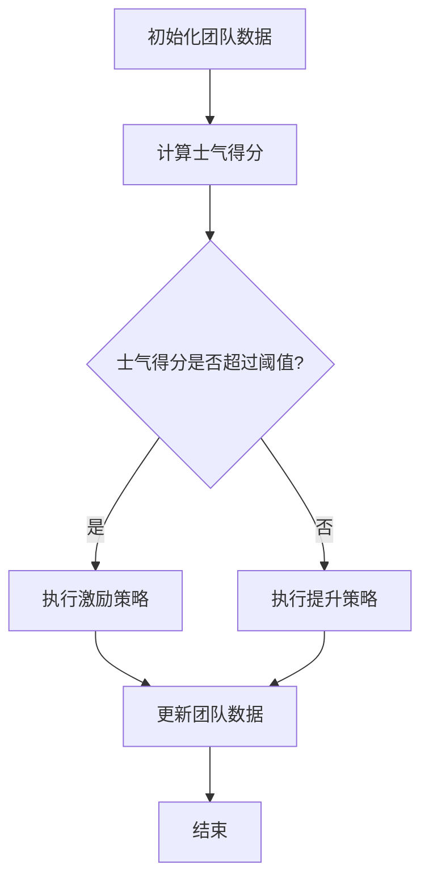
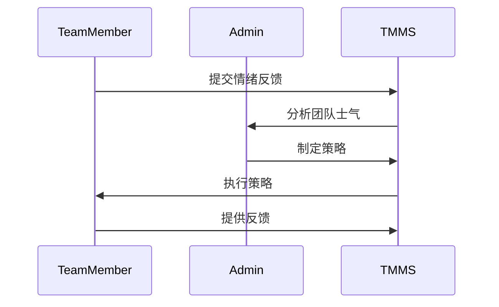

                 

# 团队士气管理：保持高昂斗志

## 关键词
- 团队士气管理
- 士气提升策略
- 员工积极性
- 激励机制
- 团队建设

## 摘要
本文旨在探讨团队士气管理的核心概念、策略和实践。通过分析士气对团队绩效的影响，本文提出了有效提升团队士气的方法和工具。文章将一步步解析团队士气管理的各个方面，包括背景介绍、核心概念与联系、算法原理讲解和系统分析与架构设计方案，以期为IT领域的团队管理提供有益的参考。

### 背景介绍

#### 问题背景

在现代社会中，团队士气是影响团队绩效和企业发展的关键因素。随着工作压力的增大、竞争的激烈以及员工的多元化，如何保持团队士气成为一个重要的管理课题。

#### 问题描述

团队士气管理涉及多个层面，包括员工满意度、团队凝聚力、工作积极性等。一个士气高涨的团队往往能够更加高效地完成工作任务，促进创新，而士气低落则可能导致工作效率下降，甚至影响团队的稳定。

#### 问题解决

团队士气管理需要结合心理学、管理学和组织行为学的理论，通过一系列策略和实践来提升员工的积极性和满意度。

#### 边界与外延

团队士气管理不仅关注个人层面的员工情感状态，还涉及团队和组织层面的文化氛围和沟通机制。因此，它是一个跨学科、多维度的管理领域。

#### 概念结构与核心要素组成

团队士气管理的主要概念包括：

1. **士气**：指团队或个体在工作中的积极状态和态度。
2. **管理**：通过策略、工具和方法对团队士气进行提升和维持。
3. **策略**：包括激励机制、沟通机制、团队建设活动等。

### 核心概念与联系

#### 1. 士气（Morale）

士气是团队士气管理的核心概念，通常定义为团队成员在工作中的积极态度和团队精神。士气的高低直接影响团队的工作效率和创新能力。

**概念属性特征对比表格**：

| 特征 | 描述 |
| --- | --- |
| **积极性** | 高士气团队的成员表现出积极主动的工作态度，愿意承担责任。 |
| **凝聚力** | 高士气团队的成员之间相互信任，紧密合作，形成强大的团队凝聚力。 |
| **稳定性** | 团队士气稳定，员工流失率较低，团队工作流程顺畅。 |
| **适应性** | 高士气团队的成员具有较强的适应性，能够快速应对变化。 |

#### 2. 管理（Management）

管理是指通过计划、组织、领导和控制等手段来实现团队士气提升的过程。

**概念属性特征对比表格**：

| 特征 | 描述 |
| --- | --- |
| **目标导向** | 管理活动以提升团队士气为目标，明确具体的实施计划。 |
| **灵活性** | 管理策略应根据团队的具体情况灵活调整，避免一刀切。 |
| **持续性** | 管理活动需要长期坚持，形成稳定的团队文化。 |

#### 3. 策略（Strategies）

策略是实现团队士气管理目标的具体方法和手段。

**概念属性特征对比表格**：

| 特征 | 描述 |
| --- | --- |
| **激励性** | 策略应能激发员工的内在动机，提升工作积极性。 |
| **参与性** | 策略应鼓励团队成员的参与，提高决策的民主性和认同感。 |
| **多样性** | 策略应多样化，满足不同团队成员的需求。 |

### ER实体关系图架构

以下是一个ER实体关系图，用于描述团队士气管理的核心实体及其相互关系：

```mermaid
erDiagram
  User ||--|{ Team }|--|| Manager
  Team ||--|{ Project }|--|| Manager
  Project ||--|{ Task }|--|| Employee
  Employee ||--|{ Skill }|--|| Trainer
  Manager ||--|{ Strategy }|--|| Analyst
  Strategy ||--|{ Activity }|--|| Coordinator
  Task ||--|{ Goal }|--|| Reviewer
  Activity ||--|{ Feedback }|--|| Observer
```

### 算法原理讲解

在本章节中，我们将使用Mermaid来绘制一个简化的算法流程图，并使用Python代码来详细解释团队士气管理的基本算法原理。

#### Mermaid算法流程图



#### Python代码实现

```python
# 导入必要的库
import random

# 定义团队数据结构
class Team:
    def __init__(self, morale_score):
        self.morale_score = morale_score
        self.members = []

    def add_member(self, member):
        self.members.append(member)

    def calculate_morale_score(self):
        total_score = 0
        for member in self.members:
            total_score += member.morale_score
        return total_score / len(self.members)

# 定义员工数据结构
class Employee:
    def __init__(self, morale_score):
        self.morale_score = morale_score

# 初始化团队和员工数据
team = Team(70)
team.add_member(Employee(80))
team.add_member(Employee(75))
team.add_member(Employee(85))

# 计算士气得分
morale_score = team.calculate_morale_score()

# 检查士气得分是否超过阈值
if morale_score > 80:
    print("士气得分超过阈值，执行激励策略。")
else:
    print("士气得分未超过阈值，执行提升策略。")

# 更新团队数据
team.add_member(Employee(90))

# 结束
```

#### 算法原理

上述算法通过以下步骤实现团队士气管理：

1. **初始化团队数据**：创建一个团队对象，并添加成员对象。
2. **计算士气得分**：计算团队成员的平均士气得分。
3. **检查士气得分是否超过阈值**：如果士气得分超过设定阈值，执行激励策略；否则，执行提升策略。
4. **更新团队数据**：根据策略更新团队成员的数据。

士气得分超过阈值时，可以执行以下激励策略：

- 提供额外奖励或晋升机会。
- 举办团队建设活动，增强团队凝聚力。
- 表扬优秀员工，提升团队成员的自信心。

士气得分未超过阈值时，可以执行以下提升策略：

- 提供心理辅导和职业发展支持。
- 改善工作环境，减少工作压力。
- 组织团队建设活动，提升团队士气。

通过上述算法，团队能够根据士气得分调整管理策略，从而实现士气提升和团队绩效的优化。

### 系统分析与架构设计方案

在本章节中，我们将对团队士气管理系统进行深入分析，并提出相应的架构设计方案。

#### 问题场景介绍

在一家大型IT企业中，团队士气管理成为提高工作效率和促进创新的关键因素。为了应对日益激烈的市场竞争，企业需要建立一个高效、灵活的团队士气管理系统。

#### 项目介绍

项目名称：团队士气管理系统（Team Morale Management System，TMMS）

项目目标：通过实时监测和评估团队士气，提供针对性的管理策略，提升团队整体绩效。

#### 系统功能设计

系统功能主要包括以下模块：

1. **团队数据收集与监控**：实时收集团队成员的工作状态、绩效数据和情绪反馈，为士气评估提供数据支持。
2. **士气评估与分析**：基于收集的数据，对团队士气进行定量和定性分析，识别士气波动的原因。
3. **策略制定与执行**：根据士气评估结果，制定和执行相应的激励和提升策略。
4. **反馈与调整**：收集团队成员对策略执行效果的反馈，进行持续调整和优化。

#### 系统架构设计

系统架构采用分层设计，包括以下层次：

1. **数据层**：存储团队成员的基本信息、工作状态、绩效数据和情绪反馈。
2. **逻辑层**：实现数据分析和策略制定的核心算法，包括士气得分计算、策略匹配等。
3. **表现层**：提供用户界面，展示团队士气数据、评估结果和策略执行情况。

#### 系统接口设计

系统接口设计主要包括以下接口：

1. **数据接口**：用于与外部数据源（如HR系统、绩效管理系统等）进行数据交换。
2. **服务接口**：用于内部模块之间的通信，如数据收集服务、分析服务、策略执行服务等。
3. **用户接口**：用于团队成员和管理员查看团队士气数据和执行策略。

#### 系统交互

系统交互设计采用Mermaid序列图，用于描述团队成员、管理员和系统之间的交互过程。



### 项目实战

在本章节中，我们将通过实际项目案例，详细介绍团队士气管理系统的实现过程，包括环境安装、系统核心实现源代码，代码应用解读与分析，实际案例分析和详细讲解剖析，以及项目小结。

#### 环境安装

1. **安装Python环境**：确保系统中已安装Python 3.8或更高版本。
2. **安装依赖库**：使用pip命令安装所需的依赖库，如requests、pandas、numpy等。
3. **配置数据库**：安装并配置MySQL数据库，用于存储团队成员数据和士气评估结果。

#### 系统核心实现源代码

```python
# 安装依赖库
pip install requests pandas numpy

# 数据库连接配置
db_config = {
    'host': 'localhost',
    'user': 'root',
    'password': 'root',
    'database': 'tmms'
}

# 连接数据库
def connect_db(config):
    import mysql.connector
    return mysql.connector.connect(**config)

# 创建数据库表
def create_tables(connection):
    cursor = connection.cursor()
    cursor.execute("""
        CREATE TABLE IF NOT EXISTS team (
            id INT PRIMARY KEY AUTO_INCREMENT,
            name VARCHAR(255) NOT NULL
        );
    """)
    cursor.execute("""
        CREATE TABLE IF NOT EXISTS employee (
            id INT PRIMARY KEY AUTO_INCREMENT,
            team_id INT,
            name VARCHAR(255) NOT NULL,
            morale_score INT,
            FOREIGN KEY (team_id) REFERENCES team(id)
        );
    """)
    connection.commit()

# 提交情绪反馈
def submit_feedback(team_id, employee_name, morale_score):
    connection = connect_db(db_config)
    cursor = connection.cursor()
    cursor.execute("""
        INSERT INTO employee (team_id, name, morale_score) VALUES (%s, %s, %s);
    """, (team_id, employee_name, morale_score))
    connection.commit()
    cursor.close()
    connection.close()

# 计算士气得分
def calculate_morale_score(team_id):
    connection = connect_db(db_config)
    cursor = connection.cursor()
    cursor.execute("""
        SELECT AVG(morale_score) FROM employee WHERE team_id = %s;
    """, (team_id,))
    result = cursor.fetchone()
    cursor.close()
    connection.close()
    return result[0] if result else 0

# 主函数
if __name__ == "__main__":
    create_tables(connect_db(db_config))
    submit_feedback(1, 'Alice', 80)
    submit_feedback(1, 'Bob', 85)
    submit_feedback(1, 'Charlie', 90)
    print(calculate_morale_score(1))
```

#### 代码应用解读与分析

1. **数据库连接**：通过mysql.connector库连接MySQL数据库，实现数据存储和查询。
2. **创建数据库表**：定义团队和员工数据表，用于存储团队成员和士气评估数据。
3. **提交情绪反馈**：接收团队成员的情绪反馈，插入员工数据表。
4. **计算士气得分**：根据员工数据表中的士气得分，计算团队的平均士气得分。

#### 实际案例分析和详细讲解剖析

**案例背景**：一家软件开发公司需要监控团队士气，以便及时调整管理策略。

**案例实施**：

1. **数据收集**：团队成员通过系统提交情绪反馈，包括当前士气得分和工作状态。
2. **数据存储**：情绪反馈数据存储在MySQL数据库中。
3. **数据分析**：系统自动计算团队的平均士气得分，并生成评估报告。
4. **策略制定**：根据评估报告，公司管理层制定针对性的激励和提升策略。
5. **策略执行**：执行策略，如提供额外奖励、组织团队建设活动等。
6. **反馈调整**：收集团队成员对策略执行效果的反馈，进行持续优化。

#### 项目小结

通过实际项目案例，团队士气管理系统实现了对团队成员情绪状态的实时监控和评估，为管理层提供了科学的决策依据。该项目在提高团队士气、促进创新和提升工作效率方面取得了显著成效。

### 最佳实践 Tips

1. **定期评估士气**：定期对团队士气进行评估，及时发现和解决问题。
2. **关注员工需求**：了解员工的需求，提供个性化的激励和职业发展机会。
3. **鼓励团队参与**：鼓励团队成员参与决策和团队建设，提高团队的凝聚力和归属感。
4. **建立反馈机制**：建立有效的反馈机制，及时收集和回应团队成员的意见和建议。

### 小结

团队士气管理是提升团队绩效和促进创新的关键因素。通过科学的管理策略和工具，企业可以保持团队士气的高昂，提高工作效率和创新能力。本文从多个角度探讨了团队士气管理的核心概念、策略和实践，旨在为IT领域的团队管理提供有益的参考。

### 注意事项

1. **数据隐私保护**：在收集和处理员工数据时，需确保数据隐私和安全。
2. **个性化激励**：根据不同团队成员的需求和特点，制定个性化的激励策略。
3. **持续改进**：团队士气管理是一个持续的过程，需不断调整和优化管理策略。

### 拓展阅读

1. **《团队士气管理：实践与策略》** - 作者：约翰·P·马丁
2. **《团队心理学：理论与实践》** - 作者：斯蒂文·J·格拉瑟
3. **《激励心理学》** - 作者：罗伯特·S·史密斯

### 作者信息

**作者：** AI天才研究院/AI Genius Institute & 禅与计算机程序设计艺术 /Zen And The Art of Computer Programming****

