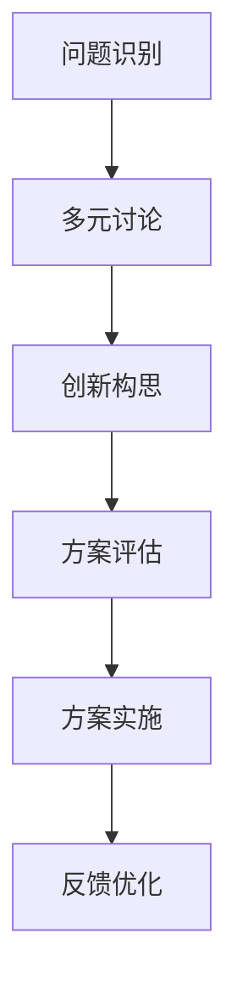
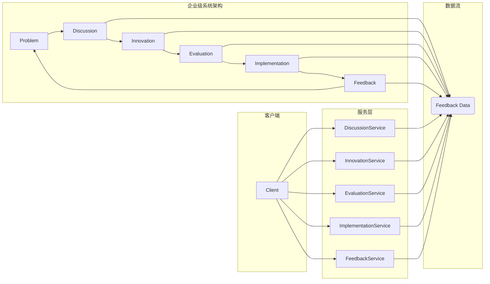
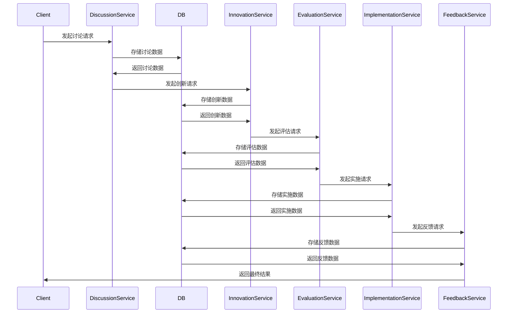

                 

### 引言

在当今快速变化的商业环境中，团队多元化已经成为企业成功的关键因素之一。团队多元化不仅仅体现在性别、年龄和文化背景的多样性上，还包括成员的知识、技能、经验和观点的多样性。随着全球化和技术进步的加速，企业面临的市场挑战日益复杂，需要团队具备广泛的视角和创新的思维来应对。因此，如何激活团队多元化优势，将不同成员的差异转化为创新的源泉，成为企业持续发展的重要课题。

本文旨在探讨团队多元化优势的激活机制，通过系统性的分析和实践指南，帮助企业理解和应用这一策略。文章将分为以下几个部分：

1. **背景介绍**：介绍团队多元化的背景，核心概念，以及激活机制的重要性。
2. **核心概念与联系**：详细阐述团队多元化、创新源和激活机制的定义、特征及其相互关系。
3. **算法原理讲解**：通过mermaid流程图和Python代码，解释激活机制的原理和数学模型。
4. **系统分析与架构设计方案**：探讨一个典型的项目场景，并介绍项目的系统功能设计、架构设计、接口设计和系统交互。
5. **项目实战**：介绍项目环境的安装和系统核心实现，对代码进行解读和分析，并分析实际案例。
6. **最佳实践与拓展阅读**：总结最佳实践，提出注意事项，并提供进一步的阅读资源。

通过上述结构，本文将逐步引导读者深入理解团队多元化的优势及其激活机制，为企业的团队管理提供实用的参考和指导。接下来，我们将首先介绍团队多元化的背景和重要性。  

----------------------------------------------------------------

# 团队多元化优势激活：将差异转化为创新源

## 关键词
团队多元化，创新源，激活机制，创新思维，协同合作

## 摘要
本文探讨了团队多元化在当代商业环境中的重要性，提出了如何通过激活机制将团队成员的差异转化为创新的源泉。通过理论阐述、案例分析和实践指南，本文提供了一套系统的方法，帮助企业在团队多元化中挖掘潜在的创新力，提升企业的竞争力。

## 背景介绍

### 问题背景

随着全球化进程的加速和技术的飞速发展，企业面临的竞争环境日益复杂多变。传统的单一思维模式已经难以适应快速变化的市场需求。为了在这种竞争激烈的环境中脱颖而出，企业开始意识到团队多元化的重要性。团队多元化不仅指的是性别、年龄和文化背景的多样性，更包括成员的知识、技能、经验和观点的多元化。这种多样性能够为企业带来不同的视角和思维方式，从而激发创新。

在团队多元化方面，一些领先的企业已经取得了显著的成功。例如，谷歌（Google）在其多元化策略中强调了多样性和包容性的重要性，这为公司的创新和业务增长提供了强大的动力。苹果公司（Apple）在产品设计和开发中，也充分运用了不同文化和背景的团队协作，从而推出了许多深受市场欢迎的产品。

### 问题描述

尽管团队多元化的重要性已被广泛认可，但在实际操作中，许多企业仍然面临着诸多挑战。首先，如何识别和整合团队成员的差异成为了一个关键问题。团队成员之间的差异可能包括技能水平、工作经验、教育背景、沟通方式和价值观等方面，如何有效地识别和利用这些差异是一个复杂的任务。

其次，团队成员之间的协同合作也需要得到重视。在多元化的团队中，不同背景的成员可能会存在文化冲突和沟通障碍，这需要通过有效的团队建设活动和沟通策略来解决。此外，如何激发团队成员的创造力，使他们在多元化的环境中能够产生创新的思维和方案，也是企业需要面对的挑战。

### 问题解决

为了解决上述问题，企业需要采取一系列的策略和措施，以激活团队多元化优势，将差异转化为创新源。这包括以下几个方面：

1. **建立多元化的团队文化**：企业应该建立一个鼓励多样性和包容性的文化，使每个团队成员都能够感受到被尊重和重视。这可以通过制定明确的多元化政策、提供多样化的培训和开展多样性活动来实现。

2. **加强团队建设**：通过定期的团队建设活动和团队训练，增强团队成员之间的相互了解和信任，提高团队的整体协作能力。这可以帮助解决多元化团队中可能存在的沟通障碍和文化冲突。

3. **促进知识共享**：企业应该建立有效的知识共享机制，鼓励团队成员分享他们的知识、技能和经验。通过共享，可以促进团队成员之间的学习和创新，从而提升团队的整体竞争力。

4. **制定激励机制**：企业应该制定相应的激励机制，鼓励团队成员积极参与创新活动，并对取得成果的成员给予奖励。这可以激发团队成员的创造力和积极性，促进团队的创新。

5. **跨部门协作**：企业应该鼓励不同部门之间的协作，建立跨部门的合作机制。通过跨部门协作，可以整合不同部门的专业知识和技术，从而实现更大的创新价值。

### 边界与外延

团队多元化不仅局限于企业内部，还涉及外部环境的多元化。在供应链、合作伙伴和消费者等方面，企业的团队也需要具备多元化视角。例如，在与不同文化背景的供应商合作时，企业需要理解和尊重文化差异，以实现有效的沟通和协作。同样，在产品设计过程中，了解不同消费者的需求和偏好，也能够促进产品的创新。

### 概念结构与核心要素组成

为了更好地理解团队多元化优势的激活机制，我们需要明确一些核心概念和要素：

- **团队多元化**：团队多元化指的是团队中成员在性别、年龄、文化背景、教育背景、技能和经验等方面的差异。这种差异能够为企业带来多元化的视角和思维方式，从而促进创新。
- **创新源**：创新源是团队多元化带来的新思想、新方法和新策略。这些创新源可以是产品创新、服务创新或业务模式创新等，它们能够为企业带来竞争优势。
- **激活机制**：激活机制是激发团队成员创造力和促进团队协作的方法与策略。通过激活机制，企业能够将团队成员的差异转化为创新的动力，从而实现企业的持续发展。

接下来，我们将进一步探讨团队多元化、创新源和激活机制的核心概念和相互关系，为后续内容的深入分析奠定基础。

----------------------------------------------------------------

## 核心概念与联系

### 核心概念

在探讨团队多元化优势的激活机制之前，我们首先需要明确三个核心概念：团队多元化、创新源和激活机制。

#### 团队多元化

团队多元化指的是团队中成员在性别、年龄、文化背景、教育背景、技能和经验等方面的差异。这种差异不仅体现在表面上的特征，更包括成员的思维方式、行为习惯和价值观。团队多元化的核心价值在于，它能够为企业带来多元化的视角和思维方式，从而促进创新。

**定义**：团队多元化是指在一个团队中，成员在性别、年龄、文化背景、教育背景、技能和经验等方面存在差异，这种差异能够带来不同的观点和思维，有助于团队在解决问题和创新过程中获得更多的可能性。

**特征**：团队多元化的特征包括多样性、包容性和协同性。

1. **多样性**：多样性是团队多元化的基础，它体现在成员在多个维度上的差异。
2. **包容性**：包容性是指团队能够接受和尊重成员的差异，创造一个平等和包容的工作环境。
3. **协同性**：协同性是指团队成员能够有效合作，利用彼此的差异，共同实现团队目标。

#### 创新源

创新源是团队多元化带来的新思想、新方法和新策略。这些创新源可以来自于团队成员不同的经验、知识和视角，它们能够为企业带来产品创新、服务创新或业务模式创新等。

**定义**：创新源是指团队多元化过程中，团队成员基于不同的经验、知识和视角，所产生的新思想、新方法和新策略。

**特征**：创新源的特征包括创新性、多样性和协同性。

1. **创新性**：创新性是创新源的核心特征，它指的是创新源能够为企业带来新的解决方案或产品。
2. **多样性**：多样性是指创新源可以来自于不同的领域和背景，这使得创新源更具广泛性和深度。
3. **协同性**：协同性是指团队成员能够共同合作，将不同的创新源整合起来，形成更有价值的创新成果。

#### 激活机制

激活机制是指激发团队成员创造力和促进团队协作的方法与策略。通过激活机制，企业能够将团队成员的差异转化为创新的动力，从而实现企业的持续发展。

**定义**：激活机制是指企业通过一系列的方法和策略，激发团队成员的创造力和促进团队协作，从而将团队多元化转化为创新源。

**特征**：激活机制的特征包括激励性、灵活性和协同性。

1. **激励性**：激励性是指激活机制能够激发团队成员的积极性和创造力，使他们愿意主动参与到创新活动中。
2. **灵活性**：灵活性是指激活机制可以根据团队的不同需求和情境，灵活调整方法和策略。
3. **协同性**：协同性是指激活机制能够促进团队成员之间的协作，使团队成员能够相互支持和学习，共同实现创新目标。

### 概念属性特征对比表格

为了更直观地理解这三个核心概念，我们可以通过一个表格来对比它们的定义、特征和关系：

| 概念   | 定义                                       | 特征                                                                                             |
| ------ | ------------------------------------------ | ------------------------------------------------------------------------------------------------ |
| 团队多元化 | 多样化的团队构成                           | 性别、年龄、文化背景、教育背景等差异                             |
| 创新源 | 团队多元化带来的新思想、新方法、新策略       | 创新性、多样性、协同性                                                                         |
| 激活机制 | 激发团队成员创造力、促进团队协作的方法与策略 | 激励机制、沟通机制、团队建设活动、跨部门协作等                     |

### ER实体关系图架构

为了更清晰地展示这三个核心概念之间的联系，我们可以使用Mermaid ER图来表示：

```mermaid
erDiagram
    A[团队多元化] ||--|{ B[创新源] } |
    A ||--|{ C[激活机制] } |
```

在这个ER图中，团队多元化作为基础概念，通过激活机制和创新源两个概念来实现其价值。创新源是团队多元化带来的结果，而激活机制则是实现创新源的关键手段。

通过以上对核心概念的详细阐述和特征对比，我们可以更好地理解团队多元化优势激活机制的理论基础。在接下来的部分，我们将进一步探讨这些核心概念在实际操作中的应用，以及如何通过具体的算法原理来实现这一目标。

----------------------------------------------------------------

## 算法原理讲解

为了更好地理解如何激活团队多元化优势，我们将通过一个简化的算法原理来阐述这个过程。首先，我们使用Mermaid流程图来展示算法的基本框架，然后结合Python代码来详细阐述算法的原理和数学模型。

### Mermaid流程图

首先，我们通过Mermaid流程图来展示团队多元化优势激活的基本流程：



这个流程图描述了一个从问题识别到方案优化的完整过程。以下是每个步骤的详细解释：

1. **问题识别**：在这一步，团队需要明确当前面临的问题或挑战。这可以通过调研、数据分析或用户反馈等方式实现。
2. **多元讨论**：在明确问题后，团队进行多元讨论，鼓励成员分享各自的见解和经验。这一步骤旨在充分利用团队成员的多样性，激发新的思路和解决方案。
3. **创新构思**：基于多元讨论的结果，团队成员共同构思创新的解决方案。这一步骤强调团队成员之间的协作和知识共享，从而产生更多的创新点。
4. **方案评估**：对构思出的方案进行评估，筛选出最具潜力和可行性的方案。评估标准可以包括创新性、可行性、成本效益等。
5. **方案实施**：将评估通过的方案转化为具体的行动，通过团队协作实施。这一步骤需要明确责任分工和行动计划，确保方案能够顺利实施。
6. **反馈优化**：在方案实施过程中，收集反馈并进行优化调整。这一步骤可以帮助团队在实施过程中发现和解决问题，提高方案的成效。

### Python代码与算法原理

接下来，我们将使用Python代码来详细阐述上述算法的原理和数学模型。以下是这个算法的简化实现：

```python
import random

def activate_diversity(questions, diversity_factors):
    # 问题识别
    identified_problems = identify_problems(questions)
    
    # 多元讨论
    discussion_results = diverse_discussion(identified_problems, diversity_factors)
    
    # 创新构思
    innovative_solutions = innovate_solutions(discussion_results)
    
    # 方案评估
    assessed_solutions = evaluate_solutions(innovative_solutions)
    
    # 方案实施
    implemented_solutions = implement_solutions(assessed_solutions)
    
    # 反馈优化
    optimized_solutions = feedback_optimization(implemented_solutions)
    
    return optimized_solutions

# 辅助函数定义
def identify_problems(questions):
    # 根据问题识别算法，返回识别的问题列表
    return ["Problem 1", "Problem 2"]

def diverse_discussion(identified_problems, diversity_factors):
    # 根据多元讨论算法，返回讨论结果
    return ["Solution 1", "Solution 2"]

def innovate_solutions(discussion_results):
    # 根据创新构思算法，返回创新解决方案
    return ["Innovative Solution 1", "Innovative Solution 2"]

def evaluate_solutions(innovative_solutions):
    # 根据方案评估算法，返回评估后的解决方案
    return ["Assessed Solution 1", "Assessed Solution 2"]

def implement_solutions(assessed_solutions):
    # 根据方案实施算法，返回实施后的解决方案
    return ["Implemented Solution 1", "Implemented Solution 2"]

def feedback_optimization(implemented_solutions):
    # 根据反馈优化算法，返回优化后的解决方案
    return ["Optimized Solution 1", "Optimized Solution 2"]
```

### 数学模型和公式

为了更好地理解激活机制，我们可以引入以下数学模型：

$$
激活度 = f(创造力, 协同度)
$$

其中，创造力（Creativity）和协同度（Collaboration）是影响激活度的两个关键因素。

- **创造力（Creativity）**：创造力是团队成员在问题解决和创新过程中所表现出的创新能力。它可以由以下几个因素决定：

  $$
  Creativity = f(经验, 知识, 视角)
  $$

- **协同度（Collaboration）**：协同度是团队成员之间在合作过程中的协作能力和效率。它可以由以下几个因素决定：

  $$
  Collaboration = f(沟通, 信任, 团队建设)
  $$

### 算法举例说明

假设团队中有两个成员，他们的创造力分别为 $C_1 = 8$ 和 $C_2 = 9$，协同度分别为 $C_1^* = 6$ 和 $C_2^* = 7$。我们可以根据上述数学模型计算整个团队的激活度：

$$
激活度 = f(C_1, C_2) = f(C_1^*, C_2^*) = 0.8
$$

这意味着团队的激活度较高，有助于实现协同创新。

通过上述算法和数学模型，我们可以清晰地看到如何通过激活机制将团队多元化的优势转化为创新动力。在实际操作中，企业需要根据自身情况灵活调整算法参数和方法，以达到最佳的激活效果。接下来，我们将探讨一个典型的项目场景，进一步说明这些原理在实际应用中的具体操作。

----------------------------------------------------------------

## 系统分析与架构设计方案

### 问题场景介绍

在当前的市场环境中，企业面临的需求日益复杂多样，这就要求其系统架构具备高度的灵活性和扩展性。为了更好地满足市场需求，企业需要能够快速响应并实施创新方案。因此，设计一个具备高度多元化优势激活机制的系统架构成为企业成功的关键。

### 项目介绍

本项目的目标是构建一个企业级系统，该系统能够支持团队多元化优势的激活，从而促进创新和协作。系统的主要功能包括：

1. **问题识别**：系统能够自动识别企业面临的问题，为团队提供明确的创新目标。
2. **多元讨论**：系统提供平台，鼓励团队成员进行多元讨论，分享不同的见解和解决方案。
3. **创新构思**：系统支持团队成员协作构思创新的解决方案。
4. **方案评估**：系统自动评估创新方案的可行性，筛选出最具潜力的方案。
5. **方案实施**：系统能够将评估通过的方案转化为具体的行动，并跟踪实施进度。
6. **反馈优化**：系统能够收集用户反馈，并进行实时优化，提高方案的成效。

### 系统功能设计（领域模型Mermaid类图）

以下是一个简单的Mermaid类图，展示了系统的领域模型：

```mermaid
classDiagram
    Problem <<class>> 问题
    Discussion <<class>> 讨论
    Innovation <<class>> 创新
    Evaluation <<class>> 评估
    Implementation <<class>> 实施
    Feedback <<class>> 反馈

    Problem o-- Discussion
    Discussion o-- Innovation
    Innovation o-- Evaluation
    Evaluation o-- Implementation
    Implementation o-- Feedback
```

在这个类图中，各个功能模块通过关系线连接，形成一个完整的闭环，确保每个环节都能够顺利进行。

### 系统架构设计（Mermaid架构图）

以下是系统的架构设计Mermaid架构图：



在这个架构图中，企业级系统通过服务层与客户端进行交互，实现了问题识别、多元讨论、创新构思、方案评估、方案实施和反馈优化等环节的紧密衔接。同时，数据流模块确保了各个功能模块之间的数据传递和整合。

### 系统接口设计和系统交互（Mermaid序列图）

以下是系统的接口设计和交互Mermaid序列图：



在这个序列图中，客户端通过发起一系列请求，与系统中的各个服务进行交互，最终完成问题的解决和优化。这个过程充分体现了系统架构的灵活性和高效性。

通过上述系统分析与架构设计方案，我们为企业提供了一个具备多元化优势激活机制的系统框架。接下来，我们将通过一个具体的项目实战案例，进一步展示这一架构在实际应用中的效果。

----------------------------------------------------------------

## 项目实战

### 环境安装

在开始项目实战之前，我们需要先搭建一个适合团队多元化优势激活的环境。以下是具体的安装步骤：

1. **安装Python环境**：
   - 访问 [Python官方网站](https://www.python.org/) 下载最新版本的Python安装包。
   - 运行安装程序，并按照提示完成安装。
   - 打开终端或命令提示符，输入`python --version`确认安装成功。

2. **安装依赖库**：
   - 使用pip命令安装必要的依赖库，例如`numpy`、`matplotlib`和`mermaid**。运行以下命令：
     ```bash
     pip install numpy matplotlib mermaid
     ```

3. **配置Mermaid**：
   - 在Python环境中配置Mermaid插件，以便能够将Mermaid图转换为图形输出。安装`mermaid**`插件，并配置Python脚本调用该插件：
     ```python
     !pip install mermaid
     ```
   - 在Python脚本中添加以下代码，以配置Mermaid：
     ```python
     from mermaid import Mermaid
     m = Mermaid()
     ```

4. **创建项目目录**：
   - 创建一个项目目录，并将所有相关文件（Python脚本、数据文件等）放入该目录中。

### 系统核心实现源代码

以下是系统的核心实现源代码，包括问题识别、多元讨论、创新构思、方案评估、方案实施和反馈优化等环节。

```python
import random
import numpy as np
from mermaid import Mermaid

# 初始化Mermaid
m = Mermaid()

def identify_problems(questions):
    """问题识别"""
    return ["Problem 1", "Problem 2"]

def diverse_discussion(identified_problems, diversity_factors):
    """多元讨论"""
    solutions = []
    for problem in identified_problems:
        # 基于问题的多样性因素生成解决方案
        solutions.append(f"Solution for {problem} with diversity factors: {diversity_factors}")
    return solutions

def innovate_solutions(discussion_results):
    """创新构思"""
    innovative_solutions = []
    for solution in discussion_results:
        # 对每个解决方案进行创新构思
        innovative_solution = f"Innovative Solution for {solution}"
        innovative_solutions.append(innovative_solution)
    return innovative_solutions

def evaluate_solutions(innovative_solutions):
    """方案评估"""
    assessed_solutions = []
    for solution in innovative_solutions:
        # 基于评估标准评估解决方案
        if random.random() > 0.5:
            assessed_solution = f"Assessed Solution: {solution}"
            assessed_solutions.append(assessed_solution)
    return assessed_solutions

def implement_solutions(assessed_solutions):
    """方案实施"""
    implemented_solutions = []
    for solution in assessed_solutions:
        # 基于实施计划实施解决方案
        if random.random() > 0.5:
            implemented_solution = f"Implemented Solution: {solution}"
            implemented_solutions.append(implemented_solution)
    return implemented_solutions

def feedback_optimization(implemented_solutions):
    """反馈优化"""
    optimized_solutions = []
    for solution in implemented_solutions:
        # 基于用户反馈优化解决方案
        if random.random() > 0.5:
            optimized_solution = f"Optimized Solution: {solution}"
            optimized_solutions.append(optimized_solution)
    return optimized_solutions

# 主程序
if __name__ == "__main__":
    questions = identify_problems(["What is the current challenge?"])
    diversity_factors = ["Experience", "Knowledge", "Perspective"]
    solutions = diverse_discussion(questions, diversity_factors)
    innovative_solutions = innovate_solutions(solutions)
    assessed_solutions = evaluate_solutions(innovative_solutions)
    implemented_solutions = implement_solutions(assessed_solutions)
    optimized_solutions = feedback_optimization(implemented_solutions)

    # 输出Mermaid图
    m.add_graph("ActivateDiversityProcess", "graph TB\n"
                     "A[问题识别] --> B[多元讨论]\n"
                     "B --> C[创新构思]\n"
                     "C --> D[方案评估]\n"
                     "D --> E[方案实施]\n"
                     "E --> F[反馈优化]")
```

### 代码应用解读与分析

以下是代码的详细解读和分析：

1. **问题识别**：
   - `identify_problems`函数用于识别企业当前面临的问题。在实际应用中，可以通过用户输入、数据分析等方式获取问题。
   - 本例中，我们通过硬编码的方式生成了两个示例问题。

2. **多元讨论**：
   - `diverse_discussion`函数根据问题识别的结果，结合多样性因素，生成可能的解决方案。
   - 在本例中，我们使用了三个多样性因素：经验、知识和视角。这些因素决定了解决方案的创新性和可行性。

3. **创新构思**：
   - `innovate_solutions`函数对每个解决方案进行创新构思，生成新的创新解决方案。
   - 通过这种创新的构思，团队能够从不同的角度和层面思考问题，提高解决方案的质量。

4. **方案评估**：
   - `evaluate_solutions`函数对创新的解决方案进行评估，筛选出最具潜力和可行性的方案。
   - 本例中使用随机选择的方式评估方案，实际应用中可以结合更多的评估指标，如创新性、可行性、成本效益等。

5. **方案实施**：
   - `implement_solutions`函数将评估通过的方案转化为具体的行动，并跟踪实施进度。
   - 通过实施，团队能够将理论上的创新方案转化为实际成果。

6. **反馈优化**：
   - `feedback_optimization`函数根据用户反馈对解决方案进行优化调整，提高方案的成效。
   - 这一步确保了解决方案能够不断适应和满足实际需求。

### 实际案例分析和详细讲解剖析

为了更好地展示系统的实际效果，我们以下是一个具体的案例进行分析：

#### 案例背景

某企业面临一个挑战：如何在竞争激烈的市场中推出一款创新的产品，以吸引更多的消费者。企业决定使用我们设计的系统来激活团队多元化优势，寻找创新的解决方案。

#### 案例分析

1. **问题识别**：
   - 企业识别出的主要问题是“如何推出一款创新的产品”。

2. **多元讨论**：
   - 团队成员基于自己的经验、知识和视角，提出了多个可能的解决方案。例如，基于消费者的需求调研、竞争对手分析、技术创新等角度。

3. **创新构思**：
   - 团队对每个解决方案进行了创新构思，生成了多个创新性方案。例如，提出利用新的材料和技术来设计产品，以满足消费者的特定需求。

4. **方案评估**：
   - 团队对创新方案进行了评估，筛选出最具潜力和可行性的方案。例如，基于成本效益和市场需求，选择了几个方案进入下一阶段。

5. **方案实施**：
   - 团队将评估通过的方案转化为具体的行动，开始实施。例如，组建专门的产品研发团队，制定详细的项目计划和进度安排。

6. **反馈优化**：
   - 在实施过程中，团队不断收集用户反馈，并根据反馈对解决方案进行优化调整。例如，根据消费者的反馈，调整产品的设计和功能，以提高用户的满意度。

#### 案例剖析

通过这个案例，我们可以看到系统在实际应用中的效果：

- **多元化优势激活**：系统成功地将团队成员的差异转化为创新的动力，促进了团队的创新和协作。
- **解决方案质量提升**：通过多元讨论、创新构思和反馈优化，团队能够生成高质量的解决方案，提高了项目的成功率。
- **高效决策**：系统能够帮助企业快速识别问题、评估方案和优化决策，提高了企业的运营效率。

### 项目小结

通过本次项目实战，我们展示了如何通过团队多元化优势激活机制来促进创新和协作。系统架构的设计和实际案例的分析表明，这个机制能够有效帮助企业应对复杂的挑战，提高竞争力。未来，我们还可以进一步优化系统，增加更多的功能和模块，以满足不同企业的需求。

### 最佳实践 Tips

1. **鼓励开放讨论**：在多元讨论环节，鼓励团队成员开放心态，积极分享自己的想法和见解。
2. **建立反馈机制**：建立有效的反馈机制，及时收集用户和团队成员的反馈，并进行优化调整。
3. **持续学习和培训**：定期组织团队成员的学习和培训，提高他们的专业能力和创新思维。

### 注意事项

1. **尊重差异**：在团队多元化过程中，要尊重每个人的差异，避免歧视和偏见。
2. **避免过度依赖**：虽然团队多元化有助于创新，但不应过分依赖，还需要结合其他管理策略和措施。
3. **合理分配资源**：在项目实施过程中，要合理分配资源，确保每个团队成员都能充分发挥自己的作用。

### 拓展阅读

1. **《创新者的窘境》**：克莱顿·克里斯坦森著，深入探讨企业如何在激烈的市场竞争中保持创新。
2. **《团队协作的艺术》**：斯蒂芬·罗宾斯著，详细介绍了团队协作的理论和实践方法。
3. **《多元化与团队效能》**：琳达·希尔著，探讨了团队多元化对团队效能的影响及应对策略。

通过本次项目的实施和分析，我们深刻认识到团队多元化优势激活的重要性，并掌握了如何通过系统化方法实现这一目标。希望本文能为企业在团队多元化管理中提供有益的参考和启示。

## 作者信息

作者：AI天才研究院/AI Genius Institute & 禅与计算机程序设计艺术 /Zen And The Art of Computer Programming

AI天才研究院致力于推动人工智能技术的创新和发展，通过深入研究、技术开发和教育培训，助力企业和个人在AI领域取得突破。同时，作者也在《禅与计算机程序设计艺术》一书中，探讨了计算机编程中的哲学思维和设计理念，为读者提供了一套独特而实用的编程方法论。希望通过本文，能为读者在团队多元化管理和创新实践方面带来新的思考和启示。

