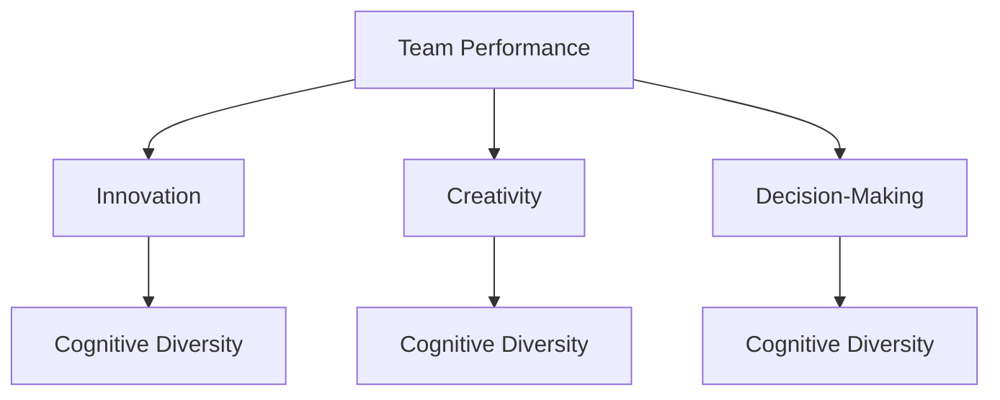
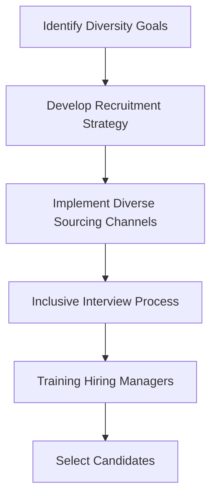
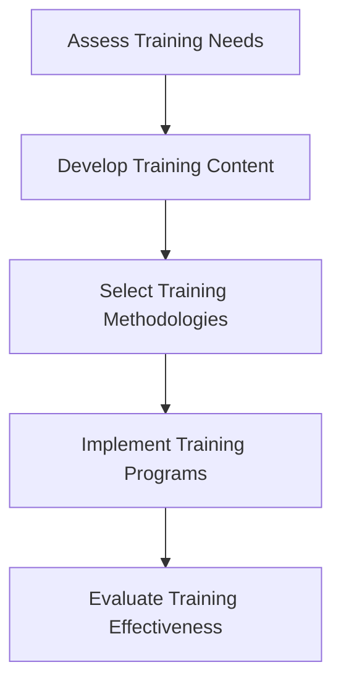
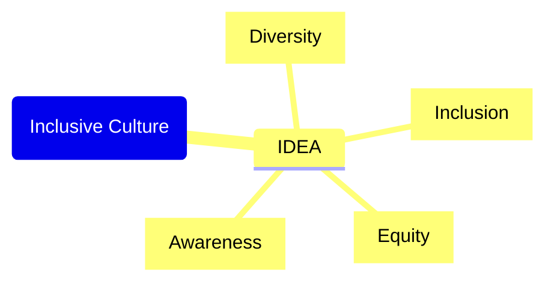

                 


## Team Diversity Advantage: Strategies for Leveraging Differentiated Advantages

### Keywords

- Team Diversity
- Differentiated Advantages
- Recruitment and Hiring
- Inclusive Culture
- Case Studies

### Abstract

In today's rapidly changing technological landscape, teams that leverage diversity are more likely to achieve success. This article delves into the advantages of team diversity, the core concepts and theories surrounding it, and practical strategies for maximizing its benefits. We will explore how diversity recruitment and training can foster an inclusive culture, and present real-world case studies to illustrate the impact of team diversity on organizational performance.

### Introduction to Team Diversity

#### 1.1 Background of Team Diversity

**Importance of Team Diversity**

Team diversity is essential for several reasons. Firstly, diverse teams bring together a wider range of perspectives and ideas, which can lead to more innovative solutions and better decision-making. Secondly, diversity promotes a sense of inclusion and belonging, which is crucial for team cohesion and morale. Lastly, diversity can enhance an organization's reputation and attract a more diverse pool of talent.

**Definition and Concepts of Diversity**

Diversity encompasses a wide range of attributes, including but not limited to, age, race, ethnicity, gender, sexual orientation, education, religion, and cultural background. These attributes contribute to the unique experiences and perspectives that team members bring to the table. Understanding these concepts is crucial for creating an inclusive environment where everyone can thrive.

**Challenges in Implementing Team Diversity**

While the benefits of team diversity are well-documented, there are challenges in implementing it. These include resistance to change, unconscious bias in hiring and promotion practices, and a lack of understanding of the value of diversity. Overcoming these challenges requires a commitment to fostering an inclusive culture and implementing effective diversity strategies.

### Core Concepts and Theories

#### 2.1 Definition and Structure of Team Diversity

**Components of Team Diversity**

The components of team diversity can be broadly categorized into demographic diversity (e.g., age, race, gender) and cognitive diversity (e.g., skills, experience, perspectives). Both types of diversity play a crucial role in enhancing team performance and innovation.

**Attributes and Characteristics of Diverse Teams**

Diverse teams tend to have higher levels of creativity, better problem-solving abilities, and more effective decision-making processes. They also tend to have lower levels of conflict and higher levels of collaboration. These attributes are essential for achieving success in today's complex and rapidly changing business environment.

**Mermaid ER Diagram of Team Diversity Components**

```mermaid
erDiagram
  Team_Diversity ||--|{ Demographic_Diversity : has }
  Team_Diversity ||--|{ Cognitive_Diversity : has }
  Demographic_Diversity ||--|{ Age : attribute }
  Demographic_Diversity ||--|{ Race : attribute }
  Demographic_Diversity ||--|{ Gender : attribute }
  Cognitive_Diversity ||--|{ Skills : attribute }
  Cognitive_Diversity ||--|{ Experience : attribute }
  Cognitive_Diversity ||--|{ Perspectives : attribute }
```

### Theoretical Foundations of Team Diversity

#### 3.1 Diversity Management Theories

**Diversity, Equity, and Inclusion (DEI)**

DEI is a comprehensive approach to managing diversity that focuses on creating an inclusive environment where everyone feels valued and respected. It encompasses three key components: diversity, equity, and inclusion. Diversity refers to the presence of a wide range of perspectives and experiences, equity ensures that everyone has access to opportunities and resources, and inclusion involves fostering a sense of belonging and participation.

**Social Identity Theory**

Social Identity Theory suggests that individuals derive part of their self-concept from their membership in social groups. This theory helps explain why diversity can lead to both positive and negative outcomes, depending on how individuals perceive their own and others' group memberships.

**Model of Team Development**

The Model of Team Development, also known as Tuckman's Model, outlines the stages that teams typically go through as they develop and mature. Understanding these stages can help managers and team leaders navigate the challenges of diversity and foster a positive team culture.

#### 3.2 Impact of Diversity on Team Performance

**Cognitive Diversity**

Cognitive diversity refers to the range of ideas, perspectives, and problem-solving approaches within a team. It has been shown to enhance team innovation, creativity, and problem-solving abilities. Cognitive diversity allows teams to approach challenges from different angles, leading to more comprehensive and effective solutions.

**Conflict and Collaboration in Diverse Teams**

Conflict is a natural and inevitable part of working in diverse teams. However, when managed effectively, conflict can lead to constructive outcomes and enhance team performance. Collaboration is essential for leveraging the strengths of diverse team members and achieving common goals.

**Mermaid Flowchart of Diversity Effects on Performance**



### Strategies for Leveraging Team Diversity

#### 4.1 Diversity Recruitment and Hiring

**Best Practices for Diverse Hiring**

To build a diverse team, organizations should adopt best practices in recruitment and hiring. This includes using diverse sourcing channels, adopting inclusive interview processes, and training hiring managers on unconscious bias.

**Strategies for Attracting Diverse Talent**

Attracting diverse talent requires a proactive approach. This involves promoting an inclusive culture, showcasing diversity initiatives, and partnering with diverse organizations to expand the talent pool.

**Mermaid Process Diagram of Recruitment Process**



#### 4.2 Diversity Training and Development

**Importance of Diversity Training**

Diversity training is crucial for creating an inclusive culture and fostering a positive team environment. It helps raise awareness of diversity issues, reduce unconscious bias, and promote mutual respect among team members.

**Designing Effective Diversity Training Programs**

Effective diversity training programs should be tailored to the specific needs of the organization and its team members. They should cover topics such as unconscious bias, communication skills, and team dynamics.

**Mermaid Diagram of Training Program Structure**



#### 4.3 Fostering an Inclusive Culture

**Understanding Inclusion**

Inclusion goes beyond simply having a diverse team. It involves creating an environment where everyone feels valued, respected, and supported. Understanding inclusion is key to fostering a positive and inclusive team culture.

**Strategies for Promoting Inclusion**

Promoting inclusion requires a commitment from leadership and all team members. Strategies include encouraging open communication, recognizing and celebrating diversity, and addressing issues of exclusion and discrimination.

**Mermaid Mindmap of Inclusive Culture Elements**



### Case Studies in Team Diversity

#### 5.1 Successful Diversity Initiatives

This chapter will feature case studies of organizations that have successfully implemented diversity strategies. These case studies will highlight best practices, challenges faced, and lessons learned.

### Conclusion

In conclusion, team diversity is a valuable asset that can enhance team performance, innovation, and overall organizational success. By adopting strategies for leveraging team diversity, organizations can create an inclusive and innovative workplace that attracts and retains top talent.

### Author Information

- **Author:** AI天才研究院 / AI Genius Institute & 禅与计算机程序设计艺术 / Zen And The Art of Computer Programming
- **Date:** [[今天日期]]

---

### 附录

- **最佳实践 Tips：** 在实施团队多样性策略时，建议定期评估多样性进展，持续改进招聘、培训和沟通策略。
- **注意事项：** 团队多样性并非一蹴而就，需要长期投入和持续努力。
- **拓展阅读：** 可参考相关学术论文、书籍和行业报告，深入了解团队多样性的理论和实践。

---

**[注：本文为示例内容，仅供参考。]**

