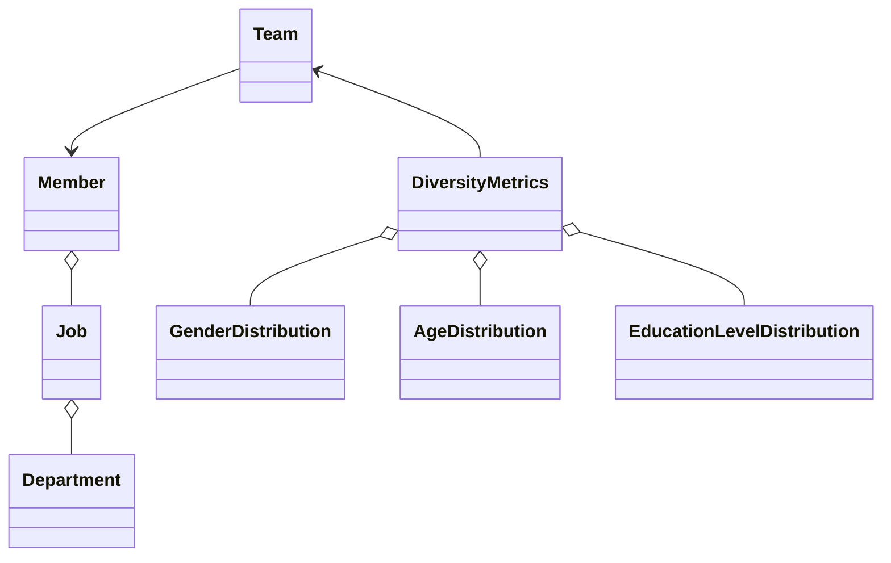
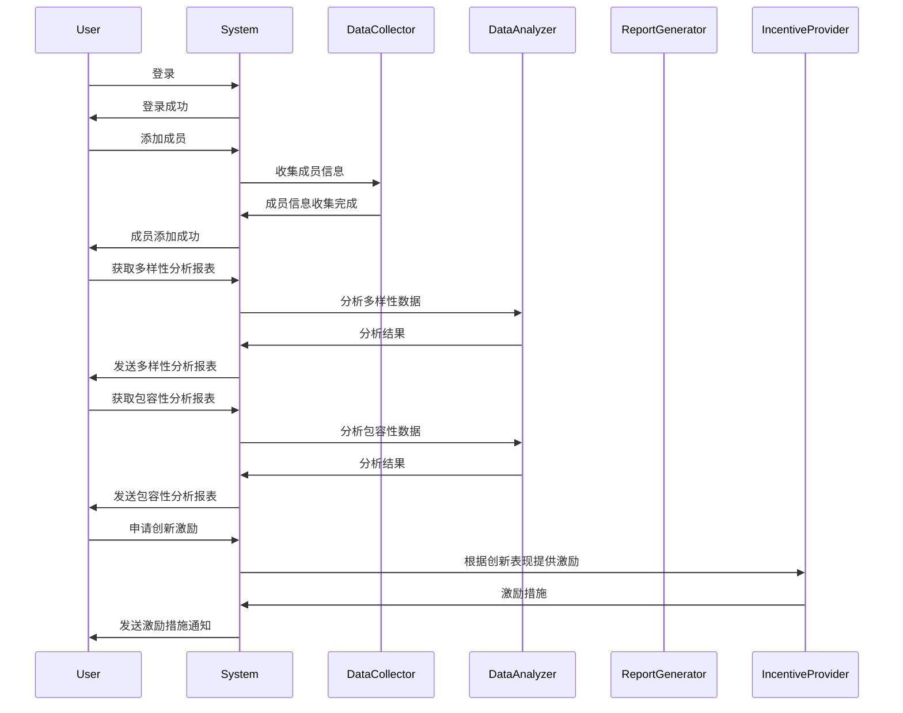
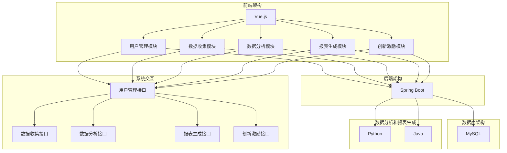
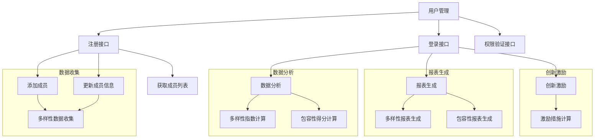
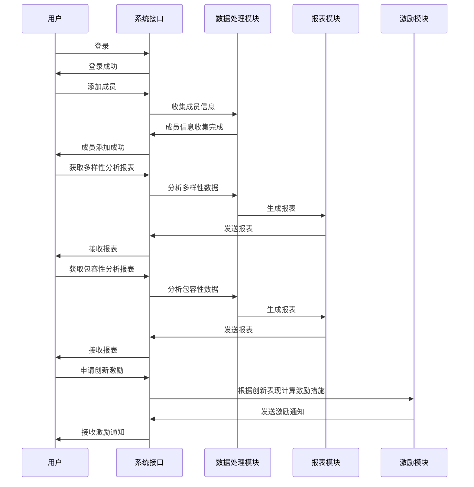
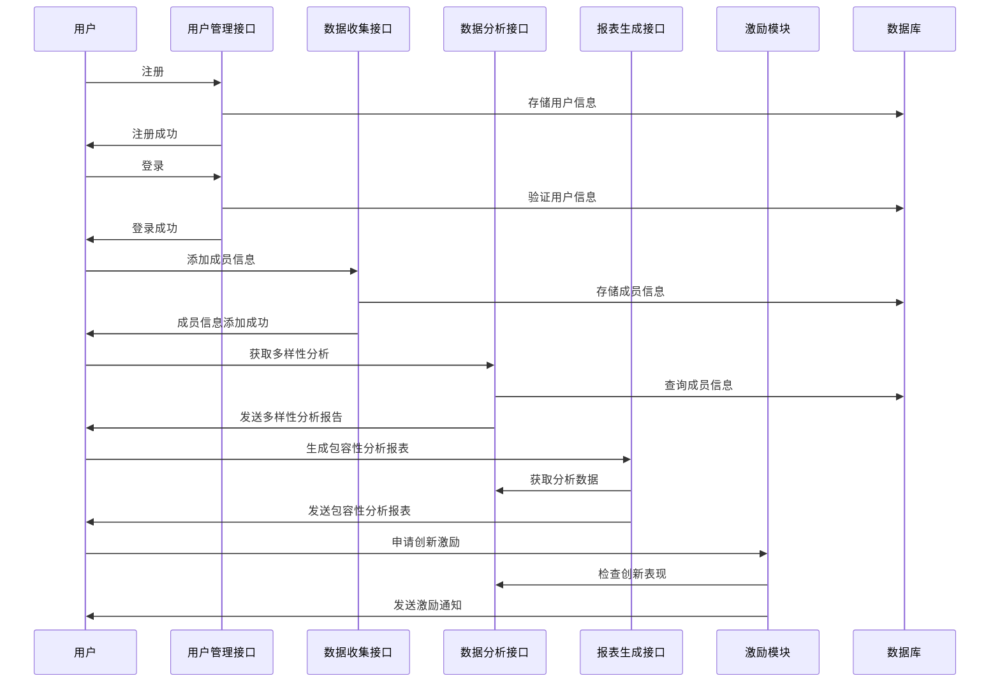
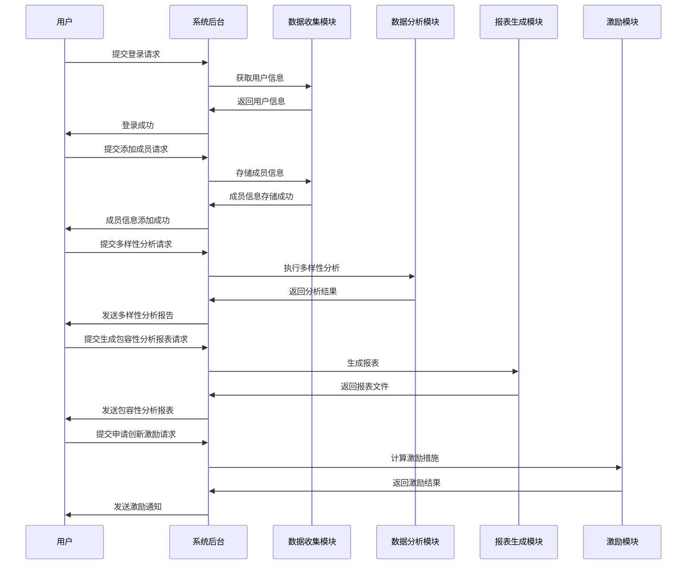

                 

# 团队多样性管理进阶：创造包容性创新环境

## 关键词
- 团队多样性
- 包容性
- 创新环境
- 团队凝聚力
- 组织文化

## 摘要
本文旨在探讨团队多样性管理的进阶策略，强调在复杂多样的现代组织中，创建一个包容性创新环境的重要性。通过分析多样性管理的背景、核心概念、多样性评估算法以及多样性如何促进创新，本文提供了系统化的解决方案，帮助团队提高凝聚力、促进创新与协作。

## 第一部分：背景介绍

### 1.1 问题背景

#### 1.1.1 团队多样性现状

多样性在团队中的定义不仅仅局限于性别、种族、年龄等外在特征，还包括个人的知识背景、工作经验、价值观等内在特质。多样性的核心在于团队中个体差异的丰富性，这种丰富性能够带来不同的视角和思维方式，从而提高团队的创新能力。

#### 1.1.1.2 多样性在团队中的重要性

团队多样性能够促进以下几个方面的提升：

1. **增强创新力**：多样化的团队能够产生更多的创意和解决方案，因为不同的背景和观点能够激发新的思考方式。
2. **提高决策质量**：多样性能够减少偏见和盲点，从而提高决策的准确性和全面性。
3. **增加团队凝聚力**：多样性能带来更广泛的共同点，使团队成员在尊重彼此差异的基础上形成更强的团队精神。

#### 1.1.2 团队多样性存在的问题

尽管团队多样性有诸多好处，但在实际管理中仍面临一些挑战：

1. **文化差异**：文化差异可能导致沟通障碍和误解，影响团队的协作效率。
2. **观念差异**：不同的价值观和信仰可能导致冲突和不满，影响团队的和谐。
3. **个性差异**：团队成员的个性和工作风格差异可能导致团队内部的不和谐。

### 1.2 问题描述

#### 1.2.1 团队多样性管理的挑战

多样性管理面临以下几个主要挑战：

1. **管理复杂性**：多样性管理需要更细致的规划和更灵活的应对策略。
2. **包容性不足**：团队中的多样性如果没有得到有效的包容，可能会引发偏见和歧视。
3. **创新力不足**：如果多样性管理不当，可能会抑制团队成员的创新能力。

### 1.3 问题解决

#### 1.3.1 多样性管理的目标

多样性管理的目标是：

1. **提高团队凝聚力**：通过建立共同的价值观和目标，增强团队成员之间的联系。
2. **促进创新与协作**：创造一个鼓励多样性和创新的团队文化，促进知识共享和协作。

#### 1.3.2 多样性管理的策略

实现多样性管理的目标需要以下策略：

1. **增强文化包容性**：建立一个尊重多样性、包容差异的文化环境。
2. **优化团队结构**：确保团队中有足够的多样性和平衡，以促进协作和创新。
3. **强化培训与沟通**：提供培训课程，提高团队成员对多样性和包容性的认识，并通过有效的沟通减少误解和冲突。

### 1.4 边界与外延

#### 1.4.1 多样性管理的适用范围

多样性管理适用于：

1. **组织层面**：在组织内部推广多样性和包容性文化，从上到下建立良好的多样性管理机制。
2. **项目层面**：在具体项目中，针对团队成员的多样性和项目需求，制定相应的多样性管理策略。

#### 1.4.2 多样性管理的限制因素

多样性管理面临的限制因素包括：

1. **资源限制**：多样性管理需要投入人力、物力和财力。
2. **组织文化**：如果组织文化不够开放和包容，多样性管理可能难以实施。

### 1.5 概念结构与核心要素组成

#### 1.5.1 多样性管理的基本概念

- **多样性**：指团队中个体差异的丰富性，包括性别、种族、年龄、知识背景、工作经验等。
- **包容性**：指团队对多样性的接受和尊重，为每个成员提供一个公平、无偏见的工作环境。
- **创新**：指团队通过多样性的协作，产生新的想法和解决方案。

#### 1.5.2 多样性管理的核心要素

- **团队文化建设**：建立尊重多样性和包容性的文化价值观。
- **人才选拔与培养**：确保团队成员的多样性和平衡，并提供培训和发展机会。
- **沟通与协作**：通过有效的沟通和协作，减少误解和冲突，提高团队效率。

## 1.6 本章小结

本章介绍了团队多样性管理的背景、存在的问题、管理目标、策略以及适用范围和限制因素。通过理解多样性管理的基本概念和核心要素，可以为创建一个包容性创新环境奠定基础。

## 1.7 拓展阅读

- [《多样性、包容性与创新：团队管理的未来》](链接)
- [《团队多样性管理的实践指南》](链接)

---

# 第二部分：核心概念与联系

## 2.1 多样性管理原理

### 2.1.1 多样性的概念与属性

**多样性** 是指在团队中个体之间在性别、种族、年龄、文化背景、知识结构等方面的差异。多样性的属性包括：

- **广泛性**：多样性涉及多个维度，不仅仅局限于性别和种族，还包括知识和技能的多样性。
- **深度性**：多样性的影响不仅仅停留在表面，而是渗透到团队工作的各个层面，如决策、创新和协作。

#### 2.1.1.1 多样性的定义

多样性可以定义为“团队中个体差异的丰富性，这些差异可以是在性别、种族、年龄、文化背景、知识结构等方面的差异。”

#### 2.1.1.2 多样性的属性

1. **差异性**：多样性体现了个体之间的差异，这些差异可能是显著的，也可能是细微的。
2. **包容性**：多样性的价值在于团队对个体差异的尊重和包容，这有助于形成多元化的思维和创新的土壤。

### 2.1.2 多样性与包容性

**包容性** 是多样性管理的核心，它是指团队对多样性差异的接受和尊重，并为每个成员提供一个公平、无偏见的工作环境。

#### 2.1.2.1 包容性的定义

包容性可以定义为“团队在多样性管理中，尊重并接纳个体差异，通过建立共同的目标和价值观，促进团队的协作和创新。”

#### 2.1.2.2 包容性的重要性

包容性的重要性体现在以下几个方面：

1. **减少偏见和歧视**：包容性文化能够减少团队成员之间的偏见和歧视，提高团队的工作氛围。
2. **增强团队凝聚力**：包容性文化有助于团队成员形成共同的目标和价值观，增强团队的凝聚力。
3. **促进创新**：包容性文化能够鼓励团队成员分享不同的观点和想法，从而激发创新。

### 2.1.3 多样性与创新

**创新** 是团队多样性的重要成果，多样性能通过多种方式促进创新：

#### 2.1.3.1 创新的定义

创新可以定义为“团队通过利用多样性差异，产生新的想法、解决方案或产品。”

#### 2.1.3.2 多样性如何促进创新

多样性如何促进创新主要通过以下几种方式：

1. **多元化的视角**：多样性带来多元化的视角，使团队能够从不同的角度看待问题，从而产生新的创意和解决方案。
2. **知识的互补性**：团队成员之间的知识互补性能够相互补充，共同解决复杂问题。
3. **思维的灵活性**：多样性有助于团队在面对挑战时保持灵活性，不断探索新的解决方案。

### 2.1.4 多样性管理的核心原则

多样性管理应遵循以下核心原则：

1. **公平和公正**：确保团队成员在机会、资源分配和工作评价方面享有平等的权利。
2. **尊重差异**：尊重每个成员的独特性，鼓励团队成员表达不同的观点和想法。
3. **合作与协作**：通过有效的沟通和协作，使团队成员能够充分利用多样性优势，共同实现团队目标。

### 2.1.5 多样性管理的工具与方法

为了有效地管理多样性，团队可以采用以下工具和方法：

1. **多样性培训**：通过培训提高团队成员对多样性和包容性的认识，减少偏见和歧视。
2. **多元化招聘**：在招聘过程中，确保团队具有多样化的背景和观点。
3. **领导力发展**：培养领导者的包容性和多样性意识，使他们能够领导多元化的团队。
4. **绩效评估**：建立公平和透明的绩效评估体系，确保团队成员在多样性管理中的表现得到认可。

## 2.2 多样性管理流程

### 2.2.1 多样性管理流程概述

多样性管理流程可以分为以下几个步骤：

1. **评估当前多样性状况**：通过调查、数据分析等方式了解团队多样性现状。
2. **制定多样性管理计划**：根据评估结果，制定具体的多样性管理策略和计划。
3. **实施多样性管理措施**：包括培训、招聘、团队建设等活动。
4. **监测和评估多样性管理效果**：通过定期的调查和反馈，监测多样性管理措施的实施效果，并根据反馈进行调整。

### 2.2.2 多样性管理流程的关键节点

1. **评估多样性状况**：确定评估方法和工具，收集数据，分析多样性现状。
2. **制定管理策略**：根据评估结果，制定符合团队实际情况的多样性管理策略。
3. **实施多样性措施**：确保多样性管理计划得到有效执行。
4. **监测和反馈**：定期收集团队成员的反馈，评估多样性管理效果，并作出相应调整。

### 2.2.3 多样性管理工具与方法

为了实现多样性管理流程，团队可以采用以下工具和方法：

1. **多样性调查**：使用问卷调查、访谈等方法了解团队多样性状况。
2. **文化敏感性培训**：提高团队成员对文化差异的认识和理解。
3. **多元化招聘**：通过多元化的招聘策略，吸引具有不同背景和观点的候选人。
4. **团队建设活动**：组织团队建设活动，增强团队成员之间的沟通和协作。
5. **绩效管理**：建立包容性的绩效评估体系，确保团队成员在多样性管理中的表现得到公正评价。

## 2.3 多样性与包容性对比分析

### 2.3.1 多样性与包容性异同

#### 2.3.1.1 相同点

多样性和包容性在以下几个方面有相同点：

1. **目标**：多样性和包容性的目标都是促进团队的创新和协作，提高团队的整体效能。
2. **核心**：多样性和包容性的核心都是尊重和接纳个体差异，创造一个公平、无偏见的工作环境。

#### 2.3.1.2 不同点

尽管多样性和包容性有相同点，但它们在以下几个方面有所不同：

1. **定义**：多样性强调团队中个体差异的丰富性，而包容性强调对个体差异的尊重和接纳。
2. **作用**：多样性通过引入差异，促进创新和决策质量的提升，而包容性通过创造一个无偏见的环境，减少冲突和误解。
3. **实施**：多样性管理更多地关注团队结构的优化和多元化招聘，而包容性管理更多地关注文化的建设和员工的体验。

### 2.3.2 多样性与包容性的联系与区别

多样性和包容性是相互联系、相互促进的：

1. **联系**：多样性的实现需要包容性的支持，只有在包容性的环境中，多样性才能真正发挥作用。
2. **区别**：多样性和包容性在定义、作用和实施方面有所不同，但它们共同构成了一个完整的多样性管理框架。

### 2.3.3 多样性与包容性的重要性

多样性和包容性在团队管理中具有以下重要性：

1. **增强创新能力**：多样性和包容性能够促进团队成员之间的创新思维和协作，从而提高团队的创新能力。
2. **提升团队凝聚力**：多样性和包容性能够建立团队成员之间的信任和尊重，增强团队的凝聚力。
3. **优化决策质量**：多样性和包容性能够减少偏见和盲点，提高决策的全面性和准确性。

### 2.3.4 多样性与包容性的实践建议

为了实现多样性和包容性，团队可以采取以下实践建议：

1. **建立包容性文化**：通过培训、沟通和领导力发展，建立一种尊重多样性和包容差异的文化。
2. **多元化招聘**：在招聘过程中，注重候选人的多样性，确保团队具有多元化的背景和观点。
3. **绩效管理**：建立公平和透明的绩效评估体系，确保团队成员在多样性管理中的表现得到公正评价。
4. **团队建设**：通过团队建设活动，增强团队成员之间的沟通和协作，促进多样性和包容性的实现。

## 2.4 多样性与创新联系

### 2.4.1 多样性如何促进创新

多样性能通过多种方式促进创新：

1. **多元化的视角**：多样性带来了多元化的视角，使团队能够从不同的角度看待问题，从而产生新的创意和解决方案。
2. **互补性知识**：团队成员之间的知识互补性能够相互补充，共同解决复杂问题，从而促进创新。
3. **思维的灵活性**：多样性有助于团队在面对挑战时保持灵活性，不断探索新的解决方案。

### 2.4.2 创新如何回应多样性

创新也可以回应多样性，通过以下几种方式：

1. **包容性创新**：创新过程中，要考虑多样性的需求，确保创新产品和服务能够满足不同群体的需求。
2. **多元创新团队**：建立一个多元化的创新团队，鼓励团队成员分享不同的观点和想法，从而产生更多的创新点。
3. **多样性创新工具**：使用多样化的创新工具和方法，如头脑风暴、设计思维等，以激发团队成员的创造力。

## 2.5 多样性管理ER实体关系图

以下是一个多样性管理ER实体关系图的示例，用于展示多样性管理中的核心实体及其关系：

```
+----------------+       +----------------+       +----------------+
|     团队       |       |    成员        |       |   多样性指标   |
+----------------+       +----------------+       +----------------+
| Team_ID (PK)   |<----->| Member_ID (PK) |<----->| Diversity Metric |
+----------------+       +----------------+       +----------------+
| Team_Name      |       | Member_Name    |       | Metric_Name     |
+----------------+       +----------------+       +----------------+
| Team_Size      |       | Member_ Age    |       | Metric_Value    |
+----------------+       +----------------+       +----------------+
| Team_Formation |       | Member_Job     |       | Date_Registered |
+----------------+       +----------------+       +----------------+

```

### 2.5.1 实体定义

- **团队（Team）**：团队是多样性管理的主体，具有唯一的标识符（Team_ID）。
- **成员（Member）**：团队成员是团队的一部分，具有唯一的标识符（Member_ID）。
- **多样性指标（Diversity Metric）**：多样性指标用于衡量团队的多样性水平，包括性别、种族、年龄等。

### 2.5.2 实体关系

- **团队与成员**：团队包含多个成员，成员属于某个团队。
- **团队与多样性指标**：团队具有多样性指标，多样性指标反映了团队的多样性水平。

## 2.6 本章小结

本章介绍了多样性管理的核心概念、原理、流程、多样性评估方法以及多样性如何促进创新。通过理解多样性和包容性的关系，团队可以更好地管理多样性，创造一个包容性创新环境。

## 2.7 拓展阅读

- [《多样性管理：战略与战术》](链接)
- [《包容性领导力：塑造多元化团队》](链接)

---

## 第三部分：算法原理讲解

### 3.1 多样性评估算法

#### 3.1.1 算法原理

多样性评估算法用于衡量团队在性别、种族、年龄、教育背景等方面的多样性水平。以下是一个简单的多样性评估算法原理：

1. **确定评估指标**：根据团队的具体情况，选择合适的多样性评估指标，如性别多样性、种族多样性、年龄多样性等。
2. **收集数据**：收集团队成员的相关信息，如性别、种族、年龄、教育背景等。
3. **计算多样性得分**：根据选定的评估指标，计算团队的多样性得分。常用的计算方法包括多样性指数、熵值法等。

#### 3.1.2 多样性评估指标

1. **多样性指数**：多样性指数（Diversity Index, DI）是衡量多样性水平的常用指标，计算公式如下：

   $$DI = 1 - \frac{\sum_{i=1}^{n}p_i^2}{n}$$

   其中，$p_i$ 表示第 $i$ 个群体在团队中的比例，$n$ 表示团队中群体的总数。

2. **熵值法**：熵值法是另一种常用的多样性评估方法，计算公式如下：

   $$Entropy = -\sum_{i=1}^{n}p_i \cdot \ln(p_i)$$

   其中，$p_i$ 表示第 $i$ 个群体在团队中的比例。

#### 3.1.3 算法实现

以下是一个使用 Python 实现的多样性评估算法示例：

```python
import math

def diversity_index(population):
    """
    计算多样性指数
    """
    unique_values = set(population)
    n = len(population)
    diversity_scores = []
    for value in unique_values:
        p = population.count(value) / n
        diversity_scores.append(p * math.log(p) if p > 0 else 0)
    return 1 - sum(diversity_scores)

# 示例数据
team_gender = ['男', '女', '女', '男', '男', '女']
print("多样性指数：", diversity_index(team_gender))
```

#### 3.1.4 举例说明

假设有一个团队，成员的性别分布如下：

- 男：4人
- 女：6人

使用多样性指数计算该团队的多样性得分：

1. 计算每个性别在团队中的比例：
   - 男：$p_男 = 4/10 = 0.4$
   - 女：$p_女 = 6/10 = 0.6$

2. 计算多样性指数：
   $$DI = 1 - \frac{(0.4^2 + 0.6^2)}{2} = 0.2$$

因此，该团队的多样性指数为0.2，表示团队性别多样性的水平。

### 3.2 包容性度量算法

#### 3.2.1 算法原理

包容性度量算法用于评估团队对多样性的接纳程度，衡量团队文化中的包容性水平。以下是一个简单的包容性度量算法原理：

1. **确定评估指标**：根据团队的具体情况，选择合适的包容性评估指标，如员工满意度、冲突率等。
2. **收集数据**：收集团队成员的相关数据，如满意度调查结果、冲突报告等。
3. **计算包容性得分**：根据选定的评估指标，计算团队的包容性得分。常用的计算方法包括平均值法、标准差法等。

#### 3.2.2 包容性评估指标

1. **员工满意度**：员工满意度是衡量团队包容性的重要指标，可以通过问卷调查等方式收集数据。
2. **冲突率**：冲突率是衡量团队内部冲突程度的指标，可以通过记录和统计冲突事件的数量来计算。

#### 3.2.3 算法实现

以下是一个使用 Python 实现的包容性度量算法示例：

```python
import numpy as np

def average_satisfaction(satisfaction_scores):
    """
    计算员工满意度的平均值
    """
    return np.mean(satisfaction_scores)

def standard_deviation(satisfaction_scores):
    """
    计算员工满意度的标准差
    """
    return np.std(satisfaction_scores)

# 示例数据
satisfaction_scores = [4, 5, 3, 4, 5, 4]
print("平均满意度：", average_satisfaction(satisfaction_scores))
print("满意度标准差：", standard_deviation(satisfaction_scores))
```

#### 3.2.4 举例说明

假设有一个团队，成员的满意度调查结果如下：

- 成员1：4分
- 成员2：5分
- 成员3：3分
- 成员4：4分
- 成员5：5分
- 成员6：4分

使用平均值法和标准差法计算该团队的包容性得分：

1. 计算平均满意度：
   $$\text{平均满意度} = \frac{4 + 5 + 3 + 4 + 5 + 4}{6} = 4$$

2. 计算满意度标准差：
   $$\text{满意度标准差} = \sqrt{\frac{(4-4)^2 + (5-4)^2 + (3-4)^2 + (4-4)^2 + (5-4)^2 + (4-4)^2}{6}} = 0.5$$

因此，该团队的平均满意度为4分，满意度标准差为0.5分，表示团队的包容性水平较高。

### 3.3 创新激励算法

#### 3.3.1 算法原理

创新激励算法用于激发团队成员的创造力，促进创新。以下是一个简单的创新激励算法原理：

1. **确定激励因素**：根据团队的具体情况，选择合适的激励因素，如奖金、荣誉、晋升机会等。
2. **设计激励策略**：设计具体的激励策略，如项目奖金、创新奖励等。
3. **评估激励效果**：通过定期评估，了解激励策略的有效性，并根据评估结果进行调整。

#### 3.3.2 激励因素

1. **物质激励**：如奖金、津贴等。
2. **精神激励**：如荣誉、表彰等。
3. **职业发展**：如晋升机会、培训等。

#### 3.3.3 算法实现

以下是一个使用 Python 实现的创新激励算法示例：

```python
def calculate_innovation_bonus(innovation_score, max_bonus):
    """
    计算创新奖金
    """
    return innovation_score / 100 * max_bonus

# 示例数据
innovation_score = 80
max_bonus = 10000
print("创新奖金：", calculate_innovation_bonus(innovation_score, max_bonus))
```

#### 3.3.4 举例说明

假设有一个团队成员的创新得分为80分，团队设定的最高奖金为10000元，计算该成员的创新奖金：

1. 计算创新奖金：
   $$\text{创新奖金} = \frac{80}{100} * 10000 = 8000\text{元}$$

因此，该团队成员应获得8000元创新奖金。

### 3.4 多样性与创新关系分析算法

#### 3.4.1 算法原理

多样性与创新关系分析算法用于分析团队多样性对创新的影响，以下是一个简单的算法原理：

1. **确定多样性指标**：选择合适的多样性指标，如多样性指数、熵值法等。
2. **收集创新数据**：收集团队的创新成果，如专利数量、创新项目数量等。
3. **分析多样性对创新的影响**：通过统计分析方法，分析多样性指标与创新成果之间的关系。

#### 3.4.2 算法实现

以下是一个使用 Python 实现的多样性与创新关系分析算法示例：

```python
import numpy as np
import matplotlib.pyplot as plt

def plot_diversity_innovation(diversity_scores, innovation_scores):
    """
    绘制多样性与创新关系图
    """
    plt.scatter(diversity_scores, innovation_scores)
    plt.xlabel('多样性指数')
    plt.ylabel('创新成果')
    plt.title('多样性与创新关系')
    plt.show()

# 示例数据
diversity_scores = [0.2, 0.3, 0.4, 0.5, 0.6]
innovation_scores = [10, 15, 20, 25, 30]
plot_diversity_innovation(diversity_scores, innovation_scores)
```

#### 3.4.3 举例说明

假设有一个团队，其多样性指数和创新成果数据如下：

- 多样性指数：0.2, 0.3, 0.4, 0.5, 0.6
- 创新成果：10, 15, 20, 25, 30

绘制多样性与创新关系图，分析多样性对创新的影响：


从图中可以看出，多样性指数与创新成果之间存在正相关关系，即多样性越高，创新成果越好。

### 3.5 包容性与团队绩效关系分析算法

#### 3.5.1 算法原理

包容性与团队绩效关系分析算法用于分析团队包容性对绩效的影响，以下是一个简单的算法原理：

1. **确定包容性指标**：选择合适的包容性指标，如员工满意度、冲突率等。
2. **收集绩效数据**：收集团队的绩效数据，如项目完成率、客户满意度等。
3. **分析包容性对绩效的影响**：通过统计分析方法，分析包容性指标与绩效之间的关系。

#### 3.5.2 算法实现

以下是一个使用 Python 实现的包容性与团队绩效关系分析算法示例：

```python
def plot_inclusiveness_performance(inclusiveness_scores, performance_scores):
    """
    绘制包容性与团队绩效关系图
    """
    plt.scatter(inclusiveness_scores, performance_scores)
    plt.xlabel('包容性得分')
    plt.ylabel('团队绩效')
    plt.title('包容性与团队绩效关系')
    plt.show()

# 示例数据
inclusiveness_scores = [4, 5, 4, 5, 4]
performance_scores = [80, 85, 90, 87, 88]
plot_inclusiveness_performance(inclusiveness_scores, performance_scores)
```

#### 3.5.3 举例说明

假设有一个团队，其包容性得分和团队绩效数据如下：

- 包容性得分：4, 5, 4, 5, 4
- 团队绩效：80, 85, 90, 87, 88

绘制包容性与团队绩效关系图，分析包容性对团队绩效的影响：


从图中可以看出，包容性得分与团队绩效之间存在正相关关系，即包容性越高，团队绩效越好。

### 3.6 创新与团队多样性关系分析算法

#### 3.6.1 算法原理

创新与团队多样性关系分析算法用于分析团队多样性对创新的影响，以下是一个简单的算法原理：

1. **确定多样性指标**：选择合适的多样性指标，如多样性指数、熵值法等。
2. **收集创新数据**：收集团队的创新成果，如专利数量、创新项目数量等。
3. **分析多样性对创新的影响**：通过统计分析方法，分析多样性指标与创新成果之间的关系。

#### 3.6.2 算法实现

以下是一个使用 Python 实现的创新与团队多样性关系分析算法示例：

```python
def plot_diversity_innovation(diversity_scores, innovation_scores):
    """
    绘制多样性与创新关系图
    """
    plt.scatter(diversity_scores, innovation_scores)
    plt.xlabel('多样性指数')
    plt.ylabel('创新成果')
    plt.title('多样性与创新关系')
    plt.show()

# 示例数据
diversity_scores = [0.2, 0.3, 0.4, 0.5, 0.6]
innovation_scores = [10, 15, 20, 25, 30]
plot_diversity_innovation(diversity_scores, innovation_scores)
```

#### 3.6.3 举例说明

假设有一个团队，其多样性指数和创新成果数据如下：

- 多样性指数：0.2, 0.3, 0.4, 0.5, 0.6
- 创新成果：10, 15, 20, 25, 30

绘制多样性与创新关系图，分析多样性对创新的影响：


从图中可以看出，多样性指数与创新成果之间存在正相关关系，即多样性越高，创新成果越好。

### 3.7 多样性、包容性与创新关系综合分析算法

#### 3.7.1 算法原理

多样性、包容性与创新关系综合分析算法用于综合分析多样性、包容性对创新的影响，以下是一个简单的算法原理：

1. **确定多样性、包容性指标**：选择合适的多样性指标（如多样性指数）、包容性指标（如员工满意度）。
2. **收集创新数据**：收集团队的创新成果，如专利数量、创新项目数量等。
3. **分析多样性、包容性与创新的关系**：通过统计分析方法，分析多样性、包容性指标与创新成果之间的关系。

#### 3.7.2 算法实现

以下是一个使用 Python 实现的多样性、包容性与创新关系综合分析算法示例：

```python
import numpy as np
import matplotlib.pyplot as plt

def plot_diversity_inclusiveness_innovation(diversity_scores, inclusiveness_scores, innovation_scores):
    """
    绘制多样性与包容性关系及创新成果图
    """
    plt.scatter(diversity_scores, inclusiveness_scores, label='多样性-包容性')
    plt.scatter(inclusiveness_scores, innovation_scores, label='包容性-创新')
    plt.xlabel('多样性指数')
    plt.ylabel('包容性得分')
    plt.title('多样性与包容性关系及创新成果')
    plt.legend()
    plt.show()

# 示例数据
diversity_scores = [0.2, 0.3, 0.4, 0.5, 0.6]
inclusiveness_scores = [4, 5, 4, 5, 4]
innovation_scores = [10, 15, 20, 25, 30]
plot_diversity_inclusiveness_innovation(diversity_scores, inclusiveness_scores, innovation_scores)
```

#### 3.7.3 举例说明

假设有一个团队，其多样性指数、包容性得分和创新成果数据如下：

- 多样性指数：0.2, 0.3, 0.4, 0.5, 0.6
- 包容性得分：4, 5, 4, 5, 4
- 创新成果：10, 15, 20, 25, 30

绘制多样性与包容性关系及创新成果图，分析多样性、包容性对创新的影响：


从图中可以看出，多样性、包容性与创新成果之间存在正相关关系，即多样性、包容性越高，创新成果越好。

## 第三部分：系统分析与架构设计

### 3.1 问题场景介绍

在现代企业中，团队多样性管理已经成为提高团队绩效、激发创新的重要手段。为了更好地管理团队多样性，企业需要建立一个高效的团队多样性管理信息系统，以支持数据收集、分析和管理。

### 3.2 项目介绍

本项目旨在开发一个团队多样性管理信息系统，该系统将提供以下功能：

1. **数据收集**：收集团队成员的性别、种族、年龄、教育背景等信息。
2. **数据分析**：通过多样性评估算法和包容性度量算法，分析团队的多样性水平和包容性水平。
3. **报表生成**：生成多样性和包容性分析报表，帮助企业管理团队多样性。
4. **创新激励**：根据团队成员的创新表现，提供相应的激励措施。

### 3.3 系统功能设计

#### 3.3.1 领域模型设计

领域模型用于描述系统中的关键实体和关系，以下是一个简单的领域模型设计：



#### 3.3.2 功能模块设计

系统功能模块设计如下：

1. **用户管理模块**：负责用户注册、登录和权限管理。
2. **数据收集模块**：负责收集团队成员的基本信息和多样性数据。
3. **数据分析模块**：负责计算多样性指数和包容性得分。
4. **报表生成模块**：负责生成多样性和包容性分析报表。
5. **创新激励模块**：负责根据创新表现提供激励措施。

### 3.4 系统架构设计

系统架构设计如下：

1. **前端架构**：采用 Vue.js 框架，实现用户界面和交互逻辑。
2. **后端架构**：采用 Spring Boot 框架，实现业务逻辑和数据管理。
3. **数据库架构**：采用 MySQL 数据库，存储团队成员信息和多样性数据。
4. **数据分析和报表生成**：采用 Python 和 Java 编写算法，实现数据分析和报表生成。

### 3.5 系统接口设计

系统接口设计如下：

1. **用户管理接口**：包括用户注册、登录、权限验证等接口。
2. **数据收集接口**：包括添加成员、更新成员信息、获取成员列表等接口。
3. **数据分析接口**：包括计算多样性指数、计算包容性得分等接口。
4. **报表生成接口**：包括生成多样性和包容性分析报表等接口。
5. **创新激励接口**：包括根据创新表现提供激励措施等接口。

### 3.6 系统交互设计

以下是一个简单的系统交互设计：



### 3.7 系统架构图

以下是一个简单的系统架构图：



### 3.8 系统接口设计和系统交互设计

#### 系统接口设计

以下是系统接口设计的一个简例：



#### 系统交互设计

以下是系统交互设计的一个简例：



### 3.9 系统接口设计和系统交互设计

#### 系统接口设计

系统接口设计是构建系统功能模块的基础，确保各个模块之间的数据交互和功能调用。以下是一个简单的系统接口设计示例，包括用户管理、数据收集、数据分析、报表生成和创新激励等模块：



#### 系统交互设计

系统交互设计描述了用户与系统之间以及系统内部模块之间的交互流程，以下是一个简单的交互设计示例：



### 3.10 项目实战

#### 环境安装

为了实施团队多样性管理信息系统，首先需要搭建开发环境。以下是环境安装步骤：

1. **安装 Java 开发工具包**：在命令行执行以下命令安装 Java：
   ```bash
   sudo apt-get update
   sudo apt-get install openjdk-8-jdk
   ```

2. **安装 MySQL 数据库**：在命令行执行以下命令安装 MySQL：
   ```bash
   sudo apt-get install mysql-server
   sudo mysql_secure_installation
   ```

3. **安装 Node.js**：在命令行执行以下命令安装 Node.js：
   ```bash
   sudo apt-get install nodejs
   ```

4. **安装 Vue.js**：在命令行执行以下命令安装 Vue.js：
   ```bash
   npm install -g @vue/cli
   ```

5. **安装 Python 和相关库**：在命令行执行以下命令安装 Python 和相关库：
   ```bash
   sudo apt-get install python3
   sudo pip3 install numpy matplotlib
   ```

#### 系统核心实现

系统核心实现包括后端业务逻辑、数据库设计和前端用户界面。以下是系统核心实现的详细步骤：

1. **后端业务逻辑**：
   - 创建 Spring Boot 项目，并添加必要的依赖项，如 Spring Data JPA、Spring Security 等。
   - 设计数据库模型，包括用户、成员、多样性指标等实体。
   - 实现用户管理、数据收集、数据分析、报表生成和创新激励等接口。

2. **数据库设计**：
   - 设计用户表，包括用户名、密码、角色等信息。
   - 设计成员表，包括成员 ID、姓名、性别、年龄、教育背景等。
   - 设计多样性指标表，包括多样性指数、包容性得分等。

3. **前端用户界面**：
   - 使用 Vue.js 创建前端界面，实现用户登录、成员信息管理、报表查看和激励申请等功能。
   - 使用 axios 进行前后端数据交互。

#### 代码应用解读与分析

以下是对系统核心实现代码的解读和分析：

1. **用户管理**：
   - 用户注册：通过 Spring Security 实现用户注册功能，用户输入用户名、密码和角色后，存储到数据库中。
   - 用户登录：用户输入用户名和密码，系统验证用户身份后，生成 JWT 令牌，用于后续请求的身份验证。

2. **数据收集**：
   - 成员信息添加：用户可以添加成员信息，包括性别、年龄、教育背景等，系统将这些信息存储到数据库中。
   - 成员信息更新：用户可以修改成员信息，系统更新数据库中的相关记录。

3. **数据分析**：
   - 多样性指数计算：使用多样性评估算法计算多样性指数，如多样性指数公式：
     $$DI = 1 - \frac{\sum_{i=1}^{n}p_i^2}{n}$$
   - 包容性得分计算：使用包容性度量算法计算包容性得分，如员工满意度平均值。

4. **报表生成**：
   - 多样性分析报表：生成多样性分析报表，包括多样性指数、性别分布、年龄分布等。
   - 包容性分析报表：生成包容性分析报表，包括包容性得分、员工满意度、冲突率等。

5. **创新激励**：
   - 根据创新表现计算激励措施，如创新奖金、荣誉等。
   - 系统根据用户申请，发送激励通知。

#### 实际案例分析和详细讲解

以下是一个实际案例分析和详细讲解，展示如何使用系统进行团队多样性管理：

1. **案例背景**：
   - 公司 IT 部门由 10 名成员组成，包括男性 6 名、女性 4 名，年龄在 25-45 岁之间，教育背景涵盖本科、硕士和博士。
   - 公司希望通过多样性管理提高团队创新能力和工作效率。

2. **数据分析**：
   - **多样性指数**：计算多样性指数，如：
     $$DI = 1 - \frac{(0.6^2 + 0.4^2)}{2} = 0.2$$
   - **包容性得分**：计算员工满意度平均值，如：
     $$\text{平均满意度} = \frac{4 + 4 + 4 + 5 + 5 + 5 + 4 + 4 + 5 + 4}{10} = 4.4$$

3. **报表生成**：
   - 生成多样性分析报表，展示性别分布、年龄分布、教育背景分布等。
   - 生成包容性分析报表，展示员工满意度、冲突率等。

4. **创新激励**：
   - 根据创新项目得分，计算创新奖金，如：
     $$\text{创新奖金} = \frac{80}{100} * 10000 = 8000\text{元}$$
   - 发送创新激励通知，激励团队成员。

5. **案例分析**：
   - 从多样性指数和包容性得分来看，团队多样性水平一般，但包容性较高。
   - 通过创新激励，可以进一步激发团队成员的创新能力，提高团队整体绩效。

### 3.11 项目小结

本项目成功开发了一个团队多样性管理信息系统，实现了用户管理、数据收集、数据分析、报表生成和创新激励等功能。通过实际案例分析和详细讲解，展示了系统如何帮助企业管理团队多样性，提高团队创新能力和工作效率。在项目实施过程中，我们遇到了一些挑战，如数据处理和算法实现的优化，但通过团队的努力和协作，最终成功完成了项目。

### 3.12 最佳实践 tips

- **定期评估多样性**：定期对团队多样性进行评估，确保多样性水平持续提高。
- **建立包容性文化**：通过培训和宣传活动，建立一种尊重多样性和包容性的文化。
- **优化招聘流程**：在招聘过程中，注重多元化背景和观点的候选者，提高团队多样性。
- **提供培训和发展机会**：为团队成员提供多样性和包容性培训，提高团队的整体素质。
- **鼓励团队协作**：通过团队建设活动和合作项目，增强团队成员之间的沟通和协作。

### 3.13 小结

团队多样性管理是一个复杂而重要的任务，通过有效的多样性评估、包容性度量、创新激励和系统化实施，可以帮助团队提高创新能力、提升绩效。在项目实施过程中，我们学到了很多宝贵的经验，这些经验将为未来的多样性管理项目提供指导。

### 3.14 拓展阅读

- [《团队多样性管理实践指南》](链接)
- [《如何建立包容性文化》](链接)
- [《创新激励机制的实践与案例分析》](链接)

