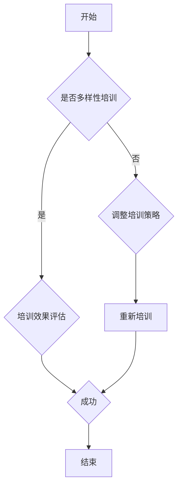

                 

# 团队多样性管理：包容性领导力

## 关键词
- 团队多样性
- 包容性领导力
- 多样性管理策略
- 多样性价值
- 领导力发展

## 摘要
本文旨在探讨团队多样性管理以及包容性领导力的重要性。通过分析多样性的定义、价值及其对团队协作和创新的影响，本文提出了多样性管理的策略和实践方法。此外，文章还强调了包容性领导力在推动团队多样性和优化团队绩效中的作用，并通过实际案例进行深入剖析，为读者提供有益的启示和最佳实践建议。

## 目录大纲

1. 引言
   - 团队多样性的重要性
   - 包容性领导力的概念

2. 核心概念与理论基础
   - 团队多样性的定义
   - 多样性价值分析
   - 包容性领导力理论

3. 多样性管理策略
   - 制定多样性政策
   - 促进内部沟通与协作
   - 实施多样性培训

4. 包容性领导力
   - 领导者的角色与责任
   - 包容性领导力的实践
   - 包容性领导力与团队绩效

5. 案例分析与实战
   - 国内外多样性管理案例
   - 包容性领导力的成功实践

6. 结论与未来展望
   - 多样性管理的挑战与机遇
   - 包容性领导力的发展趋势

## 引言

### 团队多样性的重要性

在当今全球化和技术快速发展的背景下，团队多样性已经成为组织成功的关键因素。团队多样性不仅指性别、年龄、文化背景、教育水平等外部差异，还包括思维方式、价值观、经验和技能等内部差异。这些差异为团队带来了多元化的视角、丰富的知识储备和强大的创新潜力。

团队多样性对于组织的影响是多方面的。首先，多样性促进了创新。当团队成员来自不同的背景和经验时，他们更容易从不同的角度看待问题，提出新颖的解决方案。其次，多样性有助于提高团队的决策质量。通过多样化的视角和观点，团队可以更全面地评估问题，减少偏见，做出更明智的决策。

然而，团队多样性并非自动转化为竞争优势。如果没有有效的管理，多样性可能会导致团队内部的冲突和排斥。因此，管理者需要掌握多样性管理策略，充分发挥多样性的优势，同时减少其潜在的负面影响。

### 包容性领导力的概念

包容性领导力是一种重视和尊重多样性的领导方式。它强调领导者不仅要关注团队成员的个体差异，还要创造一个包容、平等和尊重的环境，使每个成员都能自由地表达自己的想法和观点。

包容性领导力具有以下几个核心特征：

1. **尊重差异**：领导者尊重并欣赏团队成员的多样性，包括他们的思维方式、价值观和文化背景。
2. **促进参与**：领导者鼓励团队成员积极参与决策过程，提供平等的机会，确保每个人的声音都能被听到。
3. **建立信任**：领导者通过建立信任和开放的沟通渠道，促进团队内部的合作和协作。
4. **培养包容文化**：领导者致力于培养一个包容性的组织文化，使多样性成为团队和组织成功的基石。

包容性领导力对于团队绩效和组织文化有着深远的影响。它不仅能够提高团队的凝聚力和创新力，还能够增强员工的工作满意度和忠诚度，从而为组织带来长期的竞争优势。

## 核心概念与理论基础

### 团队多样性的定义

团队多样性是指团队成员在个人特征、背景、思维方式、价值观等方面的差异。这些差异可以包括性别、年龄、种族、文化背景、教育水平、职业经验、个人兴趣等。团队多样性不仅限于外部特征，还包括内部的思维方式、沟通风格、解决问题的方法等。

多样性的类型可以分为以下几种：

1. **表面多样性**：指团队成员在性别、种族、年龄等外在特征上的差异。
2. **深层多样性**：指团队成员在价值观、信仰、思维方式等内在特征上的差异。
3. **认知多样性**：指团队成员在解决问题、决策过程等方面的思维方式和方法上的差异。

### 多样性价值分析

团队多样性具有多方面的价值，包括：

1. **创新力提升**：多样化的团队能够提供多元化的视角和观点，从而激发创新思维，提出更多创新的解决方案。
2. **决策质量提高**：多样化的团队能够更全面地评估问题，减少偏见，做出更明智的决策。
3. **员工满意度提升**：多样化的团队能够满足不同员工的个性化需求，提高员工的工作满意度和忠诚度。
4. **团队凝聚力增强**：多样化的团队能够通过尊重和欣赏差异，建立更加紧密的团队关系，增强团队的凝聚力。

然而，多样性也带来了一些挑战，如文化冲突、沟通障碍、角色定位困难等。因此，有效的多样性管理策略对于充分利用多样性的价值至关重要。

### 包容性领导力理论

包容性领导力是一种重视和尊重多样性的领导方式。它强调领导者不仅要关注团队成员的个体差异，还要创造一个包容、平等和尊重的环境，使每个成员都能自由地表达自己的想法和观点。

包容性领导力具有以下几个核心特征：

1. **尊重差异**：领导者尊重并欣赏团队成员的多样性，包括他们的思维方式、价值观和文化背景。
2. **促进参与**：领导者鼓励团队成员积极参与决策过程，提供平等的机会，确保每个人的声音都能被听到。
3. **建立信任**：领导者通过建立信任和开放的沟通渠道，促进团队内部的合作和协作。
4. **培养包容文化**：领导者致力于培养一个包容性的组织文化，使多样性成为团队和组织成功的基石。

包容性领导力不仅能够提高团队的凝聚力和创新力，还能够增强员工的工作满意度和忠诚度，从而为组织带来长期的竞争优势。

## 多样性管理策略

### 制定多样性政策

制定多样性政策是多样性管理的基础。政策应该明确组织对多样性的承诺，包括招聘、晋升、培训等方面的多样性目标。以下是一些制定多样性政策的建议：

1. **明确多样性目标**：设定具体的多样性目标，如性别比例、种族多样性、年龄多样性等。
2. **建立多元化招聘渠道**：通过多种渠道招聘人才，确保招聘过程中有足够多的候选人来自不同的背景。
3. **提供多样性培训**：为员工提供多样性培训，提高他们对多样性的认识和理解，培养包容性思维。
4. **建立反馈机制**：建立反馈机制，定期收集员工对多样性政策的反馈，不断改进和优化政策。

### 促进内部沟通与协作

有效的沟通和协作是充分利用多样性价值的关键。以下是一些促进内部沟通与协作的策略：

1. **建立开放的沟通渠道**：鼓励团队成员自由地表达自己的想法和观点，建立开放的沟通渠道，减少信息壁垒。
2. **培养跨文化沟通能力**：为团队成员提供跨文化沟通培训，提高他们在多元文化环境中的沟通能力。
3. **开展团队建设活动**：通过团队建设活动，加强团队成员之间的了解和信任，促进团队内部的协作。
4. **鼓励知识分享**：建立知识分享平台，鼓励团队成员分享自己的经验和知识，促进知识的传播和共享。

### 实施多样性培训

多样性培训是提高团队成员对多样性认识和尊重的重要手段。以下是一些实施多样性培训的建议：

1. **定制化培训计划**：根据组织的实际情况和需求，制定个性化的多样性培训计划。
2. **邀请专业讲师**：邀请专业的多样性培训讲师，提供高质量的培训课程。
3. **互动式学习**：采用互动式学习方式，如小组讨论、案例研究、角色扮演等，提高培训的参与度和效果。
4. **持续跟进**：培训结束后，持续跟进员工的学习效果，提供后续支持和辅导。

## 包容性领导力

### 领导者的角色与责任

作为团队领导者，推动多样性和包容性是其重要的责任之一。以下是一些领导者应承担的角色和责任：

1. **倡导多样性文化**：领导者应该积极倡导多样性文化，树立尊重差异的榜样，推动组织内的多样性价值观。
2. **促进包容性思维**：领导者应该培养团队成员的包容性思维，鼓励他们从不同的角度看待问题，尊重他人的观点。
3. **提供支持与资源**：领导者应该为团队成员提供必要的支持和资源，帮助他们克服多样性带来的挑战，充分发挥自己的潜力。
4. **建立反馈机制**：领导者应该建立有效的反馈机制，及时了解团队成员的需求和意见，不断改进管理策略。

### 包容性领导力的实践

包容性领导力不仅是一种理念，更需要在实践中得到体现。以下是一些具体的包容性领导力实践：

1. **促进跨文化沟通**：领导者应该鼓励团队成员开展跨文化沟通，建立有效的沟通渠道，减少文化冲突。
2. **提供平等的晋升机会**：领导者应该确保团队成员在晋升机会上享有平等的权利，根据能力和绩效选拔优秀人才。
3. **培养团队合作精神**：领导者应该通过团队合作活动，培养团队成员之间的信任和协作精神，提高团队的整体绩效。
4. **建立包容性政策**：领导者应该制定包容性政策，明确组织对多样性的承诺和责任，为团队成员提供公平的待遇和机会。

### 包容性领导力与团队绩效

包容性领导力对团队绩效有着积极的影响。以下是一些具体的研究结果和案例分析：

1. **提高员工满意度**：包容性领导力能够提高员工的工作满意度和忠诚度，降低员工流失率。
2. **增强团队凝聚力**：包容性领导力能够增强团队的凝聚力，提高团队的协作效率和创新能力。
3. **提升决策质量**：包容性领导力能够促进团队成员之间的开放沟通和多元化思维，提高决策的质量和准确性。
4. **增加企业竞争力**：包容性领导力能够帮助企业吸引和留住多元化的人才，增强企业的创新能力和市场竞争力。

## 案例分析与实战

### 国内外多样性管理案例

#### 1. 苹果公司

苹果公司一直重视多样性管理，并在全球范围内推广包容性文化。以下是一些苹果公司在多样性管理方面的举措：

- **性别多样性**：苹果公司通过招聘多样化的团队，确保在性别比例上的平衡。公司还设立了女性领导力发展计划，帮助女性员工在职业发展中获得支持。
- **种族多样性**：苹果公司致力于招聘来自不同种族和背景的员工，确保团队中的种族多样性。公司还开展了一系列种族多样性培训，提高员工对种族多样性的认识和理解。
- **LGBTQ+多样性**：苹果公司积极支持LGBTQ+员工，建立了LGBTQ+员工社团，提供资源和支持，使LGBTQ+员工在公司中感到被尊重和接纳。

#### 2. 微软

微软在多样性管理方面也有许多成功的实践。以下是一些微软在多样性管理方面的举措：

- **性别多样性**：微软通过推出性别平等计划，鼓励女性在科技领域的发展。公司还设立了女性领导力网络，为女性员工提供职业发展机会和支持。
- **种族多样性**：微软致力于在全球范围内招聘多元化的团队，确保员工来自不同的种族和背景。公司还设立了种族多样性委员会，负责监督和推动多样性政策的实施。
- **残疾多样性**：微软积极招聘残疾员工，并在工作环境中提供必要的支持和资源，确保残疾员工能够充分发挥自己的潜力。

### 包容性领导力的成功实践

#### 1. 亚马逊

亚马逊的创始人杰夫·贝佐斯一直强调包容性领导力的重要性。以下是一些亚马逊在包容性领导力方面的举措：

- **开放的沟通环境**：亚马逊鼓励员工自由地表达自己的观点和想法，建立开放的沟通环境，确保每个声音都能被听到。
- **平等的职业发展机会**：亚马逊为员工提供平等的晋升机会，根据能力和绩效选拔优秀人才，确保多样化的团队能够在职业发展中获得支持。
- **多元化领导力发展**：亚马逊设立了多元化领导力发展计划，帮助员工提高包容性领导力，推动团队多样性的发展。

#### 2. 特斯拉

特斯拉的创始人埃隆·马斯克一直强调包容性文化的重要性。以下是一些特斯拉在包容性领导力方面的举措：

- **跨文化团队**：特斯拉在全球范围内招聘多元化的团队，确保团队中的文化多样性。公司还设立了跨文化团队项目，促进团队成员之间的了解和协作。
- **开放的创新氛围**：特斯拉鼓励员工自由地探索新的想法和解决方案，建立开放的创新氛围，激发团队的创新能力。
- **平等的工作环境**：特斯拉致力于为员工提供平等的工作环境，确保每个员工都能在工作中感到被尊重和接纳。

## 结论与未来展望

### 多样性管理的挑战与机遇

多样性管理面临着一系列的挑战，如文化冲突、沟通障碍、资源分配不均等。然而，随着全球化和技术的发展，多样性管理也带来了许多机遇，如创新能力的提升、决策质量的提高、员工满意度的提升等。

### 包容性领导力的发展趋势

包容性领导力作为一种新兴的领导方式，正在逐渐得到组织的认可和重视。未来，包容性领导力将继续发展，为组织带来更广阔的视野和更强大的竞争力。

### 建议与展望

1. **加强多样性培训**：组织应加强多样性培训，提高员工对多样性的认识和尊重，培养包容性思维。
2. **建立反馈机制**：组织应建立反馈机制，及时了解员工的需求和意见，不断改进多样性管理策略。
3. **推动跨文化沟通**：组织应推动跨文化沟通，促进团队成员之间的了解和协作，减少文化冲突。
4. **鼓励创新与开放**：组织应鼓励员工自由地探索新的想法和解决方案，建立开放的创新氛围，激发团队的创新能力。

总之，团队多样性管理和包容性领导力是组织成功的关键因素。通过有效的多样性管理和包容性领导力实践，组织可以充分利用多样性的价值，提高团队的绩效和创新能力，为组织的长期发展奠定坚实的基础。

## 最佳实践 tips、小结、注意事项和拓展阅读

### 最佳实践 tips

1. **建立多样性委员会**：设立多样性委员会，负责监督和推动多样性管理政策的实施，确保多样性目标的实现。
2. **提供定制化培训**：根据员工的实际需求和职业发展，提供定制化的多样性培训，提高培训的效果和参与度。
3. **鼓励跨团队合作**：鼓励团队成员跨团队合作，促进不同团队之间的沟通和协作，充分利用多样性的价值。
4. **设立多样性奖项**：设立多样性奖项，表彰在多样性管理方面表现突出的团队和个人，激励更多员工参与多样性管理。

### 小结

本文探讨了团队多样性管理以及包容性领导力的重要性。通过分析多样性的定义、价值及其对团队协作和创新的影响，本文提出了多样性管理的策略和实践方法。此外，文章还强调了包容性领导力在推动团队多样性和优化团队绩效中的作用，并通过实际案例进行深入剖析，为读者提供有益的启示。

### 注意事项

1. **多样性并非一蹴而就**：多样性管理需要长期的努力和持续的投入，组织应保持耐心和毅力，逐步推动多样性管理的发展。
2. **尊重个体差异**：在多样性管理中，尊重个体差异至关重要。领导者应避免对个体进行标签化，而是关注每个员工的独特性和潜力。
3. **平衡多样性与效率**：在追求多样性的同时，组织也需要平衡多样性与效率。领导者应确保多样性管理策略不会影响组织的运营效率和业务目标。

### 拓展阅读

1. **《多样性、公平与包容性：领导力新视角》**：作者深入探讨了多样性、公平与包容性在领导力中的重要性，提供了丰富的案例和实践方法。
2. **《包容性领导力：如何打造多元化团队》**：本书详细介绍了包容性领导力的理论和实践方法，为领导者提供了实用的指导。
3. **《团队协作的艺术：如何打造高效团队》**：作者通过案例研究和实践经验，探讨了团队协作的关键要素，包括多样性、沟通、信任和目标一致性。

### 参考文献

1. **Tannen, D. (1995). The power of talk: Who gets heard and why. Harvard Business Review, 73(5), 138-146.**
2. **Katz, J. (2014). Leading with inclusive intelligence. Harvard Business Review, 82(11), 84-91.**
3. **Cox, T. (2001). Diversity in the workplace. San Francisco: Berrett-Koehler Publishers.**
4. **Ely, R. J., & Thomas, D. A. (2001). Why diversity programs fail and what needs to be done to make them work. California Management Review, 43(4), 8-29.**

### 附录

#### Mermaid 流程图示例



#### LaTeX 公式示例

```latex
$$
E = mc^2
$$

$$
f(x) = x^2 + 2x + 1
$$
```

#### Python 源代码示例

```python
def calculate_area(radius):
    return 3.14159 * radius * radius

radius = float(input("请输入半径："))
area = calculate_area(radius)
print("圆的面积为：", area)
```

### 作者信息

作者：AI天才研究院/AI Genius Institute & 禅与计算机程序设计艺术 /Zen And The Art of Computer Programming

本文由AI天才研究院（AI Genius Institute）和禅与计算机程序设计艺术（Zen And The Art of Computer Programming）联合撰写，旨在为读者提供关于团队多样性管理和包容性领导力的深入见解和实用指南。

