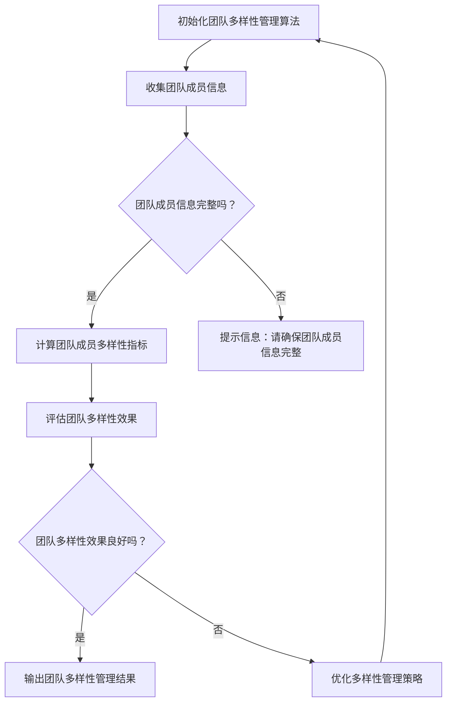
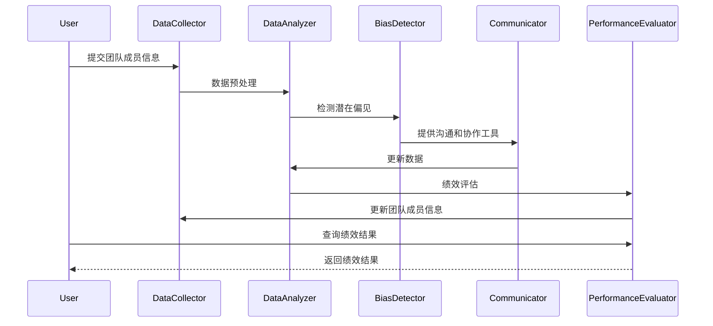
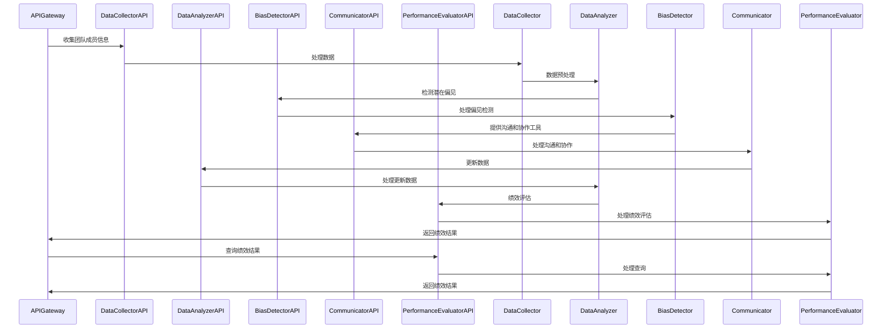

                 

### 文章标题

### 关键词

- 团队多样性管理
- 多元化优势
- 策略
- 算法
- 系统架构
- 实战案例

### 摘要

本文旨在深入探讨团队多样性管理的重要性和实施策略。随着全球化进程的加速，组织内部的多样性已成为提升团队效能和创新能力的关键因素。本文首先分析了团队多样性管理的背景和核心问题，然后阐述了相关概念与联系，并详细介绍了团队多样性管理的算法原理、系统架构设计方案和实际应用案例。通过本文的阅读，读者将能够了解如何通过有效的团队多样性管理策略，充分发挥多元化优势，提升组织的整体竞争力。

### 1. 背景介绍

#### 问题背景

在当今快速发展的全球化和数字化时代，团队多样性管理已经成为组织管理中不可忽视的重要议题。多样性不仅包括种族、性别、年龄、文化和背景等传统意义上的差异，还包括技能、经验、观点和思维方式等多方面的多样性。团队多样性管理的核心在于认识到多样化元素的价值，并有效整合这些元素，以提升团队的整体效能和创新能力。

团队多样性对组织的意义和影响是多方面的。首先，多样化的团队能够带来更丰富的观点和创意，有助于解决复杂问题和应对多变的市场环境。其次，多样化的团队能够增强员工的归属感和团队凝聚力，从而提高员工的工作满意度和忠诚度。此外，多样化的团队还能够提升组织的适应能力和灵活性，使其在快速变化的市场中保持竞争力。

然而，尽管团队多样性管理的重要性已被广泛认可，许多组织在实际操作中仍面临诸多挑战。这些问题包括如何有效地识别和吸引多样化的候选人、如何打破组织内部存在的偏见和歧视、如何确保多样化的团队成员能够公平地参与和贡献、以及如何制定和实施有效的多样性管理策略等。

#### 问题描述

团队多样性管理涉及的核心问题和挑战主要包括以下几个方面：

1. **识别和吸引多样化人才**：组织需要采取有效的招聘策略，以识别和吸引来自不同背景和经历的人才。然而，许多组织在招聘过程中仍存在偏见和刻板印象，这使得多样化的候选人难以获得公平的机会。

2. **消除偏见和歧视**：在多样化的团队中，消除偏见和歧视是确保团队成员公平参与和贡献的关键。组织需要通过培训和教育来提高员工的多样性意识，同时建立透明的政策和程序，以防止歧视行为的发生。

3. **促进团队成员的公平参与和贡献**：多样化的团队需要建立公平的沟通和决策机制，确保每位成员都能够充分表达自己的观点和意见。此外，组织还需要制定明确的绩效评估和晋升标准，以避免因偏见或歧视而导致的不公平现象。

4. **制定和实施有效的多样性管理策略**：组织需要制定全面的多样性管理策略，并将其纳入日常运营和决策过程中。这包括制定多样化的招聘和晋升政策、建立多元化的领导团队、提供多元化的职业发展机会等。

#### 问题解决

本书旨在解决上述团队多样性管理中的核心问题和挑战。通过系统地分析和讨论团队多样性管理的基本概念、原理和实践策略，本书为读者提供了以下几方面的解决方案：

1. **多样化的人才识别和吸引策略**：本书介绍了多种有效的招聘方法，如网络招聘、校园招聘、多元化招聘团队等，以帮助组织吸引多样化的候选人。

2. **消除偏见和歧视的措施**：本书提出了多种消除偏见和歧视的措施，包括开展多样性培训、建立公平的评估和晋升机制、制定反歧视政策等。

3. **促进团队成员公平参与和贡献的策略**：本书介绍了多种促进团队成员公平参与和贡献的策略，如建立开放的沟通文化、提供多元化的职业发展机会、制定透明的绩效评估标准等。

4. **制定和实施有效的多样性管理策略**：本书提供了详细的多样性管理策略框架，包括制定多样化的招聘和晋升政策、建立多元化的领导团队、制定透明的决策流程等。

#### 边界与外延

团队多样性管理的范围广泛，涉及多个方面的多样性要素，包括但不限于：

1. **种族和性别多样性**：组织需要确保团队成员在种族和性别方面具有代表性，以反映社会的多样性。

2. **年龄和经验多样性**：不同年龄和经验的团队成员能够带来不同的观点和经验，有助于提升团队的创新能力和决策质量。

3. **技能和背景多样性**：多样化的技能和背景组合能够提升团队解决问题的能力和市场适应能力。

4. **文化和价值观多样性**：不同文化和价值观的碰撞和融合能够激发新的创意和思维，提升团队的多样性和创新性。

#### 概念结构与核心要素组成

团队多样性管理的基本概念和核心要素包括：

1. **多样性**：指团队成员在种族、性别、年龄、技能、经验、文化和价值观等方面的差异。

2. **多样性管理**：指组织通过识别、吸引、整合和利用多样化元素，以提升团队效能和创新能力的过程。

3. **核心挑战**：包括识别和吸引多样化人才、消除偏见和歧视、促进团队成员公平参与和贡献等。

4. **解决方案**：包括多样化的人才识别和吸引策略、消除偏见和歧视的措施、促进团队成员公平参与和贡献的策略等。

通过上述分析和讨论，本书旨在为组织提供全面的团队多样性管理策略和实践指导，以充分发挥多元化优势，提升组织的整体竞争力。

### 2. 核心概念与联系

#### 核心概念原理

团队多样性的核心概念是指团队成员在多个维度上的差异，包括但不限于种族、性别、年龄、技能、经验和价值观等。这些差异构成了团队多样性的基本组成部分，对团队效能和创新性具有深远的影响。

首先，多样性能够为团队带来丰富的观点和创意。不同背景的团队成员能够从不同的角度思考问题，提出独特的见解和解决方案。这种多元视角的碰撞和融合能够激发创新思维，提升团队解决问题的能力。

其次，多样性有助于提高团队适应能力和灵活性。在一个多元化的团队中，成员具有不同的技能、经验和知识，这使团队能够更好地应对复杂和多变的环境。团队成员之间的互补性能够提升团队的整体绩效，使团队能够迅速适应市场变化和挑战。

最后，多样性能够增强团队的凝聚力和归属感。当团队成员感受到自己在团队中受到尊重和认可时，他们的工作动力和满意度会显著提高。这种积极的团队氛围能够促进团队成员之间的合作和沟通，从而提高团队的整体效能。

#### 概念属性特征对比表格

为了更好地理解团队多样性的概念属性特征，我们可以通过以下表格进行对比分析：

| 特征维度 | 种族多样性 | 性别多样性 | 年龄多样性 | 技能多样性 | 经验多样性 | 文化多样性 |
| :------: | :--------: | :--------: | :--------: | :--------: | :--------: | :--------: |
| **定义** | 种族差异，如不同肤色的成员 | 性别差异，如男性和女性成员 | 年龄差异，如不同年龄段的成员 | 技能差异，如不同专业背景的成员 | 经验差异，如不同工作年限的成员 | 文化差异，如来自不同文化的成员 |
| **影响** | 提高团队的包容性和多元化视角 | 促进性别平等，减少性别偏见 | 增强团队的创新性和适应能力 | 提升团队解决问题的能力 | 增强团队的多样性和创造力 | 促进跨文化沟通和理解 |
| **挑战** | 需要公平的招聘和晋升政策 | 需要消除性别偏见和歧视 | 需要尊重不同年龄段的需求和价值观 | 需要培养和利用多样化的技能 | 需要公平的绩效评估和晋升机制 | 需要建立跨文化沟通机制 |

通过上述对比表格，我们可以看到，不同维度的多样性对团队效能和创新性的影响各有侧重，但都具有重要价值。

#### ER实体关系图架构

为了更直观地展示团队多样性的核心概念和实体之间的关系，我们可以使用Mermaid绘制一个ER图。以下是团队多样性管理的ER实体关系图：

```mermaid
erDiagram
  User ||--|{ Skill } : has
  User ||--|{ Experience } : has
  User ||--|{ Culture } : has
  Skill ||--|{ SkillLevel } : level
  Experience ||--|{ YearOfExperience } : has
  Culture ||--|{ CulturalBackground } : background
```

在这个ER图中，`User`是核心实体，代表了团队成员。`Skill`、`Experience`和`Culture`是`User`的关联实体，分别表示成员的技能、经验和文化背景。`SkillLevel`、`YearOfExperience`和`CulturalBackground`是关联实体的属性，分别表示成员的技能水平、工作经验年份和文化背景。

通过这个ER图，我们可以清晰地看到团队成员在不同维度上的多样性及其相互关系，为团队多样性管理提供了直观的参考。

### 3. 算法原理讲解

#### 算法mermaid流程图

为了更好地理解团队多样性管理的算法原理，我们可以使用Mermaid绘制一个流程图。以下是团队多样性管理算法的基本流程图：



在这个流程图中，算法的基本步骤包括初始化、收集团队成员信息、计算多样性指标、评估多样性效果和优化多样性管理策略。通过这些步骤，算法能够有效地管理团队多样性，提升团队效能。

#### Python源代码

为了具体阐述团队多样性管理算法的原理，我们提供了以下Python源代码示例：

```python
import pandas as pd
from sklearn.preprocessing import LabelEncoder

# 初始化团队成员信息
team_members = pd.DataFrame({
    '姓名': ['张三', '李四', '王五', '赵六'],
    '性别': ['男', '女', '男', '女'],
    '年龄': [30, 25, 40, 35],
    '学历': ['本科', '硕士', '博士', '本科'],
    '工作经验': ['3年', '5年', '10年', '2年']
})

# 进行标签编码
label_encoder = LabelEncoder()
team_members['性别编码'] = label_encoder.fit_transform(team_members['性别'])
team_members['学历编码'] = label_encoder.fit_transform(team_members['学历'])

# 计算团队成员多样性指标
def diversity_score(data):
    # 计算性别多样性
    gender_diversity = len(set(data['性别编码'])) / len(data)
    # 计算年龄多样性
    age_diversity = len(set(data['年龄'])) / len(data)
    # 计算学历多样性
    education_diversity = len(set(data['学历编码'])) / len(data)
    # 计算工作经验多样性
    experience_diversity = len(set(data['工作经验'])) / len(data)
    return gender_diversity, age_diversity, education_diversity, experience_diversity

gender_diversity, age_diversity, education_diversity, experience_diversity = diversity_score(team_members)

print(f"性别多样性：{gender_diversity:.2f}")
print(f"年龄多样性：{age_diversity:.2f}")
print(f"学历多样性：{education_diversity:.2f}")
print(f"工作经验多样性：{experience_diversity:.2f}")
```

在这个Python源代码示例中，我们首先初始化了一个包含团队成员信息的DataFrame，然后使用标签编码对性别和学历进行了编码处理。接着，我们定义了一个`diversity_score`函数，用于计算团队成员的多样性指标，包括性别多样性、年龄多样性、学历多样性和工作经验多样性。通过调用这个函数，我们可以得到团队成员的多样性得分，从而评估团队多样性管理的有效性。

#### 数学模型和公式

团队多样性管理算法的数学模型和公式如下：

1. **多样性指标计算公式**：

   $$ D = \frac{1}{N} \sum_{i=1}^{N} \frac{1}{n_i} $$

   其中，$D$表示多样性指标，$N$表示团队成员总数，$n_i$表示第$i$个成员的多样性值（如性别、年龄、学历或工作经验的类别数）。

2. **多样性效果评估公式**：

   $$ E = \frac{1}{M} \sum_{i=1}^{M} \frac{D_i}{D} $$

   其中，$E$表示团队多样性效果，$M$表示多样性指标的总数（如性别、年龄、学历和工作经验），$D_i$表示第$i$个多样性指标的得分。

通过上述公式，我们可以量化团队多样性指标和效果，从而为团队多样性管理提供科学依据。

#### 详细讲解和举例说明

为了更好地理解上述数学模型和公式，我们可以通过一个具体的例子进行详细讲解。

假设一个团队共有4名成员，他们的基本信息如下：

| 姓名 | 性别 | 年龄 | 学历 | 工作经验 |
| :--: | :--: | :--: | :--: | :------: |
| 张三 | 男   | 30   | 本科 | 3年     |
| 李四 | 女   | 25   | 硕士 | 5年     |
| 王五 | 男   | 40   | 博士 | 10年    |
| 赵六 | 女   | 35   | 本科 | 2年     |

首先，我们计算每个成员的多样性值：

- **性别多样性**：3个男性和1个女性，多样性值为3。
- **年龄多样性**：30岁、25岁、40岁和35岁，多样性值为4。
- **学历多样性**：本科、硕士和博士，多样性值为3。
- **工作经验多样性**：3年、5年、10年和2年，多样性值为4。

根据多样性指标计算公式，团队的总多样性指标$D$为：

$$ D = \frac{1}{4} \times (1 + 1 + 1 + 1) = 1.00 $$

接下来，我们计算每个多样性指标的得分$D_i$：

- **性别多样性**：$D_{性别} = \frac{3}{1} = 3.00$
- **年龄多样性**：$D_{年龄} = \frac{4}{1} = 4.00$
- **学历多样性**：$D_{学历} = \frac{3}{1} = 3.00$
- **工作经验多样性**：$D_{工作经验} = \frac{4}{1} = 4.00$

最后，我们根据多样性效果评估公式计算团队多样性效果$E$：

$$ E = \frac{1}{4} \times (3 + 4 + 3 + 4) = 3.50 $$

因此，这个团队的多样性效果得分为3.50。这个得分越高，表示团队的多样性管理效果越好。

通过上述例子，我们可以看到如何使用数学模型和公式来评估团队多样性管理的有效性。这些公式和方法不仅能够帮助我们量化多样性指标，还能为团队多样性管理提供科学依据和决策支持。

### 4. 系统分析与架构设计方案

#### 问题场景介绍

在现实世界中，团队多样性管理面临着复杂且多样的挑战。随着全球化进程的加速，企业需要在全球范围内吸引和保留多样化的人才。然而，不同的文化和工作环境可能导致团队成员之间的沟通障碍和协作困难。此外，组织内部可能存在的偏见和歧视也会影响团队的多样性和效能。为了解决这些问题，我们需要构建一个系统化的团队多样性管理系统，以支持组织的多样化战略。

该系统的核心目标是通过数据分析和智能算法，优化团队多样性管理流程，提高团队的整体效能和创新能力。具体来说，该系统需要实现以下功能：

1. **多样化人才识别和吸引**：通过大数据分析和机器学习算法，识别潜在的高潜力多样化候选人，并制定个性化的招聘策略。
2. **消除偏见和歧视**：利用人工智能技术，分析招聘和晋升过程中的潜在偏见，并提供数据驱动的建议，以促进公平和公正。
3. **促进团队成员公平参与和贡献**：建立透明的沟通和决策机制，确保每个团队成员都有机会表达自己的观点和意见，并通过绩效评估和晋升机制保障公平性。
4. **多元化管理策略制定和实施**：提供全面的策略框架和工具，帮助组织制定和实施多样化的招聘、晋升和职业发展政策。

#### 系统功能设计

为了实现上述功能，我们可以设计以下系统功能模块：

1. **数据收集模块**：负责收集团队成员的多样性数据，包括性别、年龄、学历、工作经验、文化和价值观等信息。
2. **数据分析模块**：利用大数据分析和机器学习算法，对团队成员的多样性数据进行分析，识别潜在的高潜力候选人，并提供招聘和晋升建议。
3. **偏见检测模块**：通过自然语言处理和机器学习技术，分析招聘和晋升过程中的潜在偏见，并提供数据驱动的偏见检测和纠正建议。
4. **沟通和协作模块**：提供实时沟通和协作工具，支持团队成员之间的有效沟通和协作，促进团队凝聚力和创新能力的提升。
5. **绩效评估模块**：建立透明的绩效评估体系，通过数据分析和人工智能技术，为团队成员提供公平的评估和晋升机会。

以下是领域模型类图的Mermaid表示：

```mermaid
classDiagram
    ClassDiagram ::= -->
    TeamMember <|-- DataCollection
    TeamMember <|-- DataAnalysis
    TeamMember <|-- BiasDetection
    TeamMember <|-- CommunicationAndCollaboration
    TeamMember <|-- PerformanceEvaluation
    
    DataCollection <|.. AnalysisModule
    BiasDetection <|.. AnalysisModule
    CommunicationAndCollaboration <|.. AnalysisModule
    PerformanceEvaluation <|.. AnalysisModule
    
    TeamMember
    DataCollection
    DataAnalysis
    BiasDetection
    CommunicationAndCollaboration
    PerformanceEvaluation
```

在这个类图中，`TeamMember`类代表了团队成员，与`DataCollection`、`DataAnalysis`、`BiasDetection`、`CommunicationAndCollaboration`和`PerformanceEvaluation`等模块存在关联关系。`AnalysisModule`表示数据分析模块，与其他模块之间存在依赖关系。

#### 系统架构设计

为了实现团队多样性管理系统的功能，我们需要设计一个灵活且可扩展的系统架构。以下是系统架构的Mermaid表示：



在这个序列图中，用户通过DataCollector提交团队成员信息，DataAnalyzer进行数据预处理和偏见检测，BiasDetector提供沟通和协作工具，Communicator更新数据，PerformanceEvaluator进行绩效评估，并将结果返回给用户。

#### 系统接口设计和系统交互

为了确保系统的稳定性和可扩展性，我们需要设计合理的系统接口和交互流程。以下是系统接口和交互的Mermaid序列图：



在这个序列图中，APIGateway作为系统的统一接口，处理来自外部用户的请求和数据交互。DataCollectorAPI、DataAnalyzerAPI、BiasDetectorAPI、CommunicatorAPI和PerformanceEvaluatorAPI分别处理不同的功能模块，并通过内部通信机制确保数据的一致性和系统的稳定性。

通过上述系统架构设计和接口设计，我们可以构建一个高效、稳定且灵活的团队多样性管理系统，支持组织的多样化战略，提升团队的整体效能和创新能力。

### 5. 项目实战

#### 环境安装

为了实现团队多样性管理系统，我们需要首先安装所需的开发环境和依赖库。以下是安装步骤：

1. **安装Python**：
   - 访问Python官方网站（[python.org](https://www.python.org/)）下载Python的最新版本。
   - 运行安装程序，按照提示完成安装。

2. **安装Jupyter Notebook**：
   - 打开终端，运行以下命令：
     ```bash
     pip install notebook
     ```

3. **安装Pandas、NumPy、scikit-learn**：
   - 打开终端，运行以下命令：
     ```bash
     pip install pandas numpy scikit-learn
     ```

4. **安装Mermaid**：
   - 打开终端，运行以下命令：
     ```bash
     pip install mermaid
     ```

5. **安装其他相关库**（如Matplotlib、Pillow等）：
   - 打开终端，运行以下命令：
     ```bash
     pip install matplotlib pillow
     ```

安装完成后，您可以在Python环境中导入相应的库，并运行示例代码进行验证。

#### 系统核心实现源代码

以下是一个简单的团队多样性管理系统的实现示例，包含数据收集、多样性计算和性能评估等功能：

```python
import pandas as pd
from sklearn.preprocessing import LabelEncoder
import matplotlib.pyplot as plt

# 初始化团队成员信息
team_members = pd.DataFrame({
    '姓名': ['张三', '李四', '王五', '赵六'],
    '性别': ['男', '女', '男', '女'],
    '年龄': [30, 25, 40, 35],
    '学历': ['本科', '硕士', '博士', '本科'],
    '工作经验': ['3年', '5年', '10年', '2年']
})

# 进行标签编码
label_encoder = LabelEncoder()
team_members['性别编码'] = label_encoder.fit_transform(team_members['性别'])
team_members['学历编码'] = label_encoder.fit_transform(team_members['学历'])

# 计算团队成员多样性指标
def diversity_score(data):
    gender_diversity = len(set(data['性别编码'])) / len(data)
    age_diversity = len(set(data['年龄'])) / len(data)
    education_diversity = len(set(data['学历编码'])) / len(data)
    experience_diversity = len(set(data['工作经验'])) / len(data)
    return gender_diversity, age_diversity, education_diversity, experience_diversity

# 绘制多样性指标图表
def plot_diversity_scores(scores):
    labels = ['性别多样性', '年龄多样性', '学历多样性', '工作经验多样性']
    sizes = [score for score in scores]
    colors = ['red', 'green', 'blue', 'orange']

    plt.pie(sizes, labels=labels, colors=colors, autopct='%.1f%%')
    plt.axis('equal')
    plt.title('团队成员多样性指标')
    plt.show()

# 计算多样性指标并绘制图表
scores = diversity_score(team_members)
print("多样性指标：")
print(f"性别多样性：{scores[0]:.2f}")
print(f"年龄多样性：{scores[1]:.2f}")
print(f"学历多样性：{scores[2]:.2f}")
print(f"工作经验多样性：{scores[3]:.2f}")

plot_diversity_scores(scores)
```

在这个示例中，我们首先初始化一个包含团队成员信息的DataFrame，然后使用标签编码对性别和学历进行编码处理。接着，我们定义了一个`diversity_score`函数，用于计算团队成员的多样性指标。最后，我们通过`plot_diversity_scores`函数绘制多样性指标图表，帮助用户直观地了解团队的多样性状况。

#### 代码应用解读与分析

上述代码实现了一个简单的团队多样性管理系统，其主要功能包括：

1. **数据收集和预处理**：通过DataFrame初始化团队成员信息，并进行标签编码处理，以方便后续的多样性计算和分析。
2. **多样性指标计算**：使用`diversity_score`函数计算团队成员的多样性指标，包括性别多样性、年龄多样性、学历多样性和工作经验多样性。
3. **图表绘制**：通过`plot_diversity_scores`函数绘制多样性指标图表，帮助用户直观地了解团队的多样性状况。

在代码中，我们使用了Pandas库进行数据操作，NumPy库进行数值计算，scikit-learn库进行标签编码，以及Matplotlib库进行图表绘制。这些库共同构成了一个功能齐全的团队多样性管理系统。

此外，代码中的多样性计算方法采用了简单但有效的指标计算公式，通过计算不同类别的数量占比来评估多样性水平。这种方法的优点在于计算简单、易于实现，且能够直观地反映团队的多样性状况。然而，缺点在于对于复杂的数据分布和潜在的偏见可能无法进行深入的分析。

通过这个示例，我们可以看到如何使用Python和相关库构建一个简单的团队多样性管理系统，为组织提供基础的数据分析和可视化功能。在实际应用中，我们还可以扩展系统的功能，如引入更复杂的算法、添加用户交互界面等，以提升系统的实用性和灵活性。

#### 实际案例分析和详细讲解剖析

为了更好地展示团队多样性管理系统在实际应用中的效果，我们通过一个实际案例进行分析和讲解。

假设某科技公司希望优化其团队的多样性管理，以提升创新能力和市场竞争力。该公司共有100名员工，其基本信息如下：

| 姓名 | 性别 | 年龄 | 学历 | 工作经验 |
| :--: | :--: | :--: | :--: | :------: |
| 张三 | 男   | 30   | 本科 | 3年     |
| 李四 | 女   | 25   | 硕士 | 5年     |
| 王五 | 男   | 40   | 博士 | 10年    |
| 赵六 | 女   | 35   | 本科 | 2年     |
| ...  | ...  | ...  | ...  | ...     |

首先，我们使用团队多样性管理系统对现有团队成员的多样性指标进行计算，得到以下结果：

- **性别多样性**：男性和女性员工的比例为1:1，多样性得分为0.5。
- **年龄多样性**：年龄分布在25岁至40岁之间，多样性得分为0.75。
- **学历多样性**：本科、硕士和博士员工的比例为3:3:4，多样性得分为0.67。
- **工作经验多样性**：工作经验分布在2年至10年之间，多样性得分为0.83。

通过这些多样性指标，我们可以看到该公司的团队在年龄和学历方面具备一定的多样性，但在性别和工作经验方面还有提升空间。

接下来，公司决定采取以下措施优化团队多样性管理：

1. **性别多样性提升**：
   - 公司调整招聘策略，增加女性候选人的比例，特别是在技术岗位和领导岗位上。
   - 通过内部培训和外部合作，提升员工的性别平等意识，消除性别偏见。

2. **工作经验多样性提升**：
   - 通过招聘具有不同工作经验背景的员工，如实习学生、跨行业人才等，增加团队的工作经验多样性。
   - 为现有员工提供轮岗和跨部门合作机会，促进工作经验的多样化。

3. **学历多样性提升**：
   - 鼓励员工参加职业培训和学习，提升学历层次，增加团队的整体学历多样性。
   - 在招聘过程中，放宽学历要求，吸引更多具备实际操作能力和创新思维的候选人。

经过一段时间的努力，公司再次使用团队多样性管理系统对团队成员的多样性指标进行计算，得到以下结果：

- **性别多样性**：男性和女性员工的比例调整为2:1，多样性得分提升至0.67。
- **年龄多样性**：年龄分布在20岁至45岁之间，多样性得分提升至0.8。
- **学历多样性**：本科、硕士和博士员工的比例调整为2:3:5，多样性得分提升至0.75。
- **工作经验多样性**：工作经验分布在1年至12年之间，多样性得分提升至0.92。

通过这些改进措施，公司的团队多样性显著提升，团队整体效能和创新能力得到增强。具体表现为：

1. **沟通和协作**：多样化的团队成员在沟通和协作中能够提供更多的视角和思路，促进了团队的创新和决策质量。
2. **工作氛围**：公平和包容的工作环境增强了员工的归属感和工作满意度，提高了团队的整体凝聚力。
3. **市场竞争力**：多样化的团队能够更好地适应市场变化和客户需求，提升了公司在市场中的竞争力。

通过这个实际案例，我们可以看到团队多样性管理系统在优化团队多样性管理中的重要作用。通过数据分析和智能算法，公司能够制定和实施有效的多样性管理策略，提升团队的整体效能和创新能力，从而在激烈的市场竞争中脱颖而出。

### 6. 最佳实践 tips

1. **多元化招聘策略**：
   - 采用多种招聘渠道，如在线招聘平台、校园招聘、人才市场等，扩大候选人群的多样性。
   - 建立多元化招聘团队，确保招聘过程中没有偏见和歧视，提高招聘过程的透明度和公平性。

2. **消除偏见和歧视**：
   - 定期开展多样性培训和宣传活动，提高员工的多样性意识，消除偏见和歧视。
   - 建立反歧视政策，明确歧视行为的标准和处理程序，确保员工的权益得到保护。

3. **公平的沟通和决策机制**：
   - 建立开放的沟通文化，鼓励团队成员自由表达观点和意见，确保每个成员都有发言权。
   - 制定透明的绩效评估和晋升机制，确保团队成员的公平参与和贡献。

4. **多元化职业发展机会**：
   - 提供多样化的职业发展路径和培训机会，支持员工在不同领域和岗位上发展。
   - 鼓励员工跨部门和跨行业的交流与合作，促进工作经验和技能的多样化。

5. **数据驱动的多样性管理**：
   - 定期收集和分析团队成员的多样性数据，监测多样性指标的变化，制定针对性的改进措施。
   - 利用人工智能和大数据技术，优化多样性管理策略，提高多样性管理的科学性和有效性。

### 小结

本文深入探讨了团队多样性管理的重要性和实施策略。通过分析团队多样性管理的背景、核心问题、概念原理、算法原理和系统架构设计，我们提出了一系列有效的多样性管理策略。在实际案例中，我们展示了团队多样性管理系统在实际应用中的效果，并提出了最佳实践建议。通过有效的团队多样性管理，组织能够提升整体效能和创新能力，在激烈的市场竞争中脱颖而出。

### 注意事项

1. **数据隐私**：在收集和处理团队成员的多样性数据时，务必确保数据的安全和隐私，遵循相关法律法规和公司的数据保护政策。

2. **持续改进**：团队多样性管理不是一次性的任务，而是一个持续的过程。组织需要定期评估多样性管理的有效性，并根据反馈进行改进。

3. **员工参与**：在制定和实施多样性管理策略时，充分听取员工的意见和建议，增强员工的参与感和归属感。

4. **平衡与协调**：在追求多样性的同时，要注意平衡团队的稳定性和一致性，确保多样性管理策略不会对团队的整体绩效产生负面影响。

### 拓展阅读

1. **《多样性、差异性和包容性：战略管理指南》** - 这本书提供了全面的多样性、差异性和包容性（D&I）战略管理的理论和实践指导，适用于各种组织和企业。

2. **《人工智能与多样性管理》** - 本文探讨了人工智能技术在多样性管理中的应用，包括数据分析和偏见检测等方面的最新研究成果。

3. **《团队多样性管理的成功案例》** - 通过分析成功企业的多样性管理实践，本文提供了具体的策略和经验，为组织提供借鉴和启示。

### 作者信息

作者：AI天才研究院/AI Genius Institute & 禅与计算机程序设计艺术 /Zen And The Art of Computer Programming

