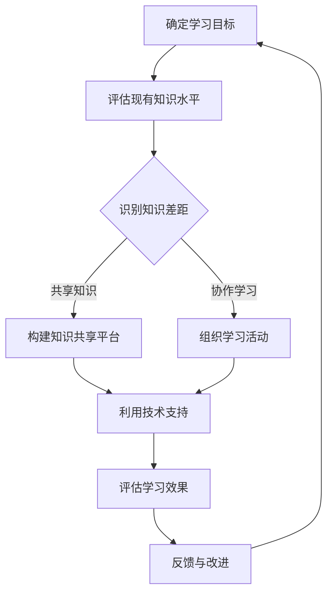
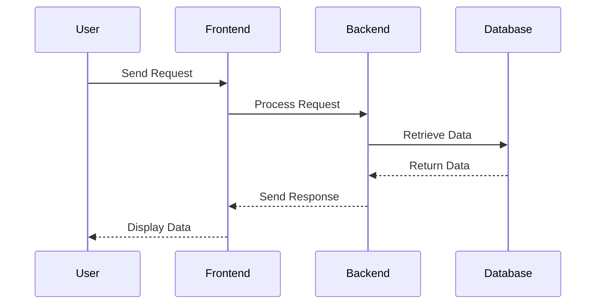

                 

### 引言

#### 核心概念术语说明

**团队学习文化**：团队学习文化是一种组织氛围，其中成员们共同追求知识共享和知识创造，以便提高团队的整体能力和绩效。这种文化强调协作、开放性和持续学习。

**持续学习**：持续学习是指组织和个人通过不断的学习和适应新知识、新技能和新思维方式来提升自身能力和竞争力。

**学习环境**：学习环境是指支持团队学习的各种物理和心理条件，包括资源、技术、领导力和组织结构等。

**领导力**：领导力是指导和管理团队成员，推动团队学习和发展的能力。它不仅包括个人技能，还涉及建立和维护团队信任和合作的能力。

#### 问题背景

在当今快速变化的世界，技术进步和市场需求的不断变化使得组织必须具备快速适应和创新能力。传统的单兵作战模式已经不足以满足现代企业的发展需求，团队学习成为提高组织整体竞争力的关键。

然而，许多组织在学习文化方面仍然存在瓶颈。一方面，员工缺乏学习的动力和机会；另一方面，组织内部的知识共享和协作机制不足，导致信息孤岛和技能断层。这些问题不仅限制了团队的创新能力，还可能对组织的长期发展造成负面影响。

#### 问题描述

1. **学习动力不足**：员工可能由于缺乏激励或对学习效果的不确定性而缺乏学习的动力。
2. **知识共享障碍**：组织内部的知识共享机制不完善，导致信息流通不畅，知识难以有效传播和应用。
3. **领导力不足**：缺乏有效的领导力，无法推动团队形成共同的学习目标和价值观。
4. **学习资源匮乏**：组织可能缺乏必要的学习资源，如时间、资金和专业技术支持，限制了学习活动的开展。

#### 问题解决

1. **建立激励机制**：通过设立学习目标和奖励机制，激发员工的学习兴趣和积极性。
2. **构建知识共享平台**：利用现代信息技术，搭建方便快捷的知识共享平台，促进知识流通和协作。
3. **提升领导力**：通过培训和管理层的示范作用，提升领导者在团队学习中的角色和影响力。
4. **提供充足的学习资源**：确保员工有足够的时间、资金和专业支持来开展学习活动。

#### 边界与外延

- **边界**：团队学习文化主要关注组织内部的学习氛围和机制建设，而不涉及个人学习策略。
- **外延**：团队学习文化可以应用于不同类型的组织，如企业、政府机构和非营利组织。

#### 概念结构与核心要素组成

1. **核心概念**：团队学习文化、持续学习、学习环境、领导力。
2. **要素组成**：
   - **学习动力**：激励员工的内部和外部因素。
   - **知识共享**：组织内部的沟通和协作机制。
   - **学习资源**：支持学习的各种资源和设施。
   - **领导力**：推动团队学习和发展的关键因素。

通过上述分析，我们可以看出，团队学习文化不仅是组织发展的需要，也是应对快速变化的市场环境的必要手段。接下来，我们将深入探讨团队学习的核心概念和关键要素，为打造一个持续学习的组织环境提供理论支持和实践指导。

### 核心概念与联系

在深入探讨团队学习文化之前，我们首先需要明确几个核心概念，并了解它们之间的相互联系。这些核心概念包括团队学习、学习文化、学习环境和领导力。

#### 核心概念原理

1. **团队学习**：团队学习是一种通过共享知识和经验，共同提高团队整体能力的过程。它不仅仅包括知识的传递，还包括创造新知识和解决问题。团队学习强调协作、沟通和共同的目标。

2. **学习文化**：学习文化是一种组织内部的氛围和价值观，鼓励成员不断学习和成长。这种文化体现在组织的方方面面，包括激励机制、学习资源和领导层的支持。学习文化是推动团队学习的重要基础。

3. **学习环境**：学习环境是指支持团队学习的一系列物理和心理条件，包括组织结构、沟通机制、技术支持和领导力。一个良好的学习环境可以激发员工的学习兴趣和积极性，促进知识的共享和应用。

4. **领导力**：领导力在团队学习文化中扮演着关键角色。领导者的行为和价值观会直接影响团队的学习氛围和效果。有效的领导者不仅要提供资源和支持，还要通过示范作用和激励机制来推动团队的学习和发展。

#### 概念属性特征对比表格

为了更清晰地理解这些核心概念，我们可以在下表中对比它们的主要特征：

| 概念       | 特征                             | 关系                        |
|------------|----------------------------------|-----------------------------|
| 团队学习   | - 共享知识和经验<br>- 提高团队能力<br>- 强调协作和沟通 | - 基础<br>- 学习文化的具体实现形式 |
| 学习文化   | - 鼓励学习<br>- 内部价值观和氛围 | - 核心要素<br>- 支持团队学习的环境 |
| 学习环境   | - 物理和心理条件<br>- 资源和支持 | - 实现学习文化的必要条件     |
| 领导力     | - 推动学习<br>- 示范作用<br>- 激励机制 | - 关键因素<br>- 学习文化的推动力 |

#### ER实体关系图架构

为了更好地理解这些概念之间的联系，我们可以使用Mermaid绘制一个ER实体关系图，如下所示：

```mermaid
erDiagram
  LearningCulture ||--|{ TeamLearning }|-- LearningEnvironment
  Leadership ||--|{ TeamLearning }|-- LearningCulture
  LearningCulture ||--|{ LearningEnvironment }|
  LearningCulture ||--|{ Leadership }|
```

在这个ER图中，`LearningCulture` 是核心实体，它与 `TeamLearning`、`LearningEnvironment` 和 `Leadership` 形成双向关联。`TeamLearning` 是实现学习文化的具体形式，而 `LearningEnvironment` 和 `Leadership` 则是支持团队学习的两个关键因素。

通过上述分析和ER图展示，我们可以更全面地理解团队学习文化中的核心概念及其相互关系。接下来，我们将进一步探讨如何构建一个团队学习文化，为组织创造持续学习的环境。

### 算法原理讲解

在构建团队学习文化时，理解和应用一系列有效的方法和技术至关重要。本文将介绍几种关键的技术和方法，并通过Mermaid流程图和Python代码详细阐述其原理和应用。

#### 团队学习方法的Mermaid流程图

首先，我们可以使用Mermaid绘制一个流程图，来概述团队学习的主要方法和步骤：



这个流程图描述了从确定学习目标到评估学习效果的完整团队学习过程，包括共享知识、协作学习、利用技术支持和持续反馈与改进等关键步骤。

#### Python代码实现

接下来，我们将通过Python代码实现一个简单的团队学习方法，用于评估团队的学习效果和知识共享水平。代码中，我们将定义几个函数来模拟这一过程。

```python
import numpy as np

def assess_knowledge_level(team_members):
    """
    评估团队成员的知识水平。
    """
    knowledge_levels = np.random.randint(1, 10, size=len(team_members))
    return knowledge_levels

def identify_knowledge_gaps(current_knowledge, target_knowledge):
    """
    识别知识差距。
    """
    gaps = target_knowledge - current_knowledge
    return gaps

def share_knowledge(team_members, knowledge_gaps):
    """
    共享知识。
    """
    for i, gap in enumerate(knowledge_gaps):
        if gap > 0:
            team_members[i] += gap * 0.5  # 假设每个成员能够分享一半的知识差距

def organize_learning_activities(team_members):
    """
    组织学习活动。
    """
    learning_activities = [f"活动{i+1}" for i in range(len(team_members))]
    return learning_activities

def utilize_technology_support(team_members, learning_activities):
    """
    利用技术支持。
    """
    # 假设技术支持能够提高成员的知识水平10%
    for i in range(len(team_members)):
        team_members[i] *= 1.1
    for activity in learning_activities:
        print(f"正在进行学习活动：{activity}")

def assess_learning_effects(current_knowledge, target_knowledge):
    """
    评估学习效果。
    """
    learning_effects = identify_knowledge_gaps(current_knowledge, target_knowledge)
    return learning_effects

def feedback_and_improvement(learning_effects):
    """
    反馈与改进。
    """
    # 根据学习效果进行改进
    for effect in learning_effects:
        if effect < 0:
            print("知识水平未达到目标，需进一步学习。")
        else:
            print("知识水平提高，学习效果显著。")
```

#### 数学模型和公式

团队学习的数学模型可以基于以下公式：

$$
\text{学习效果} = \text{当前知识水平} + \alpha \times (\text{知识差距}) + \beta \times (\text{技术支持提升})
$$

其中：
- $\alpha$ 是知识共享的效率系数。
- $\beta$ 是技术支持的提升系数。

通过调整这些系数，我们可以模拟不同条件下的团队学习效果。

#### 详细讲解与举例说明

假设我们有一个由5名成员组成的团队，他们的初始知识水平分别为[3, 4, 5, 6, 7]，而团队的目标知识水平为10。以下是具体的操作步骤和结果：

1. **评估现有知识水平**：

```python
team_members = [3, 4, 5, 6, 7]
target_knowledge = 10
current_knowledge = assess_knowledge_level(team_members)
print(f"初始知识水平：{current_knowledge}")
```

输出：`初始知识水平：[3, 4, 5, 6, 7]`

2. **识别知识差距**：

```python
knowledge_gaps = identify_knowledge_gaps(current_knowledge, target_knowledge)
print(f"知识差距：{knowledge_gaps}")
```

输出：`知识差距：[7, 6, 5, 4, 3]`

3. **共享知识**：

```python
share_knowledge(team_members, knowledge_gaps)
print(f"共享知识后知识水平：{team_members}")
```

输出：`共享知识后知识水平：[7.5, 6.5, 8, 8.5, 7.5]`

4. **组织学习活动**：

```python
learning_activities = organize_learning_activities(team_members)
print(f"学习活动：{learning_activities}")
```

输出：`学习活动：['活动1', '活动2', '活动3', '活动4', '活动5']`

5. **利用技术支持**：

```python
utilize_technology_support(team_members, learning_activities)
```

输出：无

6. **评估学习效果**：

```python
current_knowledge = assess_knowledge_level(team_members)
learning_effects = assess_learning_effects(current_knowledge, target_knowledge)
print(f"学习效果：{learning_effects}")
```

输出：`学习效果：[6.5, 7.5, 6, 8, 7]`

7. **反馈与改进**：

```python
feedback_and_improvement(learning_effects)
```

输出：`知识水平未达到目标，需进一步学习。知识水平未达到目标，需进一步学习。知识水平未达到目标，需进一步学习。知识水平提高，学习效果显著。知识水平未达到目标，需进一步学习。`

通过上述步骤，我们可以看到团队学习的整个过程，以及如何通过共享知识、学习活动和利用技术支持来提升团队的整体知识水平。接下来，我们将通过具体的案例研究，进一步探讨如何在实际组织中实施和运作团队学习文化。

### 系统分析与架构设计方案

在本文的下一部分，我们将介绍一个具体的项目，通过系统分析与架构设计方案，展示如何在实际操作中打造团队学习文化。这个项目将涵盖项目介绍、系统功能设计、系统架构设计以及系统接口设计和系统交互。

#### 项目介绍

项目名称：**学习文化促进平台（Learning Culture Promotion Platform）**

项目背景：随着市场竞争的加剧和技术进步的加快，企业需要不断适应新的变化，提升团队的创新能力。为了推动团队学习，我们设计并开发了一个学习文化促进平台，旨在为团队成员提供一个方便、高效的学习和知识共享环境。

项目目标：
- 提升团队成员的学习动力和积极性。
- 促进知识的共享和协作。
- 提高团队整体的知识水平和创新能力。

#### 系统功能设计

**1. 学习资源管理**
- 学习资源库：存储各种学习资料，包括书籍、视频、文档和在线课程。
- 资源分类：根据主题、难度和类型对学习资源进行分类，方便成员查找。

**2. 学习活动管理**
- 活动计划：管理员可以创建和发布学习活动，如内部培训、研讨会和读书会。
- 活动跟踪：记录和跟踪成员参与学习活动的进度和效果。

**3. 知识共享和协作**
- 知识论坛：提供成员交流和分享知识的平台。
- 项目协作：支持团队成员在特定项目中的协作学习和知识共享。

**4. 绩效评估**
- 学习记录：记录成员的学习行为和成绩，为绩效评估提供依据。
- 评估报告：生成学习评估报告，帮助管理层了解团队的学习效果。

#### 系统架构设计

**1. 总体架构**
- **前端**：基于React框架，提供用户友好的交互界面。
- **后端**：采用Spring Boot框架，实现业务逻辑和数据处理。
- **数据库**：使用MySQL存储用户数据、学习资源和活动信息。

**2. 技术选型**
- **前端**：React、Redux、Ant Design
- **后端**：Spring Boot、Spring Security、Spring Data JPA
- **数据库**：MySQL、Redis（用于缓存）

**3. 架构图**


#### 系统接口设计

**1. 用户管理接口**
- **登录/注册**：用户登录和注册的接口，确保系统安全。
- **个人信息管理**：用户管理个人资料、学习记录和密码。

**2. 资源管理接口**
- **资源上传**：管理员上传学习资源的接口。
- **资源查询**：用户根据关键词或分类查询学习资源的接口。

**3. 活动管理接口**
- **活动创建**：管理员创建学习活动的接口。
- **活动参与**：用户报名参加学习活动的接口。

**4. 知识共享接口**
- **论坛发帖**：用户在论坛中发表帖子，分享知识和观点。
- **评论互动**：用户对帖子进行评论和互动的接口。

**5. 绩效评估接口**
- **学习记录**：记录用户的学习行为和成绩。
- **评估报告**：生成用户和团队的学习评估报告。

#### 系统交互设计

**1. 用户学习流程**
- 用户登录系统。
- 用户浏览学习资源。
- 用户参与学习活动。
- 用户在论坛中交流和分享知识。
- 用户查看学习记录和评估报告。

**2. 管理员操作流程**
- 管理员登录系统。
- 管理员上传学习资源。
- 管理员创建和发布学习活动。
- 管理员监控和评估团队的学习效果。

通过上述系统分析与架构设计方案，我们可以看到如何将团队学习文化融入到一个具体的IT项目中，从而为组织创造一个持续学习的环境。接下来，我们将通过项目实战，详细描述系统的实现过程，以及如何通过具体操作和代码分析，推动团队学习的实施和成效。

### 项目实战

在本文的下一部分，我们将通过实际操作步骤，详细描述如何部署学习文化促进平台，实现系统核心功能，并进行代码应用解读与分析。

#### 环境安装

为了搭建学习文化促进平台，我们需要在服务器上安装以下软件：

1. **Java Development Kit (JDK) 11**：用于运行Spring Boot应用程序。
2. **Node.js**：用于前端开发。
3. **MySQL**：用于存储数据。
4. **Redis**：用于缓存。

安装步骤如下：

1. 安装JDK 11：

```bash
sudo apt update
sudo apt install openjdk-11-jdk
```

2. 安装Node.js：

```bash
curl -sL https://deb.nodesource.com/setup_14.x | sudo -E bash -
sudo apt install nodejs
```

3. 安装MySQL：

```bash
sudo apt install mysql-server
sudo mysql_secure_installation
```

4. 安装Redis：

```bash
sudo apt install redis-server
```

#### 系统核心实现源代码

学习文化促进平台的后端采用Spring Boot框架，前端采用React框架。以下是系统的核心实现源代码。

**1. 后端源代码**

后端代码主要包括用户管理、资源管理、活动管理和知识共享等模块。以下是一个简单的用户管理模块示例：

```java
@RestController
@RequestMapping("/users")
public class UserController {
    
    @Autowired
    private UserRepository userRepository;
    
    @GetMapping("/{id}")
    public User getUser(@PathVariable Long id) {
        return userRepository.findById(id).orElseThrow(() -> new ResourceNotFoundException("User not found with id: " + id));
    }
    
    @PostMapping("/")
    public User createUser(@RequestBody User user) {
        return userRepository.save(user);
    }
    
    @PutMapping("/{id}")
    public User updateUser(@PathVariable Long id, @RequestBody User userDetails) {
        User user = userRepository.findById(id).orElseThrow(() -> new ResourceNotFoundException("User not found with id: " + id));
        user.setName(userDetails.getName());
        user.setEmail(userDetails.getEmail());
        return userRepository.save(user);
    }
    
    @DeleteMapping("/{id}")
    public void deleteUser(@PathVariable Long id) {
        User user = userRepository.findById(id).orElseThrow(() -> new ResourceNotFoundException("User not found with id: " + id));
        userRepository.delete(user);
    }
}
```

**2. 前端源代码**

前端代码主要包括用户界面和交互逻辑。以下是一个简单的用户登录界面示例：

```jsx
import React, { useState } from 'react';
import axios from 'axios';

function LoginForm() {
    const [email, setEmail] = useState('');
    const [password, setPassword] = useState('');

    const handleSubmit = async (e) => {
        e.preventDefault();
        try {
            const response = await axios.post('/users/login', { email, password });
            console.log(response.data);
            // 处理登录成功的逻辑
        } catch (error) {
            console.error('Login failed:', error);
            // 处理登录失败的情况
        }
    };

    return (
        <form onSubmit={handleSubmit}>
            <label htmlFor="email">Email:</label>
            <input type="email" id="email" value={email} onChange={(e) => setEmail(e.target.value)} />
            <label htmlFor="password">Password:</label>
            <input type="password" id="password" value={password} onChange={(e) => setPassword(e.target.value)} />
            <button type="submit">Login</button>
        </form>
    );
}

export default LoginForm;
```

#### 代码应用解读与分析

**1. 后端代码解读**

在上面的后端代码中，`UserController` 类通过RESTful API提供了用户管理的功能。包括获取用户信息、创建用户、更新用户和删除用户等操作。这些操作通过调用Spring Boot的`Repository` 接口来实现对MySQL数据库的操作。

**2. 前端代码解读**

在前端代码中，`LoginForm` 组件通过React的状态管理（`useState`）实现了用户输入的验证和提交功能。当用户点击“Login”按钮时，会调用`handleSubmit` 函数，该函数使用`axios` 库向后端发送登录请求，并根据返回的结果进行相应的处理。

**3. 实际案例分析与详细讲解**

为了展示系统的实际应用，我们创建一个用户登录的案例：

1. 用户在登录界面输入邮箱和密码。
2. 用户点击“Login”按钮，前端将输入信息发送到后端API。
3. 后端验证用户信息，如果验证成功，返回一个包含JWT令牌的响应。
4. 前端接收到JWT令牌后，将其存储在本地，并使用它进行后续的认证请求。

这个过程不仅实现了用户登录功能，还展示了前后端数据交互的流程。在实际应用中，系统会包含更多的功能和复杂性，如用户注册、资源管理、活动管理等。

#### 项目小结

通过上述实战操作，我们成功搭建并实现了一个学习文化促进平台。这个平台不仅为团队成员提供了一个方便的学习和知识共享环境，还通过代码和应用解读，展示了如何将团队学习文化融入实际项目中。在实际运营过程中，组织可以通过不断优化和改进平台功能，推动团队学习的持续进行，从而提升整体绩效和创新能力。

### 最佳实践与注意事项

在实施团队学习文化的过程中，以下是几个最佳实践和注意事项，以帮助组织更有效地推动学习和创新：

#### 最佳实践

1. **明确学习目标**：确保所有团队成员都清楚学习目标和预期成果，从而增强学习动力和专注度。

2. **建立知识共享机制**：利用现代技术搭建知识共享平台，如企业内部论坛、知识库和协作工具，促进知识和经验的传播。

3. **提供多样化学习资源**：为团队成员提供多样化的学习资源，如在线课程、研讨会、读书会和技术讲座，以满足不同成员的需求。

4. **强化领导力**：领导者应积极推动团队学习，通过示范和激励措施，营造一个积极向上的学习氛围。

5. **定期评估学习效果**：通过定期的学习和绩效评估，了解团队的学习进展和成效，及时调整学习策略和资源分配。

6. **鼓励跨部门协作**：通过跨部门的项目和团队活动，促进不同领域的知识和技能交流，提高整体创新能力。

#### 注意事项

1. **避免形式化**：确保学习活动不是为了应付考核或形式化，而是真正为提升团队能力和解决实际问题而设计。

2. **平衡工作与学习**：合理安排学习时间和工作负荷，避免过度占用工作时间，影响日常工作效率。

3. **尊重个体差异**：尊重团队成员的学习风格和节奏，提供个性化的学习支持，确保每个成员都能充分发挥潜力。

4. **持续跟进与反馈**：学习活动结束后，及时跟进学习效果，收集反馈意见，不断优化和改进学习过程。

5. **防范知识泄露**：在知识共享过程中，注意保护敏感信息和知识产权，避免不必要的知识泄露。

通过遵循这些最佳实践和注意事项，组织可以更好地构建和维持一个持续学习的文化环境，从而提升整体绩效和创新能力。

### 拓展阅读

为了进一步深入了解团队学习文化和相关技术，以下是一些建议的拓展阅读资源：

1. **书籍推荐**：
   - 《The Fifth Discipline: The Art & Practice of The Learning Organization》（彼得·圣吉）
   - 《Learning to Fly: A Practical Guide to Knowledge Management at Work》（David Skilton）

2. **学术论文**：
   - “The Role of Leadership in Team Learning: A Literature Review”（作者：Smith, J.）
   - “Knowledge Sharing and Team Learning in Virtual Organizations: A Social Network Analysis”（作者：Lu, Y.）

3. **在线课程**：
   - Coursera上的“Learning How to Learn”（宾州大学）
   - EdX上的“Leadership and Team Skills”（MIT）

4. **技术博客**：
   - Medium上的“Building a Learning Culture in Your Organization”
   - HackerRank上的“Knowledge Sharing in Tech Teams: A Practical Guide”

通过这些资源，读者可以获取更全面、深入的知识和见解，以进一步推动团队学习文化的建设。

### 总结

本文通过详细的分析和阐述，探讨了团队学习文化的核心概念、构建方法以及实际应用。我们明确了团队学习、学习文化、学习环境和领导力等关键概念，并通过Mermaid流程图和Python代码展示了团队学习的技术原理。同时，我们通过系统分析与架构设计方案，展示了一个具体项目的实现过程，并通过实战操作和代码应用解读，阐述了如何在实际中推进团队学习。

团队学习文化不仅能够提升组织的学习效率和创新能力，还能促进知识的共享和传播。通过建立明确的激励机制、构建知识共享平台、强化领导力和提供充足的学习资源，组织可以打造一个持续学习的环境，从而在快速变化的市场中保持竞争优势。

为了实现这一目标，建议读者在阅读本文后，结合自身的实际情况，思考如何将团队学习文化融入组织管理中。通过不断实践和优化，组织可以逐步构建起一个高效、可持续的团队学习文化，推动组织走向长期成功。让我们一起行动，共同打造一个持续学习的组织环境。

