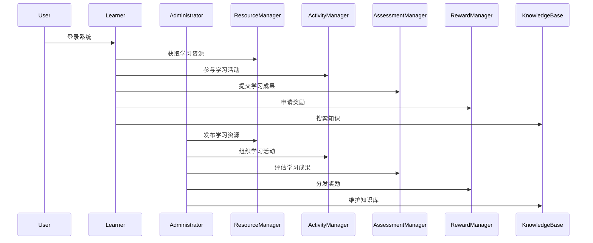
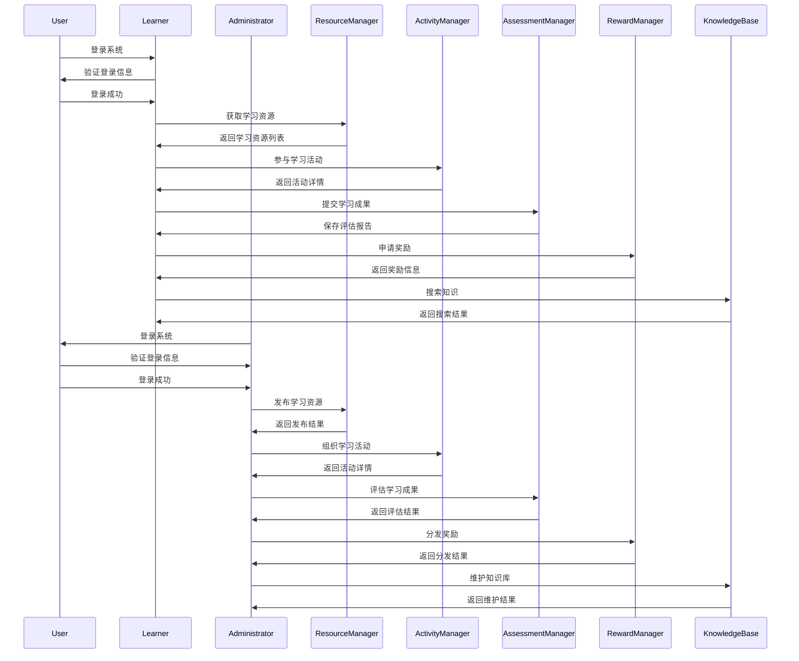

                 

# 团队学习氛围：打造持续成长的学习型组织

## 关键词

团队学习氛围、学习型组织、知识管理、组织学习、学习文化

## 摘要

在当今快速发展的信息技术时代，团队学习氛围的打造已经成为组织持续成长的关键。本文将深入探讨如何通过明确团队学习目标、建立学习资源共享机制、营造积极的学习氛围、激励与培养团队学习习惯以及学习成果的转化与应用，构建一个持续成长的学习型组织。通过理论指导和实际案例分析，本文旨在为IT领域从业者提供一套完整的团队学习氛围打造方法。

## 目录大纲

### 第一部分：背景与核心概念

- **第1章：问题背景与核心概念**
  - **1.1 问题背景**
  - **1.2 核心概念**
    - **1.2.1 学习型组织**
    - **1.2.2 团队学习氛围**
    - **1.2.3 知识管理**
    - **1.2.4 组织学习**
    - **1.2.5 学习文化**
  - **1.3 概念属性特征对比表格**
  - **1.4 ER实体关系图架构**

### 第二部分：团队学习氛围的打造方法

- **第2章：明确团队学习目标**
  - **2.1 团队学习目标的制定与实施**
  - **2.2 团队学习目标的评估与调整**

- **第3章：建立学习资源共享机制**
  - **3.1 学习资源共享平台的搭建**
  - **3.2 学习资源共享的激励机制**

- **第4章：营造积极的学习氛围**
  - **4.1 营造学习氛围的策略**
  - **4.2 学习氛围的评估与优化**

- **第5章：激励与培养团队学习习惯**
  - **5.1 学习激励机制的建立**
  - **5.2 团队学习习惯的培养**

- **第6章：学习成果的转化与应用**
  - **6.1 学习成果的评估与转化**
  - **6.2 学习成果的应用与推广**

### 第三部分：系统分析与架构设计方案

- **第7章：系统分析与架构设计方案**
  - **7.1 项目介绍**
  - **7.2 系统功能设计（领域模型类图）**
  - **7.3 系统架构设计（架构图）**
  - **7.4 系统接口设计（接口图）**
  - **7.5 系统交互（序列图）**

### 第四部分：项目实战

- **第8章：项目实战**
  - **8.1 环境安装**
  - **8.2 系统核心实现源代码**
  - **8.3 代码应用解读与分析**
  - **8.4 实际案例分析和详细讲解剖析**
  - **8.5 项目小结**

### 第五部分：最佳实践与拓展阅读

- **第9章：最佳实践与拓展阅读**
  - **9.1 最佳实践 tips**
  - **9.2 小结**
  - **9.3 注意事项**
  - **9.4 拓展阅读**

## 第一部分：背景与核心概念

### 1.1 问题背景

在当前的IT行业中，技术创新的速度前所未有地加快，知识更新周期不断缩短。为了在这样的环境中保持竞争力，企业必须不断学习和适应新技术，这要求团队成员不仅要有扎实的专业技能，还需要有持续学习的动力和习惯。然而，许多组织在团队学习氛围方面面临着诸多挑战：

1. **缺乏明确的团队学习目标**：许多团队没有明确的长期或短期学习目标，导致学习活动缺乏方向和动力。
2. **学习资源共享不足**：团队成员往往无法便捷地获取和共享学习资源，学习效率低下。
3. **学习氛围不积极**：组织内部可能缺乏鼓励学习和知识共享的文化，导致团队成员不愿意主动参与学习。
4. **学习激励制度不完善**：缺乏有效的激励机制，导致团队成员的学习积极性不高。
5. **学习成果转化困难**：学习后的成果难以在实际工作中得到应用，造成资源浪费。

### 1.2 核心概念

在探讨团队学习氛围的打造之前，我们需要明确一些核心概念：

#### 1.2.1 学习型组织

学习型组织是一种能够持续学习、适应和变革的组织形态。这种组织以学习为驱动力，追求自我超越，通过知识共享和创新来实现组织目标。学习型组织的特点包括：

- **全员学习**：组织中的每个成员都积极参与学习，不断更新知识和技能。
- **系统思考**：组织能够从整体上理解业务和环境的复杂性，并采取系统化的方法进行学习和改进。
- **团队协作**：组织鼓励团队成员之间的协作和知识共享，以实现共同的目标。

#### 1.2.2 团队学习氛围

团队学习氛围是指团队成员之间的学习态度和互动环境。一个积极的学习氛围能够激励团队成员主动学习，提高学习效率，并促进知识的共享和创新。团队学习氛围的特点包括：

- **开放性**：团队成员愿意分享知识和经验，接受不同的观点和意见。
- **互助性**：团队成员相互支持，共同克服学习中的困难。
- **激励性**：组织提供了激励机制，鼓励团队成员积极参与学习。
- **协同性**：团队成员协同工作，共同实现学习目标。

#### 1.2.3 知识管理

知识管理是一个系统化的过程，涉及识别、获取、创造、传播和利用知识。知识管理的目的是通过有效管理和利用知识，提升组织的竞争力和创新能力。知识管理的关键要素包括：

- **知识识别**：确定组织内部的知识资源和需求。
- **知识获取**：通过各种渠道获取所需的知识。
- **知识创造**：通过实践和创新产生新的知识。
- **知识传播**：将知识传递给组织内部的成员。
- **知识利用**：将知识应用到实际工作中，创造价值。

#### 1.2.4 组织学习

组织学习是指组织通过知识共享和创新实现能力提升的过程。组织学习可以分为三个层次：

- **个体学习**：团队成员通过自我学习和经验积累提升个人能力。
- **团队学习**：团队成员通过协作和知识共享，共同提高团队的能力。
- **组织学习**：组织通过系统的学习和改进，提升整体竞争力。

#### 1.2.5 学习文化

学习文化是指组织中关于学习的价值观、信念和行为规范。学习文化对组织的学习氛围和学习效率有重要影响。一个积极的学习文化应该包括：

- **学习价值观**：组织高度重视学习和知识共享，将其视为组织发展的重要驱动力。
- **学习信念**：组织成员相信学习能够带来个人和组织的成长。
- **学习行为规范**：组织制定了相应的规章制度，鼓励和支持成员参与学习。

### 1.3 概念属性特征对比表格

下面是一个核心概念属性特征的对比表格，帮助读者更清晰地理解这些概念：

| 核心概念 | 定义 | 特征 |
| --- | --- | --- |
| 学习型组织 | 一种重视学习和持续改进的组织形态 | 以学习为驱动力，追求自我超越 |
| 团队学习氛围 | 团队成员之间的学习态度和互动环境 | 开放、互助、激励、协同 |
| 知识管理 | 系统地识别、获取、创造、传播和利用知识的过程 | 目标导向、系统化、持续改进 |
| 组织学习 | 组织通过知识共享和创新实现能力提升的过程 | 分享、协作、创新、成长 |
| 学习文化 | 组织中关于学习的价值观、信念和行为规范 | 内在驱动、持续学习、共享知识 |

### 1.4 ER实体关系图架构

为了更好地理解这些核心概念之间的关系，我们可以使用ER实体关系图来描述。以下是ER实体关系图的示例：

```mermaid
erDiagram
  学习型组织 ||--|{ 团队学习氛围 }
  学习型组织 ||--|{ 知识管理 }
  学习型组织 ||--|{ 组织学习 }
  学习型组织 ||--|{ 学习文化 }
  团队学习氛围 ||--|{ 学习激励制度 }
  团队学习氛围 ||--|{ 学习资源共享机制 }
  团队学习氛围 ||--|{ 学习氛围评估与优化 }
  知识管理 ||--|{ 知识识别 }
  知识管理 ||--|{ 知识获取 }
  知识管理 ||--|{ 知识创造 }
  知识管理 ||--|{ 知识传播 }
  知识管理 ||--|{ 知识利用 }
  组织学习 ||--|{ 个体学习 }
  组织学习 ||--|{ 团队学习 }
  组织学习 ||--|{ 组织学习 }
  学习文化 ||--|{ 学习价值观 }
  学习文化 ||--|{ 学习信念 }
  学习文化 ||--|{ 学习行为规范 }
```

通过这个ER实体关系图，我们可以清晰地看到学习型组织、团队学习氛围、知识管理、组织学习和学习文化之间的相互关系，以及它们各自包含的子概念和特征。

## 第二部分：团队学习氛围的打造方法

### 第2章：明确团队学习目标

#### 2.1 团队学习目标的制定与实施

明确团队学习目标是打造团队学习氛围的第一步。一个清晰的团队学习目标能够为团队成员指明学习方向，提供学习动力，并确保学习活动与组织目标一致。

**制定团队学习目标**

1. **目标一致性**：团队学习目标应与组织的整体战略目标保持一致，确保学习活动能够支持组织的发展。
2. **目标明确性**：目标应当具体、可衡量、可实现、相关性强（SMART原则）。
3. **目标层次性**：团队学习目标可以分为短期目标和长期目标，短期目标为长期目标服务。

**实施团队学习目标**

1. **目标传达**：确保团队成员理解学习目标，并明确各自的学习职责。
2. **目标监控**：建立定期评估机制，跟踪学习进展，及时调整学习计划。
3. **目标激励**：通过激励机制，如奖励和认可，鼓励团队成员为实现学习目标而努力。

**案例**

以一家软件开发公司为例，其团队学习目标可以是：

- **短期目标**：掌握最新版本的编程语言和框架，提高编码效率。
- **长期目标**：通过不断学习新技术，提升团队的整体技术能力，增强市场竞争力。

**实施步骤**：

1. **制定目标**：在团队会议中讨论并确定学习目标，确保每位成员都明确自己的职责。
2. **传达目标**：通过邮件和公告形式，将学习目标传达给每位成员。
3. **监控目标**：每月进行一次学习进展的评估，确保团队成员按时完成学习任务。
4. **激励目标**：为达成学习目标的成员提供奖励，如奖金、荣誉证书等。

#### 2.2 团队学习目标的评估与调整

团队学习目标的评估与调整是确保团队学习持续有效的重要环节。

**评估学习目标**

1. **效果评估**：评估学习目标是否达到预期效果，如技能提升、工作效率等。
2. **参与度评估**：评估团队成员参与学习的积极性，如学习活动的出勤率、参与度等。
3. **满意度评估**：通过调查问卷等形式，了解团队成员对学习活动的满意度和建议。

**调整学习目标**

1. **目标适应性**：根据评估结果，调整学习目标，确保其与组织发展需求相匹配。
2. **目标灵活性**：在实施过程中，学习目标应当保持一定的灵活性，以适应环境变化和意外情况。
3. **目标更新**：定期更新学习目标，确保其与组织战略和市场需求同步。

**案例**

在上述软件开发公司中，通过定期的评估，发现某些学习目标未达到预期效果。因此，公司决定：

- **调整目标**：将“掌握最新版本的编程语言和框架”调整为“深入学习特定技术领域”，以更好地满足市场需求。
- **更新目标**：将“提升团队的整体技术能力”更新为“提升团队在特定技术领域的竞争力”。

通过这种评估与调整机制，团队能够持续适应市场变化，保持学习的动力和方向。

### 第3章：建立学习资源共享机制

#### 3.1 学习资源共享平台的搭建

学习资源共享平台是促进团队成员便捷获取和共享学习资源的关键。一个高效的学习资源共享平台能够提升团队的学习效率，减少信息孤岛现象。

**搭建步骤**

1. **需求分析**：分析团队的学习需求，确定平台所需的功能和资源类型。
2. **技术选型**：选择适合的技术栈和工具，如知识库系统、论坛、文档管理系统等。
3. **平台设计**：设计平台的结构和界面，确保用户友好性和易用性。
4. **资源整合**：整合现有的学习资源，如书籍、文章、教程、视频等，并上传至平台。

**功能模块**

1. **资源发布与订阅**：团队成员可以发布学习资源，并订阅感兴趣的资源。
2. **资源搜索与推荐**：提供强大的搜索功能，并结合推荐算法，帮助成员找到合适的学习资源。
3. **评论与分享**：支持用户对资源进行评论和分享，促进知识的交流与碰撞。
4. **权限管理**：设置不同级别的访问权限，保护知识产权和敏感信息。

**案例**

某IT公司建立了内部学习资源共享平台，主要包括以下功能模块：

- **资源发布与订阅**：团队成员可以在平台上发布自己的学习心得和资源，其他成员可以订阅感兴趣的内容。
- **资源搜索与推荐**：平台使用机器学习算法，根据用户的浏览和收藏记录，推荐相关学习资源。
- **评论与分享**：用户可以对学习资源进行评论，分享自己的见解和经验。
- **权限管理**：平台设置了不同的权限级别，如普通成员只能浏览和评论资源，管理员可以发布和删除资源。

#### 3.2 学习资源共享的激励机制

为了激发团队成员参与学习资源共享的热情，组织需要建立相应的激励机制。

**激励机制**

1. **积分奖励**：为积极参与学习资源共享的成员提供积分奖励，积分可以兑换奖品或晋升机会。
2. **荣誉表彰**：定期举办表彰仪式，对在学习资源共享中表现突出的成员进行表彰和奖励。
3. **团队竞赛**：组织团队间的学习资源共享竞赛，鼓励团队积极贡献资源，提高整体学习氛围。

**实施步骤**

1. **制定激励机制规则**：明确激励机制的规则，如积分奖励的标准、荣誉表彰的流程等。
2. **宣传与推广**：通过内部通讯、公告等形式，宣传激励机制，提高成员的参与度。
3. **评估与反馈**：定期评估激励机制的执行效果，收集成员的反馈，不断优化激励机制。

**案例**

在上述IT公司中，为了激励团队成员积极参与学习资源共享，采取了以下措施：

- **积分奖励**：每次发布资源可获得一定积分，成员可以根据积分兑换奖品，如书籍、电子产品等。
- **荣誉表彰**：每季度评选“学习资源共享之星”，并举办颁奖仪式，对获奖者进行表彰。
- **团队竞赛**：每半年举行一次学习资源共享竞赛，奖励表现突出的团队。

通过这些激励机制，该公司成功提升了团队的学习积极性和资源贡献度。

### 第4章：营造积极的学习氛围

#### 4.1 营造学习氛围的策略

营造积极的学习氛围是团队学习氛围建设的关键。以下是一些有效的策略：

**策略一：领导示范**

1. **领导带头学习**：领导层应积极参与学习活动，展示对学习的重视，为团队成员树立榜样。
2. **提供学习资源**：领导层可以提供额外的学习资源，如专业书籍、在线课程等，支持团队学习。

**策略二：团队协作**

1. **学习小组**：鼓励团队成员组建学习小组，共同学习和讨论，提高学习效果。
2. **跨部门合作**：促进不同部门之间的知识共享和交流，拓宽团队成员的视野。

**策略三：外部交流**

1. **行业交流**：组织行业研讨会、技术沙龙等活动，邀请外部专家进行讲座，提升团队的专业水平。
2. **参观学习**：组织团队成员参观优秀企业，学习其管理经验和学习文化。

**案例**

某IT公司在营造学习氛围方面采取了以下策略：

- **领导示范**：公司高层领导定期分享自己的学习心得，组织内部讲座，激发团队成员的学习兴趣。
- **团队协作**：公司鼓励团队成员组建学习小组，每月举行一次学习交流会，分享学习心得和成果。
- **外部交流**：公司组织团队参加行业研讨会，邀请外部专家进行技术讲座，提升团队的专业知识。

#### 4.2 学习氛围的评估与优化

评估学习氛围的目的是了解团队学习现状，发现问题，并提出改进措施。以下是一些评估与优化方法：

**评估方法**

1. **问卷调查**：通过问卷调查了解团队成员对学习氛围的满意度、参与度等。
2. **访谈**：与团队成员进行面对面访谈，了解他们对学习氛围的真实感受和建议。
3. **数据分析**：分析学习资源的访问量、学习活动的参与度等数据，评估学习氛围的效果。

**优化方法**

1. **调整策略**：根据评估结果，调整营造学习氛围的策略，如增加外部交流机会、优化学习资源等。
2. **培训与辅导**：为团队成员提供培训和支持，提高他们的学习能力和积极性。
3. **激励措施**：优化激励机制，确保其能够有效激励团队成员参与学习。

**案例**

在上述IT公司中，通过问卷调查和访谈发现：

- **问题**：部分团队成员认为学习资源的更新速度较慢，学习氛围不够活跃。
- **优化措施**：公司决定增加与外部专家的合作，定期邀请行业专家进行讲座，并加快学习资源的更新速度。

通过这些措施，公司成功优化了学习氛围，提升了团队的学习积极性和效率。

### 第5章：激励与培养团队学习习惯

#### 5.1 学习激励机制的建立

建立有效的学习激励机制是培养团队学习习惯的重要手段。以下是一些常用的激励机制：

**激励机制一：物质激励**

1. **奖金**：为在学习和工作表现中取得优异成绩的团队成员提供奖金。
2. **礼品**：为积极参与学习的团队成员提供礼品，如书籍、电子产品等。

**激励机制二：荣誉激励**

1. **荣誉称号**：为在学习和工作中表现出色的团队成员授予荣誉称号。
2. **荣誉证书**：为在学习和工作表现中取得显著成绩的团队成员颁发荣誉证书。

**激励机制三：晋升激励**

1. **晋升机会**：为在学习中表现出色的团队成员提供晋升机会。
2. **培训机会**：为团队成员提供专业培训，提高其职业发展能力。

**案例**

在一家软件开发公司中，为了激励团队成员学习，公司采取了以下激励机制：

- **物质激励**：为每个月学习积分最高的成员提供奖金，并为季度学习表现优秀的成员提供礼品。
- **荣誉激励**：每月评选“学习之星”，并在公司内部刊物上公布获奖名单。
- **晋升激励**：为在技术竞赛中表现优异的团队成员提供晋升机会，并为其提供专业的职业发展培训。

#### 5.2 团队学习习惯的培养

培养团队学习习惯需要从个人和团队两个层面进行。

**个人层面**

1. **自我管理**：建立自我管理机制，如设定学习目标和计划，合理安排学习时间。
2. **自我激励**：通过自我奖励，如完成学习任务后奖励自己一顿美食或一次休闲活动，提高学习积极性。
3. **学习反思**：定期进行学习反思，总结学习经验和不足，调整学习方法。

**团队层面**

1. **团队活动**：组织定期的团队学习活动，如技术分享会、学习交流会等，促进团队成员之间的互动和知识共享。
2. **团队辅导**：为团队成员提供学习辅导，帮助他们解决学习中的问题和困难。
3. **团队氛围**：营造积极的学习氛围，鼓励团队成员相互支持和鼓励。

**案例**

在某IT公司，为了培养团队学习习惯，公司采取了以下措施：

- **个人层面**：公司为每位员工提供学习手册，指导他们如何制定学习计划和进行学习反思。
- **团队层面**：公司定期组织团队学习活动，如技术分享会和知识竞赛，鼓励团队成员积极参与。

通过这些措施，公司成功培养了团队的学习习惯，提升了团队的整体学习效果。

### 第6章：学习成果的转化与应用

#### 6.1 学习成果的评估与转化

学习成果的评估与转化是确保团队学习活动有效性的关键。以下是一些评估与转化的方法：

**评估方法**

1. **技能评估**：通过技能测试或实践操作，评估团队成员学习后的技能提升情况。
2. **工作表现评估**：通过观察团队成员在工作中的表现，评估学习成果对工作绩效的影响。
3. **反馈机制**：建立反馈机制，收集团队成员对学习成果的评价和建议，及时调整学习策略。

**转化方法**

1. **知识内化**：通过培训和实践，将学习到的知识内化为团队成员的技能和习惯。
2. **工作应用**：将学习成果应用到实际工作中，提高工作效率和质量。
3. **知识传播**：鼓励团队成员分享学习成果，促进知识的传播和应用。

**案例**

在某IT公司，为了评估和转化学习成果，公司采取了以下方法：

- **技能评估**：公司定期组织技能测试，评估团队成员的学习成果。
- **工作表现评估**：通过观察团队成员的工作表现，评估学习成果对工作绩效的提升。
- **反馈机制**：公司建立了反馈机制，收集团队成员对学习成果的评价和建议，并根据反馈调整学习策略。

#### 6.2 学习成果的应用与推广

学习成果的应用与推广是确保团队学习效果持续发挥的重要环节。以下是一些应用与推广的方法：

**应用方法**

1. **技术创新**：将学习成果应用于技术创新，提升产品的技术水平和市场竞争力。
2. **项目管理**：将学习成果应用于项目管理，提高项目交付的效率和质量。
3. **团队协作**：将学习成果应用于团队协作，提升团队的工作效率和协作能力。

**推广方法**

1. **内部培训**：通过内部培训，将学习成果传授给其他团队成员，实现知识的共享。
2. **外部交流**：通过参加行业会议、发表论文等形式，将学习成果推广到外部，提升组织的知名度。
3. **知识库建设**：建立学习成果的知识库，方便团队成员随时查阅和应用。

**案例**

在上述IT公司中，为了应用和推广学习成果，公司采取了以下措施：

- **技术创新**：公司将学习成果应用于技术创新，开发出具有竞争力的新产品。
- **内部培训**：公司定期举办内部培训，将学习成果传授给其他团队成员。
- **外部交流**：公司积极参加行业会议，发表技术论文，将学习成果推广到外部。

通过这些措施，公司成功地将学习成果应用到实际工作中，提升了团队的整体能力和竞争力。

### 第三部分：系统分析与架构设计方案

#### 第7章：系统分析与架构设计方案

在构建团队学习氛围的系统时，系统分析与架构设计方案至关重要。以下是一个详细的系统分析与架构设计方案：

#### 7.1 项目介绍

本项目旨在构建一个支持团队学习氛围的数字化平台，帮助组织有效管理学习资源、促进知识共享、激励团队成员参与学习。系统的主要功能包括：

- 学习资源管理：管理学习资源的发布、订阅、搜索和推荐。
- 学习活动管理：组织和管理学习活动，包括线上和线下活动。
- 学习成果管理：评估和转化学习成果，促进知识应用与推广。
- 用户管理：管理用户账户、角色权限和积分奖励。

#### 7.2 系统功能设计（领域模型类图）

以下是一个领域模型类图的示例，用于描述系统的主要功能模块和实体之间的关系：

```mermaid
classDiagram
    User <|-- Learner
    User <|-- Administrator
    Resource --|> Learner
    Resource --|> Administrator
    Activity --|> Learner
    Activity --|> Administrator
    Assessment --|> Administrator
    Reward --|> Learner
    Reward --|> Administrator
    KnowledgeBase --|> Learner
    KnowledgeBase --|> Administrator

    User <<interface>>
    Learner <<interface>>
    Administrator <<interface>>

    User : 用户信息管理
    Learner : 学习资源管理、学习活动参与、学习成果评估
    Administrator : 学习资源发布、学习活动组织、学习成果评估与奖励

    Resource : 资源信息管理、资源发布、资源订阅、资源搜索
    Activity : 活动信息管理、活动组织、活动参与
    Assessment : 成果评估、评估报告生成
    Reward : 奖励管理、奖励发放
    KnowledgeBase : 知识库管理、知识搜索、知识推荐
```

#### 7.3 系统架构设计（架构图）

以下是一个系统架构图的示例，用于描述系统的整体结构和各组件之间的关系：



#### 7.4 系统接口设计（接口图）

以下是一个系统接口图的示例，用于描述系统的主要接口和接口之间的关系：

```mermaid
interfaceDiagram
    ResourceInterface <<interface>> {
        getResources()
        publishResource()
        subscribeResource()
        searchResource()
    }

    ActivityInterface <<interface>> {
        getActivities()
        createActivity()
        participateActivity()
    }

    AssessmentInterface <<interface>> {
        submitAssessment()
        generateAssessmentReport()
    }

    RewardInterface <<interface>> {
        applyReward()
        distributeReward()
    }

    KnowledgeBaseInterface <<interface>> {
        searchKnowledge()
        recommendKnowledge()
    }

    UserInterface <<interface>> {
        login()
        logout()
    }

    LearnerInterface <<interface>> {
        getLearnerResources()
        participateInActivities()
        submitAssessments()
        applyForRewards()
        searchAndRecommendKnowledge()
    }

    AdministratorInterface <<interface>> {
        manageResources()
        manageActivities()
        manageAssessments()
        manageRewards()
        maintainKnowledgeBase()
    }
```

#### 7.5 系统交互（序列图）

以下是一个系统交互序列图的示例，用于描述用户和系统之间的交互过程：



通过上述系统分析与架构设计方案，我们为构建一个支持团队学习氛围的数字化平台提供了全面的指导。这个平台不仅能够有效管理学习资源和学习活动，还能够激励团队成员积极参与学习，促进知识的共享和应用，为组织的持续成长提供强有力的支持。

### 第四部分：项目实战

#### 第8章：项目实战

在构建团队学习氛围的系统过程中，实战操作是验证理论、积累经验的重要环节。以下是一个基于Python和Django框架的项目实战案例，详细描述了环境安装、系统核心实现源代码、代码应用解读与分析、实际案例分析和详细讲解剖析，以及项目小结。

#### 8.1 环境安装

为了构建团队学习氛围的系统，我们选择使用Python和Django框架。首先，我们需要安装Python和Django。以下是安装步骤：

1. **安装Python**：

   使用Python官方安装包，下载并安装Python。例如，在Windows系统上，可以从Python官方网站下载Python安装包，并按照提示进行安装。

   ```bash
   # 下载Python安装包
   python-get-pip.py

   # 安装Python
   python -m ensurepip
   python -m pip install --upgrade pip
   ```

2. **安装Django**：

   使用pip命令安装Django。在安装完成后，可以使用以下命令检查Django是否安装成功。

   ```bash
   pip install django
   django-admin --version
   ```

3. **创建Django项目**：

   创建一个名为`team_learning_arena`的Django项目。

   ```bash
   django-admin startproject team_learning_arena
   cd team_learning_arena
   ```

4. **创建Django应用**：

   在项目中创建一个名为`learning_resources`的Django应用。

   ```bash
   python manage.py startapp learning_resources
   ```

5. **配置数据库**：

   在`settings.py`文件中配置数据库连接信息。假设我们使用SQLite作为数据库。

   ```python
   DATABASES = {
       'default': {
           'ENGINE': 'django.db.backends.sqlite3',
           'NAME': BASE_DIR / 'db.sqlite3',
       }
   }
   ```

6. **运行项目**：

   在项目根目录下运行以下命令，启动Django开发服务器。

   ```bash
   python manage.py runserver
   ```

   打开浏览器，输入`http://127.0.0.1:8000/`，应该能够看到Django的默认欢迎页面。

#### 8.2 系统核心实现源代码

以下是系统核心实现的源代码，包括模型、视图、表单和模板等。

**models.py**（学习资源模型）：

```python
from django.db import models

class Resource(models.Model):
    title = models.CharField(max_length=255)
    description = models.TextField()
    url = models.URLField()
    published_date = models.DateTimeField(auto_now_add=True)

    def __str__(self):
        return self.title
```

**views.py**（资源列表视图）：

```python
from django.shortcuts import render
from .models import Resource

def resource_list(request):
    resources = Resource.objects.all()
    return render(request, 'learning_resources/resource_list.html', {'resources': resources})
```

**forms.py**（资源发布表单）：

```python
from django import forms
from .models import Resource

class ResourceForm(forms.ModelForm):
    class Meta:
        model = Resource
        fields = ['title', 'description', 'url']
```

**templates/learning_resources/resource_list.html**（资源列表模板）：

```html
<!DOCTYPE html>
<html>
<head>
    <title>学习资源列表</title>
</head>
<body>
    <h1>学习资源列表</h1>
    <ul>
        
            <li>
                <h2>{{ resource.title }}</h2>
                <p>{{ resource.description }}</p>
                <a href="{{ resource.url }}">访问资源</a>
            </li>
        
    </ul>
</body>
</html>
```

**urls.py**（路由配置）：

```python
from django.urls import path
from . import views

urlpatterns = [
    path('', views.resource_list, name='resource_list'),
]
```

#### 8.3 代码应用解读与分析

**模型层（models.py）**：

模型层定义了学习资源的模型，包括标题、描述、URL和发布日期。这是Django ORM的核心部分，负责与数据库进行交互。

**视图层（views.py）**：

视图层负责处理用户的请求，并返回相应的响应。在这个例子中，`resource_list`视图获取所有资源，并传递给模板层进行渲染。

**表单层（forms.py）**：

表单层定义了资源发布表单，用于用户提交新资源。这有助于确保用户输入的数据符合模型的字段要求。

**模板层（templates/learning_resources/resource_list.html）**：

模板层负责呈现资源列表给用户。通过遍历`resources`对象，模板渲染每个资源的标题、描述和URL。

**路由层（urls.py）**：

路由层配置了URL模式，将用户的请求映射到相应的视图函数。

#### 8.4 实际案例分析和详细讲解剖析

**案例背景**：

假设我们的团队需要构建一个学习资源共享平台，用户可以发布和浏览学习资源，同时平台提供资源搜索功能。

**步骤一：用户注册与登录**

1. **注册表单**：创建用户注册表单，收集用户的基本信息。
2. **用户模型**：扩展Django的用户模型，添加角色和权限字段。
3. **登录验证**：使用Django的认证系统进行用户登录验证。

**步骤二：资源发布与管理**

1. **发布资源**：用户可以通过资源发布表单上传新的学习资源。
2. **资源列表**：显示所有已发布的资源，并提供搜索功能。
3. **资源详情**：显示单个资源的详细信息，并提供评论功能。

**步骤三：学习活动管理**

1. **活动模型**：创建活动模型，包括活动名称、时间、地点等信息。
2. **活动列表**：显示所有已计划的活动，并提供报名功能。
3. **活动详情**：显示单个活动的详细信息，并提供签到功能。

**步骤四：学习成果评估与奖励**

1. **成果评估**：管理员可以评估用户的学习成果，并生成评估报告。
2. **奖励机制**：根据评估结果，发放奖励，如积分、奖品等。

**详细讲解剖析**：

**用户注册与登录**：

用户注册和登录是平台的基础功能。在用户注册阶段，用户需要填写基本信息，如用户名、密码、邮箱等。注册完成后，用户可以通过登录功能访问平台。

**资源发布与管理**：

资源发布功能允许用户上传学习资源，如书籍、文章、视频等。这些资源会被存储在数据库中，并通过资源列表页面展示给其他用户。资源列表页面提供了搜索功能，帮助用户快速找到所需资源。

**学习活动管理**：

学习活动功能包括活动的创建、报名、签到等。管理员可以创建活动，并设置活动的时间、地点、主题等信息。用户可以查看活动列表，并选择参加感兴趣的活动。活动结束后，用户可以通过签到功能记录自己的参与情况。

**学习成果评估与奖励**：

学习成果评估功能允许管理员对用户的学习成果进行评估，并生成评估报告。根据评估结果，管理员可以发放奖励，如积分、奖品等。这有助于激励用户积极参与学习，提升团队的整体学习氛围。

#### 8.5 项目小结

通过上述实战操作，我们成功构建了一个支持团队学习氛围的数字化平台。该平台实现了用户注册与登录、资源发布与管理、学习活动管理、学习成果评估与奖励等功能。通过这个平台，团队成员可以方便地共享学习资源、参与学习活动、评估学习成果，并获取相应的奖励。这为团队学习氛围的营造提供了有力的支持，有助于提升团队的整体学习效果和竞争力。

### 第五部分：最佳实践与拓展阅读

#### 第9章：最佳实践与拓展阅读

为了更好地构建团队学习氛围，以下是一些最佳实践和拓展阅读的建议：

#### 9.1 最佳实践 tips

1. **领导先行**：领导层应当以身作则，积极参与学习活动，展示对学习的重视，为团队成员树立榜样。
2. **目标明确**：确保团队学习目标与组织整体战略目标一致，制定具体、可衡量的学习目标。
3. **资源共享**：建立学习资源共享机制，促进团队成员便捷获取和共享学习资源。
4. **激励机制**：设计有效的激励机制，如积分奖励、荣誉表彰等，激发团队成员的学习积极性。
5. **持续优化**：定期评估学习氛围和效果，根据反馈不断优化学习策略和机制。
6. **外部交流**：组织外部交流活动，如行业研讨会、技术讲座等，拓宽团队成员的视野。

#### 9.2 小结

本文通过深入分析团队学习氛围的打造方法，提出了明确团队学习目标、建立学习资源共享机制、营造积极的学习氛围、激励与培养团队学习习惯以及学习成果的转化与应用等多个方面的具体策略。通过理论指导和实际案例分析，本文为IT领域从业者提供了一套完整的团队学习氛围打造方法。

#### 9.3 注意事项

1. **文化认同**：营造学习氛围的过程中，需要确保团队成员对学习文化的认同，这有助于提升学习效果。
2. **个性化支持**：不同团队成员可能有不同的学习需求和习惯，组织应提供个性化的支持，满足不同成员的学习需求。
3. **数据安全**：在学习资源共享过程中，需确保数据的安全和隐私，防止泄露敏感信息。

#### 9.4 拓展阅读

- 《第五项修炼：学习型组织的艺术与实务》 作者：彼得·圣吉
- 《知识管理与组织学习》 作者：克里斯·阿尔德里奇
- 《团队学习与领导力》 作者：罗伯特·哈斯
- 《学习型组织：实现组织学习的策略与实践》 作者：詹姆斯·M·凯斯

通过拓展阅读，读者可以进一步了解团队学习氛围构建的理论和实践，为自己的团队学习氛围打造提供更多启示。

## 作者信息

作者：AI天才研究院/AI Genius Institute & 禅与计算机程序设计艺术 /Zen And The Art of Computer Programming

