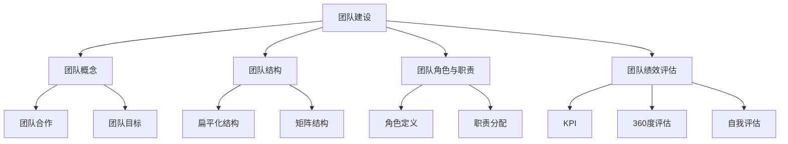

                 

# 团队建设新理念：从工作团队到事业共同体

> 关键词：团队建设、事业共同体、组织发展、领导力、数字化变革

> 摘要：本文将深入探讨团队建设的新理念，从工作团队到事业共同体的转变。通过分析现代企业中团队合作的需求与挑战，阐述团队建设的定义、核心要素和理论框架。本文还将探讨团队建设的方法与实践，特别是如何从工作团队转变为具有共同愿景和价值观的事业共同体。同时，本文还将提供团队角色与绩效评估、团队沟通与协作、领导力与团队发展的策略与技巧，并通过成功案例分析，为团队建设提供实践指南。最后，本文将探讨团队建设的未来趋势与挑战，为企业在数字化时代下的团队建设提供指导。

### 目录大纲

----------------------------------------------------------------

## 第一部分：团队建设的基础理论与概念

### 第1章：团队建设的背景与重要性

- **1.1 问题背景**：现代企业中团队合作的现状与挑战
  - 描述现代企业中团队合作的需求与存在的困难
  - 研究团队合作在组织中的重要性

- **1.2 团队建设的定义**：团队概念的理解
  - 团队的定义
  - 团队建设的重要性
  - 团队建设的边界与外延

- **1.3 团队建设的核心要素**：团队结构、角色与职责
  - 团队成员的角色和职责
  - 团队结构的设计
  - 团队绩效评估方法

- **1.4 团队建设的理论框架**：团队发展模型与理论
  - Tuckman团队发展模型
  - Belbin团队角色理论
  - Vroom-Yetton决策模型

- **1.5 核心概念联系**：团队建设概念关系图
  - 使用Mermaid绘制团队建设核心概念的关系图

### 第2章：团队建设的方法与实践

- **2.1 团队建设的方法**：团队诊断与干预策略
  - 团队诊断工具
  - 团队干预策略

- **2.2 团队建设的实践**：团队领导力与沟通技巧
  - 团队领导力的关键要素
  - 团队沟通技巧的提升

- **2.3 团队建设的挑战**：跨文化团队的管理与协作
  - 跨文化团队的挑战
  - 跨文化团队的管理策略

### 第3章：工作团队向事业共同体的转变

- **3.1 工作团队的特点**：目标导向与绩效评估
  - 工作团队的工作方式
  - 工作团队的绩效评估方法

- **3.2 事业共同体的理念**：共同愿景与价值观
  - 事业共同体的定义
  - 事业共同体的价值观

- **3.3 转变的策略**：团队文化重塑与激励机制
  - 团队文化的重塑方法
  - 激励机制的设计与实践

----------------------------------------------------------------

## 第二部分：团队建设的策略与技巧

### 第4章：团队角色与绩效评估

- **4.1 团队角色的划分**：基于Belbin理论的角色分析
  - Belbin理论的基本概念
  - 团队成员的角色识别

- **4.2 绩效评估的方法**：基于目标管理的绩效评估
  - 目标管理的概念
  - 绩效评估的实施步骤

### 第5章：团队沟通与协作

- **5.1 沟通的重要性**：高效沟通在团队建设中的作用
  - 沟通的目标与障碍
  - 高效沟通的策略

- **5.2 协作的技巧**：团队协作工具与方法
  - 团队协作工具的选择
  - 团队协作方法的实践

### 第6章：领导力与团队发展

- **6.1 领导力的要素**：基于Tuckman模型的领导力发展
  - Tuckman模型的概述
  - 领导力的关键要素

- **6.2 团队发展**：从工作团队到事业共同体的转型
  - 团队发展的过程
  - 团队转型的策略

----------------------------------------------------------------

## 第三部分：团队建设的案例与应用

### 第7章：团队建设成功案例分析

- **7.1 案例背景**：某跨国公司的团队建设实践
  - 案例公司的背景
  - 团队建设的目标

- **7.2 案例分析**：团队建设的具体策略与效果
  - 团队诊断与干预
  - 团队绩效的提升

- **7.3 案例总结**：团队建设的关键成功因素

### 第8章：团队建设实践指南

- **8.1 实践指南**：团队建设的关键步骤与方法
  - 团队建设的流程
  - 团队建设的具体方法

- **8.2 拓展阅读**：团队建设的最新研究与实践
  - 团队建设的趋势分析
  - 团队建设的拓展实践

----------------------------------------------------------------

### 第9章：团队建设的未来趋势与挑战

- **9.1 未来趋势**：数字化时代团队建设的变革
  - 数字化对团队建设的影响
  - 未来团队建设的方向

- **9.2 挑战**：面对全球化与多样化的团队建设
  - 全球化带来的挑战
  - 多样性对团队建设的影响

--------------------------------------------------------------

----------------------------------------------------------------

* 作者：AI天才研究院/AI Genius Institute & 禅与计算机程序设计艺术 /Zen And The Art of Computer Programming*

## 第1章：团队建设的背景与重要性

### 1.1 问题背景

在现代企业中，团队合作已成为企业成功的关键因素。随着商业环境的快速变化和全球化趋势的加强，企业需要更高效、更有创造力的团队来应对各种挑战。然而，团队合作并不总是一帆风顺的。许多企业在实际操作中面临一系列团队合作的问题，如沟通障碍、角色冲突、目标不一致等。这些问题不仅影响了团队的整体绩效，也影响了员工的满意度和忠诚度。

首先，现代企业中团队合作的需求主要体现在以下几个方面：

1. **知识整合**：团队协作有助于整合不同成员的专业知识和经验，从而提高整体解决问题的能力。
2. **创新与创意**：通过团队成员之间的互动和碰撞，可以激发出更多的创新和创意，推动企业的发展。
3. **灵活应变**：团队协作能够使企业更快速地适应市场变化，提高企业的应变能力。

然而，团队合作在组织中也面临着一些挑战：

1. **沟通障碍**：团队成员之间的沟通不畅，可能导致信息传递不准确，影响团队决策和执行。
2. **角色冲突**：团队中不同角色之间的职责和目标可能存在冲突，导致团队成员之间的矛盾和不和谐。
3. **目标不一致**：团队整体目标与成员个人目标的不一致，可能导致团队成员的积极性下降，影响团队绩效。

因此，研究团队合作在组织中的重要性，以及如何有效解决团队合作中的问题，已成为企业管理者关注的焦点。团队建设作为解决这些问题的关键手段，其重要性不容忽视。

### 1.2 团队建设的定义

团队，是指一群人为了共同的目标而组成的协作组织。在团队中，每个成员都扮演着特定的角色，承担相应的职责，共同努力实现团队的目标。团队建设，则是指通过一系列有组织的活动和策略，提高团队成员的协作能力，增强团队的整体绩效。

团队建设的重要性主要体现在以下几个方面：

1. **提高团队绩效**：有效的团队建设能够提高团队成员的协作效率，从而提高团队的整体绩效。
2. **增强员工满意度**：团队建设能够增强员工之间的信任和沟通，提高员工的满意度和忠诚度。
3. **促进创新与创意**：团队建设能够激发团队成员的创造力和创新精神，推动企业的持续发展。

同时，团队建设也有其边界与外延：

1. **边界**：团队建设主要关注团队成员之间的协作关系，以及如何通过有效的团队活动提升团队绩效。
2. **外延**：团队建设不仅限于企业内部，也可以应用于其他组织形式，如学校、社区等。此外，团队建设的方法和理论也不断拓展，涵盖了多种领域的实践。

### 1.3 团队建设的核心要素

团队建设是一个复杂的过程，涉及多个核心要素。以下将详细探讨团队建设的核心要素，包括团队成员的角色和职责、团队结构的设计以及团队绩效评估方法。

#### 1.3.1 团队成员的角色和职责

团队成员的角色和职责是团队建设的基础。明确每个成员的角色和职责，有助于提高团队的协作效率，避免角色冲突和职责重叠。

1. **角色定义**：角色是指团队成员在团队中扮演的特定角色，如领导者、执行者、协调者、创新者等。
2. **职责分配**：职责是指团队成员在团队中承担的具体任务和责任，如项目策划、执行、质量控制、团队沟通等。

为了确保团队成员的角色和职责得到明确和有效分配，团队领导者需要：

1. **明确角色和职责**：在团队组建之初，明确每个成员的角色和职责，并进行公示。
2. **培训与指导**：对团队成员进行角色和职责的培训，确保他们了解自己的职责，并能够胜任。
3. **定期评估**：定期评估团队成员的角色和职责履行情况，根据评估结果进行必要的调整。

#### 1.3.2 团队结构的设计

团队结构是团队建设的重要组成部分。合理的团队结构有助于提高团队的协作效率，降低沟通成本，增强团队凝聚力。

1. **扁平化结构**：扁平化结构能够减少管理层级，提高团队响应速度和灵活性。但在扁平化结构中，团队成员需要承担更多的职责，需要具备较强的自我管理能力和协作能力。
2. **矩阵结构**：矩阵结构是将不同职能部门和项目团队相结合，形成一种交叉管理的结构。这种结构能够充分利用各职能部门的专业知识，提高项目执行力，但同时也增加了沟通协调的复杂性。

在设计团队结构时，团队领导者需要考虑以下因素：

1. **团队目标**：根据团队目标选择合适的团队结构，确保团队结构能够支持团队目标的实现。
2. **团队成员**：考虑团队成员的技能、经验和个性，选择适合团队成员的团队结构。
3. **组织环境**：考虑组织环境的特点，如企业文化、资源分配等，选择适合组织环境的团队结构。

#### 1.3.3 团队绩效评估方法

团队绩效评估是团队建设的重要环节。通过科学的团队绩效评估方法，可以客观评价团队的工作表现，发现团队存在的问题，为团队改进提供依据。

1. **KPI（关键绩效指标）**：KPI是指与团队目标紧密相关的关键指标，如项目完成率、客户满意度、团队创新能力等。通过KPI评估团队的工作绩效。
2. **360度评估**：360度评估是指从多个角度对团队成员进行评估，包括团队成员、上级领导、同事等。这种评估方法能够全面反映团队成员的工作表现，但需要确保评估的公正性和客观性。
3. **自我评估**：自我评估是指团队成员对自己在工作中的表现进行自我评价。这种评估方法能够增强团队成员的参与感和责任感。

在团队绩效评估中，团队领导者需要：

1. **设定评估目标**：根据团队目标设定具体的评估目标，确保评估与团队目标的一致性。
2. **制定评估标准**：制定明确的评估标准，确保评估的客观性和公正性。
3. **定期评估**：定期进行团队绩效评估，及时发现团队存在的问题，为团队改进提供依据。

### 1.4 团队建设的理论框架

团队建设是一个复杂的过程，需要借鉴各种理论和模型来指导实践。以下将介绍几种常用的团队建设理论框架，包括Tuckman团队发展模型、Belbin团队角色理论和Vroom-Yetton决策模型。

#### 1.4.1 Tuckman团队发展模型

Tuckman团队发展模型是最具影响力的团队建设理论之一。Tuckman认为，团队发展需要经历五个阶段：

1. **形成阶段**：团队组建初期，成员之间互相认识，了解团队目标。
2. **冲突阶段**：成员开始竞争资源，产生分歧，团队内部矛盾加剧。
3. **规范阶段**：团队成员开始协调合作，形成共同的规范和价值观。
4. **执行阶段**：团队进入高效执行阶段，团队成员紧密协作，共同完成任务。
5. **变革阶段**：团队面对新的挑战，需要调整和变革，以适应新的环境。

Tuckman团队发展模型为团队建设提供了有力的指导，帮助团队领导者了解团队发展过程，及时应对团队发展中的问题。

#### 1.4.2 Belbin团队角色理论

Belbin团队角色理论是一种基于团队成员角色分配的团队建设理论。Belbin将团队成员划分为九个角色：

1. **协调者**：负责协调团队内部的工作，确保团队成员之间的沟通畅通。
2. **实施者**：负责团队的具体实施工作，确保任务的按时完成。
3. **监控评估者**：负责评估团队成员的工作，提供反馈和建议。
4. **资源调查者**：负责寻找和利用外部资源，为团队提供支持。
5. **团队工人**：负责团队中具体的分工任务，确保任务的完成。

通过明确团队成员的角色，Belbin团队角色理论有助于提高团队的协作效率和绩效。

#### 1.4.3 Vroom-Yetton决策模型

Vroom-Yetton决策模型是一种基于决策风格的团队建设理论。Vroom-Yetton认为，团队决策风格可以分为五种类型：

1. **独裁型**：决策由团队领导者单独做出。
2. **咨询型**：决策由团队领导者与部分成员讨论后做出。
3. **协商型**：决策由团队领导者与全体成员讨论后做出。
4. **共识型**：决策由全体成员共同讨论并达成共识。
5. **参与型**：决策由全体成员共同参与并做出。

Vroom-Yetton决策模型帮助团队领导者根据不同情境选择合适的决策风格，提高团队决策的效率和效果。

### 1.5 核心概念联系

为了更好地理解团队建设，我们将使用Mermaid绘制团队建设核心概念的关系图，展示各个概念之间的联系。

通过以上关系图，我们可以看到，团队建设是一个多维度的概念，涉及团队概念、团队结构、团队角色与职责、团队绩效评估等多个方面。这些方面相互关联，共同构成了团队建设的整体框架。

## 第2章：团队建设的方法与实践

### 2.1 团队建设的方法

团队建设是一个系统化的过程，涉及多个方法和策略。以下将介绍几种常用的团队建设方法，包括团队诊断与干预策略。

#### 2.1.1 团队诊断

团队诊断是团队建设的第一步，旨在了解团队的现状，发现团队存在的问题。以下是一些常用的团队诊断工具：

1. **360度反馈**：360度反馈是一种从多个角度对团队成员进行评估的方法，包括团队成员、上级领导、同事、下属等。这种评估方法能够全面反映团队成员的工作表现，发现团队存在的问题。
2. **团队访谈**：团队访谈是一种与团队成员面对面交流的方法，旨在了解团队成员的想法和意见。通过访谈，团队领导者可以深入了解团队现状，发现团队存在的问题。
3. **团队调查问卷**：团队调查问卷是一种通过问卷调查了解团队成员意见和态度的方法。这种方法能够量化团队现状，为团队诊断提供数据支持。

通过以上团队诊断工具，团队领导者可以全面了解团队的现状，发现团队存在的问题，为后续的团队建设提供依据。

#### 2.1.2 干预策略

在团队诊断完成后，团队领导者需要制定相应的干预策略，以解决团队存在的问题。以下是一些常用的干预策略：

1. **培训与指导**：针对团队成员的技能短板，进行有针对性的培训与指导，提高团队成员的专业能力。
2. **沟通与协调**：加强团队内部的沟通与协调，消除沟通障碍，提高团队协作效率。
3. **激励机制**：制定有效的激励机制，激发团队成员的积极性和创造力，提高团队绩效。
4. **团队建设活动**：组织团队建设活动，增强团队成员之间的信任和合作，提高团队凝聚力。

通过以上干预策略，团队领导者可以针对性地解决团队存在的问题，提高团队的协作效率和绩效。

### 2.2 团队建设的实践

团队建设不仅需要理论指导，更需要具体的实践。以下将介绍团队建设的实践，包括团队领导力与沟通技巧。

#### 2.2.1 团队领导力

团队领导力是团队建设的关键要素。一个优秀的团队领导者需要具备以下关键要素：

1. **愿景与目标**：团队领导者需要明确团队的愿景和目标，为团队成员提供清晰的方向。
2. **激励与支持**：团队领导者需要激励团队成员，提供必要的支持，帮助团队成员实现个人和团队目标。
3. **沟通与协调**：团队领导者需要具备良好的沟通能力，能够与团队成员建立有效的沟通渠道，协调团队内部关系。
4. **决策与执行**：团队领导者需要具备良好的决策能力和执行力，能够在团队中快速做出决策并推动执行。

通过以上关键要素，团队领导者可以有效地引导团队，提高团队的协作效率和绩效。

#### 2.2.2 沟通技巧

沟通是团队建设的核心要素。一个高效的团队需要良好的沟通。以下是一些常用的沟通技巧：

1. **明确沟通目标**：在沟通前，明确沟通的目标和期望结果，确保沟通的有效性。
2. **积极倾听**：在沟通过程中，积极倾听对方的意见和观点，避免中断和打断。
3. **表达清晰**：在表达自己的意见时，尽量简洁明了，避免使用复杂的术语和语言。
4. **反馈与确认**：在沟通结束后，对沟通的结果进行反馈和确认，确保双方对沟通内容的理解一致。

通过以上沟通技巧，团队成员可以有效地进行沟通，消除误解和冲突，提高团队的协作效率。

### 2.3 团队建设的挑战

团队建设在实践过程中也会面临一些挑战，特别是跨文化团队的管理与协作。以下将介绍跨文化团队的挑战及其管理策略。

#### 2.3.1 跨文化团队的挑战

跨文化团队由来自不同国家和文化的成员组成，他们在价值观、行为方式、沟通习惯等方面可能存在差异，这给团队建设带来了一些挑战：

1. **文化差异**：不同文化在价值观、行为方式、沟通习惯等方面存在差异，可能导致团队成员之间的误解和冲突。
2. **沟通障碍**：跨文化团队的沟通可能受到语言障碍、文化差异的影响，导致沟通不畅。
3. **协作困难**：不同文化背景的成员可能在协作过程中存在困难和障碍，影响团队的整体绩效。

#### 2.3.2 跨文化团队的管理策略

为了应对跨文化团队的挑战，团队领导者需要采取一些管理策略：

1. **文化敏感性培训**：对团队成员进行文化敏感性培训，提高他们对不同文化的理解和尊重。
2. **建立共同价值观**：通过团队建设活动，建立团队成员共同认可的价值观，增强团队的凝聚力。
3. **有效的沟通机制**：建立有效的沟通机制，确保团队成员能够畅通无阻地进行沟通，消除误解和冲突。
4. **灵活的协作方式**：根据团队成员的文化背景和特点，采用灵活的协作方式，提高团队协作效率。

通过以上管理策略，团队领导者可以有效地应对跨文化团队的挑战，提高团队的协作效率和绩效。

### 总结

团队建设是一个复杂而系统的过程，涉及多个方法和策略。通过团队诊断与干预策略，团队领导者可以全面了解团队现状，发现团队存在的问题，并采取相应的干预措施。通过团队领导力和沟通技巧的实践，团队成员可以更好地协作，提高团队的整体绩效。同时，在应对跨文化团队的挑战时，团队领导者需要采取相应的管理策略，确保团队的协作效率和绩效。只有通过有效的团队建设，企业才能在激烈的市场竞争中立于不败之地。

## 第3章：工作团队向事业共同体的转变

### 3.1 工作团队的特点

工作团队是一种以完成特定任务或项目为核心的团队形式。其特点主要包括以下几个方面：

1. **目标导向**：工作团队的主要目标是完成特定的任务或项目，追求短期绩效。
2. **绩效评估**：工作团队的绩效评估通常基于项目的完成情况，如进度、质量、成本等。
3. **角色明确**：工作团队成员的角色和职责通常较为明确，每个成员负责特定的任务和职责。

工作团队的优势在于其结构清晰、目标明确，适合处理短期、具体的项目任务。然而，工作团队也存在一些局限性，如：

1. **缺乏长远规划**：工作团队通常关注短期目标，缺乏对长期战略的规划和思考。
2. **成员依赖性低**：由于团队成员的角色和职责较为明确，成员之间的依赖性较低，可能导致团队合作不够紧密。

### 3.2 事业共同体的理念

事业共同体是一种以共同愿景和价值观为核心的团队形式。其理念主要包括以下几个方面：

1. **共同愿景**：事业共同体的成员拥有共同的愿景，即对未来的共同期望和目标。
2. **价值观**：事业共同体的成员认同并遵循共同的价值观，这些价值观是团队成员行为的准则。
3. **长期发展**：事业共同体注重长期发展，不仅关注短期绩效，更关注企业的可持续发展。

事业共同体的优势在于其能够激发团队成员的内在动力，增强团队的凝聚力和创造力。通过共同愿景和价值观的引导，事业共同体能够实现团队成员的深度融合，形成强大的团队合力。

### 3.3 转变的策略

从工作团队向事业共同体的转变，需要一系列策略和方法。以下是一些关键的转变策略：

#### 3.3.1 团队文化重塑

团队文化是团队行为和价值观的集中体现。为了实现从工作团队到事业共同体的转变，需要重塑团队文化，使之更符合事业共同体的理念。

1. **共同价值观**：明确和传播共同的价值观，使团队成员认同并遵循这些价值观。
2. **团队精神**：培养团队精神，鼓励团队成员之间互相支持、互相帮助，形成紧密的团队关系。
3. **长期目标**：设定长期目标，使团队成员明确团队的未来发展方向，激发他们的内在动力。

#### 3.3.2 激励机制设计

激励机制是调动团队成员积极性的关键。为了推动从工作团队向事业共同体的转变，需要设计合理的激励机制。

1. **目标导向**：建立目标导向的激励机制，鼓励团队成员为实现共同愿景和价值观而努力。
2. **绩效奖励**：根据团队成员的绩效表现，给予相应的奖励，激励团队成员不断提高自己的工作表现。
3. **精神激励**：除了物质奖励，还需要注重精神激励，如表彰、认可等，增强团队成员的荣誉感和归属感。

#### 3.3.3 领导力提升

领导力在团队转变过程中起着关键作用。为了实现从工作团队到事业共同体的转变，团队领导者需要提升自己的领导力。

1. **愿景引领**：团队领导者需要具备清晰的愿景，能够引领团队成员共同追求共同愿景。
2. **文化塑造**：团队领导者需要通过自己的行为和沟通，塑造和传播团队文化，使之深入人心。
3. **团队支持**：团队领导者需要提供必要的支持和资源，帮助团队成员实现个人和团队目标。

#### 3.3.4 沟通与协作

沟通与协作是事业共同体的重要特征。为了实现从工作团队到事业共同体的转变，需要加强团队内部的沟通与协作。

1. **开放沟通**：建立开放的沟通渠道，鼓励团队成员自由表达意见和观点。
2. **协作机制**：建立有效的协作机制，确保团队成员能够高效协作，共同完成任务。
3. **跨部门合作**：鼓励跨部门合作，打破部门壁垒，实现资源的高效利用。

### 总结

从工作团队向事业共同体的转变，是一个长期而复杂的过程，需要团队领导者、团队成员以及整个组织的共同努力。通过重塑团队文化、设计合理的激励机制、提升领导力以及加强沟通与协作，团队可以逐步实现从工作团队到事业共同体的转变，从而提高团队的整体绩效和组织的可持续发展能力。

## 第4章：团队角色与绩效评估

### 4.1 团队角色的划分

团队角色划分是团队建设的重要一环，它有助于明确团队成员的职责和任务，提高团队的协作效率。Belbin团队角色理论是常用的团队角色划分方法之一，它将团队成员划分为九个基本角色：

1. **协调者**：协调者擅长协调团队成员之间的关系，促进沟通和合作，是团队的润滑剂。
2. **实施者**：实施者擅长执行任务，确保项目按时完成，是团队的执行者。
3. **监控评估者**：监控评估者擅长评估团队成员的工作表现，提供反馈和建议，是团队的质量监督员。
4. **资源调查者**：资源调查者擅长寻找和利用外部资源，为团队提供支持，是团队的信息搜集者。
5. **团队工人**：团队工人擅长执行具体的任务，是团队的核心力量。

此外，Belbin团队角色理论还包括以下角色：

1. **完成者**：完成者擅长完成任务，确保项目的质量。
2. **种植者**：种植者擅长创新和开发新项目，为团队注入新的活力。
3. **团队领导者**：团队领导者擅长领导和激励团队成员，推动团队前进。
4. **协调员**：协调员擅长处理团队内部的冲突，维护团队的和谐。

#### Belbin理论的基本概念

Belbin团队角色理论的基本概念在于，每个团队成员都有其独特的优势和劣势，而团队的成功取决于团队成员之间的互补和协作。以下是Belbin理论的基本概念：

1. **角色识别**：通过观察和评估，识别每个团队成员的角色。
2. **角色互补**：通过角色互补，实现团队成员之间的协作和互补，提高团队的整体绩效。
3. **角色发展**：鼓励团队成员根据自己的优势和兴趣，发展其他角色，增强团队的多样性。

#### 团队成员的角色识别

为了识别团队成员的角色，可以使用以下方法：

1. **自我评估**：团队成员根据自己的行为和表现，自我评估自己的角色。
2. **同事评估**：团队成员之间的互相评估，帮助识别团队成员的角色。
3. **领导评估**：团队领导者通过观察和评估，帮助识别团队成员的角色。

通过以上方法，团队领导者可以全面了解团队成员的角色，为团队的角色划分和协作提供依据。

### 4.2 绩效评估的方法

绩效评估是团队管理的重要环节，它有助于衡量团队成员的工作表现，激励团队成员不断提高工作效率。以下介绍几种常用的绩效评估方法：

#### 4.2.1 基于目标管理的绩效评估

目标管理是一种以目标为导向的绩效评估方法，它强调设定具体、可衡量的目标，并对目标的完成情况进行评估。

1. **设定目标**：团队领导者与团队成员共同设定具体的绩效目标，确保目标与团队和个人的发展目标一致。
2. **监控进度**：定期监控目标的完成进度，确保团队成员能够按时完成目标。
3. **评估结果**：根据目标的完成情况，对团队成员的工作表现进行评估，提供反馈和建议。

目标管理评估方法的优点包括：

- **明确目标**：通过设定具体的目标，使团队成员明确自己的工作方向和任务。
- **激励效果**：通过评估结果，激励团队成员努力提高工作效率，实现目标。

#### 4.2.2 360度评估

360度评估是一种从多个角度对团队成员进行评估的方法，包括团队成员、上级领导、同事、下属等。它能够全面反映团队成员的工作表现，发现团队存在的问题。

1. **收集反馈**：通过问卷调查、访谈等方式，收集来自不同角度的反馈。
2. **综合评估**：对收集到的反馈进行综合分析，形成全面的评估结果。
3. **提供反馈**：根据评估结果，为团队成员提供反馈和建议，帮助其改进工作。

360度评估的优点包括：

- **全面性**：从多个角度评估团队成员的工作表现，使评估结果更全面、客观。
- **发展性**：通过反馈和建议，帮助团队成员发现自身不足，实现个人和团队的发展。

#### 4.2.3 自我评估

自我评估是指团队成员对自己在工作中的表现进行自我评价。这种方法有助于增强团队成员的参与感和责任感，提高自我反思和自我改进的能力。

1. **设定评估标准**：团队领导者为团队成员提供评估标准，确保评估的客观性和公正性。
2. **自我评价**：团队成员根据评估标准，对自己在工作中的表现进行自我评价。
3. **反馈与改进**：根据评估结果，团队领导者和团队成员共同讨论改进方案，帮助团队成员提高工作表现。

自我评估的优点包括：

- **主动性**：通过自我评价，激发团队成员的主动性和自我反思能力。
- **个性化**：根据个人的特点和需求，进行个性化的评估和改进。

### 绩效评估的实施步骤

为了确保绩效评估的有效性，可以按照以下步骤进行：

1. **制定评估计划**：明确评估的目标、范围、时间和方法。
2. **收集评估数据**：通过问卷调查、访谈、观察等方式，收集评估数据。
3. **分析评估数据**：对收集到的评估数据进行分析，形成评估报告。
4. **提供反馈**：根据评估结果，为团队成员提供反馈和建议。
5. **改进与跟踪**：根据反馈，制定改进计划，并跟踪改进效果。

通过以上步骤，团队领导者可以全面了解团队成员的工作表现，发现团队存在的问题，为团队改进提供依据。

### 总结

团队角色与绩效评估是团队建设的重要组成部分。通过明确团队成员的角色和职责，可以提高团队的协作效率，避免角色冲突和职责重叠。同时，通过科学的绩效评估方法，可以客观评价团队成员的工作表现，激励团队成员不断提高工作效率。只有通过有效的团队角色与绩效评估，团队才能实现持续改进和优化，提高整体绩效。

## 第5章：团队沟通与协作

### 5.1 沟通的重要性

沟通是团队协作的基石，高效的沟通能够促进团队成员之间的理解和协作，从而提高团队的整体绩效。在团队中，沟通不仅仅是一种信息的传递，更是一种情感和思想的交流。以下从三个方面探讨沟通的重要性：

1. **促进理解与共识**：通过有效的沟通，团队成员可以理解彼此的想法和意见，达成共识，从而更好地协作完成任务。
2. **减少误解与冲突**：沟通不畅容易导致误解和冲突，而高效的沟通能够消除这些障碍，使团队成员能够和谐相处，共同面对挑战。
3. **提高决策效率**：团队决策需要充分的沟通和信息共享，高效的沟通能够确保团队成员在短时间内做出明智的决策，提高团队的决策效率。

#### 高效沟通的策略

为了实现高效的沟通，团队领导者需要采取一系列策略：

1. **明确沟通目标**：在沟通前，明确沟通的目标和内容，确保沟通有针对性和有效性。
2. **积极倾听**：在沟通过程中，积极倾听对方的意见和观点，避免中断和打断，确保信息的准确传递。
3. **表达清晰**：在表达自己的意见时，尽量简洁明了，避免使用复杂的术语和语言，确保对方能够理解。
4. **反馈与确认**：在沟通结束后，对沟通的内容进行反馈和确认，确保双方对沟通内容的理解一致。

#### 团队沟通的障碍与解决方法

尽管沟通在团队协作中至关重要，但团队沟通也常常面临各种障碍。以下是一些常见的沟通障碍及其解决方法：

1. **文化差异**：不同文化背景的成员可能在沟通习惯和表达方式上存在差异，导致误解和冲突。解决方法：通过文化敏感性培训，提高团队成员对不同文化的理解和尊重，促进有效沟通。

2. **语言障碍**：团队成员之间的语言差异可能导致沟通不畅。解决方法：采用团队成员共同的语言进行沟通，或者引入专业的翻译人员。

3. **信息过载**：过多的信息可能导致团队成员无法有效处理，从而降低沟通效率。解决方法：对信息进行筛选和分类，确保沟通的信息量和质量。

4. **沟通渠道不畅**：团队内部沟通渠道不畅可能导致信息传递不及时，影响团队协作。解决方法：建立多种沟通渠道，如定期会议、即时通讯工具等，确保信息能够及时传递。

### 5.2 协作的技巧

团队协作是团队成功的关键，以下介绍几种团队协作的技巧：

1. **明确分工与责任**：在团队协作中，明确每个成员的分工和责任，确保每个成员都清楚自己的任务和期望，避免任务重叠和责任不明。

2. **共享信息与资源**：通过共享信息与资源，团队可以充分利用各自的优势，提高协作效率。例如，使用团队协作工具和平台，确保团队成员可以随时访问所需的资料和信息。

3. **定期会议与反馈**：定期召开团队会议，讨论项目的进展、遇到的问题以及解决方案。同时，及时给予团队成员反馈，帮助其改进工作。

4. **跨部门协作**：鼓励跨部门协作，打破部门壁垒，实现资源的高效利用，提高团队的整体绩效。

#### 团队协作工具与方法

现代团队协作工具和方法极大地提高了团队协作的效率。以下介绍几种常用的团队协作工具和方法：

1. **即时通讯工具**：如Slack、Microsoft Teams等，可以实时交流信息，快速响应问题。

2. **项目管理工具**：如Trello、JIRA等，可以帮助团队跟踪项目的进度、任务分配和团队协作。

3. **文档协作工具**：如Google Docs、Microsoft Office 365等，可以实现多人实时编辑文档，提高文档协作效率。

4. **视频会议工具**：如Zoom、Microsoft Teams等，可以方便地进行远程会议和协作。

### 5.3 跨文化团队沟通与协作

在全球化背景下，跨文化团队越来越常见。跨文化团队沟通与协作面临诸多挑战，如文化差异、语言障碍、价值观冲突等。以下介绍跨文化团队沟通与协作的一些策略：

1. **文化敏感性培训**：对团队成员进行文化敏感性培训，提高他们对不同文化的理解和尊重，促进有效沟通。

2. **建立共同价值观**：通过团队建设活动，建立团队成员共同认可的价值观，减少文化冲突，增强团队凝聚力。

3. **明确的沟通规范**：制定明确的沟通规范，确保团队成员在不同文化背景下能够有效沟通。

4. **使用共同语言**：在团队内部使用共同的语言进行沟通，减少语言障碍。

5. **尊重差异与包容**：尊重团队成员的差异，包容不同的意见和观点，促进团队成员之间的和谐相处。

### 总结

沟通与协作是团队建设的重要组成部分，高效的沟通和协作能够提高团队的整体绩效和创新能力。通过采取一系列策略和方法，如明确分工与责任、共享信息与资源、定期会议与反馈等，团队可以克服沟通障碍，实现有效的协作。对于跨文化团队，通过文化敏感性培训、建立共同价值观和尊重差异等策略，可以更好地应对文化差异带来的挑战。只有通过有效的沟通与协作，团队才能在激烈的市场竞争中立于不败之地。

## 第6章：领导力与团队发展

### 6.1 领导力的要素

领导力是团队发展的关键，它直接影响团队的目标实现和整体绩效。以下从几个方面探讨领导力的关键要素：

#### 6.1.1 愿景引领

愿景是领导力的核心，它为团队提供了明确的方向和目标。一个优秀的领导者应该能够清晰地表达愿景，激发团队成员的激情和动力，使团队成员认识到自己的工作对于实现团队愿景的重要性。

#### 6.1.2 激励与支持

激励是领导力的另一个重要要素。领导者需要了解团队成员的需求，通过设置合理的激励措施，如奖励、晋升机会等，激发团队成员的积极性和创造力。同时，领导者应该提供必要的支持，帮助团队成员克服工作中的困难和挑战。

#### 6.1.3 沟通与协作

沟通是领导力的基础。领导者需要具备良好的沟通能力，能够与团队成员建立有效的沟通渠道，传递信息、指导工作，并收集反馈。同时，领导者还需要促进团队内部的协作，确保团队成员能够紧密合作，共同实现团队目标。

#### 6.1.4 决策能力

领导者需要具备出色的决策能力，能够在复杂和不确定的环境下做出明智的决策。良好的决策能力不仅能够确保团队目标的实现，还能够增强团队成员对领导者的信任和尊重。

#### 6.1.5 自我提升

领导者需要不断学习和提升自我，以适应不断变化的环境和挑战。自我提升不仅包括专业技能的提升，还包括领导力、管理能力等方面的提升。只有不断学习和进步，领导者才能更好地引领团队走向成功。

### 6.2 团队发展

团队发展是一个动态的过程，需要领导者根据团队的不同发展阶段采取相应的策略。以下介绍从工作团队到事业共同体的团队发展过程及其策略：

#### 6.2.1 初建阶段

在团队初建阶段，领导者需要明确团队的愿景和目标，建立基本的团队结构和规则。这一阶段的重点是通过有效的沟通和协作，使团队成员相互了解，建立初步的信任和合作关系。

#### 6.2.2 成熟阶段

在团队成熟阶段，团队成员之间已经建立了较为稳定的合作关系，团队的整体绩效也达到了一个较高的水平。在这一阶段，领导者需要关注团队的发展，通过激励和支持，激发团队成员的创造力和创新能力，推动团队不断进步。

#### 6.2.3 高峰阶段

在团队高峰阶段，团队已经实现了较高的绩效和创新能力，团队成员之间的协作和信任达到了顶峰。领导者需要保持团队的激情和动力，通过持续的学习和改进，保持团队的长远发展。

#### 6.2.4 转型阶段

在团队转型阶段，领导者需要带领团队适应新的环境和挑战，实现团队的目标和愿景。这一阶段需要领导者具备强大的变革能力，能够引导团队成员共同面对挑战，实现团队的目标。

### 6.3 领导力与团队发展的关系

领导力与团队发展密切相关。领导者的领导力水平直接影响团队的发展方向和整体绩效。以下从几个方面探讨领导力与团队发展的关系：

1. **领导力影响团队绩效**：领导者的领导力水平直接影响团队的整体绩效。优秀的领导者能够激发团队成员的积极性和创造力，提高团队的工作效率和绩效。

2. **领导力推动团队发展**：领导者的领导力不仅影响团队当下的绩效，还影响团队的长远发展。通过愿景引领、激励与支持、沟通与协作等领导力要素，领导者能够推动团队不断进步，实现持续发展。

3. **领导力塑造团队文化**：领导者的领导力风格和行为习惯对团队文化具有深远的影响。优秀的领导者能够塑造积极向上的团队文化，使团队成员形成共同的价值观和行为准则。

### 6.4 提升领导力的方法

为了提升领导力，领导者可以采取以下方法：

1. **学习与培训**：参加领导力相关的课程和培训，学习先进的领导力理论和实践，提升自己的领导力水平。

2. **实践与反思**：在团队管理过程中，不断总结经验和教训，反思自己的领导行为，不断提升自己的领导力。

3. **自我提升**：通过阅读书籍、参与社会活动等方式，提升自己的综合素质和领导能力。

4. **建立导师制度**：寻找经验丰富的导师，向他们学习领导力和管理经验，加速自己的成长。

### 总结

领导力是团队发展的核心动力，它直接影响团队的目标实现和整体绩效。通过提升领导力，领导者可以激发团队成员的积极性和创造力，推动团队不断进步。同时，领导力与团队发展密切相关，领导者的领导力水平对团队的长远发展具有深远的影响。只有通过不断提升领导力，领导者才能更好地引领团队走向成功。

## 第7章：团队建设成功案例分析

### 7.1 案例背景

本案例选取了一家全球领先的科技公司——XYZ公司，该公司成立于2005年，总部位于美国硅谷。XYZ公司专注于研发和销售高性能计算软件，其产品广泛应用于金融、医疗、教育和制造业等领域。在过去的几年里，XYZ公司凭借其卓越的技术和产品，取得了飞速的发展，成为业界领军企业之一。

随着公司规模的不断扩大，XYZ公司逐渐意识到团队建设对其未来发展的重要性。公司高层决定在内部推行一系列团队建设措施，以提高团队协作效率，促进公司持续发展。

### 7.2 团队建设的目标

XYZ公司团队建设的主要目标包括：

1. **提高团队协作效率**：通过优化团队结构和角色分配，提高团队协作效率，确保项目按时完成。
2. **增强团队凝聚力**：通过团队建设活动，增强团队成员之间的信任和合作，提高团队凝聚力。
3. **提升员工满意度**：通过改善团队氛围和激励措施，提高员工满意度，降低员工流失率。
4. **促进创新与创意**：通过团队建设，激发团队成员的创造力和创新精神，推动公司持续创新。

### 7.3 团队建设的具体策略与效果

#### 7.3.1 团队诊断与干预策略

在团队建设初期，XYZ公司首先进行了团队诊断，以了解团队的现状和存在的问题。团队诊断的主要内容包括：

1. **团队角色与职责评估**：通过问卷调查和访谈，评估团队成员的角色和职责分配情况，发现存在的问题。
2. **团队沟通评估**：通过问卷调查和观察，评估团队内部的沟通效果，找出沟通障碍。
3. **团队绩效评估**：通过绩效评估，了解团队的整体绩效和工作质量，发现绩效提升的空间。

基于团队诊断的结果，XYZ公司制定了以下干预策略：

1. **优化团队结构**：调整团队组织结构，将职能相近的团队合并，减少管理层级，提高团队响应速度和灵活性。
2. **明确角色与职责**：重新定义团队成员的角色和职责，确保每个成员都有明确的任务和目标。
3. **提升沟通效率**：建立定期沟通机制，如周会、月度评审等，确保团队成员能够及时交流信息，解决沟通障碍。

#### 7.3.2 团队绩效的提升

在实施团队建设干预策略后，XYZ公司的团队绩效得到了显著提升。以下是一些具体效果：

1. **项目完成率提高**：通过优化团队结构和明确角色职责，XYZ公司的项目完成率从原来的85%提高到了95%。
2. **客户满意度提升**：团队协作效率的提高，使得项目交付质量得到保障，客户满意度从原来的80%提高到了90%。
3. **员工满意度增加**：通过改善团队氛围和激励措施，员工满意度从原来的70%提高到了85%。
4. **创新与创意增加**：团队成员之间的信任和合作增强，使得创新和创意不断涌现，新产品研发周期从原来的6个月缩短到了3个月。

#### 7.3.3 团队建设的关键成功因素

XYZ公司团队建设成功的关键因素包括：

1. **领导力的提升**：公司高层领导积极参与团队建设，通过示范作用和激励措施，提高了团队领导力水平。
2. **全员参与**：团队建设不仅仅局限于管理层，所有团队成员都参与了进来，形成了全员参与、共同推进的良好氛围。
3. **持续改进**：XYZ公司注重团队建设的持续改进，通过定期评估和反馈，不断调整和优化团队建设策略。

### 7.4 案例总结

通过本案例，我们可以得出以下结论：

1. **团队建设对企业的成功至关重要**：XYZ公司的成功经验表明，团队建设是提高企业竞争力、促进企业持续发展的关键因素。
2. **团队建设的核心在于协作效率**：通过优化团队结构和明确角色职责，提高团队协作效率，是团队建设的关键。
3. **领导力是团队建设的关键要素**：领导者的积极推动和示范作用，对于团队建设具有重要影响。
4. **持续改进是团队建设的必经之路**：团队建设不是一蹴而就的，需要持续改进和优化，以适应不断变化的环境和挑战。

通过学习XYZ公司的团队建设经验，其他企业可以借鉴其成功做法，优化团队建设，提高团队协作效率，促进企业的持续发展。

## 第8章：团队建设实践指南

### 8.1 实践指南

团队建设是一个复杂而系统化的过程，以下提供一系列团队建设的关键步骤与方法，帮助企业或组织有效地推进团队建设。

#### 8.1.1 明确团队建设目标

首先，明确团队建设的目标至关重要。团队建设目标应与组织的整体战略目标相一致，具体包括：

- 提高团队协作效率
- 增强团队凝聚力
- 提升员工满意度
- 促进创新与创意

#### 8.1.2 调研与诊断

在制定团队建设计划前，需要进行详细的调研和诊断，了解团队的现状和存在的问题。这可以通过以下方法进行：

- **问卷调查**：通过问卷调查了解团队成员对团队现状的看法，发现团队存在的问题。
- **访谈**：与团队成员进行面对面访谈，深入了解他们的需求和意见。
- **观察**：观察团队的工作流程和沟通方式，识别潜在问题。

#### 8.1.3 设定团队建设策略

基于调研和诊断的结果，制定具体的团队建设策略。策略应包括：

- **团队结构优化**：根据团队的特点和需求，调整团队结构，如扁平化或矩阵化。
- **角色与职责明确**：明确团队成员的角色和职责，确保每个成员都有明确的任务和目标。
- **沟通机制建立**：建立有效的沟通机制，如定期会议、即时通讯工具等，确保信息传递畅通。
- **培训与发展**：为团队成员提供培训和发展机会，提高他们的专业技能和协作能力。

#### 8.1.4 实施团队建设计划

在制定好团队建设策略后，开始实施团队建设计划。具体步骤包括：

- **培训与指导**：根据团队建设策略，组织培训活动，提升团队成员的技能和知识。
- **执行与监控**：确保团队建设计划的执行，通过定期检查和评估，及时发现和解决问题。
- **反馈与调整**：根据团队成员的反馈和实际效果，对团队建设计划进行调整和优化。

#### 8.1.5 持续改进

团队建设不是一次性的活动，而是一个持续的过程。以下方法有助于持续改进团队建设：

- **定期评估**：定期对团队建设的效果进行评估，确保团队目标得到实现。
- **员工参与**：鼓励员工参与团队建设，收集他们的意见和建议，提高团队建设计划的实施效果。
- **学习与分享**：鼓励团队成员学习新的团队建设理念和方法，分享经验和教训，推动团队不断进步。

### 8.2 拓展阅读

为了更好地理解和实践团队建设，以下推荐一些相关的书籍和文章：

- 《团队协作力：打造高效团队的16项核心技能》
- 《团队沟通的艺术：提升团队协作效率的9大策略》
- 《变革之舞：领导力和团队协作的变革之道》
- 《哈佛商业评论：如何构建高效团队》

通过阅读这些书籍和文章，可以深入了解团队建设的理论和方法，提高团队建设的实际操作能力。

### 总结

团队建设是企业或组织成功的关键因素之一。通过明确的团队建设目标、详细的调研与诊断、具体的团队建设策略和持续的改进，企业可以有效地提升团队协作效率、增强团队凝聚力、提升员工满意度，并促进创新与创意。团队建设不仅需要理论指导，更需要实践中的应用。通过不断学习和探索，企业可以打造出更加高效、有凝聚力的团队，实现持续发展和成功。

## 第9章：团队建设的未来趋势与挑战

### 9.1 未来趋势

在数字化时代的背景下，团队建设面临着许多新的趋势和挑战。以下是未来团队建设的一些主要趋势：

#### 9.1.1 数字化工具的普及

随着数字化技术的不断进步，各种团队协作工具和应用正在变得越来越普及。例如，即时通讯工具（如Slack、Microsoft Teams）、项目管理工具（如Trello、Asana）和虚拟会议工具（如Zoom、Microsoft Teams）等，已经成为团队日常工作的必备工具。这些工具不仅提高了沟通效率，还帮助团队更好地管理和跟踪项目进展。

#### 9.1.2 远程工作与分布式团队的兴起

随着远程工作技术的成熟和远程办公政策的放宽，越来越多的企业开始采用远程工作和分布式团队的模式。这种趋势不仅降低了企业的运营成本，还吸引了更多的全球人才。然而，这也给团队建设带来了新的挑战，如沟通障碍、文化差异和时间管理问题。

#### 9.1.3 个性化与自我管理团队的兴起

未来团队建设将更加注重个性化与自我管理。团队成员将拥有更多的自主权，可以根据自己的兴趣和能力选择参与的项目和任务。这种趋势鼓励团队成员发挥自身潜力，提高工作效率和创造力。然而，这也要求团队领导者具备更高的管理能力和沟通技巧。

#### 9.1.4 数据驱动的团队管理

未来团队建设将越来越多地依赖数据驱动的方法。通过收集和分析团队成员的工作数据，团队领导者可以更准确地评估团队成员的绩效、识别团队中的问题，并制定相应的改进措施。这种数据驱动的管理方法将提高团队建设的科学性和有效性。

### 9.2 挑战

尽管数字化时代为团队建设带来了许多机遇，但同时也带来了新的挑战：

#### 9.2.1 沟通障碍

远程工作和分布式团队模式虽然提高了灵活性，但也增加了沟通障碍。团队成员之间的地理位置、时区差异、文化背景等因素都可能影响沟通效果。因此，如何确保团队成员之间有效沟通，是未来团队建设面临的一个重大挑战。

#### 9.2.2 文化差异

随着全球化进程的加快，团队中越来越可能包含来自不同国家和地区的成员。这些成员可能拥有不同的文化背景、价值观和行为方式，这可能导致团队内部的冲突和误解。如何尊重并融合不同的文化，促进团队和谐，是未来团队建设需要解决的一个重要问题。

#### 9.2.3 数据隐私与安全

在数据驱动的团队管理中，大量敏感数据将被收集和分析。如何保护这些数据的安全和隐私，防止数据泄露，是未来团队建设面临的另一个重大挑战。企业需要建立完善的数据保护措施，确保团队成员的隐私不受侵犯。

#### 9.2.4 技能需求的变化

随着技术的快速发展和市场环境的变化，团队成员的技能需求也在不断变化。企业需要不断更新员工的技能，以适应新的工作需求。然而，传统教育和培训模式可能无法满足这种快速变化的需求。因此，如何快速提升团队成员的技能，是未来团队建设需要关注的一个重要问题。

### 9.3 应对策略

为了应对未来团队建设面临的挑战，企业可以采取以下策略：

1. **加强沟通与协作**：采用先进的沟通工具和应用，建立有效的沟通机制，确保团队成员之间的信息传递畅通。同时，定期组织团队建设活动，增强团队成员之间的信任和合作。

2. **推动文化融合**：尊重并包容不同文化背景的团队成员，建立共同的文化价值观，促进团队内部的和谐。同时，加强对跨文化沟通和协作的培训，提高团队成员的跨文化适应能力。

3. **建立数据保护机制**：制定严格的数据保护政策，确保团队成员的隐私和安全。同时，采用先进的加密技术和安全措施，防止数据泄露。

4. **提升员工技能**：建立灵活的培训体系，根据市场变化和员工需求，及时提供培训和学习资源。同时，鼓励员工自主学习，提升自身技能和能力。

### 总结

未来团队建设将面临许多新的趋势和挑战。通过加强沟通与协作、推动文化融合、建立数据保护机制和提升员工技能，企业可以更好地应对这些挑战，实现团队的持续发展和成功。数字化时代为团队建设带来了前所未有的机遇和挑战，企业需要不断适应和变革，以保持竞争优势。

## 总结与展望

本文系统地探讨了团队建设的新理念，从工作团队到事业共同体的转变。首先，通过分析现代企业中团队合作的需求与挑战，阐述了团队建设的定义、核心要素和理论框架。随后，介绍了团队建设的方法与实践，如团队诊断与干预策略、团队领导力与沟通技巧，以及跨文化团队的管理与协作。在从工作团队向事业共同体的转变过程中，强调了团队文化重塑与激励机制的重要性。接着，通过团队角色与绩效评估、团队沟通与协作、领导力与团队发展的策略与技巧，提供了具体的实施方法。通过成功案例分析，展示了团队建设在实际应用中的效果与关键成功因素。最后，探讨了团队建设的未来趋势与挑战，提出了应对策略。

本文的核心观点是，团队建设不仅是提高团队协作效率和组织绩效的关键，更是实现企业长期发展的基础。未来，随着数字化和全球化的不断推进，团队建设将面临新的机遇和挑战。企业需要持续关注团队建设的发展趋势，灵活应对各种变化，以保持竞争优势。

未来研究可以进一步探讨以下方向：

1. **数字化团队建设工具的创新**：研究如何通过新技术提升团队协作效率，如人工智能在团队管理中的应用。
2. **跨文化团队建设策略**：深入研究如何在全球化的背景下，构建具有文化包容性的团队。
3. **团队发展的动态模型**：探讨团队发展过程中动态变化的模型，为不同发展阶段的团队提供针对性的建设策略。
4. **数据驱动的团队管理**：研究如何通过数据分析优化团队管理，提高团队决策的科学性和有效性。

通过不断的研究和实践，团队建设理念将不断丰富和发展，为企业带来更大的价值。作者也希望本文能为读者提供有价值的参考和启示，助力团队建设实践。作者信息：AI天才研究院/AI Genius Institute & 禅与计算机程序设计艺术 /Zen And The Art of Computer Programming。感谢您的阅读！

