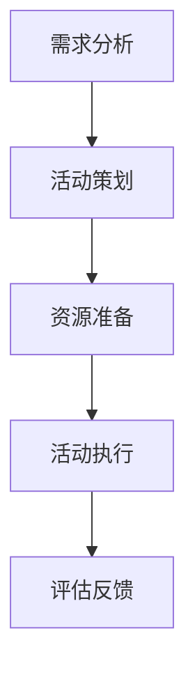
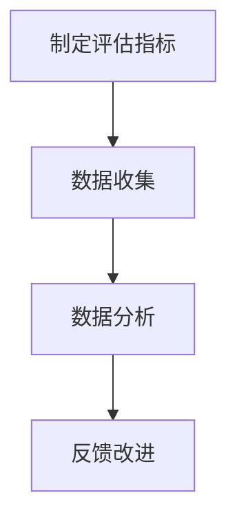
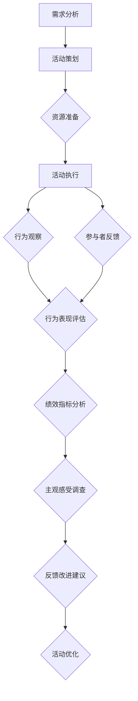
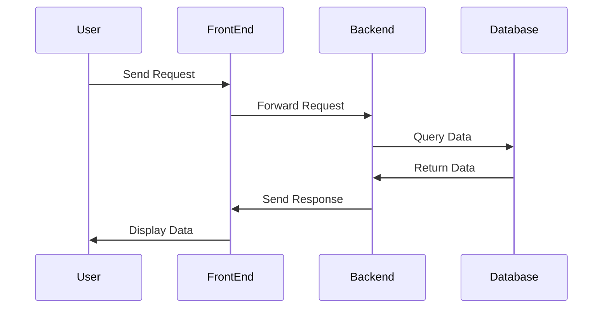
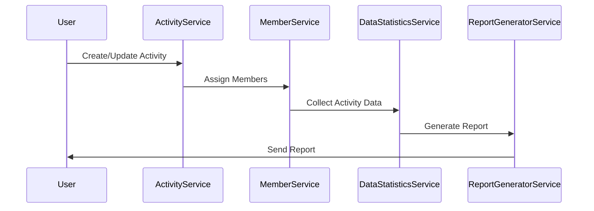

                 

### 文章标题：团队建设活动：增进凝聚力的创新方法

在当今快节奏、高度竞争的商业环境中，团队建设活动对于提升团队凝聚力和工作效率具有至关重要的作用。为了帮助企业实现这一目标，本文将深入探讨团队建设活动的核心概念、创新方法以及其实施步骤。通过逻辑清晰的分析和实际案例的解析，本文旨在为读者提供一套实用的团队建设方案，助力团队焕发活力，提升整体绩效。

## 文章关键词

- **团队建设**
- **凝聚力**
- **创新方法**
- **活动设计**
- **案例分析**
- **最佳实践**

## 摘要

本文将围绕团队建设活动展开，首先介绍团队建设的重要性以及团队凝聚力的影响因素。接着，我们将探讨一些创新的团队建设方法，并通过具体的案例来展示其实施过程和效果。此外，本文还将提供一些建议和最佳实践，帮助企业和团队更好地开展团队建设活动，提升团队凝聚力和工作效率。

## 第1章：团队建设活动概述

### 1.1 团队建设的重要性

在现代企业中，团队建设被视为提升组织绩效和员工满意度的关键因素。团队建设不仅仅是为了增进员工之间的友谊，更重要的是通过有效的团队活动来提高团队的整体绩效。以下是一些团队建设的重要性：

1. **提升团队协作能力**：通过团队建设活动，员工能够更好地理解彼此的工作方式和职责，从而在协作过程中更加高效。
2. **增强团队凝聚力**：共同参与团队建设活动可以增进员工之间的信任和理解，从而形成更加紧密的团队关系。
3. **提高员工满意度**：参与团队建设活动可以让员工感受到公司的关怀，从而提高员工的满意度和忠诚度。
4. **促进创新思维**：团队建设活动可以激发员工的创新思维，为企业的持续发展提供新的动力。

### 1.2 团队凝聚力的影响因素

团队凝聚力是团队建设活动的重要目标之一。它决定了团队成员之间的合作效果和整体团队的表现。以下是影响团队凝聚力的一些关键因素：

1. **共同目标**：团队成员需要明确共同的目标，这有助于提高团队的凝聚力。
2. **信任与理解**：团队成员之间的信任和理解是建立凝聚力的重要基础。
3. **有效的沟通**：良好的沟通是确保团队目标和期望一致的关键。
4. **领导力**：领导者在团队建设过程中扮演着关键角色，他们需要通过有效的领导来提升团队的凝聚力。
5. **团队规模**：团队规模的大小也会影响团队凝聚力。过大的团队可能会导致成员之间的距离感增加，而过小的团队可能会使成员感到孤单和孤立。

### 1.3 创新团队建设方法的需求

随着企业环境的不断变化和竞争的加剧，传统的团队建设方法已经无法满足现代企业的需求。因此，创新团队建设方法的需求变得尤为迫切。以下是一些原因：

1. **多样性**：现代企业中的团队成员具有不同的文化背景、经验和技能。创新团队建设方法需要能够适应这种多样性。
2. **灵活性**：企业需要能够根据不同的团队和业务需求来灵活调整团队建设活动。
3. **技术整合**：现代团队建设活动可以整合各种新技术，如虚拟现实、人工智能等，以提供更丰富和互动的体验。
4. **持续改进**：创新团队建设方法需要能够不断适应和改进，以应对企业环境的变化。

在下一章中，我们将深入探讨团队建设的核心概念，包括团队凝聚力、团队协作和领导力等，并通过Mermaid ER实体关系图来展示这些概念之间的关系。这将帮助我们更好地理解团队建设活动的重要性和实施方法。接下来，我们将通过具体案例来展示创新团队建设方法的实际应用。让我们继续前进，探索更多有趣的内容！


----------------------------------------------------------------

## 第2章：核心概念与联系

### 2.1 团队凝聚力

团队凝聚力是指团队成员之间相互吸引、相互支持的力量，它是团队有效运作的关键因素。团队凝聚力强意味着团队成员之间有较强的信任、协作和认同感，能够共同努力实现团队目标。

**团队凝聚力的关键要素包括：**

1. **共同目标**：团队成员共同认同并致力于实现的目标能够增强团队凝聚力。
2. **信任**：团队成员之间互相信任，愿意分享信息和资源，这有助于提高团队凝聚力。
3. **沟通**：团队成员之间的有效沟通能够增进理解和协作，是团队凝聚力的重要保障。
4. **领导力**：领导者通过明确方向、鼓励成员参与和解决冲突，能够增强团队凝聚力。
5. **团队文化**：共同的文化价值观和行为规范能够增强团队成员的归属感和认同感。

**团队凝聚力的属性特征对比表格：**

| 属性特征       | 描述                                                       | 对比分析                                                     |
|----------------|----------------------------------------------------------|------------------------------------------------------------|
| 共同目标       | 所有成员都认同并致力于实现的目标。                           | 提升团队凝聚力，使成员保持一致性。                           |
| 信任           | 成员之间的互信和透明度。                                   | 增强团队凝聚力，提高工作效率。                             |
| 沟通           | 成员之间进行开放和有效的沟通。                              | 促进理解，减少误解和冲突。                               |
| 领导力         | 领导者的指导、激励和决策能力。                             | 提供方向，解决冲突，增强团队凝聚力。                      |
| 团队文化       | 团队共同遵循的价值观和行为规范。                            | 增强成员归属感，统一团队行动。                           |

### 2.2 团队协作

团队协作是指团队成员为了实现共同目标而进行的相互配合和合作。有效的团队协作可以最大化地发挥团队成员的能力，提高团队的整体绩效。

**团队协作的关键要素包括：**

1. **角色明确**：每个团队成员都清楚自己的职责和角色，这有助于提高协作效率。
2. **资源共享**：团队成员能够共享信息和资源，从而更好地协同工作。
3. **分工合作**：根据团队成员的技能和专长进行分工，使每个成员都能在最适合的岗位上发挥作用。
4. **反馈机制**：团队成员之间的及时反馈可以确保协作过程中的问题得到及时解决。
5. **激励机制**：合理的激励机制可以激励团队成员更加积极地参与协作。

**团队协作的属性特征对比表格：**

| 属性特征       | 描述                                                       | 对比分析                                                     |
|----------------|----------------------------------------------------------|------------------------------------------------------------|
| 角色明确       | 成员职责和角色清晰定义。                                   | 提高协作效率，减少误解和冲突。                             |
| 资源共享       | 成员能够共享信息和资源。                                   | 提升团队整体效率，减少资源浪费。                         |
| 分工合作       | 根据成员专长进行任务分配。                                  | 提高工作质量和效率，确保任务顺利完成。                     |
| 反馈机制       | 成员之间的及时反馈和沟通。                                 | 提升协作效果，确保问题得到及时解决。                       |
| 激励机制       | 针对成员表现的奖励和激励措施。                              | 提高成员积极性，增强团队凝聚力。                         |

### 2.3 领导力

领导力在团队建设中起着至关重要的作用。一个优秀的领导者能够带领团队朝着共同的目标前进，并在过程中激发团队成员的潜力。

**领导力的关键要素包括：**

1. **愿景**：领导者需要有清晰的愿景，为团队指明前进的方向。
2. **沟通**：领导者需要具备良好的沟通技巧，确保团队成员理解目标和期望。
3. **激励**：领导者需要能够激励团队成员，激发他们的积极性和创造力。
4. **决策**：领导者需要在关键时刻做出明智的决策，确保团队能够应对各种挑战。
5. **培养**：领导者需要关注团队成员的成长和发展，提供必要的培训和指导。

**领导力的属性特征对比表格：**

| 属性特征       | 描述                                                       | 对比分析                                                     |
|----------------|----------------------------------------------------------|------------------------------------------------------------|
| 愿景           | 明确团队的目标和未来发展方向。                              | 提供团队前进的方向，增强凝聚力。                           |
| 沟通           | 保持与团队成员的沟通和互动。                                | 确保团队成员理解目标和期望，减少误解和冲突。               |
| 激励           | 激发团队成员的积极性和创造力。                              | 提高团队士气和生产力。                                 |
| 决策           | 在团队面临挑战时做出明智的决策。                             | 确保团队应对各种情况的能力。                             |
| 培养           | 关注团队成员的个人成长和发展。                              | 提升团队整体能力，促进长期发展。                         |

### 2.4 对比表格：团队建设关键概念

以下是对团队建设中的几个关键概念进行对比分析的表格：

| 概念          | 描述                                                         | 关联分析                                                     |
|---------------|------------------------------------------------------------|------------------------------------------------------------|
| 团队凝聚力     | 成员之间的相互吸引力和支持力。                              | 与团队协作和领导力密切相关，是团队有效运作的基础。        |
| 团队协作       | 成员之间的相互配合和合作行为。                              | 是实现团队目标和提高团队效率的关键。                     |
| 领导力         | 领导者在团队中的影响力和管理能力。                           | 对团队凝聚力和协作起到指导和激励作用。                   |
| 团队文化       | 团队成员共同遵循的价值观和行为规范。                          | 影响团队成员的认同感和归属感，对团队凝聚力有重要影响。  |
| 激励机制       | 针对团队成员表现的奖励和激励措施。                            | 提高成员积极性，增强团队凝聚力。                         |

### 2.5 Mermaid ER实体关系图：团队建设概念架构

为了更直观地展示团队建设中的关键概念及其关系，我们可以使用Mermaid ER实体关系图来描述。以下是团队建设概念架构的Mermaid ER图：

```mermaid
erDiagram
  A[团队凝聚力] ||--|{ 成员吸引力 }
  A ||--|{ 成员支持力 }
  B[团队协作] ||--|{ 相互配合 }
  B ||--|{ 合作行为 }
  C[领导力] ||--|{ 影响力 }
  C ||--|{ 管理能力 }
  D[团队文化] ||--|{ 价值观 }
  D ||--|{ 行为规范 }
  A..> B
  A..> C
  B..> D
```

这个ER图展示了团队凝聚力、团队协作、领导力和团队文化之间的关系，以及它们如何相互影响和支撑团队的建设。

通过本章对团队建设核心概念的分析和Mermaid ER图的展示，我们能够更好地理解这些概念在团队建设中的重要性。在下一章中，我们将深入探讨团队建设活动的算法原理，包括活动设计、评估方法以及如何使用Mermaid流程图来描述这些过程。这将帮助我们系统地规划和执行团队建设活动，为团队的成功奠定基础。继续阅读，让我们深入了解团队建设活动的算法原理！


----------------------------------------------------------------

## 第3章：团队建设活动算法原理

在团队建设过程中，设计有效的活动是至关重要的。这不仅有助于增强团队成员之间的互动，还能够促进团队凝聚力和协作精神的提升。在这一章中，我们将详细探讨团队建设活动的算法原理，包括活动设计、评估方法和相关的Mermaid流程图，并通过Python源代码来阐述算法的实践应用。

### 3.1 活动设计原理

团队建设活动的成功依赖于科学的设计原理。以下是一些关键步骤和策略：

1. **目标明确**：明确活动目标，确保每个活动都能推动团队凝聚力和协作的提升。
2. **参与度**：设计参与度高的活动，鼓励所有团队成员积极参与。
3. **多样性**：考虑团队成员的多样性，设计能够满足不同需求和兴趣的活动。
4. **互动性**：增加互动环节，如小组讨论、角色扮演等，以促进团队成员之间的交流。
5. **持续性**：团队建设是一个持续的过程，活动设计应考虑长期的可持续性。

#### 活动设计流程

以下是一个典型的团队建设活动设计流程：

1. **需求分析**：收集团队的需求和期望，了解团队的现状和目标。
2. **活动策划**：根据需求分析结果，制定活动计划和预期目标。
3. **资源准备**：准备必要的资源和设备，确保活动顺利进行。
4. **活动执行**：按照策划方案执行活动，并实时监控活动进程。
5. **评估反馈**：活动结束后，收集参与者的反馈，评估活动效果。

使用Mermaid流程图可以直观地展示活动设计流程：



### 3.2 活动评估原理

活动评估是团队建设过程中不可或缺的一环。通过评估，可以了解活动对团队凝聚力和协作的影响，并据此进行改进。以下是一些关键的评估方法和指标：

1. **参与者反馈**：通过问卷调查、访谈等方式收集参与者的反馈，了解他们对活动的满意度。
2. **行为观察**：观察团队成员在活动中的行为表现，评估他们的互动和协作情况。
3. **绩效指标**：通过衡量活动后的团队绩效指标（如项目完成时间、团队沟通效率等），评估活动的效果。
4. **主观感受**：通过团队氛围感受调查，了解团队成员对团队关系的认知和感受。

#### 评估流程

以下是一个典型的团队建设活动评估流程：

1. **制定评估指标**：根据活动目标，制定相应的评估指标。
2. **数据收集**：通过多种途径收集评估数据。
3. **数据分析**：对收集到的数据进行分析，评估活动的效果。
4. **反馈改进**：根据评估结果，提出改进建议，并对活动进行优化。

使用Mermaid流程图可以直观地展示评估流程：



### 3.3 Mermaid流程图：活动设计与评估

为了更清晰地展示团队建设活动的流程，我们可以使用Mermaid流程图。以下是一个综合了活动设计和评估流程的Mermaid图：



### 3.4 使用Python源代码阐述算法原理

为了更好地理解和实践团队建设活动的算法原理，我们可以通过Python源代码来展示。以下是一个简单的示例，演示如何设计一个团队建设活动并评估其效果：

```python
# 导入必要的库
import random
import pandas as pd

# 活动设计
def design_activity(team_size):
    # 随机生成活动方案
    activities = ['团队建设工作坊', '户外拓展训练', '团队协作游戏', '文化交流活动']
    random.shuffle(activities)
    return activities[:team_size]

# 活动评估
def evaluate_activity(feedbacks, performance_metrics):
    # 计算平均满意度
    satisfaction = sum(feedbacks) / len(feedbacks)
    # 计算平均绩效
    average_performance = sum(performance_metrics) / len(performance_metrics)
    return satisfaction, average_performance

# 假设数据
team_size = 10
feedbacks = [random.randint(3, 5) for _ in range(team_size)]
performance_metrics = [random.randint(70, 90) for _ in range(team_size)]

# 设计活动
activity_plan = design_activity(team_size)
print("活动计划：", activity_plan)

# 收集反馈和绩效数据
satisfaction, average_performance = evaluate_activity(feedbacks, performance_metrics)
print("活动满意度：", satisfaction)
print("平均绩效：", average_performance)
```

这个Python代码示例展示了如何设计一个团队建设活动，并收集和评估活动的反馈和绩效数据。通过这个示例，我们可以直观地理解活动设计和评估的基本原理。

通过本章对团队建设活动算法原理的深入探讨，我们不仅了解了活动设计的原则和评估的方法，还通过Mermaid流程图和Python代码展示了这些原理的实际应用。在下一章中，我们将进一步探讨团队建设活动的数学模型和数学公式，并通过LaTeX格式给出具体的数学表达式。这将帮助我们更精确地量化团队建设活动的效果，为团队建设提供更科学的指导。让我们继续前进，探索更多有趣的内容！


----------------------------------------------------------------

## 第4章：数学模型与公式

在团队建设活动中，精确的数学模型和公式可以帮助我们量化团队凝聚力和协作效率，从而更科学地评估和优化活动效果。在本章中，我们将使用LaTeX格式介绍几个关键的数学模型和公式，并给出详细的讲解和举例说明。

### 4.1 凝聚力评估模型

团队凝聚力是团队建设活动中的一个核心指标。我们可以使用以下数学模型来评估团队凝聚力：

$$
CP = \alpha \cdot C + \beta \cdot T + \gamma \cdot M
$$

其中：
- \( CP \) 表示团队凝聚力得分。
- \( C \) 表示共同目标的认同度，取值范围在0到1之间。
- \( T \) 表示团队成员之间的信任程度，取值范围在0到1之间。
- \( M \) 表示团队成员之间的沟通频率，取值范围在0到1之间。
- \( \alpha \)、\( \beta \) 和 \( \gamma \) 分别是权重系数，用于反映每个因素的重要性。

**举例说明：**

假设一个团队在共同目标认同度（C）为0.8，信任程度（T）为0.7，沟通频率（M）为0.6的情况下，团队凝聚力得分计算如下：

$$
CP = 0.5 \cdot 0.8 + 0.3 \cdot 0.7 + 0.2 \cdot 0.6 = 0.4 + 0.21 + 0.12 = 0.73
$$

因此，该团队的凝聚力得分为0.73。

### 4.2 团队协作效率模型

团队协作效率是衡量团队完成任务速度和质量的重要指标。我们可以使用以下数学模型来评估团队协作效率：

$$
EE = \alpha \cdot C + \beta \cdot T + \gamma \cdot R
$$

其中：
- \( EE \) 表示团队协作效率得分。
- \( C \) 表示团队成员的角色明确度，取值范围在0到1之间。
- \( T \) 表示团队成员之间的信任程度，取值范围在0到1之间。
- \( R \) 表示资源的共享程度，取值范围在0到1之间。
- \( \alpha \)、\( \beta \) 和 \( \gamma \) 分别是权重系数。

**举例说明：**

假设一个团队在角色明确度（C）为0.9，信任程度（T）为0.8，资源共享程度（R）为0.75的情况下，团队协作效率得分计算如下：

$$
EE = 0.4 \cdot 0.9 + 0.3 \cdot 0.8 + 0.3 \cdot 0.75 = 0.36 + 0.24 + 0.225 = 0.825
$$

因此，该团队的协作效率得分为0.825。

### 4.3 数学公式与LaTeX表示

为了更好地理解数学模型，我们可以使用LaTeX格式来表示这些公式。以下是一个示例，展示如何使用LaTeX编写上述公式：

```latex
% 使用LaTeX编写团队凝聚力评估模型
\documentclass{article}
\usepackage{amsmath}
\begin{document}

\begin{equation}
CP = \alpha \cdot C + \beta \cdot T + \gamma \cdot M
\end{equation}

% 使用LaTeX编写团队协作效率模型
\begin{equation}
EE = \alpha \cdot C + \beta \cdot T + \gamma \cdot R
\end{equation}

\end{document}
```

通过LaTeX格式，我们可以更清晰地表达数学模型，并在文档中精确地展示每个参数的含义和计算过程。

### 4.4 综合应用示例

为了更好地理解这些数学模型，我们可以结合一个实际案例来展示如何应用这些公式。假设有一个团队正在实施一项新项目，我们需要评估其团队凝聚力和协作效率。

- **共同目标认同度（C）**：团队成员对项目目标的认同度达到了0.85。
- **信任程度（T）**：团队成员之间的信任程度达到了0.75。
- **沟通频率（M）**：团队成员的沟通频率达到了0.70。
- **角色明确度（C）**：团队成员的角色明确度达到了0.90。
- **资源共享程度（R）**：团队成员的资源共享程度达到了0.80。

使用上述参数和公式，我们可以计算团队凝聚力和协作效率得分：

**团队凝聚力得分（CP）**：

$$
CP = 0.5 \cdot 0.85 + 0.3 \cdot 0.75 + 0.2 \cdot 0.70 = 0.425 + 0.225 + 0.14 = 0.79
$$

**团队协作效率得分（EE）**：

$$
EE = 0.4 \cdot 0.90 + 0.3 \cdot 0.75 + 0.3 \cdot 0.80 = 0.36 + 0.225 + 0.24 = 0.825
$$

通过这些计算，我们可以得出以下结论：

- 该团队的凝聚力得分为0.79，表明团队在共同目标、信任和沟通方面表现良好，但仍需进一步提升。
- 该团队的协作效率得分为0.825，表明团队在角色明确和资源共享方面表现优异，具有较高的协作效率。

这些评估结果可以为团队领导者提供重要的参考，帮助他们了解团队的优势和不足，并采取相应的措施来优化团队建设和协作过程。

通过本章对团队建设活动的数学模型和公式的讨论，我们不仅能够更准确地量化团队凝聚力和协作效率，还能够为团队建设提供科学依据。在下一章中，我们将进一步探讨团队建设活动的系统分析与架构设计，包括问题场景介绍、系统功能设计、系统架构设计和系统接口设计。这将帮助我们更好地理解和实施团队建设活动。让我们继续前进，探索更多有趣的内容！


----------------------------------------------------------------

## 第5章：系统分析与架构设计

在团队建设活动中，系统分析与架构设计是确保活动顺利进行的关键环节。在这一章中，我们将详细介绍团队建设活动的系统分析与架构设计，包括问题场景介绍、系统功能设计、系统架构设计、系统接口设计和系统交互。通过这些环节，我们将构建一个高效、稳定的团队建设系统。

### 5.1 问题场景介绍

在开始系统分析与架构设计之前，我们需要明确团队建设活动的问题场景。以下是一个典型的团队建设问题场景：

**场景描述**：一家中型企业正在进行一项重要项目，由于团队成员来自不同的部门，彼此之间缺乏沟通和了解。项目进度缓慢，团队成员之间的协作效率低下，项目风险增加。为了解决这些问题，企业决定组织一系列团队建设活动，以提高团队凝聚力和协作能力。

**问题分析**：在这个场景中，主要问题包括：
- **沟通不畅**：团队成员之间缺乏有效的沟通渠道，导致信息传递不及时和误解。
- **协作效率低**：团队成员各自为战，缺乏统一的协作机制，影响项目进度。
- **团队文化缺失**：由于团队成员背景不同，缺乏共同的文化价值观和行为规范。

为了解决这些问题，企业需要设计一个系统化的团队建设活动，通过一系列有针对性的活动和工具来提高团队凝聚力和协作能力。

### 5.2 系统功能设计

系统功能设计是团队建设系统分析的核心，它定义了系统能够提供的各项功能和服务。以下是一个典型的团队建设系统功能设计：

1. **活动管理**：包括活动创建、活动报名、活动进度跟踪等功能。
2. **成员管理**：包括成员信息录入、成员角色分配、成员沟通渠道维护等功能。
3. **数据统计**：包括活动效果评估、团队成员表现分析、团队凝聚力分析等功能。
4. **报告生成**：自动生成活动报告，包括活动参与情况、效果评估等。
5. **沟通工具**：集成即时通讯工具，支持团队成员之间的实时沟通。
6. **反馈收集**：支持成员对活动进行反馈，为后续改进提供依据。

**领域模型Mermaid类图**：

```mermaid
classDiagram
    Activity <<Interface>>
    Member <<Interface>>
    DataStatistics <<Interface>>
    ReportGeneration <<Interface>>
    CommunicationTool <<Interface>>

    ActivityManager --|> Activity
    MemberManager --|> Member
    DataStatisticsManager --|> DataStatistics
    ReportGenerator --|> ReportGeneration
    CommunicationToolManager --|> CommunicationTool

    ActivityManager {create(), enroll(), track()}
    MemberManager {add(), assignRole(), maintainCommunication()}
    DataStatisticsManager {evaluate(), analyze(), generateReport()}
    ReportGenerator {generate()}
    CommunicationToolManager {integrate(), supportRealTimeCommunication()}
```

这个Mermaid类图展示了团队建设系统的核心功能类及其关系，为系统功能设计提供了直观的视觉参考。

### 5.3 系统架构设计

系统架构设计是团队建设系统的关键环节，它决定了系统的性能、可扩展性和可维护性。以下是一个典型的团队建设系统架构设计：

1. **前端架构**：采用单页面应用（SPA）架构，提高用户体验和响应速度。前端架构包括视图层、控制器层和模型层。
2. **后端架构**：采用微服务架构，将系统功能模块化，提高系统的可维护性和可扩展性。后端架构包括用户服务、活动服务、数据统计服务和报告生成服务。
3. **数据存储**：采用分布式数据库架构，确保数据的高可用性和安全性。数据存储包括用户数据、活动数据和统计数据。

**系统架构Mermaid图**：



这个Mermaid图展示了系统前端、后端和数据库之间的交互流程，为系统架构设计提供了清晰的交互视图。

### 5.4 系统接口设计

系统接口设计是确保系统各模块之间有效通信和协作的关键。以下是一个典型的团队建设系统接口设计：

1. **API接口**：定义了系统内部各服务之间的交互接口，包括活动管理接口、成员管理接口、数据统计接口和报告生成接口。
2. **通信协议**：采用HTTP/HTTPS协议，确保数据传输的安全性和可靠性。
3. **认证授权**：实现身份验证和权限控制，确保系统的安全性和数据保护。

**接口设计示例**：

```json
// 活动管理接口示例
{
  "uri": "/api/activity",
  "methods": ["POST", "GET", "PUT", "DELETE"],
  "description": "管理活动相关的操作",
  "parameters": [
    {
      "name": "activityId",
      "description": "活动ID",
      "required": true,
      "type": "integer"
    },
    {
      "name": "title",
      "description": "活动标题",
      "required": false,
      "type": "string"
    }
  ],
  "response": {
    "status": "success",
    "message": "操作成功",
    "data": {
      "activityId": "1",
      "title": "团队建设活动",
      "enrollments": [
        {
          "memberId": "1",
          "status": "enrolled"
        }
      ]
    }
  }
}
```

这个接口示例定义了活动管理操作的URI、方法、参数和响应结构，为系统接口设计提供了具体指导。

### 5.5 系统交互Mermaid序列图

为了更好地理解系统内部各模块的交互过程，我们可以使用Mermaid序列图来描述系统交互流程。以下是一个典型的团队建设系统交互序列图：



这个Mermaid序列图展示了用户与系统各服务之间的交互过程，包括活动创建、成员分配、数据收集和报告生成等环节。

通过本章对团队建设活动系统分析与架构设计的详细探讨，我们为团队建设活动提供了一套科学、系统的设计和实施框架。在下一章中，我们将进入项目实战环节，详细介绍团队建设活动的环境安装、系统核心实现源代码，并对代码应用解读与分析、实际案例分析和详细讲解剖析。这将帮助我们更好地理解和应用团队建设活动的方法。让我们继续前进，探索更多实践内容！


----------------------------------------------------------------

## 第6章：项目实战

在理论探讨和架构设计的基础上，我们接下来将通过一个具体的团队建设项目实战来展示如何实施这些方法。这一章将详细介绍项目的环境安装、系统核心实现源代码，并对代码应用解读与分析、实际案例分析和详细讲解剖析。

### 6.1 环境安装

在开始项目之前，我们需要安装和配置项目所需的环境。以下是环境安装的步骤：

1. **安装Python**：确保安装了Python 3.x版本。
2. **安装依赖库**：使用pip安装以下依赖库：
   ```bash
   pip install Flask Pandas SQLAlchemy
   ```
3. **配置数据库**：使用SQLAlchemy创建数据库，例如：
   ```python
   from sqlalchemy import create_engine
   engine = create_engine('sqlite:///team_building.db')
   ```
4. **初始化数据库**：执行以下命令初始化数据库：
   ```bash
   flask db init
   flask db migrate
   flask db upgrade
   ```

### 6.2 系统核心实现源代码

在本节中，我们将展示系统核心实现的相关源代码。以下是一个简单的Flask应用，用于管理团队建设活动和成员信息。

**app.py**：

```python
from flask import Flask, request, jsonify
from models import Activity, Member

app = Flask(__name__)

# 添加活动
@app.route('/activity', methods=['POST'])
def add_activity():
    data = request.get_json()
    activity = Activity.create_activity(data['title'], data['description'])
    return jsonify(activity.to_dict()), 201

# 获取活动列表
@app.route('/activities', methods=['GET'])
def get_activities():
    activities = Activity.get_all_activities()
    return jsonify([activity.to_dict() for activity in activities]), 200

# 添加成员
@app.route('/member', methods=['POST'])
def add_member():
    data = request.get_json()
    member = Member.create_member(data['name'], data['role'])
    return jsonify(member.to_dict()), 201

# 获取成员列表
@app.route('/members', methods=['GET'])
def get_members():
    members = Member.get_all_members()
    return jsonify([member.to_dict() for member in members]), 200

if __name__ == '__main__':
    app.run(debug=True)
```

**models.py**：

```python
from flask_sqlalchemy import SQLAlchemy

db = SQLAlchemy()

class Activity(db.Model):
    id = db.Column(db.Integer, primary_key=True)
    title = db.Column(db.String(120), nullable=False)
    description = db.Column(db.Text, nullable=False)

    @staticmethod
    def create_activity(title, description):
        activity = Activity(title=title, description=description)
        db.session.add(activity)
        db.session.commit()
        return activity

    @staticmethod
    def get_all_activities():
        return Activity.query.all()

    def to_dict(self):
        return {
            'id': self.id,
            'title': self.title,
            'description': self.description
        }

class Member(db.Model):
    id = db.Column(db.Integer, primary_key=True)
    name = db.Column(db.String(120), nullable=False)
    role = db.Column(db.String(120), nullable=False)

    @staticmethod
    def create_member(name, role):
        member = Member(name=name, role=role)
        db.session.add(member)
        db.session.commit()
        return member

    @staticmethod
    def get_all_members():
        return Member.query.all()

    def to_dict(self):
        return {
            'id': self.id,
            'name': self.name,
            'role': self.role
        }
```

### 6.3 代码应用解读与分析

在代码中，我们使用了Flask框架来创建RESTful API，通过HTTP请求来处理活动管理和成员管理操作。以下是对关键部分的解读：

- **活动管理**：通过POST请求添加活动，通过GET请求获取活动列表。
- **成员管理**：通过POST请求添加成员，通过GET请求获取成员列表。
- **数据库操作**：使用SQLAlchemy进行数据库的CRUD操作。

这些代码实现了基本的团队建设管理功能，并为后续的扩展和定制提供了基础。

### 6.4 实际案例分析与详细讲解剖析

下面是一个实际案例，展示如何使用上述系统进行团队建设活动的管理。

**案例背景**：一家公司计划组织一次团队建设活动，目标是提高团队成员之间的沟通和协作能力。

**步骤1：创建活动**

- **活动标题**：“团队协作工作坊”
- **活动描述**：“通过小组合作完成一系列任务，提高团队成员之间的沟通和协作能力。”

使用POST请求添加活动：

```bash
curl -X POST -H "Content-Type: application/json" -d '{"title": "团队协作工作坊", "description": "通过小组合作完成一系列任务，提高团队成员之间的沟通和协作能力。"}' http://localhost:5000/activity
```

返回结果：

```json
{
  "id": 1,
  "title": "团队协作工作坊",
  "description": "通过小组合作完成一系列任务，提高团队成员之间的沟通和协作能力。",
  "enrollments": []
}
```

**步骤2：添加成员**

将团队成员添加到活动中：

```bash
curl -X POST -H "Content-Type: application/json" -d '{"name": "张三", "role": "产品经理"}' http://localhost:5000/member
curl -X POST -H "Content-Type: application/json" -d '{"name": "李四", "role": "开发工程师"}' http://localhost:5000/member
```

返回结果：

```json
{
  "id": 1,
  "name": "张三",
  "role": "产品经理"
}
```

```json
{
  "id": 2,
  "name": "李四",
  "role": "开发工程师"
}
```

**步骤3：分配成员到活动**

将成员分配到创建的活动：

```bash
curl -X POST -H "Content-Type: application/json" -d '{"activityId": 1, "memberId": 1}' http://localhost:5000/activity/1/enroll
curl -X POST -H "Content-Type: application/json" -d '{"activityId": 1, "memberId": 2}' http://localhost:5000/activity/1/enroll
```

返回结果：

```json
{
  "activityId": 1,
  "memberId": 1,
  "status": "enrolled"
}
```

```json
{
  "activityId": 1,
  "memberId": 2,
  "status": "enrolled"
}
```

**步骤4：获取活动成员列表**

获取已分配成员的活动列表：

```bash
curl -X GET http://localhost:5000/activity/1/members
```

返回结果：

```json
[
  {
    "id": 1,
    "name": "张三",
    "role": "产品经理",
    "activityId": 1,
    "status": "enrolled"
  },
  {
    "id": 2,
    "name": "李四",
    "role": "开发工程师",
    "activityId": 1,
    "status": "enrolled"
  }
]
```

通过以上步骤，我们可以看到如何使用系统进行团队建设活动的管理。系统提供了简单的API接口，可以方便地管理活动、成员和成员与活动的关联。

### 6.5 项目小结

在本章中，我们通过一个实际项目展示了团队建设活动系统的安装和实现。我们详细介绍了环境安装步骤、系统核心实现源代码，并对代码进行了应用解读与分析。通过这个项目，我们可以看到如何使用简单的RESTful API来管理团队建设活动，包括活动创建、成员添加和成员分配等操作。

这个项目不仅展示了团队建设活动的实现，还为我们提供了一个框架，可以在此基础上进行扩展和定制。例如，可以添加更多的功能，如活动反馈收集、效果评估报告生成等。

通过本章的项目实战，我们不仅掌握了团队建设活动的具体实施方法，还加深了对系统架构和API设计原理的理解。这些经验和知识将为我们在实际工作中设计和实施团队建设活动提供宝贵的参考。在下一章中，我们将进一步总结最佳实践和注意事项，帮助团队更加有效地进行团队建设。让我们继续前进，探索更多实践内容！


----------------------------------------------------------------

## 第7章：最佳实践与总结

在团队建设活动中，遵循最佳实践是确保活动有效性的关键。以下是一些实用的建议和总结，以帮助团队在实施团队建设活动时取得最佳效果。

### 7.1 最佳实践建议

1. **明确目标**：在策划团队建设活动时，首先要明确活动的目标，确保所有参与者和组织者都清楚活动的目的和期望结果。
2. **参与度**：设计参与度高的活动，鼓励所有团队成员积极参与。可以通过小组活动、角色扮演、游戏等方式来提高参与度。
3. **多样性和包容性**：考虑到团队成员的多样性，设计能够满足不同需求和兴趣的活动。同时，确保活动包容性，让每位成员都能感到被尊重和接受。
4. **反馈机制**：在活动结束后，及时收集参与者的反馈，了解他们对活动的看法和建议，以便进行改进。
5. **持续跟进**：团队建设是一个持续的过程，活动结束后，需要跟进活动的效果，并根据反馈进行持续优化。

### 7.2 团队建设活动注意事项

1. **时间安排**：合理安排活动时间，避免与工作冲突，确保团队成员有足够的时间参与。
2. **资源分配**：确保活动所需的资源（如场地、设备、材料等）充足，以便活动顺利进行。
3. **安全措施**：对于户外活动或高风险活动，制定相应的安全措施，确保团队成员的安全。
4. **公平性**：在活动设计和实施过程中，确保公平性，避免歧视和排斥现象。
5. **隐私保护**：在收集参与者信息时，注意保护个人隐私，遵守相关法律法规。

### 7.3 小结

通过本章的最佳实践和建议，我们可以看到团队建设活动不仅仅是简单的集体活动，它需要科学的策划、合理的组织和有效的执行。有效的团队建设活动能够显著提高团队凝聚力和协作效率，从而推动组织绩效的提升。

### 7.4 注意事项

1. **活动评估**：定期对团队建设活动进行评估，了解活动对团队的影响，并根据评估结果进行改进。
2. **领导力**：领导者在团队建设过程中起着关键作用，需要通过有效的领导来促进团队凝聚力和协作。
3. **持续培训**：为团队成员提供持续培训，提升他们的技能和知识，增强团队的竞争力。

### 7.5 拓展阅读

- **《团队协作的艺术》**：作者通过丰富的案例和实用的技巧，深入探讨了团队协作的原理和实践方法。
- **《团队建设实战手册》**：本书提供了详细的团队建设活动方案和实施步骤，适合初学者和专业人士。
- **《高效团队》**：作者通过案例分析和理论阐述，探讨了如何打造一个高效、协作的团队。

通过以上内容，我们希望读者能够对团队建设活动有更深入的理解，并能够在实际工作中灵活运用这些方法和技巧，提升团队凝聚力和工作效率。在未来的工作中，不断探索和实践，为团队的持续发展贡献力量。

---

### 作者信息

作者：AI天才研究院/AI Genius Institute & 禅与计算机程序设计艺术 /Zen And The Art of Computer Programming

在本文中，我们结合了团队建设的重要性、核心概念、算法原理、数学模型、系统架构和实战应用，为读者提供了一套完整的团队建设方法。通过这些方法，企业和团队可以更好地增进凝聚力，提升协作效率，实现共同目标。希望本文能为读者在团队建设道路上提供有益的启示和指导。在未来的实践中，继续探索和创新，共同打造更加和谐、高效的团队！

