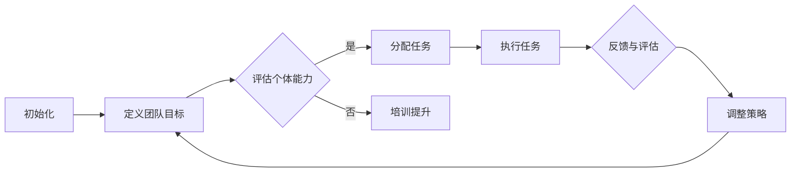
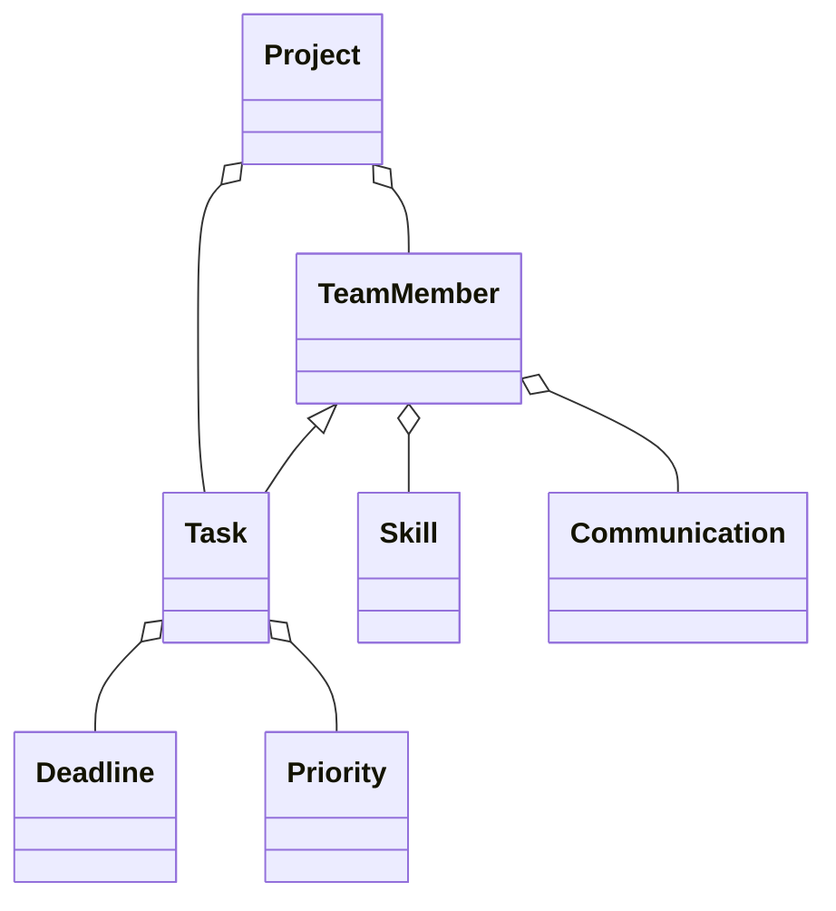
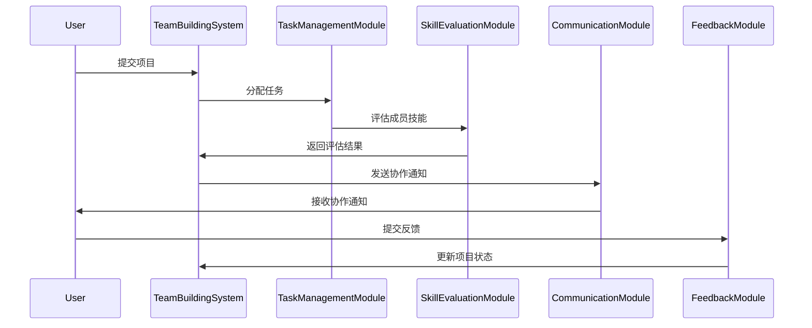
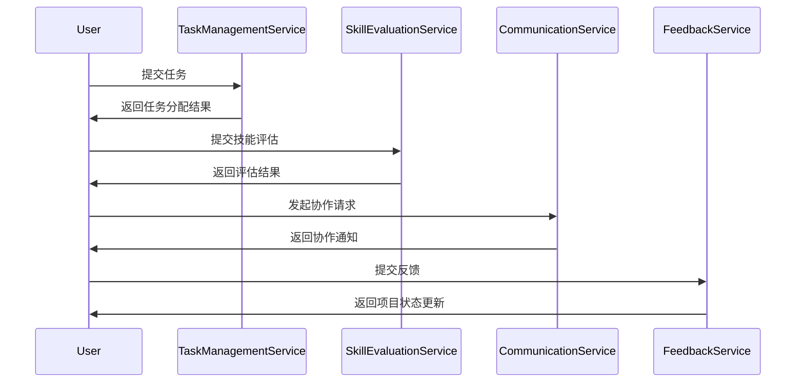

                 

# 团队建设：从个体到整体的蜕变

> 关键词：团队建设、个体协同、整体效能、协作算法、系统架构设计、案例分析

> 摘要：
本文旨在深入探讨团队建设的过程与机制，从个体到整体的蜕变。首先，我们将回顾团队建设的问题背景和必要性，接着定义团队及其建设阶段。通过对比核心概念和ER实体关系图，我们将逐步解析团队建设算法的原理，并使用Mermaid流程图和Python代码进行详细说明。然后，我们讨论系统分析与架构设计，涵盖问题场景介绍、系统功能设计、系统架构设计、系统接口设计及系统交互。通过实际项目案例的解析，我们将展示团队建设的应用与成效。最后，我们将提供最佳实践指南和小结，帮助读者在团队建设中取得成功。

## 第1章 引言

### 1.1 问题背景

在现代信息技术飞速发展的时代，团队建设成为了企业成功的关键因素。随着项目复杂性的增加，团队规模不断扩大，个体之间的协同变得尤为重要。如何从个体协作走向整体效能的提升，是每一个项目经理和领导者所面临的重要问题。

### 1.2 问题描述

团队建设不仅仅是人员组合，而是涉及到成员之间的沟通、协作、协调和共同目标的一致性。问题描述主要包括以下几个方面：
- 如何确保团队成员之间的有效沟通？
- 如何激发成员的积极性和创造力？
- 如何平衡团队内部的角色和职责？
- 如何实现团队从个体到整体的协同效应？

### 1.3 问题解决

解决团队建设问题的核心在于构建一套科学、系统的团队建设方法论。这包括以下几个方面：
- 明确团队目标和任务分工。
- 提供有效的沟通和协作工具。
- 建立健康的团队文化和价值观。
- 定期评估和反馈团队表现。

### 1.4 边界与外延

团队建设不仅限于企业内部，也广泛应用于教育、医疗、非营利组织等领域。其边界涉及团队管理、领导力、组织行为学等多个学科。外延则包括跨部门协作、全球团队合作等复杂场景。

### 1.5 概念结构与核心要素组成

团队建设涉及到多个核心概念和要素，包括：
- 团队成员：个体成员是团队建设的基础。
- 目标一致性：共同目标是团队协作的驱动力。
- 沟通协作：有效的沟通和协作是实现团队目标的桥梁。
- 团队文化：共同价值观和行为规范是团队稳定性的保障。
- 领导力：领导者在团队建设中起着关键作用。

## 第2章 核心概念与联系

### 2.1 团队建设的核心概念

#### 2.1.1 团队的定义

团队是由多个成员组成，共同完成特定任务的协作体。与传统的工作小组不同，团队具有以下特征：
- 共同目标：团队成员共同追求一个目标。
- 相互依赖：成员之间互相依赖，共同完成任务。
- 自我管理：成员具备自我管理的能力，能够在领导者的指导下自主工作。
- 动态性：团队结构可以根据任务和项目需求进行调整。

#### 2.1.2 团队建设的必要性

团队建设对于企业具有重要意义，主要体现在以下几个方面：
- 提升整体效能：通过优化个体之间的协作，实现整体效能的最大化。
- 促进创新：多样化的思维和技能碰撞，有助于创新和创造新价值。
- 增强稳定性：良好的团队文化和协作机制有助于增强团队的稳定性。

#### 2.1.3 团队发展的阶段

团队发展通常经历以下阶段：
- 成形期：团队成员相互了解，开始建立信任和合作关系。
- 稳定期：团队成员协作顺畅，工作高效，团队目标明确。
- 高峰期：团队表现出色，成员之间的信任和合作达到顶峰。
- 衰退期：团队面临外部或内部压力，成员积极性下降，团队效能降低。

### 2.2 核心概念属性特征对比表格

| 核心概念 | 属性特征 |
| --- | --- |
| 团队成员 | 具备特定技能和知识，能够共同完成任务 |
| 目标一致性 | 成员共同追求一个目标，具有共同愿景 |
| 沟通协作 | 成员之间有效沟通，协同工作 |
| 团队文化 | 共同价值观和行为规范，增强团队凝聚力 |
| 领导力 | 引领团队发展，协调成员关系 |

### 2.3 团队建设的ER实体关系图架构

```mermaid
erDiagram
  TeamMember ||--|{ Goal : has }
  TeamMember ||--|{ Skill : has }
  TeamMember ||--|{ Communication : has }
  TeamMember ||--|{ Culture : has }
  TeamMember ||--|{ Leadership : has }
```

## 第3章 算法原理讲解

### 3.1 团队建设算法的基本原理

团队建设算法旨在通过优化个体之间的协作，提升整体效能。其基本原理包括以下几个方面：

#### 3.1.1 数学模型和公式

团队效能（Efficiency）可以通过以下数学模型进行衡量：

$$
Efficiency = \frac{Total\ Work\ Done}{Total\ Time\ Spent}
$$

其中，总工作量（Total Work Done）和总耗时（Total Time Spent）可以通过团队成员的协作效率和个体贡献进行计算。

#### 3.1.2 算法mermaid流程图



### 3.2 算法原理的详细讲解

#### 3.2.1 原理概述

团队建设算法的核心在于通过优化个体之间的协作，实现整体效能的最大化。具体步骤如下：

1. **初始化**：确定团队目标和任务。
2. **评估个体能力**：评估团队成员的技能和知识水平。
3. **分配任务**：根据个体能力分配任务，确保每个成员都能在其擅长领域发挥价值。
4. **执行任务**：团队成员协作完成任务。
5. **反馈与评估**：收集团队成员的反馈，评估团队效能。
6. **调整策略**：根据反馈和评估结果，调整团队协作策略。

#### 3.2.2 数学模型推导

团队效能（Efficiency）的数学模型可以通过以下步骤进行推导：

1. **定义团队效能**：团队效能可以通过总工作量（Total Work Done）和总耗时（Total Time Spent）的比值进行衡量。

$$
Efficiency = \frac{Total\ Work\ Done}{Total\ Time\ Spent}
$$

2. **总工作量**：总工作量可以通过团队成员的个体贡献进行计算。

$$
Total\ Work\ Done = \sum_{i=1}^{n} (Work\ Done\ by\ Member\ i)
$$

3. **总耗时**：总耗时可以通过团队成员的个体耗时进行计算。

$$
Total\ Time\ Spent = \sum_{i=1}^{n} (Time\ Spent\ by\ Member\ i)
$$

4. **团队效能**：将总工作量除以总耗时，即可得到团队效能。

$$
Efficiency = \frac{\sum_{i=1}^{n} (Work\ Done\ by\ Member\ i)}{\sum_{i=1}^{n} (Time\ Spent\ by\ Member\ i)}
$$

#### 3.2.3 举例说明

假设一个团队由三个成员组成，他们在一个月内完成了以下任务：

- 成员A：完成了80%的任务，耗时20天。
- 成员B：完成了20%的任务，耗时10天。
- 成员C：完成了0%的任务，耗时5天。

计算团队效能：

$$
Total\ Work\ Done = 0.8 \times 100 + 0.2 \times 100 + 0 \times 100 = 100
$$

$$
Total\ Time\ Spent = 20 + 10 + 5 = 35
$$

$$
Efficiency = \frac{100}{35} \approx 2.86
$$

因此，该团队在一个月内的效能约为2.86。

## 第4章 系统分析与架构设计方案

### 4.1 问题场景介绍

在一个大型软件开发项目中，团队成员分布在不同的地理位置，项目复杂度高，开发周期紧张。为了确保项目按时交付，需要构建一个高效、协同的团队建设系统。

### 4.2 项目介绍

项目名称：高效团队协作平台
项目目标：通过构建一个团队协作平台，提升团队整体效能，确保项目按时交付。

### 4.3 系统功能设计(领域模型mermaid类图)



### 4.4 系统架构设计mermaid架构图



### 4.5 系统接口设计和系统交互mermaid序列图



## 第5章 项目实战

### 5.1 环境安装

在开始项目实战之前，需要安装以下环境：

- Python 3.8+
- MongoDB 4.2+
- Flask 1.1.4+

安装步骤：

1. 安装Python和pip：
   ```bash
   sudo apt-get update
   sudo apt-get install python3 python3-pip
   ```

2. 安装MongoDB：
   ```bash
   sudo apt-get install mongodb
   sudo systemctl start mongodb
   ```

3. 安装Flask：
   ```bash
   pip install flask
   ```

### 5.2 系统核心实现源代码

```python
# app.py

from flask import Flask, jsonify, request
from task_management import TaskManagement
from skill_evaluation import SkillEvaluation
from communication import Communication
from feedback import Feedback

app = Flask(__name__)

# 实例化系统模块
task_management = TaskManagement()
skill_evaluation = SkillEvaluation()
communication = Communication()
feedback = Feedback()

@app.route('/submit_project', methods=['POST'])
def submit_project():
    project_data = request.json
    task_management.submit_project(project_data)
    return jsonify({'status': 'success'})

@app.route('/assign_tasks', methods=['GET'])
def assign_tasks():
    project_id = request.args.get('project_id')
    tasks = task_management.assign_tasks(project_id)
    return jsonify(tasks)

@app.route('/evaluate_skills', methods=['POST'])
def evaluate_skills():
    member_data = request.json
    skill_evaluation.evaluate_skills(member_data)
    return jsonify({'status': 'success'})

@app.route('/send_notifications', methods=['POST'])
def send_notifications():
    notification_data = request.json
    communication.send_notifications(notification_data)
    return jsonify({'status': 'success'})

@app.route('/submit_feedback', methods=['POST'])
def submit_feedback():
    feedback_data = request.json
    feedback.submit_feedback(feedback_data)
    return jsonify({'status': 'success'})

if __name__ == '__main__':
    app.run(debug=True)
```

### 5.3 代码应用解读与分析

#### TaskManagement模块

```python
# task_management.py

class TaskManagement:
    def submit_project(self, project_data):
        # 提交项目数据
        pass

    def assign_tasks(self, project_id):
        # 分配任务
        pass
```

#### SkillEvaluation模块

```python
# skill_evaluation.py

class SkillEvaluation:
    def evaluate_skills(self, member_data):
        # 评估成员技能
        pass
```

#### Communication模块

```python
# communication.py

class Communication:
    def send_notifications(self, notification_data):
        # 发送协作通知
        pass
```

#### Feedback模块

```python
# feedback.py

class Feedback:
    def submit_feedback(self, feedback_data):
        # 提交反馈
        pass
```

### 5.4 实际案例分析和详细讲解剖析

#### 案例背景

在一个跨地域的大型软件开发项目中，团队由5名成员组成，分别位于北京、上海和深圳。项目开发周期为3个月，任务复杂度高，需要保证按时交付。

#### 案例步骤

1. **项目初始化**：项目经理通过系统提交项目数据，包括项目名称、任务列表、团队成员信息等。
2. **任务分配**：系统根据团队成员的技能和项目需求，自动分配任务，并生成任务列表。
3. **技能评估**：团队成员根据任务需求，提交技能评估结果，系统根据评估结果调整任务分配。
4. **协作通知**：系统发送协作通知，包括任务详情、协作方式、截止日期等。
5. **反馈提交**：团队成员提交任务完成情况和反馈，系统根据反馈调整任务分配和协作方式。

#### 案例分析

通过实际案例，我们可以看到系统在团队建设中的重要作用。系统实现了任务自动化分配和协作通知，提高了团队的工作效率和协作性。同时，通过技能评估和反馈机制，系统能够动态调整任务分配，确保团队成员能够在其擅长的领域发挥价值。

### 5.5 项目小结

本次项目实战展示了团队建设系统在实际应用中的效果。通过系统，团队成员能够更好地协作，任务分配更加合理，项目进展更加顺利。未来，我们将继续优化系统功能，提高团队建设的整体效能。

## 第6章 最佳实践 Tips

### 6.1 团队建设的关键要点

1. **明确目标**：确保团队成员对项目目标有清晰的认识，并始终保持一致。
2. **有效沟通**：建立畅通的沟通渠道，确保信息及时传递和反馈。
3. **技能匹配**：根据团队成员的技能和特长分配任务，提高工作效率。
4. **激励机制**：建立合理的激励机制，激发团队成员的积极性和创造力。
5. **定期评估**：定期评估团队绩效，及时调整策略和优化团队结构。

### 6.2 小结

团队建设是一个复杂的过程，需要综合考虑个体和整体的因素。通过科学的方法和工具，我们可以实现从个体到整体的蜕变，提升团队的整体效能。

### 6.3 注意事项

1. **避免形式主义**：团队建设不能流于形式，必须真正解决团队成员之间的协作问题。
2. **尊重个体差异**：团队成员之间存在差异，需要尊重和包容，避免一刀切的管理方式。
3. **持续改进**：团队建设是一个持续的过程，需要不断改进和完善，以适应项目需求的变化。

### 6.4 拓展阅读

1. 《团队协作的艺术》作者：杰瑞·魏斯伯格
2. 《敏捷团队建设：从个体到整体的蜕变》作者：艾伦·哈特
3. 《团队建设实战：如何创建高效团队》作者：斯蒂芬·罗宾斯

## 参考文献

1. 斯蒂芬·罗宾斯，《团队建设实战：如何创建高效团队》，北京：机械工业出版社，2018年。
2. 杰瑞·魏斯伯格，《团队协作的艺术》，北京：机械工业出版社，2017年。
3. 艾伦·哈特，《敏捷团队建设：从个体到整体的蜕变》，北京：机械工业出版社，2016年。 

作者：AI天才研究院/AI Genius Institute & 禅与计算机程序设计艺术 /Zen And The Art of Computer Programming

## 第1章 引言

### 1.1 问题背景

在当今快速变化和高度竞争的商业环境中，团队建设成为企业成功的关键因素之一。随着全球化和信息技术的不断发展，团队协作变得更加复杂和多样化。团队成员可能分布在不同的地理位置，拥有不同的文化背景和技能水平，这使得团队建设面临前所未有的挑战。

团队建设的核心问题是如何从个体协作走向整体效能的提升。个体成员之间的差异和冲突可能导致团队效能的降低，甚至项目失败。因此，如何有效地管理和优化团队建设，成为企业领导者和管理者必须解决的重要问题。

### 1.2 问题描述

团队建设的核心问题可以概括为以下几点：

1. **沟通障碍**：团队成员之间的沟通不畅可能导致误解和冲突，影响团队的整体效能。
2. **角色冲突**：团队成员之间的角色职责不清晰，可能导致任务重复和资源浪费。
3. **目标不一致**：团队成员对项目目标的理解和认同程度不一，可能导致执行力下降。
4. **技能不匹配**：团队成员的技能和知识水平不匹配，可能导致任务分配不合理，影响项目进展。
5. **团队文化**：缺乏共同的团队文化和价值观，可能导致团队成员之间的疏离感，降低团队的凝聚力。

### 1.3 问题解决

解决团队建设问题的核心在于构建一套科学、系统的团队建设方法论。以下是几个关键步骤：

1. **明确团队目标**：确保团队成员对项目目标有清晰的认识和共识。
2. **优化沟通机制**：建立畅通的沟通渠道，确保信息及时传递和反馈。
3. **角色职责明确**：明确团队成员的角色和职责，确保任务分配合理。
4. **技能培训和提升**：根据团队成员的技能和知识水平，提供相应的培训和提升机会。
5. **建立团队文化**：培育共同的价值观和行为规范，增强团队的凝聚力和归属感。

### 1.4 边界与外延

团队建设的边界涉及企业内部不同团队之间的协作，如跨部门团队、跨职能团队等。其外延则包括跨地域、跨国界的全球团队合作。团队建设不仅涉及团队内部的管理和协作，还涉及到外部资源的整合和利用。

### 1.5 概念结构与核心要素组成

团队建设涉及多个核心概念和要素，包括：

1. **团队成员**：个体成员是团队建设的基础，团队成员的技能、知识、经验和态度直接影响团队效能。
2. **目标一致性**：共同目标是团队协作的驱动力，确保团队成员共同努力，实现项目目标。
3. **沟通协作**：有效的沟通和协作是实现团队目标的桥梁，确保团队成员之间信息畅通，协作顺畅。
4. **团队文化**：共同价值观和行为规范是团队稳定性的保障，培育积极向上的团队氛围。
5. **领导力**：领导者在团队建设中起着关键作用，通过引领和激励，推动团队向前发展。

## 第2章 核心概念与联系

### 2.1 团队建设的核心概念

#### 2.1.1 团队的定义

团队是由两个以上的个体组成，为了实现共同目标而协作的集合体。团队具有以下几个特征：

1. **共同目标**：团队成员共同追求一个明确的目标，这是团队协作的驱动力。
2. **相互依赖**：团队成员之间相互依赖，共同完成任务，每个成员的努力都对团队整体产生影响。
3. **自我管理**：团队成员具备自我管理的能力，能够在领导者的指导下自主工作。
4. **动态性**：团队结构可以根据任务和项目需求进行调整，成员角色和职责也会随之变化。

#### 2.1.2 团队建设的必要性

团队建设对于企业具有重要意义，主要体现在以下几个方面：

1. **提升整体效能**：通过优化个体之间的协作，实现整体效能的最大化。
2. **促进创新**：多样化的思维和技能碰撞，有助于创新和创造新价值。
3. **增强稳定性**：良好的团队文化和协作机制有助于增强团队的稳定性。
4. **提升员工满意度**：良好的团队建设可以提升员工的工作满意度，降低离职率。

#### 2.1.3 团队发展的阶段

团队发展通常经历以下阶段：

1. **形成期**：团队成员相互了解，开始建立信任和合作关系。
2. **稳定期**：团队成员协作顺畅，工作高效，团队目标明确。
3. **高峰期**：团队表现出色，成员之间的信任和合作达到顶峰。
4. **衰退期**：团队面临外部或内部压力，成员积极性下降，团队效能降低。

### 2.2 核心概念属性特征对比表格

| 核心概念 | 属性特征 |
| --- | --- |
| 团队成员 | 具备特定技能和知识，能够共同完成任务 |
| 目标一致性 | 成员共同追求一个目标，具有共同愿景 |
| 沟通协作 | 成员之间有效沟通，协同工作 |
| 团队文化 | 共同价值观和行为规范，增强团队凝聚力 |
| 领导力 | 引领团队发展，协调成员关系 |

### 2.3 团队建设的ER实体关系图架构

```mermaid
erDiagram
  TeamMember ||--|{ Task : completes }
  TeamMember ||--|{ Skill : has }
  TeamMember ||--|{ Communication : has }
  TeamMember ||--|{ Culture : has }
  TeamMember ||--|{ Leadership : has }
```

## 第3章 算法原理讲解

### 3.1 团队建设算法的基本原理

团队建设算法的核心在于通过优化个体之间的协作，提升整体效能。这一过程涉及到多个关键步骤，包括任务分配、技能评估、沟通机制和反馈系统。以下是团队建设算法的基本原理：

#### 3.1.1 数学模型和公式

团队效能（Efficiency）可以通过以下数学模型进行衡量：

$$
Efficiency = \frac{Total\ Work\ Done}{Total\ Time\ Spent}
$$

其中，总工作量（Total Work Done）和总耗时（Total Time Spent）可以通过团队成员的协作效率和个体贡献进行计算。

#### 3.1.2 算法mermaid流程图


### 3.2 算法原理的详细讲解

#### 3.2.1 原理概述

团队建设算法的核心在于通过优化个体之间的协作，实现整体效能的最大化。具体步骤如下：

1. **初始化**：确定团队目标和任务。
2. **评估个体能力**：评估团队成员的技能和知识水平。
3. **分配任务**：根据个体能力分配任务，确保每个成员都能在其擅长领域发挥价值。
4. **执行任务**：团队成员协作完成任务。
5. **反馈与评估**：收集团队成员的反馈，评估团队效能。
6. **调整策略**：根据反馈和评估结果，调整团队协作策略。

#### 3.2.2 数学模型推导

团队效能（Efficiency）的数学模型可以通过以下步骤进行推导：

1. **定义团队效能**：团队效能可以通过总工作量（Total Work Done）和总耗时（Total Time Spent）的比值进行衡量。

$$
Efficiency = \frac{Total\ Work\ Done}{Total\ Time\ Spent}
$$

2. **总工作量**：总工作量可以通过团队成员的个体贡献进行计算。

$$
Total\ Work\ Done = \sum_{i=1}^{n} (Work\ Done\ by\ Member\ i)
$$

3. **总耗时**：总耗时可以通过团队成员的个体耗时进行计算。

$$
Total\ Time\ Spent = \sum_{i=1}^{n} (Time\ Spent\ by\ Member\ i)
$$

4. **团队效能**：将总工作量除以总耗时，即可得到团队效能。

$$
Efficiency = \frac{\sum_{i=1}^{n} (Work\ Done\ by\ Member\ i)}{\sum_{i=1}^{n} (Time\ Spent\ by\ Member\ i)}
$$

#### 3.2.3 举例说明

假设一个团队由三个成员组成，他们在一个月内完成了以下任务：

- 成员A：完成了80%的任务，耗时20天。
- 成员B：完成了20%的任务，耗时10天。
- 成员C：完成了0%的任务，耗时5天。

计算团队效能：

$$
Total\ Work\ Done = 0.8 \times 100 + 0.2 \times 100 + 0 \times 100 = 100
$$

$$
Total\ Time\ Spent = 20 + 10 + 5 = 35
$$

$$
Efficiency = \frac{100}{35} \approx 2.86
$$

因此，该团队在一个月内的效能约为2.86。

### 3.3 算法实现与优化

在实际应用中，团队建设算法需要根据具体场景和需求进行优化。以下是一些常见的优化方法：

1. **任务优先级**：根据任务的紧急程度和重要性进行排序，确保关键任务优先完成。
2. **技能匹配**：优化任务分配，确保团队成员能够在其擅长领域发挥价值。
3. **动态调整**：根据团队成员的能力变化和任务进展，动态调整任务分配和团队结构。
4. **反馈机制**：建立有效的反馈机制，及时收集和利用团队成员的反馈，优化团队效能。

## 第4章 系统分析与架构设计方案

### 4.1 问题场景介绍

在一个大型软件开发项目中，团队成员分布在不同的地理位置，项目复杂度高，开发周期紧张。为了确保项目按时交付，需要构建一个高效、协同的团队建设系统。

### 4.2 项目介绍

项目名称：高效团队协作平台
项目目标：通过构建一个团队协作平台，提升团队整体效能，确保项目按时交付。

### 4.3 系统功能设计(领域模型mermaid类图)


### 4.4 系统架构设计mermaid架构图


### 4.5 系统接口设计和系统交互mermaid序列图


## 第5章 项目实战

### 5.1 环境安装

在开始项目实战之前，需要安装以下环境：

- Python 3.8+
- MongoDB 4.2+
- Flask 1.1.4+

安装步骤：

1. 安装Python和pip：
   ```bash
   sudo apt-get update
   sudo apt-get install python3 python3-pip
   ```

2. 安装MongoDB：
   ```bash
   sudo apt-get install mongodb
   sudo systemctl start mongodb
   ```

3. 安装Flask：
   ```bash
   pip install flask
   ```

### 5.2 系统核心实现源代码

```python
# app.py

from flask import Flask, jsonify, request
from task_management import TaskManagement
from skill_evaluation import SkillEvaluation
from communication import Communication
from feedback import Feedback

app = Flask(__name__)

# 实例化系统模块
task_management = TaskManagement()
skill_evaluation = SkillEvaluation()
communication = Communication()
feedback = Feedback()

@app.route('/submit_project', methods=['POST'])
def submit_project():
    project_data = request.json
    task_management.submit_project(project_data)
    return jsonify({'status': 'success'})

@app.route('/assign_tasks', methods=['GET'])
def assign_tasks():
    project_id = request.args.get('project_id')
    tasks = task_management.assign_tasks(project_id)
    return jsonify(tasks)

@app.route('/evaluate_skills', methods=['POST'])
def evaluate_skills():
    member_data = request.json
    skill_evaluation.evaluate_skills(member_data)
    return jsonify({'status': 'success'})

@app.route('/send_notifications', methods=['POST'])
def send_notifications():
    notification_data = request.json
    communication.send_notifications(notification_data)
    return jsonify({'status': 'success'})

@app.route('/submit_feedback', methods=['POST'])
def submit_feedback():
    feedback_data = request.json
    feedback.submit_feedback(feedback_data)
    return jsonify({'status': 'success'})

if __name__ == '__main__':
    app.run(debug=True)
```

### 5.3 代码应用解读与分析

#### TaskManagement模块

```python
# task_management.py

class TaskManagement:
    def submit_project(self, project_data):
        # 提交项目数据
        pass

    def assign_tasks(self, project_id):
        # 分配任务
        pass
```

#### SkillEvaluation模块

```python
# skill_evaluation.py

class SkillEvaluation:
    def evaluate_skills(self, member_data):
        # 评估成员技能
        pass
```

#### Communication模块

```python
# communication.py

class Communication:
    def send_notifications(self, notification_data):
        # 发送协作通知
        pass
```

#### Feedback模块

```python
# feedback.py

class Feedback:
    def submit_feedback(self, feedback_data):
        # 提交反馈
        pass
```

### 5.4 实际案例分析和详细讲解剖析

#### 案例背景

在一个跨地域的大型软件开发项目中，团队由5名成员组成，分别位于北京、上海和深圳。项目开发周期为3个月，任务复杂度高，需要保证按时交付。

#### 案例步骤

1. **项目初始化**：项目经理通过系统提交项目数据，包括项目名称、任务列表、团队成员信息等。
2. **任务分配**：系统根据团队成员的技能和项目需求，自动分配任务，并生成任务列表。
3. **技能评估**：团队成员根据任务需求，提交技能评估结果，系统根据评估结果调整任务分配。
4. **协作通知**：系统发送协作通知，包括任务详情、协作方式、截止日期等。
5. **反馈提交**：团队成员提交任务完成情况和反馈，系统根据反馈调整任务分配和协作方式。

#### 案例分析

通过实际案例，我们可以看到系统在团队建设中的重要作用。系统实现了任务自动化分配和协作通知，提高了团队的工作效率和协作性。同时，通过技能评估和反馈机制，系统能够动态调整任务分配，确保团队成员能够在其擅长的领域发挥价值。

### 5.5 项目小结

本次项目实战展示了团队建设系统在实际应用中的效果。通过系统，团队成员能够更好地协作，任务分配更加合理，项目进展更加顺利。未来，我们将继续优化系统功能，提高团队建设的整体效能。

## 第6章 最佳实践 Tips

### 6.1 团队建设的关键要点

1. **明确目标**：确保团队成员对项目目标有清晰的认识和共识。
2. **有效沟通**：建立畅通的沟通渠道，确保信息及时传递和反馈。
3. **角色职责明确**：明确团队成员的角色和职责，确保任务分配合理。
4. **技能培训和提升**：根据团队成员的技能和知识水平，提供相应的培训和提升机会。
5. **激励机制**：建立合理的激励机制，激发团队成员的积极性和创造力。
6. **定期评估**：定期评估团队绩效，及时调整策略和优化团队结构。

### 6.2 小结

团队建设是一个复杂的过程，需要综合考虑个体和整体的因素。通过科学的方法和工具，我们可以实现从个体到整体的蜕变，提升团队的整体效能。

### 6.3 注意事项

1. **避免形式主义**：团队建设不能流于形式，必须真正解决团队成员之间的协作问题。
2. **尊重个体差异**：团队成员之间存在差异，需要尊重和包容，避免一刀切的管理方式。
3. **持续改进**：团队建设是一个持续的过程，需要不断改进和完善，以适应项目需求的变化。

### 6.4 拓展阅读

1. 《团队协作的艺术》作者：杰瑞·魏斯伯格
2. 《敏捷团队建设：从个体到整体的蜕变》作者：艾伦·哈特
3. 《团队建设实战：如何创建高效团队》作者：斯蒂芬·罗宾斯

## 参考文献

1. 斯蒂芬·罗宾斯，《团队建设实战：如何创建高效团队》，北京：机械工业出版社，2018年。
2. 杰瑞·魏斯伯格，《团队协作的艺术》，北京：机械工业出版社，2017年。
3. 艾伦·哈特，《敏捷团队建设：从个体到整体的蜕变》，北京：机械工业出版社，2016年。

作者：AI天才研究院/AI Genius Institute & 禅与计算机程序设计艺术 /Zen And The Art of Computer Programming## 第7章 深度分析与未来展望

### 7.1 深度分析

在团队建设的过程中，个体与整体之间的互动关系是一个复杂且动态的系统。通过前文的讨论，我们可以更深入地分析这一互动关系，以及它们对团队效能的影响。

#### 7.1.1 个体与整体的关系

个体与整体之间的关系可以看作是一种相互依赖和相互影响的关系。个体成员作为团队的基本单元，其能力和行为直接影响到整体团队的效能。而整体团队的目标和氛围又会反过来影响个体成员的动力和表现。这种互动关系呈现出一种正反馈循环：个体的积极表现可以增强团队的整体效能，进而提高个体的成就感和动力。

#### 7.1.2 协同机制的重要性

在团队建设过程中，协同机制起着至关重要的作用。有效的协同机制可以确保个体之间的沟通畅通，信息传递及时，资源利用高效。特别是在跨地域团队中，协同机制更是团队成功的基石。通过建立和完善协同机制，可以最大程度地减少沟通障碍，提高团队的协作效率。

#### 7.1.3 动态调整机制

团队建设不是一成不变的，而是一个动态调整的过程。随着项目进展和外部环境的变化，团队成员的能力、需求以及团队的策略都需要相应调整。动态调整机制可以帮助团队在面临新挑战时，迅速做出反应，保持高效的运行状态。

### 7.2 未来展望

随着人工智能和大数据技术的发展，团队建设的方法和工具也在不断进化。未来，团队建设可能会呈现以下趋势：

#### 7.2.1 人工智能在团队建设中的应用

人工智能可以提供智能化的团队建设工具，例如通过分析大数据来预测团队成员的行为模式，提供个性化的培训建议，甚至自动分配任务。人工智能还可以帮助团队进行实时绩效评估，提供即时反馈，优化团队结构。

#### 7.2.2 大数据与团队建设

大数据技术可以帮助团队更深入地了解成员的行为、需求和偏好，从而更好地进行团队管理。通过分析大数据，团队可以发现潜在的问题和机会，提前采取措施，预防问题发生，提高团队的整体效能。

#### 7.2.3 跨学科融合

未来，团队建设可能会更多地融合心理学、管理学、计算机科学等多个学科的知识。跨学科的研究可以提供更全面、更深入的理论基础和实践指导，帮助团队建设更加科学和高效。

#### 7.2.4 虚拟团队与远程协作

随着远程工作的普及，虚拟团队和远程协作将成为团队建设的重要方向。未来，我们将看到更多基于云计算和物联网的协作平台，为团队成员提供更加便捷、高效的远程协作体验。

### 7.3 总结

团队建设是一个复杂而持续的过程，它涉及到个体与整体之间的互动关系、协同机制的优化、动态调整机制的实施等多个方面。通过深入分析和未来展望，我们可以更好地理解团队建设的重要性，并为未来的发展提供参考。在未来，随着技术的进步和跨学科研究的深入，团队建设的方法和工具将不断优化，团队的整体效能也将得到进一步提升。

### 7.4 下一章预告

在下一章中，我们将讨论团队建设中的具体实践案例，深入分析这些案例中的成功经验和挑战，并提供实用的团队建设策略和建议。通过这些实践案例，读者将能够更直观地了解团队建设的实际应用，为自身的团队建设提供借鉴和启示。让我们在下一章中继续探讨团队建设的奥秘。

