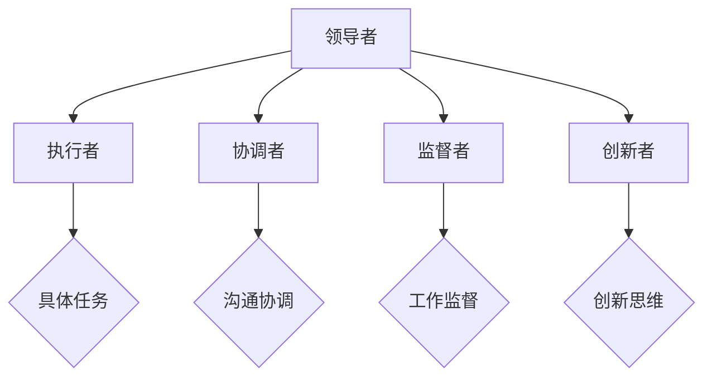
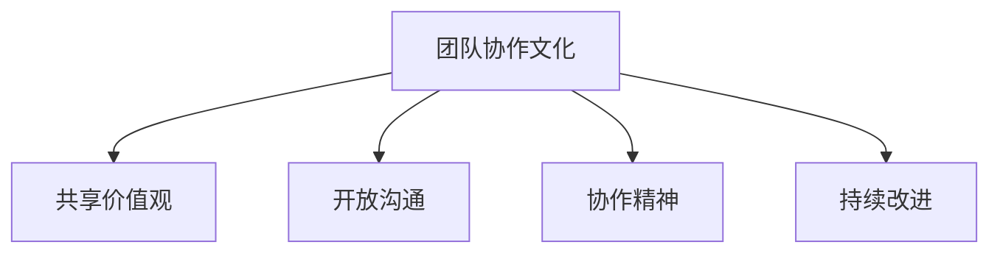
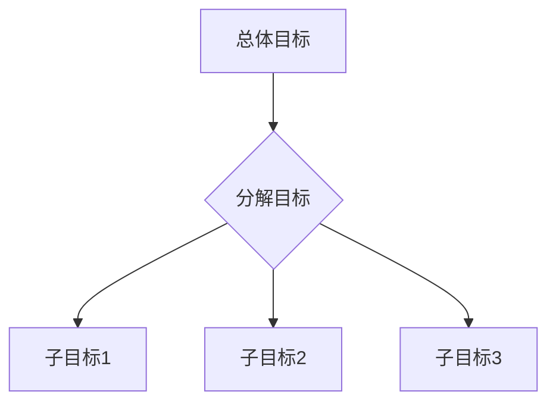
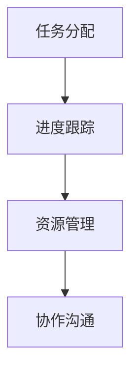
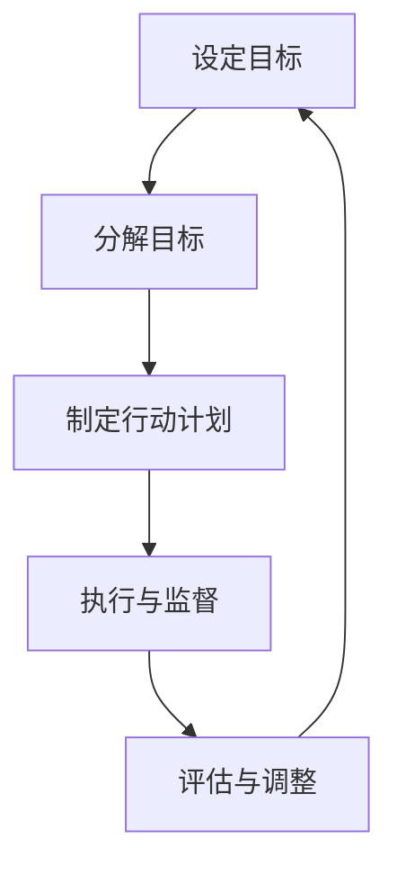

                 

# 团队建设：从个体到整体的蜕变

> 关键词：团队建设、个体协同、高效协作、团队文化、领导力、冲突管理

> 摘要：本文旨在探讨团队建设的过程，从个体到整体的蜕变。我们将分析团队建设的重要性与挑战，详细阐述团队角色与成员特质、团队沟通与协作、团队目标与规划、团队协作文化、团队激励与领导力、团队冲突管理等方面的核心概念和实践策略。通过案例分析与实践，本文将总结团队建设的核心经验，展望未来团队建设的发展趋势，为团队建设提供有价值的思考和建议。

## 目录大纲

### 第一部分：团队建设概述

#### 第1章：团队建设的重要性与挑战  
- 1.1 引言：团队建设的重要性  
- 1.2 团队建设的挑战  
- 1.3 团队建设的核心目标

### 第二部分：从个体到整体

#### 第2章：团队角色与成员特质  
- 2.1 团队角色的定义与分类  
- 2.2 成员特质的识别与培养  
- 2.3 成员特质与团队效能的关系

#### 第3章：团队沟通与协作  
- 3.1 团队沟通的障碍与解决策略  
- 3.2 团队协作的机制与工具  
- 3.3 高效团队沟通与协作的关键

#### 第4章：团队目标与规划  
- 4.1 团队目标的设定与分解  
- 4.2 团队规划的制定与执行  
- 4.3 目标管理与团队效能提升

### 第三部分：团队协作与文化建设

#### 第5章：团队协作文化  
- 5.1 团队协作文化的概念与内涵  
- 5.2 塑造积极的团队协作文化  
- 5.3 文化冲突与解决策略

#### 第6章：团队激励与领导力  
- 6.1 团队激励的重要性  
- 6.2 领导力的定义与类型  
- 6.3 团队领导力提升策略

#### 第7章：团队冲突管理  
- 7.1 团队冲突的识别与分类  
- 7.2 团队冲突的处理与解决  
- 7.3 高效团队冲突管理策略

### 第四部分：案例分析与实践

#### 第8章：成功团队案例分析  
- 8.1 案例一：高效团队的成功要素  
- 8.2 案例二：团队文化塑造与实践  
- 8.3 案例三：领导力在团队建设中的作用

#### 第9章：团队建设实践与应用  
- 9.1 实践一：团队建设工作坊  
- 9.2 实践二：团队协作工具使用  
- 9.3 实践三：团队目标管理策略

#### 第10章：总结与展望  
- 10.1 团队建设的核心经验  
- 10.2 未来团队建设的趋势  
- 10.3 对团队建设工作的思考与建议

---

## 引言

在现代社会中，团队建设已经成为企业成功的关键因素。一个高效的团队不仅能够提高工作效率，还能够促进团队成员的个人成长。然而，团队建设并非一蹴而就，而是需要经过一系列的步骤和策略。本文将详细探讨团队建设的核心概念、策略和实践，帮助读者深入了解团队建设的过程，从个体到整体的蜕变。

### 团队建设的重要性

团队建设对企业和个人都有着重要的意义。对于企业而言，高效的团队建设能够提高整体的工作效率，降低沟通成本，促进创新和协作。一个成功的团队能够在面对复杂问题时迅速找到解决方案，从而在市场竞争中脱颖而出。对于个人而言，团队建设能够提供良好的职业发展平台，帮助成员提升技能、拓展视野，实现个人价值的最大化。

### 团队建设的挑战

尽管团队建设的重要性不言而喻，但实际操作中却面临诸多挑战。首先，团队内部沟通不畅是一个普遍存在的问题。团队成员来自不同的背景和领域，各自有不同的工作方式和思维方式，导致沟通成本增加，信息传递不畅通。其次，团队协作中的冲突也是一大挑战。团队成员在目标、利益和职责上可能存在分歧，导致协作效率降低。最后，团队目标不一致也是一个困扰团队建设的问题。团队成员的个人目标与团队目标之间可能存在差异，导致团队整体表现不佳。

### 团队建设的核心目标

为了克服团队建设的挑战，实现团队的高效能，团队建设需要明确核心目标。首先，提升团队协作效率是团队建设的首要目标。通过优化沟通机制和协作工具，减少团队成员之间的沟通障碍，提高协作效率。其次，促进团队成员的共同成长也是团队建设的重要目标。通过培训、交流和分享，提升团队成员的技能和知识，增强团队整体的竞争力。最后，实现团队目标的最佳实践是团队建设的终极目标。通过明确团队目标、制定合理规划，确保团队成员共同朝着既定目标努力，实现团队价值最大化。

### 第一部分：团队建设概述

#### 第1章：团队建设的重要性与挑战

## 第1章：团队建设的重要性与挑战

### 1.1 引言：团队建设的重要性

团队建设是企业成功的关键因素，它不仅关系到企业的核心竞争力，还直接影响到员工的工作满意度和职业发展。在一个高效的团队中，成员之间能够互相支持、协作，共同实现团队目标。而团队建设的成功与否，往往决定了企业是否能够在竞争激烈的市场中立于不败之地。

### 团队建设对企业的意义

1. 提高工作效率：团队建设有助于建立高效的工作流程，减少重复劳动，提高整体工作效率。
2. 降低沟通成本：团队建设通过优化沟通机制，降低信息传递中的误解和误差，减少沟通成本。
3. 促进创新：团队建设鼓励成员之间的交流和合作，激发创新思维，提高企业的创新能力。
4. 提升企业竞争力：通过团队建设，企业能够更好地应对市场变化，提高竞争力。

### 团队建设对个人的意义

1. 职业发展：团队建设为个人提供了成长和发展的平台，有助于提升个人技能和职业素养。
2. 人际关系：团队建设有助于建立良好的人际关系，提高团队合作能力。
3. 工作满意度：在一个高效的团队中工作，员工能够感受到归属感和成就感，提高工作满意度。

### 团队建设的挑战

尽管团队建设对企业和个人具有重要意义，但实际操作中却面临诸多挑战。

#### 团队内部沟通障碍

1. 沟通方式不当：团队成员可能使用不同的沟通方式，导致信息传递不畅。
2. 信息传递误差：在信息传递过程中，由于误解和误差，可能导致信息失真。

#### 团队协作中的冲突

1. 目标不一致：团队成员的个人目标与团队目标之间存在差异，导致协作效率降低。
2. 利益冲突：团队成员在资源分配和利益分配上可能存在分歧，影响团队协作。

#### 团队目标不一致

1. 目标不明确：团队目标不够明确，导致团队成员对目标的认知不一致。
2. 目标冲突：团队成员的个人目标与团队目标之间存在冲突，影响团队整体表现。

### 团队建设的核心目标

为了克服团队建设的挑战，实现团队的高效能，团队建设需要明确以下核心目标：

1. 提升团队协作效率：通过优化沟通机制和协作工具，减少团队成员之间的沟通障碍，提高协作效率。
2. 促进团队成员的共同成长：通过培训、交流和分享，提升团队成员的技能和知识，增强团队整体的竞争力。
3. 实现团队目标的最佳实践：通过明确团队目标、制定合理规划，确保团队成员共同朝着既定目标努力，实现团队价值最大化。

### 1.2 团队建设的挑战

尽管团队建设的重要性不言而喻，但在实际操作中，团队建设面临着一系列的挑战。以下是团队建设中常见的一些挑战及其影响：

#### 沟通障碍

团队内部的沟通障碍是团队建设中最常见的问题之一。团队成员可能由于文化、背景、语言等方面的差异，导致信息传递不准确、不及时。这种沟通障碍不仅会增加工作成本，还可能导致团队协作的效率低下。

**影响**：  
- 降低工作效率：由于沟通不畅，团队成员可能无法及时获取所需信息，导致工作延误。
- 增加误解：信息在传递过程中可能被误解或扭曲，导致团队成员对问题的理解不一致。
- 破坏团队信任：沟通障碍可能导致团队成员之间的不信任，影响团队的凝聚力。

#### 协作冲突

团队协作中的冲突是团队建设中的另一个重大挑战。团队成员在目标、职责、利益等方面的不一致，可能导致协作效率低下。

**影响**：  
- 影响团队效能：冲突可能导致团队成员之间的不协作，降低团队的整体效能。
- 破坏团队氛围：持续的冲突可能破坏团队的和谐氛围，影响团队成员的工作积极性。
- 增加离职率：长期存在的冲突可能导致团队成员感到不愉快，增加离职率。

#### 目标不一致

团队目标不一致是团队建设中的一大挑战。当团队成员的个人目标与团队目标不一致时，可能会导致团队协作效率低下。

**影响**：  
- 降低团队效能：团队成员无法为共同的目标努力，导致团队整体表现不佳。
- 影响团队士气：当团队成员无法认同团队目标时，可能影响团队的士气和工作积极性。
- 增加内部竞争：个人目标与团队目标不一致可能导致内部竞争，降低团队的整体协作水平。

#### 团队角色模糊

团队角色模糊是团队建设中常见的另一个问题。当团队成员的角色界定不清晰时，可能会导致职责重叠或职责缺失。

**影响**：  
- 影响团队协作：团队成员不清楚自己的职责和任务，可能导致工作重复或工作疏漏。
- 增加工作压力：职责模糊可能导致团队成员需要承担额外的工作量，增加工作压力。
- 降低工作效率：职责模糊可能导致团队成员无法专注于核心任务，降低工作效率。

#### 缺乏激励机制

团队建设中的另一个挑战是缺乏有效的激励机制。当团队成员感到自己的努力没有得到认可或奖励时，可能会降低工作积极性。

**影响**：  
- 降低工作积极性：缺乏激励可能导致团队成员对工作失去兴趣，降低工作积极性。
- 影响团队士气：缺乏激励可能导致团队士气低落，影响团队的凝聚力。
- 增加离职率：缺乏激励可能导致优秀人才流失，增加离职率。

### 1.3 团队建设的核心目标

为了克服团队建设中的挑战，实现团队的高效能，团队建设需要明确以下核心目标：

1. **提升团队协作效率**：通过优化沟通机制和协作工具，减少团队成员之间的沟通障碍，提高协作效率。具体策略包括建立有效的沟通渠道、使用协作工具、制定明确的沟通规范等。

2. **促进团队成员的共同成长**：通过培训、交流和分享，提升团队成员的技能和知识，增强团队整体的竞争力。具体策略包括定期组织培训、开展知识分享会、鼓励团队成员参与外部培训等。

3. **实现团队目标的最佳实践**：通过明确团队目标、制定合理规划，确保团队成员共同朝着既定目标努力，实现团队价值最大化。具体策略包括设定SMART目标、制定详细的实施计划、定期评估和调整目标等。

4. **建立积极的团队文化**：通过塑造积极向上的团队文化，增强团队的凝聚力，提高团队成员的工作满意度。具体策略包括建立团队价值观、鼓励团队协作、奖励优秀团队成员等。

5. **有效管理团队冲突**：通过识别和解决团队冲突，确保团队内部的和谐与稳定。具体策略包括建立冲突解决机制、开展冲突管理培训、鼓励团队成员开放沟通等。

通过实现这些核心目标，团队建设将能够有效克服挑战，实现从个体到整体的蜕变，提升团队的整体效能。

### 第二部分：从个体到整体

#### 第2章：团队角色与成员特质

## 第2章：团队角色与成员特质

### 2.1 团队角色的定义与分类

在团队建设中，明确每个成员的角色至关重要。团队角色是指每个成员在团队中的职责和作用。不同的团队角色有助于团队任务的完成和目标的实现。

#### 团队角色的分类

1. **领导者**：负责团队的总体规划和方向，指导团队成员的工作，协调团队内外部资源。
2. **执行者**：负责具体任务的执行，确保团队计划的实施。
3. **协调者**：负责团队内部的沟通和协作，确保团队成员之间的工作协调。
4. **监督者**：负责对团队工作进行监督和评估，确保工作质量和进度。
5. **创新者**：负责推动团队的创新和改进，提出新的想法和解决方案。

#### 团队角色在团队效能中的作用

1. **明确职责**：明确每个成员的角色有助于避免职责重叠和缺失，提高工作效率。
2. **提高协作效率**：不同角色的成员各自发挥专业特长，协同工作，提高团队整体效能。
3. **促进团队发展**：通过角色的明确和优化，团队能够不断发展和进步。

### 2.2 成员特质的识别与培养

团队成员的特质对团队效能有着重要的影响。识别和培养成员的特质有助于提升团队整体表现。

#### 成员特质的识别

1. **沟通能力**：成员之间的有效沟通是团队协作的关键。高沟通能力的成员能够清晰表达自己的想法，倾听他人的意见，促进团队的沟通。
2. **团队合作精神**：具有团队合作精神的成员能够积极配合其他成员，共同完成任务，提高团队凝聚力。
3. **责任心**：具有强烈责任心的成员能够认真履行自己的职责，确保工作质量。
4. **创新能力**：具有创新能力的成员能够为团队带来新的思路和解决方案，推动团队发展。

#### 成员特质的培养

1. **培训与指导**：通过定期的培训和指导，提升成员的技能和知识，培养其特质。
2. **鼓励交流与分享**：鼓励团队成员之间的交流和分享，促进相互学习和成长。
3. **激励与奖励**：通过激励和奖励，鼓励成员发挥自己的特质，提高团队整体效能。

### 2.3 成员特质与团队效能的关系

成员特质与团队效能之间存在密切的关系。以下是几种关键成员特质对团队效能的影响：

1. **沟通能力**：良好的沟通能力有助于团队成员之间建立信任和共识，提高团队协作效率。
2. **团队合作精神**：团队合作精神能够促进团队成员之间的合作，降低冲突，提高团队整体效能。
3. **责任心**：强烈的责任心能够确保团队成员认真履行自己的职责，提高工作质量和进度。
4. **创新能力**：创新能力能够推动团队不断进步，提高团队竞争力。

通过识别和培养成员的特质，团队能够更好地发挥每个成员的优势，提高整体效能。在团队建设过程中，领导者需要关注成员的特质，合理分配任务，激发成员的潜力，从而实现从个体到整体的蜕变。

### 团队沟通与协作

#### 第3章：团队沟通与协作

## 第3章：团队沟通与协作

### 3.1 团队沟通的障碍与解决策略

在团队工作中，沟通是确保任务顺利进行的重要环节。然而，团队沟通并不总是一帆风顺，常常会遇到各种障碍。以下是一些常见的团队沟通障碍以及相应的解决策略：

#### 常见的团队沟通障碍

1. **信息不对称**：团队成员可能因为分工不同，导致对项目或任务的了解程度不一致，从而产生信息不对称。
   - **解决策略**：定期召开团队会议，确保所有成员对项目进展有相同的了解。

2. **语言障碍**：团队成员可能来自不同的语言背景，导致沟通困难。
   - **解决策略**：使用简洁明了的语言，必要时可借助翻译工具或专业翻译人员进行沟通。

3. **文化差异**：团队成员可能来自不同的文化背景，导致沟通方式和行为习惯的差异。
   - **解决策略**：了解和尊重不同文化的沟通习惯，通过培训和交流增进相互理解。

4. **个人性格差异**：团队成员的性格和沟通风格不同，可能导致沟通不畅。
   - **解决策略**：鼓励团队成员进行开放和坦诚的沟通，培养团队成员的包容性。

5. **技术工具限制**：使用不合适的沟通工具或技术，可能导致信息传递不及时或不准确。
   - **解决策略**：选择适合团队需求的沟通工具，如即时通讯软件、视频会议系统等。

#### 沟通障碍的解决策略

1. **建立明确的沟通目标**：在沟通前明确沟通的目标和目的，确保所有成员都清楚要传达的信息。
   - **示例**：在会议开始时，主持人可以简要介绍会议议程和目标，确保与会者了解会议的重点。

2. **使用简洁明了的语言**：避免使用复杂的专业术语或模糊的表述，确保信息传递清晰明了。
   - **示例**：在撰写邮件或报告时，可以使用简单的语言和图表，帮助读者更好地理解。

3. **定期反馈与确认**：在沟通后进行反馈和确认，确保信息已经被正确理解和执行。
   - **示例**：在会议结束后，可以要求每位成员总结会议内容，并确认自己理解无误。

4. **建立开放的沟通环境**：鼓励团队成员提出问题、分享意见，建立开放的沟通氛围。
   - **示例**：在团队中设立“开放日”或“反馈时间”，让成员自由发表意见和疑问。

5. **培训与指导**：定期为团队成员提供沟通技巧的培训，提高他们的沟通能力。
   - **示例**：可以邀请专业的沟通培训师进行讲座或工作坊，帮助成员提升沟通技巧。

### 3.2 团队协作的机制与工具

团队协作的机制和工具是确保团队成员高效协作的重要保障。以下介绍几种常用的团队协作机制和工具：

#### 团队协作的机制

1. **任务分工**：明确每个成员的任务和职责，确保团队成员各司其职。
   - **示例**：在项目启动时，团队负责人可以将任务分解成小任务，并分配给适合的成员。

2. **定期会议**：定期召开会议，讨论项目进展、解决问题和分配任务。
   - **示例**：每周召开一次项目进度会议，确保团队成员对项目进展有清晰的了解。

3. **反馈机制**：建立反馈机制，及时获取团队成员的意见和建议，改进工作流程。
   - **示例**：在项目结束后，可以组织一次反馈会议，收集成员的建议和意见。

4. **目标管理**：明确团队目标，确保团队成员共同朝着目标努力。
   - **示例**：制定团队目标，并将其分解为可执行的任务和里程碑。

#### 团队协作的工具

1. **即时通讯工具**：如Slack、Microsoft Teams等，方便团队成员实时沟通和协作。
   - **示例**：团队成员可以通过即时通讯工具分享信息、讨论问题和协作处理任务。

2. **项目管理工具**：如Trello、Asana等，帮助团队规划任务、跟踪进度和分配资源。
   - **示例**：团队成员可以在项目管理工具中创建任务卡片、设置截止日期和分配责任人。

3. **文档协作工具**：如Google Docs、Notion等，方便团队成员实时编辑和共享文档。
   - **示例**：团队成员可以在文档协作工具中共享项目文档、编写报告和讨论设计方案。

4. **视频会议工具**：如Zoom、Microsoft Teams等，方便团队成员进行远程会议和协作。
   - **示例**：团队成员可以通过视频会议工具进行项目讨论、团队培训和团队建设活动。

### 3.3 高效团队沟通与协作的关键

要实现高效团队沟通与协作，需要关注以下几个方面：

1. **明确的目标和任务**：确保团队成员对目标和任务有清晰的认识，避免目标不一致或任务分配不清。
   - **示例**：在项目启动时，明确项目目标和任务，并将其分解为具体的可执行任务。

2. **良好的沟通习惯**：培养良好的沟通习惯，如主动沟通、及时反馈和开放提问。
   - **示例**：团队成员可以定期召开会议，讨论项目进展和问题，确保沟通顺畅。

3. **协作工具的有效使用**：合理选择和利用协作工具，提高团队协作效率。
   - **示例**：根据团队需求选择合适的协作工具，如即时通讯、项目管理、文档协作等。

4. **积极的团队氛围**：营造积极的团队氛围，鼓励团队成员相互支持和合作。
   - **示例**：通过团队建设活动、庆祝成功和认可优秀成员，增强团队的凝聚力。

5. **持续改进**：不断评估和改进团队沟通与协作的机制和工具，提高团队效能。
   - **示例**：定期收集团队成员的反馈和建议，优化团队协作流程。

通过关注这些关键点，团队可以实现高效沟通与协作，提高整体效能，从而实现从个体到整体的蜕变。

### 团队目标与规划

#### 第4章：团队目标与规划

## 第4章：团队目标与规划

### 4.1 团队目标的设定与分解

团队目标的设定是团队建设过程中的关键步骤。明确的目标有助于团队集中精力、统一行动，提高工作效率和达成预期成果。以下是设定团队目标的一些方法和原则：

#### 设定团队目标的方法

1. **SMART原则**：SMART是具体（Specific）、明确（Measurable）、可实现（Achievable）、相关（Relevant）和时限（Time-bound）的首字母缩写。使用SMART原则设定目标，有助于确保目标具有可操作性和实现性。

   - **示例**：设定一个具体的目标，如“在本季度内提高产品的市场占有率10%”。

2. **团队参与**：鼓励团队成员参与目标的设定过程，确保目标的认同感和实现意愿。团队成员对目标的参与度越高，对目标的认同感也越强。

   - **示例**：在设定目标时，可以组织团队成员进行讨论，共同确定目标。

3. **目标分解**：将整体目标分解为具体的子目标和里程碑，有助于明确每个阶段的任务和责任。

   - **示例**：将“提高产品市场占有率10%”分解为具体的销售目标、市场推广活动和客户满意度提升计划。

#### 团队目标的分解

1. **关键结果指标（KPI）**：将目标分解为可量化的关键结果指标，有助于评估团队进展和效果。

   - **示例**：将“提高产品市场占有率10%”分解为“增加500名新客户”和“提高现有客户满意度至90%”。

2. **责任分配**：明确每个团队成员在目标实现过程中的责任和任务，确保任务落实到位。

   - **示例**：将“增加500名新客户”分配给销售团队，将“提高现有客户满意度至90%”分配给客户服务团队。

3. **里程碑设置**：设定阶段性里程碑，确保团队在实现目标过程中能够及时调整策略和资源。

   - **示例**：将目标实现过程分为“第一季度”、“第二季度”和“第三季度”三个阶段，每个阶段设定具体的里程碑和任务。

### 4.2 团队规划的制定与执行

团队规划是实现团队目标的详细蓝图。通过制定合理、可行的团队规划，团队可以更好地分配资源、明确责任和确保目标实现。

#### 团队规划的制定

1. **资源评估**：评估团队现有的资源和需求，包括人力、资金、技术和时间等。

   - **示例**：根据团队目标，评估需要增加的团队成员、预算和培训资源。

2. **任务分配**：根据团队目标和资源评估，将任务分配给合适的团队成员。

   - **示例**：将项目开发任务分配给技术团队，将市场推广任务分配给市场团队。

3. **时间规划**：为每个任务设定合理的截止日期和里程碑，确保任务按时完成。

   - **示例**：将项目开发任务分为“需求分析”、“设计”、“编码”和“测试”四个阶段，每个阶段设定具体的截止日期。

#### 团队规划的执行

1. **监督与反馈**：定期监督团队进度，确保任务按照规划执行。同时，及时提供反馈和指导，解决执行过程中遇到的问题。

   - **示例**：每周召开一次团队进度会议，讨论任务进展和问题，提供必要的支持和指导。

2. **资源调配**：根据任务进展和实际情况，及时调整资源和策略，确保团队能够应对突发情况和变化。

   - **示例**：如果项目开发阶段遇到技术难题，可以增加技术支持人员或调整开发计划。

3. **风险管理**：识别潜在的风险和挑战，制定相应的应对策略和预案，确保团队能够应对各种不确定因素。

   - **示例**：制定应对市场变化和竞争对手的策略，确保团队在竞争激烈的市场环境中保持竞争力。

### 4.3 目标管理与团队效能提升

目标管理是团队建设中的一项重要工作，它有助于确保团队目标的实现和效能提升。以下是目标管理的实施方法和提升策略：

#### 目标管理的实施方法

1. **设定明确的目标**：确保团队目标具体、明确、可衡量。

   - **示例**：使用SMART原则设定具体的目标，如“在本季度内提高产品销售额20%”。

2. **制定详细的计划**：为每个目标制定详细的行动计划和执行步骤。

   - **示例**：将目标分解为具体的子目标和任务，并为每个任务设定时间表和责任人。

3. **定期评估与反馈**：定期评估团队目标的实现情况，提供反馈和指导。

   - **示例**：每月召开一次目标评估会议，讨论目标进展和问题，调整计划。

#### 提升团队效能的策略

1. **优化团队结构**：根据团队目标和任务需求，优化团队结构和职责分配。

   - **示例**：增加或调整团队成员，确保团队能够高效完成工作任务。

2. **提升团队成员能力**：通过培训和发展计划，提升团队成员的专业技能和工作能力。

   - **示例**：组织技能培训和工作坊，帮助团队成员提升技能。

3. **建立激励机制**：制定合理的激励机制，鼓励团队成员为实现团队目标而努力。

   - **示例**：设立绩效奖金、晋升机会等激励措施。

4. **增强团队凝聚力**：通过团队建设活动和团队文化，增强团队的凝聚力和协作精神。

   - **示例**：定期组织团建活动，促进团队成员之间的交流和合作。

通过设定明确的目标、制定详细的计划、定期评估与反馈，以及优化团队结构、提升团队成员能力和建立激励机制，团队可以更好地实现目标，提升整体效能。

### 第三部分：团队协作与文化建设

#### 第5章：团队协作文化

## 第5章：团队协作文化

### 5.1 团队协作文化的概念与内涵

团队协作文化是指在团队内部形成的一种共同的价值观和行为准则，它影响着团队成员之间的沟通、协作和合作。团队协作文化的核心在于通过共同的价值观和行为准则，促进团队成员之间的有效沟通和协作，从而提高团队的整体效能。

#### 团队协作文化的内涵

1. **共享价值观**：团队协作文化强调团队成员共同认同的价值观，如诚信、尊重、合作和卓越。这些价值观是团队协作的基础，有助于团队成员在行动上保持一致。

2. **开放沟通**：团队协作文化鼓励团队成员之间的开放和坦诚沟通，无论是正面还是负面的信息，都应被鼓励和接受。这种沟通环境有助于提高团队决策质量和问题解决效率。

3. **协作精神**：团队协作文化强调团队成员之间的协作精神，鼓励团队成员相互支持和合作，共同面对挑战和解决问题。这种精神有助于提高团队的凝聚力和战斗力。

4. **持续改进**：团队协作文化鼓励团队成员不断学习和改进，以适应不断变化的环境和需求。这种文化氛围有助于团队的持续发展和成长。

#### 团队协作文化的重要性

1. **提高团队效能**：团队协作文化能够促进团队成员之间的有效沟通和协作，提高团队的整体效能。通过共同的价值观和行为准则，团队成员能够更好地协调工作，减少冲突和误解，提高工作效率。

2. **增强团队凝聚力**：团队协作文化能够增强团队成员之间的信任和归属感，提高团队的凝聚力。在这种文化氛围中，团队成员愿意为团队的整体利益而努力，共同面对挑战和解决问题。

3. **促进个人成长**：团队协作文化鼓励团队成员之间的相互学习和分享，促进个人成长。团队成员可以在团队中不断积累经验和知识，提升自己的能力和职业素养。

### 5.2 塑造积极的团队协作文化

要塑造积极的团队协作文化，团队领导者需要采取一系列策略和措施，营造一个有利于沟通和协作的工作环境。

#### 塑造团队协作文化的策略

1. **建立共同价值观**：团队领导者应与团队成员共同确立团队的核心价值观，并确保这些价值观被广泛传播和认同。

   - **示例**：通过团队会议、培训和工作坊等形式，向团队成员传达团队的价值观，并鼓励他们在工作中践行。

2. **鼓励开放沟通**：团队领导者应鼓励团队成员之间进行开放和坦诚的沟通，建立信任和尊重的基础。

   - **示例**：定期召开团队会议，鼓励团队成员提出问题和意见，确保沟通渠道的畅通。

3. **提供培训和支持**：团队领导者应提供必要的培训和支持，帮助团队成员提升沟通和协作能力。

   - **示例**：组织沟通技巧培训、团队建设活动和协作工具的使用培训，提高团队成员的协作水平。

4. **奖励优秀协作行为**：团队领导者应通过奖励机制，鼓励团队成员积极参与协作，表彰优秀的协作行为。

   - **示例**：设立团队协作奖项，对在团队协作中表现出色的成员进行表彰和奖励。

#### 塑造团队协作文化的措施

1. **建立协作机制**：团队领导者应建立有效的协作机制，确保团队成员能够高效地协同工作。

   - **示例**：制定明确的任务分工和责任制度，使用协作工具如项目管理软件和即时通讯工具，提高团队协作效率。

2. **促进知识分享**：团队领导者应鼓励团队成员之间的知识分享，促进团队整体知识的积累和传承。

   - **示例**：定期组织知识分享会，邀请团队成员分享自己的经验和心得，提高团队的整体知识水平。

3. **加强团队凝聚力**：团队领导者应通过团队建设活动，加强团队成员之间的凝聚力和归属感。

   - **示例**：组织团建活动、团队旅行和团队聚餐等，增强团队成员之间的交流和互动。

4. **建立反馈机制**：团队领导者应建立有效的反馈机制，及时收集团队成员的意见和建议，不断改进团队协作文化。

   - **示例**：设立反馈渠道，如团队意见箱、匿名反馈表等，鼓励团队成员提出改进建议。

通过采取上述策略和措施，团队领导者可以有效地塑造积极的团队协作文化，提高团队的协作效能和整体绩效。

### 5.3 文化冲突与解决策略

在团队协作过程中，文化冲突是一个常见的问题。文化冲突可能源于团队成员的背景、价值观、行为习惯等方面的差异。有效的文化冲突管理策略有助于化解冲突，促进团队和谐发展。

#### 文化冲突的类型

1. **价值观冲突**：团队成员可能因价值观的不同，导致在工作方式、决策标准等方面产生分歧。

   - **示例**：一位成员可能重视结果，另一位成员可能更注重过程。

2. **行为习惯冲突**：团队成员可能因行为习惯的不同，导致工作风格和沟通方式上的冲突。

   - **示例**：一位成员喜欢面对面交流，另一位成员更喜欢通过邮件沟通。

3. **背景差异冲突**：团队成员可能因背景差异，如文化、地域、教育背景等，导致对问题的看法和处理方式的不同。

   - **示例**：一位成员可能习惯于西方的管理方式，另一位成员可能更熟悉东方的管理文化。

#### 解决文化冲突的策略

1. **尊重与理解**：尊重团队成员的差异，理解他们的观点和行为。通过相互尊重和理解，减少文化冲突的发生。

   - **示例**：在团队会议中，鼓励团队成员发表不同意见，并认真倾听彼此的观点。

2. **沟通与交流**：加强团队成员之间的沟通与交流，促进相互了解和信任。通过有效的沟通，化解文化冲突。

   - **示例**：定期组织跨部门交流活动，促进团队成员之间的了解和合作。

3. **建立共同价值观**：通过建立共同的价值观和行为准则，减少文化冲突。共同的价值观有助于团队成员在行动上保持一致。

   - **示例**：制定团队章程，明确团队的共同目标和价值观。

4. **培训与教育**：提供跨文化培训和教育，提高团队成员对文化差异的认识和敏感度。通过培训，帮助团队成员更好地理解和适应不同的文化。

   - **示例**：组织跨文化培训课程，介绍不同文化的行为规范和沟通方式。

5. **建立反馈机制**：建立有效的反馈机制，鼓励团队成员提出意见和建议。通过反馈，及时解决文化冲突。

   - **示例**：设立团队意见箱，鼓励团队成员匿名提出问题和建议。

通过上述策略，团队可以有效解决文化冲突，促进团队成员之间的和谐与合作，提高团队的整体效能。

### 第三部分：团队协作与文化建设

#### 第6章：团队激励与领导力

## 第6章：团队激励与领导力

### 6.1 团队激励的重要性

团队激励是提升团队绩效和保持团队活力的重要手段。有效的激励机制能够激发团队成员的积极性和创造力，促进团队成员的共同努力，从而实现团队的目标。以下是团队激励的重要性及其在团队建设中的应用：

#### 团队激励的重要性

1. **提高工作效率**：通过激励，团队成员能够更加专注和投入工作，提高工作效率和产出。

   - **示例**：设置合理的绩效目标和奖励机制，鼓励团队成员为实现目标而努力。

2. **促进团队合作**：有效的激励机制能够增强团队成员之间的协作精神和信任，促进团队合作。

   - **示例**：通过团队奖励，鼓励团队成员共同完成任务，提升团队凝聚力。

3. **激发创新思维**：激励措施能够激发团队成员的创新思维，推动团队不断进步和发展。

   - **示例**：设立创新奖项，鼓励团队成员提出新的想法和解决方案。

4. **提升员工满意度**：激励措施能够提高员工的工作满意度，减少离职率，保持团队的稳定性。

   - **示例**：通过提供有竞争力的薪酬和福利，以及职业发展机会，提高员工的工作满意度。

#### 团队激励的应用

1. **绩效奖励**：通过设定绩效目标和奖励机制，对达成目标或超额完成的团队成员进行奖励。

   - **示例**：定期评选“最佳员工”或“优秀团队”，给予奖金、晋升机会或其他奖励。

2. **认可与表彰**：通过公开认可和表彰团队成员的成就和贡献，增强他们的荣誉感和成就感。

   - **示例**：在团队会议上表扬优秀成员，或在公司内部刊物上刊登他们的成就。

3. **职业发展机会**：提供职业发展机会，如培训、晋升和调动等，帮助团队成员实现职业成长。

   - **示例**：定期组织培训课程，为团队成员提供提升技能和知识的机会。

4. **工作环境优化**：改善工作环境，提供舒适、安全的工作场所，提升员工的工作体验。

   - **示例**：装修办公环境，提供休闲区、健身房等设施，提升员工的工作满意度。

### 6.2 领导力的定义与类型

领导力是团队领导者通过影响和激励团队成员，引导团队实现目标的能力。有效的领导力能够激发团队成员的潜力，推动团队的发展。以下是领导力的定义与类型：

#### 领导力的定义

领导力是指团队领导者通过影响力、沟通和激励等手段，引导和激励团队成员，实现团队目标的能力。领导力不仅仅是指导和管理，更是一种激励和启发团队成员的过程。

#### 领导力的类型

1. **变革型领导力**：变革型领导力通过激励和启发团队成员，推动团队实现变革和进步。这种领导力强调领导者的愿景和远见，能够激发团队成员的积极性和创造力。

   - **示例**：领导者可以通过讲述愿景故事，激发团队成员的激情和动力。

2. **交易型领导力**：交易型领导力通过明确的目标和奖励机制，激励团队成员为实现团队目标而努力。这种领导力强调绩效和结果，通过奖励和惩罚来引导团队成员。

   - **示例**：领导者可以设定明确的绩效目标，并给予达成目标的团队成员奖励。

3. **服务型领导力**：服务型领导力强调领导者为团队成员提供支持和帮助，以满足团队成员的需求和期望。这种领导力强调领导者的服务意识和关怀。

   - **示例**：领导者可以主动关心团队成员的工作和生活，提供必要的资源和支持。

4. **民主型领导力**：民主型领导力鼓励团队成员参与决策过程，尊重团队成员的意见和决策。这种领导力强调团队协作和民主管理。

   - **示例**：领导者可以定期召开团队会议，邀请团队成员参与讨论和决策。

### 6.3 团队领导力提升策略

为了提升团队领导力，团队领导者需要不断学习和成长，提高自身的领导能力和影响力。以下是提升团队领导力的几种策略：

#### 提升团队领导力的策略

1. **自我反思与成长**：领导者需要定期进行自我反思，识别自身的优势和不足，并不断学习和改进。

   - **示例**：领导者可以定期写反思日记，记录自己的成长和进步。

2. **参与培训和研讨会**：参加领导力培训课程和研讨会，学习最新的领导力和管理理念。

   - **示例**：领导者可以参加领导力工作坊、讲座和研讨会，提升自身的领导能力。

3. **阅读和管理书籍**：阅读相关的管理书籍和案例，学习成功的领导经验和管理策略。

   - **示例**：领导者可以阅读《领导力五要素》、《高效能人士的七个习惯》等经典管理书籍。

4. **建立反馈机制**：建立有效的反馈机制，收集团队成员的意见和建议，及时调整领导方式和策略。

   - **示例**：领导者可以定期召开反馈会议，邀请团队成员分享对领导工作的意见和建议。

5. **实践与反思**：将学到的领导力知识和方法应用到实际工作中，通过实践和反思不断提升领导力。

   - **示例**：领导者可以定期回顾和总结领导工作中的经验教训，不断提升自己的领导能力。

通过以上策略，团队领导者可以不断提升自身的领导力，为团队的发展提供强有力的支持和保障。

### 第三部分：团队协作与文化建设

#### 第7章：团队冲突管理

## 第7章：团队冲突管理

### 7.1 团队冲突的识别与分类

在团队工作中，冲突是不可避免的。有效的团队冲突管理是提高团队效能和保持团队和谐的重要手段。以下是团队冲突的识别与分类：

#### 团队冲突的识别

1. **言语冲突**：团队成员在沟通中因意见不合而产生的言语上的争执。

   - **示例**：团队成员在讨论方案时因对某一问题持不同意见而发生争执。

2. **行为冲突**：团队成员在工作行为上的对立和对抗。

   - **示例**：团队成员在执行任务时因工作方法不同而产生摩擦。

3. **心理冲突**：团队成员在情感和心理上的对立和抵触。

   - **示例**：团队成员在团队合作中因缺乏信任而产生消极情绪。

#### 团队冲突的分类

1. **功能性冲突**：对团队工作有积极影响的冲突，通常发生在团队成员对问题有不同见解时。

   - **示例**：团队成员就项目方案进行激烈讨论，最终形成更优的方案。

2. **破坏性冲突**：对团队工作有消极影响的冲突，通常发生在团队成员因个人利益或情感问题而产生的对立。

   - **示例**：团队成员因个人利益冲突导致项目进度延误。

3. **建设性冲突**：通过有效沟通和解决，能够促进团队进步的冲突。

   - **示例**：团队成员在讨论中提出建设性意见，改进项目实施方案。

4. **破坏性冲突**：通过有效沟通和解决，无法消除的冲突，可能对团队产生负面影响。

   - **示例**：团队成员因文化差异导致的长期对立，无法通过简单沟通解决。

### 7.2 团队冲突的处理与解决

处理和解决团队冲突是团队领导者的重要任务。以下是一些有效的团队冲突处理与解决策略：

#### 处理团队冲突的策略

1. **主动倾听**：在冲突发生时，领导者应主动倾听双方的意见，了解冲突的根源。

   - **示例**：在团队成员发生争执时，领导者可以邀请双方进行对话，倾听他们的观点。

2. **中立调解**：在冲突中保持中立，不偏袒任何一方，帮助双方找到共识。

   - **示例**：领导者可以充当调解者，提出中立的解决方案，促进双方达成共识。

3. **透明沟通**：保持沟通的透明度，让所有团队成员都能了解冲突的进展和解决方案。

   - **示例**：领导者可以在团队会议上公开讨论冲突，确保团队成员都能参与。

4. **建立规则**：制定团队冲突管理规则，明确冲突解决程序和责任人。

   - **示例**：制定《团队冲突处理手册》，规定冲突解决的步骤和流程。

5. **提供培训**：为团队成员提供冲突管理和沟通技巧培训，提高他们的冲突解决能力。

   - **示例**：定期组织冲突管理培训，帮助团队成员掌握有效的沟通和解决策略。

#### 解决团队冲突的方法

1. **合作解决问题**：鼓励团队成员共同分析问题，寻找双赢的解决方案。

   - **示例**：在团队冲突中，领导者可以引导团队成员一起讨论，寻找解决问题的方法。

2. **妥协和让步**：在无法找到完全满意的解决方案时，鼓励团队成员做出妥协和让步。

   - **示例**：领导者可以提出折中方案，让双方都能接受。

3. **转移焦点**：引导团队成员将注意力转移到共同目标和团队利益上，避免冲突升级。

   - **示例**：领导者可以提醒团队成员，冲突解决后的目标更重要。

4. **求助第三方**：在团队冲突无法解决时，可以寻求第三方专家的帮助，进行调解和仲裁。

   - **示例**：领导者可以邀请人力资源专家或外部顾问参与冲突解决。

通过有效的团队冲突处理与解决策略，团队领导者可以降低冲突的负面影响，提升团队整体效能和凝聚力。

### 7.3 高效团队冲突管理策略

为了确保团队冲突管理的有效性，团队领导者需要采取一系列高效策略，以预防和解决冲突，促进团队的和谐与进步。以下是高效团队冲突管理策略：

#### 高效团队冲突管理策略

1. **建立预防机制**：在冲突发生前，采取预防措施，减少冲突的可能性。

   - **示例**：制定明确的团队目标和规则，确保团队成员对工作职责和期望有清晰的认识。

2. **加强沟通**：建立有效的沟通渠道，确保团队成员能够自由表达意见和关切。

   - **示例**：定期召开团队会议，鼓励团队成员分享想法和问题，促进开放和坦诚的沟通。

3. **培养同理心**：提高团队成员的共情能力，理解他人的立场和感受。

   - **示例**：通过培训和工作坊，帮助团队成员培养同理心和解决问题的能力。

4. **提供反馈**：及时给予团队成员反馈，帮助他们认识到问题，并采取措施改进。

   - **示例**：在项目结束后，组织反馈会议，总结经验教训，并提供改进建议。

5. **建立信任**：通过建立信任，减少冲突的发生，增强团队凝聚力。

   - **示例**：通过团队建设和合作项目，增强团队成员之间的信任和合作。

6. **明确责任**：确保每个团队成员都清楚自己的职责和责任，避免职责不清导致的冲突。

   - **示例**：在项目启动时，明确任务分工，确保团队成员明确自己的职责。

7. **定期评估**：定期评估团队冲突管理的有效性，并根据评估结果进行调整和改进。

   - **示例**：每季度或每半年进行团队冲突管理评估，收集团队成员的意见和建议。

8. **培养领导力**：提升团队领导者的冲突管理能力，确保他们能够有效处理冲突。

   - **示例**：为团队领导者提供冲突管理和领导力培训，提高他们的应对能力。

通过采取这些高效团队冲突管理策略，团队领导者可以预防和解决冲突，促进团队的和谐与进步，实现团队目标的最大化。

### 第四部分：案例分析与实践

#### 第8章：成功团队案例分析

## 第8章：成功团队案例分析

### 8.1 案例一：高效团队的成功要素

在本章节中，我们将通过分析一个成功团队的案例，探讨其成功要素，为其他团队提供有益的借鉴。

#### 案例背景

这是一个由10名成员组成的项目团队，负责开发一款创新性的移动应用。该团队在项目周期内，成功完成了多个关键里程碑，并在市场上获得了良好的反响。

#### 成功要素分析

1. **明确的团队目标**：项目开始前，团队明确了具体的目标和期望。这些目标不仅包含了产品功能，还包括了时间表和资源需求。团队成员对目标有清晰的认识，从而能够集中精力达成共同的目标。

2. **有效的沟通机制**：团队建立了多种沟通渠道，包括每日站会、周例会和项目管理工具，确保团队成员能够及时交流和分享信息。这种高效的沟通机制有助于快速解决问题和协同工作。

3. **合适的角色分配**：团队成员根据各自的专业技能和兴趣，被分配到合适的角色。每个成员都有明确的职责，这有助于提高工作效率和避免职责重叠。

4. **积极的团队文化**：团队鼓励开放和坦诚的沟通，团队成员之间建立了信任和尊重。这种积极的团队文化增强了团队的凝聚力，提高了工作效率。

5. **灵活的决策过程**：团队采用了一种灵活的决策过程，鼓励团队成员提出不同的观点和建议。这种开放的态度有助于团队成员参与到决策过程中，提高了决策的质量。

6. **持续的学习与改进**：团队重视团队成员的技能提升和知识积累。定期组织培训和工作坊，帮助团队成员掌握新的技术和方法，从而不断提高团队的整体能力。

7. **有效的激励机制**：团队建立了激励机制，对在项目中表现出色的成员进行奖励。这种激励机制不仅提高了团队成员的工作积极性，还促进了团队成员之间的竞争和合作。

### 8.2 案例二：团队文化塑造与实践

在另一个成功团队的案例中，团队文化扮演了至关重要的角色。以下是团队文化塑造和实践的分析。

#### 案例背景

这是一个由30名成员组成的跨国团队，负责开发和推广一款国际化的电子商务平台。团队在短时间内实现了产品从概念到上市的全过程，取得了显著的市场成功。

#### 团队文化塑造

1. **共同的价值观**：团队确立了以客户为中心的共同价值观，所有团队成员都认同并践行这一价值观。这种共同的价值观促进了团队成员之间的协同工作，提高了客户满意度。

2. **开放的沟通环境**：团队鼓励团队成员在任何时候都能提出自己的想法和意见，无论这些意见是关于产品、流程还是团队文化。这种开放的沟通环境有助于及时发现和解决问题。

3. **团队建设活动**：团队定期组织各种团队建设活动，如团队聚餐、户外拓展训练和团队旅行等。这些活动不仅增强了团队成员之间的互动，还促进了团队凝聚力的提升。

4. **领导者的示范作用**：团队领导者通过自己的行为和决策，树立了良好的榜样。领导者积极参与团队活动，关心团队成员的成长和发展，赢得了团队的信任和尊重。

5. **公平的激励机制**：团队建立了公平的激励机制，对在项目中表现出色的成员进行奖励。这种激励机制不仅提高了团队成员的工作积极性，还促进了团队成员之间的公平竞争。

#### 实践效果

通过团队文化的塑造和实践，该团队取得了显著的成功。团队成员之间的信任和合作精神得到了提升，团队整体的工作效率和创新能力也大幅提高。此外，客户对产品的满意度也显著上升，为团队带来了良好的市场口碑。

### 8.3 案例三：领导力在团队建设中的作用

在第三个成功团队的案例中，领导力在团队建设中发挥了至关重要的作用。以下是领导力在团队建设中的具体表现和作用。

#### 案例背景

这是一个由20名成员组成的研发团队，负责开发一款先进的自动驾驶系统。该团队在短时间内完成了多个关键项目，并在行业内获得了高度评价。

#### 领导力表现

1. **愿景和目标的设定**：团队领导者明确了团队的愿景和目标，并与团队成员共同讨论和制定实现这些目标的具体步骤。这种明确的愿景和目标为团队成员提供了清晰的方向和动力。

2. **激励和鼓舞**：团队领导者通过激励和鼓舞，激发了团队成员的积极性和创造力。领导者不仅关注团队成员的工作表现，还关心他们的个人成长和发展。

3. **沟通和反馈**：团队领导者建立了有效的沟通渠道，确保团队成员能够及时获取项目进展和团队动态。同时，领导者也鼓励团队成员提出意见和建议，并给予及时的反馈。

4. **决策和授权**：团队领导者通过合理的决策和授权，提高了团队的效率和自主性。领导者不仅做出关键决策，还给予团队成员足够的自主权，让他们能够在各自的领域发挥专业特长。

5. **冲突管理和团队建设**：团队领导者有效地管理团队冲突，并通过团队建设活动增强了团队的凝聚力。领导者不仅解决了团队内部的冲突，还通过团队建设活动增强了团队成员之间的信任和合作。

#### 领导力作用

通过领导力的有效发挥，该团队在短时间内取得了显著的成功。团队成员的积极性和创造力得到了大幅提升，团队的整体工作效率和创新能力也得到了显著提高。此外，团队在项目中的表现赢得了客户和行业的高度评价，为团队带来了更多的机会和挑战。

### 总结与启示

通过以上案例分析，我们可以得出以下总结和启示：

1. **明确的团队目标和愿景是团队成功的关键**。团队成员对目标和愿景有清晰的认识，能够更有动力地为实现这些目标而努力。

2. **有效的沟通机制和开放的沟通环境是团队协作的基础**。团队成员能够及时交流和分享信息，有助于快速解决问题和协同工作。

3. **积极的团队文化和领导力的发挥对团队建设至关重要**。通过团队文化的塑造和实践，以及领导力的有效发挥，团队能够建立信任、提高工作效率和创新能力。

4. **合理的激励机制和公平的竞争环境能够激发团队成员的积极性和创造力**。团队成员在公平的环境中竞争，有助于团队整体绩效的提升。

通过借鉴这些成功团队的案例和实践经验，其他团队可以更好地进行团队建设，提高团队的整体效能和竞争力。

### 第四部分：案例分析与实践

#### 第9章：团队建设实践与应用

## 第9章：团队建设实践与应用

### 9.1 实践一：团队建设工作坊

团队建设工作坊是一种有效的团队建设方法，通过一系列的互动活动，促进团队成员之间的沟通与合作，提高团队的凝聚力和协作效率。

#### 实践背景

在一个大型科技公司中，由于团队成员来自不同的背景和文化，团队内部沟通不畅和协作效率低下，导致项目进度受到影响。为了提升团队的协作能力和凝聚力，公司决定组织一次团队建设工作坊。

#### 实践步骤

1. **前期准备**：确定工作坊的目标、时间和地点，邀请团队成员参与。准备工作坊所需的活动材料，如海报、纸牌、便签纸等。

2. **开场活动**：通过互动游戏和破冰活动，打破团队成员之间的隔阂，营造轻松愉快的氛围。例如，可以组织团队成员进行自我介绍和团队介绍，让团队成员相互认识。

3. **团队建设活动**：设计一系列团队建设活动，如团队协作游戏、角色扮演、团队拼图等。这些活动旨在提高团队成员之间的沟通和协作能力，增强团队凝聚力。

4. **讨论与反思**：在活动结束后，组织团队成员进行讨论和反思，分享活动中的体验和感受。通过讨论，团队成员可以互相了解和尊重，找到改进团队协作的方法。

5. **总结与行动计划**：总结工作坊的成果，明确下一步的行动计划。例如，制定团队协作规范、改进沟通方式等，确保工作坊的成果能够得到有效应用。

#### 实践效果

通过团队建设工作坊，团队成员之间的沟通和协作能力得到了显著提升。团队成员在活动中互相了解，建立了信任和合作关系，项目进度得到了有效保障。同时，团队凝聚力也得到了增强，团队成员更加愿意为团队目标而努力。

### 9.2 实践二：团队协作工具使用

团队协作工具的使用是提高团队协作效率和沟通效果的重要手段。以下是几种常用的团队协作工具及其应用方法。

#### 常用团队协作工具

1. **即时通讯工具**：如Slack、Microsoft Teams等，方便团队成员实时沟通和协作。

2. **项目管理工具**：如Trello、Asana等，帮助团队规划任务、跟踪进度和分配资源。

3. **文档协作工具**：如Google Docs、Notion等，方便团队成员实时编辑和共享文档。

4. **视频会议工具**：如Zoom、Microsoft Teams等，方便团队成员进行远程会议和协作。

#### 应用方法

1. **即时通讯工具**：在项目开始时，建立专门的团队聊天频道，用于日常沟通和问题讨论。团队成员可以随时在频道中提问和分享信息，提高沟通效率。

2. **项目管理工具**：将项目任务分解成具体的工作项，并分配给相应的团队成员。团队成员可以在项目管理工具中查看任务进度和截止日期，确保任务按时完成。

3. **文档协作工具**：在项目过程中，使用文档协作工具共同编辑和审阅文档。团队成员可以实时查看文档的修改记录和评论，提高文档协作的效率。

4. **视频会议工具**：定期组织视频会议，讨论项目进展、解决问题和分配任务。视频会议工具的屏幕共享功能可以帮助团队成员实时了解项目进展和问题。

#### 实践效果

通过使用团队协作工具，团队成员之间的沟通和协作效率得到了显著提升。团队成员能够实时获取信息和任务进度，减少了沟通成本和误解。同时，团队协作工具也为团队成员提供了方便的文档编辑和共享平台，提高了文档协作的效率。通过这些工具的应用，团队在项目中的协作效果得到了显著改善。

### 9.3 实践三：团队目标管理策略

团队目标管理是团队建设中的一项重要工作，通过设定明确的目标、制定合理的规划和有效的执行策略，确保团队目标的实现。以下是团队目标管理的策略和实践。

#### 目标管理策略

1. **设定明确的目标**：使用SMART原则（具体、明确、可实现、相关、时限）设定团队目标。确保目标是具体、可衡量的，并且与团队的使命和愿景一致。

2. **分解目标**：将总体目标分解为具体的子目标和里程碑，明确每个子目标和里程碑的具体任务和责任人。

3. **制定行动计划**：为每个子目标和里程碑制定详细的行动计划，包括任务、时间表和资源需求。

4. **定期评估和调整**：定期评估目标的进展情况，根据实际情况调整目标和行动计划，确保目标的实现。

#### 实践步骤

1. **确定目标**：召开团队会议，讨论并确定团队的目标。确保所有团队成员对目标有清晰的认识和理解。

2. **分解目标**：将总体目标分解为具体的子目标和里程碑，明确每个子目标和里程碑的具体任务和责任人。

3. **制定行动计划**：为每个子目标和里程碑制定详细的行动计划，包括任务、时间表和资源需求。确保每个任务都有明确的责任人和截止日期。

4. **执行和监督**：按照行动计划执行任务，定期检查任务进度，确保任务按时完成。同时，监督团队成员的工作，提供必要的支持和帮助。

5. **评估和调整**：在目标实现过程中，定期评估目标的进展情况，根据实际情况调整目标和行动计划。确保目标能够得到有效实现。

#### 实践效果

通过有效的团队目标管理策略，团队在项目中的协作效率和目标实现率得到了显著提升。团队成员能够更加清晰地了解自己的任务和责任，减少了目标不明确和任务重复的情况。同时，通过定期的评估和调整，团队能够及时发现问题并采取改进措施，确保目标的实现。通过实践团队目标管理策略，团队的整体绩效得到了显著提高。

### 第四部分：案例分析与实践

#### 第10章：总结与展望

## 第10章：总结与展望

### 10.1 团队建设的核心经验

通过前文的详细探讨和案例分析，我们可以总结出团队建设的核心经验：

1. **明确的目标和愿景**：一个高效的团队需要明确的目标和愿景，这有助于团队成员团结一致，共同为实现目标而努力。

2. **良好的沟通机制**：有效的沟通机制是团队协作的基础，通过开放、透明的沟通，可以减少误解和冲突，提高协作效率。

3. **积极的团队文化**：团队文化对于团队效能具有重要影响。建立以信任、尊重和合作为核心的团队文化，可以增强团队的凝聚力，提高工作效率。

4. **合适的角色分配**：根据团队成员的技能和兴趣进行合理的角色分配，确保每个成员都能在其擅长的领域发挥作用。

5. **有效的激励和领导力**：通过合理的激励机制和有效的领导力，可以激发团队成员的积极性和创造力，推动团队不断进步。

6. **冲突管理**：团队冲突是不可避免的，但有效的冲突管理可以减少负面影响，提高团队的整体效能。

### 10.2 未来团队建设的趋势

随着技术的不断进步和组织结构的变化，未来团队建设也将呈现出以下趋势：

1. **远程工作和虚拟团队**：随着远程办公和虚拟团队的普及，团队建设将更加注重远程协作工具和技术的应用，提高团队远程协作的效率。

2. **敏捷管理和灵活工作方式**：敏捷管理和灵活工作方式的兴起，将使团队更加注重自我管理、快速响应和持续改进。

3. **个性化和定制化**：团队建设将更加注重个性化和定制化，根据团队的特点和需求，采取不同的策略和方法，实现最佳效果。

4. **跨职能团队合作**：随着业务复杂度的增加，跨职能团队合作将成为团队建设的重要趋势。通过跨职能团队合作，可以充分利用不同领域的专业知识，提高团队的整体效能。

### 10.3 对团队建设工作的思考与建议

为了更好地进行团队建设，以下是一些建议：

1. **重视团队目标**：确保团队目标明确、具体和可实现，定期与团队成员沟通目标进展，确保目标的实现。

2. **建立有效的沟通机制**：定期召开团队会议，确保团队成员之间的沟通畅通。使用适当的沟通工具，如即时通讯软件、项目管理工具等，提高沟通效率。

3. **培养团队文化**：通过团队建设活动、培训和文化活动，培养积极向上的团队文化，增强团队凝聚力。

4. **合理分配角色**：根据团队成员的技能和兴趣，合理分配角色和任务，确保每个成员都能在其擅长的领域发挥作用。

5. **激励和认可**：通过合理的激励机制和认可，激发团队成员的积极性和创造力，推动团队不断进步。

6. **持续改进**：定期评估团队建设的效果，根据反馈和实际情况，调整团队建设的策略和方法，实现持续改进。

通过上述思考和建议，团队领导者可以更好地进行团队建设，提高团队的整体效能，实现团队目标的最大化。

## 总结

本文《团队建设：从个体到整体的蜕变》深入探讨了团队建设的核心概念、策略和实践。从团队建设的重要性与挑战，到从个体到整体的角色与特质，再到沟通与协作、目标与规划、文化建设、激励与领导力、冲突管理，本文系统地阐述了团队建设的方方面面。通过案例分析与实践，本文总结出了团队建设的核心经验，并展望了未来团队建设的发展趋势。希望本文能为广大团队领导者和管理者提供有价值的参考和启示，助力团队实现从个体到整体的蜕变，提升团队的整体效能。

## 作者信息

作者：AI天才研究院/AI Genius Institute & 禅与计算机程序设计艺术 /Zen And The Art of Computer Programming

### 附录

以下是本文中提到的几个重要的技术图表和公式：

#### 团队角色分类Mermaid流程图

#### 团员特质对比表格
| 特质 | 说明 |
| ---- | ---- |
| 沟通能力 | 高效传达信息的能力 |
| 团队合作精神 | 积极配合团队成员 |
| 责任心 | 对工作认真负责 |
| 创新能力 | 提出新思路和解决方案 |

#### 团队协作文化概念与内涵Mermaid ER图

#### 团队目标设定与分解Mermaid流程图

#### 项目管理工具使用流程图

#### 团队目标管理策略Mermaid流程图

#### 数学公式示例
$$ E = mc^2 $$
$$ 1 + 1 = 2 $$

以上技术图表和公式有助于读者更直观地理解本文的核心概念和策略。通过这些图表和公式的支持，读者可以更好地掌握团队建设的核心知识和实践方法。希望这些附录内容对读者的学习和应用有所帮助。

