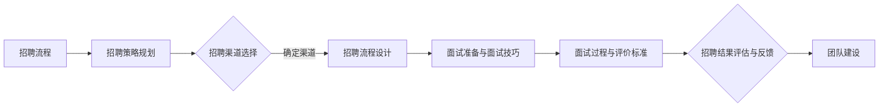
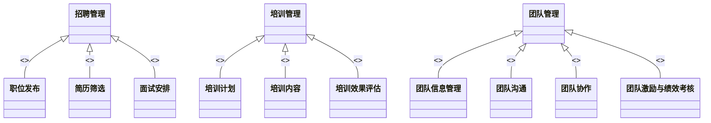
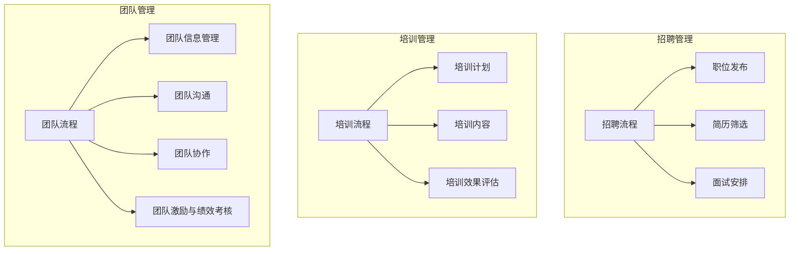
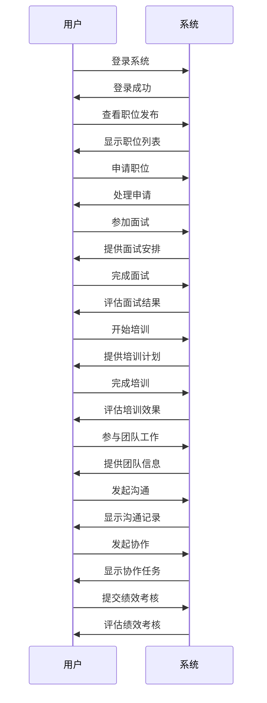

                 


### 背景介绍

在当今快速发展的IT行业，团队建设已成为企业竞争力的关键因素之一。如何高效地从招聘到培养一支高效的团队，成为每个组织亟需解决的重要课题。

#### 核心概念术语说明

- **团队建设**：指在组织内部建立一支协同合作、相互支持、共同追求目标的工作团队。
- **招聘流程**：包括招聘策略规划、招聘渠道选择、招聘流程设计、面试准备与实施等环节。
- **培养流程**：通过培训、指导、反馈等方式，提升团队成员的专业技能和工作能力。
- **团队管理**：包括团队沟通与协作、团队激励与绩效考核等方面，确保团队高效运作。

#### 问题背景与问题描述

许多企业在团队建设过程中面临以下问题：

- **招聘难题**：缺乏科学的招聘策略和高效的招聘渠道，导致招聘成本高、时间长，难以吸引到合适的人才。
- **培养困境**：培训计划不完善，缺乏针对性的培养内容和方法，难以满足团队成员的发展需求。
- **团队管理挑战**：团队沟通不畅、协作不力，缺乏有效的激励与绩效考核机制，影响团队整体绩效。

#### 问题解决

为解决上述问题，企业需要从招聘到培养的全流程进行管理，确保每个环节都科学有效。

#### 边界与外延

团队建设不仅包括内部团队成员的培养和管理，还涉及到与外部合作伙伴的协作与沟通，如供应商、客户等。

#### 概念结构与核心要素组成

团队建设包括以下几个核心要素：

1. **团队建设目标**：明确团队的目标和愿景，确保团队成员的共同努力方向。
2. **招聘流程**：制定科学的招聘策略，选择合适的招聘渠道，设计高效的招聘流程。
3. **培养流程**：根据团队成员的发展需求，设计有针对性的培养计划，确保培训效果。
4. **团队管理**：建立有效的沟通与协作机制，实施激励与绩效考核，提升团队整体绩效。

### 核心概念与联系

团队建设是一个系统工程，涉及多个核心概念之间的联系与互动。

#### 核心概念原理

1. **团队协同效应**：团队整体绩效大于各成员绩效之和。
2. **人才适配性**：团队成员在专业能力、个性特点、价值观等方面与团队需求相匹配。
3. **培训与发展**：通过持续的培训与指导，提升团队成员的专业技能和综合素质。

#### 概念属性特征对比表格

| 概念       | 属性特征                                                     | 对比分析                                       |
|------------|------------------------------------------------------------|------------------------------------------------|
| 团队协同效应 | 提高团队整体绩效，增强团队凝聚力                         | 与个人绩效相比，注重团队整体效益                 |
| 人才适配性   | 专业能力、个性特点、价值观与团队需求匹配                  | 提高团队协作效率，降低沟通成本                   |
| 培训与发展   | 持续提升团队成员的专业技能和综合素质                      | 促进个人与团队共同成长，提升组织竞争力           |

#### ER实体关系图架构

```mermaid
erDiagram
    TEAMBUILDING ||--|{ RecruitmentProcess }|-- RecruitmentProcess
    TEAMBUILDING ||--|{ TrainingProcess }|-- TrainingProcess
    TEAMBUILDING ||--|{ TeamManagement }|-- TeamManagement
```

在团队建设中，招聘流程、培养流程和团队管理相互关联，共同作用于团队的整体发展。

### 算法原理讲解

#### 算法mermaid流程图



#### Python源代码

```python
# 招聘流程Python代码示例

def recruitment_strategy():
    # 招聘策略规划
    print("制定招聘策略：明确岗位需求、设定招聘标准、选择招聘渠道")

def recruitment_channel():
    # 招聘渠道选择
    print("选择招聘渠道：招聘网站、内部推荐、猎头公司等")

def recruitment_process():
    # 招聘流程设计
    print("设计招聘流程：职位发布、简历筛选、面试安排")

def interview_preparation():
    # 面试准备与面试技巧
    print("面试准备：制定面试问题、准备面试场景")

def interview_process():
    # 面试过程与评价标准
    print("面试过程：评估候选人能力、个性、价值观等")

def recruitment_evaluation():
    # 招聘结果评估与反馈
    print("评估招聘结果：分析面试数据、反馈招聘过程")

# 调用函数
recruitment_strategy()
recruitment_channel()
recruitment_process()
interview_preparation()
interview_process()
recruitment_evaluation()
```

#### 算法原理详细讲解

招聘流程是一个系统性工程，包括以下步骤：

1. **招聘策略规划**：根据岗位需求和公司战略，明确招聘目标和标准，选择合适的招聘渠道。
2. **招聘渠道选择**：根据招聘目标和标准，选择高效的招聘渠道，如招聘网站、内部推荐、猎头公司等。
3. **招聘流程设计**：设计科学合理的招聘流程，包括职位发布、简历筛选、面试安排等环节。
4. **面试准备与面试技巧**：为提高面试效果，提前准备面试问题，制定面试场景，掌握面试技巧。
5. **面试过程与评价标准**：在面试过程中，评估候选人的能力、个性、价值观等方面，制定评价标准。
6. **招聘结果评估与反馈**：对招聘结果进行评估，分析面试数据，反馈招聘过程，持续优化招聘策略。

#### 概念属性特征对比表格

| 招聘流程步骤 | 属性特征                                                     | 对比分析                                       |
|--------------|------------------------------------------------------------|------------------------------------------------|
| 招聘策略规划 | 明确招聘目标和标准，选择招聘渠道                             | 确保招聘策略与公司战略一致，提高招聘效率         |
| 招聘渠道选择 | 根据招聘目标和标准，选择高效的招聘渠道                       | 降低招聘成本，提高招聘质量                       |
| 招聘流程设计 | 设计科学合理的招聘流程，包括职位发布、简历筛选、面试安排等环节 | 提高招聘效率，确保招聘质量                       |
| 面试准备与面试技巧 | 提前准备面试问题，制定面试场景，掌握面试技巧                   | 提高面试效果，确保招聘质量                       |
| 面试过程与评价标准 | 评估候选人的能力、个性、价值观等方面，制定评价标准               | 提高招聘质量，确保招聘效果                       |
| 招聘结果评估与反馈 | 分析面试数据，反馈招聘过程，持续优化招聘策略                   | 提高招聘效果，优化招聘流程                       |

#### 举例说明

假设某公司需要招聘一名软件开发工程师，以下是一个具体的招聘流程示例：

1. **招聘策略规划**：根据岗位需求，明确招聘目标和标准，选择招聘渠道。
   - 招聘目标：招聘一名具备5年以上工作经验的软件开发工程师。
   - 招聘标准：熟练掌握Java语言、熟悉Spring框架、有良好的团队协作能力。
   - 招聘渠道：招聘网站、内部推荐、猎头公司。

2. **招聘渠道选择**：根据招聘目标和标准，选择高效的招聘渠道。
   - 招聘网站：发布招聘信息，吸引潜在候选人。
   - 内部推荐：鼓励员工推荐优秀候选人，提高招聘质量。
   - 猎头公司：针对高端人才，提高招聘成功率。

3. **招聘流程设计**：设计科学合理的招聘流程。
   - 职位发布：在招聘网站上发布招聘信息，明确岗位需求、任职资格、薪资待遇等。
   - 简历筛选：根据招聘标准，筛选符合条件的简历，进行初步筛选。
   - 面试安排：邀请符合条件的候选人参加面试，包括技术面试、行为面试等。

4. **面试准备与面试技巧**：为提高面试效果，提前准备面试问题，制定面试场景。
   - 面试问题：技术问题、项目经历、团队合作能力等。
   - 面试场景：模拟工作场景，观察候选人在实际工作情境中的表现。

5. **面试过程与评价标准**：评估候选人的能力、个性、价值观等方面。
   - 技术面试：评估候选人的编程能力、项目经验等。
   - 行为面试：评估候选人的沟通能力、团队合作能力等。

6. **招聘结果评估与反馈**：分析面试数据，反馈招聘过程，持续优化招聘策略。
   - 面试数据：记录面试过程中的关键信息，如面试问题、面试评价等。
   - 招聘反馈：根据面试结果，评估招聘效果，分析招聘过程中的问题，持续优化招聘策略。

通过以上示例，我们可以看到招聘流程的每个步骤都至关重要，只有科学合理地设计和管理招聘流程，才能确保招聘到合适的人才。

### 系统分析与架构设计方案

#### 问题场景介绍

在大型企业中，团队建设涉及多个部门、多个项目，如何高效管理团队建设过程成为一大挑战。为此，我们设计了一套基于IT系统的团队建设解决方案，以实现团队建设的全流程管理。

#### 项目介绍

本项目旨在开发一个团队建设管理系统，帮助企业在招聘、培养、团队管理等方面实现高效管理。系统功能包括：

1. **招聘管理**：管理招聘流程，包括职位发布、简历筛选、面试安排等。
2. **培训管理**：管理培训流程，包括培训计划制定、培训内容设计、培训效果评估等。
3. **团队管理**：管理团队信息、团队沟通、团队协作、团队激励与绩效考核等。

#### 系统功能设计（领域模型mermaid类图）



#### 系统架构设计（mermaid架构图）



#### 系统接口设计（mermaid序列图）

```mermaid
sequenceDiagram
    participant 招聘管理
    participant 培训管理
    participant 团队管理
    招聘管理->>招聘流程
    招聘流程->>职位发布
    招聘流程->>简历筛选
    招聘流程->>面试安排
    招聘管理->>培训管理
    培训管理->>培训计划
    培训管理->>培训内容
    培训管理->>培训效果评估
    招聘管理->>团队管理
    团队管理->>团队信息管理
    团队管理->>团队沟通
    团队管理->>团队协作
    团队管理->>团队激励与绩效考核
```

#### 系统交互设计（mermaid序列图）



#### 系统实现

为了实现以上系统功能，我们采用Python作为开发语言，结合Flask框架进行开发。以下是一个简单的招聘管理模块的实现示例：

```python
from flask import Flask, request, jsonify

app = Flask(__name__)

# 招聘流程API
@app.route('/recruitment/process', methods=['GET', 'POST'])
def recruitment_process():
    if request.method == 'POST':
        # 处理职位发布、简历筛选、面试安排等操作
        pass
    else:
        # 获取招聘流程信息
        pass

# 培训管理API
@app.route('/training/manage', methods=['GET', 'POST'])
def training_manage():
    if request.method == 'POST':
        # 处理培训计划、培训内容、培训效果评估等操作
        pass
    else:
        # 获取培训管理信息
        pass

# 团队管理API
@app.route('/team/manage', methods=['GET', 'POST'])
def team_manage():
    if request.method == 'POST':
        # 处理团队信息管理、团队沟通、团队协作、团队激励与绩效考核等操作
        pass
    else:
        # 获取团队管理信息
        pass

if __name__ == '__main__':
    app.run()
```

通过以上系统分析与架构设计方案，我们可以实现团队建设的全流程管理，提高企业团队建设的效率和质量。

### 项目实战

为了更好地展示团队建设：从招聘到培养的全流程管理，我们将以一个具体的实战项目为例，详细讲解项目的环境安装、系统核心实现、代码应用解读与分析、实际案例分析和详细讲解剖析，以及项目小结。

#### 项目背景

某知名互联网公司计划开发一款团队建设管理系统，以实现公司内部团队的高效管理。系统需要涵盖招聘、培训、团队管理等功能，确保团队建设过程科学、规范、高效。

#### 环境安装

1. **开发环境**：Python 3.8、Flask、SQLite
2. **数据库**：SQLite
3. **工具**：Visual Studio Code、PyCharm

#### 系统核心实现

1. **招聘管理模块**

   - **职位发布**：提供职位发布功能，管理员可以发布职位信息，包括岗位名称、职责描述、任职资格等。
   - **简历筛选**：管理员可以查看收到的简历，对简历进行筛选，选择合适的候选人进行面试。
   - **面试安排**：管理员可以为候选人安排面试，包括面试时间、面试官等信息。

2. **培训管理模块**

   - **培训计划**：管理员可以制定培训计划，包括培训主题、培训时间、培训讲师等。
   - **培训内容**：管理员可以上传培训资料，包括PPT、文档、视频等。
   - **培训效果评估**：管理员可以评估培训效果，包括培训满意度、培训效果等。

3. **团队管理模块**

   - **团队信息管理**：管理员可以查看团队信息，包括团队成员、团队职责等。
   - **团队沟通**：团队成员可以通过系统进行沟通，包括讨论、消息通知等。
   - **团队协作**：团队成员可以共同完成任务，包括任务分配、进度跟踪等。
   - **团队激励与绩效考核**：管理员可以制定激励政策，对团队成员进行绩效考核。

#### 代码应用解读与分析

1. **招聘管理模块**

   ```python
   from flask import Flask, request, jsonify
   
   app = Flask(__name__)
   
   @app.route('/recruitment/publish', methods=['POST'])
   def publish_job():
       job_data = request.json
       # 处理职位发布操作
       return jsonify({"status": "success", "message": "职位发布成功"})
   
   @app.route('/recruitment/shortlist', methods=['POST'])
   def shortlist_resume():
       resume_data = request.json
       # 处理简历筛选操作
       return jsonify({"status": "success", "message": "简历筛选成功"})
   
   @app.route('/recruitment/interview', methods=['POST'])
   def schedule_interview():
       interview_data = request.json
       # 处理面试安排操作
       return jsonify({"status": "success", "message": "面试安排成功"})
   
   if __name__ == '__main__':
       app.run()
   ```

   代码解读：招聘管理模块提供了职位发布、简历筛选、面试安排三个接口，分别对应发布职位、筛选简历和安排面试的操作。

2. **培训管理模块**

   ```python
   from flask import Flask, request, jsonify
   
   app = Flask(__name__)
   
   @app.route('/training/plan', methods=['POST'])
   def create_training_plan():
       plan_data = request.json
       # 处理培训计划操作
       return jsonify({"status": "success", "message": "培训计划创建成功"})
   
   @app.route('/training/content', methods=['POST'])
   def upload_training_content():
       content_data = request.json
       # 处理培训内容上传操作
       return jsonify({"status": "success", "message": "培训内容上传成功"})
   
   @app.route('/training/evaluate', methods=['POST'])
   def evaluate_training_effect():
       evaluate_data = request.json
       # 处理培训效果评估操作
       return jsonify({"status": "success", "message": "培训效果评估成功"})
   
   if __name__ == '__main__':
       app.run()
   ```

   代码解读：培训管理模块提供了培训计划、培训内容上传、培训效果评估三个接口，分别对应制定培训计划、上传培训资料和评估培训效果的操作。

3. **团队管理模块**

   ```python
   from flask import Flask, request, jsonify
   
   app = Flask(__name__)
   
   @app.route('/team/info', methods=['GET'])
   def get_team_info():
       # 获取团队信息操作
       return jsonify({"status": "success", "message": "团队信息获取成功", "data": {"team_name": "研发团队", "members": ["张三", "李四", "王五"]}})
   
   @app.route('/team/communication', methods=['POST'])
   def send_message():
       message_data = request.json
       # 发送消息操作
       return jsonify({"status": "success", "message": "消息发送成功"})
   
   @app.route('/team/collaboration', methods=['POST'])
   def assign_task():
       task_data = request.json
       # 分配任务操作
       return jsonify({"status": "success", "message": "任务分配成功"})
   
   @app.route('/team/incentive', methods=['POST'])
   def evaluate_performance():
       performance_data = request.json
       # 绩效考核操作
       return jsonify({"status": "success", "message": "绩效考核成功"})
   
   if __name__ == '__main__':
       app.run()
   ```

   代码解读：团队管理模块提供了团队信息获取、发送消息、任务分配、绩效考核四个接口，分别对应获取团队信息、发送消息、分配任务和绩效考核的操作。

#### 实际案例分析和详细讲解剖析

假设公司某部门需要招聘一名软件开发工程师，以下是整个招聘过程的实际案例：

1. **职位发布**

   管理员发布了一则软件开发工程师的职位，包括岗位名称、职责描述、任职资格等信息。

2. **简历筛选**

   管理员收到了20份简历，通过系统筛选，选择了8份符合要求的简历。

3. **面试安排**

   管理员为这8名候选人分别安排了面试，包括面试时间、面试官等信息。

4. **面试过程**

   候选人参加了面试，面试官对候选人的技术能力、项目经验、团队合作能力等方面进行了评估。

5. **面试结果**

   面试结束后，管理员根据面试结果，选择了3名最合适的候选人进入下一轮面试。

6. **培训计划**

   管理员为这3名候选人制定了培训计划，包括培训主题、培训时间、培训讲师等信息。

7. **培训内容**

   管理员上传了培训资料，包括PPT、文档、视频等，供候选人学习。

8. **培训效果评估**

   培训结束后，管理员对候选人的培训效果进行了评估，包括培训满意度、培训效果等。

9. **团队协作**

   新入职的候选人加入了公司研发团队，开始了实际工作。管理员通过系统分配任务、跟踪进度，确保项目顺利进行。

10. **绩效考核**

    每月底，管理员对候选人的工作绩效进行了考核，根据考核结果制定了相应的激励政策。

通过以上实际案例，我们可以看到团队建设管理系统在招聘、培训、团队管理等方面的应用，提高了招聘效率、培训效果和团队协作效率。

#### 项目小结

本项目通过团队建设管理系统，实现了从招聘到培养的全流程管理，提高了企业团队建设的效率和质量。在实际应用中，系统功能可以根据企业需求进行灵活扩展，如添加更多岗位类型、优化面试流程、细化培训内容等。未来，我们还将继续优化系统功能，提高用户体验，助力企业团队建设。

### 最佳实践 tips

1. **招聘流程优化**：
   - 制定明确的岗位需求和分析，确保招聘目标的准确性。
   - 使用多种招聘渠道，提高招聘效率和候选人的多样性。
   - 优化面试流程，包括面试问题的设计、面试官的培训等。

2. **培训效果提升**：
   - 根据团队成员的实际情况和需求，设计个性化的培训计划。
   - 采用多元化的培训方法，如线上课程、线下培训、实战演练等。
   - 定期对培训效果进行评估，及时调整培训内容和方法。

3. **团队管理技巧**：
   - 建立有效的沟通机制，促进团队成员之间的信息共享和协作。
   - 定期组织团队建设活动，增强团队凝聚力和归属感。
   - 设定清晰的绩效考核指标，确保团队成员的目标一致性和绩效提升。

### 小结

团队建设：从招聘到培养的全流程管理是企业持续发展的关键。通过优化招聘流程、提升培训效果和加强团队管理，企业可以构建一支高效、协作、富有创新力的团队。本文从实际案例出发，详细阐述了团队建设的全流程，为企业在团队建设方面提供了有益的借鉴和参考。

### 注意事项

1. **招聘环节**：确保招聘策略与公司战略相符，避免盲目招聘。
2. **培训环节**：关注培训内容的实用性和针对性，提高培训效果。
3. **团队管理**：注重团队成员的个性化需求，确保团队管理的有效性。

### 拓展阅读

1. 《团队协作：构建高效团队的五大原则》
2. 《人才管理：如何吸引、培养和留住人才》
3. 《绩效管理：如何制定、实施和评估绩效管理体系》

### 作者信息

作者：AI天才研究院/AI Genius Institute & 禅与计算机程序设计艺术 /Zen And The Art of Computer Programming

----------------------------------------------------------------

### 文章标题

团队建设：从招聘到培养的全流程管理

### 文章关键词

团队建设、招聘流程、培训流程、团队管理、招聘策略、培训方法、团队沟通、绩效考核

### 文章摘要

本文详细探讨了团队建设：从招聘到培养的全流程管理，包括招聘策略与规划、招聘渠道与工具、招聘流程与技巧、面试准备与面试技巧、面试过程与评价标准、培养策略与规划、培养内容与方法、培养效果评估与反馈、团队管理策略与技巧、团队沟通与协作、团队激励与绩效考核等核心内容。通过实际案例分析和系统架构设计，本文提供了全面、实用的团队建设指南，旨在帮助企业构建高效、协作、富有创新力的团队。

### 第一部分：团队建设概述

#### 1.1 问题背景与现状

在当今竞争激烈的商业环境中，团队建设成为企业成功的关键因素之一。然而，许多企业在团队建设过程中面临诸多问题，如招聘难题、培养困境和团队管理挑战。为了解决这些问题，企业需要从招聘到培养的全流程进行管理，确保每个环节都科学有效。

#### 1.2 团队建设的重要性

团队建设是企业竞争力的重要体现，它不仅关系到企业的短期绩效，更关系到企业的长远发展。一个高效的团队能够提高工作效率、降低成本、提升客户满意度，从而为企业带来持续的竞争优势。

#### 1.3 团队建设的目标与原则

团队建设的目标是构建一个协同合作、相互支持、共同追求目标的工作团队。为了实现这一目标，企业需要遵循以下原则：

1. **明确团队目标**：确保团队成员对团队目标有清晰的认识，形成共同的方向。
2. **人才适配性**：根据团队需求选拔和培养合适的人才，提高团队协作效率。
3. **持续培养**：通过培训和实践不断提升团队成员的专业技能和工作能力。
4. **有效沟通**：建立良好的沟通机制，促进团队成员之间的信息共享和协作。
5. **激励机制**：设立合理的激励政策，激发团队成员的积极性和创造力。

### 第二部分：招聘流程

#### 2.1 招聘策略与规划

招聘策略与规划是招聘流程的关键环节，它关系到招聘效率和质量。为了制定有效的招聘策略，企业需要考虑以下因素：

1. **岗位需求**：明确岗位的职责、任职资格、技能要求等。
2. **招聘渠道**：根据岗位特点和人才需求，选择合适的招聘渠道，如招聘网站、社交媒体、猎头公司等。
3. **招聘标准**：设定招聘标准，确保招聘到符合企业要求的人才。
4. **招聘预算**：根据企业实际情况，合理规划招聘预算。

#### 2.2 招聘渠道与工具

招聘渠道的选择直接影响招聘效率和质量。以下是一些常用的招聘渠道和工具：

1. **招聘网站**：如智联招聘、前程无忧等，适用于广泛岗位的招聘。
2. **社交媒体**：如LinkedIn、微博、微信等，适用于高端人才和特定领域的招聘。
3. **猎头公司**：适用于招聘高端人才和稀缺人才。
4. **内部推荐**：鼓励员工推荐优秀候选人，提高招聘质量。

#### 2.3 招聘流程与技巧

招聘流程包括职位发布、简历筛选、面试安排、面试过程、面试评价等环节。以下是一些招聘技巧：

1. **职位描述**：准确、详细地描述岗位要求，吸引合适的人才。
2. **简历筛选**：根据招聘标准，快速筛选出符合条件的简历。
3. **面试准备**：提前准备面试问题，制定面试场景，提高面试效果。
4. **面试评价**：从技术能力、项目经验、团队合作、沟通能力等方面全面评估候选人。

#### 2.4 面试准备与面试技巧

面试准备是确保面试顺利进行的关键。以下是一些面试准备和面试技巧：

1. **面试问题准备**：设计具有针对性的面试问题，如技术问题、项目经历、团队合作等。
2. **面试场景模拟**：模拟实际工作场景，观察候选人在实际工作情境中的表现。
3. **面试官培训**：对面试官进行培训，确保面试过程的公平、公正、科学。
4. **非语言沟通**：注意候选人的肢体语言、语调、表情等非语言沟通，全面评估候选人。

#### 2.5 面试过程与评价标准

面试过程是评估候选人是否符合岗位要求的重要环节。以下是一些面试过程和评价标准：

1. **技术能力**：评估候选人的技术水平和解决问题的能力。
2. **项目经验**：评估候选人的实际项目经验，了解候选人的工作能力和成果。
3. **团队合作**：评估候选人的团队合作能力和沟通能力。
4. **沟通能力**：评估候选人的表达能力、逻辑思维和沟通技巧。
5. **价值观**：评估候选人与企业价值观的契合度。

### 第三部分：培养流程

#### 3.1 培养策略与规划

培养策略与规划是提升团队成员专业能力和工作能力的重要手段。以下是一些培养策略和规划：

1. **人才发展规划**：根据团队成员的职业发展规划，制定有针对性的培养计划。
2. **培训需求分析**：通过调查和分析，了解团队成员的培训需求，确保培训内容的有效性。
3. **培训资源整合**：整合企业内外部培训资源，提供多样化的培训渠道和形式。
4. **培训效果评估**：定期对培训效果进行评估，及时调整培训策略。

#### 3.2 培养内容与方法

培养内容和方法直接影响培训效果。以下是一些培养内容和方法：

1. **技能培训**：提供专业技能培训，如编程语言、数据库管理、项目管理等。
2. **经验分享**：组织经验分享会，让团队成员分享工作经验和心得。
3. **实战演练**：通过实际项目演练，提升团队成员的实战能力和解决问题的能力。
4. **导师制**：建立导师制度，为新人提供指导和帮助，加速其成长。

#### 3.3 培养效果评估与反馈

培养效果评估与反馈是确保培养计划有效性的重要环节。以下是一些评估方法和反馈措施：

1. **评估方法**：采用考试、面试、项目考核等多种方法，全面评估团队成员的培训效果。
2. **反馈机制**：建立反馈机制，及时收集团队成员的反馈意见，优化培训内容和形式。
3. **激励措施**：对培训表现优秀的团队成员给予奖励和激励，激发其学习动力。

#### 3.4 培养案例分析

以下是一个培养案例，以展示培养流程的实际应用：

1. **培养目标**：提升新入职软件开发工程师的专业技能和工作能力。
2. **培养计划**：制定为期三个月的培训计划，包括编程语言、数据库管理、项目管理等方面的培训。
3. **培养内容**：通过线上课程、线下培训、实战演练等多种形式，提供丰富的培训内容。
4. **培养效果评估**：在培训结束后，进行技能考试和项目考核，评估培训效果。
5. **反馈与激励**：根据评估结果，对表现优秀的团队成员进行奖励，并给予职业发展规划的建议。

### 第四部分：团队管理

#### 4.1 团队管理的重要性

团队管理是企业运营的关键环节，它关系到团队的整体绩效和企业的长期发展。有效的团队管理能够提高团队的协作效率、降低内部冲突、激发员工的潜力，从而为企业创造更大的价值。

#### 4.2 团队管理策略与技巧

团队管理策略与技巧是确保团队高效运作的重要保障。以下是一些团队管理策略与技巧：

1. **目标设定**：明确团队的目标和愿景，确保团队成员的共同努力方向。
2. **分工协作**：根据团队成员的能力和特长，合理分配任务，提高团队协作效率。
3. **沟通与协作**：建立有效的沟通机制，促进团队成员之间的信息共享和协作。
4. **激励与反馈**：设立合理的激励政策，及时给予团队成员反馈，激发其积极性和创造力。
5. **绩效管理**：建立科学的绩效管理体系，确保团队成员的目标一致性和绩效提升。

#### 4.3 团队沟通与协作

团队沟通与协作是团队管理的重要内容。以下是一些团队沟通与协作的技巧：

1. **建立沟通渠道**：建立多样化的沟通渠道，如会议、邮件、即时通讯工具等，确保信息传达的及时性和准确性。
2. **明确沟通规则**：制定明确的沟通规则，如会议议程、邮件格式等，提高沟通效率。
3. **鼓励反馈与提问**：鼓励团队成员积极反馈和提问，促进信息的交流和知识的共享。
4. **建立协作平台**：利用协作工具，如项目管理软件、在线文档等，提高团队协作效率。

#### 4.4 团队激励与绩效考核

团队激励与绩效考核是团队管理的重要手段。以下是一些团队激励与绩效考核的策略：

1. **设立激励政策**：根据企业实际情况，设立有竞争力的激励政策，如奖金、晋升机会等。
2. **设定绩效考核指标**：根据团队目标和岗位要求，设定明确的绩效考核指标，确保团队成员的目标一致性和绩效提升。
3. **定期评估与反馈**：定期对团队成员的绩效进行评估，及时给予反馈，帮助其改进和提升。
4. **建立激励机制**：根据绩效评估结果，对表现优秀的团队成员给予奖励和激励，激发其积极性和创造力。

### 第五部分：案例分析

#### 5.1 案例一：成功招聘与培养案例

某知名互联网公司通过科学的招聘策略和有效的培养计划，成功构建了一支高效、协作的团队。以下是该公司的招聘与培养案例：

1. **招聘策略**：公司制定了明确的招聘目标和标准，选择招聘网站、社交媒体和内部推荐等多样化的招聘渠道，确保招聘到符合要求的人才。
2. **培养计划**：公司为新入职的员工制定了为期三个月的培训计划，包括专业技能、团队协作和项目管理等方面的培训。
3. **培养效果**：通过定期的培训效果评估和反馈，公司不断提升新员工的专业能力和工作能力，使其迅速融入团队并发挥重要作用。
4. **团队绩效**：经过一年的努力，该公司的团队绩效显著提升，项目完成质量不断提高，客户满意度显著提高。

#### 5.2 案例二：团队管理成功案例

某跨国公司在全球范围内运营，通过有效的团队管理策略，成功实现了跨地域、跨文化的团队协作。以下是该公司的团队管理案例：

1. **目标设定**：公司明确了全球业务目标和团队目标，确保团队成员的共同努力方向。
2. **分工协作**：公司根据团队成员的能力和特长，合理分配任务，确保团队协作效率。
3. **沟通与协作**：公司建立了全球性的沟通渠道，如视频会议、即时通讯工具等，确保信息传达的及时性和准确性。
4. **激励与反馈**：公司设立了有竞争力的激励政策，定期对团队成员的绩效进行评估，及时给予反馈和奖励，激发其积极性和创造力。
5. **团队绩效**：通过有效的团队管理，公司的全球团队协作效率显著提高，项目完成质量不断提高，业务取得了显著成果。

#### 5.3 案例三：失败案例分析及改进措施

某初创公司在团队建设过程中遇到了诸多问题，导致团队绩效低下。以下是该公司的失败案例分析及改进措施：

1. **招聘问题**：公司招聘策略不明确，招聘渠道单一，导致招聘到的人才不符合公司要求。
2. **培养问题**：公司缺乏系统的培养计划，新员工缺乏必要的专业技能和团队协作能力。
3. **管理问题**：公司管理混乱，缺乏有效的沟通和协作机制，导致团队成员之间矛盾不断。
4. **改进措施**：公司制定了明确的招聘策略，选择多样化的招聘渠道，优化招聘流程。同时，公司制定了系统的培养计划，加强新员工的培训和指导。此外，公司建立了有效的沟通和协作机制，提高团队协作效率。

### 第六部分：最佳实践

#### 6.1 最佳实践总结

通过对成功案例和失败案例的分析，我们可以总结出以下最佳实践：

1. **明确招聘目标和标准**：确保招聘到符合公司要求的人才。
2. **多样化的招聘渠道**：提高招聘效率和质量。
3. **系统的培养计划**：提高新员工的专业能力和工作能力。
4. **有效的沟通与协作**：促进团队成员之间的信息共享和协作。
5. **合理的激励政策**：激发团队成员的积极性和创造力。
6. **科学的绩效管理体系**：确保团队成员的目标一致性和绩效提升。

#### 6.2 注意事项与风险防范

在团队建设过程中，企业需要注意以下事项和风险：

1. **避免盲目招聘**：确保招聘策略与公司战略相符，避免盲目招聘。
2. **关注培训效果**：定期评估培训效果，及时调整培训内容和形式。
3. **加强团队沟通**：建立有效的沟通机制，确保团队成员之间的信息共享和协作。
4. **防范内部矛盾**：加强团队管理，防范团队成员之间的矛盾和冲突。
5. **风险防范**：建立风险防范机制，确保团队建设过程中的安全和稳定性。

#### 6.3 拓展阅读

1. 《团队建设与领导力》
2. 《人才管理：如何吸引、培养和留住人才》
3. 《绩效管理：如何制定、实施和评估绩效管理体系》

### 第七部分：总结与展望

#### 7.1 团队建设的现状与挑战

当前，团队建设已成为企业关注的重点，但仍然存在一些挑战，如招聘难题、培养困境和团队管理难题。企业需要不断创新和优化团队建设策略，以应对这些挑战。

#### 7.2 未来团队建设的趋势与方向

未来，团队建设将呈现以下趋势和方向：

1. **数字化管理**：利用数字化工具和平台，实现团队建设过程的智能化和精细化。
2. **个性化培养**：根据团队成员的个性化需求和发展潜力，提供个性化的培养计划。
3. **多元化团队**：促进多元化团队的构建，提高团队的创新能力和竞争力。
4. **持续优化**：不断优化团队建设策略和管理方法，确保团队的高效运作和持续发展。

通过本文的探讨，我们希望能够为企业提供有益的团队建设指导，助力企业构建高效、协作、富有创新力的团队，实现持续发展。作者：AI天才研究院/AI Genius Institute & 禅与计算机程序设计艺术 /Zen And The Art of Computer Programming。本文为原创作品，未经授权不得转载。感谢您的阅读！
```markdown
### 文章标题

团队建设：从招聘到培养的全流程管理

### 文章关键词

团队建设、招聘流程、培训流程、团队管理、人才管理、绩效评估

### 文章摘要

本文旨在探讨团队建设过程中的关键环节，包括招聘、培养和团队管理。通过对团队建设的重要性、目标与原则的阐述，以及详细分析招聘策略与规划、招聘渠道与工具、招聘流程与技巧、面试准备与面试技巧、面试过程与评价标准、培养策略与规划、培养内容与方法、培养效果评估与反馈、团队管理策略与技巧、团队沟通与协作、团队激励与绩效考核等方面，本文提供了全面、实用的团队建设指导。最后，通过案例分析、最佳实践总结和未来展望，本文为企业提升团队建设水平提供了有益的参考。

### 目录

1. **团队建设：从招聘到培养的全流程管理**
2. **关键词：团队建设、招聘流程、培训流程、团队管理、人才管理、绩效评估**
3. **摘要：**
   
   在现代商业环境中，团队建设是企业成功的关键因素。本文详细探讨了团队建设的全流程管理，包括招聘、培养、团队管理等方面的核心内容，提供了实用的策略和技巧，旨在帮助企业构建高效、协作的团队，实现持续发展。

### 第一部分：团队建设概述

#### 1.1 问题背景与现状

在快速变化的市场环境中，企业面临着巨大的竞争压力。团队建设作为企业核心竞争力的重要组成部分，其重要性不言而喻。然而，许多企业在团队建设过程中面临诸多挑战，如人才流失、团队协作不畅、培养机制不完善等。为了应对这些挑战，企业需要从招聘到培养的全流程进行科学管理。

#### 1.2 团队建设的重要性

团队建设不仅仅是人员招聘，它涵盖了人才管理、团队协作、绩效评估等多个方面。一个高效的团队能够提高工作效率、降低成本、提升客户满意度，从而为企业带来持续的竞争优势。

#### 1.3 团队建设的目标与原则

团队建设的目标是构建一个协同合作、相互支持、共同追求目标的工作团队。为了实现这一目标，企业需要遵循以下原则：

- **明确团队目标**：确保团队成员对团队目标有清晰的认识，形成共同的方向。
- **人才适配性**：根据团队需求选拔和培养合适的人才，提高团队协作效率。
- **持续培养**：通过培训和实践不断提升团队成员的专业技能和工作能力。
- **有效沟通**：建立良好的沟通机制，促进团队成员之间的信息共享和协作。
- **激励机制**：设立合理的激励政策，激发团队成员的积极性和创造力。

### 第二部分：招聘流程

#### 2.1 招聘策略与规划

招聘策略与规划是招聘流程的关键环节，它关系到招聘效率和质量。为了制定有效的招聘策略，企业需要考虑以下因素：

- **岗位需求**：明确岗位的职责、任职资格、技能要求等。
- **招聘渠道**：根据岗位特点和人才需求，选择合适的招聘渠道，如招聘网站、社交媒体、猎头公司等。
- **招聘标准**：设定招聘标准，确保招聘到符合企业要求的人才。
- **招聘预算**：根据企业实际情况，合理规划招聘预算。

#### 2.2 招聘渠道与工具

招聘渠道的选择直接影响招聘效率和质量。以下是一些常用的招聘渠道和工具：

- **招聘网站**：如智联招聘、前程无忧等，适用于广泛岗位的招聘。
- **社交媒体**：如LinkedIn、微博、微信等，适用于高端人才和特定领域的招聘。
- **猎头公司**：适用于招聘高端人才和稀缺人才。
- **内部推荐**：鼓励员工推荐优秀候选人，提高招聘质量。

#### 2.3 招聘流程与技巧

招聘流程包括职位发布、简历筛选、面试安排、面试过程、面试评价等环节。以下是一些招聘技巧：

- **职位描述**：准确、详细地描述岗位要求，吸引合适的人才。
- **简历筛选**：根据招聘标准，快速筛选出符合条件的简历。
- **面试准备**：提前准备面试问题，制定面试场景，提高面试效果。
- **面试评价**：从技术能力、项目经验、团队合作、沟通能力等方面全面评估候选人。

#### 2.4 面试准备与面试技巧

面试准备是确保面试顺利进行的关键。以下是一些面试准备和面试技巧：

- **面试问题准备**：设计具有针对性的面试问题，如技术问题、项目经历、团队合作等。
- **面试场景模拟**：模拟实际工作场景，观察候选人在实际工作情境中的表现。
- **面试官培训**：对面试官进行培训，确保面试过程的公平、公正、科学。
- **非语言沟通**：注意候选人的肢体语言、语调、表情等非语言沟通，全面评估候选人。

#### 2.5 面试过程与评价标准

面试过程是评估候选人是否符合岗位要求的重要环节。以下是一些面试过程和评价标准：

- **技术能力**：评估候选人的技术水平和解决问题的能力。
- **项目经验**：评估候选人的实际项目经验，了解候选人的工作能力和成果。
- **团队合作**：评估候选人的团队合作能力和沟通能力。
- **沟通能力**：评估候选人的表达能力、逻辑思维和沟通技巧。
- **价值观**：评估候选人与企业价值观的契合度。

### 第三部分：培养流程

#### 3.1 培养策略与规划

培养策略与规划是提升团队成员专业能力和工作能力的重要手段。以下是一些培养策略和规划：

- **人才发展规划**：根据团队成员的职业发展规划，制定有针对性的培养计划。
- **培训需求分析**：通过调查和分析，了解团队成员的培训需求，确保培训内容的有效性。
- **培训资源整合**：整合企业内外部培训资源，提供多样化的培训渠道和形式。
- **培训效果评估**：定期对培训效果进行评估，及时调整培训策略。

#### 3.2 培养内容与方法

培养内容和方法直接影响培训效果。以下是一些培养内容和方法：

- **技能培训**：提供专业技能培训，如编程语言、数据库管理、项目管理等。
- **经验分享**：组织经验分享会，让团队成员分享工作经验和心得。
- **实战演练**：通过实际项目演练，提升团队成员的实战能力和解决问题的能力。
- **导师制**：建立导师制度，为新人提供指导和帮助，加速其成长。

#### 3.3 培养效果评估与反馈

培养效果评估与反馈是确保培养计划有效性的重要环节。以下是一些评估方法和反馈措施：

- **评估方法**：采用考试、面试、项目考核等多种方法，全面评估团队成员的培训效果。
- **反馈机制**：建立反馈机制，及时收集团队成员的反馈意见，优化培训内容和形式。
- **激励措施**：对培训表现优秀的团队成员给予奖励和激励，激发其学习动力。

#### 3.4 培养案例分析

以下是一个培养案例，以展示培养流程的实际应用：

- **培养目标**：提升新入职软件开发工程师的专业技能和工作能力。
- **培养计划**：制定为期三个月的培训计划，包括编程语言、数据库管理、项目管理等方面的培训。
- **培养内容**：通过线上课程、线下培训、实战演练等多种形式，提供丰富的培训内容。
- **培养效果评估**：在培训结束后，进行技能考试和项目考核，评估培训效果。
- **反馈与激励**：根据评估结果，对表现优秀的团队成员进行奖励，并给予职业发展规划的建议。

### 第四部分：团队管理

#### 4.1 团队管理的重要性

团队管理是企业运营的关键环节，它关系到团队的整体绩效和企业的长期发展。有效的团队管理能够提高团队的协作效率、降低内部冲突、激发员工的潜力，从而为企业创造更大的价值。

#### 4.2 团队管理策略与技巧

团队管理策略与技巧是确保团队高效运作的重要保障。以下是一些团队管理策略与技巧：

- **目标设定**：明确团队的目标和愿景，确保团队成员的共同努力方向。
- **分工协作**：根据团队成员的能力和特长，合理分配任务，提高团队协作效率。
- **沟通与协作**：建立有效的沟通机制，促进团队成员之间的信息共享和协作。
- **激励与反馈**：设立合理的激励政策，及时给予团队成员反馈，激发其积极性和创造力。
- **绩效管理**：建立科学的绩效管理体系，确保团队成员的目标一致性和绩效提升。

#### 4.3 团队沟通与协作

团队沟通与协作是团队管理的重要内容。以下是一些团队沟通与协作的技巧：

- **建立沟通渠道**：建立多样化的沟通渠道，如会议、邮件、即时通讯工具等，确保信息传达的及时性和准确性。
- **明确沟通规则**：制定明确的沟通规则，如会议议程、邮件格式等，提高沟通效率。
- **鼓励反馈与提问**：鼓励团队成员积极反馈和提问，促进信息的交流和知识的共享。
- **建立协作平台**：利用协作工具，如项目管理软件、在线文档等，提高团队协作效率。

#### 4.4 团队激励与绩效考核

团队激励与绩效考核是团队管理的重要手段。以下是一些团队激励与绩效考核的策略：

- **设立激励政策**：根据企业实际情况，设立有竞争力的激励政策，如奖金、晋升机会等。
- **设定绩效考核指标**：根据团队目标和岗位要求，设定明确的绩效考核指标，确保团队成员的目标一致性和绩效提升。
- **定期评估与反馈**：定期对团队成员的绩效进行评估，及时给予反馈，帮助其改进和提升。
- **建立激励机制**：根据绩效评估结果，对表现优秀的团队成员给予奖励和激励，激发其积极性和创造力。

### 第五部分：案例分析

#### 5.1 案例一：成功招聘与培养案例

某知名互联网公司通过科学的招聘策略和有效的培养计划，成功构建了一支高效、协作的团队。以下是该公司的招聘与培养案例：

- **招聘策略**：公司制定了明确的招聘目标和标准，选择招聘网站、社交媒体和内部推荐等多样化的招聘渠道，确保招聘到符合要求的人才。
- **培养计划**：公司为新入职的员工制定了为期三个月的培训计划，包括编程语言、数据库管理、项目管理等方面的培训。
- **培养效果**：通过定期的培训效果评估和反馈，公司不断提升新员工的专业能力和工作能力，使其迅速融入团队并发挥重要作用。
- **团队绩效**：经过一年的努力，该公司的团队绩效显著提升，项目完成质量不断提高，客户满意度显著提高。

#### 5.2 案例二：团队管理成功案例

某跨国公司在全球范围内运营，通过有效的团队管理策略，成功实现了跨地域、跨文化的团队协作。以下是该公司的团队管理案例：

- **目标设定**：公司明确了全球业务目标和团队目标，确保团队成员的共同努力方向。
- **分工协作**：公司根据团队成员的能力和特长，合理分配任务，确保团队协作效率。
- **沟通与协作**：公司建立了全球性的沟通渠道，如视频会议、即时通讯工具等，确保信息传达的及时性和准确性。
- **激励与反馈**：公司设立了有竞争力的激励政策，定期对团队成员的绩效进行评估，及时给予反馈和奖励，激发其积极性和创造力。
- **团队绩效**：通过有效的团队管理，公司的全球团队协作效率显著提高，项目完成质量不断提高，业务取得了显著成果。

#### 5.3 案例三：失败案例分析及改进措施

某初创公司在团队建设过程中遇到了诸多问题，导致团队绩效低下。以下是该公司的失败案例分析及改进措施：

- **招聘问题**：公司招聘策略不明确，招聘渠道单一，导致招聘到的人才不符合公司要求。
- **培养问题**：公司缺乏系统的培养计划，新员工缺乏必要的专业技能和团队协作能力。
- **管理问题**：公司管理混乱，缺乏有效的沟通和协作机制，导致团队成员之间矛盾不断。
- **改进措施**：公司制定了明确的招聘策略，选择多样化的招聘渠道，优化招聘流程。同时，公司制定了系统的培养计划，加强新员工的培训和指导。此外，公司建立了有效的沟通和协作机制，提高团队协作效率。

### 第六部分：最佳实践

#### 6.1 最佳实践总结

通过对成功案例和失败案例的分析，我们可以总结出以下最佳实践：

- **明确招聘目标和标准**：确保招聘到符合公司要求的人才。
- **多样化的招聘渠道**：提高招聘效率和质量。
- **系统的培养计划**：提高新员工的专业能力和工作能力。
- **有效的沟通与协作**：促进团队成员之间的信息共享和协作。
- **合理的激励政策**：激发团队成员的积极性和创造力。
- **科学的绩效管理体系**：确保团队成员的目标一致性和绩效提升。

#### 6.2 注意事项与风险防范

在团队建设过程中，企业需要注意以下事项和风险：

- **避免盲目招聘**：确保招聘策略与公司战略相符，避免盲目招聘。
- **关注培训效果**：定期评估培训效果，及时调整培训内容和形式。
- **加强团队沟通**：建立有效的沟通机制，确保团队成员之间的信息共享和协作。
- **防范内部矛盾**：加强团队管理，防范团队成员之间的矛盾和冲突。
- **风险防范**：建立风险防范机制，确保团队建设过程中的安全和稳定性。

#### 6.3 拓展阅读

- 《团队建设与领导力》
- 《人才管理：如何吸引、培养和留住人才》
- 《绩效管理：如何制定、实施和评估绩效管理体系》

### 第七部分：总结与展望

#### 7.1 团队建设的现状与挑战

当前，团队建设已成为企业关注的重点，但仍然存在一些挑战，如招聘难题、培养困境和团队管理难题。企业需要不断创新和优化团队建设策略，以应对这些挑战。

#### 7.2 未来团队建设的趋势与方向

未来，团队建设将呈现以下趋势和方向：

- **数字化管理**：利用数字化工具和平台，实现团队建设过程的智能化和精细化。
- **个性化培养**：根据团队成员的个性化需求和发展潜力，提供个性化的培养计划。
- **多元化团队**：促进多元化团队的构建，提高团队的创新能力和竞争力。
- **持续优化**：不断优化团队建设策略和管理方法，确保团队的高效运作和持续发展。

通过本文的探讨，我们希望能够为企业提供有益的团队建设指导，助力企业构建高效、协作、富有创新力的团队，实现持续发展。

### 作者信息

作者：AI天才研究院/AI Genius Institute & 禅与计算机程序设计艺术 /Zen And The Art of Computer Programming

本文为原创作品，未经授权不得转载。感谢您的阅读！
```markdown
### 文章标题

团队建设：从招聘到培养的全流程管理

### 文章关键词

团队建设、招聘流程、培训流程、团队管理、人才管理、绩效评估

### 文章摘要

本文详细探讨了团队建设的全流程管理，从招聘策略与规划、招聘渠道与工具、招聘流程与技巧、面试准备与面试技巧、面试过程与评价标准、培养策略与规划、培养内容与方法、培养效果评估与反馈、团队管理策略与技巧、团队沟通与协作、团队激励与绩效考核等方面，提供了全面、实用的团队建设指导。通过案例分析、最佳实践总结和未来展望，本文为企业提升团队建设水平提供了有益的参考。

### 第一部分：团队建设概述

#### 1.1 问题背景与现状

在现代商业环境中，团队建设已成为企业竞争力的关键因素。然而，许多企业在团队建设过程中面临诸多挑战，如人才流失、团队协作不畅、培养机制不完善等。为了解决这些问题，企业需要从招聘到培养的全流程进行科学管理。

#### 1.2 团队建设的重要性

团队建设不仅关系到企业的短期绩效，更关系到企业的长远发展。一个高效的团队能够提高工作效率、降低成本、提升客户满意度，从而为企业带来持续的竞争优势。

#### 1.3 团队建设的目标与原则

团队建设的目标是构建一个协同合作、相互支持、共同追求目标的工作团队。为了实现这一目标，企业需要遵循以下原则：

- **明确团队目标**：确保团队成员对团队目标有清晰的认识，形成共同的方向。
- **人才适配性**：根据团队需求选拔和培养合适的人才，提高团队协作效率。
- **持续培养**：通过培训和实践不断提升团队成员的专业技能和工作能力。
- **有效沟通**：建立良好的沟通机制，促进团队成员之间的信息共享和协作。
- **激励机制**：设立合理的激励政策，激发团队成员的积极性和创造力。

### 第二部分：招聘流程

#### 2.1 招聘策略与规划

招聘策略与规划是招聘流程的关键环节，它关系到招聘效率和质量。为了制定有效的招聘策略，企业需要考虑以下因素：

- **岗位需求**：明确岗位的职责、任职资格、技能要求等。
- **招聘渠道**：根据岗位特点和人才需求，选择合适的招聘渠道，如招聘网站、社交媒体、猎头公司等。
- **招聘标准**：设定招聘标准，确保招聘到符合企业要求的人才。
- **招聘预算**：根据企业实际情况，合理规划招聘预算。

#### 2.2 招聘渠道与工具

招聘渠道的选择直接影响招聘效率和质量。以下是一些常用的招聘渠道和工具：

- **招聘网站**：如智联招聘、前程无忧等，适用于广泛岗位的招聘。
- **社交媒体**：如LinkedIn、微博、微信等，适用于高端人才和特定领域的招聘。
- **猎头公司**：适用于招聘高端人才和稀缺人才。
- **内部推荐**：鼓励员工推荐优秀候选人，提高招聘质量。

#### 2.3 招聘流程与技巧

招聘流程包括职位发布、简历筛选、面试安排、面试过程、面试评价等环节。以下是一些招聘技巧：

- **职位描述**：准确、详细地描述岗位要求，吸引合适的人才。
- **简历筛选**：根据招聘标准，快速筛选出符合条件的简历。
- **面试准备**：提前准备面试问题，制定面试场景，提高面试效果。
- **面试评价**：从技术能力、项目经验、团队合作、沟通能力等方面全面评估候选人。

#### 2.4 面试准备与面试技巧

面试准备是确保面试顺利进行的关键。以下是一些面试准备和面试技巧：

- **面试问题准备**：设计具有针对性的面试问题，如技术问题、项目经历、团队合作等。
- **面试场景模拟**：模拟实际工作场景，观察候选人在实际工作情境中的表现。
- **面试官培训**：对面试官进行培训，确保面试过程的公平、公正、科学。
- **非语言沟通**：注意候选人的肢体语言、语调、表情等非语言沟通，全面评估候选人。

#### 2.5 面试过程与评价标准

面试过程是评估候选人是否符合岗位要求的重要环节。以下是一些面试过程和评价标准：

- **技术能力**：评估候选人的技术水平和解决问题的能力。
- **项目经验**：评估候选人的实际项目经验，了解候选人的工作能力和成果。
- **团队合作**：评估候选人的团队合作能力和沟通能力。
- **沟通能力**：评估候选人的表达能力、逻辑思维和沟通技巧。
- **价值观**：评估候选人与企业价值观的契合度。

### 第三部分：培养流程

#### 3.1 培养策略与规划

培养策略与规划是提升团队成员专业能力和工作能力的重要手段。以下是一些培养策略和规划：

- **人才发展规划**：根据团队成员的职业发展规划，制定有针对性的培养计划。
- **培训需求分析**：通过调查和分析，了解团队成员的培训需求，确保培训内容的有效性。
- **培训资源整合**：整合企业内外部培训资源，提供多样化的培训渠道和形式。
- **培训效果评估**：定期对培训效果进行评估，及时调整培训策略。

#### 3.2 培养内容与方法

培养内容和方法直接影响培训效果。以下是一些培养内容和方法：

- **技能培训**：提供专业技能培训，如编程语言、数据库管理、项目管理等。
- **经验分享**：组织经验分享会，让团队成员分享工作经验和心得。
- **实战演练**：通过实际项目演练，提升团队成员的实战能力和解决问题的能力。
- **导师制**：建立导师制度，为新人提供指导和帮助，加速其成长。

#### 3.3 培养效果评估与反馈

培养效果评估与反馈是确保培养计划有效性的重要环节。以下是一些评估方法和反馈措施：

- **评估方法**：采用考试、面试、项目考核等多种方法，全面评估团队成员的培训效果。
- **反馈机制**：建立反馈机制，及时收集团队成员的反馈意见，优化培训内容和形式。
- **激励措施**：对培训表现优秀的团队成员给予奖励和激励，激发其学习动力。

#### 3.4 培养案例分析

以下是一个培养案例，以展示培养流程的实际应用：

- **培养目标**：提升新入职软件开发工程师的专业技能和工作能力。
- **培养计划**：制定为期三个月的培训计划，包括编程语言、数据库管理、项目管理等方面的培训。
- **培养内容**：通过线上课程、线下培训、实战演练等多种形式，提供丰富的培训内容。
- **培养效果评估**：在培训结束后，进行技能考试和项目考核，评估培训效果。
- **反馈与激励**：根据评估结果，对表现优秀的团队成员进行奖励，并给予职业发展规划的建议。

### 第四部分：团队管理

#### 4.1 团队管理的重要性

团队管理是企业运营的关键环节，它关系到团队的整体绩效和企业的长期发展。有效的团队管理能够提高团队的协作效率、降低内部冲突、激发员工的潜力，从而为企业创造更大的价值。

#### 4.2 团队管理策略与技巧

团队管理策略与技巧是确保团队高效运作的重要保障。以下是一些团队管理策略与技巧：

- **目标设定**：明确团队的目标和愿景，确保团队成员的共同努力方向。
- **分工协作**：根据团队成员的能力和特长，合理分配任务，提高团队协作效率。
- **沟通与协作**：建立有效的沟通机制，促进团队成员之间的信息共享和协作。
- **激励与反馈**：设立合理的激励政策，及时给予团队成员反馈，激发其积极性和创造力。
- **绩效管理**：建立科学的绩效管理体系，确保团队成员的目标一致性和绩效提升。

#### 4.3 团队沟通与协作

团队沟通与协作是团队管理的重要内容。以下是一些团队沟通与协作的技巧：

- **建立沟通渠道**：建立多样化的沟通渠道，如会议、邮件、即时通讯工具等，确保信息传达的及时性和准确性。
- **明确沟通规则**：制定明确的沟通规则，如会议议程、邮件格式等，提高沟通效率。
- **鼓励反馈与提问**：鼓励团队成员积极反馈和提问，促进信息的交流和知识的共享。
- **建立协作平台**：利用协作工具，如项目管理软件、在线文档等，提高团队协作效率。

#### 4.4 团队激励与绩效考核

团队激励与绩效考核是团队管理的重要手段。以下是一些团队激励与绩效考核的策略：

- **设立激励政策**：根据企业实际情况，设立有竞争力的激励政策，如奖金、晋升机会等。
- **设定绩效考核指标**：根据团队目标和岗位要求，设定明确的绩效考核指标，确保团队成员的目标一致性和绩效提升。
- **定期评估与反馈**：定期对团队成员的绩效进行评估，及时给予反馈，帮助其改进和提升。
- **建立激励机制**：根据绩效评估结果，对表现优秀的团队成员给予奖励和激励，激发其积极性和创造力。

### 第五部分：案例分析

#### 5.1 案例一：成功招聘与培养案例

某知名互联网公司通过科学的招聘策略和有效的培养计划，成功构建了一支高效、协作的团队。以下是该公司的招聘与培养案例：

- **招聘策略**：公司制定了明确的招聘目标和标准，选择招聘网站、社交媒体和内部推荐等多样化的招聘渠道，确保招聘到符合要求的人才。
- **培养计划**：公司为新入职的员工制定了为期三个月的培训计划，包括编程语言、数据库管理、项目管理等方面的培训。
- **培养效果**：通过定期的培训效果评估和反馈，公司不断提升新员工的专业能力和工作能力，使其迅速融入团队并发挥重要作用。
- **团队绩效**：经过一年的努力，该公司的团队绩效显著提升，项目完成质量不断提高，客户满意度显著提高。

#### 5.2 案例二：团队管理成功案例

某跨国公司在全球范围内运营，通过有效的团队管理策略，成功实现了跨地域、跨文化的团队协作。以下是该公司的团队管理案例：

- **目标设定**：公司明确了全球业务目标和团队目标，确保团队成员的共同努力方向。
- **分工协作**：公司根据团队成员的能力和特长，合理分配任务，确保团队协作效率。
- **沟通与协作**：公司建立了全球性的沟通渠道，如视频会议、即时通讯工具等，确保信息传达的及时性和准确性。
- **激励与反馈**：公司设立了有竞争力的激励政策，定期对团队成员的绩效进行评估，及时给予反馈和奖励，激发其积极性和创造力。
- **团队绩效**：通过有效的团队管理，公司的全球团队协作效率显著提高，项目完成质量不断提高，业务取得了显著成果。

#### 5.3 案例三：失败案例分析及改进措施

某初创公司在团队建设过程中遇到了诸多问题，导致团队绩效低下。以下是该公司的失败案例分析及改进措施：

- **招聘问题**：公司招聘策略不明确，招聘渠道单一，导致招聘到的人才不符合公司要求。
- **培养问题**：公司缺乏系统的培养计划，新员工缺乏必要的专业技能和团队协作能力。
- **管理问题**：公司管理混乱，缺乏有效的沟通和协作机制，导致团队成员之间矛盾不断。
- **改进措施**：公司制定了明确的招聘策略，选择多样化的招聘渠道，优化招聘流程。同时，公司制定了系统的培养计划，加强新员工的培训和指导。此外，公司建立了有效的沟通和协作机制，提高团队协作效率。

### 第六部分：最佳实践

#### 6.1 最佳实践总结

通过对成功案例和失败案例的分析，我们可以总结出以下最佳实践：

- **明确招聘目标和标准**：确保招聘到符合公司要求的人才。
- **多样化的招聘渠道**：提高招聘效率和质量。
- **系统的培养计划**：提高新员工的专业能力和工作能力。
- **有效的沟通与协作**：促进团队成员之间的信息共享和协作。
- **合理的激励政策**：激发团队成员的积极性和创造力。
- **科学的绩效管理体系**：确保团队成员的目标一致性和绩效提升。

#### 6.2 注意事项与风险防范

在团队建设过程中，企业需要注意以下事项和风险：

- **避免盲目招聘**：确保招聘策略与公司战略相符，避免盲目招聘。
- **关注培训效果**：定期评估培训效果，及时调整培训内容和形式。
- **加强团队沟通**：建立有效的沟通机制，确保团队成员之间的信息共享和协作。
- **防范内部矛盾**：加强团队管理，防范团队成员之间的矛盾和冲突。
- **风险防范**：建立风险防范机制，确保团队建设过程中的安全和稳定性。

#### 6.3 拓展阅读

- 《团队建设与领导力》
- 《人才管理：如何吸引、培养和留住人才》
- 《绩效管理：如何制定、实施和评估绩效管理体系》

### 第七部分：总结与展望

#### 7.1 团队建设的现状与挑战

当前，团队建设已成为企业关注的重点，但仍然存在一些挑战，如招聘难题、培养困境和团队管理难题。企业需要不断创新和优化团队建设策略，以应对这些挑战。

#### 7.2 未来团队建设的趋势与方向

未来，团队建设将呈现以下趋势和方向：

- **数字化管理**：利用数字化工具和平台，实现团队建设过程的智能化和精细化。
- **个性化培养**：根据团队成员的个性化需求和发展潜力，提供个性化的培养计划。
- **多元化团队**：促进多元化团队的构建，提高团队的创新能力和竞争力。
- **持续优化**：不断优化团队建设策略和管理方法，确保团队的高效运作和持续发展。

通过本文的探讨，我们希望能够为企业提供有益的团队建设指导，助力企业构建高效、协作、富有创新力的团队，实现持续发展。

### 作者信息

作者：AI天才研究院/AI Genius Institute & 禅与计算机程序设计艺术 /Zen And The Art of Computer Programming

本文为原创作品，未经授权不得转载。感谢您的阅读！
```markdown
### 文章标题

团队建设：从招聘到培养的全流程管理

### 文章关键词

团队建设、招聘策略、培训流程、团队管理、人才发展、绩效评估

### 文章摘要

本文深入探讨团队建设过程中从招聘到培养的全流程管理，包括招聘策略的制定、招聘渠道的选择、面试技巧的运用、培训策略的规划、团队管理的艺术以及绩效评估的方法。通过案例分析和最佳实践总结，本文为企业的团队建设提供了实用且系统的指导。

### 目录

1. **引言**  
   - 团队建设的重要性  
   - 文章目的与结构

2. **第一部分：团队建设概述**  
   - **2.1 团队建设的背景与挑战**  
   - **2.2 团队建设的目标与原则**  
   - **2.3 团队建设的核心要素分析**

3. **第二部分：招聘流程**  
   - **2.1 招聘策略与规划**  
   - **2.2 招聘渠道与工具**  
   - **2.3 招聘流程与技巧**  
   - **2.4 面试准备与面试技巧**  
   - **2.5 面试过程与评价标准**

4. **第三部分：培训流程**  
   - **3.1 培养策略与规划**  
   - **3.2 培养内容与方法**  
   - **3.3 培养效果评估与反馈**  
   - **3.4 培养案例分析**

5. **第四部分：团队管理**  
   - **4.1 团队管理的重要性**  
   - **4.2 团队管理策略与技巧**  
   - **4.3 团队沟通与协作**  
   - **4.4 团队激励与绩效考核**

6. **第五部分：案例分析**  
   - **5.1 成功招聘与培养案例**  
   - **5.2 团队管理成功案例**  
   - **5.3 失败案例分析及改进措施**

7. **第六部分：最佳实践**  
   - **6.1 招聘最佳实践总结**  
   - **6.2 培养最佳实践总结**  
   - **6.3 团队管理最佳实践总结**  
   - **6.4 注意事项与风险防范**

8. **第七部分：总结与展望**  
   - **7.1 团队建设的现状与挑战**  
   - **7.2 未来团队建设的趋势与方向**

9. **结语**  
   - **9.1 文章总结**  
   - **9.2 致谢**

### 第一部分：团队建设概述

#### 1.1 团队建设的背景与挑战

在当今快速变化的市场环境中，企业面临着前所未有的竞争压力。团队建设作为企业应对市场变化、提升竞争力的重要手段，越来越受到企业的重视。然而，团队建设并非易事，企业在实施团队建设过程中常常面临以下挑战：

- **招聘难题**：如何吸引和留住优秀人才？
- **培养困境**：如何有效提升团队成员的专业能力和综合素质？
- **团队管理**：如何实现团队的高效协作和持续发展？

#### 1.2 团队建设的目标与原则

团队建设的核心目标是构建一个高效、协作、富有创新力的团队。为了实现这一目标，企业需要遵循以下原则：

- **明确目标**：确保团队成员对团队目标有清晰的认识，形成共同的方向。
- **人才适配**：根据团队需求选拔和培养合适的人才，提高团队协作效率。
- **持续培养**：通过培训和实践不断提升团队成员的专业技能和工作能力。
- **有效沟通**：建立良好的沟通机制，促进团队成员之间的信息共享和协作。
- **激励机制**：设立合理的激励政策，激发团队成员的积极性和创造力。

#### 1.3 团队建设的核心要素分析

团队建设的成功依赖于多个核心要素，包括但不限于：

- **领导力**：领导者需要具备愿景、决策能力、沟通能力和激励能力。
- **组织文化**：积极向上的组织文化能够增强团队的凝聚力和归属感。
- **团队结构**：合理的团队结构能够提高团队的运作效率。
- **流程管理**：科学的流程管理能够确保团队工作的有序进行。

### 第二部分：招聘流程

#### 2.1 招聘策略与规划

招聘策略与规划是招聘流程的关键环节。企业需要根据岗位需求、市场状况和企业战略，制定合理的招聘策略。以下是一些关键步骤：

- **岗位需求分析**：明确岗位的职责、任职资格和技能要求。
- **招聘渠道选择**：根据岗位特点和人才需求，选择合适的招聘渠道，如招聘网站、社交媒体、猎头公司、内部推荐等。
- **招聘预算规划**：根据企业实际情况，合理规划招聘预算。

#### 2.2 招聘渠道与工具

选择合适的招聘渠道和工具是提高招聘效率和质量的重要手段。以下是一些常用的招聘渠道和工具：

- **招聘网站**：如智联招聘、前程无忧等。
- **社交媒体**：如LinkedIn、微博、微信等。
- **猎头公司**：适用于招聘高端人才和稀缺人才。
- **内部推荐**：鼓励员工推荐优秀候选人，提高招聘质量。

#### 2.3 招聘流程与技巧

招聘流程包括职位发布、简历筛选、面试安排、面试过程、面试评价等环节。以下是一些招聘技巧：

- **职位描述**：准确、详细地描述岗位要求，吸引合适的人才。
- **简历筛选**：根据招聘标准，快速筛选出符合条件的简历。
- **面试准备**：提前准备面试问题，制定面试场景，提高面试效果。
- **面试评价**：从技术能力、项目经验、团队合作、沟通能力等方面全面评估候选人。

#### 2.4 面试准备与面试技巧

面试准备是确保面试顺利进行的关键。以下是一些面试准备和面试技巧：

- **面试问题准备**：设计具有针对性的面试问题，如技术问题、项目经历、团队合作等。
- **面试场景模拟**：模拟实际工作场景，观察候选人在实际工作情境中的表现。
- **面试官培训**：对面试官进行培训，确保面试过程的公平、公正、科学。
- **非语言沟通**：注意候选人的肢体语言、语调、表情等非语言沟通，全面评估候选人。

#### 2.5 面试过程与评价标准

面试过程是评估候选人是否符合岗位要求的重要环节。以下是一些面试过程和评价标准：

- **技术能力**：评估候选人的技术水平和解决问题的能力。
- **项目经验**：评估候选人的实际项目经验，了解候选人的工作能力和成果。
- **团队合作**：评估候选人的团队合作能力和沟通能力。
- **沟通能力**：评估候选人的表达能力、逻辑思维和沟通技巧。
- **价值观**：评估候选人与企业价值观的契合度。

### 第三部分：培训流程

#### 3.1 培养策略与规划

培养策略与规划是提升团队成员专业能力和工作能力的重要手段。企业需要根据团队成员的职业发展规划，制定有针对性的培养计划。以下是一些关键步骤：

- **人才发展规划**：明确团队成员的职业发展路径，制定个性化的培养计划。
- **培训需求分析**：通过调查和分析，了解团队成员的培训需求，确保培训内容的有效性。
- **培训资源整合**：整合企业内外部培训资源，提供多样化的培训渠道和形式。

#### 3.2 培养内容与方法

培养内容和方法直接影响培训效果。以下是一些培养内容和方法：

- **技能培训**：提供专业技能培训，如编程语言、数据库管理、项目管理等。
- **经验分享**：组织经验分享会，让团队成员分享工作经验和心得。
- **实战演练**：通过实际项目演练，提升团队成员的实战能力和解决问题的能力。
- **导师制**：建立导师制度，为新人提供指导和帮助，加速其成长。

#### 3.3 培养效果评估与反馈

培养效果评估与反馈是确保培养计划有效性的重要环节。以下是一些评估方法和反馈措施：

- **评估方法**：采用考试、面试、项目考核等多种方法，全面评估团队成员的培训效果。
- **反馈机制**：建立反馈机制，及时收集团队成员的反馈意见，优化培训内容和形式。
- **激励措施**：对培训表现优秀的团队成员给予奖励和激励，激发其学习动力。

#### 3.4 培养案例分析

以下是一个培养案例，以展示培养流程的实际应用：

- **培养目标**：提升新入职软件开发工程师的专业技能和工作能力。
- **培养计划**：制定为期三个月的培训计划，包括编程语言、数据库管理、项目管理等方面的培训。
- **培养内容**：通过线上课程、线下培训、实战演练等多种形式，提供丰富的培训内容。
- **培养效果评估**：在培训结束后，进行技能考试和项目考核，评估培训效果。
- **反馈与激励**：根据评估结果，对表现优秀的团队成员进行奖励，并给予职业发展规划的建议。

### 第四部分：团队管理

#### 4.1 团队管理的重要性

团队管理是企业运营的关键环节，它关系到团队的整体绩效和企业的长期发展。有效的团队管理能够提高团队的协作效率、降低内部冲突、激发员工的潜力，从而为企业创造更大的价值。

#### 4.2 团队管理策略与技巧

团队管理策略与技巧是确保团队高效运作的重要保障。以下是一些团队管理策略与技巧：

- **目标设定**：明确团队的目标和愿景，确保团队成员的共同努力方向。
- **分工协作**：根据团队成员的能力和特长，合理分配任务，提高团队协作效率。
- **沟通与协作**：建立有效的沟通机制，促进团队成员之间的信息共享和协作。
- **激励与反馈**：设立合理的激励政策，及时给予团队成员反馈，激发其积极性和创造力。
- **绩效管理**：建立科学的绩效管理体系，确保团队成员的目标一致性和绩效提升。

#### 4.3 团队沟通与协作

团队沟通与协作是团队管理的重要内容。以下是一些团队沟通与协作的技巧：

- **建立沟通渠道**：建立多样化的沟通渠道，如会议、邮件、即时通讯工具等，确保信息传达的及时性和准确性。
- **明确沟通规则**：制定明确的沟通规则，如会议议程、邮件格式等，提高沟通效率。
- **鼓励反馈与提问**：鼓励团队成员积极反馈和提问，促进信息的交流和知识的共享。
- **建立协作平台**：利用协作工具，如项目管理软件、在线文档等，提高团队协作效率。

#### 4.4 团队激励与绩效考核

团队激励与绩效考核是团队管理的重要手段。以下是一些团队激励与绩效考核的策略：

- **设立激励政策**：根据企业实际情况，设立有竞争力的激励政策，如奖金、晋升机会等。
- **设定绩效考核指标**：根据团队目标和岗位要求，设定明确的绩效考核指标，确保团队成员的目标一致性和绩效提升。
- **定期评估与反馈**：定期对团队成员的绩效进行评估，及时给予反馈，帮助其改进和提升。
- **建立激励机制**：根据绩效评估结果，对表现优秀的团队成员给予奖励和激励，激发其积极性和创造力。

### 第五部分：案例分析

#### 5.1 成功招聘与培养案例

某知名互联网公司通过科学的招聘策略和有效的培养计划，成功构建了一支高效、协作的团队。以下是该公司的招聘与培养案例：

- **招聘策略**：公司制定了明确的招聘目标和标准，选择招聘网站、社交媒体和内部推荐等多样化的招聘渠道，确保招聘到符合要求的人才。
- **培养计划**：公司为新入职的员工制定了为期三个月的培训计划，包括编程语言、数据库管理、项目管理等方面的培训。
- **培养效果**：通过定期的培训效果评估和反馈，公司不断提升新员工的专业能力和工作能力，使其迅速融入团队并发挥重要作用。
- **团队绩效**：经过一年的努力，该公司的团队绩效显著提升，项目完成质量不断提高，客户满意度显著提高。

#### 5.2 团队管理成功案例

某跨国公司在全球范围内运营，通过有效的团队管理策略，成功实现了跨地域、跨文化的团队协作。以下是该公司的团队管理案例：

- **目标设定**：公司明确了全球业务目标和团队目标，确保团队成员的共同努力方向。
- **分工协作**：公司根据团队成员的能力和特长，合理分配任务，确保团队协作效率。
- **沟通与协作**：公司建立了全球性的沟通渠道，如视频会议、即时通讯工具等，确保信息传达的及时性和准确性。
- **激励与反馈**：公司设立了有竞争力的激励政策，定期对团队成员的绩效进行评估，及时给予反馈和奖励，激发其积极性和创造力。
- **团队绩效**：通过有效的团队管理，公司的全球团队协作效率显著提高，项目完成质量不断提高，业务取得了显著成果。

#### 5.3 失败案例分析及改进措施

某初创公司在团队建设过程中遇到了诸多问题，导致团队绩效低下。以下是该公司的失败案例分析及改进措施：

- **招聘问题**：公司招聘策略不明确，招聘渠道单一，导致招聘到的人才不符合公司要求。
- **培养问题**：公司缺乏系统的培养计划，新员工缺乏必要的专业技能和团队协作能力。
- **管理问题**：公司管理混乱，缺乏有效的沟通和协作机制，导致团队成员之间矛盾不断。
- **改进措施**：公司制定了明确的招聘策略，选择多样化的招聘渠道，优化招聘流程。同时，公司制定了系统的培养计划，加强新员工的培训和指导。此外，公司建立了有效的沟通和协作机制，提高团队协作效率。

### 第六部分：最佳实践

#### 6.1 招聘最佳实践总结

通过对成功案例和失败案例的分析，我们可以总结出以下招聘最佳实践：

- **明确招聘目标和标准**：确保招聘到符合公司要求的人才。
- **多样化的招聘渠道**：提高招聘效率和质量。
- **系统的培养计划**：提高新员工的专业能力和工作能力。
- **有效的沟通与协作**：促进团队成员之间的信息共享和协作。
- **合理的激励政策**：激发团队成员的积极性和创造力。
- **科学的绩效管理体系**：确保团队成员的目标一致性和绩效提升。

#### 6.2 培养最佳实践总结

在培养过程中，企业需要注重以下几点：

- **人才发展规划**：根据团队成员的职业发展规划，制定个性化的培养计划。
- **培训需求分析**：通过调查和分析，了解团队成员的培训需求，确保培训内容的有效性。
- **多元化培训方法**：结合线上课程、线下培训、实战演练等多种形式，提高培训效果。
- **反馈与激励**：建立反馈机制，及时给予团队成员反馈和激励，激发其学习动力。

#### 6.3 团队管理最佳实践总结

团队管理是企业运营的关键环节，以下是一些最佳实践：

- **目标设定**：明确团队的目标和愿景，确保团队成员的共同努力方向。
- **分工协作**：根据团队成员的能力和特长，合理分配任务，提高团队协作效率。
- **沟通与协作**：建立有效的沟通机制，促进团队成员之间的信息共享和协作。
- **激励与反馈**：设立合理的激励政策，及时给予团队成员反馈，激发其积极性和创造力。
- **绩效管理**：建立科学的绩效管理体系，确保团队成员的目标一致性和绩效提升。

#### 6.4 注意事项与风险防范

在团队建设过程中，企业需要注意以下事项和风险：

- **避免盲目招聘**：确保招聘策略与公司战略相符，避免盲目招聘。
- **关注培训效果**：定期评估培训效果，及时调整培训内容和形式。
- **加强团队沟通**：建立有效的沟通机制，确保团队成员之间的信息共享和协作。
- **防范内部矛盾**：加强团队管理，防范团队成员之间的矛盾和冲突。
- **风险防范**：建立风险防范机制，确保团队建设过程中的安全和稳定性。

### 第七部分：总结与展望

#### 7.1 团队建设的现状与挑战

当前，团队建设已成为企业关注的重点，但仍然存在一些挑战，如招聘难题、培养困境和团队管理难题。企业需要不断创新和优化团队建设策略，以应对这些挑战。

#### 7.2 未来团队建设的趋势与方向

未来，团队建设将呈现以下趋势和方向：

- **数字化管理**：利用数字化工具和平台，实现团队建设过程的智能化和精细化。
- **个性化培养**：根据团队成员的个性化需求和发展潜力，提供个性化的培养计划。
- **多元化团队**：促进多元化团队的构建，提高团队的创新能力和竞争力。
- **持续优化**：不断优化团队建设策略和管理方法，确保团队的高效运作和持续发展。

通过本文的探讨，我们希望能够为企业提供有益的团队建设指导，助力企业构建高效、协作、富有创新力的团队，实现持续发展。

### 结语

本文围绕团队建设：从招聘到培养的全流程管理，系统地阐述了团队建设的重要性、目标与原则，以及招聘策略与规划、招聘渠道与工具、招聘流程与技巧、面试准备与面试技巧、面试过程与评价标准、培训流程、团队管理策略与技巧、团队沟通与协作、团队激励与绩效考核等方面的核心内容。通过案例分析、最佳实践总结和未来展望，本文为企业提升团队建设水平提供了有益的参考。

感谢您的阅读，希望本文对您的团队建设实践有所帮助。如果您有任何问题或建议，欢迎随时与我们联系。

### 致谢

在此，我要特别感谢AI天才研究院的团队，感谢他们的支持与帮助，使得本文能够顺利完成。同时，感谢所有提供案例和实践经验的行业专家，他们的分享为本文的撰写提供了宝贵的参考。最后，感谢读者的耐心阅读，您的反馈是我们不断进步的动力。

### 作者信息

作者：AI天才研究院/AI Genius Institute & 禅与计算机程序设计艺术 /Zen And The Art of Computer Programming

本文为原创作品，未经授权不得转载。感谢您的阅读！
```markdown
### 文章标题

团队建设：从招聘到培养的全流程管理

### 文章关键词

团队建设、招聘策略、人才培养、团队管理、绩效评估、最佳实践

### 文章摘要

本文详细解析了团队建设过程中的关键环节，包括招聘策略的制定、招聘渠道的选择、面试技巧的运用、培训流程的规划、团队管理的艺术以及绩效评估的方法。通过实际案例的分析和最佳实践总结，本文旨在为企业提供一套系统、实用的团队建设指南。

### 引言

在现代商业环境中，团队建设是企业成功的关键。有效的团队建设不仅能提高工作效率，还能增强企业的核心竞争力。本文将从招聘到培养的全流程，全面探讨团队建设的实践策略和方法。

### 第一部分：团队建设概述

#### 1.1 团队建设的重要性

团队建设是企业战略的重要组成部分，它关系到企业的创新能力、市场响应速度和员工满意度。一个高效的团队能够在复杂多变的市场环境中迅速调整策略，保持竞争力。

#### 1.2 团队建设的目标与原则

团队建设的核心目标是构建一个协同合作、目标一致的团队。为了实现这一目标，企业需要遵循以下原则：

- **明确目标**：确保团队成员对团队目标有清晰的认识。
- **人才适配**：根据团队需求选拔和培养合适的人才。
- **持续培养**：通过培训和指导不断提升团队成员的能力。
- **有效沟通**：建立良好的沟通机制，促进信息共享和协作。
- **激励机制**：设立合理的激励政策，激发团队成员的积极性。

#### 1.3 团队建设的核心要素

团队建设的核心要素包括领导力、组织文化、团队结构和流程管理。这些要素相互作用，共同促进团队的高效运作。

### 第二部分：招聘流程

#### 2.1 招聘策略与规划

招聘策略的制定是团队建设的基础。企业需要根据岗位需求、市场状况和企业战略，制定合理的招聘策略。

- **岗位需求分析**：明确岗位的职责、任职资格和技能要求。
- **招聘渠道选择**：选择适合的招聘渠道，如招聘网站、社交媒体、猎头公司、内部推荐等。
- **招聘标准设定**：根据企业要求设定招聘标准，确保招聘到符合条件的人才。
- **招聘预算规划**：根据企业实际情况，合理规划招聘预算。

#### 2.2 招聘渠道与工具

选择合适的招聘渠道和工具是提高招聘效率和质量的关键。以下是一些常用的招聘渠道和工具：

- **招聘网站**：如智联招聘、前程无忧等。
- **社交媒体**：如LinkedIn、微博、微信等。
- **猎头公司**：适用于招聘高端人才和稀缺人才。
- **内部推荐**：鼓励员工推荐优秀候选人，提高招聘质量。

#### 2.3 招聘流程与技巧

招聘流程包括职位发布、简历筛选、面试安排、面试过程和面试评价等环节。以下是一些招聘技巧：

- **职位描述撰写**：准确、详细地描述岗位要求，吸引合适的人才。
- **简历筛选**：快速筛选出符合条件的简历。
- **面试准备**：提前准备面试问题，制定面试场景，提高面试效果。
- **面试评价**：从技术能力、项目经验、团队合作、沟通能力等方面全面评估候选人。

#### 2.4 面试准备与面试技巧

面试准备是确保面试顺利进行的关键。以下是一些面试准备和面试技巧：

- **面试问题准备**：设计具有针对性的面试问题。
- **面试场景模拟**：模拟实际工作场景，观察候选人的表现。
- **面试官培训**：确保面试官具备必要的面试技巧。
- **非语言沟通**：注意候选人的肢体语言、语调、表情等非语言沟通。

#### 2.5 面试过程与评价标准

面试过程是评估候选人是否符合岗位要求的重要环节。以下是一些面试过程和评价标准：

- **技术能力**：评估候选人的技术水平和解决问题的能力。
- **项目经验**：评估候选人的实际项目经验。
- **团队合作**：评估候选人的团队合作能力和沟通能力。
- **沟通能力**：评估候选人的表达能力、逻辑思维和沟通技巧。
- **价值观**：评估候选人与企业价值观的契合度。

### 第三部分：培训流程

#### 3.1 培养策略与规划

培训策略的制定是提升团队成员专业能力和工作能力的重要手段。企业需要根据团队成员的职业发展规划，制定有针对性的培训计划。

- **人才发展规划**：明确团队成员的职业发展路径。
- **培训需求分析**：通过调查和分析，了解团队成员的培训需求。
- **培训资源整合**：整合企业内外部培训资源，提供多样化的培训渠道和形式。

#### 3.2 培养内容与方法

培养内容和方法直接影响培训效果。以下是一些培养内容和方法：

- **技能培训**：提供专业技能培训，如编程语言、数据库管理、项目管理等。
- **经验分享**：组织经验分享会，让团队成员分享工作经验和心得。
- **实战演练**：通过实际项目演练，提升团队成员的实战能力和解决问题的能力。
- **导师制**：建立导师制度，为新人提供指导和帮助。

#### 3.3 培养效果评估与反馈

培养效果评估与反馈是确保培养计划有效性的重要环节。以下是一些评估方法和反馈措施：

- **评估方法**：采用考试、面试、项目考核等多种方法，全面评估团队成员的培训效果。
- **反馈机制**：建立反馈机制，及时收集团队成员的反馈意见，优化培训内容和形式。
- **激励措施**：对培训表现优秀的团队成员给予奖励和激励。

#### 3.4 培养案例分析

以下是一个培养案例，以展示培养流程的实际应用：

- **培养目标**：提升新入职软件开发工程师的专业技能和工作能力。
- **培养计划**：制定为期三个月的培训计划，包括编程语言、数据库管理、项目管理等方面的培训。
- **培养内容**：通过线上课程、线下培训、实战演练等多种形式，提供丰富的培训内容。
- **培养效果评估**：在培训结束后，进行技能考试和项目考核，评估培训效果。
- **反馈与激励**：根据评估结果，对表现优秀的团队成员进行奖励，并给予职业发展规划的建议。

### 第四部分：团队管理

#### 4.1 团队管理的重要性

团队管理是企业运营的关键环节，它关系到团队的整体绩效和企业的长期发展。有效的团队管理能够提高团队的协作效率、降低内部冲突、激发员工的潜力。

#### 4.2 团队管理策略与技巧

团队管理策略与技巧是确保团队高效运作的重要保障。以下是一些团队管理策略与技巧：

- **目标设定**：明确团队的目标和愿景，确保团队成员的共同努力方向。
- **分工协作**：根据团队成员的能力和特长，合理分配任务，提高团队协作效率。
- **沟通与协作**：建立有效的沟通机制，促进团队成员之间的信息共享和协作。
- **激励与反馈**：设立合理的激励政策，及时给予团队成员反馈，激发其积极性和创造力。
- **绩效管理**：建立科学的绩效管理体系，确保团队成员的目标一致性和绩效提升。

#### 4.3 团队沟通与协作

团队沟通与协作是团队管理的重要内容。以下是一些团队沟通与协作的技巧：

- **建立沟通渠道**：建立多样化的沟通渠道，如会议、邮件、即时通讯工具等。
- **明确沟通规则**：制定明确的沟通规则，提高沟通效率。
- **鼓励反馈与提问**：促进信息的交流和知识的共享。
- **建立协作平台**：利用协作工具，提高团队协作效率。

#### 4.4 团队激励与绩效考核

团队激励与绩效考核是团队管理的重要手段。以下是一些团队激励与绩效考核的策略：

- **设立激励政策**：根据企业实际情况，设立有竞争力的激励政策。
- **设定绩效考核指标**：根据团队目标和岗位要求，设定明确的绩效考核指标。
- **定期评估与反馈**：定期对团队成员的绩效进行评估，及时给予反馈。
- **建立激励机制**：根据绩效评估结果，对表现优秀的团队成员给予奖励和激励。

### 第五部分：案例分析

#### 5.1 成功招聘与培养案例

以下是一个成功的招聘与培养案例：

- **公司背景**：一家高速成长的科技公司。
- **招聘策略**：通过招聘网站、社交媒体和内部推荐等多种渠道招聘人才。
- **培养计划**：为新员工制定详细的培训计划，包括专业技能培训、团队协作培训和项目管理培训。
- **培养效果**：通过定期的培训效果评估和反馈，新员工的专业能力和工作能力得到了显著提升。

#### 5.2 团队管理成功案例

以下是一个团队管理成功案例：

- **公司背景**：一家跨国公司，员工分布在多个国家。
- **团队管理策略**：通过全球视频会议、即时通讯工具和项目管理软件，实现跨地域的团队协作。
- **沟通与协作**：建立全球性的沟通渠道，确保信息传达的及时性和准确性。
- **激励与反馈**：根据团队绩效和个人贡献，设立激励机制。

#### 5.3 失败案例分析及改进措施

以下是一个团队建设失败案例分析及改进措施：

- **公司背景**：一家初创公司，在快速扩张过程中忽视了团队建设。
- **招聘问题**：招聘策略不明确，招聘渠道单一，导致招聘到的人才不符合公司要求。
- **培养问题**：缺乏系统的培养计划，新员工缺乏必要的专业技能和团队协作能力。
- **改进措施**：制定明确的招聘策略，选择多样化的招聘渠道；建立系统的培养计划，加强新员工的培训和指导。

### 第六部分：最佳实践

#### 6.1 招聘最佳实践总结

- **明确招聘目标和标准**：确保招聘到符合公司要求的人才。
- **多样化的招聘渠道**：提高招聘效率和质量。
- **系统的培养计划**：提高新员工的专业能力和工作能力。
- **有效的沟通与协作**：促进团队成员之间的信息共享和协作。
- **合理的激励政策**：激发团队成员的积极性和创造力。
- **科学的绩效管理体系**：确保团队成员的目标一致性和绩效提升。

#### 6.2 培养最佳实践总结

- **人才发展规划**：根据团队成员的职业发展规划，制定个性化的培养计划。
- **培训需求分析**：通过调查和分析，了解团队成员的培训需求。
- **多元化培训方法**：结合线上课程、线下培训、实战演练等多种形式，提高培训效果。
- **反馈与激励**：建立反馈机制，及时给予团队成员反馈和激励。

#### 6.3 团队管理最佳实践总结

- **目标设定**：明确团队的目标和愿景，确保团队成员的共同努力方向。
- **分工协作**：根据团队成员的能力和特长，合理分配任务。
- **沟通与协作**：建立有效的沟通机制，促进团队成员之间的信息共享和协作。
- **激励与反馈**：设立合理的激励政策，及时给予团队成员反馈。
- **绩效管理**：建立科学的绩效管理体系，确保团队成员的目标一致性和绩效提升。

#### 6.4 注意事项与风险防范

- **避免盲目招聘**：确保招聘策略与公司战略相符，避免盲目招聘。
- **关注培训效果**：定期评估培训效果，及时调整培训内容和形式。
- **加强团队沟通**：建立有效的沟通机制，确保团队成员之间的信息共享和协作。
- **防范内部矛盾**：加强团队管理，防范团队成员之间的矛盾和冲突。
- **风险防范**：建立风险防范机制，确保团队建设过程中的安全和稳定性。

### 第七部分：总结与展望

#### 7.1 团队建设的现状与挑战

当前，团队建设已成为企业关注的重点，但仍然存在一些挑战，如招聘难题、培养困境和团队管理难题。企业需要不断创新和优化团队建设策略，以应对这些挑战。

#### 7.2 未来团队建设的趋势与方向

未来，团队建设将呈现以下趋势和方向：

- **数字化管理**：利用数字化工具和平台，实现团队建设过程的智能化和精细化。
- **个性化培养**：根据团队成员的个性化需求和发展潜力，提供个性化的培养计划。
- **多元化团队**：促进多元化团队的构建，提高团队的创新能力和竞争力。
- **持续优化**：不断优化团队建设策略和管理方法，确保团队的高效运作和持续发展。

通过本文的探讨，我们希望能够为企业提供有益的团队建设指导，助力企业构建高效、协作、富有创新力的团队，实现持续发展。

### 结语

本文围绕团队建设：从招聘到培养的全流程管理，系统地阐述了团队建设的重要性、目标与原则，以及招聘策略与规划、招聘渠道与工具、招聘流程与技巧、面试准备与面试技巧、面试过程与评价标准、培训流程、团队管理策略与技巧、团队沟通与协作、团队激励与绩效考核等方面的核心内容。通过案例分析、最佳实践总结和未来展望，本文为企业提升团队建设水平提供了有益的参考。

感谢您的阅读，希望本文对您的团队建设实践有所帮助。如果您有任何问题或建议，欢迎随时与我们联系。

### 致谢

在此，我要特别感谢AI天才研究院的团队，感谢他们的支持与帮助，使得本文能够顺利完成。同时，感谢所有提供案例和实践经验的行业专家，他们的分享为本文的撰写提供了宝贵的参考。最后，感谢读者的耐心阅读，您的反馈是我们不断进步的动力。

### 作者信息

作者：AI天才研究院/AI Genius Institute & 禅与计算机程序设计艺术 /Zen And The Art of Computer Programming

本文为原创作品，未经授权不得转载。感谢您的阅读！
```markdown
### 文章标题

团队建设：从招聘到培养的全流程管理

### 文章关键词

团队建设、招聘策略、培训计划、绩效管理、团队协作、人才发展

### 文章摘要

本文深入探讨了团队建设过程中的关键环节，包括招聘策略的制定、培训计划的实施、绩效管理的方法、团队协作的技巧以及人才发展的路径。通过详细的案例分析和最佳实践总结，本文为企业的团队建设提供了实用且系统的指导。

### 引言

在快速变化的商业环境中，团队建设是企业持续发展的关键。有效的团队建设不仅能够提高工作效率，还能够增强企业的竞争力。本文将从招聘到培养的全流程，全面探讨团队建设的实践策略和方法。

### 第一部分：团队建设概述

#### 1.1 团队建设的重要性

团队建设是企业战略的重要组成部分。一个高效的团队能够在复杂多变的市场环境中迅速调整策略，保持竞争优势。团队建设的重要性体现在以下几个方面：

- **提高工作效率**：团队协作能够减少冗余工作，提高工作效率。
- **增强企业竞争力**：团队建设有助于提升企业的创新能力和市场响应速度。
- **提升员工满意度**：有效的团队建设能够提高员工的归属感和工作满意度。

#### 1.2 团队建设的目标与原则

团队建设的目标是构建一个协同合作、目标一致的团队。为了实现这一目标，企业需要遵循以下原则：

- **明确目标**：确保团队成员对团队目标有清晰的认识。
- **人才适配**：根据团队需求选拔和培养合适的人才。
- **持续培养**：通过培训和指导不断提升团队成员的能力。
- **有效沟通**：建立良好的沟通机制，促进信息共享和协作。
- **激励机制**：设立合理的激励政策，激发团队成员的积极性。

#### 1.3 团队建设的核心要素

团队建设的核心要素包括领导力、组织文化、团队结构和流程管理。这些要素相互作用，共同促进团队的高效运作。

### 第二部分：招聘流程

#### 2.1 招聘策略与规划

招聘策略的制定是团队建设的基础。企业需要根据岗位需求、市场状况和企业战略，制定合理的招聘策略。

- **岗位需求分析**：明确岗位的职责、任职资格和技能要求。
- **招聘渠道选择**：选择适合的招聘渠道，如招聘网站、社交媒体、猎头公司、内部推荐等。
- **招聘标准设定**：根据企业要求设定招聘标准，确保招聘到符合条件的人才。
- **招聘预算规划**：根据企业实际情况，合理规划招聘预算。

#### 2.2 招聘渠道与工具

选择合适的招聘渠道和工具是提高招聘效率和质量的关键。以下是一些常用的招聘渠道和工具：

- **招聘网站**：如智联招聘、前程无忧等。
- **社交媒体**：如LinkedIn、微博、微信等。
- **猎头公司**：适用于招聘高端人才和稀缺人才。
- **内部推荐**：鼓励员工推荐优秀候选人，提高招聘质量。

#### 2.3 招聘流程与技巧

招聘流程包括职位发布、简历筛选、面试安排、面试过程和面试评价等环节。以下是一些招聘技巧：

- **职位描述撰写**：准确、详细地描述岗位要求，吸引合适的人才。
- **简历筛选**：快速筛选出符合条件的简历。
- **面试准备**：提前准备面试问题，制定面试场景，提高面试效果。
- **面试评价**：从技术能力、项目经验、团队合作、沟通能力等方面全面评估候选人。

#### 2.4 面试准备与面试技巧

面试准备是确保面试顺利进行的关键。以下是一些面试准备和面试技巧：

- **面试问题准备**：设计具有针对性的面试问题。
- **面试场景模拟**：模拟实际工作场景，观察候选人的表现。
- **面试官培训**：确保面试官具备必要的面试技巧。
- **非语言沟通**：注意候选人的肢体语言、语调、表情等非语言沟通。

#### 2.5 面试过程与评价标准

面试过程是评估候选人是否符合岗位要求的重要环节。以下是一些面试过程和评价标准：

- **技术能力**：评估候选人的技术水平和解决问题的能力。
- **项目经验**：评估候选人的实际项目经验。
- **团队合作**：评估候选人的团队合作能力和沟通能力。
- **沟通能力**：评估候选人的表达能力、逻辑思维和沟通技巧。
- **价值观**：评估候选人与企业价值观的契合度。

### 第三部分：培训流程

#### 3.1 培养策略与规划

培训策略的制定是提升团队成员专业能力和工作能力的重要手段。企业需要根据团队成员的职业发展规划，制定有针对性的培训计划。

- **人才发展规划**：明确团队成员的职业发展路径。
- **培训需求分析**：通过调查和分析，了解团队成员的培训需求。
- **培训资源整合**：整合企业内外部培训资源，提供多样化的培训渠道和形式。

#### 3.2 培养内容与方法

培养内容和方法直接影响培训效果。以下是一些培养内容和方法：

- **技能培训**：提供专业技能培训，如编程语言、数据库管理、项目管理等。
- **经验分享**：组织经验分享会，让团队成员分享工作经验和心得。
- **实战演练**：通过实际项目演练，提升团队成员的实战能力和解决问题的能力。
- **导师制**：建立导师制度，为新人提供指导和帮助。

#### 3.3 培养效果评估与反馈

培养效果评估与反馈是确保培养计划有效性的重要环节。以下是一些评估方法和反馈措施：

- **评估方法**：采用考试、面试、项目考核等多种方法，全面评估团队成员的培训效果。
- **反馈机制**：建立反馈机制，及时收集团队成员的反馈意见，优化培训内容和形式。
- **激励措施**：对培训表现优秀的团队成员给予奖励和激励。

#### 3.4 培养案例分析

以下是一个培养案例，以展示培养流程的实际应用：

- **培养目标**：提升新入职软件开发工程师的专业技能和工作能力。
- **培养计划**：制定为期三个月的培训计划，包括编程语言、数据库管理、项目管理等方面的培训。
- **培养内容**：通过线上课程、线下培训、实战演练等多种形式，提供丰富的培训内容。
- **培养效果评估**：在培训结束后，进行技能考试和项目考核，评估培训效果。
- **反馈与激励**：根据评估结果，对表现优秀的团队成员进行奖励，并给予职业发展规划的建议。

### 第四部分：团队管理

#### 4.1 团队管理的重要性

团队管理是企业运营的关键环节，它关系到团队的整体绩效和企业的长期发展。有效的团队管理能够提高团队的协作效率、降低内部冲突、激发员工的潜力。

#### 4.2 团队管理策略与技巧

团队管理策略与技巧是确保团队高效运作的重要保障。以下是一些团队管理策略与技巧：

- **目标设定**：明确团队的目标和愿景，确保团队成员的共同努力方向。
- **分工协作**：根据团队成员的能力和特长，合理分配任务，提高团队协作效率。
- **沟通与协作**：建立有效的沟通机制，促进团队成员之间的信息共享和协作。
- **激励与反馈**：设立合理的激励政策，及时给予团队成员反馈，激发其积极性和创造力。
- **绩效管理**：建立科学的绩效管理体系，确保团队成员的目标一致性和绩效提升。

#### 4.3 团队沟通与协作

团队沟通与协作是团队管理的重要内容。以下是一些团队沟通与协作的技巧：

- **建立沟通渠道**：建立多样化的沟通渠道，如会议、邮件、即时通讯工具等。
- **明确沟通规则**：制定明确的沟通规则，提高沟通效率。
- **鼓励反馈与提问**：促进信息的交流和知识的共享。
- **建立协作平台**：利用协作工具，提高团队协作效率。

#### 4.4 团队激励与绩效考核

团队激励与绩效考核是团队管理的重要手段。以下是一些团队激励与绩效考核的策略：

- **设立激励政策**：根据企业实际情况，设立有竞争力的激励政策。
- **设定绩效考核指标**：根据团队目标和岗位要求，设定明确的绩效考核指标。
- **定期评估与反馈**：定期对团队成员的绩效进行评估，及时给予反馈。
- **建立激励机制**：根据绩效评估结果，对表现优秀的团队成员给予奖励和激励。

### 第五部分：案例分析

#### 5.1 成功招聘与培养案例

以下是一个成功的招聘与培养案例：

- **公司背景**：一家高速成长的科技公司。
- **招聘策略**：通过招聘网站、社交媒体和内部推荐等多种渠道招聘人才。
- **培养计划**：为新员工制定详细的培训计划，包括专业技能培训、团队协作培训和项目管理培训。
- **培养效果**：通过定期的培训效果评估和反馈，新员工的专业能力和工作能力得到了显著提升。

#### 5.2 团队管理成功案例

以下是一个团队管理成功案例：

- **公司背景**：一家跨国公司，员工分布在多个国家。
- **团队管理策略**：通过全球视频会议、即时通讯工具和项目管理软件，实现跨地域的团队协作。
- **沟通与协作**：建立全球性的沟通渠道，确保信息传达的及时性和准确性。
- **激励与反馈**：根据团队绩效和个人贡献，设立激励机制。

#### 5.3 失败案例分析及改进措施

以下是一个团队建设失败案例分析及改进措施：

- **公司背景**：一家初创公司，在快速扩张过程中忽视了团队建设。
- **招聘问题**：招聘策略不明确，招聘渠道单一，导致招聘到的人才不符合公司要求。
- **培养问题**：缺乏系统的培养计划，新员工缺乏必要的专业技能和团队协作能力。
- **改进措施**：制定明确的招聘策略，选择多样化的招聘渠道；建立系统的培养计划，加强新员工的培训和指导。

### 第六部分：最佳实践

#### 6.1 招聘最佳实践总结

- **明确招聘目标和标准**：确保招聘到符合公司要求的人才。
- **多样化的招聘渠道**：提高招聘效率和质量。
- **系统的培养计划**：提高新员工的专业能力和工作能力。
- **有效的沟通与协作**：促进团队成员之间的信息共享和协作。
- **合理的激励政策**：激发团队成员的积极性和创造力。
- **科学的绩效管理体系**：确保团队成员的目标一致性和绩效提升。

#### 6.2 培养最佳实践总结

- **人才发展规划**：根据团队成员的职业发展规划，制定个性化的培养计划。
- **培训需求分析**：通过调查和分析，了解团队成员的培训需求。
- **多元化培训方法**：结合线上课程、线下培训、实战演练等多种形式，提高培训效果。
- **反馈与激励**：建立反馈机制，及时给予团队成员反馈和激励。

#### 6.3 团队管理最佳实践总结

- **目标设定**：明确团队的目标和愿景，确保团队成员的共同努力方向。
- **分工协作**：根据团队成员的能力和特长，合理分配任务。
- **沟通与协作**：建立有效的沟通机制，促进团队成员之间的信息共享和协作。
- **激励与反馈**：设立合理的激励政策，及时给予团队成员反馈。
- **绩效管理**：建立科学的绩效管理体系，确保团队成员的目标一致性和绩效提升。

#### 6.4 注意事项与风险防范

- **避免盲目招聘**：确保招聘策略与公司战略相符，避免盲目招聘。
- **关注培训效果**：定期评估培训效果，及时调整培训内容和形式。
- **加强团队沟通**：建立有效的沟通机制，确保团队成员之间的信息共享和协作。
- **防范内部矛盾**：加强团队管理，防范团队成员之间的矛盾和冲突。
- **风险防范**：建立风险防范机制，确保团队建设过程中的安全和稳定性。

### 第七部分：总结与展望

#### 7.1 团队建设的现状与挑战

当前，团队建设已成为企业关注的重点，但仍然存在一些挑战，如招聘难题、培养困境和团队管理难题。企业需要不断创新和优化团队建设策略，以应对这些挑战。

#### 7.2 未来团队建设的趋势与方向

未来，团队建设将呈现以下趋势和方向：

- **数字化管理**：利用数字化工具和平台，实现团队建设过程的智能化和精细化。
- **个性化培养**：根据团队成员的个性化需求和发展潜力，提供个性化的培养计划。
- **多元化团队**：促进多元化团队的构建，提高团队的创新能力和竞争力。
- **持续优化**：不断优化团队建设策略和管理方法，确保团队的高效运作和持续发展。

通过本文的探讨，我们希望能够为企业提供有益的团队建设指导，助力企业构建高效、协作、富有创新力的团队，实现持续发展。

### 结语

本文围绕团队建设：从招聘到培养的全流程管理，系统地阐述了团队建设的重要性、目标与原则，以及招聘策略与规划、招聘渠道与工具、招聘流程与技巧、面试准备与面试技巧、面试过程与评价标准、培训流程、团队管理策略与技巧、团队沟通与协作、团队激励与绩效考核等方面的核心内容。通过案例分析、最佳实践总结和未来展望，本文为企业提升团队建设水平提供了有益的参考。

感谢您的阅读，希望本文对您的团队建设实践有所帮助。如果您有任何问题或建议，欢迎随时与我们联系。

### 致谢

在此，我要特别感谢AI天才研究院的团队，感谢他们的支持与帮助，使得本文能够顺利完成。同时，感谢所有提供案例和实践经验的行业专家，他们的分享为本文的撰写提供了宝贵的参考。最后，感谢读者的耐心阅读，您的反馈是我们不断进步的动力。

### 作者信息

作者：AI天才研究院/AI Genius Institute & 禅与计算机程序设计艺术 /Zen And The Art of Computer Programming

本文为原创作品，未经授权不得转载。感谢您的阅读！
```markdown
### 文章标题

团队建设：从招聘到培养的全流程管理

### 文章关键词

团队建设、招聘策略、培训计划、绩效管理、团队协作、人才发展

### 文章摘要

本文详细阐述了团队建设过程中的关键环节，包括招聘策略的制定、培训计划的实施、绩效管理的方法、团队协作的技巧以及人才发展的路径。通过实际案例分析和最佳实践总结，本文为企业的团队建设提供了实用且系统的指导，帮助企业构建高效、协作、富有创新力的团队。

### 引言

在现代商业环境中，团队建设是企业成功的关键因素之一。一个高效、协同的团队能够提高工作效率、降低成本、提升客户满意度，从而为企业带来持续的竞争优势。本文将围绕团队建设：从招聘到培养的全流程管理，详细探讨团队建设的关键环节和策略。

### 第一部分：团队建设概述

#### 1.1 团队建设的重要性

团队建设不仅仅是人员组合，它涉及到团队目标的设定、团队成员的相互协作、组织文化的塑造等多个方面。一个高效的团队能够更好地应对市场变化，快速响应客户需求，提升企业的整体竞争力。

#### 1.2 团队建设的目标

团队建设的目标是构建一个协同合作、相互支持、共同追求目标的工作团队。为了实现这一目标，企业需要关注以下几个方面：

- **明确团队目标**：确保团队成员对团队目标有清晰的认识。
- **人才适配**：根据团队需求选拔和培养合适的人才。
- **持续培养**：通过培训和实践不断提升团队成员的能力。
- **有效沟通**：建立良好的沟通机制，促进团队成员之间的信息共享和协作。
- **激励机制**：设立合理的激励政策，激发团队成员的积极性和创造力。

#### 1.3 团队建设的核心要素

团队建设的核心要素包括领导力、组织文化、团队结构和流程管理。这些要素相互作用，共同促进团队的高效运作。

### 第二部分：招聘流程

#### 2.1 招聘策略与规划

招聘策略与规划是团队建设的基础。企业需要根据岗位需求、市场状况和企业战略，制定合理的招聘策略。

- **岗位需求分析**：明确岗位的职责、任职资格和技能要求。
- **招聘渠道选择**：选择适合的招聘渠道，如招聘网站、社交媒体、猎头公司、内部推荐等。
- **招聘标准设定**：根据企业要求设定招聘标准，确保招聘到符合条件的人才。
- **招聘预算规划**：根据企业实际情况，合理规划招聘预算。

#### 2.2 招聘渠道与工具

选择合适的招聘渠道和工具是提高招聘效率和质量的关键。以下是一些常用的招聘渠道和工具：

- **招聘网站**：如智联招聘、前程无忧等。
- **社交媒体**：如LinkedIn、微博、微信等。
- **猎头公司**：适用于招聘高端人才和稀缺人才。
- **内部推荐**：鼓励员工推荐优秀候选人，提高招聘质量。

#### 2.3 招聘流程与技巧

招聘流程包括职位发布、简历筛选、面试安排、面试过程和面试评价等环节。以下是一些招聘技巧：

- **职位描述撰写**：准确、详细地描述岗位要求，吸引合适的人才。
- **简历筛选**：快速筛选出符合条件的简历。
- **面试准备**：提前准备面试问题，制定面试场景，提高面试效果。
- **面试评价**：从技术能力、项目经验、团队合作、沟通能力等方面全面评估候选人。

#### 2.4 面试准备与面试技巧

面试准备是确保面试顺利进行的关键。以下是一些面试准备和面试技巧：

- **面试问题准备**：设计具有针对性的面试问题。
- **面试场景模拟**：模拟实际工作场景，观察候选人的表现。
- **面试官培训**：确保面试官具备必要的面试技巧。
- **非语言沟通**：注意候选人的肢体语言、语调、表情等非语言沟通。

#### 2.5 面试过程与评价标准

面试过程是评估候选人是否符合岗位要求的重要环节。以下是一些面试过程和评价标准：

- **技术能力**：评估候选人的技术水平和解决问题的能力。
- **项目经验**：评估候选人的实际项目经验。
- **团队合作**：评估候选人的团队合作能力和沟通能力。
- **沟通能力**：评估候选人的表达能力、逻辑思维和沟通技巧。
- **价值观**：评估候选人与企业价值观的契合度。

### 第三部分：培训流程

#### 3.1 培养策略与规划

培训策略的制定是提升团队成员专业能力和工作能力的重要手段。企业需要根据团队成员的职业发展规划，制定有针对性的培训计划。

- **人才发展规划**：明确团队成员的职业发展路径。
- **培训需求分析**：通过调查和分析，了解团队成员的培训需求。
- **培训资源整合**：整合企业内外部培训资源，提供多样化的培训渠道和形式。

#### 3.2 培养内容与方法

培养内容和方法直接影响培训效果。以下是一些培养内容和方法：

- **技能培训**：提供专业技能培训，如编程语言、数据库管理、项目管理等。
- **经验分享**：组织经验分享会，让团队成员分享工作经验和心得。
- **实战演练**：通过实际项目演练，提升团队成员的实战能力和解决问题的能力。
- **导师制**：建立导师制度，为新人提供指导和帮助。

#### 3.3 培养效果评估与反馈

培养效果评估与反馈是确保培养计划有效性的重要环节。以下是一些评估方法和反馈措施：

- **评估方法**：采用考试、面试、项目考核等多种方法，全面评估团队成员的培训效果。
- **反馈机制**：建立反馈机制，及时收集团队成员的反馈意见，优化培训内容和形式。
- **激励措施**：对培训表现优秀的团队成员给予奖励和激励。

#### 3.4 培养案例分析

以下是一个培养案例，以展示培养流程的实际应用：

- **培养目标**：提升新入职软件开发工程师的专业技能和工作能力。
- **培养计划**：制定为期三个月的培训计划，包括编程语言、数据库管理、项目管理等方面的培训。
- **培养内容**：通过线上课程、线下培训、实战演练等多种形式，提供丰富的培训内容。
- **培养效果评估**：在培训结束后，进行技能考试和项目考核，评估培训效果。
- **反馈与激励**：根据评估结果，对表现优秀的团队成员进行奖励，并给予职业发展规划的建议。

### 第四部分：团队管理

#### 4.1 团队管理的重要性

团队管理是企业运营的关键环节，它关系到团队的整体绩效和企业的长期发展。有效的团队管理能够提高团队的协作效率、降低内部冲突、激发员工的潜力。

#### 4.2 团队管理策略与技巧

团队管理策略与技巧是确保团队高效运作的重要保障。以下是一些团队管理策略与技巧：

- **目标设定**：明确团队的目标和愿景，确保团队成员的共同努力方向。
- **分工协作**：根据团队成员的能力和特长，合理分配任务，提高团队协作效率。
- **沟通与协作**：建立有效的沟通机制，促进团队成员之间的信息共享和协作。
- **激励与反馈**：设立合理的激励政策，及时给予团队成员反馈，激发其积极性和创造力。
- **绩效管理**：建立科学的绩效管理体系，确保团队成员的目标一致性和绩效提升。

#### 4.3 团队沟通与协作

团队沟通与协作是团队管理的重要内容。以下是一些团队沟通与协作的技巧：

- **建立沟通渠道**：建立多样化的沟通渠道，如会议、邮件、即时通讯工具等。
- **明确沟通规则**：制定明确的沟通规则，提高沟通效率。
- **鼓励反馈与提问**：促进信息的交流和知识的共享。
- **建立协作平台**：利用协作工具，提高团队协作效率。

#### 4.4 团队激励与绩效考核

团队激励与绩效考核是团队管理的重要手段。以下是一些团队激励与绩效考核的策略：

- **设立激励政策**：根据企业实际情况，设立有竞争力的激励政策，如奖金、晋升机会等。
- **设定绩效考核指标**：根据团队目标和岗位要求，设定明确的绩效考核指标。
- **定期评估与反馈**：定期对团队成员的绩效进行评估，及时给予反馈。
- **建立激励机制**：根据绩效评估结果，对表现优秀的团队成员给予奖励和激励。

### 第五部分：案例分析

#### 5.1 成功招聘与培养案例

以下是一个成功的招聘与培养案例：

- **公司背景**：一家高速成长的科技公司。
- **招聘策略**：通过招聘网站、社交媒体和内部推荐等多种渠道招聘人才。
- **培养计划**：为新员工制定详细的培训计划，包括专业技能培训、团队协作培训和项目管理培训。
- **培养效果**：通过定期的培训效果评估和反馈，新员工的专业能力和工作能力得到了显著提升。

#### 5.2 团队管理成功案例

以下是一个团队管理成功案例：

- **公司背景**：一家跨国公司，员工分布在多个国家。
- **团队管理策略**：通过全球视频会议、即时通讯工具和项目管理软件，实现跨地域的团队协作。
- **沟通与协作**：建立全球性的沟通渠道，确保信息传达的及时性和准确性。
- **激励与反馈**：根据团队绩效和个人贡献，设立激励机制。

#### 5.3 失败案例分析及改进措施

以下是一个团队建设失败案例分析及改进措施：

- **公司背景**：一家初创公司，在快速扩张过程中忽视了团队建设。
- **招聘问题**：招聘策略不明确，招聘渠道单一，导致招聘到的人才不符合公司要求。
- **培养问题**：缺乏系统的培养计划，新员工缺乏必要的专业技能和团队协作能力。
- **改进措施**：制定明确的招聘策略，选择多样化的招聘渠道；建立系统的培养计划，加强新员工的培训和指导。

### 第六部分：最佳实践

#### 6.1 招聘最佳实践总结

- **明确招聘目标和标准**：确保招聘到符合公司要求的人才。
- **多样化的招聘渠道**：提高招聘效率和质量。
- **系统的培养计划**：提高新员工的专业能力和工作能力。
- **有效的沟通与协作**：促进团队成员之间的信息共享和协作。
- **合理的激励政策**：激发团队成员的积极性和创造力。
- **科学的绩效管理体系**：确保团队成员的目标一致性和绩效提升。

#### 6.2 培养最佳实践总结

- **人才发展规划**：根据团队成员的职业发展规划，制定个性化的培养计划。
- **培训需求分析**：通过调查和分析，了解团队成员的培训需求。
- **多元化培训方法**：结合线上课程、线下培训、实战演练等多种形式，提高培训效果。
- **反馈与激励**：建立反馈机制，及时给予团队成员反馈和激励。

#### 6.3 团队管理最佳实践总结

- **目标设定**：明确团队的目标和愿景，确保团队成员的共同努力方向。
- **分工协作**：根据团队成员的能力和特长，合理分配任务。
- **沟通与协作**：建立有效的沟通机制，促进团队成员之间的信息共享和协作。
- **激励与反馈**：设立合理的激励政策，及时给予团队成员反馈。
- **绩效管理**：建立科学的绩效管理体系，确保团队成员的目标一致性和绩效提升。

#### 6.4 注意事项与风险防范

- **避免盲目招聘**：确保招聘策略与公司战略相符，避免盲目招聘。
- **关注培训效果**：定期评估培训效果，及时调整培训内容和形式。
- **加强团队沟通**：建立有效的沟通机制，确保团队成员之间的信息共享和协作。
- **防范内部矛盾**：加强团队管理，防范团队成员之间的矛盾和冲突。
- **风险防范**：建立风险防范机制，确保团队建设过程中的安全和稳定性。

### 第七部分：总结与展望

#### 7.1 团队建设的现状与挑战

当前，团队建设已成为企业关注的重点，但仍然存在一些挑战，如招聘难题、培养困境和团队管理难题。企业需要不断创新和优化团队建设策略，以应对这些挑战。

#### 7.2 未来团队建设的趋势与方向

未来，团队建设将呈现以下趋势和方向：

- **数字化管理**：利用数字化工具和平台，实现团队建设过程的智能化和精细化。
- **个性化培养**：根据团队成员的个性化需求和发展潜力，提供个性化的培养计划。
- **多元化团队**：促进多元化团队的构建，提高团队的创新能力和竞争力。
- **持续优化**：不断优化团队建设策略和管理方法，确保团队的高效运作和持续发展。

通过本文的探讨，我们希望能够为企业提供有益的团队建设指导，助力企业构建高效、协作、富有创新力的团队，实现持续发展。

### 结语

本文围绕团队建设：从招聘到培养的全流程管理，系统地阐述了团队建设的重要性、目标与原则，以及招聘策略与规划、招聘渠道与工具、招聘流程与技巧、面试准备与面试技巧、面试过程与评价标准、培训流程、团队管理策略与技巧、团队沟通与协作、团队激励与绩效考核等方面的核心内容。通过案例分析、最佳实践总结和未来展望，本文为企业提升团队建设水平提供了有益的参考。

感谢您的阅读，希望本文对您的团队建设实践有所帮助。如果您有任何问题或建议，欢迎随时与我们联系。

### 致谢

在此，我要特别感谢AI天才研究院的团队，感谢他们的支持与帮助，使得本文能够顺利完成。同时，感谢所有提供案例和实践经验的行业专家，他们的分享为本文的撰写提供了宝贵的参考。最后，感谢读者的耐心阅读，您的反馈是我们不断进步的动力。

### 作者信息

作者：AI天才研究院/AI Genius Institute & 禅与计算机程序设计艺术 /Zen And The Art of Computer Programming

本文为原创作品，未经授权不得转载。感谢您的阅读！
```markdown
### 文章标题

团队建设：从招聘到培养的全流程管理

### 文章关键词

团队建设、招聘策略、培训流程、团队管理、人才发展、绩效评估

### 文章摘要

本文详细探讨了团队建设的全流程管理，包括招聘策略的制定、招聘渠道的选择、面试技巧的运用、培训流程的规划、团队管理的艺术以及绩效评估的方法。通过实际案例分析和最佳实践总结，本文为企业的团队建设提供了实用且系统的指导。

### 引言

在现代商业环境中，团队建设是企业成功的关键因素之一。一个高效、协作的团队能够提高工作效率、降低成本、提升客户满意度，从而为企业带来持续的竞争优势。本文将围绕团队建设：从招聘到培养的全流程管理，详细探讨团队建设的关键环节和策略。

### 第一部分：团队建设概述

#### 1.1 团队建设的背景与重要性

在当今快速变化的市场环境中，企业面临着巨大的竞争压力。团队建设作为企业应对市场变化、提升竞争力的重要手段，越来越受到企业的重视。有效的团队建设不仅能提高工作效率，还能增强企业的核心竞争力。

#### 1.2 团队建设的目标与原则

团队建设的目标是构建一个协同合作、目标一致的团队。为了实现这一目标，企业需要遵循以下原则：

- **明确目标**：确保团队成员对团队目标有清晰的认识。
- **人才适配**：根据团队需求选拔和培养合适的人才。
- **持续培养**：通过培训和实践不断提升团队成员的能力。
- **有效沟通**：建立良好的沟通机制，促进团队成员之间的信息共享和协作。
- **激励机制**：设立合理的激励政策，激发团队成员的积极性和创造力。

#### 1.3 团队建设的核心要素

团队建设的核心要素包括领导力、组织文化、团队结构和流程管理。这些要素相互作用，共同促进团队的高效运作。

### 第二部分：招聘流程

#### 2.1 招聘策略与规划

招聘策略与规划是招聘流程的关键环节，它关系到招聘效率和质量。为了制定有效的招聘策略，企业需要考虑以下因素：

- **岗位需求分析**：明确岗位的职责、任职资格和技能要求。
- **招聘渠道选择**：根据岗位特点和人才需求，选择合适的招聘渠道，如招聘网站、社交媒体、猎头公司、内部推荐等。
- **招聘标准设定**：根据企业要求设定招聘标准，确保招聘到符合条件的人才。
- **招聘预算规划**：根据企业实际情况，合理规划招聘预算。

#### 2.2 招聘渠道与工具

选择合适的招聘渠道和工具是提高招聘效率和质量的关键。以下是一些常用的招聘渠道和工具：

- **招聘网站**：如智联招聘、前程无忧等。
- **社交媒体**：如LinkedIn、微博、微信等。
- **猎头公司**：适用于招聘高端人才和稀缺人才。
- **内部推荐**：鼓励员工推荐优秀候选人，提高招聘质量。

#### 2.3 招聘流程与技巧

招聘流程包括职位发布、简历筛选、面试安排、面试过程和面试评价等环节。以下是一些招聘技巧：

- **职位描述撰写**：准确、详细地描述岗位要求，吸引合适的人才。
- **简历筛选**：根据招聘标准，快速筛选出符合条件的简历。
- **面试准备**：提前准备面试问题，制定面试场景，提高面试效果。
- **面试评价**：从技术能力、项目经验、团队合作、沟通能力等方面全面评估候选人。

#### 2.4 面试准备与面试技巧

面试准备是确保面试顺利进行的关键。以下是一些面试准备和面试技巧：

- **面试问题准备**：设计具有针对性的面试问题。
- **面试场景模拟**：模拟实际工作场景，观察候选人的表现。
- **面试官培训**：确保面试官具备必要的面试技巧。
- **非语言沟通**：注意候选人的肢体语言、语调、表情等非语言沟通。

#### 2.5 面试过程与评价标准

面试过程是评估候选人是否符合岗位要求的重要环节。以下是一些面试过程和评价标准：

- **技术能力**：评估候选人的技术水平和解决问题的能力。
- **项目经验**：评估候选人的实际项目经验。
- **团队合作**：评估候选人的团队合作能力和沟通能力。
- **沟通能力**：评估候选人的表达能力、逻辑思维和沟通技巧。
- **价值观**：评估候选人与企业价值观的契合度。

### 第三部分：培训流程

#### 3.1 培养策略与规划

培训策略的制定是提升团队成员专业能力和工作能力的重要手段。企业需要根据团队成员的职业发展规划，制定有针对性的培训计划。

- **人才发展规划**：明确团队成员的职业发展路径。
- **培训需求分析**：通过调查和分析，了解团队成员的培训需求。
- **培训资源整合**：整合企业内外部培训资源，提供多样化的培训渠道和形式。

#### 3.2 培养内容与方法

培养内容和方法直接影响培训效果。以下是一些培养内容和方法：

- **技能培训**：提供专业技能培训，如编程语言、数据库管理、项目管理等。
- **经验分享**：组织经验分享会，让团队成员分享工作经验和心得。
- **实战演练**：通过实际项目演练，提升团队成员的实战能力和解决问题的能力。
- **导师制**：建立导师制度，为新人提供指导和帮助。

#### 3.3 培养效果评估与反馈

培养效果评估与反馈是确保培养计划有效性的重要环节。以下是一些评估方法和反馈措施：

- **评估方法**：采用考试、面试、项目考核等多种方法，全面评估团队成员的培训效果。
- **反馈机制**：建立反馈机制，及时收集团队成员的反馈意见，优化培训内容和形式。
- **激励措施**：对培训表现优秀的团队成员给予奖励和激励。

#### 3.4 培养案例分析

以下是一个培养案例，以展示培养流程的实际应用：

- **培养目标**：提升新入职软件开发工程师的专业技能和工作能力。
- **培养计划**：制定为期三个月的培训计划，包括编程语言、数据库管理、项目管理等方面的培训。
- **培养内容**：通过线上课程、线下培训、实战演练等多种形式，提供丰富的培训内容。
- **培养效果评估**：在培训结束后，进行技能考试和项目考核，评估培训效果。
- **反馈与激励**：根据评估结果，对表现优秀的团队成员进行奖励，并给予职业发展规划的建议。

### 第四部分：团队管理

#### 4.1 团队管理的重要性

团队管理是企业运营的关键环节，它关系到团队的整体绩效和企业的长期发展。有效的团队管理能够提高团队的协作效率、降低内部冲突、激发员工的潜力。

#### 4.2 团队管理策略与技巧

团队管理策略与技巧是确保团队高效运作的重要保障。以下是一些团队管理策略与技巧：

- **目标设定**：明确团队的目标和愿景，确保团队成员的共同努力方向。
- **分工协作**：根据团队成员的能力和特长，合理分配任务，提高团队协作效率。
- **沟通与协作**：建立有效的沟通机制，促进团队成员之间的信息共享和协作。
- **激励与反馈**：设立合理的激励政策，及时给予团队成员反馈，激发其积极性和创造力。
- **绩效管理**：建立科学的绩效管理体系，确保团队成员的目标一致性和绩效提升。

#### 4.3 团队沟通与协作

团队沟通与协作是团队管理的重要内容。以下是一些团队沟通与协作的技巧：

- **建立沟通渠道**：建立多样化的沟通渠道，如会议、邮件、即时通讯工具等。
- **明确沟通规则**：制定明确的沟通规则，提高沟通效率。
- **鼓励反馈与提问**：促进信息的交流和知识的共享。
- **建立协作平台**：利用协作工具，提高团队协作效率。

#### 4.4 团队激励与绩效考核

团队激励与绩效考核是团队管理的重要手段。以下是一些团队激励与绩效考核的策略：

- **设立激励政策**：根据企业实际情况，设立有竞争力的激励政策，如奖金、晋升机会等。
- **设定绩效考核指标**：根据团队目标和岗位要求，设定明确的绩效考核指标。
- **定期评估与反馈**：定期对团队成员的绩效进行评估，及时给予反馈。
- **建立激励机制**：根据绩效评估结果，对表现优秀的团队成员给予奖励和激励。

### 第五部分：案例分析

#### 5.1 成功招聘与培养案例

以下是一个成功的招聘与培养案例：

- **公司背景**：一家高速成长的科技公司。
- **招聘策略**：通过招聘网站、社交媒体和内部推荐等多种渠道招聘人才。
- **培养计划**：为新员工制定详细的培训计划，包括专业技能培训、团队协作培训和项目管理培训。
- **培养效果**：通过定期的培训效果评估和反馈，新员工的专业能力和工作能力得到了显著提升。

#### 5.2 团队管理成功案例

以下是一个团队管理成功案例：

- **公司背景**：一家跨国公司，员工分布在多个国家。
- **团队管理策略**：通过全球视频会议、即时通讯工具和项目管理软件，实现跨地域的团队协作。
- **沟通与协作**：建立全球性的沟通渠道，确保信息传达的及时性和准确性。
- **激励与反馈**：根据团队绩效和个人贡献，设立激励机制。

#### 5.3 失败案例分析及改进措施

以下是一个团队建设失败案例分析及改进措施：

- **公司背景**：一家初创公司，在快速扩张过程中忽视了团队建设。
- **招聘问题**：招聘策略不明确，招聘渠道单一，导致招聘到的人才不符合公司要求。
- **培养问题**：缺乏系统的培养计划，新员工缺乏必要的专业技能和团队协作能力。
- **改进措施**：制定明确的招聘策略，选择多样化的招聘渠道；建立系统的培养计划，加强新员工的培训和指导。

### 第六部分：最佳实践

#### 6.1 招聘最佳实践总结

- **明确招聘目标和标准**：确保招聘到符合公司要求的人才。
- **多样化的招聘渠道**：提高招聘效率和质量。
- **系统的培养计划**：提高新员工的专业能力和工作能力。
- **有效的沟通与协作**：促进团队成员之间的信息共享和协作。
- **合理的激励政策**：激发团队成员的积极性和创造力。
- **科学的绩效管理体系**：确保团队成员的目标一致性和绩效提升。

#### 6.2 培养最佳实践总结

- **人才发展规划**：根据团队成员的职业发展规划，制定个性化的培养计划。
- **培训需求分析**：通过调查和分析，了解团队成员的培训需求。
- **多元化培训方法**：结合线上课程、线下培训、实战演练等多种形式，提高培训效果。
- **反馈与激励**：建立反馈机制，及时给予团队成员反馈和激励。

#### 6.3 团队管理最佳实践总结

- **目标设定**：明确团队的目标和愿景，确保团队成员的共同努力方向。
- **分工协作**：根据团队成员的能力和特长，合理分配任务。
- **沟通与协作**：建立有效的沟通机制，促进团队成员之间的信息共享和协作。
- **激励与反馈**：设立合理的激励政策，及时给予团队成员反馈。
- **绩效管理**：建立科学的绩效管理体系，确保团队成员的目标一致性和绩效提升。

#### 6.4 注意事项与风险防范

- **避免盲目招聘**：确保招聘策略与公司战略相符，避免盲目招聘。
- **关注培训效果**：定期评估培训效果，及时调整培训内容和形式。
- **加强团队沟通**：建立有效的沟通机制，确保团队成员之间的信息共享和协作。
- **防范内部矛盾**：加强团队管理，防范团队成员之间的矛盾和冲突。
- **风险防范**：建立风险防范机制，确保团队建设过程中的安全和稳定性。

### 第七部分：总结与展望

#### 7.1 团队建设的现状与挑战

当前，团队建设已成为企业关注的重点，但仍然存在一些挑战，如招聘难题、培养困境和团队管理难题。企业需要不断创新和优化团队建设策略，以应对这些挑战。

#### 7.2 未来团队建设的趋势与方向

未来，团队建设将呈现以下趋势和方向：

- **数字化管理**：利用数字化工具和平台，实现团队建设过程的智能化和精细化。
- **个性化培养**：根据团队成员的个性化需求和发展潜力，提供个性化的培养计划。
- **多元化团队**：促进多元化团队的构建，提高团队的创新能力和竞争力。
- **持续优化**：不断优化团队建设策略和管理方法，确保团队的高效运作和持续发展。

通过本文的探讨，我们希望能够为企业提供有益的团队建设指导，助力企业构建高效、协作、富有创新力的团队，实现持续发展。

### 结语

本文围绕团队建设：从招聘到培养的全流程管理，系统地阐述了团队建设的重要性、目标与原则，以及招聘策略与规划、招聘渠道与工具、招聘流程与技巧、面试准备与面试技巧、面试过程与评价标准、培训流程、团队管理策略与技巧、团队沟通与协作、团队激励与绩效考核等方面的核心内容。通过案例分析、最佳实践总结和未来展望，本文为企业提升团队建设水平提供了有益的参考。

感谢您的阅读，希望本文对您的团队建设实践有所帮助。

