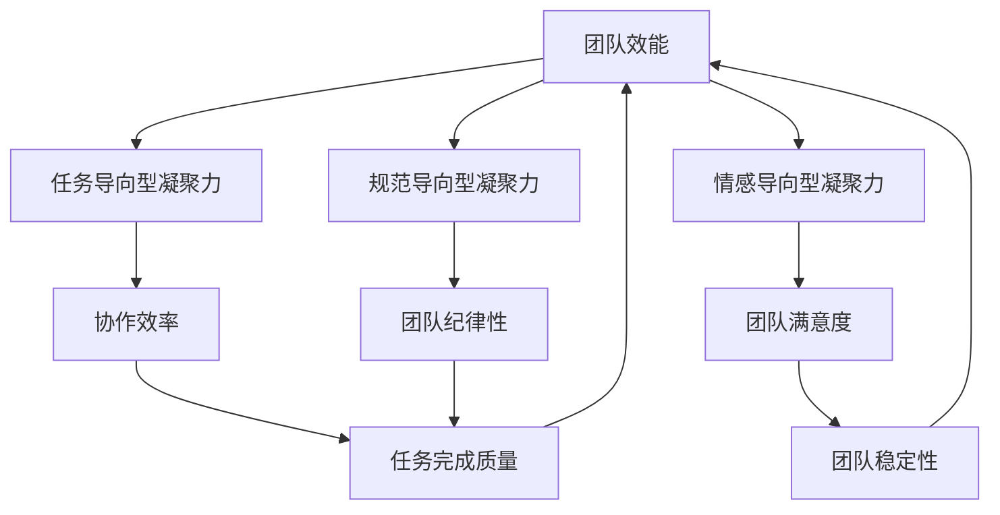

                 

### 团队建设的重要性

#### 组织效能与团队凝聚力

在当今快速变化且高度竞争的商业环境中，组织效能成为了企业成功的关键因素。团队作为组织的基本单位，其效能直接影响到整体组织的运作效果。而团队凝聚力则是提升团队效能的重要保障。通过增强团队凝聚力，团队成员能够在更加和谐、高效的环境中协同工作，从而提高整体组织的竞争力和创新能力。

团队凝聚力（Team Cohesion）指的是团队成员之间的相互吸引、信任、合作以及愿意共同为团队目标努力的程度。高凝聚力的团队通常表现出较强的团队精神，成员之间互相支持，协作顺畅，这种团队氛围有助于提升团队的效能和生产力。相反，如果团队凝聚力不足，团队成员之间可能存在隔阂、不信任或冲突，导致团队效能下降，甚至影响整个组织的运作。

#### 团队凝聚力的作用

1. **增强团队精神**：团队凝聚力促使团队成员在共同的目标下团结一致，形成强大的团队精神。这种精神能够激发成员的积极性和主动性，使团队成员在面对挑战和困难时能够齐心协力，共同克服。

2. **提升协作效率**：高凝聚力的团队通常具备良好的沟通和协作机制，成员之间的信息共享和资源整合更加顺畅。这使得团队成员能够迅速响应任务需求，提高工作质量和效率。

3. **促进创新思维**：在一个凝聚力和信任度高的团队中，成员更容易分享自己的想法和观点，这种开放的氛围有助于创新思维的产生和实施。团队凝聚力有助于创造一个鼓励创新和尝试的环境。

4. **降低员工流失率**：团队凝聚力能够增强员工对团队的归属感和忠诚度，降低员工流失率。稳定的团队成员有助于知识的积累和传递，从而提高整个团队的长期竞争力。

5. **提升组织绩效**：团队凝聚力直接影响团队效能，而团队效能又直接关联到组织的整体绩效。一个凝聚力强的团队能够更高效地完成组织目标，从而提升组织的绩效和竞争力。

#### 团队建设与组织发展的关系

团队建设（Team Building）是增强团队凝聚力的重要手段。通过团队建设活动，组织可以帮助团队成员更好地了解彼此，建立信任关系，明确共同目标，从而提高团队的整体效能。

团队建设与组织发展之间的关系可以概括为以下几点：

1. **促进组织文化的形成**：团队建设有助于传播和强化组织文化，使员工对组织的价值观和使命有更深刻的认同。

2. **提高员工满意度**：有效的团队建设能够提升员工的满意度和归属感，从而提高员工的积极性和工作效率。

3. **增强组织的适应能力**：团队建设能够帮助组织培养更加灵活和适应性强的团队，使组织能够更好地应对外部环境的变化。

4. **提升组织的创新能力**：通过团队建设，组织可以激发团队成员的创新思维和创造力，从而推动组织的持续创新和发展。

#### 结论

综上所述，团队建设对于组织的重要性不言而喻。通过增进团队凝聚力，组织能够提高团队效能，促进组织文化的形成，提升员工满意度，增强组织的适应能力和创新能力。因此，团队建设是组织发展中不可或缺的一环，值得组织管理者高度重视和投入。在接下来的章节中，我们将进一步探讨团队凝聚力的核心概念、构成要素、影响因素及其测量方法，以及具体如何通过策略来提升团队凝聚力。

### 团队凝聚力的核心概念与联系

#### 团队凝聚力的定义

团队凝聚力是指团队成员之间的相互吸引、信任和合作的程度，这种吸引力和信任感促使团队成员愿意为团队的目标和利益共同努力。团队凝聚力不仅仅是物理空间上的集中，更重要的是心理上的相互支持和协作。

#### 团队凝聚力的属性

1. **正向性**：团队凝聚力通常被认为是正面的特质，它能够促进团队合作，增强团队效能。正向的凝聚力有助于团队成员之间建立积极的关系，提升团队士气和工作效率。

2. **稳定性**：团队凝聚力具有稳定性，它不是一时的心血来潮，而是随着时间的推移逐渐形成的。稳定的凝聚力能够使团队在面对外部压力和挑战时保持团结和协同。

3. **动态性**：团队凝聚力是动态变化的，它受多种因素影响，包括团队发展阶段、外部环境变化、团队成员的个性特点等。因此，团队凝聚力需要不断调整和优化。

4. **相对性**：团队凝聚力具有相对性，不同的团队和组织对凝聚力的要求不同。某些团队可能更注重任务的完成，而另一些团队则可能更重视成员之间的情感连接。

#### 团队凝聚力的类型

1. **任务导向型凝聚力**：这种凝聚力源于团队成员对共同任务的认同和共同目标的追求。任务导向型凝聚力能够促进团队成员之间的协作和努力，提高工作效率。

2. **情感导向型凝聚力**：这种凝聚力建立在团队成员之间的情感联系和友谊上。情感导向型凝聚力有助于增强团队的凝聚力和成员的归属感，提高团队满意度。

3. **规范导向型凝聚力**：这种凝聚力源于团队成员对团队规范和价值观的认同。规范导向型凝聚力能够确保团队成员在行为上的一致性，提高团队的纪律性。

#### 团队凝聚力与团队效能的关系

团队凝聚力与团队效能之间存在密切的关系。研究表明，高凝聚力的团队通常表现出更高的团队效能。以下是一些具体的关系：

1. **增强协作效率**：高凝聚力的团队能够更高效地进行信息共享和资源整合，减少沟通障碍和协作成本。

2. **提高任务完成质量**：团队成员之间的紧密协作和相互支持有助于提高任务完成的质量和效率。

3. **促进创新和创造力**：在一个凝聚力强的团队中，成员更容易分享自己的想法和观点，从而激发创新思维和创造力。

4. **增强团队稳定性**：高凝聚力的团队在面对外部挑战和压力时能够保持稳定和协同，从而提高团队的抗风险能力。

#### 团队凝聚力的影响因素

团队凝聚力受多种因素影响，以下是一些主要的影响因素：

1. **团队发展阶段**：团队在不同的发展阶段，凝聚力水平会有所不同。例如，在形成期，团队成员可能更注重建立信任关系；在成熟期，团队成员之间的凝聚力可能更高。

2. **团队成员的个性特点**：团队成员的个性、价值观和行为方式会影响团队凝聚力。例如，外向和开放性格的成员可能更容易建立紧密的关系。

3. **外部环境因素**：外部环境的变化，如市场竞争压力、组织变革等，会影响团队的凝聚力。良好的外部环境有助于增强团队凝聚力。

4. **团队目标明确度**：明确且具有挑战性的团队目标能够增强团队成员的凝聚力和动力。

#### 团队凝聚力与团队效能的关系模型

下图展示了团队凝聚力与团队效能之间的关系模型：



#### 概念属性特征对比表格

| 特征             | 任务导向型凝聚力 | 情感导向型凝聚力 | 规范导向型凝聚力 |
|------------------|------------------|------------------|------------------|
| 形成因素         | 共同任务         | 情感联系         | 规范认同         |
| 维持机制         | 任务完成         | 情感支持         | 规范遵守         |
| 稳定性           | 较稳定           | 较稳定           | 较稳定           |
| 动态性           | 较稳定           | 较灵活           | 较稳定           |
| 主导因素         | 任务需求         | 情感需求         | 规范需求         |

#### ER实体关系图

为了更清晰地展示团队凝聚力相关实体的关系，我们可以使用ER（实体关系）图来表示。以下是团队凝聚力相关实体的ER图：

```mermaid
erDiagram
    TeamMember ||--|{ TeamCohesion }|| Team
    TeamCohesion ||--|{ TaskOrientation }|| Task
    TeamCohesion ||--|{ EmotionalOrientation }|| Emotion
    TeamCohesion ||--|{ NormativeOrientation }|| Norm
    Team ||--|{ TeamEffectiveness }|| Effectiveness
```

在上述ER图中，`TeamMember`（团队成员）与`TeamCohesion`（团队凝聚力）之间存在多对多关系，表示一个团队成员可以有多项凝聚力特质，而每项凝聚力特质又可以影响多个团队成员。`TeamCohesion`与`TaskOrientation`、`EmotionalOrientation`和`NormativeOrientation`之间存在关联，表示不同的凝聚力类型。`Team`（团队）与`TeamEffectiveness`（团队效能）之间存在关联，表示团队凝聚力对团队效能有直接影响。

通过上述的核心概念与联系讨论，我们为理解团队凝聚力及其影响奠定了基础。在接下来的章节中，我们将进一步分析影响团队凝聚力的多种因素，以及如何通过测量方法来评估团队凝聚力水平。

### 团队凝聚力的影响因素

团队凝聚力并不是一成不变的，它受到多种内外部因素的影响。以下我们将详细探讨影响团队凝聚力的关键因素，包括团队成员之间的信任、沟通、共同目标和组织文化等。

#### 信任

信任是团队凝聚力的基础。团队成员之间的信任程度直接影响到团队合作的效率和效果。信任包括以下几个方面：

1. **诚实与透明**：团队成员之间是否能够坦诚相待，公开信息，是建立信任的关键。缺乏透明度会导致误解和猜疑，降低团队凝聚力。

2. **可靠性**：团队成员是否能够履行承诺，按时完成任务，也是信任的重要体现。可靠性高的团队成员能够赢得他人的信任，从而增强团队凝聚力。

3. **共同经历**：团队成员通过共同的经历和挑战，如项目合作、团队合作活动等，可以加深彼此的了解和信任。共同经历的积极体验有助于提升团队凝聚力。

案例：在一个成功开发新产品的团队中，成员之间建立了深厚的信任关系。团队成员经常分享项目进展，遇到问题时会共同讨论解决方案。这种信任关系使得团队成员在面临挑战时能够齐心协力，最终成功完成了项目。

#### 沟通

沟通是团队凝聚力的关键因素之一。有效的沟通能够促进团队成员之间的理解和协作，提高团队效能。

1. **倾听**：倾听是有效沟通的重要组成部分。团队成员在交流时，不仅要表达自己的观点，还要认真倾听他人的意见。倾听能够增进相互理解，减少误解和冲突。

2. **清晰表达**：团队成员需要能够清晰、准确地表达自己的想法和意见。清晰的表达能够避免误解，提高沟通效率。

3. **反馈**：及时的反馈是沟通的重要环节。团队成员需要能够对彼此的观点和表现提供反馈，以便改进和优化工作。

案例：在一个项目管理团队中，每周都会举行一次沟通会议。团队成员在会议中分享项目进展、遇到的问题以及解决方案。这种定期沟通机制不仅提高了团队的透明度，还增强了成员之间的信任和协作，从而提升了团队凝聚力。

#### 共同目标

共同目标是团队凝聚力的核心驱动力。当团队成员拥有共同的目标时，他们会为了实现这个目标而共同努力，从而增强团队的凝聚力。

1. **明确的目标**：共同目标需要明确、具体，使每个团队成员都能清晰地了解自己的职责和目标。

2. **目标一致性**：团队成员的目标需要一致，这样他们才能在实现目标的过程中保持协调和一致。

3. **目标激励**：共同目标应该具有挑战性，能够激发团队成员的积极性和创造力。

案例：在一个研发团队中，团队成员共同制定了实现新产品的市场目标。这个目标不仅明确了团队成员的具体任务，还激发了他们的工作热情，使得团队成员在项目中表现出高度的协作精神和奉献精神，从而提升了团队凝聚力。

#### 组织文化

组织文化对团队凝聚力有着深远的影响。一个积极、开放的组织文化能够促进团队凝聚力的提升。

1. **支持性文化**：一个支持性的组织文化能够鼓励团队成员之间的合作和信任。这种文化氛围有助于增强团队凝聚力。

2. **包容性文化**：包容性文化能够接纳不同的观点和个性，使团队成员感受到尊重和认可。这种文化有助于提升团队成员的归属感和凝聚力。

3. **共同价值观**：组织共同的价值观能够为团队成员提供行为指南，使团队成员在价值观上保持一致，从而增强团队凝聚力。

案例：在一个提倡创新和开放的科技公司中，团队成员之间的沟通非常顺畅，组织鼓励员工提出新的想法和建议。这种文化氛围不仅促进了团队内部的协作，还增强了团队成员的信任和凝聚力。

#### 其他影响因素

除了上述关键因素外，还有一些其他因素也会影响团队凝聚力，如团队成员的个性特点、外部环境变化等。团队成员的个性特点，如外向、开放、合作等，会影响他们与他人的互动方式，进而影响团队凝聚力。外部环境的变化，如市场竞争压力、组织变革等，也可能对团队凝聚力产生一定影响。

总之，团队凝聚力是多种因素共同作用的结果。通过建立信任、促进沟通、明确共同目标和营造积极组织文化，组织可以有效地提升团队凝聚力，从而提高团队的效能和竞争力。

### 团队凝聚力的测量方法

评估团队凝聚力的强弱是提升团队效能的重要步骤。以下将介绍几种常用的团队凝聚力测量方法，包括量表和问卷调查工具，以及如何通过数据分析得出结论。

#### 1. 常用量表

**LMX量表（领导者-成员交换量表）**：这是一种评估领导者与成员之间信任和互动程度的量表。该量表通过调查成员对领导者的信任度、领导者对成员的支持度等维度，评估团队凝聚力的强弱。

**TIQ量表（团队内部信任量表）**：这是一种专门评估团队成员之间信任关系的量表。量表通过调查成员对同事的信任感、协作意愿等指标，衡量团队内部信任水平。

**TCP量表（团队凝聚力量表）**：这是一种综合评估团队凝聚力多维度的量表。量表包括任务凝聚力、社交凝聚力、情感凝聚力等维度，提供全面的团队凝聚力评估。

#### 2. 问卷调查工具

问卷调查是评估团队凝聚力的常用方法。以下是一些常用的问卷调查工具：

**问卷调查平台**：如Qualtrics、SurveyMonkey等，这些平台提供了丰富的问卷设计模板和数据分析功能，方便进行团队凝聚力的评估。

**开放式问卷**：这种问卷允许团队成员自由表达对团队凝聚力的看法和建议。开放式问卷的优点是能够收集到更详细的信息，但缺点是数据分析较为复杂。

**封闭式问卷**：这种问卷通过选择题或量表形式，量化评估团队成员对团队凝聚力的感受。封闭式问卷的优点是数据收集和分析较为简便，但可能无法深入了解团队成员的真实想法。

#### 3. 数据分析方法

在收集到问卷数据后，通过以下数据分析方法，可以得出团队凝聚力的结论：

**描述性统计分析**：通过计算平均值、标准差、频率等指标，描述团队成员对团队凝聚力的整体感受和分布情况。

**相关分析**：通过计算团队成员对团队凝聚力的评分与其他变量（如工作满意度、绩效等）之间的相关性，分析团队凝聚力对其他因素的影响。

**回归分析**：通过建立回归模型，分析团队凝聚力对团队效能的预测作用。回归分析可以帮助确定团队凝聚力的关键影响因素。

**聚类分析**：通过将团队成员按照团队凝聚力水平进行聚类，分析不同聚类群体的特征和差异。聚类分析有助于发现团队凝聚力的不同模式。

**因子分析**：通过因子分析，将多个变量缩减为几个主要因子，从而简化数据分析过程。因子分析可以帮助识别影响团队凝聚力的关键维度。

#### 4. 实际案例分析

以下是一个实际案例，展示如何使用量表和问卷调查工具评估团队凝聚力：

**案例背景**：某公司研发部门希望通过测量团队凝聚力，了解团队工作状况，并制定改进策略。

**步骤1：选择量表**：选择合适的团队凝聚力量表，如TCP量表，设计问卷。

**步骤2：分发问卷**：将问卷通过电子邮件或在线平台分发给所有研发团队成员。

**步骤3：收集数据**：在规定时间内收集问卷数据，确保数据完整和有效。

**步骤4：数据分析**：使用描述性统计分析和回归分析方法，分析团队成员对团队凝聚力的评价及其与工作满意度、绩效等变量的关系。

**步骤5：报告与反馈**：撰写数据分析报告，向管理层和团队成员反馈结果，并提出改进建议。

**结果**：分析结果显示，研发团队的团队凝聚力整体水平较高，但存在一些需要改进的方面，如团队成员之间的沟通效率和信任度。根据分析结果，公司管理层制定了针对性的改进措施，如加强团队沟通培训、优化工作流程等，以进一步提升团队凝聚力。

通过上述测量方法和分析步骤，组织可以准确评估团队凝聚力水平，发现存在的问题，并制定有效的改进策略，从而提升团队效能和竞争力。

### 增进团队凝聚力的策略

#### 团队建设活动的目的与类型

团队建设活动旨在通过一系列互动和合作，增强团队成员之间的信任、沟通和协作能力，从而提升团队凝聚力和效能。团队建设活动的目的是多方面的：

1. **增强团队成员之间的信任**：通过共同经历和合作，团队成员能够更好地理解彼此，建立信任关系。
2. **改善沟通与协作**：通过团队活动，团队成员能够学会更有效的沟通技巧和协作方法，提高工作效率。
3. **明确共同目标**：团队建设活动有助于团队成员共同制定和认同团队目标，提高团队凝聚力。
4. **培养团队精神**：通过团队合作，培养团队成员的集体荣誉感和归属感。

根据活动形式和目的的不同，团队建设活动可以分为以下几种类型：

1. **户外拓展活动**：如徒步、攀岩、定向越野等，这类活动能够增强团队成员的身体素质，同时培养团队协作和解决问题的能力。
2. **室内培训与研讨会**：如团队沟通技巧培训、领导力发展研讨会等，这类活动通过专业讲师的指导，提升团队成员的技能和知识。
3. **项目合作**：通过实际项目合作，团队成员能够共同面对挑战，解决问题，从而增强团队合作能力。
4. **团队游戏与竞赛**：如团队解谜游戏、团队运动会等，这类活动能够激发团队成员的竞争精神，增强团队凝聚力。

#### 团队建设活动的实施步骤

1. **前期准备**：确定团队建设活动的时间、地点、参与人员及预算。制定详细的计划，包括活动目标、活动流程、所需资源和预期效果。

2. **活动过程**：按照计划实施团队建设活动，确保活动顺利进行。在活动过程中，注意引导团队成员参与，鼓励互动和分享。根据活动的类型，可能包括以下环节：
    - **开场破冰**：通过互动游戏或分享环节，打破成员之间的隔阂，营造轻松的氛围。
    - **任务执行**：根据活动目标，分配任务给团队成员，引导团队成员协作完成。
    - **分享与反思**：活动结束后，团队成员分享心得体会，反思活动过程中的收获和不足。

3. **活动评估**：在活动结束后，通过问卷调查、访谈等方式收集团队成员的反馈。评估活动的效果，分析是否达到预期目标，发现存在的问题。

#### 成功的团队建设活动案例

**案例一：某企业的新员工融入活动**

背景：某企业每年都会招聘大量新员工，为了帮助新员工快速融入企业，企业组织了一系列团队建设活动。

步骤：
1. **前期准备**：企业为新员工准备了详细的入职培训资料，并安排了新员工导师。
2. **活动过程**：新员工入职的第一天，企业组织了团队破冰活动，通过游戏和互动，让新员工快速认识彼此。随后，新员工被分配到各个部门，与部门成员共同完成一系列任务，如团队拼图、团队讨论等。
3. **活动评估**：通过问卷调查和新员工反馈，企业了解到新员工对团队建设活动的满意度较高，很多新员工表示通过活动更快地融入了团队，建立了初步的人际关系。

效果：通过团队建设活动，新员工能够更快地适应企业文化和工作环境，减少了新员工适应期的不适感，提高了工作效率和团队凝聚力。

**案例二：某团队的项目合作活动**

背景：某团队负责一个重要的项目，为了确保项目顺利进行，团队组织了多次团队建设活动。

步骤：
1. **前期准备**：项目启动前，团队明确了项目目标和任务分工，并为每个团队成员准备了项目手册。
2. **活动过程**：在项目执行过程中，团队每周都会举行一次项目进展会议，通过头脑风暴、任务讨论等形式，确保团队成员之间的沟通和协作。此外，团队还组织了多次户外拓展活动，如徒步、烧烤等，增强团队成员之间的友谊和信任。
3. **活动评估**：通过定期的项目进展报告和团队成员反馈，团队发现团队建设活动有助于提高项目效率和质量。团队成员在合作过程中，能够更有效地解决问题，项目进度和成果得到了客户的高度认可。

效果：通过团队建设活动，项目团队在压力和挑战面前保持了良好的协作和沟通，最终顺利完成了项目，提升了团队凝聚力和整体效能。

#### 团队建设活动中的注意事项

1. **避免形式化**：团队建设活动不能仅仅流于形式，需要注重实际效果。活动设计应贴近团队成员的实际需求，确保活动内容具有实用性和针对性。
2. **注重实际效果**：在活动结束后，应通过反馈和评估，了解团队成员的参与感受和收获。根据评估结果，及时调整和优化活动方案，确保活动能够真正促进团队凝聚力的提升。
3. **持续跟进**：团队建设不是一次性的活动，而是一个持续的过程。组织应定期组织团队建设活动，并关注团队成员的长期发展，确保团队凝聚力不断提升。

通过合理的团队建设活动，组织能够有效地增进团队凝聚力，提高团队效能和竞争力。在接下来的章节中，我们将继续探讨如何通过沟通技巧、领导风格和激励措施来进一步提升团队凝聚力。

### 沟通技巧

#### 有效沟通的重要性

在团队建设中，沟通是至关重要的一环。有效的沟通不仅能够确保团队成员之间信息的准确传递，还能增强团队的凝聚力和工作效率。以下将从倾听技巧、明确表达和提问技巧三个方面，详细探讨如何提升团队沟通效果。

#### 倾听技巧

1. **积极倾听**：积极倾听意味着不仅听对方说什么，还要关注对方的情绪和感受。在倾听时，要保持眼神交流，点头表示理解，避免打断对方的发言。

2. **同理心**：同理心是倾听的重要部分，它要求我们站在对方的角度思考问题，理解对方的感受。同理心能够减少误解和冲突，增进团队成员之间的信任。

3. **开放式问题**：在倾听过程中，通过开放式问题引导对方表达更详细的信息，有助于深入了解对方的观点和需求。例如，“你能具体谈谈你的想法吗？”或“你觉得这个问题有哪些解决方案？”

案例：在一个项目管理团队中，项目经理经常使用积极倾听技巧来确保团队成员的意见和建议得到充分听取。每次会议前，项目经理都会预留时间让团队成员自由发言，并积极回应他们的意见。通过这种方式，团队成员感受到了被重视和尊重，团队内部沟通变得更加顺畅。

#### 明确表达

1. **清晰简练**：在表达自己的观点时，应尽量使用简单、清晰的语言，避免使用复杂的术语或过于冗长的句子。简洁明了的表达能够减少误解，提高沟通效率。

2. **明确目标**：在沟通过程中，要明确自己的沟通目标，确保对方理解你的意图。例如，在提出一个建议时，可以明确指出建议的目的和预期效果。

3. **使用非语言符号**：非语言符号，如肢体语言、面部表情和姿态等，能够补充和强化语言信息。恰当使用这些符号，可以增强沟通的效果。

案例：在一个产品开发团队中，团队领导在会议中总是注意自己的语言表达，使用简洁明了的语言描述项目进展和任务分配。同时，他还会结合肢体语言，如点头、微笑等，来表示对团队成员的支持和认可。这种明确表达的方式使得团队成员更加理解和接受领导的要求。

#### 提问技巧

1. **开放式问题**：开放式问题能够引导对方进行深入的思考，提供更多的信息。例如，“你对这个问题有什么看法？”或“你认为我们如何改进这个流程？”

2. **封闭式问题**：封闭式问题用于获取特定的信息或确认对方的理解。例如，“你同意这个方案吗？”或“你的意思是……对吗？”

3. **跟进问题**：在对方回答后，通过跟进问题进一步澄清和确认信息。例如，“你觉得这个解决方案可行吗？”或“你对这个计划的实施有何建议？”

案例：在一个市场推广团队中，团队成员在讨论一个新市场策略时，项目经理通过提问技巧引导讨论。他首先提出开放式问题，“大家对这个新市场策略有何看法？”然后通过封闭式问题确认团队成员的理解，“小李，你的意思是我们应该先进行市场调研，对吗？”最后，通过跟进问题进一步讨论细节，“小张，你认为我们应该如何实施这个策略？”

#### 案例分析

**案例一：改善团队沟通的实践**

背景：某团队在项目执行过程中，由于沟通不畅，导致项目进度延迟，团队成员之间出现了矛盾。

步骤：
1. **倾听与表达**：团队成员在每次会议前，进行一对一的沟通，倾听对方的意见和想法。同时，成员们学习如何清晰表达自己的观点，避免使用含糊不清的语言。
2. **提问技巧**：团队成员在讨论中积极使用提问技巧，确保对问题有深入的理解。通过开放式问题和跟进问题，团队成员能够更清晰地了解彼此的立场和需求。
3. **反馈与调整**：在每次会议后，团队成员对沟通效果进行反馈，提出改进建议。通过不断调整和优化沟通方式，团队内部的沟通变得更加顺畅。

效果：通过上述沟通技巧的实践，团队内部矛盾减少，项目进度得到显著提升，团队成员之间的信任和协作水平提高。

**案例二：如何解决团队中的误解**

背景：在一个开发团队中，由于某个功能模块的分歧，团队成员之间出现了误解。

步骤：
1. **积极倾听**：团队成员进行一对一的沟通，积极倾听对方的观点和感受。通过同理心，理解对方的立场和动机。
2. **明确表达**：团队成员在沟通中，明确表达自己的观点和期望，避免使用模糊的语言。同时，使用非语言符号，如点头、微笑等，表达对对方的尊重。
3. **提问与澄清**：通过提问技巧，团队成员澄清误解，确保对问题有共同的理解。通过跟进问题，进一步确认对方的意图和期望。

效果：通过上述沟通技巧，团队成员之间的误解得到解决，团队成员重新达成一致，项目得以顺利推进。

综上所述，有效的沟通技巧对于提升团队凝聚力和工作效率至关重要。通过倾听、明确表达和提问技巧，团队可以建立良好的沟通机制，减少误解和冲突，增强团队的协作和凝聚力。

### 领导风格

领导风格对团队凝聚力和效能有着深远的影响。不同的领导风格适用于不同的团队和环境，有效的领导风格能够增强团队成员之间的信任和协作，提升团队的整体表现。以下将介绍几种常见的领导风格，包括参与式领导、指导式领导以及情境领导理论。

#### 参与式领导

参与式领导（Participative Leadership）是一种以团队成员参与决策和问题解决为核心的领导风格。在这种领导风格下，领导者鼓励团队成员提出建议和意见，共同参与决策过程。参与式领导的核心原则是赋予团队成员更多的自主权和责任感，通过集思广益，提高团队的创新能力和问题解决能力。

1. **特点**：
   - **开放式沟通**：领导者鼓励团队成员自由表达观点，积极参与讨论。
   - **民主决策**：领导者尊重团队成员的意见，通过民主方式作出决策。
   - **信任与支持**：领导者信任团队成员的能力，提供必要的支持和资源。

2. **适用情境**：
   - **创新性项目**：参与式领导能够激发团队成员的创新思维，适用于需要高度创造力和团队协作的项目。
   - **知识型团队**：知识型团队中成员具备丰富的专业知识和经验，参与式领导有助于发挥团队的整体优势。

3. **优点**：
   - **增强团队凝聚力**：团队成员在参与决策过程中，感受到被重视和尊重，增强了团队凝聚力。
   - **提高团队效能**：团队成员的积极性和主动性得到提升，项目执行效率更高。

4. **缺点**：
   - **决策效率较低**：参与式领导可能因为讨论时间过长，导致决策效率降低。
   - **需要更多沟通协调**：领导者需要花费更多时间和精力在沟通和协调上，以确保团队成员的意见得到充分表达。

案例：在一个高科技企业的研发团队中，领导采用参与式领导风格，鼓励团队成员参与项目规划和决策。团队成员在项目中提出了许多创新性的建议，项目进展顺利，团队成员的满意度和团队凝聚力显著提高。

#### 指导式领导

指导式领导（Directive Leadership）是一种以领导者的指令和指导为核心的领导风格。在这种风格下，领导者明确团队的目标和任务，为团队成员提供具体的指导和支持。指导式领导强调任务完成和目标达成，适用于需要高度组织和纪律性的团队。

1. **特点**：
   - **明确指令**：领导者明确指示任务和目标，规定工作内容和期限。
   - **严格监督**：领导者对团队成员的工作进行严格监督，确保任务按时完成。
   - **控制权集中**：领导者拥有较大的控制权，决策和命令由领导者做出。

2. **适用情境**：
   - **紧急任务**：在紧急情况下，指导式领导能够迅速制定计划和行动，确保任务及时完成。
   - **常规运营**：在常规运营中，指导式领导能够确保团队按照预定计划高效运作。

3. **优点**：
   - **任务执行效率高**：领导者通过明确指令和严格监督，确保任务高效执行。
   - **团队纪律性强**：指导式领导有助于建立严格的团队纪律，提高团队执行力。

4. **缺点**：
   - **限制创新思维**：团队成员的自主性和创新能力可能受到限制，影响团队的长期发展。
   - **缺乏团队参与感**：团队成员可能感到缺乏参与感和归属感，降低团队凝聚力。

案例：在一个大型制造业工厂中，领导采用指导式领导风格，通过明确指令和严格监督，确保生产线的顺畅运作。这种领导风格在确保生产任务高效完成的同时，也提高了团队的纪律性。

#### 情境领导理论

情境领导理论（Situational Leadership Theory）是由保罗·赫塞（Paul Hersey）和肯尼思·布兰查德（Kenneth Blanchard）提出的一种基于领导者与团队成员关系动态变化的领导理论。该理论认为，领导风格应根据团队成员的能力和任务环境灵活调整。

1. **领导风格模型**：
   - **指导型领导**（S1）：领导者为团队成员提供明确的指导和支持，适用于团队成员能力较低的情况。
   - **推销型领导**（S2）：领导者不仅提供指导，还通过沟通和激励，帮助团队成员提升能力，适用于团队成员能力一般但任务复杂的情况。
   - **参与型领导**（S3）：领导者与团队成员共同参与决策和问题解决，适用于团队成员能力较强但任务需要协作的情况。
   - **授权型领导**（S4）：领导者赋予团队成员高度自主权，适用于团队成员能力较强且任务简单的情况。

2. **适用情境**：
   - **能力差异明显**：当团队成员的能力差异较大时，情境领导理论能够根据不同成员的能力和任务需求，灵活调整领导风格。
   - **任务复杂多变**：在任务复杂多变的环境中，情境领导理论能够帮助领导者根据实际情况，选择最合适的领导风格。

3. **优点**：
   - **灵活适应**：领导者能够根据团队成员的能力和任务环境，灵活调整领导风格，提高团队适应能力。
   - **促进成员发展**：通过不同的领导风格，领导者能够帮助团队成员在不同阶段提升能力，实现个人和团队的目标。

4. **缺点**：
   - **领导者要求高**：情境领导理论要求领导者具备较高的领导能力和判断力，灵活调整领导风格，对领导者的要求较高。

案例：在一个技术支持团队中，领导根据情境领导理论，根据团队成员的能力和任务需求，灵活调整领导风格。对于新加入的成员，采用指导型领导，提供详细的任务指导和支持；对于经验丰富的成员，采用参与型领导，鼓励团队成员参与决策和问题解决。这种灵活的领导风格使得团队在处理技术问题和支持客户需求时，能够高效协同，提高客户满意度。

综上所述，不同的领导风格适用于不同的团队和情境。有效的领导者能够根据团队和任务的需求，灵活调整领导风格，促进团队凝聚力和效能的提升。

### 激励措施

在团队建设中，激励措施是提升团队凝聚力和效能的重要手段。有效的激励措施能够激发团队成员的积极性和创造力，增强团队的整体表现。以下将介绍几种常见的激励措施，包括奖励制度、晋升机制和培训计划等。

#### 奖励制度

1. **绩效考核奖励**：根据团队成员的绩效表现，设立不同的奖励标准，如绩效奖金、年终奖等。这种奖励制度能够激励团队成员在工作中的积极性和效率。

2. **优秀员工奖励**：设立“月度优秀员工”、“年度优秀员工”等荣誉称号，对表现突出的员工进行表彰和奖励。这种荣誉奖励不仅能够提高员工的工作积极性，还能增强团队的凝聚力和归属感。

3. **即时奖励**：对于完成重要任务或取得显著成果的团队成员，给予即时奖励，如奖金、礼品等。即时奖励能够迅速激励员工，提高工作效率。

#### 晋升机制

1. **职业发展路径**：为员工设定明确的职业发展路径，包括初级、中级、高级等不同级别。通过晋升机制，员工可以看到自己在公司的职业前景，从而更加努力工作。

2. **内部调岗机会**：为员工提供内部调岗机会，使其能够在不同的岗位上锻炼和成长。内部调岗不仅能够丰富员工的工作经验，还能激发员工的学习兴趣和创造力。

3. **晋升评审制度**：定期进行晋升评审，评估员工的绩效、能力和潜力，给予合适的晋升机会。晋升评审制度能够激励员工不断提升自己，追求更高的职业目标。

#### 培训计划

1. **技能培训**：为员工提供各种技能培训，如领导力培训、项目管理培训、技术技能培训等。技能培训能够提升员工的专业能力，增强团队的整体竞争力。

2. **发展性培训**：除了专业技能培训，还可以提供发展性培训，如沟通技巧、时间管理、团队合作等。发展性培训有助于提高员工的综合素质，增强团队协作能力。

3. **外部培训机会**：为员工提供外部培训机会，如参加行业会议、研讨会等。外部培训能够拓宽员工的视野，学习行业前沿知识和经验。

#### 案例分析

**案例一：某公司的奖励制度**

背景：某公司为了提升团队凝聚力和工作效率，设立了绩效考核奖励制度。

步骤：
1. **设定绩效标准**：根据公司的业务目标和员工岗位特点，设定明确的绩效标准。
2. **定期评估**：每季度对员工的绩效进行评估，根据评估结果发放绩效奖金。
3. **表彰优秀员工**：每半年评选一次“优秀员工”，给予荣誉奖励和物质奖励。

效果：通过绩效考核奖励制度，员工的工作积极性和效率显著提高。优秀员工获得荣誉奖励后，士气高涨，团队凝聚力明显增强。

**案例二：某公司的晋升机制**

背景：某公司为了激励员工追求职业发展，设立了明确的晋升机制。

步骤：
1. **职业发展路径**：为每个岗位设定明确的职业发展路径，包括初级、中级、高级等不同级别。
2. **晋升评审**：每季度进行一次晋升评审，评估员工的绩效和潜力。
3. **内部调岗**：根据员工的兴趣和公司需求，提供内部调岗机会。

效果：通过晋升机制，员工看到了清晰的职业发展路径，工作动力和忠诚度显著提升。内部调岗机会不仅丰富了员工的工作经验，还增强了团队的多样性和创新能力。

**案例三：某公司的培训计划**

背景：某公司为了提升员工的专业能力和团队协作能力，制定了全面的培训计划。

步骤：
1. **技能培训**：定期组织技术技能培训，如编程技能、项目管理等。
2. **发展性培训**：提供沟通技巧、团队合作等培训，提升员工的综合素质。
3. **外部培训机会**：鼓励员工参加行业会议、研讨会等外部培训。

效果：通过培训计划，员工的专业能力和团队合作水平显著提升，团队的协作效率和创新能力得到增强。外部培训机会拓宽了员工的视野，为公司的长远发展提供了有力支持。

综上所述，有效的激励措施能够显著提升团队凝聚力和工作效率。通过奖励制度、晋升机制和培训计划等多种方式，公司可以激励员工追求卓越，实现个人和团队的共同发展。

### 团队凝聚力提升案例分析

#### 案例一：某科技公司的团队建设实践

**背景**：
某科技公司是一家高速成长的初创企业，团队成员来自不同的背景，拥有丰富的专业知识和经验。然而，随着公司的快速发展，团队成员之间的沟通和协作出现了问题，团队凝聚力不足，影响了项目的进展和公司的整体绩效。

**问题**：
团队成员之间缺乏信任，沟通不畅，导致项目进度延迟，工作质量下降。此外，团队成员对公司的文化和价值观认同感不强，缺乏归属感。

**解决方案**：
1. **团队建设活动**：
   - **团队拓展训练**：公司组织了多次户外拓展训练，如攀岩、徒步、定向越野等。这些活动不仅增强了团队成员之间的信任和协作能力，还提高了员工的身体素质和团队精神。
   - **团队沟通研讨会**：公司邀请专业沟通培训师，组织了一系列沟通技巧研讨会，帮助团队成员学会更有效的沟通方法。

2. **文化建设**：
   - **价值观认同**：公司通过定期举办团队会议和分享会，强化团队成员对公司和价值观的认同。例如，公司设立了“价值观奖”，表彰那些在价值观践行中表现突出的员工。
   - **团队活动**：公司定期组织团队活动，如团队建设日、团队运动会等，增强员工的团队归属感和集体荣誉感。

**效果**：
通过团队建设活动和文化建设，团队成员之间的信任和沟通显著改善，项目进度和效率明显提升。员工对公司的认同感和归属感增强，员工的离职率也大幅下降。

**成功因素**：
- **目标明确**：团队建设活动和文化建设围绕明确的目标进行，确保了活动的针对性和有效性。
- **持续投入**：公司对团队建设和文化建设持续投入资源，不仅提高了员工的工作积极性，还建立了长期稳定的团队凝聚力。

**面临的挑战**：
- **时间管理**：在快速发展的初创企业中，如何在繁忙的工作中安排团队建设活动，是一个挑战。
- **文化差异**：团队成员来自不同的文化背景，如何平衡和融合不同的价值观，也是一个需要解决的问题。

#### 案例二：某制造业公司的团队凝聚力提升

**背景**：
某制造业公司因为长期的高压工作环境和严格的绩效要求，导致员工压力过大，团队凝聚力下降。员工之间的矛盾和冲突增多，影响了工作效率和公司绩效。

**问题**：
员工之间的信任度低，沟通不畅，工作压力大，导致士气低落，工作效率下降。此外，公司内部的竞争气氛过浓，影响了团队的协作和凝聚力。

**解决方案**：
1. **改善沟通机制**：
   - **开放会议**：公司定期组织开放会议，鼓励员工表达意见和反馈，增强员工对公司决策的参与感和信任感。
   - **定期反馈**：公司设立了定期反馈机制，通过员工满意度调查和绩效反馈，及时了解员工的工作情况和需求。

2. **激励措施**：
   - **绩效奖励**：公司调整了绩效奖励制度，不仅关注个人绩效，还鼓励团队合作和协作精神。通过团队奖励，增强员工之间的协作和信任。
   - **员工关怀**：公司制定了员工关怀计划，如员工体检、心理健康咨询等，关注员工的身心健康，提高员工的幸福感和满意度。

**效果**：
通过改善沟通机制和实施激励措施，员工之间的信任和协作能力显著提升，工作效率和公司绩效得到改善。员工的工作压力减少，士气明显提升。

**成功因素**：
- **领导支持**：公司领导高度重视团队建设，积极推动沟通和激励措施的实施。
- **全员参与**：员工积极参与团队建设和改进活动，形成了全员共同努力的良好氛围。

**面临的挑战**：
- **文化转变**：在长期高压文化下，改变员工的工作习惯和心态，需要时间和耐心。
- **持续监控**：如何确保沟通和激励措施的长期有效性，防止回到旧有模式，是一个持续的挑战。

#### 案例三：某咨询公司的团队凝聚力提升

**背景**：
某咨询公司因为项目周期长、任务复杂，团队成员经常面临高压环境。由于团队成员频繁更换，团队凝聚力不足，项目进展受到影响。

**问题**：
团队成员之间的信任度低，沟通不畅，团队协作困难。此外，团队成员流动性强，新成员难以快速融入团队。

**解决方案**：
1. **团队建设活动**：
   - **新员工融入计划**：公司为新员工设计了专门的融入计划，包括团队介绍、项目培训和文化活动，帮助新员工快速了解公司和团队，增强归属感。
   - **项目团队建设**：公司定期组织项目团队建设活动，如团队拓展、团队讨论等，增强团队成员之间的信任和协作。

2. **文化塑造**：
   - **团队价值观培训**：公司通过培训课程，强化团队价值观，如客户至上、团队合作等，确保团队成员在价值观上保持一致。
   - **员工认可计划**：公司设立了员工认可计划，通过定期表彰和奖励，提高员工的积极性和团队归属感。

**效果**：
通过团队建设活动和文化塑造，团队成员之间的信任和协作能力得到显著提升，项目进展顺利，客户满意度提高。

**成功因素**：
- **计划性**：公司有计划地实施新员工融入计划和团队建设活动，确保了活动的系统性和持续性。
- **针对性**：针对团队成员的流动性和项目特点，公司制定了针对性的团队建设方案。

**面临的挑战**：
- **团队成员流动**：如何应对团队成员频繁流动带来的挑战，保持团队稳定和凝聚力，是一个需要解决的问题。
- **文化适应**：如何帮助新员工快速适应公司文化，融入团队，也是一个持续的挑战。

通过上述案例，我们可以看到，提升团队凝聚力需要从多个方面入手，包括团队建设活动、沟通机制、激励措施和文化塑造等。有效的团队建设策略和措施能够显著提升团队凝聚力和整体效能，为组织的长远发展提供有力支持。

### 最佳实践与反思

#### 最佳实践

**1. 明确团队目标和价值观**

在团队建设过程中，明确团队的目标和价值观是至关重要的。通过制定共同的目标和价值观，团队成员能够更好地理解自己的工作方向，增强对团队的认同感和归属感。例如，在每次团队会议开始时，可以花几分钟时间回顾团队的目标和价值观，确保团队成员始终保持一致的信念。

**2. 定期进行团队建设活动**

定期组织团队建设活动有助于增强团队成员之间的信任和协作能力。这些活动不仅包括户外拓展训练，还可以是团队内部的研讨会、分享会等。通过多样化的团队建设活动，团队成员能够更好地了解彼此，建立深厚的情感联系。

**3. 建立有效的沟通机制**

有效的沟通是团队凝聚力的重要保障。组织应建立开放、透明的沟通机制，鼓励团队成员自由表达意见和反馈。可以通过设立定期会议、设立意见箱等方式，确保团队成员能够及时沟通，解决存在的问题。

**4. 个性化激励**

每个团队成员都有不同的需求和期望，因此，个性化的激励措施能够更好地激发团队成员的积极性和创造力。组织可以通过绩效考核、晋升机制、培训计划等多种方式，满足团队成员的职业发展需求，提高他们的工作满意度。

**5. 强调团队价值观的传承**

团队的价值观是团队的灵魂，组织应不断强调和传承团队的价值观。可以通过团队文化墙、团队故事分享等方式，让团队成员深刻理解和践行团队的价值观。这样可以增强团队的凝聚力，提高团队的执行力。

#### 反思

**1. 团队建设活动的形式化**

虽然团队建设活动有助于增强团队凝聚力，但若过于形式化，可能会失去其真正的效果。组织应注意避免简单的形式主义，确保团队建设活动能够真正解决团队成员之间的实际问题。

**2. 忽视个体差异**

在团队建设过程中，组织应充分考虑到个体差异，尊重团队成员的不同需求和期望。如果团队建设活动过于统一，可能会导致部分成员感到不被重视或不适，从而影响团队的凝聚力。

**3. 缺乏持续关注**

团队建设不是一次性的活动，而是一个持续的过程。组织应持续关注团队的建设情况，及时调整和优化团队建设策略。如果缺乏持续的关注和投入，团队凝聚力可能无法长期维持。

**4. 激励措施的单一性**

激励措施应根据团队成员的不同需求和职业发展阶段进行调整。如果激励措施过于单一，可能会忽视部分成员的需求，导致激励效果不佳。

总之，团队建设是一个复杂且持续的过程，需要组织从多个方面进行努力和投入。通过明确团队目标和价值观、定期进行团队建设活动、建立有效的沟通机制、个性化激励以及持续关注团队建设，组织可以有效地提升团队凝聚力，为组织的长远发展提供有力支持。

### 小结

通过本文的探讨，我们深入了解了团队建设的重要性以及如何通过策略提升团队凝聚力。团队凝聚力不仅对团队效能有着显著的促进作用，还对员工满意度和组织绩效产生深远影响。为了增强团队凝聚力，我们提出了多种策略，包括团队建设活动、沟通技巧、领导风格和激励措施等。

**关键词**：团队建设、团队凝聚力、沟通技巧、领导风格、激励措施

**摘要**：本文从多个角度探讨了如何通过有效的团队建设策略提升团队凝聚力。通过分析团队凝聚力的核心概念、影响因素以及测量方法，我们提出了具体的实施步骤和最佳实践，并结合实际案例进行了深入分析。文章旨在为组织管理者提供实用的指导，帮助他们在实际工作中提升团队凝聚力，从而实现组织的长期发展。

### 拓展阅读

为了进一步深入了解团队建设和团队凝聚力，以下是一些建议的拓展阅读资源：

1. **书籍推荐**：
   - 《团队的智慧：如何构建高效团队》（The Wisdom of Teams）- 讲述了团队协作的关键要素和实际操作方法。
   - 《团队协作的艺术》（The Art of Collaboration）- 提供了提升团队协作效率和创造力的实用技巧。

2. **学术论文**：
   - “Team Cohesion and Team Performance: A Meta-Analytic Review of Their Relationship”- 对团队凝聚力与团队效能关系的系统性综述。
   - “The Impact of Team Building Activities on Team Cohesion and Performance”- 探讨团队建设活动对团队凝聚力和效能的影响。

3. **在线课程**：
   - Coursera上的“Teamwork and Collaboration in the Workplace”- 提供关于团队协作和沟通的实用技巧和策略。
   - LinkedIn Learning上的“Building High-Performing Teams”- 讨论如何构建高效团队的最佳实践。

4. **实践指南**：
   - “Team Development: A Practical Guide to Building Effective Teams”- 提供详细的团队建设指南，包括活动和策略。
   - “Improving Team Communication: A Practical Guide”- 专注于团队沟通的技巧和工具。

通过这些资源，读者可以进一步深化对团队建设和团队凝聚力的理解，掌握更多实用的方法和策略，从而在团队管理和建设中取得更好的成果。

