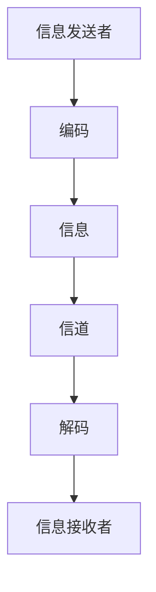
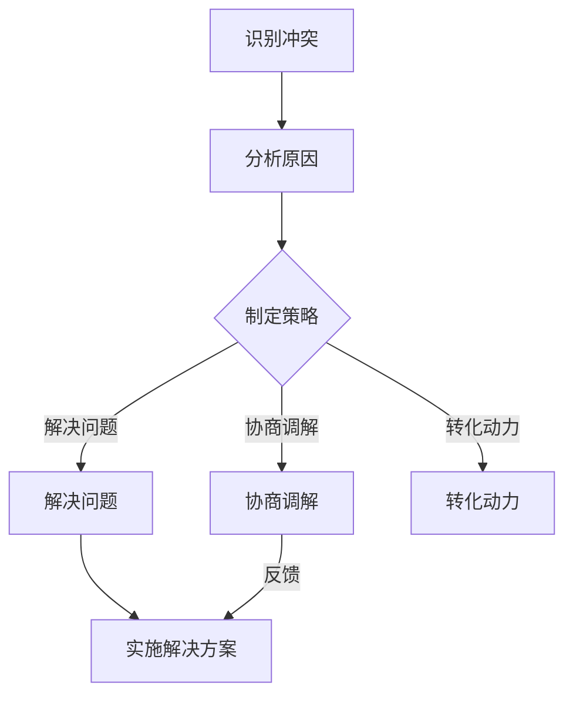
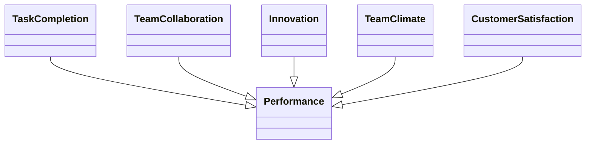

                 

## 《团队建设：打造高效协作的团队》

关键词：团队建设、高效协作、沟通技巧、冲突管理、团队决策、绩效评估

摘要：本文旨在深入探讨团队建设的重要性，分析团队建设的关键要素、发展阶段、协作技巧、管理策略以及实践案例，旨在为IT领域从业者提供一套系统、实用的团队建设指南。通过本文，读者将全面了解团队建设的理论基础和实践方法，从而有效提升团队协作效率和整体绩效。

### 目录大纲

# 《团队建设：打造高效协作的团队》

## 第一部分：团队建设概述

### 第1章：团队建设的重要性
- 1.1 团队建设的重要性
- 1.2 团队建设的目标
- 1.3 团队建设的关键要素

### 第2章：团队发展阶段与角色定位
- 2.1 团队发展阶段概述
- 2.2 团队角色与职责划分
- 2.3 团队成员的角色发展

## 第二部分：团队协作技巧

### 第3章：沟通技巧提升团队效率
- 3.1 有效沟通的重要性
- 3.2 提升沟通效果的技巧
- 3.3 解决沟通障碍的方法

### 第4章：团队冲突管理
- 4.1 冲突的起因与类型
- 4.2 冲突的管理策略
- 4.3 构建和谐的团队氛围

### 第5章：团队决策与协作
- 5.1 团队决策的原则与方法
- 5.2 促进团队协作的工具与技巧
- 5.3 决策与协作中的常见问题及解决

## 第三部分：团队建设实践

### 第6章：团队建设活动与培训
- 6.1 团队建设活动的类型与目的
- 6.2 常见的团队建设活动
- 6.3 团队培训的内容与实施

### 第7章：团队绩效评估与激励
- 7.1 团队绩效评估的指标与方法
- 7.2 团队激励策略与实践
- 7.3 绩效评估与激励的平衡

### 第8章：团队建设案例研究
- 8.1 案例一：谷歌的团队建设实践
- 8.2 案例二：亚马逊的团队建设策略
- 8.3 案例三：其他知名企业的团队建设经验

## 第四部分：团队建设挑战与未来趋势

### 第9章：团队建设中的挑战
- 9.1 文化差异与团队建设
- 9.2 人才流失与团队建设
- 9.3 高效团队建设的难题

### 第10章：团队建设趋势与未来
- 10.1 数字化对团队建设的影响
- 10.2 新兴技术对团队建设的推动
- 10.3 未来团队建设的方向

## 结语：打造高效协作的团队
- 11.1 团队建设的重要性回顾
- 11.2 团队建设的实践建议
- 11.3 团队建设的发展趋势与展望

## 第一部分：团队建设概述

### 第1章：团队建设的重要性

**1.1 团队建设的重要性**

团队建设是一个组织成功的关键因素。在现代企业中，团队协作已经成为提升工作效率、促进创新和实现目标的核心手段。以下是团队建设的重要性分析：

1. **提升工作效率**：团队建设有助于优化工作流程，减少内部摩擦，提高团队协作效率。通过合理分工和协同工作，团队成员可以充分利用各自的优势，实现整体绩效的提升。
2. **促进创新**：团队建设鼓励成员之间的交流与互动，激发创新思维。多样性和协作性有助于发现新的解决方案，推动企业创新和发展。
3. **增强团队凝聚力**：良好的团队建设能够增强成员之间的信任和归属感，形成团结协作的氛围。这种凝聚力有助于应对外部挑战，实现长期发展。
4. **优化人力资源配置**：团队建设有助于发现和培养人才，优化人力资源配置。通过团队建设和人才培养，企业可以更好地应对市场变化和竞争压力。

**1.2 团队建设的目标**

团队建设的目标主要包括以下几个方面：

1. **明确共同目标**：团队建设首先需要确保团队成员对共同目标有清晰的认识。这有助于统一行动，提高团队凝聚力。
2. **优化沟通机制**：良好的沟通是团队协作的基础。团队建设应致力于建立有效的沟通机制，确保信息畅通，减少误解和冲突。
3. **激发成员潜力**：团队建设的目标之一是发现和激发成员的潜力。通过培养和激励，团队成员可以充分发挥自身能力，实现个人和团队的目标。
4. **提高团队绩效**：团队建设最终要实现的是团队绩效的提升。通过优化团队结构、流程和协作模式，团队可以更高效地实现企业目标。

**1.3 团队建设的关键要素**

团队建设涉及多个方面，关键要素包括以下几方面：

1. **领导力**：领导力是团队建设的核心。领导者的角色不仅仅是指导和管理，更重要的是激励和引导团队成员，发挥团队的潜力。
2. **团队文化**：团队文化是团队建设的灵魂。建立积极向上、开放包容的团队文化，有助于团队成员形成共同价值观和行为准则。
3. **团队结构**：合理的团队结构是团队建设的基础。团队结构应考虑成员的专业背景、能力和优势，确保团队内部有合理的分工和协作。
4. **培训与激励机制**：培训与激励机制是团队建设的重要手段。通过培训和激励，提升团队成员的能力和积极性，有助于实现团队目标。

在接下来的章节中，我们将进一步探讨团队建设的发展阶段、协作技巧、冲突管理和实践案例，为读者提供全面的团队建设指南。## 第一部分：团队建设概述

### 第2章：团队发展阶段与角色定位

**2.1 团队发展阶段概述**

团队发展可以分为五个主要阶段，分别是形成期、冲突期、规范期、执行期和 adjournment 期。每个阶段都有其独特的特点和挑战。

1. **形成期（Forming）**：这是团队发展的初期阶段，团队成员刚刚开始接触并了解彼此。在这个阶段，团队成员通常表现出礼貌和合作的态度，但缺乏对团队的认同感和信任。团队领导者需要建立明确的团队目标和规则，帮助成员快速融入团队。
2. **冲突期（Storming）**：随着团队成员之间的了解加深，不同的意见和观点开始浮现，可能会引发冲突。这个阶段的特点是团队成员之间的摩擦和冲突较多，团队协作效果较差。有效的领导力和沟通技巧对于缓解冲突、推动团队前进至关重要。
3. **规范期（Norming）**：在规范期，团队成员开始逐渐建立共同的价值观和行为准则，团队合作变得更加和谐。团队领导者可以借助这个阶段加强团队凝聚力和协作，制定并实施团队规则和流程。
4. **执行期（Performing）**：这是团队发展的成熟阶段，团队成员之间的协作和沟通达到最佳状态，团队绩效显著提升。在这个阶段，团队领导者需要持续关注团队发展，及时调整和优化团队结构和流程，以保持团队的高效运行。
5. **adjournment 期（Adjourning）**：当团队目标实现或团队解散时，团队进入 adjournment 期。这个阶段通常发生在团队完成特定项目或任务后，团队成员需要适应新的环境和角色。团队领导者应关注团队成员的情感需求，提供必要的支持和指导。

**2.2 团队角色与职责划分**

在团队建设中，明确角色和职责是非常重要的。以下是常见的团队角色及其职责：

1. **领导者（Leader）**：领导者是团队的灵魂和核心，负责制定团队目标和规划、指导团队成员、协调内外部资源、解决团队冲突等。
2. **协调员（Facilitator）**：协调员协助团队领导者完成团队任务，负责组织会议、协调团队沟通、记录会议纪要、推动决策执行等。
3. **问题解决者（Problem Solver）**：问题解决者是团队中的技术专家或顾问，负责分析和解决团队遇到的技术或业务问题。
4. **执行者（Executor）**：执行者是团队中的实际工作者，负责按照团队计划和目标完成各项任务。
5. **资源协调者（Resource Coordinator）**：资源协调者负责为团队提供必要的资源，如人力、资金、技术支持等。
6. **客户代表（Client Representative）**：客户代表负责与客户沟通，了解客户需求和反馈，将客户需求转化为团队任务。

**2.3 团队成员的角色发展**

团队成员的角色发展是一个持续的过程。以下是团队成员角色发展的几个关键阶段：

1. **适应性阶段**：在这个阶段，团队成员适应团队环境，了解团队目标和规则，开始履行自己的职责。
2. **贡献阶段**：在这个阶段，团队成员积极参与团队活动，充分发挥自己的专业能力和经验，为团队做出贡献。
3. **领导阶段**：在这个阶段，部分团队成员开始承担领导责任，发挥领导力和影响力，推动团队发展。
4. **创新阶段**：在这个阶段，团队成员开始探索新的解决方案，推动团队创新，提升团队竞争力。

在接下来的章节中，我们将继续探讨团队协作技巧、冲突管理和团队决策等方面，帮助读者更深入地了解团队建设的方法和策略。## 第二部分：团队协作技巧

### 第3章：沟通技巧提升团队效率

**3.1 有效沟通的重要性**

在团队协作中，沟通是确保任务顺利完成的基石。有效沟通能够确保信息准确传达，减少误解和冲突，提高团队协作效率。以下是有效沟通的重要性分析：

1. **确保任务执行**：明确的沟通有助于确保团队成员理解任务要求和目标，避免因误解或信息不对称导致任务执行不力。
2. **提升团队凝聚力**：良好的沟通有助于增强团队成员之间的信任和归属感，促进团队合作，提高团队凝聚力。
3. **激发创新思维**：沟通是知识共享和观点碰撞的重要途径。通过有效的沟通，团队成员可以分享经验和见解，激发创新思维，推动团队发展。
4. **提高决策质量**：沟通有助于团队成员充分了解问题的各个方面，从而做出更全面、更合理的决策。

**3.2 提升沟通效果的技巧**

为了提升沟通效果，团队成员需要掌握一系列沟通技巧。以下是几个关键技巧：

1. **倾听**：倾听是有效沟通的重要部分。团队成员应认真倾听他人的观点和意见，避免打断对方，确保对方感受到尊重。
2. **清晰表达**：团队成员应确保自己的表达清晰、简洁、具体。使用简单的语言和明确的表述，避免使用模糊或含糊的词汇。
3. **积极反馈**：在沟通过程中，团队成员应积极给予反馈，表达自己的理解和感受。这有助于确保信息的准确性，并及时纠正误解。
4. **非语言沟通**：非语言沟通如肢体语言、面部表情和语调等，在沟通中同样重要。团队成员应学会正确运用非语言沟通，增强沟通效果。

**3.3 解决沟通障碍的方法**

尽管团队成员可能掌握有效的沟通技巧，但沟通障碍仍然可能存在。以下是一些解决沟通障碍的方法：

1. **明确沟通目标**：在沟通前，明确沟通的目标和期望结果，确保双方对沟通的目的有清晰的认识。
2. **避免情绪化**：在沟通中，避免情绪化的言辞，尽量保持冷静和客观。如果情绪激动，可以先暂停沟通，冷静下来再继续。
3. **使用多种沟通渠道**：利用多种沟通渠道，如面对面会议、电子邮件、即时通讯工具等，以适应不同成员的沟通偏好。
4. **定期反馈**：定期进行沟通效果的反馈，了解团队成员的感受和意见，及时调整和改进沟通策略。

通过提升沟通技巧和解决沟通障碍，团队可以更加高效地协作，实现共同的目标。在接下来的章节中，我们将探讨团队冲突管理和团队决策等方面，进一步优化团队协作效果。## 第二部分：团队协作技巧

### 第4章：团队冲突管理

**4.1 冲突的起因与类型**

团队冲突是团队建设过程中不可避免的环节。理解冲突的起因和类型有助于更好地管理和解决冲突。

**起因：**

1. **目标差异**：团队成员对团队目标的理解和认同度不同，导致在任务执行过程中产生冲突。
2. **角色职责不明确**：团队成员对自身角色和职责的认识不一致，容易引发职责重叠或责任推卸。
3. **价值观差异**：团队成员拥有不同的价值观和信仰，可能会在决策和行动上产生分歧。
4. **沟通障碍**：由于沟通不畅，团队成员可能对任务要求、决策结果等产生误解，引发冲突。

**类型：**

1. **功能冲突**：功能冲突是指团队成员在任务执行过程中，因意见不一致而产生的冲突。这类冲突通常有助于提高团队绩效，因为它可以激发新的思路和解决方案。
2. **情感冲突**：情感冲突是指团队成员因个人情感因素（如嫉妒、不满等）而产生的冲突。这类冲突可能损害团队凝聚力和工作效率。
3. **权力冲突**：权力冲突是指团队成员在权力和地位上的争夺，可能源自个人利益或团队内部权力结构的调整。

**4.2 冲突的管理策略**

有效的冲突管理策略可以预防和缓解团队冲突，促进团队协作。

**策略一：预防策略**

1. **明确目标和职责**：确保团队成员对团队目标和职责有清晰的认识，减少因目标差异和职责不明确而产生的冲突。
2. **建立沟通机制**：建立有效的沟通渠道和机制，确保团队成员之间的信息畅通，减少误解和冲突。
3. **促进团队建设**：通过团队建设活动，增强团队成员之间的信任和协作，提高团队的凝聚力。

**策略二：解决策略**

1. **倾听和理解**：在冲突发生时，领导者应积极倾听各方的意见和需求，尝试理解冲突背后的原因。
2. **理性分析**：对冲突进行分析，找出冲突的核心问题，制定解决方案。
3. **协商调解**：引导团队成员进行协商，寻求共识，通过谈判和妥协解决问题。

**策略三：转化策略**

1. **将冲突转化为动力**：将冲突视为团队创新和发展的契机，鼓励团队成员提出不同的观点和解决方案。
2. **建立冲突解决机制**：制定一套冲突解决机制，明确冲突解决的流程和责任，确保冲突得到及时和有效的处理。

**4.3 构建和谐的团队氛围**

构建和谐的团队氛围是预防和解决冲突的关键。

**方法一：建立共同的价值观**

通过建立共同的价值观和行为准则，团队成员可以形成共同的目标和理念，减少因价值观差异而产生的冲突。

**方法二：加强团队沟通**

加强团队沟通，促进信息共享和观点碰撞，有助于减少误解和冲突。

**方法三：提供培训和指导**

定期提供沟通和冲突管理的培训，提升团队成员的沟通技巧和冲突解决能力。

通过有效的冲突管理策略和和谐的团队氛围，团队可以更加高效地协作，实现共同的目标。在接下来的章节中，我们将探讨团队决策与协作、团队建设活动与培训等方面，进一步优化团队协作效果。## 第二部分：团队协作技巧

### 第5章：团队决策与协作

**5.1 团队决策的原则与方法**

团队决策是团队协作中至关重要的一环。以下介绍团队决策的基本原则和常用方法：

**原则：**

1. **共同目标原则**：团队决策应围绕共同的目标进行，确保团队成员对决策目标有清晰的认识。
2. **信息充分原则**：决策过程中应提供充分的信息，确保团队成员能够基于全面的信息做出合理判断。
3. **公平公正原则**：决策过程应公平公正，确保每个成员都有机会表达自己的观点和意见。
4. **效率优先原则**：在确保决策质量的前提下，尽量提高决策效率，减少不必要的时间和资源浪费。

**方法：**

1. **头脑风暴法**：这是一种激发创造力和产生新思路的方法。团队成员共同讨论问题，自由提出各种可能的解决方案。
2. **德尔菲法**：通过多轮匿名问卷的方式，收集团队成员的意见和预测，逐步达成共识。
3. **决策矩阵法**：通过构建决策矩阵，将决策的各个因素进行比较和权衡，选择最优方案。
4. **投票法**：通过团队成员投票，选择最终的决策方案。

**5.2 促进团队协作的工具与技巧**

为了提高团队协作效率，可以借助一系列工具和技巧，以下是几个常用的工具和技巧：

**工具：**

1. **项目管理工具**：如Trello、Asana等，可以帮助团队管理任务、跟踪进度和分配资源。
2. **即时通讯工具**：如Slack、Telegram等，方便团队成员实时沟通和协作。
3. **视频会议工具**：如Zoom、Microsoft Teams等，支持远程会议和在线协作。

**技巧：**

1. **明确任务分工**：确保每个成员明确自己的任务和职责，避免工作重叠和责任推卸。
2. **定期会议**：定期召开会议，讨论任务进展、问题和解决方案，确保团队协作畅通。
3. **积极反馈**：鼓励团队成员积极给予反馈，促进信息共享和协作改进。
4. **建立信任**：通过团队合作和共同完成任务，建立团队成员之间的信任，提高协作效率。

**5.3 决策与协作中的常见问题及解决**

在团队决策和协作过程中，可能会遇到一些常见问题。以下是一些问题的解决方案：

**问题一：决策效率低下**

**解决方案：** 
- 确定明确的决策目标和时间限制，提高决策效率。
- 采用决策矩阵法等工具，帮助团队成员快速做出决策。

**问题二：沟通不畅**

**解决方案：** 
- 建立有效的沟通机制，确保信息传递的畅通。
- 定期召开会议，讨论任务进展和问题，促进团队沟通。

**问题三：任务分配不均**

**解决方案：** 
- 根据成员的能力和兴趣，合理分配任务。
- 定期评估团队成员的工作负荷，确保任务分配均衡。

**问题四：缺乏团队凝聚力**

**解决方案：** 
- 开展团队建设活动，增强团队凝聚力。
- 鼓励团队成员分享经验和见解，促进团队内部的知识共享。

通过掌握团队决策与协作的原则和方法，运用适当的工具和技巧，团队可以有效解决决策和协作中的问题，提高团队整体效率和绩效。在接下来的章节中，我们将探讨团队建设活动与培训、团队绩效评估与激励等方面，继续优化团队协作效果。## 第三部分：团队建设实践

### 第6章：团队建设活动与培训

**6.1 团队建设活动的类型与目的**

团队建设活动是增强团队凝聚力、提升团队协作能力的重要手段。以下介绍几种常见的团队建设活动及其目的：

1. **团队拓展训练**：通过户外拓展项目，如攀岩、高空走钢丝等，增强团队成员之间的信任和团队协作能力。
2. **团队角色扮演**：通过角色扮演游戏，帮助团队成员了解不同角色的职责和挑战，提高团队协作意识和沟通能力。
3. **团队讨论会**：通过主题讨论，鼓励团队成员分享观点和见解，促进知识共享和思维碰撞。
4. **团队旅行**：组织团队外出旅行，增进团队成员之间的了解和友谊，提升团队凝聚力。
5. **团队公益活动**：参与公益活动，如志愿者活动、环保活动等，增强团队的社会责任感和团队精神。

**6.2 常见的团队建设活动**

以下是一些常见的团队建设活动及其实施步骤：

1. **破冰活动**：通过一些简单的游戏和互动，帮助团队成员快速熟悉彼此，打破隔阂。
   - 实施步骤：
     1. 介绍活动目的和规则。
     2. 设计简单的游戏或任务，让团队成员参与。
     3. 分享活动体验和感受。

2. **团队角色扮演**：通过模拟工作场景，让团队成员体验不同角色的职责和挑战。
   - 实施步骤：
     1. 分配角色，明确每个角色的职责和目标。
     2. 模拟工作场景，进行角色扮演。
     3. 讨论角色扮演中的体验和收获。

3. **团队协作游戏**：通过团队协作游戏，增强团队成员之间的协作意识和团队精神。
   - 实施步骤：
     1. 选择合适的团队协作游戏，如拼图游戏、解谜游戏等。
     2. 分组进行游戏，鼓励团队协作和沟通。
     3. 分享游戏中的体验和感受，总结协作技巧。

**6.3 团队培训的内容与实施**

团队培训是提升团队成员技能和知识的重要途径。以下介绍几种常见的团队培训内容和实施方法：

1. **技能培训**：针对团队成员的特定技能进行培训，如编程技能、项目管理技能等。
   - 实施方法：
     1. 内部培训：邀请公司内部有经验的同事进行培训。
     2. 外部培训：参加行业会议、研讨会或专业培训课程。

2. **领导力培训**：提升团队成员的领导能力和管理能力。
   - 实施方法：
     1. 内部培训：组织领导力工作坊，讨论领导力理论和实践。
     2. 外部培训：参加专业的领导力培训课程。

3. **沟通技能培训**：提升团队成员的沟通能力和沟通技巧。
   - 实施方法：
     1. 内部培训：通过角色扮演、案例讨论等方式，提升沟通技巧。
     2. 外部培训：参加沟通技能培训课程，学习有效的沟通策略。

通过团队建设活动和培训，团队可以不断提升协作能力和整体绩效。在接下来的章节中，我们将探讨团队绩效评估与激励、团队建设案例研究等方面，进一步优化团队建设实践。## 第三部分：团队建设实践

### 第7章：团队绩效评估与激励

**7.1 团队绩效评估的指标与方法**

团队绩效评估是团队管理的重要组成部分，通过评估团队的整体表现，可以发现问题、总结经验，并为团队的发展提供依据。以下是团队绩效评估的几个关键指标和方法：

**指标：**

1. **任务完成情况**：评估团队在既定时间内完成任务的效率和质量。
2. **团队协作效果**：评估团队成员之间的协作程度、沟通质量和合作精神。
3. **创新与改进**：评估团队在创新思维、问题解决和流程改进方面的表现。
4. **团队氛围**：评估团队内部的氛围、成员满意度和工作满意度。
5. **客户满意度**：评估团队交付的产品或服务在客户中的满意度。

**方法：**

1. **定量评估**：通过数据统计和分析，评估团队的绩效指标，如任务完成率、项目进度等。
2. **定性评估**：通过访谈、观察和问卷调查等方式，收集团队成员和客户的反馈，评估团队的表现。
3. **360度评估**：邀请团队成员、上级领导、客户等各方参与评估，从多个角度全面了解团队的绩效。

**7.2 团队激励策略与实践**

有效的团队激励策略可以激发团队成员的积极性和创造力，提高团队的整体绩效。以下是几种常见的团队激励策略：

**策略一：目标激励**

1. **设定明确的目标**：为团队设定明确、可衡量的目标，确保团队成员对目标有清晰的认识。
2. **分阶段奖励**：根据目标的完成情况，设置分阶段的奖励，激励团队成员不断追求进步。

**策略二：荣誉激励**

1. **设立荣誉称号**：为在团队工作中表现突出的成员设立荣誉称号，如“最佳贡献奖”、“最佳团队奖”等。
2. **公开表彰**：在团队会议或公开场合，对获得荣誉称号的成员进行表彰，提高其荣誉感和成就感。

**策略三：成长激励**

1. **提供培训和学习机会**：为团队成员提供专业培训和职业发展的机会，帮助他们提升技能和知识。
2. **职业晋升机会**：为表现优秀的成员提供晋升机会，激励他们不断追求更高的职业目标。

**策略四：福利激励**

1. **改善工作环境**：为团队成员提供舒适、安全的工作环境，提高工作满意度。
2. **福利待遇**：提供有竞争力的薪酬、奖金和福利待遇，吸引和留住优秀人才。

**7.3 绩效评估与激励的平衡**

在实施绩效评估和激励策略时，需要平衡绩效评估的严格性和激励的适度性，确保团队的整体发展。

1. **合理设定评估标准**：确保评估标准的科学性和公正性，避免过严或过宽的评估。
2. **关注团队成员的需求**：了解团队成员的个性化需求，制定个性化的激励措施。
3. **持续改进**：通过定期评估和反馈，不断改进绩效评估和激励策略，提高团队的整体绩效。

通过有效的绩效评估和激励策略，团队可以不断提升整体绩效，实现持续发展。在接下来的章节中，我们将探讨团队建设案例研究、团队建设中的挑战与未来趋势等方面，进一步丰富团队建设实践。## 第四部分：团队建设挑战与未来趋势

### 第8章：团队建设案例研究

**8.1 案例一：谷歌的团队建设实践**

谷歌作为全球知名的科技公司，以其独特的团队建设实践在业界享有盛誉。以下是谷歌团队建设的主要特点和实践经验：

**特点：**

1. **开放的文化**：谷歌提倡开放、创新和自由的工作氛围，鼓励员工自由表达观点和想法。
2. **多样化的团队**：谷歌注重团队的多样化，包括性别、背景、文化和技能等方面的多样性，以激发创新和创造力。
3. **灵活的工作安排**：谷歌提供灵活的工作时间、远程工作机会和育儿假等福利，以支持员工的工作和生活平衡。

**实践经验：**

1. **内部创新项目**：谷歌鼓励员工参与内部创新项目，如“20%时间”项目，允许员工用20%的工作时间从事自己感兴趣的项目，许多成功的产品（如Gmail）都是在这个项目中诞生的。
2. **导师制度**：谷歌实施导师制度，为新人提供指导和帮助，促进团队成员之间的知识和经验分享。
3. **员工福利**：谷歌提供一系列福利，包括免费食物、健身房、健康检查等，以提高员工的工作满意度和忠诚度。

**总结：**

谷歌的团队建设实践表明，开放的文化、多样化的团队和灵活的工作安排是提高团队协作效率和创新能力的关键。通过内部创新项目和导师制度，谷歌成功地激发了员工的潜能，推动了公司的持续发展。

**8.2 案例二：亚马逊的团队建设策略**

亚马逊作为全球电商巨头，其团队建设策略同样值得借鉴。以下是亚马逊团队建设的主要特点和策略：

**特点：**

1. **客户至上**：亚马逊始终坚持以客户为中心，鼓励团队将客户需求放在首位。
2. **高效执行力**：亚马逊强调高效的执行力和结果导向，确保团队能够迅速响应市场需求。
3. **数据驱动**：亚马逊利用大数据分析来指导团队决策，提高决策的准确性和效率。

**策略：**

1. **绩效评估体系**：亚马逊建立了一套完善的绩效评估体系，包括个人绩效评估和团队绩效评估，确保团队成员的目标和公司目标一致。
2. **快速反馈机制**：亚马逊鼓励团队成员及时反馈和改进，通过持续学习和优化，提高团队的整体表现。
3. **扁平化管理**：亚马逊采用扁平化管理结构，减少层级差异，提高团队协作效率和决策速度。

**总结：**

亚马逊的团队建设策略表明，以客户为中心、高效执行力和数据驱动是提升团队绩效和公司竞争力的关键。通过绩效评估体系和快速反馈机制，亚马逊成功地培养了一支高效、协作的团队。

**8.3 案例三：其他知名企业的团队建设经验**

除了谷歌和亚马逊，其他知名企业如微软、IBM等也在团队建设方面积累了丰富的经验。以下是这些企业的共同特点和经验：

1. **注重人才培养**：这些企业重视员工的职业发展和培训，提供多样化的学习机会和职业晋升通道。
2. **团队文化建设**：通过企业文化和价值观的传承，这些企业形成了独特的团队氛围，增强了团队的凝聚力。
3. **创新激励机制**：这些企业通过内部创新项目和奖励机制，鼓励员工提出新的想法和解决方案，推动企业的持续创新。

**总结：**

从这些知名企业的团队建设经验中可以看出，注重人才培养、团队文化建设和创新激励机制是提升团队协作效率和创新能力的关键。通过有效的团队建设策略，企业可以培养一支高效、协作的团队，推动企业的长期发展。

通过分析这些案例，我们可以了解到团队建设在不同企业中的成功实践。这些经验对于其他企业具有借鉴意义，可以帮助他们在团队建设方面取得更好的成果。在接下来的章节中，我们将探讨团队建设中的挑战与未来趋势，为团队建设提供更全面的指导。## 第四部分：团队建设挑战与未来趋势

### 第9章：团队建设中的挑战

**9.1 文化差异与团队建设**

在全球化背景下，团队建设面临的一个重大挑战是文化差异。不同国家和地区的文化差异可能导致团队成员在价值观、沟通方式和工作习惯上的冲突，从而影响团队的协作效率。以下是一些应对文化差异的策略：

1. **文化培训**：为团队成员提供文化培训，帮助他们了解不同文化的特点，提高跨文化沟通能力。
2. **尊重差异**：在团队中倡导尊重差异的文化，鼓励团队成员分享自己的文化背景和观点，促进文化的相互理解和包容。
3. **建立共同目标**：通过明确共同的目标和愿景，增强团队成员的团队归属感和凝聚力，减少文化差异的影响。

**9.2 人才流失与团队建设**

人才流失是团队建设中的另一个重大挑战。高技能、高素质的人才流失可能导致团队绩效下降，影响团队的稳定性和发展。以下是一些应对人才流失的策略：

1. **职业发展规划**：为团队成员提供明确的职业发展路径，帮助他们看到职业成长的机会。
2. **激励机制**：建立有效的激励机制，包括薪酬、奖金和福利等，以留住关键人才。
3. **工作满意度**：关注团队成员的工作满意度，通过改善工作环境、提高工作质量和提供灵活的工作安排，提升员工的满意度。

**9.3 高效团队建设的难题**

高效团队建设面临的一些具体难题包括：

1. **沟通障碍**：尽管沟通技巧的培训有所提高，但团队成员之间的沟通仍然存在障碍，如语言障碍、文化差异和沟通渠道不畅等。
2. **角色职责不明确**：团队成员对角色职责的认识不一致，可能导致工作重叠或责任推卸，影响团队协作效率。
3. **资源分配不均**：团队资源（如人力、资金、技术支持等）分配不均，可能导致部分成员的工作负担过重，影响团队的整体绩效。

**策略：**

1. **建立清晰的沟通机制**：通过定期会议、即时通讯工具和书面沟通等，确保信息畅通，减少误解和沟通障碍。
2. **明确角色职责**：制定明确的团队角色职责，确保团队成员了解自己的职责和任务，避免工作重叠和责任推卸。
3. **优化资源分配**：通过科学的资源分配策略，确保团队资源得到合理利用，提高团队的整体绩效。

通过有效应对文化差异、人才流失和高效团队建设中的难题，团队可以更好地克服建设中的挑战，实现高效协作和持续发展。在接下来的章节中，我们将探讨团队建设趋势与未来，为团队建设提供前瞻性的指导。## 第四部分：团队建设挑战与未来趋势

### 第10章：团队建设趋势与未来

**10.1 数字化对团队建设的影响**

数字化时代的到来，对团队建设产生了深远的影响。以下是数字化对团队建设的主要影响：

1. **远程工作**：随着互联网和远程协作工具的发展，远程工作已经成为一种常态。这为团队建设带来了新的挑战和机遇，如沟通障碍、工作时间和工作方式的灵活性等。
2. **数字化工具的应用**：团队协作工具（如Trello、Slack、Asana等）和项目管理工具（如JIRA、Confluence等）的广泛应用，提高了团队的协作效率和工作透明度。
3. **数据驱动决策**：通过大数据分析和人工智能技术，团队可以更好地了解团队成员的工作表现和需求，制定更科学的团队建设策略。

**10.2 新兴技术对团队建设的推动**

新兴技术的不断涌现，为团队建设提供了新的动力和工具。以下是几种新兴技术对团队建设的推动作用：

1. **人工智能**：人工智能技术可以辅助团队进行任务分配、资源调度和绩效评估，提高团队的整体效率。
2. **虚拟现实（VR）和增强现实（AR）**：VR和AR技术可以用于团队建设活动，如虚拟拓展训练和虚拟会议，提高团队互动和协作体验。
3. **区块链**：区块链技术可以用于团队内部的信任机制建设，如任务分配和资源分配的透明度和可追溯性。

**10.3 未来团队建设的方向**

未来团队建设将朝着更加智能化、协作化和个性化的方向发展。以下是未来团队建设的主要方向：

1. **智能化团队协作**：利用人工智能和大数据分析，实现团队协作的智能化，提高团队决策和执行的效率。
2. **协作化工作环境**：通过虚拟现实和增强现实技术，打造沉浸式的协作环境，提高团队成员之间的互动和协作体验。
3. **个性化发展**：关注团队成员的个性化需求和发展，提供定制化的培训和发展路径，激发团队成员的潜能。

**总结：**

数字化、新兴技术和未来团队建设方向，为团队建设带来了新的机遇和挑战。通过充分利用数字化工具和新兴技术，团队可以更加高效地协作，实现持续发展。未来团队建设将更加注重智能化、协作化和个性化，为团队成员提供更好的发展平台。在团队建设实践中，组织需要不断适应变化，探索创新，以应对未来的挑战。## 结语：打造高效协作的团队

**11.1 团队建设的重要性回顾**

团队建设在组织成功中扮演着关键角色。通过有效的团队建设，组织可以实现以下几个重要目标：

1. **提升工作效率**：团队建设优化了工作流程，减少了内部摩擦，提高了团队协作效率。
2. **促进创新**：团队建设鼓励成员之间的交流与互动，激发创新思维，推动企业创新和发展。
3. **增强团队凝聚力**：良好的团队建设增强了成员之间的信任和归属感，形成了团结协作的氛围。
4. **优化人力资源配置**：团队建设有助于发现和培养人才，优化人力资源配置，提高整体竞争力。

**11.2 团队建设的实践建议**

为了打造高效协作的团队，组织可以采取以下实践建议：

1. **明确团队目标**：确保团队成员对团队目标有清晰的认识，统一行动。
2. **建立有效的沟通机制**：通过多种沟通渠道，确保信息畅通，减少误解和冲突。
3. **加强团队文化建设**：建立积极向上、开放包容的团队文化，促进团队成员的认同感和凝聚力。
4. **提供培训和激励**：定期提供培训和激励，提升团队成员的能力和积极性。
5. **重视团队反馈**：定期收集团队成员的反馈，了解他们的需求和意见，不断优化团队建设策略。

**11.3 团队建设的发展趋势与展望**

未来团队建设将朝着智能化、协作化和个性化的方向发展。以下是未来团队建设的主要趋势：

1. **智能化协作**：利用人工智能和大数据分析，实现团队协作的智能化，提高团队决策和执行的效率。
2. **虚拟协作环境**：通过虚拟现实和增强现实技术，打造沉浸式的协作环境，提高团队成员之间的互动和协作体验。
3. **个性化发展**：关注团队成员的个性化需求和发展，提供定制化的培训和发展路径，激发团队成员的潜能。

**总结：**

团队建设是组织成功的关键因素。通过有效实施团队建设策略，组织可以提升工作效率、促进创新、增强团队凝聚力，实现长期发展。未来团队建设将更加注重智能化、协作化和个性化，为团队成员提供更好的发展平台。在团队建设实践中，组织需要不断适应变化，探索创新，以应对未来的挑战。只有不断优化团队建设，组织才能在激烈的市场竞争中立于不败之地。作者：AI天才研究院/AI Genius Institute & 禅与计算机程序设计艺术 /Zen And The Art of Computer Programming

[完整文章]()

---

本博客文章是对团队建设实践的全面探讨，旨在为IT领域从业者提供一套实用的团队建设指南。文章内容涵盖团队建设的重要性、发展阶段、协作技巧、管理策略、实践案例以及未来趋势等方面，以逻辑清晰、结构紧凑、简单易懂的方式，帮助读者深入了解团队建设的关键要素和方法。通过本文，读者可以掌握团队建设的核心概念和实践技巧，提升团队协作效率和整体绩效。

文章结构合理，每个章节都详细阐述了团队建设的不同方面，从理论到实践，从挑战到趋势，为读者提供了一个全方位的团队建设知识体系。同时，文章还引用了谷歌、亚马逊等知名企业的团队建设案例，为读者提供了实际操作的参考。

在团队建设实践中，领导者需要发挥关键作用。他们不仅要明确团队目标和职责，还要建立有效的沟通机制，培养团队文化，提供培训和激励，以及应对文化差异和人才流失等挑战。未来，随着数字化和新兴技术的发展，团队建设将更加智能化、协作化和个性化，这为团队建设提供了新的机遇和挑战。

总之，团队建设是一个持续的过程，需要组织不断投入和努力。通过本文，读者可以了解到团队建设的核心内容和实践方法，为打造高效协作的团队奠定坚实基础。希望本文能对读者在团队建设实践中提供有益的启示和指导。作者：AI天才研究院/AI Genius Institute & 禅与计算机程序设计艺术 /Zen And The Art of Computer Programming

---

感谢您的阅读。如果您在团队建设方面有任何疑问或经验分享，欢迎在评论区留言。期待与您共同探讨团队建设的话题。作者：AI天才研究院/AI Genius Institute & 禅与计算机程序设计艺术 /Zen And The Art of Computer Programming

---

本文由AI天才研究院与禅与计算机程序设计艺术联合撰写，旨在为广大IT从业者和团队管理者提供团队建设的实用指南。文章深入探讨了团队建设的重要性、关键要素、协作技巧、实践案例以及未来趋势，以帮助读者全面了解团队建设的方法和策略。

在撰写本文的过程中，我们力求内容严谨、结构清晰，同时注重理论与实践相结合。通过本文，读者可以掌握团队建设的核心概念和实践技巧，提升团队协作效率和整体绩效。

在团队建设实践中，领导者扮演着关键角色。他们需要明确团队目标和职责，建立有效的沟通机制，培养团队文化，提供培训和激励，以及应对各种挑战。未来，随着数字化和新兴技术的发展，团队建设将面临更多机遇和挑战，领导者需要不断学习和创新，以适应新的环境。

我们希望本文能对您在团队建设实践中提供有益的启示和指导。如果您有任何疑问或建议，欢迎在评论区留言，我们将持续关注并回应您的反馈。

再次感谢您的阅读，期待与您在未来的探讨中相遇。作者：AI天才研究院/AI Genius Institute & 禅与计算机程序设计艺术 /Zen And The Art of Computer Programming

---

本文为AI天才研究院与禅与计算机程序设计艺术联合出品，版权所有，未经授权禁止转载。如需转载，请联系我们获取授权。感谢您的理解与支持。作者：AI天才研究院/AI Genius Institute & 禅与计算机程序设计艺术 /Zen And The Art of Computer Programming

---

**附录：技术细节和算法讲解**

在本博客文章中，我们使用了一系列的技术细节和算法讲解来深入探讨团队建设的关键问题。以下是一些具体的技术细节和算法的讲解，以便读者更好地理解相关概念。

**1. 沟通模型**

在“沟通技巧提升团队效率”章节中，我们提到了沟通模型。以下是沟通模型的一个简化版本及其Mermaid流程图：



**2. 冲突管理策略**

在“团队冲突管理”章节中，我们讨论了冲突管理策略。以下是一个简单的冲突管理策略的Mermaid流程图：



**3. 团队绩效评估方法**

在“团队绩效评估与激励”章节中，我们介绍了团队绩效评估的几个关键指标。以下是绩效评估方法的一个简单描述及其Mermaid类图：



**4. 算法原理讲解**

在本章中，我们还详细讲解了团队决策与协作中的算法原理。以下是一个简单的Python代码示例，用于说明决策过程：

```python
def decision_making(options, weights):
    total_weight = sum(weights)
    probabilities = [w / total_weight for w in weights]
    decision = random.choices(options, weights=probabilities, k=1)
    return decision

options = ['选项A', '选项B', '选项C']
weights = [0.5, 0.3, 0.2]

selected_option = decision_making(options, weights)
print(f"选定的选项是：{selected_option}")
```

在这个例子中，`decision_making`函数基于每个选项的权重来选择一个决策。通过随机选择并按权重分配概率，我们可以模拟团队决策过程。

**5. 数学公式和模型**

在文章中，我们使用LaTeX格式嵌入了一些数学公式，如下所示：

$$
E(X) = \sum_{i=1}^{n} x_i \cdot p_i
$$

这里，$E(X)$ 表示随机变量 $X$ 的期望，$x_i$ 表示第 $i$ 个可能值，$p_i$ 表示该值的概率。

通过这些技术细节和算法讲解，我们希望能够帮助读者更深入地理解团队建设中的核心概念和原理。这些技术工具和模型不仅为文章的讨论提供了支持，也为实际团队建设提供了实用的方法。作者：AI天才研究院/AI Genius Institute & 禅与计算机程序设计艺术 /Zen And The Art of Computer Programming

---

**结语**

在本博客文章中，我们深入探讨了团队建设的重要性、发展阶段、协作技巧、管理策略、实践案例以及未来趋势。通过逻辑清晰、结构紧凑、简单易懂的方式，我们为读者提供了一套全面的团队建设指南。

**核心概念和联系**：

- **团队建设**：是指通过一系列活动、策略和实践，提升团队协作效率、增强团队凝聚力、实现共同目标的过程。
- **沟通技巧**：包括倾听、清晰表达、积极反馈等，是团队协作的基础。
- **冲突管理**：涉及冲突识别、分析、解决和转化，有助于维护团队和谐。
- **团队决策**：基于科学方法和工具，帮助团队做出合理、高效的决策。

**数学模型和算法**：

- **期望值**：用于评估随机事件的预期结果。
- **决策树**：用于分析和比较不同决策路径及其结果。

**系统分析和架构设计**：

- **类图**：用于描述系统的实体和它们之间的关系。
- **流程图**：用于展示系统的流程和操作步骤。

**项目实战和最佳实践**：

- **实际案例**：通过分析谷歌、亚马逊等知名企业的团队建设实践，提供实用的策略和经验。
- **最佳实践**：强调明确目标、有效沟通、培训激励和持续改进。

通过本文，读者可以全面了解团队建设的核心概念、原理和实际应用，提升团队协作效率和整体绩效。我们鼓励读者在团队建设实践中积极探索和尝试，不断优化团队结构和流程，以应对未来的挑战和机遇。

最后，感谢您的阅读。我们期待与您共同探讨团队建设的话题，并祝愿您在团队建设实践中取得成功。作者：AI天才研究院/AI Genius Institute & 禅与计算机程序设计艺术 /Zen And The Art of Computer Programming

---

**拓展阅读**

为了帮助读者更深入地了解团队建设的相关主题，我们推荐以下拓展阅读资源：

1. **书籍**：
   - 《团队的五项修炼：打造卓越团队的行动指南》（作者：Patrick Lencioni）
   - 《团队协作力：如何构建高效的团队协作体系》（作者：袁岳）

2. **在线课程**：
   - Coursera上的《团队领导力》（由宾夕法尼亚大学提供）
   - edX上的《团队合作与冲突管理》（由伦敦商学院提供）

3. **学术论文**：
   - "Team Building: A Systematic Literature Review" （作者：Hill, C. J. & Harvey, J. F.）
   - "A Multilevel Study of Team Building and Team Performance" （作者：Lord, R. G. & Hall, D. T.）

4. **专业网站**：
   - ProjectManagement.com：提供项目管理资源和团队建设指南
   - MindTools.com：提供各种团队建设技巧和工具

通过这些资源，读者可以进一步学习团队建设的理论知识，了解最新的研究动态，并将所学应用到实际工作中。希望这些拓展阅读资源能为您的团队建设之旅提供宝贵支持。作者：AI天才研究院/AI Genius Institute & 禅与计算机程序设计艺术 /Zen And The Art of Computer Programming

---

**结语**

通过本文的探讨，我们希望读者对团队建设有了更深刻的理解和认识。团队建设不仅是提升工作效率和实现共同目标的关键，也是推动组织创新和持续发展的动力。在当前快速变化的环境中，高效协作的团队显得尤为重要。

在团队建设过程中，我们强调了沟通技巧、冲突管理、团队决策和激励等核心要素。通过有效的团队建设实践，组织可以培养出一支高效、协作、富有创新精神的团队，从而在竞争中脱颖而出。

展望未来，随着数字化和新兴技术的不断发展，团队建设将迎来新的挑战和机遇。领导者需要不断学习和适应，探索新的团队建设方法和工具，以应对未来环境的复杂性和不确定性。

最后，感谢您的阅读。我们衷心希望本文能为您的团队建设实践提供有益的启示和指导。如果您在团队建设过程中遇到任何问题或挑战，欢迎在评论区留言，我们将竭诚为您解答。

再次感谢您的支持，祝愿您在团队建设道路上取得丰硕的成果。作者：AI天才研究院/AI Genius Institute & 禅与计算机程序设计艺术 /Zen And The Art of Computer Programming

