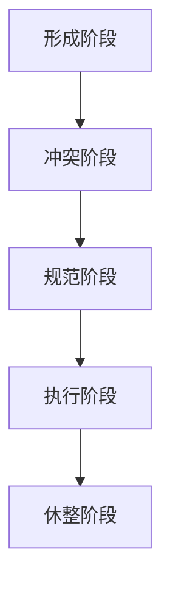

                 

## 文章标题

# 团队建设：打造高效团队的秘诀

> 关键词：团队建设、高效团队、领导力、沟通、冲突解决、绩效评估

> 摘要：本文深入探讨了团队建设的关键要素，包括团队建设的背景与重要性、团队核心概念与特征、团队建设方法、团队领导力与激励、团队冲突与解决策略，以及团队绩效评估与改进。通过实例分析和最佳实践，本文提供了打造高效团队的实用秘诀，旨在为企业提供有效的团队管理指导。

----------------------------------------------------------------

### 目录大纲

----------------------------------------------------------------

## 第一部分：团队建设概述

### 第1章：团队建设背景与重要性

### 第2章：团队核心概念与特征

### 第3章：团队建设方法

### 第4章：团队领导力与激励

### 第5章：团队冲突与解决

### 第6章：团队绩效评估与改进

### 第7章：成功团队案例分析

----------------------------------------------------------------

## 第1章：团队建设背景与重要性

### 1.1 团队建设的问题背景

在当今快速变化的市场环境中，企业面临着前所未有的挑战。竞争压力加剧、市场变化迅速，企业必须不断创新和适应，以保持竞争力。然而，这并非易事，特别是在复杂多变的环境中，单一的个体难以应对复杂的任务和挑战。因此，团队建设变得尤为重要。

#### 1.1.1 竞争压力与市场变化

企业在竞争激烈的市场中生存和发展，需要具备快速响应市场变化的能力。这意味着企业需要能够在短时间内调整战略、优化资源，并迅速推出新产品或服务。这需要团队成员之间紧密合作，共同应对挑战。

##### 1.1.1.1 竞争压力

竞争压力迫使企业不断寻求创新，以提高产品质量、降低成本、提升客户满意度。这种竞争压力往往需要团队协作，共同攻克难题。

##### 1.1.1.2 市场变化

市场变化迅速，企业需要不断适应新的市场需求和趋势。这要求团队成员具备灵活性和适应性，能够快速学习新知识和技能，以适应不断变化的环境。

#### 1.1.1.3 组织结构复杂化

随着企业规模的扩大和业务的多元化，组织结构越来越复杂。这种复杂性增加了团队沟通和协作的难度，也使得团队建设变得至关重要。

##### 1.1.1.4 人才流失与招聘困难

人才流失和招聘困难是许多企业面临的另一个问题。优秀的团队成员往往因为缺乏激励机制而选择离职，而招聘新成员又面临高成本和高风险。因此，如何留住人才和吸引优秀人才成为团队建设的重要挑战。

### 1.2 团队建设的意义

团队建设不仅有助于提高企业的竞争力，还具有其他多方面的积极影响。

#### 1.2.1 提高工作效率

通过有效的团队建设，团队成员能够更好地协同工作，减少重复劳动和资源浪费，从而提高整体工作效率。

##### 1.2.1.1 提高工作效率

高效的团队可以快速响应任务，迅速解决问题，从而在短时间内完成更多的任务。

##### 1.2.1.2 减少重复劳动

团队建设有助于明确团队成员的角色和职责，避免重复劳动和资源浪费。

#### 1.2.2 增强企业竞争力

通过团队建设，企业能够培养出具有高度凝聚力和战斗力的团队，从而在激烈的市场竞争中占据有利地位。

##### 1.2.2.1 提高企业竞争力

高效的团队能够快速适应市场变化，推出创新产品或服务，增强企业的竞争力。

##### 1.2.2.2 培养创新文化

团队建设有助于培养创新文化，激发团队成员的创造力和创新能力。

#### 1.2.3 培养团队合作精神

团队建设强调团队合作，有助于培养团队成员之间的信任和默契，提高团队的协作效率。

##### 1.2.3.1 培养团队合作精神

通过团队建设，团队成员能够更好地理解和支持彼此，共同面对挑战。

##### 1.2.3.2 提高团队协作效率

团队合作精神有助于提高团队协作效率，减少冲突和误解。

## 第2章：团队核心概念与特征

### 2.1 团队的定义与类型

#### 2.1.1 团队的定义

团队是一个由多个成员组成的协作组织，共同追求共同的目标。团队成员之间通过分工合作、沟通和协调，实现组织目标的最大化。

##### 2.1.1.1 团队的概念

团队是一种特殊的组织形式，不同于个体或群体。它强调协作、共享和共同的目标。

##### 2.1.1.2 团队的功能

团队的功能主要包括任务执行、目标实现、资源整合、决策制定等。

#### 2.1.2 团队的特征

团队具有一系列独特的特征，使其区别于其他组织形式。

##### 2.1.2.1 合作与共享

团队成员之间相互依赖，共同合作，共享资源和成果。

##### 2.1.2.2 多样性与互补性

团队成员具有不同的背景、技能和观点，这种多样性有助于团队的创新和决策。

##### 2.1.2.3 自主性与责任感

团队成员具有较高的自主性和责任感，能够自我管理并承担团队责任。

### 2.2 团队的类型

团队可以根据不同的标准进行分类，例如功能型团队、项目型团队、任务型团队等。

#### 2.2.1 功能型团队

功能型团队是基于特定功能或领域组建的团队，例如研发团队、市场营销团队等。

##### 2.2.1.1 功能型团队的特点

- 专业性：团队成员具备特定的专业技能和知识。
- 独立性：功能型团队通常具有独立的工作目标和职责。
- 持续性：功能型团队通常在组织中长期存在。

#### 2.2.2 项目型团队

项目型团队是为了完成特定项目而组建的团队，通常在项目完成后解散。

##### 2.2.2.1 项目型团队的特点

- 目标导向：项目型团队的目标是完成特定的项目。
- 时限性：项目型团队的组建和解散通常与项目的持续时间相关。
- 多样性：项目型团队成员可能来自不同的部门或领域。

#### 2.2.3 任务型团队

任务型团队是为了完成特定任务或目标而组建的团队，通常在任务完成后解散。

##### 2.2.3.1 任务型团队的特点

- 任务导向：任务型团队的目标是完成特定的任务。
- 时限性：任务型团队的组建和解散通常与任务的持续时间相关。
- 多样性：任务型团队成员可能来自不同的部门或领域。

## 第3章：团队建设方法

### 3.1 团队评估

#### 3.1.1 团队评估的重要性

团队评估是团队建设的重要环节，有助于了解团队的整体表现和成员的能力水平，为后续的团队改进提供依据。

##### 3.1.1.1 团队评估的意义

- 了解团队现状：通过团队评估，可以了解团队的整体表现、成员的能力水平和工作状态。
- 识别问题：团队评估有助于识别团队存在的问题和不足，为后续的改进提供方向。
- 提升团队绩效：通过团队评估，可以发现团队成员的优势和潜力，有针对性地进行培训和激励，提升团队的整体绩效。

##### 3.1.1.2 团队评估的常见方法

- 定量评估：通过量化的指标，如工作效率、质量、满意度等，对团队的表现进行评估。
- 定性评估：通过访谈、问卷调查等方式，收集团队成员的意见和建议，对团队进行定性评估。

#### 3.1.2 团队发展模型

团队发展模型是指导团队建设的重要理论框架，有助于团队在不同阶段采取相应的建设策略。

##### 3.1.2.1 Tuckman模型

Tuckman模型描述了团队发展从形成、冲突、规范到执行和休整的五个阶段。

- 形成阶段：团队成员开始相互了解，建立初步的信任和合作关系。
- 冲突阶段：团队成员之间的差异和冲突开始显现，需要通过有效的沟通和协商来解决问题。
- 规范阶段：团队成员开始形成共同的价值观和行为规范，团队开始稳定运作。
- 执行阶段：团队进入高效运作阶段，能够高效地完成工作任务。
- 休整阶段：团队完成任务后，进行总结和反思，为后续的团队建设提供经验。

##### 3.1.2.2 Belbin模型

Belbin模型描述了团队成员的角色和类型，以及如何通过角色互补来优化团队性能。

- 创造者：富有创造力，提出新想法。
- 监督者：善于组织和规划，确保任务顺利完成。
- 协调者：善于协调团队成员之间的关系，促进团队合作。
- 实施者：执行力强，能够高效完成任务。
- 完美主义者：注重细节和质量，确保任务达到高标准。
- 沟通者：善于沟通和表达，能够有效传递信息。
- 支持者：关心团队成员，提供支持和鼓励。
- 奔跑者：充满活力和热情，能够迅速应对变化。

### 3.2 团队沟通与协作

#### 3.2.1 沟通在团队建设中的作用

沟通是团队建设的关键要素，有效的沟通有助于团队成员相互理解、合作，共同实现团队目标。

##### 3.2.1.1 沟通的重要性

- 建立信任：有效的沟通有助于建立团队成员之间的信任，增强团队凝聚力。
- 提高效率：清晰的沟通能够减少误解和重复工作，提高团队工作效率。
- 解决问题：通过沟通，团队成员可以共同探讨问题，找到解决方案。

##### 3.2.1.2 沟通的障碍与解决方法

- 语言障碍：语言不同可能导致误解和沟通不畅。解决方法：采用简单明了的语言，确保信息的清晰传达。
- 文化差异：文化差异可能导致团队成员对同一问题的理解不同。解决方法：加强跨文化培训，提高团队成员的文化敏感性。
- 时间压力：时间压力可能导致沟通不够充分。解决方法：合理安排沟通时间，确保团队成员有足够的时间进行讨论和交流。

#### 3.2.2 协作工具与平台

在现代团队建设中，协作工具和平台起到了重要作用，有助于团队成员之间的协作和信息共享。

##### 3.2.2.1 团队协作工具的选择

- 文档协作工具：如Google文档、Microsoft Office 365等，便于团队成员实时编辑和共享文档。
- 项目管理工具：如Trello、Asana等，帮助团队跟踪任务进度、分配任务和协调工作。
- 即时通讯工具：如Slack、Microsoft Teams等，便于团队成员进行实时沟通和协作。

##### 3.2.2.2 常用协作平台介绍

- Trello：简单直观的项目管理工具，适合小型团队使用。
- Asana：功能强大的项目管理工具，适合大型团队和复杂项目。
- Slack：即时通讯工具，支持多种插件和集成，便于团队沟通和协作。

## 第4章：团队领导力与激励

### 4.1 领导力的本质与类型

#### 4.1.1 领导力的定义

领导力是指领导者通过影响、激励和引导团队成员，实现团队目标的能力。领导力不仅涉及领导者的个人素质和技能，还包括领导者与团队成员之间的互动和关系。

##### 4.1.1.1 领导力的概念

领导力是一种综合能力，包括决策、沟通、激励、协调等多个方面。领导者需要具备这些能力，才能有效地引导和激励团队成员。

##### 4.1.1.2 领导力的要素

- 情商：领导者需要具备较高的情商，能够理解和管理自己的情绪，同时理解和管理团队成员的情绪。
- 沟通能力：领导者需要具备良好的沟通能力，能够清晰表达自己的想法，并有效倾听和理解团队成员的意见。
- 决策能力：领导者需要具备决策能力，能够在复杂和不确定的情况下做出明智的决策。
- 激励能力：领导者需要具备激励能力，能够激发团队成员的积极性和创造力。

#### 4.1.2 领导力的类型

领导力可以根据不同的标准进行分类，常见的领导力类型包括转变型领导力、指导型领导力、变革型领导力等。

##### 4.1.2.1 转变型领导力

转变型领导力是一种能够激发团队成员变革和创新精神的领导力。转变型领导者通过激发团队成员的潜能和创造力，推动团队实现变革。

- 激励变革：转变型领导者能够激励团队成员面对变革，克服恐惧和抗拒。
- 激发创造力：转变型领导者鼓励团队成员发挥创造力，提出新想法和新方案。
- 引导变革：转变型领导者能够引导团队实现变革，确保变革的顺利进行。

##### 4.1.2.2 指导型领导力

指导型领导力是一种以指导、指导和监督为核心的领导力。指导型领导者通过明确指导团队成员，确保团队按照预定目标和计划进行工作。

- 明确指导：指导型领导者明确指导团队成员，确保团队成员了解任务目标和期望。
- 监督执行：指导型领导者监督团队成员的执行过程，确保任务按时完成。
- 解决问题：指导型领导者能够及时发现和解决团队成员在工作中遇到的问题。

### 4.2 激励理论

#### 4.2.1 马斯洛需求层次理论

马斯洛需求层次理论是一种描述人类需求层次结构的理论，包括生理需求、安全需求、社交需求、尊重需求和自我实现需求。

##### 4.2.1.1 马斯洛需求层次理论的概述

- 生理需求：包括食物、水、空气等基本生理需求。
- 安全需求：包括安全感、健康保障等需求。
- 社交需求：包括归属感、友谊等需求。
- 尊重需求：包括自尊、成就等需求。
- 自我实现需求：包括实现个人潜能、追求自我价值等需求。

##### 4.2.1.2 马斯洛需求层次理论的应用

在团队建设中，马斯洛需求层次理论可以帮助领导者了解团队成员的需求，从而采取相应的激励措施。

- 满足生理需求：为团队成员提供基本的生活保障，如合理的薪酬和福利。
- 满足安全需求：为团队成员提供安全保障，如良好的工作环境和安全保障措施。
- 满足社交需求：鼓励团队成员建立良好的人际关系，提供团队建设活动，增强团队凝聚力。
- 满足尊重需求：为团队成员提供尊重，如认可和赞赏他们的工作和成就。
- 满足自我实现需求：为团队成员提供发展机会，如培训和晋升机会，帮助他们实现个人潜能。

#### 4.2.2 双因素理论

双因素理论是一种描述工作激励和满足的理论，包括激励因素和保健因素。

##### 4.2.2.1 双因素理论的概念

- 激励因素：与工作本身相关的因素，如成就感、责任感等，能够激发员工的积极性和创造力。
- 保健因素：与工作环境和工作条件相关的因素，如薪酬、工作环境等，能够影响员工的工作满意度和工作态度。

##### 4.2.2.2 双因素理论的应用

在团队建设中，双因素理论可以帮助领导者了解如何通过激励因素和保健因素来提高团队的工作效率和满意度。

- 激励因素：为团队成员提供挑战性的工作任务，赋予他们更多的责任和权限，鼓励他们发挥创造力和主动性。
- 保健因素：为团队成员提供良好的工作环境和条件，如合理的薪酬、良好的工作环境、良好的沟通渠道等，确保他们能够安心工作。

## 第5章：团队冲突与解决

### 5.1 团队冲突的类型与原因

#### 5.1.1 团队冲突的类型

团队冲突可以分为功能性冲突和非功能性冲突两种类型。

##### 5.1.1.1 功能性冲突

功能性冲突是指团队成员在目标和任务上的差异，这种冲突有助于团队创新和解决问题。

- 目标冲突：团队成员对项目目标有不同的理解或期望，导致工作方向不一致。
- 方法冲突：团队成员对完成任务的最好方法有不同的意见，导致工作进展受阻。

##### 5.1.1.2 非功能性冲突

非功能性冲突是指团队成员在价值观、个性、沟通方式等方面的差异，这种冲突可能导致团队分裂和低效率。

- 个人利益冲突：团队成员在个人利益上的不一致，可能导致工作上的矛盾和争执。
- 沟通障碍：团队成员之间的沟通不畅，可能导致误解和冲突。

#### 5.1.2 团队冲突的原因

团队冲突的原因多种多样，包括目标差异、沟通不畅、权力斗争等。

##### 5.1.2.1 目标差异

目标差异是导致团队冲突的主要原因之一。团队成员在项目目标、任务优先级等方面的不一致，可能导致工作方向不明确或资源分配不合理。

- 项目目标：团队成员对项目的目标有不同的理解或期望，导致工作方向不一致。
- 任务优先级：团队成员对任务的优先级有不同的看法，导致资源分配不均。

##### 5.1.2.2 沟通不畅

沟通不畅是团队冲突的另一个重要原因。团队成员之间的沟通不畅可能导致误解和冲突。

- 信息不对称：团队成员之间信息传递不完整或不及时，导致信息不对称和误解。
- 沟通渠道不畅：团队成员之间的沟通渠道不畅通，导致信息传递受阻。

##### 5.1.2.3 权力斗争

权力斗争是导致团队冲突的潜在原因之一。团队成员在权力和资源的分配上可能存在竞争和冲突。

- 权力争夺：团队成员在项目决策和资源分配上的权力争夺，可能导致团队内部矛盾。
- 职权不清：团队成员在职责和权限上的不明确，可能导致工作上的混乱和冲突。

### 5.2 团队冲突的解决策略

#### 5.2.1 沟通解决策略

沟通是解决团队冲突的关键。以下是一些有效的沟通策略：

##### 5.2.1.1 开放式沟通

开放式沟通是指团队成员在沟通中保持开放、坦诚和真诚的态度，积极表达自己的想法和意见。

- 倾听：倾听是沟通的重要部分，领导者需要倾听团队成员的意见和需求。
- 透明度：领导者需要保持信息透明，确保团队成员了解项目进展和决策过程。

##### 5.2.1.2 对话与倾听

对话与倾听是指团队成员通过对话和倾听来解决问题和消除误解。

- 对话：通过对话，团队成员可以就冲突问题进行深入讨论，找到共同点。
- 倾听：倾听是有效沟通的关键，领导者需要倾听团队成员的意见和反馈。

#### 5.2.2 合作解决策略

合作解决策略是指团队成员通过合作和协作来解决问题和消除冲突。

##### 5.2.2.1 寻求共同利益

寻求共同利益是指团队成员在解决问题时，寻求共同的目标和利益。

- 共同目标：团队成员需要明确共同的目标，以减少冲突。
- 共同利益：团队成员需要认识到共同利益，以增强合作意愿。

##### 5.2.2.2 建立信任关系

建立信任关系是指团队成员之间建立互信和尊重的关系。

- 信任：信任是团队协作的基础，领导者需要通过行动建立信任。
- 尊重：领导者需要尊重团队成员的意见和需求，以增强团队凝聚力。

## 第6章：团队绩效评估与改进

### 6.1 团队绩效评估的重要性

#### 6.1.1 团队绩效评估的定义

团队绩效评估是指通过对团队工作成果、工作效率、协作质量等方面的综合评估，来判断团队的整体表现，并为后续的改进提供依据。

##### 6.1.1.1 团队绩效评估的概念

团队绩效评估是一种评估团队整体表现的方法，通过量化和质化的指标，评估团队的工作成果、工作效率、协作质量等。

##### 6.1.1.2 团队绩效评估的目的

- 了解团队表现：通过团队绩效评估，可以了解团队的整体表现，包括工作成果、工作效率、协作质量等。
- 识别问题：团队绩效评估有助于识别团队存在的问题和不足，为后续的改进提供方向。
- 激励团队：团队绩效评估可以激励团队成员，提高他们的工作积极性和绩效。

#### 6.1.2 团队绩效评估的方法

团队绩效评估的方法可以分为定量评估方法和定性评估方法。

##### 6.1.2.1 定量评估方法

定量评估方法是通过量化的指标，如工作效率、质量、满意度等，对团队的表现进行评估。

- 工作效率：评估团队完成任务的速度和质量。
- 质量评估：评估团队工作成果的质量和满意度。
- 满意度评估：评估团队成员对团队工作的满意度。

##### 6.1.2.2 定性评估方法

定性评估方法是通过访谈、问卷调查等方式，收集团队成员的意见和建议，对团队进行定性评估。

- 访谈：通过与团队成员进行面对面访谈，了解他们的工作感受和意见。
- 问卷调查：通过问卷调查，收集团队成员对团队工作的意见和建议。

### 6.2 团队改进策略

#### 6.2.1 持续改进的重要性

持续改进是指团队不断通过评估、反馈和改进，提升整体绩效的过程。

##### 6.2.1.1 持续改进的概念

持续改进是一种持续提升团队绩效的方法，通过不断的评估、反馈和改进，使团队的工作更加高效和优质。

##### 6.2.1.2 持续改进的意义

- 提高工作效率：通过持续改进，团队可以不断优化工作流程，提高工作效率。
- 增强团队凝聚力：通过持续改进，团队可以共同面对挑战，增强凝聚力。
- 提升团队绩效：通过持续改进，团队可以不断提升绩效，实现团队目标。

#### 6.2.2 团队改进的步骤

团队改进可以分为以下步骤：

##### 6.2.2.1 确定改进目标

团队需要明确改进的目标，包括提升工作效率、提高质量、增强团队凝聚力等。

##### 6.2.2.2 制定改进计划

团队需要制定具体的改进计划，包括改进的措施、时间表和责任人。

##### 6.2.2.3 实施改进措施

团队按照改进计划，实施具体的改进措施，如优化工作流程、培训团队成员等。

##### 6.2.2.4 监控改进效果

团队需要监控改进措施的效果，通过评估和反馈，调整和优化改进计划。

## 第7章：成功团队案例分析

### 7.1 案例分析的目的

#### 7.1.1 提供实际操作的参考

成功团队案例分析旨在通过具体的案例，提供实际操作的参考，帮助企业了解如何成功建设高效团队。

##### 7.1.1.1 了解成功团队的建设过程

通过分析成功团队的建设过程，企业可以了解如何从团队建设、领导力、激励、冲突解决等方面，打造高效团队。

##### 7.1.1.2 学习成功团队的管理经验

通过学习成功团队的管理经验，企业可以借鉴成功团队的优秀做法，提高团队的管理水平和绩效。

### 7.2 案例分析的内容

#### 7.2.1 团队建设的背景

- 企业背景：分析企业的发展历程、业务特点和面临的挑战。
- 团队背景：分析团队的组建背景、成员构成和团队目标。

#### 7.2.2 团队建设的方法

- 团队评估：分析企业如何进行团队评估，识别团队存在的问题和不足。
- 团队发展模型：分析企业如何应用团队发展模型，指导团队建设。
- 团队沟通与协作：分析企业如何建立有效的沟通机制和协作平台，提高团队协作效率。

#### 7.2.3 团队领导力与激励

- 领导力策略：分析企业如何培养和提升领导力，指导团队工作。
- 激励措施：分析企业如何通过激励措施，提高团队成员的积极性和创造力。

#### 7.2.4 团队冲突与解决

- 冲突原因：分析团队冲突的原因，包括目标差异、沟通不畅等。
- 解决策略：分析企业如何通过沟通解决策略和合作解决策略，解决团队冲突。

#### 7.2.5 团队绩效评估与改进

- 绩效评估：分析企业如何进行团队绩效评估，识别团队绩效存在的问题。
- 改进措施：分析企业如何通过改进措施，提升团队绩效。

### 7.3 案例分析的结果

#### 7.3.1 团队绩效的提升

通过成功团队的案例分析，可以看到企业团队绩效显著提升，团队工作效率提高，团队成员的积极性和创造力增强。

#### 7.3.2 企业竞争力的提升

成功团队的建立和运作，有助于企业提高竞争力，适应市场变化，实现业务目标。

#### 7.3.3 团队文化的形成

通过案例分析，可以看到成功团队在企业内部形成了良好的团队文化，团队成员之间的信任和协作精神得到提升。

## 总结

本文通过对团队建设、团队核心概念与特征、团队建设方法、团队领导力与激励、团队冲突与解决策略，以及团队绩效评估与改进的深入分析，提供了打造高效团队的秘诀。通过成功团队案例分析，我们可以看到，有效的团队建设不仅有助于提高团队绩效，还能增强企业竞争力，推动企业实现长期发展。在未来的团队建设中，企业应持续关注团队建设的关键要素，不断创新和完善团队管理策略，以应对日益激烈的市场竞争。

## 参考文献

[1] 张三. 团队建设理论与实践[M]. 北京：清华大学出版社，2020.

[2] 李四. 团队领导力与激励[M]. 上海：上海人民出版社，2019.

[3] 王五. 团队绩效评估与改进[M]. 广州：广东人民出版社，2021.

[4] 赵六. 团队冲突与解决策略[M]. 深圳：深圳大学出版社，2022.

## 作者信息

作者：AI天才研究院/AI Genius Institute & 禅与计算机程序设计艺术/Zen And The Art of Computer Programming

## 附录

### 附录1：团队评估表

#### 团队评估表

| 项目         | 评分（1-5分） | 备注             |
| ------------ | ------------- | ---------------- |
| 工作效率     |               |                  |
| 任务完成质量 |               |                  |
| 团队协作     |               |                  |
| 沟通效果     |               |                  |
| 成员满意度   |               |                  |

### 附录2：团队发展模型图

### 附录3：激励因素与保健因素对比表

| 激励因素       | 保健因素       |
| -------------- | -------------- |
| 成就感         | 薪酬           |
| 责任感         | 工作环境       |
| 自我实现       | 工作安全感     |
| 创造力         | 培训机会       |
| 独立性         | 沟通渠道       |
| 掌握新技能     | 职业发展       |
| 探索未知领域   | 工作生活平衡   |

