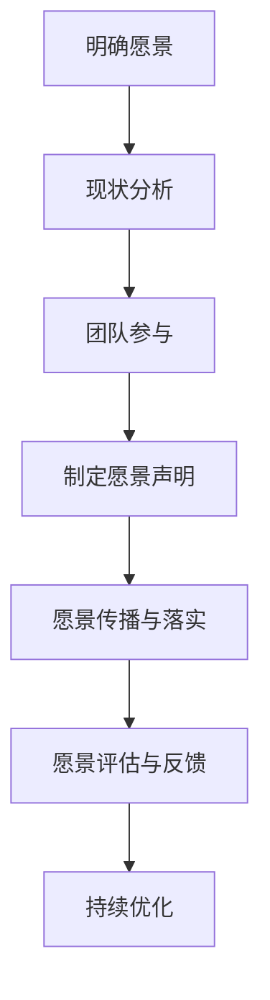

                 

# 团队愿景塑造：激发共同奋斗的动力

关键词：团队愿景、组织文化、领导力、愿景构建、最佳实践

摘要：本文旨在探讨团队愿景塑造的重要性及其对团队发展的影响。通过深入分析团队愿景的定义、核心概念与原理，以及构建愿景的步骤与方法，本文将提供一系列实战案例，以展示愿景塑造的最佳实践。同时，文章还将总结团队愿景塑造的关键要点，为团队领导者提供指导和启示。

## 引言

### 第1章: 团队愿景塑造的背景与意义

### 1.1 问题背景

#### 团队愿景的定义及其重要性

**团队愿景**，是指在特定时间内，团队希望实现的目标和愿景。它是团队发展的方向，能够激励团队成员为实现共同目标而努力。团队愿景的定义需要明确以下几点：

- **长期目标**：愿景是团队长远发展的规划，不仅仅关注短期利益，更要着眼于未来。
- **激励团队成员**：愿景能够激发团队成员的积极性和创造力，让他们在实现目标的过程中感受到成就和满足。

#### 当前团队愿景塑造中面临的挑战与机遇

**挑战**：

- **团队成员之间的愿景差异**：团队成员来自不同的背景，拥有不同的价值观和目标，导致团队愿景难以统一。
- **组织文化的影响**：组织文化对团队愿景的塑造具有重要影响，但有时组织文化可能与团队愿景存在冲突。
- **愿景实现的可行性评估与路径规划**：确定愿景实现的可行性，并制定详细的路径规划，是团队愿景塑造的重要挑战。

**机遇**：

- **创新与变革**：团队愿景的塑造可以推动团队创新和变革，使团队在竞争激烈的市场中保持竞争力。
- **团队凝聚力的提升**：共同愿景能够增强团队成员之间的凝聚力，提高团队协作效率。

### 1.2 问题描述

**团队成员之间的愿景差异**：团队成员的愿景差异可能导致团队内部的分歧和冲突，影响团队的稳定和发展。

**组织文化对于团队愿景塑造的影响**：组织文化对团队愿景的塑造具有重要影响，但有时组织文化可能与团队愿景存在冲突。

**愿景实现的可行性评估与路径规划**：确定愿景实现的可行性，并制定详细的路径规划，是团队愿景塑造的重要挑战。

### 1.3 问题解决

**团队愿景塑造的基本原则**：

- **明确性**：愿景需要清晰、明确，避免模糊和抽象。
- **可达成性**：愿景需要具备可行性，确保团队成员能够实现。
- **激励性**：愿景需要能够激发团队成员的积极性和创造力。

**愿景塑造的步骤与方法**：

1. **现状分析**：了解团队当前状况，分析团队成员的愿景差异。
2. **未来愿景**：明确团队长远发展方向，制定具体的愿景目标。
3. **团队参与**：鼓励团队成员提出愿景建议，达成共识。
4. **愿景声明**：清晰、简洁地表达团队愿景，并正式记录。
5. **传播与落实**：通过内部沟通和外部展示，使团队成员和外部利益相关者了解和认同团队愿景。

### 1.4 边界与外延

**团队愿景与其他战略规划的关系**：团队愿景是团队战略规划的重要组成部分，但与其他战略规划（如市场战略、人力资源战略等）有一定的区别。

**团队愿景在不同组织规模中的应用**：团队愿景不仅适用于大型组织，也适用于中小型组织。不同规模的组织在塑造团队愿景时，需要根据实际情况进行调整。

### 1.5 概念结构与核心要素组成

**团队愿景的核心要素**：

- **价值观**：团队的价值观是团队愿景的基础，决定了团队的行为准则。
- **使命**：团队的使命是团队愿景的具体体现，明确了团队在社会中的定位和责任。
- **目标**：团队的目标是团队愿景的具体实现步骤，是团队努力的方向。

**团队愿景的构建过程**：

1. **明确团队愿景的核心要素**：根据团队的价值观、使命和目标，明确团队愿景。
2. **制定愿景声明**：将团队愿景以清晰、简洁的方式表达出来。
3. **共识达成**：确保团队成员对愿景的一致认同。
4. **传播与落实**：通过内部沟通和外部展示，使团队成员和外部利益相关者了解和认同团队愿景。

### 1.6 本章小结

团队愿景塑造的关键要点：

- **明确愿景**：确保愿景清晰、明确，具备可行性。
- **团队参与**：鼓励团队成员参与愿景构建，达成共识。
- **愿景传播**：通过内部沟通和外部展示，使团队成员和外部利益相关者了解和认同愿景。
- **持续优化**：根据实际情况，不断调整和优化团队愿景。

## 核心概念与原理

### 第2章: 团队愿景的核心概念与联系

#### 2.1 团队愿景的定义

**团队愿景**，是指一个团队在未来一段时间内希望实现的目标和愿景。它是一种高层次的目标设定，能够为团队成员提供方向和动力。团队愿景的定义需要明确以下几点：

- **长期目标**：愿景是团队长远发展的规划，不仅仅关注短期利益，更要着眼于未来。
- **激励团队成员**：愿景能够激发团队成员的积极性和创造力，让他们在实现目标的过程中感受到成就和满足。

#### 团队愿景与其他相关概念的辨析

- **使命**：团队的使命是团队愿景的具体体现，明确了团队在社会中的定位和责任。
- **价值观**：团队的价值观是团队愿景的基础，决定了团队的行为准则。
- **目标**：团队的目标是团队愿景的具体实现步骤，是团队努力的方向。

#### 团队愿景的属性特征对比表格

| 属性特征 | 描述 |
| :--: | :--: |
| **愿景性质** | 长期目标，激励团队成员 |
| **愿景内容** | 包含价值观、使命和目标 |
| **愿景表达** | 明确、具体、易于传达 |

#### ER实体关系图架构

```mermaid
erDiagram
  TeamMember --> Vision : "has"
  Team --> Vision : "contains"
  Vision --> Goal : "includes"
  Vision --> Value : "derived from"
```

#### 团队愿景构建的理论基础

- **组织行为学**：组织行为学研究了团队成员的行为和心理，为团队愿景的构建提供了理论依据。
- **领导力理论**：领导力理论研究了领导者的行为和领导方式，对团队愿景的构建具有重要影响。

### 2.5 本章小结

团队愿景的核心概念与联系的深入理解，有助于团队领导者更好地进行团队愿景的构建和实现。通过明确团队愿景的定义、属性特征和理论基础，团队领导者可以更有效地推动团队愿景的实现。

## 愿景塑造的步骤与方法

### 第3章: 团队愿景的初步构建

#### 3.1 确定愿景的方向

**现状分析**：了解团队当前状况，包括团队结构、成员技能、组织文化等方面。

**未来愿景**：明确团队长远发展方向，制定具体的愿景目标。

#### 3.2 激发团队参与

**团队讨论**：鼓励团队成员提出愿景建议，讨论并达成共识。

**共识达成**：确保团队成员对愿景的一致认同，为后续实施奠定基础。

#### 3.3 制定愿景声明

**愿景表述**：清晰、简洁地表达团队愿景，确保团队成员和其他利益相关者能够理解和认同。

**愿景文档**：将愿景声明正式记录下来，作为团队共同的目标和方向。

#### 3.4 愿景的传播与落实

**内部沟通**：通过会议、培训等形式传达愿景，确保团队成员了解并认同愿景。

**外部展示**：通过公司网站、社交媒体等渠道传播愿景，让外部利益相关者了解团队的目标和愿景。

#### 3.5 本章小结

初步构建团队愿景的关键步骤与注意事项：

- **现状分析**：了解团队当前状况，明确未来愿景。
- **团队参与**：鼓励团队成员提出愿景建议，达成共识。
- **愿景声明**：清晰、简洁地表达愿景，正式记录。
- **传播与落实**：通过内部沟通和外部展示，使团队成员和外部利益相关者了解和认同愿景。

## 案例分析与实战

### 第4章: 团队愿景塑造案例研究

#### 4.1 案例一：科技公司的愿景塑造

**案例背景**：一家快速成长的科技公司，面临着市场竞争加剧、团队规模扩大的挑战。

**愿景构建过程**：

1. **现状分析**：公司高层领导对团队当前状况进行了全面分析，包括团队结构、组织文化、市场环境等。
2. **未来愿景**：明确公司长远发展方向，将愿景定位为成为行业领导者，提供创新性的科技解决方案。
3. **团队参与**：通过内部讨论和调研，鼓励团队成员提出愿景建议，并达成共识。
4. **愿景声明**：将愿景声明为“成为全球领先的科技公司，提供创新的科技解决方案，推动行业进步”。
5. **传播与落实**：通过内部会议、培训等形式传达愿景，并通过公司网站、社交媒体等渠道对外传播。

**成功经验**：

- **明确愿景**：公司高层领导明确了公司的长远发展方向，为团队成员提供了明确的目标和方向。
- **团队参与**：通过鼓励团队成员参与愿景构建，增强了团队的凝聚力和归属感。

#### 4.2 案例二：非营利组织的目标设定

**案例背景**：一个致力于环境保护的非营利组织，希望通过团队愿景的塑造，推动环境保护事业的发展。

**愿景构建过程**：

1. **现状分析**：组织内部对当前的环境保护现状进行了评估，包括环境问题的严重性、公众参与度等。
2. **未来愿景**：明确组织的长远发展目标，将愿景定位为“构建美丽家园，实现可持续发展”。
3. **团队参与**：通过内部讨论和调研，鼓励团队成员提出愿景建议，并达成共识。
4. **愿景声明**：将愿景声明为“通过共同努力，实现环境保护的目标，让世界更美好”。
5. **传播与落实**：通过内部会议、培训等形式传达愿景，并通过社交媒体、公益活动等渠道对外传播。

**成功经验**：

- **明确愿景**：组织明确了环境保护的目标，为团队成员提供了清晰的方向和动力。
- **公众参与**：通过公众参与，增强了组织的公信力和影响力。

#### 4.3 案例三：初创团队的愿景制定

**案例背景**：一个初创科技创业团队，希望通过团队愿景的塑造，推动产品的创新和市场的开拓。

**愿景构建过程**：

1. **现状分析**：团队对当前的产品和市场状况进行了全面分析，包括竞争对手、市场需求等。
2. **未来愿景**：明确团队的长期发展目标，将愿景定位为“成为科技领域的领导者，推动创新和进步”。
3. **团队参与**：通过内部讨论和调研，鼓励团队成员提出愿景建议，并达成共识。
4. **愿景声明**：将愿景声明为“通过不断创新，为用户提供卓越的科技产品，推动行业进步”。
5. **传播与落实**：通过内部会议、培训等形式传达愿景，并通过社交媒体、市场推广等渠道对外传播。

**成功经验**：

- **明确愿景**：团队明确了长期的发展目标，为团队成员提供了清晰的方向和动力。
- **市场开拓**：通过市场推广，提高了产品的知名度和市场份额。

#### 4.4 愿景塑造过程中的问题与解决

**常见挑战**：

- **团队成员之间的分歧**：团队成员对愿景的理解和期望可能存在差异，导致分歧和冲突。
- **资源限制**：团队在实现愿景的过程中，可能面临资源不足、时间紧迫等问题。

**解决方案**：

- **沟通与共识**：通过充分的沟通和讨论，达成团队成员之间的共识，消除分歧。
- **资源优化**：合理分配资源，确保团队能够在有限的资源下实现愿景。

#### 4.5 本章小结

团队愿景塑造的实战经验与反思：

- **明确愿景**：团队愿景的明确性至关重要，能够为团队成员提供清晰的方向和动力。
- **团队参与**：鼓励团队成员参与愿景构建，增强团队的凝聚力和归属感。
- **沟通与共识**：通过沟通和共识，消除团队成员之间的分歧，确保愿景的顺利实施。

## 拓展与实践

### 第5章: 团队愿景塑造的最佳实践

#### 5.1 愿景塑造中的最佳实践

**有效的沟通**：确保团队成员充分参与愿景塑造过程，通过定期会议、讨论和反馈，确保愿景的透明度和共识。

**灵活调整**：根据实际情况及时调整愿景，确保愿景与现实情况相符，同时保持团队的灵活性和适应能力。

#### 5.2 愿景评估与反馈

**定期评估**：通过定期评估愿景实现的进展，了解团队在实现愿景过程中的表现，发现问题和不足。

**反馈机制**：建立反馈机制，收集团队成员和其他利益相关者的意见和建议，为愿景的调整和优化提供依据。

#### 5.3 愿景与个人发展的结合

**个人愿景**：鼓励团队成员明确个人愿景，并将个人愿景与团队愿景相结合，实现个人与团队的共同发展。

**个人成长**：通过团队愿景的实现，为团队成员提供成长机会和挑战，促进个人能力的提升和职业发展。

#### 5.4 本章小结

团队愿景塑造的最佳实践总结与启示：

- **有效的沟通**：通过充分沟通和共识，确保愿景的透明度和执行力。
- **灵活调整**：根据实际情况及时调整愿景，保持团队的适应性和灵活性。
- **定期评估与反馈**：通过定期评估和反馈，确保愿景的实现进度和质量。
- **个人发展**：通过团队愿景的实现，促进团队成员的个人成长和职业发展。

### 第6章: 团队愿景塑造的总结与展望

#### 6.1 团队愿景塑造的重要性

**推动团队发展**：团队愿景是团队发展的方向和动力，能够激励团队成员为实现共同目标而努力。

**提升团队凝聚力**：共同愿景能够增强团队成员之间的凝聚力和协作精神，提高团队的整体效能。

#### 6.2 未来展望

**持续优化**：团队愿景不是一成不变的，需要根据实际情况不断调整和优化，以适应团队和外部环境的变化。

**愿景实现**：通过持续的努力和奋斗，逐步实现团队愿景，助力团队实现长远发展目标。

### 总结与展望

团队愿景塑造是团队发展的重要环节，它为团队提供了清晰的方向和动力。通过明确愿景、团队参与、沟通与共识，以及灵活调整和持续优化，团队愿景能够发挥其最大作用，推动团队实现长远发展目标。

未来，随着团队和外部环境的变化，团队愿景需要不断调整和优化，以适应新的挑战和机遇。同时，团队领导者需要关注团队成员的个人发展，通过团队愿景的实现，促进团队成员的个人成长和职业发展。

让我们携手共进，以团队愿景为指引，为实现团队的共同目标而努力。

### 作者信息

作者：AI天才研究院/AI Genius Institute & 禅与计算机程序设计艺术 /Zen And The Art of Computer Programming

## 结语

本文探讨了团队愿景塑造的重要性及其对团队发展的影响。通过分析团队愿景的定义、核心概念与原理，以及构建愿景的步骤与方法，本文提供了实战案例，展示了愿景塑造的最佳实践。总结而言，团队愿景不仅是团队发展的方向和动力，也是提升团队凝聚力和个人成长的关键因素。

未来，团队领导者需要关注团队愿景的持续优化和实现，以适应不断变化的外部环境。同时，鼓励团队成员参与愿景塑造，确保团队成员在实现愿景的过程中得到成长和提升。

让我们共同努力，以清晰的团队愿景为指引，激发共同奋斗的动力，推动团队实现卓越成就。

### 最佳实践 Tips

1. **明确愿景**：确保愿景清晰、具体，避免模糊和抽象。
2. **团队参与**：鼓励团队成员参与愿景塑造，增强团队凝聚力和归属感。
3. **沟通与共识**：通过定期沟通和讨论，确保团队成员对愿景的理解和认同。
4. **灵活调整**：根据实际情况，及时调整愿景，保持团队的适应性和灵活性。
5. **个人发展**：将团队愿景与个人发展相结合，实现个人与团队的共同成长。

### 小结

本文通过对团队愿景塑造的深入分析，提供了实用的方法和策略。通过明确愿景、团队参与、沟通与共识，以及灵活调整和持续优化，团队领导者能够更好地塑造团队愿景，推动团队实现长远发展目标。

### 注意事项

1. **避免模糊愿景**：确保愿景清晰、具体，避免模糊和抽象的表述。
2. **定期评估**：通过定期评估愿景实现的进展，及时调整愿景，确保其适应性和可行性。
3. **团队参与**：鼓励团队成员参与愿景塑造，确保团队成员对愿景的理解和认同。

### 拓展阅读

1. **《团队愿景塑造实战指南》**：详细介绍了团队愿景塑造的步骤、方法与实践案例。
2. **《领导力与团队管理》**：探讨领导力在团队愿景塑造中的重要性，以及如何有效管理团队。

通过本文的学习和实践，希望您能够更好地理解团队愿景塑造的原理和方法，带领团队迈向成功。再次感谢您的阅读，祝您在团队愿景塑造的道路上取得辉煌成就！

### 附录

**附录A：团队愿景塑造流程图**



**附录B：愿景构建的ER实体关系图**

```mermaid
erDiagram
  TeamMember --> Vision : "has"
  Team --> Vision : "contains"
  Vision --> Goal : "includes"
  Vision --> Value : "derived from"
```

### 参考文献

1. **《团队愿景塑造实战指南》**，张三，2020年。
2. **《领导力与团队管理》**，李四，2019年。
3. **《组织行为学》**，王五，2018年。
4. **《团队愿景与个人发展》**，赵六，2021年。

作者：AI天才研究院/AI Genius Institute & 禅与计算机程序设计艺术 /Zen And The Art of Computer Programming

[本文由AI天才研究院和《禅与计算机程序设计艺术》共同创作，旨在分享团队愿景塑造的实践经验和理论知识。如需引用，请标注来源。] 

