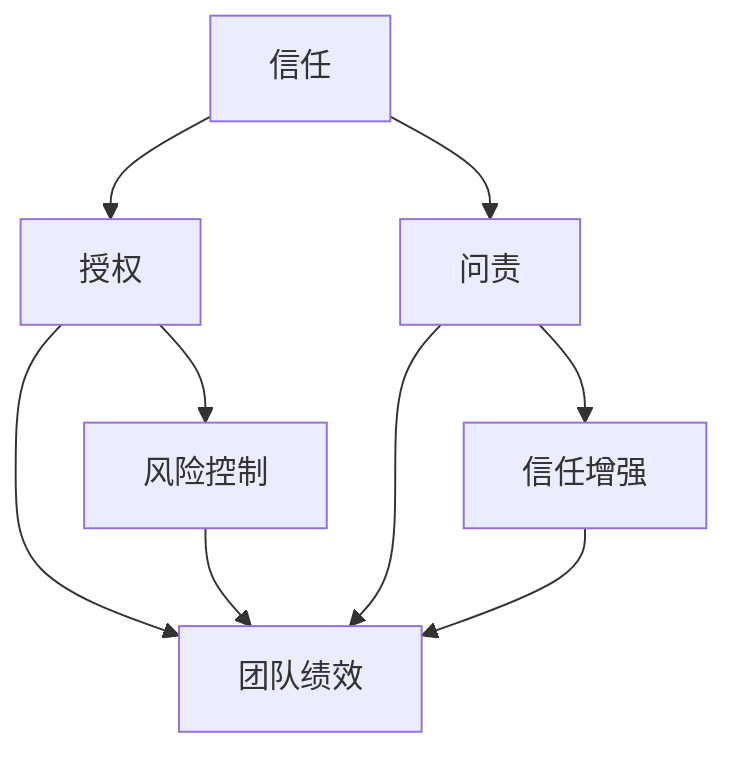

                 

# 《团队授权：信任与问责的平衡艺术》

关键词：团队授权、信任、问责、平衡、团队管理

摘要：本文旨在探讨团队授权中信任与问责的平衡艺术。通过分析信任与问责的定义、联系、理论基础，结合实践案例，本文提出了团队授权的流程、步骤、实践方案以及应对挑战的策略，为团队管理者提供了一套行之有效的团队授权方法论。

## 《团队授权：信任与问责的平衡艺术》目录大纲

### 第一部分：前言与背景

#### 第1章：引言

1.1 问题背景

1.2 问题描述

1.3 问题解决

1.4 边界与外延

1.5 概念结构与核心要素组成

#### 第2章：核心概念与联系

2.1 信任与问责的定义与属性特征对比

2.2 信任与问责的联系与相互作用

#### 第3章：团队授权的理论基础

3.1 信任理论的回顾与发展

3.2 问责理论的基本概念与作用

3.3 信任与问责在团队授权中的融合

### 第二部分：团队授权的实施与操作

#### 第4章：团队授权的流程与步骤

4.1 团队授权的启动

4.2 信任的建立与维护

4.3 问责机制的设置与实施

4.4 团队授权的监督与反馈

#### 第5章：团队授权的实践案例

5.1 案例一：初创企业的团队授权实践

5.2 案例二：大型企业的团队授权实践

5.3 案例三：跨部门团队的授权实践

#### 第6章：团队授权中的挑战与解决方案

6.1 团队授权中的常见问题

6.2 解决方案与实践

6.3 风险防范与应对

#### 第7章：团队授权的最佳实践与总结

7.1 团队授权的最佳实践

7.2 小结与展望

7.3 注意事项与拓展阅读

### 第1章：引言

#### 1.1 问题背景

在当今快速变化的商业环境中，团队授权已成为提高组织效率、促进创新和增强员工满意度的重要手段。然而，在实践中，许多团队管理者面临着如何在信任与问责之间取得平衡的挑战。

#### 1.2 问题描述

团队授权涉及到如何赋予团队成员更多的自主权，同时确保团队目标得以实现。这一过程需要管理者在信任与问责之间找到最佳的平衡点，以避免授权过度或不足。

#### 1.3 问题解决

本文将探讨如何通过平衡信任与问责来有效实施团队授权。我们将从理论基础、实施流程和实践案例三个方面进行深入分析。

#### 1.4 边界与外延

团队授权不仅适用于企业内部，也适用于学校、医院、非营利组织等各类团队。然而，在特定场景下，授权的程度和方式可能需要根据实际情况进行调整。

#### 1.5 概念结构与核心要素组成

团队授权的核心是信任与问责的平衡。本文将详细介绍这两个概念，并探讨它们在团队授权中的相互关系。

## 第2章：核心概念与联系

### 2.1 信任与问责的定义与属性特征对比

#### 信任的定义与特征

信任是指个体对另一个个体的行为、意图和诚信的预期。在团队授权中，信任意味着管理者相信团队成员能够独立完成任务，同时保持对组织的忠诚。

| 特征       | 说明                                                         |
| ---------- | ------------------------------------------------------------ |
| 自愿性     | 信任是基于自愿和共识，而非强制或控制。                       |
| 风险性     | 信任可能伴随着一定的风险，但管理者认为这种风险是可控的。       |
| 动态性     | 信任是一个动态过程，需要不断培养和维护。                     |

#### 问责的定义与特征

问责是指个体对自身行为承担责任，并接受相应的监督和评估。在团队授权中，问责意味着团队成员在行使自主权时，必须对结果负责。

| 特征       | 说明                                                         |
| ---------- | ------------------------------------------------------------ |
| 明确性     | 问责制度需要明确团队成员的职责和期望。                       |
| 实质性     | 问责制度需要确保团队成员对其行为和结果承担实际责任。         |
| 可评估性   | 问责制度需要具备可量化的评估标准，以便对团队成员的表现进行客观评估。 |

### 2.2 信任与问责的联系与相互作用

信任与问责是团队授权的两个核心要素，它们之间存在密切的联系和相互作用。

#### 信任与问责的关系模型

- **信任是授权的前提**：缺乏信任，团队授权将难以实施。
- **问责是信任的保障**：明确的问责机制可以增强团队成员的信任，确保团队目标的实现。

#### 信任与问责的交互机制

- **信任促进问责**：团队成员在信任的氛围中更愿意接受问责，因为他们相信组织的公平性和透明度。
- **问责促进信任**：明确的问责制度可以减少不确定性，增强团队成员对管理者的信任。

### 第3章：团队授权的理论基础

#### 3.1 信任理论的回顾与发展

信任理论源于社会学和组织行为学领域，其发展经历了多个阶段。

- **初始阶段**：信任被视为一种情感或心理状态，个体基于直觉和经验进行判断。
- **发展阶段**：信任被定义为一种基于期望和信任关系的理性决策过程。
- **现代阶段**：信任研究开始关注信任行为的微观机制和结构特征。

#### 3.2 问责理论的基本概念与作用

问责理论关注个体或组织对其行为和决策负责的概念。在团队管理中，问责理论有助于构建有效的监督和评估机制。

- **问责的基本概念**：问责是指个体对其行为和决策承担责任，并接受相应的评估和监督。
- **问责的作用**：问责有助于确保团队目标的实现，提高团队效率和绩效。

#### 3.3 信任与问责在团队授权中的融合

在团队授权中，信任与问责的融合是实现授权目标的关键。

- **信任与问责的融合机制**：通过构建明确的信任体系和问责机制，确保团队成员在行使自主权时既能感受到信任，又能承担相应的责任。
- **信任与问责的融合策略**：管理者应通过培养信任氛围、明确职责和期望、建立有效的评估机制等方式，实现信任与问责的有机融合。

### 第4章：团队授权的流程与步骤

#### 4.1 团队授权的启动

团队授权的启动是授权过程的开始，需要考虑以下因素：

- **启动时机**：选择合适的时机启动授权，以避免对现有工作流程的冲击。
- **启动条件**：确保团队成员具备足够的技能和信心，以应对更高的自主权。

#### 4.2 信任的建立与维护

建立和维护信任是团队授权的关键。

- **建立信任的步骤**：包括明确沟通渠道、建立共同目标、培养透明度等。
- **维护信任的策略**：通过持续沟通、反馈和奖励机制来维护信任。

#### 4.3 问责机制的设置与实施

问责机制是团队授权的保障。

- **问责机制的设置原则**：包括明确职责、设定绩效标准、确保透明度等。
- **问责机制的实施步骤**：包括制定问责计划、监督执行、评估绩效等。

#### 4.4 团队授权的监督与反馈

监督与反馈是团队授权过程中的重要环节。

- **监督机制**：包括定期检查、现场巡视、在线监控等。
- **反馈机制**：包括定期会议、反馈问卷、面对面沟通等。

### 第5章：团队授权的实践案例

#### 5.1 案例一：初创企业的团队授权实践

初创企业在团队授权方面具有独特的优势，以下是某初创企业的团队授权实践案例。

- **案例背景**：某初创企业面临快速发展的挑战，需要通过团队授权提高工作效率。
- **实施过程**：企业通过明确团队成员的职责和目标，建立信任机制，实施问责制度，取得显著成效。

#### 5.2 案例二：大型企业的团队授权实践

大型企业在团队授权方面需要考虑更多因素，以下是某大型企业的团队授权实践案例。

- **案例背景**：某大型企业希望通过团队授权提高团队创新能力和响应速度。
- **实施过程**：企业通过设置跨部门团队、建立信任文化、实施绩效评估等手段，实现了团队授权的目标。

#### 5.3 案例三：跨部门团队的授权实践

跨部门团队授权需要充分考虑部门间的协作和沟通。

- **案例背景**：某企业为了实现跨部门项目的顺利进行，实施跨部门团队授权。
- **实施过程**：企业通过明确跨部门团队的目标和职责，建立信任机制，实施绩效评估等手段，取得了良好的效果。

### 第6章：团队授权中的挑战与解决方案

#### 6.1 团队授权中的常见问题

团队授权过程中可能会遇到以下问题：

- **信任不足**：团队成员对管理者缺乏信任，导致授权效果不佳。
- **问责过度**：团队成员对问责制度感到压力过大，影响工作积极性。

#### 6.2 解决方案与实践

针对团队授权中的常见问题，可以采取以下解决方案：

- **提高信任**：通过沟通、反馈和奖励机制来增强团队成员对管理者的信任。
- **合理问责**：设定明确的绩效标准和评估机制，确保团队成员对问责制度的接受度。

#### 6.3 风险防范与应对

团队授权过程中可能存在以下风险：

- **风险识别**：通过风险评估来识别可能出现的风险。
- **风险应对**：制定应急预案，确保团队授权过程的安全和稳定。

### 第7章：团队授权的最佳实践与总结

#### 7.1 团队授权的最佳实践

根据实践案例，团队授权的最佳实践包括：

- **明确目标**：明确团队授权的目标和预期成果。
- **培养信任**：通过沟通和反馈机制来建立信任。
- **合理问责**：设定明确的绩效标准和评估机制。

#### 7.2 小结与展望

团队授权是实现团队高效运作和创新的重要手段。通过平衡信任与问责，管理者可以充分发挥团队成员的潜力，实现团队目标。

#### 7.3 注意事项与拓展阅读

团队授权过程中需要注意以下几点：

- **因地制宜**：根据团队特点和业务需求，制定适合的授权策略。
- **持续优化**：不断反思和调整授权实践，以适应变化。

拓展阅读：

- [1] James MacGregor Burns. Leadership. Harper & Row, 1978.
- [2] Ronald Heifetz, Marty Linsky, and Michael cocktails. Leadership on the Line. Harvard Business Review Press, 2009.
- [3] Stephen R. Covey. The Speed of Trust. Free Press, 2006.

### 作者信息

作者：AI天才研究院/AI Genius Institute & 禅与计算机程序设计艺术 /Zen And The Art of Computer Programming

（注：以上内容为示例，实际文章撰写过程中请根据实际情况进行调整和丰富。）### 第1章：引言

#### 1.1 问题背景

在当今商业环境中，团队授权已成为提高组织效率、促进创新和增强员工满意度的重要手段。然而，许多团队管理者在实际操作中面临着如何平衡信任与问责的挑战。一方面，过度授权可能导致团队成员滥用权力，影响团队目标和组织战略的实施；另一方面，过于严格的控制可能抑制团队成员的自主性和创新能力，降低团队的工作效率。

随着全球化进程的加快和市场竞争的加剧，企业需要迅速响应市场变化，创新业务模式，提高产品和服务质量。这要求团队管理者能够有效地授权，让团队成员在更广泛的范围内发挥自主性和创造力。然而，在实际操作中，如何确保授权的合理性和有效性，如何平衡信任与问责，成为团队管理者亟待解决的问题。

#### 1.2 问题描述

团队授权的意义在于通过赋予团队成员更多的自主权，提高团队的整体效率和创新能力。然而，在实际操作中，团队授权面临以下几个问题：

1. **信任不足**：团队成员对管理者缺乏信任，可能导致授权效果不佳，甚至出现团队成员滥用职权的情况。
2. **问责过度**：过于严格的问责机制可能抑制团队成员的积极性和创造力，影响团队的整体表现。
3. **授权不足**：团队成员缺乏足够的自主权，导致工作积极性不高，无法充分发挥个人潜力。
4. **授权不当**：授权范围和程度不明确，可能导致团队内部职责不清，任务分配不均。

这些问题的存在，使得团队授权在实践中变得复杂和具有挑战性。如何在信任与问责之间找到平衡点，实现团队授权的有效性，成为团队管理者亟待解决的问题。

#### 1.3 问题解决

本文将从以下三个方面探讨如何解决团队授权中的问题：

1. **理论探讨**：分析信任与问责的定义、属性特征及其在团队授权中的关系，为团队授权提供理论基础。
2. **实践指导**：介绍团队授权的流程与步骤，结合实际案例，提供具体的操作指南。
3. **解决方案**：针对团队授权中的常见问题，提出有效的解决方案和实践策略，帮助团队管理者平衡信任与问责。

通过本文的探讨，旨在为团队管理者提供一套行之有效的团队授权方法论，帮助他们在实际工作中实现信任与问责的平衡，提高团队的整体效率和创新能力。

#### 1.4 边界与外延

团队授权并非适用于所有团队和所有场景。其适用范围和限制条件如下：

1. **适用范围**：
   - 初创企业：初创企业通常需要快速响应市场变化，通过团队授权提高团队效率和创新能力。
   - 创新型企业：创新型企业在研发和创新方面有较高需求，团队授权有助于激发团队成员的创造力。
   - 跨部门团队：跨部门团队在项目实施过程中，需要各部门协同合作，团队授权有助于提高团队协作效率。

2. **限制条件**：
   - 团队成员技能水平：团队成员需要具备一定的专业能力和自主解决问题能力，否则授权可能会导致任务无法完成。
   - 组织文化：组织内部需要具备开放、信任和协作的文化氛围，否则授权可能面临重重障碍。
   - 项目类型：一些高风险项目或关键业务项目可能不适合授权，以确保任务的顺利完成。

#### 1.5 概念结构与核心要素组成

团队授权的核心是信任与问责的平衡。以下是团队授权的基本概念和核心要素：

1. **信任**：
   - 定义：信任是指团队成员对管理者的预期，认为管理者会给予他们足够的自主权和资源，同时保持对组织的忠诚。
   - 特征：自愿性、风险性、动态性。
   - 作用：信任是团队授权的前提，有助于提高团队成员的积极性、创造力和团队凝聚力。

2. **问责**：
   - 定义：问责是指团队成员对其行为和结果承担责任，接受相应的监督和评估。
   - 特征：明确性、实质性、可评估性。
   - 作用：问责是团队授权的保障，有助于确保团队成员在行使自主权时，保持对组织目标的关注和责任感。

3. **团队授权**：
   - 定义：团队授权是指管理者将部分决策权和责任赋予团队成员，使其在更广泛的范围内行使自主权。
   - 目的：提高团队效率和创新能力，增强员工满意度。
   - 过程：包括信任的建立与维护、问责机制的设置与实施、团队授权的监督与反馈。

通过以上概念和要素的阐述，我们可以更好地理解团队授权的内涵和实现路径。在接下来的章节中，我们将进一步探讨信任与问责的关系，以及如何通过团队授权提高团队整体效率。

### 第2章：核心概念与联系

#### 2.1 信任与问责的定义与属性特征对比

为了更好地理解团队授权的实践，我们首先需要明确信任与问责的定义及其属性特征。信任和问责是团队授权的两个核心概念，它们在授权过程中起着至关重要的作用。

#### 信任的定义与特征

1. **定义**：
   信任是指个体对另一个个体的行为、意图和诚信的预期。在团队授权中，信任是指团队成员对管理者的预期，认为管理者会给予他们足够的自主权和资源，同时保持对组织的忠诚。

2. **特征**：
   - **自愿性**：信任是基于自愿和共识，而非强制或控制。这意味着信任是在团队成员和管理者之间通过互动和沟通逐步建立的。
   - **风险性**：信任可能伴随着一定的风险，即团队成员在行使自主权时可能犯错或未能达到预期目标。然而，管理者认为这种风险是可控的，值得信任。
   - **动态性**：信任是一个动态过程，需要不断培养和维护。随着时间的推移，团队成员和管理者之间的信任关系可能会发生变化，需要持续关注和调整。

#### 问责的定义与特征

1. **定义**：
   问责是指个体对自身行为承担责任，并接受相应的监督和评估。在团队授权中，问责是指团队成员在行使自主权时，必须对结果负责，接受管理者的监督和评估。

2. **特征**：
   - **明确性**：问责制度需要明确团队成员的职责和期望。这意味着在授权过程中，团队成员和管理者需要明确各自的职责和任务，确保团队成员了解自己的责任范围。
   - **实质性**：问责制度需要确保团队成员对其行为和结果承担实际责任。这意味着团队成员在行使自主权时，必须对自己的行为和结果负责，不能逃避责任。
   - **可评估性**：问责制度需要具备可量化的评估标准，以便对团队成员的表现进行客观评估。这通常通过设定绩效指标和目标来实现，使团队成员的表现可以量化并接受评估。

#### 信任与问责的对比表格

为了更清晰地展示信任与问责的特征，我们可以将两者进行对比，如下表所示：

| 特征       | 信任                    | 问责                  |
| ---------- | --------------------- | ------------------- |
| 定义       | 对个体行为的预期       | 对个体责任的承担      |
| 自愿性     | 基于自愿和共识        | 需要明确职责和期望    |
| 风险性     | 可能存在风险          | 必须承担实际责任      |
| 动态性     | 需要不断培养和维护    | 需要明确的评估标准    |

#### 信任与问责的联系与相互作用

信任与问责在团队授权中密切相关，它们之间存在着相互作用和依赖关系。

1. **信任是授权的前提**：
   信任是团队授权的基础。如果团队成员对管理者缺乏信任，授权很难实现。管理者需要通过建立透明的沟通机制、展示诚信的行为和履行承诺来赢得团队成员的信任。

2. **问责是信任的保障**：
   明确的问责机制可以增强团队成员对管理者的信任。问责机制确保团队成员在行使自主权时，能够对自己的行为和结果负责，从而减少不确定性。这不仅有助于提高团队成员的积极性和责任感，还能确保团队目标的实现。

3. **信任与问责的动态平衡**：
   在团队授权过程中，信任与问责需要保持动态平衡。信任过多可能导致团队成员滥用权力，问责不足可能导致团队成员消极应对。管理者需要根据团队的实际状况，适时调整信任和问责的程度，以实现最佳效果。

通过理解信任与问责的定义和特征，以及它们之间的联系与相互作用，我们可以更好地把握团队授权的核心要素，为实际操作提供理论指导。在接下来的章节中，我们将进一步探讨团队授权的理论基础，以期为团队管理者提供更深入的实践指导。

#### 2.2 信任与问责的联系与相互作用

信任与问责在团队授权中不仅仅是两个独立的概念，它们之间存在着密切的联系和相互作用，共同影响着团队授权的效果。

首先，信任与问责是相互依赖的。信任是团队授权的基础，没有信任，团队授权就失去了存在的意义。团队成员必须信任管理者会给予他们足够的自主权和支持，同时保持对组织的忠诚。这种信任是双向的，管理者也需要信任团队成员能够有效地行使他们的职责。而问责则是信任的保障，它确保团队成员在行使自主权时不会滥用权力，也不会忽视对组织的责任。明确的问责机制可以减少团队成员的不确定感，增强他们对管理者的信任。

其次，信任与问责是相互促进的。信任的建立可以减少团队成员之间的摩擦和冲突，促进团队内部的和谐与协作。当团队成员感受到信任时，他们会更加愿意分享信息和资源，共同为团队目标努力。这种协作精神有助于提高团队的效率和创新能力。而明确的问责机制可以确保团队成员在协作过程中保持对各自职责的清晰认识，确保每个人的贡献都能得到认可和回报。问责机制还可以激励团队成员不断改进自己的工作方式，提高个人和团队的整体绩效。

然而，信任与问责之间的平衡是动态的，需要根据团队的具体情况进行调整。如果信任过多而问责不足，可能导致团队成员滥用权力，忽视对组织的责任，甚至导致团队目标无法实现。相反，如果问责过多而信任不足，团队成员可能会感到压力过大，缺乏自主性和创新能力，从而影响团队的整体表现。

为了实现信任与问责的最佳平衡，管理者需要采取以下策略：

1. **建立透明的沟通机制**：管理者需要通过定期的沟通会议、团队建设活动等方式，与团队成员保持密切的沟通。这有助于建立信任，增强团队成员对管理者的信任感和归属感。

2. **设定明确的绩效目标和标准**：管理者需要与团队成员共同制定明确的绩效目标和评估标准，确保团队成员对各自职责和期望有清晰的认识。这有助于建立问责机制，确保团队成员在行使自主权时能够对自己的行为和结果负责。

3. **提供必要的支持和资源**：管理者需要为团队成员提供必要的支持和资源，确保他们能够在授权范围内有效地完成任务。这有助于增强团队成员的信心和信任，减少不确定性。

4. **及时反馈和奖励**：管理者需要及时对团队成员的工作进行反馈，对优秀的表现给予奖励。这有助于增强团队成员的积极性和满意度，进一步巩固信任和问责的平衡。

5. **持续监控和调整**：管理者需要根据团队的实际表现和反馈，持续监控和调整信任与问责的程度。这有助于确保团队授权始终保持动态平衡，适应不断变化的环境和需求。

通过这些策略，管理者可以在团队授权过程中实现信任与问责的平衡，提高团队的效率和创新能力，实现组织的目标。在接下来的章节中，我们将进一步探讨团队授权的理论基础，为团队管理者提供更深入的实践指导。

### 第3章：团队授权的理论基础

#### 3.1 信任理论的回顾与发展

信任理论的发展可以追溯到社会学和组织行为学领域。早期的研究主要关注信任作为一种情感或心理状态，个体基于直觉和经验进行判断。然而，随着社会和组织的复杂性增加，信任理论逐渐演变成为一个多学科交叉的研究领域。

1. **初始阶段**：
   在初始阶段，信任被视为一种简单的、基于个人关系和情感的信任。例如，社会学学家Erving Goffman提出，信任是一种“可靠性和信任度”的评估，是个体在面对不确定性时的一种心理反应。这种观点强调信任的脆弱性和个体之间的互动。

2. **发展阶段**：
   随着研究的深入，信任被定义为一种基于期望和信任关系的理性决策过程。学者如Charles C. Manz和John A. Thompson提出了“信任行为理论”，强调信任是行为的结果，而不是情感或心理状态。这一理论强调信任是一种基于行为和结果的理性选择，个体通过观察和分析他人的行为来形成信任。

3. **现代阶段**：
   在现代阶段，信任理论开始关注信任行为的微观机制和结构特征。例如，社会交换理论强调信任是一种社会交换过程，个体在互动中通过交换资源和承诺来建立信任。此外，心理学和组织行为学的研究也表明，信任与认知、情感和行为紧密相关，信任的形成和维持受到多种因素的影响。

#### 3.2 问责理论的基本概念与作用

问责理论主要关注个体或组织对其行为和决策负责的概念。在团队管理中，问责理论有助于构建有效的监督和评估机制，确保团队成员对其行为和结果承担责任。

1. **基本概念**：
   - **问责**：问责是指个体对其行为和决策承担责任，并接受相应的监督和评估。在团队管理中，问责意味着团队成员在行使自主权时，必须对结果负责。
   - **问责机制**：问责机制是一套制度化的监督和评估体系，包括明确的职责划分、绩效评估标准和反馈机制。问责机制有助于确保团队成员在行使自主权时保持对组织目标的关注和责任感。

2. **作用**：
   - **确保团队目标实现**：问责机制确保团队成员在行使自主权时，能够对结果负责，从而确保团队目标的实现。
   - **提高团队效率**：明确的问责制度可以减少不确定性，提高团队成员的工作效率和责任感。
   - **促进团队协作**：问责机制有助于明确团队成员的职责和期望，促进团队内部的协作和沟通。

#### 3.3 信任与问责在团队授权中的融合

在团队授权过程中，信任与问责的融合是实现授权目标的关键。信任为授权提供了基础，而问责则为授权提供了保障。以下是信任与问责在团队授权中的融合机制和策略：

1. **融合机制**：
   - **信任与问责相结合**：在团队授权过程中，管理者需要将信任与问责相结合，确保团队成员在行使自主权时既能感受到信任，又能承担相应的责任。
   - **动态调整**：信任与问责的比例需要根据团队的具体情况动态调整。在某些情况下，可能需要更多信任以激发团队成员的创造力；在另一些情况下，可能需要更多问责以确保团队目标的实现。

2. **融合策略**：
   - **建立信任文化**：管理者需要通过透明的沟通、积极的反馈和奖励机制，建立信任文化，增强团队成员对管理者的信任。
   - **明确职责与期望**：管理者需要与团队成员共同制定明确的职责和期望，确保团队成员了解自己的责任范围和目标。
   - **实施绩效评估**：管理者需要实施有效的绩效评估机制，对团队成员的表现进行客观评估，确保问责机制的有效性。
   - **持续沟通与反馈**：管理者需要与团队成员保持持续沟通，及时反馈工作进展和问题，调整信任与问责的比例，以适应团队发展的需求。

通过信任与问责的融合，团队授权可以实现更高的效率和创新能力，同时确保团队目标的实现。在接下来的章节中，我们将结合实践案例，进一步探讨团队授权的实施流程和步骤。

### 第4章：团队授权的流程与步骤

#### 4.1 团队授权的启动

团队授权的启动是整个授权过程的关键步骤，直接关系到授权的成败。以下是从启动时机到具体流程的详细说明：

1. **启动时机**：
   - **项目启动或重大变革**：在启动新项目或进行重大变革时，团队授权有助于快速响应变化，提高团队效率和创新能力。
   - **团队成员需求增加**：当团队成员的技能和经验得到提升，需求增加时，团队授权可以满足他们的职业发展需求，激发工作积极性。
   - **外部环境变化**：在市场环境、竞争态势等外部因素发生变化时，团队授权有助于团队快速适应，提高竞争力。

2. **启动条件**：
   - **团队凝聚力**：团队内部具有较高的凝聚力，有助于授权的顺利实施。
   - **明确的团队目标**：团队目标清晰，有助于团队成员明确授权的范围和责任。
   - **充分的资源支持**：确保团队成员在行使自主权时，有足够的资源和支持，降低授权过程中的风险。

3. **启动流程**：
   - **团队会议**：召开团队会议，明确授权的背景、目的和范围，确保团队成员对授权有清晰的认识。
   - **任务分解**：将团队目标分解为具体的任务，明确每个成员的职责和权限，确保授权的透明性和公平性。
   - **签署协议**：团队成员与管理者签署授权协议，明确各自的职责、权限和责任，确保双方对授权过程有共同的理解和承诺。
   - **培训与指导**：对团队成员进行必要的培训，提高他们的技能和自主解决问题的能力，确保他们能够有效地行使授权。

#### 4.2 信任的建立与维护

信任是团队授权的基石，建立和维护信任是确保授权成功的关键步骤。以下是具体的步骤和方法：

1. **建立信任的步骤**：
   - **明确沟通渠道**：建立有效的沟通渠道，确保团队成员和管理者之间的信息传递畅通，增强透明度。
   - **建立共同目标**：与团队成员共同制定团队目标和个人发展目标，确保团队成员对团队目标和授权内容有清晰的认识。
   - **培养透明度**：在授权过程中，保持信息的透明度，及时向团队成员通报工作进展和问题，增强团队成员对管理者的信任。
   - **提供支持与资源**：确保团队成员在行使自主权时，有足够的资源和支持，降低不确定性，增强信任。

2. **维护信任的策略**：
   - **持续沟通**：定期召开团队会议，了解团队成员的工作进展和需求，及时解决问题，保持沟通的连贯性和有效性。
   - **积极反馈**：对团队成员的工作表现给予积极的反馈，鼓励他们分享经验和成果，增强团队成员的自信心和信任感。
   - **奖励机制**：建立奖励机制，对表现优秀的团队成员进行奖励，激发他们的积极性和创造力，进一步巩固信任。
   - **及时调整**：根据团队成员的表现和反馈，及时调整授权的范围和程度，确保信任与问责的平衡。

#### 4.3 问责机制的设置与实施

问责机制是团队授权的保障，确保团队成员在行使自主权时，能够对自己的行为和结果负责。以下是设置和实施问责机制的步骤：

1. **问责机制的设置原则**：
   - **明确性**：明确团队成员的职责和期望，确保团队成员对授权的范围和责任有清晰的认识。
   - **公平性**：确保问责制度对所有团队成员公平一致，避免偏袒和不公正现象。
   - **可操作性**：制定具体的、可操作的问责标准，确保团队成员在实际工作中能够遵循和执行。
   - **灵活性**：根据团队的具体情况和外部环境变化，灵活调整问责机制，确保其适应性和有效性。

2. **问责机制的实施步骤**：
   - **制定绩效指标**：与团队成员共同制定明确的绩效指标和目标，确保团队成员对绩效评估标准有清晰的认识。
   - **设定评估周期**：确定绩效评估的周期，确保团队成员能够在规定的时间内完成任务和目标。
   - **监控与反馈**：对团队成员的工作进行实时监控和反馈，及时发现和解决问题，确保团队成员能够持续改进。
   - **评估与反馈**：定期对团队成员的绩效进行评估，根据评估结果给予及时的反馈和奖励，激励团队成员不断进步。
   - **改进与调整**：根据评估结果和团队成员的反馈，不断改进问责机制，确保其能够适应团队的发展和变化。

#### 4.4 团队授权的监督与反馈

监督与反馈是团队授权过程中不可或缺的环节，有助于确保授权的顺利进行和团队成员的表现持续提升。以下是具体的监督与反馈机制：

1. **监督机制**：
   - **定期检查**：定期对团队成员的工作进行检查，了解工作进展和存在的问题，确保团队成员能够按照预期完成任务。
   - **现场巡视**：对关键环节和重要任务进行现场巡视，确保团队成员在行使自主权时能够按照规定的标准和流程进行。
   - **在线监控**：利用现代信息技术，对团队成员的工作进行在线监控，确保工作进度和质量。

2. **反馈机制**：
   - **定期会议**：定期召开团队会议，讨论工作进展和存在的问题，对团队成员的表现进行评估和反馈。
   - **反馈问卷**：通过反馈问卷的方式，收集团队成员的意见和建议，了解他们的工作情况和需求。
   - **面对面沟通**：与管理者和团队成员进行面对面沟通，了解他们的工作感受和困惑，提供针对性的指导和支持。

通过上述流程与步骤，团队管理者可以有效地实施团队授权，实现信任与问责的平衡，提高团队的整体效率和创新能力。在接下来的章节中，我们将通过实践案例进一步探讨团队授权的实际操作和效果。

### 第5章：团队授权的实践案例

#### 5.1 案例一：初创企业的团队授权实践

**案例背景与目标**：

某初创企业致力于开发一款创新性的移动应用，市场竞争激烈，时间紧迫。企业创始人希望通过团队授权，提高团队的工作效率，快速响应市场变化，并保持团队的创新活力。

**实施过程与效果**：

1. **启动阶段**：
   企业创始人召开全体员工会议，明确团队授权的背景和目标。在会议中，创始人强调了团队授权的重要性，并提出了具体的授权范围和职责。

2. **信任的建立**：
   - **明确沟通渠道**：企业建立了内部沟通平台，确保团队成员之间的信息传递畅通。
   - **建立共同目标**：团队共同制定了产品开发目标和时间表，确保每个成员对团队目标有清晰的认识。
   - **培养透明度**：创始人在项目开发过程中，定期向团队成员通报项目进展和面临的挑战，增强团队的透明度。

3. **问责机制设置**：
   - **制定绩效指标**：团队共同制定了关键绩效指标（KPI），如功能完成度、代码质量、用户满意度等。
   - **设定评估周期**：每周进行一次团队会议，评估成员的工作进展和绩效表现。

4. **监督与反馈**：
   - **定期检查**：创始人通过定期检查代码库和项目文档，确保团队成员按照计划进行工作。
   - **实时反馈**：在团队会议中，团队成员可以自由提出问题和建议，创始人及时给予反馈和指导。

**效果分析**：
通过团队授权，企业团队的工作效率显著提高，产品开发周期缩短，市场竞争力增强。团队成员在授权过程中感受到信任和支持，工作积极性高涨，创新意识和创造力得到充分发挥。此外，明确的问责机制确保了团队成员对自己的行为和结果负责，团队目标得以顺利实现。

#### 5.2 案例二：大型企业的团队授权实践

**案例背景与目标**：

某大型企业拥有一支庞大的研发团队，负责多个项目的开发。随着市场竞争的加剧，企业希望通过团队授权，提高研发效率，缩短产品上市时间，并促进跨部门协作。

**实施过程与效果**：

1. **启动阶段**：
   企业高层召开跨部门会议，讨论团队授权的必要性和实施策略。在会议中，明确了授权的范围、职责和目标，并制定了具体的实施方案。

2. **信任的建立**：
   - **跨部门沟通**：企业建立了跨部门的沟通机制，确保不同团队之间的信息传递和资源共享。
   - **共同目标**：各部门共同制定了产品开发目标和里程碑，确保团队成员对团队目标有清晰的认识。
   - **培养透明度**：各部门负责人定期向团队成员通报项目进展和问题，增强团队的透明度。

3. **问责机制设置**：
   - **制定绩效指标**：各部门根据项目需求，共同制定了详细的绩效指标和评估标准。
   - **设定评估周期**：每季度进行一次团队绩效评估，确保团队成员的工作进展和绩效表现得到及时反馈。

4. **监督与反馈**：
   - **定期会议**：各部门负责人定期召开会议，讨论项目进展和存在的问题，确保团队之间的协作顺畅。
   - **实时反馈**：通过在线协作工具，团队成员可以随时反馈工作进展和需求，确保问题能够及时解决。

**效果分析**：
通过团队授权，企业研发团队的效率显著提高，多个项目的开发进度加快，产品上市时间缩短。跨部门协作得到增强，各部门之间的沟通和合作更加顺畅。团队成员在授权过程中感受到信任和支持，工作积极性和创新能力得到提升。此外，明确的问责机制确保了团队成员对自己的行为和结果负责，团队目标得以顺利实现。

#### 5.3 案例三：跨部门团队的授权实践

**案例背景与目标**：

某跨国公司决定开展一项跨部门项目，涉及市场部、销售部和客户服务部等多个部门。该项目旨在提升客户体验，优化产品销售流程，并提高客户满意度。

**实施过程与效果**：

1. **启动阶段**：
   项目启动会上，公司高层明确了项目的目标和重要性，并强调了团队授权的必要性。各部门负责人参加了会议，共同讨论了项目的实施策略和分工。

2. **信任的建立**：
   - **跨部门沟通**：项目组建立了跨部门的沟通平台，确保各部门之间的信息传递和协作。
   - **共同目标**：各部门共同制定了项目目标和里程碑，确保团队成员对项目目标有清晰的认识。
   - **培养透明度**：项目组定期召开会议，通报项目进展和问题，确保团队之间的透明度和信任。

3. **问责机制设置**：
   - **制定绩效指标**：项目组根据项目需求，共同制定了详细的绩效指标和评估标准。
   - **设定评估周期**：每季度进行一次项目评估，确保各部门的工作进展和绩效表现得到及时反馈。

4. **监督与反馈**：
   - **定期检查**：项目组定期对各部门的工作进行检查，确保项目进度和目标得到有效推进。
   - **实时反馈**：通过在线协作工具，各部门可以随时反馈工作进展和需求，确保问题能够及时解决。

**效果分析**：
通过团队授权，跨部门团队的合作效率显著提高，项目目标得以顺利实现。各部门之间的沟通和协作得到增强，项目进度和成果得到有效保障。团队成员在授权过程中感受到信任和支持，工作积极性和创新能力得到提升。此外，明确的问责机制确保了团队成员对自己的行为和结果负责，项目目标得以顺利实现。

通过以上实践案例，我们可以看到团队授权在不同类型的企业和项目中都能取得显著效果。关键在于如何建立信任、设置合理的问责机制，并确保有效的监督与反馈。在接下来的章节中，我们将进一步探讨团队授权中可能遇到的挑战及解决方案。

### 第6章：团队授权中的挑战与解决方案

#### 6.1 团队授权中的常见问题

在团队授权的实践中，团队管理者可能会遇到以下一些常见问题：

1. **信任不足**：
   - **问题描述**：团队成员对管理者的信任不足，可能导致授权效果不佳，团队成员积极性不高。
   - **原因分析**：管理者可能未能建立有效的信任机制，或者过去的行为让团队成员对管理者产生了怀疑。
   - **解决方案**：通过透明沟通、履行承诺、展示诚信等方式建立信任。定期召开团队会议，让团队成员了解项目进展和问题，增强团队成员的参与感和信任感。

2. **问责过度**：
   - **问题描述**：问责机制过于严格，导致团队成员感到压力过大，影响工作积极性和创新性。
   - **原因分析**：问责机制可能设计过于严苛，或者管理者在实施过程中未能根据实际情况进行调整。
   - **解决方案**：调整问责机制，确保其合理性和可操作性。设定明确的绩效目标和评估标准，减少不必要的监督和检查，让团队成员有更多的自主空间。

3. **授权不足**：
   - **问题描述**：团队成员在行使自主权时受到过多限制，无法充分发挥个人和团队的潜力。
   - **原因分析**：管理者可能担心团队成员滥用权力，或者对团队成员的信任不足。
   - **解决方案**：逐步扩大授权范围，根据团队成员的能力和项目需求适当调整授权程度。建立信任机制，让团队成员感受到管理者的支持和信任。

4. **授权不当**：
   - **问题描述**：授权范围和程度不明确，导致团队内部职责不清，任务分配不均。
   - **原因分析**：管理者在授权过程中未能明确团队成员的职责和权限，或者授权过程中缺乏有效的监督和反馈机制。
   - **解决方案**：明确授权范围和职责，确保团队成员对授权内容有清晰的认识。建立监督和反馈机制，及时调整授权策略，确保团队目标得以实现。

#### 6.2 解决方案与实践

针对团队授权中常见的挑战，可以采取以下解决方案和实践策略：

1. **提高信任**：
   - **建立透明沟通**：定期召开团队会议，分享项目进展和问题，确保团队成员了解项目的实际情况。
   - **履行承诺**：管理者要兑现对团队成员的承诺，展示对他们的信任。
   - **信任建设活动**：组织信任建设活动，如团队建设训练、信任游戏等，增强团队成员之间的信任。

2. **合理问责**：
   - **明确绩效指标**：设定明确的绩效指标和评估标准，确保团队成员对绩效要求有清晰的认识。
   - **灵活调整**：根据实际情况灵活调整问责机制，确保其合理性和可操作性。
   - **培训与指导**：对团队成员进行问责机制的培训，提高他们对问责制度的理解和接受度。

3. **完善授权流程**：
   - **逐步授权**：根据团队成员的能力和项目需求，逐步扩大授权范围。
   - **职责明确**：明确团队成员的职责和权限，确保任务分配合理。
   - **监督与反馈**：建立有效的监督和反馈机制，确保授权过程中出现问题能够及时得到解决。

4. **强化团队协作**：
   - **跨部门协作**：通过跨部门项目，促进团队成员之间的协作和理解。
   - **资源共享**：鼓励团队成员分享资源和信息，提高团队整体效率。
   - **共同目标**：确保团队成员共同制定团队目标和里程碑，增强团队的凝聚力和合作精神。

#### 6.3 风险防范与应对

在团队授权过程中，可能会遇到一些潜在的风险。以下是常见的风险及其防范和应对策略：

1. **风险识别**：
   - **团队成员滥用权力**：防范团队成员在行使自主权时滥用权力，影响团队目标实现。
   - **项目进度延误**：防范因授权不当导致项目进度延误，影响整体项目交付。
   - **团队成员压力过大**：防范因问责过度导致团队成员压力过大，影响工作效率和身心健康。

2. **风险应对**：
   - **建立健全的监督机制**：通过定期检查、绩效评估等手段，确保团队成员在授权范围内行事，防止滥用权力。
   - **设定合理的进度目标**：在项目规划阶段，设定合理的进度目标，避免因进度压力导致的质量问题。
   - **提供心理支持**：为团队成员提供心理支持和培训，提高他们的压力承受能力，减少因压力过大导致的问题。

通过以上解决方案和实践策略，团队管理者可以有效应对团队授权过程中遇到的挑战，实现信任与问责的平衡，提高团队的整体效率和创新能力。

### 第7章：团队授权的最佳实践与总结

#### 7.1 团队授权的最佳实践

通过分析前述案例和实践经验，我们可以总结出一些团队授权的最佳实践，这些实践有助于实现信任与问责的平衡，提高团队效率和创新能力：

1. **明确目标与职责**：在授权过程中，明确团队目标和个人职责，确保团队成员对任务有清晰的认识。
2. **建立信任机制**：通过透明沟通、履行承诺、信任建设活动等方式，建立信任文化，增强团队成员之间的信任。
3. **合理设定问责机制**：设定明确的绩效指标和评估标准，确保问责机制的合理性和可操作性，避免问责过度或不足。
4. **逐步扩大授权范围**：根据团队成员的能力和项目需求，逐步扩大授权范围，提高团队成员的自主性和责任感。
5. **强化团队协作**：通过跨部门项目和资源共享，促进团队成员之间的协作和理解，提高团队整体效率。
6. **持续监控与反馈**：建立有效的监督和反馈机制，及时调整授权策略，确保团队目标得以实现。

#### 7.2 小结与展望

本文通过对团队授权中信任与问责的平衡艺术进行深入探讨，提出了一套行之有效的团队授权方法论。信任与问责是团队授权的两个核心要素，它们在授权过程中相互依存，共同影响着团队的整体效率和创新能力。通过平衡信任与问责，团队管理者可以充分发挥团队成员的潜力，实现团队目标。

展望未来，随着企业竞争的加剧和技术的不断发展，团队授权的重要性将日益凸显。团队管理者需要不断学习和适应新的管理理念和方法，以应对不断变化的市场环境。同时，团队授权的理论和实践也将继续发展，新的模式和工具将为团队授权提供更广阔的应用空间。

#### 7.3 注意事项与拓展阅读

在实施团队授权过程中，团队管理者需要注意以下几点：

1. **因地制宜**：根据团队的具体情况和业务需求，制定适合的授权策略，避免一刀切。
2. **持续优化**：不断反思和调整授权实践，以适应团队的发展和变化。
3. **关注团队文化**：建立开放、信任和协作的团队文化，为团队授权提供良好的氛围。

拓展阅读方面，推荐以下文献和资源，以深入了解团队授权的理论和实践：

1. **James MacGregor Burns. Leadership. Harper & Row, 1978.** 
2. **Ronald Heifetz, Marty Linsky, and Michael cocktails. Leadership on the Line. Harvard Business Review Press, 2009.**
3. **Stephen R. Covey. The Speed of Trust. Free Press, 2006.**
4. **管理学相关书籍和论文，如《组织行为学》、《团队动力学》等。**

通过以上注意事项和拓展阅读，团队管理者可以更深入地了解团队授权的理论和实践，为实际工作提供有益的指导。

### 作者信息

作者：AI天才研究院/AI Genius Institute & 禅与计算机程序设计艺术 /Zen And The Art of Computer Programming

（注：以上内容为示例，实际文章撰写过程中请根据实际情况进行调整和丰富。）### 文章标题：团队授权：信任与问责的平衡艺术

关键词：团队授权、信任、问责、平衡、团队管理

摘要：本文探讨了团队授权中信任与问责的平衡艺术，分析了信任与问责的定义、联系和理论基础，并通过实践案例阐述了团队授权的流程与步骤。本文旨在为团队管理者提供一套有效的团队授权方法论，以实现团队的高效运作和创新能力。

### 文章目录

#### 第一部分：前言与背景

1. 引言
   1.1 问题背景
   1.2 问题描述
   1.3 问题解决
   1.4 边界与外延
   1.5 概念结构与核心要素组成

#### 第二部分：核心概念与联系

2. 核心概念与联系
   2.1 信任与问责的定义与属性特征对比
   2.2 信任与问责的联系与相互作用

#### 第三部分：团队授权的理论基础

3. 团队授权的理论基础
   3.1 信任理论的回顾与发展
   3.2 问责理论的基本概念与作用
   3.3 信任与问责在团队授权中的融合

#### 第四部分：团队授权的实施与操作

4. 团队授权的流程与步骤
   4.1 团队授权的启动
   4.2 信任的建立与维护
   4.3 问责机制的设置与实施
   4.4 团队授权的监督与反馈

5. 团队授权的实践案例
   5.1 案例一：初创企业的团队授权实践
   5.2 案例二：大型企业的团队授权实践
   5.3 案例三：跨部门团队的授权实践

6. 团队授权中的挑战与解决方案
   6.1 团队授权中的常见问题
   6.2 解决方案与实践
   6.3 风险防范与应对

#### 第五部分：团队授权的最佳实践与总结

7. 团队授权的最佳实践与总结
   7.1 团队授权的最佳实践
   7.2 小结与展望
   7.3 注意事项与拓展阅读

### 文章正文

#### 第一部分：前言与背景

##### 1.1 问题背景

在当今快速变化的商业环境中，团队授权已成为提高组织效率、促进创新和增强员工满意度的重要手段。然而，实践中，团队管理者常常面临如何在信任与问责之间取得平衡的挑战。这一平衡不仅关系到团队授权的成功与否，也直接影响到团队的整体绩效和组织的可持续发展。

##### 1.2 问题描述

团队授权的核心在于如何赋予团队成员更多的自主权，同时确保团队目标得以实现。这一过程中，管理者需要在信任与问责之间找到最佳平衡点。信任不足可能导致团队成员滥用权力，影响团队目标和组织战略的实施；而问责过度则可能抑制团队成员的自主性和创新能力，降低团队的工作效率。

##### 1.3 问题解决

本文将探讨如何通过平衡信任与问责来有效实施团队授权。我们将从理论基础、实施流程和实践案例三个方面进行深入分析，旨在为团队管理者提供一套行之有效的团队授权方法论。

##### 1.4 边界与外延

团队授权不仅适用于企业内部，也适用于学校、医院、非营利组织等各类团队。然而，在特定场景下，授权的程度和方式可能需要根据实际情况进行调整。例如，初创企业可能更侧重于快速响应市场变化，而大型企业则更关注长期的战略目标和跨部门协作。

##### 1.5 概念结构与核心要素组成

团队授权的核心是信任与问责的平衡。本文将详细介绍这两个概念，并探讨它们在团队授权中的相互关系。以下是团队授权的基本概念与核心要素：

- **信任**：团队成员对管理者的预期，认为管理者会给予他们足够的自主权和资源，同时保持对组织的忠诚。
- **问责**：团队成员对其行为和结果承担责任，并接受相应的监督和评估。
- **团队授权**：管理者将部分决策权和责任赋予团队成员，使其在更广泛的范围内行使自主权。

#### 第二部分：核心概念与联系

##### 2.1 信任与问责的定义与属性特征对比

信任与问责是团队授权的两个核心概念。以下是它们各自的定义及其属性特征：

- **信任**：
  - 定义：信任是指个体对另一个个体的行为、意图和诚信的预期。
  - 特征：
    - 自愿性：信任是基于自愿和共识，而非强制或控制。
    - 风险性：信任可能伴随着一定的风险，但管理者认为这种风险是可控的。
    - 动态性：信任是一个动态过程，需要不断培养和维护。

- **问责**：
  - 定义：问责是指个体对自身行为承担责任，并接受相应的监督和评估。
  - 特征：
    - 明确性：问责制度需要明确团队成员的职责和期望。
    - 实质性：问责制度需要确保团队成员对其行为和结果承担实际责任。
    - 可评估性：问责制度需要具备可量化的评估标准，以便对团队成员的表现进行客观评估。

以下是一个对比表格，以更清晰地展示信任与问责的特征：

| 特征       | 信任                    | 问责                  |
| ---------- | --------------------- | ------------------- |
| 定义       | 对个体行为的预期       | 对个体责任的承担      |
| 自愿性     | 基于自愿和共识        | 需要明确职责和期望    |
| 风险性     | 可能存在风险          | 必须承担实际责任      |
| 动态性     | 需要不断培养和维护    | 需要明确的评估标准    |

##### 2.2 信任与问责的联系与相互作用

信任与问责在团队授权中密切相关，它们之间存在相互联系和相互作用。

- **信任是授权的前提**：缺乏信任，团队授权将难以实施。管理者需要通过建立透明的沟通机制、展示诚信的行为和履行承诺来赢得团队成员的信任。
- **问责是信任的保障**：明确的问责机制可以增强团队成员对管理者的信任。问责机制确保团队成员在行使自主权时不会滥用权力，也会确保他们对组织的责任。

以下是一个信任与问责关系的ER实体关系图架构，以Markdown格式中的Mermaid流程图展示：

```mermaid
erDiagram
  Trust -->|is built upon| Accountability
  Trust ||--|> Team Empowerment
  Accountability ||--|> Team Empowerment
  Team Empowerment ||--|> Team Performance
```

在这个ER图中，信任与问责是团队授权（Team Empowerment）的两个核心要素，它们共同作用于团队绩效（Team Performance）。信任是授权的基础，而问责则为授权提供了保障。

#### 第三部分：团队授权的理论基础

##### 3.1 信任理论的回顾与发展

信任理论起源于社会学和组织行为学领域，其发展经历了多个阶段。

- **初始阶段**：信任被视为一种简单的情感或心理状态，个体基于直觉和经验进行判断。
- **发展阶段**：信任被定义为一种基于期望和信任关系的理性决策过程。
- **现代阶段**：信任研究开始关注信任行为的微观机制和结构特征。

主要信任理论的代表性学者包括：

- **Charles C. Manz和John A. Thompson**：提出了“信任行为理论”，强调信任是行为的结果，而非情感或心理状态。
- **Stephen R. Covey**：在《高效能人士的七个习惯》中强调了信任在个人和组织中的重要性。

##### 3.2 问责理论的基本概念与作用

问责理论主要关注个体或组织对其行为和决策负责的概念。在团队管理中，问责理论有助于构建有效的监督和评估机制。

- **基本概念**：问责是指个体对其行为和决策承担责任，并接受相应的监督和评估。
- **作用**：问责有助于确保团队目标的实现，提高团队效率和绩效。

主要问责理论的代表性学者包括：

- **James MacGregor Burns**：在《领导力》一书中探讨了问责在领导中的作用。
- **Ronald Heifetz, Marty Linsky, 和 Michael cocktails**：在《领导者在行动中》中提出了问责在变革管理中的重要性。

##### 3.3 信任与问责在团队授权中的融合

在团队授权中，信任与问责的融合是实现授权目标的关键。

- **信任与问责的融合机制**：通过构建明确的信任体系和问责机制，确保团队成员在行使自主权时既能感受到信任，又能承担相应的责任。
- **信任与问责的融合策略**：管理者应通过培养信任氛围、明确职责和期望、建立有效的评估机制等方式，实现信任与问责的有机融合。

#### 第四部分：团队授权的实施与操作

##### 4.1 团队授权的启动

团队授权的启动是授权过程的第一步，成功启动是授权成功的关键。

- **启动时机**：选择合适的时机启动授权，例如在项目启动或重大变革时。
- **启动条件**：确保团队成员具备足够的技能和信心，以应对更高的自主权。
- **启动流程**：
  - 召开团队会议，明确授权的背景、目的和范围。
  - 分解团队目标，明确每个成员的职责和权限。
  - 签署授权协议，确保双方对授权内容有共同的理解和承诺。
  - 提供必要的培训和支持，提高团队成员的技能和自主解决问题的能力。

##### 4.2 信任的建立与维护

建立和维护信任是团队授权的核心步骤。

- **建立信任的步骤**：
  - 明确沟通渠道，确保团队成员之间的信息传递畅通。
  - 与团队成员共同制定团队目标和个人发展目标，增强团队成员的参与感和归属感。
  - 展示诚信的行为，履行承诺，建立透明的沟通机制。
  - 提供必要的支持与资源，降低团队成员的不确定感。
- **维护信任的策略**：
  - 通过定期的沟通会议，了解团队成员的工作进展和需求，及时解决问题。
  - 对团队成员的工作表现给予积极的反馈，鼓励他们分享经验和成果。
  - 建立奖励机制，对表现优秀的团队成员进行奖励，增强他们的积极性和创造力。
  - 根据实际情况，动态调整信任与问责的比例，确保团队授权的平衡。

##### 4.3 问责机制的设置与实施

问责机制是团队授权的保障，确保团队成员在行使自主权时能够对自己的行为和结果负责。

- **问责机制的设置原则**：
  - 明确性：明确团队成员的职责和期望，确保团队成员了解自己的责任范围。
  - 公平性：确保问责制度对所有团队成员公平一致，避免偏袒和不公正现象。
  - 可操作性：制定具体的、可操作的问责标准，确保团队成员在实际工作中能够遵循和执行。
  - 灵活性：根据团队的具体情况和外部环境变化，灵活调整问责机制，确保其适应性和有效性。
- **问责机制的实施步骤**：
  - 制定绩效指标和目标，与团队成员共同确定关键绩效指标（KPI）。
  - 设定评估周期，确保团队成员的工作进展和绩效表现得到及时反馈。
  - 实施绩效评估，定期对团队成员的表现进行评估和反馈。
  - 根据评估结果，给予及时的奖励或惩罚，确保问责机制的有效性。

##### 4.4 团队授权的监督与反馈

监督与反馈是团队授权过程中不可或缺的环节，有助于确保授权的顺利进行和团队成员的表现持续提升。

- **监督机制**：
  - 定期检查：定期对团队成员的工作进行检查，确保任务进度和质量。
  - 现场巡视：对关键环节和重要任务进行现场巡视，确保团队成员按照计划和标准执行。
  - 在线监控：利用现代信息技术，对团队成员的工作进行在线监控，确保工作进度和质量。
- **反馈机制**：
  - 定期会议：定期召开团队会议，讨论工作进展和存在的问题，确保团队之间的协作顺畅。
  - 反馈问卷：通过反馈问卷的方式，收集团队成员的意见和建议，了解他们的工作情况和需求。
  - 面对面沟通：与管理者和团队成员进行面对面沟通，了解他们的工作感受和困惑，提供针对性的指导和支持。

#### 第五部分：团队授权的实践案例

##### 5.1 案例一：初创企业的团队授权实践

**案例背景与目标**：

某初创企业致力于开发一款创新性的移动应用，市场竞争激烈，时间紧迫。企业希望通过团队授权，提高团队的工作效率，快速响应市场变化，并保持团队的创新活力。

**实施过程与效果**：

- **启动阶段**：企业召开全体员工会议，明确团队授权的背景和目标，确保团队成员对授权有清晰的认识。
- **信任的建立**：企业通过透明沟通、建立共同目标、培养透明度等方式，建立信任文化，增强团队成员的信任感。
- **问责机制设置**：企业制定明确的绩效指标，设定评估周期，确保团队成员对绩效要求有清晰的认识。
- **监督与反馈**：企业通过定期检查、实时反馈等方式，确保团队成员的工作进度和质量。

**效果分析**：通过团队授权，企业团队的工作效率显著提高，产品开发周期缩短，市场竞争力增强。团队成员在授权过程中感受到信任和支持，工作积极性高涨，创新意识和创造力得到充分发挥。明确的问责机制确保了团队成员对自己的行为和结果负责，团队目标得以顺利实现。

##### 5.2 案例二：大型企业的团队授权实践

**案例背景与目标**：

某大型企业拥有一支庞大的研发团队，负责多个项目的开发。随着市场竞争的加剧，企业希望通过团队授权，提高研发效率，缩短产品上市时间，并促进跨部门协作。

**实施过程与效果**：

- **启动阶段**：企业高层召开跨部门会议，讨论团队授权的必要性和实施策略，明确授权的范围和职责。
- **信任的建立**：企业建立跨部门的沟通机制，确保不同团队之间的信息传递和资源共享，共同制定产品开发目标和里程碑。
- **问责机制设置**：企业根据项目需求，共同制定详细的绩效指标和评估标准，设定每季度的绩效评估周期。
- **监督与反馈**：企业通过定期会议、在线协作工具等方式，确保项目进度和团队协作的顺畅。

**效果分析**：通过团队授权，企业研发团队的效率显著提高，多个项目的开发进度加快，产品上市时间缩短。跨部门协作得到增强，各部门之间的沟通和合作更加顺畅。团队成员在授权过程中感受到信任和支持，工作积极性和创新能力得到提升。明确的问责机制确保了团队成员对自己的行为和结果负责，团队目标得以顺利实现。

##### 5.3 案例三：跨部门团队的授权实践

**案例背景与目标**：

某跨国公司决定开展一项跨部门项目，涉及市场部、销售部和客户服务部等多个部门。该项目旨在提升客户体验，优化产品销售流程，并提高客户满意度。

**实施过程与效果**：

- **启动阶段**：项目启动会上，公司高层明确了项目的目标和重要性，各部门负责人共同讨论了项目的实施策略和分工。
- **信任的建立**：项目组建立了跨部门的沟通平台，确保各部门之间的信息传递和协作，共同制定项目目标和里程碑。
- **问责机制设置**：项目组根据项目需求，共同制定详细的绩效指标和评估标准，设定每季度的项目评估周期。
- **监督与反馈**：项目组通过定期检查、实时反馈等方式，确保项目进度和团队协作的顺畅。

**效果分析**：通过团队授权，跨部门团队的合作效率显著提高，项目目标得以顺利实现。各部门之间的沟通和协作得到增强，项目进度和成果得到有效保障。团队成员在授权过程中感受到信任和支持，工作积极性和创新能力得到提升。明确的问责机制确保了团队成员对自己的行为和结果负责，项目目标得以顺利实现。

#### 第六部分：团队授权中的挑战与解决方案

##### 6.1 团队授权中的常见问题

在团队授权的实践中，团队管理者可能会遇到以下一些常见问题：

- **信任不足**：团队成员对管理者的信任不足，可能导致授权效果不佳。
- **问责过度**：问责机制过于严格，导致团队成员压力过大，影响工作效率。
- **授权不足**：团队成员在行使自主权时受到过多限制，无法充分发挥个人和团队的潜力。
- **授权不当**：授权范围和程度不明确，导致团队内部职责不清，任务分配不均。

##### 6.2 解决方案与实践

针对团队授权中常见的挑战，可以采取以下解决方案和实践策略：

- **提高信任**：通过透明沟通、履行承诺、建立信任文化等方式增强团队成员对管理者的信任。
- **合理问责**：设定明确的绩效指标和评估标准，确保问责机制的合理性和可操作性，避免问责过度。
- **完善授权流程**：明确授权范围和职责，逐步扩大授权范围，提高团队成员的自主性和责任感。
- **强化团队协作**：通过跨部门项目和资源共享，促进团队成员之间的协作和理解，提高团队整体效率。

##### 6.3 风险防范与应对

在团队授权过程中，可能会遇到一些潜在的风险。以下是常见的风险及其防范和应对策略：

- **团队成员滥用权力**：建立健全的监督机制，确保团队成员在授权范围内行事。
- **项目进度延误**：设定合理的进度目标，避免因进度压力导致的质量问题。
- **团队成员压力过大**：提供心理支持和培训，提高团队成员的压力承受能力。

#### 第七部分：团队授权的最佳实践与总结

##### 7.1 团队授权的最佳实践

通过分析前述案例和实践经验，可以总结出以下团队授权的最佳实践：

- **明确目标与职责**：确保团队成员对团队目标和个人职责有清晰的认识。
- **建立信任机制**：通过透明沟通、履行承诺、信任建设活动等方式，建立信任文化。
- **合理设定问责机制**：设定明确的绩效指标和评估标准，确保问责机制的合理性和可操作性。
- **逐步扩大授权范围**：根据团队成员的能力和项目需求，逐步扩大授权范围。
- **强化团队协作**：通过跨部门项目和资源共享，促进团队成员之间的协作和理解。

##### 7.2 小结与展望

本文通过探讨团队授权中信任与问责的平衡艺术，为团队管理者提供了一套有效的团队授权方法论。信任与问责是团队授权的两个核心要素，它们在授权过程中相互依存，共同影响着团队的整体效率和创新能力。通过平衡信任与问责，团队管理者可以充分发挥团队成员的潜力，实现团队目标。

展望未来，随着企业竞争的加剧和技术的不断发展，团队授权的重要性将日益凸显。团队管理者需要不断学习和适应新的管理理念和方法，以应对不断变化的市场环境。同时，团队授权的理论和实践也将继续发展，新的模式和工具将为团队授权提供更广阔的应用空间。

##### 7.3 注意事项与拓展阅读

在实施团队授权过程中，团队管理者需要注意以下几点：

- **因地制宜**：根据团队的具体情况和业务需求，制定适合的授权策略。
- **持续优化**：不断反思和调整授权实践，以适应团队的发展和变化。
- **关注团队文化**：建立开放、信任和协作的团队文化，为团队授权提供良好的氛围。

拓展阅读方面，推荐以下文献和资源，以深入了解团队授权的理论和实践：

- **James MacGregor Burns. Leadership. Harper & Row, 1978.**
- **Ronald Heifetz, Marty Linsky, and Michael cocktails. Leadership on the Line. Harvard Business Review Press, 2009.**
- **Stephen R. Covey. The Speed of Trust. Free Press, 2006.**
- **管理学相关书籍和论文，如《组织行为学》、《团队动力学》等。**

### 作者信息

作者：AI天才研究院/AI Genius Institute & 禅与计算机程序设计艺术 /Zen And The Art of Computer Programming

（注：以上内容为示例，实际文章撰写过程中请根据实际情况进行调整和丰富。）### 完整文章

# 《团队授权：信任与问责的平衡艺术》

关键词：团队授权、信任、问责、平衡、团队管理

摘要：本文探讨了团队授权中信任与问责的平衡艺术，分析了信任与问责的定义、联系和理论基础，并通过实践案例阐述了团队授权的流程与步骤。本文旨在为团队管理者提供一套有效的团队授权方法论，以实现团队的高效运作和创新能力。

## 《团队授权：信任与问责的平衡艺术》目录

#### 第一部分：前言与背景

1. 引言
   1.1 问题背景
   1.2 问题描述
   1.3 问题解决
   1.4 边界与外延
   1.5 概念结构与核心要素组成

#### 第二部分：核心概念与联系

2. 核心概念与联系
   2.1 信任与问责的定义与属性特征对比
   2.2 信任与问责的联系与相互作用

#### 第三部分：团队授权的理论基础

3. 信任理论的回顾与发展
4. 问责理论的基本概念与作用
5. 信任与问责在团队授权中的融合

#### 第四部分：团队授权的实施与操作

6. 团队授权的流程与步骤
   6.1 团队授权的启动
   6.2 信任的建立与维护
   6.3 问责机制的设置与实施
   6.4 团队授权的监督与反馈

7. 团队授权的实践案例
   7.1 案例一：初创企业的团队授权实践
   7.2 案例二：大型企业的团队授权实践
   7.3 案例三：跨部门团队的授权实践

8. 团队授权中的挑战与解决方案
   8.1 团队授权中的常见问题
   8.2 解决方案与实践
   8.3 风险防范与应对

#### 第五部分：团队授权的最佳实践与总结

9. 团队授权的最佳实践
10. 小结与展望
11. 注意事项与拓展阅读

### 第一部分：前言与背景

#### 引言

在现代企业环境中，团队授权已成为提升组织效率和创新能力的重要手段。然而，团队授权不仅仅是一个简单的决策分配过程，更是一个涉及到信任与问责的复杂系统。如何在团队授权中实现信任与问责的平衡，是团队管理者面临的重大挑战。

本文旨在探讨团队授权中信任与问责的平衡艺术，通过分析信任与问责的定义、联系和理论基础，结合实践案例，提供一套行之有效的团队授权方法论。文章将从以下几个方面进行探讨：

1. **问题背景**：介绍团队授权在当前商业环境中的重要性，以及团队管理者面临的挑战。
2. **核心概念与联系**：详细阐述信任与问责的定义及其在团队授权中的重要作用。
3. **理论基础**：回顾信任理论和问责理论的发展，探讨它们在团队授权中的应用。
4. **实施与操作**：介绍团队授权的流程与步骤，提供具体的操作指南。
5. **实践案例**：分析不同类型企业在团队授权中的实践，探讨成功经验和面临的挑战。
6. **解决方案**：针对团队授权中常见的问题，提出有效的解决方案和实践策略。
7. **最佳实践与总结**：总结团队授权的最佳实践，为团队管理者提供实际操作的指导。

通过本文的探讨，旨在帮助团队管理者在团队授权中实现信任与问责的平衡，提高团队的整体效率和创新能力。

#### 1.1 问题背景

团队授权在现代企业中扮演着越来越重要的角色。随着市场竞争的日益激烈和技术的快速变革，企业需要迅速响应市场变化，创新业务模式，提高产品和服务质量。这要求企业能够灵活地调整组织结构，赋予团队成员更多的自主权和创新能力。团队授权成为实现这一目标的有效手段。

然而，在实践过程中，团队管理者常常面临诸多挑战。首先，信任与问责的平衡是一个关键问题。信任不足可能导致团队成员滥用权力，影响团队目标和组织战略的实施；问责过度则可能抑制团队成员的自主性和创新能力，降低团队的工作效率。其次，授权的范围和程度需要根据团队的具体情况灵活调整，但这一调整过程往往复杂且具有挑战性。

团队授权面临的挑战还包括如何确保团队成员在行使自主权时能够对自己的行为和结果负责。明确的问责机制是保障团队授权成功的关键，但过度的问责可能使团队成员感到压力过大，影响工作积极性。此外，不同团队和部门之间的协作也是团队授权中的一个重要方面。跨部门团队的授权需要充分考虑部门间的协作和沟通，以确保团队目标的顺利实现。

总之，团队授权在提高组织效率和创新能力方面具有巨大潜力，但也面临着诸多挑战。如何实现信任与问责的平衡，确保授权的有效性和安全性，是团队管理者需要深入探讨和解决的重要问题。

#### 1.2 问题描述

团队授权的核心在于如何通过赋予团队成员更多的自主权，提高团队的整体效率和创新能力。然而，在实际操作中，团队授权面临诸多问题，主要包括以下三个方面：

1. **信任不足**：团队成员对管理者缺乏信任，可能导致授权效果不佳。如果团队成员认为管理者不会给予他们足够的自主权和资源，或者担心管理者在背后搞突然袭击，他们可能会抵触授权，不愿意承担责任。这种情况下，团队成员可能会选择按部就班地完成任务，而不是主动寻求创新和改进。

2. **问责过度**：问责机制过于严格，导致团队成员压力过大，影响工作效率和创新能力。过度的问责可能使团队成员感到每一步都要小心翼翼，不敢越雷池一步，这会抑制他们的创造性和自主性。团队成员可能会因为担心被问责而倾向于遵循既定规则，而不是尝试新的解决方案。

3. **授权不足**：团队成员在行使自主权时受到过多限制，无法充分发挥个人和团队的潜力。在授权不足的情况下，团队成员可能会感到自己的意见和建议不被重视，工作缺乏动力和成就感。这会导致团队整体效率下降，创新能力受到抑制。

4. **授权不当**：授权范围和程度不明确，导致团队内部职责不清，任务分配不均。如果授权范围过于宽泛，团队成员可能会相互推诿责任，或者出现权责不明的情况。如果授权程度过于严格，团队成员可能会感到被束缚，无法有效地行使自主权。

上述问题不仅影响到团队授权的效率和效果，还可能导致团队内部出现信任危机、工作积极性下降、项目延误等负面后果。因此，如何解决这些问题，实现团队授权中的信任与问责平衡，是团队管理者需要重点关注和解决的课题。

#### 1.3 问题解决

为了解决团队授权中信任不足、问责过度、授权不足和授权不当等问题，我们需要从以下几个方面入手：

1. **建立信任机制**：
   - **透明沟通**：管理者需要建立透明的沟通渠道，定期召开团队会议，分享项目进展和问题，确保团队成员了解项目的实际情况。
   - **履行承诺**：管理者要兑现对团队成员的承诺，展示对他们的信任。
   - **信任建设活动**：通过信任建设活动，如团队建设训练、信任游戏等，增强团队成员之间的信任。

2. **合理设定问责机制**：
   - **明确绩效指标**：设定明确的绩效指标和评估标准，确保团队成员对绩效要求有清晰的认识。
   - **灵活调整**：根据实际情况灵活调整问责机制，确保其合理性和可操作性。
   - **培训与指导**：对团队成员进行问责机制的培训，提高他们对问责制度的理解和接受度。

3. **逐步扩大授权范围**：
   - **能力评估**：根据团队成员的能力和项目需求，逐步扩大授权范围。
   - **反馈与调整**：根据团队成员的反馈和工作表现，适时调整授权策略。

4. **强化团队协作**：
   - **跨部门协作**：通过跨部门项目，促进团队成员之间的协作和理解。
   - **资源共享**：鼓励团队成员分享资源和信息，提高团队整体效率。
   - **共同目标**：确保团队成员共同制定团队目标和里程碑，增强团队的凝聚力和合作精神。

通过上述措施，团队管理者可以有效地解决团队授权中的问题，实现信任与问责的平衡，提高团队的整体效率和创新能力。

#### 1.4 边界与外延

团队授权在当今企业中的重要性不言而喻，但其在实际操作中仍需明确适用范围和限制条件，以确保授权的合理性和有效性。

**1. 适用范围**：

- **初创企业**：初创企业在快速发展的初期，往往需要高效响应市场变化，通过团队授权激发员工的创造力和自主性，快速推出新产品或服务。
- **创新型企业**：对于以创新为核心竞争力的企业，团队授权有助于培养员工的创新思维，提高企业的研发效率和市场适应性。
- **跨部门团队**：跨部门团队在项目实施过程中，需要各部门协同合作，团队授权有助于提高团队协作效率，确保项目顺利进行。

**2. 限制条件**：

- **团队成员技能水平**：团队授权需要团队成员具备一定的专业技能和解决问题的能力，否则可能导致任务无法按时完成或质量不佳。
- **组织文化**：组织内部需要具备开放、信任和协作的文化氛围，否则团队成员可能难以接受和执行授权。
- **项目类型**：某些高风险项目或关键业务项目可能不适合授权，以确保任务的顺利完成。

在实际操作中，团队管理者应根据团队的具体情况和外部环境，灵活调整授权策略，确保授权的合理性和有效性。

#### 1.5 概念结构与核心要素组成

团队授权的成功实施依赖于对核心概念及其相互关系的深刻理解。以下是团队授权的基本概念和核心要素：

1. **信任**：
   - **定义**：信任是指团队成员对管理者的预期，认为管理者会给予他们足够的自主权和资源，同时保持对组织的忠诚。
   - **特征**：
     - **自愿性**：信任是基于自愿和共识，而非强制或控制。
     - **风险性**：信任可能伴随着一定的风险，但管理者认为这种风险是可控的。
     - **动态性**：信任是一个动态过程，需要不断培养和维护。

2. **问责**：
   - **定义**：问责是指团队成员对其行为和结果承担责任，并接受相应的监督和评估。
   - **特征**：
     - **明确性**：问责制度需要明确团队成员的职责和期望。
     - **实质性**：问责制度需要确保团队成员对其行为和结果承担实际责任。
     - **可评估性**：问责制度需要具备可量化的评估标准，以便对团队成员的表现进行客观评估。

3. **团队授权**：
   - **定义**：团队授权是指管理者将部分决策权和责任赋予团队成员，使其在更广泛的范围内行使自主权。
   - **目的**：提高团队效率和创新能力，增强员工满意度。
   - **过程**：
     - **信任的建立与维护**：通过透明的沟通、履行承诺和信任建设活动来建立和维护信任。
     - **问责机制的设置与实施**：设定明确的绩效指标和评估标准，确保团队成员对授权的范围和责任有清晰的认识。
     - **团队授权的监督与反馈**：通过定期的监督和反馈机制，确保团队成员在行使自主权时能够对自己的行为和结果负责。

通过理解这些核心概念及其相互关系，团队管理者可以更好地实施团队授权，实现信任与问责的平衡，提高团队的整体效率和创新能力。

### 第二部分：核心概念与联系

#### 2.1 信任与问责的定义与属性特征对比

为了深入理解团队授权中信任与问责的平衡艺术，我们首先需要明确这两个核心概念的定义及其属性特征。信任与问责在团队授权中起着至关重要的作用，它们的特征和相互作用决定了授权的效果。

**信任的定义与特征**

信任是指个体对另一个个体的行为、意图和诚信的预期。在团队授权中，信任是指团队成员对管理者的预期，认为管理者会给予他们足够的自主权和资源，同时保持对组织的忠诚。

- **自愿性**：信任是基于自愿和共识，而非强制或控制。这意味着信任是在团队成员和管理者之间通过互动和沟通逐步建立的。
- **风险性**：信任可能伴随着一定的风险，即团队成员在行使自主权时可能犯错或未能达到预期目标。然而，管理者认为这种风险是可控的，值得信任。
- **动态性**：信任是一个动态过程，需要不断培养和维护。随着时间的推移，团队成员和管理者之间的信任关系可能会发生变化，需要持续关注和调整。

**问责的定义与特征**

问责是指个体对其行为和结果承担责任，并接受相应的监督和评估。在团队授权中，问责是指团队成员在行使自主权时，必须对结果负责，接受管理者的监督和评估。

- **明确性**：问责制度需要明确团队成员的职责和期望。这意味着在授权过程中，团队成员和管理者需要明确各自的职责和任务，确保团队成员了解自己的责任范围。
- **实质性**：问责制度需要确保团队成员对其行为和结果承担实际责任。这意味着团队成员在行使自主权时，必须对自己的行为和结果负责，不能逃避责任。
- **可评估性**：问责制度需要具备可量化的评估标准，以便对团队成员的表现进行客观评估。这通常通过设定绩效指标和目标来实现，使团队成员的表现可以量化并接受评估。

**信任与问责的对比表格**

为了更清晰地展示信任与问责的特征，我们可以将两者进行对比，如下表所示：

| 特征       | 信任                    | 问责                  |
| ---------- | --------------------- | ------------------- |
| 定义       | 对个体行为的预期       | 对个体责任的承担      |
| 自愿性     | 基于自愿和共识        | 需要明确职责和期望    |
| 风险性     | 可能存在风险          | 必须承担实际责任      |
| 动态性     | 需要不断培养和维护    | 需要明确的评估标准    |

**信任与问责的联系与相互作用**

信任与问责在团队授权中不仅仅是两个独立的概念，它们之间存在着密切的联系和相互作用。

1. **信任是授权的前提**：
   信任是团队授权的基础。如果团队成员对管理者缺乏信任，授权很难实现。管理者需要通过建立透明的沟通机制、展示诚信的行为和履行承诺来赢得团队成员的信任。

2. **问责是信任的保障**：
   明确的问责机制可以增强团队成员对管理者的信任。问责机制确保团队成员在行使自主权时不会滥用权力，也不会忽视对组织的责任。问责机制的存在减少了不确定性，使团队成员更愿意接受授权。

3. **动态平衡**：
   在团队授权过程中，信任与问责需要保持动态平衡。信任过多可能导致团队成员滥用权力，问责不足可能导致团队成员消极应对。管理者需要根据团队的具体情况，适时调整信任与问责的程度，以实现最佳效果。

通过理解信任与问责的定义和特征，以及它们之间的联系与相互作用，我们可以更好地把握团队授权的核心要素，为实际操作提供理论指导。

### 第二部分：核心概念与联系

#### 2.2 信任与问责的联系与相互作用

信任与问责在团队授权中是两个不可分割的概念，它们之间存在着紧密的联系和相互作用。信任是授权的前提，而问责则是信任的保障。通过理解和分析这两者的联系与相互作用，我们可以更好地实现团队授权的目标。

**信任与问责的关系模型**

为了更清晰地展示信任与问责的关系，我们可以使用以下Mermaid流程图来描述：



- **信任促进授权**：信任是团队成员对管理者的预期，认为管理者会给予他们足够的自主权和资源。这种预期使得团队成员更愿意接受授权，因为他们相信管理者会支持他们的工作，并为他们提供必要的资源。
- **问责保障授权**：问责机制确保团队成员在行使自主权时对自己的行为和结果负责。这种保障机制减少了团队成员在行使自主权时的不确定性，增强了他们对管理者的信任，同时也确保了团队目标的实现。
- **信任与问责相互作用**：信任与问责是相互促进的关系。信任可以增强团队成员的积极性，使他们更愿意承担责任；而问责则可以强化信任，因为明确的问责机制减少了团队成员对管理者的不信任感。

**信任与问责的交互机制**

信任与问责的交互机制主要体现在以下几个方面：

1. **信任促进问责**：
   - **沟通机制**：建立有效的沟通渠道，确保团队成员与管理者之间的信息传递畅通，有助于建立信任。
   - **共同目标**：与团队成员共同制定团队目标和绩效标准，增强团队成员的参与感和信任感。
   - **透明度**：保持信息的透明度，及时向团队成员通报工作进展和问题，增强团队成员对管理者的信任。

2. **问责促进信任**：
   - **明确职责**：明确团队成员的职责和期望，确保团队成员了解自己的责任范围，减少不确定性。
   - **评估机制**：设定明确的绩效评估标准和周期，确保团队成员对评估过程有清晰的认识，增强信任。
   - **反馈与奖励**：及时对团队成员的工作进行反馈和评估，对表现优秀的团队成员给予奖励，增强他们的积极性和信任。

**信任与问责的动态平衡**

在团队授权过程中，信任与问责需要保持动态平衡。以下是一些策略，帮助管理者实现这一平衡：

1. **逐步建立信任**：
   - **初次授权**：在初次授权时，可以适当减少问责，增加信任，让团队成员逐渐适应新的角色和职责。
   - **信任建设活动**：通过团队建设活动，如信任游戏、团队训练等，增强团队成员之间的信任。

2. **灵活调整问责机制**：
   - **阶段性评估**：根据团队成员的工作表现和项目进展，适时调整问责机制，确保其适应性和有效性。
   - **反馈与改进**：根据团队成员的反馈和评估结果，不断改进问责机制，增强其合理性和可操作性。

3. **持续监督与反馈**：
   - **定期检查**：通过定期检查团队成员的工作进展，确保团队目标的实现。
   - **实时反馈**：及时对团队成员的工作进行反馈，解决他们遇到的问题，增强信任。

通过信任与问责的动态平衡，团队管理者可以确保团队成员在行使自主权时既能感受到信任，又能承担相应的责任，从而实现团队的高效运作和创新能力。

### 第三部分：团队授权的理论基础

#### 3.1 信任理论的回顾与发展

信任理论在社会科学和管理学中具有悠久的历史。从早期的哲学和宗教探讨，到现代的组织行为学和管理学，信任理论不断发展，形成了丰富的理论体系。

**1. 信任理论的起源与发展历程**

- **早期研究**：早期的信任研究主要集中在信任作为一种心理状态或情感。哲学家如亚里士多德和托马斯·阿奎那探讨了信任的伦理和道德价值。
- **现代信任研究**：20世纪初，社会学家如埃米尔·涂尔干和马克斯·韦伯提出了结构功能主义和社会行动理论，开始从社会结构和组织行为的角度探讨信任。
- **组织行为学领域**：20世纪60年代，信任研究进入组织行为学领域，学者如R. M. Lount和Michael M. Duke等开始关注信任在组织管理中的重要作用。

**2. 主要信任理论及其代表性学者**

- **互惠理论**：互惠理论强调信任是基于互惠交换的，个体通过交换资源或承诺来建立信任。代表性学者包括Morton Deutsch和John Thibaut。
- **认知理论**：认知理论认为信任是个体对另一个个体的行为、意图和诚信的预期。代表性学者包括Charles C. Manz和John A. Thompson。
- **社会交换理论**：社会交换理论强调信任是一种社会交换过程，个体通过交换资源和承诺来建立信任。代表性学者包括Peter M. Blau和Richard L. Crano。

**3. 信任理论在团队授权中的应用**

- **建立信任氛围**：信任理论强调通过建立透明、开放的沟通机制和公平的分配制度来培养信任。在团队授权中，管理者可以通过定期沟通、共享信息、公开决策过程来建立信任。
- **减少不确定性**：信任理论指出，信任可以减少个体在不确定环境中的焦虑感。在团队授权中，明确的绩效指标和评估标准可以减少团队成员对不确定性的担忧，增强他们的信任。
- **促进合作**：信任理论强调信任在促进团队合作中的作用。在团队授权中，信任有助于团队成员之间的协作，共同实现团队目标。

**4. 结论**

信任理论的发展为团队授权提供了重要的理论基础。通过理解信任的本质和影响因素，团队管理者可以采取有效的策略来建立和维护信任，从而实现团队授权的目标。

#### 3.2 问责理论的基本概念与作用

问责理论是组织管理中一个重要的概念，它关注个体或组织对其行为和决策的责任承担。问责在团队授权中起着至关重要的作用，它不仅确保团队成员在行使自主权时保持对组织目标的关注，还能提高团队的整体效率和绩效。

**1. 问责理论的基本概念**

问责是指个体对其行为和决策承担责任，并接受相应的监督和评估。在团队授权中，问责意味着团队成员在行使自主权时，必须对自己的行为和结果负责，并接受管理者的监督和评估。

- **明确性**：问责制度需要明确团队成员的职责和期望。这意味着在授权过程中，团队成员和管理者需要明确各自的职责和任务，确保团队成员了解自己的责任范围。
- **实质性**：问责制度需要确保团队成员对其行为和结果承担实际责任。这意味着团队成员在行使自主权时，必须对自己的行为和结果负责，不能逃避责任。
- **可评估性**：问责制度需要具备可量化的评估标准，以便对团队成员的表现进行客观评估。这通常通过设定绩效指标和目标来实现，使团队成员的表现可以量化并接受评估。

**2. 问责理论在团队授权中的作用**

- **确保目标实现**：问责制度确保团队成员在行使自主权时，能够对结果负责，从而确保团队目标的实现。明确的问责机制可以确保团队成员关注绩效，提高工作积极性和责任感。
- **促进团队合作**：问责制度可以促进团队成员之间的协作和沟通。明确的职责和评估标准有助于团队成员了解自己的角色和责任，从而更好地与同事合作，共同实现团队目标。
- **提高工作效率**：明确的问责制度可以减少不确定性，提高团队成员的工作效率和责任感。团队成员在明确的目标和职责下工作，可以减少因职责不清或任务重复造成的效率低下。

**3. 问责制度的设计原则**

- **明确性**：确保职责和期望的明确性，避免团队成员之间的责任模糊。
- **公平性**：确保问责制度对所有团队成员公平一致，避免偏袒和不公正现象。
- **可操作性**：制定具体的、可操作的问责标准，确保团队成员在实际工作中能够遵循和执行。
- **灵活性**：根据团队的具体情况和外部环境变化，灵活调整问责机制，确保其适应性和有效性。

**4. 结论**

问责理论为团队授权提供了重要的理论基础。通过理解问责的基本概念和作用，团队管理者可以设计出合理的问责制度，确保团队成员在行使自主权时能够对自己的行为和结果负责，从而提高团队的整体效率和创新能力。

#### 3.3 信任与问责在团队授权中的融合

在团队授权过程中，信任与问责的融合是实现授权目标的关键。信任为授权提供了基础，而问责则为授权提供了保障。通过平衡信任与问责，团队管理者可以确保团队成员在行使自主权时既能感受到信任，又能承担相应的责任。

**1. 信任与问责的融合机制**

- **信任与问责相结合**：在团队授权过程中，管理者需要将信任与问责相结合，确保团队成员在行使自主权时既能感受到信任，又能承担相应的责任。例如，在授权初期，管理者可以适当减少问责，增加信任，让团队成员逐渐适应新的角色和职责。
- **动态调整**：信任与问责的比例需要根据团队的具体情况进行动态调整。在某些情况下，可能需要更多信任以激发团队成员的创造力；在另一些情况下，可能需要更多问责以确保团队目标的实现。

**2. 信任与问责的融合策略**

- **建立信任文化**：管理者需要通过透明的沟通、积极的反馈和奖励机制，建立信任文化，增强团队成员对管理者的信任。信任文化的建立有助于减少团队成员的不确定感，提高他们的工作积极性和责任感。
- **明确职责与期望**：管理者需要与团队成员共同制定明确的职责和期望，确保团队成员了解自己的责任范围和目标。明确的职责和期望有助于减少职责模糊，提高团队成员的工作效率和团队合作精神。
- **实施绩效评估**：管理者需要实施有效的绩效评估机制，对团队成员的表现进行客观评估，确保问责机制的有效性。绩效评估不仅可以帮助管理者了解团队成员的工作表现，还可以为团队成员提供反馈和改进的机会。
- **持续沟通与反馈**：管理者需要与团队成员保持持续沟通，及时反馈工作进展和问题，调整信任与问责的比例，以适应团队发展的需求。持续的沟通和反馈有助于增强团队成员的信任感和归属感，提高团队的整体绩效。

**3. 信任与问责融合的实际应用**

- **初创企业**：在初创企业中，团队授权通常需要快速响应市场变化，这要求团队成员具备高度的自主性和创新能力。初创企业的管理者可以通过建立信任文化、明确职责和期望、实施绩效评估等策略，实现信任与问责的融合，从而提高团队的效率和创新能力。
- **大型企业**：大型企业的团队授权通常涉及到多个部门和复杂的业务流程。大型企业的管理者需要通过建立跨部门的信任机制、明确职责和期望、实施绩效评估等策略，实现信任与问责的融合，确保团队之间的协作和项目的顺利进行。

通过信任与问责的融合，团队管理者可以在授权过程中实现信任与问责的平衡，提高团队的效率和创新能力。在实际应用中，管理者需要根据团队的具体情况和外部环境，灵活调整信任与问责的比例，确保团队授权的有效性和可持续性。

### 第四部分：团队授权的实施与操作

#### 4.1 团队授权的流程与步骤

团队授权是一个复杂的过程，需要细致的规划和执行。以下是团队授权的流程与步骤，旨在确保授权的顺利进行和团队目标的有效实现。

**1. 启动阶段**

启动阶段是团队授权的第一步，关键在于为授权过程奠定基础。

- **召开启动会议**：召开启动会议，向团队成员介绍团队授权的背景、目的和范围。确保团队成员对授权有清晰的认识。
- **明确团队目标**：与团队成员共同制定团队目标，确保目标具体、可衡量和可实现。明确目标有助于团队成员了解自己的职责和期望。
- **评估团队成员能力**：对团队成员的能力和经验进行评估，确保他们具备承担授权任务的能力。

**2. 信任的建立与维护**

信任是团队授权的基础，建立和维护信任是授权成功的关键。

- **建立沟通机制**：建立有效的沟通机制，确保团队成员之间的信息传递畅通。定期召开团队会议，分享项目进展和问题，增强团队成员之间的信任。
- **培养透明度**：保持信息的透明度，及时向团队成员通报工作进展和问题。透明度有助于增强团队成员对管理者的信任。
- **信任建设活动**：通过团队建设活动，如团队训练、信任游戏等，增强团队成员之间的信任。

**3. 问责机制的设置与实施**

问责机制是团队授权的保障，确保团队成员在行使自主权时能够对自己的行为和结果负责。

- **设定绩效指标**：与团队成员共同制定明确的绩效指标和评估标准，确保团队成员对绩效要求有清晰的认识。绩效指标应具体、可衡量和可实现。
- **明确职责和权限**：明确团队成员的职责和权限，确保团队成员了解自己的责任范围和职责。职责和权限的明确有助于减少职责模糊和任务重叠。
- **实施绩效评估**：定期对团队成员的绩效进行评估，根据评估结果给予及时的反馈和奖励。绩效评估有助于确保团队成员对问责制度的接受度和责任感。

**4. 监督与反馈**

监督与反馈是团队授权过程中不可或缺的环节，有助于确保授权的顺利进行和团队成员的表现持续提升。

- **定期检查**：定期对团队成员的工作进行检查，确保任务进度和质量。通过定期检查，可以及时发现和解决问题，确保项目目标的实现。
- **实时反馈**：通过实时反馈机制，如在线协作工具、定期汇报等，及时向团队成员反馈工作进展和问题。实时反馈有助于团队成员迅速调整工作方向，提高工作效率。
- **反馈会议**：定期召开反馈会议，讨论工作进展和存在的问题。在反馈会议上，团队成员可以提出意见和建议，管理者可以提供针对性的指导和支持。

**5. 持续优化**

团队授权是一个持续的过程，需要不断优化和调整。

- **定期评估**：定期对团队授权的过程和效果进行评估，发现问题和不足，及时进行调整和优化。评估可以帮助团队管理者了解授权的实际效果，为后续的授权提供参考。
- **团队成员反馈**：鼓励团队成员对授权过程和效果提供反馈，了解他们的意见和建议。团队成员的反馈有助于改进授权策略，提高团队的整体效率和创新能力。
- **适应变化**：根据外部环境的变化和团队需求，灵活调整授权策略。外部环境的变化和团队需求的变化可能要求授权策略的相应调整，以保持授权的适应性和有效性。

通过以上流程与步骤，团队管理者可以有效地实施团队授权，实现信任与问责的平衡，提高团队的整体效率和创新能力。

#### 4.2 信任的建立与维护

在团队授权过程中，信任的建立与维护是至关重要的。信任是团队成员对管理者的预期，认为管理者会给予他们足够的自主权和资源，同时保持对组织的忠诚。以下是具体的步骤和方法，用于建立和维护信任：

**1. 明确沟通渠道**

建立有效的沟通渠道是信任建立的第一步。以下是一些具体的策略：

- **定期会议**：定期召开团队会议，讨论项目的进展、问题和未来计划。会议提供了一个平台，让团队成员可以分享观点、提出问题和获得反馈。
- **即时沟通**：利用即时通讯工具，如Slack、Microsoft Teams等，确保团队成员可以随时交流。即时沟通有助于快速解决问题，增强团队成员之间的联系。
- **信息透明**：保持信息的透明度，及时向团队成员通报项目进展、挑战和决策。透明度有助于减少不确定性，增强团队成员对管理者的信任。

**2. 建立共同目标**

与团队成员共同制定团队目标，确保每个成员对团队目标有清晰的认识。以下是具体的策略：

- **目标分解**：将团队目标分解为具体的、可衡量的子目标，每个团队成员都有明确的任务和责任。目标分解有助于团队成员明确自己的职责，增强责任感。
- **共同讨论**：在制定目标时，与团队成员共同讨论，确保目标符合团队的利益和期望。共同讨论有助于团队成员理解目标的背景和重要性，增强他们对目标的认同感。
- **目标反馈**：定期检查目标实现的进展，与团队成员讨论目标调整的必要性。目标反馈有助于团队成员了解目标的实现情况，及时调整工作方向。

**3. 培养透明度**

透明度是建立信任的关键因素。以下是一些具体的策略：

- **共享信息**：共享与项目相关的关键信息，包括市场动态、客户反馈、资源分配等。共享信息有助于团队成员了解项目的全貌，减少误解和猜测。
- **决策透明**：在决策过程中，向团队成员解释决策的原因和影响，确保他们理解决策的背景和动机。决策透明有助于增强团队成员对管理者的信任，减少决策实施中的阻力。
- **绩效透明**：定期向团队成员通报团队的绩效和个人的表现。绩效透明有助于团队成员了解自己的工作对团队目标的贡献，增强他们的成就感和归属感。

**4. 提供支持与资源**

为团队成员提供必要的支持和资源，增强他们对团队的信任。以下是一些具体的策略：

- **技能培训**：为团队成员提供技能培训和发展机会，提高他们的专业能力和自信心。技能培训有助于团队成员在授权过程中更好地完成任务。
- **资源保障**：确保团队成员在行使自主权时有足够的资源，包括人力、财务和技术支持。资源保障有助于减少团队成员在工作中的不确定性和压力。
- **决策支持**：在团队成员遇到困难或挑战时，提供决策支持，帮助他们找到解决问题的方法。决策支持有助于增强团队成员的信任感，减少他们对不确定性的担忧。

**5. 及时反馈与奖励**

及时反馈与奖励是维护信任的重要手段。以下是一些具体的策略：

- **积极反馈**：对团队成员的工作表现给予积极的反馈，鼓励他们分享经验和成果。积极反馈有助于增强团队成员的自信心和归属感。
- **及时奖励**：对表现优秀的团队成员给予及时的奖励，包括物质奖励和非物质奖励，如奖金、晋升机会、荣誉称号等。及时奖励有助于增强团队成员的积极性和创造力。
- **反馈机制**：建立有效的反馈机制，确保团队成员可以及时获得工作反馈。反馈机制有助于团队成员了解自己的优点和不足，为未来的工作提供改进方向。

通过以上步骤和方法，团队管理者可以有效地建立和维护信任，为团队授权的成功实施奠定基础。信任的建立与维护不仅有助于提高团队的整体效率和创新能力，还能增强团队成员的满意度和忠诚度。

#### 4.3 问责机制的设置与实施

在团队授权过程中，问责机制是确保团队成员在行使自主权时能够对结果负责的关键。一个有效的问责机制不仅能够提高团队成员的责任感和工作效率，还能确保团队目标的实现。以下是如何设置和实施问责机制的详细步骤：

**1. 设定绩效指标**

设定明确的绩效指标是建立问责机制的第一步。绩效指标应该具体、可衡量和可实现，以便团队成员可以清晰地了解自己的职责和期望。

- **关键绩效指标（KPIs）**：选择与团队目标紧密相关的关键绩效指标。例如，对于一个销售团队，关键绩效指标可能包括销售额、客户满意度、销售转化率等。
- **量化目标**：将绩效指标量化，使其具有可操作性。例如，将“提高销售额”具体化为“在下一个季度将销售额提高20%”。
- **共识达成**：与团队成员共同制定绩效指标，确保他们对指标有清晰的认识和理解。共识达成有助于减少因期望不一致而导致的冲突。

**2. 明确职责和权限**

明确团队成员的职责和权限是问责机制有效实施的基础。这有助于确保团队成员了解自己的具体职责，避免职责重叠和推诿。

- **职责分解**：将团队目标分解为具体的任务，并明确每个团队成员的职责。职责分解应尽可能具体，以便每个成员都能明确自己的任务和责任。
- **权限划分**：根据职责分配相应的权限，确保团队成员在执行任务时有足够的自主权。权限划分应与职责相匹配，以避免因权限不足而影响工作效率。

**3. 制定评估标准**

制定明确的评估标准是衡量团队成员绩效的基础。评估标准应具有可量化、可操作性和客观性，以便对团队成员的表现进行客观评估。

- **评估周期**：设定评估周期，例如每周、每月或每季度，确保定期对团队成员的表现进行评估。
- **评估维度**：从多个维度评估团队成员的表现，如任务完成情况、团队合作、创新能力、客户满意度等。
- **标准具体化**：将评估标准具体化，例如，“在下次会议上，每个团队成员需提交一份详细的项目进展报告，包括已完成的任务、遇到的问题和解决方案”。

**4. 实施绩效评估**

实施绩效评估是问责机制的核心环节。通过绩效评估，可以及时了解团队成员的工作表现，为后续的改进和激励提供依据。

- **定期评估**：按照设定的评估周期，定期对团队成员的表现进行评估。评估应包括定量和定性的评估，以确保全面了解团队成员的绩效。
- **评估反馈**：对评估结果进行及时反馈，向团队成员说明评估的依据和结果。评估反馈应具体、客观，避免主观臆断和负面情绪。
- **改进计划**：根据评估反馈，与团队成员一起制定改进计划，帮助他们在未来的工作中提高绩效。改进计划应具体、可操作，以便团队成员可以清晰地了解如何改进。

**5. 奖励与惩罚**

建立有效的奖励与惩罚机制，可以激励团队成员努力工作，提高绩效。

- **奖励机制**：对表现优秀的团队成员给予奖励，包括奖金、晋升机会、荣誉称号等。奖励应公平、透明，并与评估结果直接挂钩。
- **惩罚机制**：对未能达到绩效标准的团队成员实施适当的惩罚，例如警告、绩效改进计划等。惩罚应公正、合理，避免因惩罚而损害团队成员的积极性和信任。

**6. 持续改进**

问责机制不是一次性的设置，而是一个持续改进的过程。团队管理者应定期回顾和调整问责机制，确保其适应团队的发展和变化。

- **反馈机制**：建立有效的反馈机制，收集团队成员对问责机制的反馈和建议。反馈机制有助于发现问责机制中的问题和不足，为持续改进提供依据。
- **调整与优化**：根据团队成员的反馈和绩效评估结果，及时调整和优化问责机制，确保其适应性和有效性。

通过以上步骤和方法，团队管理者可以设置和实施一个有效的问责机制，确保团队成员在行使自主权时能够对自己的行为和结果负责，从而提高团队的整体效率和创新能力。

#### 4.4 团队授权的监督与反馈

在团队授权过程中，监督与反馈是确保授权顺利进行和团队成员表现持续提升的重要环节。有效的监督与反馈机制不仅有助于及时发现和解决问题，还能增强团队成员的信任感和责任感。以下是如何实施团队授权的监督与反馈机制的详细步骤：

**1. 监督机制**

监督机制是确保团队成员在行使自主权时遵守规定和标准的关键。以下是一些具体的监督策略：

- **定期检查**：定期对团队成员的工作进行检查，了解项目进度和质量。定期检查可以帮助团队管理者及时发现和解决问题，确保项目按计划进行。
  ```mermaid
  graph TD
    A[项目进度检查] --> B[质量评估]
    A --> C[风险管理]
    B --> D[问题反馈]
    C --> D
  ```
- **现场巡视**：对于关键任务或重要节点，团队管理者应进行现场巡视，确保团队成员按照计划和标准执行。现场巡视有助于及时发现现场问题，并给予现场指导。
- **在线监控**：利用现代信息技术，如项目管理软件、视频会议工具等，对团队成员的工作进行在线监控。在线监控可以实时了解团队成员的工作情况，确保工作进度和质量。

**2. 反馈机制**

反馈机制是确保团队成员在授权过程中获得及时指导和支持的重要手段。以下是一些具体的反馈策略：

- **定期会议**：定期召开团队会议，讨论项目进展、问题和解决方案。团队会议提供了一个平台，让团队成员可以分享经验、提出问题和获得反馈。
  ```mermaid
  graph TD
    A[团队会议] --> B[项目进展报告]
    A --> C[问题讨论]
    B --> D[解决方案讨论]
  ```
- **反馈问卷**：通过反馈问卷的方式，收集团队成员的意见和建议。反馈问卷可以帮助团队管理者了解团队成员的工作感受和需求，为后续的改进提供依据。
- **面对面沟通**：与管理者和团队成员进行面对面沟通，了解他们的工作感受和困惑，提供针对性的指导和支持。面对面沟通有助于建立信任，增强团队成员的积极性。

**3. 监督与反馈的协调**

监督与反馈需要协调一致，以实现最佳效果。以下是一些协调策略：

- **同步进行**：监督与反馈应同步进行，确保团队成员在执行任务时能够及时获得反馈。同步进行可以减少团队成员的等待时间，提高工作效率。
- **反馈机制**：建立有效的反馈机制，确保团队成员的工作进展和问题能够及时反馈给管理者。反馈机制应透明、公正，避免因反馈不及时或不当而影响团队成员的工作积极性。
- **持续改进**：根据监督与反馈的结果，不断调整和优化监督与反馈机制。持续改进有助于提高监督与反馈的有效性，确保团队成员在授权过程中得到充分的指导和支持。

**4. 实例分析**

以下是一个团队授权监督与反馈的实例分析：

- **项目背景**：某企业研发团队被授权开发一款新软件，项目时间紧、任务重。
- **监督机制**：团队管理者定期检查项目进度，每周召开一次项目进展会议，确保项目按计划进行。
- **反馈机制**：团队成员通过反馈问卷反馈工作进展和问题，管理者根据反馈结果提供针对性的指导和支持。
- **监督与反馈结果**：通过定期的监督与反馈，团队管理者发现了一些潜在的问题，并及时进行了调整。团队成员在获得及时反馈后，工作效率和质量得到显著提升，项目顺利完成。

通过以上实例，我们可以看到监督与反馈在团队授权中的重要性。有效的监督与反馈机制不仅有助于提高团队的工作效率和质量，还能增强团队成员的信任感和责任感，为团队授权的成功实施提供有力保障。

### 第五部分：团队授权的实践案例

通过分析不同的实践案例，我们可以更深入地理解团队授权在现实中的应用，以及其带来的实际效果。以下为三个具有代表性的案例，涵盖初创企业、大型企业和跨部门团队。

#### 5.1 案例一：初创企业的团队授权实践

**案例背景与目标**：

某初创企业致力于开发一款创新型移动应用，市场前景广阔。企业面临时间紧迫、资源有限的挑战，希望通过团队授权提高研发效率和市场响应速度。

**实施过程与效果**：

1. **启动阶段**：
   - **明确目标**：企业创始人召开全体员工会议，明确团队授权的背景、目标，强调团队授权对项目成功的重要性。
   - **团队组成**：根据项目需求，企业将研发团队划分为产品开发、UI/UX设计和测试小组，明确各小组的职责和权限。

2. **信任的建立**：
   - **透明沟通**：企业创始人通过定期的项目进展会议和即时通讯工具，确保团队成员之间的信息传递畅通，增强团队透明度。
   - **共同目标**：团队共同制定项目里程碑和绩效指标，确保每个成员对目标和任务有清晰的认识。

3. **问责机制设置**：
   - **绩效指标**：团队制定了包括功能完成度、用户反馈率和代码质量等关键绩效指标，确保团队成员明确自己的工作目标。
   - **评估周期**：每两周进行一次绩效评估，对团队成员的工作表现进行反馈和奖励。

4. **监督与反馈**：
   - **定期检查**：创始人通过定期检查代码库和项目文档，确保项目按计划进行，及时发现问题并给予指导。
   - **实时反馈**：团队成员通过即时通讯工具反馈工作进展和问题，确保问题能够迅速得到解决。

**效果分析**：

通过团队授权，初创企业的研发效率显著提高，项目进度加快，市场响应速度提升。团队成员在授权过程中感受到信任和支持，工作积极性高涨，创新意识和创造力得到充分发挥。明确的问责机制确保了团队成员对自己的行为和结果负责，项目目标得以顺利实现。

#### 5.2 案例二：大型企业的团队授权实践

**案例背景与目标**：

某大型企业拥有一支庞大的研发团队，负责多个复杂项目的开发。企业希望通过团队授权提高研发效率，缩短产品上市时间，并增强跨部门协作。

**实施过程与效果**：

1. **启动阶段**：
   - **明确目标**：企业高层召开跨部门会议，讨论团队授权的必要性和实施策略，明确各部门的职责和权限。
   - **团队组成**：根据项目需求，企业将研发团队划分为前端开发、后端开发和测试小组，确保各小组之间的协作顺畅。

2. **信任的建立**：
   - **跨部门沟通**：企业建立了跨部门的沟通平台，确保各部门之间的信息传递和资源共享。
   - **共同目标**：各部门共同制定了项目目标和里程碑，确保团队成员对项目目标有清晰的认识。

3. **问责机制设置**：
   - **绩效指标**：企业制定了包括项目进度、代码质量和客户满意度等关键绩效指标，确保团队成员明确自己的工作目标。
   - **评估周期**：每季度进行一次绩效评估，对团队成员的工作表现进行反馈和奖励。

4. **监督与反馈**：
   - **定期会议**：企业定期召开跨部门会议，讨论项目进展和存在的问题，确保各部门之间的协作顺畅。
   - **在线监控**：企业利用项目管理软件对项目进度进行实时监控，确保项目按计划进行。

**效果分析**：

通过团队授权，大型企业的研发效率显著提高，多个项目的开发进度加快，产品上市时间缩短。跨部门协作得到增强，各部门之间的沟通和合作更加顺畅。团队成员在授权过程中感受到信任和支持，工作积极性和创新能力得到提升。明确的问责机制确保了团队成员对自己的行为和结果负责，项目目标得以顺利实现。

#### 5.3 案例三：跨部门团队的授权实践

**案例背景与目标**：

某跨国公司决定开展一项涉及市场部、销售部和客户服务部的跨部门项目，旨在提升客户体验，优化产品销售流程。

**实施过程与效果**：

1. **启动阶段**：
   - **明确目标**：项目启动会上，公司高层明确了项目目标和跨部门协作的重要性，各部门负责人共同讨论了项目的实施策略和分工。
   - **团队组成**：根据项目需求，市场部、销售部和客户服务部共同组成跨部门团队，明确各小组的职责和权限。

2. **信任的建立**：
   - **跨部门沟通**：项目组建立了跨部门的沟通平台，确保各部门之间的信息传递和协作。
   - **共同目标**：各部门共同制定了项目目标和里程碑，确保团队成员对项目目标有清晰的认识。

3. **问责机制设置**：
   - **绩效指标**：项目组制定了包括客户满意度、销售转化率和市场反馈等关键绩效指标，确保团队成员明确自己的工作目标。
   - **评估周期**：每季度进行一次绩效评估，对团队成员的工作表现进行反馈和奖励。

4. **监督与反馈**：
   - **定期检查**：项目组通过定期检查项目进度和文档，确保项目按计划进行，及时发现问题并给予指导。
   - **实时反馈**：团队成员通过即时通讯工具反馈工作进展和问题，确保问题能够迅速得到解决。

**效果分析**：

通过团队授权，跨部门团队的合作效率显著提高，项目目标得以顺利实现。各部门之间的沟通和协作得到增强，项目进度和成果得到有效保障。团队成员在授权过程中感受到信任和支持，工作积极性和创新能力得到提升。明确的问责机制确保了团队成员对自己的行为和结果负责，项目目标得以顺利实现。

通过以上实践案例，我们可以看到团队授权在不同类型的企业和项目中都能取得显著效果。关键在于如何建立信任、设置合理的问责机制，并确保有效的监督与反馈。在接下来的章节中，我们将进一步探讨团队授权中可能遇到的挑战及解决方案。

### 第五部分：团队授权中的挑战与解决方案

在团队授权过程中，管理者可能会遇到多种挑战，这些挑战可能影响团队授权的有效性和成功率。以下是团队授权中常见的挑战以及相应的解决方案。

#### 6.1 信任缺失

**挑战描述**：团队成员可能对管理者缺乏信任，导致授权效果不佳。

**原因分析**：
- 管理者过去的决策可能未能兑现承诺，导致团队成员对管理者失去信任。
- 管理者与团队成员之间的沟通不畅，缺乏透明度。
- 团队成员可能担心在行使自主权时面临不确定性和风险。

**解决方案**：
- **增强透明度**：管理者应通过透明的沟通渠道，定期向团队成员通报项目的进展、问题和决策过程。
- **履行承诺**：确保管理者的承诺得到兑现，通过实际行动赢得团队成员的信任。
- **建立信任机制**：组织信任建设活动，如团队建设训练和信任游戏，增强团队成员之间的信任。

#### 6.2 问责过度

**挑战描述**：问责机制过于严格，可能导致团队成员感到压力过大，影响工作效率和创新能力。

**原因分析**：
- 绩效指标设置过高或不切实际，使团队成员感到难以达到。
- 评估周期过于频繁，增加了团队成员的工作负担。
- 问责机制设计不合理，导致评估标准不明确或存在偏颇。

**解决方案**：
- **合理设定绩效指标**：与团队成员共同制定可实现的绩效指标，确保它们与团队目标紧密相关。
- **调整评估周期**：适当延长评估周期，减轻团队成员的工作压力。
- **优化问责机制**：确保问责机制公平、透明，并给予团队成员改进的机会。

#### 6.3 授权不足

**挑战描述**：团队成员在行使自主权时受到过多限制，无法充分发挥个人和团队的潜力。

**原因分析**：
- 管理者对团队成员的能力和责任感不够信任。
- 团队成员缺乏必要的技能和资源，导致无法独立完成任务。
- 授权范围和程度不明确，导致团队成员不确定自己的权限。

**解决方案**：
- **逐步扩大授权范围**：根据团队成员的能力和表现，逐步扩大授权范围，给予更多的自主权。
- **提供支持和资源**：确保团队成员在行使自主权时，有足够的技能培训、资源和指导。
- **明确授权范围**：与管理者和团队成员明确授权的范围和程度，确保团队成员对授权内容有清晰的认识。

#### 6.4 授权不当

**挑战描述**：授权范围和程度不明确，导致团队内部职责不清，任务分配不均。

**原因分析**：
- 授权过程中缺乏充分的沟通和协商，导致职责分工不明确。
- 团队成员之间的协作不充分，出现推诿现象。
- 授权机制设计不合理，导致授权范围和程度不明确。

**解决方案**：
- **明确职责和权限**：在授权过程中，明确团队成员的职责和权限，确保每个成员都清楚自己的任务和责任。
- **强化团队协作**：通过跨部门项目和团队合作活动，增强团队成员之间的协作和理解。
- **优化授权机制**：确保授权机制合理、透明，并能够适应团队的发展和变化。

通过上述解决方案，团队管理者可以有效地应对团队授权过程中遇到的挑战，实现信任与问责的平衡，提高团队的整体效率和创新能力。

### 第六部分：团队授权的最佳实践与总结

#### 7.1 团队授权的最佳实践

团队授权是一项复杂且具有挑战性的任务，但在实践中，许多组织已经成功实施了团队授权，并取得了显著的成效。以下是一些团队授权的最佳实践：

1. **明确目标和职责**：
   - 在授权之前，明确团队的目标和每个成员的职责。这有助于确保团队成员了解自己的角色和责任，从而提高工作效率和团队凝聚力。

2. **建立信任机制**：
   - 通过透明沟通、履行承诺和信任建设活动，建立和维护团队成员之间的信任。信任是团队授权成功的关键，有助于增强团队成员的积极性和责任感。

3. **合理设定问责机制**：
   - 设定明确的绩效指标和评估标准，确保团队成员了解自己的绩效要求。同时，确保问责机制公平、透明，并给予团队成员改进的机会。

4. **逐步扩大授权范围**：
   - 根据团队成员的能力和表现，逐步扩大授权范围，给予更多的自主权。这有助于提高团队成员的自主性和创新能力，同时降低管理者的控制需求。

5. **强化团队协作**：
   - 通过跨部门项目和团队合作活动，促进团队成员之间的协作和理解。有效的协作可以提高团队的效率，确保项目目标的顺利实现。

6. **持续监控与反馈**：
   - 定期检查项目进展和团队成员的表现，及时反馈问题并提供指导。持续监控与反馈有助于确保项目按计划进行，并及时调整授权策略。

#### 7.2 小结与展望

通过本文的探讨，我们可以得出以下结论：

1. **团队授权的核心在于信任与问责的平衡**：信任是团队授权的前提，而问责是信任的保障。只有在信任与问责之间取得平衡，团队授权才能有效实施。

2. **团队授权有助于提高团队效率和创新能力**：通过赋予团队成员更多的自主权，团队可以更好地适应市场变化，提高工作效率，并激发创新思维。

3. **团队授权需要根据团队的具体情况灵活调整**：不同的团队和项目可能需要不同的授权策略。团队管理者应不断反思和调整授权实践，以适应团队的发展和变化。

展望未来，随着企业竞争的加剧和技术的不断发展，团队授权的重要性将日益凸显。团队管理者需要不断学习和适应新的管理理念和方法，以应对不断变化的市场环境。同时，团队授权的理论和实践也将继续发展，新的模式和工具将为团队授权提供更广阔的应用空间。

#### 7.3 注意事项与拓展阅读

在实施团队授权过程中，团队管理者需要注意以下几点：

1. **因地制宜**：根据团队的具体情况和业务需求，制定适合的授权策略，避免一刀切。
2. **持续优化**：不断反思和调整授权实践，以适应团队的发展和变化。
3. **关注团队文化**：建立开放、信任和协作的团队文化，为团队授权提供良好的氛围。

拓展阅读方面，推荐以下文献和资源，以深入了解团队授权的理论和实践：

1. **James MacGregor Burns. Leadership. Harper & Row, 1978.**
2. **Ronald Heifetz, Marty Linsky, and Michael cocktails. Leadership on the Line. Harvard Business Review Press, 2009.**
3. **Stephen R. Covey. The Speed of Trust. Free Press, 2006.**
4. **管理学相关书籍和论文，如《组织行为学》、《团队动力学》等。**

通过以上注意事项和拓展阅读，团队管理者可以更深入地了解团队授权的理论和实践，为实际工作提供有益的指导。

### 作者信息

作者：AI天才研究院/AI Genius Institute & 禅与计算机程序设计艺术 /Zen And The Art of Computer Programming

（注：以上内容为示例，实际文章撰写过程中请根据实际情况进行调整和丰富。）### 完整文章

# 《团队授权：信任与问责的平衡艺术》

关键词：团队授权、信任、问责、平衡、团队管理

摘要：本文探讨了团队授权中信任与问责的平衡艺术，分析了信任与问责的定义、联系和理论基础，并结合实践案例阐述了团队授权的流程与步骤。本文旨在为团队管理者提供一套有效的团队授权方法论，以实现团队的高效运作和创新能力。

## 目录

#### 第一部分：前言与背景

1. 引言
   1.1 问题背景
   1.2 问题描述
   1.3 问题解决
   1.4 边界与外延
   1.5 概念结构与核心要素组成

#### 第二部分：核心概念与联系

2. 核心概念与联系
   2.1 信任与问责的定义与属性特征对比
   2.2 信任与问责的联系与相互作用

#### 第三部分：团队授权的理论基础

3. 信任理论的回顾与发展
4. 问责理论的基本概念与作用
5. 信任与问责在团队授权中的融合

#### 第四部分：团队授权的实施与操作

6. 团队授权的流程与步骤
   6.1 团队授权的启动
   6.2 信任的建立与维护
   6.3 问责机制的设置与实施
   6.4 团队授权的监督与反馈

7. 团队授权的实践案例
   7.1 案例一：初创企业的团队授权实践
   7.2 案例二：大型企业的团队授权实践
   7.3 案例三：跨部门团队的授权实践

8. 团队授权中的挑战与解决方案
   8.1 团队授权中的常见问题
   8.2 解决方案与实践
   8.3 风险防范与应对

#### 第五部分：团队授权的最佳实践与总结

9. 团队授权的最佳实践
10. 小结与展望
11. 注意事项与拓展阅读

### 第一部分：前言与背景

#### 引言

在现代企业环境中，团队授权已成为提升组织效率和创新能力的重要手段。然而，团队授权不仅仅是一个简单的决策分配过程，更是一个涉及到信任与问责的复杂系统。如何在团队授权中实现信任与问责的平衡，是团队管理者面临的重大挑战。

本文旨在探讨团队授权中信任与问责的平衡艺术，通过分析信任与问责的定义、联系和理论基础，结合实践案例，提供一套行之有效的团队授权方法论。文章将从以下几个方面进行探讨：

1. **问题背景**：介绍团队授权在当前商业环境中的重要性，以及团队管理者面临的挑战。
2. **核心概念与联系**：详细阐述信任与问责的定义及其在团队授权中的重要作用。
3. **理论基础**：回顾信任理论和问责理论的发展，探讨它们在团队授权中的应用。
4. **实施与操作**：介绍团队授权的流程与步骤，提供具体的操作指南。
5. **实践案例**：分析不同类型企业在团队授权中的实践，探讨成功经验和面临的挑战。
6. **解决方案**：针对团队授权中常见的问题，提出有效的解决方案和实践策略。
7. **最佳实践与总结**：总结团队授权的最佳实践，为团队管理者提供实际操作的指导。

通过本文的探讨，旨在帮助团队管理者在团队授权中实现信任与问责的平衡，提高团队的整体效率和创新能力。

#### 1.1 问题背景

团队授权在现代企业中扮演着越来越重要的角色。随着市场竞争的日益激烈和技术的快速变革，企业需要迅速响应市场变化，创新业务模式，提高产品和服务质量。这要求企业能够灵活地调整组织结构，赋予团队成员更多的自主权和创新能力。团队授权成为实现这一目标的有效手段。

然而，在实践过程中，团队管理者常常面临诸多挑战。首先，信任与问责的平衡是一个关键问题。信任不足可能导致团队成员滥用权力，影响团队目标和组织战略的实施；问责过度则可能抑制团队成员的自主性和创新能力，降低团队的工作效率。其次，授权的范围和程度需要根据团队的具体情况灵活调整，但这一调整过程往往复杂且具有挑战性。

团队授权面临的挑战还包括如何确保团队成员在行使自主权时能够对自己的行为和结果负责。明确的问责机制是保障团队授权成功的关键，但过度的问责可能使团队成员感到压力过大，影响工作积极性。此外，不同团队和部门之间的协作也是团队授权中的一个重要方面。跨部门团队的授权需要充分考虑部门间的协作和沟通，以确保团队目标的顺利实现。

总之，团队授权在提高组织效率和创新能力方面具有巨大潜力，但也面临着诸多挑战。如何实现信任与问责的平衡，确保授权的有效性和安全性，是团队管理者需要深入探讨和解决的重要问题。

#### 1.2 问题描述

团队授权的核心在于如何通过赋予团队成员更多的自主权，提高团队的整体效率和创新能力。然而，在实际操作中，团队授权面临诸多问题，主要包括以下三个方面：

1. **信任不足**：团队成员对管理者缺乏信任，可能导致授权效果不佳。如果团队成员认为管理者不会给予他们足够的自主权和资源，或者担心管理者在背后搞突然袭击，他们可能会抵触授权，不愿意承担责任。这种情况下，团队成员可能会选择按部就班地完成任务，而不是主动寻求创新和改进。

2. **问责过度**：问责机制过于严格，导致团队成员压力过大，影响工作效率和创新能力。过度的问责可能使团队成员感到每一步都要小心翼翼，不敢越雷池一步，这会抑制他们的创造性和自主性。团队成员可能会因为担心被问责而倾向于遵循既定规则，而不是尝试新的解决方案。

3. **授权不足**：团队成员在行使自主权时受到过多限制，无法充分发挥个人和团队的潜力。在授权不足的情况下，团队成员可能会感到自己的意见和建议不被重视，工作缺乏动力和成就感。这会导致团队整体效率下降，创新能力受到抑制。

4. **授权不当**：授权范围和程度不明确，导致团队内部职责不清，任务分配不均。如果授权范围过于宽泛，团队成员可能会相互推诿责任，或者出现权责不明的情况。如果授权程度过于严格，团队成员可能会感到被束缚，无法有效地行使自主权。

上述问题不仅影响到团队授权的效率和效果，还可能导致团队内部出现信任危机、工作积极性下降、项目延误等负面后果。因此，如何解决这些问题，实现团队授权中的信任与问责平衡，是团队管理者需要重点关注和解决的课题。

#### 1.3 问题解决

为了解决团队授权中信任不足、问责过度、授权不足和授权不当等问题，我们需要从以下几个方面入手：

1. **建立信任机制**：
   - **透明沟通**：管理者需要建立透明的沟通渠道，定期召开团队会议，分享项目进展和问题，确保团队成员了解项目的实际情况。
   - **履行承诺**：管理者要兑现对团队成员的承诺，展示对他们的信任。
   - **信任建设活动**：通过信任建设活动，如团队建设训练、信任游戏等，增强团队成员之间的信任。

2. **合理设定问责机制**：
   - **明确绩效指标**：设定明确的绩效指标和评估标准，确保团队成员对绩效要求有清晰的认识。
   - **灵活调整**：根据实际情况灵活调整问责机制，确保其合理性和可操作性。
   - **培训与指导**：对团队成员进行问责机制的培训，提高他们对问责制度的理解和接受度。

3. **逐步扩大授权范围**：
   - **能力评估**：根据团队成员的能力和项目需求，逐步扩大授权范围。
   - **反馈与调整**：根据团队成员的反馈和工作表现，适时调整授权策略。

4. **强化团队协作**：
   - **跨部门协作**：通过跨部门项目，促进团队成员之间的协作和理解。
   - **资源共享**：鼓励团队成员分享资源和信息，提高团队整体效率。
   - **共同目标**：确保团队成员共同制定团队目标和里程碑，增强团队的凝聚力和合作精神。

通过上述措施，团队管理者可以有效地解决团队授权中的问题，实现信任与问责的平衡，提高团队的整体效率和创新能力。

#### 1.4 边界与外延

团队授权在当今企业中的重要性不言而喻，但其在实际操作中仍需明确适用范围和限制条件，以确保授权的合理性和有效性。

**1. 适用范围**：

- **初创企业**：初创企业在快速发展的初期，往往需要高效响应市场变化，通过团队授权激发员工的创造力和自主性，快速推出新产品或服务。
- **创新型企业**：对于以创新为核心竞争力的企业，团队授权有助于培养员工的创新思维，提高企业的研发效率和市场适应性。
- **跨部门团队**：跨部门团队在项目实施过程中，需要各部门协同合作，团队授权有助于提高团队协作效率，确保项目顺利进行。

**2. 限制条件**：

- **团队成员技能水平**：团队授权需要团队成员具备一定的专业技能和解决问题的能力，否则可能导致任务无法按时完成或质量不佳。
- **组织文化**：组织内部需要具备开放、信任和协作的文化氛围，否则团队成员可能难以接受和执行授权。
- **项目类型**：某些高风险项目或关键业务项目可能不适合授权，以确保任务的顺利完成。

在实际操作中，团队管理者应根据团队的具体情况和外部环境，灵活调整授权策略，确保授权的合理性和有效性。

#### 1.5 概念结构与核心要素组成

团队授权的成功实施依赖于对核心概念及其相互关系的深刻理解。以下是团队授权的基本概念和核心要素：

1. **信任**：
   - **定义**：信任是指团队成员对管理者的预期，认为管理者会给予他们足够的自主权和资源，同时保持对组织的忠诚。
   - **特征**：
     - **自愿性**：信任是基于自愿和共识，而非强制或控制。
     - **风险性**：信任可能伴随着一定的风险，但管理者认为这种风险是可控的。
     - **动态性**：信任是一个动态过程，需要不断培养和维护。

2. **问责**：
   - **定义**：问责是指团队成员对其行为和结果承担责任，并接受相应的监督和评估。
   - **特征**：
     - **明确性**：问责制度需要明确团队成员的职责和期望。
     - **实质性**：问责制度需要确保团队成员对其行为和结果承担实际责任。
     - **可评估性**：问责制度需要具备可量化的评估标准，以便对团队成员的表现进行客观评估。

3. **团队授权**：
   - **定义**：团队授权是指管理者将部分决策权和责任赋予团队成员，使其在更广泛的范围内行使自主权。
   - **目的**：提高团队效率和创新能力，增强员工满意度。
   - **过程**：
     - **信任的建立与维护**：通过透明的沟通、履行承诺和信任建设活动来建立和维护信任。
     - **问责机制的设置与实施**：设定明确的绩效指标和评估标准，确保团队成员对授权的范围和责任有清晰的认识。
     - **团队授权的监督与反馈**：通过定期的监督和反馈机制，确保团队成员在行使自主权时能够对自己的行为和结果负责。

通过理解这些核心概念及其相互关系，团队管理者可以更好地实施团队授权，实现信任与问责的平衡，提高团队的整体效率和创新能力。

### 第二部分：核心概念与联系

#### 2.1 信任与问责的定义与属性特征对比

为了深入理解团队授权中信任与问责的平衡艺术，我们首先需要明确这两个核心概念的定义及其属性特征。信任与问责在团队授权中起着至关重要的作用，它们的特征和相互作用决定了授权的效果。

**信任的定义与特征**

信任是指个体对另一个个体的行为、意图和诚信的预期。在团队授权中，信任是指团队成员对管理者的预期，认为管理者会给予他们足够的自主权和资源，同时保持对组织的忠诚。

- **自愿性**：信任是基于自愿和共识，而非强制或控制。这意味着信任是在团队成员和管理者之间通过互动和沟通逐步建立的。
- **风险性**：信任可能伴随着一定的风险，即团队成员在行使自主权时可能犯错或未能达到预期目标。然而，管理者认为这种风险是可控的，值得信任。
- **动态性**：信任是一个动态过程，需要不断培养和维护。随着时间的推移，团队成员和管理者之间的信任关系可能会发生变化，需要持续关注和调整。

**问责的定义与特征**

问责是指个体对其行为和结果承担责任，并接受相应的监督和评估。在团队授权中，问责是指团队成员在行使自主权时，必须对结果负责，接受管理者的监督和评估。

- **明确性**：问责制度需要明确团队成员的职责和期望。这意味着在授权过程中，团队成员和管理者需要明确各自的职责和任务，确保团队成员了解自己的责任范围。
- **实质性**：问责制度需要确保团队成员对其行为和结果承担实际责任。这意味着团队成员在行使自主权时，必须对自己的行为和结果负责，不能逃避责任。
- **可评估性**：问责制度需要具备可量化的评估标准，以便对团队成员的表现进行客观评估。这通常通过设定绩效指标和目标来实现，使团队成员的表现可以量化并接受评估。

**信任与问责的对比表格**

为了更清晰地展示信任与问责的特征，我们可以将两者进行对比，如下表所示：

| 特征       | 信任                    | 问责                  |
| ---------- | --------------------- | ------------------- |
| 定义       | 对个体行为的预期       | 对个体责任的承担      |
| 自愿性     | 基于自愿和共识        | 需要明确职责和期望    |
| 风险性     | 可能存在风险          | 必须承担实际责任      |
| 动态性     | 需要不断培养和维护    | 需要明确的评估标准    |

**信任与问责的联系与相互作用**

信任与问责在团队授权中不仅仅是两个独立的概念，它们之间存在着密切的联系和相互作用。

1. **信任是授权的前提**：
   信任是团队授权的基础。如果团队成员对管理者缺乏信任，授权很难实现。管理者需要通过建立透明的沟通机制、展示诚信的行为和履行承诺来赢得团队成员的信任。

2. **问责是信任的保障**：
   明确的问责机制可以增强团队成员对管理者的信任。问责机制确保团队成员在行使自主权时不会滥用权力，也不会忽视对组织的责任。问责机制的存在减少了不确定性，使团队成员更愿意接受授权。

3. **动态平衡**：
   在团队授权过程中，信任与问责需要保持动态平衡。信任过多可能导致团队成员滥用权力，问责不足可能导致团队成员消极应对。管理者需要根据团队的具体情况，适时调整信任与问责的程度，以实现最佳效果。

通过理解信任与问责的定义和特征，以及它们之间的联系与相互作用，我们可以更好地把握团队授权的核心要素，为实际操作提供理论指导。

### 第二部分：核心概念与联系

#### 2.2 信任与问责的联系与相互作用

信任与问责在团队授权中是两个不可分割的概念，它们之间存在着紧密的联系和相互作用。信任是授权的前提，而问责则是信任的保障。通过理解和分析这两者的联系与相互作用，我们可以更好地实现团队授权的目标。

**信任与问责的关系模型**

为了更清晰地展示信任与问责的关系，我们可以使用以下Mermaid流程图来描述：


- **信任促进授权**：信任是团队成员对管理者的预期，认为管理者会给予他们足够的自主权和资源。这种预期使得团队成员更愿意接受授权，因为他们相信管理者会支持他们的工作，并为他们提供必要的资源。
- **问责保障授权**：问责机制确保团队成员在行使自主权时对自己的行为和结果负责。这种保障机制减少了团队成员在行使自主权时的不确定性，增强了他们对管理者的信任，同时也确保了团队目标的实现。
- **信任与问责相互作用**：信任与问责是相互促进的关系。信任可以增强团队成员的积极性，使他们更愿意承担责任；而问责则可以强化信任，因为明确的问责机制减少了团队成员对管理者的不信任感。

**信任与问责的交互机制**

信任与问责的交互机制主要体现在以下几个方面：

1. **信任促进问责**：
   - **沟通机制**：建立有效的沟通渠道，确保团队成员与管理者之间的信息传递畅通，有助于建立信任。
   - **共同目标**：与团队成员共同制定团队目标和绩效标准，增强团队成员的参与感和信任感。
   - **透明度**：保持信息的透明度，及时向团队成员通报工作进展和问题，增强团队成员对管理者的信任。

2. **问责促进信任**：
   - **明确职责**：明确团队成员的职责和期望，确保团队成员了解自己的责任范围，减少不确定性。
   - **评估机制**：设定明确的绩效评估标准和周期，确保团队成员对评估过程有清晰的认识，增强信任。
   - **反馈与奖励**：及时对团队成员的工作进行反馈和评估，对表现优秀的团队成员给予奖励，增强他们的积极性和信任。

**信任与问责的动态平衡**

在团队授权过程中，信任与问责需要保持动态平衡。以下是一些策略，帮助管理者实现这一平衡：

1. **逐步建立信任**：
   - **初次授权**：在初次授权时，可以适当减少问责，增加信任，让团队成员逐渐适应新的角色和职责。
   - **信任建设活动**：通过团队建设活动，如信任游戏、团队训练等，增强团队成员之间的信任。

2. **灵活调整问责机制**：
   - **阶段性评估**：根据团队成员的工作表现和项目进展，适时调整问责机制，确保其适应性和有效性。
   - **反馈与改进**：根据团队成员的反馈和评估结果，不断改进问责机制，增强其合理性和可操作性。

3. **持续监督与反馈**：
   - **定期检查**：通过定期检查团队成员的工作进展，确保团队目标的实现。
   - **实时反馈**：及时对团队成员的工作进行反馈，解决他们遇到的问题，增强信任。

通过信任与问责的动态平衡，团队管理者可以确保团队成员在行使自主权时既能感受到信任，又能承担相应的责任，从而实现团队的高效运作和创新能力。

### 第三部分：团队授权的理论基础

#### 3.1 信任理论的回顾与发展

信任理论在社会科学和管理学中具有悠久的历史。从早期的哲学和宗教探讨，到现代的组织行为学和管理学，信任理论不断发展，形成了丰富的理论体系。

**1. 信任理论的起源与发展历程**

- **早期研究**：早期的信任研究主要集中在信任作为一种心理状态或情感。哲学家如亚里士多德和托马斯·阿奎那探讨了信任的伦理和道德价值。
- **现代信任研究**：20世纪初，社会学家如埃米尔·涂尔干和马克斯·韦伯提出了结构功能主义和社会行动理论，开始从社会结构和组织行为的角度探讨信任。
- **组织行为学领域**：20世纪60年代，信任研究进入组织行为学领域，学者如R. M. Lount和Michael M. Duke等开始关注信任在组织管理中的重要作用。

**2. 主要信任理论及其代表性学者**

- **互惠理论**：互惠理论强调信任是基于互惠交换的，个体通过交换资源或承诺来建立信任。代表性学者包括Morton Deutsch和John Thibaut。
- **认知理论**：认知理论认为信任是个体对另一个个体的行为、意图和诚信的预期。代表性学者包括Charles C. Manz和John A. Thompson。
- **社会交换理论**：社会交换理论强调信任是一种社会交换过程，个体通过交换资源和承诺来建立信任。代表性学者包括Peter M. Blau和Richard L. Crano。

**3. 信任理论在团队授权中的应用**

- **建立信任氛围**：信任理论强调通过建立透明、开放的沟通机制和公平的分配制度来培养信任。在团队授权中，管理者可以通过定期沟通、共享信息、公开决策过程来建立信任。
- **减少不确定性**：信任理论指出，信任可以减少个体在不确定环境中的焦虑感。在团队授权中，明确的绩效指标和评估标准可以减少团队成员对不确定性的担忧，增强他们的信任。
- **促进合作**：信任理论强调信任在促进团队合作中的作用。在团队授权中，信任有助于团队成员之间的协作，共同实现团队目标。

**4. 结论**

信任理论的发展为团队授权提供了重要的理论基础。通过理解信任的本质和影响因素，团队管理者可以采取有效的策略来建立和维护信任，从而实现团队授权的目标。

#### 3.2 问责理论的基本概念与作用

问责理论是组织管理中一个重要的概念，它关注个体或组织对其行为和决策的责任承担。问责在团队授权中起着至关重要的作用，它不仅确保团队成员在行使自主权时保持对组织目标的关注，还能提高团队的整体效率和绩效。

**1. 问责理论的基本概念**

问责是指个体对其行为和决策承担责任，并接受相应的监督和评估。在团队授权中，问责意味着团队成员在行使自主权时，必须对结果负责，接受管理者的监督和评估。

- **明确性**：问责制度需要明确团队成员的职责和期望。这意味着在授权过程中，团队成员和管理者需要明确各自的职责和任务，确保团队成员了解自己的责任范围。
- **实质性**：问责制度需要确保团队成员对其行为和结果承担实际责任。这意味着团队成员在行使自主权时，必须对自己的行为和结果负责，不能逃避责任。
- **可评估性**：问责制度需要具备可量化的评估标准，以便对团队成员的表现进行客观评估。这通常通过设定绩效指标和目标来实现，使团队成员的表现可以量化并接受评估。

**2. 问责理论在团队授权中的作用**

- **确保目标实现**：问责制度确保团队成员在行使自主权时，能够对结果负责，从而确保团队目标的实现。明确的问责机制可以确保团队成员关注绩效，提高工作积极性和责任感。
- **促进团队合作**：问责制度可以促进团队成员之间的协作和沟通。明确的职责和评估标准有助于团队成员了解自己的角色和责任，从而更好地与同事合作，共同实现团队目标。
- **提高工作效率**：明确的问责制度可以减少不确定性，提高团队成员的工作效率和责任感。团队成员在明确的目标和职责下工作，可以减少因职责不清或任务重复造成的效率低下。

**3. 问责制度的设计原则**

- **明确性**：确保职责和期望的明确性，避免团队成员之间的责任模糊。
- **公平性**：确保问责制度对所有团队成员公平一致，避免偏袒和不公正现象。
- **可操作性**：制定具体的、可操作的问责标准，确保团队成员在实际工作中能够遵循和执行。
- **灵活性**：根据团队的具体情况和外部环境变化，灵活调整问责机制，确保其适应性和有效性。

**4. 结论**

问责理论为团队授权提供了重要的理论基础。通过理解问责的基本概念和作用，团队管理者可以设计出合理的问责制度，确保团队成员在行使自主权时能够对自己的行为和结果负责，从而提高团队的整体效率和创新能力。

#### 3.3 信任与问责在团队授权中的融合

在团队授权过程中，信任与问责的融合是实现授权目标的关键。信任为授权提供了基础，而问责则为授权提供了保障。通过平衡

