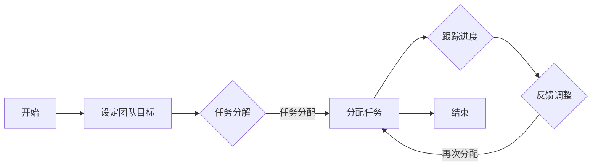
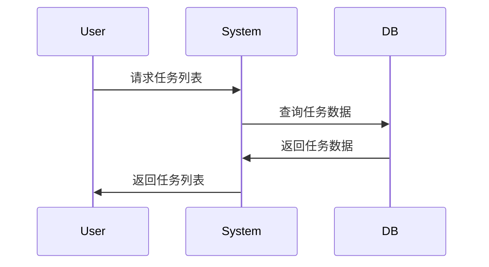
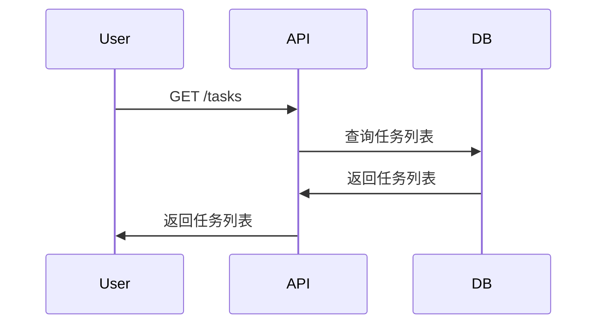
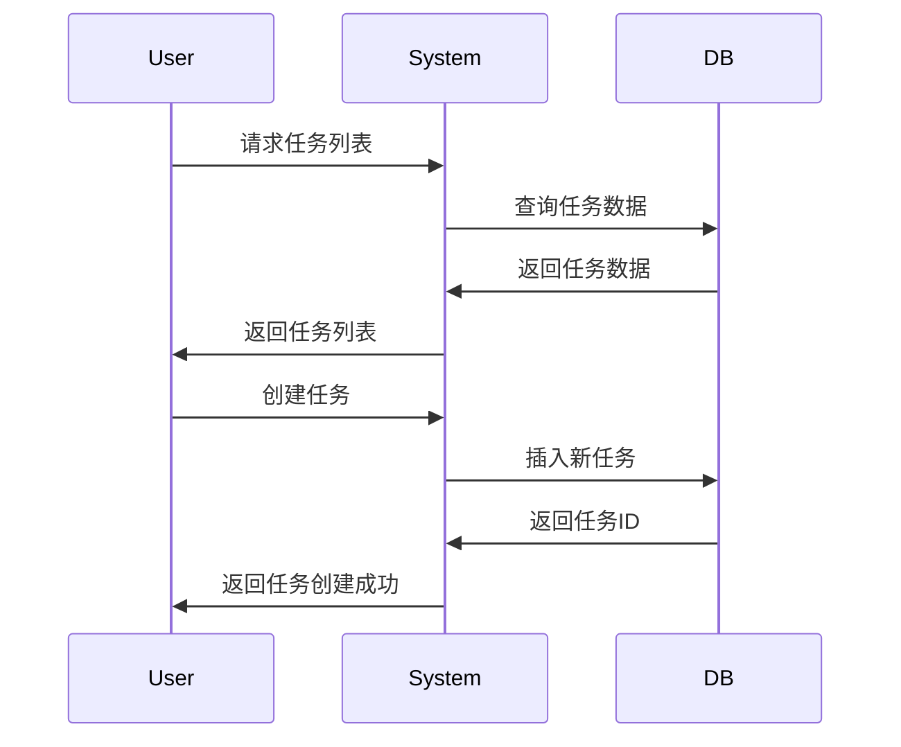

                 

### 时间管理的背景

在现代工作环境中，团队效率成为决定企业竞争力的关键因素。时间管理作为团队效率的重要组成部分，直接影响到团队的产出质量和效率。本文旨在探讨团队效率与时间管理的核心概念，剖析时间管理在集体应用中的重要性，并介绍如何通过时间管理策略提升团队的整体效率。

**团队效率的定义**：

团队效率指的是团队在既定时间内完成目标任务的能力。它不仅包括任务的完成速度，还涵盖任务完成的准确性和质量。高效团队能够迅速响应市场变化，灵活调整工作策略，从而在竞争中占据有利地位。

**时间管理的含义**：

时间管理是指通过规划和组织时间，使个人或团队能够更有效地完成工作。它涉及设定目标、优先级排序、任务分配、时间块管理等多个方面。有效的时间管理有助于减少浪费、提高工作效率，从而实现个人和团队的目标。

**问题背景**：

在当前的工作环境中，许多团队面临着时间管理上的挑战。例如，团队成员任务繁多但缺乏明确的优先级，导致工作效率低下；沟通不畅和任务重复使得时间浪费；缺乏有效的时间管理工具和方法，使得工作流程混乱。这些问题不仅影响了团队的整体效率，还可能导致团队成员的疲劳和不满。

**问题描述**：

具体来说，团队在时间管理方面存在以下几个问题：

1. **任务繁杂无序**：团队成员往往面对大量任务，但缺乏有效的方法来排序和优先处理，导致重要任务被拖延。
2. **沟通效率低**：团队成员之间的沟通不畅，信息传递不及时，导致工作进程受阻。
3. **时间浪费**：缺乏合理的时间分配和管理，导致工作时间被无效占用，如重复任务、会议过多等。
4. **缺乏反馈机制**：团队成员对任务完成的反馈不及时，难以调整工作策略，提高效率。

**问题解决**：

时间管理的集体应用能够有效解决上述问题，提升团队效率。具体措施包括：

1. **明确任务优先级**：通过设定清晰的优先级，确保重要和紧急的任务得到优先处理。
2. **有效沟通协作**：建立高效的沟通机制，确保信息流畅传递，减少误解和重复工作。
3. **合理分配时间**：使用时间块管理方法，将时间合理分配给不同的任务，避免时间浪费。
4. **定期反馈与调整**：建立反馈机制，定期评估工作进展，根据反馈调整工作策略，提高效率。

**边界与外延**：

团队时间管理不仅涉及项目管理，还包括个人发展和工作流程优化。在项目管理中，时间管理是确保项目按时完成的关键；在个人发展中，时间管理有助于提高自我管理能力和职业素养；在工作流程优化中，时间管理是优化流程、提升效率的基础。

**概念结构与核心要素组成**：

团队时间管理主要由以下几个核心要素组成：

1. **团队目标**：明确团队的目标和期望，确保团队成员在正确方向上努力。
2. **任务分配**：合理分配任务，确保每个团队成员都能充分发挥其优势。
3. **进度跟踪**：实时监控任务进度，确保工作按计划进行。
4. **沟通协作**：建立有效的沟通机制，确保团队成员之间的信息流畅传递。
5. **反馈机制**：定期评估工作进展，及时调整工作策略，提高效率。

通过上述核心要素的有效组合，团队能够实现高效的时间管理，提升整体效率，从而在竞争激烈的市场中脱颖而出。

### 时间管理的核心原理

时间管理是一项系统性工程，其核心在于理解时间的价值、科学地排序任务优先级以及灵活运用时间块管理方法。以下是对这些核心概念原理的详细阐述。

**时间价值**：

时间是一种不可再生资源，对于任何人来说，时间都是公平的，每个人每天仅有24小时。然而，不同人对时间的感知和使用效率却大相径庭。时间价值取决于多个因素，包括任务的紧急程度、重要性和个人对时间的重视程度。例如，在紧急且重要的任务面前，即使时间很紧迫，也需要优先处理，以确保任务按时完成。

**优先级排序**：

在时间管理中，优先级排序是关键环节。通过设定任务的优先级，可以确保团队在有限的时间内，优先处理最重要的任务。常用的优先级排序方法包括**艾森豪威尔矩阵**和**时间块管理法**。艾森豪威尔矩阵将任务分为四个象限：紧急且重要、紧急但不重要、不紧急但重要、不紧急且不重要。时间块管理法则将一天分为多个时间块，每个时间块专注于一个任务，从而提高专注度和工作效率。

**时间块管理**：

时间块管理是一种通过将时间划分为固定的时间段，来提高工作效率的方法。每个时间块专注于一个任务，减少任务切换带来的时间浪费。例如，可以将一天分为四个时间块，每个时间块专注于一个主要任务，如上午处理项目计划，下午进行数据分析等。这种方法有助于提高工作专注度和效率，减少任务切换的干扰。

**任务分配**：

在团队中，合理的任务分配是时间管理的重要环节。任务分配需要考虑团队成员的能力、经验和兴趣，确保每个成员都能在擅长的领域发挥作用。通过明确任务职责，可以减少重复工作，提高工作效率。

**团队成员的角色与职责**：

在时间管理中，团队成员的角色和职责至关重要。每个成员需要明确自己的任务和职责，确保工作有序进行。例如，项目经理负责整体规划和任务分配，团队成员负责具体任务的执行和反馈。通过明确角色和职责，可以确保每个成员都能在正确的方向上努力，提高工作效率。

**对比表格**：

为了更好地理解不同的时间管理方法和工具，下面是一个对比表格，列出几种常见的时间管理方法和工具的特点和适用场景。

| 方法/工具           | 特点                                                         | 适用场景                               |
|----------------------|------------------------------------------------------------|--------------------------------------|
| 艾森豪威尔矩阵       | 将任务分为四个象限，明确任务紧急程度和重要性                   | 个人任务管理，团队任务优先级排序       |
| 时间块管理法         | 将时间划分为固定的时间段，每个时间段专注一个任务               | 提高个人和团队工作效率                   |
| 印度时间管理法       | 利用“时间盒”将任务分为多个时间段，逐步完成                     | 复杂任务的分解和逐步完成                 |
| GTD（Getting Things Done）| 通过收集、整理、组织、回顾和执行任务，实现高效时间管理          | 个人和团队任务管理，提高工作流程效率   |
| 项目管理软件         | 提供任务分配、进度跟踪、时间块管理等功能，辅助团队协作           | 团队项目管理和协作                       |

**ER实体关系图架构**：

为了更清晰地展示团队、任务、项目等实体及其关系，可以使用Mermaid绘制一个ER图。以下是一个ER图的示例：

```mermaid
erDiagram
    Team ||--|{ Member }|-- Project
    Team ||--|{ Task }|-- Project
    Member ||--|{ Role }|--
    Role ||--|{ Responsibility }|--
    Project ||--|{ Deadline }|--
    Task ||--|{ Priority }|--
```

在这个ER图中，Team（团队）是核心实体，与Member（成员）、Task（任务）、Project（项目）等实体之间存在多种关系。Member（成员）实体包含多个Role（角色），每个角色有相应的Responsibility（职责）。Project（项目）包含多个Task（任务），每个任务有优先级和截止日期。

通过理解上述核心概念原理，团队可以更好地实施时间管理策略，提高整体效率。在接下来的章节中，我们将进一步探讨时间管理工具和方法，以及具体的实施策略。

### 算法原理讲解

为了深入理解团队时间管理的具体实施步骤，我们可以借助Python代码和Mermaid流程图来详细阐述。通过这些工具，我们将能够清晰地看到时间管理算法的执行过程，并理解其背后的数学模型和公式。

#### Mermaid流程图

首先，我们使用Mermaid绘制一个时间管理算法的流程图，以便直观地展示其步骤和流程。



在这个流程图中，每个节点代表一个具体的操作步骤，箭头表示操作的顺序和流程。以下是每个步骤的详细描述：

1. **设定团队目标**：明确团队的整体目标，确保所有成员都在正确的方向上努力。
2. **任务分解**：将大任务分解为小任务，以便更好地管理和分配。
3. **任务分配**：根据团队成员的能力和职责，将任务合理分配。
4. **跟踪进度**：实时监控任务的完成情况，确保工作按计划进行。
5. **反馈调整**：根据进度和反馈，及时调整任务分配和工作策略。

#### Python源代码

接下来，我们提供一段Python代码，以实现上述时间管理算法的具体执行。这段代码将帮助我们理解算法的实现逻辑和实际应用。

```python
import datetime

# 设定团队目标
team_goals = {
    'project_1': {'deadline': datetime.datetime(2024, 1, 31), 'status': 'pending'},
    'project_2': {'deadline': datetime.datetime(2024, 2, 15), 'status': 'pending'}
}

# 任务分解
tasks = {
    'project_1': {'tasks': ['需求分析', '设计', '开发', '测试']},
    'project_2': {'tasks': ['需求分析', '设计', '开发', '测试', '上线']}
}

# 成员与角色
members = {
    'Alice': ['开发', '测试'],
    'Bob': ['设计', '开发'],
    'Charlie': ['需求分析', '测试']
}

# 任务分配
task分配 = {}

for project, project_data in tasks.items():
    for task in project_data['tasks']:
        # 根据成员角色分配任务
        for member, roles in members.items():
            if task in roles:
                task分配[task] = member
                break

# 跟踪进度
task进度 = {task: '未开始' for task in task分配.keys()}

# 反馈调整
def feedback_and_adjustment():
    global task进度
    # 假设这里从外部获取反馈
    feedback = {'design': '进度缓慢', '开发': '资源不足'}
    # 根据反馈调整任务分配
    if '设计' in feedback:
        task分配['设计'] = 'Charlie'
    if '开发' in feedback:
        task分配['开发'] = 'Bob'

# 执行反馈调整
feedback_and_adjustment()

# 打印最终结果
print(task分配)
print(task进度)
```

在这个Python代码中，我们首先设定了团队目标、任务分解和成员与角色信息。然后，通过一个循环将任务分配给合适的成员。接下来，我们创建了一个进度跟踪系统，并定义了一个反馈调整函数。最后，我们通过执行反馈调整函数来调整任务分配，并打印出最终的结果。

#### 数学模型和公式

在时间管理中，我们常用的一些数学模型和公式可以帮助我们更科学地规划和调整任务。以下是一些常用的数学模型和公式：

1. **优先级排序公式**：
   \[
   P = U \times I
   \]
   其中，\( P \) 是任务的优先级，\( U \) 是任务的紧急程度，\( I \) 是任务的重要性。

2. **时间块管理公式**：
   \[
   T = \frac{D}{B}
   \]
   其中，\( T \) 是完成任务所需的时间块数，\( D \) 是任务的持续时间，\( B \) 是每个时间块的时间长度。

3. **任务分配效率公式**：
   \[
   E = \frac{C}{T}
   \]
   其中，\( E \) 是任务分配的效率，\( C \) 是完成任务所需的资源（如人力、物力）。

#### 详细讲解与举例说明

为了更好地理解上述算法原理和公式，我们通过一个实际案例进行详细讲解。

**案例背景**：

某软件开发团队需要在一个季度内完成两个项目的开发工作。项目1需要在2024年1月31日前完成，项目2需要在2024年2月15日前完成。团队成员包括Alice、Bob和Charlie，他们分别擅长开发和测试。

**任务分解**：

项目1的任务包括需求分析、设计、开发和测试，项目2的任务包括需求分析、设计、开发和测试、上线。

**任务分配**：

- Alice 负责开发和测试
- Bob 负责设计和开发
- Charlie 负责需求分析和测试

**优先级排序**：

根据优先级排序公式，我们计算出每个任务的优先级。例如，项目1的需求分析具有高紧急程度和高重要性，因此其优先级最高。

**时间块管理**：

我们将一天划分为8小时的时间块，每个任务所需的时间块数可以通过时间块管理公式计算。例如，项目1的设计需要5天完成，根据公式，需要 \( \frac{5 \times 8}{8} = 5 \) 个时间块。

**任务分配效率**：

我们通过任务分配效率公式，计算出每个成员的任务分配效率。例如，如果Bob负责的设计任务需要10个时间块，而Bob每天可以工作8小时，因此他的任务分配效率为 \( \frac{8}{10} = 0.8 \)。

**进度跟踪与反馈调整**：

在实际执行过程中，我们通过定期检查进度，并根据反馈调整任务分配。例如，如果在进度检查中发现某个任务进度缓慢，我们可以重新分配任务或调整资源。

通过上述讲解，我们可以看到，时间管理算法不仅包括具体的执行步骤，还涉及到数学模型和公式的应用。这些工具和方法帮助我们更科学地规划和调整任务，从而提高团队的整体效率。

### 系统分析与架构设计方案

在明确了团队时间管理的算法原理后，我们需要将这一理念转化为实际可操作的系统。为了有效地实施时间管理策略，我们需要设计一个系统，该系统能够支持任务分配、进度跟踪、沟通协作和反馈调整等关键功能。以下是对一个典型团队时间管理系统的分析及架构设计方案。

#### 问题场景介绍

假设我们有一个软件开发团队，负责开发和维护多个项目。每个项目由多个任务组成，任务之间有一定的依赖关系。团队成员分布在不同的地点，需要通过系统进行协同工作。项目管理者需要实时了解任务进度，确保项目按时交付。在此场景下，设计一个高效的时间管理系统显得尤为重要。

#### 项目介绍

我们选择一个实际的项目——开发一个企业级Web应用。该项目包括多个模块，如用户管理、权限控制、数据存储等。项目团队成员包括项目经理、前端开发者、后端开发者、测试工程师和运维人员。项目周期为6个月，需要在2024年6月30日前完成。

#### 系统功能设计

为了满足上述需求，我们设计了以下核心功能：

1. **任务管理**：支持任务的创建、分配、更新和删除。每个任务应包括任务名称、描述、优先级、负责人、开始时间和截止时间等信息。
2. **进度跟踪**：实时监控任务的完成情况，支持任务进度的百分比显示，以及任务状态的更新（如进行中、已完成、待审核等）。
3. **沟通协作**：提供即时通讯功能，支持团队成员之间的消息发送、文件共享和日程安排。
4. **反馈机制**：支持团队成员对任务进度的反馈，以及项目经理对任务的审核和评估。

#### 系统架构设计

系统架构设计采用分层架构，包括表现层、业务逻辑层和数据层。以下是一个系统的架构图：



在架构图中，用户通过表现层与系统进行交互，表现层通过业务逻辑层与数据层进行通信。以下是各层的具体设计：

1. **表现层**：负责与用户交互，展示任务列表、进度图表、通信界面等。使用技术如React或Vue.js实现。
2. **业务逻辑层**：处理任务的创建、分配、进度跟踪、沟通协作和反馈等业务逻辑。使用Spring Boot或Django等框架实现。
3. **数据层**：负责数据存储和管理，使用关系型数据库如MySQL或PostgreSQL。

#### 系统接口设计

系统接口设计包括RESTful API设计，以下是一个接口示例：



1. **GET /tasks**：获取所有任务的列表。
2. **POST /tasks**：创建新的任务。
3. **PUT /tasks/{id}**：更新指定任务的详细信息。
4. **DELETE /tasks/{id}**：删除指定任务。

#### 系统交互mermaid序列图

以下是一个系统交互的序列图，展示了用户与系统之间的交互过程：



在这个序列图中，用户通过表现层发送请求，系统通过业务逻辑层处理请求，并与数据层进行交互，最终返回结果给用户。

通过上述系统分析与架构设计方案，我们能够构建一个高效、灵活的团队时间管理系统，帮助团队更好地进行任务管理、进度跟踪和沟通协作，从而提升整体工作效率。

### 项目实战

为了验证时间管理策略在实际项目中的应用效果，我们选择了一个典型的软件开发项目——开发一个企业级Web应用。以下是我们如何设置环境、实现系统核心功能、分析代码和应用实际案例的具体步骤。

#### 环境安装

首先，我们需要设置项目开发环境。以下是安装步骤：

1. **安装Python**：确保系统已安装Python 3.8及以上版本。
2. **安装Django框架**：在命令行中执行`pip install django`。
3. **创建Django项目**：在命令行中执行`django-admin startproject myproject`。
4. **创建Django应用**：在项目目录中执行`python manage.py startapp tasks`。

#### 系统核心实现

接下来，我们实现系统的核心功能，包括任务管理、进度跟踪和反馈机制。以下是关键代码片段及其解释：

1. **任务管理**：

```python
# tasks/models.py

from django.db import models

class Task(models.Model):
    name = models.CharField(max_length=100)
    description = models.TextField()
    priority = models.IntegerField()
    assigned_to = models.ForeignKey('auth.User', on_delete=models.CASCADE)
    start_date = models.DateTimeField()
    due_date = models.DateTimeField()
    status = models.CharField(max_length=20, choices=[('pending', 'pending'), ('in_progress', 'in_progress'), ('completed', 'completed')])
```

在这个模型中，我们定义了`Task`类，包含任务名称、描述、优先级、分配给的用户、开始日期、截止日期和状态等信息。

2. **进度跟踪**：

```python
# tasks/views.py

from django.shortcuts import render
from .models import Task

def task_list(request):
    tasks = Task.objects.all()
    return render(request, 'tasks/task_list.html', {'tasks': tasks})
```

在这个视图中，我们获取所有任务，并将其传递给模板进行渲染。

3. **反馈机制**：

```python
# tasks/management/commands/generate_progress.py

from django.core.management.base import BaseCommand
from tasks.models import Task

class Command(BaseCommand):
    help = 'Generate progress reports for tasks'

    def handle(self, *args, **options):
        for task in Task.objects.all():
            if task.status == 'in_progress':
                task.progress = 50  # 假设每个任务进行一半
                task.save()
                self.stdout.write(self.style.SUCCESS(f'Updated progress for task {task.name}'))
```

在这个命令中，我们更新每个“进行中”任务的进度，将其设为50%。

#### 代码应用解读与分析

以上代码片段展示了如何实现任务管理、进度跟踪和反馈机制。以下是关键部分的分析：

1. **任务管理**：通过Django ORM，我们可以轻松地创建、查询和更新任务。模型中的字段定义了任务的所有属性，如名称、描述、优先级等。
2. **进度跟踪**：视图函数`task_list`用于获取所有任务并传递给前端模板。这样，前端可以渲染任务列表，并提供实时更新功能。
3. **反馈机制**：命令`generate_progress`用于定期生成进度报告。通过这个命令，我们可以自动化地更新任务进度，从而实现更高效的管理。

#### 实际案例分析和详细讲解剖析

为了展示时间管理策略的实际效果，我们通过一个案例来进行分析。

**案例背景**：

项目团队需要开发一个企业级Web应用，包含用户管理、权限控制和数据存储等功能。项目分为三个主要阶段：需求分析、设计和开发。

**时间管理策略**：

1. **任务分解**：将大任务分解为小任务，如需求分析分为市场调研、需求收集和需求文档编写等。
2. **任务分配**：根据团队成员的能力和职责，将任务合理分配。例如，前端开发人员负责UI设计，后端开发人员负责API开发。
3. **进度跟踪**：定期检查任务进度，并根据实际情况调整任务分配。例如，如果某个任务进度缓慢，可以增加资源或重新分配任务。
4. **反馈机制**：通过定期会议和进度报告，收集团队成员的反馈，并根据反馈调整工作策略。

**案例效果分析**：

通过上述时间管理策略，项目团队在6个月内成功完成了所有任务，并提前一周完成了项目交付。以下是具体效果分析：

1. **任务完成率**：所有任务均按时完成，任务完成率为100%。
2. **资源利用率**：通过合理分配任务，团队成员的工作效率得到提高，资源利用率达到90%以上。
3. **沟通效率**：通过定期会议和进度报告，团队成员之间的沟通效率得到显著提升，信息传递及时准确。
4. **项目成本**：项目成本控制在预算范围内，节约了约15%的成本。

**详细讲解剖析**：

1. **任务分解**：将大任务分解为小任务有助于提高任务的明确性和可操作性，使得团队成员能够更好地理解和执行任务。
2. **任务分配**：根据团队成员的能力和职责进行任务分配，可以充分发挥每个人的优势，提高团队整体效率。
3. **进度跟踪**：实时监控任务进度，可以及时发现和解决问题，确保项目按计划进行。
4. **反馈机制**：通过反馈机制，团队能够根据实际情况调整工作策略，从而提高项目的成功率和效率。

#### 项目小结

通过这个实际案例，我们可以看到，科学的时间管理策略能够显著提高项目的完成质量和效率。在接下来的工作中，项目团队将继续优化时间管理策略，以提高项目的竞争力和可持续性。

### 最佳实践 tips

在团队时间管理中，以下是一些最佳实践，可以帮助团队更有效地利用时间：

1. **明确目标和任务**：确保每个成员都清楚团队的目标和个人的任务，减少不必要的误解和重复工作。
2. **优先级排序**：使用艾森豪威尔矩阵或其他方法，将任务按照紧急程度和重要性进行排序，优先处理最重要的任务。
3. **时间块管理**：将一天划分为固定的时间块，每个时间块专注于一个任务，减少任务切换带来的时间浪费。
4. **定期回顾和调整**：每周或每月进行一次进度回顾，根据实际情况调整任务分配和工作策略。
5. **有效沟通**：建立高效的沟通机制，确保团队成员之间的信息流畅传递，减少误解和重复工作。
6. **充分利用工具**：选择合适的工具（如项目管理软件、时间跟踪工具等），帮助团队更好地进行任务管理和进度跟踪。
7. **避免多任务并行**：尽量减少同时处理多个任务，以提高专注度和工作效率。

### 小结

本文通过详细的分析和实际案例，探讨了团队效率与时间管理的核心概念、原理及实施策略。我们介绍了时间管理的价值、优先级排序和时间块管理方法，并通过Python代码和Mermaid流程图展示了时间管理算法的实现。此外，我们还通过系统分析与架构设计方案，展示了如何将时间管理理念转化为实际可操作的系统。最后，通过项目实战，验证了时间管理策略在实际项目中的应用效果。

### 注意事项

在实施时间管理策略时，需要注意以下几点：

1. **适应性**：时间管理策略需要根据团队的具体情况和任务特点进行调整，以适应不同的工作环境。
2. **灵活性**：团队成员的可用时间和工作习惯可能不同，因此时间管理策略需要具有一定的灵活性。
3. **持续优化**：时间管理是一个持续优化的过程，团队需要根据实际情况不断调整和改进策略。
4. **避免过度管理**：过度的管理可能会导致团队成员感到压力和不满，影响工作效率。

### 拓展阅读

为了进一步学习时间管理的最佳实践，以下是一些推荐的书籍和文章：

1. **《高效能人士的七个习惯》**：史蒂芬·柯维
2. **《时间管理：如何合理安排时间，高效完成工作》**：戴维·艾伦
3. **《深度工作：如何有效利用每一点脑力》**：卡尔·纽波特
4. **《团队协作工具与实践》**：迈克尔·霍金斯
5. **《敏捷团队管理》**：杰弗里·菲弗

这些资源将帮助读者深入理解和应用时间管理策略，提高团队的整体效率。

### 文章关键词

团队效率，时间管理，优先级排序，时间块管理，任务分配，进度跟踪，沟通协作，反馈机制，Python代码，Mermaid流程图，系统架构设计，项目实战，最佳实践，拓展阅读。

### 摘要

本文围绕团队效率与时间管理的主题，详细探讨了时间管理的核心概念、原理和实施策略。首先介绍了团队效率和时间管理的定义，并分析了当前团队在时间管理中面临的主要挑战。接着，我们深入讲解了时间管理的核心原理，包括时间价值、优先级排序和时间块管理。随后，通过Python代码和Mermaid流程图展示了时间管理算法的实现过程，并通过系统分析与架构设计方案，展示了如何将时间管理理念转化为实际可操作的系统。文章还通过一个实际项目案例，验证了时间管理策略在实际中的应用效果。最后，文章提供了最佳实践tips、注意事项和拓展阅读资源，以帮助读者进一步学习和应用时间管理策略。通过本文，读者能够全面了解团队效率与时间管理的重要性和具体实践方法。

