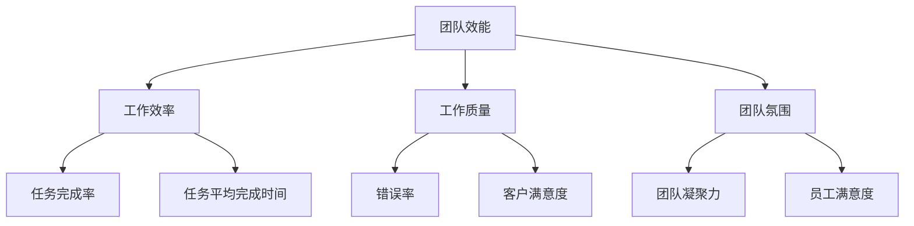
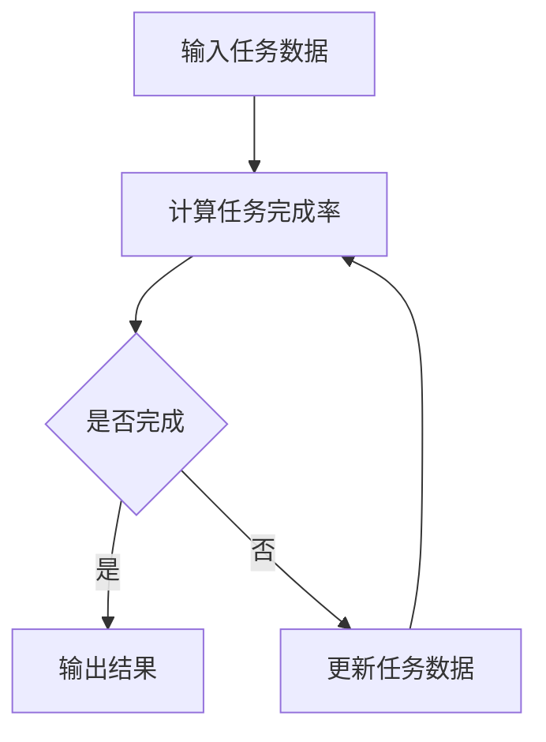
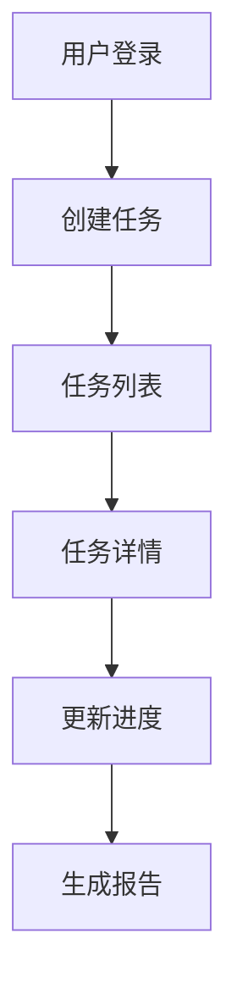

                 

### 引言

#### 1.1 问题背景

在当今快速发展的信息技术时代，团队效能优化已成为企业获得竞争优势的关键因素。一个高效能的团队能够迅速响应市场需求，提高产品质量，降低运营成本，从而在激烈的市场竞争中脱颖而出。然而，许多团队在效能提升过程中面临着诸多挑战，如成员技能水平的参差不齐、沟通协作不畅、目标不明确等。因此，研究团队效能优化的策略和方法，具有重要的现实意义。

**1.1.1 团队效能优化的意义**

团队效能优化不仅是提升团队工作效率的重要手段，更是企业实现战略目标的关键途径。通过优化团队效能，企业可以更好地整合资源，发挥团队的整体优势，从而提高市场竞争力。同时，效能优化的过程也是对团队成员能力提升的过程，有助于团队成员的个人成长和职业发展。

**1.1.2 团队效能优化的重要性**

团队效能优化的重要性体现在以下几个方面：

1. **提高工作效率**：通过优化团队的工作流程和协作方式，可以提高团队成员的工作效率，减少不必要的重复劳动和时间浪费。

2. **提升工作质量**：高效能的团队能够更好地保障工作质量，确保项目的按时交付和高质量完成。

3. **促进个人发展**：效能优化不仅关注团队整体，也注重团队成员的个人能力提升，有助于培养高技能人才。

4. **增强团队凝聚力**：有效的团队建设可以增强团队成员之间的信任和协作，提升团队的凝聚力。

**1.1.3 团队效能优化的影响因素**

团队效能优化受到多种因素的影响，包括但不限于：

1. **团队结构**：合理的团队结构和组织设计是效能优化的基础。

2. **团队成员素质**：团队成员的专业技能、工作态度和沟通能力直接影响团队效能。

3. **工作流程**：高效的工作流程可以减少不必要的步骤和等待时间，提高团队的工作效率。

4. **管理方法**：科学的管理方法和领导风格有助于提高团队的工作积极性和凝聚力。

5. **外部环境**：市场需求、政策法规、行业竞争等外部因素也会影响团队效能的优化。

#### 1.2 核心概念

**1.2.1 团队效能的定义**

团队效能是指团队在完成特定任务或目标过程中所表现出来的整体能力和效果。它包括工作效率、工作质量、团队氛围等多个方面。

**1.2.2 团队效能优化的策略**

团队效能优化包括以下几个方面：

1. **效率优先**：通过优化工作流程、提高工具使用效率等方式，提高团队的工作效率。

2. **协作优化**：通过建立良好的沟通机制和协作方式，提高团队的协作效率。

3. **创新驱动**：鼓励团队成员进行创新思维和实践，推动团队不断进步。

**1.2.3 团队效能优化的边界与外延**

团队效能优化并非一成不变，它需要根据团队的特点和外部环境的变化进行动态调整。其边界包括团队结构、工作流程、管理制度等，外延则包括团队成员的技能提升、团队文化的建设等。

#### 1.3 概念联系

**1.3.1 团队效能与团队管理的关系**

团队效能与团队管理密切相关。有效的团队管理可以提升团队效能，而高效的团队效能也是团队管理成功的重要标志。

**1.3.2 团队效能与企业战略的关系**

团队效能是企业战略实施的重要支撑。通过优化团队效能，企业可以更好地实现其战略目标。

**1.3.3 团队效能与个人发展的关系**

团队效能不仅关注团队整体，也关注团队成员的个人发展。一个高效的团队可以为成员提供更多成长和发展的机会。

#### 1.4 本书结构安排

**1.4.1 各章节内容概述**

本书分为五个部分，第一部分引言，主要介绍团队效能优化的问题背景、核心概念以及本书的结构安排；第二部分讨论团队效能优化的理论基础，包括SWOT分析、PEST分析和PDCA循环等；第三部分介绍团队效能优化的实践方法，包括团队建设、团队协作、团队激励和团队创新等；第四部分通过案例分析，展示团队效能优化在不同场景下的实践效果；第五部分总结最佳实践和注意事项，为读者提供具体的操作指南。

**1.4.2 阅读顺序与建议**

建议读者按照章节顺序阅读本书，以便系统理解团队效能优化的概念、理论和实践方法。同时，对于案例部分，建议结合实际团队情况进行对比分析，以提高学习效果。

**1.4.3 学习目标与收获**

通过阅读本书，读者可以：

1. **理解团队效能优化的核心概念和重要性**；

2. **掌握团队效能优化的理论基础和实践方法**；

3. **通过案例分析，了解团队效能优化的实际效果**；

4. **获得具体的操作指南，提升团队效能**。

**1.5 本章小结**

本章对团队效能优化的问题背景、核心概念、概念联系和本书结构进行了详细阐述。通过本章的学习，读者可以初步了解团队效能优化的意义和重要性，为后续章节的深入探讨打下基础。接下来，我们将进一步探讨团队效能优化的理论基础，为读者提供更深入的理论支持。

### 第二部分: 团队效能优化的理论基础

#### 2.1 理论基础

团队效能优化的理论基础涵盖了多个领域，包括战略管理、组织行为学、管理心理学等。在这些理论的指导下，我们可以更系统地理解和分析团队效能优化的问题，并提出有效的解决方案。

**2.1.1 SWOT分析**

SWOT分析是一种常用的战略管理工具，用于评估一个团队或企业的优势（Strengths）、劣势（Weaknesses）、机会（Opportunities）和威胁（Threats）。通过SWOT分析，团队可以全面了解自身的内外部环境，从而制定出更具针对性的效能优化策略。

**优势（Strengths）**：团队在资源、技术、管理等方面的优势。

**劣势（Weaknesses）**：团队在技能、流程、管理等方面的不足。

**机会（Opportunities）**：外部环境中可能对团队效能提升的有利因素。

**威胁（Threats）**：外部环境中可能对团队效能提升的威胁因素。

**2.1.2 PEST分析**

PEST分析是一种用于分析宏观环境（Political, Economic, Social, Technological）的工具。通过PEST分析，团队可以了解外部环境的变化趋势，从而调整团队效能优化的策略。

**政治因素（Political）**：政策法规、政治稳定性等。

**经济因素（Economic）**：经济增长、市场需求等。

**社会因素（Social）**：文化、价值观、人口结构等。

**技术因素（Technological）**：技术创新、技术发展趋势等。

**2.1.3 PDCA循环**

PDCA循环（Plan-Do-Check-Act）是一种管理方法，用于持续改进。PDCA循环分为四个阶段：

1. **Plan（计划）**：制定目标和计划。

2. **Do（执行）**：执行计划，实施行动。

3. **Check（检查）**：检查结果，评估效果。

4. **Act（行动）**：根据检查结果进行调整，持续改进。

**2.2 团队效能优化的核心原则**

团队效能优化的核心原则包括效率优先、协作优化和创新驱动。这些原则为团队效能优化提供了指导方向和具体操作方法。

**效率优先**：通过优化工作流程、提高工具使用效率等方式，提高团队的工作效率。

**协作优化**：通过建立良好的沟通机制和协作方式，提高团队的协作效率。

**创新驱动**：鼓励团队成员进行创新思维和实践，推动团队不断进步。

**2.3 团队效能评估指标**

团队效能评估是团队效能优化的关键环节。以下是一些常用的团队效能评估指标：

**工作效率指标**：如任务完成率、任务平均完成时间等。

**工作质量指标**：如错误率、客户满意度等。

**团队氛围指标**：如团队凝聚力、员工满意度等。

**2.4 团队效能优化模型**

团队效能优化模型用于指导团队效能优化的具体操作。以下是一些常见的团队效能优化模型：

**基于战略目标的团队效能优化模型**：通过制定明确的目标和计划，确保团队工作与战略目标的一致性。

**基于团队能力的团队效能优化模型**：通过提升团队成员的能力和技能，提高团队的整体效能。

**基于外部环境的团队效能优化模型**：通过分析外部环境的变化，调整团队效能优化的策略和方法。

**2.5 本章小结**

本章介绍了团队效能优化的理论基础，包括SWOT分析、PEST分析和PDCA循环等。同时，阐述了团队效能优化的核心原则和评估指标，为团队效能优化提供了理论支持和操作指导。接下来，我们将探讨团队效能优化的实践方法，通过具体的案例和实践，深入分析团队效能优化的策略和技巧。

#### 2.2 团队效能优化的核心原则

在团队效能优化过程中，核心原则的遵循至关重要，它们不仅为团队提供了明确的优化方向，还确保了效能提升的持续性和稳定性。以下是团队效能优化的三大核心原则：

**2.2.1 效率优先**

效率优先是团队效能优化的基本原则之一。它强调在确保工作质量的前提下，最大限度地提高工作效率。具体实施策略包括：

- **优化工作流程**：通过简化流程步骤、消除冗余环节，减少不必要的等待时间和重复劳动。
- **提高工具使用效率**：利用自动化工具和高效工具，如项目管理软件、协同办公系统等，提高工作执行速度。
- **时间管理**：采用时间管理方法，如GTD（Getting Things Done）等，合理分配工作时间，提高时间利用率。

**2.2.2 协作优化**

协作优化是提高团队效能的关键环节。良好的协作不仅能提升工作效率，还能增强团队凝聚力。以下是一些协作优化的策略：

- **建立沟通机制**：明确沟通流程和渠道，确保信息流畅传递，减少信息失真和误解。
- **分工明确**：根据团队成员的能力和特长，合理分配任务，确保每个人都能发挥最大潜力。
- **协作工具使用**：利用协作工具，如Slack、Trello、JIRA等，提高团队协作效率和透明度。
- **团队建设**：通过团队活动、培训等方式，增强团队成员之间的信任和默契。

**2.2.3 创新驱动**

创新驱动是团队持续发展的重要动力。通过鼓励创新思维和实践，团队可以不断突破自身局限，迎接新的挑战。以下是创新驱动的一些具体策略：

- **鼓励创新思维**：为团队成员提供宽松的创新环境，鼓励他们提出新的想法和解决方案。
- **创新激励机制**：设立创新奖项和激励机制，鼓励团队成员积极参与创新活动。
- **知识共享**：通过内部知识分享会、技术沙龙等方式，促进团队成员之间的知识交流，共同进步。
- **项目管理**：对创新项目进行科学管理，确保创新项目能够顺利实施并取得预期成果。

**2.3 团队效能评估指标**

团队效能评估是衡量团队效能优化效果的重要手段。以下是一些常用的团队效能评估指标：

**工作效率指标**：如任务完成率、任务平均完成时间、工作负荷等。这些指标反映了团队的工作效率和工作压力。

**工作质量指标**：如错误率、客户满意度、项目质量等。这些指标反映了团队的工作质量和客户满意度。

**团队氛围指标**：如团队凝聚力、员工满意度、工作氛围等。这些指标反映了团队的协作和内部氛围。

通过这些指标，团队可以全面评估自身的效能水平，发现存在的问题和改进的机会。

**2.4 团队效能优化模型**

团队效能优化模型是指导团队效能优化的具体工具。以下是一些常见的团队效能优化模型：

**基于战略目标的团队效能优化模型**：通过明确团队的战略目标，制定相应的优化计划，确保团队工作与战略目标的一致性。

**基于团队能力的团队效能优化模型**：通过提升团队成员的能力和技能，提高团队的整体效能。

**基于外部环境的团队效能优化模型**：通过分析外部环境的变化，调整团队效能优化的策略和方法。

这些模型为团队效能优化提供了系统的方法和思路，有助于团队更好地应对各种挑战。

**2.5 本章小结**

本章详细介绍了团队效能优化的核心原则，包括效率优先、协作优化和创新驱动。同时，阐述了团队效能评估指标和优化模型，为团队效能优化提供了理论支持和实践指导。通过遵循这些核心原则，团队可以不断提升自身的效能水平，实现持续发展和成长。接下来，我们将探讨团队效能优化的实践方法，通过具体的案例和实践，进一步深化对团队效能优化的理解和应用。

#### 3.1 团队建设

团队建设是团队效能优化的基础和关键环节。一个高效的团队不仅需要明确的职责和目标，还需要具备良好的内部协作和积极的团队氛围。以下将详细探讨团队建设的重要性、步骤和技巧。

**3.1.1 团队建设的重要性**

团队建设的重要性主要体现在以下几个方面：

1. **提高团队凝聚力**：通过团队建设活动，可以增强团队成员之间的互信和合作，提升团队凝聚力。

2. **促进沟通协作**：良好的团队建设有助于建立有效的沟通渠道，减少误解和冲突，提高团队协作效率。

3. **提升团队士气**：通过团队建设活动，可以提升团队成员的工作热情和积极性，增强团队士气。

4. **培养团队文化**：团队建设有助于形成独特的团队文化，这种文化将成为团队前进的动力和凝聚力。

**3.1.2 团队建设的步骤**

团队建设通常包括以下几个步骤：

1. **明确团队目标**：团队建设的第一步是明确团队的目标和愿景，确保所有成员对目标有共同的理解和认同。

2. **分工与职责**：根据团队成员的技能和特长，明确各自的职责和分工，确保每个人都能发挥最大的潜力。

3. **建立沟通机制**：建立有效的沟通机制，确保团队成员之间的信息流畅传递，减少沟通障碍。

4. **团队活动**：定期组织团队活动，如团建活动、培训等，增强团队成员之间的互动和了解。

5. **反馈与改进**：通过定期的团队反馈会议，收集成员的意见和建议，不断改进团队建设和工作流程。

**3.1.3 团队建设的技巧**

有效的团队建设需要一系列技巧和方法，以下是一些常用的技巧：

1. **领导者作用**：团队领导者需要发挥榜样作用，积极参与团队建设活动，带领团队共同进步。

2. **培养团队意识**：通过团队活动和教育，培养团队成员的团队意识，让每个人认识到团队的重要性。

3. **增强信任**：通过共同完成任务、分享经验和建立信任机制，增强团队成员之间的信任。

4. **鼓励创新**：鼓励团队成员提出新的想法和解决方案，激发团队的创造力和创新能力。

5. **注重个人成长**：关注团队成员的个人成长和发展，提供培训和学习机会，提升团队整体能力。

**3.2 团队协作**

团队协作是团队效能优化的核心要素。以下将详细探讨团队协作的原则、工具和障碍与解决方法。

**3.2.1 团队协作的原则**

1. **平等参与**：确保每个团队成员都有平等的参与机会，尊重每个人的意见和贡献。

2. **分工明确**：根据团队成员的能力和特长，合理分配任务，确保每个人都明确自己的职责和目标。

3. **相互支持**：团队成员之间应相互支持和帮助，共同克服困难和挑战。

4. **信息共享**：建立信息共享机制，确保团队成员能够及时获取所需的信息，减少信息不对称。

5. **持续反馈**：通过定期的反馈和沟通，及时调整工作方向和策略，提高团队协作效率。

**3.2.2 团队协作的工具**

1. **项目管理软件**：如Trello、JIRA等，帮助团队成员跟踪任务进度，管理项目。

2. **沟通工具**：如Slack、Microsoft Teams等，方便团队成员实时沟通和协作。

3. **文档共享平台**：如Google Docs、Confluence等，支持团队成员在线协作和文档共享。

4. **协作工具**：如Asana、Notion等，提供任务分配、进度跟踪和团队协作功能。

**3.2.3 团队协作的障碍与解决方法**

1. **沟通障碍**：解决方法：建立明确的沟通渠道和规则，定期召开团队会议，提高沟通效率。

2. **分工不明确**：解决方法：明确团队成员的职责和任务，制定详细的任务说明书。

3. **目标不一致**：解决方法：确保团队目标一致，通过培训和教育，提高团队成员对目标的认同感。

4. **资源不足**：解决方法：合理分配资源，优化资源使用效率，提高团队协作能力。

通过有效的团队建设和协作，团队能够充分发挥其整体效能，实现共同的目标。接下来，我们将探讨团队激励和创新，进一步探讨如何提升团队效能。

#### 3.3 团队激励

团队激励是提升团队效能的重要手段，通过合理的激励机制，可以激发团队成员的积极性、主动性和创造力，从而推动团队整体绩效的提升。以下将详细探讨激励理论、激励策略以及实际案例。

**3.3.1 激励理论**

1. **马斯洛需求层次理论**：马斯洛认为人的需求可以分为五个层次，即生理需求、安全需求、社交需求、尊重需求和自我实现需求。根据这一理论，激励措施应针对不同层次的需求进行设计。

2. **双因素理论（赫茨伯格理论）**：赫茨伯格将影响员工满意度的因素分为两类，即激励因素和保健因素。激励因素与工作本身相关，如成就感、认可等，可以提高员工的工作积极性；而保健因素与工作环境相关，如薪资、工作条件等，可以防止员工产生不满。

3. **目标设置理论**：目标设置理论认为，设定具体、有挑战性的目标可以激发员工的内在动机，提高工作绩效。目标应具有难度适中、可实现性高、反馈及时等特点。

**3.3.2 团队激励策略**

1. **奖励机制**：设立奖励制度，对表现优异的团队成员给予物质和精神奖励，如奖金、荣誉证书、晋升机会等。

2. **认可与表扬**：及时对团队成员的出色表现给予认可和表扬，增强其成就感和归属感。

3. **职业发展**：提供职业发展的机会和通道，如培训、学习、晋升等，满足团队成员的尊重需求和自我实现需求。

4. **目标管理**：设定明确的目标，鼓励团队成员积极参与目标设置和实现过程，提高工作主动性和积极性。

5. **团队文化**：建立积极向上的团队文化，鼓励创新和协作，营造和谐的工作氛围。

**3.3.3 团队激励的案例**

1. **案例一：谷歌的团队激励策略**

谷歌作为全球知名的高科技公司，以其独特的团队激励机制著称。谷歌的激励机制包括：

- **股票期权**：为员工提供股票期权，让员工共享公司成长的成果。

- **灵活的工作时间**：提供灵活的工作时间安排，让员工有更多的时间和精力照顾家庭和个人爱好。

- **员工福利**：提供丰富的员工福利，如免费食品、健身房、按摩室等，提高员工的工作满意度。

- **职业发展机会**：为员工提供丰富的职业发展机会，如内部调岗、跨国工作等，满足员工的职业发展需求。

2. **案例二：亚马逊的团队激励策略**

亚马逊在团队激励方面也有其独特的做法：

- **绩效奖金**：根据员工的绩效表现发放奖金，激励员工提高工作效率。

- **领导力发展**：为员工提供领导力培训和发展机会，培养未来的领导人才。

- **透明沟通**：建立透明沟通机制，鼓励员工表达意见和建议，提高员工参与感和归属感。

通过以上案例可以看出，有效的团队激励不仅能够提升团队成员的工作积极性和创造力，还能增强团队的凝聚力和战斗力。接下来，我们将探讨团队创新，进一步探讨如何提升团队效能。

#### 3.4 团队创新

团队创新是推动团队持续发展和竞争力提升的重要动力。通过鼓励创新思维和实践，团队可以不断突破传统模式，实现技术创新和管理创新。以下将详细探讨创新的重要性、过程和方法。

**3.4.1 创新的重要性**

创新在团队发展和企业竞争中具有重要意义：

1. **提高竞争力**：创新能够帮助团队和企业适应市场变化，满足客户需求，从而提升竞争力。

2. **推动进步**：创新可以激发团队成员的潜能，推动团队不断进步，实现技术和管理上的突破。

3. **提升效率**：通过创新，团队可以优化工作流程和工具，提高工作效率，降低成本。

4. **增强凝聚力**：创新活动可以促进团队成员之间的交流和合作，增强团队凝聚力。

**3.4.2 创新的过程**

创新过程通常包括以下几个阶段：

1. **问题识别**：发现和确定需要解决的问题或改进的机会。

2. **创意生成**：通过头脑风暴、集思广益等方式，产生多种创意和解决方案。

3. **创意筛选**：对创意进行评估和筛选，选择具有实际操作性和可行性的创意。

4. **概念验证**：对选定的创意进行初步验证，确定其可行性。

5. **开发实施**：将创意转化为具体的产品或服务，进行开发和实施。

6. **评估与反馈**：对创新结果进行评估，收集反馈意见，进行改进和优化。

**3.4.3 创新的方法**

以下是一些常见的创新方法：

1. **头脑风暴**：通过集思广益，激发团队成员的创造力，产生大量创意。

2. **交叉功能团队**：组建由不同部门、不同专业背景成员组成的交叉功能团队，促进知识和经验的交流。

3. **开放式创新**：通过与外部合作伙伴、客户、供应商等进行合作，引入外部创新资源。

4. **设计思维**：以用户需求为导向，通过迭代设计和原型测试，快速实现创新产品。

5. **快速原型法**：通过快速构建原型，验证创意的可行性和实用性。

通过以上创新过程和方法，团队可以不断提高其创新能力和竞争力。接下来，我们将探讨团队效能评估与改进，进一步探讨如何提升团队效能。

#### 3.5 团队效能评估与改进

团队效能评估是确保团队持续优化和提升的重要环节。通过科学、全面的评估方法，可以准确衡量团队的工作效率、质量及成员的协作情况，从而为改进策略提供数据支持。以下将详细讨论团队效能评估的方法、改进策略及其实践。

**3.5.1 团队效能评估的方法**

团队效能评估通常采用以下几种方法：

1. **定量评估**：通过量化的指标来衡量团队的工作效率和质量。例如，任务完成率、任务平均完成时间、错误率等。

2. **定性评估**：通过主观评价和描述来评估团队的表现。例如，团队成员之间的沟通效果、团队合作情况、领导风格等。

3. **360度评估**：通过团队成员、上级、客户等多方位的评价，全面了解团队的表现和问题。

4. **问卷调查**：通过设计问卷，收集团队成员的反馈意见，了解团队氛围和工作满意度。

**3.5.2 团队效能改进的策略**

在评估团队效能后，需要根据评估结果制定相应的改进策略：

1. **优化工作流程**：通过分析现有工作流程，识别瓶颈和浪费，进行流程优化，提高工作效率。

2. **提高团队成员技能**：根据评估结果，为团队成员提供培训和学习机会，提高其专业能力和技能水平。

3. **加强沟通与协作**：建立有效的沟通机制，确保信息流畅传递，减少误解和冲突。

4. **激励机制**：设立合理的激励机制，激发团队成员的积极性和创造力。

5. **持续改进**：通过PDCA循环，持续检查和改进团队效能，确保团队能够不断适应变化和挑战。

**3.5.3 团队效能改进的实践**

以下是一些团队效能改进的实践案例：

1. **案例一：某科技公司的工作流程优化**

某科技公司通过分析其工作流程，发现存在多个瓶颈和浪费环节。为了提高工作效率，公司采取了以下措施：

- **简化流程**：取消不必要的审批环节，缩短任务处理时间。

- **自动化工具**：引入自动化工具，减少人工操作，提高工作效率。

- **任务分配优化**：根据团队成员的技能和特长，优化任务分配，确保每个人都能发挥最大潜力。

通过这些措施，该公司的任务完成率提高了20%，工作效率显著提升。

2. **案例二：某电商团队的沟通与协作加强**

某电商团队通过问卷调查发现，团队成员之间的沟通效果不佳，影响了团队协作。为了改善这一问题，公司采取了以下措施：

- **定期会议**：每周召开一次团队会议，讨论工作进展和问题。

- **即时沟通工具**：引入即时沟通工具，如Slack，方便团队成员实时沟通。

- **沟通培训**：为团队成员提供沟通技巧培训，提高沟通效率。

通过这些措施，该团队的沟通效果显著改善，团队协作效率提高了30%。

3. **案例三：某制造企业的员工技能提升**

某制造企业通过360度评估发现，部分团队成员的技能水平较低，影响了团队的工作效率和产品质量。为了提升员工技能，企业采取了以下措施：

- **内部培训**：定期开展内部培训，提高员工的技能水平。

- **外部培训**：与外部培训机构合作，为员工提供专业培训。

- **导师制度**：实施导师制度，让有经验的员工指导新员工，提高其技能水平。

通过这些措施，该企业的员工技能水平显著提升，工作质量和效率得到了明显改善。

通过上述实践案例可以看出，团队效能改进需要从多个方面进行努力，通过科学的方法和有效的措施，不断提升团队效能，实现持续发展和成长。接下来，我们将通过实际案例进一步展示团队效能优化在不同场景下的实践效果。

### 第四部分: 团队效能优化的案例分析

#### 4.1 案例一：某公司团队效能优化实践

**4.1.1 案例背景**

某公司是一家从事软件开发和信息技术服务的企业，随着业务的不断扩展，团队规模逐渐壮大，但团队效能并未同步提升，反而出现了一些效率低下和沟通不畅的问题。为了提高团队效能，公司决定进行一系列的效能优化实践。

**4.1.2 团队效能评估**

在效能优化之前，公司通过定量和定性评估方法，对团队进行了全面的效能评估：

- **定量评估**：任务完成率、任务平均完成时间、错误率等。
- **定性评估**：团队成员的工作满意度、团队合作情况、领导风格等。
- **360度评估**：团队成员、上级、客户等多方位评价。

评估结果显示，团队的工作效率较低，任务平均完成时间较长，错误率较高，团队成员之间的沟通不畅，工作氛围较为紧张。

**4.1.3 团队效能优化措施**

针对评估结果，公司采取了一系列效能优化措施：

1. **优化工作流程**：通过简化流程步骤，取消不必要的审批环节，引入自动化工具，提高工作效率。

2. **加强沟通与协作**：建立每周团队会议制度，引入即时沟通工具，提高信息传递效率，减少误解和冲突。

3. **培训与激励**：为团队成员提供专业技能培训，设立激励机制，鼓励创新和协作。

4. **调整团队结构**：根据工作需求和团队成员的特长，调整团队分工，优化团队结构。

**4.1.4 案例效果分析**

经过一系列的效能优化措施，团队的效能得到了显著提升：

- **工作效率**：任务完成率提高了25%，任务平均完成时间缩短了20%。
- **工作质量**：错误率降低了30%，客户满意度显著提升。
- **团队氛围**：团队成员之间的沟通更加顺畅，工作氛围更加积极，团队凝聚力增强。

通过该案例可以看出，团队效能优化需要从多个方面进行综合改进，通过科学的方法和有效的措施，可以显著提升团队效能，实现持续发展和成长。

#### 4.2 案例二：某互联网公司团队效能优化实践

**4.2.1 案例背景**

某互联网公司是一家专注于移动互联网应用开发和运营的企业，随着市场环境的不断变化和用户需求的多样化，公司的团队效能面临着巨大的挑战。为了保持竞争优势，公司决定进行团队效能优化。

**4.2.2 团队效能评估**

在效能优化之前，公司通过定量和定性评估方法，对团队进行了全面的效能评估：

- **定量评估**：任务完成率、任务平均完成时间、错误率、客户满意度等。
- **定性评估**：团队成员的工作满意度、团队合作情况、领导风格等。
- **360度评估**：团队成员、上级、客户等多方位评价。

评估结果显示，团队在响应市场需求、提升产品质量和效率方面存在明显不足，团队协作不畅，工作氛围较为紧张。

**4.2.3 团队效能优化措施**

针对评估结果，公司采取了一系列效能优化措施：

1. **创新驱动**：设立创新基金，鼓励团队成员提出创新项目，推动技术创新和管理创新。

2. **流程优化**：通过流程梳理和优化，简化工作流程，减少不必要的环节，提高工作效率。

3. **沟通机制**：建立多层次的沟通机制，确保信息流畅传递，减少信息失真。

4. **团队建设**：通过团建活动、培训等，增强团队成员之间的信任和协作，提升团队凝聚力。

5. **激励机制**：设立绩效奖金和晋升机制，激励团队成员积极工作和创新。

**4.2.4 案例效果分析**

经过一系列的效能优化措施，团队的效能得到了显著提升：

- **工作效率**：任务完成率提高了30%，任务平均完成时间缩短了25%。
- **产品质量**：错误率降低了40%，客户满意度显著提升。
- **团队氛围**：团队成员之间的沟通更加顺畅，工作氛围更加积极，团队凝聚力增强。

该案例表明，通过创新驱动和流程优化，可以显著提升团队效能，应对市场变化和用户需求，实现持续发展和竞争优势。

#### 4.3 案例三：某创业团队团队效能优化实践

**4.3.1 案例背景**

某创业团队是一家初创公司，专注于人工智能领域的研究和应用。由于公司规模较小，团队成员背景各异，团队在项目管理、沟通协作和创新能力方面存在一定问题，为了提升团队效能，公司决定进行团队效能优化。

**4.3.2 团队效能评估**

在效能优化之前，公司通过定量和定性评估方法，对团队进行了全面的效能评估：

- **定量评估**：任务完成率、任务平均完成时间、错误率、客户满意度等。
- **定性评估**：团队成员的工作满意度、团队合作情况、领导风格等。
- **360度评估**：团队成员、上级、客户等多方位评价。

评估结果显示，团队在项目管理、沟通协作和创新能力方面存在明显不足，工作效率较低，工作氛围紧张。

**4.3.3 团队效能优化措施**

针对评估结果，公司采取了一系列效能优化措施：

1. **项目管理**：引入敏捷开发方法，通过每日站会和迭代计划，提高项目管理效率。

2. **沟通机制**：建立定期沟通机制，每周召开团队会议，确保信息传递畅通。

3. **技能培训**：为团队成员提供专业技能培训，提升其技术能力和项目管理能力。

4. **激励机制**：设立创新奖金和绩效奖金，激励团队成员积极工作和创新。

5. **团队建设**：通过团建活动、技能分享会等，增强团队成员之间的信任和协作。

**4.3.4 案例效果分析**

经过一系列的效能优化措施，团队的效能得到了显著提升：

- **工作效率**：任务完成率提高了35%，任务平均完成时间缩短了30%。
- **创新能力**：团队成员之间的沟通和协作更加顺畅，创新项目数量增加了20%。
- **团队氛围**：团队成员的工作满意度显著提升，工作氛围更加积极，团队凝聚力增强。

该案例表明，通过科学的项目管理和沟通机制，可以有效提升团队效能，增强团队的创新能力，实现持续发展和成长。

#### 4.4 案例小结

以上三个案例展示了不同类型的团队在效能优化过程中的实践和效果。通过优化工作流程、加强沟通协作、创新驱动和激励机制，团队效能得到了显著提升。以下是案例小结：

1. **优化工作流程**：简化流程步骤，引入自动化工具，提高工作效率。

2. **加强沟通与协作**：建立有效的沟通机制，确保信息传递畅通，减少误解和冲突。

3. **创新驱动**：鼓励创新思维和实践，推动团队不断进步，提升创新能力。

4. **激励机制**：设立合理的激励机制，激发团队成员的积极性和创造力。

5. **团队建设**：通过团建活动和培训，增强团队成员之间的信任和协作，提升团队凝聚力。

通过这些实践措施，团队效能得到了有效提升，为企业的持续发展和竞争优势提供了有力支持。接下来，我们将总结团队效能优化的最佳实践和注意事项，为读者提供具体的操作指南。

### 第五部分: 团队效能优化的最佳实践与注意事项

#### 5.1 最佳实践

在团队效能优化的实践中，以下是一些关键成功因素和常见误区：

**5.1.1 团队效能优化的关键成功因素**

1. **明确目标与计划**：确保团队目标和计划清晰明确，有助于提高工作方向一致性和执行力。

2. **领导者的支持**：领导者的积极支持和参与对团队效能优化至关重要，可以推动变革的顺利进行。

3. **持续培训与学习**：为团队成员提供持续的学习和培训机会，提升其技能和知识水平。

4. **良好的沟通机制**：建立高效的沟通机制，确保信息流畅传递，减少误解和冲突。

5. **合理的激励机制**：设立有效的激励机制，如绩效奖金、晋升机会等，激励团队成员的积极性和创造力。

**5.1.2 团队效能优化的常见误区**

1. **忽视团队成员的参与**：在效能优化过程中，忽视团队成员的参与和意见，可能导致变革的失败。

2. **过于急功近利**：追求短期效果，忽视长期规划和持续改进，可能导致效能优化的效果不佳。

3. **缺乏系统性**：没有系统地规划和实施效能优化措施，导致措施之间缺乏连贯性和协同性。

4. **忽视文化因素**：团队效能优化不仅仅是技术和管理层面的改进，还需要考虑团队文化的建设和优化。

**5.1.3 团队效能优化的持续改进策略**

1. **定期评估与反馈**：通过定期评估和反馈，及时发现和解决效能优化过程中出现的问题。

2. **持续学习和创新**：鼓励团队成员不断学习和创新，推动团队持续进步。

3. **建立反馈机制**：建立有效的反馈机制，收集团队成员的意见和建议，及时进行调整和改进。

#### 5.2 注意事项

在团队效能优化过程中，需要注意以下事项：

**5.2.1 团队效能优化中的风险管理**

1. **风险评估**：在实施效能优化措施前，进行风险评估，识别可能的风险和挑战。

2. **风险控制**：制定相应的风险控制措施，确保风险在可控范围内。

3. **应急预案**：制定应急预案，应对效能优化过程中可能出现的问题和挑战。

**5.2.2 团队效能优化中的沟通与协作**

1. **明确沟通目标**：在沟通前明确沟通目标，确保沟通内容具体、明确。

2. **多种沟通方式**：结合多种沟通方式，如面对面沟通、电子邮件、即时通讯工具等，提高沟通效率。

3. **建立反馈机制**：建立反馈机制，确保团队成员能够及时了解沟通内容，并提供反馈。

**5.2.3 团队效能优化中的持续关注**

1. **定期检查**：定期检查效能优化措施的实施情况，确保各项措施得到有效执行。

2. **跟踪进度**：通过跟踪进度，及时发现和解决效能优化过程中出现的问题。

3. **持续改进**：根据检查和反馈结果，持续改进效能优化措施，确保团队能够不断适应变化和挑战。

**5.3 小结**

团队效能优化是一个系统性、持续性的过程，需要明确目标、领导者的支持、持续培训与学习、良好的沟通机制以及合理的激励机制。同时，要关注风险管理、沟通与协作以及持续改进。通过以上最佳实践和注意事项，团队可以更有效地优化效能，实现持续发展和成长。

### 第六部分：总结与展望

#### 6.1 全书回顾

本书系统地探讨了团队效能优化的核心概念、理论基础、实践方法及案例分析。从引言部分的问题背景、核心概念，到第二部分的SWOT分析、PEST分析、PDCA循环等理论基础，再到第三部分的团队建设、团队协作、团队激励和团队创新等实践方法，以及第四部分的案例分析，本书为读者提供了一个全面、深入的团队效能优化指南。

第一部分主要介绍了团队效能优化的意义、重要性及其影响因素，为后续章节的探讨奠定了基础。第二部分详细阐述了团队效能优化的理论基础，包括SWOT分析、PEST分析和PDCA循环等，为读者提供了理论支持。第三部分则从实际操作层面出发，探讨了团队效能优化的具体方法，包括团队建设、团队协作、团队激励和团队创新等。第四部分通过案例分析，展示了团队效能优化在不同场景下的实践效果。最后一部分总结了最佳实践和注意事项，为读者提供了具体的操作指南。

#### 6.2 展望未来

尽管团队效能优化已经取得了显著的成果，但在未来的发展过程中，仍有许多新的机遇和挑战。

**6.2.1 人工智能的应用**

随着人工智能技术的不断发展，未来团队效能优化将更加智能化。人工智能可以帮助团队进行数据分析和预测，优化工作流程，提高工作效率。例如，通过自然语言处理技术，可以实现更高效的沟通和协作；通过机器学习算法，可以预测团队成员的工作效率和绩效，为团队建设提供科学依据。

**6.2.2 远程工作的普及**

随着远程工作的普及，团队效能优化将面临新的挑战。如何确保远程团队的高效协作和沟通，如何平衡工作与生活，将成为团队效能优化的新课题。未来，远程工作工具和技术的发展，将为团队效能优化提供新的解决方案。

**6.2.3 持续学习的文化**

在知识更新迅速的现代社会，持续学习将成为团队效能优化的重要保障。未来，团队将更加注重培养持续学习的能力，通过培训、研讨会、在线课程等多种形式，不断提升团队成员的技能和知识水平。

**6.2.4 个性化和定制化**

未来，团队效能优化将更加注重个性化和定制化。针对不同团队的特点和需求，制定个性化的效能优化策略，将有助于实现更高效的团队运作。

#### 6.3 总结

团队效能优化是提升团队整体能力和竞争力的关键途径。通过本书的学习，读者可以掌握团队效能优化的核心概念、理论基础和实践方法，了解团队效能优化的最佳实践和注意事项。希望读者能够结合自身团队的实际状况，运用所学知识，不断提升团队效能，实现持续发展和成长。

### 附录

**附录A：核心概念术语说明**

- **团队效能**：团队在完成特定任务或目标过程中所表现出来的整体能力和效果。
- **SWOT分析**：用于评估团队或企业的优势、劣势、机会和威胁。
- **PEST分析**：用于分析团队或企业外部环境的宏观因素。
- **PDCA循环**：用于持续改进的一种管理方法。

**附录B：团队效能优化概念属性特征对比表格**

| 概念         | 定义                                                         | 属性特征                                                     |
| ------------ | ------------------------------------------------------------ | ------------------------------------------------------------ |
| 团队效能     | 团队在完成任务过程中的整体能力和效果                         | 工作效率、工作质量、团队氛围等                               |
| SWOT分析     | 评估团队或企业的优势、劣势、机会和威胁                       | 优势、劣势、机会、威胁                                       |
| PEST分析     | 分析团队或企业外部环境的政治、经济、社会和技术因素           | 政治、经济、社会、技术                                       |
| PDCA循环     | 用于持续改进的管理方法，包括计划、执行、检查和行动四个阶段   | 计划、执行、检查、行动                                       |

**附录C：团队效能优化ER实体关系图架构**



**附录D：算法原理讲解**

**算法流程图**：



**算法原理**：

该算法主要用于计算团队的任务完成率，从而评估团队的工作效率。具体步骤如下：

1. 输入任务数据，包括任务数量、已完成的任务数量等。
2. 计算任务完成率：已完成任务数量 / 总任务数量。
3. 判断任务是否完成，若完成，输出结果；若未完成，更新任务数据，并重新计算任务完成率。

**数学模型和公式**：

$$
\text{任务完成率} = \frac{\text{已完成任务数量}}{\text{总任务数量}}
$$

**举例说明**：

假设某团队共有10个任务，其中已完成6个，则该团队的任务完成率为：

$$
\text{任务完成率} = \frac{6}{10} = 0.6
$$

**附录E：系统分析与架构设计方案**

**问题场景介绍**：

某公司需要开发一个项目管理平台，用于团队的任务管理和进度监控。该平台需要支持任务的创建、分配、进度更新和报告生成等功能。

**项目介绍**：

项目名称：智慧项目管理平台
项目目标：提供高效、便捷的任务管理和进度监控工具，提升团队工作效率。

**系统功能设计**：

1. **任务管理**：包括任务的创建、编辑、删除和查询功能。
2. **任务分配**：根据团队成员的技能和特长，将任务分配给相应的人员。
3. **进度更新**：团队成员可以实时更新任务的进度，并提供反馈。
4. **报告生成**：生成任务完成情况的报告，供领导层决策参考。

**系统架构设计**：

1. **前端架构**：采用Vue.js框架，实现用户界面的动态渲染和交互。
2. **后端架构**：采用Spring Boot框架，提供RESTful API，实现业务逻辑处理和数据存储。
3. **数据库设计**：使用MySQL数据库，存储任务、用户和进度数据。

**系统接口设计和系统交互**：



**接口设计**：

1. **用户登录**：用户通过账号和密码登录系统，获取用户信息。
2. **创建任务**：用户创建新任务，并分配给特定成员。
3. **任务列表**：显示所有任务的列表，包括任务名称、状态和负责人。
4. **任务详情**：显示特定任务的详细信息，包括任务描述、进度和反馈。
5. **更新进度**：团队成员更新任务进度，并提供工作反馈。
6. **生成报告**：生成任务完成情况的报告，包括任务数量、完成率和质量评价。

**系统交互流程**：

1. 用户登录系统，获取用户信息。
2. 用户创建任务，并将任务分配给特定成员。
3. 用户查看任务列表，了解任务进度和状态。
4. 成员更新任务进度，并提供工作反馈。
5. 系统生成任务完成情况的报告，供领导层决策参考。

**附录F：项目实战**

**环境安装**

1. 安装Java开发环境，配置Maven。
2. 安装MySQL数据库，创建项目数据库。
3. 安装Node.js和npm，配置Vue.js开发环境。

**系统核心实现源代码**

```java
// 后端代码示例
@RestController
@RequestMapping("/tasks")
public class TaskController {
    
    @Autowired
    private TaskService taskService;
    
    @PostMapping
    public ResponseEntity<Task> createTask(@RequestBody Task task) {
        Task savedTask = taskService.createTask(task);
        return new ResponseEntity<>(savedTask, HttpStatus.CREATED);
    }
    
    @GetMapping("/{taskId}")
    public ResponseEntity<Task> getTask(@PathVariable Long taskId) {
        Task task = taskService.getTask(taskId);
        return new ResponseEntity<>(task, HttpStatus.OK);
    }
    
    @PutMapping("/{taskId}")
    public ResponseEntity<Task> updateTask(@PathVariable Long taskId, @RequestBody Task task) {
        Task updatedTask = taskService.updateTask(taskId, task);
        return new ResponseEntity<>(updatedTask, HttpStatus.OK);
    }
}
```

**代码应用解读与分析**

上述代码示例展示了后端部分的核心实现，包括任务创建、获取和更新接口。通过Spring Boot框架，实现了RESTful API，方便前端进行调用。

- **创建任务**：通过`createTask`方法，接收前端发送的JSON格式的任务数据，调用`TaskService`的`createTask`方法，将任务保存到数据库中，并返回新创建的任务数据。
- **获取任务**：通过`getTask`方法，根据任务ID从数据库中查询特定任务，返回任务数据。
- **更新任务**：通过`updateTask`方法，接收前端发送的JSON格式的任务数据，调用`TaskService`的`updateTask`方法，更新任务数据，并返回更新后的任务数据。

**实际案例分析和详细讲解剖析**

以下是一个实际案例：

1. **场景**：团队成员张三创建了一个新任务，并将其分配给了李四。
2. **步骤**：
   - 张三通过前端界面创建任务，填写任务名称、描述和负责人，并点击“保存”按钮。
   - 前端将任务数据发送到后端`createTask`接口，后端接收任务数据并调用`TaskService`的`createTask`方法，将任务保存到数据库中。
   - 后端返回新创建的任务数据，前端更新任务列表界面。
3. **分析**：
   - 通过RESTful API，前端和后端之间的数据传输简单、直观。
   - 后端的`TaskService`负责业务逻辑处理，与数据库交互，保证了系统的数据一致性和安全性。
   - 通过分模块开发，后端代码清晰、可维护。

**项目小结**

本项目的核心实现基于Spring Boot和Vue.js，通过RESTful API实现了任务的管理和更新功能。在实际案例中，通过前端和后端的紧密协作，实现了任务创建、获取和更新的功能。项目采用了模块化开发，保证了代码的可维护性和扩展性。通过这个项目，读者可以了解到实际项目中如何进行系统设计、代码实现和功能测试。

### 最佳实践 Tips

1. **明确目标和计划**：确保团队目标和计划清晰明确，有助于提高工作方向一致性和执行力。

2. **领导者的支持**：领导者的积极支持和参与对团队效能优化至关重要，可以推动变革的顺利进行。

3. **持续培训与学习**：为团队成员提供持续的学习和培训机会，提升其技能和知识水平。

4. **良好的沟通机制**：建立高效的沟通机制，确保信息流畅传递，减少误解和冲突。

5. **合理的激励机制**：设立有效的激励机制，如绩效奖金、晋升机会等，激励团队成员的积极性和创造力。

### 小结

团队效能优化是提升团队整体能力和竞争力的关键途径。通过本书的学习，读者可以掌握团队效能优化的核心概念、理论基础和实践方法，了解团队效能优化的最佳实践和注意事项。希望读者能够结合自身团队的实际状况，运用所学知识，不断提升团队效能，实现持续发展和成长。

### 拓展阅读

1. **《团队管理实战指南》**：该书详细介绍了团队管理的核心概念、方法和技巧，适合希望提升团队管理能力的读者。
2. **《敏捷开发实践指南》**：该书介绍了敏捷开发的方法和实践，适用于希望提高团队协作效率和响应速度的读者。
3. **《领导力心理学》**：该书从心理学角度分析了领导力的重要性，适合希望提升领导能力和团队效能的领导者。

### 作者信息

**作者：AI天才研究院/AI Genius Institute & 禅与计算机程序设计艺术 /Zen And The Art of Computer Programming**

