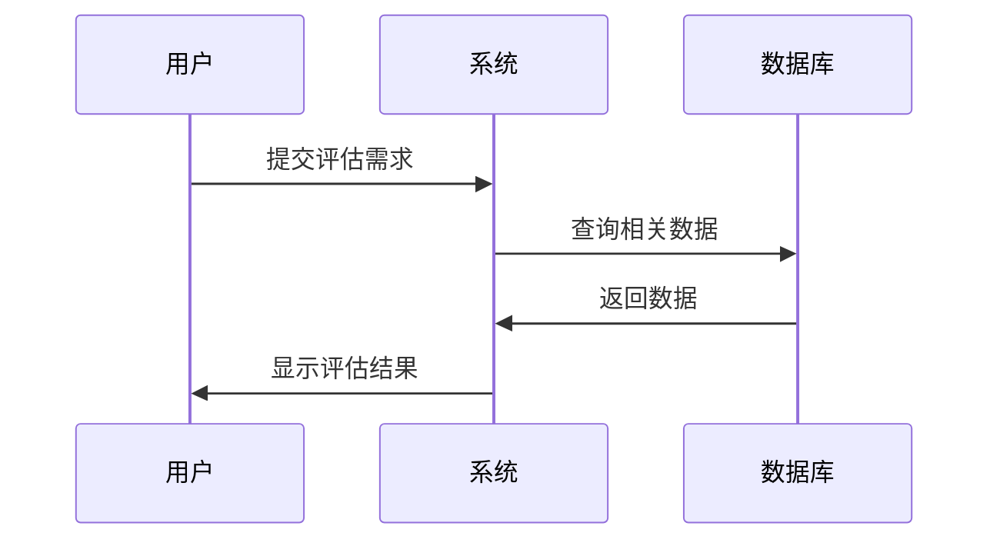

                 

### 目录大纲

**# 团队效能评估新模型：全方位衡量团队价值**

> 关键词：团队效能评估、模型构建、多层次评估指标、全面衡量、团队价值

> 摘要：
本文旨在介绍一种全新的团队效能评估模型，该模型通过结合多种评估指标和方法，实现全方位衡量团队在不同方面的价值。本文首先讨论了团队效能评估的背景和问题，然后详细阐述了新模型的理论基础、构建与实施步骤，并借助具体案例展示了其实际应用效果。通过本文的阅读，读者可以全面了解团队效能评估的新模型，并掌握其实施方法。

### 第一部分：背景介绍

#### 1. 核心概念的引入与问题描述

**1.1 问题背景**

随着现代企业的发展，团队效能成为企业竞争力的重要标志。传统的评估方法通常侧重于团队绩效，忽视了团队成员满意度、团队协作度以及团队创新能力等多方面的因素。这使得评估结果往往不够全面和科学，难以准确反映团队的实际情况，进而影响管理决策的有效性。

**1.2 问题描述**

为了应对复杂团队管理的需求，我们需要引入一种新的评估模型。这种模型应具备全面、科学、可操作性的特点，能够准确衡量团队在不同方面的价值，为企业管理者提供有效的决策支持。

**1.3 问题解决**

本书将介绍一种全新的团队效能评估模型，通过结合多种评估指标和方法，实现全方位衡量团队价值的目标。

**1.4 边界与外延**

本模型适用于各类企业团队，包括研发、运营、销售等多个领域，旨在为团队管理提供一种新的工具和方法。

**1.5 概念结构与核心要素组成**

团队效能评估模型包含四大核心要素：团队绩效、团队成员满意度、团队协作度、团队创新能力，通过这四个维度进行综合评估。

### 2. 核心概念与联系

**2.1 核心概念原理**

团队效能评估模型基于现代团队管理理论，综合运用统计学、心理学、管理学等多学科知识，建立一套科学、系统的评估体系。

**2.2 概念属性特征对比表格**

| 概念        | 属性特征                                                         |  
|-------------|------------------------------------------------------------------|  
| 团队绩效     | 成果产出、效率、质量                                             |  
| 团队成员满意度 | 工作氛围、团队支持、职业发展机会                                  |  
| 团队协作度   | 沟通效率、任务分配、协作流程                                     |  
| 团队创新能力 | 创新思维、创新能力、创新成果                                     |

**2.3 ER实体关系图架构**

```mermaid
erdgraph TeamEffectiveness {
    node [shape=rectangle, style=filled, fillcolor=lightblue]
    team [label="团队"]
    performance [label="团队绩效"]
    member_satisfaction [label="团队成员满意度"]
    collaboration [label="团队协作度"]
    innovation [label="团队创新能力"]

    team -> performance
    team -> member_satisfaction
    team -> collaboration
    team -> innovation
}
```

### 第二部分：新模型的构建与实施

#### 3. 新模型的理论基础

**3.1 团队效能评估的理论框架**

本书基于现代团队管理理论，构建了一个涵盖团队绩效、团队成员满意度、团队协作度、团队创新能力四个维度的评估框架。

**3.2 多指标综合评估方法**

采用层次分析法（AHP）确定各指标权重，通过数据挖掘和统计分析方法，实现对团队效能的量化评估。

#### 4. 模型构建与实施步骤

**4.1 模型构建**

明确评估目标，收集相关数据，设计评估指标体系，构建评估模型。

**4.2 实施步骤**

数据收集与预处理、指标权重分配、评估模型计算、评估结果分析与反馈。

#### 5. 案例分析

**5.1 案例背景**

某互联网公司研发团队，希望通过团队效能评估模型优化团队管理，提高团队整体效能。

**5.2 实施过程**

按照模型构建与实施步骤，进行团队效能评估，并根据评估结果提出改进建议。

### 第三部分：系统分析与架构设计

#### 6. 系统分析与架构设计

**6.1 问题场景介绍**

在企业中，如何有效地评估团队效能，从而优化团队管理和提升整体效能，成为了一个关键问题。

**6.2 系统功能设计**

系统功能设计包括数据收集、指标计算、结果分析等模块，具体功能如下：

- 数据收集：从各个渠道收集与团队效能相关的数据。
- 指标计算：根据评估模型，计算各个指标的得分。
- 结果分析：对评估结果进行可视化展示，帮助管理者了解团队效能的各个方面。

**6.3 系统架构设计**

系统采用分布式架构，包括数据层、业务逻辑层、表现层等，具体架构如下：

- 数据层：负责数据的存储和管理，包括数据库、数据仓库等。
- 业务逻辑层：实现团队效能评估的核心算法和业务逻辑。
- 表现层：提供用户界面，展示评估结果和分析报告。

**6.4 系统接口设计和系统交互**

系统接口设计包括API接口和用户界面，API接口用于与其他系统集成，用户界面用于展示评估结果和分析报告。



### 第四部分：项目实战

#### 7. 环境安装与系统核心实现

**7.1 环境安装**

安装Python环境，以及相关的依赖库，如NumPy、Pandas、Matplotlib等。

**7.2 系统核心实现**

实现团队效能评估的核心算法和业务逻辑，包括数据收集、指标计算、结果分析等模块。

#### 8. 代码应用解读与分析

**8.1 代码应用解读**

对系统核心实现中的代码进行解读，理解各个模块的功能和逻辑。

**8.2 分析与优化**

对系统性能进行优化，提高评估效率和准确性。

#### 9. 实际案例分析与详细讲解

**9.1 案例背景**

以某互联网公司研发团队为例，进行实际案例分析。

**9.2 详细讲解**

详细讲解评估过程和结果，分析团队效能的各个方面。

#### 10. 项目小结

**10.1 项目小结**

总结项目经验和收获，对团队效能评估模型的实际应用效果进行评估。

**10.2 展望未来**

探讨团队效能评估模型在未来可能的发展方向和应用场景。

### 第五部分：最佳实践与拓展阅读

#### 11. 最佳实践

**11.1 最佳实践 tips**

提供一些实用的团队效能评估方法和技巧，帮助读者在实际工作中更好地应用模型。

**11.2 小结**

对本文的核心观点和结论进行总结，强调团队效能评估的重要性。

**11.3 注意事项**

提醒读者在实际应用中需要注意的事项和潜在问题。

**11.4 拓展阅读**

推荐一些相关的书籍、文章和研究报告，供读者进一步学习和研究。

### 作者信息

作者：AI天才研究院/AI Genius Institute & 禅与计算机程序设计艺术 /Zen And The Art of Computer Programming

