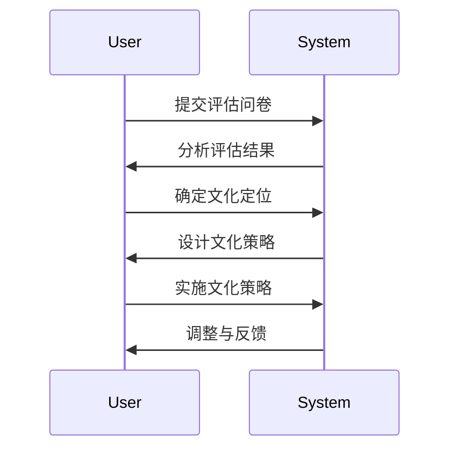
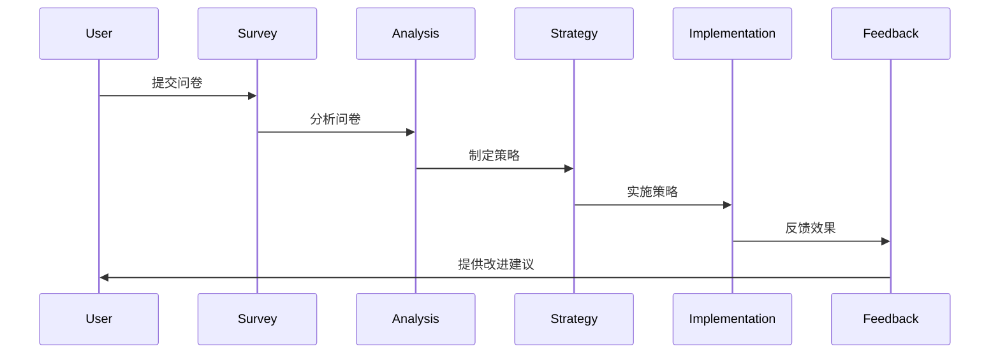

                 

### 文章标题

# 团队文化塑造：建立积极向上的工作氛围

---

关键词：团队文化、积极氛围、工作环境、领导力、员工满意度

摘要：本文旨在探讨团队文化的构建，以创造一个积极向上的工作氛围。我们将从定义团队文化、探讨其构成要素，到讲解文化塑造方法与流程，最后通过项目实战和最佳实践，深入剖析团队文化在IT领域的实际应用。本文将帮助您理解团队文化的重要性，掌握构建积极团队的方法，并在实践中运用这些知识，提升团队的整体绩效和员工满意度。

---

### 第一部分：背景介绍

#### 第1章：团队文化的概念与重要性

**1.1 什么是团队文化**

团队文化是指一个团队在长期发展过程中形成的共同价值观、信念、行为规范和工作方式。它是团队内部共同的信仰和行为准则，影响着团队成员的决策和行为，进而决定团队的效率和绩效。

**1.2 团队文化的作用**

- **提高团队凝聚力**：团队文化能够增强团队成员之间的联系，建立共同的认同感和归属感，提高团队的整体凝聚力。
- **增强团队协作**：团队文化鼓励协作和沟通，减少摩擦和冲突，提高团队协作效率。
- **提升员工满意度**：积极向上的团队文化能够提升员工的幸福感和满意度，降低员工流失率。
- **促进创新**：团队文化鼓励创新思维和实践，激发团队成员的创新潜力。

**1.3 团队文化的重要性**

- **企业竞争力**：团队文化是企业的核心竞争力之一，有助于企业在竞争中脱颖而出。
- **员工成长**：团队文化为员工提供成长环境，帮助员工提升个人能力和职业素养。
- **工作氛围**：积极向上的团队文化能够营造良好的工作氛围，提高员工的工作积极性和效率。

**1.4 团队文化的边界与外延**

团队文化的边界在于其内部一致性，而其外延则涉及到团队与其他组织、客户和合作伙伴的关系。一个健康的团队文化不仅内部要和谐一致，还要能够适应外部环境的变化。

---

#### 第2章：团队文化构成要素

**2.1 核心价值观**

核心价值观是团队文化的核心，是团队成员共同遵循的基本原则。它们指导着团队的行为和决策，如“客户至上”、“创新驱动”、“团队合作”等。

**2.2 企业使命与愿景**

企业使命与愿景是团队文化的长远目标，明确了团队存在的意义和未来发展的方向。它们为团队提供了奋斗的目标和精神动力。

**2.3 领导风格与行为**

领导风格与行为对团队文化具有显著影响。领导者的行为和决策会直接影响团队成员的态度和行为。

**2.4 团队协作与沟通**

团队协作与沟通是团队文化的关键组成部分。良好的沟通机制和协作方式能够提升团队效率，降低冲突。

**2.5 文化传承与创新**

文化传承与创新是团队文化发展的两个重要方面。文化传承保持团队的稳定性和连续性，而创新则推动团队不断进步。

---

### 第二部分：核心概念与联系

#### 第3章：团队文化原理

**3.1 团队文化的理论模型**

团队文化的理论模型包括组织文化三层次模型（表层文化、隐层文化和核心层文化）和五因素模型（外部环境、组织结构、权力分配、管理风格和员工素质）。

**3.2 团队文化属性特征对比表格**

| 特征         | 表层文化           | 隐层文化           | 核心层文化           |
| ------------ | ------------------ | ------------------ | ------------------ |
| 形式         | 装饰、标志、仪式   | 社交、习俗、仪式   | 价值观、信仰、理念   |
| 影响因素     | 外在因素           | 中层因素           | 内在因素           |
| 稳定性       | 较不稳定           | 相对稳定           | 非常稳定           |

**3.3 团队文化ER实体关系图**

```mermaid
erDiagram
  Customer ||--|{ Order }|--|+ Customer
  Product ||--|{ Order }|--|+ Customer
```

图中的ER实体关系图展示了团队文化中不同元素之间的关系，如顾客、订单、产品等。

---

### 第三部分：算法原理讲解

#### 第4章：团队文化塑造方法

**4.1 基于员工满意度的团队文化塑造**

员工满意度是团队文化塑造的重要指标。通过调查员工满意度，可以识别团队文化中的问题，并制定相应的改进措施。

**4.2 基于领导力理论的团队文化塑造**

领导力在团队文化塑造中起着关键作用。领导者通过行为和决策，可以塑造团队的文化氛围。如授权、激励、沟通等领导力技巧。

**4.3 基于心理学理论的团队文化塑造**

心理学理论提供了理解团队行为和文化的工具。如社会认同理论、群体动力理论等，可以帮助团队塑造积极的文化氛围。

---

#### 第5章：团队文化塑造流程

**5.1 团队文化评估**

团队文化评估是团队文化塑造的第一步。通过评估，可以了解团队文化的现状和问题，为后续的改进提供依据。

**5.2 团队文化定位**

团队文化定位是明确团队文化的发展方向和目标。这需要结合企业的战略目标和价值观，制定具体的文化建设计划。

**5.3 团队文化设计**

团队文化设计是制定具体的实施策略，包括价值观的传递、领导风格的塑造、团队活动的组织等。

**5.4 团队文化实施与调整**

团队文化实施与调整是确保团队文化得以落地和持续发展的关键步骤。这需要持续监控和反馈，根据实际情况进行调整。

---

### 第四部分：系统分析与架构设计方案

#### 第6章：团队文化系统功能设计

**6.1 领导者角色与行为**

领导者在团队文化塑造中扮演关键角色。他们的行为和决策直接影响团队文化的形成和演变。

**6.2 员工角色与行为**

员工是团队文化的实践者。他们的行为和态度反映了团队文化的实际效果。通过培训和激励，可以提高员工的角色意识和文化认同。

**6.3 沟通机制与工具**

良好的沟通机制和工具是团队文化的重要组成部分。如定期会议、团队讨论、在线沟通平台等。

**6.4 文化传承与创新机制**

文化传承与创新机制是团队文化持续发展的保证。通过建立知识库、创新奖励机制等，可以促进文化的传承和创新。

---

#### 第7章：团队文化系统架构设计

**7.1 系统架构概述**

团队文化系统架构设计旨在提供一套完整的解决方案，包括文化评估、定位、设计、实施和调整。

**7.2 技术栈与工具选型**

技术栈与工具选型应根据团队文化的需求进行选择。如使用Python进行数据分析，使用Django进行Web开发等。

**7.3 系统架构图**



图中的系统架构图展示了团队文化系统的功能模块和工作流程。

---

#### 第8章：团队文化系统接口设计与交互

**8.1 接口设计与实现**

接口设计是团队文化系统的关键环节。它定义了系统与外部环境和其他系统的交互方式。

**8.2 系统交互序列图**



图中的系统交互序列图展示了团队文化系统与用户和其他系统之间的交互流程。

---

### 第五部分：项目实战

#### 第9章：团队文化塑造项目实战

**9.1 项目背景**

在本节中，我们将介绍一个具体的团队文化塑造项目，包括项目的目标和背景信息。

**9.2 环境安装与配置**

在本节中，我们将详细讲解项目环境的安装和配置步骤，包括所需软件和工具的安装过程。

**9.3 系统核心实现**

在本节中，我们将介绍系统的核心实现，包括源代码的编写、关键算法的实现和功能模块的集成。

**9.4 代码应用解读与分析**

在本节中，我们将对系统核心代码进行解读和分析，解释其实现原理和优势。

**9.5 实际案例分析与讲解**

在本节中，我们将通过实际案例展示团队文化塑造项目的效果，并进行详细讲解和分析。

**9.6 项目小结**

在本节中，我们将对项目进行总结，讨论项目的成果和经验教训。

---

### 第六部分：最佳实践与拓展

#### 第10章：团队文化塑造最佳实践

**10.1 常见挑战与解决策略**

在本节中，我们将讨论团队文化塑造过程中常见的挑战，并提供相应的解决策略。

**10.2 团队文化塑造最佳实践案例**

在本节中，我们将介绍一些成功的团队文化塑造案例，并分析其成功的原因。

**10.3 团队文化塑造工具与应用**

在本节中，我们将介绍一些常用的团队文化塑造工具，并讨论它们在实际应用中的效果。

---

#### 第11章：小结与注意事项

**11.1 书籍主要内容回顾**

在本节中，我们将回顾书籍的主要内容，帮助读者巩固所学知识。

**11.2 注意事项与未来展望**

在本节中，我们将讨论团队文化塑造的一些注意事项，并提供未来展望，鼓励读者持续学习和实践。

**11.3 拓展阅读建议**

在本节中，我们将推荐一些拓展阅读资源，帮助读者深入了解团队文化塑造的理论和实践。

---

### 结语

作者：AI天才研究院/AI Genius Institute & 禅与计算机程序设计艺术 /Zen And The Art of Computer Programming

本文旨在为读者提供关于团队文化塑造的全面指导。通过深入分析团队文化的概念、构成要素、塑造方法、系统设计和项目实战，我们希望能够帮助读者理解团队文化的重要性，掌握建立积极向上工作氛围的技巧。希望本文能够对您的团队文化建设提供有益的参考和启示。在未来的工作中，持续关注团队文化，积极实践，不断优化，您的团队将能够在激烈的市场竞争中脱颖而出。让我们一起努力，为打造卓越团队文化而奋斗！

