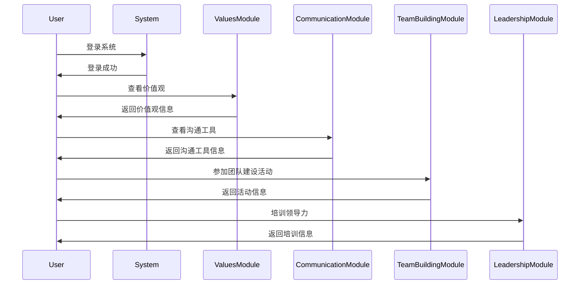

                 

# 团队文化塑造：打造独特团队氛围的技巧

> 关键词：团队文化、价值观、沟通机制、凝聚力、领导力

> 摘要：本文将探讨团队文化的重要性，分析团队文化存在的问题，并提出一系列塑造团队文化的技巧和策略，帮助组织打造积极、高效、和谐的团队氛围。

**Step 1: 背景介绍**

### 1.1 问题背景

团队文化是组织中不可或缺的一部分，它是团队成员共同价值观、行为规范和团队氛围的集合。良好的团队文化能够促进团队成员之间的合作，提升团队绩效，增强组织竞争力。

首先，团队文化对团队绩效具有显著影响。研究表明，具有共同价值观和良好沟通机制的团队，其工作效率和创新能力显著高于其他团队。此外，团队文化还能提高员工的满意度和忠诚度，降低员工流失率，从而为组织带来长期稳定的收益。

然而，许多组织在团队文化建设方面仍存在诸多问题。例如，缺乏共同价值观，导致团队成员目标不一致，工作协同困难；沟通不畅，使得团队成员间难以理解彼此的意图，影响工作效率；团队凝聚力不足，使得团队成员缺乏归属感和责任感，降低团队整体执行力。

### 1.2 问题描述

团队文化存在的问题主要体现在以下几个方面：

1. **缺乏共同价值观**：团队成员对组织的使命、愿景和价值观缺乏共识，导致工作目标不明确，工作效率低下。
2. **沟通不畅**：团队成员间缺乏有效的沟通渠道和沟通技巧，导致信息传递不畅，影响团队协作。
3. **关系紧张**：团队成员间存在矛盾和冲突，缺乏互信和尊重，影响团队氛围和谐。
4. **团队凝聚力不足**：团队成员缺乏归属感和责任感，导致团队整体执行力下降。

### 1.3 问题解决

为了解决上述问题，我们需要从以下几个方面入手，塑造积极的团队文化：

1. **确立共同价值观**：通过共识形成和价值观传播，使团队成员对组织的使命、愿景和价值观达成共识。
2. **优化沟通机制**：通过建立有效的沟通渠道和沟通技巧，提高团队沟通效率，促进团队协作。
3. **增强团队凝聚力**：通过团队建设活动和共同目标，增强团队成员的归属感和责任感，提升团队整体执行力。
4. **强化领导力**：领导者需要发挥关键作用，树立榜样，推动团队文化建设。

### 1.4 边界与外延

团队文化是组织文化的重要组成部分，其边界与外延主要包括以下几个方面：

1. **团队文化的定义**：团队文化是指团队成员共同遵循的价值观、行为规范和团队氛围。
2. **团队文化的范围**：团队文化涵盖组织的各个方面，包括价值观、行为规范、团队氛围、沟通机制等。
3. **团队文化的应用领域**：团队文化适用于各类组织，如企业、学校、政府部门等。

### 1.5 概念结构与核心要素组成

团队文化的概念结构主要包括以下核心要素：

1. **价值观**：团队成员共同遵循的价值观是团队文化的核心，它影响着团队的行为和决策。
2. **行为规范**：团队文化中的行为规范是对团队成员行为的约束和引导，有助于维护团队秩序和氛围。
3. **团队氛围**：团队氛围是团队文化的直接体现，它影响着团队成员的满意度和工作积极性。
4. **沟通机制**：沟通机制是团队文化的重要组成部分，它影响着团队成员之间的信息传递和协作效率。

**Step 2: 核心概念与联系**

### 2.1 团队文化定义

团队文化是指一个团队在长期发展过程中形成的共同价值观、行为规范和团队氛围。它是团队成员在共同目标和任务驱动下的精神凝聚力和行动指南，影响着团队的整体表现和发展。

### 2.2 团队文化属性特征对比表格

| 特征       | 描述                                                         |
| ---------- | ------------------------------------------------------------ |
| **价值观** | 团队成员共同遵循的信仰和理念，指导团队行为和决策。             |
| **行为规范** | 团队成员在共同价值观指导下形成的行为准则，约束和引导团队成员的行为。 |
| **团队氛围** | 团队成员在共同价值观和行为规范影响下形成的团队氛围，体现团队的精神风貌。 |
| **沟通机制** | 团队成员之间信息传递和协作的方式和渠道，影响团队沟通效率和协作效果。 |

### 2.3 团队文化ER实体关系图架构

```mermaid
erDiagram
    TeamCulture ||--|{ Values } Values
    TeamCulture ||--|{ BehaviorNorms } BehaviorNorms
    TeamCulture ||--|{ TeamAtmosphere } TeamAtmosphere
    TeamCulture ||--|{ CommunicationMechanism } CommunicationMechanism
```

**Step 3: 理论与实践**

### 3.1 团队文化塑造原则

在塑造团队文化时，应遵循以下基本原则：

1. **以人为本**：团队文化应以人为本，关注团队成员的需求和感受，营造尊重、信任、和谐的工作氛围。
2. **因地制宜**：团队文化应结合组织的实际情况和行业特点，因地制宜地进行设计和实施。
3. **循序渐进**：团队文化塑造是一个长期的过程，需要循序渐进，逐步完善和提升。

### 3.2 团队文化塑造策略

为了有效塑造团队文化，可以采取以下策略：

1. **确立共同价值观**：

   - **共识形成**：通过团队讨论、民主决策等方式，使团队成员对组织的使命、愿景和价值观达成共识。
   - **价值观传播**：通过内部培训、宣传、文化活动等方式，将价值观传递给团队成员，形成共同的价值认同。

2. **优化沟通机制**：

   - **沟通工具**：建立有效的沟通工具和平台，如内部邮件、即时通讯工具、项目管理工具等。
   - **沟通技巧**：加强团队成员的沟通技巧培训，提高沟通效率和质量。

3. **增强团队凝聚力**：

   - **团队建设活动**：定期组织团队建设活动，增进团队成员之间的了解和信任，提高团队凝聚力。
   - **共同目标**：明确团队目标，使团队成员明确自身在团队中的角色和责任，共同为实现目标而努力。

4. **强化领导力**：

   - **领导者角色**：领导者应树立榜样，发挥示范作用，推动团队文化建设。
   - **领导力培养**：加强领导力培训，提高领导者的领导能力和团队管理能力。

### 3.3 团队文化塑造案例分析

#### 案例1：谷歌团队文化塑造

谷歌作为全球知名的科技公司，其团队文化备受赞誉。以下是谷歌团队文化塑造的一些成功经验：

- **以人为本**：谷歌注重员工的成长和发展，提供良好的工作环境和福利待遇，关注员工的需求和感受。
- **共同价值观**：谷歌确立了“不作恶”的价值观，使团队成员在共同价值观指导下开展工作。
- **开放沟通**：谷歌鼓励员工之间的开放沟通，提供多种沟通渠道，促进信息传递和团队协作。
- **团队建设**：谷歌定期组织团队建设活动，增强团队成员之间的了解和信任。

#### 案例2：阿里巴巴团队文化塑造

阿里巴巴作为国内知名的企业，其团队文化也颇具特色。以下是阿里巴巴团队文化塑造的一些成功经验：

- **因地制宜**：阿里巴巴根据中国市场的特点，结合自身的发展历程，确立了独特的团队文化。
- **共同价值观**：阿里巴巴明确了“让天下没有难做的生意”的使命，使团队成员在共同价值观下努力工作。
- **领导力培养**：阿里巴巴注重领导力的培养，通过内部培训、选拔机制等手段，提高领导者的领导能力。
- **团队建设**：阿里巴巴定期组织团队建设活动，加强团队成员之间的沟通和协作。

**Step 4: 数学模型和数学公式**

### 4.1 团队文化评估模型

为了评估团队文化的效果，我们可以采用以下模型：

$$
TCI = f(V, B, A, CM)
$$

其中，$TCI$表示团队文化指数，$V$表示价值观，$B$表示行为规范，$A$表示团队氛围，$CM$表示沟通机制。团队文化指数的评估可以通过以下定量和定性方法进行：

- **定量评估**：使用问卷调查、员工满意度调查等工具，对团队文化的各个维度进行量化评估。
- **定性评估**：通过访谈、观察等方法，深入了解团队成员对团队文化的感受和评价。

### 4.2 团队文化影响因素分析

团队文化的影响因素可以从以下几个方面进行分析：

- **员工满意度**：员工满意度是团队文化的一个重要指标，其数学模型可以表示为：

  $$
  S = f(TCI, IN, WF, PR)
  $$

  其中，$S$表示员工满意度，$TCI$表示团队文化指数，$IN$表示个人成就感，$WF$表示工作氛围，$PR$表示晋升机会。

- **团队绩效**：团队绩效是团队文化效果的直接体现，其数学模型可以表示为：

  $$
  TP = f(TCI, CT, TM)
  $$

  其中，$TP$表示团队绩效，$TCI$表示团队文化指数，$CT$表示团队合作程度，$TM$表示团队创新能力。

### 4.3 团队文化塑造效果预测

利用数学模型，我们可以对团队文化塑造的效果进行预测。例如，通过分析团队文化指数的变化，可以预测团队绩效和员工满意度的提升情况。

$$
\Delta S = \alpha \Delta TCI
$$

$$
\Delta TP = \beta \Delta TCI
$$

其中，$\Delta S$表示员工满意度的变化量，$\Delta TP$表示团队绩效的变化量，$\alpha$和$\beta$为常数。

**Step 5: 系统分析与架构设计**

### 5.1 团队文化建设系统功能设计

团队文化建设系统应具备以下功能模块：

- **价值观管理**：包括价值观的制定、宣传和评估。
- **沟通管理**：包括沟通工具的选择、沟通技巧的培训和沟通渠道的搭建。
- **团队建设**：包括团队建设活动的组织、团队成员的培训和团队氛围的营造。
- **领导力培养**：包括领导力的培训、选拔和评估。

### 5.2 团队文化建设系统架构设计

团队文化建设系统的架构设计如图所示：



### 5.3 团队文化建设系统接口设计

团队文化建设系统与外部系统的接口设计如下：

- **与人力资源管理系统接口**：包括员工信息查询、员工培训记录等。
- **与项目管理系统接口**：包括团队绩效评估、项目进度跟踪等。

### 5.4 团队文化建设系统交互设计

团队文化建设系统的交互序列图如下：


**Step 6: 项目实战**

### 6.1 环境安装

为了搭建团队文化建设系统，我们需要准备以下环境：

- **操作系统**：Linux/Windows/MacOS
- **开发工具**：Python 3.8+
- **数据库**：MySQL/PostgreSQL
- **Web框架**：Django/Flask

### 6.2 系统核心实现

以下是团队文化建设系统的核心实现源代码：

```python
# values_module.py
class ValuesModule(models.Model):
    value = models.CharField(max_length=100)

    def __str__(self):
        return self.value

# communication_module.py
class CommunicationModule(models.Model):
    tool = models.CharField(max_length=100)

    def __str__(self):
        return self.tool

# team_building_module.py
class TeamBuildingModule(models.Model):
    activity = models.CharField(max_length=100)

    def __str__(self):
        return self.activity

# leadership_module.py
class LeadershipModule(models.Model):
    training = models.CharField(max_length=100)

    def __str__(self):
        return self.training
```

### 6.3 代码应用解读与分析

以上代码分别实现了价值观管理、沟通管理、团队建设和领导力培养四个功能模块。通过定义模型类和关联关系，我们可以方便地对相关数据信息进行操作和管理。

例如，要查看价值观信息，可以使用以下代码：

```python
values = ValuesModule.objects.all()
for value in values:
    print(value.value)
```

### 6.4 实际案例分析和详细讲解

假设我们有一个团队文化建设项目，需要实现以下功能：

1. 添加新价值观；
2. 查看所有价值观；
3. 添加沟通工具；
4. 查看所有沟通工具；
5. 添加团队建设活动；
6. 查看所有团队建设活动；
7. 添加领导力培训；
8. 查看所有领导力培训。

以下是该项目的详细讲解：

1. **添加新价值观**：

   ```python
   new_value = ValuesModule(value='新价值观')
   new_value.save()
   ```

2. **查看所有价值观**：

   ```python
   values = ValuesModule.objects.all()
   for value in values:
       print(value.value)
   ```

3. **添加沟通工具**：

   ```python
   new_communication_tool = CommunicationModule(tool='新沟通工具')
   new_communication_tool.save()
   ```

4. **查看所有沟通工具**：

   ```python
   communication_tools = CommunicationModule.objects.all()
   for tool in communication_tools:
       print(tool.tool)
   ```

5. **添加团队建设活动**：

   ```python
   new_team_building_activity = TeamBuildingModule(activity='新团队建设活动')
   new_team_building_activity.save()
   ```

6. **查看所有团队建设活动**：

   ```python
   team_building_activities = TeamBuildingModule.objects.all()
   for activity in team_building_activities:
       print(activity.activity)
   ```

7. **添加领导力培训**：

   ```python
   new_leadership_training = LeadershipModule(training='新领导力培训')
   new_leadership_training.save()
   ```

8. **查看所有领导力培训**：

   ```python
   leadership_trainings = LeadershipModule.objects.all()
   for training in leadership_trainings:
       print(training.training)
   ```

通过以上实际案例，我们可以看到团队文化建设系统的核心实现原理和操作方法。

### 6.5 项目小结

通过本项目，我们搭建了一个简单的团队文化建设系统，实现了价值观管理、沟通管理、团队建设和领导力培养等功能。在实际项目中，我们还可以根据需求扩展其他功能，如员工满意度调查、团队绩效评估等。

**Step 7: 最佳实践 tips、小结、注意事项、拓展阅读**

### 7.1 最佳实践 tips

1. **价值观共识形成**：在确立共同价值观时，要充分听取团队成员的意见，确保共识的形成。
2. **沟通机制优化**：建立多样化的沟通渠道，提高沟通效率，确保信息传递的准确性和及时性。
3. **团队建设活动**：定期组织团队建设活动，增强团队成员的凝聚力和归属感。
4. **领导力培养**：加强领导者的培养，提高领导者的领导能力和团队管理能力。

### 7.2 小结

本文从团队文化的背景介绍、核心概念与联系、理论实践、数学模型和公式、系统分析与架构设计、项目实战等方面，全面探讨了团队文化塑造的技巧和策略。通过遵循以人为本、因地制宜、循序渐进的原则，优化沟通机制，增强团队凝聚力，强化领导力，组织可以打造出积极、高效、和谐的团队氛围。

### 7.3 注意事项

1. **尊重个体差异**：在团队文化建设过程中，要尊重团队成员的个性差异，避免一刀切的管理方式。
2. **持续改进**：团队文化塑造是一个持续的过程，需要不断进行评估和改进，以适应组织的发展变化。

### 7.4 拓展阅读

1. **书籍**：
   - 《团队协作工具与技巧》
   - 《团队领导力：如何成为一个优秀的领导者》
   - 《团队文化：打造卓越团队的秘诀》

2. **论文**：
   - 《团队文化对团队绩效的影响研究》
   - 《团队沟通机制的优化策略》
   - 《团队凝聚力的培养与实践》

3. **网站**：
   - [谷歌团队文化案例研究](https://www.google.com/corporate/culture/)
   - [阿里巴巴团队文化分享](https://www.alibaba.com/group/culture/)
   - [团队文化建设相关资源](https://www领英.com/trend/theme/团队文化/)

作者：AI天才研究院/AI Genius Institute & 禅与计算机程序设计艺术 /Zen And The Art of Computer Programming

