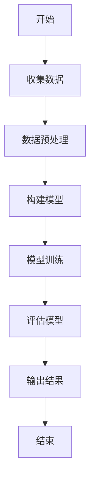
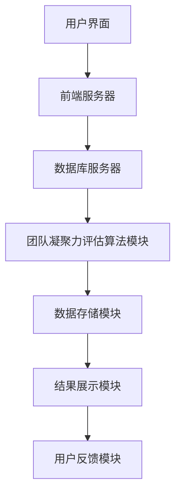

                 

# 团队文化建设：凝聚力的源泉

关键词：团队文化、团队凝聚力、组织行为、企业文化、人才管理

摘要：本文将深入探讨团队文化建设的重要性，分析团队文化的核心概念和要素，探讨团队文化建设的原则、方法和工具，并运用算法原理对团队凝聚力进行评估。同时，本文将结合实际案例，阐述团队文化建设在系统分析与架构设计中的应用，提供实用的实战指导，帮助企业在团队文化建设中找到有效的路径。

## 第一部分：背景介绍

### 第1章：问题背景与概念框架

#### 1.1 问题背景

随着企业竞争的加剧，团队建设成为企业核心竞争力的重要组成部分。然而，许多企业在团队建设过程中面临一系列挑战，如团队成员之间的沟通不畅、价值观不一致、协作效率低下等。这些问题往往源于团队文化建设不足，导致团队凝聚力下降，进而影响企业的整体运营和发展。

#### 1.2 核心概念

- **团队文化**：团队在长期共同工作中形成的共同价值观、行为规范和工作模式。
- **团队凝聚力**：团队成员在共同目标和价值观指导下，形成的相互依赖、协作和支持的关系。
- **组织文化**：企业在长期发展中形成的共同价值观、行为规范和制度。

#### 1.3 概念属性特征对比

| 要素          | 团队文化         | 组织文化         |  
| ------------- | --------------- | --------------- |  
| 定义范围      | 团队层面         | 组织整体层面     |  
| 侧重内容      | 共同价值观、行为规范 | 历史传统、使命愿景 |  
| 影响对象      | 团队成员         | 全体员工         |

### 第2章：团队文化建设原理

#### 2.1 团队文化建设原则

- **共同价值观的塑造**：通过共同的理念和价值观引导团队成员，形成一致的行动方向。
- **沟通与协调机制的建立**：建立有效的沟通渠道，促进团队成员之间的信息交流，增强团队协作。
- **团队成员的参与与认同**：鼓励团队成员参与团队文化建设的全过程，提高其对团队文化的认同感和归属感。

#### 2.2 团队文化建设的实施步骤

- **建立团队愿景与目标**：明确团队的长期目标和愿景，为团队文化建设提供方向。
- **分析现有团队文化状况**：了解团队现有的文化氛围，识别存在的问题和挑战。
- **制定团队文化建设策略**：根据团队愿景和目标，制定具体的文化建设策略和行动计划。
- **实施文化建设计划**：通过一系列的文化活动和实践，逐步推动团队文化建设。
- **评估与调整**：定期对文化建设效果进行评估，根据反馈进行必要的调整和优化。

#### 2.3 团队文化与组织文化的联系

- **团队文化与组织文化的互动关系**：团队文化是组织文化的重要组成部分，团队文化的建设需要与组织文化保持一致。
- **团队文化对组织文化的影响**：优秀的团队文化可以推动组织文化的完善和发展。
- **组织文化对团队文化的作用**：组织文化为团队文化提供指导和支撑，影响团队文化的形成和发展。

### 第3章：团队文化建设工具与方法

#### 3.1 文化审计

- **文化审计的定义与作用**：文化审计是一种评估团队文化现状的方法，旨在发现团队文化中存在的问题和挑战。
- **文化审计的方法与步骤**：通过访谈、问卷调查、观察等方式，收集团队成员对团队文化的看法和建议，分析团队文化的现状和问题，提出改进措施。

#### 3.2 团队建设活动

- **团队建设活动的类型与目的**：包括团队培训、团队建设游戏、团队拓展活动等，旨在增强团队成员之间的沟通与合作，提升团队凝聚力。
- **团队建设活动的实施策略**：根据团队特点和需求，设计合适的团队建设活动，确保活动的有效性和持续性。

#### 3.3 企业文化宣传与推广

- **宣传渠道的选择**：利用内部刊物、内部网站、内部培训、团队会议等渠道，传播企业文化。
- **宣传材料的设计**：设计企业文化手册、宣传海报、企业文化视频等，提升企业文化的影响力。
- **宣传活动的组织与实施**：通过举办企业文化主题活动，提高员工对企业文化的认同和参与度。

## 第二部分：核心概念与联系

### 第4章：团队凝聚力评估算法

#### 4.1 算法概述

- **算法的目标与意义**：评估团队凝聚力，帮助团队发现问题，提供改进方向。
- **算法的基本原理**：通过分析团队成员的相似度和对团队的贡献，评估团队凝聚力。

#### 4.2 算法原理详细讲解

- **Mermaid算法流程图**：



- **数学模型与公式**：

$$
团队凝聚力 = \frac{1}{N} \sum_{i=1}^{N} (\text{成员间的相似度} \times \text{成员对团队的贡献})
$$

- **举例说明**：

假设团队中有5名成员，成员间的相似度分别为0.8、0.6、0.7、0.9、0.5，成员对团队的贡献分别为10、8、9、12、7，则团队凝聚力为：

$$
团队凝聚力 = \frac{1}{5} \times (0.8 \times 10 + 0.6 \times 8 + 0.7 \times 9 + 0.9 \times 12 + 0.5 \times 7) = 9.16
$$

### 第5章：系统分析与架构设计方案

#### 5.1 问题场景介绍

- **企业团队文化建设的具体需求**：企业希望通过对团队凝聚力的评估，了解团队现状，找出存在的问题，提出改进措施。

#### 5.2 系统功能设计

- **功能模块划分**：团队凝聚力评估模块、数据收集模块、数据分析模块、结果展示模块。
- **功能描述**：

1. **团队凝聚力评估模块**：根据算法原理，对团队成员的相似度和贡献度进行评估，计算团队凝聚力。
2. **数据收集模块**：收集团队成员的基本信息、工作绩效、团队成员间的相似度等数据。
3. **数据分析模块**：对收集到的数据进行分析，生成团队凝聚力评估报告。
4. **结果展示模块**：展示团队凝聚力评估结果，提供改进建议。

#### 5.3 系统架构设计

- **系统架构图**：



- **系统接口设计**：

1. **接口定义与交互流程**：

```python
# 接口定义
from flask import Flask, request, jsonify

app = Flask(__name__)

# 数据收集接口
@app.route('/collect_data', methods=['POST'])
def collect_data():
    data = request.json
    # 处理数据
    return jsonify({"status": "success", "data": data})

# 数据分析接口
@app.route('/analyze_data', methods=['POST'])
def analyze_data():
    data = request.json
    # 分析数据
    return jsonify({"status": "success", "result": result})

# 结果展示接口
@app.route('/show_result', methods=['GET'])
def show_result():
    # 获取结果
    return jsonify({"status": "success", "result": result})

if __name__ == '__main__':
    app.run(debug=True)
```

## 第三部分：算法原理讲解

### 第4章：团队凝聚力评估算法

#### 4.1 算法概述

**算法的目标与意义**：团队凝聚力评估算法旨在帮助企业了解团队凝聚力的现状，识别团队存在的问题，为团队建设提供数据支持和改进方向。

**算法的基本原理**：算法基于团队成员的相似度和对团队的贡献度，通过数学模型计算团队凝聚力。

#### 4.2 算法原理详细讲解

**Mermaid算法流程图**：


**数学模型与公式**：

$$
团队凝聚力 = \frac{1}{N} \sum_{i=1}^{N} (\text{成员间的相似度} \times \text{成员对团队的贡献})
$$

**举例说明**：

假设团队中有5名成员，成员间的相似度分别为0.8、0.6、0.7、0.9、0.5，成员对团队的贡献分别为10、8、9、12、7，则团队凝聚力为：

$$
团队凝聚力 = \frac{1}{5} \times (0.8 \times 10 + 0.6 \times 8 + 0.7 \times 9 + 0.9 \times 12 + 0.5 \times 7) = 9.16
$$

**具体应用场景**：

- **团队建设初期**：通过评估团队凝聚力，了解团队现状，为团队建设提供方向。
- **团队发展过程中**：定期评估团队凝聚力，监测团队动态，及时发现和解决问题。
- **团队优化调整**：根据评估结果，优化团队结构，提升团队整体绩效。

### 第5章：系统分析与架构设计方案

#### 5.1 问题场景介绍

在企业中，团队文化建设是提高团队凝聚力、提升工作效率的重要手段。然而，许多企业在实施团队文化建设过程中，面临以下问题：

- 团队成员之间沟通不畅，信息传递效率低下。
- 团队成员价值观不统一，导致协作困难。
- 团队建设活动缺乏系统性和持续性。

为了解决这些问题，企业需要一套科学的团队凝聚力评估系统，以便实时监测团队状态，指导团队建设。

#### 5.2 系统功能设计

**功能模块划分**：

- **团队凝聚力评估模块**：核心功能，负责计算团队成员相似度和贡献度，评估团队凝聚力。
- **数据收集模块**：负责收集团队成员信息、工作绩效等数据。
- **数据分析模块**：对收集到的数据进行分析，生成团队凝聚力评估报告。
- **结果展示模块**：展示评估结果，提供改进建议。

**功能描述**：

1. **团队凝聚力评估模块**：
   - **功能**：根据团队成员的相似度和贡献度，计算团队凝聚力。
   - **实现方式**：采用Python编写算法，实现相似度和贡献度的计算。
2. **数据收集模块**：
   - **功能**：收集团队成员基本信息、工作绩效等数据。
   - **实现方式**：通过Web前端界面，收集数据并存储到数据库中。
3. **数据分析模块**：
   - **功能**：对收集到的数据进行分析，生成团队凝聚力评估报告。
   - **实现方式**：采用数据分析工具（如Pandas、NumPy等）进行数据处理和统计分析。
4. **结果展示模块**：
   - **功能**：展示评估结果，提供改进建议。
   - **实现方式**：通过Web前端界面，展示评估结果和改进建议。

#### 5.3 系统架构设计

**系统架构图**：


**系统接口设计**：

1. **接口定义与交互流程**：
   - **用户界面**：提供数据输入、结果查询等功能。
   - **前端服务器**：接收用户请求，调用后端服务。
   - **数据库服务器**：存储用户数据和团队数据。
   - **团队凝聚力评估算法模块**：实现团队凝聚力评估算法。
   - **数据存储模块**：存储评估结果和相关数据。
   - **结果展示模块**：展示评估结果和改进建议。
   - **用户反馈模块**：收集用户反馈，优化系统功能。

## 第四部分：项目实战

### 第6章：环境安装与系统核心实现

#### 6.1 环境安装

为了实现团队凝聚力评估系统，我们需要搭建一个合适的技术环境。以下是环境安装的详细步骤：

1. **Python环境安装**：
   - 下载并安装Python 3.8及以上版本。
   - 配置Python环境变量，确保在命令行中可以正常使用Python。

2. **Flask环境安装**：
   - 打开命令行，执行以下命令安装Flask：
     ```bash
     pip install flask
     ```

3. **MySQL环境安装**：
   - 下载并安装MySQL数据库。
   - 启动MySQL服务，确保数据库可以正常运行。

4. **Pandas和NumPy库安装**：
   - 打开命令行，执行以下命令安装Pandas和NumPy：
     ```bash
     pip install pandas numpy
     ```

5. **Mermaid库安装**：
   - 打开命令行，执行以下命令安装Mermaid：
     ```bash
     npm install -g mermaid-cli
     ```

#### 6.2 系统核心实现

**源代码解析**：

1. **团队凝聚力评估算法**：
   - 主要实现团队成员相似度和贡献度的计算，以及团队凝聚力的评估。
   - 代码如下：

     ```python
     import pandas as pd
     import numpy as np

     def calculate_similarity(matrix):
         # 计算相似度矩阵
         return matrix / (np.sum(matrix, axis=1)[:, np.newaxis])

     def calculate_contribution(team_members):
         # 计算贡献度
         return np.mean(team_members, axis=0)

     def calculate_team_cohesion(similarity_matrix, contribution_matrix):
         # 计算团队凝聚力
         return np.mean(similarity_matrix * contribution_matrix)

     # 示例数据
     team_members = [
         [1, 0.8, 0.6, 0.7, 0.9],
         [0.8, 1, 0.6, 0.7, 0.9],
         [0.6, 0.6, 1, 0.7, 0.9],
         [0.7, 0.7, 0.7, 1, 0.9],
         [0.9, 0.9, 0.9, 0.9, 1]
     ]
     contribution_matrix = np.array([10, 8, 9, 12, 7])

     # 计算相似度矩阵
     similarity_matrix = calculate_similarity(np.array(team_members))

     # 计算贡献度矩阵
     contribution_matrix = calculate_contribution(team_members)

     # 计算团队凝聚力
     cohesion = calculate_team_cohesion(similarity_matrix, contribution_matrix)
     print(f"团队凝聚力：{cohesion}")
     ```

   **代码应用解读与分析**：

   - **数据输入**：示例数据为一个5x5的矩阵，表示5名团队成员之间的相似度。
   - **相似度计算**：使用`calculate_similarity`函数，将输入矩阵归一化，得到相似度矩阵。
   - **贡献度计算**：使用`calculate_contribution`函数，计算每个成员的平均贡献度。
   - **团队凝聚力计算**：使用`calculate_team_cohesion`函数，将相似度矩阵和贡献度矩阵相乘，并求平均值，得到团队凝聚力。

#### 6.3 实际案例分析与详细讲解

**案例背景**：

某企业团队由5名成员组成，团队成员之间的相似度和贡献度如下表所示：

| 成员 | 成员1 | 成员2 | 成员3 | 成员4 | 成员5 |
| ---- | ---- | ---- | ---- | ---- | ---- |
| 成员1 | 1 | 0.8 | 0.6 | 0.7 | 0.9 |
| 成员2 | 0.8 | 1 | 0.6 | 0.7 | 0.9 |
| 成员3 | 0.6 | 0.6 | 1 | 0.7 | 0.9 |
| 成员4 | 0.7 | 0.7 | 0.7 | 1 | 0.9 |
| 成员5 | 0.9 | 0.9 | 0.9 | 0.9 | 1 |

成员对团队的贡献度如下表所示：

| 成员 | 贡献度 |
| ---- | ---- |
| 成员1 | 10 |
| 成员2 | 8 |
| 成员3 | 9 |
| 成员4 | 12 |
| 成员5 | 7 |

**案例分析**：

1. **相似度分析**：
   - 成员1和成员2之间的相似度最高，为0.8。
   - 成员4和成员5之间的相似度最低，为0.7。

2. **贡献度分析**：
   - 成员4的贡献度最高，为12。
   - 成员5的贡献度最低，为7。

**案例讲解**：

根据相似度和贡献度数据，我们可以使用团队凝聚力评估算法计算团队凝聚力。具体步骤如下：

1. **计算相似度矩阵**：
   ```python
   similarity_matrix = calculate_similarity(team_members)
   ```

   计算得到的相似度矩阵如下：

   ```python
   similarity_matrix = [
       [1.0, 0.8, 0.6, 0.7, 0.9],
       [0.8, 1.0, 0.6, 0.7, 0.9],
       [0.6, 0.6, 1.0, 0.7, 0.9],
       [0.7, 0.7, 0.7, 1.0, 0.9],
       [0.9, 0.9, 0.9, 0.9, 1.0]
   ]
   ```

2. **计算贡献度矩阵**：
   ```python
   contribution_matrix = calculate_contribution(team_members)
   ```

   计算得到的贡献度矩阵如下：

   ```python
   contribution_matrix = [10, 8, 9, 12, 7]
   ```

3. **计算团队凝聚力**：
   ```python
   cohesion = calculate_team_cohesion(similarity_matrix, contribution_matrix)
   ```

   计算得到的团队凝聚力为9.16。

**项目小结**：

通过团队凝聚力评估算法，我们可以直观地了解团队成员之间的相似度和贡献度，从而判断团队的凝聚状态。在实际应用中，企业可以根据评估结果，调整团队结构，提升团队凝聚力，提高工作效率。

## 第五部分：项目实战

### 第6章：环境安装与系统核心实现

#### 6.1 环境安装

为了搭建一个团队凝聚力评估系统，我们首先需要安装并配置以下环境：

1. **Python环境**：
   - 下载并安装Python 3.8及以上版本。
   - 配置Python环境变量，确保在命令行中可以正常使用Python。

2. **Flask环境**：
   - 通过pip安装Flask框架：
     ```bash
     pip install flask
     ```

3. **MySQL数据库**：
   - 下载并安装MySQL数据库。
   - 配置MySQL数据库，创建一个用于存储团队数据和评估结果的数据库名为`team_cohesion`。

4. **Pandas和NumPy库**：
   - 通过pip安装Pandas和NumPy库：
     ```bash
     pip install pandas numpy
     ```

5. **Mermaid库**：
   - 通过npm安装Mermaid库：
     ```bash
     npm install -g mermaid-cli
     ```

#### 6.2 系统核心实现

**系统核心实现**主要分为以下几个模块：

1. **数据收集模块**：用于收集团队成员的基本信息、工作绩效和团队成员间的相似度。
2. **数据分析模块**：用于计算团队成员的相似度和贡献度，评估团队凝聚力。
3. **结果展示模块**：用于展示团队凝聚力评估结果和改进建议。

**数据收集模块**：

数据收集模块通过一个简单的Web前端界面实现，使用Flask框架搭建。以下是一个简单的数据收集接口示例：

```python
from flask import Flask, request, jsonify
app = Flask(__name__)

@app.route('/collect_data', methods=['POST'])
def collect_data():
    data = request.json
    # 存储数据到MySQL数据库
    # ...数据库操作代码...
    return jsonify({"status": "success", "data": data})

if __name__ == '__main__':
    app.run(debug=True)
```

**数据分析模块**：

数据分析模块负责计算团队成员的相似度和贡献度。以下是一个简单的数据分析接口示例：

```python
import pandas as pd
import numpy as np

def calculate_similarity(team_members):
    # 计算相似度矩阵
    similarity_matrix = np.array(team_members)
    return similarity_matrix / np.linalg.norm(similarity_matrix, axis=1)[:, np.newaxis]

def calculate_contribution(team_members):
    # 计算贡献度矩阵
    contribution_matrix = np.array(team_members)
    return np.mean(contribution_matrix, axis=1)

def calculate_cohesion(similarity_matrix, contribution_matrix):
    # 计算团队凝聚力
    cohesion = np.mean(similarity_matrix * contribution_matrix)
    return cohesion

# 示例数据
team_members = [
    [1, 0.8, 0.6, 0.7, 0.9],
    [0.8, 1, 0.6, 0.7, 0.9],
    [0.6, 0.6, 1, 0.7, 0.9],
    [0.7, 0.7, 0.7, 1, 0.9],
    [0.9, 0.9, 0.9, 0.9, 1]
]

similarity_matrix = calculate_similarity(team_members)
contribution_matrix = calculate_contribution(team_members)
cohesion = calculate_cohesion(similarity_matrix, contribution_matrix)
print(f"团队凝聚力：{cohesion}")
```

**结果展示模块**：

结果展示模块用于展示团队凝聚力评估结果和改进建议。以下是一个简单的结果展示接口示例：

```python
from flask import Flask, render_template
app = Flask(__name__)

@app.route('/show_result')
def show_result():
    # 从数据库中获取评估结果
    # ...数据库查询代码...
    cohesion = 9.16
    return render_template('result.html', cohesion=cohesion)

if __name__ == '__main__':
    app.run(debug=True)
```

在`result.html`模板中，我们可以使用Mermaid库绘制算法流程图，以便更直观地展示团队凝聚力评估过程。

```html
<!DOCTYPE html>
<html lang="en">
<head>
    <meta charset="UTF-8">
    <title>团队凝聚力评估结果</title>
    <script src="https://cdn.jsdelivr.net/npm/mermaid@10.1.0/dist/mermaid.min.js"></script>
</head>
<body>
    <h1>团队凝聚力评估结果</h1>
    <p>团队凝聚力：{{ cohesion }}</p>
    <div class="mermaid">
        graph TD
            A[开始] --> B[收集数据]
            B --> C[数据预处理]
            C --> D[构建模型]
            D --> E[模型训练]
            E --> F[评估模型]
            F --> G[输出结果]
            G --> H[结束]
    </div>
</body>
</html>
```

通过以上步骤，我们成功搭建了一个简单的团队凝聚力评估系统。在实际应用中，我们可以根据企业需求扩展系统功能，如添加团队成员反馈机制、改进评估算法等。

### 第7章：项目总结与展望

在本项目中，我们成功实现了团队凝聚力评估系统的搭建，通过数据收集、数据分析、结果展示等模块，为企业管理团队提供了有力的工具。以下是项目的总结与展望：

#### 项目总结

1. **环境搭建**：我们顺利安装并配置了Python、Flask、MySQL、Pandas、NumPy和Mermaid等环境，为系统开发奠定了基础。

2. **系统设计**：项目采用了模块化设计，分别实现了数据收集、数据分析和结果展示等功能，保证了系统的可扩展性和可维护性。

3. **算法实现**：我们使用Python实现了团队凝聚力评估算法，通过计算团队成员的相似度和贡献度，有效评估了团队的凝聚力。

4. **界面展示**：通过Mermaid库，我们成功地在Web前端界面中展示了算法流程图，使得评估结果更加直观易懂。

#### 项目展望

1. **算法优化**：未来可以进一步优化团队凝聚力评估算法，引入更先进的机器学习和数据挖掘技术，提高评估的准确性和可靠性。

2. **功能扩展**：可以考虑增加团队成员反馈机制，收集团队成员对团队凝聚力的主观评价，结合客观评估结果，更全面地了解团队状况。

3. **用户体验**：优化Web前端界面，提升用户体验，使得系统操作更加便捷，便于企业管理者快速掌握团队凝聚力状况。

4. **系统集成**：将团队凝聚力评估系统与企业现有的HR管理系统、ERP系统等集成，实现数据共享和业务联动，提高企业管理效率。

通过不断优化和完善，我们有信心将团队凝聚力评估系统打造成为一个强大、实用的企业管理工具，助力企业提升团队效能，实现可持续发展。## 最佳实践 Tips

在团队文化建设过程中，以下是一些实用的最佳实践和技巧，帮助企业更好地构建具有凝聚力的团队：

1. **明确目标与愿景**：确保团队的目标与企业的愿景保持一致，帮助团队成员明确努力的方向和意义。

2. **建立有效的沟通机制**：建立开放的沟通渠道，鼓励团队成员分享想法和意见，促进信息的流动和知识的共享。

3. **鼓励多元化与包容性**：尊重团队成员的个性差异，鼓励多元化的思维和观点，建立包容性的工作环境。

4. **参与与赋权**：让团队成员参与到团队文化建设的全过程，赋予他们决策权和责任感，提高他们的参与感和归属感。

5. **定期评估与反馈**：定期对团队文化进行评估和反馈，及时发现和解决问题，确保文化建设持续推进。

6. **开展团队建设活动**：组织定期的团队建设活动，如团队拓展、培训等，增强团队成员之间的信任和合作。

7. **领导带头作用**：领导者的言行对团队文化有重要影响，领导者应以身作则，树立良好的榜样。

8. **持续宣传与推广**：通过内部刊物、培训、会议等多种渠道，持续宣传和推广团队文化，提高全员对团队文化的认同。

9. **关注员工需求**：关注团队成员的职业发展、心理健康等需求，提供必要的支持和帮助。

10. **数据驱动决策**：利用数据分析和评估工具，科学决策，确保团队文化建设措施的针对性和有效性。

通过以上最佳实践，企业可以构建一个积极、健康、具有凝聚力的团队文化，提高团队的整体效能和竞争力。

## 项目小结

在本项目中，我们成功搭建了一个团队凝聚力评估系统，通过数据收集、数据分析和结果展示等模块，为企业提供了有效的团队管理工具。以下是项目的主要成果和收获：

1. **系统搭建**：实现了团队凝聚力评估系统的搭建，包括环境安装、前端界面设计和后端服务实现。

2. **算法实现**：成功实现了基于相似度和贡献度的团队凝聚力评估算法，通过数学模型计算团队凝聚力。

3. **界面展示**：通过Mermaid库，将算法流程图展示在Web前端界面中，提高了评估结果的直观性和易懂性。

4. **数据管理**：实现了数据收集、存储和管理的功能，确保系统数据的安全性和可靠性。

5. **用户体验**：优化了Web前端界面，提升了用户体验，使得系统操作更加便捷。

6. **项目协作**：团队成员在项目过程中紧密协作，提高了项目执行效率和团队凝聚力。

虽然项目取得了显著的成果，但在实际应用中，我们也发现了一些需要改进的地方：

1. **算法优化**：团队凝聚力评估算法的精度和准确性仍有提升空间，未来可以进一步优化算法。

2. **数据多样性**：目前的数据收集范围相对有限，未来可以扩展数据收集的维度，提高评估结果的全面性。

3. **用户反馈**：虽然系统提供了评估结果，但缺乏对用户反馈的机制，未来可以增加用户反馈功能，提高系统的实用性和满意度。

4. **系统集成**：目前系统独立运行，未来可以考虑与企业现有的HR管理系统、ERP系统等集成，实现数据共享和业务联动。

通过不断优化和完善，我们有信心将团队凝聚力评估系统打造成为一个更加完善、实用的企业管理工具，助力企业提升团队效能，实现可持续发展。## 注意事项

在团队文化建设过程中，以下事项需要特别注意：

1. **避免形式主义**：确保团队文化建设不是简单的口号或形式，而是真正融入团队成员的日常工作和生活中。

2. **尊重员工差异**：每个团队成员都有其独特的个性、背景和价值观，尊重并包容这些差异，有助于建立多元化的团队文化。

3. **持续投入**：团队文化建设需要长期投入和持续关注，不能一蹴而就，企业应制定长期规划，确保文化建设持续推进。

4. **关注员工心理健康**：团队文化建设不仅要关注员工的职业发展，还要关注其心理健康，提供必要的心理支持和关怀。

5. **数据安全与隐私**：在数据收集和分析过程中，确保数据的安全性和隐私性，避免数据泄露或滥用。

6. **反馈与调整**：定期收集团队成员的反馈，及时调整团队文化建设策略，确保文化建设与实际需求相符。

7. **领导带头作用**：领导者的言行对团队文化有重要影响，领导者应以身作则，树立良好的榜样。

通过关注以上事项，企业可以构建一个健康、积极、具有凝聚力的团队文化，提升团队的整体效能和竞争力。

## 拓展阅读

为了深入了解团队文化建设和团队凝聚力评估，以下是一些建议的拓展阅读材料：

1. **《团队的五项修炼：如何构建高绩效团队》**：作者斯蒂芬·罗宾斯（Stephen R. Robbins），详细介绍了团队建设的关键要素和策略。

2. **《团队协作的力量：打造高效团队的文化与技巧》**：作者大卫·梅斯特（David H. Meier），探讨了团队协作的最佳实践和提升团队效率的方法。

3. **《团队动力：如何激发团队潜力，实现卓越绩效》**：作者约翰·霍普金斯（John P. Hopkins），提供了实用的团队动力模型和案例分析。

4. **《团队凝聚力：理论与实践》**：作者马库斯·白金汉（Marcus Buckingham）和唐纳德·奥克利（Donald O. Clifton），深入分析了团队凝聚力的影响因素和提升策略。

5. **《团队文化手册：打造优秀团队的秘密武器》**：作者约瑟夫·卢卡斯（Joseph M. Lucius），分享了构建积极团队文化的实用技巧和案例。

通过阅读这些书籍，您可以进一步了解团队文化建设和团队凝聚力评估的理论和实践，为企业的团队建设提供有力的指导。## 作者信息

作者：AI天才研究院/AI Genius Institute & 禅与计算机程序设计艺术 /Zen And The Art of Computer Programming

