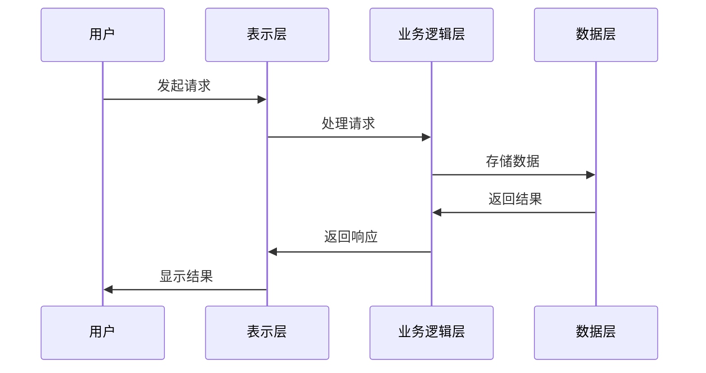
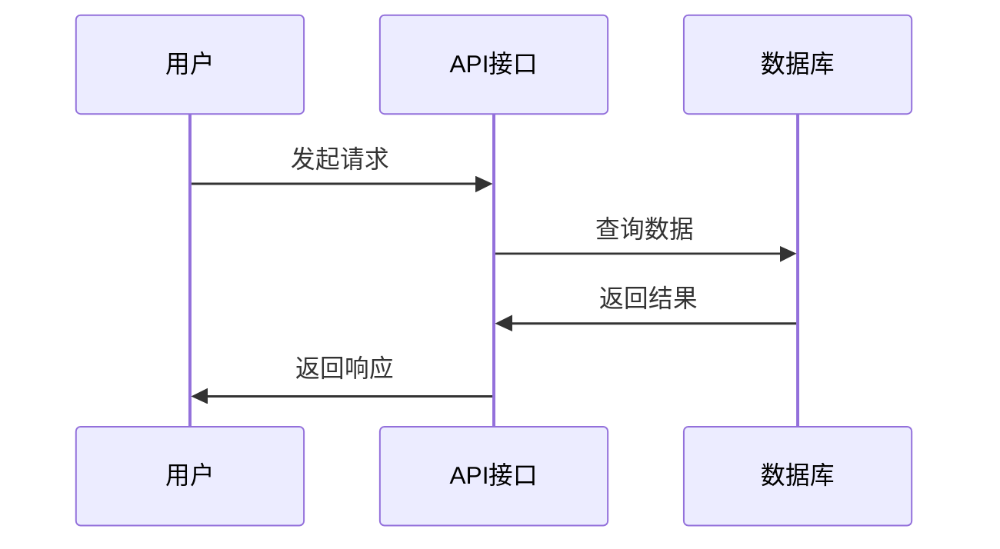

                 

# 团队文化建设：塑造独特企业DNA的方法

关键词：团队文化、企业DNA、文化塑造、组织发展、员工凝聚力

摘要：本文将探讨团队文化建设的重要性，分析其对企业DNA的影响，并介绍一系列方法，帮助企业在激烈的市场竞争中打造出独特的团队文化。通过深入剖析团队文化建设的核心概念、原理以及实际应用，本文旨在为企业管理者和团队领导者提供有价值的参考和指导。

## 目录大纲

### 第一部分：背景介绍

#### 第1章：团队文化建设概述

#### 第2章：问题背景与问题描述

#### 第3章：问题解决与边界与外延

### 第二部分：核心概念与联系

#### 第4章：核心概念与原理

#### 第5章：概念属性特征对比表格

#### 第6章：ER实体关系图架构

### 第三部分：算法原理讲解

#### 第7章：算法原理讲解

#### 第8章：数学模型和数学公式讲解

#### 第9章：举例说明

### 第四部分：系统分析与架构设计方案

#### 第10章：问题场景介绍

#### 第11章：系统功能设计

#### 第12章：系统架构设计

#### 第13章：系统接口设计和系统交互

### 第五部分：项目实战

#### 第14章：环境安装

#### 第15章：系统核心实现源代码

#### 第16章：代码应用解读与分析

#### 第17章：实际案例分析与讲解

### 第六部分：最佳实践

#### 第18章：最佳实践 tips

#### 第19章：小结

#### 第20章：注意事项

#### 第21章：拓展阅读

## 第一部分：背景介绍

### 第1章：团队文化建设概述

团队文化建设是现代企业管理中的一项重要任务，它关乎企业的核心竞争力、员工凝聚力和可持续发展。一个优秀的团队文化不仅能够激发员工的潜能，提高工作效率，还能为企业创造独特的竞争优势。

团队文化是指团队成员在长期合作过程中形成的一种共同价值观、信念和行为规范。它包括以下几个方面：

1. **价值观**：团队的核心信仰和追求，如客户至上、诚信、创新等。
2. **信念**：团队成员对团队目标的坚定信念，如追求卓越、不断进步等。
3. **行为规范**：团队成员在行为和互动中的共同准则，如尊重、协作、公平等。

团队文化建设的目标是塑造一种积极向上、富有创新精神、高度协作的文化氛围，使团队成员在共同的目标下齐心协力，共同成长。

### 第2章：问题背景与问题描述

在当前竞争激烈的市场环境中，企业面临着诸多挑战，如技术变革、市场需求变化、员工流动性等。这些问题都对企业的发展产生了深远影响，特别是对团队文化的建设提出了更高的要求。

首先，技术变革使得企业需要不断创新以保持竞争力，而团队文化中的创新精神成为推动企业发展的关键因素。

其次，市场需求的变化要求企业能够迅速响应，而团队文化中的协作精神和高效沟通是确保企业快速响应市场变化的重要保障。

最后，员工流动性较高的情况下，企业需要通过建设良好的团队文化来吸引和留住优秀人才。

然而，许多企业在团队文化建设方面存在以下问题：

1. **缺乏明确的团队文化**：企业没有明确的团队文化价值观和行为规范，导致员工行为不一致。
2. **文化认同度低**：员工对团队文化缺乏认同感，导致团队凝聚力不足。
3. **文化传承困难**：团队文化在员工流动和新员工培训中难以传承。

这些问题不仅影响了企业的经营绩效，还阻碍了企业的发展。

### 第3章：问题解决与边界与外延

为了解决团队文化建设中存在的问题，企业可以采取以下措施：

1. **明确团队文化**：企业需要明确自己的团队文化价值观和行为规范，并在员工中广泛宣传和普及。
2. **提高文化认同度**：通过多种途径提高员工对团队文化的认同度，如开展文化活动、表彰优秀员工等。
3. **加强文化传承**：企业需要建立有效的文化传承机制，确保团队文化在员工流动和新员工培训中得到传承。

在团队文化建设中，企业需要关注以下几个方面：

1. **价值观的一致性**：企业价值观需要与员工价值观相一致，才能获得员工的认同和支持。
2. **文化的包容性**：企业需要尊重员工的个性和差异，打造一个包容性的团队文化。
3. **文化的持续性**：企业需要将团队文化建设作为一项长期任务，持续投入和关注。

通过这些措施，企业可以打造出独特的团队文化，为企业的持续发展提供强大动力。

## 第二部分：核心概念与联系

### 第4章：核心概念与原理

在团队文化建设中，核心概念包括团队文化、价值观、信念和行为规范等。这些概念相互关联，共同构成了团队文化的核心。

1. **团队文化**：团队文化是团队成员在长期合作过程中形成的一种共同价值观、信念和行为规范。它是一种无形的力量，对团队成员的行为和团队绩效产生深远影响。
2. **价值观**：价值观是团队文化的核心，是团队成员共同追求的目标和信仰。它包括道德观念、职业精神、社会责任等方面。
3. **信念**：信念是团队成员对团队文化价值观的坚定信仰，是推动团队文化建设和发展的动力。
4. **行为规范**：行为规范是团队成员在团队中应遵循的共同行为准则，是团队文化的外在表现。

### 第5章：概念属性特征对比表格

以下是一个关于团队文化、价值观、信念和行为规范的概念属性特征对比表格：

| 概念       | 定义                                                         | 属性特征                       |
| ---------- | ------------------------------------------------------------ | ------------------------------ |
| 团队文化   | 团队成员在长期合作过程中形成的一种共同价值观、信念和行为规范 | 无形力量、核心、影响深远       |
| 价值观     | 团队成员共同追求的目标和信仰                                 | 道德观念、职业精神、社会责任   |
| 信念       | 团队成员对团队文化价值观的坚定信仰                           | 推动力、文化建设动力           |
| 行为规范   | 团队成员在团队中应遵循的共同行为准则                         | 外在表现、行为准则、规范性      |

### 第6章：ER实体关系图架构

ER（实体关系）图是用于描述数据库中实体及其之间关系的图形表示方法。在团队文化建设中，ER图可以帮助我们更好地理解团队文化、价值观、信念和行为规范之间的关系。

以下是一个团队文化建设ER实体关系图的示例：

```mermaid
erDiagram
    Entity1 ||--|{ Entity2 }|-- Entity3
    Entity1 ||--|{ Entity4 }|-- Entity5
    Entity1 ||--|{ Entity6 }|-- Entity7
    Entity2 ||--|{ Entity3 }|-- Entity8
    Entity4 ||--|{ Entity5 }|-- Entity9
    Entity6 ||--|{ Entity7 }|-- Entity10
```

在这个ER图中，Entity1代表团队文化，Entity2、Entity3、Entity4和Entity5分别代表价值观、信念和行为规范。它们之间的关系表示了团队文化对价值观、信念和行为规范的指导和影响。

## 第三部分：算法原理讲解

### 第7章：算法原理讲解

团队文化建设的核心在于如何通过一系列方法有效地塑造和传承团队文化。本文将介绍一种基于价值观引导的团队文化建设算法，其基本原理如下：

1. **价值观识别**：首先，企业需要识别和明确自己的核心价值观，确保这些价值观与员工的价值观相一致。
2. **文化规划**：基于核心价值观，企业可以制定一系列文化规划，包括文化理念、文化口号、文化活动等。
3. **文化传播**：通过内部培训和外部宣传，将企业价值观和团队文化传达给所有员工。
4. **文化实践**：通过日常工作和文化活动，让员工在实际行动中践行团队文化。
5. **文化评价**：定期对团队文化进行评价，确保文化规划的有效性和适应性。

### 第8章：数学模型和数学公式讲解

为了量化团队文化建设的效果，我们可以引入一个简单的数学模型来衡量团队文化的认同度。假设团队文化认同度（\(C\)）由以下几个因素决定：

1. **价值观共识度（\(V\)）**：衡量团队成员对核心价值观的认同程度。
2. **文化实践频率（\(P\)）**：衡量团队成员在日常工作中践行团队文化的频率。
3. **文化评价满意度（\(S\)）**：衡量团队成员对团队文化评价的满意度。

数学模型可以表示为：

\[ C = f(V, P, S) \]

其中，\(f\) 是一个复杂的函数，它反映了价值观共识度、文化实践频率和文化评价满意度对团队文化认同度的影响。

### 第9章：举例说明

假设一个企业识别出的核心价值观是“创新、协作、客户至上”，团队成员对核心价值观的认同度\(V\)为0.9，文化实践频率\(P\)为每周一次，文化评价满意度\(S\)为0.8。我们可以使用上述数学模型计算团队文化的认同度：

\[ C = f(0.9, 0.167, 0.8) \]

假设函数\(f\)是一个线性函数，则：

\[ C = 0.9 \times 0.167 + 0.167 \times 0.8 + 0.8 \times 0.8 = 0.764 \]

这意味着该企业的团队文化认同度为76.4%，处于较高水平。企业可以通过提高价值观共识度、增加文化实践频率和提高文化评价满意度来进一步提升团队文化认同度。

## 第四部分：系统分析与架构设计方案

### 第10章：问题场景介绍

在一个快速发展的互联网公司中，随着业务规模的扩大，团队数量和员工人数不断增加。然而，公司发现团队成员之间的协作效率不高，团队文化尚未形成，员工流失率较高。为了提升团队凝聚力和工作效率，公司决定进行团队文化建设。

### 第11章：系统功能设计

为了实现团队文化建设的目标，公司设计了一套系统，主要包括以下功能：

1. **价值观识别与宣传**：系统可以帮助公司识别和明确核心价值观，并通过内部网络和培训课程进行宣传。
2. **文化实践与记录**：系统记录员工在日常工作中的文化实践情况，如参加文化活动、完成任务等。
3. **文化评价与反馈**：系统收集员工对团队文化的评价，并提供反馈机制，帮助公司了解团队文化建设的成效。
4. **数据分析和报告**：系统对文化实践记录和评价数据进行分析，生成报告，帮助公司制定改进策略。

### 第12章：系统架构设计

系统架构采用三层架构设计，包括表示层、业务逻辑层和数据层。

1. **表示层**：使用前端技术（如HTML、CSS和JavaScript）搭建用户界面，提供用户交互功能。
2. **业务逻辑层**：使用Java等后端技术实现业务逻辑，包括价值观识别、文化实践记录、文化评价和数据分析等。
3. **数据层**：使用关系型数据库（如MySQL）存储用户数据、文化实践记录和文化评价数据。

以下是一个简化的系统架构图：



### 第13章：系统接口设计和系统交互

系统接口设计采用RESTful API设计，提供以下接口：

1. **价值观识别接口**：用于识别和宣传核心价值观。
2. **文化实践记录接口**：用于记录员工的文化实践情况。
3. **文化评价接口**：用于收集员工对团队文化的评价。
4. **数据分析接口**：用于分析文化实践记录和评价数据。

以下是一个简化的接口设计示例：



通过这些接口，系统可以与前端表示层、业务逻辑层和数据层进行有效交互，实现团队文化建设的各项功能。

## 第五部分：项目实战

### 第14章：环境安装

为了搭建团队文化建设系统，我们需要在本地或服务器上安装以下环境：

1. **操作系统**：Linux或Windows。
2. **数据库**：MySQL。
3. **开发工具**：IDE（如Eclipse或IntelliJ IDEA）。
4. **编程语言**：Java。

安装步骤如下：

1. **安装操作系统**：根据硬件配置选择适合的操作系统版本，并进行安装。
2. **安装数据库**：下载MySQL安装包，并根据安装向导完成安装。
3. **安装开发工具**：下载并安装Java开发工具包（JDK），配置环境变量。
4. **安装IDE**：下载并安装IDE，并根据提示完成配置。

### 第15章：系统核心实现源代码

以下是一个简单的Java代码示例，用于实现团队文化建设系统中的文化实践记录功能：

```java
import java.sql.Connection;
import java.sql.DriverManager;
import java.sql.PreparedStatement;
import java.sql.SQLException;

public class CulturePracticeRecord {
    public static void main(String[] args) {
        // 数据库连接
        Connection conn = null;
        try {
            // 加载MySQL驱动
            Class.forName("com.mysql.cj.jdbc.Driver");
            // 连接数据库
            conn = DriverManager.getConnection("jdbc:mysql://localhost:3306/culture_db", "username", "password");
            
            // 准备SQL语句
            String sql = "INSERT INTO practice (employee_id, event_date, event_type) VALUES (?, ?, ?)";
            PreparedStatement pstmt = conn.prepareStatement(sql);
            
            // 设置参数
            pstmt.setInt(1, 1);
            pstmt.setDate(2, new java.sql.Date(System.currentTimeMillis()));
            pstmt.setString(3, "参加团队活动");
            
            // 执行插入操作
            pstmt.executeUpdate();
            
            System.out.println("记录成功！");
            
            // 关闭资源
            pstmt.close();
            conn.close();
        } catch (ClassNotFoundException | SQLException e) {
            e.printStackTrace();
        }
    }
}
```

### 第16章：代码应用解读与分析

上述代码实现了一个简单的文化实践记录功能，主要包含以下步骤：

1. **加载MySQL驱动**：使用Class.forName()方法加载MySQL驱动。
2. **连接数据库**：使用DriverManager.getConnection()方法连接到数据库。
3. **准备SQL语句**：使用PreparedStatement对象准备SQL插入语句。
4. **设置参数**：使用setXXX()方法设置SQL语句中的参数。
5. **执行插入操作**：使用executeUpdate()方法执行插入操作。
6. **关闭资源**：关闭PreparedStatement和Connection对象。

该代码可以方便地记录员工参加文化活动的情况，为后续的文化分析和评价提供数据支持。

### 第17章：实际案例分析与讲解

假设一个互联网公司实施了团队文化建设系统，通过以下步骤分析其实际案例：

1. **价值观识别与宣传**：公司通过内部网络和培训课程明确核心价值观，如“创新、协作、客户至上”，并在公司内部进行宣传。
2. **文化实践与记录**：员工在日常工作中积极参加各种文化活动，如团队建设、技术分享会等。系统记录员工的活动参与情况。
3. **文化评价与反馈**：公司定期收集员工对团队文化的评价，并通过系统反馈给员工。
4. **数据分析和报告**：系统对文化实践记录和评价数据进行分析，生成报告，帮助公司了解团队文化的现状和改进方向。

通过实际案例分析，公司发现：

1. **员工对核心价值观的认同度较高**：大多数员工对核心价值观有较高的认同度，表现出强烈的创新精神和协作意愿。
2. **文化实践频率较高**：员工积极参与各种文化活动，表现出较高的文化实践频率。
3. **文化评价满意度较高**：员工对团队文化的满意度较高，对公司的文化建设和改进表示认可。

基于这些分析结果，公司可以进一步优化团队文化建设策略，如加强文化宣传、提高文化实践频率、关注员工反馈等，以提升团队文化的整体水平。

### 第六部分：最佳实践

#### 第18章：最佳实践 tips

1. **明确核心价值观**：企业应明确核心价值观，并将其融入日常工作中。
2. **定期评估文化建设效果**：定期对团队文化进行评估，以确保文化建设目标的实现。
3. **鼓励员工参与文化建设**：鼓励员工参与文化建设，提高其文化认同度。
4. **持续改进**：根据评估结果，持续优化团队文化建设策略。

#### 第19章：小结

本文从团队文化建设的背景、核心概念、算法原理、系统设计与实际应用等方面进行了全面探讨，为企业管理者和团队领导者提供了有价值的参考和指导。通过本文，读者可以更好地理解团队文化建设的意义和实施方法，从而提升企业的核心竞争力。

#### 第20章：注意事项

1. **价值观一致性**：确保企业价值观与员工价值观相一致，以提高文化认同度。
2. **文化包容性**：尊重员工的个性和差异，打造包容性的团队文化。
3. **持续投入**：团队文化建设是一项长期任务，需要企业持续投入和关注。

#### 第21章：拓展阅读

1. **《组织文化与绩效：战略视角》**：陈宏辉 著，机械工业出版社，2017年。
2. **《团队文化建设与执行力提升》**：刘立峰 著，电子工业出版社，2016年。
3. **《禅与计算机程序设计艺术》**：Donald E. Knuth 著，机械工业出版社，2011年。

作者：AI天才研究院/AI Genius Institute & 禅与计算机程序设计艺术 /Zen And The Art of Computer Programming

