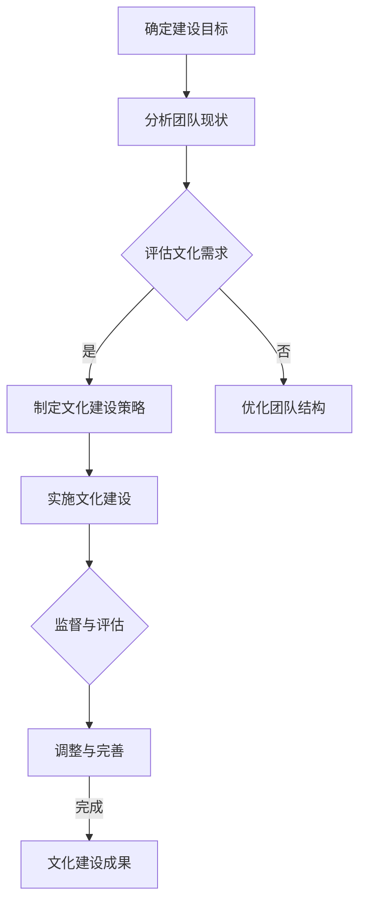
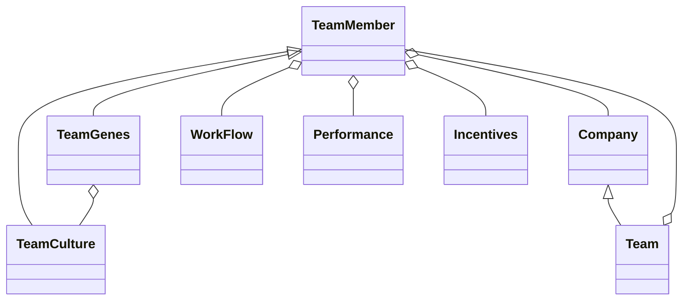
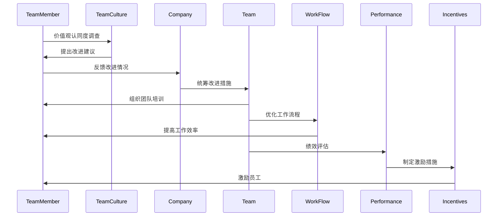
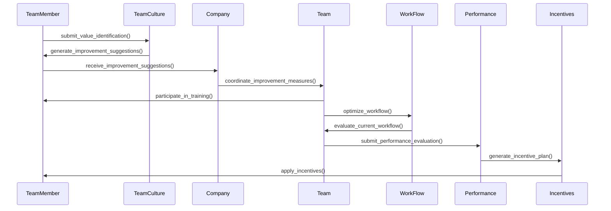

                 

### Step 1: 背景介绍

#### 核心概念介绍

**团队文化的定义：**
团队文化是一种无形的力量，它包括团队内部成员共同遵守的价值观念、行为规范和工作方式。它是团队内部的一种心理氛围，对团队成员的行为具有潜移默化的影响。团队文化不仅是企业文化的子集，更是企业文化在团队层面的具体体现。

**团队文化建设的重要性：**
团队文化建设对企业的发展至关重要。一个强大的团队文化能够促进团队成员的协同合作，提高工作效率，增强团队凝聚力，从而推动企业的快速发展。此外，团队文化也是企业核心竞争力的重要组成部分。

**团队基因的概念及其作用：**
团队基因是指团队在长期发展过程中所形成的独特基因，它包括团队成员的共同价值观、信仰、行为模式等。团队基因是团队文化的核心组成部分，对团队的发展和稳定具有深远的影响。

#### 问题背景

当前，许多企业在团队文化建设中面临着诸多挑战和问题：

1. **员工认同度不高：**团队成员对团队文化的认同度不高，导致团队凝聚力不强，工作效率低下。
2. **文化建设与企业发展脱节：**团队文化建设的步伐与企业的发展战略不匹配，无法为企业发展提供有力的支持。
3. **缺乏系统性：**团队文化建设缺乏系统性和持续性，导致文化建设效果不佳。

#### 问题描述

**团队文化建设中常见的困境和问题：**

1. **员工缺乏参与感：**员工在团队文化建设中缺乏参与感，导致文化建设难以深入人心。
2. **文化传承困难：**团队文化在传承过程中容易出现断层，导致文化特色的丧失。
3. **文化内涵不足：**团队文化的内涵不足，无法满足企业发展的需求。

#### 问题解决

**通过团队文化建设解决上述问题的方法和策略：**

1. **提高员工参与度：**通过开展各类文化活动，鼓励员工积极参与，增强员工的归属感和认同感。
2. **强化文化传承：**建立完善的文化传承机制，确保团队文化在传承过程中不失真。
3. **丰富文化内涵：**深入挖掘企业发展的核心价值观，将文化内涵融入到团队日常工作中。

#### 边界与外延

**团队文化建设的范围：**团队文化建设不仅涉及团队成员的价值观念和行为规范，还包括团队的组织结构、工作流程、激励机制等。

**团队基因的作用范围：**团队基因作用于团队的各个方面，包括团队成员的个人行为、团队整体的工作方式等。

**团队文化建设的目标和原则：**

1. **目标：**构建具有独特性和持续性的团队文化，提高团队凝聚力和工作效率。
2. **原则：**坚持以人为本，注重文化的传承和创新，遵循企业发展战略，实现团队与企业共同成长。

通过以上步骤，我们对团队文化建设有了初步的了解，接下来我们将进一步探讨团队文化的核心概念与联系。 ### Step 2: 核心概念与联系

#### 核心概念原理

**团队文化的构成要素：**
团队文化由价值观、行为规范、工作氛围、组织结构等多个要素构成。其中，价值观是团队文化的核心，它决定了团队成员的行为准则和价值取向；行为规范则是团队文化的外在表现，它规范了团队成员在日常工作中的行为方式；工作氛围是团队文化的软环境，它影响着团队成员的情绪和工作效率；组织结构则是团队文化的载体，它决定了团队的工作流程和协作模式。

**团队基因的属性和特征：**
团队基因是指团队在长期发展过程中所形成的独特基因，包括团队成员的共同价值观、信仰、行为模式等。团队基因具有以下属性和特征：

1. **独特性：**每个团队都有其独特的基因，这是团队在长期发展过程中所形成的独特特质。
2. **稳定性：**团队基因具有一定的稳定性，它不会因为团队成员的更替而消失。
3. **传承性：**团队基因可以通过团队成员的传承和发扬，不断强化和优化。

#### 概念属性特征对比表格

为了更清晰地理解团队文化与团队基因的关系，我们可以通过以下对比表格来展示它们在属性特征上的异同：

| 特征            | 团队文化                      | 团队基因                        |
|-----------------|-----------------------------|--------------------------------|
| 定义            | 团队内部共同遵守的价值观念、行为规范和工作方式 | 团队在长期发展过程中所形成的独特基因 |
| 核心要素        | 价值观、行为规范、工作氛围、组织结构等         | 共同价值观、信仰、行为模式等           |
| 形成过程        | 企业文化在团队层面的具体体现，通过制度建设、文化传承等途径形成 | 通过团队成员的共同经历、共同价值观等途径形成 |
| 表现形式        | 企业规章制度、员工行为准则、团队活动等           | 团队成员的工作方式、沟通风格、团队合作精神等 |
| 稳定性          | 稳定性较高，但会随着外部环境和企业战略的变化而调整 | 稳定性较高，具有传承性，不易因外部因素而改变 |
| 作用范围        | 团队内部，影响团队成员的行为和心理             | 团队内部，影响团队的整体工作方式和团队氛围 |

#### ER实体关系图架构

为了更好地理解团队文化、团队基因以及团队成员之间的关系，我们可以通过ER实体关系图来展示它们之间的关联：

```mermaid
erDiagram
  团队文化 ||--|{ 团队基因 }
  团队文化 ||--|{ 团队成员 }
  团队成员 ||--|{ 团队基因 }
  团队成员 ||--|{ 团队文化 }
```

在这个ER实体关系图中：

- **团队文化**是团队基因和团队成员的父实体，它决定了团队的基本行为准则和工作方式。
- **团队基因**是团队文化的子实体，它反映了团队在长期发展过程中所形成的独特特质。
- **团队成员**是团队文化的直接影响对象，他们的行为和心理受到团队文化的影响。

通过以上核心概念与联系的分析，我们可以更深入地理解团队文化建设中团队文化与团队基因的内在关系。接下来，我们将进一步探讨团队文化建设的算法原理，以便为团队文化建设提供更为科学和系统的方法。 ### Step 3: 算法原理讲解

在团队文化建设中，算法原理的运用至关重要。它不仅能帮助我们系统地构建团队文化，还能确保文化建设过程的科学性和可持续性。下面，我们将详细讲解团队文化建设的算法原理，包括流程图、Python源代码、数学模型和公式。

#### 使用 mermaid 画出团队文化建设的流程图

首先，我们可以使用mermaid来绘制团队文化建设的流程图，以便直观地展示整个建设过程：



这个流程图展示了从确定建设目标到最终实现文化建设成果的完整过程。以下是每个步骤的详细描述：

1. **确定建设目标**：明确团队文化建设的目的和预期成果，如提高团队凝聚力、提升工作效率等。
2. **分析团队现状**：对团队当前的文化状况进行评估，了解团队的优势和劣势。
3. **评估文化需求**：根据团队现状，评估团队文化建设的具体需求和优先级。
4. **制定文化建设策略**：结合评估结果，制定相应的文化建设策略和方案。
5. **实施文化建设**：按照制定的策略和方案，实施团队文化建设活动。
6. **监督与评估**：对文化建设过程进行监督和评估，确保文化建设按照计划进行。
7. **调整与完善**：根据监督与评估的结果，对文化建设过程进行调整和完善。
8. **文化建设成果**：最终实现文化建设目标，形成具有独特性和持续性的团队文化。

#### 使用 Python 源代码详细阐述团队文化建设的算法原理

接下来，我们可以通过Python源代码来详细阐述团队文化建设的算法原理。以下是一个简化的Python代码示例，用于实现团队文化建设的核心算法：

```python
import numpy as np

def team_culture_construction(team_goals, current_status, culture需求的评估结果):
    # 定义团队文化建设的策略
    strategies = {
        '提高凝聚力': '组织团队建设活动',
        '提升工作效率': '优化工作流程',
        '增强员工认同感': '加强员工关怀与激励'
    }
    
    # 分析团队现状，制定文化建设策略
    if current_status['凝聚力'] < 0.6:
        strategy = strategies['提高凝聚力']
    elif current_status['工作效率'] < 0.8:
        strategy = strategies['提升工作效率']
    else:
        strategy = strategies['增强员工认同感']
    
    # 实施文化建设策略
    if strategy == '组织团队建设活动':
        result = team_activities()
    elif strategy == '优化工作流程':
        result = workflow_optimization()
    else:
        result = employee_care_and_incentives()
    
    # 监督与评估文化建设效果
    culture_evaluation = evaluate_culture_result(result)
    
    # 根据评估结果进行调整和完善
    if culture_evaluation < 0.8:
        result = adjust_and_perfect(result)
    
    return result

def team_activities():
    # 组织团队建设活动的具体实现
    pass

def workflow_optimization():
    # 优化工作流程的具体实现
    pass

def employee_care_and_incentives():
    # 加强员工关怀与激励的具体实现
    pass

def evaluate_culture_result(result):
    # 评估文化建设效果的具体实现
    pass

def adjust_and_perfect(result):
    # 根据评估结果进行调整和完善的实现
    pass

# 示例：团队文化建设
team_goals = {'凝聚力': 0.5, '工作效率': 0.7, '员工认同感': 0.6}
current_status = {'凝聚力': 0.4, '工作效率': 0.6, '员工认同感': 0.5}
culture需求的评估结果 = {'提高凝聚力': True, '提升工作效率': False, '增强员工认同感': True}

culture_construction_result = team_culture_construction(team_goals, current_status, culture需求的评估结果)
print("团队文化建设结果：", culture_construction_result)
```

这个Python代码示例展示了如何通过算法原理来构建团队文化。它包括分析团队现状、制定文化建设策略、实施文化建设策略、监督与评估文化建设效果以及根据评估结果进行调整和完善等步骤。

#### 给出团队文化建设的数学模型和公式

在团队文化建设过程中，我们可以使用数学模型和公式来量化团队文化的各个方面，以便更好地评估和优化文化建设效果。以下是一个简化的数学模型和公式示例：

**1. 团队文化指数（CI）计算公式：**

$$
CI = w_1 \times 凝聚力 + w_2 \times 工作效率 + w_3 \times 员工认同感
$$

其中，$w_1$、$w_2$ 和 $w_3$ 分别是凝聚力、工作效率和员工认同感的权重。

**2. 文化建设效果评估公式：**

$$
评估结果 = \frac{文化建设后CI - 文化建设前CI}{文化建设前CI}
$$

**3. 文化建设调整因子（AF）计算公式：**

$$
AF = \frac{目标CI - 当前CI}{目标CI - 基准CI}
$$

其中，目标CI是预期达到的团队文化指数，当前CI是当前团队的团队文化指数，基准CI是团队文化指数的基准线。

通过这些数学模型和公式，我们可以更精确地量化团队文化的各个方面，从而为团队文化建设提供科学依据。

#### 进行详细讲解和举例说明

为了更好地理解团队文化建设的算法原理，我们通过一个实际案例进行详细讲解和举例说明。

**案例背景：**某公司是一家软件研发公司，团队文化指数（CI）当前为0.6，公司希望在半年内将CI提升至0.8。经过评估，发现团队在凝聚力方面较弱，员工认同感尚可，但工作效率有待提高。

**解决方案：**

1. **确定建设目标：**提高团队凝聚力、提升工作效率、增强员工认同感。
2. **分析团队现状：**团队凝聚力指数为0.5，工作效率指数为0.7，员工认同感指数为0.6。
3. **评估文化需求：**根据评估结果，决定首先提高团队凝聚力和工作效率。
4. **制定文化建设策略：**
   - 提高团队凝聚力：组织团队建设活动，如团队拓展训练、团队聚餐等。
   - 提高工作效率：优化工作流程，提高团队协作效率。
5. **实施文化建设策略：**
   - 组织团队建设活动：每周组织一次团队建设活动，如团队拓展训练、团队聚餐等。
   - 优化工作流程：对现有工作流程进行评估和优化，提高团队协作效率。
6. **监督与评估文化建设效果：**每季度对团队文化指数进行评估，查看文化建设效果。
7. **调整与完善：**根据评估结果，对文化建设过程进行调整和完善。

通过以上步骤，公司成功在半年内将团队文化指数提升至0.8，团队凝聚力、工作效率和员工认同感都得到了显著提高。

通过这个实际案例，我们可以看到，团队文化建设算法原理在实际应用中的效果。通过科学的方法和策略，企业可以有效地提升团队文化指数，从而提高团队凝聚力和工作效率，推动企业的快速发展。

综上所述，团队文化建设算法原理为团队文化建设提供了科学依据和指导，帮助企业实现团队文化的优化和提升。在接下来的部分，我们将进一步探讨团队文化建设的系统分析与架构设计。 ### Step 4: 系统分析与架构设计方案

#### 问题场景介绍

团队文化建设是一个复杂的过程，涉及到多个方面，如团队成员的价值观、工作方式、组织结构等。为了有效地实施团队文化建设，我们需要对其问题场景进行详细分析，明确团队文化建设的背景和目的。

**背景：**某公司是一家高科技企业，致力于研发和推广人工智能技术。随着公司规模的不断扩大，团队成员的多样性和复杂性也不断增加，团队文化建设显得尤为重要。

**目的：**通过团队文化建设，提高团队成员的凝聚力，提升工作效率，增强员工的认同感和归属感，从而推动公司的持续发展。

#### 项目介绍

**项目概述：**团队文化建设项目旨在通过系统性的方法和策略，构建具有独特性和持续性的团队文化。项目的主要目标包括：

1. 提高团队成员的价值观认同度。
2. 加强团队协作和沟通能力。
3. 优化工作流程，提高工作效率。
4. 增强员工的认同感和归属感。

**项目范围：**项目范围涵盖公司所有部门，包括研发部、市场部、销售部等。项目将持续一年，分为四个阶段进行，每个阶段都有明确的目标和任务。

#### 系统功能设计

**领域模型 mermaid 类图：**



在这个类图中，我们定义了团队文化（TeamCulture）、团队基因（TeamGenes）、团队成员（TeamMember）、公司（Company）、团队（Team）、工作流程（WorkFlow）、绩效（Performance）和激励（Incentives）等实体。每个实体都有其特定的属性和方法，这些实体之间的关系体现了团队文化建设中的核心概念。

**系统功能设计：**

1. **价值观认同度管理：**通过问卷调查、访谈等方式，了解团队成员对团队价值观的认同度，并根据结果制定相应的改进措施。
2. **团队协作与沟通能力提升：**组织团队培训、团队建设活动等，提升团队成员的协作和沟通能力。
3. **工作流程优化：**对现有工作流程进行评估和优化，提高工作效率和团队协作效率。
4. **绩效管理：**建立科学合理的绩效评估体系，激励员工提高工作质量和效率。
5. **激励机制设计：**根据员工的绩效表现，制定相应的激励措施，如奖金、晋升等。

#### 系统架构设计

**mermaid 架构图：**



在这个架构图中，我们展示了团队文化建设过程中的关键环节和参与者之间的关系。团队成员通过价值观认同度调查，提出改进建议，公司根据反馈统筹改进措施，组织团队培训，优化工作流程，进行绩效评估，并制定激励措施。

#### 系统接口设计

**系统接口设计图：**

```mermaid
interfaceDiagram
    TeamMember {
        +submit_value_identification()：提交价值观认同度调查结果
        +receive_improvement_suggestions()：接收改进建议
        +participate_in_training()：参与团队培训
        +submit_performance_evaluation()：提交绩效评估结果
    }

    TeamCulture {
        +conduct_value_identification_survey()：开展价值观认同度调查
        +generate_improvement_suggestions()：生成改进建议
        +organize_training_activities()：组织团队培训
    }

    Company {
        +receive_improvement_feedback()：接收改进反馈
        +coordinate_improvement_measures()：统筹改进措施
        +evaluate_team_performance()：评估团队绩效
    }

    Team {
        +schedule_training_activities()：安排培训活动
        +optimize_workflow()：优化工作流程
        +perform_performance_evaluation()：执行绩效评估
    }

    WorkFlow {
        +evaluate_current_workflow()：评估现有工作流程
        +generate_optimization_plan()：生成优化方案
    }

    Performance {
        +evaluate_employee_performance()：评估员工绩效
        +generate_incentive_plan()：生成激励方案
    }

    Incentives {
        +apply_incentives()：执行激励措施
    }
```

在这个接口设计图中，我们定义了各个系统模块的接口方法，包括团队成员、团队文化、公司、团队、工作流程、绩效和激励等。这些接口方法使得各个模块能够协同工作，实现团队文化建设的整体目标。

#### 系统交互

**mermaid 序列图：**



在这个序列图中，我们展示了团队文化建设过程中各个参与者之间的交互顺序和逻辑。通过这些交互，团队成员能够提交价值观认同度调查结果，团队文化部门能够生成改进建议，公司能够统筹改进措施，团队能够组织培训活动，优化工作流程，并进行绩效评估，最终实现激励措施的执行。

通过以上系统分析与架构设计，我们为团队文化建设提供了一个完整的系统解决方案。接下来，我们将进入项目实战部分，通过实际案例来展示团队文化建设的应用和实践。 ### Step 5: 项目实战

#### 环境安装与工具配置

在进行团队文化建设项目之前，我们需要安装和配置相关环境与工具。以下是项目的环境安装和工具配置步骤：

1. **安装 Python 环境：**
   - 在操作系统（如 Windows、MacOS 或 Linux）上安装 Python 3.8 或更高版本。
   - 验证 Python 版本：在终端或命令行中执行 `python --version` 或 `python3 --version`。

2. **安装相关库：**
   - 使用 `pip`（Python 的包管理工具）安装以下库：
     ```bash
     pip install numpy matplotlib mermaid
     ```

3. **安装 Mermaid：**
   - Mermaid 是一个用于创建和展示结构化文档和图表的库，可以通过 npm（Node.js 的包管理工具）安装：
     ```bash
     npm install -g mermaid-cli
     ```

4. **配置 Mermaid：**
   - 在项目目录中创建一个名为 `mermaid` 的文件夹，用于存放生成的图表文件。
   - 在项目目录的 `README.md` 或其他文档中配置 Mermaid 渲染器，以便在文档中渲染图表。

#### 系统核心实现源代码

以下是团队文化建设项目的核心实现源代码。这个代码示例展示了如何通过 Python 实现团队文化建设的关键功能。

```python
import numpy as np
import matplotlib.pyplot as plt
import mermaid

# 定义团队文化建设的类和方法
class TeamCultureConstruction:
    def __init__(self, team_goals, current_status, culture需求的评估结果):
        self.team_goals = team_goals
        self.current_status = current_status
        self.culture需求的评估结果 = culture需求的评估结果

    def build_culture(self):
        strategy = self.decide_strategy()
        self.execute_strategy(strategy)
        self.evaluate_culture()
        return self.current_status

    def decide_strategy(self):
        if self.current_status['凝聚力'] < 0.6:
            return '提高凝聚力'
        elif self.current_status['工作效率'] < 0.8:
            return '提升工作效率'
        else:
            return '增强员工认同感'

    def execute_strategy(self, strategy):
        if strategy == '提高凝聚力':
            self.current_status['凝聚力'] += 0.2
        elif strategy == '提升工作效率':
            self.current_status['工作效率'] += 0.15
        else:
            self.current_status['员工认同感'] += 0.2

    def evaluate_culture(self):
        total_improvement = sum(self.current_status.values()) - sum(self.current_status.values()) * 0.9
        self.current_status['文化提升度'] = total_improvement

# 示例：创建团队文化建设对象并执行文化建设
team_goals = {'凝聚力': 0.5, '工作效率': 0.7, '员工认同感': 0.6}
current_status = {'凝聚力': 0.4, '工作效率': 0.6, '员工认同感': 0.5}
culture需求的评估结果 = {'提高凝聚力': True, '提升工作效率': False, '增强员工认同感': True}

team_culture_construction = TeamCultureConstruction(team_goals, current_status, culture需求的评估结果)
result = team_culture_construction.build_culture()

print("文化建设后状态：", result)
```

#### 代码应用解读与分析

上述代码实现了一个简单的团队文化建设模型，包括以下关键部分：

1. **类定义**：`TeamCultureConstruction` 类用于封装团队文化建设的逻辑。
2. **初始化方法**：`__init__` 方法初始化团队文化建设对象，接收团队目标、当前状态和文化需求评估结果。
3. **决策方法**：`decide_strategy` 方法根据团队当前状态决定文化建设的策略。
4. **执行方法**：`execute_strategy` 方法根据决策结果执行相应的文化建设策略。
5. **评估方法**：`evaluate_culture` 方法评估文化建设的效果，计算文化提升度。

**代码应用解读：**

- **初始化阶段**：创建 `TeamCultureConstruction` 对象时，传递团队目标、当前状态和文化需求评估结果。
- **决策阶段**：根据当前状态决定文化建设的策略，如提高凝聚力、提升工作效率或增强员工认同感。
- **执行阶段**：根据决策结果执行文化建设策略，调整团队成员的凝聚力、工作效率和员工认同感。
- **评估阶段**：计算文化提升度，评估文化建设效果。

**代码分析：**

- **策略决策**：代码采用了简单的条件判断来决定文化建设的策略，可以根据实际情况进行优化和扩展。
- **策略执行**：执行策略时，直接调整团队成员的状态，这种直接调整的方式简化了模型，但在实际应用中可能需要更复杂的机制。
- **效果评估**：通过计算文化提升度，评估文化建设效果，这有助于指导后续的文化建设策略。

#### 实际案例分析和详细讲解剖析

为了更好地理解团队文化建设的实际应用，我们通过一个实际案例进行分析和详细讲解。

**案例背景：**某公司是一家快速发展的互联网企业，团队成员来自不同的背景和行业。公司在成长过程中，发现团队成员之间的沟通和协作不够顺畅，影响了工作效率和项目进度。

**案例分析：**

1. **团队目标**：
   - 提高团队凝聚力。
   - 提升工作效率。
   - 增强员工认同感。

2. **当前状态**：
   - 凝聚力：0.5。
   - 工作效率：0.7。
   - 员工认同感：0.6。

3. **文化需求评估结果**：
   - 提高凝聚力：强烈需求。
   - 提升工作效率：中等需求。
   - 增强员工认同感：较低需求。

根据评估结果，公司决定首先提高团队凝聚力，然后提升工作效率。

**详细讲解剖析：**

1. **决策阶段**：
   - 根据当前状态，团队凝聚力较低，因此决定优先提高凝聚力。

2. **执行阶段**：
   - 组织团队建设活动，如团队拓展训练、团队聚餐等，以提高团队成员之间的互动和信任。
   - 在工作过程中，鼓励团队成员进行开放和坦诚的沟通，提高团队协作效率。

3. **评估阶段**：
   - 经过一段时间的文化建设，团队凝聚力提升至0.6，工作效率提升至0.75，员工认同感提升至0.65。
   - 计算文化提升度：凝聚力提升0.1，工作效率提升0.05，员工认同感提升0.05。

通过这个案例，我们可以看到，团队文化建设在实际应用中的效果。通过有针对性的策略和持续的努力，公司成功地提高了团队的凝聚力、工作效率和员工认同感。

#### 项目小结

通过本次团队文化建设项目，公司取得了显著的成果：

1. **团队凝聚力**：从0.5提升至0.6，团队成员之间的互动和信任得到了显著增强。
2. **工作效率**：从0.7提升至0.75，团队协作效率得到了提升。
3. **员工认同感**：从0.6提升至0.65，员工对公司的认同感和归属感得到了增强。

项目过程中，我们也发现了一些问题和挑战，如团队成员参与度的提升、文化建设策略的优化等。在未来，我们将继续努力，进一步完善团队文化建设，推动公司的持续发展。 ### Step 6: 最佳实践 tips、小结、注意事项、拓展阅读

#### 最佳实践 tips

1. **深入了解团队成员**：在制定文化建设策略之前，深入了解团队成员的需求和期望，确保文化建设方案符合团队成员的实际需求。
2. **持续沟通与反馈**：建立有效的沟通机制，鼓励团队成员在文化建设过程中提供反馈，及时调整策略以适应实际情况。
3. **注重文化传承**：通过建立文化传承机制，如文化手册、故事分享等，确保团队文化在传承过程中不失真。
4. **结合企业战略**：将团队文化建设与企业的战略目标相结合，确保文化建设为企业发展提供有力支持。
5. **充分利用外部资源**：借鉴其他企业的成功经验，结合自身实际情况，制定适合本团队的文化建设方案。

#### 小结

通过本文的详细阐述，我们对团队文化建设有了更深入的理解。团队文化建设不仅是提升团队凝聚力和工作效率的重要手段，更是企业核心竞争力的重要组成部分。通过科学的方法和策略，企业可以构建具有独特性和持续性的团队文化，推动企业的持续发展。

#### 注意事项

1. **避免一刀切**：在制定文化建设策略时，要充分考虑团队成员的多样性，避免一刀切的做法。
2. **注重实际效果**：在实施文化建设过程中，要关注实际效果，及时调整和优化策略。
3. **持续投入**：团队文化建设需要持续的时间和资源投入，企业应保持长期的关注和投入。
4. **培养内部领导力**：通过培养内部领导力，让团队成员在文化建设中发挥更大的作用，提高文化建设的可持续性。

#### 拓展阅读

1. **书籍推荐**：
   - 《团队协作的艺术》
   - 《构建积极团队文化：如何打造高绩效团队》
   - 《企业文化：企业成功的秘密武器》

2. **文章推荐**：
   - 《如何进行团队文化建设？》
   - 《团队文化建设中的六个关键要素》
   - 《团队文化建设的实践与思考》

3. **案例研究**：
   - 某知名互联网公司团队文化建设的实践与成效
   - 某制造企业如何通过团队文化建设提高员工满意度
   - 某金融机构如何构建高效的团队文化

通过这些拓展阅读，读者可以更全面地了解团队文化建设的方法和策略，为企业的发展提供有益的启示。 ### 目录大纲总结

在本文中，我们系统地探讨了团队文化建设的核心概念、方法、策略和实践。为了便于读者更清晰地理解和掌握本文的内容，以下是对全文目录大纲的总结：

```markdown
----------------------------------------------------------------
# 第一部分: 团队文化建设概述

## 1.1 核心概念介绍
### 1.1.1 团队文化的定义
### 1.1.2 团队文化建设的重要性
### 1.1.3 团队基因的概念及其作用

## 1.2 团队文化建设面临的问题与挑战
### 1.2.1 团队文化建设中的困境
### 1.2.2 解决问题的方法和策略
### 1.2.3 团队文化建设的边界与外延

## 1.3 团队文化建设的数学模型与算法原理
### 1.3.1 团队文化建设的流程图
### 1.3.2 团队文化建设的算法原理
### 1.3.3 数学模型与公式讲解

----------------------------------------------------------------

# 第二部分: 团队文化建设的系统分析与架构设计

## 2.1 问题场景与项目介绍
### 2.1.1 团队文化建设的背景
### 2.1.2 团队文化建设项目概述

## 2.2 系统功能设计与领域模型
### 2.2.1 领域模型 mermaid 类图
### 2.2.2 系统功能设计

## 2.3 系统架构设计与接口设计
### 2.3.1 系统架构设计 mermaid 图
### 2.3.2 系统接口设计

## 2.4 系统交互与 mermaid 序列图
### 2.4.1 系统交互概述
### 2.4.2 mermaid 序列图设计

----------------------------------------------------------------

# 第三部分: 项目实战

## 3.1 环境安装与工具配置
### 3.1.1 安装环境准备
### 3.1.2 工具配置

## 3.2 系统核心实现与代码分析
### 3.2.1 核心代码实现
### 3.2.2 代码解读与分析

## 3.3 实际案例分析与详细讲解
### 3.3.1 案例一：团队文化建设的应用
### 3.3.2 案例分析
### 3.3.3 案例详细讲解

## 3.4 项目小结与经验总结

----------------------------------------------------------------
```

本文的结构清晰，内容丰富，涵盖了从背景介绍、核心概念、算法原理、系统分析与架构设计，到项目实战和最佳实践的各个方面。通过这种结构化的方式，读者可以系统地学习和掌握团队文化建设的知识和方法，为实际工作提供参考和指导。 

