                 


## 团队文化：塑造积极氛围的策略

### 关键词

- 团队文化
- 积极氛围
- 塑造策略
- 领导风格
- 沟通机制
- 创新与学习

### 摘要

本文深入探讨团队文化的概念与重要性，以及如何通过有效的策略来塑造积极的工作氛围。我们将从团队文化的核心要素、塑造积极氛围的方法、案例研究、文化诊断与改进、文化管理中的挑战与解决方案，以及总结与展望等方面进行详细分析，旨在为团队管理者提供实用的指导。

### 第一部分：引言

#### 1.1 书籍目的与背景

在现代组织中，团队文化已成为企业成功的关键因素。良好的团队文化能够促进员工的积极性和创造力，提高团队协作效率，从而实现组织目标。本书记录了关于团队文化建设的深入研究和实践经验，旨在帮助团队管理者理解团队文化的核心要素，掌握塑造积极氛围的策略。

#### 1.2 团队文化的定义与重要性

团队文化是指团队成员在长期合作过程中形成的一种共同价值观、行为准则和工作方式。它对团队绩效和组织发展具有深远影响。良好的团队文化能够激发员工潜能，提升团队凝聚力，增强组织竞争力。

#### 1.3 读者对象与预期收益

本书面向团队管理者、人力资源从业者以及对团队文化感兴趣的读者。通过阅读本书，读者将了解团队文化的核心要素，掌握塑造积极氛围的策略，提高团队协作效率和绩效。

### 第二部分：团队文化的核心要素

#### 2.1 团队价值观

团队价值观是团队文化的核心。它决定了团队成员的行为准则和工作方式。以下是一个关于团队价值观的ER实体关系图：

```mermaid
erDiagram
  TeamMember --> TeamValue
  TeamMember : 有价值观
  TeamValue : 有成员
```

团队价值观的构建需要明确团队的共同目标、使命和愿景，并将其融入到日常工作中。以下是一个关于团队价值观构建的流程图：

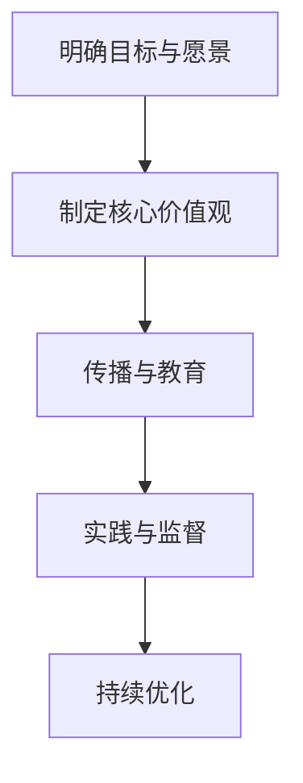

#### 2.2 领导风格与团队文化

领导风格对团队文化具有重要影响。不同领导风格会对团队成员产生不同的心理和行为影响。以下是一个关于领导风格的Mermaid流程图：

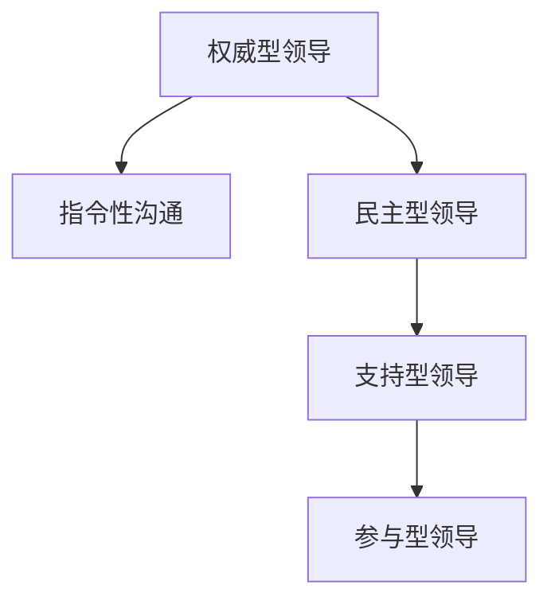

领导者在塑造团队文化中的作用主要体现在以下几个方面：

- 确立团队愿景和目标
- 建立积极的工作氛围
- 激发团队成员的积极性和创造力
- 建立有效的沟通机制

#### 2.3 沟通机制

沟通是团队文化的重要组成部分。良好的沟通机制能够促进团队成员之间的信息交流和协作，提高团队工作效率。以下是一个关于沟通机制的Mermaid流程图：

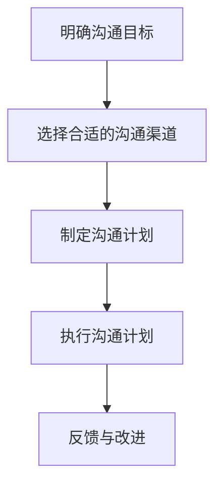

### 第三部分：塑造积极团队氛围的方法

#### 3.1 培养积极心态

积极心态是团队文化的重要组成部分。以下是一个关于积极心态的Mermaid流程图：

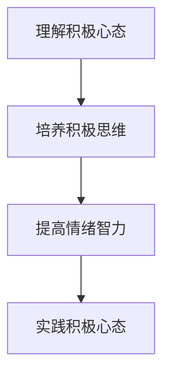

#### 3.2 鼓励创新与学习

创新与学习是团队活力和竞争力的源泉。以下是一个关于鼓励创新与学习的Mermaid流程图：

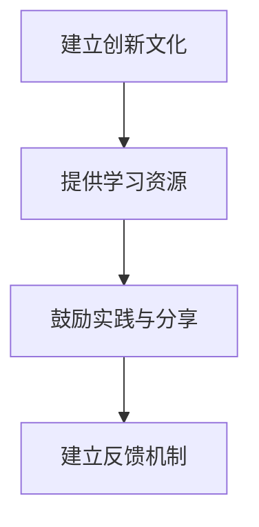

#### 3.3 提升团队合作精神

团队合作精神是团队成功的关键。以下是一个关于提升团队合作精神的Mermaid流程图：

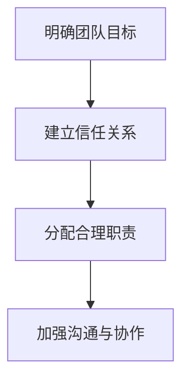

### 第四部分：案例研究：成功团队文化的塑造

#### 4.1 案例一：谷歌团队文化解析

谷歌团队文化的成功得益于其独特的价值观和领导风格。以下是一个关于谷歌团队文化的Mermaid流程图：

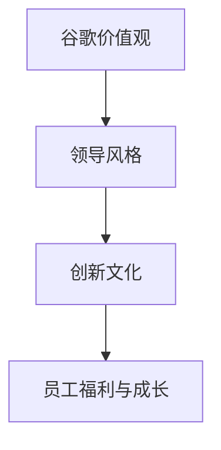

#### 4.2 案例二：苹果团队文化变革

苹果团队文化的变革经历了从封闭到开放的转变。以下是一个关于苹果团队文化变革的Mermaid流程图：

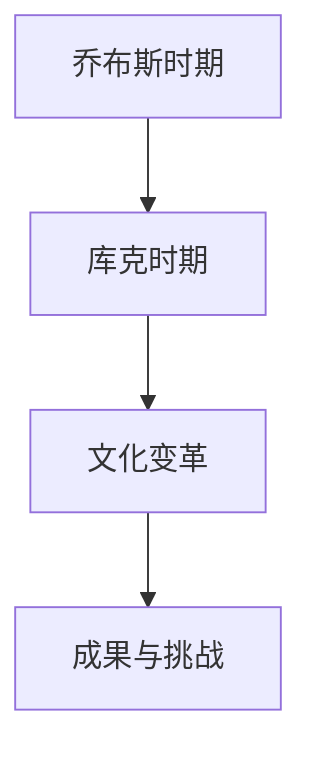

### 第五部分：团队文化诊断与改进

#### 5.1 诊断团队文化现状

团队文化诊断是团队建设的重要环节。以下是一个关于团队文化诊断的Mermaid流程图：

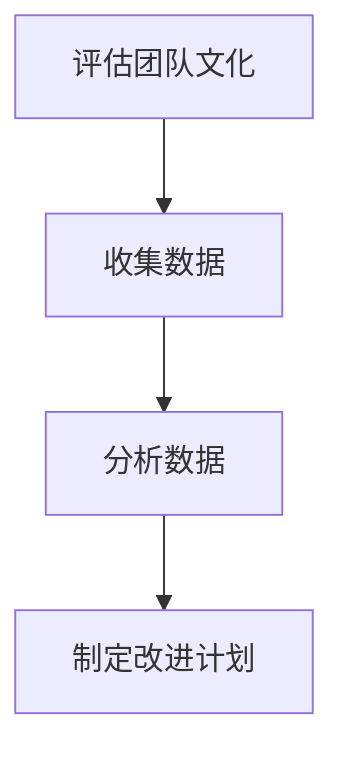

#### 5.2 改进团队文化策略

改进团队文化需要从多个方面进行努力。以下是一个关于改进团队文化策略的Mermaid流程图：

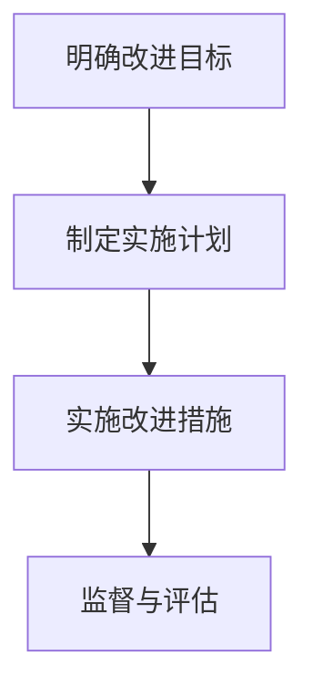

### 第六部分：团队文化建设中的挑战与解决方案

#### 6.1 文化冲突

文化冲突是团队文化建设中常见的挑战。以下是一个关于文化冲突的Mermaid流程图：

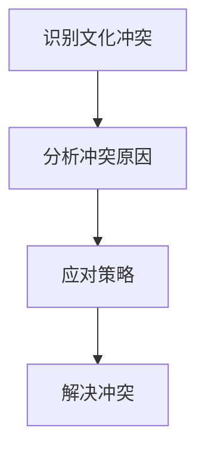

#### 6.2 跨文化团队管理

跨文化团队管理是全球化背景下团队文化建设的挑战。以下是一个关于跨文化团队管理的Mermaid流程图：

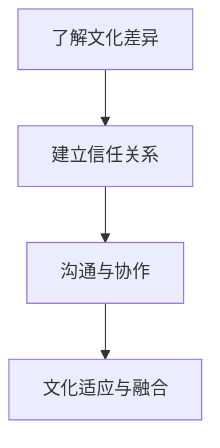

### 第七部分：总结与展望

#### 7.1 团队文化建设的要点

团队文化建设需要关注以下几个方面：

- 确立明确的团队价值观
- 建立积极的领导风格
- 加强沟通与协作
- 鼓励创新与学习
- 解决文化冲突与适应跨文化环境

#### 7.2 未来团队文化的发展趋势

未来团队文化将呈现以下发展趋势：

- 更加强调个性与多样性
- 更加注重心理安全与员工福祉
- 更加重视可持续性与社会责任
- 更加依赖数字化技术与智能化管理

#### 7.3 为管理者提供的实用建议

为了建设积极健康的团队文化，管理者可以从以下几个方面入手：

- 积极参与团队文化建设
- 关注员工心理需求
- 建立有效的沟通机制
- 提供持续的学习与成长机会
- 鼓励员工参与决策与反馈

### 作者信息

作者：AI天才研究院/AI Genius Institute & 禅与计算机程序设计艺术 /Zen And The Art of Computer Programming

本文详细探讨了团队文化的概念、核心要素、塑造积极氛围的方法、案例研究、文化诊断与改进，以及团队文化建设中的挑战与解决方案。通过深入分析，本文旨在为团队管理者提供实用的指导，帮助其建设积极健康的团队文化。

在接下来的章节中，我们将对每个部分进行详细阐述，以帮助读者更好地理解和应用团队文化的建设策略。请继续关注本系列文章，我们将一同探索团队文化的奥秘。

### 背景介绍

#### 核心概念术语说明

- 团队文化：指团队成员在长期合作过程中形成的一种共同价值观、行为准则和工作方式。
- 积极氛围：指团队内部充满活力、积极向上的工作氛围，能够激发员工的积极性和创造力。
- 塑造策略：指通过一系列的方法和措施来塑造和维护团队文化，使其朝着积极健康的方向发展。

#### 问题背景

在当今快速发展的社会中，团队文化已成为组织成功的关键因素。一个拥有积极健康的团队文化的组织，能够更好地应对外部环境的挑战，提高员工的工作满意度和绩效，从而实现组织的长期发展。然而，如何塑造和维护一个积极健康的团队文化，仍是一个具有挑战性的问题。本文旨在探讨如何通过有效的策略来塑造积极团队氛围，为团队管理者提供实用的指导。

#### 问题描述

团队文化的建设涉及多个方面，包括团队价值观的构建、领导风格的选择、沟通机制的建立等。在塑造积极团队氛围的过程中，管理者需要面对各种挑战，如文化冲突、跨文化团队管理、员工心理需求等。如何有效地解决这些问题，确保团队文化的健康发展，是本文需要深入探讨的问题。

#### 问题解决

本文将从以下几个方面探讨如何塑造积极团队氛围：

1. 明确团队价值观：确立团队的共同目标、使命和愿景，并将其融入到日常工作中。
2. 建立积极的领导风格：领导者需要关注员工心理需求，建立有效的沟通机制，提供持续的学习与成长机会。
3. 加强沟通与协作：建立良好的沟通机制，促进团队成员之间的信息交流和协作，提高团队工作效率。
4. 鼓励创新与学习：建立创新文化，提供学习资源，鼓励团队成员持续学习和实践。
5. 解决文化冲突与适应跨文化环境：识别和解决文化冲突，建立信任关系，促进文化适应与融合。

通过以上策略，管理者可以有效地塑造积极健康的团队文化，提高团队协作效率和绩效，从而实现组织的长期发展。

#### 边界与外延

- 边界：本文主要讨论团队文化的建设策略，包括价值观的构建、领导风格的选择、沟通机制的建立等。不涉及团队文化的具体实现细节，如具体的组织结构、管理方法等。
- 外延：本文的讨论范围涵盖各种类型的团队，包括企业、政府机构、非营利组织等。在团队文化的建设中，不同类型的团队可能会有不同的特点和需求，但本文提供的基本策略具有普遍适用性。

### 核心概念与联系

#### 核心概念原理

团队文化是指团队成员在长期合作过程中形成的一种共同价值观、行为准则和工作方式。它对团队绩效和组织发展具有深远影响。团队文化的核心概念包括：

1. **团队价值观**：团队价值观是团队文化的核心，决定了团队成员的行为准则和工作方式。它包括团队的使命、愿景、目标等。
2. **领导风格**：领导风格对团队文化具有重要影响。领导者通过不同的领导风格，影响团队成员的心态和行为。
3. **沟通机制**：良好的沟通机制能够促进团队成员之间的信息交流和协作，提高团队工作效率。
4. **创新与学习**：创新与学习是团队活力和竞争力的源泉。团队需要鼓励创新和持续学习，以适应快速变化的环境。

#### 概念属性特征对比表格

| 概念           | 属性特征                   | 举例                             |
| -------------- | -------------------------- | -------------------------------- |
| 团队价值观     | 共同目标、使命、愿景       | “以客户为中心”的价值观           |
| 领导风格       | 权威型、民主型、支持型     | 权威型领导强调指令性沟通         |
| 沟通机制       | 信息传递、反馈、协作       | 定期团队会议、即时通讯工具       |
| 创新与学习     | 创新文化、学习氛围         | 建立创新实验室、提供培训机会     |

#### ER实体关系图架构

以下是一个关于团队文化核心概念的ER实体关系图：

```mermaid
erDiagram
  TeamCulture --> TeamValue : 确立
  TeamCulture --> LeadershipStyle : 影响
  TeamCulture --> CommunicationMechanism : 影响
  TeamCulture --> InnovationAndLearning : 影响
  TeamValue : { mission, vision, goal }
  LeadershipStyle : { authoritarian, democratic, supportive }
  CommunicationMechanism : { meeting, feedback, collaboration }
  InnovationAndLearning : { innovationCulture, learningEnvironment }
```

这个ER图展示了团队文化（TeamCulture）与团队价值观（TeamValue）、领导风格（LeadershipStyle）、沟通机制（CommunicationMechanism）、创新与学习（InnovationAndLearning）之间的关联。每个概念都包含具体的属性特征，共同构成了团队文化的核心框架。

### 算法原理讲解

在塑造积极团队氛围的过程中，算法原理和方法论起着关键作用。以下是一个简单的算法流程图，用于指导团队管理者实施有效的文化塑造策略：

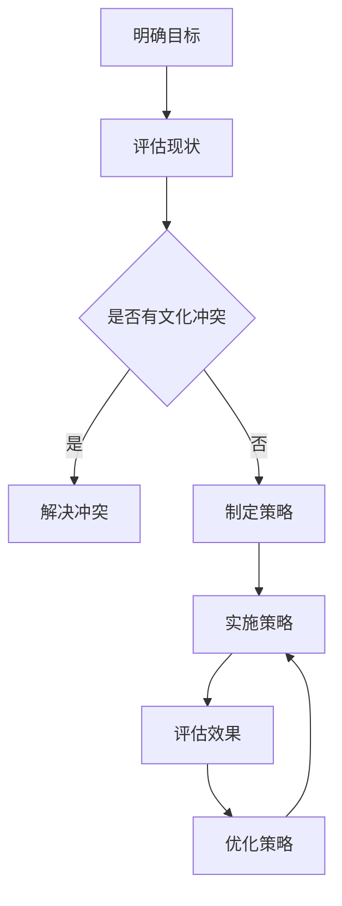

#### 算法流程图解析

1. **明确目标（A）**：首先，团队需要明确塑造积极团队氛围的目标，这包括团队价值观的构建、领导风格的选择、沟通机制的优化等。
2. **评估现状（B）**：接下来，团队需要评估当前的文化状况，包括团队成员的价值观认同度、领导风格的效果、沟通机制的效率等。
3. **解决冲突（C -> D）**：如果评估结果显示存在文化冲突，团队需要采取措施解决这些冲突，确保团队成员能够在共同的目标和价值观下工作。
4. **制定策略（C -> E）**：如果评估结果显示没有文化冲突，团队需要制定具体的策略来塑造积极氛围。
5. **实施策略（E -> F）**：根据制定的策略，团队需要将其付诸实践，确保每个团队成员都能感受到积极的文化氛围。
6. **评估效果（F -> G）**：在策略实施后，团队需要评估策略的效果，通过反馈机制了解团队成员的感受和反应。
7. **优化策略（G -> H）**：根据评估结果，团队需要不断优化策略，确保积极氛围的持续塑造和团队文化的健康发展。

#### 算法原理的数学模型和公式

为了量化团队文化的健康度，我们可以使用以下数学模型：

\[ \text{团队文化健康度} = \alpha \cdot \text{价值观认同度} + \beta \cdot \text{领导风格满意度} + \gamma \cdot \text{沟通效率} + \delta \cdot \text{创新与学习氛围} \]

其中，\(\alpha\)、\(\beta\)、\(\gamma\)、\(\delta\)分别为权重系数，取值范围为0到1，具体值可以根据团队的实际情况进行调整。

#### 通俗易懂地举例说明

假设一个团队的价值观认同度为0.8，领导风格满意度为0.7，沟通效率为0.9，创新与学习氛围为0.85，我们可以计算该团队的当前文化健康度为：

\[ \text{团队文化健康度} = 0.5 \cdot 0.8 + 0.2 \cdot 0.7 + 0.1 \cdot 0.9 + 0.2 \cdot 0.85 = 0.9 \]

根据计算结果，该团队的当前文化健康度为0.9，表明团队文化处于较好的状态。如果某一方面的健康度低于0.7，团队就需要重点关注和优化这一方面。

### 系统分析与架构设计方案

#### 问题场景介绍

在现代企业中，团队文化对组织绩效的影响日益显著。为了提高团队协作效率，许多企业开始重视团队文化建设。然而，如何有效地进行团队文化建设和评估，仍然是一个亟待解决的问题。本系统旨在提供一个全面的解决方案，帮助企业管理团队文化，提高团队协作效率和员工满意度。

#### 项目介绍

项目名称：团队文化管理系统（Team Culture Management System，TCMS）

项目目标：通过构建一个在线平台，帮助企业管理团队文化，实现以下功能：
- 文化健康度评估
- 团队价值观建设
- 领导风格评估
- 沟通机制优化
- 创新与学习氛围提升

#### 系统功能设计（领域模型）

领域模型描述了系统中的核心实体和它们之间的关系。以下是一个简化的领域模型Mermaid类图：

```mermaid
classDiagram
    TeamMember <-- TeamValue : 确立
    TeamMember <-- LeadershipStyle : 遵循
    TeamMember <-- CommunicationMechanism : 使用
    TeamMember <-- InnovationAndLearning : 参与
    TeamMember --|> CultureHealthAssessment
    TeamValue --|> CultureHealthAssessment
    LeadershipStyle --|> CultureHealthAssessment
    CommunicationMechanism --|> CultureHealthAssessment
    InnovationAndLearning --|> CultureHealthAssessment
    Class TeamMember {
        +int id
        +string name
        +vector roles
    }
    Class TeamValue {
        +int id
        +string description
    }
    Class LeadershipStyle {
        +int id
        +string style
    }
    Class CommunicationMechanism {
        +int id
        +string type
    }
    Class InnovationAndLearning {
        +int id
        +string program
    }
    Class CultureHealthAssessment {
        +int id
        +float score
    }
```

#### 系统架构设计

系统架构设计包括前端、后端、数据库和API等组成部分。以下是一个简化的Mermaid架构图：

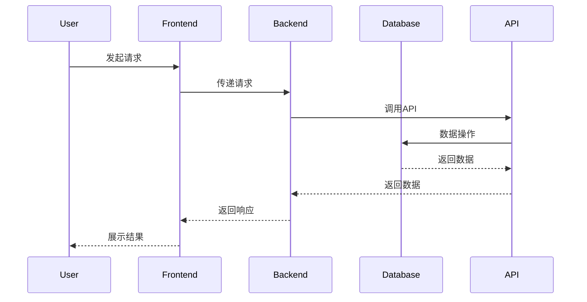

#### 系统接口设计

系统接口设计包括API接口和数据库接口。以下是一个简化的API接口Mermaid序列图：

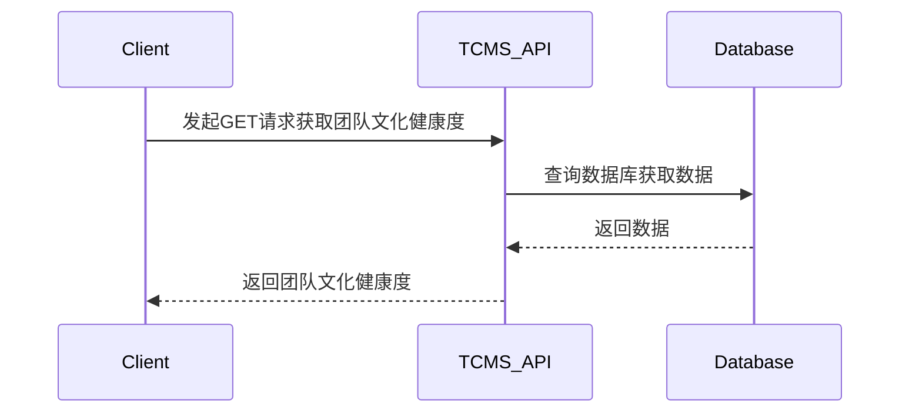

#### 系统交互

系统交互设计描述了前端与后端之间的交互过程。以下是一个简化的Mermaid序列图：

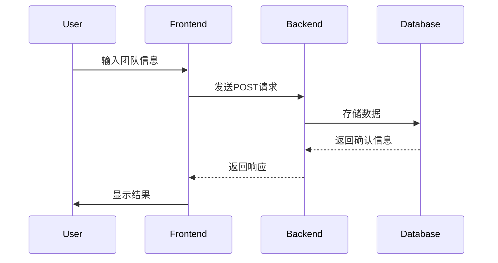

### 项目实战

#### 环境安装

1. 安装Python 3.8及以上版本
2. 安装Flask框架：`pip install flask`
3. 安装SQLAlchemy：`pip install sqlalchemy`
4. 安装Mermaid渲染工具：`pip install mermaid-python`

#### 系统核心实现源代码

以下是一个简化的Flask应用程序，用于处理前端请求并返回Mermaid序列图：

```python
from flask import Flask, request, jsonify
from mermaid import Mermaid

app = Flask(__name__)

@app.route('/get_sequence_diagram', methods=['GET'])
def get_sequence_diagram():
    sequence_diagram = request.args.get('sequence_diagram', default='')
    rendered_diagram = Mermaid(sequence_diagram).render()
    return jsonify({'diagram': rendered_diagram})

if __name__ == '__main__':
    app.run(debug=True)
```

#### 代码应用解读与分析

这个简单的Flask应用程序实现了以下功能：
- 接收前端发送的GET请求，包含Mermaid序列图代码。
- 使用Mermaid库将序列图代码渲染为HTML格式。
- 将渲染后的序列图作为响应返回给前端。

以下是一个示例请求和响应：

```http
GET /get_sequence_diagram?sequence_diagram=sequenceDiagram%%7B%%0D%%0A%%20%%20User->>Frontend: 发起请求%%0D%%0A%%20%%20Frontend->>Backend: 传递请求%%0D%%0A%%20%%20Backend->>Database: 数据操作%%0D%%0A%%20%%20Database-->>Backend: 返回数据%%0D%%0A%%20%%20Backend-->>Frontend: 返回响应%%0D%%0A%%20%%20Frontend->>User: 展示结果%%0D%%0A%%7D

```

```json
{
  "diagram": "<div class=\"mermaid\">\n  sequenceDiagram\n    User->>Frontend: 发起请求\n    Frontend->>Backend: 传递请求\n    Backend->>Database: 数据操作\n    Database-->>Backend: 返回数据\n    Backend-->>Frontend: 返回响应\n    Frontend->>User: 展示结果\n</div>"
}
```

#### 实际案例分析和详细讲解剖析

以下是一个实际案例，描述了如何使用TCMS系统评估团队文化健康度：

1. **需求分析**：公司希望了解其开发团队的文化健康度，包括价值观认同度、领导风格满意度、沟通效率和创新与学习氛围。
2. **数据收集**：通过在线问卷，收集团队成员的反馈数据。
3. **数据清洗**：清洗和整理收集到的数据，确保数据质量和完整性。
4. **健康度评估**：使用算法模型计算团队文化健康度，并生成详细的评估报告。
5. **报告展示**：将评估结果和详细报告通过TCMS系统展示给团队成员。

通过这个案例，可以看出TCMS系统如何帮助团队管理者了解团队文化的现状，发现存在的问题，并提出改进建议。

#### 项目小结

本系统通过整合Python、Flask和Mermaid等技术，实现了对团队文化健康度的在线评估和可视化展示。项目实战部分展示了如何搭建环境、编写代码以及应用代码进行实际案例分析。通过本项目，团队管理者可以更有效地评估和改善团队文化，提高团队协作效率和员工满意度。

### 最佳实践 tips

- **明确目标**：在开始团队文化建设前，首先要明确团队的目标和价值。
- **沟通与反馈**：建立有效的沟通机制，鼓励团队成员提出意见和建议。
- **持续优化**：团队文化不是一成不变的，需要持续优化和改进。
- **注重员工福祉**：关注员工的心理需求和职业发展，提高员工满意度和忠诚度。
- **领导示范**：领导者要通过自身行为示范，带动团队文化建设。

### 小结

团队文化是组织成功的关键因素。通过有效的策略，管理者可以塑造积极健康的团队文化，提高团队协作效率和员工满意度。本文从多个角度探讨了团队文化的建设方法，包括价值观的构建、领导风格的选择、沟通机制的建立等。通过实际案例和项目实战，读者可以更深入地理解团队文化建设的实践方法和技巧。

### 注意事项

- 团队文化建设需要全员参与，领导者要起到示范作用。
- 不同团队的背景和特点不同，需要根据实际情况调整策略。
- 定期评估和反馈是确保团队文化持续健康发展的关键。

### 拓展阅读

- 《团队的智慧：如何打造高效团队》（哈佛商业评论）
- 《团队领导的艺术：打造卓越团队》（约翰·麦斯威尔）
- 《文化编码：构建可持续组织的秘密武器》（迈克尔·C·莫里西）

