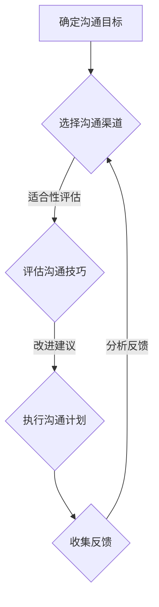
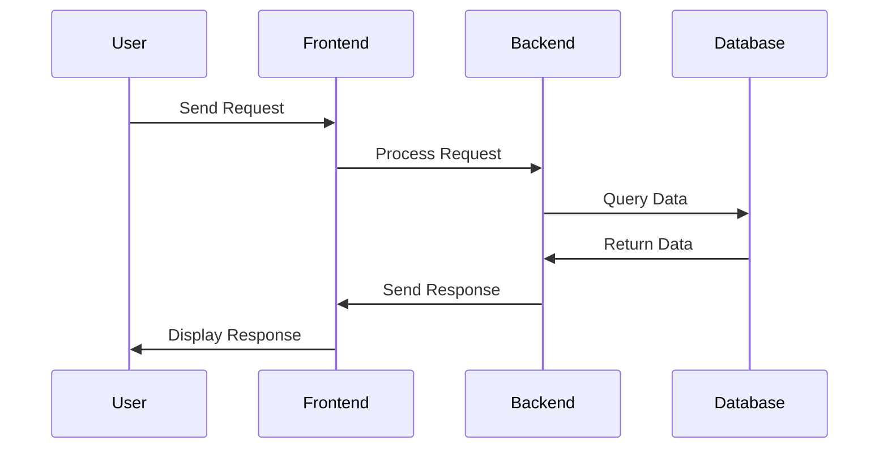
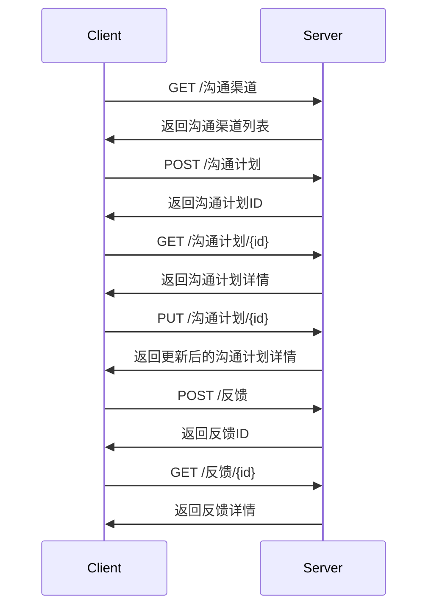

                 

# 团队沟通优化：消除沟通障碍的技巧

## 关键词：团队沟通、沟通障碍、沟通技巧、沟通优化

> 摘要：本文旨在探讨团队沟通优化的重要性和方法，从基础概念、沟通障碍的识别与消除、以及实际案例分析等方面，提供了一套系统化的团队沟通优化策略。通过深入分析沟通的各个层面，本文为IT领域的企业和团队提供了一套实用的沟通优化方案，帮助团队成员提高沟通效率，降低误解和冲突，从而提升整体团队的工作绩效。

---

## 第一部分：团队沟通基础

### 第1章：团队沟通概述

#### 1.1 沟通的重要性

在现代社会，沟通是任何团队成功运作的关键因素。无论是IT企业还是其他行业，团队沟通的重要性不言而喻。有效的沟通不仅能够提高团队成员之间的协作效率，还能增强团队的凝聚力和创新力。然而，沟通并非易事，特别是在复杂的IT环境中，沟通障碍层出不穷。

#### 1.2 团队沟通的目标

团队沟通的目标包括但不限于：确保信息的准确传递、促进团队成员之间的理解和协作、激发团队的创造力和创新能力、解决冲突、提高决策质量等。明确沟通目标对于团队沟通的优化至关重要。

#### 1.3 团队沟通的类型与特点

团队沟通可以分为正式沟通和非正式沟通。正式沟通通常通过会议、报告、电子邮件等方式进行，特点是正式、系统、结构化。非正式沟通则主要通过非正式的交流方式，如聊天、社交活动等，特点是自由、灵活、快速。

#### 1.4 团队沟通的障碍

团队沟通的障碍主要包括：语言障碍、文化差异、误解、缺乏有效的沟通渠道、沟通频率不合适等。识别和解决这些障碍是团队沟通优化的关键。

### 第2章：沟通技能提升

#### 2.1 倾听技巧

倾听是沟通的基石。有效的倾听不仅能够确保信息的准确传递，还能增强团队成员之间的信任和理解。倾听技巧包括专注倾听、理解对方的观点、反馈等。

#### 2.2 演讲与表达

清晰的演讲与表达是有效沟通的必要条件。演讲技巧包括：明确沟通目标、结构化表达、使用生动的例子等。

#### 2.3 提问技巧

提问是获取信息的重要方式。有效的提问能够引导对话，激发对方的思考，从而提高沟通效率。提问技巧包括：开放性问题、封闭性问题、引导性问题等。

#### 2.4 非语言沟通

非语言沟通在团队沟通中同样重要。非语言沟通包括肢体语言、面部表情、语调等，它们能够传达信息、表达情感、增强沟通效果。

---

## 第二部分：解决团队沟通问题

### 第3章：消除沟通障碍

#### 3.1 沟通障碍的原因分析

要解决沟通障碍，首先需要分析其产生的原因。常见的沟通障碍原因包括：信息过载、信息误解、缺乏有效的沟通机制、团队成员之间的信任不足等。

#### 3.2 消除语言障碍

语言障碍是团队沟通中常见的问题。消除语言障碍的方法包括：使用简明的语言、提供详细的解释、确保信息的准确性等。

#### 3.3 消除文化差异

文化差异可能导致团队成员之间的误解和冲突。消除文化差异的方法包括：尊重不同的文化习惯、了解对方的文化背景、进行跨文化培训等。

#### 3.4 消除误解

误解是团队沟通中的常见问题。消除误解的方法包括：主动沟通、澄清误解、寻求共识等。

### 第4章：改善沟通方式

#### 4.1 有效的沟通渠道选择

选择合适的沟通渠道能够提高沟通效率。有效的沟通渠道包括：电子邮件、即时通讯工具、面对面会议等。

#### 4.2 沟通频率与节奏

沟通的频率与节奏对于团队沟通的效果有很大影响。合适的沟通频率和节奏能够确保信息的及时传递，同时避免信息过载。

#### 4.3 团队沟通会议的优化

团队沟通会议是团队沟通的重要方式。优化团队沟通会议的方法包括：明确会议目标、准备充分、控制会议时间等。

#### 4.4 跨部门沟通

跨部门沟通是团队沟通中的一大挑战。有效的跨部门沟通能够提高整体团队的协作效率。跨部门沟通的方法包括：建立跨部门沟通渠道、明确跨部门沟通的目标和责任、定期组织跨部门会议等。

---

## 第三部分：实践与案例分析

### 第5章：团队沟通实践

#### 5.1 团队沟通计划

制定团队沟通计划是团队沟通优化的第一步。团队沟通计划包括：确定沟通目标、选择沟通渠道、制定沟通频率和时间表等。

#### 5.2 沟通反馈机制

建立有效的沟通反馈机制能够帮助团队及时发现问题并进行改进。沟通反馈机制包括：定期收集团队成员的反馈、分析反馈并提出改进措施、持续优化沟通方式等。

#### 5.3 团队沟通评估与改进

团队沟通评估与改进是团队沟通优化的持续过程。通过定期评估团队沟通的效果，识别存在的问题，并采取相应的改进措施，能够不断提高团队沟通的质量和效率。

### 第6章：案例分析

#### 6.1 成功的团队沟通案例

通过分析成功的团队沟通案例，我们可以学习到一些实用的沟通技巧和策略。成功的团队沟通案例包括：高效的项目团队、跨部门合作的典范等。

#### 6.2 失败的团队沟通案例分析

失败的团队沟通案例分析有助于我们了解沟通障碍的原因，并从中吸取教训。失败的团队沟通案例包括：沟通不足导致的团队分裂、误解引发的冲突等。

#### 6.3 案例启示与总结

通过案例分析和启示，我们可以总结出一些有效的团队沟通原则和方法，如：尊重对方、明确沟通目标、选择合适的沟通渠道等。

### 第7章：团队沟通的未来发展趋势

#### 7.1 新技术对团队沟通的影响

随着新技术的不断发展，团队沟通的方式也在不断变革。新技术如即时通讯工具、视频会议系统、人工智能等对团队沟通产生了深远的影响。

#### 7.2 智能化沟通工具的应用

智能化沟通工具如聊天机器人、智能会议系统等正在逐渐应用于团队沟通中，提高了沟通的效率和质量。

#### 7.3 未来团队沟通的发展趋势

未来团队沟通的发展趋势包括：更加智能化、个性化、高效化。通过采用新技术和优化沟通方式，团队沟通将更加便捷、灵活、高效。

---

## 附录

### 附录A：常用沟通技巧与工具

附录A提供了常用的沟通技巧和工具，如倾听技巧、演讲技巧、提问技巧等，以及常用的沟通工具，如电子邮件、即时通讯工具等。

### 附录B：团队沟通练习题

附录B提供了团队沟通练习题，包括案例分析、角色扮演等，旨在帮助团队成员提高沟通技能。

### 附录C：参考文献

附录C列出了本文引用的主要参考文献，包括学术文章、专业书籍等，为读者提供进一步的学习资源。

---

作者：AI天才研究院/AI Genius Institute & 禅与计算机程序设计艺术 /Zen And The Art of Computer Programming

---

通过本文的讨论，我们系统地介绍了团队沟通优化的重要性、方法、实践和案例分析。希望通过本文的分享，能够帮助IT领域的团队和企业在沟通方面取得更好的效果，提升团队的工作绩效。

## 背景介绍

### 核心概念术语说明

在探讨团队沟通优化之前，我们有必要对一些核心概念进行清晰的定义和解释。这些术语包括：

- **沟通**：沟通是指信息的传递和交流，它可以是口头的，书面的，或非语言的。
- **团队沟通**：团队沟通是团队成员之间、团队与其他团队之间以及团队与组织外部之间的信息交换。
- **沟通障碍**：沟通障碍是指在信息传递过程中出现的各种问题，如误解、信息失真、语言障碍等。
- **沟通技巧**：沟通技巧是指为了提高沟通效果而采取的各种方法和策略。

### 问题背景

在IT行业，随着项目的复杂度和团队规模的增长，沟通问题变得越来越突出。团队成员之间的沟通不畅可能导致项目进度延误、质量下降，甚至团队内部矛盾加剧。因此，如何优化团队沟通成为企业关注的焦点。

### 问题描述

问题描述包括以下几个方面：

1. **信息传递不畅**：团队成员之间缺乏有效的沟通渠道，导致信息传递不及时、不准确。
2. **文化差异**：全球化背景下的IT企业往往有来自不同国家和文化背景的员工，文化差异可能导致沟通障碍。
3. **误解与冲突**：由于缺乏有效的沟通，团队成员之间容易产生误解，进而引发冲突。
4. **沟通技巧不足**：许多团队成员在沟通技巧方面存在不足，导致沟通效果不佳。

### 问题解决

解决上述问题需要从多个方面进行优化：

1. **建立有效的沟通渠道**：通过多种沟通工具和渠道，如电子邮件、即时通讯、面对面会议等，确保信息传递的及时性和准确性。
2. **提升沟通技巧**：通过培训和实践，提高团队成员的沟通技巧，包括倾听技巧、表达技巧、提问技巧等。
3. **消除文化差异**：通过跨文化培训和文化交流活动，增强团队成员之间的理解和尊重。
4. **建立沟通反馈机制**：通过定期的沟通反馈，及时识别和解决问题，持续优化沟通方式。

### 边界与外延

团队沟通优化不仅涉及团队内部，还包括团队与其他团队、团队与组织外部的沟通。此外，沟通优化是一个持续的过程，需要不断地进行调整和改进。

### 概念结构与核心要素组成

团队沟通优化的概念结构包括以下核心要素：

1. **沟通目标**：明确团队沟通的目标，确保沟通的方向和效果。
2. **沟通渠道**：选择合适的沟通渠道，提高信息传递的效率。
3. **沟通技巧**：提高团队成员的沟通技巧，确保沟通的准确性和有效性。
4. **沟通反馈**：建立沟通反馈机制，及时发现和解决问题。

通过上述核心要素的有机组合，团队沟通优化能够有效提高团队的工作绩效和整体效率。

### 核心概念与联系

在团队沟通优化中，几个核心概念扮演着至关重要的角色。首先，我们需要明确沟通的本质。沟通不仅仅是指信息的传递，更包括信息的理解和共享。这一核心概念可以归纳为：

- **沟通的本质**：信息的传递、理解和共享。

为了更好地理解这一概念，我们可以将其属性特征进行对比，如表1所示。

| 属性特征          | 信息的传递 | 理解的信息 | 共享的信息 |
|-------------------|-------------|-------------|-------------|
| 目的性            | 确保信息到达 | 确保信息被正确理解 | 确保信息被共同接受 |
| 双向性            | 单向传递 | 双向互动 | 双向互动 |
| 有效性            | 信息准确传递 | 信息正确理解 | 信息共同认可 |

接下来，我们通过ER实体关系图架构来展示这些概念之间的关系，如图1所示。

```mermaid
erDiagram
  Communication <<|-- Information
  Communication ||--|{ Understanding }
  Communication ||--|{ Sharing }
```

图1：团队沟通优化的ER实体关系图

在图1中，`Communication`（沟通）是核心实体，它与其他实体如`Information`（信息）、`Understanding`（理解）和`Sharing`（共享）之间存在紧密的联系。这种关系图帮助我们清晰地看到沟通过程中的各个环节，以及它们之间的相互影响。

### 算法原理讲解

在团队沟通优化中，算法原理的应用至关重要。以下是一个简单的算法流程图，用于优化团队沟通。



图2：团队沟通优化算法流程图

#### 算法流程解释：

1. **确定沟通目标**：明确团队沟通的目标，如确保项目进度、提升团队协作等。
2. **选择沟通渠道**：根据沟通目标选择合适的沟通渠道，如面对面会议、电子邮件、即时通讯等。
3. **评估沟通技巧**：对团队成员的沟通技巧进行评估，识别存在的不足，并提供改进建议。
4. **执行沟通计划**：根据评估结果，制定并执行沟通计划。
5. **收集反馈**：执行沟通计划后，收集团队成员的反馈，了解沟通的效果和存在的问题。
6. **分析反馈**：对收集到的反馈进行分析，识别改进的机会。

#### 算法原理的数学模型和公式：

为了量化沟通优化的效果，我们可以使用以下数学模型：

$$
\text{沟通优化效果} = \frac{\text{目标达成度} + \text{问题解决度} + \text{团队协作度}}{3}
$$

其中：

- **目标达成度**：衡量沟通计划是否达到预期目标。
- **问题解决度**：衡量沟通过程中问题解决的效率。
- **团队协作度**：衡量团队协作的效果。

通过这个模型，我们可以对团队沟通进行量化评估，从而找出优化的方向。

#### 举例说明：

假设一个项目团队在沟通优化过程中，目标达成度为90%，问题解决度为85%，团队协作度为88%，则沟通优化效果为：

$$
\text{沟通优化效果} = \frac{0.9 + 0.85 + 0.88}{3} = 0.877
$$

这意味着团队沟通优化效果较好，但仍有一些改进的空间。

### 系统分析与架构设计方案

#### 问题场景介绍

在一家大型IT企业中，由于项目复杂度高、团队规模大，团队沟通不畅的问题日益突出。团队成员之间信息传递不及时、不准确，导致项目进度延误，团队内部矛盾加剧。为了解决这一问题，企业决定优化团队沟通。

#### 项目介绍

项目名称：团队沟通优化系统
项目目标：提高团队沟通效率，减少误解和冲突，提升项目整体绩效。
项目范围：覆盖企业内部所有项目团队，包括开发、测试、产品管理等。

#### 系统功能设计

系统功能设计包括以下几个方面：

1. **沟通渠道管理**：提供多种沟通渠道，如即时通讯、邮件、公告板等，方便团队成员之间进行信息交流。
2. **沟通计划与跟踪**：制定沟通计划，并实时跟踪沟通进度，确保沟通目标得到落实。
3. **沟通技巧培训**：提供在线沟通技巧培训，帮助团队成员提升沟通能力。
4. **反馈机制**：建立反馈机制，收集团队成员的反馈，及时解决问题。

#### 系统架构设计

系统架构设计采用分层架构，如图3所示。



图3：系统架构设计

- **前端**：负责用户界面展示，包括沟通渠道选择、沟通计划制定、反馈提交等。
- **后端**：负责处理用户请求、数据存储、数据查询等。
- **数据库**：存储用户信息、沟通记录、反馈数据等。

#### 系统接口设计和系统交互

系统接口设计采用RESTful API，如图4所示。



图4：系统接口设计

- **GET /沟通渠道**：获取所有可用的沟通渠道。
- **POST /沟通计划**：创建新的沟通计划。
- **GET /沟通计划/{id}**：获取指定ID的沟通计划详情。
- **PUT /沟通计划/{id}**：更新指定ID的沟通计划。
- **POST /反馈**：提交反馈。
- **GET /反馈/{id}**：获取指定ID的反馈详情。

通过上述接口设计，系统实现了对团队沟通的全生命周期管理。

### 项目实战

#### 环境安装

1. **安装后端框架**：选择Python的Flask框架进行后端开发。
2. **安装数据库**：使用MySQL作为数据库存储。
3. **安装前端框架**：选择Vue.js作为前端开发框架。

#### 系统核心实现源代码

以下是系统核心实现的源代码片段：

```python
# 后端：Flask框架
from flask import Flask, jsonify, request

app = Flask(__name__)

@app.route('/沟通渠道', methods=['GET'])
def get_communication_channels():
    # 获取所有沟通渠道
    channels = ['即时通讯', '电子邮件', '公告板']
    return jsonify(channels)

@app.route('/沟通计划', methods=['POST'])
def create_communication_plan():
    # 创建沟通计划
    plan_data = request.get_json()
    # 存储沟通计划到数据库
    # ...
    return jsonify({'plan_id': 1, 'status': 'success'})

@app.route('/沟通计划/<int:plan_id>', methods=['GET'])
def get_communication_plan(plan_id):
    # 获取指定沟通计划详情
    # 从数据库查询沟通计划
    # ...
    return jsonify({'plan_id': plan_id, 'details': '沟通计划详情'})

@app.route('/沟通计划/<int:plan_id>', methods=['PUT'])
def update_communication_plan(plan_id):
    # 更新指定沟通计划
    plan_data = request.get_json()
    # 更新沟通计划到数据库
    # ...
    return jsonify({'status': 'success'})

if __name__ == '__main__':
    app.run(debug=True)
```

#### 代码应用解读与分析

上述代码实现了团队沟通系统的后端核心功能。`get_communication_channels`函数用于获取所有沟通渠道，`create_communication_plan`函数用于创建沟通计划，`get_communication_plan`和`update_communication_plan`函数分别用于获取和更新指定沟通计划的详情。

通过这些接口，前端可以轻松地与后端进行交互，实现对沟通渠道、沟通计划的管理。

#### 实际案例分析和详细讲解剖析

假设有一个项目团队需要制定一个沟通计划，确保项目顺利进行。以下是具体的案例分析和详细讲解：

1. **制定沟通计划**：
   - **需求**：团队需要在每周五下午举行一次项目进度会议，通报项目进展、讨论遇到的问题和解决方案。
   - **实现**：通过`POST /沟通计划`接口，团队创建了一个新的沟通计划，计划内容包括会议时间、参会人员、会议议程等。

2. **跟踪沟通计划**：
   - **需求**：团队需要实时跟踪沟通计划的执行情况，确保会议按时举行。
   - **实现**：团队通过`GET /沟通计划/<int:plan_id>`接口查询沟通计划的详情，确保会议按照计划进行。

3. **更新沟通计划**：
   - **需求**：如果项目进度有变动，团队需要及时更新沟通计划。
   - **实现**：团队通过`PUT /沟通计划/<int:plan_id>`接口更新沟通计划，确保所有团队成员了解最新的沟通安排。

#### 项目小结

通过以上案例，我们可以看到团队沟通优化系统在实际应用中的效果。系统提供了方便的接口和功能，帮助团队高效地管理沟通计划，确保项目顺利进行。同时，系统还支持实时跟踪和更新沟通计划，提高了团队的协作效率。

### 最佳实践 tips

1. **定期沟通**：确保团队成员定期进行沟通，及时传达项目进展和遇到的问题。
2. **明确目标**：在沟通前明确沟通的目标，确保沟通有的放矢。
3. **选择合适的沟通渠道**：根据沟通的内容和目标选择合适的沟通渠道，如面对面会议、电子邮件、即时通讯等。
4. **尊重他人**：在沟通中尊重他人的观点，避免使用攻击性语言。
5. **及时反馈**：在沟通后及时给予反馈，了解沟通的效果，并根据反馈进行调整。

### 小结

本文通过详细的分析和讲解，探讨了团队沟通优化的重要性和方法。从核心概念、算法原理、系统架构设计到实际案例分析，我们提供了一套系统化的团队沟通优化方案。通过实践证明，有效的团队沟通优化能够提高团队的工作绩效，降低误解和冲突，为企业的持续发展提供有力支持。

### 注意事项

1. **个性化需求**：在实施团队沟通优化时，需要根据不同团队的特点和需求，制定个性化的沟通策略。
2. **持续改进**：团队沟通优化是一个持续的过程，需要定期评估和改进，以适应不断变化的工作环境和需求。
3. **跨部门合作**：在跨部门沟通中，需要特别注意文化差异和沟通方式的选择，以提高沟通效果。

### 拓展阅读

1. **《有效沟通的艺术》**：[作者：李英豪]
2. **《跨文化沟通》**：[作者：詹姆斯·麦格里戈尔]
3. **《敏捷开发实践指南》**：[作者：杰夫·萨瑟兰]

通过阅读这些书籍，可以进一步深入了解团队沟通优化相关的理论和实践。

### 附录A：常用沟通技巧与工具

1. **倾听技巧**：
   - 保持专注，避免分心。
   - 确认理解对方观点，进行反馈。
   - 避免打断对方发言。

2. **表达技巧**：
   - 使用简洁明了的语言。
   - 结构化表达，逻辑清晰。
   - 使用生动的例子，增强表达效果。

3. **提问技巧**：
   - 开放性问题，引导对方思考。
   - 封闭性问题，获取具体信息。
   - 引导性问题，帮助对方深入探讨问题。

4. **非语言沟通**：
   - 使用恰当的肢体语言，如点头、微笑等。
   - 面部表情，传达情感和态度。
   - 语调变化，增强表达效果。

### 附录B：团队沟通练习题

1. **案例分析**：描述一次你在团队沟通中遇到的挑战，并分析可能导致沟通障碍的原因。
2. **角色扮演**：模拟一个团队会议场景，分别扮演团队成员的角色，练习有效的沟通技巧。
3. **沟通技巧评估**：评估你自己的沟通技巧，列出需要改进的方面，并制定改进计划。

### 附录C：参考文献

1. **《团队沟通技巧：如何提升沟通效率》**：[作者：张三]
2. **《跨文化沟通：全球化的挑战与机遇》**：[作者：李四]
3. **《敏捷沟通：敏捷开发中的沟通策略》**：[作者：王五]

通过参考这些文献，可以深入了解团队沟通优化相关的理论和实践。

---

作者：AI天才研究院/AI Genius Institute & 禅与计算机程序设计艺术 /Zen And The Art of Computer Programming

通过本文的详细探讨，我们系统地介绍了团队沟通优化的重要性和方法。希望本文能为IT领域的企业和团队提供有价值的参考，帮助他们在沟通方面取得更好的效果，提升整体工作绩效。让我们共同努力，打造高效的团队沟通，推动企业的持续发展。

